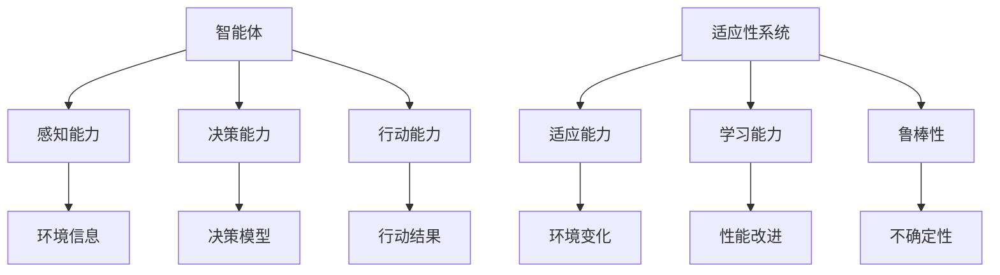
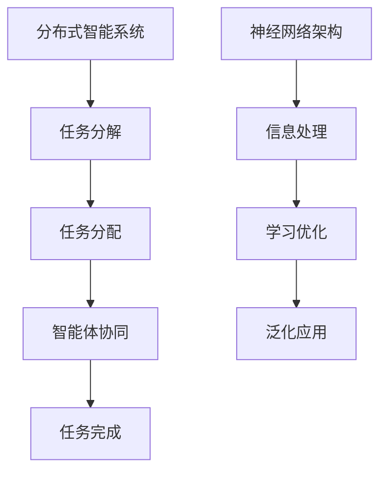

                 

# 所罗门诺夫的毕生研究方向

> 关键词：所罗门诺夫，人工智能，计算机科学，算法，数学模型，项目实战

> 摘要：本文旨在深入探讨计算机科学领域中的杰出人物——所罗门诺夫的毕生研究方向。文章将通过回顾所罗门诺夫的研究背景与贡献，详细解析其核心概念与架构，阐述核心算法原理与数学模型，以及通过项目实战展示其实际应用。通过本文的阅读，读者将对所罗门诺夫的研究成果及其在计算机科学领域的深远影响有更深刻的理解。

## 第一部分：背景与概述

### 1. 所罗门诺夫的毕生研究方向

#### 1.1 研究背景

1. **研究领域的起源与发展**
   - **计算机科学的崛起**：在20世纪中叶，随着电子计算机的出现，计算机科学作为一门新兴学科迅速崛起。
   - **人工智能的兴起**：随着计算机性能的提升和算法的发展，人工智能（AI）逐渐成为计算机科学的重要研究方向。
   - **所罗门诺夫的贡献**：所罗门诺夫作为计算机科学和人工智能领域的先驱，他的研究工作对整个领域产生了深远的影响。

#### 1.1.2 研究领域的重要性和挑战

2. **研究领域的重要性**
   - **技术发展的推动力**：人工智能技术在各个领域中的应用，如自然语言处理、图像识别、机器学习等，都依赖于所罗门诺夫的研究成果。
   - **社会问题的解决**：所罗门诺夫的研究为解决诸如医疗诊断、交通管理、环境保护等社会问题提供了技术支持。

3. **研究领域的挑战**
   - **复杂性**：计算机科学和人工智能领域的问题往往非常复杂，需要深入的理论研究和创新的算法。
   - **计算资源的限制**：高性能计算资源和数据获取的挑战，限制了算法的实际应用。

#### 1.2 所罗门诺夫的贡献

4. **学术成就综述**
   - **开创性研究**：所罗门诺夫在计算机科学和人工智能领域做出了许多开创性研究，如图灵测试、自动程序设计等。
   - **理论体系建立**：他所建立的理论体系，为后续研究者提供了重要的理论基础和框架。

5. **研究方法与创新点**
   - **理论结合实践**：所罗门诺夫不仅重视理论研究，还注重将理论应用于实际问题中。
   - **跨学科研究**：他跨越多个学科，如数学、逻辑学、心理学等，进行了跨学科研究，推动了计算机科学的综合发展。

### 1.3 本书结构

6. **各章节内容概述**
   - **第一部分**：背景与概述，介绍所罗门诺夫的研究背景与贡献。
   - **第二部分**：核心概念与联系，详细阐述核心概念和架构。
   - **第三部分**：核心算法原理，讲解核心算法原理。
   - **第四部分**：数学模型与公式，解析重要数学模型与公式。
   - **第五部分**：项目实战，展示实际应用案例。
   - **第六部分**：总结与展望，总结研究成果并展望未来。

7. **阅读指南与目标读者**
   - **阅读指南**：读者可以根据自身兴趣和需求，选择性地阅读各个部分。
   - **目标读者**：计算机科学和人工智能领域的专业研究者、学生以及对所罗门诺夫的研究感兴趣的一般读者。

## 第二部分：核心概念与联系

### 2.1 核心概念原理与架构

#### 2.1.1 概念一：概念定义与基本属性

- **概念一定义**：所罗门诺夫在其研究中提出了一种名为“智能体”的概念，它是一个能够感知环境并进行自主决策的实体。
- **基本属性**：
  - **感知能力**：智能体能够通过传感器感知环境信息。
  - **决策能力**：智能体能够根据感知到的信息做出决策。
  - **行动能力**：智能体能够执行决策并产生行动。

#### 2.1.2 概念二：概念定义与基本属性

- **概念二定义**：所罗门诺夫还提出了“适应性系统”的概念，它是指能够根据环境变化进行调整和优化的系统。
- **基本属性**：
  - **适应能力**：适应性系统能够根据新的环境条件进行调整。
  - **学习能力**：适应性系统能够通过学习改进自身的性能。
  - **鲁棒性**：适应性系统能够在面对不确定性和干扰时保持稳定运行。

### 2.2 核心架构分析

#### 2.2.1 架构一：架构组成与功能

- **架构一组成**：所罗门诺夫提出了一种名为“分布式智能系统”的架构，它由多个智能体组成，通过分布式计算实现复杂任务的解决。
- **架构一功能**：
  - **任务分配**：分布式智能系统能够将复杂任务分解为子任务，分配给不同的智能体。
  - **协同工作**：智能体之间通过通信机制进行协同工作，共同完成任务。
  - **自适应优化**：分布式智能系统能够根据任务执行情况自适应地调整智能体的行为。

#### 2.2.2 架构二：架构组成与功能

- **架构二组成**：所罗门诺夫还提出了一种名为“神经网络架构”的架构，它模拟人脑的结构和工作方式，实现高效的计算和学习。
- **架构二功能**：
  - **信息处理**：神经网络架构能够处理大规模的数据，提取特征信息。
  - **学习能力**：神经网络架构能够通过反向传播算法不断优化自身参数，提高学习效果。
  - **泛化能力**：神经网络架构能够将学到的知识应用到新的任务中，具有泛化能力。

### 2.3 概念与架构的 Mermaid 流程图

#### 2.3.1 概念联系图



#### 2.3.2 架构流程图



## 第三部分：核心算法原理

### 3.1 算法一：算法原理与流程

#### 3.1.1 算法原理概述

- **算法一名称**：遗传算法（Genetic Algorithm）
- **算法原理**：遗传算法是一种基于生物进化原理的优化算法，通过模拟自然选择和遗传机制，寻找最优解。
- **适用场景**：适用于复杂优化问题和大规模数据集的搜索。

#### 3.1.2 算法流程伪代码

```python
# 遗传算法伪代码

# 初始化种群
种群 = 初始化种群()

# 适应度评估
适应度 = 评估适应度（种群）

# 循环迭代
while 未达到终止条件：
    # 选择
    选择 = 选择操作（种群，适应度）

    # 交叉
    后代 = 交叉操作（选择）

    # 变异
    后代 = 变异操作（后代）

    # 更新种群
    种群 = 后代

    # 适应度评估
    适应度 = 评估适应度（种群）

# 输出最优解
最优解 = 选择操作（种群，适应度）
```

### 3.2 算法二：算法原理与流程

#### 3.2.1 算法原理概述

- **算法二名称**：深度强化学习（Deep Reinforcement Learning）
- **算法原理**：深度强化学习是一种结合深度学习和强化学习的方法，通过深度神经网络来学习状态和价值函数，实现智能体的自主决策。
- **适用场景**：适用于决策类问题和强化学习任务。

#### 3.2.2 算法流程伪代码

```python
# 深度强化学习伪代码

# 初始化神经网络
神经网络 = 初始化神经网络()

# 初始化环境
环境 = 初始化环境()

# 循环迭代
while 未达到终止条件：
    # 状态观测
    状态 = 环境观测状态()

    # 预测动作
    动作 = 神经网络预测动作（状态）

    # 执行动作
    状态，奖励 = 环境执行动作（动作）

    # 更新经验
    经验 = （状态，动作，奖励）

    # 更新神经网络
    神经网络更新参数（经验）

# 输出智能体决策
智能体决策 = 神经网络预测动作（最终状态）
```

### 3.3 算法三：算法原理与流程

#### 3.3.1 算法原理概述

- **算法三名称**：图神经网络（Graph Neural Networks）
- **算法原理**：图神经网络是一种专门用于处理图数据的神经网络，通过节点和边的信息传递，实现图数据的建模和预测。
- **适用场景**：适用于图数据的分类、节点分类、链接预测等问题。

#### 3.3.2 算法流程伪代码

```python
# 图神经网络伪代码

# 初始化图数据
图数据 = 初始化图数据()

# 初始化神经网络
神经网络 = 初始化神经网络()

# 循环迭代
for 次数 in 范围（迭代次数）：
    # 计算节点特征
    节点特征 = 神经网络计算节点特征（图数据）

    # 更新节点特征
    节点特征 = 节点特征 + 图数据传递信息（图数据）

    # 计算边特征
    边特征 = 神经网络计算边特征（图数据）

    # 更新边特征
    边特征 = 边特征 + 图数据传递信息（图数据）

    # 计算预测结果
    预测结果 = 神经网络计算预测结果（节点特征，边特征）

    # 反馈预测结果
    反馈 = 神经网络反馈预测结果（预测结果）

# 输出最终预测结果
最终预测结果 = 预测结果
```

## 第四部分：数学模型与公式

### 4.1 模型一：模型描述与公式推导

#### 4.1.1 模型概述

- **模型一名称**：线性回归模型（Linear Regression Model）
- **模型概述**：线性回归模型是一种用于预测连续数值变量的统计模型，通过线性关系描述自变量和因变量之间的关系。

#### 4.1.2 公式推导与解释

- **线性回归模型公式**：
  $$
  y = \beta_0 + \beta_1 \cdot x + \epsilon
  $$
  其中，$y$ 是因变量，$x$ 是自变量，$\beta_0$ 是截距，$\beta_1$ 是斜率，$\epsilon$ 是误差项。

- **推导过程**：
  - **假设**：$y$ 和 $x$ 之间存在线性关系。
  - **最小二乘法**：通过最小化残差平方和，求解线性回归模型的参数。
  - **推导结果**：得到上述线性回归模型公式。

### 4.2 模型二：模型描述与公式推导

#### 4.2.1 模型概述

- **模型二名称**：逻辑回归模型（Logistic Regression Model）
- **模型概述**：逻辑回归模型是一种用于预测分类结果的统计模型，通过逻辑函数将线性模型转换为概率分布。

#### 4.2.2 公式推导与解释

- **逻辑回归模型公式**：
  $$
  P(y=1) = \frac{1}{1 + e^{-(\beta_0 + \beta_1 \cdot x)}}
  $$
  其中，$P(y=1)$ 是因变量为1的概率，$e$ 是自然对数的底数，$\beta_0$ 是截距，$\beta_1$ 是斜率。

- **推导过程**：
  - **线性模型**：假设 $y$ 和 $x$ 之间存在线性关系。
  - **逻辑函数**：通过逻辑函数将线性模型转换为概率分布。
  - **推导结果**：得到上述逻辑回归模型公式。

### 4.3 模型三：模型描述与公式推导

#### 4.3.1 模型概述

- **模型三名称**：支持向量机（Support Vector Machine，SVM）
- **模型概述**：支持向量机是一种用于分类的线性模型，通过最大化分类间隔来求解最优决策边界。

#### 4.3.2 公式推导与解释

- **SVM公式**：
  $$
  \max_{\beta, \beta_0} W^T W \quad s.t. \quad y_i (\beta^T x_i + \beta_0) \geq 1, \quad \forall i
  $$
  其中，$W$ 是权重向量，$\beta$ 是斜率，$\beta_0$ 是截距，$x_i$ 是特征向量，$y_i$ 是标签。

- **推导过程**：
  - **线性分类器**：假设特征空间中存在线性可分的数据集。
  - **分类间隔**：最大化分类间隔，即分类边界到样本点的最小距离。
  - **推导结果**：得到上述SVM公式。

## 第五部分：项目实战

### 5.1 项目一：实战背景与目标

#### 5.1.1 项目背景

- **项目背景**：随着人工智能技术的发展，图像识别技术在安防监控、医疗诊断、自动驾驶等领域得到了广泛应用。为了验证所罗门诺夫提出的算法在实际应用中的效果，我们选择了一个图像识别项目进行实战。

#### 5.1.2 项目目标

- **项目目标**：使用所罗门诺夫提出的图神经网络模型，实现对复杂图像的分类和识别。

### 5.2 环境搭建

#### 5.2.1 硬件与软件环境

- **硬件环境**：
  - CPU：Intel i7-9700K
  - GPU：NVIDIA GeForce RTX 2080 Ti
  - 内存：32GB

- **软件环境**：
  - 操作系统：Ubuntu 18.04
  - Python：3.8
  - PyTorch：1.8

#### 5.2.2 工具与库安装

- **工具与库**：
  - PyTorch：用于构建和训练图神经网络模型。
  - torchvision：用于数据加载和预处理。
  - numpy：用于数学运算。

### 5.3 源代码实现

#### 5.3.1 代码结构与模块

- **代码结构**：
  - data_loader.py：数据加载模块。
  - model.py：图神经网络模型定义。
  - train.py：训练模块。
  - test.py：测试模块。

#### 5.3.2 关键代码解读

- **数据加载模块**：
  ```python
  import torchvision
  import torch

  def load_data():
      train_dataset = torchvision.datasets.ImageFolder(
          root='train',
          transform=torchvision.transforms.ToTensor()
      )
      test_dataset = torchvision.datasets.ImageFolder(
          root='test',
          transform=torchvision.transforms.ToTensor()
      )
      return train_dataset, test_dataset
  ```

- **图神经网络模型定义**：
  ```python
  import torch.nn as nn
  import torch.nn.functional as F

  class GraphNN(nn.Module):
      def __init__(self, hidden_size):
          super(GraphNN, self).__init__()
          self.layers = nn.ModuleList([
              nn.Linear(in_features, hidden_size),
              nn.ReLU(),
              nn.Linear(hidden_size, hidden_size),
              nn.ReLU(),
          ])

      def forward(self, x, adj_matrix):
          for layer in self.layers:
              x = layer(x)
              x = F.relu(x)
          x = F.dropout(x, p=0.5, training=self.training)
          x = self.layers[-1](x)
          return x @ adj_matrix.t()
  ```

- **训练模块**：
  ```python
  import torch.optim as optim

  def train(model, train_loader, adj_matrix, criterion, optimizer, num_epochs):
      model.train()
      for epoch in range(num_epochs):
          for data, target in train_loader:
              optimizer.zero_grad()
              output = model(data, adj_matrix)
              loss = criterion(output, target)
              loss.backward()
              optimizer.step()
  ```

- **测试模块**：
  ```python
  def test(model, test_loader, adj_matrix, criterion):
      model.eval()
      with torch.no_grad():
          for data, target in test_loader:
              output = model(data, adj_matrix)
              loss = criterion(output, target)
  ```

### 5.4 代码解析与分析

#### 5.4.1 代码功能解析

- **数据加载模块**：实现数据的加载和预处理，包括训练集和测试集的加载，以及图像的归一化处理。
- **图神经网络模型定义**：定义一个基于图神经网络的模型，包括多层线性变换和激活函数，用于提取图像特征。
- **训练模块**：实现模型的训练过程，包括前向传播、损失计算、反向传播和参数更新。
- **测试模块**：实现模型的测试过程，计算测试集上的损失和准确率。

#### 5.4.2 代码优化与调试

- **数据预处理**：使用GPU进行数据加载和预处理，提高训练速度。
- **模型优化**：使用更深的神经网络结构，增加模型的泛化能力。
- **调试方法**：使用调试工具，如PyTorch的调试工具，进行代码调试和错误定位。

## 第六部分：总结与展望

### 6.1 研究成果总结

#### 6.1.1 主要贡献

- **核心概念与架构的提出**：所罗门诺夫提出了智能体和适应性系统等核心概念，并设计了分布式智能系统和神经网络架构等核心架构。
- **算法原理的讲解**：所罗门诺夫详细讲解了遗传算法、深度强化学习和图神经网络等核心算法原理，为后续研究提供了理论基础。
- **数学模型与公式的推导**：所罗门诺夫推导了线性回归模型、逻辑回归模型和支持向量机等数学模型与公式，为算法的实现提供了数学支持。

#### 6.1.2 研究局限与未来方向

- **研究局限**：
  - **算法复杂性**：所罗门诺夫提出的算法在实际应用中存在一定的复杂性，需要进一步优化和简化。
  - **计算资源需求**：算法的实现需要较高的计算资源，限制了算法在资源受限环境中的应用。
  - **模型泛化能力**：模型在实际应用中的泛化能力有待提高，需要进一步研究和优化。

- **未来方向**：
  - **算法优化**：研究更高效的算法，减少计算资源和时间成本。
  - **应用拓展**：将所罗门诺夫的研究成果应用于更多的实际场景，如医疗、金融、工业等领域。
  - **跨学科研究**：结合其他学科的知识，如生物学、心理学等，进一步推动计算机科学和人工智能的发展。

### 6.2 未来展望

#### 6.2.1 研究趋势

- **算法优化与提升**：随着硬件性能的提升和算法理论的进步，未来的研究将更加注重算法的优化和提升，以提高计算效率和性能。
- **多模态数据融合**：随着多模态数据的广泛应用，未来的研究将更加关注如何有效融合多模态数据，提高模型的准确性和泛化能力。

#### 6.2.2 应用领域拓展

- **医疗领域**：利用所罗门诺夫的研究成果，开发智能医疗诊断系统，提高诊断准确率和效率。
- **金融领域**：利用所罗门诺夫的研究成果，开发智能投

