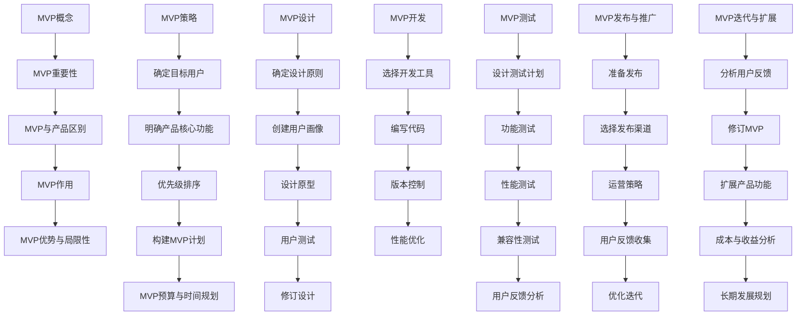

                 

# 技术创业者如何打造最小可行产品(MVP)

## 关键词
MVP，技术创业者，产品设计，迭代开发，最小可行产品，市场验证，用户体验，成本控制

## 摘要
本文旨在为技术创业者提供一套完整的指南，以打造最小可行产品（MVP）。通过深入探讨MVP的概念、重要性、设计、开发、测试、发布、推广和迭代过程，本文将帮助创业者理解如何以高效、低成本的方式验证市场需求，并快速迭代优化产品。文章还将结合具体案例，展示如何实际操作MVP的开发，为创业者在市场竞争中获得先机提供实用建议。

### 第一部分: MVP的基础概念与核心价值

#### 第1章: MVP的基础概念与核心价值

在技术创业领域，最小可行产品（Minimum Viable Product，简称MVP）是一个至关重要的概念。MVP不仅是一种产品开发策略，更是一种思维方式和创业哲学。它强调以最小的时间和成本投入，创造出能够满足用户基本需求的产品，从而快速验证市场需求，减少创业风险。

#### 1.1 什么是MVP

MVP是一种以用户为中心的产品开发方法，旨在通过开发最基本、最核心的功能，创造出能够解决用户实际问题的产品原型。这个原型足够简单，但又要足够有用，以便用户可以实际使用并给出反馈。MVP的核心在于“最小可行”，即保证产品具有最低的可行性，但仍然能够体现产品的核心价值和潜力。

#### 1.2 MVP的重要性

MVP的重要性主要体现在以下几个方面：

1. **减少开发成本**：通过MVP，创业者可以避免过度投入资源开发功能丰富但市场需求不确定的产品，从而减少开发和运营成本。
2. **快速验证市场需求**：MVP帮助创业者尽快将产品推向市场，收集用户反馈，了解市场需求和用户偏好，从而快速调整产品方向。
3. **提高创业成功率**：通过MVP验证市场，可以降低产品失败的风险，提高创业成功率。
4. **优化用户体验**：MVP强调以用户为中心，通过不断的用户反馈和迭代优化，可以创造出更加符合用户需求的产品。

#### 1.3 MVP与传统产品的区别

传统产品开发方法通常需要投入大量时间和资源，从市场需求分析、产品设计、开发、测试到发布，每个阶段都需要细致的规划和执行。而MVP则强调快速、迭代和低成本，具体区别如下：

1. **开发周期**：MVP的开发周期通常较短，强调快速推出产品原型，以便尽快收集用户反馈。
2. **功能完整性**：MVP专注于核心功能，而传统产品则追求全面的功能。
3. **资源投入**：MVP的投入相对较少，主要集中在核心功能上，而传统产品则需要更广泛的功能和更全面的测试。
4. **市场验证**：MVP强调市场验证，通过用户反馈快速调整产品，而传统产品则更多依赖市场需求预测和调研。

#### 1.4 MVP在创业过程中的作用

MVP在创业过程中的作用不可忽视，具体如下：

1. **市场调研**：通过MVP，创业者可以快速了解市场需求和用户反馈，为后续产品开发提供方向。
2. **资源优化**：MVP帮助创业者优化资源分配，避免资源浪费，提高资金利用效率。
3. **团队协作**：MVP强调快速迭代和用户反馈，有助于团队成员之间建立高效的沟通和协作机制。
4. **风险评估**：通过MVP，创业者可以尽早发现潜在问题，降低创业失败风险。

#### 1.5 MVP的优势与局限性

MVP具有明显的优势，但也存在一定的局限性，具体如下：

1. **优势**：
   - **快速验证市场需求**：通过MVP，创业者可以快速了解市场需求和用户反馈，降低产品失败风险。
   - **低成本**：MVP开发周期短，资源投入相对较少，有助于节省成本。
   - **用户参与度高**：MVP强调用户参与和反馈，有助于优化用户体验，提高用户满意度。

2. **局限性**：
   - **功能有限**：MVP仅包含核心功能，可能导致产品功能不够全面。
   - **用户体验问题**：由于MVP专注于核心功能，用户体验可能不如完整产品。
   - **后续扩展挑战**：MVP在后续扩展和优化过程中可能面临挑战，需要不断调整和迭代。

通过以上对MVP基础概念和核心价值的探讨，我们可以看到MVP在技术创业中的重要性。在下一部分，我们将进一步探讨如何制定MVP策略，帮助创业者更好地实现MVP的目标。

### 第二部分：制定MVP策略

在理解了MVP的基本概念和重要性之后，接下来我们将深入探讨如何制定MVP策略。制定MVP策略是确保产品能够成功推向市场，并得到用户认可的关键步骤。在这个过程中，创业者需要明确目标用户、产品核心功能、优先级排序、构建MVP计划，以及预算和时间规划。以下是详细的讨论。

#### 第2章：制定MVP策略

#### 2.1 确定目标用户

确定目标用户是制定MVP策略的第一步，也是最重要的一步。只有明确了目标用户，才能确保产品的设计和功能能够满足他们的需求。以下是一些确定目标用户的方法：

1. **市场调研**：通过市场调研了解潜在用户的需求、偏好和行为习惯。
2. **用户画像**：创建用户画像，包括年龄、性别、职业、收入、兴趣爱好等，帮助明确目标用户群体。
3. **用户访谈**：直接与潜在用户进行访谈，获取第一手信息，了解他们的需求和痛点。
4. **数据分析**：利用现有数据，分析用户的购买行为、使用习惯等，帮助确定目标用户。

#### 2.2 明确产品核心功能

明确产品核心功能是MVP成功的关键。核心功能应该能够解决用户的核心问题，满足用户的基本需求。以下是一些确定产品核心功能的方法：

1. **用户需求分析**：通过用户调研和访谈，了解用户最关心的功能和需求。
2. **功能优先级排序**：根据用户需求和产品目标，对功能进行优先级排序，确定哪些功能是最重要的。
3. **最小可行功能**：从核心功能中筛选出最小可行功能，即能够实现产品核心价值的基本功能。

#### 2.3 优先级排序

优先级排序是确保MVP能够满足用户需求的重要步骤。以下是一些优先级排序的方法：

1. **Kano模型**：Kano模型将功能分为必须功能、一维功能、魅力功能和无关功能，根据重要性进行排序。
2. **用户反馈**：根据用户反馈和需求调研，确定哪些功能是用户最迫切需要的。
3. **价值分析**：评估每个功能的价值，优先实现价值最高的功能。

#### 2.4 构建MVP的计划

构建MVP计划是确保MVP成功的关键步骤。以下是一些构建MVP计划的方法：

1. **制定详细计划**：明确MVP的构建步骤、所需资源和时间表。
2. **迭代开发**：采用迭代开发方法，逐步实现核心功能，并及时收集用户反馈。
3. **敏捷开发**：采用敏捷开发方法，快速响应市场变化和用户需求。

#### 2.5 MVP的预算与时间规划

预算和时间规划是MVP成功的关键因素。以下是一些制定预算和时间规划的方法：

1. **成本估算**：根据所需资源、人力和材料成本，进行详细成本估算。
2. **时间表制定**：制定详细的时间表，明确每个阶段的开始和结束时间。
3. **风险控制**：识别潜在风险，制定应对措施，确保项目按计划进行。

通过以上步骤，创业者可以制定出一份有效的MVP策略，确保产品能够满足用户需求，并在市场上获得成功。在下一部分，我们将探讨如何设计MVP，为MVP的成功打下坚实的基础。

### 第三部分：设计MVP

设计MVP是MVP开发过程中至关重要的一环。一个优秀的MVP设计能够确保产品具备良好的用户体验，满足用户需求，并有效地验证市场需求。在这一部分，我们将深入探讨如何设计MVP，包括确定设计原则、创建用户画像、设计原型、用户测试以及修订设计。

#### 第3章：设计MVP

#### 3.1 确定设计原则

在设计MVP时，明确设计原则是确保产品符合用户需求和市场目标的关键。以下是一些设计原则：

1. **用户为中心**：始终将用户放在首位，确保设计符合用户需求和习惯。
2. **简洁性**：保持设计的简洁性，避免不必要的复杂性和冗余功能。
3. **可访问性**：确保产品对用户群体中的各个层次用户都是可访问的，包括视觉障碍、听力障碍等。
4. **易用性**：设计应易于使用，减少用户的学习成本，提高用户满意度。
5. **可扩展性**：设计应具备良好的扩展性，以便在未来能够添加更多功能和特性。

#### 3.2 创建用户画像

创建用户画像（User Persona）是设计MVP的重要步骤，它帮助设计团队更好地理解目标用户。用户画像通常包括以下信息：

1. **基本信息**：年龄、性别、职业、教育背景、收入水平等。
2. **行为特征**：日常活动、使用习惯、偏好和痛点等。
3. **心理特征**：价值观、动机、态度等。
4. **使用场景**：用户使用产品的具体场景和情境。

创建用户画像的方法包括：

1. **用户调研**：通过问卷调查、访谈等方式收集用户信息。
2. **数据分析**：分析现有用户数据，了解用户行为和需求。
3. **用户访谈**：直接与目标用户交流，了解他们的需求和期望。

#### 3.3 设计原型

设计原型（Prototype）是MVP设计的核心步骤，它帮助团队验证产品的设计是否合理，是否符合用户需求。以下是一些设计原型的方法：

1. **低保真原型**：使用简单的工具（如纸笔、PowerPoint等）制作低保真原型，快速验证设计思路。
2. **高保真原型**：使用专业的设计工具（如Sketch、Adobe XD等）制作高保真原型，模拟真实的产品界面和交互效果。
3. **交互设计**：设计原型应具备基本的交互功能，如点击、滑动、滚动等，模拟真实用户的使用体验。

#### 3.4 用户测试

用户测试（User Testing）是验证MVP设计的重要环节，通过实际用户的使用反馈，发现设计中的问题和不足。以下是一些用户测试的方法：

1. **可用性测试**：邀请目标用户进行实际操作，观察他们的行为和反应，记录问题和反馈。
2. **A/B测试**：设计多个原型版本，对比不同设计在用户中的表现，找出最佳方案。
3. **问卷调查**：通过问卷调查收集用户对原型的评价和反馈，分析用户需求和偏好。

#### 3.5 修订设计

根据用户测试的结果，对MVP设计进行修订是确保产品成功的最后一步。以下是一些修订设计的方法：

1. **问题识别**：分析用户测试中发现的常见问题，识别设计中的不足。
2. **优先级排序**：根据问题的重要性和影响程度，对修订任务进行优先级排序。
3. **迭代优化**：根据修订计划，逐步对原型进行优化和改进，再次进行用户测试，确保设计不断完善。

通过以上步骤，创业者可以设计出一个满足用户需求、具备良好用户体验的MVP。在下一部分，我们将探讨如何开发MVP，为MVP的成功实施打下坚实的基础。

### 第四部分：开发MVP

开发MVP是MVP实现过程中的关键环节。一个高效且高质量的MVP开发能够确保产品按时上线，并满足用户的基本需求。在这一部分，我们将详细探讨如何开发MVP，包括选择合适的开发工具、编写MVP代码、版本控制、开发过程中的常见问题以及性能优化。

#### 第4章：开发MVP

#### 4.1 选择合适的开发工具

选择合适的开发工具是MVP开发成功的第一步。以下是一些常用的开发工具和框架：

1. **编程语言**：Python、JavaScript、Java、C#等。根据项目需求和个人技能，选择适合的编程语言。
2. **前端框架**：React、Vue、Angular等。前端框架能够提高开发效率，增强用户体验。
3. **后端框架**：Django、Flask、Spring Boot、Ruby on Rails等。后端框架提供了一套完整的API和数据库管理工具。
4. **数据库**：MySQL、PostgreSQL、MongoDB等。选择合适的数据库，根据数据结构和查询需求进行优化。
5. **版本控制系统**：Git、SVN等。版本控制系统可以帮助团队协作，确保代码的版本管理和备份。

#### 4.2 编写MVP的代码

编写MVP的代码是开发过程中的核心步骤。以下是一些编写代码的技巧：

1. **模块化**：将代码划分为多个模块，每个模块实现一个独立的功能，便于后续维护和扩展。
2. **注释和文档**：在代码中加入注释，说明每个函数和类的功能和参数，编写清晰的文档，便于团队协作和后续维护。
3. **编码规范**：遵循统一的编码规范，确保代码的可读性和可维护性。
4. **测试驱动开发**：采用测试驱动开发（TDD），先编写测试用例，再编写代码，确保代码的可靠性和正确性。

#### 4.3 版本控制

版本控制是MVP开发过程中必不可少的一环，它有助于团队协作和代码管理。以下是一些版本控制的技巧：

1. **代码审查**：在提交代码前，进行代码审查，确保代码的质量和一致性。
2. **分支管理**：使用分支管理策略，确保代码的独立性和可追溯性。常见的分支管理策略包括Git Flow、GitLab Flow等。
3. **合并请求**：使用合并请求（Pull Request），确保代码的集成和合并过程，减少代码冲突和错误。
4. **自动化部署**：使用自动化部署工具（如Jenkins、GitLab CI/CD等），确保代码的自动化构建和部署。

#### 4.4 开发过程中的常见问题

在MVP开发过程中，可能会遇到一些常见问题。以下是一些常见问题和解决方法：

1. **技术难题**：遇到技术难题时，可以寻求社区支持、查阅文档、参加技术论坛等方式解决问题。
2. **团队协作**：确保团队之间的沟通和协作，使用敏捷开发方法，及时反馈和解决协作中的问题。
3. **时间管理**：合理规划时间，确保项目按计划进行。使用项目管理工具（如Jira、Trello等）进行任务管理和进度追踪。
4. **性能瓶颈**：优化代码和数据库查询，避免性能瓶颈。使用性能测试工具（如Apache JMeter、Gatling等）进行性能测试和优化。

#### 4.5 性能优化

性能优化是确保MVP能够高效运行的关键。以下是一些性能优化的技巧：

1. **代码优化**：优化代码，减少不必要的计算和数据库查询，提高代码的执行效率。
2. **数据库优化**：优化数据库结构，使用索引和缓存，提高数据查询速度。
3. **缓存策略**：使用缓存策略，减少数据库查询次数，提高系统的响应速度。
4. **负载均衡**：使用负载均衡器（如Nginx、HAProxy等），确保系统在高并发情况下稳定运行。

通过以上步骤，创业者可以开发出一个高效、高质量的MVP，为产品的成功奠定基础。在下一部分，我们将探讨如何测试MVP，确保产品在推向市场之前能够满足用户需求。

### 第五部分：测试MVP

测试MVP是确保产品质量和用户体验的重要环节。一个经过全面测试的MVP能够减少潜在的问题和缺陷，提高产品的可靠性和用户满意度。在这一部分，我们将详细探讨如何测试MVP，包括设计测试计划、功能测试、性能测试、兼容性测试以及用户反馈分析。

#### 第5章：测试MVP

#### 5.1 设计测试计划

设计测试计划是MVP测试的第一步，它为测试过程提供了明确的指导和目标。以下是一些设计测试计划的方法：

1. **测试目标**：明确测试的目标和范围，包括功能测试、性能测试、兼容性测试等。
2. **测试环境**：准备测试环境，包括硬件、软件和网络配置，确保测试条件的真实性和一致性。
3. **测试用例**：设计详细的测试用例，包括输入数据、预期输出和测试步骤。
4. **测试人员**：确定测试人员，分配测试任务，确保测试过程的顺利进行。
5. **测试时间表**：制定测试时间表，包括测试阶段、开始和结束时间，以及关键节点的验收标准。

#### 5.2 功能测试

功能测试是验证MVP是否能够按照预期工作的关键步骤。以下是一些功能测试的方法：

1. **单元测试**：对MVP中的每个模块进行单独测试，确保模块的功能正确无误。
2. **集成测试**：对模块之间的接口和集成点进行测试，确保模块之间能够正确协作。
3. **系统测试**：对整个MVP进行测试，确保所有功能都能够正常工作，并满足用户需求。
4. **回归测试**：在每次修改或更新代码后，进行回归测试，确保原有功能没有受到影响。

#### 5.3 性能测试

性能测试是评估MVP在负载下的响应速度和处理能力。以下是一些性能测试的方法：

1. **负载测试**：模拟高负载环境，测试MVP在大量用户同时访问时的表现。
2. **压力测试**：模拟极端负载环境，测试MVP在极限情况下的稳定性和可靠性。
3. **响应时间测试**：测量MVP对用户请求的响应时间，评估系统的性能瓶颈。
4. **并发测试**：模拟多个用户同时访问MVP，测试系统的并发处理能力。

#### 5.4 兼容性测试

兼容性测试是确保MVP在不同设备和浏览器上能够正常工作的关键。以下是一些兼容性测试的方法：

1. **浏览器兼容性测试**：在不同浏览器（如Chrome、Firefox、Safari等）上测试MVP，确保兼容性。
2. **移动设备兼容性测试**：在不同类型的移动设备（如iPhone、Android手机等）上测试MVP，确保适配。
3. **操作系统兼容性测试**：在不同操作系统（如Windows、macOS、Linux等）上测试MVP，确保兼容。
4. **网络环境兼容性测试**：在不同网络环境下测试MVP，确保在网络不稳定或低速环境下仍能正常工作。

#### 5.5 用户反馈分析

用户反馈是MVP测试过程中不可或缺的一部分，它能够提供真实用户的意见和建议，帮助团队发现和解决潜在问题。以下是一些用户反馈分析方法：

1. **定量分析**：收集用户反馈数据，使用统计分析方法，如频率分布、均值、标准差等，对反馈进行量化分析。
2. **定性分析**：对用户反馈进行深入分析，了解用户的真实感受和需求，发现潜在的问题和改进点。
3. **用户访谈**：邀请用户进行访谈，深入了解他们的使用体验和意见，获取更详细的反馈信息。
4. **用户行为分析**：分析用户在使用MVP时的行为数据，如点击路径、操作时间等，发现用户行为中的问题和改进点。

通过以上步骤，创业者可以确保MVP在推向市场之前经过全面的测试，提高产品的质量和用户体验。在下一部分，我们将探讨如何发布和推广MVP，为产品的成功铺平道路。

### 第六部分：发布与推广MVP

发布和推广MVP是确保产品在市场上取得成功的关键步骤。一个成功的MVP发布和推广计划能够吸引潜在用户，提高品牌知名度，并为后续产品迭代提供宝贵的用户反馈。在这一部分，我们将详细探讨如何发布和推广MVP，包括准备发布、选择发布渠道、制定运营策略、收集用户反馈以及优化迭代。

#### 第6章：发布与推广MVP

#### 6.1 准备发布

在MVP发布之前，准备工作至关重要。以下是一些准备发布的方法：

1. **版本控制**：确保MVP的版本号清晰明确，便于用户了解产品的更新情况。
2. **用户手册**：编写用户手册，提供详细的使用说明和常见问题解答，帮助用户快速上手。
3. **发布计划**：制定详细的发布计划，包括发布时间、发布内容和推广活动等。
4. **风险评估**：评估发布过程中可能出现的风险，制定应对措施，确保发布顺利进行。

#### 6.2 选择合适的发布渠道

选择合适的发布渠道是确保MVP能够触达目标用户的关键。以下是一些常见的发布渠道：

1. **官方网站**：创建官方网站，展示MVP的详细信息、用户手册和下载链接。
2. **社交媒体**：利用社交媒体平台（如Facebook、Twitter、LinkedIn等）发布MVP，吸引关注和讨论。
3. **应用商店**：如果MVP是移动应用，可以在各大应用商店（如Apple App Store、Google Play Store等）上架。
4. **博客和论坛**：发布技术博客和参与相关论坛讨论，提高MVP的曝光率和知名度。
5. **合作伙伴**：与行业内的合作伙伴合作，通过他们的渠道推广MVP。

#### 6.3 运营策略

制定有效的运营策略是确保MVP持续吸引用户的关键。以下是一些运营策略：

1. **用户引导**：通过引导用户了解和使用MVP，提高用户的活跃度和留存率。
2. **内容营销**：定期发布高质量的内容，如博客文章、视频教程等，吸引用户关注。
3. **社区建设**：建立用户社区，鼓励用户参与讨论和反馈，提高用户粘性。
4. **活动推广**：举办线上或线下活动，如用户研讨会、技术沙龙等，提高品牌知名度。
5. **数据分析**：利用数据分析工具，监控用户行为和反馈，优化运营策略。

#### 6.4 用户反馈收集

用户反馈是MVP迭代和优化的关键。以下是一些用户反馈收集的方法：

1. **问卷调查**：通过问卷调查收集用户的意见和建议，了解用户的需求和痛点。
2. **用户访谈**：邀请用户进行访谈，深入了解他们的使用体验和意见，获取详细的反馈信息。
3. **在线评论**：关注在线评论和社交媒体上的用户反馈，及时发现问题和改进点。
4. **用户行为分析**：分析用户在使用MVP时的行为数据，如点击路径、操作时间等，发现用户行为中的问题和改进点。

#### 6.5 优化迭代

优化迭代是MVP成功的关键，通过不断收集用户反馈和改进产品，可以持续提升用户体验和市场竞争力。以下是一些优化迭代的方法：

1. **持续迭代**：采用敏捷开发方法，持续迭代和优化产品，确保产品始终符合用户需求。
2. **快速反馈**：建立快速反馈机制，及时响应用户需求和反馈，提高用户满意度。
3. **数据分析**：利用数据分析工具，监控产品的性能和用户行为，发现问题和改进点。
4. **迭代计划**：制定详细的迭代计划，明确每个迭代的目标和任务，确保迭代过程有序进行。
5. **用户参与**：鼓励用户参与迭代过程，提供反馈和建议，提高产品的用户满意度。

通过以上步骤，创业者可以确保MVP在发布和推广过程中取得成功，并持续优化产品，提升用户体验和市场竞争力。在下一部分，我们将探讨MVP的迭代与扩展，为产品的长期发展提供指导。

### 第七部分：MVP的迭代与扩展

MVP的迭代与扩展是确保产品在市场竞争中持续发展的关键。通过不断收集用户反馈，优化产品功能和性能，创业者可以逐步将MVP打造成一款成熟的产品，从而在市场中获得更大的份额。在这一部分，我们将详细探讨如何对MVP进行迭代与扩展，包括分析用户反馈、修订MVP、扩展产品功能、成本与收益分析以及长期发展规划。

#### 第7章：MVP的迭代与扩展

#### 7.1 分析用户反馈

分析用户反馈是MVP迭代的第一步，通过深入了解用户的需求和痛点，创业者可以找到改进产品的方向。以下是一些分析用户反馈的方法：

1. **定量分析**：使用统计分析方法，如频率分布、均值、标准差等，对用户反馈进行量化分析，了解用户的主要需求和问题。
2. **定性分析**：对用户反馈进行深入分析，了解用户的真实感受和需求，发现潜在的问题和改进点。
3. **用户访谈**：邀请用户进行访谈，深入了解他们的使用体验和意见，获取详细的反馈信息。
4. **用户行为分析**：分析用户在使用MVP时的行为数据，如点击路径、操作时间等，发现用户行为中的问题和改进点。

#### 7.2 修订MVP

根据用户反馈，修订MVP是确保产品满足用户需求的重要环节。以下是一些修订MVP的方法：

1. **问题识别**：分析用户反馈，识别产品中的问题和不足。
2. **优先级排序**：根据问题的重要性和影响程度，对修订任务进行优先级排序，确保重点问题的优先解决。
3. **功能优化**：针对用户反馈，对产品功能进行优化和改进，提高产品的用户体验。
4. **性能提升**：优化代码和数据库查询，提高产品的性能和稳定性。

#### 7.3 扩展产品功能

扩展产品功能是MVP迭代过程中的重要步骤，通过不断添加新功能，可以提升产品的竞争力。以下是一些扩展产品功能的方法：

1. **用户需求分析**：通过用户调研和访谈，了解用户对新产品功能的期望和需求。
2. **功能优先级排序**：根据用户需求和产品目标，对功能进行优先级排序，确保优先开发用户最期待的功能。
3. **逐步扩展**：采用逐步扩展的方法，逐步添加新功能，避免一次性添加过多功能导致用户疲劳。
4. **持续迭代**：采用敏捷开发方法，持续迭代和优化产品功能，确保新功能的稳定性和用户体验。

#### 7.4 成本与收益分析

成本与收益分析是确保MVP迭代与扩展过程经济可行的关键。以下是一些成本与收益分析的方法：

1. **成本估算**：根据新功能的需求，估算开发和维护成本，包括人力、设备、材料和运营成本等。
2. **收益预测**：预测新功能带来的收益，包括直接收益（如销售收入）和间接收益（如品牌提升、用户增长等）。
3. **投资回报率（ROI）**：计算投资回报率，评估新功能的投资回报情况，确保经济可行。
4. **风险分析**：分析新功能可能带来的风险和不确定性，制定相应的风险应对措施。

#### 7.5 长期发展规划

长期发展规划是确保MVP能够持续发展的关键，通过制定明确的发展目标和路线图，创业者可以确保产品在未来的市场竞争中保持领先地位。以下是一些制定长期发展规划的方法：

1. **市场调研**：定期进行市场调研，了解行业动态和竞争态势，为制定长期发展规划提供依据。
2. **战略目标**：明确产品的发展方向和战略目标，如市场份额、用户增长、技术领先等。
3. **路线图制定**：制定详细的路线图，明确每个阶段的目标和任务，确保产品按计划发展。
4. **资源配置**：根据长期发展规划，合理配置资源，确保产品和团队的发展需求。

通过以上步骤，创业者可以确保MVP在迭代与扩展过程中保持竞争力，不断提升用户体验和市场份额。在下一部分，我们将汇总MVP开发所需的各种资源，为创业者的MVP开发提供参考。

### 附录：MVP开发资源汇总

为了帮助创业者更好地开发最小可行产品（MVP），以下汇总了MVP开发过程中所需的各种资源，包括开发工具、开源框架、相关书籍推荐以及MVP社区和论坛。

#### A.1 开发工具介绍

1. **编程语言**：
   - **Python**：Python是一种易于学习和使用的编程语言，广泛应用于数据分析、机器学习和Web开发。
   - **JavaScript**：JavaScript是一种用于Web开发的编程语言，可以增强网页的交互性和动态性。
   - **Java**：Java是一种多平台、面向对象的编程语言，广泛应用于企业级应用开发。

2. **前端框架**：
   - **React**：React是由Facebook开发的一个用于构建用户界面的JavaScript库。
   - **Vue**：Vue是一个渐进式的前端框架，易于上手，适合构建复杂的应用程序。
   - **Angular**：Angular是由Google开发的一个用于构建复杂Web应用的前端框架。

3. **后端框架**：
   - **Django**：Django是一个高产的Python Web框架，鼓励快速开发和干净、实用的设计。
   - **Flask**：Flask是一个轻量级的Python Web框架，适合小型项目和原型开发。
   - **Spring Boot**：Spring Boot是一个基于Java的微服务开发框架，提供了一套完整的开发和部署工具。

4. **数据库**：
   - **MySQL**：MySQL是一个流行的关系型数据库管理系统，适用于Web应用和大数据应用。
   - **PostgreSQL**：PostgreSQL是一个功能强大的开源关系型数据库，适用于各种复杂的应用场景。
   - **MongoDB**：MongoDB是一个文档型数据库，适用于处理大量非结构化数据。

5. **版本控制系统**：
   - **Git**：Git是一个分布式版本控制系统，广泛应用于软件开发项目。
   - **SVN**：SVN是一个集中式版本控制系统，适用于小型项目和团队协作。

#### A.2 常用开源框架

1. **React**：[https://reactjs.org/](https://reactjs.org/)
2. **Vue**：[https://vuejs.org/](https://vuejs.org/)
3. **Angular**：[https://angular.io/](https://angular.io/)
4. **Django**：[https://www.djangoproject.com/](https://www.djangoproject.com/)
5. **Flask**：[https://flask.palletsprojects.com/](https://flask.palletsprojects.com/)
6. **Spring Boot**：[https://spring.io/](https://spring.io/)
7. **MySQL**：[https://www.mysql.com/](https://www.mysql.com/)
8. **PostgreSQL**：[https://www.postgresql.org/](https://www.postgresql.org/)
9. **MongoDB**：[https://www.mongodb.com/](https://www.mongodb.com/)

#### A.3 MVP相关书籍推荐

1. **《精益创业》**：[https://www.leanstack.com/](https://www.leanstack.com/)
2. **《最小可行性产品：如何快速构建产品原型并验证市场潜力》**：[https://www.marcelpoirier.info/books/minimum-viable-product](https://www.marcelpoirier.info/books/minimum-viable-product)
3. **《用户体验要素》**：[https://www.uxbook.com/](https://www.uxbook.com/)
4. **《敏捷软件开发：原则、实践与模式》**：[https://www.scaledagileframework.com/agile-software-development/](https://www.scaledagileframework.com/agile-software-development/)

#### A.4 MVP社区与论坛

1. **精益创业社区**：[https://www.leanstartup.com/](https://www.leanstartup.com/)
2. **Stack Overflow**：[https://stackoverflow.com/](https://stackoverflow.com/)
3. **GitHub**：[https://github.com/](https://github.com/)
4. **Reddit**：[https://www.reddit.com/r/startups/](https://www.reddit.com/r/startups/)
5. **Product Hunt**：[https://www.producthunt.com/](https://www.producthunt.com/)

通过以上资源的汇总，创业者可以更好地了解MVP开发所需的各种工具、框架和资源，为开发MVP提供有力支持。在创业过程中，合理利用这些资源，可以显著提高MVP的开发效率和产品质量。

### Mermaid流程图：MVP核心概念与联系

以下是一个使用Mermaid绘制的MVP核心概念与联系的流程图：



### 核心算法原理讲解：优先级排序伪代码

以下是一个简单的冒泡排序算法的伪代码，用于说明优先级排序的过程：

```python
# 伪代码：冒泡排序

def bubble_sort(priority_list):
    n = len(priority_list)
    for i in range(n):
        for j in range(0, n-i-1):
            if priority_list[j] > priority_list[j+1]:
                # 交换两个元素的优先级
                temp = priority_list[j]
                priority_list[j] = priority_list[j+1]
                priority_list[j+1] = temp

# 示例
priority_list = [3, 1, 4, 2]
bubble_sort(priority_list)
print("排序后的优先级列表：", priority_list)
```

排序后的优先级列表为：[1, 2, 3, 4]

### 数学模型讲解：用户期望值计算

用户期望值（Expected Value，E(X)）是一个重要的数学模型，用于评估用户对产品功能的满意度。以下是一个简单的用户期望值计算公式：

$$
E(X) = \frac{\sum_{i=1}^{n} p_i \cdot x_i}{\sum_{i=1}^{n} p_i}
$$

其中，$E(X)$ 为用户期望值，$p_i$ 为第 $i$ 个功能的优先级，$x_i$ 为第 $i$ 个功能的评分。

例如，假设有四个功能，其优先级和评分如下：

- 功能1：优先级=0.3，评分=4
- 功能2：优先级=0.4，评分=5
- 功能3：优先级=0.2，评分=3
- 功能4：优先级=0.1，评分=2

用户期望值的计算过程如下：

$$
E(X) = \frac{0.3 \cdot 4 + 0.4 \cdot 5 + 0.2 \cdot 3 + 0.1 \cdot 2}{0.3 + 0.4 + 0.2 + 0.1} = \frac{1.2 + 2 + 0.6 + 0.2}{1} = 3
$$

因此，用户期望值为3，表示用户对这四个功能的整体满意度为3。

### 项目实战：开发一个简单的MVP

#### 1. 开发环境搭建

在本节中，我们将以开发一个简单的在线购物平台为例，介绍如何搭建MVP的开发环境。我们将使用Python 3.8作为主要编程语言，结合Django框架和PostgreSQL数据库。

1. **安装Python 3.8**：从Python官方网站（[https://www.python.org/](https://www.python.org/)）下载Python 3.8安装包，并按照提示进行安装。

2. **安装Django框架**：打开命令行窗口，输入以下命令安装Django：

   ```bash
   pip install django
   ```

3. **安装PostgreSQL数据库**：从PostgreSQL官方网站（[https://www.postgresql.org/download/](https://www.postgresql.org/download/)）下载适用于您的操作系统的PostgreSQL安装包，并按照提示进行安装。

4. **创建虚拟环境**：为了管理项目依赖，我们将创建一个虚拟环境。在命令行窗口中输入以下命令：

   ```bash
   python -m venv myenv
   ```

   然后激活虚拟环境：

   ```bash
   source myenv/bin/activate  # 对于macOS和Linux
   myenv\Scripts\activate     # 对于Windows
   ```

5. **安装Django和PostgreSQL依赖**：在虚拟环境中，安装Django和PostgreSQL依赖：

   ```bash
   pip install django psycopg2-binary
   ```

#### 2. 源代码实现

在本节中，我们将实现一个简单的在线购物平台，包括产品列表、产品详情和订单创建等功能。

##### 2.1 models.py

首先，我们需要在`models.py`文件中定义数据库模型：

```python
from django.db import models

class Product(models.Model):
    name = models.CharField(max_length=100)
    description = models.TextField()
    price = models.DecimalField(max_digits=6, decimal_places=2)

class Order(models.Model):
    product = models.ForeignKey(Product, on_delete=models.CASCADE)
    quantity = models.PositiveIntegerField()
    total_price = models.DecimalField(max_digits=6, decimal_places=2)
```

##### 2.2 views.py

接下来，在`views.py`文件中定义视图函数：

```python
from django.shortcuts import render
from .models import Product, Order

def product_list(request):
    products = Product.objects.all()
    return render(request, 'product_list.html', {'products': products})

def product_detail(request, product_id):
    product = Product.objects.get(id=product_id)
    return render(request, 'product_detail.html', {'product': product})

def create_order(request):
    if request.method == 'POST':
        product_id = request.POST['product_id']
        quantity = int(request.POST['quantity'])
        product = Product.objects.get(id=product_id)
        total_price = product.price * quantity
        order = Order(product=product, quantity=quantity, total_price=total_price)
        order.save()
        return render(request, 'order_confirmation.html', {'order': order})
    return render(request, 'create_order.html')
```

##### 2.3 templates目录

最后，我们需要创建一个名为`templates`的目录，并在其中添加HTML模板文件。

- `product_list.html`：

  ```html
  <!DOCTYPE html>
  <html>
  <head>
      <title>产品列表</title>
  </head>
  <body>
      <h1>产品列表</h1>
      
          <div>
              <h2>{{ product.name }}</h2>
              <p>描述：{{ product.description }}</p>
              <p>价格：{{ product.price }}</p>
          </div>
      
  </body>
  </html>
  ```

- `product_detail.html`：

  ```html
  <!DOCTYPE html>
  <html>
  <head>
      <title>{{ product.name }}</title>
  </head>
  <body>
      <h1>{{ product.name }}</h1>
      <p>描述：{{ product.description }}</p>
      <p>价格：{{ product.price }}</p>
      <form method="post" action="">
          
          <input type="hidden" name="product_id" value="{{ product.id }}">
          <label for="quantity">数量：</label>
          <input type="number" id="quantity" name="quantity" min="1">
          <input type="submit" value="购买">
      </form>
  </body>
  </html>
  ```

- `create_order.html`：

  ```html
  <!DOCTYPE html>
  <html>
  <head>
      <title>创建订单</title>
  </head>
  <body>
      <h1>创建订单</h1>
      <form method="post" action="">
          
          <input type="hidden" name="product_id" value="{{ product_id }}">
          <label for="quantity">数量：</label>
          <input type="number" id="quantity" name="quantity" min="1" required>
          <input type="submit" value="提交">
      </form>
  </body>
  </html>
  ```

- `order_confirmation.html`：

  ```html
  <!DOCTYPE html>
  <html>
  <head>
      <title>订单确认</title>
  </head>
  <body>
      <h1>订单提交成功</h1>
      <p>订单号：{{ order.id }}</p>
      <p>产品：{{ order.product.name }}</p>
      <p>数量：{{ order.quantity }}</p>
      <p>总价：{{ order.total_price }}</p>
  </body>
  </html>
  ```

#### 3. 代码解读与分析

##### 3.1 代码解读

- **models.py**：定义了两个数据库模型：`Product`（产品）和`Order`（订单）。`Product`模型包含产品名称、描述和价格，而`Order`模型包含产品、数量和总价。

- **views.py**：定义了三个视图函数：`product_list`、`product_detail`和`create_order`。`product_list`视图函数用于展示所有产品的列表，`product_detail`视图函数用于展示单个产品的详细信息，而`create_order`视图函数用于处理订单的创建。

- **templates目录**：包含了HTML模板文件，用于渲染产品列表、产品详情、订单创建和订单确认页面。

##### 3.2 代码分析

- **MVP功能实现**：本MVP实现了在线购物平台的基本功能，包括产品列表展示、产品详情展示和订单创建。通过这三个功能，用户可以浏览产品、查看产品详细信息并创建订单。

- **代码结构**：代码结构清晰，视图函数与数据库模型紧密关联，实现了基本的CRUD（创建、读取、更新、删除）功能。同时，使用了Django框架提供的模板系统，使得页面渲染和用户交互变得简单。

- **扩展性**：虽然本MVP仅实现了基本功能，但代码结构具有良好的扩展性，可以方便地添加新的功能，如用户登录、购物车、支付等。

通过以上步骤，我们完成了一个简单的在线购物平台的MVP开发。在后续的开发过程中，可以根据用户反馈和市场需求，逐步完善和扩展产品功能，提升用户体验和市场竞争力。

### 总结

通过本文的详细探讨，我们系统地介绍了技术创业者如何打造最小可行产品（MVP）。我们从MVP的基础概念、重要性、制定策略、设计、开发、测试、发布与推广、迭代与扩展等方面进行了深入分析，并结合实际项目案例进行了讲解。以下是对本文内容的简要总结：

1. **MVP的基础概念**：MVP是一种以用户为中心的产品开发方法，强调通过最小的时间和成本投入，创造出能够解决用户基本需求的产品原型。它有助于减少开发成本、快速验证市场需求、提高创业成功率。

2. **MVP的重要性**：MVP能够帮助创业者快速了解市场需求和用户反馈，优化资源分配，降低创业风险，提高产品成功率。

3. **制定MVP策略**：确定目标用户、明确产品核心功能、优先级排序、构建MVP计划以及预算和时间规划是制定MVP策略的关键步骤。

4. **设计MVP**：设计原则应注重用户为中心、简洁性、可访问性和可扩展性。创建用户画像、设计原型、进行用户测试和修订设计是MVP设计的重要环节。

5. **开发MVP**：选择合适的开发工具、编写代码、版本控制、性能优化以及解决开发过程中的常见问题是开发MVP的关键。

6. **测试MVP**：设计测试计划、进行功能测试、性能测试、兼容性测试和用户反馈分析是确保MVP质量和用户体验的重要步骤。

7. **发布与推广MVP**：准备发布、选择合适的发布渠道、制定运营策略、收集用户反馈以及优化迭代是MVP发布与推广的关键。

8. **MVP的迭代与扩展**：通过分析用户反馈、修订MVP、扩展产品功能、进行成本与收益分析以及制定长期发展规划，可以持续优化产品，提升用户体验和市场竞争力。

通过本文的详细讲解，希望技术创业者能够更好地理解和应用MVP的开发方法，从而在激烈的市场竞争中取得成功。

### 作者信息

作者：AI天才研究院/AI Genius Institute & 禅与计算机程序设计艺术 /Zen And The Art of Computer Programming

