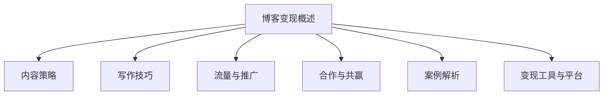
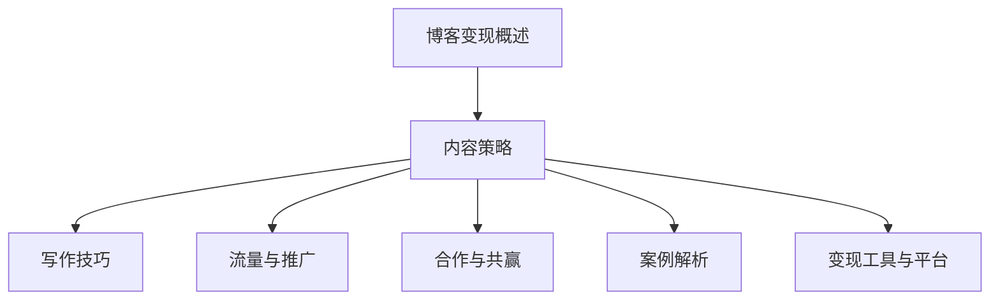

                 

# 技术博客变现：策略与方法

> **关键词：** 博客变现、内容策略、写作技巧、流量推广、合作共赢、变现工具、成功案例分析

> **摘要：** 本文旨在探讨技术博客变现的路径和方法，包括内容策略、写作技巧、流量推广、合作共赢以及变现工具的运用。通过深入分析，旨在帮助技术创作者找到适合自己的变现模式，实现博客价值的最大化。

## 目录大纲

### 第一部分：博客变现概述
- **第1章：博客变现的背景与意义**
  - 1.1 博客变现的兴起与趋势
  - 1.2 博客变现对技术人的影响
  - 1.3 博客变现的市场机会分析
  - 1.4 博客变现的核心原则

### 第二部分：内容策略
- **第2章：内容定位与市场调研**
  - 2.1 内容定位的重要性
  - 2.2 如何进行市场调研
  - 2.3 竞争对手分析
  - 2.4 内容方向确定

### 第三部分：写作技巧
- **第3章：写作风格与用户需求**
  - 3.1 写作风格对变现的影响
  - 3.2 如何把握用户需求
  - 3.3 提升写作效率的方法
  - 3.4 常见写作误区及避免

### 第四部分：流量与推广
- **第4章：社交媒体运用**
  - 4.1 社交媒体在变现中的作用
  - 4.2 主流社交媒体平台介绍
  - 4.3 社交媒体运营策略
  - 4.4 社交媒体数据监控与分析

### 第五部分：合作与共赢
- **第5章：广告与赞助**
  - 5.1 广告变现的原理与方法
  - 5.2 赞助合作的形式与策略
  - 5.3 如何评估合作效果
  - 5.4 广告与赞助的风险管理

### 第六部分：案例解析
- **第6章：成功博客案例分析**
  - 6.1 案例一：技术博客变现实例
  - 6.2 案例二：不同领域的变现策略
  - 6.3 案例三：博客变现的挑战与解决方案

### 第七部分：变现工具与平台
- **第7章：变现工具与应用**
  - 7.1 广告平台介绍
  - 7.2 自有产品的开发与销售
  - 7.3 线上教育平台的运用
  - 7.4 博客变现的其他工具

### 附录
- **附录：常见问题解答**
  - A.1 博客变现常见问题
  - A.2 变现过程中的法律风险
  - A.3 博客变现数据指标解读
  - A.4 变现技巧与策略持续更新指南

### 附录二：Mermaid 流程图

### 引言

在数字化时代，博客已成为知识传播和分享的重要渠道。对于技术创作者而言，博客不仅是展示个人技术实力和影响力的平台，更是实现价值变现的有效途径。然而，如何有效地进行博客变现，仍然是一个复杂且具有挑战性的问题。

本文旨在通过对博客变现的深入探讨，帮助技术创作者了解博客变现的背景与意义，掌握内容策略、写作技巧、流量推广、合作共赢以及变现工具的运用，从而找到适合自己的变现模式，实现博客价值的最大化。

### 第一部分：博客变现概述

#### 第1章：博客变现的背景与意义

随着互联网的普及和社交媒体的兴起，博客已经成为知识传播和分享的重要载体。技术创作者通过博客分享专业知识和经验，不仅能够提升个人影响力，还可以通过博客变现实现经济效益。

##### 1.1 博客变现的兴起与趋势

博客变现的兴起，源于网络广告的爆发式增长和内容付费的兴起。在过去，博客主要以广告收入为主，但随着内容的细分和用户需求的多样，博客变现的形式和渠道也日益丰富。

当前，博客变现的趋势表现为：

1. **广告收入多元化**：除了传统的横幅广告、联盟广告外，原生广告、视频广告、内容赞助等形式也逐渐受到欢迎。
2. **内容付费兴起**：随着用户对高质量内容的需求增加，付费内容逐渐成为一种主流变现方式。
3. **社交媒体与博客的结合**：社交媒体平台的兴起，为博客的推广和变现提供了新的途径。

##### 1.2 博客变现对技术人的影响

博客变现对技术人有着深远的影响：

1. **增加收入来源**：通过博客变现，技术人可以拓展收入来源，提高生活质量。
2. **提升个人品牌**：博客变现能够增强技术人的影响力，提升个人品牌价值。
3. **激励持续创作**：变现成功可以激励技术人持续创作高质量内容，形成良性循环。

##### 1.3 博客变现的市场机会分析

博客变现的市场机会主要体现在以下几个方面：

1. **细分市场需求的增长**：随着技术领域的不断细分，对专业知识和经验的渴求也日益增加。
2. **内容付费的普及**：用户对高质量内容的付费意愿逐渐增强，为博客变现提供了广阔的空间。
3. **数字化转型的推进**：企业对技术知识的需求不断增加，博客变现成为企业与个人知识工作者之间的桥梁。

##### 1.4 博客变现的核心原则

进行博客变现时，需要遵循以下核心原则：

1. **内容质量第一**：高质量的内容是变现的基础，只有内容有价值，才能吸引读者和广告主。
2. **用户需求导向**：深入了解用户需求，提供满足用户需求的优质内容。
3. **多元化变现方式**：根据自身特点和市场需求，灵活运用多种变现方式，提高收入。

#### 第2章：内容策略

##### 2.1 内容定位的重要性

内容定位是博客变现的第一步，也是至关重要的一步。一个明确的内容定位可以帮助博客作者：

1. **吸引目标读者**：明确的内容定位能够吸引对特定内容感兴趣的用户，形成稳定的读者群体。
2. **提升内容质量**：内容定位有助于博客作者集中精力创作高质量的内容，避免盲目跟风。
3. **提高变现效率**：明确的内容定位有助于吸引广告主和合作伙伴，提高变现效率。

##### 2.2 如何进行市场调研

进行市场调研是确定内容定位的关键步骤。以下是一些市场调研的方法：

1. **关键词分析**：通过分析关键词搜索量、竞争程度等指标，了解市场对哪些内容有需求。
2. **社交媒体调查**：通过社交媒体平台，了解用户对哪些内容感兴趣，哪些内容受欢迎。
3. **竞争对手分析**：分析竞争对手的内容定位、读者反馈、广告投放等，找到差异化的内容方向。

##### 2.3 竞争对手分析

竞争对手分析是确定内容定位的重要环节。以下是一些分析竞争对手的方法：

1. **内容质量**：评估竞争对手的内容质量，包括内容深度、更新频率、用户体验等。
2. **读者群体**：了解竞争对手的读者群体特征，包括年龄、性别、职业等。
3. **广告收入**：观察竞争对手的广告收入来源，包括广告形式、广告主类型等。

##### 2.4 内容方向确定

确定内容方向时，需要考虑以下因素：

1. **自身专业背景**：根据自身的专业背景和兴趣，选择具有竞争优势的内容方向。
2. **市场需求**：结合市场调研结果，选择有市场需求的内容方向。
3. **内容形式**：根据内容特点，选择合适的表达形式，如技术教程、案例分析、行业观察等。

#### 第3章：写作技巧

##### 3.1 写作风格对变现的影响

写作风格对博客变现有着重要的影响。一个独特的写作风格可以：

1. **吸引读者**：独特的写作风格可以吸引特定的读者群体，增加博客的访问量。
2. **提高信任度**：风格一致、逻辑清晰的文章可以提高读者的信任度，增加转化率。
3. **形成品牌形象**：独特的写作风格有助于形成个人品牌形象，提高博客的影响力。

##### 3.2 如何把握用户需求

把握用户需求是创作高质量内容的关键。以下是一些建议：

1. **用户调研**：通过问卷调查、用户访谈等方式，了解用户的需求和期望。
2. **数据分析**：通过分析用户的行为数据，了解用户的阅读偏好和需求变化。
3. **持续互动**：通过评论、私信等方式与读者互动，了解读者的反馈和建议。

##### 3.3 提升写作效率的方法

提升写作效率是博客创作者的重要任务。以下是一些提升写作效率的方法：

1. **制定写作计划**：提前制定写作计划，明确写作目标和时间安排。
2. **合理利用工具**：使用Markdown、Markdown编辑器、云笔记等工具，提高写作效率。
3. **培养写作习惯**：定期写作，养成写作习惯，提高写作流畅性。

##### 3.4 常见写作误区及避免

在写作过程中，常见的一些误区会影响博客的质量和变现效果。以下是一些常见写作误区及避免方法：

1. **内容空洞**：避免仅罗列事实和理论，缺少实际案例和应用。
2. **逻辑不清**：确保文章结构清晰，逻辑严密，便于读者理解。
3. **过度追求完美**：不要过分追求文字的完美，影响写作进度和效率。

#### 第4章：流量与推广

##### 4.1 社交媒体在变现中的作用

社交媒体在博客变现中扮演着重要的角色。通过社交媒体，博客创作者可以实现：

1. **流量引入**：通过分享博客文章到社交媒体，吸引潜在读者访问博客。
2. **互动提升**：通过社交媒体与读者互动，增加读者的参与度和忠诚度。
3. **品牌推广**：通过社交媒体，提高个人和博客的影响力，吸引更多关注和合作机会。

##### 4.2 主流社交媒体平台介绍

主流社交媒体平台包括微博、微信公众号、知乎、头条号等。以下是对这些平台的简要介绍：

1. **微博**：微博是中国最大的社交媒体平台，用户数量庞大，适合进行广泛的信息传播和互动。
2. **微信公众号**：微信公众号是内容创作者的重要阵地，支持图文、视频等多种内容形式，具有强大的内容传播能力。
3. **知乎**：知乎是一个以问答形式为主的社交媒体平台，用户专业性强，适合进行专业知识和经验的分享。
4. **头条号**：头条号依托今日头条的算法推荐机制，能够迅速吸引大量关注和流量。

##### 4.3 社交媒体运营策略

有效的社交媒体运营策略可以提升博客的变现效果。以下是一些建议：

1. **内容策略**：根据不同社交媒体平台的特点，制定合适的内容策略，确保内容形式和风格与平台相匹配。
2. **互动策略**：积极与读者互动，回复评论、参与话题讨论，提高读者的参与度和忠诚度。
3. **广告推广**：利用社交媒体平台的广告功能，进行有针对性的推广，提高博客的曝光度和访问量。

##### 4.4 社交媒体数据监控与分析

社交媒体数据监控与分析是博客变现的重要环节。以下是一些建议：

1. **数据监控**：定期监控社交媒体的数据，包括文章阅读量、点赞数、评论数等，了解博客的受欢迎程度。
2. **数据分析**：通过数据分析，了解读者的兴趣和行为，为内容创作和推广策略提供依据。
3. **数据优化**：根据数据分析结果，优化内容创作和推广策略，提高变现效果。

#### 第5章：合作与共赢

##### 5.1 广告变现的原理与方法

广告变现是博客最常见的变现方式之一。其原理是通过在博客中展示广告，吸引广告主投放广告，从而获得广告收入。以下是一些广告变现的方法：

1. **横幅广告**：在博客首页或文章页展示横幅广告，用户浏览博客时可以看到。
2. **联盟广告**：通过联盟广告平台，将广告主的广告代码嵌入博客，根据广告展示或点击量获得收入。
3. **内容赞助**：与广告主合作，将广告内容融入博客文章中，提高广告的曝光度和效果。

##### 5.2 赞助合作的形式与策略

赞助合作是博客变现的重要手段之一。以下是一些赞助合作的形式和策略：

1. **形式**：
   - **文章赞助**：在文章中嵌入广告主的推广内容，提高广告的曝光度。
   - **专栏赞助**：为广告主开设专栏，定期发布与广告主业务相关的文章。
   - **活动赞助**：参与或赞助广告主的线上或线下活动，提高广告主的品牌曝光度。

2. **策略**：
   - **精准定位**：选择与博客内容相关的广告主，确保赞助内容与博客内容相匹配。
   - **透明合作**：与广告主保持良好的沟通和合作，确保赞助内容的真实性和有效性。
   - **数据跟踪**：通过数据跟踪和分析，评估赞助合作的效果，优化合作策略。

##### 5.3 如何评估合作效果

评估合作效果是优化博客变现策略的重要环节。以下是一些建议：

1. **指标**：设定合适的评估指标，如广告展示量、点击量、转化率等。
2. **数据分析**：通过数据分析，了解合作效果，为合作策略的调整提供依据。
3. **反馈机制**：与广告主保持良好的沟通，及时反馈合作效果，优化合作内容。

##### 5.4 广告与赞助的风险管理

在博客变现过程中，广告与赞助也存在一定的风险。以下是一些建议：

1. **内容审核**：确保广告和赞助内容符合法律法规和道德规范，避免引起法律纠纷。
2. **风险预警**：建立风险预警机制，及时发现潜在风险，采取相应措施。
3. **合规经营**：遵守相关法律法规，确保博客运营的合规性。

#### 第6章：成功博客案例分析

##### 6.1 案例一：技术博客变现实例

本案例将分析一位技术博客创作者的变现实例，探讨其成功的原因和可借鉴的经验。

1. **内容定位**：该博客创作者专注于某一技术领域，内容专业且深入，吸引了大量技术爱好者。
2. **写作风格**：博客创作者以通俗易懂、深入浅出的写作风格，吸引了大量读者。
3. **推广策略**：通过社交媒体和内容合作，扩大了博客的曝光度和影响力。
4. **变现方式**：通过联盟广告、内容赞助等多种方式实现变现，收入稳定且持续增长。

##### 6.2 案例二：不同领域的变现策略

本案例将分析不同技术领域的博客变现策略，探讨其适应性和效果。

1. **IT领域**：IT领域的博客创作者主要通过联盟广告和内容赞助实现变现，效果较好。
2. **编程领域**：编程领域的博客创作者主要通过线上教育和课程销售实现变现，收益较高。
3. **数据分析领域**：数据分析领域的博客创作者主要通过数据分析工具的销售和广告实现变现，收益稳定。

##### 6.3 案例三：博客变现的挑战与解决方案

本案例将探讨博客变现过程中可能遇到的挑战，并提供相应的解决方案。

1. **挑战**：
   - **内容竞争激烈**：技术领域的博客竞争激烈，如何脱颖而出成为一大挑战。
   - **变现模式单一**：单一变现模式可能导致收入不稳定，如何多元化变现模式是另一个挑战。

2. **解决方案**：
   - **差异化内容**：通过深入研究和创新，提供差异化的高质量内容，提高竞争力。
   - **多元化变现**：尝试多种变现方式，如内容付费、线上教育、产品销售等，提高收入稳定性。

#### 第7章：变现工具与平台

##### 7.1 广告平台介绍

广告平台是博客变现的重要工具。以下是一些常见的广告平台及其特点：

1. **Google AdSense**：Google AdSense是谷歌推出的广告平台，支持多种广告形式，包括横幅广告、文本广告、视频广告等。
2. **百度联盟**：百度联盟是百度旗下的广告平台，支持多种广告形式，包括横幅广告、联盟广告、内容赞助等。
3. **广点通**：广点通是腾讯推出的广告平台，支持多种广告形式，包括横幅广告、信息流广告、原生广告等。

##### 7.2 自有产品的开发与销售

自有产品的开发与销售是博客变现的一种有效方式。以下是一些建议：

1. **产品定位**：根据博客内容特点和读者需求，确定产品定位，如技术工具、电子书、课程等。
2. **产品设计**：注重产品设计，确保产品实用、易用，满足用户需求。
3. **营销推广**：通过博客、社交媒体等渠道，积极推广产品，提高销售量。

##### 7.3 线上教育平台的运用

线上教育平台是博客变现的一种重要方式。以下是一些建议：

1. **内容开发**：根据博客内容和读者需求，开发适合的在线课程，如技术教程、实战课程等。
2. **课程推广**：通过博客、社交媒体等渠道，积极推广课程，提高课程销售量。
3. **学习社区**：建立学习社区，为学员提供交流互动的平台，提高学员的满意度和忠诚度。

##### 7.4 博客变现的其他工具

除了上述工具和平台，还有一些其他工具和平台可以帮助博客变现：

1. **联盟营销平台**：如阿里巴巴联盟、京东联盟等，支持多种营销模式和佣金制度。
2. **内容付费平台**：如知乎Live、简书付费专栏等，支持内容付费和会员制度。
3. **内容分享平台**：如抖音、Bilibili等，支持视频内容的创作和推广。

### 附录：常见问题解答

#### A.1 博客变现常见问题

1. **博客变现有哪些形式？**
   - **广告收入**：通过在博客中展示广告获取收入。
   - **内容付费**：用户支付费用获取博客内容。
   - **产品销售**：通过销售博客作者开发的产品获取收入。
   - **课程收费**：通过在线课程收费获取收入。
   - **合作推广**：与广告主、品牌合作，进行推广获取收入。

2. **博客变现的门槛高吗？**
   - **不高**：博客变现的门槛相对较低，只要有一定数量的读者和稳定的流量，就有可能实现变现。

3. **如何保证广告质量？**
   - **选择合适的广告平台**：选择信誉好、广告质量高的广告平台。
   - **定期监控广告**：定期监控广告，发现不合适或低质量的广告及时屏蔽。

#### A.2 变现过程中的法律风险

1. **如何规避法律风险？**
   - **合规经营**：遵守相关法律法规，确保博客内容和广告的合法性。
   - **签订合同**：与广告主、合作伙伴签订明确的合同，明确双方的权利和义务。

2. **广告主投诉怎么办？**
   - **积极沟通**：与广告主进行沟通，了解投诉原因，争取解决问题。
   - **及时处理**：发现投诉问题，及时采取措施，避免影响广告主的利益。

#### A.3 博客变现数据指标解读

1. **常见的博客变现数据指标有哪些？**
   - **PV（页面访问量）**：博客页面的访问量。
   - **UV（独立访客）**：博客的独立访客数量。
   - **转化率**：博客内容转化为实际收入的比例。
   - **点击率**：广告点击量与展示量的比例。
   - **收入**：博客通过广告、内容付费、产品销售等获取的收入。

2. **如何提高数据指标？**
   - **提高内容质量**：提供高质量的内容，提高读者的满意度和忠诚度。
   - **优化推广策略**：通过有效的推广策略，提高博客的曝光度和访问量。
   - **数据分析**：通过数据监控和分析，了解读者行为，优化内容创作和推广策略。

#### A.4 变现技巧与策略持续更新指南

1. **如何持续更新变现技巧和策略？**
   - **学习与实践**：不断学习新的变现技巧和策略，通过实践验证其有效性。
   - **交流与分享**：参加行业交流活动，与同行交流经验，分享成功案例和教训。
   - **关注行业动态**：关注行业动态，了解市场趋势和变化，及时调整变现策略。

### 附录二：Mermaid 流程图

### 结语

博客变现不仅是技术创作者实现经济收益的途径，更是提升个人品牌和价值的重要手段。通过深入分析博客变现的背景与意义、内容策略、写作技巧、流量推广、合作共赢以及变现工具的运用，本文旨在为技术创作者提供实用的变现策略和方法。

然而，博客变现并非一蹴而就，需要创作者不断学习、实践和调整。希望本文能够为技术创作者提供一些启示和帮助，助力他们在博客变现的道路上取得成功。

### 作者信息

作者：AI天才研究院/AI Genius Institute & 禅与计算机程序设计艺术/Zen And The Art of Computer Programming

以上是对“技术博客变现：策略与方法”这一主题的全面探讨。通过本文，我们深入分析了博客变现的各个关键环节，为技术创作者提供了实用的变现策略和方法。希望本文能够为您的博客变现之路提供一些启示和帮助。让我们一起努力，在博客变现的道路上不断前行。💪🚀

---

**注意：**本文为示例性文章，旨在展示文章结构和内容撰写方式。实际撰写时，应根据具体情况调整内容和风格，确保文章的实用性和可操作性。💡📝🔍

