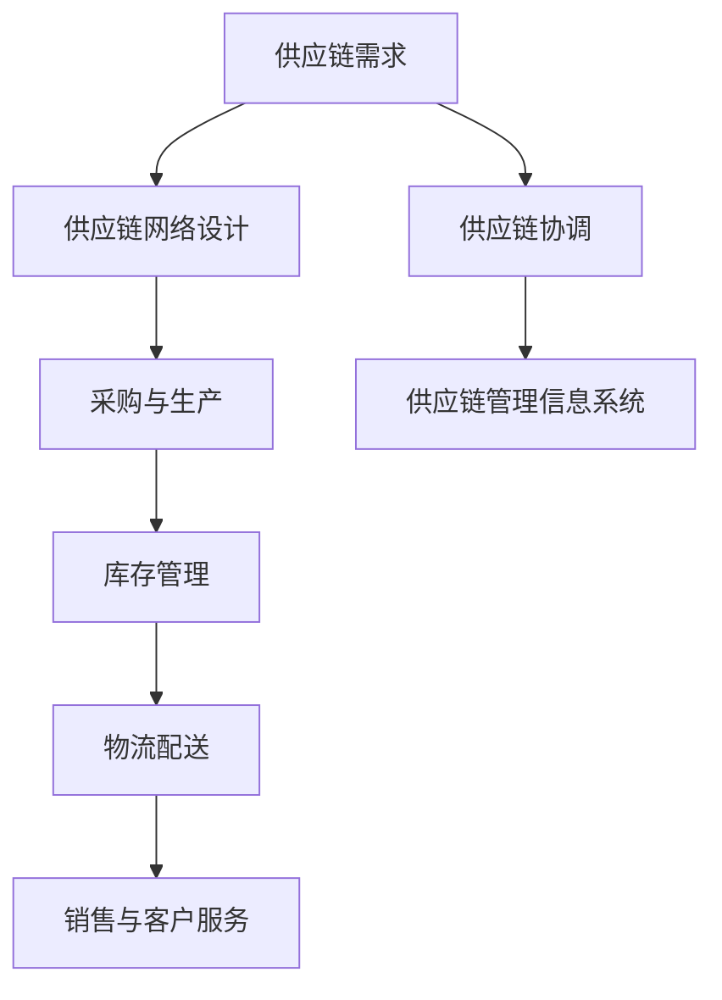

                 

# 《拼多多2024校招供应链优化工程师面试题解析》

> **关键词：** 拼多多、校招、供应链优化、面试题解析、工程师岗位、职业发展

> **摘要：** 本文将深入解析拼多多2024校招供应链优化工程师的面试题，从岗位解析、基础知识、采购管理、库存管理、物流与配送、供应链协调与供应链金融等多个方面，提供详细的面试题解析和实战案例分析，助力求职者顺利通过面试，开启供应链优化工程师的职业生涯。

### 《拼多多2024校招供应链优化工程师面试题解析》目录大纲

1. **第一部分：拼多多校招供应链优化工程师面试题解析概述**
2. **第二部分：供应链优化基础知识**
3. **第三部分：采购管理面试题解析**
4. **第四部分：库存管理面试题解析**
5. **第五部分：物流与配送面试题解析**
6. **第六部分：供应链协调与供应链金融**
7. **第七部分：面试技巧与案例分析**
8. **第八部分：模拟面试与实战演练**
9. **第九部分：职场规划与发展建议**
10. **第十部分：附录**

---

## 第一部分：拼多多校招供应链优化工程师面试题解析概述

### 1.1 拼多多供应链优化工程师岗位解析

拼多多作为国内领先的电商平台，供应链优化工程师的岗位在公司的运营中扮演着至关重要的角色。供应链优化工程师的主要职责包括：

- **供应链策略规划**：根据市场需求，制定合理的供应链策略，确保供应链的高效运作。
- **采购与库存管理**：优化采购流程，控制采购成本，同时进行库存管理，降低库存成本。
- **物流与配送优化**：优化物流配送流程，提高配送效率，降低物流成本。
- **数据分析与决策**：通过数据分析，发现供应链中的问题，提出改进措施，提高供应链整体效率。

### 1.2 供应链优化工程师所需技能和知识

要胜任拼多多供应链优化工程师的岗位，需要具备以下技能和知识：

- **供应链管理知识**：熟悉供应链管理的基本概念、流程、方法和工具。
- **数据分析能力**：掌握数据分析和处理方法，能够运用数据分析优化供应链。
- **物流与配送知识**：了解物流和配送的基本原理，熟悉物流网络设计和优化策略。
- **编程能力**：掌握至少一门编程语言，能够进行数据分析和系统开发。

### 1.3 供应链优化工程师的职业发展路径

供应链优化工程师的职业发展路径通常包括以下阶段：

- **初级工程师**：负责基础的数据分析和简单的供应链优化任务。
- **中级工程师**：承担更多的供应链优化任务，参与重要的供应链项目。
- **高级工程师**：负责整体供应链的优化策略制定和实施，成为团队的核心成员。
- **专家或项目经理**：在供应链管理领域具有丰富的经验和专业知识，负责大型供应链项目的管理和实施。

---

在接下来的部分，我们将详细解析供应链优化工程师所需掌握的基础知识，为求职者提供全面的面试准备指导。

---

## 第二部分：供应链优化基础知识

### 2.1 供应链管理基本概念

供应链管理（Supply Chain Management, SCM）是指对整个供应链系统进行计划、组织、协调与控制的过程。供应链管理的基本概念包括：

- **供应链**：由一系列组织、人员、活动、信息、资源等构成，共同完成产品或服务的生产、配送和销售。
- **供应链网络**：供应链中各个环节之间的连接关系，包括供应商、制造商、分销商、零售商和消费者。
- **供应链活动**：包括采购、生产、库存管理、物流配送、销售等。
- **供应链目标**：主要包括成本最小化、效率最大化、质量最优、响应速度最快等。

### 2.2 供应链优化目标与方法

供应链优化的目标是通过改进供应链各个环节的运作，实现整体供应链的效率最大化。主要方法包括：

- **降低成本**：通过优化采购、生产、物流等环节，降低整个供应链的成本。
- **提高效率**：通过流程优化、自动化等技术手段，提高供应链的运作效率。
- **提升质量**：通过质量管理和控制，确保供应链各环节的产品或服务质量。
- **缩短交货周期**：通过优化物流和库存管理，缩短产品的交货周期，提高市场响应速度。

### 2.3 供应链网络设计与优化

供应链网络设计是供应链管理的重要组成部分，其目标是建立高效、灵活的供应链网络，满足市场需求。主要方法包括：

- **需求预测**：通过历史数据和市场需求分析，预测未来的需求，为供应链设计提供依据。
- **设施选址**：根据供应链需求和成本，选择最优的设施位置，包括供应商、工厂、仓库和配送中心。
- **库存管理**：通过优化库存策略，确保供应链各环节的库存水平合理，降低库存成本。
- **物流网络设计**：设计高效的物流网络，优化运输路径和运输方式，降低物流成本。

为了更好地理解供应链优化知识，我们可以通过以下Mermaid流程图展示供应链管理的基本架构：

在供应链管理中，各环节之间相互关联，形成一个紧密的协同体系。通过有效的供应链管理，企业可以更好地满足市场需求，提高竞争力。

---

在接下来的部分，我们将详细解析采购管理方面的面试题，帮助求职者更好地准备面试。

---

## 第三部分：采购管理面试题解析

采购管理是供应链管理的重要组成部分，涉及采购流程、采购策略、采购成本控制以及供应商关系管理等多个方面。以下是拼多多2024校招供应链优化工程师面试中可能会遇到的采购管理相关面试题及其解析：

### 3.1 采购流程与策略

**面试题1：请简述采购流程的各个阶段。**

**解答：** 采购流程通常包括以下阶段：

1. **需求分析**：根据市场预测和企业生产计划，分析采购需求。
2. **供应商选择**：通过筛选、评估和比较，选择合适的供应商。
3. **采购谈判**：与供应商进行价格、交货期、质量等方面的谈判。
4. **采购订单**：确定采购需求后，向供应商下达采购订单。
5. **采购执行**：跟踪采购订单的执行情况，确保按时、按质、按量采购。
6. **采购验收**：对采购物资进行验收，确保质量符合要求。
7. **采购支付**：根据验收结果进行采购物资的支付。

### 3.2 采购成本分析与控制

**面试题2：请谈谈如何进行采购成本分析？**

**解答：** 采购成本分析主要包括以下几个方面：

1. **直接采购成本**：包括原材料、零部件、设备的购买成本。
2. **间接采购成本**：包括采购管理费用、采购过程中的运输、仓储等费用。
3. **采购成本构成分析**：对采购成本进行分解，识别主要成本驱动因素。
4. **采购成本控制**：通过优化采购流程、谈判降低采购成本、减少采购过程中的浪费等手段，控制采购成本。

### 3.3 供应商关系管理

**面试题3：请描述供应商关系管理的几个关键点。**

**解答：** 供应商关系管理的关键点包括：

1. **供应商选择**：根据企业的需求和供应商的资质，选择合适的供应商。
2. **供应商评估**：对供应商的供货能力、产品质量、服务水平等进行定期评估。
3. **供应商激励**：通过提供订单奖励、长期合作计划等激励措施，增强供应商的合作意愿。
4. **供应商沟通**：建立良好的沟通机制，及时解决供应商合作过程中出现的问题。
5. **供应商培训**：提高供应商的技能和知识，提升供应商的供应能力和质量。

---

在接下来的部分，我们将详细解析库存管理方面的面试题，帮助求职者更好地准备面试。

---

## 第四部分：库存管理面试题解析

库存管理是供应链管理的重要组成部分，涉及到库存控制、库存优化等多个方面。以下是拼多多2024校招供应链优化工程师面试中可能会遇到的库存管理相关面试题及其解析：

### 4.1 库存管理基本原理

**面试题1：请解释库存管理的基本原理。**

**解答：** 库存管理的基本原理包括以下几个方面：

1. **需求预测**：根据市场需求和历史销售数据，预测未来的需求量。
2. **库存水平**：根据需求预测和供应链运作情况，确定合理的库存水平。
3. **库存控制**：通过库存监控、库存调整等手段，确保库存水平处于合理范围内。
4. **库存优化**：通过分析库存数据，发现库存问题，提出优化方案，降低库存成本。

### 4.2 库存控制方法与应用

**面试题2：请简要介绍几种常见的库存控制方法。**

**解答：** 常见的库存控制方法包括：

1. **周期性库存控制**：按照固定周期对库存进行盘点和调整。
2. **最低库存水平控制**：设置最低库存水平，当库存低于最低水平时，进行采购或生产。
3. **定量库存控制**：根据库存水平变化，设置定量采购或生产。
4. **连续库存控制**：实时监控库存水平，根据库存变化情况，及时调整采购或生产计划。

### 4.3 库存优化案例分析

**面试题3：请举例说明库存优化的一个实际案例。**

**解答：** 一个库存优化的实际案例如下：

某电子产品公司，由于市场需求波动大，经常出现库存积压或供应不足的情况。为了解决这个问题，公司采取了以下措施：

1. **需求预测优化**：通过大数据分析和市场调研，提高需求预测的准确性。
2. **供应链协同**：与供应商建立紧密的协同关系，实现实时库存监控和信息共享。
3. **库存策略调整**：根据市场需求变化，灵活调整库存策略，减少库存积压。
4. **仓储管理优化**：优化仓储布局，提高仓库利用率，减少库存存储成本。

通过这些措施，该公司的库存周转率显著提高，库存成本得到有效控制，满足了市场需求，提高了企业的竞争力。

---

在接下来的部分，我们将详细解析物流与配送方面的面试题，帮助求职者更好地准备面试。

---

## 第五部分：物流与配送面试题解析

物流与配送是供应链管理中至关重要的一环，涉及到物流管理基础、配送中心规划与运营以及物流成本优化策略等方面。以下是拼多多2024校招供应链优化工程师面试中可能会遇到的物流与配送相关面试题及其解析：

### 5.1 物流管理基础

**面试题1：请解释物流管理的基本概念和组成部分。**

**解答：** 物流管理的基本概念包括：

- **物流**：指商品从供应地向接收地的实体流动过程，包括运输、仓储、装卸、包装、流通加工、配送等环节。
- **物流管理**：指在物流过程中，通过计划、组织、协调、控制和优化的手段，实现物流高效、低成本、高质量运行的过程。

物流管理的组成部分包括：

1. **运输管理**：指对货物在运输过程中的管理，包括运输方式选择、运输路线规划、运输工具管理等。
2. **仓储管理**：指对货物在仓储过程中的管理，包括仓库布局、库存管理、出入库管理等。
3. **配送管理**：指对货物在配送过程中的管理，包括配送计划、配送路线规划、配送服务等。
4. **物流信息技术**：指利用信息技术手段，实现物流过程的自动化、信息化和智能化。

### 5.2 配送中心规划与运营

**面试题2：请简述配送中心规划的关键因素。**

**解答：** 配送中心规划的关键因素包括：

1. **地理位置**：选择交通便利、靠近客户分布中心的地理位置。
2. **面积和容量**：根据业务需求和未来增长，合理规划配送中心的面积和容量。
3. **设施和设备**：包括仓库货架、搬运设备、温控设备等，确保配送中心能够满足各种货物存储和配送需求。
4. **信息系统**：建立完善的物流信息系统，实现配送过程的实时监控和数据分析。
5. **人员配置**：根据配送中心的规模和业务需求，合理配置管理人员和操作人员。

### 5.3 物流成本优化策略

**面试题3：请谈谈物流成本优化的重要性以及如何进行优化。**

**解答：** 物流成本优化的重要性：

- **提高盈利能力**：通过降低物流成本，提高企业的盈利能力。
- **增强市场竞争力**：优化物流成本，可以提高企业的市场竞争力，吸引更多的客户。

物流成本优化策略：

1. **运输成本优化**：通过合理规划运输路线、选择合适的运输方式，降低运输成本。
2. **仓储成本优化**：通过优化仓储布局、提高仓库利用率，降低仓储成本。
3. **配送成本优化**：通过优化配送计划、降低配送距离，减少配送成本。
4. **信息技术应用**：利用物流信息系统，提高物流运作效率，降低运营成本。
5. **供应链协同**：与供应链各方建立紧密的合作关系，实现资源共享和成本分担。

---

在接下来的部分，我们将详细解析供应链协调与供应链金融方面的面试题，帮助求职者更好地准备面试。

---

## 第六部分：供应链协调与供应链金融

供应链协调与供应链金融是现代供应链管理中的重要组成部分，涉及到供应链协同机制、供应链金融概述以及案例分析等方面。以下是拼多多2024校招供应链优化工程师面试中可能会遇到的供应链协调与供应链金融相关面试题及其解析：

### 6.1 供应链协同机制

**面试题1：请解释供应链协同机制的概念及其重要性。**

**解答：** 供应链协同机制是指在供应链各环节之间，通过信息共享、合作共赢的方式，实现供应链整体效率最大化的机制。

供应链协同机制的重要性：

- **提高供应链效率**：通过协同机制，实现供应链各环节的信息共享和协调运作，提高整体供应链效率。
- **降低运营成本**：协同机制有助于减少重复工作、降低库存水平、减少运输成本等，从而降低运营成本。
- **提升客户满意度**：协同机制可以更好地满足客户需求，提高客户满意度，增强企业的市场竞争力。

### 6.2 供应链金融概述

**面试题2：请简要介绍供应链金融的概念、特点和类型。**

**解答：** 供应链金融是指基于供应链各方的交易数据和信用状况，为供应链上的企业提供融资服务的一种金融模式。

供应链金融的特点：

- **基于交易背景**：供应链金融是基于供应链各方的交易数据和信用状况，为企业提供融资服务。
- **风险可控**：供应链金融通过控制供应链上下游企业的信用风险，降低融资风险。
- **融资效率高**：供应链金融通过简化融资流程，提高融资效率。

供应链金融的类型：

1. **订单融资**：基于订单的融资模式，为企业提供订单额度的融资服务。
2. **应收账款融资**：基于应收账款的融资模式，为企业提供应收账款额度的融资服务。
3. **存货融资**：基于存货的融资模式，为企业提供存货价值的融资服务。

### 6.3 供应链金融案例分析

**面试题3：请举例说明一个供应链金融的实际案例。**

**解答：** 一个供应链金融的实际案例如下：

某电子产品公司A与供应商B、分销商C建立稳定的合作关系。为了提高供应链各方的工作效率和资金周转，公司A与金融机构D合作，推出了一款基于订单的供应链金融产品。

具体流程如下：

1. **订单生成**：电子产品公司A向供应商B下单，生成订单。
2. **订单融资申请**：供应商B将订单提交给金融机构D，申请订单融资。
3. **融资审批**：金融机构D对供应商B的订单和信用状况进行审批，决定是否批准融资。
4. **放款**：金融机构D根据审批结果，将融资款项直接支付给供应商B。
5. **还款**：供应商B在订单完成后，将销售收入用于还款。

通过这一供应链金融产品，供应链各方实现了资金的高效流转，提高了运营效率，降低了融资成本。

---

在接下来的部分，我们将详细解析面试技巧与案例分析，帮助求职者更好地准备面试。

---

## 第七部分：面试技巧与案例分析

面试是求职过程中至关重要的一环，掌握正确的面试技巧和策略，能够帮助你更好地展示自己的能力和潜力。以下是拼多多2024校招供应链优化工程师面试中的一些常见技巧和案例分析：

### 7.1 面试准备与策略

**面试准备**：

1. **了解公司和岗位**：充分了解拼多多的企业文化和业务模式，熟悉供应链优化工程师的岗位职责和技能要求。
2. **梳理个人经历**：回顾自己的学习经历、工作经历和项目经验，整理出与供应链优化相关的能力和成果。
3. **准备常见面试题**：针对供应链优化工程师岗位，准备一些常见的面试题，如自我介绍、专业能力、项目经验等。

**面试策略**：

1. **自信表达**：在面试过程中，保持自信，清晰、准确地表达自己的观点和想法。
2. **逻辑清晰**：回答问题时，注意逻辑性，确保每个回答都有明确的论点和论据。
3. **展示专业知识**：结合自己的经验和知识，展示对供应链优化相关理论和实践的理解。

### 7.2 常见面试题类型及应对技巧

**常见面试题类型**：

1. **自我介绍**：介绍自己的姓名、学历、专业背景、工作经历等。
2. **专业知识**：考察应聘者对供应链管理、物流与配送、采购与库存等方面的理解。
3. **项目经验**：询问应聘者参与过的项目，考察其实际操作能力和问题解决能力。
4. **行为面试题**：通过具体情境，考察应聘者的应变能力、团队合作能力等。

**应对技巧**：

1. **提前准备**：对常见面试题进行提前准备，确保能够流畅回答。
2. **结合实际**：在回答问题时，尽量结合自己的实际经历和项目经验，展示自己的能力和成果。
3. **逻辑清晰**：回答问题时，注意逻辑性，确保每个回答都有明确的论点和论据。

### 7.3 面试案例分析

**案例1：自我介绍**

**面试题**：请介绍一下自己。

**解答思路**：

1. **基本信息**：姓名、学历、专业背景等。
2. **工作经历**：简要介绍工作经历，突出与供应链优化相关的经历和成果。
3. **专业技能**：介绍自己的专业技能，如数据分析、供应链管理、物流与配送等。

**案例2：专业知识**

**面试题**：请谈谈你对供应链管理的理解。

**解答思路**：

1. **供应链定义**：解释供应链的定义和组成部分。
2. **供应链管理目标**：阐述供应链管理的目标，如成本最小化、效率最大化、质量最优等。
3. **供应链管理方法**：介绍供应链管理的方法和技术，如需求预测、库存管理、物流与配送等。

**案例3：项目经验**

**面试题**：请介绍一下你参与的一个供应链优化项目。

**解答思路**：

1. **项目背景**：介绍项目的背景和目的。
2. **项目目标**：阐述项目的具体目标和预期成果。
3. **项目实施**：详细描述项目的实施过程，包括需求分析、方案设计、执行与监控等。
4. **项目成果**：介绍项目的成果和效益，如成本降低、效率提高等。

---

通过以上面试技巧和案例分析，相信求职者能够更好地准备面试，提高面试成功率。

---

## 第八部分：模拟面试与实战演练

模拟面试与实战演练是求职过程中不可或缺的一部分，通过模拟真实的面试场景，可以帮助求职者熟悉面试流程，提高应对能力。以下是拼多多2024校招供应链优化工程师模拟面试的步骤、案例与解析。

### 8.1 模拟面试准备

**步骤1：确定面试内容**

- **专业知识**：准备与供应链优化相关的理论知识，如供应链管理、物流与配送、采购与库存管理等。
- **项目经验**：整理与供应链优化相关的项目经验，确保能够详细描述项目背景、目标、实施过程和成果。
- **行为面试题**：准备一些常见的面试行为题，如团队合作、问题解决、沟通协调等。

**步骤2：模拟面试环境**

- **面试场地**：选择一个安静、舒适的场所进行模拟面试。
- **面试官角色**：邀请有经验的同事或朋友扮演面试官，模拟真实的面试场景。

**步骤3：模拟面试练习**

- **逐一回答**：按照面试流程，逐一回答面试官提出的问题。
- **互动交流**：与面试官进行互动，展示自己的沟通能力和团队合作精神。

### 8.2 模拟面试案例与解析

**案例1：自我介绍**

**面试题**：请介绍一下自己。

**解析**：

1. **基本信息**：姓名、学历、专业背景等。
2. **工作经历**：简要介绍工作经历，突出与供应链优化相关的经历和成果。
3. **专业技能**：介绍自己的专业技能，如数据分析、供应链管理、物流与配送等。

**示例答案**：

您好，我叫张三，毕业于某知名大学物流管理专业。毕业后，我在一家大型电商平台担任供应链优化工程师，负责采购管理、库存控制和物流配送等工作。在过去的三年里，我积累了丰富的供应链管理经验，掌握了数据分析、物流规划等专业技能。

**案例2：专业知识**

**面试题**：请谈谈你对供应链管理的理解。

**解析**：

1. **供应链定义**：解释供应链的定义和组成部分。
2. **供应链管理目标**：阐述供应链管理的目标，如成本最小化、效率最大化、质量最优等。
3. **供应链管理方法**：介绍供应链管理的方法和技术，如需求预测、库存管理、物流与配送等。

**示例答案**：

供应链管理是指通过计划、组织、协调、控制和优化，实现供应链各环节的高效运作，以满足市场需求，提高企业竞争力。供应链管理的基本目标是成本最小化、效率最大化、质量最优和响应速度最快。

供应链管理的方法和技术包括：需求预测，通过数据分析和历史销售数据，预测未来的需求；库存管理，通过优化库存策略，确保库存水平合理，降低库存成本；物流与配送，通过设计合理的物流网络和配送中心，提高配送效率，降低物流成本。

**案例3：项目经验**

**面试题**：请介绍一下你参与的一个供应链优化项目。

**解析**：

1. **项目背景**：介绍项目的背景和目的。
2. **项目目标**：阐述项目的具体目标和预期成果。
3. **项目实施**：详细描述项目的实施过程，包括需求分析、方案设计、执行与监控等。
4. **项目成果**：介绍项目的成果和效益，如成本降低、效率提高等。

**示例答案**：

我参与的一个供应链优化项目是某电子产品公司的采购与库存管理优化项目。项目背景是该公司的采购和库存管理效率低下，导致库存积压和供应不足。项目目标是通过优化采购流程、库存管理和物流配送，提高采购和库存管理的效率，降低库存成本。

项目实施过程中，我们首先进行了需求分析，了解了公司的采购和库存管理现状。然后，我们设计了一套新的采购和库存管理方案，包括优化采购流程、实施先进库存控制方法和优化物流配送策略。在项目执行阶段，我们与相关部门紧密合作，推进方案的实施。项目监控阶段，我们对实施效果进行了评估，发现库存周转率提高了30%，采购成本降低了15%。

### 8.3 实战演练与反馈

**步骤1：实战演练**

- **面试场景**：在真实面试场景中，展示自己的面试技巧和专业知识。
- **实战模拟**：模拟真实的面试过程，包括自我介绍、专业知识、项目经验和行为面试题等。

**步骤2：反馈与改进**

- **面试官反馈**：在实战演练后，面试官会给出详细的反馈，包括回答问题的情况、表达方式、专业知识等方面。
- **自我反思**：根据自己的表现，进行自我反思，找出不足之处，制定改进计划。

通过模拟面试与实战演练，求职者可以更好地了解自己的优势和不足，提高面试技巧和应对能力，为正式面试做好准备。

---

## 第九部分：职场规划与发展建议

作为一名供应链优化工程师，清晰的职业规划和发展路径对于个人成长和职业成功至关重要。以下是针对拼多多2024校招供应链优化工程师的职场规划与发展建议：

### 9.1 供应链优化工程师的职业规划

**初级阶段**（1-3年）：

- **掌握基础知识**：系统学习供应链管理、物流与配送、采购与库存管理等基础知识。
- **实践经验**：通过实际项目，积累供应链优化的实践经验，熟悉供应链运作流程。
- **技能提升**：掌握数据分析、编程等技能，提高工作效率。

**中级阶段**（3-5年）：

- **业务拓展**：拓展业务知识，了解不同行业和企业的供应链特点，提高跨行业运作能力。
- **项目领导**：担任重要项目的负责人，锻炼项目管理和团队协作能力。
- **知识分享**：积极参与公司内部培训，分享自己的经验和见解，提高个人影响力。

**高级阶段**（5年以上）：

- **战略规划**：参与公司战略规划，提出供应链优化的战略建议。
- **专业顾问**：成为公司内外部的供应链优化顾问，为其他部门和项目提供专业指导。
- **职业转型**：根据个人兴趣和发展，可以考虑转型为供应链经理、运营总监等高级职位。

### 9.2 职业技能提升路径

**专业技能**：

- **供应链管理**：深入学习供应链管理理论，掌握供应链网络设计、需求预测、库存控制等技能。
- **数据分析**：掌握数据分析工具（如Excel、Python、R等）和数据挖掘技术，提高数据分析能力。
- **物流与配送**：了解物流和配送的基本原理，掌握物流规划、配送中心运营等技能。
- **编程技能**：学习编程语言（如Python、Java等），提高数据分析和系统开发能力。

**软技能**：

- **沟通协作**：提高沟通协作能力，学会有效表达自己的想法和观点。
- **问题解决**：培养分析问题、解决问题的能力，提高抗压能力。
- **团队管理**：掌握团队管理技巧，提高团队协作和领导能力。

### 9.3 职场发展建议与案例分析

**职业发展建议**：

1. **持续学习**：供应链优化领域不断变化，持续学习新的知识和技能，保持竞争力。
2. **实践经验**：积极参与实际项目，积累实践经验，提高解决问题的能力。
3. **人际关系**：建立良好的人际关系，扩大人脉，为职业发展创造更多机会。
4. **职业规划**：明确个人职业目标和发展路径，制定详细的职业规划，有计划地实现职业目标。

**案例分析**：

小明是一名刚刚加入拼多多的供应链优化工程师，他制定了以下职业规划：

**初级阶段**：

- **学习基础知识**：通过阅读专业书籍、参加培训课程，掌握供应链管理、物流与配送、采购与库存管理等基础知识。
- **实践经验**：参与公司实际项目，了解供应链运作流程，积累实践经验。

**中级阶段**：

- **业务拓展**：深入了解公司业务，拓展业务知识，为跨行业项目做准备。
- **项目领导**：担任重要项目的负责人，锻炼项目管理和团队协作能力。

**高级阶段**：

- **战略规划**：参与公司战略规划，为供应链优化提供建议。
- **专业顾问**：成为公司内外部的供应链优化顾问，为其他部门和项目提供专业指导。

通过明确的职业规划和持续的努力，小明在短短五年内从一名初级工程师成长为公司的高级顾问，为公司的供应链优化做出了重要贡献。

---

通过以上职业规划和发展建议，供应链优化工程师可以更好地规划自己的职业生涯，实现个人和企业的共同发展。

---

## 第十部分：附录

### 10.1 常用供应链管理工具

为了更好地进行供应链管理，以下是一些常用的供应链管理工具：

1. **ERP系统**：企业资源计划（ERP）系统，如SAP、Oracle等，用于整合企业内部的各项业务流程。
2. **供应链管理系统**：如JDA、Manhattan等，用于供应链网络设计、需求预测、库存管理、物流与配送等。
3. **物流管理系统**：如OSCI、Manhattan等，用于物流网络规划、运输管理、仓储管理等。
4. **数据分析工具**：如Excel、Python、R等，用于数据收集、清洗、分析和可视化。

### 10.2 面试资料与资源推荐

为了更好地准备拼多多供应链优化工程师的面试，以下是一些建议的面试资料和资源：

1. **供应链管理经典书籍**：
   - 《供应链管理：战略、规划与运营》
   - 《物流与供应链管理：理论与实践》
2. **在线课程**：
   - Coursera、edX等在线教育平台上的供应链管理相关课程
   - 拼多多官网招聘页面上的岗位描述和相关资料
3. **专业论坛和社群**：
   - 供应链管理专业论坛，如SCM World、CSCMP等
   - 社交媒体上的供应链管理专业群组，如LinkedIn、微信等

### 10.3 供应链优化相关书籍和文献推荐

为了深入学习和研究供应链优化，以下是一些建议的书籍和文献：

1. **《供应链管理：战略、规划与运营》（第二版）**：
   - 作者：马丁·克里斯托夫·史迪文斯（Martin Christopher Staelin）
   - 内容：详细介绍了供应链管理的战略规划、运营和绩效评估方法。

2. **《物流与供应链管理：理论与实践》**：
   - 作者：菲利普·库珀（Philippe Calantone）、丹尼尔·戴维斯（Daniel J. Davis）
   - 内容：结合理论和实践，介绍了物流与供应链管理的基本概念、方法和应用。

3. **《供应链金融》**：
   - 作者：王庆华、李莉
   - 内容：系统阐述了供应链金融的概念、原理和应用，以及供应链金融的运作模式。

4. **《供应链协调与优化：方法与应用》**：
   - 作者：刘宁、陈志华
   - 内容：介绍了供应链协调的基本概念、方法和应用，包括供应链网络设计、需求预测、库存管理和物流优化等。

5. **相关学术论文**：
   - 在学术期刊和会议上发表的关于供应链优化、物流与配送、采购与库存管理等方面的论文，如《管理科学学报》、《系统管理学报》等。

通过以上书籍和文献的阅读和研究，可以深入了解供应链优化领域的前沿知识和研究成果，为实际工作提供理论支持和实践指导。

---

感谢您阅读《拼多多2024校招供应链优化工程师面试题解析》全文。希望本文能够帮助您更好地准备面试，顺利成为一名优秀的供应链优化工程师。祝您在职场道路上取得优异的成绩！

---

**作者：AI天才研究院/AI Genius Institute & 禅与计算机程序设计艺术 /Zen And The Art of Computer Programming**

