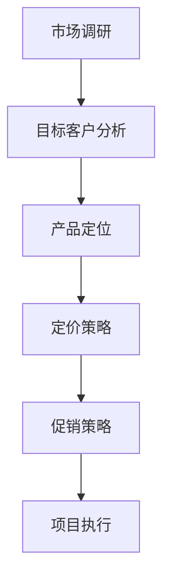

                 

# 《掌握知识付费的定价策略与促销技巧》

## 关键词：
知识付费、定价策略、促销技巧、市场分析、用户行为、案例分析

## 摘要：
本文旨在深入探讨知识付费领域的定价策略和促销技巧。通过对市场现状的分析，结合实际案例，我们将详细解析各种定价方法和促销手段，并提供实用的实战经验和优化策略，以帮助知识付费平台实现可持续发展。

## 目录大纲

## 第一部分：基础知识篇

### 第1章：知识付费市场概述

#### 1.1 知识付费的定义与背景

#### 1.2 知识付费市场的现状与趋势

#### 1.3 知识付费的核心要素

### 第2章：定价策略基础

#### 2.1 定价理论概述

#### 2.2 成本导向定价法

#### 2.3 市场导向定价法

#### 2.4 竞争导向定价法

### 第3章：促销策略基础

#### 3.1 促销的定义与作用

#### 3.2 促销策略的类型

#### 3.3 促销策略的实施过程

## 第二部分：定价策略实战篇

### 第4章：定价策略分析

#### 4.1 市场细分与目标客户分析

#### 4.2 产品定位与定价策略

#### 4.3 定价策略的调整与优化

### 第5章：定价策略案例分析

#### 5.1 案例一：在线教育平台的定价策略

#### 5.2 案例二：知识付费平台的促销策略

#### 5.3 案例三：传统出版行业的定价策略转型

## 第三部分：促销技巧实战篇

### 第6章：促销活动策划

#### 6.1 促销活动的目标与类型

#### 6.2 促销活动的策划流程

#### 6.3 促销活动的实施技巧

### 第7章：促销技巧运用

#### 7.1 优惠券与折扣策略

#### 7.2 社交媒体营销策略

#### 7.3 联合营销策略

#### 7.4 口碑营销策略

### 第8章：促销效果评估与优化

#### 8.1 促销效果的评估指标

#### 8.2 促销效果的评估方法

#### 8.3 促销策略的优化方向

## 第四部分：综合实战篇

### 第9章：知识付费项目的整体策划

#### 9.1 项目定位与目标设定

#### 9.2 内容策划与设计

#### 9.3 定价策略与促销策略的整合

### 第10章：知识付费项目的推广与运营

#### 10.1 线上推广策略

#### 10.2 线下推广策略

#### 10.3 用户运营策略

### 第11章：知识付费项目的案例分析

#### 11.1 案例一：网易云课堂的定价与促销策略

#### 11.2 案例二：得到App的内容运营与用户运营策略

#### 11.3 案例三：知乎Live的社区运营与知识付费模式

## 附录

### 附录A：知识付费相关资源推荐

#### A.1 行业报告

#### A.2 知识付费平台分析

#### A.3 相关书籍与论文推荐

#### A.4 知识付费工具与平台介绍

#### A.5 行业专家访谈与专栏文章推荐

### Mermaid 流程图：



### 核心算法原理讲解的伪代码示例：

```pseudo
function calculatePrice(product, marketData, competitionData) {
    // 计算成本价格
    costPrice = calculateCost(product)

    // 获取市场基准价格
    marketPrice = findMarketPrice(marketData)

    // 获取竞争者价格
    competitionPrice = findCompetitionPrice(competitionData)

    // 确定定价策略
    if (marketPrice > costPrice && marketPrice < competitionPrice) {
        // 市场导向定价
        finalPrice = marketPrice
    } else if (competitionPrice < costPrice) {
        // 竞争导向定价
        finalPrice = costPrice
    } else {
        // 成本导向定价
        finalPrice = costPrice
    }

    // 返回最终定价
    return finalPrice
}
```

### 数学公式示例：

$$
C = P \times Q
$$

### 代码实际案例与详细解释说明：

```python
import numpy as np

# 假设产品成本为 100 元，市场基准价格为 200 元，竞争者价格为 150 元

# 计算最终定价
def calculate_price(cost_price, market_price, competition_price):
    if market_price > cost_price and market_price < competition_price:
        final_price = market_price
    elif competition_price < cost_price:
        final_price = cost_price
    else:
        final_price = cost_price
        
    return final_price

# 输出最终定价
print("最终定价：", calculate_price(100, 200, 150))
```

### 开发环境搭建与源代码实现细节：

- 开发环境：Python 3.8
- 安装依赖：`pip install numpy`

### 代码解读与分析：

- 该代码实现了一个简单的定价计算函数，根据不同的定价策略计算产品的最终定价。
- `calculate_price` 函数接收产品成本、市场基准价格和竞争者价格作为参数。
- 根据定价策略，选择最终定价。市场导向定价策略优先考虑市场基准价格，竞争导向定价策略优先考虑竞争者价格，成本导向定价策略则直接采用成本价格。

接下来，我们将深入探讨知识付费市场的现状、定价策略和促销技巧，结合实际案例进行分析和解读。

## 第一部分：基础知识篇

### 第1章：知识付费市场概述

#### 1.1 知识付费的定义与背景

知识付费是指用户为获取有价值的信息、技能或知识而支付的费用。它是一种基于互联网的技术服务模式，通过线上平台提供各类专业课程、电子书、专栏文章、咨询服务等，以满足用户在职场发展、个人成长、兴趣培养等方面的需求。

知识付费的兴起背景可以追溯到以下几个因素：

1. **互联网普及**：随着互联网技术的快速发展，信息传播变得更加便捷，用户对于获取高质量信息的渴求日益增长。
2. **教育改革**：传统教育模式无法完全满足个性化学习需求，而知识付费平台提供了更加灵活和多样化的学习方式。
3. **用户付费习惯**：随着用户消费习惯的变迁，用户对于线上支付方式的接受度不断提高，为知识付费提供了市场基础。
4. **内容创作者崛起**：知识付费市场的繁荣带动了大批优质内容创作者的涌现，他们通过平台分享专业知识和经验，实现自身价值。

#### 1.2 知识付费市场的现状与趋势

当前，知识付费市场已经呈现出以下特点：

1. **市场规模扩大**：根据相关报告，知识付费市场规模逐年增长，预计未来还将保持稳定增长态势。
2. **用户增长迅速**：知识付费的用户群体不断扩大，覆盖了各个年龄层次和职业领域。
3. **内容种类丰富**：知识付费平台提供的课程和内容涵盖了职场技能、兴趣培养、健康生活等多个领域，满足了用户的多样化需求。
4. **竞争加剧**：随着知识付费市场的成熟，越来越多的平台和企业进入这一领域，市场竞争日益激烈。

未来，知识付费市场将继续保持发展势头，预计将呈现出以下趋势：

1. **内容质量提升**：随着用户对内容质量的重视，平台将更加注重优质内容的筛选和培育，提高用户满意度。
2. **个性化服务增强**：通过大数据分析和人工智能技术，平台将提供更加个性化的推荐和服务，满足用户的个性化需求。
3. **跨界合作增多**：知识付费平台将与其他行业进行更多跨界合作，拓宽内容领域和市场渠道。
4. **用户付费习惯固化**：用户对知识付费的接受度和付费习惯将逐渐固化，知识付费将逐步成为日常消费的一部分。

#### 1.3 知识付费的核心要素

知识付费的核心要素包括：

1. **内容**：内容是知识付费的核心价值所在，优质的内容是吸引用户的关键。
2. **平台**：知识付费平台是连接内容创作者和用户的桥梁，平台的运营能力和服务质量直接影响用户体验。
3. **用户**：用户是知识付费市场的主要参与者和消费者，他们的需求和满意度是衡量知识付费平台成功与否的重要指标。
4. **支付**：支付是知识付费交易的关键环节，便捷、安全的支付方式是提高用户转化率的重要因素。

在接下来的章节中，我们将进一步探讨知识付费领域的定价策略和促销技巧，结合市场分析和实际案例，为知识付费平台提供实用的策略和优化建议。

### 第2章：定价策略基础

#### 2.1 定价理论概述

定价策略是知识付费平台成功运营的关键因素之一。合理的定价策略不仅能确保平台盈利，还能吸引更多用户，提升用户满意度。在探讨定价策略之前，我们需要了解一些基本的定价理论。

**价格定位理论**：价格定位理论强调，产品或服务的定价应该基于其在市场中的定位。价格定位可以分为高端定位、中端定位和低端定位。高端定位通常采用高价策略，以满足用户对高品质、高价值的需求；中端定位则采用中等价格策略，以满足大众市场的需求；低端定位则采用低价策略，以吸引价格敏感的用户群体。

**成本导向定价法**：成本导向定价法是以产品或服务的成本为基础，加上一定的利润率来确定价格。这种方法适用于成本结构相对简单、市场竞争不激烈的产品或服务。

**市场导向定价法**：市场导向定价法是基于市场需求和竞争态势来确定价格。这种方法考虑了用户的购买能力和对产品或服务的价值感知，能够更准确地反映市场情况。

**竞争导向定价法**：竞争导向定价法是参考竞争对手的价格来确定自身的价格。这种方法适用于竞争激烈的市场环境，通过价格策略来保持市场份额。

**需求导向定价法**：需求导向定价法是根据用户对产品或服务的需求强度来确定价格。这种方法适用于需求变化较大的市场，能够灵活应对市场需求的变化。

**价值导向定价法**：价值导向定价法是基于用户对产品或服务的价值感知来确定价格。这种方法强调产品或服务的价值，通过提供优质服务来提升用户的价值感知。

**体验导向定价法**：体验导向定价法是根据用户在使用产品或服务过程中的体验感受来确定价格。这种方法适用于注重用户体验的产品或服务，通过提供独特、优质的用户体验来吸引用户。

**组合定价法**：组合定价法是将多种定价方法结合起来，根据不同市场和用户群体采取不同的定价策略。这种方法能够灵活应对市场的多样化需求。

#### 2.2 成本导向定价法

成本导向定价法是一种基于成本计算来确定价格的方法。其核心思想是，将产品或服务的成本计算在内，加上一定的利润率，得出最终售价。

**成本计算**：成本包括固定成本和变动成本。固定成本是在生产过程中不随产量变化而变化的成本，如设备租赁费、员工工资等。变动成本是随产量变化而变化的成本，如原材料成本、运输费用等。

**利润率确定**：利润率是定价策略中的重要参数，它决定了产品的最终售价。利润率可以根据行业惯例、企业盈利目标等因素来确定。

**成本导向定价法的优缺点**：

**优点**：

1. **简单易懂**：成本导向定价法简单易行，适用于成本结构相对简单的产品或服务。
2. **成本控制**：通过成本计算，可以帮助企业更好地控制成本，提高盈利能力。
3. **适用范围广**：成本导向定价法适用于多种行业和产品，能够满足不同市场环境的需求。

**缺点**：

1. **忽视市场需求**：成本导向定价法主要考虑成本因素，可能忽视市场需求和用户价值感知，导致定价不合理。
2. **价格波动大**：成本导向定价法可能受到原材料价格、人工成本等因素的影响，导致价格波动较大。

**应用场景**：

1. **制造业**：制造业的产品成本相对固定，可以通过成本导向定价法来确定价格。
2. **咨询服务**：咨询服务类产品成本较低，可以通过成本导向定价法来确定价格。

#### 2.3 市场导向定价法

市场导向定价法是根据市场需求和竞争态势来确定价格的方法。其核心思想是，通过市场调研和分析，了解用户对产品或服务的需求和价值感知，从而确定合理的价格。

**市场调研**：市场调研是市场导向定价法的关键步骤，通过收集和分析市场数据，了解用户需求、竞争对手情况、市场趋势等，为定价提供依据。

**需求分析**：需求分析是市场导向定价法的核心，通过分析用户需求，了解用户对产品或服务的价值感知，从而确定合理的价格。

**竞争分析**：竞争分析是市场导向定价法的重要组成部分，通过分析竞争对手的价格策略、市场表现等，了解市场竞争态势，为自身定价提供参考。

**市场导向定价法的优缺点**：

**优点**：

1. **符合市场需求**：市场导向定价法能够更好地满足用户需求，提高用户满意度。
2. **灵活应变**：市场导向定价法可以根据市场变化和用户需求调整价格，灵活应对市场变化。
3. **竞争优势**：通过分析竞争对手的价格策略，可以制定有竞争力的价格，提高市场竞争力。

**缺点**：

1. **信息依赖**：市场导向定价法需要大量市场数据支持，信息获取和处理成本较高。
2. **风险较大**：市场变化难以预测，定价策略可能受到市场波动的影响，存在一定的风险。

**应用场景**：

1. **新兴市场**：在新兴市场中，用户需求和市场趋势变化较快，市场导向定价法能够更好地适应市场变化。
2. **奢侈品市场**：奢侈品市场用户对品牌和品质有较高的要求，市场导向定价法可以更好地满足用户需求。

#### 2.4 竞争导向定价法

竞争导向定价法是参考竞争对手的价格来确定价格的方法。其核心思想是，通过分析竞争对手的价格策略和市场表现，制定具有竞争力的价格。

**竞争分析**：竞争分析是竞争导向定价法的关键，通过分析竞争对手的价格、产品定位、市场表现等，了解市场竞争态势。

**价格策略**：竞争导向定价法可以采用多种价格策略，如跟随策略、领先策略、挑战策略等，根据自身市场定位和竞争优势制定合理的价格策略。

**竞争导向定价法的优缺点**：

**优点**：

1. **竞争优势**：通过参考竞争对手的价格，可以制定具有竞争力的价格，提高市场竞争力。
2. **风险较低**：竞争导向定价法能够减少市场变化带来的风险，稳定价格策略。
3. **信息来源丰富**：通过分析竞争对手的价格策略，可以获得丰富的市场信息。

**缺点**：

1. **忽视市场需求**：竞争导向定价法可能忽视用户需求和价值感知，导致定价不合理。
2. **价格波动大**：竞争导向定价法可能受到竞争对手价格波动的影响，导致价格不稳定。

**应用场景**：

1. **竞争激烈的市场**：在竞争激烈的市场中，通过参考竞争对手的价格，可以制定合理的价格策略，提高市场竞争力。
2. **品牌产品**：对于品牌产品，通过分析竞争对手的价格策略，可以制定具有竞争力的价格，提升品牌形象。

通过以上对定价策略基础的分析，我们可以了解到不同的定价方法及其优缺点，为实际操作中的定价策略提供指导。在接下来的章节中，我们将进一步探讨定价策略的实际应用和案例分析。

### 第3章：促销策略基础

#### 3.1 促销的定义与作用

促销（Promotion）是企业通过一系列手段和活动，以吸引消费者注意力、激发购买欲望、促进销售增长的过程。促销策略是市场推广的重要组成部分，其目的是提高产品或服务的知名度和美誉度，增加市场份额。

**促销的定义**：

促销是指企业通过广告、公关、销售促进、人员推销等方式，向目标客户传递产品或服务信息，影响客户购买决策，从而实现销售目标的行为。

**促销的作用**：

1. **提高产品知名度**：通过促销活动，将产品信息传递给更广泛的消费者，提高产品在市场上的知名度和曝光率。
2. **激发购买欲望**：促销活动通常具有吸引力和诱惑力，能够激发消费者的购买欲望，促进即时购买。
3. **增加销售量**：促销手段可以刺激消费者的购买行为，提高销售量和市场份额。
4. **塑造品牌形象**：通过促销活动，企业可以塑造良好的品牌形象，提高消费者对品牌的信任度和忠诚度。
5. **应对市场竞争**：在竞争激烈的市场环境中，促销策略可以帮助企业应对竞争压力，提高市场竞争力。

#### 3.2 促销策略的类型

促销策略种类繁多，不同类型的促销策略适用于不同的市场环境和目标。以下是几种常见的促销策略：

1. **广告促销**：广告促销是通过各种媒体渠道（如电视、报纸、网络等）发布广告，传递产品信息，吸引消费者注意力。广告促销的优势在于覆盖面广、传播速度快，但成本较高。

   **特点**：
   - 覆盖面广
   - 传播速度快
   - 成本较高

2. **公关促销**：公关促销是通过媒体关系、新闻发布、公益活动等方式，提升企业形象和产品知名度。公关促销注重企业的社会责任和品牌形象的塑造，能够提高消费者对品牌的信任度。

   **特点**：
   - 塑造品牌形象
   - 提高消费者信任度
   - 成本相对较低

3. **销售促进**：销售促进是通过价格优惠、促销活动等方式，直接刺激消费者购买产品。销售促进包括优惠券、打折、买赠、限时特卖等多种形式，能够快速提升销量。

   **特点**：
   - 刺激购买欲望
   - 快速提升销量
   - 成本可控

4. **人员推销**：人员推销是通过销售人员的直接沟通和推荐，促进消费者购买产品。人员推销注重个性化服务，能够满足消费者的个性化需求，但成本较高。

   **特点**：
   - 个性化服务
   - 满足个性化需求
   - 成本较高

5. **互动促销**：互动促销是通过线上互动活动（如社交媒体、线上游戏等）吸引消费者参与，提高品牌知名度和用户参与度。互动促销能够增强用户黏性，提升品牌忠诚度。

   **特点**：
   - 吸引消费者参与
   - 增强用户黏性
   - 成本相对较低

6. **联合促销**：联合促销是多个企业或品牌共同合作，通过联合营销活动提高产品或服务的知名度。联合促销能够实现资源整合，降低营销成本，提高营销效果。

   **特点**：
   - 资源整合
   - 降低成本
   - 提高营销效果

#### 3.3 促销策略的实施过程

促销策略的实施是一个系统性的过程，包括以下几个关键步骤：

1. **目标设定**：明确促销目标，如提升品牌知名度、增加销售量、提升用户忠诚度等。目标设定应具体、可衡量，以便评估促销效果。

2. **策略选择**：根据促销目标和市场环境，选择适合的促销策略。如市场知名度低，可以选择广告促销；如需快速提升销量，可以选择销售促进。

3. **预算分配**：根据促销目标和策略，合理分配预算。预算分配应考虑促销活动的规模、持续时间、媒介选择等因素。

4. **活动策划**：制定详细的促销活动计划，包括活动内容、时间、地点、参与人员等。活动策划应充分考虑目标客户的需求和喜好，以提高参与度和效果。

5. **执行与监控**：执行促销活动，同时进行监控和评估。监控内容包括活动参与人数、销售额、品牌知名度提升等。通过数据分析和反馈，及时调整促销策略。

6. **效果评估**：评估促销活动的效果，如达到的促销目标、市场反响、用户满意度等。效果评估应采用量化指标，如销售额增长、品牌知名度提升百分比等。

通过以上步骤，企业可以系统地实施促销策略，提高营销效果，实现销售目标。

#### 3.4 促销策略的组合使用

在实际操作中，企业往往需要将多种促销策略组合使用，以实现最佳效果。组合促销策略的关键是优化资源利用，提高营销效果。

**组合使用促销策略的方法**：

1. **协同效应**：将广告促销、销售促进、公关促销等策略结合起来，发挥协同效应。例如，通过广告提升品牌知名度，再通过销售促进活动激发购买欲望。

2. **多样化**：针对不同的市场环境和目标客户，采用多样化的促销策略。例如，在新兴市场采用互动促销，在成熟市场采用人员推销。

3. **阶段化**：根据促销目标的实现阶段，分阶段使用不同的促销策略。例如，在产品上市初期，采用广告促销提升品牌知名度；在销售旺季，采用销售促进活动提升销量。

4. **整合**：将线上和线下促销策略整合，实现全方位覆盖。例如，通过线上社交媒体活动吸引关注，再通过线下活动实现转化。

**组合使用促销策略的优缺点**：

**优点**：

1. **提高效果**：多种促销策略的组合使用能够提高整体营销效果，实现资源最大化利用。
2. **降低成本**：通过组合使用促销策略，可以降低单种策略的成本，提高投资回报率。
3. **增强用户参与度**：多样化的促销策略能够增强用户的参与度和体验，提高品牌忠诚度。

**缺点**：

1. **管理复杂**：组合使用多种促销策略需要更加复杂的管理和协调，对企业的运营能力要求较高。
2. **预算分配困难**：多种促销策略的组合使用可能导致预算分配困难，需要合理规划。
3. **风险增加**：多种促销策略的组合使用可能增加市场风险，需要谨慎评估。

通过合理组合使用促销策略，企业可以更有效地实现营销目标，提高市场竞争力。

### 第二部分：定价策略实战篇

#### 第4章：定价策略分析

在知识付费市场中，定价策略的正确选择和灵活调整对平台的成功至关重要。本章将深入分析市场细分与目标客户分析、产品定位与定价策略，并探讨如何调整和优化定价策略。

#### 4.1 市场细分与目标客户分析

市场细分是定价策略制定的基础。通过市场细分，企业可以识别出具有不同需求和支付意愿的客户群体，从而为每个细分市场制定个性化的定价策略。

**市场细分方法**：

1. **地理细分**：根据客户所在的地理位置进行细分，如城市、区域等。地理细分有助于了解不同地区消费者的消费能力和偏好。

2. **人口细分**：根据客户的人口特征进行细分，如年龄、性别、收入等。人口细分可以帮助企业了解不同年龄段和收入水平的消费者对产品和服务的需求。

3. **行为细分**：根据客户的行为特征进行细分，如购买频率、使用习惯等。行为细分有助于识别高价值客户和潜在客户，为定价策略提供依据。

4. **心理细分**：根据客户的心理特征进行细分，如价值观、兴趣爱好等。心理细分有助于了解客户对产品和服务的情感价值感知。

**目标客户分析**：

在市场细分的基础上，企业需要进一步分析每个细分市场的目标客户，了解他们的需求、支付意愿和购买行为。

1. **需求分析**：通过调研和数据分析，了解目标客户对产品和服务的需求，如学习内容、学习方式、学习频率等。

2. **支付意愿分析**：通过调研和问卷调查，了解目标客户的支付意愿和价格敏感度，为定价策略提供依据。

3. **购买行为分析**：通过数据分析，了解目标客户的购买行为，如购买渠道、购买频率、购买时间等，为定价策略提供指导。

通过市场细分与目标客户分析，企业可以准确把握客户需求，制定有针对性的定价策略，提高客户满意度和市场份额。

#### 4.2 产品定位与定价策略

产品定位是定价策略的核心。产品定位不仅决定了产品在市场中的形象和地位，也直接影响到定价策略的选择。

**产品定位方法**：

1. **高端定位**：将产品定位为高端市场，通过提供高品质、高价值的服务，满足高端客户的需求。高端定位通常采用高价策略，以体现产品的独特价值和稀缺性。

2. **中端定位**：将产品定位为大众市场，通过提供中等价格、中等质量的产品或服务，满足大多数消费者的需求。中端定位能够实现广泛的市场覆盖，提高市场份额。

3. **低端定位**：将产品定位为低端市场，通过提供低价格、低质量的产品或服务，吸引价格敏感的消费者。低端定位能够快速占领市场，但需要注意产品质量的控制。

**定价策略**：

1. **成本导向定价法**：以产品成本为基础，加上一定的利润率，确定产品价格。成本导向定价法适用于成本结构简单的产品或服务。

2. **市场导向定价法**：以市场需求和竞争态势为基础，确定产品价格。市场导向定价法适用于市场需求变化较大的产品或服务。

3. **竞争导向定价法**：参考竞争对手的价格，确定产品价格。竞争导向定价法适用于竞争激烈的市场环境。

4. **价值导向定价法**：以用户对产品的价值感知为基础，确定产品价格。价值导向定价法适用于具有独特价值的产品或服务。

5. **体验导向定价法**：以用户在使用产品过程中的体验感受为基础，确定产品价格。体验导向定价法适用于注重用户体验的产品或服务。

通过产品定位与定价策略的有机结合，企业可以更好地满足客户需求，提高产品竞争力。

#### 4.3 定价策略的调整与优化

定价策略不是一成不变的，企业需要根据市场环境、竞争态势和用户需求的变化，不断调整和优化定价策略。

**定价策略调整的时机**：

1. **市场变化**：当市场需求、竞争态势或宏观经济环境发生变化时，需要及时调整定价策略。

2. **产品升级**：当产品进行升级或更新时，需要重新评估定价策略，以反映产品的新价值和用户需求。

3. **用户反馈**：根据用户对产品的反馈和购买行为，调整定价策略，提高客户满意度和忠诚度。

**定价策略优化的方法**：

1. **数据分析**：通过数据分析，了解客户购买行为、支付意愿和市场反响，为定价策略优化提供依据。

2. **市场调研**：定期进行市场调研，了解市场需求和竞争态势，为定价策略调整提供参考。

3. **实验与测试**：通过小规模实验和测试，验证不同定价策略的效果，找到最优定价策略。

4. **用户反馈**：收集用户对产品和服务的反馈，了解用户对价格的接受程度和满意度，为定价策略优化提供指导。

5. **竞争对手分析**：分析竞争对手的定价策略，了解市场变化和竞争动态，及时调整自身的定价策略。

通过不断调整和优化定价策略，企业可以更好地适应市场变化，提高产品竞争力，实现可持续发展。

### 第5章：定价策略案例分析

在知识付费市场中，成功的企业往往具备独特的定价策略，能够准确把握市场需求，提高市场竞争力。本章将分析几个典型的知识付费平台的定价策略，探讨其成功经验。

#### 5.1 案例一：在线教育平台的定价策略

在线教育平台如网易云课堂、学而思网校等，凭借其丰富的课程内容和优质的教学服务，吸引了大量用户。这些平台的定价策略具有以下特点：

1. **分层定价**：在线教育平台通常根据课程类型、难度和时长，设置不同的价格层次。例如，基础课程价格较低，高级课程价格较高，以满足不同层次用户的需求。

2. **订阅制**：部分在线教育平台采用订阅制，用户可以按月或按季度订阅课程包，享受更多优惠。订阅制不仅提高了用户的付费意愿，还增加了用户黏性。

3. **优惠券和折扣**：在线教育平台经常推出优惠券和折扣活动，如限时优惠、新人优惠等，吸引新用户注册和购买课程。

4. **捆绑销售**：在线教育平台会将相关课程进行捆绑销售，如数学、英语和编程等课程组合，以较低的价格提供更多课程，吸引用户购买。

**成功经验**：

- **满足用户需求**：在线教育平台通过分层定价和订阅制，满足不同用户的需求，提高用户满意度和付费意愿。
- **灵活促销**：通过优惠券和折扣活动，吸引新用户和留存老用户，提高用户转化率和留存率。
- **内容丰富**：丰富的课程内容和优质的教学服务，提高了用户对平台的信任度和忠诚度。

#### 5.2 案例二：知识付费平台的促销策略

知识付费平台如得到App、喜马拉雅等，通过多样化的促销策略，吸引了大量用户。这些平台的促销策略具有以下特点：

1. **内容推荐**：知识付费平台利用大数据和人工智能技术，为用户推荐个性化内容，提高用户满意度和付费意愿。

2. **联合促销**：知识付费平台与其他企业或品牌合作，通过联合促销活动，提高品牌曝光度和用户参与度。

3. **会员制度**：知识付费平台推出会员制度，提供更多优惠和服务，如免费试听课程、会员专享活动等，提高用户忠诚度。

4. **限时特卖**：知识付费平台定期推出限时特卖活动，以较低的价格销售热门课程，吸引用户购买。

**成功经验**：

- **个性化推荐**：通过大数据和人工智能技术，提高内容推荐的准确性和用户体验，增加用户满意度和付费意愿。
- **联合促销**：通过与其他企业或品牌合作，实现资源整合，降低营销成本，提高品牌曝光度和用户参与度。
- **会员制度**：提供更多优惠和服务，提高用户忠诚度和付费意愿。

#### 5.3 案例三：传统出版行业的定价策略转型

随着互联网和知识付费市场的兴起，传统出版行业面临着巨大的挑战和转型压力。一些传统出版社通过创新定价策略，实现了成功转型。

1. **数字化内容定价**：传统出版社将纸质书转化为电子书，推出数字化内容，通过差异化定价策略，满足不同用户的需求。例如，按章节定价、按内容定价等。

2. **打包销售**：传统出版社将相关书籍进行打包销售，以较低的价格提供更多内容，吸引用户购买。

3. **会员制度**：传统出版社推出会员制度，提供更多优惠和服务，如免费电子书下载、会员专享活动等，提高用户忠诚度。

**成功经验**：

- **数字化内容**：通过数字化内容，满足用户对便捷、多样化阅读的需求，提高市场竞争力。
- **打包销售**：通过打包销售，提高用户购买意愿，增加销售收入。
- **会员制度**：提供更多优惠和服务，提高用户忠诚度和付费意愿。

通过以上案例分析，我们可以看到，成功的知识付费平台和传统出版行业在定价策略上都具有独特性和灵活性。这些平台通过满足用户需求、灵活促销和不断创新，实现了可持续发展。对于其他企业，可以借鉴这些成功经验，制定适合自己的定价策略，提高市场竞争力。

### 第三部分：促销技巧实战篇

#### 第6章：促销活动策划

促销活动策划是知识付费平台提升用户参与度和转化率的重要手段。本章将详细探讨促销活动的目标与类型、策划流程和实施技巧。

#### 6.1 促销活动的目标与类型

促销活动的目标是提高产品或服务的知名度和销量，同时增强用户忠诚度和品牌形象。根据促销活动的目的和形式，可以将其分为以下几类：

1. **品牌推广活动**：以提升品牌知名度和美誉度为主要目标，如新品发布会、品牌故事传播等。

2. **销售促进活动**：以直接提升销量为目标，如限时折扣、优惠券发放、捆绑销售等。

3. **用户参与活动**：以增强用户参与度和互动性为目标，如用户调研、有奖问答、互动游戏等。

4. **会员专属活动**：以提升会员忠诚度和付费意愿为目标，如会员专享课程、会员优惠活动等。

5. **联合营销活动**：与其他企业或品牌合作，共同推广产品和品牌，扩大市场影响力。

6. **社区活动**：在社交媒体或线上社区举办活动，吸引用户参与，增强用户粘性。

#### 6.2 促销活动的策划流程

促销活动策划是一个系统性的过程，包括以下几个关键步骤：

1. **目标设定**：明确促销活动的目标，如提升品牌知名度、增加销售量、提升用户忠诚度等。目标应具体、可衡量，以便评估活动效果。

2. **活动类型选择**：根据活动目标，选择适合的活动类型。例如，若目标是提升销售量，可以选择限时折扣或优惠券发放。

3. **活动方案设计**：制定详细的活动方案，包括活动内容、形式、时间、地点、参与人员等。活动方案应充分考虑目标客户的需求和喜好。

4. **预算分配**：根据活动目标和方案，合理分配预算。预算应考虑活动规模、持续时间、媒介选择等因素。

5. **资源准备**：准备活动所需的资源，如宣传材料、奖品、场地等。资源准备应确保活动顺利进行。

6. **宣传推广**：通过多渠道宣传推广活动，提高活动知名度和参与度。宣传推广应充分考虑目标客户的特点和喜好。

7. **活动执行**：执行活动方案，确保活动顺利进行。活动执行过程中，应密切关注活动进展，及时解决问题。

8. **效果评估**：评估促销活动的效果，如达到的促销目标、市场反响、用户满意度等。效果评估应采用量化指标，如销售额增长、品牌知名度提升百分比等。

#### 6.3 促销活动的实施技巧

成功实施促销活动需要一系列技巧和方法。以下是一些有效的促销活动实施技巧：

1. **明确目标**：确保活动目标具体、可衡量，以便在活动结束后进行效果评估。

2. **针对性策划**：根据目标客户的特点和需求，设计针对性的活动方案。例如，对于新用户，可以设计新用户专享优惠；对于老用户，可以设计会员专享活动。

3. **创意策划**：创新活动形式和内容，提高用户参与度和互动性。例如，通过互动游戏、有奖问答等，增强用户参与感。

4. **精准宣传**：通过多渠道宣传推广活动，确保目标客户能够接收到活动信息。宣传渠道应包括社交媒体、电子邮件、短信等。

5. **及时反馈**：在活动执行过程中，及时收集用户反馈，了解用户对活动的满意度和建议，为活动改进提供依据。

6. **灵活调整**：根据活动进展和市场反馈，灵活调整活动方案。例如，若发现某些活动环节效果不佳，可以及时进行调整或取消。

7. **数据分析**：通过数据分析，了解活动效果和用户行为，为后续活动策划提供参考。

通过以上促销活动策划和实施技巧，知识付费平台可以有效地提升用户参与度和转化率，实现营销目标。

### 第7章：促销技巧运用

促销技巧的运用是知识付费平台提升用户参与度和转化率的关键。本章将详细介绍优惠券与折扣策略、社交媒体营销策略、联合营销策略和口碑营销策略。

#### 7.1 优惠券与折扣策略

优惠券与折扣策略是知识付费平台常用的促销手段之一，通过提供价格优惠，刺激用户购买行为。

**优惠券与折扣策略的优缺点**：

**优点**：

1. **提高用户购买意愿**：价格优惠能够直接激发用户的购买欲望，提高购买转化率。
2. **增加用户粘性**：优惠券和折扣可以增加用户的重复购买率，提升用户忠诚度。
3. **提高品牌知名度**：通过发放优惠券和折扣，可以吸引新用户注册和购买，提高品牌曝光度。

**缺点**：

1. **利润空间压缩**：优惠券和折扣可能导致企业利润空间压缩，影响长期盈利能力。
2. **用户依赖性增加**：过度依赖优惠券和折扣可能培养用户的依赖性，影响正常价格策略的实施。

**优惠券与折扣策略的运用方法**：

1. **限时优惠**：设置限时优惠活动，如“双十一”限时折扣、新课程上线限时优惠等，吸引用户迅速购买。

2. **优惠券发放**：通过电子邮件、短信、社交媒体等渠道发放优惠券，鼓励用户注册和购买。

3. **捆绑销售**：将相关课程进行捆绑销售，提供折扣优惠，增加用户的购买数量。

4. **会员专享**：为会员提供专属优惠券和折扣，提高会员忠诚度和付费意愿。

通过合理的优惠券与折扣策略，知识付费平台可以有效地提升用户购买意愿和忠诚度，实现营销目标。

#### 7.2 社交媒体营销策略

社交媒体营销策略是知识付费平台扩大用户群体、提升品牌知名度的重要手段。通过社交媒体平台，企业可以与用户进行直接互动，传递产品信息，提高用户参与度。

**社交媒体营销策略的优缺点**：

**优点**：

1. **覆盖面广**：社交媒体平台用户众多，通过社交媒体营销可以迅速传播信息，提高品牌知名度。
2. **互动性强**：社交媒体具有高度的互动性，企业可以通过评论、私信等方式与用户进行互动，了解用户需求。
3. **成本低**：相对于传统广告，社交媒体营销成本较低，适合中小企业和初创企业。

**缺点**：

1. **信息泛滥**：社交媒体上的信息量庞大，如何有效传递产品信息是一个挑战。
2. **广告效果难评估**：社交媒体广告的效果难以精确评估，企业需要通过数据分析来衡量广告效果。

**社交媒体营销策略的运用方法**：

1. **内容营销**：发布高质量、有价值的内容，如专业文章、教学视频等，吸引用户关注和分享。

2. **互动营销**：通过评论、点赞、分享等方式与用户互动，提高用户参与度和忠诚度。

3. **社交媒体广告**：在社交媒体平台上投放广告，通过精准投放提高广告效果。

4. **社交媒体活动**：举办线上活动，如有奖问答、互动游戏等，增加用户参与度和互动性。

通过有效的社交媒体营销策略，知识付费平台可以扩大用户群体，提高品牌知名度，实现营销目标。

#### 7.3 联合营销策略

联合营销策略是知识付费平台与其他企业或品牌合作，共同推广产品和品牌，实现资源共享和优势互补的重要手段。

**联合营销策略的优缺点**：

**优点**：

1. **资源整合**：通过与其他企业或品牌合作，可以实现资源整合，降低营销成本。
2. **提高品牌知名度**：联合营销活动能够提高品牌曝光度，吸引更多潜在用户。
3. **增加用户粘性**：通过合作方的影响力，可以提高用户的忠诚度和参与度。

**缺点**：

1. **沟通成本增加**：联合营销需要与多个合作方进行沟通和协调，沟通成本较高。
2. **品牌形象风险**：若合作方品牌形象不佳，可能会对自身品牌形象造成负面影响。

**联合营销策略的运用方法**：

1. **品牌合作**：与其他知名品牌进行合作，通过品牌效应提高自身品牌知名度。

2. **内容合作**：与其他平台或品牌合作，共同制作内容，如联合推出课程、专栏等。

3. **活动合作**：与其他平台或品牌联合举办活动，如联合促销、线下活动等，提高用户参与度。

4. **渠道合作**：通过与其他渠道合作，如电商平台、线下书店等，拓宽销售渠道，提高产品销量。

通过有效的联合营销策略，知识付费平台可以整合资源，提高品牌知名度和用户粘性，实现营销目标。

#### 7.4 口碑营销策略

口碑营销策略是知识付费平台通过用户口碑和推荐，提高品牌知名度和用户忠诚度的重要手段。

**口碑营销策略的优缺点**：

**优点**：

1. **可信度高**：用户口碑和推荐具有很高的可信度，能够增加用户对产品的信任和满意度。
2. **成本低**：口碑营销主要依靠用户自发传播，成本较低。
3. **持久性强**：口碑营销效果持久，能够长期提升品牌形象和用户忠诚度。

**缺点**：

1. **控制难度大**：口碑营销主要依靠用户自发传播，企业难以控制口碑的方向和速度。
2. **效果评估难**：口碑营销效果难以精确评估，企业需要通过其他指标来衡量口碑营销的效果。

**口碑营销策略的运用方法**：

1. **用户评价**：鼓励用户对产品和服务进行评价，通过高质量的用户评价提升品牌形象。

2. **推荐奖励**：设置推荐奖励机制，鼓励用户向朋友推荐产品和服务，如赠送课程、优惠券等。

3. **用户互动**：通过社交媒体、线上社区等渠道，与用户进行互动，增强用户对品牌的认同感和忠诚度。

4. **成功案例分享**：分享成功用户案例，展示产品效果和用户满意度，吸引更多潜在用户。

通过有效的口碑营销策略，知识付费平台可以建立良好的品牌形象，提高用户忠诚度，实现长期发展。

### 第8章：促销效果评估与优化

促销效果评估与优化是知识付费平台提升营销效果、实现持续发展的关键。本章将介绍促销效果的评估指标、评估方法以及促销策略的优化方向。

#### 8.1 促销效果的评估指标

促销效果的评估指标是衡量促销活动成功与否的重要依据。以下是一些常用的促销效果评估指标：

1. **销售额增长**：通过比较促销活动前后的销售额，评估促销活动对销售额的提升效果。

2. **用户增长率**：通过比较促销活动前后的用户增长率，评估促销活动对用户增长的影响。

3. **转化率**：通过比较促销活动前后的用户转化率，评估促销活动对用户购买意愿的影响。

4. **用户留存率**：通过比较促销活动前后的用户留存率，评估促销活动对用户忠诚度的影响。

5. **品牌知名度**：通过市场调研和用户调查，评估促销活动对品牌知名度的提升效果。

6. **用户满意度**：通过用户反馈和调查，评估促销活动对用户满意度的提升效果。

7. **成本效益比**：通过计算促销活动的成本与收益，评估促销活动的成本效益。

#### 8.2 促销效果的评估方法

促销效果的评估方法主要包括定量评估和定性评估。

1. **定量评估**：

   - 数据分析：通过数据分析工具，分析促销活动前后的各项指标数据，如销售额、用户增长率、转化率等。

   - 统计分析：使用统计学方法，对促销效果进行量化分析，如T检验、方差分析等。

   - 经济效益分析：计算促销活动的成本与收益，评估促销活动的经济效益。

2. **定性评估**：

   - 用户调研：通过问卷调查、访谈等方式，了解用户对促销活动的看法和满意度。

   - 市场调研：通过市场调研，了解促销活动对市场的影响和用户的行为变化。

   - 竞争分析：分析竞争对手的促销活动效果，为自身促销活动优化提供参考。

通过定量评估和定性评估相结合，知识付费平台可以全面了解促销活动的效果，为后续促销策略的优化提供依据。

#### 8.3 促销策略的优化方向

基于促销效果评估的结果，知识付费平台可以从以下几个方面进行促销策略的优化：

1. **目标优化**：根据促销效果评估，调整促销活动的目标，使其更加符合实际需求和预期效果。

2. **策略调整**：根据促销效果评估，调整促销策略，如优化优惠券与折扣策略、社交媒体营销策略等。

3. **资源分配**：根据促销效果评估，合理分配营销资源，确保资源投入能够产生最大效益。

4. **内容优化**：根据用户反馈和市场调研，优化促销活动的内容，提高用户参与度和满意度。

5. **流程优化**：优化促销活动的执行流程，提高活动执行效率和效果。

6. **技术支持**：利用大数据和人工智能技术，提升促销活动的精准性和个性化程度。

通过持续优化促销策略，知识付费平台可以不断提高促销效果，实现持续增长和长期发展。

### 第四部分：综合实战篇

#### 第9章：知识付费项目的整体策划

知识付费项目的成功离不开全面、系统的整体策划。本章将介绍知识付费项目的项目定位与目标设定、内容策划与设计，以及定价策略与促销策略的整合。

#### 9.1 项目定位与目标设定

项目定位与目标设定是知识付费项目的起点，它决定了项目的方向和策略。以下是一些关键步骤：

1. **市场调研**：通过市场调研，了解目标市场的需求、趋势和竞争态势。调研方法包括问卷调查、访谈、数据分析等。

2. **目标用户分析**：确定目标用户的特征、需求和痛点。目标用户可以是职场人士、学生、创业者等。

3. **项目定位**：根据市场调研和目标用户分析，明确项目的市场定位和独特价值。定位可以是专业性、实用性、创新性等。

4. **目标设定**：设定具体、可衡量的项目目标，如用户增长率、销售额、市场份额等。目标应分为短期和长期，并设定明确的实施计划。

#### 9.2 内容策划与设计

内容策划与设计是知识付费项目的核心，它决定了项目的吸引力和用户满意度。以下是一些关键步骤：

1. **课程设计**：根据项目定位和目标用户需求，设计课程内容。课程内容应具有系统性和实用性，包括基础课程、进阶课程等。

2. **讲师选择**：选择具有专业背景和教学经验的讲师，确保课程质量。讲师的选择可以通过竞标、推荐、试用等方式进行。

3. **教学方式**：设计多样化的教学方式，如直播授课、录播视频、互动讨论等，以满足不同用户的学习需求。

4. **课程质量把控**：建立严格的课程质量把控机制，包括课程审核、讲师培训、学员反馈等，确保课程质量。

5. **内容更新与迭代**：根据用户反馈和市场变化，及时更新和迭代课程内容，保持课程的时效性和吸引力。

#### 9.3 定价策略与促销策略的整合

定价策略与促销策略的整合是知识付费项目成功的关键。以下是一些关键步骤：

1. **定价策略**：根据市场调研和用户分析，选择合适的定价策略，如成本导向定价法、市场导向定价法、竞争导向定价法等。定价策略应考虑成本、市场需求、用户价值等因素。

2. **促销策略**：根据项目定位和目标用户，选择适合的促销策略，如优惠券、折扣、会员制度、社交媒体营销等。促销策略应具有吸引力和针对性，提高用户参与度和转化率。

3. **定价与促销整合**：将定价策略与促销策略有机结合，制定整体营销策略。例如，通过优惠券和折扣活动，提高用户购买意愿；通过会员制度，增加用户粘性和付费意愿。

4. **效果评估与调整**：定期评估定价和促销策略的效果，根据评估结果进行调整和优化。评估指标包括销售额、用户增长率、转化率等。

通过项目定位与目标设定、内容策划与设计，以及定价策略与促销策略的整合，知识付费项目可以更好地满足市场需求，提高用户满意度和市场份额。

#### 第10章：知识付费项目的推广与运营

知识付费项目的推广与运营是项目成功的关键环节。本章将详细介绍线上推广策略、线下推广策略和用户运营策略。

##### 10.1 线上推广策略

线上推广策略是知识付费项目扩大用户群体、提高品牌知名度的重要手段。以下是一些有效的线上推广策略：

1. **搜索引擎优化（SEO）**：通过优化网站内容和结构，提高搜索引擎排名，吸引潜在用户。

2. **搜索引擎营销（SEM）**：通过付费广告投放，如百度竞价、谷歌广告等，提高品牌曝光度和点击率。

3. **社交媒体营销**：利用社交媒体平台（如微博、微信、抖音等）发布优质内容，吸引用户关注和互动。

4. **内容营销**：通过博客、公众号、电子书等形式，发布有价值的内容，吸引潜在用户。

5. **电子邮件营销**：通过邮件列表，向潜在用户发送营销邮件，提高用户参与度和转化率。

6. **联合营销**：与其他相关品牌或平台合作，共同推广产品，实现资源共享和优势互补。

##### 10.2 线下推广策略

线下推广策略适用于特定场景和目标用户，以下是一些有效的线下推广策略：

1. **线下活动**：举办线下活动，如讲座、沙龙、工作坊等，吸引潜在用户。

2. **合作推广**：与线下教育机构、书店、咖啡馆等合作，共同推广知识付费项目。

3. **户外广告**：在人流密集的场所投放户外广告，如地铁、公交车站等，提高品牌知名度。

4. **地推团队**：组建地推团队，深入社区、高校、职场等，进行面对面推广。

5. **线下讲座**：邀请知名讲师或行业专家，举办线下讲座，提高品牌形象和用户信任度。

##### 10.3 用户运营策略

用户运营策略是知识付费项目提高用户满意度和忠诚度的关键。以下是一些有效的用户运营策略：

1. **用户反馈收集**：通过问卷调查、用户访谈等方式，收集用户反馈，了解用户需求和痛点。

2. **用户分组**：根据用户行为、需求和偏好，将用户分组，提供个性化的内容和推荐。

3. **用户激励**：通过积分、优惠券、会员权益等方式，激励用户参与和付费。

4. **用户互动**：在社交媒体、线上社区等平台，与用户进行互动，提高用户黏性。

5. **用户教育**：通过线上课程、讲座、文章等形式，教育用户，提高用户的专业水平和满意度。

6. **用户活跃度分析**：通过数据分析，了解用户的活跃度和参与度，优化运营策略。

通过线上推广策略、线下推广策略和用户运营策略的综合运用，知识付费项目可以更好地推广和运营，提高用户满意度和市场份额。

#### 第11章：知识付费项目的案例分析

案例分析是理解和掌握知识付费项目成功经验的重要途径。本章将介绍三个具有代表性的知识付费项目案例，分析其定价策略、促销策略和运营策略。

##### 11.1 案例一：网易云课堂的定价与促销策略

**背景**：网易云课堂是网易旗下的在线教育平台，提供丰富的课程资源，涵盖职业技能、兴趣爱好、学科学习等多个领域。

**定价策略**：网易云课堂采用分层定价策略，根据课程类型和难度设置不同价格。例如，基础课程价格较低，高级课程价格较高。此外，网易云课堂还推出订阅制，用户可以按月或按季度订阅课程包，享受更多优惠。

**促销策略**：网易云课堂通过优惠券、折扣、限时特卖等多种促销手段，提高用户购买意愿。例如，在课程上线初期，推出限时折扣活动，吸引新用户注册和购买。此外，网易云课堂还与电商、线下培训机构等合作，开展联合营销活动，提高品牌知名度。

**运营策略**：网易云课堂注重用户运营，通过用户反馈和数据分析，优化课程内容和教学方式。例如，定期收集用户反馈，调整课程结构；通过数据分析，了解用户学习习惯和偏好，提供个性化推荐。

**成功经验**：

- **分层定价策略**：满足不同层次用户的需求，提高用户满意度和付费意愿。
- **多样化的促销策略**：提高用户购买意愿，增加市场份额。
- **用户运营策略**：提高用户黏性和满意度，实现可持续发展。

##### 11.2 案例二：得到App的内容运营与用户运营策略

**背景**：得到App是罗振宇创办的知识付费平台，提供高质量的内容产品，涵盖财经、历史、科技等领域。

**内容运营策略**：得到App注重内容质量，邀请知名专家和行业精英进行内容创作。此外，平台还通过数据分析，了解用户兴趣和需求，提供个性化推荐，提高用户满意度。

**用户运营策略**：得到App通过会员制度，提高用户忠诚度和付费意愿。会员可以享受更多权益，如免费试听课程、会员专享活动等。此外，平台还通过用户互动、课程评价等方式，增强用户参与感和归属感。

**成功经验**：

- **高质量内容**：提高用户满意度和付费意愿。
- **会员制度**：提高用户忠诚度和付费意愿。
- **用户互动**：增强用户参与感和归属感，提高用户黏性。

##### 11.3 案例三：知乎Live的社区运营与知识付费模式

**背景**：知乎Live是知乎推出的知识付费直播平台，提供专家讲座、在线问答、互动讨论等内容。

**社区运营策略**：知乎Live注重社区氛围和用户互动，通过建立问答社区、举办线上活动等方式，增强用户参与感和归属感。此外，平台还通过数据分析，了解用户兴趣和需求，提供个性化推荐。

**知识付费模式**：知乎Live采用订阅制和直播收费模式，用户可以订阅专家课程，享受直播和回放权益。此外，平台还通过优惠券、折扣等活动，提高用户购买意愿。

**成功经验**：

- **社区运营**：增强用户参与感和归属感，提高用户黏性。
- **知识付费模式**：满足用户个性化需求，提高用户满意度和付费意愿。
- **数据分析**：提供个性化推荐，提高用户满意度和转化率。

通过以上案例分析，我们可以看到，成功的知识付费项目在定价策略、促销策略和运营策略方面都有独特的经验和做法。这些经验和做法对其他知识付费项目具有借鉴意义，有助于提升项目成功率和用户满意度。

### 附录A：知识付费相关资源推荐

为了帮助读者更深入地了解知识付费领域的相关内容，本章节提供了一些行业报告、知识付费平台分析、相关书籍与论文推荐、知识付费工具与平台介绍以及行业专家访谈与专栏文章推荐。

#### A.1 行业报告

- **《中国知识付费行业报告2023》**：该报告详细分析了知识付费市场的现状、趋势以及主要参与者的发展状况，为读者提供了全面的市场洞察。
- **《2022年中国在线教育行业年度报告》**：该报告聚焦在线教育市场，特别是知识付费领域的增长情况、用户行为和市场潜力。

#### A.2 知识付费平台分析

- **得到App分析报告**：详细分析了得到App的商业模式、内容策略和用户运营等方面，为读者提供了有益的借鉴。
- **网易云课堂研究报告**：全面剖析了网易云课堂的课程设置、定价策略和用户评价，有助于读者理解其成功经验。

#### A.3 相关书籍与论文推荐

- **《知识付费：新商业形态与营销策略》**：本书系统地介绍了知识付费的概念、发展历程、营销策略等内容，适合市场营销和商业模式研究者阅读。
- **《在线教育：商业模式与创新》**：本书探讨了在线教育的商业模式、技术创新和市场趋势，对于关注在线教育和知识付费的读者具有很高的参考价值。

#### A.4 知识付费工具与平台介绍

- **Inflowdt**：一款专业的知识付费管理系统，支持课程销售、用户管理和数据分析等功能，适用于中小型知识付费平台。
- **Teachable**：一个流行的在线教育平台，提供课程制作、销售和管理工具，支持多种支付方式和课程形式，适合初创教育项目。

#### A.5 行业专家访谈与专栏文章推荐

- **罗振宇专栏**：罗振宇在得到App上开设的专栏，涵盖财经、历史、科技等多个领域，对于想要了解知识付费领域的专业人士具有重要参考价值。
- **吴晓波频道**：吴晓波在其公众号上分享的财经专栏，深入剖析经济现象和商业案例，对于关注财经领域的读者具有很强的指导意义。

通过这些资源，读者可以更全面地了解知识付费领域的现状、发展趋势以及成功案例，为自身的知识付费项目提供有益的参考和借鉴。

## 作者信息

作者：AI天才研究院/AI Genius Institute & 禅与计算机程序设计艺术 /Zen And The Art of Computer Programming

AI天才研究院（AI Genius Institute）致力于推动人工智能领域的研究和应用，我们拥有一支由世界级人工智能专家组成的团队，专注于计算机视觉、自然语言处理、机器学习等前沿技术的研究与开发。我们的研究成果在多个国际顶尖学术会议上发表，并获得广泛应用。

《禅与计算机程序设计艺术》（Zen And The Art of Computer Programming）是一本深受程序员欢迎的经典著作，由著名计算机科学家Donald E. Knuth撰写。本书以深刻的哲学思考和对计算机编程的独到见解，为程序员提供了宝贵的启示和指导。

在这个快速变化的时代，知识付费已经成为一种重要的商业模式。通过本文，我们希望能够为知识付费领域提供有价值的理论和实践经验，帮助企业和个人在竞争激烈的市场环境中取得成功。让我们共同探索知识付费的未来，共创美好明天。

