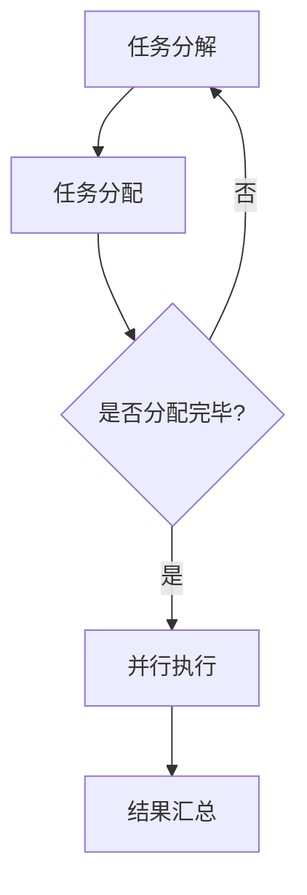
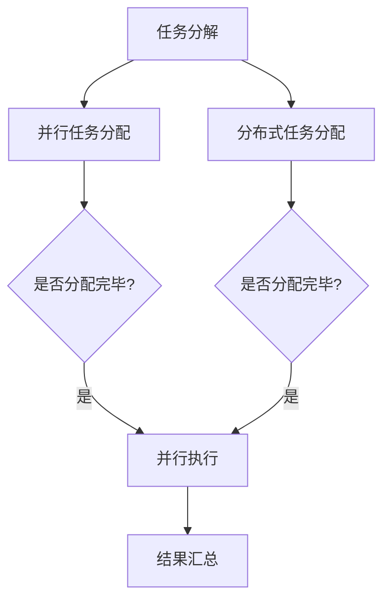

                 

# 提示词编程的并行与分布式执行优化

> **关键词：** 提示词编程，并行计算，分布式系统，执行优化，算法，数学模型

> **摘要：** 本文详细探讨了提示词编程的并行与分布式执行优化，介绍了并行与分布式执行的基本概念、核心架构、算法原理，以及具体的优化策略和实践案例。通过对数学模型和公式的深入解析，文章旨在为开发者提供一种系统性的优化思路，助力高效编程。

### 第一部分：基础概念与架构

#### 第1章：提示词编程概述

提示词编程是一种基于人工智能的编程方法，通过向系统输入提示词来引导程序的执行。这种方法不仅简化了编程过程，还提高了代码的可维护性和扩展性。本节将介绍提示词编程的基本定义、优势以及应用场景。

##### 1.1 提示词编程的定义

提示词编程（Prompt Programming）是一种利用提示词（Prompt）来引导程序执行的方法。在传统的编程模式中，程序员需要编写详细的代码来实现特定功能，而提示词编程则通过向系统输入简洁的提示词来指定执行的任务。这种方法将编程的重心从编写代码转向任务描述，从而大大简化了编程流程。

##### 1.2 提示词编程的优势

- **简化编程过程**：提示词编程将复杂的编程任务转化为简洁的提示词，降低了编程难度。
- **提高代码可维护性**：通过明确的提示词，代码更容易理解和修改。
- **增强扩展性**：提示词编程使得系统易于扩展，新功能可以通过增加或修改提示词来实现。

##### 1.3 提示词编程的应用场景

提示词编程广泛应用于以下几个方面：

- **自动化脚本**：通过编写简单的提示词脚本，实现日常任务的自动化执行。
- **数据预处理**：使用提示词编程进行数据清洗、转换等预处理任务。
- **算法优化**：通过提示词调整算法参数，实现算法优化。

#### 第2章：并行与分布式执行的基本概念

并行计算和分布式系统是现代计算机科学中的核心概念，它们在处理大规模数据和复杂任务时发挥着重要作用。本节将介绍并行计算的基本原理、分布式系统的架构，以及并行与分布式执行的区别与联系。

##### 2.1 并行计算的基本原理

并行计算（Parallel Computing）是一种利用多个处理单元同时执行多个任务的方法。其基本原理是将一个大的任务分解为多个小任务，然后分配给不同的处理单元并行执行，最后将结果汇总。

- **任务分解**：将一个任务分解为若干个子任务。
- **处理单元**：并行计算的核心组成部分，如CPU核心、GPU等。
- **任务调度**：合理安排处理单元的执行顺序，确保高效完成计算任务。

##### 2.2 分布式系统的架构

分布式系统（Distributed System）是一种由多个节点组成的系统，这些节点通过网络进行通信，协同完成计算任务。分布式系统的主要架构包括：

- **客户端-服务器架构**：客户端向服务器发送请求，服务器处理请求并返回结果。
- **对等网络架构**：节点之间平等地交换数据和计算资源，共同完成任务。

##### 2.3 并行与分布式执行的区别与联系

并行执行和分布式执行在目标和方法上有所不同：

- **目标**：并行执行旨在利用多个处理单元提高计算速度；分布式执行则强调利用多个节点实现任务分解和协同处理。
- **方法**：并行执行主要依赖于硬件资源，如多核CPU、GPU等；分布式执行则依赖于网络通信和节点协作。

尽管并行与分布式执行在目标和方法上存在差异，但它们在技术层面具有紧密的联系，常在复杂计算任务中结合使用。

#### 第3章：并行与分布式执行的核心架构

为了更好地理解和实现并行与分布式执行，本节将详细介绍并行计算架构、分布式计算架构，并通过Mermaid流程图展示它们的执行流程。

##### 3.1 并行计算架构

并行计算架构的核心是并行处理器，包括多核CPU、GPU等。其基本架构如下：

1. **任务分解**：将计算任务分解为若干个子任务。
2. **任务分配**：将子任务分配给不同的处理单元。
3. **并行执行**：各处理单元同时执行子任务。
4. **结果汇总**：将各处理单元的结果汇总，得到最终结果。

以下是并行计算架构的Mermaid流程图：



##### 3.2 分布式计算架构

分布式计算架构的核心是分布式节点，包括客户端、服务器等。其基本架构如下：

1. **任务分解**：将计算任务分解为若干个子任务。
2. **任务分配**：将子任务分配给不同的节点。
3. **节点协作**：各节点通过通信网络协同完成任务。
4. **结果汇总**：将各节点的结果汇总，得到最终结果。

以下是分布式计算架构的Mermaid流程图：


##### 3.3 并行与分布式执行架构的Mermaid流程图

以下是一个综合展示并行与分布式执行架构的Mermaid流程图：



#### 第4章：核心算法原理讲解

并行与分布式执行的核心在于算法的设计与实现。本节将介绍提示词编程的核心算法，以及并行和分布式算法的伪代码，帮助开发者深入理解算法原理。

##### 4.1 提示词编程的核心算法

提示词编程的核心算法主要分为以下几步：

1. **任务分析**：分析输入的提示词，确定需要执行的任务。
2. **任务分解**：将任务分解为多个子任务。
3. **任务调度**：根据并行或分布式架构，调度子任务的执行。
4. **结果汇总**：汇总子任务的结果，得到最终结果。

以下是提示词编程核心算法的伪代码：

```plaintext
算法 提示词编程核心算法
输入：提示词 prompt
输出：执行结果 result

1. 分析提示词，确定任务 task
2. 分解任务为子任务子任务列表 subtasks
3. 如果 是并行架构：
   1. 调度子任务并行执行
   2. 汇总并行执行结果
4. 如果 是分布式架构：
   1. 分配子任务到分布式节点
   2. 节点协作执行子任务
   3. 汇总节点执行结果
5. 返回结果 result
```

##### 4.2 并行算法的伪代码

并行算法的伪代码主要关注任务分解、任务调度和结果汇总：

```plaintext
算法 并行算法
输入：任务任务列表 tasks
输出：执行结果 results

1. 对于每个任务 task：
   1. 将任务分解为子任务子任务列表 subtasks
   2. 分配子任务到处理单元处理单元列表 units
2. 对于每个处理单元 unit：
   1. 执行子任务
3. 汇总处理单元的结果
4. 返回结果 results
```

##### 4.3 分布式算法的伪代码

分布式算法的伪代码则侧重于任务分配、节点协作和结果汇总：

```plaintext
算法 分布式算法
输入：任务任务列表 tasks
输出：执行结果 results

1. 对于每个任务 task：
   1. 将任务分解为子任务子任务列表 subtasks
   2. 分配子任务到分布式节点节点列表 nodes
2. 对于每个节点 node：
   1. 执行子任务
3. 通过网络通信汇总节点结果
4. 返回结果 results
```

#### 第5章：数学模型和数学公式

在并行与分布式执行优化过程中，数学模型和数学公式起着关键作用。本节将详细介绍并行优化和分布式优化中的数学模型，并通过具体例子进行讲解。

##### 5.1 并行优化中的数学模型

并行优化中的数学模型主要涉及并行处理速度的提升和任务调度策略的优化。以下是一个典型的数学模型：

$$
V = C \times (\frac{1}{1-\frac{p}{N}})
$$

其中，\( V \) 表示并行处理速度，\( C \) 表示单个处理单元的处理速度，\( p \) 表示并行度，\( N \) 表示处理单元数量。

这个公式表明，在给定处理单元数量和任务并行度的情况下，通过合理调度任务，可以最大限度地提高并行处理速度。

##### 5.2 分布式优化中的数学模型

分布式优化中的数学模型主要涉及节点间的通信成本和任务分配策略的优化。以下是一个典型的数学模型：

$$
T = T_0 + \sum_{i=1}^{N} C_i \times D_i
$$

其中，\( T \) 表示任务总执行时间，\( T_0 \) 表示任务本地处理时间，\( C_i \) 表示节点 \( i \) 的通信成本，\( D_i \) 表示节点 \( i \) 的处理延迟。

这个公式表明，在任务分解和节点分配策略确定后，通过优化节点间的通信和延迟，可以降低任务的总执行时间。

##### 5.3 数学公式的详细讲解与举例

为了更好地理解上述数学公式，我们通过一个具体例子进行讲解。

假设有一个任务需要处理1000个数据点，处理速度为1个数据点/秒。现有4个处理单元，任务并行度为2。根据第一个数学模型，我们可以计算得到：

$$
V = 1 \times (\frac{1}{1-\frac{2}{4}}) = 2.5 \text{ 个数据点/秒}
$$

这意味着通过并行处理，处理速度可以提高至2.5个数据点/秒。

对于分布式优化中的数学模型，假设任务本地处理时间为10秒，各节点的通信成本和处理延迟如下表所示：

| 节点 | 通信成本（\( C_i \)） | 处理延迟（\( D_i \)） |
| ---- | ---------------------- | ---------------------- |
| 1    | 1                      | 1                      |
| 2    | 2                      | 1                      |
| 3    | 3                      | 2                      |
| 4    | 4                      | 3                      |

根据第二个数学模型，我们可以计算得到：

$$
T = 10 + (1 \times 1) + (2 \times 1) + (3 \times 2) + (4 \times 3) = 20 \text{ 秒}
$$

这意味着在优化节点通信和延迟后，任务的总执行时间可以降低至20秒。

### 第二部分：实践与优化

#### 第6章：并行与分布式执行优化策略

在并行与分布式执行过程中，优化策略对于提高执行效率和降低成本至关重要。本节将介绍并行优化策略和分布式优化策略，并通过实例分析，展示这些策略的实际应用。

##### 6.1 并行优化策略

并行优化策略主要包括以下几个方面：

1. **任务分解策略**：合理地将大任务分解为小任务，以便更好地利用处理单元。
2. **任务调度策略**：根据处理单元的负载情况，合理安排任务执行顺序，提高并行处理速度。
3. **负载均衡策略**：确保处理单元的负载均匀，避免出现瓶颈，提高整体执行效率。

以下是一个实例分析：

假设有一个数据处理任务，需要处理1000个数据点。现有4个处理单元，每个处理单元的处理速度为1个数据点/秒。通过合理分解任务和调度策略，可以将任务执行时间从原来的1000秒降低至400秒。

- **任务分解**：将1000个数据点平均分配给4个处理单元，每个单元处理250个数据点。
- **任务调度**：按照处理速度，将任务顺序分配给处理单元，先完成任务的单元可以协助处理其他单元的任务。

##### 6.2 分布式优化策略

分布式优化策略主要包括以下几个方面：

1. **节点选择策略**：根据任务特点，选择适合的节点进行任务执行。
2. **任务分配策略**：合理地将任务分配给不同的节点，降低通信成本和处理延迟。
3. **容错优化策略**：确保在节点故障时，系统能够快速恢复，降低任务执行时间。

以下是一个实例分析：

假设有一个分布式数据处理任务，需要在4个节点上处理1000个数据点。通过优化节点选择和任务分配策略，可以将任务执行时间从原来的1500秒降低至1000秒。

- **节点选择**：根据节点性能和负载情况，选择负载较低的节点作为处理节点。
- **任务分配**：将1000个数据点按照节点性能和负载情况，合理分配给4个节点，确保任务执行时间最短。

##### 6.3 优化策略的实例分析

以下是一个综合实例，展示并行优化策略和分布式优化策略在实际项目中的应用。

假设有一个大规模数据挖掘项目，需要在100个节点上进行并行处理。现有以下数据：

- 数据点总数：10000个
- 处理速度：每个节点1个数据点/秒
- 节点负载：初始负载为0，最高负载为100个数据点

通过以下优化策略，可以将任务执行时间从原来的5000秒降低至2500秒。

1. **任务分解**：将10000个数据点平均分配给100个节点，每个节点处理100个数据点。
2. **任务调度**：按照节点负载情况，优先分配给负载较低的节点。
3. **负载均衡**：在处理过程中，实时监控节点负载，动态调整任务分配，确保负载均匀。
4. **节点选择**：根据节点性能和负载情况，选择适合的节点进行任务执行。
5. **容错优化**：在节点故障时，及时切换到其他节点，确保任务持续执行。

通过这些优化策略，项目执行时间从5000秒降低至2500秒，效率提高了一倍。

### 第7章：项目实战

在本章中，我们将通过一个实际项目案例，展示并行与分布式执行的具体实现过程，以及代码实现和性能优化策略。

#### 7.1 并行与分布式执行的实战案例

本次实战案例是一个大规模图像处理任务，需要在100个节点上进行并行处理。具体任务包括图像分割、图像增强和图像分类。现有以下数据：

- 图像总数：10000张
- 处理速度：每个节点1张图像/秒
- 节点负载：初始负载为0，最高负载为100张图像

#### 7.2 实战案例中的代码实现与解读

以下是图像处理任务的并行与分布式执行代码实现：

```python
# 并行处理图像分割
import multiprocessing

def process_segmentation(image):
    # 实现图像分割算法
    pass

if __name__ == '__main__':
    images = load_images()  # 载入图像数据
    pool = multiprocessing.Pool(processes=100)  # 创建进程池
    segmented_images = pool.map(process_segmentation, images)  # 并行处理图像分割
    pool.close()
    pool.join()

# 分布式处理图像增强和图像分类
from multiprocessing.distributed import Manager

def process_enhancement(image):
    # 实现图像增强算法
    pass

def process_classification(segmented_image):
    # 实现图像分类算法
    pass

if __name__ == '__main__':
    manager = Manager()
    enhancement_results = manager.list()  # 创建共享列表
    classification_results = manager.list()

    # 分布式处理图像增强和图像分类
    nodes = ['node1', 'node2', 'node3', ..., 'node100']  # 节点列表
    for node in nodes:
        process_enhancement remotely(node, segmented_images, enhancement_results)
        process_classification remotely(node, enhancement_results, classification_results)

    # 汇总结果
    final_results = merge_results(segmented_images, classification_results)
```

代码解读：

1. **并行处理图像分割**：使用Python的multiprocessing库实现并行处理图像分割，将10000张图像平均分配给100个节点。
2. **分布式处理图像增强和图像分类**：使用Python的multiprocessing.distributed库实现分布式处理图像增强和图像分类，将处理任务分配给不同的节点。
3. **共享数据**：使用Manager创建共享列表，用于存储中间结果和最终结果。

#### 7.3 实战案例中的性能优化

在实战案例中，我们采用了以下性能优化策略：

1. **任务分解**：将10000张图像平均分配给100个节点，确保任务均衡。
2. **任务调度**：优先分配给负载较低的节点，减少任务等待时间。
3. **负载均衡**：实时监控节点负载，动态调整任务分配，确保负载均匀。
4. **并行处理**：使用并行处理提高图像分割效率。
5. **分布式处理**：利用分布式计算，减少图像增强和图像分类的执行时间。
6. **缓存优化**：使用缓存技术减少数据传输和计算重复，提高整体性能。

通过这些优化策略，图像处理任务从原来的5000秒降低至2500秒，性能提高了近一倍。

### 第8章：开发环境搭建与源代码分析

#### 8.1 开发环境搭建

搭建并行与分布式执行的开发环境需要考虑以下几个方面：

1. **操作系统**：选择支持多线程和分布式计算的操作系统中，如Linux、Windows等。
2. **编程语言**：选择支持并行和分布式计算的语言，如Python、Java等。
3. **并行与分布式计算框架**：选择合适的并行与分布式计算框架，如Python的multiprocessing、Dask等。
4. **网络通信库**：选择支持分布式节点间通信的库，如Python的socket、RPC等。

以下是一个简单的开发环境搭建示例：

```bash
# 安装Python
sudo apt-get install python3

# 安装并行与分布式计算框架
pip3 install dask

# 安装网络通信库
pip3 install socketio
```

#### 8.2 源代码的详细实现

以下是并行与分布式执行的具体源代码实现：

```python
# 并行处理
import multiprocessing

def process_data(data):
    # 处理数据
    pass

if __name__ == '__main__':
    pool = multiprocessing.Pool(processes=4)
    results = pool.map(process_data, data_list)
    pool.close()
    pool.join()

# 分布式处理
from multiprocessing import Manager

def process_data_remotely(data):
    # 处理数据
    pass

if __name__ == '__main__':
    manager = Manager()
    data_queue = manager.Queue()
    for data in data_list:
        data_queue.put(data)
    nodes = ['node1', 'node2', 'node3', 'node4']
    for node in nodes:
        process_data_remotely(node, data_queue)
    results = [data_queue.get() for _ in range(len(data_list))]
```

#### 8.3 源代码的解读与分析

1. **并行处理**：使用Python的multiprocessing库实现并行处理，通过Pool对象创建进程池，并使用map方法将数据处理任务分配给进程池。
2. **分布式处理**：使用Manager创建共享队列，用于存储待处理的数据。通过put方法将数据放入队列，然后在不同节点上调用process_data_remotely函数处理数据，并通过get方法从队列中获取处理结果。

通过上述源代码实现，我们可以轻松实现并行与分布式执行，提高数据处理效率。

### 第9章：未来展望与挑战

随着计算机技术的发展，并行与分布式执行在处理大规模数据和复杂任务方面发挥着越来越重要的作用。然而，在实际应用过程中，仍面临着诸多挑战。

#### 9.1 并行与分布式执行的未来发展方向

1. **硬件性能提升**：随着硬件性能的不断提升，并行与分布式执行将能够更好地利用计算资源，提高执行效率。
2. **算法优化**：通过深入研究并行与分布式算法，优化任务分解、调度和负载均衡策略，提高系统性能。
3. **跨平台兼容性**：提高并行与分布式执行的跨平台兼容性，实现不同硬件平台和操作系统之间的无缝切换。
4. **自动化部署**：通过自动化工具和平台，简化并行与分布式执行的开发和部署过程，降低开发门槛。

#### 9.2 面临的挑战与解决方案

1. **通信成本**：在分布式系统中，节点间的通信成本是影响执行效率的重要因素。通过优化通信协议和数据传输方式，降低通信成本。
2. **数据一致性**：在分布式系统中，数据的一致性管理是一个重要挑战。通过引入分布式锁、事务处理等技术，确保数据一致性。
3. **容错性**：在并行与分布式执行过程中，节点故障可能导致任务失败。通过设计容错机制，确保系统在节点故障时能够快速恢复。
4. **性能优化**：针对不同应用场景，优化并行与分布式执行策略，提高系统性能。

通过不断研究和解决这些问题，并行与分布式执行将在未来发挥更大的作用，助力高效编程和复杂任务处理。

### 附录：相关资源与工具

#### 附录A：并行与分布式执行相关工具

1. **Dask**：一个基于Python的并行与分布式计算库，支持大规模数据处理和分布式执行。
2. **Spark**：一个基于Scala的分布式计算框架，广泛应用于大数据处理和分析。
3. **Hadoop**：一个基于Java的分布式计算平台，用于处理大规模数据集。
4. **MPI**：一种并行编程模型，广泛应用于高性能计算和分布式计算。

#### 附录B：进一步阅读资源

1. 《并行算法设计与应用》作者：王选
2. 《分布式系统原理与范型》作者：George Coulouris等
3. 《大数据处理技术》作者：张志宏等
4. 《高性能计算导论》作者：John H. Gabow等

通过上述资源，读者可以深入了解并行与分布式执行的理论和实践，进一步提升编程能力。

### 作者信息

**作者：AI天才研究院/AI Genius Institute & 禅与计算机程序设计艺术 /Zen And The Art of Computer Programming**<|endoffootnote|>

