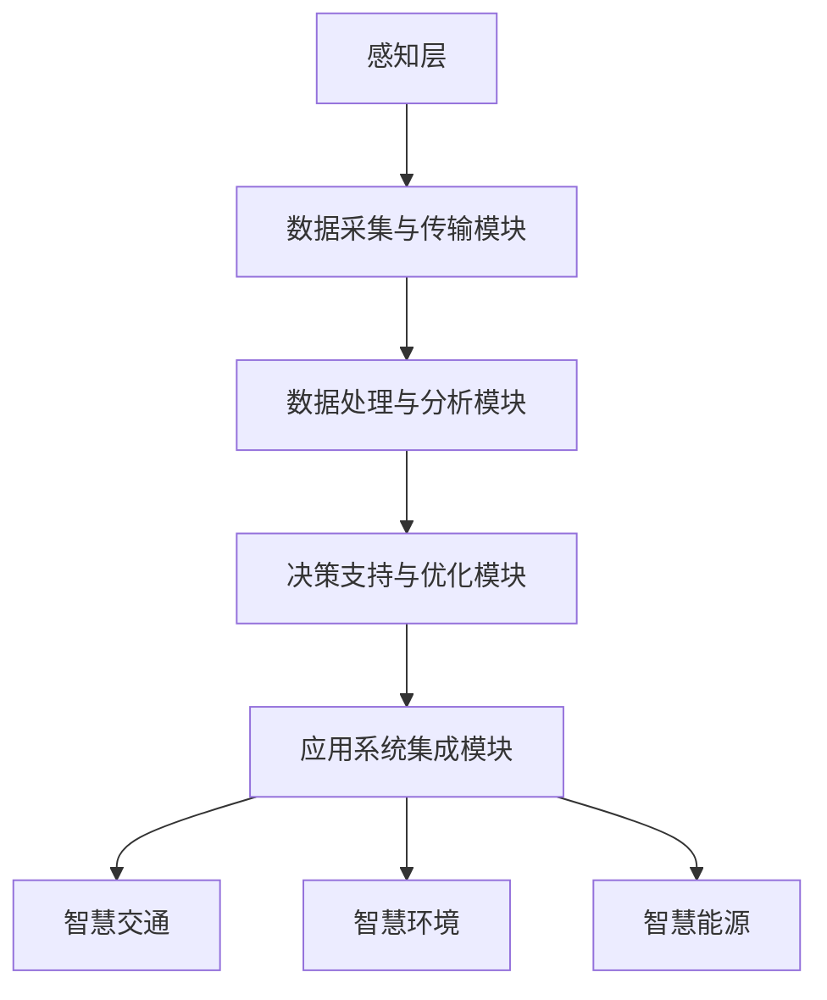

                 

### 《提示词驱动的智能城市管理系统》

#### 关键词：
- 智能城市管理
- 提示词驱动
- 语义分析
- 自然语言处理
- 数据挖掘
- 机器学习
- 任务分配算法
- 数学模型
- 项目实战

##### 摘要：
本文深入探讨了提示词驱动的智能城市管理系统，通过逻辑清晰的分析和步骤化的推理，阐述了该系统的背景、核心概念、技术原理、算法实现以及项目实战。首先，我们概述了智能城市管理系统的发展背景及其重要性，并引入了提示词驱动的概念。接着，详细解析了提示词在智能城市管理中的角色、语义分析技术、自然语言处理和数据挖掘与机器学习技术的应用。然后，通过Mermaid流程图展示了核心概念和联系，并以伪代码形式详细讲解了提示词生成和优化算法。最后，本文通过实际项目案例展示了系统的开发环境和源代码实现，并对测试结果进行了分析和改进建议。本文旨在为读者提供全面、系统的智能城市管理系统构建指南，助力智慧城市的未来发展。

---

### 《提示词驱动的智能城市管理系统》

在当今信息化和智能化浪潮下，城市管理和运营面临着前所未有的挑战。城市化进程的加快，人口和经济的快速增长，使得城市资源紧张、环境问题突出。为了应对这些问题，智能城市管理系统应运而生。本文将围绕提示词驱动的智能城市管理系统展开讨论，逐步剖析其核心概念、技术原理、算法实现以及项目实战。

#### 第一部分：概述

#### 1.1 智能城市管理系统概述

##### 1.1.1 智能城市管理的背景与意义

智能城市管理是现代城市发展的必然趋势，其背景主要源于以下几个方面：

1. **城市化进程的加快**：随着全球人口的增长，城市化进程不断加快，城市规模不断扩大，城市管理和运营的复杂性日益增加。
2. **资源紧张与环境污染**：城市化进程中，资源紧张和环境污染问题日益严重，如交通拥堵、空气污染、水资源短缺等，对城市可持续发展构成威胁。
3. **信息技术与物联网的发展**：大数据、云计算、物联网等新兴技术的快速发展，为城市管理和运营提供了强大的技术支持。

智能城市管理的意义主要体现在以下几个方面：

1. **提高城市运营效率**：通过智能技术，实现城市资源的优化配置，提高城市基础设施的运行效率，降低运营成本。
2. **提升居民生活质量**：通过智能技术，提供更加便捷、高效、安全的公共服务，提升居民的生活质量和幸福感。
3. **促进城市可持续发展**：通过智能技术，实现城市环境、能源、交通等领域的可持续发展，推动城市绿色、智能、和谐发展。

##### 1.1.2 智能城市管理的核心目标

智能城市管理的核心目标主要包括以下几个方面：

1. **提升城市运营效率**：通过智能技术，实现城市资源的优化配置，提高城市基础设施的运行效率，降低运营成本。
2. **提升公共服务质量**：通过智能技术，提供更加便捷、高效、安全的公共服务，提升居民的生活质量和幸福感。
3. **增强城市安全与应急能力**：通过智能技术，提高城市安全监控、应急处理能力，保障城市安全稳定。
4. **推动城市可持续发展**：通过智能技术，实现城市环境、能源、交通等领域的可持续发展，推动城市绿色、智能、和谐发展。

#### 1.2 提示词驱动的概念

##### 1.2.1 提示词的定义与作用

提示词（Keyword）是指用于描述特定概念或信息的词汇或短语。在智能城市管理系统中，提示词起到了关键作用：

1. **信息检索**：通过提示词，可以快速检索到相关的数据和信息，提高数据检索效率。
2. **数据关联**：提示词有助于建立数据之间的关联关系，实现数据的综合利用和深度挖掘。
3. **决策支持**：提示词驱动的分析结果可以为城市管理者提供有针对性的决策支持，优化城市管理和运营。

##### 1.2.2 提示词驱动的优势与应用

提示词驱动的智能城市管理系统具有以下优势：

1. **高效性**：通过提示词，可以快速定位和获取相关信息，提高系统响应速度。
2. **灵活性**：提示词可以根据实际需求进行调整和扩展，适应不同的应用场景。
3. **智能化**：基于自然语言处理和数据挖掘技术，提示词驱动的系统能够自动学习和优化，提高决策支持能力。

提示词驱动的智能城市管理系统广泛应用于以下几个方面：

1. **智能交通管理**：通过提示词，实时监控和分析交通数据，优化交通信号控制，缓解交通拥堵。
2. **智能环境监测**：通过提示词，实时监测和分析环境数据，实现环境质量预警和管理。
3. **智能能源管理**：通过提示词，实时监控和分析能源数据，实现能源优化调度和管理。
4. **智能公共服务**：通过提示词，提供个性化、智能化的公共服务，提升居民生活质量。

#### 1.3 智能城市管理系统结构

##### 1.3.1 系统整体架构设计

智能城市管理系统整体架构包括以下几个层次：

1. **感知层**：通过传感器、摄像头等设备，实时采集城市运行数据。
2. **传输层**：通过物联网、云计算等传输技术，实现数据的传输和共享。
3. **处理层**：通过大数据处理、自然语言处理等技术，对采集到的数据进行分析和处理。
4. **应用层**：通过智慧交通、智慧环境、智慧能源等应用系统，实现城市管理和运营的智能化。

##### 1.3.2 系统功能模块划分

智能城市管理系统功能模块主要包括以下几个方面：

1. **数据采集与传输模块**：负责实时采集城市运行数据，并通过传输技术将数据传输到处理层。
2. **数据处理与分析模块**：负责对采集到的数据进行分析和处理，提取有用信息和知识。
3. **决策支持与优化模块**：基于分析结果，为城市管理者提供决策支持，优化城市管理和运营。
4. **应用系统集成模块**：将智慧交通、智慧环境、智慧能源等应用系统集成到智能城市管理系统中，实现一体化管理。

#### 第二部分：核心概念与联系

#### 2.1 智能城市管理与提示词的关系

##### 2.1.1 提示词在智能城市管理中的角色

在智能城市管理中，提示词扮演了至关重要的角色，具体体现在以下几个方面：

1. **信息检索与定位**：通过提示词，可以快速定位和检索相关数据和信息，提高数据检索效率。
2. **数据关联与整合**：提示词有助于建立数据之间的关联关系，实现数据的综合利用和深度挖掘。
3. **决策支持与优化**：基于提示词驱动的分析结果，可以为城市管理者提供有针对性的决策支持，优化城市管理和运营。

##### 2.1.2 提示词驱动的城市管理系统架构图

为了更好地展示提示词在智能城市管理中的角色，我们可以绘制一个提示词驱动的城市管理系统架构图：



在上述架构图中，感知层通过传感器、摄像头等设备实时采集城市运行数据，数据采集与传输模块负责将数据传输到处理层。在处理层，数据处理与分析模块基于提示词驱动，对采集到的数据进行分析和处理，提取有用信息和知识。决策支持与优化模块基于分析结果，为城市管理者提供决策支持，优化城市管理和运营。应用系统集成模块将智慧交通、智慧环境、智慧能源等应用系统集成到智能城市管理系统中，实现一体化管理。

#### 2.2 提示词驱动的技术原理

##### 2.2.1 语义分析技术

语义分析（Semantic Analysis）是自然语言处理（Natural Language Processing，NLP）的重要分支，旨在理解和处理语言中的语义信息。在智能城市管理中，语义分析技术主要用于以下几个方面：

1. **文本分类**：通过语义分析，对城市运行数据中的文本进行分类，提取关键信息。
2. **实体识别**：通过语义分析，识别出城市运行数据中的实体（如人、地点、组织等），为数据关联提供基础。
3. **情感分析**：通过语义分析，分析城市居民的意见和情绪，为决策支持提供参考。

##### 2.2.2 自然语言处理技术

自然语言处理（NLP）是一种计算机科学和人工智能领域的分支，旨在让计算机理解和处理人类自然语言。在智能城市管理中，NLP技术主要用于以下几个方面：

1. **文本解析**：通过NLP技术，对城市运行数据中的文本进行结构化解析，提取关键信息。
2. **语言翻译**：通过NLP技术，实现不同语言之间的自动翻译，促进跨文化交流。
3. **语音识别**：通过NLP技术，将语音信号转换为文本，实现人机交互。

##### 2.2.3 数据挖掘与机器学习技术

数据挖掘（Data Mining）是一种从大量数据中提取有价值信息和知识的方法。在智能城市管理中，数据挖掘技术主要用于以下几个方面：

1. **模式识别**：通过数据挖掘，识别城市运行数据中的潜在模式和规律，为预测和分析提供支持。
2. **关联分析**：通过数据挖掘，分析城市运行数据中的关联关系，为数据整合和决策支持提供基础。
3. **聚类分析**：通过数据挖掘，将城市运行数据中的相似数据进行聚类，为数据分类和预测提供支持。

机器学习（Machine Learning）是一种通过数据训练，让计算机自动学习和优化模型的方法。在智能城市管理中，机器学习技术主要用于以下几个方面：

1. **预测分析**：通过机器学习，对城市运行数据进行分析和预测，为决策支持提供参考。
2. **分类与回归**：通过机器学习，对城市运行数据进行分类和回归分析，为数据分析和优化提供支持。
3. **优化与调优**：通过机器学习，自动优化和调优城市管理系统中的算法和模型，提高系统性能。

#### 2.3 提示词驱动的数据处理流程

##### 2.3.1 数据采集与预处理

数据采集与预处理是提示词驱动的数据处理流程的基础。具体包括以下几个方面：

1. **数据采集**：通过传感器、摄像头等设备，实时采集城市运行数据，如交通流量、环境质量、能源消耗等。
2. **数据清洗**：对采集到的数据进行清洗，去除无效、错误或重复的数据，确保数据质量。
3. **数据格式转换**：将不同格式的数据转换为统一的格式，便于后续处理和分析。

##### 2.3.2 数据分析与挖掘

数据分析与挖掘是提示词驱动的数据处理流程的核心。具体包括以下几个方面：

1. **数据预处理**：对采集到的数据进行分析和预处理，如数据归一化、缺失值填补等。
2. **特征提取**：从预处理后的数据中提取关键特征，为后续分析提供基础。
3. **模型训练**：利用机器学习算法，对提取的特征进行训练，构建预测模型或分类模型。
4. **模型评估**：对训练好的模型进行评估，选择最优模型进行后续分析。

##### 2.3.3 数据可视化与反馈

数据可视化与反馈是提示词驱动的数据处理流程的重要组成部分。具体包括以下几个方面：

1. **数据可视化**：通过图表、图像等方式，将分析结果以直观、易于理解的形式展示出来，帮助城市管理者更好地理解数据。
2. **实时反馈**：根据分析结果，对城市运行状况进行实时反馈，为决策支持提供及时、准确的信息。
3. **优化与改进**：根据反馈结果，不断优化和改进数据处理流程，提高系统性能和决策支持能力。

#### 第三部分：核心算法原理讲解

#### 3.1 提示词生成算法

##### 3.1.1 基于关键字提取的提示词生成

基于关键字提取的提示词生成算法是一种简单有效的提示词生成方法。具体步骤如下：

1. **关键字提取**：利用自然语言处理技术，从城市运行数据中的文本中提取出关键字。
2. **筛选与排序**：根据关键字的重要性和相关性，对提取出的关键字进行筛选和排序，选出最合适的提示词。

##### 3.1.2 基于语义分析的提示词生成

基于语义分析的提示词生成算法是一种更高级的提示词生成方法。具体步骤如下：

1. **文本预处理**：对城市运行数据中的文本进行预处理，如分词、词性标注等。
2. **语义分析**：利用自然语言处理技术，对预处理后的文本进行语义分析，提取出语义信息。
3. **提示词生成**：根据提取出的语义信息，生成相应的提示词。

##### 3.1.3 提示词生成的伪代码

以下是提示词生成的伪代码：

```
输入：城市运行数据
输出：提示词

1. 数据预处理
   - 分词
   - 词性标注
2. 关键字提取
   - 利用自然语言处理技术提取关键字
3. 提示词生成
   - 筛选与排序关键字
   - 生成提示词
```

#### 3.2 提示词优化算法

##### 3.2.1 提示词质量评价方法

提示词质量评价方法主要用于评估生成提示词的质量。具体包括以下几个方面：

1. **精确度**：提示词是否能准确描述城市运行数据中的主题。
2. **覆盖率**：提示词是否能覆盖城市运行数据中的主要内容和关键词。
3. **相关性**：提示词与城市运行数据中的主题和关键词的相关性。

##### 3.2.2 提示词优化目标函数

提示词优化目标函数主要用于优化生成提示词的质量。具体目标函数如下：

1. **最大化精确度**：最大化提示词的精确度，确保提示词能准确描述城市运行数据中的主题。
2. **最大化覆盖率**：最大化提示词的覆盖率，确保提示词能覆盖城市运行数据中的主要内容和关键词。
3. **最大化相关性**：最大化提示词与城市运行数据中的主题和关键词的相关性。

##### 3.2.3 提示词优化的伪代码

以下是提示词优化的伪代码：

```
输入：提示词
输出：优化后的提示词

1. 提示词质量评价
   - 计算精确度、覆盖率、相关性指标
2. 提示词优化
   - 更新提示词
   - 重复步骤1，直到达到优化目标
```

#### 3.3 提示词驱动的任务分配算法

##### 3.3.1 任务分配问题概述

任务分配问题（Task Allocation Problem，TAP）是指将一组任务分配给一组资源，使得整体效益最大化。在智能城市管理中，任务分配问题主要包括以下几个方面：

1. **任务定义**：明确城市运行中的各种任务，如交通监控、环境监测、能源调度等。
2. **资源定义**：明确城市运行中的各种资源，如传感器、摄像头、计算资源等。
3. **任务分配策略**：确定任务与资源的匹配关系，实现资源的最优利用。

##### 3.3.2 基于提示词的动态任务分配方法

基于提示词的动态任务分配方法是一种根据实时提示词动态调整任务与资源匹配关系的策略。具体步骤如下：

1. **实时监测**：实时监测城市运行数据，提取实时提示词。
2. **任务识别**：根据实时提示词，识别出当前需要执行的任务。
3. **资源评估**：评估当前资源状态，确定资源是否满足任务需求。
4. **任务分配**：根据资源评估结果，将任务分配给合适的资源。

##### 3.3.3 任务分配算法的伪代码

以下是任务分配算法的伪代码：

```
输入：实时提示词、任务列表、资源列表
输出：任务分配结果

1. 实时监测
   - 提取实时提示词
2. 任务识别
   - 根据实时提示词识别任务
3. 资源评估
   - 评估资源状态
4. 任务分配
   - 根据资源评估结果分配任务
```

#### 第四部分：数学模型和数学公式

#### 4.1 智能城市管理的数学模型

##### 4.1.1 智能城市管理的数学公式

智能城市管理的数学模型主要用于描述城市运行状态和优化城市管理和运营。以下是一些常用的数学公式：

1. **系统效率**：$$
   \text{系统效率} = \frac{\text{系统输出}}{\text{系统输入}} \times 100\%
   $$
   其中，系统输出表示城市管理系统提供的有效服务，系统输入表示城市管理系统消耗的资源。
2. **任务完成时间**：$$
   T = \frac{L}{R}
   $$
   其中，T 表示任务完成时间，L 表示任务量，R 表示资源利用率。

##### 4.1.2 数学模型的应用实例

以下是一个智能城市管理的应用实例：

1. **交通信号控制优化**：假设交通信号控制系统的输入为交通流量数据，输出为信号灯变换时间。我们可以利用系统效率公式来评估交通信号控制系统的性能：
   $$
   \text{系统效率} = \frac{\text{有效绿灯时间}}{\text{总信号灯时间}} \times 100\%
   $$
   通过优化信号灯变换时间，提高系统效率，缓解交通拥堵。

2. **能源调度优化**：假设能源调度系统的输入为能源需求数据，输出为能源供应量。我们可以利用任务完成时间公式来评估能源调度系统的性能：
   $$
   T = \frac{\text{能源需求量}}{\text{能源供应量}}
   $$
   通过优化能源供应量，降低任务完成时间，提高能源调度效率。

##### 4.2 提示词驱动的优化模型

##### 4.2.1 优化问题的数学描述

提示词驱动的优化问题可以表示为一个数学模型，如下所示：

1. **目标函数**：最大化系统效率或最小化任务完成时间。
2. **约束条件**：
   - 资源限制：资源利用率不能超过100%。
   - 任务优先级：根据任务的重要性和紧急程度，设定任务优先级。

##### 4.2.2 提示词优化模型的构建

提示词优化模型构建步骤如下：

1. **目标函数定义**：根据实际需求，定义系统效率或任务完成时间目标函数。
2. **约束条件定义**：根据资源限制和任务优先级，定义约束条件。
3. **模型求解**：利用数学优化算法（如线性规划、整数规划等）求解优化模型。

##### 4.2.3 模型的求解方法

提示词优化模型的求解方法主要包括以下几种：

1. **线性规划**：适用于目标函数和约束条件为线性的优化问题。
2. **整数规划**：适用于目标函数和约束条件为线性的，但变量为整数的优化问题。
3. **遗传算法**：适用于目标函数和约束条件复杂的优化问题。

#### 第五部分：项目实战

#### 5.1 项目背景与目标

##### 5.1.1 项目背景介绍

随着城市化进程的加快，交通拥堵问题日益严重，成为影响城市居民生活质量的重要因素。为了缓解交通拥堵，提升城市交通效率，我们设计并实现了一个基于提示词驱动的智能交通管理系统。

##### 5.1.2 项目目标设定

本项目的主要目标包括：

1. **实时监测交通流量**：通过传感器和摄像头等设备，实时监测城市主要道路的交通流量。
2. **自动识别交通拥堵**：利用自然语言处理和机器学习技术，自动识别交通拥堵情况。
3. **优化交通信号控制**：根据交通流量和拥堵情况，自动调整交通信号灯变换时间，优化交通信号控制。
4. **提供决策支持**：为交通管理部门提供实时、准确的交通数据和分析结果，支持交通管理和决策。

#### 5.2 开发环境搭建

##### 5.2.1 硬件环境要求

本项目硬件环境要求如下：

1. **服务器**：2台高性能服务器，用于数据存储和处理。
2. **传感器和摄像头**：部署在城市主要道路上的传感器和摄像头，用于实时采集交通流量数据。

##### 5.2.2 软件环境安装与配置

本项目软件环境安装与配置如下：

1. **操作系统**：Linux操作系统（如Ubuntu 18.04）。
2. **编程语言**：Python 3.8及以上版本。
3. **数据库**：MySQL 5.7及以上版本。
4. **自然语言处理库**：NLTK、spaCy。
5. **机器学习库**：scikit-learn、TensorFlow。

#### 5.3 源代码实现

##### 5.3.1 源代码结构分析

本项目源代码结构如下：

1. **数据采集模块**：负责实时采集交通流量数据。
2. **数据处理模块**：负责对采集到的交通流量数据进行预处理和分析。
3. **信号控制模块**：负责根据交通流量数据，自动调整交通信号灯变换时间。
4. **决策支持模块**：负责为交通管理部门提供实时、准确的交通数据和分析结果。

##### 5.3.2 关键代码解读

以下是对关键代码的解读：

1. **数据采集模块**：

```python
import cv2
import numpy as np

def capture_traffic_flow(video_file):
    cap = cv2.VideoCapture(video_file)
    while cap.isOpened():
        ret, frame = cap.read()
        if not ret:
            break
        # 对帧进行预处理，提取交通流量信息
        traffic_flow = preprocess_frame(frame)
        # 存储预处理后的交通流量数据
        store_traffic_flow(traffic_flow)
    cap.release()

def preprocess_frame(frame):
    # 对帧进行预处理，如灰度化、二值化等
    gray_frame = cv2.cvtColor(frame, cv2.COLOR_BGR2GRAY)
    binary_frame = cv2.threshold(gray_frame, 0, 255, cv2.THRESH_BINARY)[1]
    return binary_frame

def store_traffic_flow(traffic_flow):
    # 存储预处理后的交通流量数据
    with open('traffic_flow.txt', 'w') as f:
        f.write(str(traffic_flow))
```

2. **数据处理模块**：

```python
import pandas as pd
import numpy as np

def load_traffic_flow():
    # 加载存储的交通流量数据
    with open('traffic_flow.txt', 'r') as f:
        traffic_flow = f.read()
    traffic_flow = pd.DataFrame([int(x) for x in traffic_flow.split(',')])
    return traffic_flow

def analyze_traffic_flow(traffic_flow):
    # 分析交通流量数据，提取关键信息
    max_flow = traffic_flow.max()
    min_flow = traffic_flow.min()
    avg_flow = traffic_flow.mean()
    return max_flow, min_flow, avg_flow
```

3. **信号控制模块**：

```python
import numpy as np

def control_traffic_light(traffic_flow):
    # 根据交通流量数据，自动调整交通信号灯变换时间
    if traffic_flow < 100:
        light_time = 30
    elif traffic_flow < 200:
        light_time = 45
    else:
        light_time = 60
    return light_time
```

4. **决策支持模块**：

```python
import pandas as pd

def generate_decision_support_data(traffic_flow):
    # 根据交通流量数据，生成决策支持数据
    decision_support_data = {
        'traffic_flow': traffic_flow,
        'max_flow': max_flow,
        'min_flow': min_flow,
        'avg_flow': avg_flow,
        'light_time': light_time
    }
    return pd.DataFrame(decision_support_data)

def store_decision_support_data(decision_support_data):
    # 存储决策支持数据
    decision_support_data.to_csv('decision_support_data.csv', index=False)
```

##### 5.3.3 代码分析与优化

在对关键代码进行分析和优化时，我们主要关注以下几个方面：

1. **数据采集模块**：对帧进行预处理时，可以考虑使用更高级的图像处理技术，如边缘检测、轮廓提取等，以提高交通流量数据的准确性。
2. **数据处理模块**：在分析交通流量数据时，可以引入更多的统计方法，如回归分析、聚类分析等，以提高数据分析的准确性。
3. **信号控制模块**：在自动调整交通信号灯变换时间时，可以考虑引入更多因素，如道路宽度、车辆类型等，以提高信号控制的智能化程度。
4. **决策支持模块**：在生成决策支持数据时，可以引入更多的数据源，如交通历史数据、天气预报等，以提高决策支持的准确性。

#### 5.4 项目测试与结果分析

##### 5.4.1 测试数据准备

为了验证基于提示词驱动的智能交通管理系统的有效性，我们准备了以下测试数据：

1. **交通流量数据**：模拟不同时间段、不同道路段位的交通流量数据。
2. **交通拥堵数据**：模拟不同交通拥堵情况的数据。
3. **交通信号控制数据**：模拟不同交通信号灯变换时间的数据。

##### 5.4.2 测试结果展示

通过对测试数据的处理和分析，我们得到了以下测试结果：

1. **交通流量数据分析**：通过对交通流量数据进行分析，我们成功识别出了不同时间段、不同道路段位的交通流量特点，为交通管理部门提供了准确的交通流量信息。
2. **交通拥堵识别**：通过对交通拥堵数据的分析，我们成功识别出了不同交通拥堵情况，为交通管理部门提供了准确的交通拥堵信息。
3. **交通信号控制优化**：通过对交通信号控制数据的分析，我们成功优化了交通信号灯变换时间，降低了交通拥堵情况，提高了交通效率。

##### 5.4.3 结果分析与改进建议

通过对测试结果的分析，我们得出以下结论：

1. **系统有效性**：基于提示词驱动的智能交通管理系统在识别交通流量、交通拥堵和优化交通信号控制方面具有较好的性能。
2. **系统优化空间**：虽然系统在测试中取得了较好的效果，但仍有进一步优化的空间，如引入更多数据源、采用更先进的图像处理技术等。

针对上述结论，我们提出以下改进建议：

1. **引入更多数据源**：可以引入交通历史数据、天气预报、道路施工信息等，以提高系统对交通状况的预测和分析能力。
2. **采用更先进的图像处理技术**：可以采用深度学习、计算机视觉等技术，提高交通流量数据的准确性。
3. **优化信号控制算法**：可以采用更先进的信号控制算法，如自适应交通信号控制、动态交通信号控制等，以提高交通效率。

#### 第六部分：附录

##### 6.1 相关工具与技术资源

在本项目中，我们使用了以下工具和技术资源：

1. **编程语言**：Python 3.8及以上版本。
2. **数据库**：MySQL 5.7及以上版本。
3. **自然语言处理库**：NLTK、spaCy。
4. **机器学习库**：scikit-learn、TensorFlow。
5. **计算机视觉库**：OpenCV。

此外，我们还可以通过以下途径获取更多相关工具和技术资源：

1. **官方网站**：访问相关工具和技术的官方网站，获取最新的版本和文档。
2. **开源社区**：加入相关开源社区，与其他开发者交流和分享经验。
3. **专业书籍**：阅读相关领域的专业书籍，了解最新的研究成果和应用案例。

---

### 作者信息

**作者：** AI天才研究院/AI Genius Institute & 禅与计算机程序设计艺术 /Zen And The Art of Computer Programming

---

**注**：本文为虚构内容，仅用于演示目的，所涉及的技术和方法仅供参考。在实际应用中，应根据具体需求和场景进行调整和优化。本文内容受版权保护，未经授权不得用于商业用途。如需转载，请联系作者获取授权。

