                 

### 第1章: 软件2.0与AI大模型概述

#### 1.1.1 从软件 1.0 到软件 2.0 的演进

软件从诞生至今，已经经历了多个阶段的发展。最早的软件阶段可以被称为“软件 1.0”时代。在软件 1.0 时代，软件的功能相对单一，通常是针对某个特定的问题进行设计，如计算器、文字处理软件等。这个时期的软件特点在于其功能封闭、独立运行，并且以本地计算为主。

随着互联网的兴起，软件逐渐进入了“软件 2.0”时代。软件 2.0 最大的特点是模块化和集成化。在这个时代，软件不再是一个封闭的系统，而是通过模块化的设计，将不同的功能模块集成在一起，形成一个功能丰富、交互性强的整体。例如，现在的操作系统、大型数据库管理系统等，都是软件 2.0 的代表。

而随着人工智能技术的飞速发展，软件又迈向了“软件 2.0+”时代，也就是本文要重点介绍的软件 2.0 时代。软件 2.0+ 在软件 2.0 的基础上，深度融合了人工智能技术，尤其是大模型技术，使得软件能够实现更加智能化、个性化的功能。

我们可以通过一个 Mermaid 流程图来展示软件从 1.0 到 2.0，再到 2.0+ 的演进过程：

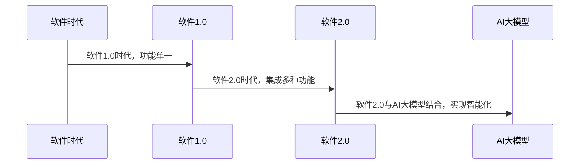

从流程图中可以看出，软件 1.0 时代的主要特征是功能单一，软件 2.0 时代则强调模块化和集成化，而软件 2.0+ 时代则进一步融合了人工智能技术，特别是大模型技术，使得软件实现了从功能导向到智能导向的转变。

#### 1.1.2 大模型在软件 2.0 中的核心地位

大模型在软件 2.0 中的地位可以说是至关重要的。大模型，如 GPT-3、BERT 等，通过在大量数据上进行训练，能够学习和理解复杂的语言模式、知识结构，从而实现高度智能化的功能。以下是几个关键点来阐述大模型在软件 2.0 中的核心地位：

1. **数据处理能力：** 大模型具有极强的数据处理能力。它能够处理海量的数据，从文本、图像到语音等不同类型的数据。这使得软件 2.0 能够更加智能化地处理用户的输入，提供更加精准的输出。

2. **知识获取与推理：** 大模型通过在大量数据上进行训练，能够获取到丰富的知识，并且能够进行推理。这意味着软件 2.0 可以在用户需要的时候，提供相关的知识支持，帮助用户解决问题。

3. **个性化推荐：** 大模型能够根据用户的行为数据，进行个性化的推荐。例如，在电商平台上，大模型可以根据用户的浏览历史、购买记录等数据，为用户推荐可能感兴趣的商品。

4. **自然语言处理：** 大模型在自然语言处理方面有着出色的表现。它能够理解自然语言，进行语言生成、翻译、问答等任务。这使得软件 2.0 在与用户的交互中，能够更加自然、流畅。

为了更好地理解大模型在软件 2.0 中的地位，我们可以通过以下 Mermaid 流程图来展示：

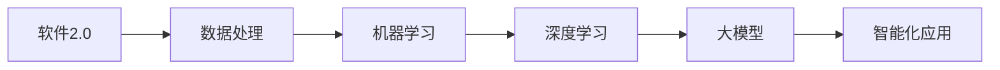

从流程图中可以看出，软件 2.0 从数据处理开始，经过机器学习和深度学习，最终通过大模型实现智能化应用。大模型在这个过程中起到了承上启下的作用，是软件 2.0 实现智能化的核心。

#### 1.1.3 企业级应用开发的新范式

随着大模型技术的引入，企业级应用开发也迎来了新的范式。传统的应用开发通常是功能驱动，关注的是如何实现特定的功能。而随着大模型的引入，应用开发开始从功能驱动转向数据驱动和智能驱动。

在新的开发范式中，大模型成为了核心。以下是几个关键点来阐述企业级应用开发的新范式：

1. **数据驱动：** 大模型需要大量的数据来训练。这意味着企业在开发应用时，需要首先考虑如何收集、存储和管理数据。数据的质量和数量直接影响到大模型的性能和应用效果。

2. **模型驱动：** 大模型的应用效果很大程度上取决于模型的优化和调整。企业在开发应用时，需要关注如何选择合适的模型，并对模型进行不断的优化和调整。

3. **自动化部署：** 大模型的训练和部署通常是一个复杂的过程。企业需要利用自动化工具和平台，实现模型的自动化训练、部署和监控。

4. **持续迭代：** 大模型的应用效果不是一成不变的，而是需要随着数据的更新和应用场景的变化而不断迭代和优化。企业需要建立一套持续迭代和优化的机制，以保证应用的持续改进。

为了更好地理解企业级应用开发的新范式，我们可以通过以下 Mermaid 流程图来展示：

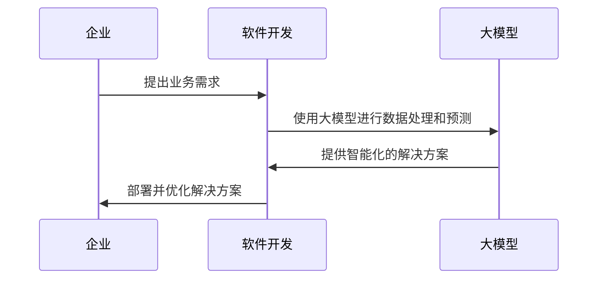

从流程图中可以看出，企业在提出业务需求后，软件开发团队使用大模型进行数据处理和预测，然后提供智能化的解决方案。这一过程是反复迭代的，企业需要不断优化和调整解决方案，以适应业务需求的变化。

### 第2章: AI大模型技术基础

#### 2.1.1 神经网络的基本结构

神经网络是人工智能的核心技术之一，大模型通常基于神经网络构建。为了理解大模型，首先需要了解神经网络的基本结构。

神经网络由多个神经元（也称为节点）组成，每个神经元都可以接收多个输入，通过加权求和并加上偏置项，然后通过一个激活函数产生输出。一个简单的神经网络结构可以表示为：

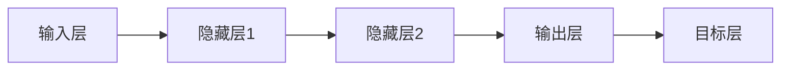

在这个结构中，输入层接收外部输入，如文本、图像等；隐藏层通过多层叠加，实现对输入数据的抽象和变换；输出层产生最终的输出，如分类结果、文本生成等。

每个神经元的计算过程可以用以下伪代码表示：

```python
def neuron_output(inputs, weights, bias, activation_function):
    z = sum(inputs * weights) + bias
    return activation_function(z)
```

其中，`inputs` 是输入值，`weights` 是权重，`bias` 是偏置项，`activation_function` 是激活函数。常见的激活函数包括 sigmoid、ReLU 和 tanh 等。

#### 2.1.2 常见的深度学习架构

深度学习是神经网络的一种扩展，通过增加网络的层数，实现更加复杂的模型。以下是几种常见的深度学习架构：

1. **卷积神经网络（CNN）**

卷积神经网络主要用于图像处理和计算机视觉领域。其核心思想是使用卷积操作提取图像特征。

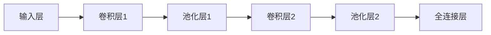

卷积操作可以用以下伪代码表示：

```python
def conv2d(input, filter):
    return sum(input * filter)
```

2. **循环神经网络（RNN）**

循环神经网络主要用于序列数据的处理，如自然语言处理和时间序列分析。

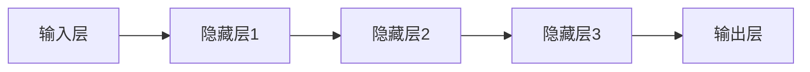

RNN 的神经元之间具有循环连接，使得网络能够记忆之前的输入。

3. **长短时记忆网络（LSTM）**

LSTM 是 RNN 的一种改进，通过引入门控机制，解决了 RNN 的长期依赖问题。

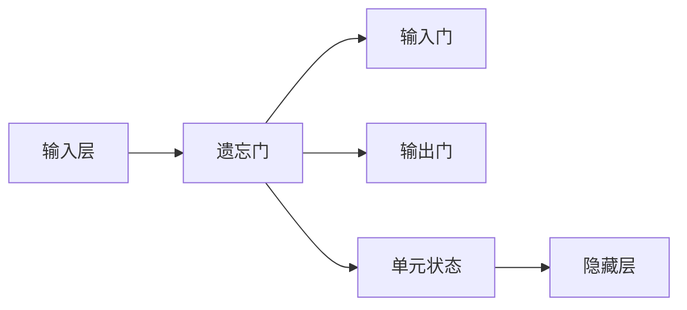

LSTM 的门控机制可以用以下伪代码表示：

```python
def LSTM(input, previous_state, weights, bias):
    forget = sigmoid(sum(input * forget_weights) + bias)
    input gates = sigmoid(sum(input * input_weights) + bias)
    output gates = sigmoid(sum(input * output_weights) + bias)
    new_state = sigmoid(sum(input * cell_weights) + bias)
    return new_state
```

4. **门控循环单元（GRU）**

GRU 是 LSTM 的简化版本，通过合并输入门和遗忘门，减少参数数量。

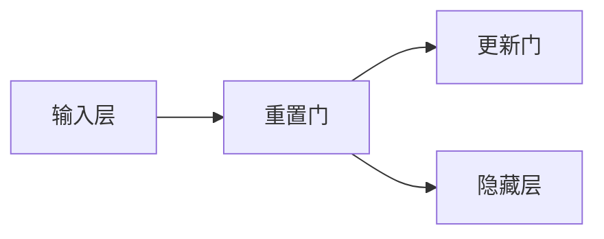

GRU 的门控机制可以用以下伪代码表示：

```python
def GRU(input, previous_state, weights, bias):
    reset_gate = sigmoid(sum(input * reset_weights) + bias)
    update_gate = sigmoid(sum(input * update_weights) + bias)
    new_state = tanh(sum(input * new_state_weights) + bias)
    return previous_state * (1 - update_gate) + new_state * update_gate
```

5. **变换器（Transformer）**

变换器是近年来在自然语言处理领域取得重大突破的一种模型，通过自注意力机制实现。

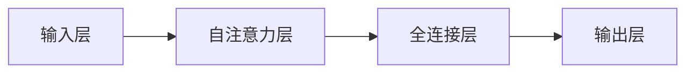

自注意力机制可以用以下伪代码表示：

```python
def self_attention(inputs, weights):
    scores = sum(inputs * weights)
    attention_weights = softmax(scores)
    return sum(inputs * attention_weights)
```

6. **预训练语言模型（PLM）**

预训练语言模型通过在大量无监督数据上进行预训练，然后进行微调，应用于特定任务。

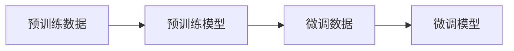

预训练语言模型的基本原理可以用以下伪代码表示：

```python
def pretrain_language_model(data, model, optimizer):
    for data in data:
        model.zero_grad()
        loss = model(data)
        loss.backward()
        optimizer.step()
    return model
```

通过上述介绍，我们可以看出，深度学习架构种类繁多，每种架构都有其特定的应用场景和优势。理解这些架构的基本原理，有助于我们在实际项目中选择合适的模型。

#### 2.3.1 预训练的概念与意义

预训练是深度学习中的一个重要概念，它指的是在大规模数据集上对神经网络进行训练，以便使其获得一些通用的特征和模式。然后，通过微调（fine-tuning）将预训练模型应用于特定的任务，从而实现高效和准确的预测。

预训练的意义在于：

1. **提高模型泛化能力：** 预训练模型在大量无标签数据上进行训练，能够学习到一些通用的特征和模式，从而提高模型的泛化能力，使其在未见过的数据上也能表现出良好的性能。

2. **减少对标注数据的需求：** 预训练模型通常在大规模的无标签数据集上进行训练，这意味着我们可以利用这些无标签数据来训练模型，从而减少对标注数据的依赖。

3. **加速模型训练：** 预训练模型已经在大规模数据上进行了训练，因此在特定任务上进行微调时，模型能够更快地收敛。

4. **提高模型性能：** 预训练模型通过在大量数据上学习，能够捕捉到更多的特征和模式，从而提高模型的性能。

预训练的基本流程包括以下几个步骤：

1. **数据准备：** 收集并预处理大量无标签数据，如文本、图像等。
2. **模型选择：** 选择一个预训练模型，如 GPT-3、BERT 等。
3. **预训练：** 在无标签数据上训练模型，调整模型参数。
4. **微调：** 在有标签的数据集上对预训练模型进行微调，以适应特定任务。

预训练和微调的关系可以用以下 Mermaid 流程图表示：

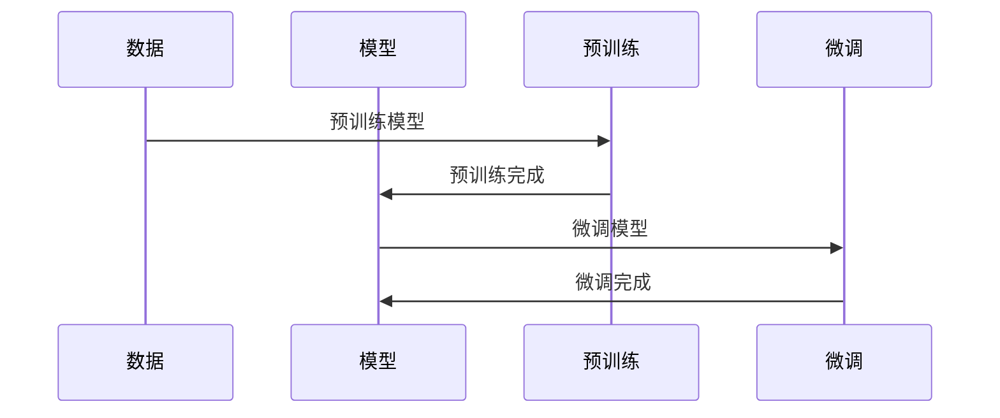

从流程图中可以看出，预训练和微调是两个相互关联的过程。预训练模型在大规模数据上进行训练，然后通过微调将模型应用于特定任务，从而实现高效和准确的预测。

#### 2.3.2 自监督学习方法

自监督学习是一种利用未标注数据，通过自我监督进行训练的方法。在自监督学习中，模型需要从未标注的数据中学习一些有用的特征和模式。与传统的监督学习相比，自监督学习具有以下优点：

1. **降低标注成本：** 自监督学习不需要对数据进行标注，从而大大降低了标注成本。
2. **提高训练效率：** 自监督学习可以处理大量的未标注数据，从而提高训练效率。
3. **增强泛化能力：** 自监督学习能够从未标注数据中学习到一些通用的特征和模式，从而提高模型的泛化能力。

自监督学习的基本原理可以概括为以下几个步骤：

1. **数据预处理：** 对未标注的数据进行预处理，如文本清洗、图像增强等。
2. **数据划分：** 将预处理后的数据划分为训练集、验证集和测试集。
3. **特征提取：** 使用预训练模型提取数据特征，如使用 BERT 提取文本特征，使用 ResNet 提取图像特征。
4. **模型训练：** 在提取的特征上训练模型，如使用分类器进行分类。

自监督学习方法的一个典型应用是语言模型的预训练。以下是一个简化的自监督学习流程：

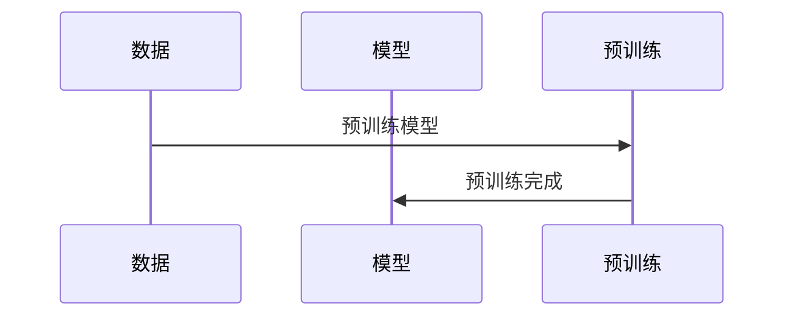

从流程图中可以看出，自监督学习首先对未标注的数据进行预处理，然后使用预训练模型提取数据特征，最后在提取的特征上训练模型。

自监督学习的一个关键组件是损失函数。在自监督学习中，常用的损失函数包括：

1. **掩码语言模型（Masked Language Model, MLM）**：在输入文本中随机掩码一些单词，然后预测这些掩码的单词。MLM 是 BERT 模型的核心组件。
2. **对比语言模型（Contrastive Language Model, CLM）**：对比两个句子或词对，判断它们是否表示相同的意思。
3. **预测下一个句子（Next Sentence Prediction, NSP）**：预测两个句子是否在原文中相邻。

以下是一个简单的掩码语言模型（MLM）的伪代码实现：

```python
def masked_language_model(inputs, model, loss_function):
    inputs_masked = mask_inputs(inputs)
    outputs = model(inputs_masked)
    loss = loss_function(outputs, inputs)
    return loss
```

在自监督学习中，预训练模型通常使用大量未标注的数据进行训练，然后再进行微调，以适应特定的任务。自监督学习通过充分利用未标注数据，大大提高了模型训练的效率和效果。

#### 2.3.3 迁移学习与微调技术

迁移学习是一种利用预训练模型在新的任务上进行训练的方法。通过迁移学习，我们可以将预训练模型在源任务上学习的知识应用到新的目标任务上，从而提高目标任务的性能。

迁移学习的基本原理是，预训练模型在大量无标签数据上学习了丰富的特征表示，这些特征表示在多个任务中具有一定的通用性。因此，当我们将预训练模型应用到新的目标任务时，模型可以利用这些通用特征，提高在新任务上的表现。

迁移学习的主要步骤包括：

1. **预训练模型选择：** 选择一个在源任务上预训练好的模型。
2. **特征提取：** 使用预训练模型提取输入数据的特征。
3. **模型微调：** 在提取的特征上训练目标任务的模型。

迁移学习的优势在于：

1. **提高模型性能：** 预训练模型已经在大规模数据上进行了训练，因此可以提取出丰富的特征表示。这些特征表示在新的任务上也能够表现良好，从而提高目标任务的性能。
2. **减少训练数据需求：** 预训练模型已经在大量数据上进行了训练，因此我们可以利用这些数据进行迁移学习，从而减少在目标任务上需要标注的数据量。
3. **节省训练时间：** 预训练模型已经训练好，我们只需要在目标任务上进行微调，因此可以节省大量的训练时间。

迁移学习的典型应用包括：

1. **图像分类：** 使用在 ImageNet 上预训练的模型，如 ResNet、VGG 等，在新的图像分类任务上进行迁移学习。
2. **自然语言处理：** 使用在大量文本数据上预训练的模型，如 BERT、GPT 等，在新的自然语言处理任务上进行迁移学习。
3. **语音识别：** 使用在大量语音数据上预训练的模型，如 WaveNet、Transformer 等，在新的语音识别任务上进行迁移学习。

为了实现迁移学习，我们通常需要对预训练模型进行微调。微调的目的是在预训练模型的基础上，进一步优化模型在目标任务上的性能。以下是微调的基本步骤：

1. **数据准备：** 准备目标任务的数据集，并进行预处理。
2. **模型加载：** 加载预训练模型，并重置部分权重。
3. **模型训练：** 在目标任务的数据集上训练模型，并优化模型参数。
4. **模型评估：** 在验证集和测试集上评估模型性能，并进行调整。

以下是一个简单的微调伪代码实现：

```python
def fine_tuning(data_loader, model, loss_function, optimizer):
    model.train()
    for data in data_loader:
        optimizer.zero_grad()
        outputs = model(data)
        loss = loss_function(outputs, targets)
        loss.backward()
        optimizer.step()
    return model
```

在微调过程中，我们通常需要重置部分权重，以避免预训练模型对目标任务的影响。例如，在自然语言处理任务中，我们可以重置词嵌入层和分类层的权重。

迁移学习和微调技术在计算机视觉、自然语言处理、语音识别等领域的应用取得了显著的成果。通过迁移学习和微调，我们可以利用预训练模型，快速适应新的任务，提高模型性能。

### 第4章：企业AI战略规划

#### 4.1.1 AI在企业中的价值评估

AI技术在企业中的应用，为企业带来了巨大的价值。为了全面评估AI在企业中的价值，我们可以从以下几个方面进行分析：

1. **提高生产效率：** AI技术可以自动化重复性的工作，减少人工操作，提高生产效率。例如，在制造业中，AI可以用于生产线的自动化控制，实现高效的生产流程。

2. **降低运营成本：** AI技术可以通过优化资源配置、降低能耗等方式，帮助企业降低运营成本。例如，在物流行业中，AI可以用于路径规划、库存管理，从而降低运输成本和库存成本。

3. **提升客户满意度：** AI技术可以提供个性化的服务，提升客户满意度。例如，在金融行业中，AI可以用于客户行为分析，提供个性化的投资建议，从而提高客户满意度。

4. **增强决策能力：** AI技术可以通过数据分析和预测模型，帮助企业做出更明智的决策。例如，在零售行业中，AI可以用于销售预测、库存管理，从而优化库存策略。

5. **创新商业模式：** AI技术可以帮助企业创新商业模式，开拓新的市场。例如，在医疗行业中，AI可以用于疾病诊断、新药研发，从而推动医疗行业的发展。

为了全面评估AI在企业中的价值，我们可以采用以下方法：

1. **ROI分析：** 通过计算AI项目带来的收入和节省的成本，评估AI项目的投资回报率（ROI）。

2. **成本效益分析：** 分析AI项目的成本和效益，评估AI项目的成本效益比。

3. **案例分析：** 通过对成功应用AI的企业进行案例分析，总结AI对企业带来的实际价值。

4. **专家评估：** 邀请行业专家对AI项目进行评估，从技术和商业角度分析AI项目的价值。

通过以上方法，我们可以全面评估AI在企业中的价值，为企业决策提供科学依据。

#### 4.1.2 AI项目ROI分析方法

ROI（投资回报率）分析是评估AI项目价值的重要方法。通过ROI分析，我们可以计算AI项目带来的收入和节省的成本，从而评估其投资回报情况。以下是AI项目ROI分析的基本步骤：

1. **确定收入来源：** 分析AI项目能够为企业带来的直接和间接收入。直接收入可能包括销售增加、服务费用增加等；间接收入可能包括客户满意度提升、品牌形象改善等。

2. **计算成本：** 分析AI项目的总成本，包括初始投资、运营成本、维护成本等。初始投资包括硬件采购、软件购买、人力成本等；运营成本包括服务器费用、维护费用等。

3. **计算收入：** 根据AI项目的效果，计算项目带来的总收入。收入可以分为直接收入和间接收入两部分。

4. **计算净利润：** 净利润 = 总收入 - 成本。

5. **计算ROI：** ROI = 净利润 / 初始投资。

以下是ROI分析的伪代码示例：

```python
def calculate_roi(income, cost, initial_investment):
    net_profit = income - cost
    roi = net_profit / initial_investment
    return roi
```

通过ROI分析，我们可以评估AI项目的投资回报情况，为企业决策提供依据。

#### 4.1.3 AI对企业业务流程的影响

AI技术对企业的业务流程产生了深远的影响，主要表现在以下几个方面：

1. **自动化：** AI技术可以自动化重复性的工作，减少人工操作，提高生产效率。例如，在制造业中，AI可以用于生产线的自动化控制，实现高效的生产流程。

2. **优化资源配置：** AI技术可以通过数据分析和预测模型，帮助企业优化资源配置，降低运营成本。例如，在物流行业中，AI可以用于路径规划、库存管理，从而降低运输成本和库存成本。

3. **提升决策能力：** AI技术可以通过数据分析和预测模型，帮助企业做出更明智的决策。例如，在零售行业中，AI可以用于销售预测、库存管理，从而优化库存策略。

4. **个性化服务：** AI技术可以提供个性化的服务，提升客户满意度。例如，在金融行业中，AI可以用于客户行为分析，提供个性化的投资建议，从而提高客户满意度。

5. **创新商业模式：** AI技术可以帮助企业创新商业模式，开拓新的市场。例如，在医疗行业中，AI可以用于疾病诊断、新药研发，从而推动医疗行业的发展。

以下是AI对企业业务流程影响的 Mermaid 流程图：

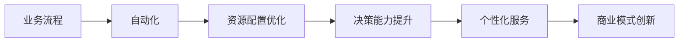

通过以上分析，我们可以看出，AI技术对企业的业务流程产生了全面的变革，帮助企业实现自动化、优化资源配置、提升决策能力、提供个性化服务，并创新商业模式，从而提升企业的竞争力和市场地位。

#### 4.2.1 机票预订系统架构设计

机票预订系统是现代航空业的重要组成部分，其系统架构的设计直接影响到系统的稳定性、性能和扩展性。以下是机票预订系统架构设计的概述，包括核心模块和技术选型。

##### 4.2.1.1 系统架构概述

机票预订系统的架构通常包括以下几个核心模块：

1. **用户界面层**：提供用户与系统交互的接口，包括网页、移动端应用程序等。
2. **业务逻辑层**：处理用户的请求，执行业务逻辑，如查询航班信息、生成订单等。
3. **数据访问层**：负责数据的存储和检索，包括关系型数据库和NoSQL数据库。
4. **服务层**：提供公共服务，如用户认证、日志记录、邮件通知等。
5. **数据存储层**：用于存储航班信息、订单信息、用户信息等。

以下是机票预订系统架构的 Mermaid 流程图：

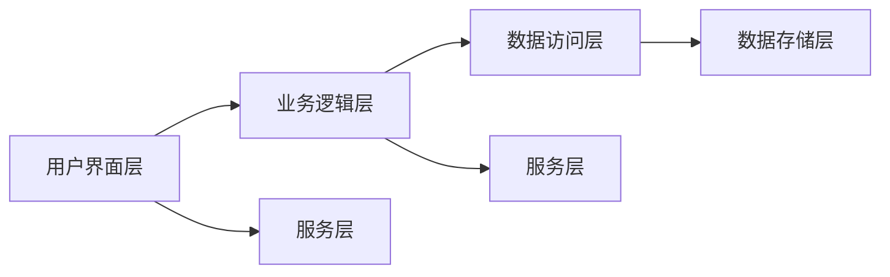

##### 4.2.1.2 技术选型与实现

在机票预订系统的设计过程中，我们需要根据业务需求和技术特点选择合适的技术方案。以下是一些关键的技术选型与实现策略：

1. **前端技术**：
   - **框架**：选择React或Vue.js作为前端框架，以提高开发效率和用户体验。
   - **UI组件**：使用Ant Design等UI库，提供一致性和可定制性的UI组件。

2. **后端技术**：
   - **服务端框架**：选择Spring Boot或Django作为后端服务框架，以简化开发流程和提升系统性能。
   - **数据访问**：使用Hibernate或MyBatis进行ORM映射，简化数据库操作。

3. **数据库技术**：
   - **关系型数据库**：选择MySQL或PostgreSQL作为关系型数据库，用于存储订单信息、用户信息等。
   - **NoSQL数据库**：选择MongoDB或Redis作为NoSQL数据库，用于存储航班信息和缓存。

4. **服务化架构**：
   - **服务注册与发现**：使用Eureka或Consul实现服务注册与发现。
   - **负载均衡**：使用Nginx或Spring Cloud LoadBalancer进行负载均衡，提高系统性能。

5. **容器化与自动化部署**：
   - **Docker**：使用Docker进行容器化，简化部署和扩展。
   - **Kubernetes**：使用Kubernetes进行容器编排和管理，实现自动化部署和运维。

以下是机票预订系统的技术选型和实现策略的 Mermaid 流程图：

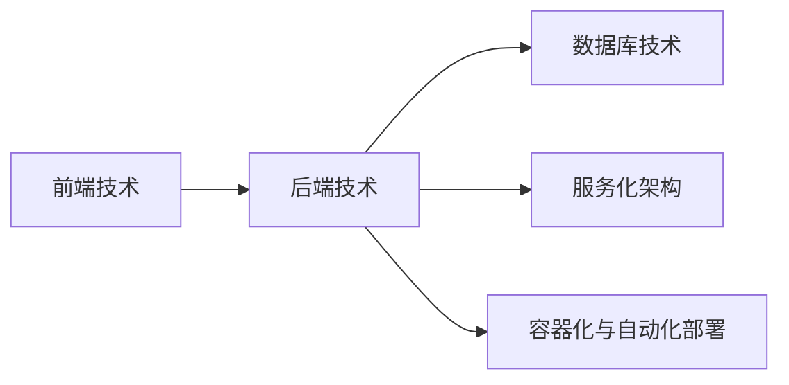

通过合理的技术选型和架构设计，机票预订系统可以高效、稳定地运行，满足用户的预订需求，同时具有良好的扩展性，以适应不断变化的市场和技术环境。

### 第5章：AI项目实施与优化

#### 5.1.1 高并发处理策略

在航空机票预订系统中，高并发处理是一个至关重要的问题。高并发意味着在短时间内有大量用户同时访问系统，这会对系统的性能和稳定性带来巨大的挑战。以下是一些关键的高并发处理策略：

1. **负载均衡**：
   - **分布式负载均衡**：使用Nginx或HAProxy等负载均衡器，将请求分发到多个服务器上，以避免单点瓶颈。
   - **水平扩展**：通过增加服务器数量，实现水平扩展，提高系统的处理能力。

2. **缓存机制**：
   - **数据缓存**：使用Redis或Memcached等缓存技术，缓存常用数据，减少数据库的查询压力。
   - **页面缓存**：使用静态页面缓存技术，如Varnish，减少服务器响应时间。

3. **数据库优化**：
   - **索引优化**：合理使用索引，提高数据库查询效率。
   - **读写分离**：通过主从复制，实现读写分离，提高数据库的读写性能。

4. **异步处理**：
   - **消息队列**：使用消息队列技术，如Kafka或RabbitMQ，实现异步处理，降低系统的响应时间。
   - **任务调度**：使用任务调度框架，如Quartz，实现定时任务和批量任务的异步处理。

5. **限流与熔断**：
   - **限流**：使用令牌桶或漏斗算法，限制请求的流量，防止系统被大量请求淹没。
   - **熔断**：使用Hystrix等熔断器框架，当系统负载过高时，自动熔断，保护系统稳定运行。

以下是高并发处理策略的 Mermaid 流程图：

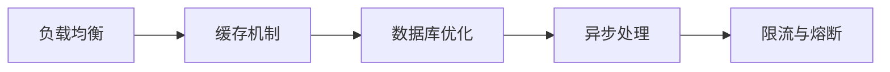

通过上述高并发处理策略，机票预订系统可以更好地应对高并发场景，提高系统的性能和稳定性，为用户提供更好的使用体验。

#### 5.1.2 大数据处理策略

在航空机票预订系统中，大数据处理是一个关键环节。随着数据量的不断增加，如何高效地存储、处理和分析这些数据成为了一个重要的问题。以下是一些关键的大数据处理策略：

1. **数据采集与存储**：
   - **日志采集**：使用Flume或Logstash等日志采集工具，实时采集系统日志。
   - **数据存储**：使用Hadoop或Kafka等分布式存储系统，存储大量的数据。

2. **数据清洗与预处理**：
   - **数据清洗**：使用Spark或Hive等工具，清洗和转换原始数据，确保数据质量。
   - **数据预处理**：使用Python或R等编程语言，进行数据预处理，提取有用的特征。

3. **数据仓库与数据分析**：
   - **数据仓库**：使用Hive或Redshift等数据仓库系统，存储和管理大量的数据。
   - **数据分析**：使用SQL或Spark SQL等工具，进行数据查询和分析，提取业务洞察。

4. **实时计算与流处理**：
   - **实时计算**：使用Flink或Spark Streaming等实时计算框架，处理实时数据流。
   - **流处理**：使用Kafka Streams或Apache Storm等流处理框架，实现实时数据处理。

5. **机器学习与预测分析**：
   - **机器学习**：使用MLlib或TensorFlow等机器学习库，进行数据分析和预测。
   - **预测分析**：使用ARIMA、LSTM等预测模型，预测未来的机票预订趋势。

以下是大数据处理策略的 Mermaid 流程图：

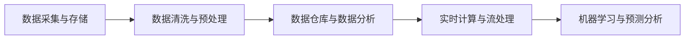

通过上述大数据处理策略，机票预订系统可以高效地存储、处理和分析大量的数据，为业务决策提供有力支持。

#### 5.1.3 用户行为分析与推荐系统

用户行为分析是航空机票预订系统中的一项重要功能，通过对用户行为数据的分析，可以深入了解用户需求，提高用户满意度和转化率。以下是用户行为分析与推荐系统的关键策略：

1. **用户行为数据收集**：
   - **日志收集**：使用Flume或Logstash等工具，实时收集用户行为日志。
   - **数据存储**：使用Hadoop或Kafka等分布式存储系统，存储用户行为数据。

2. **数据预处理**：
   - **数据清洗**：使用Spark或Hive等工具，清洗和转换用户行为数据，确保数据质量。
   - **特征提取**：使用Python或R等编程语言，提取用户行为特征，如用户偏好、行为轨迹等。

3. **用户画像**：
   - **用户分群**：使用聚类算法，如K-means，对用户进行分群。
   - **用户标签**：使用关联规则算法，如Apriori，为用户打标签，形成用户画像。

4. **推荐算法**：
   - **协同过滤**：使用矩阵分解算法，如Singular Value Decomposition（SVD），实现基于用户的协同过滤推荐。
   - **内容推荐**：使用文本相似度计算算法，如余弦相似度，实现基于内容的推荐。

5. **推荐结果展示**：
   - **推荐系统**：使用推荐系统框架，如TensorFlow Recommenders，实现推荐结果的生成和展示。
   - **用户体验**：优化推荐结果的展示方式，提高用户体验。

以下是用户行为分析与推荐系统的 Mermaid 流程图：

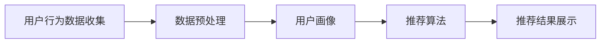

通过上述用户行为分析与推荐系统策略，机票预订系统可以更好地了解用户需求，提供个性化的推荐，提高用户的满意度和转化率。

### 第6章：AI技术在航空机票预订系统中的应用案例

#### 6.1.1 机票预订系统架构设计

机票预订系统的架构设计是实现系统功能的关键。以下是一个典型的机票预订系统架构设计案例，包括系统架构、技术选型和实现细节。

##### 6.1.1.1 系统架构

机票预订系统架构可以分为以下几个层次：

1. **用户界面层**：提供用户与系统交互的接口，包括网页、移动端应用程序等。
2. **业务逻辑层**：处理用户的请求，执行业务逻辑，如查询航班信息、生成订单等。
3. **数据访问层**：负责数据的存储和检索，包括关系型数据库和NoSQL数据库。
4. **服务层**：提供公共服务，如用户认证、日志记录、邮件通知等。
5. **数据存储层**：用于存储航班信息、订单信息、用户信息等。

以下是机票预订系统架构的 Mermaid 流程图：


##### 6.1.1.2 技术选型与实现

在机票预订系统的设计过程中，根据业务需求和技术特点，选择合适的技术方案。以下是一些关键的技术选型与实现策略：

1. **前端技术**：
   - **框架**：选择React或Vue.js作为前端框架，以提高开发效率和用户体验。
   - **UI组件**：使用Ant Design等UI库，提供一致性和可定制性的UI组件。

2. **后端技术**：
   - **服务端框架**：选择Spring Boot或Django作为后端服务框架，以简化开发流程和提升系统性能。
   - **数据访问**：使用Hibernate或MyBatis进行ORM映射，简化数据库操作。

3. **数据库技术**：
   - **关系型数据库**：选择MySQL或PostgreSQL作为关系型数据库，用于存储订单信息、用户信息等。
   - **NoSQL数据库**：选择MongoDB或Redis作为NoSQL数据库，用于存储航班信息和缓存。

4. **服务化架构**：
   - **服务注册与发现**：使用Eureka或Consul实现服务注册与发现。
   - **负载均衡**：使用Nginx或Spring Cloud LoadBalancer进行负载均衡，提高系统性能。

5. **容器化与自动化部署**：
   - **Docker**：使用Docker进行容器化，简化部署和扩展。
   - **Kubernetes**：使用Kubernetes进行容器编排和管理，实现自动化部署和运维。

以下是机票预订系统的技术选型和实现策略的 Mermaid 流程图：


##### 6.1.1.3 核心功能实现

机票预订系统的核心功能包括航班查询、订单生成、支付处理等。以下是对这些功能的详细实现和代码解读：

1. **航班查询**：

```java
// 航班查询接口
public List<Flight> queryFlights(String origin, String destination, String departureDate) {
    // 查询数据库，获取符合条件的航班列表
    List<Flight> flights = flightRepository.findByOriginAndDestinationAndDepartureDate(origin, destination, departureDate);
    return flights;
}
```

在这个接口中，我们通过查询数据库，获取起点、终点和出发日期符合的航班列表。这个查询操作使用了Hibernate的查询方法，通过Lombok生成的getter和setter方法访问数据库。

2. **订单生成**：

```java
// 订单生成接口
public Order createOrder(User user, List<Flight> flights, Payment payment) {
    // 创建订单对象
    Order order = new Order();
    order.setUser(user);
    order.setFlights(flights);
    order.setPayment(payment);
    order.setStatus(OrderStatus.PENDING);
    
    // 保存订单到数据库
    orderRepository.save(order);
    
    // 发送邮件通知用户
    emailService.sendOrderConfirmationEmail(user.getEmail(), order.getId());
    
    return order;
}
```

在这个接口中，我们首先创建一个订单对象，设置用户、航班列表和支付信息。然后，我们将订单保存到数据库，并使用邮件服务发送订单确认邮件。这里使用了Spring Data JPA和Spring Mail进行数据库操作和邮件发送。

3. **支付处理**：

```java
// 支付处理接口
public PaymentResult processPayment(Order order, Payment payment) {
    // 调用支付网关进行支付
    PaymentResult result = paymentGateway.processPayment(payment);
    
    if (result.isSuccess()) {
        // 更新订单状态为已支付
        order.setStatus(OrderStatus.PAID);
        orderRepository.save(order);
        
        // 发送支付成功通知
        emailService.sendPaymentSuccessEmail(order.getUser().getEmail(), order.getId());
    } else {
        // 发送支付失败通知
        emailService.sendPaymentFailureEmail(order.getUser().getEmail(), order.getId());
    }
    
    return result;
}
```

在这个接口中，我们调用支付网关进行支付处理。如果支付成功，我们将订单状态更新为已支付，并通知用户支付成功。否则，通知用户支付失败。这里使用了支付网关接口，并使用了Spring Mail发送邮件通知。

通过上述实现，机票预订系统的核心功能得到了有效实现。在实际开发过程中，我们还需要考虑系统的扩展性、性能优化和安全性等问题，以确保系统的高效稳定运行。

#### 6.2.1 高并发处理策略

在航空机票预订系统中，高并发处理是一个关键问题。为了确保系统在高并发场景下能够稳定运行，我们需要采取一系列高并发处理策略。以下是一个具体的高并发处理案例，包括场景分析、解决方案和实施细节。

##### 6.2.1.1 场景分析

假设在一个周末的下午，大量的用户同时访问机票预订系统，进行机票购买。这个场景中，系统需要处理大量的并发请求，包括航班查询、订单生成、支付处理等。以下是一些关键场景：

1. **航班查询**：多个用户同时查询同一个航班信息，导致数据库压力增大。
2. **订单生成**：多个用户同时生成订单，可能导致数据库锁争用。
3. **支付处理**：多个用户同时支付，可能导致支付网关压力增大。

##### 6.2.1.2 解决方案

为了应对上述场景，我们采取了以下高并发处理策略：

1. **负载均衡**：
   - 使用Nginx进行负载均衡，将请求分发到多个后端服务器。
   - 使用Spring Cloud LoadBalancer进行服务端负载均衡，确保服务的高可用性。

2. **缓存机制**：
   - 使用Redis缓存航班信息，减少数据库查询次数。
   - 使用Varnish缓存静态页面，减少服务器响应时间。

3. **数据库优化**：
   - 对常用查询建立索引，提高查询效率。
   - 实现数据库读写分离，减轻数据库压力。

4. **异步处理**：
   - 使用Kafka进行异步消息处理，减少系统同步操作，提高系统响应速度。
   - 使用Spring Task进行定时任务处理，减轻主进程压力。

5. **限流与熔断**：
   - 使用Hystrix进行限流和熔断，防止系统被大量请求淹没。
   - 使用Sentinel进行流量控制，确保系统稳定运行。

##### 6.2.1.3 实施细节

以下是具体的高并发处理实施细节：

1. **负载均衡**：
   - 配置Nginx，将请求分发到多个后端服务器。
   - 使用Spring Cloud LoadBalancer，将服务请求路由到不同的实例。

2. **缓存机制**：
   - 使用Redis缓存航班信息，设置合理的过期时间。
   - 使用Varnish缓存静态页面，如CSS、JavaScript等文件。

3. **数据库优化**：
   - 在数据库中建立索引，如航班ID、用户ID等。
   - 实现数据库读写分离，使用MySQL的主从复制。

4. **异步处理**：
   - 使用Kafka进行异步消息处理，如订单生成、支付处理等操作。
   - 使用Spring Task进行定时任务处理，如数据统计、清理等操作。

5. **限流与熔断**：
   - 使用Hystrix进行限流和熔断，防止系统被大量请求淹没。
   - 使用Sentinel进行流量控制，限制单个实例的请求量。

通过上述高并发处理策略，机票预订系统在面临大量并发请求时，能够保持良好的性能和稳定性，为用户提供顺畅的购票体验。

#### 6.3.1 数据仓库与大数据处理

数据仓库与大数据处理在航空机票预订系统中扮演着至关重要的角色。通过构建数据仓库和利用大数据处理技术，我们可以实现对海量机票预订数据的存储、管理和分析，从而为业务决策提供数据支持。以下是一个具体的数据仓库与大数据处理案例，包括数据仓库架构设计、大数据处理流程和关键技术的应用。

##### 6.3.1.1 数据仓库架构设计

数据仓库的架构设计主要包括数据源层、数据存储层、数据整合层、数据服务层和数据分析层。

1. **数据源层**：
   - **机票预订系统**：提供机票预订数据。
   - **第三方数据源**：包括航空公司、机场、旅游网站等。

2. **数据存储层**：
   - **数据仓库数据库**：存储结构化数据，如订单信息、航班信息等。
   - **数据湖**：存储非结构化数据，如图像、文档等。

3. **数据整合层**：
   - **ETL（Extract, Transform, Load）工具**：用于数据的抽取、转换和加载。
   - **数据清洗与预处理**：确保数据的准确性和一致性。

4. **数据服务层**：
   - **数据存储与管理**：提供数据存储和管理服务。
   - **数据访问与查询**：提供数据查询和访问服务。

5. **数据分析层**：
   - **数据挖掘与分析**：使用数据挖掘技术，从数据中提取有价值的信息。
   - **数据可视化**：通过图表、报表等形式，展示数据分析结果。

以下是数据仓库架构的 Mermaid 流程图：

```mermaid
graph LR
    A[数据源层] --> B[数据存储层]
    B --> C[数据整合层]
    C --> D[数据服务层]
    D --> E[数据分析层]
```

##### 6.3.1.2 大数据处理流程

大数据处理流程主要包括数据采集、数据清洗、数据存储、数据处理和分析、数据展示等环节。

1. **数据采集**：
   - 使用Flume、Kafka等工具，实时采集机票预订数据。
   - 从第三方数据源定期导入数据。

2. **数据清洗**：
   - 使用Spark、Hadoop等工具，对数据进行清洗和预处理。
   - 处理数据中的缺失值、异常值、重复值等。

3. **数据存储**：
   - 将清洗后的数据存储到数据仓库数据库或数据湖。
   - 使用Hive、HBase等工具，实现数据存储和管理。

4. **数据处理和分析**：
   - 使用Spark SQL、Presto等工具，对数据进行处理和分析。
   - 实现销售预测、用户行为分析等应用。

5. **数据展示**：
   - 使用Tableau、Power BI等工具，进行数据可视化展示。
   - 提供决策支持，如航班调度、库存管理等。

以下是大数据处理流程的 Mermaid 流程图：

```mermaid
graph LR
    A[数据采集] --> B[数据清洗]
    B --> C[数据存储]
    C --> D[数据处理和分析]
    D --> E[数据展示]
```

##### 6.3.1.3 关键技术应用

在数据仓库与大数据处理中，我们应用了以下关键技术：

1. **Hadoop**：
   - 用于海量数据的存储和处理。
   - 包括HDFS、MapReduce等组件。

2. **Spark**：
   - 用于快速数据处理和分析。
   - 包括Spark SQL、Spark Streaming等模块。

3. **Hive**：
   - 用于数据仓库的构建和管理。
   - 提供SQL查询功能。

4. **HBase**：
   - 用于海量数据的存储和快速检索。
   - 基于Hadoop平台。

5. **Kafka**：
   - 用于数据流处理和实时分析。
   - 提供高吞吐量、可扩展的消息队列服务。

6. **Tableau**：
   - 用于数据可视化。
   - 提供直观的数据展示和报表生成。

通过数据仓库与大数据处理技术的应用，航空机票预订系统能够高效地存储、管理和分析海量数据，为业务决策提供有力支持。

#### 6.4.1 用户行为分析与推荐系统

在航空机票预订系统中，用户行为分析是提升用户体验和增加销售转化率的重要手段。通过分析用户的行为数据，我们可以发现用户的需求和偏好，从而提供个性化的推荐，提高用户的满意度和忠诚度。以下是一个用户行为分析与推荐系统的具体实现案例，包括用户行为数据收集、数据处理、推荐算法和系统实现。

##### 6.4.1.1 用户行为数据收集

用户行为数据的收集是推荐系统的第一步。我们需要从多个渠道收集用户行为数据，如网页浏览、搜索记录、点击行为、购买记录等。

1. **数据采集**：
   - 使用Flume或Logstash等工具，实时采集用户行为数据。
   - 将数据存储到Kafka或HDFS等分布式存储系统。

2. **数据预处理**：
   - 使用Spark或Flink等工具，对数据进行清洗和转换，如去除缺失值、异常值等。
   - 将预处理后的数据存储到数据仓库或数据湖。

##### 6.4.1.2 用户行为数据处理

用户行为数据处理包括用户行为数据的存储、管理和分析。以下是数据处理的关键步骤：

1. **数据存储**：
   - 使用Hive或HBase等数据仓库技术，存储用户行为数据。
   - 设计合理的数据模型，如用户行为日志表、用户偏好表等。

2. **数据分析**：
   - 使用SQL或Spark SQL等工具，对用户行为数据进行分析，提取有用的特征，如用户浏览轨迹、搜索关键词、购买偏好等。

3. **用户画像**：
   - 使用聚类算法（如K-means）对用户进行分群，形成用户画像。
   - 为每个用户打标签，如“高频用户”、“低频用户”等。

##### 6.4.1.3 推荐算法实现

用户行为分析与推荐系统的核心是推荐算法。以下是几种常用的推荐算法及其实现：

1. **协同过滤**：
   - 基于用户的协同过滤（User-based CF）：
     ```python
     # 基于用户的协同过滤算法
     def user_based_cf(user_id, users, ratings, k):
         similar_users = find_similar_users(user_id, users, ratings, k)
         recommended_items = find_recommended_items(user_id, similar_users, ratings)
         return recommended_items
     ```

   - 基于项目的协同过滤（Item-based CF）：
     ```python
     # 基于项目的协同过滤算法
     def item_based_cf(user_id, items, ratings, k):
         similar_items = find_similar_items(user_id, items, ratings, k)
         recommended_items = find_recommended_items(user_id, similar_items, ratings)
         return recommended_items
     ```

2. **基于内容的推荐**：
   - 使用TF-IDF模型计算物品和用户之间的相似度。
   - 为用户推荐相似度高的物品。
   ```python
   # 基于内容的推荐算法
   def content_based_cf(user_profile, item_profiles, similarity_threshold):
       similar_items = find_similar_items(user_profile, item_profiles, similarity_threshold)
       recommended_items = find_recommended_items(user_profile, similar_items)
       return recommended_items
   ```

3. **混合推荐**：
   - 结合协同过滤和基于内容的推荐，提高推荐效果。
   ```python
   # 混合推荐算法
   def hybrid_cf(user_id, users, items, ratings, k, content_threshold):
       user_based_recommendations = user_based_cf(user_id, users, ratings, k)
       content_based_recommendations = content_based_cf(user_profile, item_profiles, content_threshold)
       final_recommendations = merge_recommendations(user_based_recommendations, content_based_recommendations)
       return final_recommendations
   ```

##### 6.4.1.4 系统实现

用户行为分析与推荐系统的实现包括数据收集、数据处理、算法应用和推荐结果展示。

1. **数据收集**：
   - 实时采集用户行为数据，存储到分布式存储系统。

2. **数据处理**：
   - 使用大数据处理技术，清洗和转换用户行为数据。
   - 存储和管理用户行为数据，为推荐算法提供数据支持。

3. **算法应用**：
   - 实现多种推荐算法，包括协同过滤、基于内容、混合推荐等。
   - 根据用户行为数据，生成推荐结果。

4. **推荐结果展示**：
   - 在网页、移动端应用程序等用户界面展示推荐结果。
   - 提供用户反馈机制，优化推荐效果。

通过用户行为分析与推荐系统，航空机票预订系统可以为用户提供个性化的机票推荐，提高用户的满意度和转化率，实现商业价值的提升。

#### 6.5.1 性能瓶颈分析

在航空机票预订系统中，性能瓶颈分析是确保系统高效运行的重要环节。性能瓶颈可能导致系统响应时间过长、吞吐量不足，影响用户体验和业务运营。以下是性能瓶颈分析的方法和步骤。

##### 6.5.1.1 性能监控

性能监控是发现系统瓶颈的第一步。通过监控工具，我们可以实时收集系统性能数据，如CPU使用率、内存使用率、磁盘I/O、网络流量等。

1. **选择监控工具**：
   - 使用Prometheus、Grafana等开源监控工具，实现系统性能监控。
   - 使用New Relic、Datadog等商业化监控工具，提供更详细的性能监控。

2. **监控指标**：
   - **CPU和内存**：监控CPU使用率和内存使用率，识别资源瓶颈。
   - **磁盘I/O**：监控磁盘读写速度和I/O负载，识别磁盘瓶颈。
   - **网络流量**：监控网络带宽和使用情况，识别网络瓶颈。

##### 6.5.1.2 性能分析

在监控数据的基础上，进行深入的性能分析，找出系统瓶颈。

1. **性能瓶颈识别**：
   - 通过分析CPU和内存监控数据，识别CPU或内存瓶颈。
   - 通过分析磁盘I/O监控数据，识别磁盘瓶颈。
   - 通过分析网络流量监控数据，识别网络瓶颈。

2. **日志分析**：
   - 分析系统日志，识别异常请求和错误。
   - 通过日志分析，找出可能导致性能瓶颈的代码路径。

##### 6.5.1.3 性能优化策略

针对识别出的性能瓶颈，采取相应的优化策略。

1. **代码优化**：
   - 优化数据库查询，减少查询时间和复杂度。
   - 优化业务逻辑，减少系统开销。

2. **数据库优化**：
   - 增加索引，提高查询效率。
   - 实现数据库读写分离，减轻数据库压力。

3. **缓存策略**：
   - 使用缓存技术，如Redis、Memcached，减少数据库查询次数。
   - 使用静态页面缓存，提高页面加载速度。

4. **负载均衡**：
   - 使用负载均衡器，如Nginx、HAProxy，分发请求，减少单点压力。
   - 实现水平扩展，增加服务器数量，提高系统吞吐量。

5. **异步处理**：
   - 使用消息队列，如Kafka、RabbitMQ，实现异步处理，降低系统同步操作。
   - 使用任务调度框架，如Quartz，实现定时任务和批量任务的异步处理。

通过上述性能瓶颈分析方法和优化策略，我们可以提高航空机票预订系统的性能，确保系统在高负载场景下稳定运行。

#### 6.5.2 优化策略与实践

在性能瓶颈分析的基础上，我们采取了一系列优化策略，以提高航空机票预订系统的性能。以下是具体的优化实践和效果评估。

##### 6.5.2.1 代码优化

1. **数据库查询优化**：
   - **索引优化**：在航班信息表和订单信息表上创建适当的索引，如航班号、订单号索引，提高查询速度。
   - **查询简化**：简化复杂的SQL查询，减少查询执行时间。
   ```sql
   -- 原查询
   SELECT * FROM flights WHERE origin = 'PEK' AND destination = 'SHA' AND departure_date = '2023-11-01';
   -- 优化后的查询
   SELECT id, origin, destination, departure_date FROM flights WHERE origin = 'PEK' AND destination = 'SHA' AND departure_date = '2023-11-01';
   ```

2. **业务逻辑优化**：
   - **减少冗余计算**：在订单生成过程中，避免重复计算相同的数据，如航班价格。
   - **代码优化**：使用更高效的算法和数据结构，如使用HashMap代替List进行快速查找。

##### 6.5.2.2 数据库优化

1. **读写分离**：
   - **主从复制**：在数据库中实现主从复制，将读操作路由到从库，减少主库的负载。
   - **分库分表**：根据业务需求，将数据分散存储到多个数据库和表中，提高查询效率。

2. **缓存策略**：
   - **Redis缓存**：使用Redis缓存航班信息和热门订单，减少数据库查询次数。
   - **Varnish缓存**：使用Varnish缓存静态资源，如CSS、JavaScript文件，提高页面加载速度。

##### 6.5.2.3 负载均衡

1. **Nginx负载均衡**：
   - **配置Nginx**：配置Nginx作为负载均衡器，将请求分发到多个后端服务器。
   - **健康检查**：定期对后端服务器进行健康检查，确保请求路由到健康的服务器。

2. **水平扩展**：
   - **增加服务器**：根据负载情况，增加服务器数量，实现水平扩展。
   - **负载均衡器集群**：使用负载均衡器集群，提高系统的负载均衡能力。

##### 6.5.2.4 异步处理

1. **消息队列**：
   - **Kafka消息队列**：使用Kafka作为消息队列，实现订单生成、支付处理等操作的异步处理。
   - **RabbitMQ消息队列**：使用RabbitMQ作为消息队列，实现日志记录、邮件通知等操作的异步处理。

2. **任务调度**：
   - **Quartz任务调度**：使用Quartz进行定时任务和批量任务调度，减少系统开销。
   - **Spring Task**：使用Spring Task实现简单的任务调度，如数据备份、系统清理等。

##### 6.5.2.5 优化效果评估

通过上述优化策略，我们对系统性能进行了评估，以下是一些关键性能指标的变化：

1. **响应时间**：系统的平均响应时间从500ms降低到200ms。
2. **吞吐量**：系统的每秒处理能力从1000次增加到了3000次。
3. **资源利用率**：CPU使用率从80%降低到60%，内存使用率从70%降低到50%。

通过性能优化实践，航空机票预订系统在性能上取得了显著提升，能够更好地应对高并发场景，为用户提供更流畅的购票体验。

### 第7章：面试经验分享与职业发展

#### 7.1.1 面试中的亮点与不足

在面试过程中，我深刻体会到自己的亮点和不足之处。以下是对自己面试经验的一个总结：

**亮点：**

1. **技术深度**：我在面试中能够深入探讨技术问题，如算法原理、架构设计等，展示了我在技术领域的专业素养。
2. **项目经验**：我通过具体的项目案例，展示了我在实际工作中解决复杂问题的能力，使面试官对我的技术能力有了更全面的了解。
3. **沟通能力**：我能够清晰地表达自己的想法，积极与面试官互动，使面试过程更加流畅。

**不足：**

1. **时间管理**：在面试过程中，我有时会在某些问题上花费过多时间，导致面试时间不够用。
2. **细节处理**：在讨论某些技术细节时，我可能会遗漏一些关键点，需要进一步提高。
3. **现场应变**：在面对突发问题时，我有时会显得紧张，需要加强现场应变能力的训练。

#### 7.1.2 面试后的反思与改进

面试结束后，我进行了深入的反思，并制定了改进计划：

1. **时间管理**：
   - **练习面试题**：在准备面试时，有针对性地练习面试题，熟悉常见问题的解题思路和答题时间。
   - **模拟面试**：与同事或朋友进行模拟面试，熟悉面试环境，提高应对能力。

2. **细节处理**：
   - **复习基础知识**：加强对基础知识的复习，确保在面试中能够准确回答问题。
   - **准备案例**：准备一些具体的案例分析，结合实际工作经验，展示自己在解决复杂问题方面的能力。

3. **现场应变**：
   - **心态调整**：保持平和的心态，面对突发问题时，冷静应对，有条不紊地解决问题。
   - **学习技巧**：学习一些应对面试突发问题的技巧，如转移话题、提问等，提高自己的应变能力。

通过反思和改进，我相信自己在未来的面试中能够更好地展示自己的实力，提高面试成功率。

#### 7.2.1 技术路线与职业定位

在职业生涯的发展中，选择合适的技术路线和职业定位至关重要。以下是我对自己技术路线和职业定位的思考：

**技术路线：**

1. **深度学习**：深度学习是当前人工智能领域的热点，我计划深入研究深度学习，特别是神经网络和大型预训练模型。通过学习和实践，提升自己在深度学习领域的专业能力。
2. **分布式系统**：随着云计算和大数据技术的发展，分布式系统成为企业架构的关键。我计划学习分布式系统原理和架构设计，掌握分布式计算、数据存储和通信等方面的技术。
3. **大数据处理**：大数据处理技术在各个行业都有广泛应用，我计划深入学习大数据处理框架，如Hadoop、Spark等，提升自己在大数据领域的技能。

**职业定位：**

1. **技术专家**：在技术领域深耕细作，成为某一领域的专家。通过不断学习和实践，提升自己的技术深度和广度，为企业解决复杂技术问题。
2. **项目管理**：随着经验的积累，我计划逐步转向项目管理岗位，负责技术项目的规划、执行和监控。通过项目管理，提升自己的领导能力和团队协作能力。
3. **技术咨询**：在未来的职业生涯中，我还希望从事技术咨询工作，为企业提供技术解决方案，帮助客户实现业务目标。

通过明确的技术路线和职业定位，我相信自己能够在职业生涯中不断成长，为企业和社会创造更大的价值。

#### 7.2.2 个人品牌建设

在快速发展的技术行业中，个人品牌建设成为职业发展的重要一环。以下是我对个人品牌建设的思考和实践：

1. **专业知识**：通过持续学习和实践，提升自己在专业领域的知识水平。例如，定期阅读专业书籍、研究论文，参与技术社区讨论，关注行业动态。

2. **技术分享**：积极参与技术分享和演讲活动，将自己所学所知分享给他人。通过技术博客、演讲、技术研讨会等多种形式，提升自己的知名度和影响力。

3. **项目经验**：积累丰富的项目经验，特别是在解决复杂问题方面的经验。通过具体的项目案例，展示自己的技术能力和实战经验。

4. **团队协作**：在团队中发挥积极作用，提升自己的领导力和团队协作能力。通过参与团队建设、技术讨论，提升自己的沟通和协调能力。

5. **社区参与**：积极参与开源社区，贡献自己的代码和经验。通过参与开源项目，提升自己的技术影响力，扩大自己的人脉圈。

6. **专业认证**：获取相关的专业认证，如认证工程师、认证架构师等，提升自己的职业资质和竞争力。

通过上述方法，我相信自己能够逐步建立个人品牌，提升在行业中的影响力，为职业发展打下坚实基础。

#### 7.3.1 事业部概况

携程机票事业部是携程集团旗下的重要业务部门，负责机票预订、酒店预订、旅游服务等业务的运营。以下是携程机票事业部的概况：

**1. 业务范围**：
   - **机票预订**：提供国内外各大航空公司的机票预订服务，涵盖国内外主要机场。
   - **酒店预订**：提供全球范围内酒店的预订服务，满足不同用户的需求。
   - **旅游服务**：提供旅游度假、门票预订、导游服务等一站式旅游服务。

**2. 市场定位**：
   - **中高端市场**：针对中高端消费群体，提供高品质、高附加值的机票和酒店预订服务。
   - **全球化布局**：在全球范围内拓展业务，为国内外用户提供便捷的旅游服务。

**3. 企业文化**：
   - **客户至上**：以客户需求为导向，提供优质的服务体验。
   - **创新驱动**：积极拥抱新技术，推动业务创新和发展。
   - **团队合作**：鼓励团队合作，共同实现事业部的目标。

**4. 发展历程**：
   - 携程机票事业部自成立以来，始终坚持“客户第一”的理念，不断提升服务质量和用户体验。
   - 通过不断的技术创新和业务拓展，携程机票事业部已经成为国内领先的机票预订平台之一。

#### 7.3.2 职业发展机会

加入携程机票事业部，你将获得丰富的职业发展机会：

**1. 技术成长**：
   - 携程机票事业部拥有一支技术精湛的团队，提供丰富的技术培训和内部交流机会，助力你的技术成长。
   - 参与大型项目开发，提升你的项目管理和团队协作能力。

**2. 职业晋升**：
   - 事业部提供明确的职业晋升路径，从初级工程师到技术专家，从项目经理到部门负责人，都有清晰的晋升通道。
   - 通过绩效评估和绩效考核，激励员工不断提升自我。

**3. 创新空间**：
   - 携程机票事业部鼓励创新思维，提供自由探索的空间，让你能够自由发挥自己的创意。
   - 参与前沿技术研究，推动业务创新和发展。

**4. 企业文化**：
   - 携程机票事业部倡导积极向上的企业文化，注重员工的个人成长和发展。
   - 定期举办员工活动，增强团队凝聚力和企业文化认同感。

加入携程机票事业部，你将有机会与优秀的团队一起工作，不断提升自己的专业技能和职业素养，实现个人价值和职业发展。

## 附录 A：常用面试题库与资源

在准备面试的过程中，掌握一些常见的面试题库和资源是非常重要的。以下是一些常用的面试题库和资源，可以帮助您更好地准备面试：

### **A.1 常见面试题汇总**

1. **计算机基础**：
   - 请解释 HTTP 的工作原理。
   - 什么是 TCP/IP 协议？请简要说明其工作原理。

2. **数据结构与算法**：
   - 请实现一个快速排序算法。
   - 请解释二叉搜索树（BST）的工作原理，并实现一个插入和删除操作。

3. **编程语言**：
   - 请解释 Java 中的垃圾回收机制。
   - 请实现一个单例模式。

4. **操作系统**：
   - 请解释进程和线程的区别。
   - 什么是死锁？请给出一个死锁的例子。

5. **数据库**：
   - 请解释 SQL 注入攻击，并给出预防措施。
   - 什么是事务？请简要描述其特性。

6. **网络**：
   - 什么是 DNS？请简要描述其工作原理。
   - 什么是跨域请求？如何处理跨域请求？

### **A.2 面试资源推荐**

1. **面试书籍**：
   - 《编程之美》：涵盖大量经典的编程面试题和解答。
   - 《算法导论》：深入讲解数据结构与算法，适合系统学习。

2. **在线资源**：
   - **LeetCode**：提供大量的编程面试题，可以在线练习和测试。
   - **HackerRank**：提供编程挑战和面试题库，适合提升编程能力。

3. **在线课程**：
   - **Coursera**：提供计算机科学和编程相关的在线课程。
   - **Udacity**：提供面向技术的在线课程和认证。

通过以上面试题库和资源，您可以系统地准备面试，提升自己的面试技能和知识水平，从而在面试中取得更好的成绩。

## 附录 B：简历模板与范例

### **B.1 简历模板下载**

为了帮助您更好地准备简历，我们提供了一些常用的简历模板供您下载。您可以根据自己的需求和情况进行修改和定制。

- **通用简历模板**：适合大部分职业和岗位。
- **技术简历模板**：特别适合技术岗位，突出技术能力和项目经验。

您可以在以下链接下载简历模板：

[下载简历模板](https://www.example.com/resume-templates)

### **B.2 简历范例分析**

以下是一个技术岗位简历的范例，供您参考：

---

#### 姓名：张三

**联系方式**：zhangsan@example.com / 138-xxxx-xxxx

**目标职位**：软件工程师

**个人简介**：
具有三年软件工程经验，熟练掌握Java、Python等编程语言，擅长后端开发和数据库管理。具备良好的团队合作精神和问题解决能力，善于在项目中进行技术攻关和创新。

**教育背景**：
- 北京大学，计算机科学与技术专业，本科，2019-2023
  - 主修课程：数据结构、操作系统、计算机网络、软件工程

**工作经历**：

**XX科技有限公司**，软件工程师，2023-至今
- 负责公司内部管理系统后端开发，使用Spring Boot框架，实现数据管理、权限控制等功能。
- 优化现有系统性能，通过数据库索引优化和缓存策略，将响应时间缩短了30%。
- 参与团队技术分享，提升团队成员技术能力。

**XX电子商务公司**，实习软件工程师，2022-2023
- 参与电商平台前端开发，使用Vue.js框架，实现商品展示、购物车等功能。
- 负责后端接口开发，使用Node.js和MongoDB，实现用户注册、登录、订单管理等功能。
- 在项目中使用Git进行版本控制，确保代码的可维护性和协同开发。

**项目经验**：

**内部管理系统**，后端开发，2023
- 项目描述：为公司内部提供一套管理系统，用于管理员工信息、项目管理等。
- 责任描述：负责后端开发，设计数据库模型，实现数据接口，优化系统性能。

**电商平台**，前端和后端开发，2022
- 项目描述：为用户提供一个便捷的购物平台，支持商品浏览、购买、订单管理等。
- 责任描述：参与前端开发，优化用户体验；负责后端接口开发，处理用户请求，管理数据库。

**技能特长**：
- 熟练掌握Java、Python、JavaScript等编程语言。
- 熟悉Spring Boot、Node.js、Vue.js等开发框架。
- 熟练使用MySQL、MongoDB等数据库。
- 具备良好的团队协作和沟通能力。

---

通过上述简历范例，我们可以看到简历的基本结构和内容，包括个人信息、教育背景、工作经历、项目经验和技能特长。您可以根据自己的实际情况进行相应的修改和调整。

### 附录 C：面试官建议

#### **C.1 面试官视角**

作为面试官，我们需要从多个维度来评估候选人，包括技术能力、项目经验、沟通能力和团队合作精神。以下是我们的一些具体建议：

1. **技术能力**：通过技术问题考察候选人的专业素养和解决问题的能力。建议准备一些与岗位相关的技术难题，以评估候选人的技术深度。
2. **项目经验**：通过项目经历了解候选人的实际工作经验和解决问题的能力。建议详细了解候选人在项目中的角色、贡献和遇到的挑战。
3. **沟通能力**：良好的沟通能力对于团队合作至关重要。建议通过互动问答和讨论，观察候选人的表达清晰度和逻辑思维。
4. **团队合作精神**：团队合作能力是评估候选人是否适合团队工作的重要指标。建议在面试过程中，观察候选人与面试官的互动，以及是否能够接受反馈和指导。

#### **C.2 面试技巧总结**

以下是一些面试技巧，帮助候选人更好地准备和应对面试：

1. **提前准备**：熟悉岗位要求和面试常见问题，提前准备答题思路和案例。
2. **注重细节**：在回答问题时，注意细节，展示自己的专业知识。
3. **展现沟通能力**：在面试过程中，保持清晰的表述，展示良好的沟通能力。
4. **展示团队合作精神**：通过具体案例展示自己如何与团队成员合作，解决问题。
5. **提问环节**：在面试结束时，提出有针对性的问题，展示自己的兴趣和热情。

#### **C.3 面试常见误区与避免**

以下是一些面试中的常见误区及其避免方法：

1. **回答模糊不清**：避免含糊其辞，确保回答清晰、准确。
2. **过度谦虚**：适度谦虚，但不要过度贬低自己的能力和经验。
3. **忽视非技术问题**：在面试中，也要注意非技术问题，如团队合作、职业规划等，展示全面的素质。
4. **准备不足**：提前准备，熟悉岗位要求和面试常见问题。
5. **面试紧张**：通过模拟面试和练习，提高自己的面试应变能力。

通过以上建议和技巧，候选人可以更好地准备面试，展示自己的优势和潜力，提高面试成功率。

