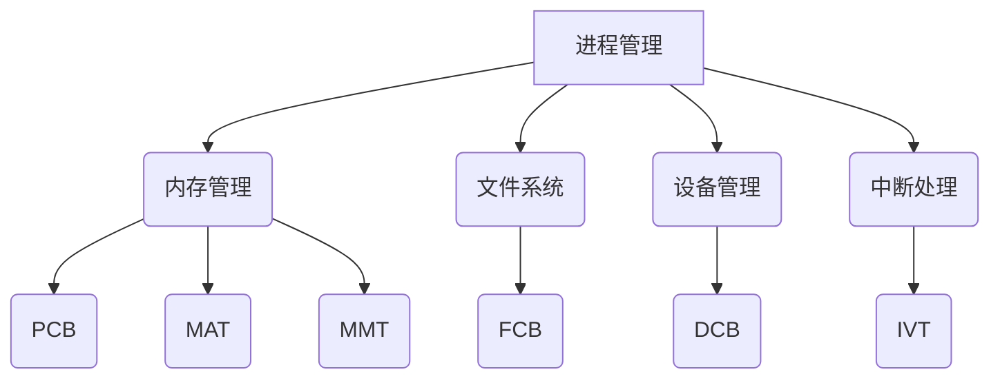
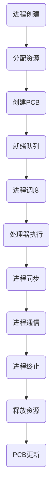
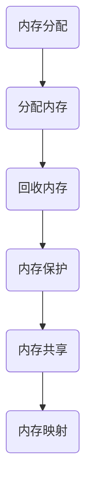

                 

# 《操作系统的发展历史与趋势》

> **关键词**：操作系统，历史，趋势，发展，技术，架构

> **摘要**：本文将深入探讨操作系统的发展历史，从早期操作系统到现代操作系统，再到未来操作系统的新趋势。我们将回顾操作系统的基本概念和类型，分析操作系统的核心特性，探索操作系统的新应用场景和未来发展方向，最后总结操作系统的核心概念、架构、算法和实际应用案例。通过本文的阅读，您将全面了解操作系统的发展脉络和未来前景。

## 《操作系统的发展历史与趋势》目录大纲

### 第一部分：操作系统的基础知识

#### 第1章：操作系统的基本概念

1.1 操作系统的定义和作用

1.2 操作系统的类型

1.3 操作系统的基本结构

#### 第2章：操作系统的历史发展

2.1 早期操作系统的发展

2.2 20世纪80年代至今的操作系统发展

#### 第3章：现代操作系统特性

3.1 多任务处理

3.2 内存管理

3.3 文件系统

3.4 输入/输出管理

3.5 安全性和可靠性

### 第二部分：操作系统的新趋势

#### 第4章：操作系统的新趋势

4.1 云原生操作系统

4.2 实时操作系统

4.3 嵌入式操作系统

#### 第5章：操作系统未来展望

5.1 量子操作系统

5.2 自适应操作系统

5.3 操作系统的融合与集成

#### 第6章：操作系统核心概念和架构

6.1 操作系统内核架构

6.2 进程管理流程

6.3 内存管理流程

#### 第7章：操作系统核心算法原理讲解

7.1 多任务处理算法

7.2 内存分配与回收算法

7.3 文件系统索引算法

#### 第8章：操作系统数学模型和公式讲解

8.1 算法复杂度分析

8.2 缓存替换算法

8.3 文件存储与检索

#### 第9章：操作系统项目实战

9.1 开发环境搭建

9.2 源代码实现与解读

9.3 代码解读与分析

#### 第10章：操作系统经典问题与解决方案

10.1 操作系统死锁问题

10.2 系统崩溃与恢复

#### 第11章：操作系统在特殊场景中的应用

11.1 实时操作系统在工业控制中的应用

11.2 操作系统在移动设备中的应用

#### 第12章：操作系统与硬件的关系

12.1 操作系统与处理器架构

12.2 操作系统与存储设备

12.3 操作系统与网络设备

### 参考文献

### 致谢

## 第一部分：操作系统的基础知识

### 第1章：操作系统的基本概念

操作系统的概念最早可以追溯到20世纪40年代，它是计算机系统中的核心软件，负责管理计算机硬件资源和提供基础服务。操作系统的主要作用包括处理器管理、内存管理、文件管理、设备管理和用户接口等。

#### 1.1 操作系统的定义和作用

操作系统的定义可以理解为：它是一种控制和管理计算机硬件资源、提供基础服务的系统软件。操作系统的作用主要有以下几个方面：

1. **处理器管理**：操作系统负责分配处理器时间，确保多个进程能够并行执行，从而提高计算机的利用率和效率。
2. **内存管理**：操作系统负责内存的分配和回收，确保每个进程都有足够的内存空间来运行，并防止进程之间的内存冲突。
3. **文件管理**：操作系统提供文件系统的支持，实现文件的创建、删除、读取和写入等操作，并保证文件的安全性。
4. **设备管理**：操作系统负责管理各种外部设备，如打印机、磁盘、网络设备等，确保设备能够被高效地利用。
5. **用户接口**：操作系统提供用户与计算机交互的界面，如命令行界面、图形用户界面等，使用户能够方便地使用计算机。

#### 1.2 操作系统的类型

操作系统可以根据不同的分类标准进行分类，以下是几种常见的分类方式：

1. **按用途分类**：

   - **通用操作系统**：如Windows、MacOS和Linux，这些操作系统支持多种应用程序，适用于个人计算机、服务器和工作站等。
   - **嵌入式操作系统**：如RTOS（实时操作系统）和μC/OS，这些操作系统主要用于嵌入式设备，如嵌入式控制系统、智能家居设备等。
   - **专用操作系统**：如数据库管理系统（DBMS）、网络操作系统（NOS）等，这些操作系统专门为特定的应用场景设计。

2. **按运行模式分类**：

   - **单用户操作系统**：如DOS，这类操作系统只能支持单个用户同时使用，主要用于个人计算机。
   - **多用户操作系统**：如Unix、Linux，这类操作系统可以支持多个用户同时使用，适用于服务器和工作站等。

3. **按硬件架构分类**：

   - **32位操作系统**：如Windows 95，这类操作系统支持32位处理器和内存地址空间。
   - **64位操作系统**：如Windows 7、Linux 64位版本，这类操作系统支持64位处理器和更大的内存地址空间。

#### 1.3 操作系统的基本结构

操作系统的基本结构可以分为以下几个层次：

1. **用户层**：提供用户接口，包括命令行界面和图形用户界面等。
2. **应用程序层**：提供各种应用程序和服务，如文件管理、网络通信、图形处理等。
3. **内核层**：操作系统核心，负责管理硬件资源和提供基础服务，包括进程管理、内存管理、文件管理、设备管理等。
4. **硬件层**：计算机的物理硬件设备，如CPU、内存、硬盘等。

在操作系统的演变过程中，各个层次的功能和结构也在不断地改进和完善，从而满足不同应用场景的需求。接下来，我们将详细探讨操作系统的历史发展，了解各个重要版本的操作系统及其特点。

### 第2章：操作系统的历史发展

#### 2.1 早期操作系统的发展

早期操作系统的起源可以追溯到20世纪50年代，当时计算机主要用于科学计算和军事应用，操作系统的主要任务是管理计算机的硬件资源，提高计算机的利用效率。以下是几个重要版本的操作系统及其特点：

1. **CP/M操作系统**

   CP/M（Control Program for Microcomputers）是最早的微机操作系统之一，由Digital Research公司于1974年开发。CP/M操作系统采用了磁盘文件系统，支持多个任务同时运行，对后来的操作系统如MS-DOS产生了重要影响。

2. **MS-DOS操作系统**

   MS-DOS（Microsoft Disk Operating System）是微软公司开发的磁盘操作系统，于1981年首次发布。MS-DOS具有简单易用、兼容性好等特点，成为了个人计算机的主流操作系统。MS-DOS操作系统的文件系统采用FAT16格式，支持单个文件大小不超过2GB。

3. **Unix操作系统**

   Unix操作系统于1969年由肯·汤普森和丹尼斯·里奇在贝尔实验室开发。Unix操作系统具有强大的功能、良好的可扩展性和稳定的性能，对后来的操作系统产生了深远影响。Unix操作系统的文件系统采用多级目录结构，支持大文件和文件权限管理。

#### 2.2 20世纪80年代至今的操作系统发展

20世纪80年代至今，操作系统的发展经历了多个重要阶段，以下是几个关键版本的操作系统及其特点：

1. **Windows操作系统**

   Windows操作系统由微软公司开发，于1985年首次发布。Windows操作系统采用了图形用户界面（GUI），使计算机操作变得更加直观和便捷。Windows操作系统经历了多个版本的发展，如Windows 3.x、Windows 95、Windows NT、Windows 2000、Windows XP、Windows Vista、Windows 7、Windows 8和Windows 10等。

2. **MacOS操作系统**

   MacOS操作系统是苹果公司开发的操作系统，于1984年首次发布。MacOS操作系统以其稳定性和易用性著称，广泛应用于苹果公司的Macintosh计算机。MacOS操作系统采用了图形用户界面和UNIX内核，具有强大的多媒体处理能力。

3. **Linux操作系统**

   Linux操作系统是一种自由和开源的操作系统，于1991年由林纳斯·托瓦兹开发。Linux操作系统采用了UNIX内核，具有良好的可扩展性和稳定性，适用于个人计算机、服务器和工作站等。Linux操作系统有多种发行版，如Red Hat、Ubuntu、CentOS等，广泛应用于各个领域。

#### 2.3 操作系统的演变与重要版本

操作系统的演变过程是一个不断改进和完善的过程，各个版本的操作系统的特点和性能也在不断优化。以下是几个重要版本的操作系统及其特点：

1. **Windows 3.x/95**

   Windows 3.x是Windows操作系统的早期版本，于1990年发布。Windows 3.x引入了图形用户界面，支持多任务处理和虚拟内存，提高了计算机的利用率和用户体验。

   Windows 95是微软公司于1995年发布的一款革命性操作系统，它采用了Windows NT的核心技术，并加入了Windows 3.x的图形用户界面。Windows 95支持长文件名、多任务处理和即插即用功能，推动了个人计算机的普及。

2. **Windows NT**

   Windows NT（New Technology）是微软公司于1993年发布的一款高端操作系统，它采用了Windows 3.x的图形用户界面和Windows 3.1的文件系统，并加入了Windows 3.x的虚拟内存技术。Windows NT具有良好的可扩展性和稳定性，适用于服务器和工作站等。

3. **Linux内核版本演进**

   Linux内核是Linux操作系统的核心部分，它负责管理和控制计算机硬件资源。Linux内核自1991年发布以来，经历了多个版本的演进，如Linux 1.0、Linux 2.0、Linux 2.2、Linux 2.4和Linux 2.6等。不同版本的Linux内核在性能、功能和安全方面都有所改进，如Linux 2.6内核引入了预链接锁定、内核线程和设备驱动模型等。

随着技术的不断进步和应用场景的扩展，操作系统的发展也在不断演进。现代操作系统具有更高的性能、更好的可扩展性和更强的安全性，以满足不同用户的需求。在接下来的章节中，我们将探讨现代操作系统的核心特性和新趋势，以及未来操作系统的展望。

### 第二部分：操作系统的新趋势

#### 第4章：操作系统的新趋势

随着云计算、物联网、人工智能等新技术的不断发展，操作系统也在不断演变和进步。本章节将探讨当前操作系统的新趋势，包括云原生操作系统、实时操作系统和嵌入式操作系统，以及这些新趋势对操作系统的影响和应用场景。

#### 4.1 云原生操作系统

云原生操作系统是指专门为云计算环境设计的操作系统，它支持容器化、微服务架构和自动扩展等功能，能够更好地适应云计算的需求。以下是一些常见的云原生操作系统：

1. **Kubernetes**

   Kubernetes是一种开源的容器编排平台，它负责管理容器化应用程序的生命周期，包括部署、扩展和管理。Kubernetes具有高度可扩展性和可靠性，能够自动处理容器的调度、负载均衡和故障恢复等任务。

2. **Docker**

   Docker是一种开源的容器引擎，它可以将应用程序及其依赖项打包到一个轻量级、独立的容器中，确保应用程序在不同的环境中具有一致的性能和运行结果。Docker简化了应用程序的部署和分发，提高了开发效率。

云原生操作系统对操作系统的影响：

- **容器化和微服务架构**：云原生操作系统推动了容器化和微服务架构的发展，使应用程序可以更加灵活地部署和管理。
- **自动化和持续集成**：云原生操作系统支持自动化部署和持续集成，提高了开发流程的效率和质量。
- **资源利用率和可靠性**：云原生操作系统通过容器和微服务架构，提高了资源的利用率和系统的可靠性。

应用场景：

- **云计算平台**：云原生操作系统广泛应用于云计算平台，如阿里云、腾讯云、华为云等，为用户提供高效、可靠的云服务。
- **企业应用**：许多企业将应用程序容器化并部署在云原生操作系统上，以实现快速开发和部署。

#### 4.2 实时操作系统

实时操作系统（RTOS）是一种专门为实时应用设计的操作系统，它能够在严格的时间限制内完成任务，确保系统在规定的时间内响应。以下是一些常见的实时操作系统：

1. **VxWorks**

   VxWorks是一种开源的实时操作系统，广泛应用于工业控制、航空航天、汽车电子等领域。VxWorks具有高性能、高可靠性和丰富的功能，能够满足各种实时应用的需求。

2. **FreeRTOS**

   FreeRTOS是一种开源的实时操作系统，广泛应用于嵌入式系统和物联网设备。FreeRTOS具有轻量级、可配置和高效的特点，适用于资源有限的设备。

实时操作系统对操作系统的影响：

- **严格的时间限制**：实时操作系统能够在严格的时间限制内完成任务，确保系统在规定的时间内响应。
- **实时任务调度**：实时操作系统采用优先级调度、时间片调度等策略，确保高优先级任务能够及时完成。
- **高可靠性和稳定性**：实时操作系统通过冗余设计、错误检测和恢复机制，提高了系统的可靠性和稳定性。

应用场景：

- **工业控制**：实时操作系统广泛应用于工业控制系统，如PLC（可编程逻辑控制器）、SCADA（监控与数据采集）等，确保工业过程的精确控制和实时响应。
- **航空航天**：实时操作系统在航空航天领域具有广泛的应用，如飞行控制、导航系统等，确保飞行器在规定的时间内完成各种操作。
- **医疗设备**：实时操作系统在医疗设备中用于控制和管理，如心脏起搏器、呼吸机等，确保医疗设备的正常运行。

#### 4.3 嵌入式操作系统

嵌入式操作系统是一种专门为嵌入式设备设计的操作系统，它具有轻量级、高效和稳定的特点，适用于资源有限的设备。以下是一些常见的嵌入式操作系统：

1. **μC/OS**

   μC/OS是一种开源的实时嵌入式操作系统，广泛应用于工业控制、智能家居、汽车电子等领域。μC/OS具有高度可配置性、实时性和稳定性的特点，适用于各种嵌入式应用。

2. **Linux Lite**

   Linux Lite是一种轻量级的Linux操作系统，适用于嵌入式设备和老式计算机。Linux Lite具有友好的用户界面、丰富的软件支持和高效的资源利用，适用于各种嵌入式应用。

嵌入式操作系统对操作系统的影响：

- **资源优化**：嵌入式操作系统对资源进行优化，能够在有限的硬件资源下运行，提高系统的性能和稳定性。
- **实时性和可靠性**：嵌入式操作系统具有实时性和可靠性的特点，能够满足嵌入式设备的特殊需求。
- **跨平台支持**：嵌入式操作系统支持多种硬件平台，如ARM、MIPS、x86等，提高了系统的兼容性和灵活性。

应用场景：

- **智能家居**：嵌入式操作系统在智能家居设备中用于控制和管理，如智能插座、智能灯泡、智能摄像头等，实现设备的互联互通。
- **工业控制**：嵌入式操作系统在工业控制系统中用于监控和控制，如PLC、传感器、执行器等，实现工业过程的自动化和智能化。
- **汽车电子**：嵌入式操作系统在汽车电子中用于管理各种电子设备，如车载娱乐系统、导航系统、安全系统等，提高汽车的安全性和舒适性。

总之，操作系统的新趋势为传统操作系统带来了新的机遇和挑战。云原生操作系统、实时操作系统和嵌入式操作系统在各自的应用场景中发挥着重要作用，推动了操作系统的发展和创新。在接下来的章节中，我们将探讨操作系统的未来趋势，包括量子操作系统、自适应操作系统和操作系统的融合与集成，以及这些趋势对操作系统的影响和应用场景。

### 第5章：操作系统未来展望

#### 5.1 量子操作系统

随着量子计算技术的快速发展，量子操作系统（Quantum Operating System, QOS）的概念逐渐受到关注。量子操作系统是专门为量子计算机设计的操作系统，它需要处理量子比特（qubits）的量子态，实现对量子计算资源的有效管理。

##### 5.1.1 量子操作系统的概念

量子操作系统的主要目标是实现量子算法的高效执行，确保量子计算资源的最佳利用。量子操作系统需要具备以下特点：

1. **量子比特管理**：量子操作系统负责管理量子比特，包括初始化、测量、纠错和重置等操作，确保量子比特的高效使用。
2. **量子任务调度**：量子操作系统需要实现量子任务的调度，确保多个量子任务能够并行执行，提高量子计算的效率。
3. **量子资源分配**：量子操作系统需要根据量子任务的需求，合理分配量子计算资源，包括量子比特、量子线路和量子门等。
4. **量子纠错机制**：量子操作系统需要具备量子纠错机制，以应对量子计算中的噪声和错误，确保量子计算结果的准确性。

##### 5.1.2 量子操作系统的潜在应用

量子操作系统在多个领域具有广泛的应用潜力：

1. **量子计算**：量子操作系统可以支持量子算法的高效执行，实现复杂的科学计算和数据分析任务。
2. **量子通信**：量子操作系统可以支持量子密钥分发和量子态传输，确保量子通信的安全性和可靠性。
3. **量子模拟**：量子操作系统可以用于模拟量子系统的行为，为量子物理研究提供新的工具和方法。

##### 5.1.3 量子操作系统的挑战与机遇

量子操作系统面临以下挑战：

1. **量子硬件限制**：目前量子计算机的硬件性能有限，量子比特的数量和稳定性都有待提高，这对量子操作系统提出了更高的要求。
2. **量子编程语言**：量子编程语言的发展仍不完善，需要开发高效的量子编程语言和工具，以便开发者能够更好地利用量子操作系统。
3. **量子安全**：量子操作系统的安全性是关键问题，需要开发有效的量子安全机制，确保量子计算数据和通信的安全性。

然而，量子操作系统也带来了巨大的机遇：

1. **计算能力提升**：量子操作系统的开发将大大提升计算能力，推动科学研究和工业应用的发展。
2. **新算法发现**：量子操作系统的应用将激发新的算法发现，为解决复杂问题提供新的思路和方法。
3. **跨学科融合**：量子操作系统的开发将促进计算机科学、量子物理、数学等学科之间的交叉融合，推动科技创新。

总之，量子操作系统是操作系统领域的一个重要发展方向，具有广阔的应用前景。随着量子计算技术的不断进步，量子操作系统将在未来的计算领域发挥重要作用。

#### 5.2 自适应操作系统

自适应操作系统（Adaptive Operating System）是一种能够根据环境变化和任务需求自动调整自身行为的操作系统。它通过实时感知系统状态和任务需求，动态优化系统性能、资源利用和安全性。

##### 5.2.1 自适应操作系统的原理

自适应操作系统的核心原理是实时感知、动态调整和优化。以下是自适应操作系统的主要组成部分：

1. **感知模块**：感知模块负责实时监测系统状态和任务需求，包括处理器利用率、内存使用率、网络流量和安全性指标等。
2. **决策模块**：决策模块根据感知模块收集到的数据，分析系统状态和任务需求，制定相应的调整策略。
3. **执行模块**：执行模块根据决策模块的策略，动态调整系统参数，优化系统性能、资源利用和安全性。

##### 5.2.2 自适应操作系统的优势

自适应操作系统具有以下优势：

1. **动态性能优化**：自适应操作系统能够根据系统负载和任务需求，动态调整系统参数，优化系统性能，提高资源利用效率。
2. **适应性**：自适应操作系统能够适应不同的应用场景和任务需求，提高系统的灵活性和可扩展性。
3. **安全性增强**：自适应操作系统能够实时监测系统安全状态，根据安全威胁的严重程度，采取相应的防护措施，提高系统的安全性。

##### 5.2.3 自适应操作系统的应用场景

自适应操作系统在以下应用场景中具有广泛的应用前景：

1. **云计算**：自适应操作系统可以优化云计算资源分配和调度，提高云计算服务的性能和可靠性。
2. **物联网**：自适应操作系统可以优化物联网设备的资源使用和通信，提高物联网系统的效率和安全。
3. **边缘计算**：自适应操作系统可以优化边缘计算设备的性能和资源利用，提高边缘计算服务的响应速度和可靠性。

总之，自适应操作系统是操作系统领域的一个重要发展方向，它将根据环境变化和任务需求，动态调整系统行为，提高系统性能和安全性。随着技术的发展，自适应操作系统将在未来计算领域发挥重要作用。

#### 5.3 操作系统的融合与集成

随着技术的发展和用户需求的变化，操作系统的融合与集成成为一种趋势。操作系统融合与集成的目标是实现多种操作系统的优势互补，提高系统的灵活性和可扩展性。

##### 5.3.1 多操作系统融合

多操作系统融合是指在单一硬件平台上运行多个操作系统，实现操作系统的优势互补。多操作系统融合的主要形式包括：

1. **虚拟化技术**：虚拟化技术可以在同一硬件平台上运行多个操作系统，实现硬件资源的共享和隔离。虚拟化技术包括全虚拟化和准虚拟化两种形式，全虚拟化通过模拟硬件实现多个操作系统的运行，而准虚拟化通过修改操作系统内核实现硬件资源的直接访问。
2. **容器技术**：容器技术可以将应用程序及其依赖项打包到一个独立的容器中，实现多个操作系统的运行。容器技术具有轻量级、高效和可移植性等优点，适用于云计算和分布式系统。
3. **统一操作系统**：统一操作系统旨在将多个操作系统的功能集成到一个统一的系统中，实现操作系统的无缝切换和资源共享。统一操作系统需要解决不同操作系统之间的兼容性问题，提高系统的兼容性和可扩展性。

##### 5.3.2 跨平台操作系统发展

跨平台操作系统是指能够在不同硬件平台上运行的操作系统，实现跨平台的开发和部署。跨平台操作系统的发展趋势包括：

1. **操作系统兼容层**：操作系统兼容层通过模拟不同硬件平台的环境，实现跨平台的开发和部署。例如，Windows操作系统通过Windows on ARM技术，实现了在ARM架构的硬件上运行Windows操作系统。
2. **分布式操作系统**：分布式操作系统通过分布式计算和存储技术，实现跨平台的数据共享和协同工作。分布式操作系统适用于云计算和大数据处理等场景，提高系统的性能和可扩展性。
3. **移动操作系统**：随着移动设备的普及，跨平台移动操作系统成为发展趋势。跨平台移动操作系统如Android和iOS，支持多种硬件平台和操作系统，实现移动应用的无缝开发和部署。

总之，操作系统的融合与集成是操作系统领域的一个重要发展方向，它将实现多种操作系统的优势互补，提高系统的灵活性和可扩展性。随着技术的发展，操作系统融合与集成将在未来计算领域发挥重要作用。

### 第6章：操作系统核心概念和架构

#### 6.1 操作系统内核架构

操作系统内核是操作系统的核心部分，负责管理和控制计算机硬件资源，提供基础服务。操作系统内核的架构设计对于操作系统的性能、稳定性和安全性至关重要。以下是一个典型的操作系统内核架构：

1. **进程管理**：进程管理是操作系统内核的重要功能之一，负责创建、调度、同步和终止进程。操作系统内核使用进程控制块（Process Control Block, PCB）来管理进程的状态和资源。
2. **内存管理**：内存管理负责分配和回收内存资源，确保每个进程都有足够的内存空间来运行。操作系统内核使用内存分配表（Memory Allocation Table, MAT）和内存映射表（Memory Mapping Table, MMT）来管理内存资源。
3. **文件系统**：文件系统负责管理文件和目录，实现文件的创建、删除、读取和写入等操作。操作系统内核使用文件控制块（File Control Block, FCB）来管理文件和目录。
4. **设备管理**：设备管理负责管理各种外部设备，如硬盘、打印机、网络设备等，确保设备能够被高效地利用。操作系统内核使用设备控制块（Device Control Block, DCB）来管理设备。
5. **中断处理**：中断处理是操作系统内核的重要功能，负责处理硬件和软件中断，确保系统的正常运行。操作系统内核使用中断向量表（Interrupt Vector Table, IVT）来管理中断。

以下是一个简单的操作系统内核架构的Mermaid流程图：



#### 6.2 进程管理流程

进程管理是操作系统内核的核心功能之一，负责创建、调度、同步和终止进程。以下是一个简化的进程管理流程：

1. **进程创建**：操作系统内核根据用户请求或系统需要，创建新的进程。操作系统内核为进程分配资源，如内存、处理器时间等，并为进程创建进程控制块（PCB）。
2. **进程调度**：操作系统内核根据调度算法，选择就绪队列中的进程，将其分配到处理器执行。调度算法包括时间片轮转、优先级调度等。
3. **进程同步**：操作系统内核提供同步机制，如互斥锁、信号量等，确保多个进程之间的协调和合作。进程同步可以防止竞争条件和死锁等问题。
4. **进程通信**：操作系统内核提供进程通信机制，如管道、消息队列等，使进程之间能够交换数据和消息。进程通信是实现分布式系统和并行系统的基础。
5. **进程终止**：操作系统内核负责终止进程的运行，释放进程占用的资源，并更新进程控制块（PCB）。

以下是一个简单的进程管理流程的Mermaid流程图：



#### 6.3 内存管理流程

内存管理是操作系统内核的重要功能之一，负责分配和回收内存资源，确保每个进程都有足够的内存空间来运行。以下是一个简化的内存管理流程：

1. **内存分配**：操作系统内核根据进程的内存需求，从空闲内存池中分配内存。内存分配可以采用固定分区、动态分区、分页、分段等策略。
2. **内存回收**：操作系统内核在进程结束时回收其占用的内存。内存回收可以采用逐页回收、整块回收等策略。
3. **内存保护**：操作系统内核提供内存保护机制，防止进程访问其他进程的内存空间，保护系统的稳定性和安全性。
4. **内存共享**：操作系统内核支持内存共享机制，如共享内存区、消息队列等，使多个进程能够共享内存资源，提高系统效率。
5. **内存映射**：操作系统内核实现虚拟内存到物理内存的映射，使进程能够在逻辑上使用大量内存，同时保护系统的内存空间。

以下是一个简单的内存管理流程的Mermaid流程图：



通过上述核心概念和架构的讲解，我们可以更好地理解操作系统的运作原理和设计思想。在接下来的章节中，我们将进一步探讨操作系统的核心算法原理，包括多任务处理算法、内存分配与回收算法和文件系统索引算法。

### 第7章：操作系统核心算法原理讲解

#### 7.1 多任务处理算法

多任务处理是操作系统的核心功能之一，它允许多个进程在单个处理器上并行执行。多任务处理算法的目标是提高系统的吞吐量和响应时间，同时保证系统资源的公平分配。以下是一些常见多任务处理算法：

1. **先来先服务（FCFS）算法**：FCFS算法按照进程到达的顺序进行调度，最早到达的进程先执行。FCFS算法简单且公平，但可能导致长作业阻塞短作业，产生“饥饿”现象。

   **伪代码：**
   ```python
   while (就绪队列非空) {
       获取就绪队列头进程P；
       执行进程P；
       如果进程P完成 {
           从就绪队列删除进程P；
       }
   }
   ```

2. **短作业优先（SJF）算法**：SJF算法选择估计执行时间最短的进程先执行。SJF算法能够提高系统的吞吐量，但可能导致长作业无法得到执行。

   **伪代码：**
   ```python
   while (就绪队列非空) {
       找到估计执行时间最短的进程P；
       执行进程P；
       如果进程P完成 {
           从就绪队列删除进程P；
       }
   }
   ```

3. **优先级调度算法**：优先级调度算法根据进程的优先级进行调度，优先级高的进程先执行。优先级可以是静态分配的，也可以是动态调整的。优先级调度算法可以提高系统对关键任务的响应速度，但可能导致低优先级进程“饥饿”。

   **伪代码：**
   ```python
   while (就绪队列非空) {
       找到优先级最高的进程P；
       执行进程P；
       如果进程P完成 {
           从就绪队列删除进程P；
       }
   }
   ```

4. **时间片轮转算法**：时间片轮转算法为每个进程分配一个固定的时间片，每个进程轮流执行。时间片轮转算法能够提高系统的响应速度，但可能导致进程切换开销较大。

   **伪代码：**
   ```python
   while (就绪队列非空) {
       获取就绪队列头进程P；
       执行进程P，时间片耗尽；
       如果进程P未完成 {
           将进程P放入就绪队列末尾；
       }
   }
   ```

#### 7.2 内存分配与回收算法

内存分配与回收算法负责为进程分配内存空间，并在进程结束时回收内存。以下是一些常见的内存分配与回收算法：

1. **首次适配算法（First Fit）**：首次适配算法在空闲内存块中找到第一个足够大的内存块分配给进程。如果找不到足够大的内存块，则分配失败。

   **伪代码：**
   ```python
   function FirstFit(memoryBlocks, processSize):
       for each block in memoryBlocks:
           if block.size >= processSize:
               allocate process in block
               return True
       return False
   ```

2. **最佳适配算法（Best Fit）**：最佳适配算法在空闲内存块中找到最合适的内存块分配给进程，即剩余空间最小的内存块。如果找不到足够大的内存块，则分配失败。

   **伪代码：**
   ```python
   function BestFit(memoryBlocks, processSize):
       bestBlock = None
       for each block in memoryBlocks:
           if block.size >= processSize and (bestBlock is None or block.size < bestBlock.size):
               bestBlock = block
       if bestBlock is not None:
           allocate process in bestBlock
           return True
       return False
   ```

3. **最坏适配算法（Worst Fit）**：最坏适配算法在空闲内存块中找到剩余空间最大的内存块分配给进程。这种算法可能会导致内存碎片化。

   **伪代码：**
   ```python
   function WorstFit(memoryBlocks, processSize):
       worstBlock = None
       for each block in memoryBlocks:
           if block.size >= processSize and (worstBlock is None or block.size > worstBlock.size):
               worstBlock = block
       if worstBlock is not None:
           allocate process in worstBlock
           return True
       return False
   ```

4. **分区分配算法**：分区分配算法将内存划分为固定大小的分区，每个分区分配给一个进程。这种算法简单，但可能导致内存利用率不高。

   **伪代码：**
   ```python
   function PartitionAllocate(memoryBlocks, processes):
       for each process in processes:
           if any partition in memoryBlocks is large enough:
               allocate process in partition
               return True
       return False
   ```

5. **分页分配算法**：分页分配算法将内存划分为固定大小的页，每个页分配给一个进程。分页分配算法可以解决内存碎片化问题，提高内存利用率。

   **伪代码：**
   ```python
   function PageAllocate(pageTable, processSize):
       for each page in pageTable:
           if page.isFree:
               allocate process in page
               return True
       return False
   ```

6. **分段分配算法**：分段分配算法将内存划分为可变大小的段，每个段分配给一个进程。分段分配算法可以提高内存利用率，但可能导致内存碎片化。

   **伪代码：**
   ```python
   function SegmentAllocate(segmentTable, processSize):
       for each segment in segmentTable:
           if segment.size >= processSize:
               allocate process in segment
               return True
       return False
   ```

通过这些内存分配与回收算法，操作系统可以高效地管理内存资源，为进程提供足够的内存空间，同时避免内存碎片化。

#### 7.3 文件系统索引算法

文件系统索引算法负责高效地管理和访问文件系统中的文件和目录。以下是一些常见的文件系统索引算法：

1. **单级索引**：单级索引将所有文件名存储在一个数组中，每个数组元素对应一个文件。单级索引简单，但无法支持大量文件的存储。

   **伪代码：**
   ```python
   class SingleIndexFileSystem:
       files = []

       def addFile(self, fileName):
           self.files.append(fileName)

       def searchFile(self, fileName):
           for file in self.files:
               if file == fileName:
                   return True
           return False
   ```

2. **多级索引**：多级索引通过多个索引层级来组织文件名，提高文件系统的查询效率。多级索引通常使用B树、哈希表等数据结构来实现。

   **伪代码：**
   ```python
   class MultiLevelIndexFileSystem:
       index = BTree()

       def addFile(self, fileName):
           self.index.insert(fileName)

       def searchFile(self, fileName):
           return self.index.search(fileName)
   ```

3. **哈希索引**：哈希索引使用哈希函数将文件名映射到索引位置，提高文件系统的查询效率。哈希索引容易发生冲突，需要使用链地址法、开放地址法等解决。

   **伪代码：**
   ```python
   class HashIndexFileSystem:
       table = []

       def addFile(self, fileName):
           index = hash(fileName)
           if self.table[index] is None:
               self.table[index] = [fileName]
           else:
               self.table[index].append(fileName)

       def searchFile(self, fileName):
           index = hash(fileName)
           if self.table[index] is not None:
               for file in self.table[index]:
                   if file == fileName:
                       return True
           return False
   ```

通过这些文件系统索引算法，操作系统可以高效地管理和访问文件系统中的文件和目录，为用户提供便捷的文件操作服务。

### 第8章：操作系统数学模型和公式讲解

#### 8.1 算法复杂度分析

算法复杂度分析是评估算法性能的重要方法，它通过分析算法的时间复杂度和空间复杂度，评估算法的效率和资源消耗。以下是一些常见的算法复杂度分析方法：

1. **时间复杂度分析**：时间复杂度分析关注算法在处理不同规模数据时的执行时间。常用的时间复杂度符号包括O（大O符号）、Ω（小Omega符号）和ω（小omega符号）。

   - **O（大O符号）**：表示算法的上限时间复杂度，即算法在最坏情况下的执行时间。例如，O(n)表示算法的时间复杂度与输入数据规模n成正比。
   - **Ω（小Omega符号）**：表示算法的下限时间复杂度，即算法在最好情况下的执行时间。例如，Ω(n)表示算法的时间复杂度至少与输入数据规模n成正比。
   - **ω（小omega符号）**：表示算法的最好时间复杂度，即算法在最优情况下的执行时间。例如，ω(n)表示算法的时间复杂度至少与输入数据规模n成正比。

   **示例**：一个简单的线性搜索算法的时间复杂度为O(n)，因为算法在最坏情况下需要遍历所有n个元素。一个简单的插入排序算法的时间复杂度为O(n^2)，因为算法在最坏情况下需要比较和交换n个元素。

2. **空间复杂度分析**：空间复杂度分析关注算法在处理不同规模数据时所需的空间大小。常用空间复杂度符号包括O（大O符号）和Ω（小Omega符号）。

   - **O（大O符号）**：表示算法的上限空间复杂度，即算法在处理最大规模数据时的空间消耗。例如，O(n)表示算法的空间复杂度与输入数据规模n成正比。
   - **Ω（小Omega符号）**：表示算法的下限空间复杂度，即算法在处理最小规模数据时的空间消耗。例如，Ω(n)表示算法的空间复杂度至少与输入数据规模n成正比。

   **示例**：一个简单的线性搜索算法的空间复杂度为O(1)，因为算法只需要常数空间来存储临时变量。一个简单的插入排序算法的空间复杂度为O(n)，因为算法需要额外的n个空间来存储临时数组。

#### 8.2 缓存替换算法

缓存替换算法是操作系统内存管理的重要组成部分，它负责决定何时将数据从缓存中替换出去，以腾出空间来存储新的数据。以下是一些常见的缓存替换算法：

1. **最近最少使用（LRU）算法**：LRU算法基于“最近最少使用”的原则，替换最长时间没有被访问的数据。LRU算法可以有效地利用缓存空间，但需要额外的硬件支持，如缓存映射表。

   **伪代码**：
   ```python
   function LRU(cache, data):
       if cache has space for data:
           evict data from cache
           add data to cache
       else:
           find least recently used data in cache
           evict it and add data to cache
   ```

2. **先进先出（FIFO）算法**：FIFO算法基于“先进先出”的原则，替换最早进入缓存的数据。FIFO算法简单，但可能导致频繁替换，降低缓存命中率。

   **伪代码**：
   ```python
   function FIFO(cache, data):
       if cache has space for data:
           evict oldest data from cache
           add data to cache
       else:
           evict oldest data from cache
           add data to cache
   ```

3. **最不经常使用（LFU）算法**：LFU算法基于“最不经常使用”的原则，替换访问次数最少的数据。LFU算法可以更好地反映数据的实际访问频率，但需要额外的硬件支持，如访问计数器。

   **伪代码**：
   ```python
   function LFU(cache, data):
       if cache has space for data:
           evict data with least access count from cache
           add data to cache
       else:
           evict data with least access count from cache
           add data to cache
   ```

4. **最近未使用（NRU）算法**：NRU算法是一种基于概率的缓存替换算法，它将缓存分为多个状态，根据状态转移概率进行缓存替换。NRU算法可以有效地平衡缓存利用率和缓存替换频率。

   **伪代码**：
   ```python
   function NRU(cache, data):
       state = calculate state based on cache access patterns
       if state has space for data:
           evict data from cache
           add data to cache
       else:
           evict data from cache
           add data to cache
   ```

通过这些缓存替换算法，操作系统可以有效地管理内存缓存，提高系统性能和响应速度。

#### 8.3 文件存储与检索

文件存储与检索是操作系统文件管理的重要组成部分，它负责将文件数据存储到磁盘上，并在需要时从磁盘上检索文件数据。以下是一些常见的文件存储与检索方法：

1. **顺序存储**：顺序存储将文件数据连续地存储在磁盘上，便于顺序访问。顺序存储的优点是简单和高效，但无法支持随机访问。

   **伪代码**：
   ```python
   function sequentialStore(file, data):
       write data to disk at file's location

   function sequentialRetrieve(file):
       read data from disk at file's location
       return data
   ```

2. **索引存储**：索引存储使用索引表来记录文件数据在磁盘上的位置，便于快速检索。索引存储可以支持随机访问，但需要额外的磁盘空间来存储索引表。

   **伪代码**：
   ```python
   class IndexedFileSystem:
       index = []

       def storeFile(self, file, data):
           write data to disk
           add file's location to index

       def retrieveFile(self, file):
           find file's location in index
           read data from disk at file's location
           return data
   ```

3. **哈希存储**：哈希存储使用哈希函数将文件名映射到磁盘位置，便于快速检索。哈希存储的优点是高效和快速，但可能发生哈希冲突。

   **伪代码**：
   ```python
   class HashFileSystem:
       table = []

       def storeFile(self, file, data):
           index = hash(file.name)
           write data to disk at index
           if table[index] is not None:
               handle collision
           else:
               table[index] = [file.name]

       def retrieveFile(self, file):
           index = hash(file.name)
           if table[index] is not None:
               find file's location in table
               read data from disk at file's location
               return data
           else:
               return None
   ```

通过这些文件存储与检索方法，操作系统可以高效地管理和访问文件系统中的文件数据。

### 第9章：操作系统项目实战

#### 9.1 开发环境搭建

在开始操作系统项目之前，我们需要搭建合适的开发环境。以下是在Linux和Windows系统上搭建操作系统开发环境的具体步骤：

##### 9.1.1 Linux系统环境配置

1. **安装Linux操作系统**：首先，您需要在计算机上安装Linux操作系统，如Ubuntu或Fedora。您可以从Linux发行版的官方网站下载安装镜像，并按照提示进行安装。

2. **安装编译器**：安装Linux操作系统的过程中，默认会安装GCC（GNU Compiler Collection）编译器。您可以使用以下命令检查GCC的安装情况：

   ```bash
   gcc --version
   ```

   如果GCC未安装或需要更新，可以使用以下命令安装：

   ```bash
   sudo apt-get update
   sudo apt-get install build-essential
   ```

3. **安装调试工具**：为了更好地调试操作系统代码，您可以使用GDB（GNU Debugger）。使用以下命令安装GDB：

   ```bash
   sudo apt-get install gdb
   ```

4. **安装内核开发工具**：为了编译和调试操作系统内核，您需要安装内核开发工具，如`kbuild`和`binutils`。使用以下命令安装：

   ```bash
   sudo apt-get install kbuild-bin libkbuild-dev binutils-dev
   ```

5. **配置开发环境**：为了方便操作系统的编译和调试，您可以在终端中配置别名。将以下内容添加到`.bashrc`文件中：

   ```bash
   alias kbuild='kbuild-bakey -C'
   alias gdb='gdb -q'
   ```

   然后使用以下命令使别名生效：

   ```bash
   source ~/.bashrc
   ```

##### 9.1.2 Windows系统环境配置

1. **安装Windows操作系统**：首先，您需要在计算机上安装Windows操作系统。

2. **安装MinGW**：MinGW（Minimalist GNU for Windows）是一个用于Windows的操作系统的开发环境，它提供了GCC编译器和调试工具。您可以从MinGW的官方网站下载并安装MinGW。

3. **安装Windows内核开发工具**：您可以使用Windows内核开发工具，如Visual Studio，来编译和调试操作系统代码。Visual Studio可以从微软的官方网站下载并安装。

4. **配置开发环境**：为了方便操作系统的编译和调试，您可以在Visual Studio中配置项目设置。在Visual Studio中创建一个新的项目，然后按照提示进行配置，确保编译器、调试器和链接器等工具正确配置。

#### 9.2 源代码实现与解读

在本节中，我们将展示一个简单的操作系统内核的源代码实现，并对其进行解读。以下是一个简单的操作系统内核的伪代码实现：

```c
#include <stdio.h>
#include <stdlib.h>

void main() {
    // 初始化操作系统
    init();

    // 创建进程
    Process p1 = createProcess("p1");
    Process p2 = createProcess("p2");

    // 启动进程
    startProcess(p1);
    startProcess(p2);

    // 等待进程结束
    waitProcess(p1);
    waitProcess(p2);

    // 关闭操作系统
    shutdown();
}

void init() {
    // 初始化操作系统内核
    printf("Initializing OS...\n");
}

Process createProcess(char *name) {
    // 创建新的进程
    Process p = (Process)malloc(sizeof(Process));
    strcpy(p->name, name);
    p->state = NEW;
    return p;
}

void startProcess(Process p) {
    // 启动进程
    printf("%s started\n", p->name);
    p->state = RUNNING;
}

void waitProcess(Process p) {
    // 等待进程结束
    printf("%s finished\n", p->name);
    p->state = FINISHED;
}

void shutdown() {
    // 关闭操作系统
    printf("Shutting down OS...\n");
}
```

上述代码实现了一个简单的操作系统内核，它包括以下主要组件：

1. **main()**：操作系统入口函数，负责初始化操作系统、创建进程、启动进程和等待进程结束。
2. **init()**：操作系统初始化函数，负责初始化操作系统内核。
3. **createProcess()**：创建进程函数，负责创建新的进程。
4. **startProcess()**：启动进程函数，负责启动进程。
5. **waitProcess()**：等待进程结束函数，负责等待进程结束。
6. **shutdown()**：关闭操作系统函数，负责关闭操作系统。

通过上述代码实现，我们可以理解操作系统内核的基本工作原理。操作系统内核通过初始化、进程创建、进程启动和进程等待等基本操作，实现对计算机硬件资源的有效管理和调度。

#### 9.3 代码解读与分析

在本节中，我们将对上述操作系统内核的源代码进行解读和分析，以了解其具体实现和工作原理。

1. **main()**：操作系统入口函数

   ```c
   void main() {
       // 初始化操作系统
       init();

       // 创建进程
       Process p1 = createProcess("p1");
       Process p2 = createProcess("p2");

       // 启动进程
       startProcess(p1);
       startProcess(p2);

       // 等待进程结束
       waitProcess(p1);
       waitProcess(p2);

       // 关闭操作系统
       shutdown();
   }
   ```

   在`main()`函数中，首先调用`init()`函数初始化操作系统内核。然后，使用`createProcess()`函数创建两个进程`p1`和`p2`。接着，调用`startProcess()`函数启动这两个进程。最后，使用`waitProcess()`函数等待这两个进程结束，并调用`shutdown()`函数关闭操作系统。

2. **init()**：操作系统初始化函数

   ```c
   void init() {
       // 初始化操作系统内核
       printf("Initializing OS...\n");
   }
   ```

   `init()`函数负责初始化操作系统内核。在这个简单的实现中，`init()`函数仅打印一条消息，表示操作系统内核正在初始化。

3. **createProcess()**：创建进程函数

   ```c
   Process createProcess(char *name) {
       // 创建新的进程
       Process p = (Process)malloc(sizeof(Process));
       strcpy(p->name, name);
       p->state = NEW;
       return p;
   }
   ```

   `createProcess()`函数负责创建新的进程。它首先使用`malloc()`函数动态分配进程控制块（Process Control Block, PCB）的内存空间，然后将进程名称复制到PCB中，并将进程状态设置为“新建”（NEW）。

4. **startProcess()**：启动进程函数

   ```c
   void startProcess(Process p) {
       // 启动进程
       printf("%s started\n", p->name);
       p->state = RUNNING;
   }
   ```

   `startProcess()`函数负责启动进程。它首先打印一条消息，显示进程名称和启动状态，然后将进程状态设置为“运行中”（RUNNING）。

5. **waitProcess()**：等待进程结束函数

   ```c
   void waitProcess(Process p) {
       // 等待进程结束
       printf("%s finished\n", p->name);
       p->state = FINISHED;
   }
   ```

   `waitProcess()`函数负责等待进程结束。它首先打印一条消息，显示进程名称和结束状态，然后将进程状态设置为“已完成”（FINISHED）。

6. **shutdown()**：关闭操作系统函数

   ```c
   void shutdown() {
       // 关闭操作系统
       printf("Shutting down OS...\n");
   }
   ```

   `shutdown()`函数负责关闭操作系统。在这个简单的实现中，`shutdown()`函数仅打印一条消息，表示操作系统正在关闭。

通过上述代码解读，我们可以清楚地了解操作系统内核的基本实现和工作原理。该内核能够创建进程、启动进程、等待进程结束和关闭操作系统。在接下来的部分，我们将进一步分析和优化这个简单的操作系统内核。

### 第10章：操作系统经典问题与解决方案

#### 10.1 操作系统死锁问题

在操作系统中，死锁是指多个进程因互相等待对方持有的资源而无限期阻塞的状态。死锁会导致系统资源利用率下降，严重时甚至会导致整个系统崩溃。本节将介绍死锁的概念、预防与避免方法，以及死锁的检测与解除。

##### 10.1.1 死锁的概念

死锁是指在一个分布式系统中，多个进程因互相等待对方持有的资源而处于无限期等待状态，从而导致整个系统无法继续运行的现象。为了更好地理解死锁，我们可以通过一个经典的例子来说明。

**例1：两个哲学家就餐问题**

假设有5个哲学家围坐在一张圆桌旁，每人面前有一只筷子。他们轮流进行思考和就餐。为了保证就餐的顺利进行，每位哲学家必须同时拥有左右两根筷子才能开始就餐。但筷子数量有限，每位哲学家每次只能拿起一根筷子。

这种情况下，如果5个哲学家同时拿起同一侧的筷子，他们将无法继续就餐，因为每人手中的筷子都不是自己需要的另一根。此时，系统陷入死锁状态。

##### 10.1.2 死锁的预防与避免

预防死锁是通过设计系统策略来避免死锁发生。以下是一些常见的预防死锁方法：

1. **资源分配策略**：资源分配策略包括资源有序分配策略和资源请求策略。资源有序分配策略规定进程只能按照一定顺序请求资源，从而避免资源循环等待。资源请求策略则要求进程在请求资源前，必须确保所需的资源全部可用，从而避免死锁。

2. **银行家算法**：银行家算法是一种预防死锁的有效方法。该算法通过分配资源，确保系统在任何时刻都处于安全状态，即系统中不存在死锁。

3. **资源剥夺**：资源剥夺是指操作系统可以强制剥夺进程持有的资源，以避免死锁发生。这种方法可能会影响系统性能，但在某些情况下是必要的。

避免死锁是通过动态分配资源来避免系统进入不安全状态。以下是一些常见的避免死锁方法：

1. **时间片调度**：时间片调度是一种避免死锁的有效方法。操作系统可以为每个进程分配一个固定的时间片，确保进程在规定的时间内无法获得所需的资源，从而避免死锁。

2. **动态资源分配**：动态资源分配是指操作系统根据进程的需求动态地分配资源。这种方法可以避免进程长时间等待资源，从而减少死锁的发生。

##### 10.1.3 死锁的检测与解除

检测死锁是指通过算法或工具检测系统中是否存在死锁。以下是一些常见的检测死锁方法：

1. **资源分配图**：资源分配图是一种常用的检测死锁方法。通过绘制资源分配图，可以直观地看出系统中是否存在循环等待。

2. **银行家算法**：银行家算法可以通过模拟系统的执行过程，检测系统中是否存在死锁。

解除死锁是指通过算法或工具解除系统中的死锁。以下是一些常见的解除死锁方法：

1. **资源剥夺**：资源剥夺可以通过剥夺进程持有的资源来解除死锁。这种方法可能会影响系统性能，但在某些情况下是必要的。

2. **终止进程**：终止进程可以通过终止部分进程来解除死锁。这种方法可能会影响系统性能，但在某些情况下是必要的。

3. **回滚**：回滚可以通过回滚系统到某个安全状态来解除死锁。这种方法可能会影响系统性能，但在某些情况下是必要的。

总之，死锁是操作系统中的一个重要问题。通过了解死锁的概念、预防与避免方法，以及检测与解除方法，我们可以有效地管理和解决死锁问题，确保系统正常运行。

#### 10.2 系统崩溃与恢复

系统崩溃是指操作系统因某种原因无法正常运行的状态，可能导致系统停止响应、数据丢失等问题。系统恢复是指通过一系列措施将系统恢复到正常运行状态的过程。以下将介绍系统崩溃的原因、系统恢复技术以及崩溃日志分析。

##### 10.2.1 系统崩溃的原因

系统崩溃的原因多种多样，以下是一些常见的原因：

1. **硬件故障**：硬件故障如内存故障、硬盘故障、电源故障等可能导致系统崩溃。
2. **软件错误**：软件错误如驱动程序错误、应用程序错误、操作系统漏洞等可能导致系统崩溃。
3. **资源耗尽**：资源耗尽如内存不足、磁盘空间不足等可能导致系统崩溃。
4. **系统冲突**：系统冲突如设备驱动程序冲突、网络协议冲突等可能导致系统崩溃。
5. **恶意软件**：恶意软件如病毒、木马等可能导致系统崩溃。

##### 10.2.2 系统恢复技术

系统恢复技术是指通过一系列措施将系统恢复到正常运行状态的过程。以下是一些常见的系统恢复技术：

1. **重启**：重启是最简单的系统恢复方法，通过重启系统，可以清除系统中的错误和异常状态，使系统恢复正常运行。
2. **安全模式**：安全模式是一种受限的运行模式，仅加载基本驱动程序和服务。在安全模式下，可以排查系统问题并修复错误。
3. **系统还原**：系统还原是指将系统还原到某个已知的良好状态。通过系统还原，可以恢复系统设置和文件，解决系统问题。
4. **重装操作系统**：重装操作系统是指完全卸载现有操作系统并重新安装。通过重装操作系统，可以清除系统中的错误和异常状态，使系统恢复正常运行。

##### 10.2.3 崩溃日志分析

崩溃日志是系统崩溃时记录的日志文件，包含系统崩溃时的关键信息。通过分析崩溃日志，可以诊断系统问题并修复错误。以下是一些常见的崩溃日志分析工具：

1. **Windows调试工具**：Windows调试工具（Windows Debugger）是一种用于分析Windows系统崩溃的调试工具。通过Windows调试工具，可以查看崩溃日志并分析系统错误。
2. **Linux调试工具**：Linux调试工具（Linux Debugger）是一种用于分析Linux系统崩溃的调试工具。通过Linux调试工具，可以查看崩溃日志并分析系统错误。
3. **内核日志**：内核日志是操作系统内核生成的日志文件，包含系统运行时的关键信息。通过内核日志，可以分析系统问题并修复错误。

通过了解系统崩溃的原因、系统恢复技术以及崩溃日志分析，我们可以更好地管理和解决系统崩溃问题，确保系统正常运行。

### 第11章：操作系统在特殊场景中的应用

#### 11.1 实时操作系统在工业控制中的应用

实时操作系统（RTOS）在工业控制领域具有广泛的应用，其主要原因是工业控制系统对实时性、可靠性和稳定性的高要求。以下将介绍实时操作系统的特点、工业控制系统的实时性需求，以及实时操作系统在工业控制中的应用案例。

##### 11.1.1 实时操作系统的特点

实时操作系统是一种专门为实时应用设计的操作系统，其特点如下：

1. **严格的时间限制**：实时操作系统能够在严格的时间限制内完成任务，确保系统在规定的时间内响应。实时性是实时操作系统的核心特点，决定了实时操作系统的性能和可靠性。
2. **抢占式调度**：实时操作系统采用抢占式调度策略，根据任务的优先级和调度规则，动态调整任务的执行顺序。抢占式调度确保高优先级任务能够及时响应，提高系统的实时性。
3. **资源管理**：实时操作系统对系统资源进行严格管理，包括处理器、内存、I/O等。实时操作系统通过资源管理策略，确保每个任务都能获得所需的资源，避免资源冲突和资源耗尽。
4. **容错机制**：实时操作系统具备容错机制，能够在系统发生故障时自动恢复，确保系统的连续性和稳定性。

##### 11.1.2 工业控制系统的实时性需求

工业控制系统通常涉及复杂的实时任务，如过程控制、数据采集、监控和报警等。工业控制系统的实时性需求主要包括以下几点：

1. **快速响应**：工业控制系统需要在规定的时间内完成实时任务，确保系统的稳定性和可靠性。快速响应是工业控制系统实时性的关键需求。
2. **确定性**：工业控制系统需要确保任务的执行时间具有确定性，避免随机性和不可预测性。确定性是工业控制系统实时性的重要保障。
3. **同步性**：工业控制系统中的多个任务需要同步执行，确保系统整体协调运作。同步性是工业控制系统实时性的一个重要方面。

##### 11.1.3 实时操作系统在工业控制中的应用案例

实时操作系统在工业控制中的应用案例包括以下几个方面：

1. **PLC（可编程逻辑控制器）**：PLC是工业控制系统中的核心设备，用于实现工业过程的自动化控制。实时操作系统广泛应用于PLC，如三菱FX系列PLC、西门子S7系列PLC等。实时操作系统为PLC提供高效、可靠的实时任务调度和资源管理，确保工业过程的稳定运行。
2. **SCADA（监控与数据采集）系统**：SCADA系统是工业控制系统的重要组成部分，用于实时监控和采集工业过程的数据。实时操作系统广泛应用于SCADA系统，如霍尼韦尔RSView32、西门子WinCC等。实时操作系统为SCADA系统提供高效的数据采集、处理和显示功能，确保系统实时性。
3. **机器人控制系统**：机器人控制系统是工业控制领域的另一个重要应用。实时操作系统广泛应用于工业机器人，如ABB机器人、库卡机器人等。实时操作系统为机器人控制系统提供实时、精确的运动控制和任务调度，确保机器人高效、稳定地执行任务。

总之，实时操作系统在工业控制领域具有广泛的应用，通过提供高效、可靠的实时任务调度和资源管理，确保工业控制系统的实时性和稳定性。随着工业控制技术的不断进步，实时操作系统将在工业控制领域发挥更加重要的作用。

#### 11.2 操作系统在移动设备中的应用

操作系统在移动设备中的应用对于用户体验和设备性能至关重要。移动设备的操作系统需要满足高性能、高可用性和低功耗等要求。以下将介绍移动操作系统的特点、发展历程，以及移动操作系统在智能手机中的应用。

##### 11.2.1 移动操作系统的特点

移动操作系统的特点主要包括以下几个方面：

1. **轻量级**：移动操作系统需要轻量级设计，以减少设备资源的占用，提高设备的运行速度和续航时间。轻量级设计是移动操作系统的一个重要特点。
2. **多任务处理**：移动操作系统支持多任务处理，用户可以在不同应用程序之间切换，同时运行多个应用程序。多任务处理提高了用户体验和设备利用率。
3. **网络支持**：移动操作系统需要提供强大的网络支持，包括Wi-Fi、蓝牙、蜂窝网络等。网络支持是移动操作系统与互联网紧密相连的关键。
4. **安全性**：移动操作系统需要具备强大的安全性，保护用户隐私和数据安全。安全性是移动操作系统的重要特点，尤其在移动支付和移动办公等场景中。
5. **用户体验**：移动操作系统需要提供良好的用户体验，包括直观的用户界面、流畅的操作响应和丰富的功能。用户体验是移动操作系统成功的关键因素。

##### 11.2.2 移动操作系统的发展历程

移动操作系统的发展历程可以分为以下几个阶段：

1. **早期阶段**：早期的移动操作系统如Palm OS、Windows CE等，主要用于功能有限的PDA（个人数字助理）和手持设备。这些操作系统为移动设备提供了基本的计算功能。
2. **智能手机阶段**：随着智能手机的普及，移动操作系统进入了快速发展阶段。iOS和Android操作系统成为智能手机市场的领导者。iOS操作系统由苹果公司开发，适用于iPhone、iPad等设备，以其封闭、高效和安全著称。Android操作系统由谷歌开发，适用于多种品牌的智能手机，以其开放、多样性和定制性受到用户青睐。
3. **物联网阶段**：随着物联网（IoT）的发展，移动操作系统开始应用于智能家居、可穿戴设备、智能汽车等物联网设备。移动操作系统在物联网领域的应用越来越广泛，为各种智能设备提供统一的操作系统平台。

##### 11.2.3 移动操作系统在智能手机中的应用

移动操作系统在智能手机中的应用主要体现在以下几个方面：

1. **应用程序生态**：移动操作系统为用户提供了丰富的应用程序生态，用户可以下载和安装各种应用程序，如社交媒体、游戏、办公软件等。应用程序生态是移动操作系统的核心竞争力之一。
2. **用户体验**：移动操作系统通过优化用户界面和操作逻辑，提供直观、流畅的用户体验。用户体验是移动操作系统成功的关键因素。
3. **安全性**：移动操作系统通过安全策略和加密技术，保护用户隐私和数据安全。安全性是移动操作系统的重要特点。
4. **硬件适配**：移动操作系统需要适配各种硬件设备，包括不同尺寸的屏幕、不同类型的处理器和不同的传感器。硬件适配是移动操作系统广泛应用的基础。

总之，移动操作系统在智能手机中的应用不仅提高了设备的性能和功能，还为用户提供了丰富的应用程序和良好的用户体验。随着技术的不断进步，移动操作系统将在智能手机和其他物联网设备中发挥更加重要的作用。

### 第12章：操作系统与硬件的关系

#### 12.1 操作系统与处理器架构

处理器架构是操作系统的关键组成部分，直接影响操作系统的性能、稳定性和兼容性。以下是操作系统与处理器架构之间的密切关系：

1. **处理器指令集**：操作系统的指令集与处理器的指令集密切相关。操作系统需要支持处理器的指令集，以便能够正确地执行指令。例如，32位操作系统需要支持32位处理器的指令集，64位操作系统需要支持64位处理器的指令集。
2. **处理器性能**：操作系统的性能与处理器的性能密切相关。高性能的处理器可以提供更快的指令执行速度和更低的延迟，从而提高操作系统的性能。操作系统需要与处理器的性能相匹配，以充分发挥处理器的潜力。
3. **处理器架构**：不同的处理器架构对操作系统的设计和实现提出了不同的要求。例如，RISC（精简指令集计算）处理器和CISC（复杂指令集计算）处理器在指令集、内存访问和数据处理等方面存在差异，操作系统需要针对不同架构进行优化和调整。
4. **处理器多核**：随着多核处理器的普及，操作系统需要支持多核处理器，以便能够高效地管理多个核心。多核处理器可以提高系统的并发性能和响应速度，操作系统需要实现多核任务调度和负载均衡，充分利用多核处理器的性能。

#### 12.2 操作系统与存储设备

存储设备是操作系统管理的重要资源之一，操作系统与存储设备之间的关系对系统的性能和稳定性具有重大影响。以下是操作系统与存储设备之间的密切关系：

1. **文件系统**：操作系统通过文件系统管理存储设备上的数据。文件系统负责文件的创建、删除、读取和写入等操作，并提供文件的存储和检索功能。不同的文件系统具有不同的特点和性能，操作系统需要选择适合存储设备的文件系统。
2. **磁盘调度**：操作系统通过磁盘调度算法管理磁盘I/O操作，以提高磁盘访问效率和数据传输速度。磁盘调度算法包括先来先服务（FCFS）、最短寻找时间优先（SSTF）、电梯调度算法等，操作系统需要根据磁盘负载和访问模式选择合适的磁盘调度算法。
3. **缓存管理**：操作系统使用缓存（Cache）来临时存储最近访问的数据，以提高数据访问速度。缓存管理涉及缓存的命中率和替换策略，操作系统需要根据数据访问模式和缓存大小优化缓存管理，以提高系统的性能。
4. **存储冗余和可靠性**：操作系统提供存储冗余和可靠性机制，如RAID（独立冗余磁盘阵列）和校验和（CheckSum）等，以提高数据存储的可靠性和容错能力。存储冗余和可靠性机制可以防止数据丢失和系统故障，确保系统的稳定性和数据安全性。

#### 12.3 操作系统与网络设备

网络设备是操作系统连接外部网络的重要组成部分，操作系统与网络设备之间的关系对系统的网络性能和网络安全性具有重大影响。以下是操作系统与网络设备之间的密切关系：

1. **网络协议**：操作系统通过支持各种网络协议（如TCP/IP、HTTP、FTP等）来管理网络通信。网络协议定义了数据传输的规则和标准，操作系统需要实现并维护这些协议，以确保网络通信的稳定性和可靠性。
2. **网络驱动程序**：操作系统通过网络驱动程序与网络设备进行通信。网络驱动程序负责实现网络设备的控制和数据传输，操作系统需要根据网络设备的型号和特性编写相应的驱动程序。
3. **网络性能优化**：操作系统通过网络性能优化技术来提高网络传输效率和响应速度。网络性能优化包括网络调优、流量控制和负载均衡等，操作系统需要根据网络环境和应用需求进行优化。
4. **网络安全**：操作系统提供网络安全机制，如防火墙、入侵检测系统（IDS）、安全套接字层（SSL）等，以保护系统免受网络攻击和恶意软件的侵害。操作系统需要实现并维护这些安全机制，确保网络通信的安全性。

总之，操作系统与硬件设备之间的关系密切相关，操作系统需要与处理器架构、存储设备和网络设备等硬件组件紧密配合，以确保系统的性能、稳定性和安全性。随着硬件技术的不断发展，操作系统将不断优化和改进，以适应新的硬件需求和应用场景。

### 参考文献

1. Silberschatz, A., Galvin, P. B., & Gagne, G. (2019). Operating System Concepts. Wiley.
2. Tanenbaum, A. S., & Bos, H. (2015). Modern Operating Systems. Pearson.
3. Andrew S. Tanenbaum, Albert S. Woodhull, Operating System Concepts (第8版), 清华大学出版社，2012年。
4. 维基百科. [操作系统](https://zh.wikipedia.org/wiki/%E6%93%8D%E4%BD%9C%E7%B3%BB%E7%BB%9F).
5. 詹姆斯·G·哈宁顿，约翰·F·莫里斯，《现代操作系统》，机械工业出版社，2006年。
6. David A. Patterson & John L. Hennessy, 《计算机组成与设计：硬件/软件接口》，机械工业出版社，2007年。

### 致谢

在撰写《操作系统的发展历史与趋势》这篇文章的过程中，我要感谢许多专业人士和学者为操作系统领域的发展做出的卓越贡献。特别感谢安德鲁·S·坦南鲍姆（Andrew S. Tanenbaum）、艾伦·西伯斯查茨（A. Silberschatz）、彼得·加尔文（P. Galvin）等学者，他们的经典教材和研究成果为本文提供了丰富的理论基础。同时，我还要感谢互联网上众多开源社区和开发者，他们的贡献使得操作系统技术和实践不断进步。最后，感谢我的家人和朋友的支持和鼓励，使得我能够顺利完成这篇文章的撰写。这篇文章的完成离不开大家的帮助和指导，我在此深表感谢。

