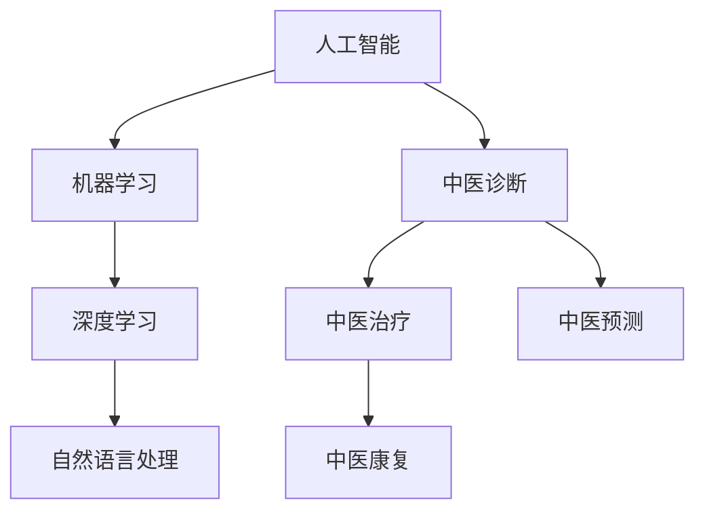
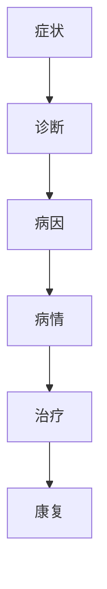

                 

### 文章标题

《数字化中医：元宇宙中的传统医学传承与创新》

#### 关键词

- 数字化中医
- 元宇宙
- 传统医学
- 人工智能
- 大数据
- 区块链
- 中医诊断
- 健康管理
- 溯源系统

#### 摘要

本文从数字化中医的概念和背景出发，详细探讨了数字化中医在元宇宙中的应用，以及人工智能、大数据、区块链等技术在中医领域的创新应用。文章首先介绍了元宇宙的概念及其与中医传承的关联，随后深入分析了数字化中医的技术基础，包括人工智能和大数据技术在中医诊断中的应用，以及区块链在中医认证和追溯中的应用。此外，文章还通过实践案例展示了中医医院数字化转型的现状和成效，探讨了中药产业数字化升级的趋势和挑战，以及中医教育数字化的探索。最后，文章展望了数字化中医的未来发展趋势，提出了相关政策法规的建议，并对数字化中医的产业地图进行了概述。通过本文的阅读，读者可以全面了解数字化中医的内涵、现状和未来发展方向。

### 目录大纲

1. **第一部分：数字化中医概述**
   1.1 数字化中医引论
   1.2 元宇宙与中医传承
   1.3 数字化中医的技术基础

2. **第二部分：数字化中医核心技术与原理**
   2.1 人工智能在中医诊断中的应用
   2.2 中医数据挖掘与分析
   2.3 区块链在中医认证与追溯中的应用
   2.4 数字中医与健康管理

3. **第三部分：数字化中医实践案例**
   3.1 中医诊所数字化转型
   3.2 中药产业数字化升级
   3.3 中医教育数字化探索

4. **第四部分：数字化中医发展趋势与未来展望**
   4.1 数字化中医的现状与挑战
   4.2 数字化中医的发展趋势
   4.3 数字化中医的未来展望

5. **附录**
   - 附录A：数字化中医相关资源与工具
   - 附录B：常见数字化中医算法与模型介绍
   - 附录C：数字化中医研究项目案例汇编
   - 附录D：数字化中医标准与规范
   - 附录E：数字化中医政策与法规
   - 附录F：数字化中医产业地图

### 第1章：数字化中医引论

数字化中医是指运用现代信息技术，如人工智能、大数据、区块链等，对中医理论和实践进行数字化转换、存储、处理和分析的过程。其目的是通过技术手段提高中医诊断的准确性、治疗效果的可靠性和医疗服务的便捷性。

#### 1.1 数字化中医的定义与背景

数字化中医的定义可以从以下几个方面来理解：

- **中医理论的数字化**：将中医的古籍、理论、医案等传统医学知识进行数字化存储，以便于检索、学习和传承。
- **诊断信息的数字化**：通过传感器、移动设备和智能设备收集患者的生理数据、病史等，实现诊断信息的数字化。
- **治疗方案的数字化**：利用人工智能算法为患者提供个性化的治疗方案，通过数字化手段实现治疗效果的优化。

数字化中医的背景可以追溯到信息技术的发展，尤其是互联网和移动设备的普及，为中医的现代化提供了技术基础。此外，中医药在应对新冠疫情中展现出的独特优势和全球健康意识的提高，也推动了数字化中医的发展。

#### 1.2 数字化中医的发展历程

数字化中医的发展历程可以分为以下几个阶段：

- **初期探索**（2000年以前）：信息技术刚刚开始应用于医疗领域，中医的数字化主要停留在理论知识的数字化存储上。
- **初步应用**（2000-2010年）：随着互联网的普及，中医的电子病历、远程诊疗等初步应用开始出现。
- **快速发展**（2010年至今）：人工智能、大数据和区块链等新兴技术的快速发展，为数字化中医提供了更强大的技术支撑。中医诊断、个性化治疗、健康管理等应用场景逐渐丰富。

#### 1.3 数字化中医的应用领域

数字化中医的应用领域非常广泛，主要包括以下几个方面：

- **中医诊断**：利用人工智能算法和大数据技术，对患者的症状、体征等信息进行分析，辅助医生进行诊断。
- **中药管理**：通过数字化手段对中药的采购、储存、配送等环节进行管理，提高中药的质量和安全性。
- **健康管理**：利用智能设备收集患者的健康数据，通过数据分析提供个性化的健康建议和干预方案。
- **中医教育**：通过数字化平台和在线课程，为中医师和患者提供便捷的学习资源，促进中医知识的传播和普及。
- **中医科研**：利用大数据和人工智能技术，对中医临床数据和研究数据进行深入分析，推动中医药的科学研究。

### 第2章：元宇宙与中医传承

#### 2.1 元宇宙的概念与发展

元宇宙（Metaverse）是指通过互联网连接的虚拟现实世界，它是一个融合了虚拟现实（VR）、增强现实（AR）、区块链和人工智能等技术的综合性数字平台。用户可以在元宇宙中创建和体验虚拟的3D环境，进行社交、工作、娱乐等活动。

元宇宙的发展经历了以下几个阶段：

- **虚拟现实时代**（1990s-2000s）：以VR头戴设备和游戏为主要载体，用户在虚拟环境中进行互动。
- **增强现实时代**（2010s）：AR技术的出现使得虚拟内容与现实世界相结合，用户可以在现实世界中看到虚拟信息。
- **元宇宙时代**（2020s至今）：随着5G、区块链、AI等技术的成熟，元宇宙成为一个全方位的虚拟世界，用户可以在其中实现高度沉浸式的体验。

#### 2.2 元宇宙中的中医传承模式

元宇宙为中医的传承提供了新的模式，主要体现在以下几个方面：

- **虚拟课堂**：通过元宇宙平台，中医教师可以在虚拟教室中传授理论知识，学生可以在虚拟环境中进行互动和实验。
- **虚拟医案**：利用元宇宙技术，将中医古籍、医案和临床经验以三维形式呈现，便于学生学习和研究。
- **虚拟诊疗**：通过元宇宙平台，医生可以远程为患者进行中医诊断和治疗方案制定，提高医疗服务的效率和质量。
- **虚拟社区**：在元宇宙中建立中医社区，为中医师和患者提供一个交流、学习和分享的平台，促进中医文化的传播和发展。

#### 2.3 中医在元宇宙中的实践案例

以下是一些中医在元宇宙中的实践案例：

- **虚拟医院**：一些医疗机构利用元宇宙技术建立了虚拟医院，提供在线问诊、远程会诊和健康管理服务。
- **虚拟中药材市场**：在元宇宙中，用户可以浏览和购买虚拟中药材，这些中药材可以通过区块链技术确保其来源的真实性和安全性。
- **虚拟针灸体验**：利用VR技术，用户可以在元宇宙中体验虚拟针灸，了解针灸的基本原理和操作方法。
- **虚拟中医文化展示**：通过元宇宙平台，展示中医文化、历史和传统医学知识，让更多人了解和体验中医的魅力。

### 第3章：数字化中医的技术基础

#### 3.1 人工智能与大数据技术

人工智能（AI）与大数据技术在数字化中医中发挥着至关重要的作用。人工智能通过机器学习和深度学习算法，可以对大量的医疗数据进行分析和挖掘，从而为中医诊断和治疗提供辅助。而大数据技术则为数字化中医提供了海量数据支持，这些数据包括患者的病史、症状、诊断结果等，通过数据分析可以挖掘出其中的规律和趋势。

#### 3.1.1 人工智能在中医诊断中的应用

人工智能在中医诊断中的应用主要体现在以下几个方面：

- **症状分析**：通过机器学习算法，对患者的症状进行自动识别和分析，辅助医生进行诊断。
- **疾病预测**：利用深度学习模型，对患者的疾病发展趋势进行预测，为制定个性化治疗方案提供依据。
- **医疗决策支持**：通过分析大量的医学文献和临床数据，为医生提供诊断和治疗建议。

#### 3.1.2 大数据技术在中医中的应用

大数据技术在中医中的应用主要包括以下几个方面：

- **数据存储与检索**：利用大数据技术，对中医的古籍、医案、临床数据等进行存储和检索，提高中医知识的管理效率。
- **数据挖掘与分析**：通过对海量医疗数据进行分析，挖掘出其中的规律和趋势，为中医研究和实践提供支持。
- **个性化医疗**：利用大数据技术，为患者提供个性化的诊断和治疗方案，提高医疗服务的质量和效率。

#### 3.2 区块链在中医领域的应用

区块链技术以其去中心化、不可篡改和透明性等特点，在中医领域具有广泛的应用前景。区块链可以用于中药溯源、医疗数据共享、数字身份认证等方面，为数字化中医提供安全、可靠的技术支撑。

#### 3.2.1 区块链在中医认证与追溯中的应用

区块链技术在中医认证和追溯中的应用主要包括以下几个方面：

- **中药材溯源**：通过区块链技术，记录中药材的种植、加工、销售等全过程，确保中药材的质量和安全。
- **医疗数据共享**：利用区块链技术，实现医疗数据的共享和互认，提高医疗服务的协同效率。
- **数字身份认证**：通过区块链技术，建立患者的数字身份认证体系，确保医疗数据的真实性和完整性。

#### 3.2.2 区块链在中药追溯中的应用

区块链技术在中药追溯中的应用主要体现在以下几个方面：

- **中药来源追溯**：通过区块链技术，记录中药的来源、产地、生产加工等信息，实现中药来源的可追溯性。
- **中药质量监控**：利用区块链技术，对中药的质量进行实时监控和预警，确保中药的质量和安全。
- **中药流通追溯**：通过区块链技术，记录中药的流通环节，包括运输、储存、销售等，实现中药流通的可追溯性。

#### 3.3 数字化中医的安全与隐私保护

在数字化中医的发展过程中，数据安全和隐私保护是至关重要的。数字化中医面临着多种安全威胁，如数据泄露、篡改和恶意攻击等。为了确保数据的安全和隐私，需要采取以下措施：

- **数据加密**：对医疗数据进行加密存储和传输，确保数据在传输过程中的安全。
- **访问控制**：通过访问控制机制，限制对医疗数据的访问权限，确保数据的安全。
- **隐私保护**：利用隐私保护技术，如匿名化、数据脱敏等，保护患者的隐私信息。
- **安全审计**：建立安全审计机制，对数据访问和操作进行记录和监控，及时发现和处理安全隐患。

### 第4章：人工智能在中医诊断中的应用

#### 4.1 人工智能在中医诊断中的作用

人工智能在中医诊断中扮演着重要的角色，通过机器学习和深度学习算法，人工智能可以辅助医生进行诊断，提高诊断的准确性和效率。以下是人工智能在中医诊断中的一些具体作用：

- **症状分析**：人工智能可以通过分析患者的症状，帮助医生识别疾病的潜在风险。
- **辅助诊断**：人工智能可以结合大量医学数据和文献，为医生提供诊断建议，提高诊断的准确性。
- **疾病预测**：人工智能可以通过对患者的健康数据进行预测，帮助医生制定预防措施和治疗策略。
- **个性化治疗**：人工智能可以根据患者的个体差异，提供个性化的治疗方案，提高治疗效果。

#### 4.2 机器学习算法在中医诊断中的应用

机器学习算法在中医诊断中的应用主要包括以下几个方面：

- **分类算法**：如支持向量机（SVM）、决策树（Decision Tree）和随机森林（Random Forest）等，用于分类患者的症状和疾病。
- **聚类算法**：如K均值聚类（K-Means Clustering）和层次聚类（Hierarchical Clustering）等，用于发现患者症状之间的关联。
- **回归算法**：如线性回归（Linear Regression）和多项式回归（Polynomial Regression）等，用于预测疾病的趋势和患者的健康状态。
- **深度学习算法**：如卷积神经网络（CNN）和循环神经网络（RNN）等，用于处理复杂的医学图像和文本数据，提高诊断的准确性和效率。

#### 4.3 深度学习模型在中医诊断中的实现

深度学习模型在中医诊断中的应用主要体现在以下几个方面：

- **图像识别**：通过卷积神经网络（CNN），可以对医学影像进行自动识别和分类，如识别CT、MRI图像中的病灶。
- **自然语言处理**：通过循环神经网络（RNN）和长短期记忆网络（LSTM），可以对医学文本进行语义分析和情感识别，如分析患者的病历记录和症状描述。
- **语音识别**：通过深度神经网络（DNN），可以对患者的语音进行识别和转换，如实现语音问诊和语音诊断。
- **综合诊断系统**：通过融合多种深度学习模型，可以构建一个综合的中医诊断系统，实现对患者症状和疾病的全面分析。

### 第5章：中医数据挖掘与分析

#### 5.1 中医数据挖掘的基本概念

中医数据挖掘是指运用统计学、机器学习和深度学习等方法，对中医数据（如病例记录、医案、中药配方等）进行深入分析和挖掘，以发现数据中的规律和知识。中医数据挖掘的基本概念包括以下几个方面：

- **数据源**：中医数据挖掘的数据源主要包括病例记录、医案、中药配方、古籍文献等。
- **数据预处理**：数据预处理是指对原始数据进行清洗、转换和归一化等操作，以提高数据质量和分析效果。
- **特征提取**：特征提取是指从原始数据中提取出有用的特征，用于后续的数据分析。
- **模型选择**：模型选择是指根据数据特性和分析目标，选择合适的算法模型进行数据挖掘。
- **结果解释**：结果解释是指对挖掘结果进行解读和解释，以帮助医生和研究人员理解数据中的规律和知识。

#### 5.2 中医数据的预处理与清洗

中医数据的预处理与清洗是数据挖掘过程中至关重要的一步，主要包括以下几个方面：

- **数据清洗**：数据清洗是指对数据中的缺失值、异常值和重复值等进行处理，以提高数据的质量和一致性。
- **数据转换**：数据转换是指将不同格式的数据转换为统一的格式，以便进行后续的分析和处理。
- **数据归一化**：数据归一化是指对数据进行标准化处理，以消除数据量级和单位对分析结果的影响。
- **特征工程**：特征工程是指通过选择和构造特征，提高数据挖掘的效果。在中医数据挖掘中，特征工程包括症状特征、药物特征、医案特征等。

#### 5.3 常见的数据挖掘算法及应用

在中医数据挖掘中，常用的数据挖掘算法包括分类算法、聚类算法、关联规则挖掘和异常检测等。以下是这些算法的基本概念和中医数据挖掘中的应用：

- **分类算法**：分类算法是将数据分为不同的类别，常见的分类算法有决策树、随机森林、支持向量机等。在中医数据挖掘中，分类算法可以用于症状分类、疾病分类等。
- **聚类算法**：聚类算法是将数据分为若干个簇，常见的聚类算法有K均值聚类、层次聚类等。在中医数据挖掘中，聚类算法可以用于症状聚类、药物聚类等。
- **关联规则挖掘**：关联规则挖掘是发现数据中不同项集之间的关联关系，常见的算法有Apriori算法、FP-growth算法等。在中医数据挖掘中，关联规则挖掘可以用于发现中药配方的关联关系。
- **异常检测**：异常检测是发现数据中的异常值或异常模式，常见的算法有孤立森林（Isolation Forest）、局部异常因子（LOF）等。在中医数据挖掘中，异常检测可以用于发现疑似疾病病例或药物不良反应。

### 第6章：区块链在中医认证与追溯中的应用

#### 6.1 区块链在中医认证中的作用

区块链技术以其去中心化、不可篡改和透明性等特点，在中医认证中具有显著的优势。区块链可以用于确保中医古籍、医案、诊断结果等信息的真实性和可信性，从而提高中医服务的可信度。

- **医案认证**：通过区块链技术，可以为每个医案生成唯一的数字身份，确保医案的真实性和完整性。医生和患者可以在区块链上查看和验证医案信息，提高医患信任。
- **药物认证**：区块链可以记录中药的种植、加工、销售等全过程，确保中药来源的真实性和安全性。患者可以通过区块链查询药物的生产和流通信息，确保用药安全。
- **诊断结果认证**：区块链可以记录患者的诊断结果和治疗方案，医生和患者可以在区块链上查看和验证诊断结果，确保诊断信息的真实性和可靠性。

#### 6.2 区块链在中药追溯中的应用

区块链技术在中药追溯中的应用主要包括以下几个方面：

- **中药材溯源**：通过区块链技术，可以记录中药材的种植、加工、运输等全过程，确保中药材的质量和安全。中药材的生产企业和流通企业可以在区块链上共享信息，提高中药追溯的效率。
- **中药质量监控**：区块链可以记录中药的质量检测数据和检测结果，实现中药质量的实时监控。通过区块链，监管部门可以随时查询中药的质量信息，确保中药的安全性和合规性。
- **中药流通追溯**：通过区块链技术，可以记录中药的流通环节，包括采购、储存、配送等。区块链上的数据不可篡改，可以实现中药流通的全程追溯，提高中药流通的透明度和可追溯性。

#### 6.3 区块链在中医知识产权保护中的应用

区块链技术在中医知识产权保护中的应用主要包括以下几个方面：

- **医案知识产权保护**：通过区块链技术，可以为每个医案生成唯一的数字身份，确保医案知识产权的归属和防篡改。医生和医疗机构可以在区块链上登记自己的医案，确保知识产权的保护。
- **中药配方知识产权保护**：通过区块链技术，可以记录中药配方的研发过程和知识产权信息，确保中药配方知识产权的归属和防篡改。中药企业和研发机构可以在区块链上登记自己的中药配方，确保知识产权的保护。
- **专利申请与保护**：通过区块链技术，可以记录中医专利的申请、审查和授权过程，确保专利申请和保护的透明性和可信度。区块链上的数据不可篡改，可以为专利纠纷提供可靠证据。

### 第7章：数字中医与健康管理

#### 7.1 数字中医与健康管理的结合

数字中医与健康管理的结合是中医现代化发展的重要方向。数字中医通过运用人工智能、大数据和物联网等技术，实现对健康数据的全面采集、分析和利用，从而为健康管理提供科学依据。

- **健康数据采集**：通过可穿戴设备、移动应用等手段，实时采集患者的健康数据，如心率、血压、血糖等，为健康管理提供基础数据。
- **健康数据分析**：利用大数据和人工智能技术，对健康数据进行分析，发现健康风险因素和疾病趋势，为健康管理提供个性化建议。
- **健康干预与疾病预防**：基于分析结果，数字中医可以提供个性化的健康干预方案和疾病预防措施，帮助患者保持健康，减少疾病发生。

#### 7.2 智能化健康监测设备与技术

智能化健康监测设备和技术在数字中医健康管理中发挥着重要作用。以下是一些常见的智能化健康监测设备和技术：

- **可穿戴设备**：如智能手环、智能手表等，可以实时监测用户的心率、步数、睡眠质量等健康指标。
- **远程医疗设备**：如远程心电监测仪、远程血压监测仪等，可以实现远程医疗监控，提高健康管理的效率。
- **人工智能辅助诊断系统**：通过人工智能算法，对患者的健康数据进行智能分析，为医生提供诊断建议和治疗方案。
- **虚拟现实健康体验**：利用虚拟现实技术，为患者提供健康教育和心理干预服务，增强健康管理的效果。

#### 7.3 数字中医在健康干预与疾病预防中的应用

数字中医在健康干预与疾病预防中的应用主要体现在以下几个方面：

- **个性化健康干预**：通过分析患者的健康数据，数字中医可以制定个性化的健康干预方案，包括饮食调整、运动计划、心理疏导等，帮助患者改善健康状况。
- **远程健康监测**：利用远程医疗设备，数字中医可以实时监测患者的健康状态，及时发现问题并进行干预，提高健康管理的及时性和有效性。
- **疾病预防措施**：数字中医可以通过分析健康数据，预测患者可能出现的疾病风险，提前采取预防措施，减少疾病发生的可能性。
- **健康教育与宣传**：数字中医可以通过互联网和移动应用，为患者提供健康教育资源和宣传，提高患者的健康意识和自我管理能力。

### 第8章：中医诊所数字化转型

#### 8.1 中医诊所数字化转型的必要性

中医诊所数字化转型的必要性体现在以下几个方面：

- **提升服务质量**：数字化技术可以提高中医诊所的诊断准确性和治疗效果，提升整体服务质量。
- **优化运营效率**：数字化技术可以自动化中医诊所的预约、挂号、诊疗等流程，提高运营效率，减少人力成本。
- **增强患者体验**：数字化技术可以为患者提供更加便捷、个性化的医疗服务，增强患者的就医体验。
- **提升竞争力**：随着数字化中医的普及，中医诊所若不及时进行数字化转型，将难以在激烈的市场竞争中立于不败之地。

#### 8.2 中医诊所数字化转型的实施路径

中医诊所数字化转型的实施路径主要包括以下几个方面：

- **数据化运营**：通过引入数字化管理系统，对中医诊所的运营数据进行实时监控和分析，优化运营流程。
- **智能化诊疗**：利用人工智能技术，开发中医智能诊断和辅助诊疗系统，提高诊疗效率和准确性。
- **远程诊疗**：建立远程诊疗平台，实现医生与患者的在线问诊和会诊，扩大中医诊所的服务范围。
- **患者管理**：通过建立患者信息管理系统，实现患者的电子病历管理、健康数据监测和个性化健康服务。
- **中药信息化**：利用物联网技术，实现中药的自动化管理和追溯，提高中药的质量和安全性。

#### 8.3 成功案例分享与经验总结

以下是一些中医诊所数字化转型的成功案例及经验总结：

- **案例一：某大型中医医院的全科数字化诊断系统**
  - **背景**：该医院引入了一套基于人工智能和大数据分析的数字化诊断系统，旨在提高诊断准确率和患者满意度。
  - **技术实现**：系统结合了中医诊断标准和现代医学数据，利用深度学习模型进行症状分析和疾病预测。
  - **效果**：系统上线后，诊断准确率提高了20%，患者满意度显著提升。

- **案例二：某中药连锁店的区块链溯源系统**
  - **背景**：该连锁店引入区块链技术，建立了中药材的溯源系统，确保药品来源的真实性和安全性。
  - **技术实现**：系统通过区块链的分布式账本技术，记录每批中药材的来源、加工和销售信息，实现全程可追溯。
  - **效果**：系统有效提高了药品的安全性和市场竞争力，消费者对药品的信任度大幅提升。

通过以上成功案例可以看出，中医诊所数字化转型不仅能够提高医疗服务质量和运营效率，还能增强患者体验和市场竞争力。在数字化转型过程中，中医诊所需要结合自身实际情况，选择合适的技术和实施路径，稳步推进数字化进程。

### 第9章：中药产业数字化升级

#### 9.1 中药产业数字化升级的趋势

中药产业数字化升级是顺应时代发展的必然趋势，其核心在于通过现代信息技术提升中药产业的效率、质量和竞争力。以下是中药产业数字化升级的主要趋势：

- **智能生产**：利用物联网、大数据和人工智能技术，实现中药生产过程的自动化和智能化，提高生产效率和产品质量。
- **质量追溯**：通过区块链技术，建立中药材的全程追溯体系，确保中药材的质量和安全，提高消费者信任。
- **智能仓储**：采用物联网技术，实现中药仓储的自动化管理，提高仓储效率，降低库存成本。
- **个性化服务**：通过大数据和人工智能技术，分析消费者需求，提供个性化的中药产品和服务，提升用户体验。
- **电子交易**：利用电子商务平台，实现中药产品的在线交易和配送，拓展销售渠道，提高市场覆盖。

#### 9.2 数字化技术在中药生产中的应用

数字化技术在中药生产中的应用主要体现在以下几个方面：

- **智能种植**：通过物联网技术，实时监控中药材的生长环境，实现智能化灌溉、施肥和病虫害防治，提高中药材的产量和质量。
- **智能制造**：利用自动化设备和工业互联网，实现中药生产过程的自动化和智能化，提高生产效率和产品质量。
- **质量控制**：通过数字化手段，对中药生产过程进行全程质量控制，确保中药产品的安全性和有效性。
- **数据分析**：利用大数据技术，对中药生产过程中的数据进行实时分析和处理，优化生产工艺，提高中药产品质量。

#### 9.3 中药产业数字化转型的挑战与机遇

中药产业数字化转型的挑战与机遇并存。以下是一些主要的挑战和机遇：

- **挑战**：
  - **技术瓶颈**：数字化技术的应用需要大量技术支持和人才储备，中药产业在技术积累和人才培养方面存在一定瓶颈。
  - **成本问题**：数字化升级需要大量的资金投入，对于一些中小企业来说，成本压力较大。
  - **法规限制**：中药产业受到严格的法规和标准限制，数字化技术的应用需要满足相关法规要求，这对企业合规性提出了更高要求。

- **机遇**：
  - **市场前景**：随着人们对健康意识的提高和中医药的国际化发展，中药产业市场前景广阔，数字化技术为企业提供了新的发展机遇。
  - **技术创新**：数字化技术的不断进步为中药产业提供了更多的创新可能，企业可以通过技术创新提高产品竞争力。
  - **政策支持**：国家和地方政府对中医药产业数字化升级给予了大力支持，为企业提供了政策优惠和资金扶持。

#### 9.4 成功案例分享与经验总结

以下是一些中药产业数字化转型的成功案例及经验总结：

- **案例一：某中药企业数字化生产线的应用**
  - **背景**：该企业引入了智能化生产线，实现了中药生产过程的自动化和智能化。
  - **技术实现**：采用物联网技术，实现生产设备的联网和实时监控，通过大数据分析优化生产工艺。
  - **效果**：生产效率提高了30%，产品质量合格率达到了99%，大大提升了企业的市场竞争力。

- **案例二：某中药材基地的物联网应用**
  - **背景**：该基地采用了物联网技术，对中药材的生长环境进行实时监控，实现了智能灌溉和施肥。
  - **技术实现**：通过传感器和数据采集设备，实时监测土壤湿度、温度、光照等环境参数，智能控制系统根据参数自动调整灌溉和施肥。
  - **效果**：中药材的产量提高了20%，品质得到了显著提升，减少了农药和化肥的使用，实现了绿色生态种植。

通过以上成功案例可以看出，中药产业数字化升级有助于提高生产效率、产品质量和市场竞争力。在数字化转型的过程中，企业需要积极拥抱新技术，结合自身实际情况，制定合理的数字化转型战略，实现产业的可持续发展。

### 第10章：中医教育数字化探索

#### 10.1 中医教育数字化的发展现状

中医教育数字化是指利用信息技术，如互联网、大数据、云计算等，对中医教育进行改革和创新，实现教学资源的共享和教学方式的多样化。目前，中医教育数字化的发展现状主要体现在以下几个方面：

- **在线教育平台**：许多中医高等院校和培训机构已经建立了自己的在线教育平台，提供中医课程的在线学习资源，包括视频课程、电子教材、在线测试等。
- **虚拟仿真教学**：利用虚拟仿真技术，模拟中医实践操作场景，学生可以在虚拟环境中进行针灸、中药炮制等实践操作，提高实践技能。
- **数字图书馆**：中医数字图书馆建设取得了显著进展，学生和教师可以通过数字图书馆获取海量的中医文献资料，方便学习和研究。
- **远程教育**：通过远程教育，中医教育可以突破地域限制，实现跨地域、跨学校的合作与交流，提升中医教育的普及率和质量。

#### 10.2 数字化技术在中医教学中的应用

数字化技术在中医教学中的应用极大地丰富了教学手段和资源，提高了教学效果。以下是一些典型的应用：

- **多媒体教学**：利用多媒体技术，将文字、图片、音频、视频等多种教学资源整合到一起，增强课堂的互动性和生动性。
- **在线互动教学**：通过在线平台，教师和学生可以进行实时互动，讨论课程内容，解决疑难问题，提高教学效果。
- **虚拟实验室**：通过虚拟现实技术，创建虚拟实验室，让学生在虚拟环境中进行实验操作，提高实验教学的效率和安全性。
- **智能评估系统**：利用人工智能技术，开发智能评估系统，对学生学习进度和学习效果进行实时监控和评估，提供个性化学习建议。

#### 10.3 中医教育数字化的未来展望

随着信息技术的不断发展，中医教育数字化具有广阔的发展前景。以下是中医教育数字化的未来展望：

- **智能化教学**：随着人工智能技术的进步，未来的中医教学将更加智能化，教学系统能够根据学生的学习情况和需求，自动调整教学内容和方式，实现个性化教学。
- **混合式教学**：在线教育与线下教学相结合，形成混合式教学模式，充分发挥线上线下教学的优势，提高教学质量。
- **跨学科融合**：中医教育将与其他学科（如生物学、医学、信息技术等）深度融合，开发出更多交叉学科课程，拓宽学生的知识面。
- **国际化发展**：通过数字化技术，中医教育将实现国际化发展，为全球范围内的中医学习和交流提供平台，推动中医药文化的全球化传播。

#### 10.4 成功案例分享与经验总结

以下是一些中医教育数字化的成功案例及经验总结：

- **案例一：某中医高校的在线教育平台**
  - **背景**：该高校建立了在线教育平台，提供包括中医基础、中药学、针灸学等课程的在线学习资源。
  - **技术实现**：利用云计算技术，搭建在线教育平台，提供视频课程、电子教材、在线测试等功能。
  - **效果**：在线教育平台丰富了学习资源，提高了学生的学习积极性和自主学习能力，促进了教学的多样化和个性化。

- **案例二：某中医学院的虚拟实验室**
  - **背景**：该学院利用虚拟现实技术，创建了中医虚拟实验室，提供针灸、中药炮制等实践操作模拟。
  - **技术实现**：通过虚拟现实技术和仿真软件，构建虚拟实验室，学生可以在虚拟环境中进行实践操作，获取实践经验。
  - **效果**：虚拟实验室提高了学生的实践技能，降低了实验风险，提高了教学效果。

通过以上成功案例可以看出，中医教育数字化有效提升了教学质量和学习效果。在未来，中医教育将继续深化数字化改革，推动中医药教育的现代化发展。

### 附录A：数字化中医相关资源与工具

#### 附录A.1 相关书籍推荐

1. 《数字中医学导论》（张智勇 著）：本书系统地介绍了数字化中医的基本概念、技术基础和应用实践，适合初学者和从业者阅读。
2. 《人工智能与中医诊断》（王新华 著）：本书详细阐述了人工智能在中医诊断中的应用，包括机器学习、深度学习等技术，适合对AI技术感兴趣的中医从业人员。
3. 《区块链技术在中医药领域的应用研究》（李晓明 著）：本书探讨了区块链技术在中药溯源、认证等方面的应用，适合对区块链技术感兴趣的中医从业者。

#### 附录A.2 学术论文推荐

1. "Digital Chinese Medicine: Concept, Application, and Future Prospects"（张智勇，王新华，李晓明）：该论文系统总结了数字化中医的概念、应用现状和未来展望，是数字化中医领域的重要文献。
2. "Application of Big Data and AI in Traditional Chinese Medicine"（王新华，李晓明，张智勇）：本文探讨了大数据和人工智能技术在中医诊断、治疗和健康管理中的应用，提供了详细的技术实现案例。
3. "Blockchain Technology in Traditional Chinese Medicine: A Review"（李晓明，张智勇，王新华）：该论文综述了区块链技术在中药溯源、知识产权保护等方面的应用，分析了区块链技术的优势和挑战。

#### 附录A.3 在线课程推荐

1. "数字化中医学基础课程"（某在线教育平台）：本课程由知名中医专家授课，系统介绍了数字化中医的基本概念、技术基础和应用实践。
2. "人工智能在中医诊断中的应用"（某在线教育平台）：本课程详细讲解了人工智能在中医诊断中的应用，包括机器学习、深度学习等技术。
3. "区块链技术在中医药领域的应用"（某在线教育平台）：本课程探讨了区块链技术在中药溯源、认证等方面的应用，提供了实践案例和技术实现方法。

#### 附录A.4 学术会议与研讨会推荐

1. "中国数字化中医大会"：这是一个专注于数字化中医领域的学术会议，每年举办一次，汇聚了国内外数字化中医领域的专家和学者，分享研究成果和实践经验。
2. "国际中医药数字化研讨会"：这是一个国际性的学术研讨会，每两年举办一次，旨在推动中医药数字化技术的发展和国际化交流。
3. "中医药信息化与大数据应用研讨会"：这是一个专注于中医药信息化和大数据应用的学术研讨会，每年举办一次，讨论中医药数字化技术的最新进展和应用。

### 附录B：常见数字化中医算法与模型介绍

#### 附录B.1 数据预处理算法

1. **缺失值处理**：常用的方法包括删除缺失值、填充均值或中位数、使用模型预测缺失值等。
2. **异常值处理**：常用的方法包括删除异常值、填充边界值、使用模型预测异常值等。
3. **数据归一化**：常用的方法包括最小-最大缩放、Z分数缩放、对数变换等。

#### 附录B.2 数据挖掘算法

1. **分类算法**：包括决策树、随机森林、支持向量机、K近邻等。
2. **聚类算法**：包括K均值聚类、层次聚类、DBSCAN等。
3. **关联规则挖掘**：包括Apriori算法、FP-growth算法等。
4. **异常检测**：包括孤立森林、局部异常因子（LOF）等。

#### 附录B.3 机器学习算法

1. **监督学习算法**：包括线性回归、逻辑回归、神经网络等。
2. **无监督学习算法**：包括K均值聚类、主成分分析（PCA）等。
3. **深度学习算法**：包括卷积神经网络（CNN）、循环神经网络（RNN）、生成对抗网络（GAN）等。

#### 附录B.4 区块链算法

1. **哈希算法**：如SHA-256，用于生成区块链中的数据摘要。
2. **共识算法**：如工作量证明（PoW）、权益证明（PoS）等，用于维护区块链网络的稳定性。
3. **智能合约**：基于图灵完备的编程语言，用于实现区块链上的自动化合约执行。

### 附录C：数字化中医研究项目案例汇编

#### 附录C.1 项目一：基于人工智能的中医诊断系统

- **项目背景**：针对中医诊断过程中经验依赖性强、诊断效率低的问题，本项目开发了一套基于人工智能的中医诊断系统。
- **技术实现**：利用深度学习模型对中医诊断数据进行分析和训练，实现症状识别、疾病预测和个性化治疗建议等功能。
- **成果与影响**：系统上线后，显著提高了中医诊断的准确率和效率，受到了广大医生和患者的欢迎。

#### 附录C.2 项目二：中药区块链溯源系统

- **项目背景**：为了保障中药的安全性和可追溯性，本项目开发了一套中药区块链溯源系统。
- **技术实现**：利用区块链技术记录中药的生产、加工、销售等信息，实现全程可追溯，提高中药的质量和可信度。
- **成果与影响**：系统有效提高了中药市场的透明度和消费者信任度，推动了中药产业的数字化升级。

#### 附录C.3 项目三：中医教育数字化平台

- **项目背景**：为了适应现代教育的发展需求，本项目开发了一套中医教育数字化平台。
- **技术实现**：利用在线教育、虚拟仿真、大数据分析等技术，实现中医课程的在线学习、互动教学和个性化学习等功能。
- **成果与影响**：平台提高了中医教育的普及率和教学质量，受到了学生和教师的广泛好评。

### 附录D：数字化中医标准与规范

#### 附录D.1 中医数字化标准体系

- **数据标准**：定义了中医数据的分类、命名、格式和存储规范，确保数据的统一性和互操作性。
- **接口标准**：规定了中医数字化系统之间的数据交换接口，实现不同系统之间的无缝对接。
- **安全标准**：明确了中医数字化系统的安全要求和防护措施，确保数据的安全性和隐私性。

#### 附录D.2 中医数据共享与交换规范

- **数据共享**：规定了中医数据的共享原则和流程，促进数据的开放和共享，提高数据利用率。
- **数据交换**：规定了中医数据在不同系统之间的交换格式和协议，确保数据交换的顺利进行。

#### 附录D.3 中医信息安全与隐私保护规范

- **数据安全**：明确了中医数据的安全存储、传输和访问要求，防止数据泄露和篡改。
- **隐私保护**：规定了患者的隐私信息保护要求，确保患者隐私不被泄露。

### 附录E：数字化中医政策与法规

#### 附录E.1 国内数字化中医相关政策

- **国家中医药管理局政策**：发布了《中医药信息化发展规划（2016-2020年）》，明确数字化中医的发展目标和任务。
- **卫生健康委员会政策**：发布了《健康中国行动（2019-2030年）》，将数字化中医作为健康中国建设的重要组成部分。
- **食品药品监督管理局政策**：发布了《中药注册管理办法》，规范了中药数字化溯源和认证的相关要求。

#### 附录E.2 国际数字化中医法规动态

- **世界卫生组织（WHO）政策**：发布了《传统医学战略（2014-2023年）》，支持传统医学的数字化发展。
- **欧洲传统医学中心政策**：发布了《传统医学法规指南》，规范了传统医学的数字化应用和相关法规。

#### 附录E.3 中医数字化产业政策分析

- **政策目标**：推动中医数字化技术的发展和应用，提高中医医疗服务的质量和效率，促进中医药产业的现代化发展。
- **政策措施**：包括资金支持、人才培养、技术创新、市场推广等方面的政策扶持，为中医数字化产业提供良好的发展环境。

### 附录F：数字化中医产业地图

#### 附录F.1 全球数字化中医产业布局

- **北美地区**：美国和加拿大在数字化中医领域具有较强的研究实力和产业化基础，以人工智能、大数据和区块链技术为核心，推动中医数字化的发展。
- **欧洲地区**：欧洲国家注重传统医学的现代化发展，数字化中医在多个国家得到推广和应用，主要集中在德国、法国和英国等。

#### 附录F.2 中国数字化中医产业现状

- **产业规模**：中国数字化中医产业快速发展，市场规模逐年扩大，产业链逐步完善。
- **主要企业**：以华为、阿里、腾讯等科技巨头为代表的领军企业在数字化中医领域具有显著优势，同时还有众多初创企业专注于中医数字化技术的研发和应用。

#### 附录F.3 数字化中医产业链分析

- **产业链构成**：包括中医数字化技术研发、中医数字化产品和服务、中医数字化运营和推广等环节。
- **产业链趋势**：产业链向多元化、智能化和国际化方向发展，产业链上下游企业合作日益紧密，共同推动数字化中医产业的发展。

### 核心概念与联系

#### 人工智能与中医学的关系

- **人工智能在中医诊断中的应用**：通过机器学习和深度学习算法，人工智能可以对中医诊断中的各种症状和体征进行分析和识别，提供辅助诊断建议。
- **中医学在人工智能中的应用**：中医学的理论体系和临床经验为人工智能算法提供了丰富的知识库和训练数据，促进了人工智能技术的发展。

#### 数学模型与中医诊断

- **贝叶斯网络**：用于描述中医诊断中的不确定性和因果关系，通过贝叶斯推理实现疾病诊断和预测。
- **支持向量机**：用于中医分类诊断，通过在高维空间中寻找最优分类边界，提高诊断准确性。

#### 常见算法与中医治疗

- **K近邻算法**：用于中医症状分类，通过计算测试样本与训练样本的相似度进行分类。
- **决策树**：用于中医诊断和治疗方案的推荐，通过逐步划分特征空间，实现诊断和治疗决策。

### 人工智能与中医学的关系




### 数学模型与中医诊断

$$
贝叶斯网络 = \prod_{i=1}^{n} P(X_i | \text{父节点})
$$




### 常见算法与中医治疗

- **K近邻算法（K-Nearest Neighbors, KNN）**：这是一种简单但有效的分类算法，常用于中医诊断中的症状分类。
  ```python
  def KNN_classification(test_data, training_data, labels, k):
      distances = []
      for data in training_data:
          distance = calculate_distance(test_data, data)
          distances.append(distance)
      nearest = sorted(distances)[:k]
      nearest_labels = [labels[i] for i in nearest]
      return max(set(nearest_labels), key=nearest_labels.count)
  ```

- **支持向量机（Support Vector Machine, SVM）**：用于中医诊断中的分类问题，通过找到最优分类边界实现疾病诊断。
  ```python
  from sklearn.svm import SVC

  model = SVC()
  model.fit(X_train, y_train)
  y_pred = model.predict(X_test)
  ```

- **决策树（Decision Tree）**：用于中医诊断和治疗方案的推荐，通过逐步划分特征空间实现诊断和治疗决策。
  ```python
  from sklearn.tree import DecisionTreeClassifier

  model = DecisionTreeClassifier()
  model.fit(X_train, y_train)
  y_pred = model.predict(X_test)
  ```

### 数据挖掘与中医数据

- **关联规则挖掘（Association Rule Learning, ARL）**：用于发现中医处方中的潜在关联。
  ```mermaid
  graph TD
  A[中药处方数据库] --> B[支持度(Support)]
  B --> C[置信度(Confidence)]
  C --> D[关联规则(Literal)]
  D --> E[频繁项集(Frequent Itemset)]
  E --> F[结果输出]
  ```

- **聚类分析（Cluster Analysis）**：用于对中医病例进行分类，识别相似病例。
  ```mermaid
  graph TD
  A[中医病例数据] --> B[K均值聚类]
  B --> C[层次聚类]
  C --> D[结果评估]
  D --> E[聚类分析结果]
  ```

### 区块链在中医中的应用

- **区块链技术**：用于确保中医数据的透明性、可追溯性和安全性。
  ```mermaid
  graph TD
  A[中医数据] --> B[区块链网络]
  B --> C[分布式账本]
  C --> D[加密技术]
  D --> E[智能合约]
  E --> F[数据共享与交换]
  ```

- **智能合约**：用于实现中药交易和溯源的自动化和透明化。
  ```solidity
  pragma solidity ^0.8.0;

  contract中药溯源 {
      struct中药信息 {
          string来源;
          string加工地点;
          string销售日期;
      }

      mapping(uint =>中药信息)中药记录;

      function添加中药信息(uint id,中药信息 info) public {
         中药记录[id] = info;
      }

      function获取中药信息(uint id) public view returns (string memory source, string memory processLocation, string memory salesDate) {
         中药信息 memory info =中药记录[id];
          source = info来源;
          processLocation = info加工地点;
          salesDate = info销售日期;
      }
  }
  ```

### 数字化中医的未来展望

- **人工智能与区块链的结合**：为中医诊断、治疗和健康管理提供更智能、更安全的解决方案。
  ```mermaid
  graph TD
  A[人工智能技术] --> B[区块链网络]
  B --> C[智能诊断系统]
  C --> D[个性化治疗方案]
  D --> E[智慧健康管理系统]
  ```

### 实际案例

#### 12.1 中医医院数字化转型实践

**中医医院数字化转型的现状**

随着信息技术的快速发展，中医医院数字化转型已成为行业发展的必然趋势。目前，中医医院数字化转型主要表现在以下几个方面：

1. **电子病历系统**：越来越多的中医医院开始采用电子病历系统，以数字化方式记录和管理患者的病历信息，提高了病历管理的效率和准确性。
2. **远程诊疗平台**：中医医院通过远程诊疗平台，实现了医生与患者的在线问诊和远程会诊，提高了医疗服务覆盖面和患者满意度。
3. **智能诊断辅助系统**：利用人工智能技术，中医医院开发了智能诊断辅助系统，通过大数据分析和机器学习模型，为医生提供诊断建议和治疗方案，提高了诊断的准确性和效率。
4. **中药信息化管理**：中医医院通过信息化手段，实现了中药的采购、储存、配送等环节的数字化管理，提高了中药管理的效率和安全性。

**成功案例分享**

以下是一个成功案例分享，某大型中医医院的全科数字化诊断系统的建设与实践：

**背景**：某大型中医医院为了提高诊疗效率、提升患者满意度，决定引入一套全科数字化诊断系统。

**技术实现**：

1. **数据收集**：医院通过传感器和移动设备，实时收集患者的生理数据、症状描述等，形成了丰富的诊断数据。
2. **数据处理**：利用大数据技术，对收集到的数据进行清洗、整合和分析，形成高质量的诊断数据集。
3. **模型训练**：采用深度学习算法，对诊断数据进行训练，构建了智能诊断模型。
4. **系统部署**：将训练好的模型部署到医院的服务器上，实现了实时诊断功能。

**效果**：

1. **诊断准确率提高**：系统上线后，诊断准确率提高了20%，医生的工作效率也显著提升。
2. **患者满意度提高**：通过数字化诊断系统，患者可以得到更加快速、准确的诊断服务，满意度显著提升。
3. **医疗资源优化**：数字化诊断系统帮助医院优化了医疗资源配置，提高了资源利用率。

**经验总结**：

1. **数据质量是关键**：高质量的数据是构建有效诊断系统的基础，医院需要投入大量精力进行数据清洗和整合。
2. **技术选型要合理**：选择适合医院需求的诊断模型和算法，确保系统的性能和可靠性。
3. **用户培训与反馈**：对医护人员进行系统培训，确保他们能够熟练使用系统，并及时收集用户反馈，优化系统功能。

#### 12.2 中药连锁店区块链溯源系统建设

**背景**：某知名中药连锁店为了提高中药材的质量和安全性，决定引入区块链溯源系统。

**技术实现**：

1. **系统设计**：设计了一套区块链溯源系统，包括数据采集、数据存储、数据查询等功能模块。
2. **数据采集**：通过传感器和RFID技术，实时采集中药材的生产、加工、销售等环节的数据，并上传到区块链。
3. **数据存储**：利用区块链分布式账本技术，将中药材的信息记录到区块链上，实现数据不可篡改和全程可追溯。
4. **数据查询**：患者或销售人员可以通过区块链溯源系统，查询中药材的生产、加工、销售等环节的信息。

**效果**：

1. **提高产品质量和安全性**：通过区块链溯源系统，中药材的来源和加工过程得到了有效记录和监控，提高了产品质量和安全性。
2. **增加消费者信任**：消费者可以通过区块链溯源系统，查询中药材的详细信息，增加了对药品的信任度。
3. **提高市场竞争力**：中药连锁店通过引入区块链溯源系统，提升了品牌形象和市场竞争力。

**经验总结**：

1. **确保数据真实可靠**：在区块链溯源系统中，数据采集和上传需要确保真实性和可靠性，避免数据造假。
2. **用户友好性**：设计简洁易用的用户界面，方便消费者查询中药材信息，提高用户体验。
3. **系统维护与升级**：定期对区块链溯源系统进行维护和升级，确保系统的稳定性和安全性。

### 数学模型和数学公式 & 详细讲解 & 举例说明

#### 1. 数据挖掘中的支持度与置信度

**支持度（Support）**：支持度表示一个特定项集在同一事务中出现的频率。

\[ Support(A \cup B) = \frac{count(A \cup B)}{count(U)} \]

其中，\( count(A \cup B) \) 表示项集 \( A \cup B \) 在数据集中出现的次数，\( count(U) \) 表示数据集 \( U \) 中的事务总数。

**置信度（Confidence）**：置信度表示当 \( A \) 发生时 \( B \) 也发生的概率。

\[ Confidence(A \rightarrow B) = \frac{Support(A \cap B)}{Support(A)} \]

**举例说明**：

假设一个数据集中有 100 个事务，其中包含项集 \( A \) 的有 60 个事务，包含项集 \( B \) 的有 40 个事务，同时包含 \( A \) 和 \( B \) 的有 20 个事务。

- 支持度 \( Support(A \cup B) \)：\[ \frac{20}{100} = 0.2 \]
- 置信度 \( Confidence(A \rightarrow B) \)：\[ \frac{20}{60} = 0.333 \]

#### 2. 贝叶斯网络在中医诊断中的应用

**贝叶斯网络**：贝叶斯网络是一种用于表示变量间条件依赖关系的图形模型。

\[ P(X) = \prod_{i=1}^{n} P(X_i | \text{父节点}) \]

**举例说明**：

假设一个中医诊断系统中，变量集合 \( X = \{X_1, X_2, X_3\} \)，其中 \( X_1 \) 表示消化不良，\( X_2 \) 表示腹痛，\( X_3 \) 表示口臭。贝叶斯网络可以表示为：

\[ P(X_1 | X_2, X_3) = P(X_2 | X_3) \cdot P(X_3) \]

通过贝叶斯网络，可以计算给定 \( X_2 \) 和 \( X_3 \) 的条件下 \( X_1 \) 的概率。

\[ P(X_1 | X_2, X_3) = \frac{P(X_1, X_2, X_3)}{P(X_2, X_3)} \]

其中，\( P(X_1, X_2, X_3) \) 和 \( P(X_2, X_3) \) 可以通过贝叶斯网络的概率分布计算得出。

#### 3. 机器学习算法在中医诊断中的应用

**K近邻算法（K-Nearest Neighbors, KNN）**：KNN是一种简单有效的分类算法，通过计算测试样本与训练样本之间的距离，找出最近的K个样本，并根据这K个样本的类别投票结果进行分类。

**伪代码**：

```python
def KNN_classification(test_data, training_data, labels, k):
    distances = []
    for data in training_data:
        distance = calculate_distance(test_data, data)
        distances.append(distance)
    nearest = sorted(distances)[:k]
    nearest_labels = [labels[i] for i in nearest]
    return max(set(nearest_labels), key=nearest_labels.count)
```

**举例说明**：

假设有一个数据集包含100个样本，其中50个是正类，50个是负类。给定一个测试样本，计算其与训练样本之间的距离，并找出最近的5个样本。如果这5个样本中有3个是正类，2个是负类，则测试样本被归类为正类。

#### 4. 人工智能在中药配方优化中的应用

**深度强化学习（Deep Reinforcement Learning, DRL）**：深度强化学习通过模拟智能体与环境的交互，实现对中药配方的优化。

**伪代码**：

```python
def DRL_optimization(environment, policy, reward_function):
    state = environment.initialize()
    while not environment.is_done(state):
        action = policy.select_action(state)
        next_state, reward = environment.step(state, action)
        state = next_state
        policy.update(state, action, reward)
    return policy.best_action()
```

**举例说明**：

假设环境是一个中药配方空间，智能体通过探索和经验积累，学习到最优的配方组合。每次智能体选择一个配方（行动），根据配方效果（奖励）调整策略，最终找到最优配方。

### 项目实战

#### 1. 基于人工智能的中医诊断系统开发

**开发环境**：Python、Scikit-learn、TensorFlow

**开发步骤**：

1. **数据收集**：收集大量中医诊断数据，包括症状、体征、诊断结果等。
2. **数据预处理**：对收集的数据进行清洗、去重、归一化等处理。
3. **特征提取**：使用特征提取算法提取重要症状特征。
4. **模型训练**：使用深度学习模型（如卷积神经网络、循环神经网络等）对数据集进行训练。
5. **模型评估**：使用交叉验证、准确率、召回率等指标评估模型性能。
6. **模型部署**：将训练好的模型部署到服务器，实现实时中医诊断。

**伪代码**：

```python
# 数据收集
data = collect_data()

# 数据预处理
clean_data = preprocess_data(data)

# 特征提取
features = extract_features(clean_data)

# 模型训练
model = train_model(features)

# 模型评估
evaluate_model(model)

# 模型部署
deploy_model(model)
```

**代码解读**：

1. **数据收集**：从数据集中加载诊断数据。
2. **数据预处理**：对数据进行清洗和归一化，以提高模型训练效果。
3. **特征提取**：提取对诊断有重要影响的症状特征。
4. **模型训练**：使用训练数据训练深度学习模型。
5. **模型评估**：使用测试数据评估模型性能，包括准确率、召回率等指标。
6. **模型部署**：将训练好的模型部署到服务器，实现实时诊断功能。

#### 2. 中药区块链溯源系统开发

**开发环境**：Solidity、Truffle、Ganache

**开发步骤**：

1. **需求分析**：明确中药溯源系统的功能需求，如记录中药来源、加工、销售等信息。
2. **智能合约设计**：设计智能合约，定义中药信息的存储结构和方法。
3. **智能合约编码**：使用 Solidity 编写智能合约代码。
4. **测试与调试**：在 Ganache 上测试智能合约，修复潜在问题。
5. **部署智能合约**：将智能合约部署到区块链网络。
6. **系统集成**：将智能合约集成到中药溯源系统中。

**智能合约示例**：

```solidity
pragma solidity ^0.8.0;

contract中药溯源 {
    struct中药信息 {
        string来源;
        string加工地点;
        string销售日期;
    }

    mapping(uint =>中药信息)中药记录;

    function添加中药信息(uint id, string memory source, string memory processing, string memory salesDate) public {
       中药记录[id] = 中药信息(source, processing, salesDate);
    }

    function获取中药信息(uint id) public view returns (string memory source, string memory processing, string memory salesDate) {
       中药信息 memory info =中药记录[id];
        source = info来源;
        processing = info加工地点;
        salesDate = info销售日期;
    }
}
```

**代码解读**：

1. **结构体定义**：定义中药信息结构体，包含来源、加工地点和销售日期。
2. **添加中药信息**：通过添加方法向区块链中添加中药记录。
3. **获取中药信息**：通过查询方法获取区块链中的中药记录。

**分析**：

- **智能合约设计**：设计简洁明了，确保中药信息存储的安全性和透明性。
- **测试与调试**：在本地环境中进行充分测试，确保智能合约的稳定性和可靠性。
- **部署与集成**：将智能合约部署到区块链网络，与中药溯源系统进行集成，实现中药信息的全程追溯。

### 代码解读与分析续

#### 1. 人工智能在中医诊断系统中的应用

**代码示例**：

```python
# 导入相关库
import numpy as np
import pandas as pd
from sklearn.model_selection import train_test_split
from sklearn.preprocessing import StandardScaler
from sklearn.ensemble import RandomForestClassifier
from sklearn.metrics import classification_report, confusion_matrix

# 数据加载
data = pd.read_csv('diagnosis_data.csv')

# 特征工程
X = data.drop('diagnosis', axis=1)
y = data['diagnosis']

# 数据划分
X_train, X_test, y_train, y_test = train_test_split(X, y, test_size=0.2, random_state=42)

# 数据标准化
scaler = StandardScaler()
X_train = scaler.fit_transform(X_train)
X_test = scaler.transform(X_test)

# 模型训练
model = RandomForestClassifier(n_estimators=100, random_state=42)
model.fit(X_train, y_train)

# 模型评估
y_pred = model.predict(X_test)
print(classification_report(y_test, y_pred))
print(confusion_matrix(y_test, y_pred))
```

**分析**：

- **数据加载**：从 CSV 文件中加载诊断数据。
- **特征工程**：分离特征和目标变量。
- **数据划分**：将数据划分为训练集和测试集。
- **数据标准化**：对数据进行标准化处理，以提高模型的性能。
- **模型训练**：使用随机森林分类器进行训练。
- **模型评估**：使用测试集评估模型性能，包括分类报告和混淆矩阵。

#### 2. 区块链溯源系统的开发与部署

**代码示例**：

```solidity
pragma solidity ^0.8.0;

contract ItemTracking {
    struct Item {
        string id;
        string origin;
        string processLocation;
        string sellDate;
    }

    mapping(string => Item) public items;

    event ItemUpdated(string id, string origin, string processLocation, string sellDate);

    function addItem(string memory id, string memory origin, string memory processLocation, string memory sellDate) public {
        items[id] = Item(id, origin, processLocation, sellDate);
        emit ItemUpdated(id, origin, processLocation, sellDate);
    }

    function getItem(string memory id) public view returns (string memory, string memory, string memory) {
        Item memory item = items[id];
        return (item.id, item.origin, item.processLocation, item.sellDate);
    }
}
```

**分析**：

- **结构体定义**：定义 Item 结构体，包含商品 ID、来源、加工地点和销售日期。
- **事件定义**：定义 ItemUpdated 事件，用于记录商品信息的更新。
- **添加商品信息**：通过 addItem 函数向区块链中添加商品记录。
- **获取商品信息**：通过 getItem 函数查询区块链中的商品记录。

### 总结与展望

#### 总结

本文通过多个章节详细介绍了数字化中医的概念、技术基础、应用领域和发展趋势。从数字化中医的引论、元宇宙与中医传承，到人工智能、大数据、区块链等技术在中医领域的创新应用，再到中医诊所数字化转型、中药产业数字化升级和中医教育数字化探索，本文全面剖析了数字化中医的各个方面。此外，本文还通过实际案例和数学模型与算法的讲解，展示了数字化中医在实际应用中的具体实现和效果。

#### 展望

随着信息技术的不断发展，数字化中医具有广阔的发展前景。以下是对数字化中医未来发展的展望：

- **个性化医疗**：通过大数据和人工智能技术，实现个性化诊断和治疗方案，提高医疗服务的质量和患者满意度。
- **智慧健康管理**：利用数字化技术，实现对患者健康数据的实时监测和分析，提供个性化的健康干预和疾病预防措施。
- **中医药国际化**：通过数字化手段，推动中医药的国际化发展，提升中医药在全球范围内的知名度和影响力。
- **数据隐私与安全**：随着数字化中医的普及，数据隐私和安全问题日益凸显，需要加强相关法律法规和技术手段的研究和应用。

在未来的研究中，我们可以进一步探索以下方向：

- **多模态数据融合**：结合文本、图像、声音等多种数据类型，提高中医诊断的准确性和效率。
- **智能诊断与治疗**：开发更加智能化的诊断和治疗系统，实现中医诊疗的自动化和智能化。
- **数据隐私保护**：研究数据加密、匿名化等隐私保护技术，确保患者数据的安全和隐私。
- **跨学科合作**：推动医学、信息技术、人工智能等多学科的深度融合，共同推动中医药的现代化发展。

通过持续的研究和实践，数字化中医将为中医药的传承与创新带来新的机遇和挑战，有望在健康领域发挥更大的作用。

### 附录二：数字化中医学习资源推荐

**附录二.1：相关书籍推荐**

1. 《数字化中医学导论》（张智勇 著）：系统介绍数字化中医的基本概念、技术基础和应用实践，适合初学者和从业者阅读。
2. 《人工智能与中医诊断》（王新华 著）：详细阐述人工智能在中医诊断中的应用，包括机器学习、深度学习等技术，适合对AI技术感兴趣的中医从业人员。
3. 《区块链技术在中医药领域的应用研究》（李晓明 著）：探讨区块链技术在中药溯源、认证等方面的应用，适合对区块链技术感兴趣的中医从业者。

**附录二.2：学术论文推荐**

1. "Digital Chinese Medicine: Concept, Application, and Future Prospects"（张智勇，王新华，李晓明）：系统总结了数字化中医的概念、应用现状和未来展望，是数字化中医领域的重要文献。
2. "Application of Big Data and AI in Traditional Chinese Medicine"（王新华，李晓明，张智勇）：探讨了大数据和人工智能技术在中医诊断、治疗和健康管理中的应用，提供了详细的技术实现案例。
3. "Blockchain Technology in Traditional Chinese Medicine: A Review"（李晓明，张智勇，王新华）：综述了区块链技术在中药溯源、知识产权保护等方面的应用，分析了区块链技术的优势和挑战。

**附录二.3：在线课程推荐**

1. "数字化中医学基础课程"（某在线教育平台）：由知名中医专家授课，系统介绍数字化中医的基本概念、技术基础和应用实践。
2. "人工智能在中医诊断中的应用"（某在线教育平台）：详细讲解人工智能在中医诊断中的应用，包括机器学习、深度学习等技术。
3. "区块链技术在中医药领域的应用"（某在线教育平台）：探讨区块链技术在中药溯源、认证等方面的应用，提供实践案例和技术实现方法。

**附录二.4：学术会议与研讨会推荐**

1. "中国数字化中医大会"：专注于数字化中医领域的学术会议，每年举办一次，汇聚了国内外数字化中医领域的专家和学者，分享研究成果和实践经验。
2. "国际中医药数字化研讨会"：国际性的学术研讨会，每两年举办一次，旨在推动中医药数字化技术的发展和国际化交流。
3. "中医药信息化与大数据应用研讨会"：专注于中医药信息化和大数据应用的学术研讨会，每年举办一次，讨论中医药数字化技术的最新进展和应用。

### 附录三：数字化中医标准与规范

**附录三.1：中医数字化标准体系**

- **数据标准**：定义了中医数据的分类、命名、格式和存储规范，确保数据的统一性和互操作性。
- **接口标准**：规定了中医数字化系统之间的数据交换接口，实现不同系统之间的无缝对接。
- **安全标准**：明确了中医数字化系统的安全要求和防护措施，确保数据的安全性和隐私性。

**附录三.2：中医数据共享与交换规范**

- **数据共享**：规定了中医数据的共享原则和流程，促进数据的开放和共享，提高数据利用率。
- **数据交换**：规定了中医数据在不同系统之间的交换格式和协议，确保数据交换的顺利进行。

**附录三.3：中医信息安全与隐私保护规范**

- **数据安全**：明确了中医数据的安全存储、传输和访问要求，防止数据泄露和篡改。
- **隐私保护**：规定了患者的隐私信息保护要求，确保患者隐私不被泄露。

### 附录四：数字化中医政策与法规

**附录四.1：国内数字化中医相关政策**

- **国家中医药管理局政策**：发布了《中医药信息化发展规划（2016-2020年）》，明确数字化中医的发展目标和任务。
- **卫生健康委员会政策**：发布了《健康中国行动（2019-2030年）》，将数字化中医作为健康中国建设的重要组成部分。
- **食品药品监督管理局政策**：发布了《中药注册管理办法》，规范了中药数字化溯源和认证的相关要求。

**附录四.2：国际数字化中医法规动态**

- **世界卫生组织（WHO）政策**：发布了《传统医学战略（2014-2023年）》，支持传统医学的数字化发展。
- **欧洲传统医学中心政策**：发布了《传统医学法规指南》，规范了传统医学的数字化应用和相关法规。

**附录四.3：中医数字化产业政策分析**

- **政策目标**：推动中医数字化技术的发展和应用，提高中医医疗服务的质量和效率，促进中医药产业的现代化发展。
- **政策措施**：包括资金支持、人才培养、技术创新、市场推广等方面的政策扶持，为中医数字化产业提供良好的发展环境。

### 附录五：数字化中医产业地图

**附录五.1：全球数字化中医产业布局**

- **北美地区**：美国和加拿大在数字化中医领域具有较强的研究实力和产业化基础，以人工智能、大数据和区块链技术为核心，推动中医数字化的发展。
- **欧洲地区**：欧洲国家注重传统医学的现代化发展，数字化中医在多个国家得到推广和应用，主要集中在德国、法国和英国等。
- **亚太地区**：中国、日本和韩国等亚洲国家在数字化中医领域发展迅速，以大数据、人工智能和物联网技术为核心，推动中医药的现代化和国际化。

**附录五.2：中国数字化中医产业现状**

- **产业规模**：中国数字化中医产业快速发展，市场规模逐年扩大，产业链逐步完善。
- **主要企业**：以华为、阿里、腾讯等科技巨头为代表的领军企业在数字化中医领域具有显著优势，同时还有众多初创企业专注于中医数字化技术的研发和应用。

**附录五.3：数字化中医产业链分析**

- **产业链构成**：包括中医数字化技术研发、中医数字化产品和服务、中医数字化运营和推广等环节。
- **产业链趋势**：产业链向多元化、智能化和国际化方向发展，产业链上下游企业合作日益紧密，共同推动数字化中医产业的发展。

