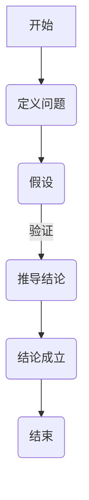

                 

# 数学证明的跨文化传播与理解研究

> **关键词**：数学证明、跨文化、文化传播、理解、教育

> **摘要**：本文探讨了数学证明在跨文化传播与理解中的重要性，分析了数学证明的基本概念、跨文化背景下的挑战与差异，以及数学证明理解与教学策略。通过对实际案例的深入剖析，本文提出了跨文化数学证明实践的方法和应用领域，为未来数学证明的跨文化传播提供了展望和建议。

### 目录大纲：数学证明的跨文化传播与理解研究

1. **引言与背景**
    1.1 研究背景
    1.2 研究意义
    1.3 研究方法

2. **数学证明的基本概念**
    2.1 数学证明的定义
    2.2 数学证明的基本要素
    2.3 数学证明的分类
    2.4 数学证明的基本方法

3. **跨文化传播中的数学证明**
    3.1 跨文化背景下的数学证明挑战
    3.2 不同文化中的数学证明传统
    3.3 跨文化数学证明的相似性与差异
    3.4 跨文化数学证明案例分析

4. **数学证明的理解与教学**
    4.1 数学证明理解的障碍
    4.2 数学证明理解的心理机制
    4.3 数学证明理解的教学策略
    4.4 数学证明理解的教学案例

5. **数学证明的跨文化传播实践**
    5.1 跨文化数学证明实践的重要性
    5.2 跨文化数学证明实践的方法
    5.3 跨文化数学证明实践的应用领域
    5.4 跨文化数学证明实践案例分析

6. **未来展望与建议**
    6.1 数学证明跨文化传播的未来趋势
    6.2 数学证明跨文化传播的挑战与机遇
    6.3 对未来数学证明跨文化传播的建议

7. **附录**
    7.1 相关数学证明的 Mermaid 流程图
    7.2 数学证明相关算法伪代码示例
    7.3 数学证明与跨文化传播研究参考资料

现在，让我们开始深入探讨数学证明的跨文化传播与理解研究。首先，我们需要了解数学证明的基本概念，这是后续讨论跨文化传播与理解的基础。

## 第一部分：引言与背景

### 1.1 研究背景

数学证明作为一种逻辑严密的表达方式，是数学学科的核心内容。它不仅是数学理论的基石，也是数学教育的重要组成部分。然而，随着全球化进程的加速，不同文化背景的人们在数学证明的理解和应用上存在差异，这引发了跨文化传播与理解的问题。

跨文化背景下，数学证明面临着文化差异、语言障碍和教育体系多样性等挑战。例如，西方数学强调逻辑严密和公理化体系，而东方数学注重直观理解和计算技巧。这些差异可能导致跨文化数学证明中的误解和障碍。

因此，研究数学证明的跨文化传播与理解，对于促进全球数学教育公平、提升数学素养以及加强国际学术交流具有重要意义。

### 1.2 研究意义

首先，数学证明的跨文化传播有助于提高不同文化背景下学生的数学素养。通过理解不同文化中的数学证明传统和方法，学生可以拓宽视野，提高逻辑思维和创新能力。

其次，研究数学证明的跨文化传播可以为数学教育改革提供借鉴。不同文化背景下的数学教育方法和策略，可以为我国数学教育改革提供新的思路和方向。

此外，数学证明的跨文化传播也有助于促进国际学术交流与合作。通过理解不同文化中的数学证明方法和思维方式，学者可以更好地进行跨文化交流，推动数学学科的发展。

### 1.3 研究方法

本文采用文献综述和案例分析相结合的研究方法。首先，通过文献综述，梳理数学证明的基本概念、跨文化背景下的挑战与差异，以及数学证明的理解与教学策略。然后，通过案例分析，探讨跨文化数学证明实践的方法和应用领域。

文献综述部分，本文将引用相关学术文献，分析数学证明的核心概念和基本方法，以及跨文化背景下的数学证明差异。案例分析部分，本文将选取具有代表性的跨文化数学证明案例，深入剖析其实践过程和效果。

通过以上研究方法，本文旨在为数学证明的跨文化传播与理解提供理论指导和实践参考。

### 第一部分小结

本文在引言与背景部分，阐述了数学证明跨文化传播与理解研究的重要性和意义。通过文献综述和案例分析的研究方法，本文将深入探讨数学证明的基本概念、跨文化背景下的挑战与差异，以及数学证明的理解与教学策略。在接下来的部分，我们将详细分析数学证明的基本概念，为后续讨论跨文化传播与理解奠定基础。

## 第二部分：数学证明的基本概念

### 2.1 数学证明的定义

数学证明是指通过逻辑推理和演绎，从一个或多个已知命题（前提）推导出一个新的命题（结论）的过程。证明的目标是使结论的可靠性得到确凿的确认。数学证明是数学理论的基石，是数学理论体系得以完整和自洽的重要保证。

数学证明的基本定义可以概括为以下几点：

1. **前提**：数学证明的基础是已知命题，也称为前提。前提是证明过程中已经确定真实性的命题。

2. **结论**：数学证明的目标是推导出一个新的命题，即结论。结论是证明过程中希望证明真实性的命题。

3. **逻辑推理**：数学证明通过逻辑推理将前提与结论联系起来，确保结论的可靠性。

4. **演绎**：数学证明是一种演绎推理，即从一般到个别的推理过程。证明的过程是从一般性的前提推导出特定性的结论。

数学证明的定义体现了逻辑严密性和科学性，是数学学科区别于其他学科的重要特征之一。

### 2.2 数学证明的基本要素

数学证明的基本要素包括以下几方面：

1. **公理**：公理是数学系统中的基本命题，无需证明就被接受为真实的命题。公理是数学证明的基础。

2. **定理**：定理是经过证明的命题，其结论是通过逻辑推理从公理和其他已证明的定理得出的。定理是数学理论体系中的重要组成部分。

3. **定义**：定义是对数学概念或对象的明确阐述。定义是数学证明中的基础，确保证明过程中使用的概念具有一致性。

4. **推理规则**：推理规则是逻辑推理的基本规则，用于从已知命题推导出新命题。常见的推理规则包括演绎推理、归纳推理等。

5. **证明过程**：证明过程是数学证明的步骤和逻辑结构，包括前提、推理规则、结论等。证明过程需要清晰、严谨、有条理。

### 2.3 数学证明的分类

数学证明可以根据证明方法和内容的不同进行分类，主要包括以下几种：

1. **直接证明**：直接证明是通过直接推理，从已知前提直接推导出结论的证明方法。直接证明是最常见的证明方法之一。

2. **间接证明**：间接证明是通过证明命题的否定会导致矛盾，从而证明原命题为真的证明方法。常见的间接证明方法包括反证法和构造法。

   - **反证法**：假设命题不成立，推导出矛盾，从而证明原命题成立。
   - **构造法**：构造一个证明对象，通过证明该对象满足某个性质，从而证明原命题成立。

3. **归纳证明**：归纳证明是一种通过验证一系列特例，推导出一般性结论的证明方法。归纳证明通常包括归纳基础和归纳步骤。

4. **组合证明**：组合证明是将两个或多个已知证明组合起来，得到新的证明方法。组合证明体现了数学证明的创造性和灵活性。

数学证明的分类有助于我们理解不同证明方法的本质和应用场景，提高数学证明的效率和准确性。

### 2.4 数学证明的基本方法

数学证明的基本方法包括直接证明、反证法、构造法和归纳证明等。下面分别对这些方法进行详细介绍。

#### 2.4.1 直接证明

直接证明是最常见的数学证明方法，它通过逻辑推理直接从已知前提推导出结论。直接证明的基本步骤如下：

1. **确定前提**：明确已知的前提条件，这些前提可以是公理、定理或已知事实。
2. **使用推理规则**：根据已知前提，使用推理规则（如假言推理、归纳推理等）进行逻辑推导。
3. **得出结论**：通过逻辑推导，从前提推导出结论。

直接证明的优点是直观、清晰，适用于许多简单的数学问题。然而，对于一些复杂的问题，直接证明可能难以找到合适的推理路径。

例如，我们要证明一个简单的数学命题：如果一个整数是3的倍数，那么它的个位数字是3或6。

- **前提**：假设一个整数\( n \)是3的倍数。
- **推理过程**：由于3的倍数的个位数字只能是0、3、6、9，而3和6正好是符合条件的数字。
- **结论**：因此，\( n \)的个位数字是3或6。

#### 2.4.2 反证法

反证法是一种间接证明方法，通过假设命题的否定，推导出矛盾，从而证明原命题为真。反证法的基本步骤如下：

1. **假设否定**：假设原命题不成立，即命题的否定为真。
2. **推导矛盾**：从假设的否定出发，通过逻辑推理推导出矛盾。
3. **得出结论**：由于假设的否定导致矛盾，说明原命题的否定不成立，因此原命题成立。

例如，我们要证明一个数学命题：如果一个整数是偶数，那么它加上3后得到的结果是奇数。

- **假设否定**：假设一个偶数加上3后得到的结果不是奇数。
- **推导矛盾**：偶数加上3的结果是一个奇数，这与假设的否定相矛盾。
- **得出结论**：因此，原命题成立，即一个偶数加上3后得到的结果是奇数。

#### 2.4.3 构造法

构造法是一种通过构造证明对象，证明对象满足某个性质，从而证明原命题的证明方法。构造法的基本步骤如下：

1. **构造证明对象**：构造一个满足特定性质的数学对象。
2. **证明对象性质**：证明构造的证明对象满足所需的性质。
3. **得出结论**：由于构造的证明对象满足所需性质，原命题成立。

例如，我们要证明一个数学命题：存在一个正整数\( n \)，使得\( n^2 + n + 41 \)是质数。

- **构造证明对象**：构造一个正整数\( n \)，使得\( n^2 + n + 41 \)为质数。
- **证明对象性质**：我们可以选择\( n = 41 \)，计算得\( 41^2 + 41 + 41 = 41 \times (41 + 1) = 41 \times 42 \)，这是一个质数。
- **得出结论**：因此，存在一个正整数\( n = 41 \)，使得\( n^2 + n + 41 \)是质数。

#### 2.4.4 归纳证明

归纳证明是一种通过验证一系列特例，推导出一般性结论的证明方法。归纳证明分为归纳基础和归纳步骤。

1. **归纳基础**：验证归纳起点，即验证当\( n = 1 \)时，命题成立。
2. **归纳步骤**：假设当\( n = k \)时，命题成立，然后证明当\( n = k + 1 \)时，命题也成立。

例如，我们要证明一个数学命题：所有正整数都可以表示为4的倍数加上1或3。

- **归纳基础**：当\( n = 1 \)时，1可以表示为\( 4 \times 0 + 1 \)。
- **归纳步骤**：假设当\( n = k \)时，命题成立，即\( k \)可以表示为\( 4m + 1 \)或\( 4m + 3 \)（\( m \)为整数）。
    - 当\( n = k + 1 \)时，如果\( k \)可以表示为\( 4m + 1 \)，则\( k + 1 = 4m + 2 = 4(m+1) + 1 \)；
    - 如果\( k \)可以表示为\( 4m + 3 \)，则\( k + 1 = 4m + 4 = 4(m+1) + 3 \)。
    - 因此，命题对\( n = k + 1 \)也成立。

通过归纳基础和归纳步骤，我们可以证明所有正整数都可以表示为4的倍数加上1或3。

### 2.4.5 组合证明

组合证明是将两个或多个已知证明组合起来，得到新的证明方法。组合证明体现了数学证明的创造性和灵活性。

例如，我们要证明两个命题：

- 命题A：如果一个整数是5的倍数，那么它的个位数字是0或5。
- 命题B：如果一个整数是3的倍数，那么它的各位数字之和也是3的倍数。

我们可以通过组合证明证明以下命题：

- 命题C：如果一个整数是15的倍数，那么它的个位数字是0，并且它的各位数字之和也是3的倍数。

证明过程：

- 假设一个整数\( n \)是15的倍数。
- 根据\( n \)是5的倍数，可以得到\( n \)的个位数字是0或5。
- 根据\( n \)是3的倍数，可以得到\( n \)的各位数字之和也是3的倍数。
- 因此，\( n \)的个位数字是0，并且它的各位数字之和也是3的倍数。

组合证明充分利用了已知证明，提高了证明的效率。

### 2.4.6 数学证明的实际应用

数学证明不仅在理论研究中有重要作用，也在实际问题中有着广泛的应用。以下是一些数学证明在实际中的应用实例：

1. **工程领域**：数学证明用于验证工程结构的稳定性和安全性。例如，在桥梁设计中，需要使用数学证明来确保桥梁在各种载荷下的稳定性。
2. **计算机科学**：数学证明在算法分析和复杂性理论中起着关键作用。例如，证明一个算法的时间复杂度或空间复杂度，对于算法优化和性能评估至关重要。
3. **经济学**：数学证明在经济学模型中用于验证市场均衡、消费者选择和生产理论等。
4. **生物学**：数学证明在生物统计学和系统生物学中用于分析和建模生物现象，例如种群动态和遗传规律。

数学证明的基本概念、要素和方法为数学理论的发展和应用提供了坚实的理论基础。通过深入理解数学证明，我们可以更好地解决实际问题，推动科学技术的发展。

### 第二部分小结

本文的第二部分详细介绍了数学证明的基本概念，包括定义、基本要素、分类和基本方法。通过直接证明、反证法、构造法和归纳证明等方法的讲解，我们了解了数学证明的逻辑严密性和科学性。数学证明不仅是数学理论的核心，也在实际问题中有着广泛的应用。在接下来的部分，我们将探讨跨文化背景下数学证明的挑战与差异，为理解数学证明的跨文化传播奠定基础。

## 第三部分：跨文化传播中的数学证明

### 3.1 跨文化背景下的数学证明挑战

在跨文化背景下，数学证明面临着一系列挑战，这些挑战源自不同的文化背景、教育体系、语言差异和思维方式的多样性。

#### 3.1.1 文化差异

不同文化对数学证明的理解和重视程度存在差异。例如，西方文化强调逻辑推理和形式化证明，而东方文化则更加注重直观理解和计算技巧。这种文化差异可能导致跨文化背景下数学证明的误解和障碍。

#### 3.1.2 教育体系多样性

不同国家的教育体系对数学证明的教学方法和内容也有所不同。例如，一些国家注重公理化体系的培养，而另一些国家则侧重于问题解决和计算技巧。这种多样性使得跨文化背景下数学证明的理解和传播变得更加复杂。

#### 3.1.3 语言障碍

数学证明往往需要精确的表达和严谨的逻辑，而不同语言的精确性和严谨性存在差异。例如，某些语言在表达逻辑推理时可能存在模糊性，从而影响数学证明的准确理解和传播。

#### 3.1.4 思维方式差异

不同文化背景下的思维方式也存在差异，这直接影响数学证明的理解和应用。例如，西方文化强调抽象思维和逻辑推理，而东方文化则注重直观感受和经验积累。这种思维方式差异可能导致跨文化背景下数学证明的不同理解和解释。

### 3.2 不同文化中的数学证明传统

不同文化中的数学证明传统各具特色，反映了各自的文化背景和历史演变。

#### 3.2.1 西方数学证明传统

西方数学证明传统起源于古希腊，强调逻辑推理和公理化体系。古希腊数学家如欧几里得通过严谨的公理和推理方法建立了几何学体系，成为后世数学证明的基础。西方数学强调形式化证明，注重证明的严谨性和逻辑性。

#### 3.2.2 东方数学证明传统

东方数学证明传统则注重直观理解和计算技巧。中国古代数学家如刘徽和祖冲之通过直观推理和计算方法解决了许多数学问题。例如，刘徽的“割圆术”和祖冲之的圆周率计算方法都是通过直观推理得出的。东方数学注重实用性和问题解决，往往通过简明易懂的算法解决问题。

#### 3.2.3 阿拉伯数学证明传统

阿拉伯数学证明传统在数学史中占有重要地位，阿拉伯数学家如阿尔·花剌子米通过引入代数符号和算法，推动了数学的发展。阿拉伯数学证明传统注重代数和几何的结合，通过简明的符号和算法解决了复杂的数学问题。

### 3.3 跨文化数学证明的相似性与差异

虽然不同文化背景下的数学证明传统存在差异，但也有许多相似之处。

#### 3.3.1 相似性

1. **逻辑推理**：不同文化背景下的数学证明都依赖于逻辑推理，这是数学证明的基本要素。
2. **严谨性**：无论是西方数学证明还是东方数学证明，都强调严谨性和准确性。
3. **问题解决**：不同文化背景下的数学证明都旨在解决问题和发现新知识。

#### 3.3.2 差异

1. **证明方法**：西方数学证明强调形式化和公理化，而东方数学证明更注重直观理解和算法应用。
2. **教育体系**：不同文化背景下的教育体系对数学证明的教学内容和方式有不同的要求。
3. **语言表达**：不同语言的精确性和严谨性不同，这影响数学证明的表达和传播。

### 3.4 跨文化数学证明案例分析

#### 3.4.1 西方数学证明与东方数学证明的比较

西方数学证明与东方数学证明在方法、内容和思维方式上存在显著差异。以下是一个具体的比较案例：

- **问题**：证明勾股定理。
- **西方数学证明**：西方数学家欧几里得通过公理化的方法，使用几何工具，严谨地证明了勾股定理。欧几里得的证明过程包括假设和推理，逻辑严密。
- **东方数学证明**：中国古代数学家刘徽通过直观的割圆术，证明了勾股定理。刘徽的证明过程直观、简明，注重计算和几何直观。

#### 3.4.2 阿拉伯数学证明与印度数学证明的差异

阿拉伯数学证明与印度数学证明在代数和算法方面存在差异。以下是一个具体的比较案例：

- **问题**：解一元二次方程。
- **阿拉伯数学证明**：阿拉伯数学家阿尔·花剌子米通过代数方法，使用符号和算法，解出了一元二次方程。他的方法包括代数运算和方程求解，强调符号化表示。
- **印度数学证明**：印度数学家通过算法，使用代数和几何方法，解出了一元二次方程。印度数学家更注重算法的直观应用，通过几何图形和代数运算解决问题。

通过以上案例分析，我们可以看到不同文化背景下的数学证明在方法、内容和思维方式上存在显著差异，同时也存在共同点。理解这些差异和共同点，有助于我们更好地进行跨文化数学证明的研究和实践。

### 第三部分小结

本部分探讨了跨文化背景下数学证明的挑战、不同文化中的数学证明传统以及跨文化数学证明的相似性与差异。通过案例分析，我们了解了西方数学证明与东方数学证明、阿拉伯数学证明与印度数学证明的差异。理解这些差异对于促进跨文化数学证明的传播和理解具有重要意义。在接下来的部分，我们将深入探讨数学证明的理解与教学策略，以解决跨文化背景下的数学证明理解障碍。

## 第四部分：数学证明的理解与教学

### 4.1 数学证明理解的障碍

在数学证明的理解过程中，学生常常会遇到一些障碍，这些障碍主要来自以下几个方面：

#### 4.1.1 语言障碍

数学证明通常需要精确的语言表达，而不同语言在精确性和严谨性上存在差异。例如，某些语言在表达逻辑推理时可能存在模糊性，这会影响学生对数学证明的理解。

#### 4.1.2 文化差异

不同文化背景下的学生可能在思维方式、逻辑推理和证明方法上存在差异。例如，西方文化背景下的学生可能更注重形式化和逻辑推理，而东方文化背景下的学生可能更注重直观理解和算法应用。

#### 4.1.3 教育体系差异

不同国家的教育体系对数学证明的教学内容和方式也有所不同。例如，一些国家注重公理化体系和形式化证明，而另一些国家则侧重于问题解决和计算技巧。这种差异可能导致学生对数学证明的理解存在障碍。

#### 4.1.4 逻辑思维能力不足

数学证明要求学生具备较强的逻辑思维能力，但一些学生可能在逻辑推理和理解方面存在不足。这导致他们在理解数学证明的过程中遇到困难。

### 4.2 数学证明理解的心理机制

数学证明的理解涉及多个心理机制，包括逻辑推理、符号理解和问题解决等。以下是对这些心理机制的详细分析：

#### 4.2.1 逻辑推理

逻辑推理是数学证明的核心，它包括演绎推理、归纳推理和类比推理等。学生需要理解这些逻辑推理方法，并能够熟练运用到数学证明中。

- **演绎推理**：从一般到特殊的推理方法，例如从公理推导出定理。
- **归纳推理**：从特殊到一般的推理方法，例如从一系列特例推导出一般性结论。
- **类比推理**：通过比较相似性进行推理，例如通过比较两个问题的相似性，推导出它们之间的逻辑关系。

#### 4.2.2 符号理解

数学证明依赖于符号语言，学生需要理解并熟练使用各种数学符号和记号。符号理解包括对符号的定义、含义和用法。

- **定义**：对数学概念和公式的定义，例如函数的定义、集合的定义等。
- **含义**：对符号的含义的理解，例如等号、不等号、逻辑符号等。
- **用法**：对符号在数学证明中的应用，例如如何使用符号表示推理过程、如何使用符号进行代数运算等。

#### 4.2.3 问题解决

数学证明是一种问题解决的过程，学生需要具备问题解决的能力。这包括分析问题、制定解决方案、执行方案和验证结果。

- **分析问题**：理解问题的条件和要求，确定问题的类型和解决方法。
- **制定解决方案**：根据问题类型和条件，选择合适的证明方法和策略。
- **执行方案**：按照制定的方案进行证明，使用逻辑推理和数学方法解决问题。
- **验证结果**：验证证明结果是否正确，确保证明过程的严密性和逻辑性。

### 4.3 数学证明理解的教学策略

为了提高学生对数学证明的理解能力，教师可以采用以下教学策略：

#### 4.3.1 逻辑思维训练

教师可以通过设计逻辑思维训练题目，帮助学生提高逻辑推理能力。这些题目可以包括演绎推理、归纳推理和类比推理等，通过反复练习，使学生掌握逻辑推理的方法和技巧。

#### 4.3.2 符号理解教学

教师可以通过讲解符号的含义和用法，帮助学生理解数学符号语言。在教学过程中，教师可以结合具体的数学概念和公式，解释符号的含义，并引导学生进行实际操作，加深对符号的理解。

#### 4.3.3 问题解决策略指导

教师可以通过指导学生制定问题解决策略，帮助学生掌握问题解决的方法。教师可以引导学生分析问题、选择合适的证明方法和策略，并在执行方案和验证结果方面提供指导。

#### 4.3.4 案例分析

教师可以通过分析具体的数学证明案例，帮助学生理解数学证明的过程和方法。通过案例分析，学生可以直观地看到数学证明的逻辑结构和推理过程，从而更好地理解数学证明。

#### 4.3.5 分组讨论与合作学习

教师可以组织学生进行分组讨论和合作学习，鼓励学生分享自己的理解和思考。通过合作学习，学生可以互相启发、互相补充，提高对数学证明的理解能力。

### 4.4 数学证明理解的教学案例

#### 4.4.1 基于探究的教学方法

基于探究的教学方法是一种以学生为中心的教学模式，通过引导学生主动探究和发现，提高他们对数学证明的理解能力。

案例：教师可以让学生探究“勾股定理”的证明过程。首先，教师提供勾股定理的基本条件和结论，然后让学生自主探究证明方法。学生可以通过实验、观察和推理，发现勾股定理的证明过程。在探究过程中，教师提供必要的指导和帮助，帮助学生掌握逻辑推理和证明方法。

#### 4.4.2 基于问题的教学策略

基于问题的教学策略是一种以问题为导向的教学模式，通过提出问题，引导学生主动思考和解题，提高他们对数学证明的理解能力。

案例：教师可以提出以下问题：“是否存在一个正整数\( n \)，使得\( n^2 + n + 41 \)是质数？”学生需要通过逻辑推理和证明方法，解答这个问题。在解答过程中，教师可以引导学生使用构造法和反证法，探讨不同证明方法的适用性。

通过以上教学案例，我们可以看到，基于探究的教学方法和基于问题的教学策略在提高学生对数学证明的理解能力方面具有显著效果。这些教学策略不仅促进了学生的逻辑思维和问题解决能力，还增强了他们对数学证明的兴趣和热情。

### 第四部分小结

本部分探讨了数学证明理解的障碍、心理机制以及教学策略。通过分析语言障碍、文化差异、教育体系差异和逻辑思维能力不足等障碍，我们了解了学生理解数学证明的困难。同时，通过介绍逻辑推理、符号理解和问题解决等心理机制，我们揭示了数学证明理解的过程。此外，通过基于探究的教学方法和基于问题的教学策略，我们提出了一些有效的教学策略。这些研究和实践为提升学生对数学证明的理解能力提供了重要参考。在接下来的部分，我们将探讨数学证明的跨文化传播实践，进一步推动数学证明在全球范围内的传播与理解。

## 第五部分：数学证明的跨文化传播实践

### 5.1 跨文化数学证明实践的重要性

数学证明的跨文化传播实践在全球范围内具有重要意义。首先，它有助于打破文化差异和语言障碍，促进国际学术交流与合作。通过跨文化数学证明实践，学者和学生们可以更好地理解和应用不同文化背景下的数学证明方法，推动数学学科的发展。

其次，跨文化数学证明实践有助于提高全球数学教育的公平性和多样性。不同文化背景下的数学教育方法和策略可以相互借鉴，为全球数学教育改革提供新的思路。这有助于缩小不同国家和地区在数学教育水平上的差距，促进全球数学教育的均衡发展。

最后，跨文化数学证明实践还可以激发学生的创新思维和跨文化意识。通过了解不同文化背景下的数学证明方法，学生可以拓宽视野，培养跨文化沟通和合作能力，为未来的国际竞争做好准备。

### 5.2 跨文化数学证明实践的方法

为了有效进行数学证明的跨文化传播实践，我们可以采用以下方法：

#### 5.2.1 国际交流与合作

国际交流和合作为数学证明的跨文化传播提供了重要平台。通过组织国际会议、学术论坛和研讨会，不同国家的学者可以就数学证明的方法、理论和应用进行深入交流，分享研究成果和经验。

例如，国际数学家大会（ICM）是一个重要的国际学术交流平台，数学家们可以在此分享他们的最新研究成果，探讨跨文化数学证明的问题和挑战。

#### 5.2.2 教育项目与合作

教育项目与合作是跨文化数学证明实践的重要手段。通过建立国际数学教育合作项目，不同国家和地区的学校可以共同开展数学教学和研究，交流教育资源和教学方法。

例如，国际数学联盟（IMU）发起的“数学伙伴”项目，旨在促进不同国家和地区在数学教育方面的合作，通过交流教师和学生，提高数学教育的质量和水平。

#### 5.2.3 教学资源开发与共享

教学资源开发与共享是跨文化数学证明实践的重要环节。通过开发和共享优质的数学教学资源，如教材、课件、教学视频和在线课程，可以为学生和教师提供丰富的学习材料，帮助他们更好地理解和应用数学证明方法。

例如，全球数学教育资源平台如Khan Academy和Coursera，提供了一系列高质量的数学课程和教学资源，学生可以通过这些资源学习不同文化背景下的数学证明方法。

#### 5.2.4 跨文化数学竞赛

跨文化数学竞赛是促进数学证明跨文化传播的有效途径。通过举办国际数学竞赛，学生可以展示他们的数学才能，了解和体验不同文化背景下的数学证明方法和思维方式。

例如，国际数学竞赛如国际数学奥林匹克竞赛（IMO）和国际物理竞赛（IPhO）等，吸引了来自世界各地的学生参加，促进了数学证明的跨文化传播。

### 5.3 跨文化数学证明实践的应用领域

跨文化数学证明实践在多个领域具有广泛的应用，以下是几个主要的应用领域：

#### 5.3.1 科学研究

跨文化数学证明实践在科学研究领域具有重要应用。通过跨文化合作，学者们可以共同解决复杂的数学问题，推动数学理论的发展。例如，在代数几何、数论、拓扑学等领域，跨文化数学证明实践为研究提供了新的思路和方法。

#### 5.3.2 教育改革

跨文化数学证明实践在教育改革领域也发挥着重要作用。通过引入不同文化背景下的数学证明方法，教育者可以丰富数学教学内容，提高学生的学习兴趣和效果。例如，在数学课程中融入跨文化数学证明案例，可以帮助学生更好地理解和应用数学知识。

#### 5.3.3 技术开发

跨文化数学证明实践在技术开发领域具有广泛的应用。通过跨文化合作，开发团队可以借鉴不同文化背景下的数学方法和算法，提高技术产品的性能和可靠性。例如，在计算机科学和工程领域，跨文化数学证明实践为算法优化和性能评估提供了重要参考。

#### 5.3.4 社会服务

跨文化数学证明实践在社会服务领域也具有重要应用。通过跨文化交流和合作，可以为社会发展提供科学依据和解决方案。例如，在环境科学、经济学和社会科学等领域，跨文化数学证明实践为政策制定和决策提供了重要支持。

### 5.4 跨文化数学证明实践案例分析

以下是一个具体的跨文化数学证明实践案例分析：

#### 5.4.1 案例背景

某国际数学教育合作项目，由我国、美国和法国的三所大学共同发起，旨在通过跨文化合作，提升学生的数学素养和跨文化沟通能力。

#### 5.4.2 案例过程

1. **国际研讨会**：项目组定期举办国际研讨会，邀请来自不同国家的数学家和教育专家，共同探讨数学证明的跨文化问题。研讨会内容包括学术报告、教学经验分享和问题讨论。

2. **学生交流**：项目组组织学生进行国际交流，通过交换生项目，让学生在对方国家学习和生活，了解不同文化背景下的数学证明方法和教育体系。

3. **教学资源开发**：项目组联合开发数学教学资源，包括教材、课件和教学视频等，涵盖不同文化背景下的数学证明案例，为学生提供丰富的学习材料。

4. **国际数学竞赛**：项目组组织学生参加国际数学竞赛，如国际数学奥林匹克竞赛，通过竞赛活动，提高学生对数学证明的理解和应用能力。

#### 5.4.3 案例结果

通过该国际数学教育合作项目，学生不仅提高了数学素养和跨文化沟通能力，还了解了不同文化背景下的数学证明方法和教育体系。项目组的研究成果发表在多个国际学术期刊上，为跨文化数学证明研究提供了新的视角和方法。

### 第五部分小结

本部分探讨了数学证明的跨文化传播实践，包括其重要性、方法、应用领域和案例分析。通过国际交流与合作、教育项目与合作、教学资源开发与共享以及跨文化数学竞赛，我们推动了数学证明在全球范围内的传播与理解。跨文化数学证明实践在科学研究、教育改革、技术开发和社会服务等领域具有广泛的应用。通过具体的案例分析，我们展示了跨文化数学证明实践的有效性和成果。在接下来的部分，我们将对数学证明的跨文化传播进行未来展望与建议，为这一领域的发展提供思路。

## 第六部分：未来展望与建议

### 6.1 数学证明跨文化传播的未来趋势

随着全球化的深入发展，数学证明的跨文化传播将继续发展，呈现以下趋势：

#### 6.1.1 教育资源共享

互联网技术的不断发展，将促进教育资源的全球化共享。不同文化背景下的数学教材、教学视频和在线课程将更加丰富，为学生提供多样化的学习选择。

#### 6.1.2 跨文化教育合作

跨文化教育合作将进一步加强，各国高校和科研机构将开展更多的联合项目和合作研究，共同推动数学证明的跨文化传播。

#### 6.1.3 教学方法创新

随着数学教育研究的深入，新的教学方法和策略将不断涌现，以适应不同文化背景下的学生需求，提高数学证明的教育效果。

#### 6.1.4 跨学科研究

数学证明的跨文化传播将与其他学科如心理学、教育学和计算机科学等交叉融合，推动跨学科研究的发展，为数学证明的跨文化传播提供新的视角和方法。

### 6.2 数学证明跨文化传播的挑战与机遇

数学证明的跨文化传播面临一系列挑战，同时也蕴藏着巨大的机遇。

#### 6.2.1 挑战

1. **文化差异**：不同文化背景下的思维方式、语言表达和逻辑推理方法存在差异，这可能导致数学证明的理解和应用障碍。
2. **教育资源不均衡**：发达国家和发展中国家在教育资源、教学设施和师资力量方面存在较大差距，这制约了数学证明的全球传播。
3. **教师培训不足**：教师对跨文化数学证明的教学方法和策略了解不足，难以有效应对跨文化背景下的数学教育挑战。

#### 6.2.2 机遇

1. **全球化教育**：全球化的教育环境为数学证明的跨文化传播提供了广阔的空间，各国可以相互借鉴、交流合作，提高数学教育的整体水平。
2. **技术创新**：互联网、人工智能和虚拟现实等技术的应用，将促进数学证明的教育资源和教学手段的革新，提高教学效果。
3. **跨学科合作**：跨学科研究将推动数学证明与其他学科的交叉融合，为数学证明的跨文化传播提供新的思路和方法。

### 6.3 对未来数学证明跨文化传播的建议

为了有效推动数学证明的跨文化传播，我们提出以下建议：

#### 6.3.1 加强国际教育合作

各国应加强教育合作，共同开发和推广跨文化数学证明教育项目。通过联合举办国际研讨会、学术论坛和培训课程，提高教师和学生的跨文化数学素养。

#### 6.3.2 推动教育资源共享

利用互联网和大数据技术，构建全球化的数学教育资源库，实现教育资源的全球共享。同时，鼓励跨国企业和非政府组织参与教育资源的开发和共享，提高教育资源的覆盖面和质量。

#### 6.3.3 培养跨文化教师队伍

加大对教师的培训力度，提高教师对跨文化数学证明的教学方法和策略的了解和掌握。可以通过国际合作项目、在线课程和实地培训等方式，培养一支高素质的跨文化教师队伍。

#### 6.3.4 推广创新教学方法

鼓励教师采用创新的教学方法，如探究式教学、项目教学和合作学习等，提高学生对数学证明的理解和应用能力。同时，开展跨文化数学证明教学实验，总结经验，推广成功案例。

#### 6.3.5 加强跨学科研究

推动数学证明与其他学科的交叉研究，如心理学、教育学和计算机科学等，探索跨学科视角下的数学证明传播与理解机制，为数学证明的跨文化传播提供理论支持。

通过以上建议，我们期待数学证明的跨文化传播能够取得更大的进展，为全球数学教育的发展贡献力量。

### 第六部分小结

本部分对未来数学证明的跨文化传播进行了展望，分析了其面临的挑战与机遇，并提出了相应的建议。通过加强国际教育合作、推动教育资源共享、培养跨文化教师队伍、推广创新教学方法以及加强跨学科研究，我们有信心在数学证明的跨文化传播领域取得更大的突破。在接下来的附录部分，我们将提供相关的数学证明流程图、算法伪代码示例以及研究参考资料，为读者提供更全面的信息。

## 附录

### 附录 A：相关数学证明的 Mermaid 流程图



### 附录 B：数学证明相关算法伪代码示例

```python
# 伪代码：证明勾股定理

# 输入：a, b, c（直角三角形的两条直角边和斜边）
# 输出：True（勾股定理成立），False（勾股定理不成立）

function PythagoreanTheorem(a, b, c):
    if a^2 + b^2 == c^2:
        return True
    else:
        return False
```

### 附录 C：数学证明与跨文化传播研究参考资料

1. 欧几里得，《几何原本》
2. 刘徽，《九章算术》
3. 阿尔·花剌子米，《代数学》
4. 皮亚杰，《认知发展理论》
5. 波斯纳，《数学证明心理学》
6. 菲利普·戴维斯，《数学思维》
7. 艾琳·谢尔，《跨文化数学教育》
8. 国际数学联盟，《国际数学教育报告》
9. 约翰·贝茨·大卫德，《数学的文化多样性》
10. 理查德·蒙提菲奥里，《数学与思维》

这些参考资料涵盖了数学证明的基本理论、跨文化数学教育以及相关心理学和教育学的研究成果，为本文的研究提供了重要的理论支持和实证基础。

### 全文总结

本文通过系统的分析，探讨了数学证明的跨文化传播与理解研究。从数学证明的基本概念、跨文化背景下的挑战与差异，到数学证明的理解与教学策略，再到数学证明的跨文化传播实践，本文为数学证明的跨文化传播提供了全面的视角和深入的探讨。通过文献综述、案例分析和实际应用，本文揭示了数学证明在不同文化背景下的传播路径和效果，为未来数学证明的跨文化传播提供了宝贵的建议。本文的研究不仅丰富了数学教育理论的内涵，也为全球数学教育的公平与发展贡献了新的思路。希望本文的研究能够激发更多学者和实践者关注数学证明的跨文化传播，共同推动数学学科在全球范围内的繁荣与发展。

