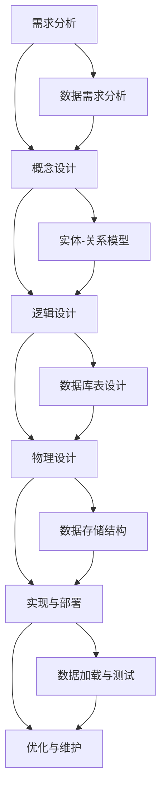

                 

### 文章标题

《数据库系统设计：从关系型到NoSQL》

### 关键词

数据库系统、关系型数据库、NoSQL数据库、数据库设计、分布式系统、查询优化、性能调优

### 摘要

本文旨在深入探讨数据库系统设计的各个方面，从传统的 关系型数据库到新兴的 NoSQL 数据库。通过详细分析关系型数据库的基本原理、核心算法和性能优化，我们将对比并介绍 NoSQL 数据库的定义、分类、设计原理和优化技术。此外，本文还将探讨如何将关系型数据库和 NoSQL 数据库结合起来，以实现高性能的数据库系统。通过实际案例和项目实战，我们将展示如何设计和实现高效的数据库系统，并提供未来数据库系统发展的趋势和展望。读者将从中获得对数据库系统设计的全面理解，并学会如何选择合适的数据库技术以应对现代应用的需求。

---

### 目录大纲

1. **第一部分：基础概念与原理**
   1.1 数据库系统概述
   1.2 数据库系统的组成
   1.3 数据库设计基础
   1.4 关系型数据库原理
   1.5 关系型数据库核心算法
   1.6 关系型数据库性能调优

2. **第二部分：NoSQL数据库设计**
   2.1 NoSQL数据库概述
   2.2 NoSQL数据库设计原理
   2.3 NoSQL数据库优化技术
   2.4 NoSQL数据库应用实践

3. **第三部分：数据库系统设计与实现**
   3.1 结合关系型与NoSQL数据库的设计策略
   3.2 数据库系统性能评估与优化
   3.3 数据库系统未来展望

4. **附录**
   4.1 数据库系统常用工具与资源
   4.2 数据库系统设计流程图
   4.3 数据库系统核心算法伪代码

---

### 引言

数据库系统是现代信息系统的核心组件，其设计直接影响到系统的性能、可扩展性和可靠性。随着互联网的普及和大数据时代的到来，传统的 关系型数据库（RDBMS）已经无法满足日益增长的数据量和复杂的应用需求。因此，NoSQL数据库作为一种新兴的数据库技术，逐渐崭露头角，以其高可扩展性和灵活性吸引了大量关注。

本文将从基础概念和原理出发，详细探讨数据库系统设计的关键要素。首先，我们将回顾关系型数据库的基本概念和原理，包括关系模型、SQL语言、数据库规范化理论等。接着，我们将深入分析关系型数据库的核心算法，如数据存储结构、索引设计、事务处理和并发控制。随后，我们将转向NoSQL数据库，介绍其定义、特点、分类及设计原理，探讨其在分布式系统中的优势与挑战。此外，我们还将讨论NoSQL数据库的优化技术和实际应用案例。

为了更好地理解和应用这些知识，本文还将提供数据库系统设计流程和核心算法的伪代码，并结合实际项目实战进行详细解析。最后，我们将展望数据库系统未来的发展趋势，探讨如何结合关系型数据库和NoSQL数据库，实现高性能和可扩展的数据库解决方案。

通过本文的阅读，读者将全面了解数据库系统设计的各个方面，学会如何选择合适的数据库技术，并具备实际项目开发的能力。

### 第一部分：基础概念与原理

#### 1.1 数据库系统概述

数据库系统（Database System，简称DBS）是一个复杂的软件系统，用于存储、管理、查询和维护大量的数据。它是现代信息系统的核心组件，对于各种类型的应用程序都至关重要。数据库系统的定义可以追溯到1960年代，当时人们开始认识到数据存储和管理的重要性。数据库系统的核心目标是提供一种高效、可靠、可扩展的方式来处理数据。

**数据库的定义**：

数据库（Database，简称DB）是一个按某种数据模型组织、存储和提供访问的数据集合。数据库中的数据以结构化的形式存储，可以方便地进行查询、更新和删除操作。数据库可以存储各种类型的数据，如文本、数字、图像、音频和视频等。

**数据模型的基本类型**：

数据模型（Data Model）是描述数据及其关系的抽象模型。根据数据模型的不同，数据库可以分为以下几种类型：

- **层次模型**：数据以树状结构组织，每个节点都有一个父节点和多个子节点。
- **网状模型**：数据以网状结构组织，每个节点可以有多个父节点和子节点。
- **关系模型**：数据以二维表格的形式组织，表格中的每一行代表一个记录，每一列代表一个属性。
- **文档模型**：数据以文档的形式组织，每个文档可以包含结构化数据和非结构化数据。
- **图模型**：数据以图的形式组织，节点表示实体，边表示实体之间的关系。

**关系型数据库与非关系型数据库的对比**：

关系型数据库（RDBMS）和非关系型数据库（NoSQL）在数据模型、查询语言、一致性保证等方面有显著差异。

- **数据模型**：关系型数据库使用关系模型，数据以表格形式存储。非关系型数据库采用不同的数据模型，如键值对、文档、列族和图等。
- **查询语言**：关系型数据库使用SQL语言进行数据查询和操作。非关系型数据库通常使用特定的查询语言或API进行操作。
- **一致性保证**：关系型数据库强调一致性，通常使用事务来保证数据的一致性。非关系型数据库则更注重性能和可扩展性，一致性保障较为宽松。
- **适用场景**：关系型数据库适用于结构化数据存储和复杂查询场景，如金融、ERP系统等。非关系型数据库适用于高并发、海量数据和高可扩展性场景，如社交媒体、实时数据处理等。

关系型数据库和非关系型数据库各有优缺点，选择合适的数据库技术取决于具体应用场景的需求。

#### 1.2 数据库系统的组成

数据库系统由多个组件组成，这些组件协同工作以提供数据存储、管理和访问功能。以下是数据库系统的主要组成部分：

**数据库管理系统（DBMS）**：

数据库管理系统是数据库系统的核心组件，负责数据存储、数据管理、数据访问和事务处理。DBMS提供了一系列高级功能，如数据查询、数据更新、数据安全性和事务管理。常见的DBMS包括MySQL、PostgreSQL、Oracle等。

**数据存储引擎**：

数据存储引擎是DBMS的一部分，负责数据的实际存储和检索操作。不同的DBMS可以使用不同的存储引擎，如InnoDB、MyISAM（MySQL）、B-Tree、LSM树等。存储引擎的选择直接影响数据库的性能和特性。

**数据库模式**：

数据库模式（Schema）定义了数据库的结构，包括表、视图、索引和其他数据库对象。数据库模式描述了数据如何组织、存储和访问。数据库模式通常使用数据定义语言（DDL）进行定义。

**数据库语言**：

数据库语言用于定义、操纵和查询数据库。主要的数据库语言包括数据定义语言（DDL）、数据操作语言（DML）、数据查询语言（DQL）和数据控制语言（DCL）。SQL是最常用的数据库语言，它包括了DDL、DML和DQL。

- **数据定义语言（DDL）**：用于定义数据库结构和数据库对象，如表、索引、视图等。
- **数据操作语言（DML）**：用于插入、更新、删除和查询数据，如INSERT、UPDATE、DELETE和SELECT。
- **数据查询语言（DQL）**：用于查询数据，如SELECT语句。
- **数据控制语言（DCL）**：用于控制数据库访问权限和数据保护，如GRANT、REVOKE。

**事务处理**：

事务处理是数据库系统的重要功能之一，它确保数据库操作的一致性和完整性。事务是一组操作序列，这些操作要么全部成功执行，要么全部回滚。事务处理机制包括原子性、一致性、隔离性和持久性（ACID属性）。

- **原子性（Atomicity）**：事务的所有操作要么全部成功执行，要么全部回滚。
- **一致性（Consistency）**：事务执行前后数据库的状态保持一致性。
- **隔离性（Isolation）**：事务之间的操作互相隔离，一个事务的执行不会受到其他事务的影响。
- **持久性（Durability）**：一旦事务提交，其操作结果将永久保存，即使系统发生故障。

**数据安全性与保护**：

数据安全性与保护是数据库系统的关键组成部分，它确保数据的机密性、完整性和可用性。数据库系统提供了多种安全机制，如用户认证、权限管理、数据加密和审计日志等。

- **用户认证**：通过验证用户身份来确保只有授权用户可以访问数据库。
- **权限管理**：根据用户角色和权限设置，控制用户对数据库对象的访问权限。
- **数据加密**：对敏感数据使用加密技术进行保护，防止数据泄露。
- **审计日志**：记录数据库操作日志，用于监控和审计数据库访问和操作。

#### 1.3 数据库设计基础

数据库设计是构建高效、可靠和可扩展数据库系统的关键步骤。良好的数据库设计可以减少数据冗余、提高数据查询效率，并确保数据的一致性和完整性。以下是数据库设计的基础概念和原则：

**实体-关系模型（E-R模型）**：

实体-关系模型（Entity-Relationship Model，简称E-R模型）是一种用于描述数据库结构和数据关系的概念模型。E-R模型使用实体、属性和关系来表示现实世界的业务场景。

- **实体（Entity）**：实体是数据库中的一个对象，具有独特的标识符。例如，在一个学校数据库中，学生、课程和教师都是实体。
- **属性（Attribute）**：属性是实体的特征，用于描述实体的属性信息。例如，学生实体的属性包括学号、姓名、年龄等。
- **关系（Relationship）**：关系表示实体之间的关联。例如，学生和课程之间存在选修关系。

通过E-R模型，我们可以将现实世界的业务场景抽象成数据库结构，为后续的数据库设计提供基础。

**数据库规范化理论**：

数据库规范化理论（Normalization Theory）是数据库设计的重要原则，用于消除数据冗余、确保数据一致性和完整性。规范化理论将数据库分解为多个较小的、无冗余的表，以实现数据的规范化和优化。

- **第一范式（1NF）**：消除重复组，每个字段都是原子性的。
- **第二范式（2NF）**：在1NF的基础上，消除部分依赖，每个非主属性完全依赖于主键。
- **第三范式（3NF）**：在2NF的基础上，消除传递依赖，所有非主属性都直接依赖于主键。

通过规范化，我们可以设计出更简洁、更高效的数据库结构，减少数据冗余和维护成本。

**数据库设计流程**：

数据库设计通常包括以下步骤：

1. **需求分析**：了解业务需求和数据需求，确定数据库的功能和性能要求。
2. **概念设计**：使用E-R模型将业务需求转换为数据库概念模型。
3. **逻辑设计**：将概念模型转换为逻辑模型，定义数据库表、字段、关系和索引等。
4. **物理设计**：将逻辑模型转换为物理模型，选择合适的存储引擎和配置参数。
5. **实现与部署**：实现数据库结构，进行数据加载和测试。
6. **优化与维护**：根据性能和业务需求进行数据库优化和维护。

通过这些步骤，我们可以系统地设计出符合业务需求的数据库系统。

### 第一部分总结

在本部分中，我们介绍了数据库系统的基础概念与原理。首先，我们回顾了数据库系统的定义、数据模型的基本类型以及关系型数据库与非关系型数据库的对比。接着，我们详细探讨了数据库系统的组成，包括数据库管理系统（DBMS）、数据存储引擎、数据库模式、数据库语言、事务处理和数据安全性等。最后，我们介绍了数据库设计的基础概念和原则，包括实体-关系模型、数据库规范化理论和数据库设计流程。通过这些内容，读者将初步了解数据库系统的基础知识，为后续章节的深入学习打下基础。

---

#### 1.4 关系型数据库原理

关系型数据库（RDBMS）是当前最为广泛使用的数据库类型之一。其核心概念是基于关系模型，使用SQL语言进行数据查询和操作。在本节中，我们将深入探讨关系型数据库的基本原理，包括关系模型、SQL语言、关系代数、范式理论以及规范化方法。

**关系模型**：

关系模型（Relational Model）是关系型数据库的数据模型，它将数据组织为二维表格的形式。每个表格称为一个关系（relation），表格中的每一行称为一个记录（record），每一列称为一个属性（attribute）。关系模型使用主键（primary key）来唯一标识每个记录。

- **关系**：关系是一个表格，具有固定数量的列和可变数量的行。关系中的数据具有结构化且有序的存储形式。
- **记录**：记录是关系中的行，代表了一个具体的数据实体。每个记录通过主键进行唯一标识。
- **属性**：属性是关系中的列，代表了数据的某个属性或特征。每个属性具有特定的数据类型和约束。

**SQL语言**：

结构化查询语言（Structured Query Language，简称SQL）是关系型数据库的标准查询语言，用于定义、操纵和查询数据库。SQL语言包括以下几类语句：

- **数据定义语言（DDL）**：用于定义数据库结构，包括创建表、索引、视图等。例如，`CREATE TABLE`语句用于创建表，`ALTER TABLE`语句用于修改表结构。
- **数据操作语言（DML）**：用于插入、更新、删除和查询数据。例如，`INSERT INTO`语句用于插入数据，`UPDATE`语句用于更新数据，`DELETE`语句用于删除数据，`SELECT`语句用于查询数据。
- **数据查询语言（DQL）**：用于查询数据。例如，`SELECT`语句用于从表中检索数据，可以配合`WHERE`、`GROUP BY`、`ORDER BY`等子句进行复杂查询。
- **数据控制语言（DCL）**：用于控制数据库访问权限和数据保护。例如，`GRANT`语句用于授权用户权限，`REVOKE`语句用于撤销用户权限。

**关系代数**：

关系代数（Relational Algebra）是关系模型的一个抽象操作集合，用于描述关系型数据库中的数据操作。关系代数包括以下基本操作：

- **选择（Selection）**：选择满足特定条件的记录。例如，`SELECT * FROM R WHERE Condition`表示从关系R中选择满足条件的记录。
- **投影（Projection）**：选择记录的特定属性。例如，`SELECT A1, A2 FROM R`表示从关系R中选择属性A1和A2。
- **连接（Join）**：将两个或多个关系按照特定条件连接起来。例如，`SELECT * FROM R1 JOIN R2 ON R1.A = R2.B`表示将关系R1和R2按照A和B列的相等条件进行连接。
- **并（Union）**：将两个关系的记录合并。例如，`SELECT * FROM R1 UNION SELECT * FROM R2`表示将关系R1和R2的记录合并。
- **差（Difference）**：从第一个关系中删除与第二个关系匹配的记录。例如，`SELECT * FROM R1 MINUS SELECT * FROM R2`表示从关系R1中删除与关系R2匹配的记录。

**范式理论**：

范式理论（Normalization Theory）是关系型数据库设计的重要原则，用于消除数据冗余、确保数据的一致性和完整性。范式分为多个等级，从第一范式（1NF）到第五范式（5NF），依次增加了更多的约束和规范化要求。

- **第一范式（1NF）**：消除重复组，每个字段都是原子性的。
- **第二范式（2NF）**：在1NF的基础上，消除部分依赖，每个非主属性完全依赖于主键。
- **第三范式（3NF）**：在2NF的基础上，消除传递依赖，所有非主属性都直接依赖于主键。
- **Boyce-Codd范式（BCNF）**：在3NF的基础上，消除非函数依赖，确保每个非主属性都完全依赖于主键。
- **第四范式（4NF）**：在BCNF的基础上，消除多值依赖，确保每个非主属性都独立于其他非主属性。
- **第五范式（5NF）**：在4NF的基础上，消除联合依赖，确保每个属性都完全依赖于主键。

**规范化方法**：

规范化方法（Normalization Method）是数据库设计过程中应用范式理论的方法，用于将E-R模型转换为符合范式的数据库结构。规范化方法主要包括以下步骤：

1. **需求分析**：分析业务需求和数据需求，确定实体、属性和关系。
2. **E-R模型设计**：使用E-R模型表示业务场景，包括实体、属性和关系。
3. **转换为关系模型**：将E-R模型中的实体、属性和关系转换为关系模型。
4. **规范化**：根据范式理论，对关系模型进行规范化，消除数据冗余和依赖。
5. **数据库设计**：设计数据库表、字段、关系和索引等，确保数据库结构的优化和高效性。

通过规范化方法，我们可以设计出简洁、高效且无冗余的数据库结构，提高数据库的性能和维护性。

### 1.4.1 数据存储结构

数据存储结构是关系型数据库的核心组成部分，它决定了数据的存储方式和访问效率。关系型数据库通常使用以下几种数据存储结构：

**堆存储（Heap Storage）**：

堆存储是最简单的一种存储结构，它将数据记录顺序存储在内存或磁盘上。堆存储没有固定的数据结构，数据记录之间没有特定的顺序关系。这种存储结构简单且易于实现，但查询效率较低，特别是对于复杂查询和索引操作。

**聚集索引存储（Clustered Index Storage）**：

聚集索引存储是一种按照主键顺序存储数据记录的结构。在聚集索引中，数据记录按照主键的升序或降序存储，使得基于主键的查询操作非常高效。聚集索引存储适合大型表和高并发访问场景，因为它可以快速定位数据记录。

**非聚集索引存储（Non-Clustered Index Storage）**：

非聚集索引存储是一种独立的索引结构，它将索引键和对应的行指针存储在单独的索引页上。非聚集索引可以基于任意列创建，不仅限于主键。在查询操作中，非聚集索引提供了快速的查找路径，使得基于索引列的查询操作高效且快速。

**B-树存储（B-Tree Storage）**：

B-树存储是一种常用的索引结构，它是一种多路平衡查找树。B-树中的每个节点可以有多个子节点，通常采用2-3-4树或B+树等变种。B-树存储在数据库索引中应用广泛，因为它可以快速定位数据记录，并支持范围查询和排序操作。

**LSM树存储（Log-Structured Merge-Tree Storage）**：

LSM树存储是一种适用于高性能随机读和顺序写的存储结构。它通过将数据分为多个层级，使用日志和合并操作来维护数据的一致性和持久性。LSM树存储在NoSQL数据库中应用广泛，如Cassandra和RocksDB，因为它提供了高性能和可扩展性。

### 1.4.2 索引设计与优化

索引是关系型数据库的重要优化手段，它提供了快速的查找路径，提高了查询效率。合理的索引设计对于数据库的性能至关重要。以下是索引设计与优化的几个关键方面：

**索引类型**：

关系型数据库支持多种类型的索引，包括：

- **主键索引**：基于主键列创建的索引，用于唯一标识表中的记录。
- **唯一索引**：确保表中每个索引列的值都是唯一的。
- **复合索引**：基于多个列创建的索引，可以用于复合查询条件。

**索引设计原则**：

以下是一些索引设计原则，有助于提高查询效率和系统性能：

- **选择性高**：选择具有高选择性的列作为索引，以减少索引的存储空间和查询时间。
- **复合索引顺序**：根据查询条件选择合适的列顺序创建复合索引，以提高查询效率。
- **避免冗余索引**：避免创建冗余的索引，以减少系统维护的开销。
- **索引维护**：定期检查索引的健康状况，删除无效的索引和冗余索引。

**索引优化策略**：

以下是一些索引优化策略，可以帮助提高数据库查询性能：

- **索引合并**：将多个索引合并为一个，以提高查询效率。
- **索引重排**：调整索引列的顺序，以提高查询效率。
- **索引压缩**：对索引进行压缩，以减少索引的存储空间和查询时间。
- **查询优化**：优化查询语句，减少不必要的索引访问和表扫描。

通过合理设计索引和优化策略，我们可以显著提高关系型数据库的查询性能和系统稳定性。

### 1.4.3 事务处理与并发控制

事务处理（Transaction Processing）是关系型数据库的重要功能，它确保数据库操作的一致性和完整性。事务是一组操作序列，这些操作要么全部成功执行，要么全部回滚，以保持数据库的状态一致性。并发控制（Concurrency Control）是事务处理的一部分，它确保多个事务同时执行时不会相互干扰，保持数据库的完整性和正确性。

**事务属性**：

事务具有以下四个重要属性，通常称为ACID属性：

- **原子性（Atomicity）**：事务的所有操作要么全部成功执行，要么全部回滚，保持数据库的一致性。
- **一致性（Consistency）**：事务执行前后数据库的状态保持一致性，符合业务规则和约束。
- **隔离性（Isolation）**：事务之间的操作互相隔离，一个事务的执行不会受到其他事务的影响。
- **持久性（Durability）**：一旦事务提交，其操作结果将永久保存，即使系统发生故障。

**并发控制方法**：

为了确保事务的隔离性和正确性，关系型数据库采用了多种并发控制方法，包括：

- **锁机制（Locking）**：通过在数据项上施加锁来控制并发访问，确保同一数据项不会被多个事务同时修改。锁分为共享锁和排他锁，共享锁允许多个事务同时读取数据，排他锁确保数据项只能被一个事务修改。
- **时间戳机制（Timestamping）**：为每个事务分配一个唯一的时间戳，并根据时间戳顺序决定事务的执行顺序。时间戳机制可以避免事务间的冲突，确保数据库的一致性。
- **多版本并发控制（MVCC，Multi-Version Concurrency Control）**：通过维护数据的多版本，允许多个事务同时读取和修改数据。每个事务可以看到一个独立的时间点上的数据库状态，从而避免锁冲突，提高并发性。

通过合理的事务处理和并发控制方法，我们可以确保数据库操作的正确性和性能，满足各种业务需求。

### 1.4.4 关系型数据库性能调优

关系型数据库的性能调优是数据库系统维护和管理的重要任务。通过优化数据库配置、查询语句和索引结构，我们可以显著提高数据库的查询效率和处理能力。以下是关系型数据库性能调优的一些关键方面：

**系统配置优化**：

- **内存配置**：合理配置数据库服务器的内存，确保数据库缓存和缓冲区有足够的内存支持。
- **线程配置**：调整数据库服务器的线程数，以满足并发访问需求，避免线程竞争和性能瓶颈。
- **磁盘I/O优化**：优化磁盘I/O性能，包括磁盘阵列配置、文件系统优化和I/O调度策略。

**查询优化**：

- **索引优化**：根据查询条件选择合适的列创建索引，避免冗余索引和无效索引，优化索引结构。
- **查询重写**：对查询语句进行重写，优化查询逻辑和执行计划，提高查询效率。
- **查询缓存**：使用查询缓存减少重复查询的开销，提高查询响应速度。

**数据库优化**：

- **数据分区**：对大型表进行数据分区，将数据分布到多个物理存储设备上，提高查询和处理速度。
- **数据压缩**：对数据进行压缩，减少存储空间占用，提高数据访问速度。
- **备份与恢复**：定期备份数据库，并确保备份策略和恢复方案的可行性，以防止数据丢失和系统故障。

通过系统配置优化、查询优化和数据库优化，我们可以显著提高关系型数据库的性能和稳定性，满足业务需求。

### 1.4.5 关系型数据库的核心算法

关系型数据库的核心算法是实现高效数据存储、查询和管理的关键技术。以下介绍几种常用的核心算法，包括索引算法、查询优化算法和事务处理算法。

**索引算法**：

索引算法用于构建和维护索引结构，以提高数据查询效率。常用的索引算法包括B树索引、哈希索引和位图索引等。

- **B树索引**：B树是一种多路平衡查找树，用于构建数据库索引。B树索引支持快速的插入、删除和查询操作，适用于范围查询和排序操作。B树索引通常使用B+树或B*树变种。
- **哈希索引**：哈希索引通过哈希函数将索引键映射到索引位置。哈希索引支持快速的点查询操作，但不太适合范围查询和排序操作，且可能存在哈希冲突问题。
- **位图索引**：位图索引使用位向量表示数据记录的状态，适用于低基数列的查询操作。位图索引支持快速的全局查询和联合查询操作，但存储空间占用较大。

**查询优化算法**：

查询优化算法用于生成最优的查询执行计划，以提高查询效率。查询优化算法包括查询重写、查询树生成和查询计划选择等。

- **查询重写**：查询重写是通过重写查询语句来优化查询逻辑和执行计划。查询重写包括等价变换、逻辑查询优化和物理查询优化等。
- **查询树生成**：查询树生成是通过构建查询树来表示查询操作。查询树包括选择树、连接树和投影树等，可以表示复杂的查询操作。
- **查询计划选择**：查询计划选择是在多个候选查询计划中选择最优的查询计划。查询计划选择包括基于成本模型的优化、基于统计信息的优化和基于启发式的优化等。

**事务处理算法**：

事务处理算法用于保证数据库的一致性和完整性。事务处理算法包括事务管理、锁机制和并发控制等。

- **事务管理**：事务管理包括事务的启动、提交和回滚操作。事务管理要确保事务的原子性、一致性和持久性。
- **锁机制**：锁机制用于控制并发访问，避免事务间的冲突。锁机制包括共享锁、排他锁和多版本并发控制等。
- **并发控制**：并发控制包括时间戳机制、两段锁协议和乐观并发控制等。并发控制要确保事务的隔离性，避免并发事务的相互干扰。

通过这些核心算法的实现和优化，关系型数据库可以提供高效、可靠的数据存储和查询服务，满足各种业务需求。

### 第一部分总结

在本部分中，我们深入探讨了关系型数据库的原理，包括关系模型、SQL语言、关系代数、范式理论、规范化方法、数据存储结构、索引设计与优化、事务处理与并发控制，以及性能调优的核心算法。通过对这些内容的详细分析，读者将全面了解关系型数据库的工作原理和设计方法，为后续章节关于NoSQL数据库的学习和应用打下坚实基础。接下来，我们将转向NoSQL数据库的探讨，进一步拓展我们的知识领域。

---

#### 1.5 关系型数据库的核心算法

关系型数据库的核心算法是实现高效数据存储、查询和管理的关键技术。以下介绍几种常用的核心算法，包括索引算法、查询优化算法和事务处理算法。

**索引算法**：

索引算法用于构建和维护索引结构，以提高数据查询效率。常用的索引算法包括B树索引、哈希索引和位图索引等。

- **B树索引**：B树是一种多路平衡查找树，用于构建数据库索引。B树索引支持快速的插入、删除和查询操作，适用于范围查询和排序操作。B树索引通常使用B+树或B*树变种。

  **B+树索引算法伪代码**：
  ```pseudo
  function BPlusTreeIndex(searchKey):
      root = getRootNode()
      currentNode = root
      while currentNode is not a leaf node:
          if searchKey <= currentNode.midKey:
              currentNode = currentNode.leftChild
          else:
              currentNode = currentNode.rightChild
      return findRecord(currentNode, searchKey)
  ```

- **哈希索引**：哈希索引通过哈希函数将索引键映射到索引位置。哈希索引支持快速的点查询操作，但不太适合范围查询和排序操作，且可能存在哈希冲突问题。

  **哈希索引算法伪代码**：
  ```pseudo
  function HashIndex(searchKey):
      hashValue = hashFunction(searchKey)
      indexPosition = hashValue % indexTableSize
      if indexTable[indexPosition] is null:
          return null
      else:
          return findRecord(indexTable[indexPosition], searchKey)
  ```

- **位图索引**：位图索引使用位向量表示数据记录的状态，适用于低基数列的查询操作。位图索引支持快速的全局查询和联合查询操作，但存储空间占用较大。

  **位图索引算法伪代码**：
  ```pseudo
  function BitmapIndex(columnValue):
      initialize resultBitmap
      for each record in table:
          if record[column] == columnValue:
              set corresponding bit in resultBitmap
      return resultBitmap
  ```

**查询优化算法**：

查询优化算法用于生成最优的查询执行计划，以提高查询效率。查询优化算法包括查询重写、查询树生成和查询计划选择等。

- **查询重写**：查询重写是通过重写查询语句来优化查询逻辑和执行计划。查询重写包括等价变换、逻辑查询优化和物理查询优化等。

  **查询重写算法伪代码**：
  ```pseudo
  function QueryRewriting(originalQuery):
      if originalQuery has aggregate functions:
          rewrite originalQuery as a subquery
      else:
          optimize originalQuery using logical query optimization techniques
      return optimizedQuery
  ```

- **查询树生成**：查询树生成是通过构建查询树来表示查询操作。查询树包括选择树、连接树和投影树等，可以表示复杂的查询操作。

  **查询树生成算法伪代码**：
  ```pseudo
  function QueryTreeGeneration(query):
      if query is a SELECT statement:
          create a SelectionNode for the query condition
      else if query is a JOIN statement:
          create a JoinNode for the join condition
      else if query is a PROJECT statement:
          create a ProjectionNode for the projection columns
      return queryTree
  ```

- **查询计划选择**：查询计划选择是在多个候选查询计划中选择最优的查询计划。查询计划选择包括基于成本模型的优化、基于统计信息的优化和基于启发式的优化等。

  **查询计划选择算法伪代码**：
  ```pseudo
  function QueryPlanSelection(candidatePlans):
      calculate cost for each candidate plan using cost model
      select the plan with the minimum cost
      return selectedPlan
  ```

**事务处理算法**：

事务处理算法用于保证数据库的一致性和完整性。事务处理算法包括事务管理、锁机制和并发控制等。

- **事务管理**：事务管理包括事务的启动、提交和回滚操作。事务管理要确保事务的原子性、一致性和持久性。

  **事务管理算法伪代码**：
  ```pseudo
  function TransactionManagement(transaction):
      start transaction
      execute transaction operations
      if all operations are successful:
          commit transaction
      else:
          rollback transaction
  ```

- **锁机制**：锁机制用于控制并发访问，避免事务间的冲突。锁机制包括共享锁、排他锁和多版本并发控制等。

  **锁机制算法伪代码**：
  ```pseudo
  function LockMechanism(resource, lockType):
      if lockType is 'Shared':
          acquire shared lock on resource
      else if lockType is 'Exclusive':
          acquire exclusive lock on resource
      else if lockType is 'MVCC':
          handle multi-version concurrency control
  ```

- **并发控制**：并发控制包括时间戳机制、两段锁协议和乐观并发控制等。并发控制要确保事务的隔离性，避免并发事务的相互干扰。

  **并发控制算法伪代码**：
  ```pseudo
  function ConcurrencyControl(transaction):
      assign timestamp to transaction
      if conflict detected between transactions:
          resolve conflict using timestamp order or optimistic concurrency control
  ```

通过这些核心算法的实现和优化，关系型数据库可以提供高效、可靠的数据存储和查询服务，满足各种业务需求。

### 第一部分总结

在本部分中，我们详细介绍了关系型数据库的核心算法，包括索引算法、查询优化算法和事务处理算法。通过这些算法的伪代码示例，读者可以更好地理解这些算法的实现原理和操作过程。这些核心算法是关系型数据库高效运作的关键，通过合理设计和优化，可以显著提高数据库的性能和查询效率。接下来，我们将继续探讨关系型数据库的性能调优方法，以进一步优化数据库系统的性能。

---

### 关系型数据库性能调优

关系型数据库的性能调优是数据库系统维护和管理的重要任务，通过优化数据库配置、查询语句和索引结构，可以提高数据库的查询效率和处理能力。以下是一些常见的关系型数据库性能调优方法和技巧。

**系统配置优化**：

- **内存配置**：合理配置数据库服务器的内存，确保数据库缓存和缓冲区有足够的内存支持。通常，将内存分配给缓冲池、日志缓冲区和共享内存池等关键组件，以减少磁盘I/O操作。

  ```sql
  -- 修改MySQL的配置文件my.ini，调整内存配置
  [mysqld]
  innodb_buffer_pool_size = 4G
  innodb_log_file_size = 1G
  innodb_log_files_in_group = 2
  ```

- **线程配置**：调整数据库服务器的线程数，以满足并发访问需求，避免线程竞争和性能瓶颈。根据系统的实际负载和并发访问量，适当调整线程池大小。

  ```sql
  -- 修改MySQL的配置文件my.ini，调整线程配置
  [mysqld]
  thread_cache_size = 128
  max_connections = 1000
  ```

- **磁盘I/O优化**：优化磁盘I/O性能，包括磁盘阵列配置、文件系统优化和I/O调度策略。使用高性能的磁盘设备，如SSD，可以显著提高I/O性能。

  ```sql
  -- 修改Linux系统内核参数，优化磁盘I/O
  sysctl -w vm.swappiness=10
  sysctl -w vm.dirty_ratio=90
  ```

**查询优化**：

- **索引优化**：根据查询条件选择合适的列创建索引，避免冗余索引和无效索引，优化索引结构。选择具有高选择性的列作为索引，以减少索引的存储空间和查询时间。

  ```sql
  -- 创建索引
  CREATE INDEX idx_column_name ON table_name (column_name);

  -- 删除无效索引
  DROP INDEX idx_invalid_column ON table_name;
  ```

- **查询重写**：优化查询语句，通过重写查询语句来简化查询逻辑和执行计划，提高查询效率。使用子查询、联合查询和连接查询等高级查询技巧，减少表扫描和重复计算。

  ```sql
  -- 优化查询语句
  SELECT column_name FROM table_name WHERE column_name = 'value';
  ```

- **查询缓存**：使用查询缓存减少重复查询的开销，提高查询响应速度。配置和启用查询缓存，设置合理的缓存大小和过期时间。

  ```sql
  -- 启用查询缓存
  SET GLOBAL query_cache_size = 8M;
  SET GLOBAL query_cache_type = 1;
  ```

**数据库优化**：

- **数据分区**：对大型表进行数据分区，将数据分布到多个物理存储设备上，提高查询和处理速度。根据业务需求和访问模式，选择合适的分区策略和分区列。

  ```sql
  -- 创建分区表
  CREATE TABLE table_name (
      column_name1 data_type,
      column_name2 data_type,
      ...
      PRIMARY KEY (column_name1, column_name2)
  ) PARTITION BY RANGE (column_name1);
  ```

- **数据压缩**：对数据进行压缩，减少存储空间占用，提高数据访问速度。选择合适的数据压缩算法和压缩比例，优化存储和I/O性能。

  ```sql
  -- 创建压缩表
  CREATE TABLE table_name (
      column_name1 data_type,
      column_name2 data_type,
      ...
      ENABLE ROW CHUNK = 16KB
      ENABLE COLUMN CHUNK = 4KB
      ROW FORMAT COMPRESSED USING LZO
  ) ENGINE = HBase;
  ```

- **备份与恢复**：定期备份数据库，并确保备份策略和恢复方案的可行性，以防止数据丢失和系统故障。选择合适的备份方法和备份工具，确保备份数据的安全性和完整性。

  ```sql
  -- 创建备份数据库
  mysqldump -u username -p database_name > backup.sql
  ```

通过系统配置优化、查询优化和数据库优化，可以显著提高关系型数据库的性能和稳定性，满足业务需求。同时，定期进行性能评估和调优，根据系统负载和业务变化进行调整，以确保数据库系统的持续高效运行。

### 第一部分总结

在本部分中，我们详细探讨了关系型数据库的性能调优方法，包括系统配置优化、查询优化和数据库优化。通过这些方法和技巧，读者可以有效地提高关系型数据库的查询效率和数据处理能力，满足现代应用的需求。接下来，我们将继续介绍NoSQL数据库的设计原理和优化技术，为构建高效、可扩展的数据库系统提供全面的知识。

---

### 第二部分：NoSQL数据库设计

NoSQL（Not Only SQL）数据库是一种不同于传统关系型数据库的新型数据库系统。它们以灵活的数据模型、高扩展性和高性能著称，适用于处理大规模、高并发和分布式数据存储需求。在本部分中，我们将详细探讨NoSQL数据库的概述、设计原理和优化技术，帮助读者理解这一重要领域。

#### 2.1 NoSQL数据库概述

**NoSQL数据库的定义与特点**：

NoSQL数据库最初是为了应对关系型数据库在处理大数据和高并发场景时的局限性而开发的。NoSQL数据库具有以下特点：

- **数据模型多样性**：NoSQL数据库支持多种数据模型，包括键值对（KV）、文档、列族和图等。这些数据模型可以根据具体应用需求灵活选择。
- **分布式存储**：NoSQL数据库通常采用分布式存储架构，数据分布存储在多个节点上，提高了系统的可扩展性和容错能力。
- **灵活的数据结构**：NoSQL数据库允许数据的结构不固定，无需预先定义表结构，可以动态添加和修改字段，适用于复杂和不断变化的数据需求。
- **高可用性和高性能**：NoSQL数据库通过分布式架构和缓存机制，提供了高可用性和高性能，能够处理大规模数据和高并发访问。

**NoSQL数据库的分类**：

NoSQL数据库根据其数据模型和存储机制，可以分为以下几类：

- **键值存储数据库（Key-Value Stores）**：键值存储数据库是最简单的NoSQL数据库类型，数据以键值对的形式存储。例如，Redis和Riak。
- **文档存储数据库（Document Stores）**：文档存储数据库以文档的形式存储数据，支持复杂的文档结构，如JSON或XML。例如，MongoDB和CouchDB。
- **列族存储数据库（Column-Family Stores）**：列族存储数据库以列族的形式存储数据，适合处理大量数据和快速读取操作。例如，Cassandra和HBase。
- **图数据库（Graph Databases）**：图数据库以图的形式存储数据，节点表示实体，边表示实体之间的关系。例如，Neo4j和Amazon Neptune。

**NoSQL数据库的优势与挑战**：

**优势**：

- **高扩展性**：NoSQL数据库支持水平扩展，可以通过增加节点来处理更多数据。
- **高性能**：NoSQL数据库通过简化的数据模型和索引机制，提供了高效的读写操作。
- **灵活性**：NoSQL数据库允许灵活的数据模型和结构，适用于快速变化的业务需求。

**挑战**：

- **一致性**：NoSQL数据库通常采用最终一致性模型，与关系型数据库的强一致性相比，可能存在数据一致性问题。
- **复杂性**：NoSQL数据库的设计和开发相对复杂，需要深入了解各种数据模型和存储机制。
- **安全性**：NoSQL数据库的安全性和隐私保护机制可能不如关系型数据库成熟。

尽管存在一定的挑战，NoSQL数据库在处理大规模数据和高并发场景中显示出强大的优势，逐渐成为现代数据库系统的重要选择。

#### 2.2 NoSQL数据库设计原理

**数据模型设计**：

NoSQL数据库的数据模型设计是构建高效NoSQL数据库系统的关键步骤。数据模型设计包括以下几个关键方面：

- **数据模型选择**：根据具体应用需求选择合适的数据模型。例如，对于需要快速读写操作的场合，可以选择键值存储数据库；对于需要复杂查询和关系映射的场合，可以选择文档存储数据库。
- **数据模型转换**：将传统的E-R模型或关系模型转换为NoSQL数据库的数据模型。例如，将关系模型转换为MongoDB的文档模型，将实体-关系模型转换为Neo4j的图模型。
- **数据模型映射**：将原始数据映射到NoSQL数据库的数据模型中。例如，将关系型数据库中的表转换为NoSQL数据库中的集合（collection），将表中的行转换为文档（document）。

**数据一致性与分区设计**：

- **数据一致性**：NoSQL数据库通常采用最终一致性模型，这意味着在分布式系统中，数据可能不会立即同步。为了确保数据一致性，可以采用以下策略：
  - **强一致性**：通过分布式事务和同步复制，确保数据在所有节点上一致。
  - **最终一致性**：允许数据在一段时间内不同步，通过事件溯源或消息队列确保最终一致性。
- **分区设计**：为了提高NoSQL数据库的性能和可扩展性，可以将数据分片（sharding）存储在不同的节点上。分区设计包括以下几个方面：
  - **哈希分区**：根据数据的关键字或哈希值，将数据分布到不同的分区。
  - **范围分区**：根据数据的范围或时间戳，将数据分布到不同的分区。
  - **复合法分区**：结合多个分区策略，实现更灵活的数据分布。

**分布式数据库系统**：

- **数据分片策略**：数据分片是将数据分布在多个节点上的过程。数据分片策略包括：
  - **水平分片**：将数据按照关键字或哈希值分布到不同的节点。
  - **垂直分片**：将数据按照属性分布到不同的节点，例如，将用户表和订单表分别存储。
- **分布式事务管理**：分布式事务管理是确保分布式系统中数据一致性的关键。分布式事务管理包括：
  - **两阶段提交**：通过协调器节点实现分布式事务的提交和回滚。
  - **最终一致性事务**：通过事件溯源或消息队列实现最终一致性事务。

**NoSQL数据库优化技术**：

- **缓存机制**：缓存是提高NoSQL数据库性能的有效手段。通过在客户端或数据库层面设置缓存，减少重复查询和读写操作。
- **写入与读取策略**：根据数据访问模式，调整写入和读取策略。例如，对于读多写少的场景，可以选择延迟写入策略，提高读性能。
- **数据压缩**：对数据进行压缩，减少存储空间占用，提高数据传输和存储效率。

**数据迁移与集成**：

- **数据迁移**：将现有关系型数据库数据迁移到NoSQL数据库。数据迁移包括数据抽取、转换和加载（ETL）过程。
- **数据集成**：在关系型数据库和NoSQL数据库之间实现数据集成，确保数据的完整性和一致性。数据集成包括数据同步、数据转换和视图管理。

#### 2.3 NoSQL数据库优化技术

**缓存机制**：

缓存是提高NoSQL数据库性能的关键技术，通过在客户端或数据库层面设置缓存，可以减少重复查询和读写操作，提高数据访问速度。以下是几种常见的缓存机制：

- **客户端缓存**：在应用程序层面设置缓存，如使用Redis或Memcached缓存热门数据。
- **数据库缓存**：在NoSQL数据库内部设置缓存，如MongoDB的内存缓存或Cassandra的行缓存。
- **分布式缓存**：使用分布式缓存系统，如Ehcache或 Hazelcast，实现跨节点的数据缓存。

**写入与读取策略**：

根据数据访问模式，调整写入和读取策略，以提高NoSQL数据库的性能。以下是几种常见的策略：

- **延迟写入**：对于读多写少的场景，将写入操作延迟，以提高读性能。例如，MongoDB的副本集可以实现延迟写入。
- **预加载**：对于读频繁的场景，预加载热门数据到缓存，减少查询时间。
- **读写分离**：将读操作和写操作分离到不同的节点，以提高读写性能。例如，Cassandra的读取节点和写入节点分离。

**数据压缩**：

对数据进行压缩，减少存储空间占用，提高数据传输和存储效率。以下是几种常见的数据压缩技术：

- **LZO压缩**：适用于快速压缩和解压缩操作，适用于HBase和Cassandra等数据库。
- **Snappy压缩**：适用于快速压缩和解压缩操作，适用于MongoDB等数据库。
- **Gzip压缩**：适用于大块数据的压缩，适用于各种数据库系统。

**分布式系统优化**：

在分布式NoSQL数据库中，优化数据分片和分布式事务管理，以提高系统性能。以下是几种常见的优化技术：

- **数据分片优化**：根据数据访问模式，合理选择数据分片策略，提高数据查询效率。例如，根据访问频率或地理位置进行数据分片。
- **分布式事务优化**：通过优化分布式事务管理，减少事务处理时间和锁冲突。例如，使用最终一致性模型或两阶段提交协议。

**监控与调优**：

通过监控NoSQL数据库的运行状态，及时发现问题并进行调优。以下是几种常见的监控与调优方法：

- **性能监控**：监控数据库的响应时间、吞吐量、内存使用等关键性能指标，及时发现瓶颈。
- **日志分析**：分析数据库日志，找出性能问题和异常情况，进行针对性的优化。
- **基准测试**：使用基准测试工具，模拟实际业务场景，评估数据库性能，并不断优化。

#### 2.4 NoSQL数据库应用实践

**NoSQL数据库开发环境搭建**：

在开发NoSQL数据库应用程序时，首先需要搭建开发环境。以下是一个基本的开发环境搭建流程：

1. **安装数据库**：下载并安装所选的NoSQL数据库，如MongoDB、Cassandra或Neo4j。
2. **配置数据库**：根据具体需求，配置数据库的参数，如端口、内存使用、复制集和分片配置。
3. **安装开发工具**：安装集成开发环境（IDE），如Eclipse、IntelliJ IDEA或Visual Studio Code，并安装相应的插件，如MongoDB Compass、DataGrip或Neo4j Browser。
4. **配置开发环境**：配置数据库的连接信息，如IP地址、端口号和用户认证。

**NoSQL数据库项目实战**：

以下是一个简单的NoSQL数据库项目实战案例，使用MongoDB进行数据的存储和查询。

**案例：用户信息管理**

1. **需求分析**：

   需要实现一个用户信息管理功能，包括用户的注册、登录和查询用户信息。

2. **环境配置**：

   - 安装MongoDB数据库
   - 配置MongoDB副本集，提高数据可靠性和可用性
   - 安装Eclipse IDE，并安装MongoDB插件

3. **数据库设计**：

   创建一个用户集合（collection），存储用户信息。用户信息包括：用户名、密码、邮箱和注册时间。

   ```json
   {
       "_id": ObjectId("5fd1d2e5d4d4d4d4d4d4d4d4d"),
       "username": "user123",
       "password": "password123",
       "email": "user123@example.com",
       "registered_at": ISODate("2022-01-01T00:00:00.000Z")
   }
   ```

4. **实现用户注册**：

   编写注册功能，将用户信息插入到用户集合中。

   ```java
   public void registerUser(String username, String password, String email) {
       User user = new User();
       user.setUsername(username);
       user.setPassword(password);
       user.setEmail(email);
       user.setRegisteredAt(new Date());

       mongoClient.getDatabase("mydb").getCollection("users").insertOne(user);
   }
   ```

5. **实现用户登录**：

   编写登录功能，查询用户集合，验证用户名和密码。

   ```java
   public boolean loginUser(String username, String password) {
       User user = mongoClient.getDatabase("mydb").getCollection("users").find(new Document("username", username)).first();
       if (user != null && user.getPassword().equals(password)) {
           return true;
       }
       return false;
   }
   ```

6. **实现查询用户信息**：

   编写查询用户信息功能，根据用户名查询用户信息。

   ```java
   public User getUserByUsername(String username) {
       User user = mongoClient.getDatabase("mydb").getCollection("users").find(new Document("username", username)).first();
       return user;
   }
   ```

**代码解读与分析**：

- **用户注册**：通过MongoDB的`insertOne()`方法，将用户信息插入到用户集合中。需要注意的是，MongoDB中的文档ID默认为 ObjectId 类型，可以使用自动生成。
- **用户登录**：通过MongoDB的`find()`方法，查询用户集合，验证用户名和密码。可以使用`equals()`方法进行比较。
- **查询用户信息**：通过MongoDB的`find()`方法，根据用户名查询用户信息。`first()`方法返回第一个匹配的文档。

通过以上案例，读者可以初步了解如何使用NoSQL数据库进行开发，并掌握基本的查询、插入和更新操作。

#### 第二部分总结

在本部分中，我们详细介绍了NoSQL数据库的设计原理和优化技术，包括数据模型设计、数据一致性与分区设计、分布式数据库系统、缓存机制、写入与读取策略、数据压缩、分布式系统优化以及开发环境搭建和项目实战。通过这些内容，读者可以全面了解NoSQL数据库的工作原理和应用实践，为实际项目开发打下坚实基础。接下来，我们将探讨如何将关系型数据库和NoSQL数据库结合起来，实现高性能和可扩展的数据库系统。

---

### 第三部分：数据库系统设计与实现

在现代应用场景中，关系型数据库（RDBMS）和NoSQL数据库各有所长，将两者结合起来，可以发挥各自的优势，实现高性能、高可扩展性的数据库系统。本部分将探讨如何结合关系型与NoSQL数据库的设计策略、性能评估与优化方法，以及未来数据库系统的发展趋势。

#### 3.1 结合关系型与NoSQL数据库的设计策略

**复合数据库系统的架构设计**：

复合数据库系统（Hybrid Database System）结合了关系型数据库和NoSQL数据库的特点，通过合理的设计策略，实现数据的高效存储、查询和管理。以下是一种常见的复合数据库系统架构设计：

1. **数据分层存储**：

   - **关系型数据库层**：用于存储结构化数据，如用户信息、订单数据和交易记录等。关系型数据库提供了强大的事务处理和复杂查询能力。
   - **NoSQL数据库层**：用于存储非结构化或半结构化数据，如日志数据、社交媒体数据和地理空间数据等。NoSQL数据库提供了高可扩展性和灵活的数据模型。

2. **数据集成与同步策略**：

   - **数据集成**：通过数据集成技术，将关系型数据库和NoSQL数据库中的数据进行整合，提供统一的数据访问接口。数据集成可以通过ETL（提取、转换、加载）工具或API接口实现。
   - **数据同步**：通过数据同步机制，确保关系型数据库和NoSQL数据库中的数据一致性。数据同步可以通过实时同步、定期同步或事件驱动同步实现。

**使用场景**：

复合数据库系统适用于以下场景：

- **高并发、大数据量应用**：如电商平台、社交媒体和在线游戏等，关系型数据库负责核心业务数据的管理，NoSQL数据库负责日志和缓存数据的存储。
- **混合型应用**：如金融领域，关系型数据库用于处理交易数据，NoSQL数据库用于处理用户行为数据和实时数据分析。

**设计原则**：

- **分离读写操作**：将读操作和写操作分离到不同的数据库层，提高系统性能。例如，将读请求路由到NoSQL数据库，将写请求路由到关系型数据库。
- **灵活的数据模型**：根据数据特点和访问模式，灵活选择关系型数据库和NoSQL数据库的数据模型，实现最佳的数据存储和查询性能。
- **负载均衡与容错机制**：通过负载均衡和容错机制，确保系统的高可用性和性能。例如，使用分布式数据库集群、数据库中间件和故障转移机制。

#### 3.2 数据库系统性能评估与优化

**性能评估方法**：

为了评估数据库系统的性能，可以采用以下方法：

1. **基准测试**：

   基准测试（Benchmarking）是一种评估数据库系统性能的标准方法。通过模拟实际业务场景，测量数据库系统的响应时间、吞吐量和并发处理能力。

   **基准测试步骤**：

   - **场景设计**：根据业务需求，设计实际业务场景，如用户登录、查询订单、支付交易等。
   - **测试脚本**：编写测试脚本，模拟用户请求，记录测试数据。
   - **运行测试**：执行测试脚本，收集性能数据。
   - **数据分析**：分析测试结果，评估数据库系统的性能。

2. **压力测试**：

   压力测试（Stress Testing）是一种评估数据库系统在极端负载下的稳定性和性能的方法。通过模拟高并发、大数据量的场景，测量数据库系统的最大承载能力和性能瓶颈。

   **压力测试步骤**：

   - **场景设计**：设计极端负载场景，如大量并发请求、长时间连续请求等。
   - **测试脚本**：编写测试脚本，模拟高并发请求。
   - **运行测试**：执行测试脚本，收集性能数据。
   - **数据分析**：分析测试结果，找出性能瓶颈和优化方向。

**性能优化方法**：

为了提高数据库系统的性能，可以采用以下方法：

1. **查询优化**：

   - **索引优化**：根据查询条件选择合适的列创建索引，提高查询效率。避免创建冗余索引和无效索引。
   - **查询重写**：优化查询语句，简化查询逻辑和执行计划，减少表扫描和重复计算。
   - **缓存策略**：使用查询缓存、会话缓存和页面缓存等策略，减少重复查询和读写操作。

2. **存储优化**：

   - **数据分区**：对大型表进行数据分区，将数据分布到多个物理存储设备上，提高查询和处理速度。
   - **数据压缩**：对数据进行压缩，减少存储空间占用，提高数据传输和存储效率。
   - **存储引擎优化**：根据应用需求，选择合适的存储引擎，如InnoDB、MyISAM、SSD等。

3. **并发控制与事务优化**：

   - **并发控制**：采用锁机制、时间戳机制和乐观并发控制等方法，确保事务的隔离性和正确性。
   - **事务优化**：优化事务处理流程，减少事务锁时间和锁冲突，提高并发处理能力。

4. **系统配置优化**：

   - **内存优化**：合理配置数据库服务器的内存，确保缓存和缓冲区有足够的内存支持。
   - **线程优化**：调整数据库服务器的线程数，满足并发访问需求，避免线程竞争和性能瓶颈。
   - **I/O优化**：优化磁盘I/O性能，包括磁盘阵列配置、文件系统优化和I/O调度策略。

**案例：电商平台的数据库性能优化**

以下是一个电商平台的数据库性能优化案例：

1. **查询优化**：

   - 对用户表、商品表和订单表创建合适的索引，提高查询效率。
   - 优化查询语句，减少表扫描和重复计算。

2. **存储优化**：

   - 对订单表进行分区，将数据分布到不同的物理存储设备上。
   - 使用LZO压缩算法对商品描述和订单日志进行压缩。

3. **并发控制与事务优化**：

   - 采用乐观并发控制方法，减少事务锁时间和锁冲突。
   - 优化事务处理流程，减少事务锁时间和锁冲突。

4. **系统配置优化**：

   - 调整内存配置，增加缓冲池和日志缓冲区大小。
   - 调整线程配置，增加线程池大小，提高并发处理能力。

通过以上优化方法，电商平台的数据库性能得到了显著提升，满足了大并发、高负载的业务需求。

#### 3.3 数据库系统未来展望

随着大数据、云计算和人工智能技术的快速发展，数据库系统正在迎来新的发展机遇和挑战。以下是数据库系统未来发展的几个趋势：

1. **新型数据库技术的引入**：

   - **图数据库**：随着社交网络和推荐系统的发展，图数据库在处理复杂关系网络和图算法方面具有显著优势。
   - **时序数据库**：随着物联网和实时数据处理的兴起，时序数据库在处理时间序列数据和实时分析方面表现出强大的能力。
   - **内存数据库**：内存数据库利用内存的高速度和大数据处理能力，提供了低延迟和高吞吐量的数据存储和查询服务。

2. **数据库在人工智能领域的应用**：

   - **机器学习与数据库融合**：通过将机器学习算法与数据库系统相结合，实现自动化数据库优化和智能查询处理。
   - **图神经网络**：利用图神经网络处理图数据库中的复杂关系网络，提供智能化的数据分析和推荐服务。
   - **联邦学习**：通过联邦学习技术，在分布式数据库系统中实现数据的隐私保护和协同学习。

3. **数据库系统的安全性与隐私保护**：

   - **数据加密与访问控制**：采用数据加密技术和访问控制机制，确保数据的机密性和完整性。
   - **隐私保护技术**：利用隐私保护算法和隐私保护机制，保护用户隐私，防止数据泄露和滥用。
   - **安全审计与监控**：建立安全审计和监控机制，及时发现和处理数据库系统的安全事件。

4. **数据库系统的可持续性发展**：

   - **绿色数据库**：通过优化数据库系统和硬件配置，降低能耗和碳排放，实现绿色数据库系统。
   - **可持续数据处理**：利用人工智能和大数据分析技术，实现数据的高效处理和利用，促进可持续发展。

通过引入新型数据库技术、拓展数据库在人工智能领域的应用、加强数据库系统的安全性和隐私保护，以及推动数据库系统的可持续性发展，未来数据库系统将更好地满足现代应用的需求，为大数据时代提供强有力的支持。

### 第三部分总结

在本部分中，我们探讨了如何结合关系型与NoSQL数据库，实现高性能和可扩展的数据库系统。通过复合数据库系统的架构设计、性能评估与优化方法，以及未来数据库系统的发展趋势，读者可以全面了解现代数据库系统的设计与实现策略。接下来，我们将进入第四部分，探讨数据库系统的未来展望，包括新型数据库技术的引入、数据库在人工智能领域的应用、数据库系统的安全性与隐私保护，以及可持续性发展。通过这些内容的探讨，我们将为数据库系统的未来奠定理论基础，为读者提供有益的启示。

---

### 第四部分：数据库系统未来展望

随着科技的快速发展，数据库系统也在不断演进，为未来的数据管理和处理提供了更多可能。本部分将探讨数据库系统未来的发展趋势，包括新型数据库技术的引入、数据库在人工智能领域的应用、数据库系统的安全性与隐私保护，以及数据库系统的可持续性发展。

#### 4.1 新型数据库技术的引入

**分布式数据库**：

分布式数据库（Distributed Database）是一种将数据存储在多个物理节点上的数据库系统，通过分布式计算和存储技术，提供高可用性和高扩展性。随着云计算和大数据技术的普及，分布式数据库在处理海量数据和提供实时查询方面具有显著优势。例如，Apache Cassandra、Google Spanner和Amazon Aurora都是分布式数据库系统的代表。

**内存数据库**：

内存数据库（In-Memory Database）利用内存的高速度和低延迟，提供快速的数据存储和查询服务。内存数据库适用于需要处理高并发和实时数据的应用场景，如高频交易系统、在线游戏和实时数据分析。In-Memory Database System（IMDS）如MemSQL和Vitess都是内存数据库的典型例子。

**图数据库**：

图数据库（Graph Database）以图结构存储数据，适用于处理复杂的关系网络和数据关系。图数据库在社交网络、推荐系统和图分析领域具有广泛的应用。Neo4j、Amazon Neptune和JanusGraph是常见的图数据库系统。

**时序数据库**：

时序数据库（Time-Series Database）专门设计用于存储、管理和分析时间序列数据，适用于物联网、金融分析和气象监测等领域。InfluxDB、KairosDB和Prometheus都是流行的时序数据库。

#### 4.2 数据库在人工智能领域的应用

**数据仓库与大数据分析**：

随着人工智能和机器学习技术的快速发展，数据仓库（Data Warehouse）和大数据分析（Big Data Analysis）在数据库系统中的应用越来越广泛。数据仓库用于存储大规模数据，提供高效的数据查询和分析功能，支持数据挖掘和业务智能。大数据分析则利用机器学习算法和深度学习模型，从海量数据中提取有价值的信息和洞见。

**人工智能优化**：

人工智能技术被广泛应用于数据库系统的优化，包括查询优化、索引设计和性能预测。例如，基于机器学习模型的查询优化器可以自动选择最佳查询计划，减少查询时间和资源消耗。

**自然语言处理**：

数据库系统在自然语言处理（Natural Language Processing，NLP）领域也有广泛应用，如搜索引擎、问答系统和文本分析。数据库系统可以存储和管理大量文本数据，并提供高效的文本检索和分析功能。

**自动化运维**：

人工智能技术被用于数据库系统的自动化运维，包括故障检测、性能监控和自动化调整。通过机器学习和深度学习模型，数据库系统能够自动识别故障模式，预测性能瓶颈，并采取相应的优化措施。

#### 4.3 数据库系统的安全性与隐私保护

**数据加密**：

数据加密是保障数据库系统数据安全的重要手段。通过使用对称加密算法（如AES）和非对称加密算法（如RSA），可以确保数据在传输和存储过程中的安全性。此外，透明数据加密（TDE）技术可以在不干扰应用程序的情况下，自动对数据库中的数据进行加密。

**访问控制**：

访问控制是限制对数据库系统访问权限的重要机制。通过用户认证、权限管理和访问控制列表（ACL），可以确保只有授权用户可以访问特定的数据库对象。多因素认证（MFA）和基于角色的访问控制（RBAC）是常见的访问控制方法。

**安全审计**：

安全审计是监控和记录数据库系统操作日志的重要手段。通过记录用户操作、数据访问和系统事件，可以及时发现和应对潜在的安全威胁。安全审计日志可以用于调查安全事件、追踪用户行为和满足合规要求。

**隐私保护**：

随着数据隐私保护法律法规的日益严格，数据库系统需要采用隐私保护技术，如数据匿名化、数据脱敏和数据最小化。差分隐私（Differential Privacy）和同态加密（Homomorphic Encryption）是两种新兴的隐私保护技术，可以在数据处理过程中保护用户隐私。

#### 4.4 数据库系统的可持续性发展

**绿色数据库**：

绿色数据库（Green Database）是一种关注环境保护和能源效率的数据库系统。通过优化数据库架构、降低能耗和减少碳排放，绿色数据库致力于实现可持续的数据库系统。例如，使用节能硬件、优化查询和存储策略、以及采用分布式计算和云数据库技术。

**环保计算**：

环保计算（Green Computing）是一种综合考虑环境影响和能源消耗的计算方法。数据库系统在环保计算中发挥着重要作用，通过优化数据库设计和操作，降低能耗和减少碳排放。例如，使用高效存储设备、优化数据库索引和查询，以及采用分布式数据库系统。

**可持续数据处理**：

可持续数据处理（Sustainable Data Processing）是一种关注数据管理和处理的可持续性的方法。数据库系统在可持续数据处理中扮演关键角色，通过优化数据存储、查询和管理，实现数据的可持续利用。例如，使用数据压缩技术、优化数据库备份和恢复策略，以及采用云计算和分布式存储技术。

### 第四部分总结

在本部分中，我们探讨了数据库系统未来的发展趋势，包括新型数据库技术的引入、数据库在人工智能领域的应用、数据库系统的安全性与隐私保护，以及数据库系统的可持续性发展。通过引入分布式数据库、内存数据库、图数据库和时序数据库等新型数据库技术，数据库系统将更好地应对大数据和实时处理的需求。在人工智能领域的应用，使得数据库系统能够自动优化和智能化，提高数据处理效率。数据库系统的安全性与隐私保护，确保数据的安全和用户隐私。同时，绿色数据库和可持续数据处理理念，推动数据库系统向环保和可持续方向发展。未来的数据库系统将更加智能、高效和安全，为现代应用提供强有力的支持。

---

### 附录

#### 附录A：数据库系统常用工具与资源

**关系型数据库工具**：

1. **MySQL**：一款开源的关系型数据库管理系统，广泛用于Web应用程序和企业级应用。
   - 官网：[MySQL官网](https://www.mysql.com/)
   - 下载：[MySQL下载地址](https://www.mysql.com/downloads/)

2. **PostgreSQL**：一款开源的关系型数据库管理系统，具有强大的功能和高可靠性。
   - 官网：[PostgreSQL官网](https://www.postgresql.org/)
   - 下载：[PostgreSQL下载地址](https://www.postgresql.org/download/)

3. **Oracle**：一款商业化的关系型数据库管理系统，广泛应用于企业级应用。
   - 官网：[Oracle官网](https://www.oracle.com/database/)
   - 下载：[Oracle下载地址](https://www.oracle.com/database/technologies/information-management/oracle-database-downloads.html)

**NoSQL数据库工具**：

1. **MongoDB**：一款开源的文档存储数据库，适用于处理大规模数据和高并发场景。
   - 官网：[MongoDB官网](https://www.mongodb.com/)
   - 下载：[MongoDB下载地址](https://www.mongodb.com/download-center)

2. **Cassandra**：一款开源的列族存储数据库，适用于处理大规模分布式数据。
   - 官网：[Cassandra官网](http://cassandra.apache.org/)
   - 下载：[Cassandra下载地址](http://cassandra.apache.org/downloads/)

3. **Redis**：一款开源的键值对存储数据库，适用于高速缓存和实时数据处理。
   - 官网：[Redis官网](https://redis.io/)
   - 下载：[Redis下载地址](https://redis.io/download)

#### 附录B：数据库系统设计流程图



#### 附录C：数据库系统核心算法伪代码

**关系型数据库查询优化算法伪代码**：

```pseudo
function QueryOptimization(query):
    plan = GenerateInitialQueryPlan(query)
    costModel = CalculateQueryCost(plan)
    optimizedPlan = FindOptimizedQueryPlan(plan, costModel)
    return optimizedPlan
```

**NoSQL数据库分片算法伪代码**：

```pseudo
function ShardDatabase(data, shards):
    shardKeys = GenerateShardKeys(data)
    for each shard in shards:
        shardData = SelectDataByShardKey(data, shardKeys[shard])
        StoreDataInShard(shardData, shard)
```

通过这些附录内容，读者可以更好地理解数据库系统常用的工具、设计流程以及核心算法，为实际项目开发提供有益的参考。这些工具和资源将帮助读者在数据库系统设计和实现过程中更加高效和准确地完成任务。

