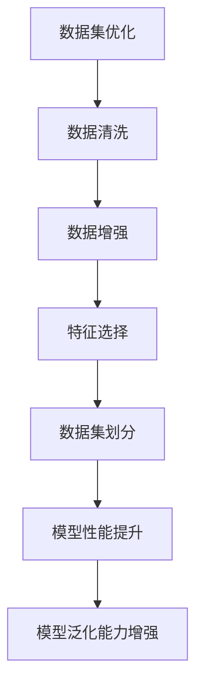
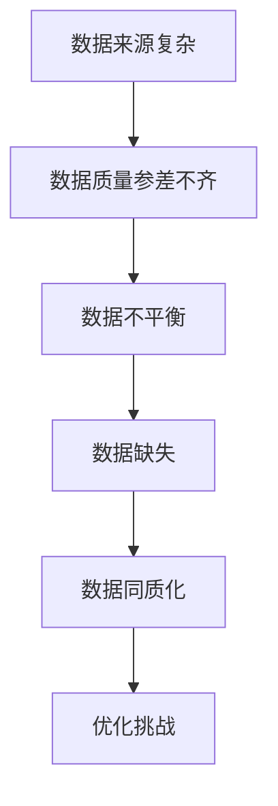
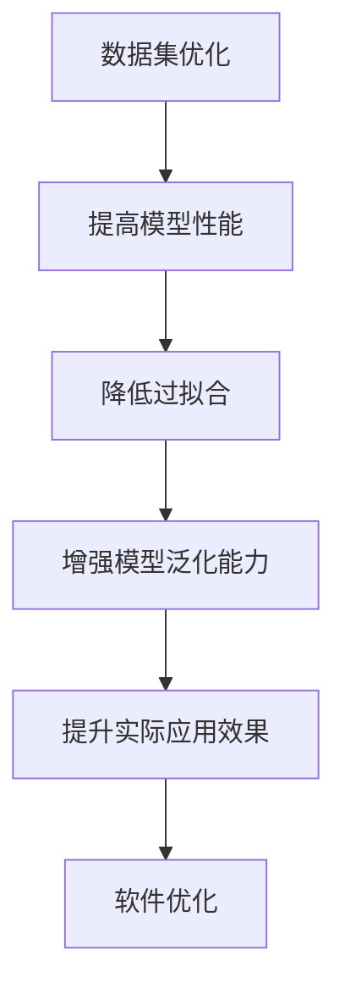

                 

### 引言

在当今的数字化时代，数据集优化和软件优化已经成为计算机科学和人工智能领域的重要研究方向。数据集优化旨在提高数据集的质量，从而提升机器学习模型的性能和泛化能力。而软件优化则侧重于提高软件的性能、可靠性、可维护性等指标，以满足用户的需求。然而，这两个领域之间存在着紧密的联系，数据集优化与软件优化实际上是两种抽象的统一。

本文旨在探讨数据集优化与软件优化之间的关联，并阐述它们在优化策略和实践中的统一视角。通过逐步分析数据集优化的概念、挑战、方法，以及软件优化的原理、方法和案例，我们将揭示数据集优化与软件优化之间的内在联系，并探讨如何通过统一抽象实现整体优化。

文章将从以下几个方面展开：

1. **数据集优化的概念与重要性**：介绍数据集优化的定义、意义以及面临的挑战。
2. **数据集质量评估**：探讨数据集质量评估的指标、数据清洗与预处理方法，以及数据集划分与代表性分析。
3. **数据集多样性优化**：讨论数据集多样性优化的必要性、数据增强与生成技术，以及多样性优化策略与实践。
4. **软件优化原理与方法**：阐述软件优化的概念、目标、重要性和基本原理，以及性能优化、可靠性优化、可维护性优化的方法和案例。
5. **两种抽象的统一**：探讨数据集优化与软件优化的关系，以及统一视角下的优化策略。
6. **综合案例解析**：通过具体案例解析数据集优化与软件优化的综合应用。
7. **未来展望与挑战**：分析数据集优化与软件优化的发展趋势、面临的挑战及应对策略。
8. **附录**：提供常用优化工具、参考文献和练习题与实验指南。

通过本文的详细探讨，我们希望能够为读者提供对数据集优化和软件优化更深入的理解，并启发他们在实际项目中应用这些优化方法，从而提升系统的整体性能。

### 关键词

数据集优化，软件优化，性能提升，可靠性增强，可维护性提高，两种抽象统一，案例解析，未来展望。

### 摘要

本文深入探讨了数据集优化与软件优化之间的关系，阐述了数据集优化在提高机器学习模型性能和泛化能力方面的作用，以及软件优化在提升系统性能、可靠性和可维护性方面的贡献。通过分析数据集优化的概念、质量评估、多样性优化，以及软件优化的原理、方法和实践案例，本文揭示了数据集优化与软件优化之间的内在联系，并提出了两种抽象的统一视角。通过具体案例的解析，本文展示了数据集优化与软件优化在综合优化策略中的实践效果。最后，本文展望了数据集优化与软件优化的发展趋势，并提出了应对未来挑战的策略。本文旨在为读者提供一个全面的数据集优化与软件优化指南，以促进其在实际项目中的应用。

### 目录大纲

**# 数据集优化即软件优化：两种抽象的统一**

> **关键词**：数据集优化，软件优化，性能提升，可靠性增强，可维护性提高

> **摘要**：本文深入探讨了数据集优化与软件优化之间的关系，通过详细分析数据集优化的概念、质量评估、多样性优化，以及软件优化的原理、方法和实践案例，揭示了数据集优化与软件优化之间的内在联系。文章旨在为读者提供一个全面的数据集优化与软件优化指南，以促进其在实际项目中的应用。

**## 第一部分：数据集优化基础**

### 第1章：数据集优化的概念与重要性

**1.1 数据集优化的定义与意义**

**1.2 数据集优化的挑战**

**1.3 数据集优化在软件优化中的作用

## 第二部分：软件优化原理与方法

### 第4章：软件优化概述

**4.1 软件优化的定义与目标**

**4.2 软件优化的重要性和挑战**

**4.3 软件优化的基本原理

### 第5章：软件性能优化

**5.1 性能优化的概念与目标**

**5.2 常见性能优化方法**

**5.3 性能优化的案例分析

### 第6章：软件可靠性优化

**6.1 可靠性优化的概念与目标**

**6.2 常见可靠性优化方法**

**6.3 可靠性优化的案例分析

### 第7章：软件可维护性优化

**7.1 可维护性优化的概念与目标**

**7.2 常见可维护性优化方法**

**7.3 可维护性优化的案例分析

## 第三部分：两种抽象的统一

### 第8章：数据集优化与软件优化的关系

**8.1 数据集优化与软件优化的关联性**

**8.2 两种抽象的统一**

**8.3 统一视角下的优化策略

### 第9章：综合案例解析

**9.1 案例背景**

**9.2 数据集优化案例分析**

**9.3 软件优化案例分析**

**9.4 综合优化策略与实践

### 第10章：未来展望与挑战

**10.1 数据集优化与软件优化的发展趋势**

**10.2 面临的挑战与应对策略**

**10.3 未来发展方向和研究方向

### 附录

**附录A：常用优化工具与资源**

**附录B：参考文献与推荐阅读**

**附录C：练习题与实验指南**

---

通过上述目录大纲，本文将为读者系统地介绍数据集优化与软件优化的概念、方法、实践及未来发展方向，帮助读者深入理解这两个领域，并在实际项目中应用优化策略，提升系统的整体性能。

---

### 第1章：数据集优化的概念与重要性

#### 1.1 数据集优化的定义与意义

**核心概念与联系**

数据集优化是指通过一系列技术手段提高数据集的质量，从而提升机器学习模型的性能和泛化能力。数据集优化的核心概念包括数据清洗、数据增强、特征选择、数据集划分等。这些概念相互关联，共同作用于数据集的优化过程。

**数学模型和数学公式**

在机器学习中，模型性能通常通过损失函数（Loss Function）来衡量。一个常见且基础的损失函数是均方误差（MSE），其公式如下：

$$
MSE = \frac{1}{m}\sum_{i=1}^{m}(y_i - \hat{y}_i)^2
$$

其中，$y_i$ 是真实值，$\hat{y}_i$ 是预测值，$m$ 是样本总数。数据集优化可以通过降低损失函数的值来提高模型性能。

**详细讲解与举例说明**

数据集优化是指通过一系列技术手段提高数据集的质量，从而提升机器学习模型的性能和泛化能力。数据集优化的核心步骤包括数据清洗、数据增强、特征选择和数据集划分。

**数据清洗**：数据清洗是数据预处理的重要环节，它包括去除重复数据、填补缺失值、处理异常值等。通过数据清洗，可以确保数据的一致性和完整性，从而提高模型的训练效果。

**数据增强**：数据增强是一种通过生成新的数据样本来提高数据集多样性的方法。常见的数据增强技术包括图像变换（如旋转、缩放、裁剪）、文本变换（如同义词替换、文本拼接）等。数据增强可以帮助模型学习到更多的特征，从而提高泛化能力。

**特征选择**：特征选择是指从原始数据中提取出最有用的特征，以减少数据维度和提高模型性能。特征选择的方法包括信息增益、卡方检验、主成分分析（PCA）等。通过特征选择，可以降低模型的复杂度，提高训练效率。

**数据集划分**：数据集划分是将数据集划分为训练集、验证集和测试集，以评估模型的性能。通常，训练集用于训练模型，验证集用于调整模型参数，测试集用于评估模型的泛化能力。合理的数据集划分可以避免模型过拟合，提高模型的泛化性能。

在数据集优化的过程中，上述核心概念相互关联，共同作用于数据集的优化过程。例如，通过数据清洗可以确保数据的一致性和完整性，从而为数据增强和特征选择提供可靠的基础。数据增强和特征选择可以进一步提高数据集的多样性和质量，从而提升模型的性能和泛化能力。

#### 1.2 数据集优化的挑战

**核心概念与联系**

数据集优化的过程中，会面临多种挑战，包括数据来源复杂、数据质量参差不齐、数据不平衡、数据缺失和数据同质化等。

**详细讲解与举例说明**

数据集优化的过程中，会面临多种挑战。以下是一些主要的挑战及应对策略：

**数据来源复杂**：数据来源复杂意味着数据可能来自多个不同的渠道，数据格式、数据结构和数据类型可能各不相同。这给数据清洗和预处理带来了困难。应对策略包括数据集成和数据标准化，通过统一数据格式和结构来简化数据处理。

**数据质量参差不齐**：数据质量参差不齐意味着数据可能包含噪声、异常值和错误。这会影响模型的训练效果和泛化能力。应对策略包括数据清洗和预处理，通过去除噪声、填补缺失值和处理异常值来提高数据质量。

**数据不平衡**：数据不平衡是指数据集中某些类别的样本数量远远多于其他类别。这会导致模型对多数类的预测效果较好，而对少数类的预测效果较差。应对策略包括数据增强、过采样和欠采样等方法，通过调整数据集的分布来提高模型对少数类的识别能力。

**数据缺失**：数据缺失是指数据集中存在缺失值。这会导致模型无法充分利用数据集，从而降低模型的性能。应对策略包括缺失数据处理，通过插值、均值填补或随机生成等方法来填补缺失值。

**数据同质化**：数据同质化是指数据集中数据样本之间的差异较小，这会导致模型无法学习到有效的特征。应对策略包括数据增强和多样性优化，通过生成新的数据样本来提高数据集的多样性。

通过应对这些挑战，可以显著提高数据集的质量，从而提升机器学习模型的性能和泛化能力。

#### 1.3 数据集优化在软件优化中的作用

**核心概念与联系**

数据集优化在软件优化中起着至关重要的作用。通过优化数据集，可以提高模型的性能，降低过拟合现象，增强模型的泛化能力，从而提升实际应用效果。

**详细讲解与举例说明**

数据集优化在软件优化中的作用主要体现在以下几个方面：

**提高模型性能**：通过优化数据集，可以去除噪声、填补缺失值、处理异常值等，从而提高数据集的质量。高质量的数据集可以提升模型的训练效果，降低模型的错误率，从而提高模型性能。

**降低过拟合现象**：过拟合是指模型在训练数据上表现良好，但在新的数据上表现较差。通过优化数据集，可以减少模型对训练数据的依赖，避免过拟合现象。例如，通过数据增强和多样性优化，可以增加模型的训练样本量，从而降低过拟合的风险。

**增强模型泛化能力**：泛化能力是指模型在新的数据上的表现。通过优化数据集，可以提高模型的泛化能力。例如，通过数据增强和特征选择，可以增加模型的训练样本量和多样性，从而增强模型的泛化能力。

**提升实际应用效果**：实际应用效果是指模型在实际应用中的表现。通过优化数据集，可以提高模型的性能和泛化能力，从而提升实际应用效果。例如，在一个智能推荐系统中，通过优化用户数据集，可以提高推荐系统的准确性和用户体验。

总之，数据集优化在软件优化中起着至关重要的作用。通过优化数据集，可以提高模型的性能、降低过拟合现象、增强模型的泛化能力，从而提升实际应用效果。这对于软件优化具有重要意义。

---

通过本章的内容，我们了解了数据集优化的核心概念与重要性，分析了数据集优化面临的挑战，以及数据集优化在软件优化中的作用。在接下来的章节中，我们将进一步探讨数据集质量评估、数据集多样性优化、软件优化原理与方法等内容，以便读者更全面地了解数据集优化与软件优化的关系。

