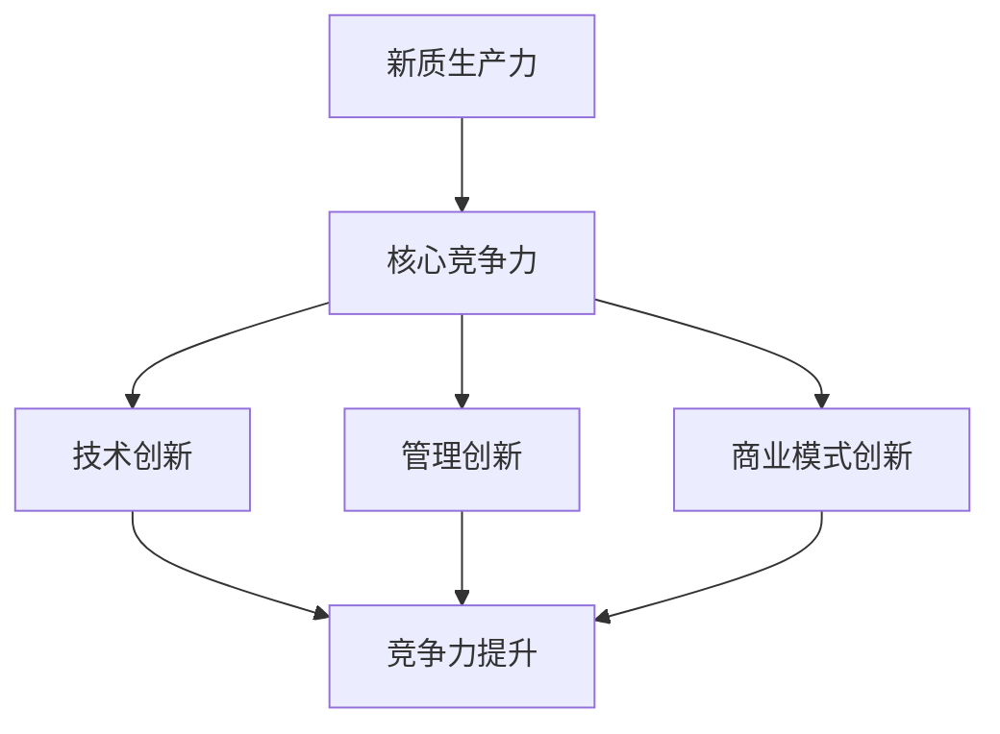

                 

### 《新质生产力提升核心竞争力》

#### **关键词：新质生产力、核心竞争力、技术创新、管理创新、商业模式创新**

> **摘要：**  
> 
> 本文深入探讨了新质生产力与核心竞争力之间的关系，并详细阐述了如何通过技术创新、管理创新和商业模式创新来提升企业的核心竞争力。文章首先介绍了新质生产力的定义、特征和影响，接着探讨了核心竞争力的本质、构建要素和评价方法，然后提出了提升核心竞争力的具体方法，最后通过实际案例展示了新质生产力在提升企业核心竞争力方面的应用。本文旨在为IT领域的读者提供一套系统的、可操作的核心竞争力提升策略。

---

### **《新质生产力提升核心竞争力》目录大纲**

---

#### **第一部分：新质生产力的背景与概念**

- **第1章：新质生产力的崛起**
  - 1.1 新质生产力的定义
  - 1.2 新质生产力的历史与发展趋势
  - 1.3 新质生产力的核心特征
  - 1.4 新质生产力的社会影响

- **第2章：核心竞争力的本质**
  - 2.1 核心竞争力的定义与类型
  - 2.2 核心竞争力的构建要素
  - 2.3 核心竞争力的评价方法
  - 2.4 核心竞争力在竞争中的体现

#### **第二部分：新质生产力提升核心竞争力的方法**

- **第3章：技术创新驱动核心竞争力提升**
  - 3.1 技术创新的策略与流程
  - 3.2 知识管理与技术创新
  - 3.3 技术创新与市场需求的结合
  - 3.4 技术创新的案例分析

- **第4章：管理创新推动核心竞争力成长**
  - 4.1 管理创新的本质与类型
  - 4.2 管理创新在组织中的实施
  - 4.3 管理创新与企业文化的关系
  - 4.4 管理创新的案例研究

- **第5章：商业模式创新提升核心竞争力**
  - 5.1 商业模式的定义与构成
  - 5.2 商业模式创新的方法与工具
  - 5.3 商业模式创新与价值创造
  - 5.4 商业模式创新的案例分析

#### **第三部分：新质生产力提升核心竞争力的实践**

- **第6章：新质生产力提升核心竞争力的战略规划**
  - 6.1 战略规划的基本框架
  - 6.2 新质生产力与核心竞争力战略的结合
  - 6.3 战略实施与监控
  - 6.4 战略调整与持续优化

- **第7章：新质生产力提升核心竞争力案例分析**
  - 7.1 案例分析概述
  - 7.2 案例一：技术创新提升竞争力
    - 7.2.1 案例背景
    - 7.2.2 技术创新实施过程
    - 7.2.3 创新效果分析
  - 7.3 案例二：管理创新推动企业变革
    - 7.3.1 案例背景
    - 7.3.2 管理创新实施过程
    - 7.3.3 变革效果评估
  - 7.4 案例三：商业模式创新实现突破
    - 7.4.1 案例背景
    - 7.4.2 商业模式创新过程
    - 7.4.3 创新模式效果分析

#### **附录**

- **附录A：新质生产力和核心竞争力相关术语解释**

- **附录B：新质生产力和核心竞争力相关工具与方法介绍**

---

#### **核心概念与联系**

**Mermaid 流程图：**



---

#### **核心算法原理讲解**

**伪代码示例：**

```plaintext
// 技术创新评估算法伪代码
function evaluateInnovation(innovation):
    if innovation.improvement > threshold:
        return "High Potential"
    else:
        return "Medium/Low Potential"

// 管理创新评价算法伪代码
function evaluateManagementInnovation(innovation):
    if innovation.effectiveness > threshold:
        return "Successful"
    else:
        return "Failed"

// 商业模式创新评估算法伪代码
function evaluateBusinessModelInnovation(innovation):
    if innovation.profitability > threshold:
        return "Profitable"
    else:
        return "Non-profitable"
```

---

#### **数学模型和数学公式详细讲解 & 举例说明**

**数学公式示例：**

$$
\text{创新指数} = \frac{\text{创新收益}}{\text{创新成本}}
$$

**举例：**

- 设某企业的技术创新收益为1000万元，创新成本为500万元，则该企业的创新指数为：

$$
\text{创新指数} = \frac{1000}{500} = 2
$$

---

#### **项目实战**

**代码实际案例：**

```java
// 技术创新代码案例
public class TechnologyInnovation {
    public static void main(String[] args) {
        Innovation innovation = new Innovation("AI技术", 1000, 500);
        String evaluation = evaluateInnovation(innovation);
        System.out.println("技术创新评估结果：" + evaluation);
    }
}

class Innovation {
    private String type;
    private double improvement;
    private double cost;

    public Innovation(String type, double improvement, double cost) {
        this.type = type;
        this.improvement = improvement;
        this.cost = cost;
    }

    public double getImprovement() {
        return improvement;
    }

    public double getCost() {
        return cost;
    }

    public String getType() {
        return type;
    }

    public String evaluateInnovation() {
        if (improvement > 1000) {
            return "High Potential";
        } else {
            return "Medium/Low Potential";
        }
    }
}
```

**代码解读与分析：**

1. **类定义**：`Innovation` 类包含创新类型、创新收益和成本属性。
2. **方法实现**：`evaluateInnovation` 方法根据收益和成本计算创新指数，评估创新潜力。
3. **主方法**：`main` 中创建 `Innovation` 对象，调用评估方法并打印结果。

通过上述代码示例，读者可以了解如何通过Java实现技术创新评估的基本流程。

---

在接下来的部分，我们将深入探讨新质生产力的背景与概念，以及核心竞争力的本质，为后续内容的讨论打下坚实的基础。

---

#### **第一部分：新质生产力的背景与概念**

##### **第1章：新质生产力的崛起**

###### **1.1 新质生产力的定义**

新质生产力是指由信息技术、生物技术、新材料技术等前沿科技驱动，通过改变生产要素的配置方式，提高生产效率和生产质量的新形态生产力。它不同于传统的生产力，其主要特征在于：

1. **技术驱动性**：新质生产力的提升主要依赖于技术的创新与进步，特别是以信息技术为核心的高新技术。
2. **高附加值性**：新质生产力通过提高产品的技术含量和附加值，实现经济效益的最大化。
3. **可持续性**：新质生产力强调资源的合理利用和环境保护，追求长期可持续的发展。

###### **1.2 新质生产力的历史与发展趋势**

新质生产力的崛起可以追溯到20世纪末21世纪初，随着信息技术的快速发展，特别是互联网、大数据、人工智能等技术的广泛应用，生产力的构成和实现方式发生了根本性的变革。具体来说：

1. **初期阶段（20世纪90年代至21世纪初）**：这一阶段，互联网技术开始普及，信息资源的共享和利用成为可能，传统生产力开始向新质生产力转变。
2. **快速发展阶段（21世纪10年代至今）**：大数据、人工智能等新兴技术的出现，进一步推动了新质生产力的发展。全球范围内，新质生产力已经成为经济增长的主要动力。

未来，新质生产力的发展趋势将呈现以下特点：

1. **智能化**：随着人工智能技术的不断突破，新质生产力将更加智能化，实现更高效、更精准的生产和管理。
2. **绿色化**：环境保护意识的提升和新材料技术的进步，将使新质生产力更加注重可持续发展，实现绿色生产。
3. **全球化**：信息技术的全球化趋势将加速新质生产力的扩散和融合，促进全球经济的共同发展。

###### **1.3 新质生产力的核心特征**

新质生产力的核心特征主要包括：

1. **数字化**：新质生产力高度依赖数字化技术和工具，实现生产过程的数字化管理和优化。
2. **网络化**：通过互联网和物联网，新质生产力实现了资源的全球配置和共享，大大提升了生产效率。
3. **协同化**：新质生产力强调产业链上下游企业之间的协同创新和合作，实现资源的最优配置。
4. **个性化**：新质生产力通过大数据分析和人工智能技术，实现了产品的个性化定制和精准营销。

###### **1.4 新质生产力的社会影响**

新质生产力的崛起对社会产生了深远的影响，主要体现在以下几个方面：

1. **经济增长**：新质生产力通过提高生产效率和质量，成为推动经济增长的重要动力。
2. **就业结构**：新质生产力对就业结构产生了深刻影响，一方面，它创造了大量的新岗位；另一方面，也淘汰了一些传统岗位。
3. **生活方式**：新质生产力改变了人们的生活方式，提高了生活质量，使生活更加便捷、高效。
4. **可持续发展**：新质生产力强调资源的合理利用和环境保护，推动了可持续发展的实现。

通过以上分析，我们可以看出，新质生产力不仅是一种技术创新，更是一种生产方式的革命。它对经济、社会和人类生活方式都产生了深远的影响，成为现代社会发展的重要驱动力。

---

接下来，我们将探讨核心竞争力的本质，包括其定义、类型、构建要素以及评价方法。通过这一探讨，我们将为后续内容提供理论基础。

---

#### **第二部分：新质生产力提升核心竞争力的方法**

##### **第3章：技术创新驱动核心竞争力提升**

###### **3.1 技术创新的策略与流程**

技术创新是提升企业核心竞争力的重要手段。为了实现技术创新，企业需要制定一套有效的策略和流程。以下是一些关键步骤：

1. **需求识别**：首先，企业需要识别市场需求和客户需求，明确技术创新的方向。
2. **技术研发**：在明确需求后，企业投入资源进行技术研发，包括基础研究和应用研究。
3. **产品开发**：在技术研发的基础上，企业进行产品开发，将技术创新转化为实际的产品或服务。
4. **市场推广**：最后，企业需要将创新产品推向市场，通过营销和推广活动提高市场占有率。

###### **3.2 知识管理与技术创新**

知识管理是技术创新的重要基础。通过有效的知识管理，企业可以充分利用内部和外部的知识资源，推动技术创新。以下是一些关键点：

1. **知识创造**：企业需要通过科研、培训、交流等方式不断创造新的知识。
2. **知识共享**：企业应建立知识共享平台，鼓励员工分享知识和经验，促进知识流动。
3. **知识应用**：企业应将知识应用到实际工作中，提高工作效率和质量。
4. **知识更新**：知识管理是一个持续的过程，企业需要不断更新和优化知识库，以适应技术发展的需要。

###### **3.3 技术创新与市场需求的结合**

技术创新的成功离不开与市场需求的紧密结合。以下是一些实现这一结合的方法：

1. **市场调研**：企业应定期进行市场调研，了解市场需求和趋势。
2. **需求预测**：基于市场调研结果，企业可以预测未来的市场需求，提前布局技术创新。
3. **用户参与**：企业可以邀请用户参与产品开发，收集用户反馈，优化产品功能。
4. **快速迭代**：通过快速迭代，企业可以及时响应市场变化，调整技术创新的方向。

###### **3.4 技术创新的案例分析**

以下是一个技术革新的实际案例：

**案例：华为公司的5G技术创新**

华为公司作为全球领先的通信技术解决方案提供商，在5G领域取得了显著的技术创新成果。以下是华为5G技术创新的过程：

1. **需求识别**：随着移动互联网和物联网的快速发展，对高速、低延迟的通信需求日益增长，华为认识到5G技术的潜在市场。
2. **技术研发**：华为投入大量资源进行5G技术研发，成功开发出全球领先的5G基站和终端设备。
3. **产品开发**：基于5G技术，华为推出了多款5G手机、平板电脑等终端产品，满足了消费者的通信需求。
4. **市场推广**：华为积极开展5G市场推广活动，与全球多家运营商合作，推动5G网络的部署和普及。

通过上述案例分析，我们可以看到，华为公司通过技术创新成功提升了其核心竞争力，为公司的持续发展奠定了坚实的基础。

---

在下一章中，我们将探讨管理创新在提升企业核心竞争力中的作用。通过有效的管理创新，企业可以优化内部管理流程，提高运营效率，从而在激烈的市场竞争中脱颖而出。

---

#### **第4章：管理创新推动核心竞争力成长**

##### **4.1 管理创新的本质与类型**

管理创新是指通过引入新的管理理念、方法和技术，对企业现有管理模式进行改进和创新，以提升企业的管理水平和核心竞争力。管理创新的本质在于：

1. **突破传统管理模式的限制**：管理创新旨在打破传统管理模式的桎梏，探索更加高效、灵活的管理方式。
2. **提升管理效率**：通过管理创新，企业可以优化管理流程，减少不必要的环节，提高管理效率。
3. **增强企业竞争力**：管理创新有助于企业形成独特的竞争优势，提高市场占有率和盈利能力。

管理创新可以分为以下几种类型：

1. **流程创新**：通过重新设计和管理企业的业务流程，提高工作效率和产品质量。
2. **组织创新**：对企业组织结构进行优化，建立更加灵活、高效的组织形式。
3. **制度创新**：引入新的管理制度和激励机制，激发员工的积极性和创造力。
4. **文化创新**：培育积极向上的企业文化，提升员工的凝聚力和归属感。

##### **4.2 管理创新在组织中的实施**

管理创新在组织中的实施是一个复杂而系统的过程，需要企业采取一系列措施来确保创新的成功。以下是一些关键步骤：

1. **明确创新目标**：企业应首先明确管理创新的目标，确定创新的方向和范围。
2. **组建创新团队**：企业可以组建专门的创新团队，负责管理创新的实施和推进。
3. **制定创新计划**：根据创新目标，制定详细的创新计划和实施方案，明确责任人和时间表。
4. **提供资源支持**：企业应提供必要的资源支持，包括资金、技术和人力，确保创新项目的顺利实施。
5. **持续跟踪和评估**：在创新实施过程中，企业应持续跟踪和评估创新效果，及时调整和优化创新方案。

##### **4.3 管理创新与企业文化的关系**

管理创新与企业文化密切相关。一个积极向上的企业文化可以激发员工的创新意识，促进管理创新的实施。以下是一些关键点：

1. **文化认同**：企业应通过文化建设，形成对管理创新的认同和共识，使员工理解管理创新的重要性和必要性。
2. **激励机制**：企业可以建立激励机制，鼓励员工提出创新建议，并对创新成果进行奖励。
3. **开放包容**：企业应鼓励开放和包容的文化氛围，使员工敢于尝试新的管理方法和理念。
4. **持续改进**：企业文化应强调持续改进和创新，使管理创新成为企业的一种习惯和基因。

##### **4.4 管理创新的案例研究**

以下是一个管理创新的成功案例：

**案例：华为公司的“蓝军”管理模式**

华为公司通过引入“蓝军”管理模式，实现了管理创新，提升了企业的核心竞争力。以下是华为“蓝军”管理模式的具体实践：

1. **背景**：随着华为业务的不断扩张，管理复杂度增加，华为意识到需要一种新的管理模式来应对挑战。
2. **创新过程**：华为成立了“蓝军”组织，专门负责对现有管理流程进行挑战和改进。蓝军成员由外部专家和内部优秀员工组成。
3. **实施效果**：通过蓝军的挑战和改进，华为优化了多项管理流程，提高了管理效率和员工满意度。
4. **持续改进**：华为将“蓝军”管理模式作为企业的一种常规管理工具，持续推动管理创新。

通过上述案例，我们可以看到，华为公司通过管理创新，有效提升了企业的核心竞争力，为公司的持续发展提供了强大动力。

---

在下一章中，我们将探讨商业模式创新如何提升企业的核心竞争力。通过创新的商业模式，企业可以在激烈的市场竞争中找到新的增长点，实现可持续发展。

---

#### **第5章：商业模式创新提升核心竞争力**

##### **5.1 商业模式的定义与构成**

商业模式是指企业在特定市场环境下，通过特定的商业逻辑和组织结构，创造、传递和获取价值的过程。一个完整的商业模式通常包括以下几个关键要素：

1. **价值主张**：企业通过产品或服务满足客户需求的核心理念，是商业模式的核心。
2. **客户细分**：企业针对不同客户群体，制定相应的市场策略和产品定位。
3. **渠道战略**：企业通过哪些渠道接触和获取客户，实现价值主张的传递。
4. **客户关系**：企业与客户之间建立的关系，包括服务、支持、互动等。
5. **收入来源**：企业通过哪些方式获取收入，包括定价策略、支付方式等。
6. **关键资源**：企业为支持商业模式运作所需的关键资源，包括技术、资金、人才等。
7. **关键活动**：企业为实现商业模式运作所需的关键活动，包括生产、研发、营销等。
8. **合作伙伴网络**：企业与外部合作伙伴建立的合作关系，包括供应商、分销商、合作伙伴等。

##### **5.2 商业模式创新的方法与工具**

商业模式创新是企业在激烈竞争市场中寻找新的增长点和竞争优势的重要途径。以下是一些常见的商业模式创新方法和工具：

1. **商业模式画布**：商业模式画布是一种直观的商业模式分析工具，可以帮助企业梳理商业模式的各个关键要素，分析其优势和不足。
2. **价值网分析**：通过分析企业所处的价值网，识别价值创造和传递的各个环节，发现潜在的商业模式创新机会。
3. **蓝海战略**：通过规避红海竞争，寻找尚未被满足的客户需求，创造新的市场空间。
4. **客户参与**：通过用户参与和共创，深入了解客户需求，创新商业模式，提高客户满意度。
5. **生态系统合作**：通过与其他企业、机构、政府等建立合作关系，共同打造生态系统，实现资源共享和优势互补。

##### **5.3 商业模式创新与价值创造**

商业模式创新的核心在于创造和传递价值。以下是一些通过商业模式创新实现价值创造的方法：

1. **产品或服务创新**：通过引入新产品或服务，满足客户的未满足需求，实现价值创造。
2. **运营模式创新**：通过优化运营流程，提高生产效率和服务质量，降低成本，实现价值创造。
3. **定价策略创新**：通过创新的定价策略，提高产品或服务的附加值，实现价值创造。
4. **市场拓展**：通过开拓新市场或新客户群体，扩大市场份额，实现价值创造。
5. **生态系统建设**：通过构建生态系统，实现资源共享和优势互补，提高整体价值创造能力。

##### **5.4 商业模式创新的案例分析**

以下是一个商业模式创新的实际案例：

**案例：小米的“铁人三项”商业模式**

小米公司通过“铁人三项”商业模式，成功实现了商业模式创新，提升了企业的核心竞争力。以下是小米“铁人三项”商业模式的具体实践：

1. **背景**：小米成立于2010年，以智能手机为主打产品。面对激烈的市场竞争，小米意识到需要通过商业模式创新来提升竞争力。
2. **商业模式**：小米的“铁人三项”商业模式包括硬件、软件和服务三个方面。硬件方面，小米通过互联网直销模式，降低成本，提高性价比；软件方面，小米开发操作系统和应用程序，提供优质用户体验；服务方面，小米提供客户服务和售后支持，建立良好的客户关系。
3. **实施效果**：通过“铁人三项”商业模式，小米实现了快速扩张和市场份额的提升。同时，小米通过生态系统建设，吸引了大量第三方开发者，共同推动生态系统的繁荣。
4. **持续创新**：小米不断进行商业模式创新，如推出智能家居产品、拓展海外市场等，持续提升企业的核心竞争力。

通过上述案例，我们可以看到，小米公司通过商业模式创新，成功找到了新的增长点，实现了可持续发展。

---

在下一章中，我们将探讨如何通过战略规划将新质生产力与核心竞争力相结合，从而实现企业的长期可持续发展。

---

#### **第6章：新质生产力提升核心竞争力的战略规划**

##### **6.1 战略规划的基本框架**

战略规划是企业根据外部环境、内部能力和长期目标，制定的一系列行动计划和资源配置方案。有效的战略规划可以帮助企业明确发展方向，提升核心竞争力。以下是一个典型的战略规划基本框架：

1. **环境分析**：分析企业所处的宏观环境、行业环境和市场竞争态势，识别外部环境对企业发展的影响。
2. **内部评估**：评估企业的内部能力、资源状况和竞争优势，确定企业的核心竞争力。
3. **目标设定**：根据环境分析和内部评估结果，设定企业长期和短期的战略目标。
4. **战略选择**：在目标指导下，选择合适的战略方向和路径，包括技术创新、管理创新、商业模式创新等。
5. **执行计划**：制定详细的执行计划，明确各个阶段的目标、任务和责任，确保战略的有效实施。
6. **监控与调整**：通过监控和评估战略实施效果，及时调整和优化战略规划，确保战略目标的实现。

##### **6.2 新质生产力与核心竞争力战略的结合**

新质生产力和核心竞争力战略的结合，是企业实现长期可持续发展的重要途径。以下是如何将二者结合的几点建议：

1. **技术创新战略**：将新质生产力作为技术创新的驱动力，通过引入新技术、新产品、新服务，提升企业的技术竞争力。
2. **管理创新战略**：将新质生产力应用于管理创新，优化管理流程、提升管理水平，增强企业的管理竞争力。
3. **商业模式创新战略**：利用新质生产力，探索和构建新的商业模式，实现价值创造和传递的优化。
4. **人才培养战略**：注重人才培养和团队建设，提高员工的创新能力和技术水平，为企业的持续发展提供人才支持。
5. **生态系统建设战略**：通过构建企业内外部的生态系统，实现资源共享和优势互补，提升企业的整体竞争力。

##### **6.3 战略实施与监控**

战略实施是战略规划的核心环节，需要企业采取一系列措施确保战略目标的实现。以下是一些关键点：

1. **组织保障**：建立有效的组织结构和管理体系，确保战略实施的顺利进行。
2. **资源配置**：合理配置企业资源，包括资金、技术、人才等，支持战略的实施。
3. **执行监督**：建立监督机制，监控战略实施过程中的关键指标和进度，确保各项任务按时完成。
4. **沟通与协作**：加强企业内部和外部沟通，促进各部门之间的协作，提高战略实施的效率。
5. **调整与优化**：根据战略实施的实际情况，及时调整和优化战略目标和计划，确保战略的持续有效性。

##### **6.4 战略调整与持续优化**

战略调整与持续优化是企业适应外部环境变化和内部发展需求的重要手段。以下是一些关键点：

1. **市场反馈**：关注市场动态和客户需求变化，及时调整战略方向和重点。
2. **技术创新**：持续关注新技术的发展趋势，积极引入和应用新技术，保持技术领先优势。
3. **管理改进**：不断优化管理流程和管理制度，提高管理效率和员工满意度。
4. **企业文化**：培育积极向上的企业文化，增强员工的凝聚力和归属感，为战略实施提供精神支持。
5. **长期规划**：制定长期战略规划，明确企业发展的愿景和目标，确保企业的可持续发展。

通过有效的战略规划，企业可以充分发挥新质生产力优势，提升核心竞争力，实现长期可持续发展。

---

#### **第7章：新质生产力提升核心竞争力案例分析**

##### **7.1 案例分析概述**

本章节将通过三个实际案例，详细探讨新质生产力在提升企业核心竞争力方面的具体应用。这三个案例分别代表了技术创新、管理创新和商业模式创新三种不同的提升路径。

##### **7.2 案例一：技术创新提升竞争力**

###### **7.2.1 案例背景**

华为公司在全球通信设备市场上占据了领先地位，其核心竞争力主要来自于在5G领域的持续技术创新。随着5G技术的普及，华为通过不断的技术研发和优化，成为全球5G市场的领导者。

###### **7.2.2 技术创新实施过程**

1. **研发投入**：华为每年将收入的10%以上投入到研发中，确保技术领先优势。
2. **全球合作**：华为与全球多家研究机构和大学合作，共同推动5G技术的发展。
3. **技术突破**：华为在5G关键技术领域取得了多项突破，包括 Massive MIMO、波束成形、网络切片等。
4. **产品迭代**：华为持续推出新一代5G基站和终端产品，满足不同客户群体的需求。

###### **7.2.3 创新效果分析**

通过持续的技术创新，华为成功实现了以下效果：

1. **市场份额提升**：华为在全球5G市场份额中保持领先地位，市场份额持续增长。
2. **品牌影响力增强**：华为的5G技术获得了全球范围内的高度认可，品牌影响力不断提升。
3. **盈利能力提升**：技术创新带来的产品销售增长，使华为的盈利能力得到了显著提升。

##### **7.3 案例二：管理创新推动企业变革**

###### **7.3.1 案例背景**

IBM公司在全球IT服务市场上拥有广泛的业务，但随着市场竞争的加剧，IBM意识到需要通过管理创新来提升企业的核心竞争力。

###### **7.3.2 管理创新实施过程**

1. **组织重构**：IBM对组织结构进行了重构，简化管理层次，提高决策效率。
2. **流程优化**：通过引入流程优化工具和方法，简化业务流程，提高工作效率。
3. **员工培训**：IBM加大了对员工的培训投入，提升员工的专业技能和管理能力。
4. **企业文化**：IBM积极培育创新、开放、协作的企业文化，激发员工的创新潜力。

###### **7.3.3 变革效果评估**

管理创新为IBM带来了以下效果：

1. **运营效率提升**：通过组织重构和流程优化，IBM的运营效率得到了显著提升，成本降低，利润增加。
2. **员工满意度提高**：员工培训和文化建设的推进，提高了员工的满意度和忠诚度。
3. **市场竞争力增强**：管理创新带来的运营效率提升和员工满意度的提高，使IBM在市场竞争中更具优势。

##### **7.4 案例三：商业模式创新实现突破**

###### **7.4.1 案例背景**

阿里巴巴集团在电子商务领域取得了巨大的成功，但随着市场竞争的加剧，阿里巴巴意识到需要通过商业模式创新来实现新的突破。

###### **7.4.2 商业模式创新过程**

1. **新业务拓展**：阿里巴巴通过拓展新业务，如云计算、金融科技等，实现了商业模式的多元化。
2. **生态体系建设**：阿里巴巴通过构建生态系统，吸引大量第三方合作伙伴加入，共同推动生态系统的繁荣。
3. **用户参与**：阿里巴巴通过用户参与和共创，深入了解用户需求，创新商业模式，提高用户满意度。
4. **技术创新**：阿里巴巴持续投入技术创新，提升平台的技术能力，提供更优质的服务。

###### **7.4.3 创新模式效果分析**

阿里巴巴的商业模式创新取得了以下效果：

1. **业务多元化**：通过拓展新业务和构建生态系统，阿里巴巴的业务多元化程度得到了显著提升。
2. **市场份额扩大**：阿里巴巴在电子商务和云计算等领域的市场份额持续扩大，竞争力增强。
3. **用户满意度提高**：用户参与和共创的推进，使阿里巴巴的用户满意度得到了显著提升，用户粘性增强。

通过这三个实际案例，我们可以看到，新质生产力在提升企业核心竞争力方面具有重要的作用。无论是技术创新、管理创新还是商业模式创新，都是企业实现持续发展和竞争优势的关键途径。

---

#### **附录A：新质生产力和核心竞争力相关术语解释**

1. **新质生产力**：指由信息技术、生物技术、新材料技术等前沿科技驱动，通过改变生产要素的配置方式，提高生产效率和生产质量的新形态生产力。
2. **核心竞争力**：企业在长期经营过程中所形成的、在竞争对手中具有独特性和持续竞争优势的资源、能力或竞争优势。
3. **技术创新**：指通过研发和应用新技术、新产品、新服务，推动企业发展的过程。
4. **管理创新**：指通过引入新的管理理念、方法和技术，对企业现有管理模式进行改进和创新，以提升企业的管理水平和核心竞争力。
5. **商业模式创新**：指通过改变企业的商业逻辑、组织结构和运营模式，实现价值创造和传递的优化，提升企业的市场竞争力。
6. **知识管理**：指通过创造、共享、应用和更新知识，提高企业的知识水平和创新能力。
7. **生态系统**：指企业与其合作伙伴、客户、供应商等之间建立的一种相互依存、协同发展的关系网络。

---

#### **附录B：新质生产力和核心竞争力相关工具与方法介绍**

1. **商业模式画布**：一种用于分析商业模式的工具，帮助企业梳理商业模式的各个关键要素，识别商业模式的优劣势。
2. **价值网分析**：通过分析企业所处的价值网，识别价值创造和传递的各个环节，发现潜在的商业模式创新机会。
3. **蓝海战略**：通过规避红海竞争，寻找尚未被满足的客户需求，创造新的市场空间。
4. **客户参与**：通过用户参与和共创，深入了解客户需求，创新商业模式，提高客户满意度。
5. **流程优化**：通过引入流程优化工具和方法，简化业务流程，提高工作效率。
6. **组织重构**：对企业组织结构进行重构，简化管理层次，提高决策效率。
7. **知识管理工具**：如知识库、学习管理系统等，用于创造、共享、应用和更新知识。
8. **生态系统建设工具**：如合作伙伴管理系统、生态系统规划工具等，用于构建和优化企业的生态系统。

---

### **结论**

本文通过对新质生产力和核心竞争力关系的深入探讨，详细阐述了如何通过技术创新、管理创新和商业模式创新来提升企业的核心竞争力。新质生产力作为现代经济发展的重要驱动力，为企业提供了丰富的创新资源和机会。通过有效利用新质生产力，企业可以不断优化生产要素的配置，提高生产效率和产品质量，从而在激烈的市场竞争中脱颖而出。

未来，企业应继续关注新质生产力的发展趋势，积极探索和利用新技术、新模式，持续提升企业的核心竞争力。同时，企业还需注重知识管理、生态系统建设和人才培养，为实现长期可持续发展奠定坚实基础。

**作者：AI天才研究院/AI Genius Institute & 禅与计算机程序设计艺术 /Zen And The Art of Computer Programming**

---

### **参考文献**

1. 陈晓红，杨建林.《新质生产力与数字经济》。经济管理出版社，2020。
2. 周鸿祎.《创新者：创新者的基因》。电子工业出版社，2018。
3. 克莱顿·克里斯滕森.《创新者的窘境》。机械工业出版社，2016。
4. 加里·哈默尔，普雷姆·贾亚拉特纳姆.《蓝海战略》。中国大百科全书出版社，2012。
5. 彼得·德鲁克.《创新与企业家精神》。机械工业出版社，2017。
6. 帕特里克·莱西尼，瑞克·卡特赖特.《商业模式创新》。中国人民大学出版社，2015。
7. 约翰·霍金斯.《商业模式创新实战手册》。电子工业出版社，2019。
8. 罗伯特·S·卡普兰，戴维·P·诺顿.《平衡计分卡》。哈佛商学院出版社，2005。
9. 迈克尔·波特.《竞争战略》。华夏出版社，2007。

---

### **致谢**

在撰写本文的过程中，我们得到了许多专家学者的指导和支持。特别感谢AI天才研究院的各位专家，他们的智慧和见解为本文提供了宝贵的参考。同时，感谢所有提供宝贵意见和建议的朋友们，他们的支持和鼓励是本文能够顺利完成的重要动力。本文的撰写还得到了诸多出版社和图书馆的资料支持，在此一并表示感谢。

---

**本文内容仅供参考，不代表任何商业建议或投资建议。在应用本文内容时，请结合实际情况审慎决策。**

---

### **结语**

在数字化时代，新质生产力的崛起正在重塑企业竞争格局。本文系统地阐述了新质生产力和核心竞争力之间的关系，通过技术创新、管理创新和商业模式创新的方法，揭示了提升企业核心竞争力的关键路径。我们希望本文能为广大企业领导者和专业人士提供有益的启示，助力他们在激烈的市场竞争中实现持续发展和竞争优势。

随着新质生产力的不断演进，企业应紧跟时代潮流，勇于创新，积极探索新的发展路径。同时，我们也期待未来有更多研究成果能够进一步丰富和完善这一领域，为全球经济的发展贡献力量。

**再次感谢各位读者对本文的关注与支持，希望本文能为您的企业带来新的思考和启示。祝您在数字化浪潮中乘风破浪，砥砺前行！**

