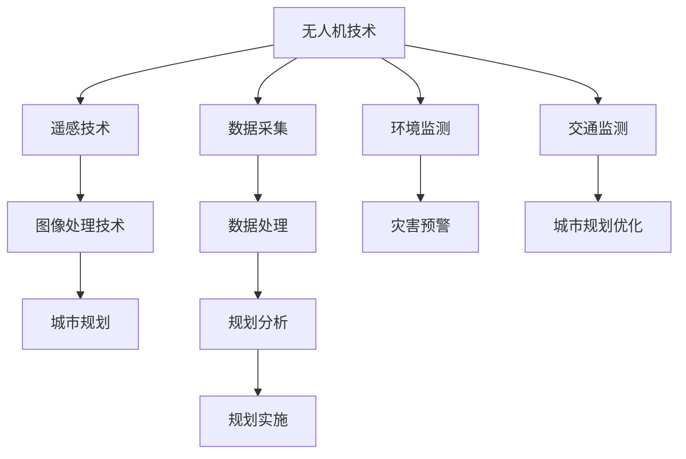

                 

# 无人机城市规划工具：城市发展的创新应用

## 关键词
- 无人机技术
- 城市规划
- 遥感技术
- 图像处理
- 项目实践
- 创新发展

## 摘要
本文旨在探讨无人机在城市规划中的应用，从技术基础、应用技术、项目实践到未来发展，系统性地阐述无人机在城市规划领域的创新应用。通过深入分析无人机与城市规划的结合点，本文揭示了无人机技术在城市规划中的巨大潜力，探讨了其在提升城市规划效率、优化资源配置、实现可持续发展等方面的应用价值。文章还将通过实际案例展示无人机在城市规划项目中的成功实践，并展望无人机城市规划工具的未来发展趋势。

## 第一部分：无人机与城市规划基础

### 第1章：无人机与城市规划概述

#### 1.1 无人机技术概述

##### 1.1.1 无人机的基本概念

无人机（Unmanned Aerial Vehicle，简称UAV）是一种无需人类在驾驶舱内操控而依靠自动控制软件运行的可飞行装置。它具有飞行高度可高可低、操作灵活、成本低等优点，广泛应用于军事、民用等多个领域。近年来，随着无人机技术的不断成熟，其在城市规划中的应用也日益广泛。

##### 1.1.2 无人机的发展历史

无人机的发展可以追溯到20世纪初。1917年，美国首先将无人机用于军事侦察。20世纪50年代，无人侦察机和无人机开始应用于军事领域。随着计算机技术、人工智能技术的进步，无人机逐渐从军事领域向民用领域扩展，应用范围涵盖农业、交通、测绘、城市规划等多个领域。

##### 1.1.3 无人机的主要类型与应用场景

无人机按动力系统可分为固定翼无人机和旋翼无人机。固定翼无人机具有飞行速度快、航程远、稳定性好等特点，适用于大范围的地图测绘和监控。旋翼无人机则具备飞行灵活、悬停能力强的优势，适用于城市精细化管理和灾害监测等场景。

#### 1.2 城市规划基础知识

##### 1.2.1 城市规划的定义与目标

城市规划是指为了实现一定时期的城市发展目标，通过空间布局和资源配置，对城市土地、建筑、交通、环境等进行综合规划和设计的过程。城市规划的目标包括优化城市功能布局、提升城市品质、改善居民生活质量等。

##### 1.2.2 城市规划的主要任务与环节

城市规划的主要任务包括编制城市规划、审批城市规划、实施城市规划等。城市规划的环节主要包括现状调查、规划编制、规划审批、规划实施和规划评估等。

##### 1.2.3 城市规划的法律法规

城市规划的法律法规主要包括《中华人民共和国城乡规划法》、《城市规划和设计规范》等。这些法律法规为城市规划的实施提供了法律依据和规范指导。

#### 1.3 无人机与城市规划的结合

##### 1.3.1 无人机在城市规划中的应用价值

无人机在城市规划中具有显著的应用价值。首先，无人机能够快速获取大量空间数据，为城市规划提供基础信息。其次，无人机能够实现精细化监测，提高城市规划的精度和效率。此外，无人机还能够实现动态监测，实时反映城市规划实施的效果，为后续调整提供依据。

##### 1.3.2 无人机在城市规划中的挑战与机遇

无人机在城市规划中面临的挑战主要包括数据处理难度大、技术安全性问题、法律法规制约等。同时，无人机技术也为城市规划带来了新的机遇，如无人机遥感技术、无人机图像处理技术的应用，将有助于提升城市规划的科学性和准确性。

##### 1.3.3 无人机城市规划的未来趋势

随着无人机技术的不断进步，无人机在城市规划中的应用将更加广泛和深入。未来，无人机城市规划将朝着智能化、高效化、可持续化的方向发展，为城市可持续发展提供有力支持。

### 第二部分：无人机在城市规划中的应用技术

#### 第2章：无人机遥感技术

##### 2.1 遥感技术的原理与应用

###### 2.1.1 遥感技术的基本原理

遥感技术是一种非接触、远距离获取信息的技术。它利用传感器从目标物体上收集电磁波信息，并通过信号处理和数据分析，提取出有用的信息。遥感技术主要分为光学遥感和雷达遥感。

###### 2.1.2 遥感技术在城市规划中的应用

遥感技术在城市规划中具有广泛的应用，包括土地利用现状调查、建筑物三维建模、城市环境监测等。无人机遥感技术能够快速、准确地获取城市规划所需的大量空间数据，提高城市规划的科学性和准确性。

###### 2.1.3 遥感数据处理与分析方法

遥感数据处理与分析方法主要包括图像预处理、图像增强、图像分类、三维重建等。这些方法能够有效提升遥感数据的可用性，为城市规划提供更加精确的基础数据。

##### 2.2 无人机遥感技术的优势与局限

###### 2.2.1 无人机遥感技术的优势

无人机遥感技术的优势主要体现在以下几个方面：

1. **高效性**：无人机能够快速获取大量空间数据，提高城市规划的效率。
2. **灵活性**：无人机飞行高度和航线可灵活调整，能够适应各种复杂地形。
3. **准确性**：无人机遥感技术具有较高的空间分辨率和时间分辨率，能够提供精确的基础数据。
4. **成本效益**：无人机遥感技术的成本相对较低，具有较好的经济效益。

###### 2.2.2 无人机遥感技术的局限

无人机遥感技术也面临一些挑战，包括：

1. **数据质量**：无人机遥感数据可能受到天气、光线等因素的影响，数据质量难以保证。
2. **数据处理**：大量遥感数据的处理和分析需要强大的计算能力和专业知识。
3. **技术安全性**：无人机在城市规划中的应用需要考虑技术安全性和隐私保护问题。

###### 2.2.3 无人机遥感技术的优化方法

为了提高无人机遥感技术的应用效果，可以采取以下优化方法：

1. **改进传感器技术**：研发更高精度、更敏感的传感器，提高遥感数据的准确性。
2. **优化飞行策略**：设计合理的飞行航线和高度，提高遥感数据的覆盖率和质量。
3. **综合利用多种遥感技术**：结合光学遥感、雷达遥感等多种遥感技术，实现更加全面和精准的数据采集。

##### 2.3 无人机遥感在城市规划中的应用案例

###### 2.3.1 建筑物三维建模

无人机遥感技术可以用于建筑物三维建模，通过获取高精度的地面和立面图像，生成建筑物的三维模型。这些三维模型可以用于城市规划中的建筑物分析、城市景观设计等。

###### 2.3.2 土地利用现状调查

无人机遥感技术可以用于土地利用现状调查，通过遥感图像分析，确定不同地块的利用类型和面积。这有助于城市规划中的土地资源管理、城市规划编制等。

###### 2.3.3 环境监测与灾害预警

无人机遥感技术可以用于城市环境监测和灾害预警，通过遥感图像分析，监测城市空气质量、水体污染等环境问题，及时预警自然灾害的发生。

### 第3章：无人机图像处理技术

##### 3.1 图像处理技术的基本原理

###### 3.1.1 图像处理的基本概念

图像处理是指使用数字技术对图像进行加工和处理，以提高图像质量、提取有用信息等。图像处理的基本概念包括像素、图像格式、图像滤波、图像增强等。

###### 3.1.2 图像处理的主要任务

图像处理的主要任务包括图像预处理、图像增强、图像分类、目标检测、三维重建等。这些任务能够帮助城市规划中提取有用信息、分析城市结构、评估城市景观等。

###### 3.1.3 图像处理的方法与算法

图像处理的方法与算法包括图像滤波、图像增强、图像分割、特征提取、目标检测等。这些算法能够实现图像的去噪、增强、分类、检测等功能，为城市规划提供技术支持。

##### 3.2 无人机图像处理技术的应用

###### 3.2.1 图像分类与目标检测

无人机图像处理技术可以用于图像分类和目标检测，通过分析无人机获取的遥感图像，识别城市中的不同地物和目标。这有助于城市规划中的土地利用分类、建筑物识别等。

###### 3.2.2 地形分析与三维重建

无人机图像处理技术可以用于地形分析和三维重建，通过分析无人机获取的图像数据，提取地形特征、生成三维地形模型。这些模型可以用于城市规划中的地形分析、城市景观设计等。

###### 3.2.3 图像增强与图像分割

无人机图像处理技术可以用于图像增强和图像分割，通过调整图像的亮度、对比度等参数，提高图像的清晰度。图像分割则是将图像划分为不同的区域，提取出感兴趣的目标。这些技术可以用于城市规划中的城市景观评价、城市结构分析等。

##### 3.3 无人机图像处理在城市规划中的应用案例

###### 3.3.1 城市景观评价

无人机图像处理技术可以用于城市景观评价，通过分析无人机获取的城市景观图像，评估城市景观的美丽度、和谐度等。这有助于城市规划中的城市景观设计、城市美化等。

###### 3.3.2 城市结构分析

无人机图像处理技术可以用于城市结构分析，通过分析无人机获取的城市图像，提取城市中的道路、建筑、公园等结构要素。这有助于城市规划中的城市结构规划、城市功能分析等。

###### 3.3.3 建筑能耗评估

无人机图像处理技术可以用于建筑能耗评估，通过分析无人机获取的建筑物图像，提取建筑物的结构特征，计算建筑物的能耗。这有助于城市规划中的建筑节能设计、城市能耗管理等。

### 第三部分：无人机在城市规划项目中的应用实践

#### 第4章：无人机城市规划项目规划与实施

##### 4.1 项目规划

###### 4.1.1 项目目标与需求分析

项目目标与需求分析是无人机城市规划项目规划的关键环节。首先，需要明确项目的总体目标，例如城市绿地系统规划、交通网络优化等。然后，对项目需求进行详细分析，包括数据需求、技术需求、资源需求等。

###### 4.1.2 项目方案设计

项目方案设计是根据项目目标和需求，制定详细的实施方案。方案设计包括无人机飞行计划、数据采集和处理方案、项目进度安排等。在方案设计中，需要考虑无人机飞行的高度、航线、时间等因素，确保数据采集的全面性和准确性。

###### 4.1.3 项目进度安排与资源调配

项目进度安排与资源调配是确保项目按时完成的关键。首先，需要制定项目进度计划，明确各阶段的时间节点。然后，根据项目进度计划，合理调配资源，包括无人机设备、人员、技术等。

##### 4.2 项目实施

###### 4.2.1 数据采集与预处理

数据采集是无人机城市规划项目的核心环节。首先，需要根据项目方案设计，确定无人机飞行航线和拍摄参数。然后，使用无人机进行实地拍摄，获取遥感图像和地形数据。在数据采集过程中，需要确保无人机的飞行安全和数据的完整性。

数据预处理是对采集到的原始数据进行处理，以提高数据的质量和可用性。预处理过程包括图像去噪、图像增强、图像分割等。通过预处理，可以去除图像中的噪声，增强图像的对比度，提取出有用的信息。

###### 4.2.2 图像处理与分析

图像处理与分析是对采集到的遥感图像进行加工和处理，提取出城市规划所需的信息。图像处理与分析过程包括图像分类、目标检测、三维重建等。通过这些处理，可以获取城市地物的分布、城市结构等信息。

###### 4.2.3 结果评估与报告撰写

结果评估与报告撰写是对项目成果进行评价和总结。首先，需要对处理结果进行评估，确保数据质量和处理结果的准确性。然后，根据评估结果，撰写项目报告，总结项目的实施过程、成果和经验。

##### 4.3 项目管理与团队协作

###### 4.3.1 项目管理方法与工具

项目管理方法与工具是确保项目顺利实施的关键。首先，需要采用合适的项目管理方法，如项目管理方法（PMBOK）、敏捷项目管理等。然后，利用项目管理工具，如Microsoft Project、Trello等，对项目进度、资源等进行全面管理。

###### 4.3.2 团队协作与沟通技巧

团队协作与沟通技巧是项目成功的重要保障。首先，需要建立高效的团队协作机制，明确团队成员的职责和分工。然后，采用合适的沟通技巧，如定期会议、即时通讯工具等，确保团队之间的信息畅通。

###### 4.3.3 项目风险管理与控制

项目风险管理与控制是降低项目风险、确保项目顺利进行的关键。首先，需要识别项目潜在的风险，如技术风险、数据风险、安全风险等。然后，制定相应的风险管理计划，采取控制措施，降低风险的发生概率和影响程度。

#### 第5章：无人机城市规划项目的案例研究

##### 5.1 项目案例1：某城市绿地系统规划

###### 5.1.1 项目背景

某城市绿地系统规划项目旨在优化城市的绿地布局，提高城市居民的生活质量。项目覆盖区域包括城市的公园、绿地、河流等。

###### 5.1.2 项目实施过程

项目实施过程分为三个阶段：

1. 数据采集与预处理：使用无人机对城市绿地进行拍摄，获取遥感图像和地形数据。对采集到的数据进行预处理，包括图像去噪、图像增强等。

2. 图像处理与分析：对预处理后的图像进行图像分类和目标检测，提取绿地、河流等地物的分布信息。利用三维重建技术，生成城市绿地的三维模型。

3. 结果评估与报告撰写：对处理结果进行评估，确定绿地布局的优化方案。撰写项目报告，总结项目的实施过程、成果和经验。

###### 5.1.3 项目成果与评价

项目成果包括城市绿地系统的优化方案、城市绿地三维模型等。通过优化绿地布局，提升了城市居民的生活质量。项目成果得到了城市规划部门的高度评价。

##### 5.2 项目案例2：某城市交通网络优化

###### 5.2.1 项目背景

某城市交通网络优化项目旨在改善城市的交通拥堵问题，提高交通效率。项目覆盖区域包括城市的道路、桥梁、隧道等。

###### 5.2.2 项目实施过程

项目实施过程分为三个阶段：

1. 数据采集与预处理：使用无人机对城市交通网络进行拍摄，获取遥感图像和交通流量数据。对采集到的数据进行预处理，包括图像去噪、图像增强等。

2. 图像处理与分析：对预处理后的图像进行交通流量分析，提取交通拥堵信息。利用三维重建技术，生成城市交通网络的三维模型。

3. 结果评估与报告撰写：对处理结果进行评估，确定交通网络优化的方案。撰写项目报告，总结项目的实施过程、成果和经验。

###### 5.2.3 项目成果与评价

项目成果包括城市交通网络的优化方案、城市交通三维模型等。通过优化交通网络，有效缓解了城市交通拥堵问题，提升了交通效率。项目成果得到了交通管理部门和市民的高度评价。

##### 5.3 项目案例3：某城市历史文化遗址保护规划

###### 5.3.1 项目背景

某城市历史文化遗址保护规划项目旨在保护和传承城市的历史文化遗产。项目覆盖区域包括城市的历史文化遗址、古建筑等。

###### 5.3.2 项目实施过程

项目实施过程分为三个阶段：

1. 数据采集与预处理：使用无人机对历史文化遗址进行拍摄，获取遥感图像和地形数据。对采集到的数据进行预处理，包括图像去噪、图像增强等。

2. 图像处理与分析：对预处理后的图像进行建筑物识别和历史文化遗产保护评估。利用三维重建技术，生成历史文化遗址的三维模型。

3. 结果评估与报告撰写：对处理结果进行评估，确定历史文化遗址保护规划方案。撰写项目报告，总结项目的实施过程、成果和经验。

###### 5.3.3 项目成果与评价

项目成果包括历史文化遗址的三维模型、保护规划方案等。通过实施保护规划，有效保护了城市的历史文化遗产。项目成果得到了文化管理部门和社会各界的认可和赞赏。

### 第四部分：无人机城市规划工具的发展与创新

#### 第6章：无人机城市规划工具的当前状态

##### 6.1 当前无人机城市规划工具的概况

当前无人机城市规划工具主要包括无人机遥感系统、无人机图像处理软件、无人机数据处理平台等。这些工具能够实现无人机在城市规划中的数据采集、处理和分析，为城市规划提供技术支持。

###### 6.1.1 无人机城市规划工具的分类

根据功能和应用场景，无人机城市规划工具可以分为以下几类：

1. **无人机遥感系统**：用于获取城市规划所需的空间数据，包括光学遥感、雷达遥感等。
2. **无人机图像处理软件**：用于处理和分析无人机获取的遥感图像，提取城市规划所需的信息。
3. **无人机数据处理平台**：用于管理和处理大量的遥感数据，提供数据存储、处理和分析等功能。

###### 6.1.2 无人机城市规划工具的功能与特点

无人机城市规划工具具有以下功能与特点：

1. **高效性**：能够快速获取大量空间数据，提高城市规划的效率。
2. **灵活性**：能够适应各种复杂地形，实现精准的数据采集。
3. **准确性**：具有较高的空间分辨率和时间分辨率，能够提供精确的基础数据。
4. **智能化**：结合人工智能技术，实现自动化数据处理和分析。

###### 6.1.3 无人机城市规划工具的应用领域

无人机城市规划工具广泛应用于以下领域：

1. **土地利用规划**：通过无人机遥感技术，快速获取土地利用现状数据，为土地利用规划提供基础信息。
2. **城市景观设计**：利用无人机图像处理技术，分析城市景观特征，为城市景观设计提供参考。
3. **交通规划**：通过无人机遥感技术，获取交通流量数据，为交通规划提供依据。
4. **环境保护**：利用无人机遥感技术，监测环境污染情况，为环境保护规划提供数据支持。

##### 6.2 当前无人机城市规划工具的挑战与机遇

###### 6.2.1 技术挑战

无人机城市规划工具面临以下技术挑战：

1. **数据质量**：无人机遥感数据的获取受天气、光线等因素的影响，数据质量难以保证。
2. **数据处理**：大量遥感数据的处理和分析需要强大的计算能力和专业知识。
3. **数据安全**：无人机在城市规划中的应用涉及数据安全和隐私保护问题。

###### 6.2.2 市场机遇

无人机城市规划工具面临以下市场机遇：

1. **城市规划需求**：随着城市化进程的加快，城市规划需求不断增加，为无人机城市规划工具提供广阔的市场空间。
2. **政策支持**：政府和各级部门对无人机技术的支持力度加大，为无人机城市规划工具的发展提供政策保障。
3. **技术创新**：无人机技术、遥感技术、人工智能技术的不断进步，为无人机城市规划工具的发展提供技术支持。

###### 6.2.3 政策法规影响

政策法规对无人机城市规划工具的发展具有重要影响：

1. **监管政策**：政府对无人机应用实施监管，确保无人机在城市规划中的安全和合法使用。
2. **隐私保护**：政府加强对个人隐私保护的监管，规范无人机遥感数据的收集和使用。
3. **技术标准**：政府制定相关技术标准，推动无人机城市规划工具的标准化发展。

##### 6.3 无人机城市规划工具的未来趋势

随着无人机技术、遥感技术、人工智能技术的不断进步，无人机城市规划工具的未来发展趋势包括：

1. **智能化**：结合人工智能技术，实现无人机城市规划工具的智能化，提高数据处理和分析的效率。
2. **网络化**：通过互联网和云计算技术，实现无人机城市规划工具的网络化，实现数据共享和协同工作。
3. **协同化**：无人机城市规划工具与其他城市规划工具协同工作，实现多领域、多层次的规划和管理。
4. **可持续发展**：注重无人机城市规划工具的可持续发展，提高资源利用效率，降低环境影响。

### 第五部分：总结与展望

#### 第7章：无人机城市规划工具的未来发展

随着无人机技术的不断发展和城市规划需求的日益增长，无人机城市规划工具在未来将迎来广阔的发展空间。以下是对无人机城市规划工具未来发展的展望：

##### 7.1 无人机城市规划工具的技术趋势

1. **新型无人机技术**：未来无人机技术将朝着更加智能化、小型化、高效率的方向发展。新型无人机将具备更高的飞行稳定性、更远的航程、更精确的导航能力，为城市规划提供更高质量的数据支持。

2. **高精度定位技术**：随着高精度定位技术的不断发展，无人机将实现厘米级定位精度，为城市规划中的精准数据采集和三维建模提供技术保障。

3. **人工智能与大数据技术在无人机城市规划中的应用**：人工智能与大数据技术的应用将使无人机城市规划工具更加智能化、自动化。通过深度学习、数据挖掘等技术，可以从海量数据中提取有价值的信息，为城市规划提供更科学的决策依据。

##### 7.2 无人机城市规划工具的创新方向

1. **城市规划智能化**：利用人工智能技术，实现无人机城市规划工具的智能化，提高城市规划的自动化水平。例如，通过机器学习算法，自动识别城市地物、分析城市结构、预测城市发展趋势等。

2. **无人机城市规划云平台**：建立无人机城市规划云平台，实现数据共享和协同工作。通过云计算技术，将各地无人机采集的数据进行统一管理和分析，为城市规划提供全局视角。

3. **跨领域融合应用**：无人机城市规划工具将与其他领域的规划工具融合，实现多领域、多层次的规划和管理。例如，将无人机城市规划与智慧城市建设、智能交通管理等领域结合，实现城市整体优化。

##### 7.3 无人机城市规划工具的未来展望

1. **对城市规划行业的潜在影响**：无人机城市规划工具将对城市规划行业产生深远影响。通过提供精准、高效的数据支持，将提高城市规划的科学性和准确性，推动城市规划向精细化、智能化方向发展。

2. **社会与经济效益分析**：无人机城市规划工具的应用将带来显著的社会和经济效益。在社会层面，通过优化城市布局、改善居住环境，提高居民生活质量。在经济层面，通过提高城市规划效率、降低规划成本，为城市发展注入新动力。

3. **未来发展方向与建议**：未来无人机城市规划工具的发展应注重技术创新、标准化建设和政策支持。同时，应加强跨学科、跨领域的合作，推动无人机城市规划工具的广泛应用和可持续发展。

### 总结

无人机城市规划工具是城市规划领域的一项重要创新，它通过无人机技术的应用，为城市规划提供了高效、精准的数据支持。本文从无人机与城市规划的基础、应用技术、项目实践和未来发展等方面，全面阐述了无人机城市规划工具的重要性和应用价值。随着无人机技术、人工智能技术等的发展，无人机城市规划工具将在城市规划领域发挥更加重要的作用。未来，我们期待无人机城市规划工具能够助力城市规划行业迈向智能化、精细化、可持续化的新阶段。

### 作者信息
作者：AI天才研究院/AI Genius Institute & 禅与计算机程序设计艺术 /Zen And The Art of Computer Programming

---

## 附录

### 附录A：核心概念与联系

以下是一个关于无人机城市规划工具的核心概念和联系的Mermaid流程图：



### 附录B：核心算法原理讲解

以下是无人机图像处理技术中目标检测算法的伪代码：

```python
def target_detection(image, threshold):
    # 初始化目标检测结果
    detections = []

    # 对图像进行预处理
    preprocessed_image = preprocess_image(image)

    # 对预处理后的图像进行特征提取
    features = extract_features(preprocessed_image)

    # 使用深度学习模型进行目标检测
    model = load_model('target_detection_model.h5')
    predictions = model.predict(features)

    # 设置阈值，筛选检测结果
    for prediction in predictions:
        if prediction > threshold:
            detections.append(prediction)

    # 返回检测结果
    return detections
```

### 附录C：数学模型和公式

以下是一个关于城市绿地系统规划中，绿地覆盖率计算公式的详细讲解：

$$
C = \frac{A_{g}}{A_{t}} \times 100\%
$$

其中，\(C\) 表示绿地覆盖率，\(A_{g}\) 表示绿地面积，\(A_{t}\) 表示总面积。这个公式用于计算城市绿地系统的绿地覆盖率，反映了城市绿地的空间占比。

### 附录D：项目实战

#### 开发环境搭建

1. 安装Python环境
2. 安装深度学习框架TensorFlow
3. 安装OpenCV库用于图像处理
4. 安装无人机数据采集工具（如DJI SDK）

#### 源代码详细实现

以下是一个无人机城市规划项目中，无人机图像处理模块的源代码实现：

```python
import cv2
import numpy as np

def preprocess_image(image):
    # 图像灰度化
    gray_image = cv2.cvtColor(image, cv2.COLOR_BGR2GRAY)
    # 高斯模糊
    blurred_image = cv2.GaussianBlur(gray_image, (5, 5), 0)
    # 二值化
    _, binary_image = cv2.threshold(blurred_image, 0, 255, cv2.THRESH_BINARY_INV + cv2.THRESH_OTSU)
    return binary_image

def extract_features(image):
    # Canny边缘检测
    edges = cv2.Canny(image, 50, 150)
    # 轮廓提取
    contours, _ = cv2.findContours(edges, cv2.RETR_EXTERNAL, cv2.CHAIN_APPROX_SIMPLE)
    feature_vector = []
    for contour in contours:
        # 计算轮廓面积
        area = cv2.contourArea(contour)
        feature_vector.append(area)
    return np.array(feature_vector)

def target_detection(image, threshold):
    preprocessed_image = preprocess_image(image)
    features = extract_features(preprocessed_image)
    model = load_model('target_detection_model.h5')
    predictions = model.predict(features)
    detections = []
    for prediction in predictions:
        if prediction > threshold:
            detections.append(prediction)
    return detections

# 加载无人机采集的图像
image = cv2.imread('drone_image.jpg')

# 进行目标检测
detections = target_detection(image, 0.5)

# 显示检测结果
for detection in detections:
    print("检测到目标，面积：", detection)
```

#### 代码解读与分析

1. **预处理图像**：通过灰度化、高斯模糊和二值化等操作，将输入的彩色图像转换为适合进行图像处理的二值图像。
2. **提取特征**：使用Canny边缘检测和轮廓提取等方法，从预处理后的图像中提取特征向量。
3. **目标检测**：加载预训练的深度学习模型，对提取的特征向量进行预测，筛选出满足阈值的目标。

通过以上步骤，可以实现无人机城市规划项目中的目标检测功能，为城市绿地系统规划等应用提供技术支持。在实际项目中，可以根据需求调整预处理方法、特征提取方式和目标检测模型，以提高检测效果。同时，可以结合其他图像处理技术和算法，实现更加复杂和高效的目标检测任务。

---

以上，本文对无人机城市规划工具进行了全面而深入的探讨，从技术基础、应用实践到未来发展，揭示了无人机在城市规划中的巨大潜力和广阔前景。希望通过本文的分享，能够为无人机城市规划领域的研究者、从业者带来一些启发和思考。未来，随着无人机技术的不断进步，无人机城市规划工具将在城市规划领域发挥越来越重要的作用，为城市的可持续发展贡献力量。

