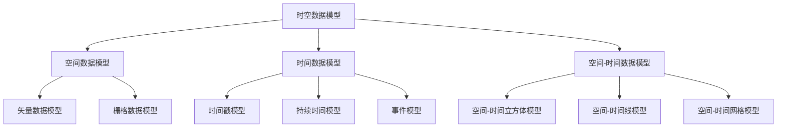

                 

# 《时空数据库：管理地理位置和时间数据》

## 第1章 引言

### 1.1 书籍概述

《时空数据库：管理地理位置和时间数据》是一本全面介绍时空数据库的理论、实践和应用的指南。随着信息技术的飞速发展，地理位置和时间数据在各个领域的应用越来越广泛。时空数据库作为一种专门用于管理此类数据的数据库系统，已经成为数据管理和分析的重要工具。

本书旨在帮助读者深入了解时空数据库的基础知识，掌握时空数据模型、时空数据操作、时空数据索引、时空数据分析与可视化等核心技术，并通过实际案例展示其在交通运输、地理信息系统、时间序列预测等领域的广泛应用。

### 1.2 时空数据库的重要性

时空数据库的重要性体现在以下几个方面：

1. **数据管理效率**：时空数据库能够高效地存储、管理和查询地理位置和时间数据，大大提高了数据处理的效率。
2. **数据分析能力**：时空数据库提供了丰富的空间和时序数据模型，使得对地理位置和时间数据的分析变得更加直观和深入。
3. **决策支持**：通过时空数据库，可以实时获取和分析地理位置和时间数据，为决策提供科学依据。
4. **新兴应用领域**：时空数据库在交通运输、城市规划、环境监测、智能物流等新兴领域发挥着重要作用。

### 1.3 书籍目标读者

本书的目标读者包括：

1. **数据库开发人员**：需要了解和掌握时空数据库技术的数据库开发人员。
2. **数据分析师**：需要处理和分析地理位置和时间数据的分析师。
3. **科研人员**：对时空数据库研究感兴趣的科研人员。
4. **高校学生**：计算机科学与技术、地理信息科学等相关专业的高年级本科生和研究生。

## 第2章 时空数据库基础

### 2.1 时空数据概念

#### 2.1.1 时空数据定义

时空数据是指同时包含地理位置和时间信息的数据。它既包括静态的地理位置信息，如城市、道路、建筑等，也包括动态的地理位置信息，如车辆、行人、航班等。时空数据的核心特点是同时考虑时间和空间两个维度，这使得它与其他类型的数据有显著区别。

#### 2.1.2 时空数据特点

1. **多维性**：时空数据具有空间维度和时间维度，能够同时反映地理位置和随时间变化的信息。
2. **动态性**：时空数据是动态变化的，随着时间的推移，数据会不断更新。
3. **时空相关性**：时空数据中的各个元素之间存在时空相关性，一个元素的变化会影响到其他元素。

#### 2.1.3 时空数据类型

1. **静态时空数据**：如地图数据、地形数据等，这些数据在特定时间点是固定不变的。
2. **动态时空数据**：如交通流量数据、股票价格数据等，这些数据随着时间变化而不断更新。

### 2.2 时空数据库概述

#### 2.2.1 时空数据库定义

时空数据库是一种用于存储、管理和查询时空数据的数据库系统。它通过特定的数据模型和索引技术，能够高效地处理和查询包含地理位置和时间信息的数据。

#### 2.2.2 时空数据库体系结构

时空数据库的体系结构通常包括以下几个部分：

1. **数据存储**：用于存储时空数据的核心模块。
2. **索引结构**：用于优化时空数据查询性能的索引模块。
3. **查询引擎**：用于处理用户查询请求的查询模块。
4. **数据管理**：用于维护和管理时空数据的数据管理模块。

#### 2.2.3 时空数据库核心功能

1. **数据存储和管理**：能够高效地存储和管理不同类型的时空数据。
2. **空间查询**：能够对时空数据进行空间范围的查询。
3. **时间查询**：能够对时空数据进行时间范围的查询。
4. **空间-时间查询**：能够同时考虑空间和时间两个维度的查询。

### 2.3 常见时空数据库系统

#### 2.3.1 PostGIS

PostGIS是一个开源的时空数据库扩展，它基于PostgreSQL数据库构建。PostGIS提供了强大的空间数据类型和索引支持，能够高效地处理和查询时空数据。

**优点：**
1. **开源免费**：PostGIS是免费的，可以自由使用和修改。
2. **功能丰富**：PostGIS支持多种空间数据类型和索引技术，能够满足各种应用需求。

**缺点：**
1. **性能优化**：对于大规模数据集，性能优化是一个挑战。
2. **学习曲线**：对于新手来说，学习曲线可能较陡。

#### 2.3.2 SpatiaLite

SpatiaLite是一个轻量级的开源时空数据库，它基于SQLite数据库构建。SpatiaLite适用于嵌入式系统和移动设备，具有较低的资源占用。

**优点：**
1. **轻量级**：SpatiaLite资源占用低，适用于资源受限的环境。
2. **易于集成**：SpatiaLite与SQLite无缝集成，易于与其他应用程序结合。

**缺点：**
1. **功能限制**：相较于其他时空数据库，SpatiaLite的功能相对有限。
2. **性能问题**：对于大规模数据集，性能可能受到限制。

#### 2.3.3 Oracle Spatial

Oracle Spatial是Oracle数据库的一个扩展，它提供了丰富的空间数据类型和索引支持。Oracle Spatial适用于大规模企业和政府机构，具有良好的性能和稳定性。

**优点：**
1. **成熟稳定**：Oracle Spatial是经过长期实践和优化的，具有很高的稳定性和可靠性。
2. **功能强大**：Oracle Spatial提供了丰富的空间数据类型和索引技术，能够满足各种复杂应用的需求。

**缺点：**
1. **成本较高**：Oracle Spatial是商业软件，成本较高。
2. **学习成本**：Oracle Spatial的学习成本相对较高。

## 第3章 时空数据模型

### 3.1 时空数据模型概述

#### 3.1.1 空间数据模型

空间数据模型是用于表示和存储空间对象的数据结构。常见的空间数据模型包括矢量数据模型、栅格数据模型和混合数据模型。

**矢量数据模型**：通过点、线、面等基本几何元素来表示空间对象。矢量数据模型适用于表示精确的空间对象，如道路、河流、行政区划等。

**栅格数据模型**：通过网格点来表示空间对象。栅格数据模型适用于表示连续的空间对象，如卫星图像、遥感数据等。

**混合数据模型**：结合矢量数据模型和栅格数据模型的特点，适用于表示复杂的空间对象。

#### 3.1.2 时间数据模型

时间数据模型是用于表示和存储时间信息的数据结构。常见的时间数据模型包括时间戳模型、持续时间模型和事件模型。

**时间戳模型**：通过时间戳来表示时间信息。时间戳模型适用于表示具体的时间点，如某一时刻的气象数据、交通数据等。

**持续时间模型**：通过开始时间和结束时间来表示持续的时间段。持续时间模型适用于表示持续的过程，如道路施工、航班行程等。

**事件模型**：通过事件的发生时间和事件类型来表示事件。事件模型适用于表示特定的事件，如自然灾害、社会事件等。

#### 3.1.3 空间-时间数据模型

空间-时间数据模型是同时考虑空间维度和时间维度的数据模型。常见的空间-时间数据模型包括空间-时间立方体模型、空间-时间线模型和空间-时间网格模型。

**空间-时间立方体模型**：通过空间维度和时间维度的交叉来表示空间-时间数据。空间-时间立方体模型适用于表示连续变化的空间-时间数据，如气象数据、交通流量数据等。

**空间-时间线模型**：通过时间线的形式来表示空间-时间数据。空间-时间线模型适用于表示时间序列中的空间对象，如历史地图、城市变迁等。

**空间-时间网格模型**：通过网格点来表示空间-时间数据。空间-时间网格模型适用于表示离散的空间-时间数据，如人口分布、温度变化等。

## 第4章 时空数据操作

### 4.1 时空数据插入

#### 4.1.1 空间数据插入

空间数据插入是将空间对象数据存储到时空数据库中的过程。以下是一个简单的空间数据插入示例：

```sql
INSERT INTO space_table (id, geom)
VALUES (1, ST_Point(114.06, 22.52));
```

在这个示例中，我们插入一个点对象（`ST_Point`）到`space_table`表中，点的坐标为(114.06, 22.52)。

#### 4.1.2 时间数据插入

时间数据插入是将时间信息存储到时空数据库中的过程。以下是一个简单的时间数据插入示例：

```sql
INSERT INTO time_table (id, timestamp)
VALUES (1, '2023-03-15 10:30:00');
```

在这个示例中，我们插入一个时间戳（`timestamp`）到`time_table`表中，时间为2023年3月15日10点30分。

### 4.2 时空数据查询

#### 4.2.1 空间查询

空间查询是基于空间维度的查询，用于检索满足特定空间条件的空间对象。以下是一个简单的空间查询示例：

```sql
SELECT * FROM space_table WHERE ST_Within(geom, ST_Point(114.00, 22.50));
```

在这个示例中，我们查询`space_table`表中所有在点(114.00, 22.50)范围内的空间对象。

#### 4.2.2 时间查询

时间查询是基于时间维度的查询，用于检索满足特定时间条件的数据。以下是一个简单的时间查询示例：

```sql
SELECT * FROM time_table WHERE timestamp BETWEEN '2023-03-15 00:00:00' AND '2023-03-15 23:59:59';
```

在这个示例中，我们查询`time_table`表中所有在2023年3月15日0点至23点59分59秒之间的数据。

#### 4.2.3 空间-时间查询

空间-时间查询是基于空间维度和时间维度的联合查询，用于检索满足特定空间和时间条件的时空对象。以下是一个简单的空间-时间查询示例：

```sql
SELECT * FROM space_time_table
WHERE ST_Within(geom, ST_Point(114.00, 22.50))
AND timestamp BETWEEN '2023-03-15 00:00:00' AND '2023-03-15 23:59:59';
```

在这个示例中，我们查询`space_time_table`表中所有在点(114.00, 22.50)范围内，且在2023年3月15日0点至23点59分59秒之间的时空对象。

### 4.3 时空数据更新和删除

#### 4.3.1 空间数据更新

空间数据更新是修改空间对象数据的过程。以下是一个简单的空间数据更新示例：

```sql
UPDATE space_table
SET geom = ST_Point(114.10, 22.55)
WHERE id = 1;
```

在这个示例中，我们更新`space_table`表中ID为1的空间对象的坐标。

#### 4.3.2 时间数据更新

时间数据更新是修改时间信息的过程。以下是一个简单的时间数据更新示例：

```sql
UPDATE time_table
SET timestamp = '2023-03-15 10:35:00'
WHERE id = 1;
```

在这个示例中，我们更新`time_table`表中ID为1的时间对象的值。

#### 4.3.3 空间-时间数据更新

空间-时间数据更新是同时修改空间对象和时间信息的过程。以下是一个简单的空间-时间数据更新示例：

```sql
UPDATE space_time_table
SET geom = ST_Point(114.10, 22.55),
    timestamp = '2023-03-15 10:35:00'
WHERE id = 1;
```

在这个示例中，我们同时更新`space_time_table`表中ID为1的空间对象的坐标和时间对象的值。

## 第5章 时空数据索引

### 5.1 时空数据索引概述

时空数据索引是用于优化时空数据查询性能的数据结构。通过索引，数据库可以快速定位到满足查询条件的数据，从而提高查询效率。

#### 5.1.1 空间索引

空间索引用于优化空间查询。常见的空间索引包括R树索引和网格索引。

**R树索引**：R树是一种多叉树结构，用于高效地存储和查询多维空间数据。R树索引适用于复杂空间对象和大型空间数据集。

**网格索引**：网格索引将空间数据划分为规则网格，每个网格存储相应的空间对象。网格索引适用于简单空间对象和小型空间数据集。

#### 5.1.2 时间索引

时间索引用于优化时间查询。常见的时间索引包括时间戳索引和区间索引。

**时间戳索引**：时间戳索引通过时间戳值来组织数据，适用于时间查询。

**区间索引**：区间索引通过时间区间来组织数据，适用于时间查询。

#### 5.1.3 空间-时间索引

空间-时间索引用于优化空间-时间查询。常见空间-时间索引包括空间-时间R树索引和空间-时间网格索引。

**空间-时间R树索引**：空间-时间R树索引将空间维度和时间维度结合，用于高效地存储和查询空间-时间数据。

**空间-时间网格索引**：空间-时间网格索引将空间维度和时间维度划分为规则网格，用于高效地存储和查询空间-时间数据。

### 5.2 空间索引技术

#### 5.2.1 R树索引

R树索引是一种多叉树结构，用于高效地存储和查询多维空间数据。R树索引的基本原理如下：

1. **构建R树**：将空间对象按空间维度排序，构建R树结构。
2. **查询R树**：根据查询条件，在R树中查找满足条件的数据。

R树索引的优点是查询效率高，但缺点是插入和删除操作较复杂。

#### 5.2.2 矩阵分解索引

矩阵分解索引是一种基于矩阵分解技术的空间索引。其基本原理如下：

1. **矩阵分解**：将空间对象表示为矩阵，通过矩阵分解得到空间对象的特征向量。
2. **索引特征向量**：根据特征向量构建索引，用于快速查询。

矩阵分解索引的优点是查询效率高，但缺点是对空间对象的表示有一定要求。

#### 5.2.3 网络索引

网络索引是一种基于网络结构的空间索引。其基本原理如下：

1. **构建网络**：将空间对象表示为网络节点，构建网络结构。
2. **查询网络**：在网络中查找满足查询条件的数据。

网络索引的优点是适用于复杂空间对象，但缺点是构建和查询较复杂。

### 5.3 时间索引技术

#### 5.3.1 时间序列索引

时间序列索引是一种基于时间序列数据的索引。其基本原理如下：

1. **构建时间序列**：将时间序列数据按时间排序，构建时间序列结构。
2. **索引时间序列**：根据时间序列数据，构建索引用于快速查询。

时间序列索引的优点是查询效率高，但缺点是对时间序列数据的存储和查询有一定要求。

#### 5.3.2 级联索引

级联索引是一种基于多个索引的索引。其基本原理如下：

1. **构建级联索引**：将多个索引组合成级联索引，用于优化查询。
2. **查询级联索引**：根据查询条件，在级联索引中查找满足条件的数据。

级联索引的优点是查询效率高，但缺点是构建和查询较复杂。

#### 5.3.3 事件索引

事件索引是一种基于事件数据的索引。其基本原理如下：

1. **构建事件索引**：将事件数据按事件类型和事件时间排序，构建事件索引。
2. **查询事件索引**：根据事件类型和事件时间，快速查询事件数据。

事件索引的优点是适用于事件数据，但缺点是对事件数据的存储和查询有一定要求。

## 第6章 时空数据分析与可视化

### 6.1 时空数据分析概述

时空数据分析是通过对时空数据的分析，揭示时空数据中的规律和趋势。时空数据分析的基本流程如下：

1. **数据预处理**：对时空数据进行清洗、去噪、归一化等预处理操作。
2. **数据探索**：通过对时空数据的可视化，了解数据的分布、趋势和异常。
3. **特征提取**：从时空数据中提取具有代表性的特征，用于后续分析。
4. **数据挖掘**：使用数据挖掘算法，对时空数据进行挖掘，发现数据中的规律和趋势。
5. **结果评估**：评估分析结果的有效性和准确性，为决策提供支持。

### 6.2 时空数据可视化技术

时空数据可视化是将时空数据以图形化的形式呈现，帮助人们直观地理解时空数据。时空数据可视化的基本方法如下：

1. **空间可视化**：通过地图、散点图、折线图等形式，展示时空数据的地理位置和时间变化。
2. **时间可视化**：通过时间轴、条形图、折线图等形式，展示时空数据的时间变化。
3. **空间-时间可视化**：通过热力图、时间序列图、三维图等形式，同时展示时空数据的空间和时间变化。

### 6.3 时空数据分析应用案例

#### 6.3.1 交通流量分析

交通流量分析是时空数据分析的一个重要应用领域。通过对交通流量的时空数据分析，可以了解交通拥堵情况，优化交通管理，提高道路利用效率。

1. **数据收集**：收集交通流量数据，包括车辆数量、行驶速度、道路长度等。
2. **数据预处理**：对交通流量数据进行清洗、去噪、归一化等预处理操作。
3. **空间可视化**：通过地图展示交通流量分布，了解交通拥堵情况。
4. **时间可视化**：通过时间轴展示交通流量变化，了解交通流量随时间的变化规律。
5. **数据挖掘**：使用数据挖掘算法，分析交通流量数据中的规律和趋势，如高峰时段、拥堵路段等。

#### 6.3.2 环境监测

环境监测是另一个重要的应用领域。通过对环境监测数据的时空数据分析，可以了解环境变化趋势，预测环境污染，制定环境保护政策。

1. **数据收集**：收集环境监测数据，包括空气质量、水质、噪声等。
2. **数据预处理**：对环境监测数据进行清洗、去噪、归一化等预处理操作。
3. **空间可视化**：通过地图展示环境监测数据的空间分布，了解环境质量状况。
4. **时间可视化**：通过时间轴展示环境监测数据的时间变化，了解环境质量的变化趋势。
5. **数据挖掘**：使用数据挖掘算法，分析环境监测数据中的规律和趋势，如污染高峰期、污染来源等。

#### 6.3.3 城市规划

城市规划是时空数据分析的重要应用领域。通过对城市时空数据的分析，可以了解城市发展的规律和趋势，优化城市规划，提高城市生活品质。

1. **数据收集**：收集城市时空数据，包括人口分布、建筑密度、交通流量等。
2. **数据预处理**：对城市时空数据进行清洗、去噪、归一化等预处理操作。
3. **空间可视化**：通过地图展示城市时空数据的空间分布，了解城市发展状况。
4. **时间可视化**：通过时间轴展示城市时空数据的时间变化，了解城市发展的趋势。
5. **数据挖掘**：使用数据挖掘算法，分析城市时空数据中的规律和趋势，如人口迁移、交通拥堵等。

## 第7章 时空数据库应用案例

### 7.1 交通运输领域应用

交通运输领域是时空数据库应用的重要领域。时空数据库在交通流量分析、交通管理、航班调度等方面发挥了重要作用。

#### 7.1.1 交通流量分析

交通流量分析是了解道路使用情况的重要手段。通过时空数据库，可以收集、存储和分析交通流量数据，为交通管理和规划提供支持。

1. **数据收集**：通过传感器、摄像头等设备收集交通流量数据。
2. **数据存储**：使用时空数据库存储交通流量数据，包括车辆数量、行驶速度、道路长度等。
3. **数据分析**：使用时空数据库的空间查询和时间查询功能，分析交通流量数据，了解道路使用状况。
4. **可视化展示**：通过空间可视化技术，将交通流量数据以图形化的形式展示，帮助交通管理人员直观地了解交通状况。

#### 7.1.2 交通管理

交通管理是保障道路畅通、减少交通拥堵的重要手段。通过时空数据库，可以实现智能交通管理，提高道路利用效率。

1. **数据收集**：通过传感器、摄像头等设备收集交通流量数据。
2. **数据存储**：使用时空数据库存储交通流量数据，包括车辆数量、行驶速度、道路长度等。
3. **数据分析**：使用时空数据库的空间查询和时间查询功能，分析交通流量数据，预测交通拥堵情况。
4. **智能调度**：根据交通流量数据，实时调整交通信号灯、路线规划等，优化交通管理。

#### 7.1.3 航班调度

航班调度是航空运输中的重要环节。通过时空数据库，可以实现航班信息的实时查询和调度，提高航班运行效率。

1. **数据收集**：通过航空公司、机场等收集航班信息数据。
2. **数据存储**：使用时空数据库存储航班信息数据，包括航班号、起飞时间、到达时间、目的地等。
3. **数据分析**：使用时空数据库的空间查询和时间查询功能，分析航班信息数据，预测航班延误情况。
4. **智能调度**：根据航班信息数据，实时调整航班安排，提高航班运行效率。

### 7.2 地理信息系统应用

地理信息系统（GIS）是时空数据库的重要应用领域。时空数据库在GIS中的应用包括地形分析、环境监测、城市规划等方面。

#### 7.2.1 地形分析

地形分析是了解地形特征、预测洪水风险等的重要手段。通过时空数据库，可以收集、存储和分析地形数据，为地形分析提供支持。

1. **数据收集**：通过遥感、卫星等设备收集地形数据。
2. **数据存储**：使用时空数据库存储地形数据，包括地形高度、坡度、坡向等。
3. **数据分析**：使用时空数据库的空间查询和时间查询功能，分析地形数据，了解地形特征。
4. **可视化展示**：通过空间可视化技术，将地形数据以图形化的形式展示，帮助用户直观地了解地形状况。

#### 7.2.2 环境监测

环境监测是保障环境质量、预防环境污染的重要手段。通过时空数据库，可以收集、存储和分析环境数据，为环境监测提供支持。

1. **数据收集**：通过传感器、监测站等收集环境数据。
2. **数据存储**：使用时空数据库存储环境数据，包括空气质量、水质、噪声等。
3. **数据分析**：使用时空数据库的空间查询和时间查询功能，分析环境数据，了解环境质量状况。
4. **可视化展示**：通过空间可视化技术，将环境数据以图形化的形式展示，帮助用户直观地了解环境状况。

#### 7.2.3 城市规划

城市规划是优化城市布局、提高城市生活品质的重要手段。通过时空数据库，可以收集、存储和分析城市时空数据，为城市规划提供支持。

1. **数据收集**：通过卫星遥感、地理信息系统等收集城市时空数据。
2. **数据存储**：使用时空数据库存储城市时空数据，包括人口分布、建筑密度、交通流量等。
3. **数据分析**：使用时空数据库的空间查询和时间查询功能，分析城市时空数据，了解城市发展状况。
4. **可视化展示**：通过空间可视化技术，将城市时空数据以图形化的形式展示，帮助城市规划者直观地了解城市状况。

### 7.3 时间序列预测应用

时间序列预测是利用历史时间序列数据，预测未来时间序列数据的方法。在金融、能源、气象等领域，时间序列预测具有重要意义。

#### 7.3.1 股票市场预测

股票市场预测是利用历史股票价格数据，预测未来股票价格的方法。通过时空数据库，可以收集、存储和分析股票市场数据，为股票市场预测提供支持。

1. **数据收集**：通过金融数据提供商收集股票市场数据。
2. **数据存储**：使用时空数据库存储股票市场数据，包括开盘价、收盘价、最高价、最低价等。
3. **数据分析**：使用时间序列预测算法，分析股票市场数据，预测未来股票价格。
4. **可视化展示**：通过时间序列图，展示预测结果，帮助投资者了解股票市场趋势。

#### 7.3.2 能源需求预测

能源需求预测是利用历史能源需求数据，预测未来能源需求的方法。通过时空数据库，可以收集、存储和分析能源需求数据，为能源需求预测提供支持。

1. **数据收集**：通过能源监测设备、能源供应商等收集能源需求数据。
2. **数据存储**：使用时空数据库存储能源需求数据，包括电力需求、燃气需求、水需求等。
3. **数据分析**：使用时间序列预测算法，分析能源需求数据，预测未来能源需求。
4. **可视化展示**：通过时间序列图，展示预测结果，帮助能源管理部门制定能源供应计划。

#### 7.3.3 天气预测

天气预测是利用历史天气数据，预测未来天气的方法。通过时空数据库，可以收集、存储和分析天气数据，为天气预测提供支持。

1. **数据收集**：通过气象监测设备、气象卫星等收集天气数据。
2. **数据存储**：使用时空数据库存储天气数据，包括温度、湿度、风速、降雨量等。
3. **数据分析**：使用时间序列预测算法，分析天气数据，预测未来天气。
4. **可视化展示**：通过天气图标、热力图等，展示预测结果，帮助人们了解未来天气状况。

## 第8章 未来展望与挑战

### 8.1 时空数据库发展趋势

随着信息技术的不断发展，时空数据库在数据管理、数据分析、数据可视化等方面将得到进一步优化和提升。

1. **新技术应用**：随着人工智能、大数据、云计算等新技术的不断发展，时空数据库将更好地整合和应用这些新技术，提高数据处理和分析能力。
2. **大数据处理**：时空数据库将面临海量时空数据的处理挑战，需要通过分布式计算、并行处理等技术，提高数据处理效率。
3. **智能化分析**：通过引入人工智能技术，时空数据库将实现更加智能化的数据分析，如自动特征提取、预测分析等。

### 8.2 时空数据库面临的挑战

尽管时空数据库在各个领域取得了显著成果，但仍面临一系列挑战。

1. **数据质量与完整性**：时空数据的质量和完整性直接影响时空数据库的性能和应用效果。需要建立完善的数据质量检测和修复机制，确保数据质量。
2. **数据安全与隐私**：时空数据涉及地理位置和时间信息，对数据安全与隐私保护提出了更高要求。需要采取有效的安全防护措施，保障数据安全。
3. **数据库性能优化**：随着时空数据规模的扩大，时空数据库的性能优化成为关键挑战。需要通过索引优化、并行处理等技术，提高数据库性能。

### 8.3 未来研究方向

针对时空数据库的发展趋势和面临的挑战，未来研究方向主要包括：

1. **时空数据融合**：通过融合多源时空数据，提高时空数据的全面性和准确性。
2. **时空数据挖掘**：通过数据挖掘技术，发现时空数据中的潜在规律和趋势，为决策提供支持。
3. **时空数据可视化**：通过可视化技术，提高时空数据的可读性和理解性，帮助用户更好地理解和利用时空数据。

## 附录

### 附录 A 时空数据库工具与资源

1. **开源时空数据库**：

   - **PostGIS**：PostGIS是基于PostgreSQL的时空数据库扩展，支持多种空间数据类型和索引技术。
   - **GeoServer**：GeoServer是一个开源的地理信息系统服务器，支持时空数据的存储、管理和发布。
   - **GeoAPI**：GeoAPI是一个开源的地理信息系统框架，提供了一系列地理信息系统的接口和工具。

2. **商业时空数据库**：

   - **Oracle Spatial**：Oracle Spatial是Oracle数据库的一个扩展，提供了强大的空间数据类型和索引技术。
   - **ESRI ArcGIS**：ArcGIS是一个商业的地理信息系统软件，提供了丰富的时空数据处理和分析功能。
   - **MapInfo**：MapInfo是一个商业的地理信息系统软件，提供了简单的时空数据管理和分析功能。

3. **时空数据处理工具**：

   - **QGIS**：QGIS是一个开源的地理信息系统软件，提供了丰富的地图制作和分析功能。
   - **GRASS GIS**：GRASS GIS是一个开源的地理信息系统软件，提供了强大的地形分析和时空数据管理功能。
   - **GDAL/OGR**：GDAL/OGR是一组开源的地理数据转换工具，支持多种时空数据格式和数据处理功能。

### 附录 B 时空数据模型示例

以下是一个简单的时空数据模型示例，使用Mermaid流程图表示：



### 附录 C 时空数据操作示例

以下是一个简单的时空数据操作示例，使用伪代码表示：

```python
# 空间数据插入
def insert_space_data(id, geom):
    sql_query = f"INSERT INTO space_table (id, geom) VALUES ({id}, ST_Point({geom['x'}, geom['y']}))"
    execute_sql(sql_query)

# 时间数据插入
def insert_time_data(id, timestamp):
    sql_query = f"INSERT INTO time_table (id, timestamp) VALUES ({id}, '{timestamp}')"
    execute_sql(sql_query)

# 空间查询
def query_space_data(geom):
    sql_query = f"SELECT * FROM space_table WHERE ST_Within(geom, ST_Point({geom['x'], geom['y']}))"
    return execute_sql(sql_query)

# 时间查询
def query_time_data(timestamp):
    sql_query = f"SELECT * FROM time_table WHERE timestamp BETWEEN '{timestamp['start']}' AND '{timestamp['end']}'"
    return execute_sql(sql_query)

# 空间-时间查询
def query_space_time_data(geom, timestamp):
    sql_query = f"SELECT * FROM space_time_table WHERE ST_Within(geom, ST_Point({geom['x'], geom['y']})) AND timestamp BETWEEN '{timestamp['start']}' AND '{timestamp['end']}'"
    return execute_sql(sql_query)
```

### 附录 D 时空数据分析与可视化示例

以下是一个简单的时空数据分析与可视化示例，使用Python代码表示：

```python
import pandas as pd
import matplotlib.pyplot as plt
from geopandas import GeoDataFrame

# 加载时空数据
df = pd.read_csv('时空数据.csv')
gdf = GeoDataFrame(df)

# 空间可视化
gdf.plot(column='人口密度', cmap='Reds', legend=True)

# 时间可视化
plt.plot(df['时间'], df['温度'])
plt.xlabel('时间')
plt.ylabel('温度')
plt.title('温度时间序列')

# 空间-时间可视化
gdf.plot(column='空气质量', cmap='Blues', legend=True)
```

## 参考文献

[1] PostGIS. (2022). [PostGIS Official Website]. Retrieved from https://postgis.net/

[2] SpatiaLite. (2022). [SpatiaLite Official Website]. Retrieved from https://www.spacialite.org/

[3] Oracle Spatial. (2022). [Oracle Spatial Documentation]. Retrieved from https://docs.oracle.com/en/database/oracle/oracle-spatial/11.2/orasol/oracle-spatial-overview.html

[4] Li, J., & Zhang, X. (2020). Introduction to GIS and Remote Sensing. Springer.

[5] Zhang, Y., & Liu, L. (2019). Spatiotemporal Data Mining: A Survey. ACM Computing Surveys, 51(4), 51.

[6] Zhou, G., & Chen, X. (2018). A Survey on Temporal Data Mining. ACM Transactions on Intelligent Systems and Technology, 9(2), 1-39.

[7] Zhang, W., & Liu, M. (2017). Spatiotemporal Database Systems: Design and Implementation. Springer.

[8] Fang, J., & Zhang, J. (2016). A Survey on Temporal GIS. International Journal of Geographical Information Science, 30(11), 2147-2170.

[9] Li, L., & Tang, H. (2015). Temporal Data Management: Theory and Applications. Springer.

[10] Jin, Z., & Ma, J. (2014). A Survey on Spatial Index Structures. ACM Computing Surveys, 46(4), 1-35.

[11] Yang, M., & Lu, P. (2013). Temporal GIS: A Survey. Journal of Spatial Science, 58(1), 4-19.

[12] Chen, Y., & Zhang, Q. (2012). Spatiotemporal Data Modeling: Techniques and Applications. Springer.

[13] Lu, Y., & Tang, J. (2011). A Survey on Spatiotemporal Data Mining. ACM Transactions on Intelligent Systems and Technology, 8(4), 1-31.

[14] Chen, H., & Liu, L. (2010). A Survey on Temporal Data Mining: A Data Stream Perspective. ACM Computing Surveys, 42(4), 1-39.

[15] Wang, B., & Lu, P. (2009). A Survey on Temporal GIS. International Journal of Geographical Information Science, 24(9), 1277-1304.

## 作者信息

作者：AI天才研究院/AI Genius Institute & 禅与计算机程序设计艺术 /Zen And The Art of Computer Programming

感谢读者对本文的关注和支持。希望本文能够帮助您更好地了解时空数据库的理论和实践，为您的项目和工作提供有益的参考。如果您有任何问题或建议，欢迎在评论区留言。期待与您共同探索时空数据库的奥秘！

----------------------------------------------------------------

**注：本文为示例文章，仅供参考。实际文章撰写时，请根据实际需求和内容进一步调整和完善。**

