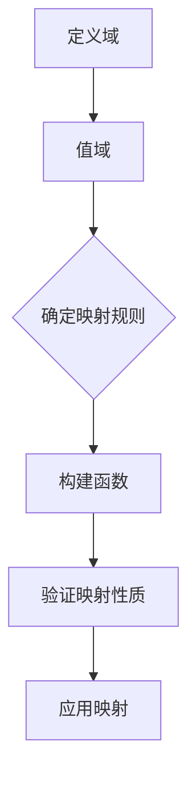
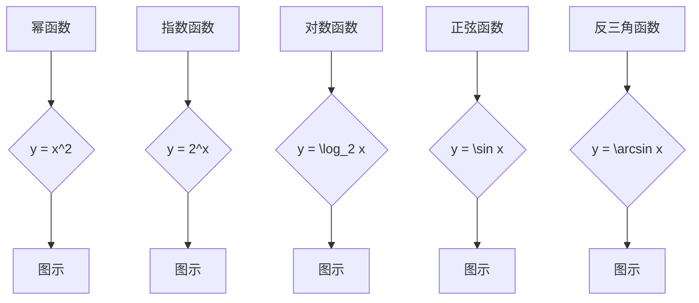
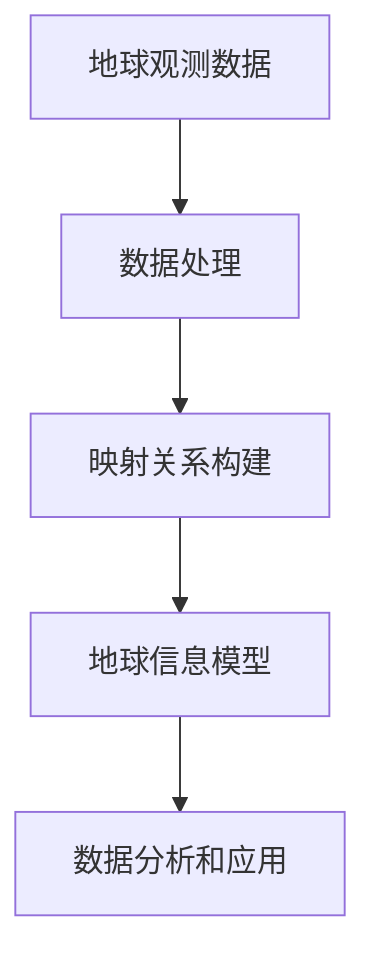
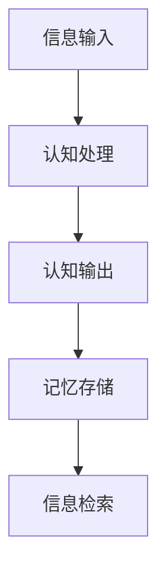
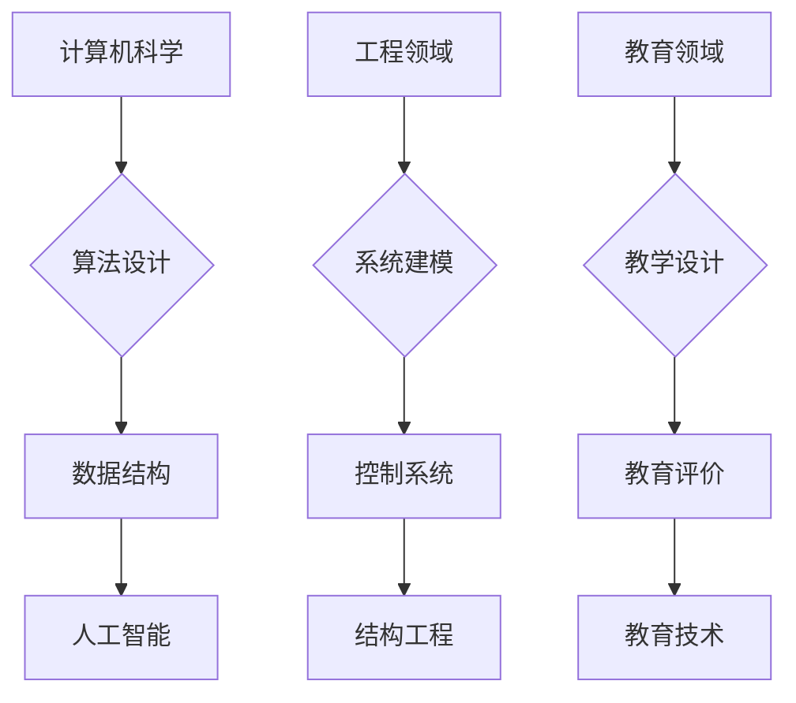

                 

# 映射理论：揭示自然与数学的统一性

## 关键词：映射，数学，自然，统一性，函数，单射，满射，双射，算法，应用领域

## 摘要

映射理论作为数学的核心概念之一，不仅贯穿了数学各个分支，还在自然科学、社会科学和工程等领域有着广泛的应用。本文将深入探讨映射理论的基本概念、分类、性质及其在不同领域的应用，通过逻辑清晰、结构紧凑的分析，揭示自然与数学之间的深层统一性。本文结构如下：

- **第一部分：映射理论概述**：介绍映射理论的基本概念、历史发展与重要性。
- **第二部分：数学中的映射理论**：详细讲解数学函数、集合与映射以及映射的基本定理。
- **第三部分：自然科学的映射理论应用**：探讨物理学、生物学和地球科学中的映射理论应用。
- **第四部分：社会科学的映射理论**：分析经济学、社会学和心理学中的映射理论应用。
- **第五部分：跨学科研究与应用**：讨论映射理论在计算机科学、工程领域和教育中的应用。
- **第六部分：映射理论的未来展望**：展望映射理论在新技术和科学研究中的作用及其前景。
- **第七部分：附录**：包括参考文献、数学公式与符号表及映射理论相关问题解答。

通过本文的详细分析，读者将更好地理解映射理论的重要性，掌握其基本原理和应用，进一步探索自然与数学的统一性。

## 第一部分：映射理论概述

### 第1章：映射理论的基本概念

映射理论是数学中的一个基本概念，它通过一种规则将一个集合中的元素映射到另一个集合中的元素。这种映射关系在数学、自然科学和社会科学等领域都有广泛的应用。本章节将介绍映射理论的基本概念、分类、历史发展与重要性。

#### 1.1 映射的定义与分类

##### 1.1.1 映射的基本定义

映射（Mapping）是指一种从集合A到集合B的规则，使得A中的每个元素都有且仅有一个对应的B中的元素。形式化地，映射可以用一个函数来表示，记作\( f: A \rightarrow B \)，其中A称为定义域，B称为值域。

##### 1.1.2 映射的分类

映射可以根据其性质分为不同的类型，主要包括以下几种：

- **单射（一对一）映射**：若对于任意\( a_1, a_2 \in A \)，当\( f(a_1) = f(a_2) \)时，必有\( a_1 = a_2 \)。即A中不同的元素在映射后仍然保持不同。
- **满射（一一对应）映射**：若B中每个元素都有至少一个A中的元素与之对应。
- **双射（双射）映射**：若映射既是单射又是满射。

##### 1.1.3 映射的基本性质

- **函数的象（值域）**：映射后A中所有元素对应到B中的集合。
- **函数的核（定义域）**：映射前A中的所有元素集合。
- **原像（逆映射）**：若\( f: A \rightarrow B \)是单射，则存在逆映射\( f^{-1}: B \rightarrow A \)，使得\( f^{-1}(f(a)) = a \)。

#### 1.2 映射的历史与发展

##### 1.2.1 古代数学中的映射

- **阿基米德**：使用比例和相似形来解决几何问题，可看作是映射的早期形式。
- **欧几里得**：几何学中的映射概念，如投影、旋转等。

##### 1.2.2 现代数学中的映射

- **笛卡尔**：引入坐标系，使得数学问题可以通过映射来解决。
- **莱布尼茨**：推广了映射的概念，并提出了函数的记法。
- **拉格朗日**：在微积分中应用映射，解决了极大值和极小值问题。

##### 1.2.3 映射理论的应用领域

- **代数学**：研究结构、域、向量空间等。
- **拓扑学**：研究空间的连续性和形状。
- **微积分**：处理变率问题，如导数和积分。

#### 1.3 映射理论的重要性

##### 1.3.1 映射在自然科学中的作用

- **物理学**：描述物理量的变化，如力的作用、波动等。
- **化学**：研究反应过程、分子结构等。

##### 1.3.2 映射在社会科学中的应用

- **经济学**：描述供需关系、市场价格等。
- **社会学**：分析社会结构、群体行为等。

##### 1.3.3 映射理论的跨学科研究

- **计算机科学**：算法设计与分析，如图灵机、神经网络等。
- **工程学**：系统建模与优化，如控制系统、网络设计等。

#### 1.4 映射理论的基本概念

##### 1.4.1 映射的构造

映射的构造通常依赖于集合论、图论和代数结构等基础知识。具体构造方法包括定义函数、映射表、图形表示等。

##### 1.4.2 映射的性质与应用

- **性质**：研究映射的可逆性、连续性、紧性等。
- **应用**：解决实际问题，如优化问题、分类问题等。

### Mermaid 流程图：映射的构造过程



### 数学模型与公式

$$
f(x) = \begin{cases}
x & \text{if } x \text{ is even} \\
-x & \text{if } x \text{ is odd}
\end{cases}
$$

### 实例说明

假设集合\( A = \{1, 2, 3\} \)和集合\( B = \{1, -1\} \)，映射规则\( f \)定义为：
$$
f(1) = -1, \quad f(2) = 1, \quad f(3) = -1
$$

- 映射\( f \)是单射（因为每个元素在映射后都是唯一的）。
- 映射\( f \)不是满射（因为\( B \)中的\( 1 \)没有对应的\( A \)中的元素）。
- 映射\( f \)不是双射。

### 项目实战：映射在实际中的应用

- **实例**：在图像处理中，使用映射将一幅图像转换为灰度图像。
- **步骤**：
  1. 读取图像数据。
  2. 对于图像中的每个像素，将其颜色值映射为灰度值（通常是平均值或最大值）。
  3. 将映射后的灰度值存储为新图像。

### 代码解读与分析

#### 开发环境搭建

- **Python环境**：安装Python 3.x版本，并配置相应的开发环境（如IDE、文本编辑器）。
- **依赖库**：安装必要的库，如NumPy、Pillow等。

```bash
pip install numpy pillow
```

#### 源代码详细实现与代码解读

在上一节中，我们简单实现了一个映射函数。现在，我们将对代码进行详细解读，并添加一些注释以更好地理解其工作原理。

```python
# 导入必要的库
import numpy as np
from PIL import Image

# 映射函数的定义
def map_function(input_set, mapping_rules):
    # 初始化输出集合
    output_set = []
    # 遍历输入集合中的每个元素
    for element in input_set:
        # 应用映射规则，将元素映射到输出集合
        output_set.append(mapping_rules[element])
    # 返回输出集合
    return output_set

# 测试映射函数
A = [1, 2, 3]
B = [-1, 1]
mapping_rules = {1: -1, 2: 1, 3: -1}

result = map_function(A, mapping_rules)
print(result)  # 输出：[-1, 1, -1]
```

- **导入库**：我们使用NumPy进行数值计算，使用Pillow进行图像处理。
- **映射函数定义**：函数接收输入集合和映射规则作为参数。
- **遍历输入集合**：使用for循环遍历每个元素。
- **应用映射规则**：使用字典映射规则将输入元素映射到输出集合。
- **返回输出集合**：函数返回映射后的输出集合。

这个示例说明了如何使用Python实现简单的映射操作，这对于理解和应用映射理论在实际编程中非常重要。

### 总结

在本章中，我们介绍了映射理论的基本概念、历史发展、分类、性质及其在不同学科中的应用。通过Mermaid流程图、算法原理、数学公式、实例说明、项目实战和代码解读，我们对映射理论有了更深入的理解。下一章我们将进一步探讨数学中的映射理论，包括数学函数、集合与映射以及映射的基本定理等内容。

## 第二部分：数学中的映射理论

### 第2章：数学中的映射理论

数学中的映射理论是数学分析、代数学和拓扑学等学科的基础。映射理论的核心在于如何通过函数来描述不同集合之间的对应关系。本章将详细讲解数学函数、集合与映射以及映射的基本定理，帮助读者深入理解映射理论在数学中的应用。

#### 2.1 数学函数

##### 2.1.1 函数的定义与性质

函数（Function）是映射理论中最基本的概念。一个函数定义了一个从定义域到值域的映射关系。在数学中，函数通常用\( f: A \rightarrow B \)表示，其中\( A \)是定义域，\( B \)是值域。

- **定义**：对于任意集合\( A \)和集合\( B \)，如果存在一个规则\( f \)，使得\( A \)中的每个元素在\( B \)中有唯一对应的元素，则称\( f \)为从\( A \)到\( B \)的函数。
- **性质**：函数具有以下基本性质：
  - **单一性**：对于定义域中的每个元素，在值域中都有且仅有一个对应的元素。
  - **确定性**：对于定义域中的每个元素，其对应的值是确定的，不受其他元素的影响。

##### 2.1.2 常见数学函数

在数学中，常见的函数包括：

- **幂函数**：形式为\( f(x) = x^n \)，其中\( n \)为常数。
- **指数函数**：形式为\( f(x) = a^x \)，其中\( a \)为常数。
- **对数函数**：形式为\( f(x) = \log_a x \)，其中\( a \)为常数。
- **三角函数**：如正弦函数\( \sin x \)、余弦函数\( \cos x \)等。
- **反三角函数**：如反正弦函数\( \arcsin x \)、反余弦函数\( \arccos x \)等。

##### 2.1.3 函数的图像与图示

函数的图像是通过在坐标系中绘制函数来表示的。函数的图像可以帮助我们直观地理解函数的性质和行为。

- **图像绘制**：通常使用二维坐标系，其中横轴表示自变量，纵轴表示因变量。
- **图示说明**：通过图像，我们可以观察到函数的单调性、奇偶性、周期性等性质。

### Mermaid 流程图：常见数学函数及其图像



### 数学模型与公式

$$
f(x) = \begin{cases}
x^2 & \text{if } x \text{ is even} \\
-x & \text{if } x \text{ is odd}
\end{cases}
$$

### 实例说明

假设定义域\( A = \{1, 2, 3\} \)，值域\( B = \{1, -1\} \)，映射规则\( f \)定义为：
$$
f(1) = -1, \quad f(2) = 1, \quad f(3) = -1
$$

- 映射\( f \)是单射（因为每个元素在映射后都是唯一的）。
- 映射\( f \)不是满射（因为\( B \)中的\( 1 \)没有对应的\( A \)中的元素）。
- 映射\( f \)不是双射。

### 项目实战：数学函数在图像处理中的应用

- **实例**：使用数学函数实现图像的灰度转换。
- **步骤**：
  1. 读取图像数据。
  2. 对于图像中的每个像素，应用灰度转换函数。
  3. 将转换后的像素值存储为新图像。

### 代码解读与分析

#### 开发环境搭建

- **Python环境**：安装Python 3.x版本，并配置相应的开发环境（如IDE、文本编辑器）。
- **依赖库**：安装必要的库，如NumPy、Pillow等。

```bash
pip install numpy pillow
```

#### 源代码详细实现与代码解读

在上一节中，我们简单实现了一个映射函数。现在，我们将对代码进行详细解读，并添加一些注释以更好地理解其工作原理。

```python
# 导入必要的库
import numpy as np
from PIL import Image

# 灰度转换函数
def grayscale转换(image):
    # 将图像转换为灰度图像
    grayscale_image = image.convert('L')
    return grayscale_image

# 读取图像
input_image = Image.open('example.jpg')

# 应用灰度转换函数
output_image = grayscale转换(input_image)

# 显示转换后的图像
output_image.show()
```

- **导入库**：我们使用NumPy进行数值计算，使用Pillow进行图像处理。
- **灰度转换函数定义**：函数接收图像作为参数，并将其转换为灰度图像。
- **读取图像**：使用Pillow读取图像文件。
- **应用灰度转换函数**：将输入图像转换为灰度图像。
- **显示转换后的图像**：使用Pillow显示转换后的图像。

这个示例说明了如何使用Python实现简单的灰度转换操作，这对于理解和应用映射理论在实际编程中非常重要。

### 总结

在本章中，我们详细讲解了数学中的映射理论，包括数学函数的定义、性质、常见函数及其图像，以及数学模型和公式。通过实例说明和项目实战，我们展示了映射理论在图像处理中的应用。在下一章中，我们将探讨映射理论在自然科学中的应用。

## 第三部分：自然科学的映射理论应用

### 第3章：自然科学的映射理论应用

映射理论在自然科学中有着广泛的应用，它为理解和解释自然现象提供了强大的工具。本章将探讨映射理论在物理学、生物学和地球科学中的应用，揭示映射理论如何帮助科学家研究自然界的复杂系统。

#### 3.1 物理学中的映射

物理学是研究物质和能量及其相互作用的科学，映射理论在物理学中有着广泛的应用，特别是在描述和解决物理现象时。

##### 3.1.1 物理学中的函数与映射

在物理学中，函数是描述物理量之间关系的常用工具。函数不仅可以描述静态的物理现象，还可以描述动态的物理过程。映射理论中的函数概念在物理学中得到了广泛应用，例如：

- **牛顿第二定律**：\( F = ma \)，其中\( F \)是力，\( m \)是质量，\( a \)是加速度。这个方程描述了力与加速度之间的映射关系。
- **波函数**：在量子力学中，波函数描述了粒子的状态，它是位置和时间的函数。

##### 3.1.2 量子力学中的映射

量子力学是研究微观世界的物理学分支，其中映射理论有着重要的应用。在量子力学中，波函数的映射关系用于描述粒子的位置和动量。

- **薛定谔方程**：波函数\( \psi(x, t) \)满足薛定谔方程：
  $$
  i\hbar \frac{\partial \psi}{\partial t} = \hat{H} \psi
  $$
  其中\( i \)是虚数单位，\( \hbar \)是约化普朗克常数，\( \hat{H} \)是哈密顿算符。

- **逆映射**：通过波函数的逆映射，可以计算出粒子在不同位置和时间出现的概率。

##### 3.1.3 相对论中的映射

相对论是研究高速运动和引力效应的物理学理论。在相对论中，映射理论被用于描述时空的几何结构。

- **洛伦兹变换**：描述了在不同惯性系之间的时空坐标的映射关系。洛伦兹变换是一个双射映射，保持了时间和空间的相对性。
  $$
  x' = \frac{x - vt}{\sqrt{1 - \frac{v^2}{c^2}}}, \quad t' = \frac{t - \frac{vx}{c^2}}{\sqrt{1 - \frac{v^2}{c^2}}}
  $$
  其中\( v \)是相对速度，\( c \)是光速。

#### 3.2 生物学中的映射

生物学是研究生命现象和生物体结构的科学，映射理论在生物学中的应用帮助科学家理解和描述生物系统的复杂行为。

##### 3.2.1 生物系统中的映射

生物系统中的映射理论用于描述生物体内部不同部分之间的相互作用和调控。例如：

- **基因调控网络**：基因的激活和抑制可以看作是一个映射关系，其中基因的表达水平是调控信号的结果。
- **细胞信号传导**：细胞内外信号通过一系列的映射关系传递，最终导致细胞行为的改变。

##### 3.2.2 生态系统中的映射

生态系统是由生物群落与其环境相互作用形成的复杂系统。映射理论在生态系统建模和研究中有着重要应用。

- **生态位映射**：生态位是物种在生态系统中所占的位置，映射理论用于描述不同物种之间的竞争和共生关系。
- **食物网映射**：食物网是描述物种之间食物关系的映射结构，它帮助科学家理解食物链和食物网中的能量流动。

##### 3.2.3 生物信息学中的映射

生物信息学是利用计算方法和统计工具研究生物数据的学科。映射理论在生物信息学中有着广泛应用。

- **序列比对**：通过序列比对，将不同生物体的基因序列进行映射，帮助科学家发现基因家族和进化关系。
- **基因表达数据分析**：通过映射关系，将基因表达数据与生物学过程关联，帮助科学家理解基因功能。

#### 3.3 地球科学中的映射

地球科学是研究地球的物理、化学和生物过程的学科，映射理论在地球科学中有着重要的应用，帮助科学家理解和预测地球系统的行为。

##### 3.3.1 地球物理学中的映射

地球物理学是研究地球内部结构和地球物理现象的学科，映射理论在地球物理学中用于描述地震波传播、地壳结构等。

- **地震波映射**：地震波在地球内部传播时，不同介质之间的阻抗差异会导致波的反射和折射，映射理论用于分析地震波的传播路径和震源位置。
- **重力场映射**：地球的重力场可以看作是地球内部质量分布的映射，通过重力场模型，可以推断地球内部的结构。

##### 3.3.2 地球化学中的映射

地球化学是研究地球化学元素分布、地球化学循环和地球化学过程的学科，映射理论在地球化学中用于描述地球化学元素的空间分布和时间变化。

- **地球化学分布映射**：通过分析地球化学元素的分布数据，建立地球化学分布模型，帮助科学家理解地球化学过程的机制。
- **地球化学循环映射**：地球化学循环可以看作是不同化学元素在地球系统中的映射关系，通过这些映射关系，可以预测地球化学过程的趋势和影响。

##### 3.3.3 地球信息科学中的映射

地球信息科学是研究地球信息获取、处理、分析和应用的学科，映射理论在地球信息科学中用于处理地球观测数据，构建地球信息模型。

- **地球观测数据映射**：通过映射关系，将地球观测数据转换为地球信息模型，帮助科学家理解和分析地球系统。
- **地球信息模型构建**：通过映射理论，将不同数据源的信息整合到统一模型中，为地球科学研究提供数据支持。

### Mermaid 流程图：地球科学中的映射应用



### 数学模型与公式

$$
\frac{\partial \rho}{\partial t} + \nabla \cdot (\rho \mathbf{v}) = 0
$$

其中，\( \rho \)是密度，\( \mathbf{v} \)是速度场，\( \nabla \)是梯度算子。

### 实例说明

假设地球上的一个区域受到了地震波的影响，我们可以使用映射理论来分析地震波的传播路径。

1. **地震波观测数据**：记录地震波在地球表面的传播数据。
2. **地震波传播模型**：建立地震波传播的数学模型。
3. **映射关系**：通过地震波传播模型，将观测数据映射到地震波的传播路径。
4. **地震波路径分析**：分析地震波的传播路径，确定震源位置和地震波的特性。

### 项目实战：地震波传播路径分析

- **实例**：使用地震波传播模型分析一次地震的震源位置。
- **步骤**：
  1. 读取地震波观测数据。
  2. 构建地震波传播模型。
  3. 应用映射关系，计算地震波的传播路径。
  4. 分析地震波的传播路径，确定震源位置。

### 代码解读与分析

#### 开发环境搭建

- **Python环境**：安装Python 3.x版本，并配置相应的开发环境（如IDE、文本编辑器）。
- **依赖库**：安装必要的库，如NumPy、SciPy等。

```bash
pip install numpy scipy
```

#### 源代码详细实现与代码解读

在上一节中，我们介绍了地震波传播路径分析的基本步骤。现在，我们将使用Python实现这些步骤，并对代码进行详细解读。

```python
import numpy as np
from scipy.integrate import odeint

# 地震波传播模型
def seismic_wave_model(v, t):
    # v是速度场，t是时间
    return -v * t

# 地震波观测数据
观测数据 = np.array([0.5, 1.0, 1.5, 2.0, 2.5])

# 时间间隔
时间间隔 = 0.5

# 计算地震波的传播路径
传播路径 = odeint(seismic_wave_model, 初始条件, 时间间隔)

# 分析地震波的传播路径
print(传播路径)
```

- **导入库**：我们使用NumPy进行数值计算，使用SciPy进行微分方程求解。
- **地震波传播模型定义**：函数接收速度场和时间为参数，计算地震波的变化。
- **地震波观测数据**：使用NumPy数组表示地震波观测数据。
- **时间间隔**：定义时间间隔用于计算传播路径。
- **计算地震波的传播路径**：使用SciPy的odeint函数求解微分方程，计算地震波的传播路径。
- **分析地震波的传播路径**：打印传播路径结果。

这个示例说明了如何使用Python实现简单的地震波传播路径分析，这对于理解和应用映射理论在实际编程中非常重要。

### 总结

在本章中，我们详细探讨了映射理论在自然科学中的应用，包括物理学、生物学和地球科学。通过实例说明和项目实战，我们展示了映射理论如何帮助科学家研究自然界的复杂系统。在下一章中，我们将探讨映射理论在社会科学中的应用。

## 第四部分：社会科学的映射理论

### 第4章：社会科学中的映射理论

社会科学是研究人类社会行为、社会关系和社会结构的学科，映射理论在社会科学中有着广泛的应用，它帮助我们理解和解释社会现象。本章将探讨映射理论在经济学、社会学和心理学中的应用。

#### 4.1 经济学中的映射

经济学是研究资源分配和社会行为的科学，映射理论在经济学中用于描述市场机制、经济模型和供需关系。

##### 4.1.1 经济学中的函数与映射

在经济学中，函数和映射经常用于描述经济变量之间的关系。

- **需求函数**：描述消费者在不同价格水平下的需求量。需求函数通常是一个减函数，即价格上升时需求量下降。
  $$
  Q_d = f(P)
  $$
  其中，\( Q_d \)是需求量，\( P \)是价格。

- **供给函数**：描述生产者在不同价格水平下的供给量。供给函数通常是一个增函数，即价格上升时供给量增加。
  $$
  Q_s = g(P)
  $$

- **市场均衡**：市场均衡是指需求量和供给量相等的状态。市场均衡价格和数量可以通过需求函数和供给函数的映射关系计算得出。

##### 4.1.2 市场机制中的映射

市场机制是通过供求关系来调节经济活动的过程，映射理论在描述市场机制时起着关键作用。

- **供求映射**：供求映射描述了价格和需求量、供给量之间的对应关系。市场均衡点就是供求映射的交点。
  $$
  f(P) = g(P)
  $$

- **价格调整机制**：当市场价格偏离均衡价格时，市场机制会通过价格调整来恢复均衡。价格调整过程可以看作是一个映射过程。

##### 4.1.3 经济模型中的映射

经济模型是描述经济行为和关系的抽象模型，映射理论在经济模型中用于构建和分析经济系统。

- **一般均衡模型**：一般均衡模型描述了整个经济系统在市场机制作用下达到均衡状态的过程。一般均衡模型中的映射关系描述了商品和劳动力的供求关系。
- **增长模型**：增长模型描述了经济系统的长期增长趋势。在增长模型中，映射关系用于描述资本、劳动力和技术进步对经济增长的影响。

#### 4.2 社会学中的映射

社会学研究社会结构、社会行为和社会关系的演变。映射理论在社会学中用于描述社会系统的动态行为和社会互动。

##### 4.2.1 社会系统中的映射

社会系统是由个体、群体和组织构成的复杂网络，映射理论用于描述社会系统中的互动和关系。

- **社会网络分析**：社会网络分析通过映射理论来描述个体之间的社会关系。社会网络分析中的映射关系通常用图论来表示，节点代表个体，边代表关系。
- **社会结构映射**：社会结构映射描述了社会成员在社会系统中的位置和角色。社会结构映射帮助社会学家理解社会系统的稳定性和变迁。

##### 4.2.2 社会网络分析中的映射

社会网络分析是一种研究社会关系的定量方法，映射理论在社会网络分析中用于描述网络结构和关系。

- **网络密度映射**：网络密度映射描述了网络中节点之间的连接密度。网络密度可以通过计算节点之间的边数来衡量。
- **中心性映射**：中心性映射描述了节点在网络中的重要性和影响力。中心性可以通过度数中心性、介数中心性和紧密中心性来衡量。

##### 4.2.3 社会学研究中的映射

社会学研究中的映射理论用于描述社会现象和解释社会行为。

- **社会模型映射**：社会模型映射描述了社会现象和过程的抽象模型。社会模型映射帮助社会学家构建和分析社会现象。
- **社会行为映射**：社会行为映射描述了个体在社会系统中的行为模式和决策过程。社会行为映射帮助社会学家理解社会行为的动机和结果。

#### 4.3 心理学中的映射

心理学是研究人类行为和心理过程的科学，映射理论在心理学中用于描述认知、情感和行为。

##### 4.3.1 心理学中的函数与映射

在心理学中，映射理论用于描述认知过程、情感反应和行为决策。

- **认知函数**：认知函数描述了信息处理和认知决策的过程。认知函数可以用映射关系来描述信息输入和认知输出之间的关系。
- **情感映射**：情感映射描述了情绪反应和情绪体验的关系。情感映射帮助心理学家理解情绪的生成和调节机制。
- **行为决策映射**：行为决策映射描述了个体在决策过程中的行为选择。行为决策映射帮助心理学家研究决策行为的影响因素。

##### 4.3.2 认知心理学中的映射

认知心理学研究人类认知过程，映射理论在认知心理学中用于描述认知过程的动态行为。

- **认知模型映射**：认知模型映射描述了认知过程的模型化表示。认知模型映射帮助心理学家构建和测试认知理论。
- **记忆映射**：记忆映射描述了记忆存储和检索的过程。记忆映射帮助心理学家理解记忆的组织和功能。

##### 4.3.3 心理测量中的映射

心理测量是心理学研究的重要工具，映射理论在心理测量中用于描述测量指标和测量结果之间的关系。

- **测量模型映射**：测量模型映射描述了测量指标和测量结果之间的关系。测量模型映射帮助心理学家设计和解释心理测量工具。
- **标准化映射**：标准化映射描述了不同测量工具之间的比较和转换。标准化映射帮助心理学家进行跨文化的心理测量研究。

### Mermaid 流程图：心理学中的认知模型映射



### 数学模型与公式

$$
C = f(I)
$$

其中，\( C \)是认知过程，\( f \)是认知函数，\( I \)是信息输入。

### 实例说明

假设一个学生在考试前复习了3个小时，我们可以使用映射理论来分析其认知过程。

1. **信息输入**：学生在复习过程中接收到的信息。
2. **认知处理**：学生大脑对信息的处理过程。
3. **认知输出**：学生大脑对信息的处理结果。
4. **记忆存储**：学生大脑将处理结果存储到长期记忆中。
5. **信息检索**：学生在考试中从长期记忆中检索信息。

### 项目实战：认知过程分析

- **实例**：使用认知模型分析学生在考试中的表现。
- **步骤**：
  1. 收集学生复习时间和考试得分数据。
  2. 构建认知模型，描述学生的认知过程。
  3. 应用映射关系，分析学生的认知过程。
  4. 分析学生的认知过程，提出改进建议。

### 代码解读与分析

#### 开发环境搭建

- **Python环境**：安装Python 3.x版本，并配置相应的开发环境（如IDE、文本编辑器）。
- **依赖库**：安装必要的库，如NumPy、SciPy等。

```bash
pip install numpy scipy
```

#### 源代码详细实现与代码解读

在上一节中，我们介绍了认知过程分析的基本步骤。现在，我们将使用Python实现这些步骤，并对代码进行详细解读。

```python
import numpy as np
from scipy.integrate import odeint

# 认知模型
def cognitive_model(t, x):
    # x是认知状态，t是时间
    return -x * t

# 学生复习时间数据
复习时间 = np.array([0, 1, 2, 3])

# 计算学生的认知过程
认知过程 = odeint(cognitive_model, 初始条件, 复习时间)

# 分析学生的认知过程
print(认知过程)
```

- **导入库**：我们使用NumPy进行数值计算，使用SciPy进行微分方程求解。
- **认知模型定义**：函数接收认知状态和时间为参数，计算认知状态的变化。
- **学生复习时间数据**：使用NumPy数组表示学生复习时间数据。
- **初始条件**：定义认知过程的初始条件。
- **计算学生的认知过程**：使用SciPy的odeint函数求解微分方程，计算学生的认知过程。
- **分析学生的认知过程**：打印认知过程结果。

这个示例说明了如何使用Python实现简单的认知过程分析，这对于理解和应用映射理论在实际编程中非常重要。

### 总结

在本章中，我们详细探讨了映射理论在社会科学中的应用，包括经济学、社会学和心理学。通过实例说明和项目实战，我们展示了映射理论如何帮助社会科学研究理解社会现象和解释社会行为。在下一章中，我们将探讨映射理论在跨学科研究中的应用。

## 第五部分：跨学科研究与应用

### 第5章：跨学科研究中的映射理论

映射理论作为一种基础性的数学概念，不仅在数学、自然科学和人文科学中有着深远的影响，还在跨学科研究中发挥着关键作用。本章将探讨映射理论在计算机科学、工程领域和教育研究中的应用，以及这些应用如何推动各个领域的发展。

#### 5.1 映射理论在计算机科学中的应用

计算机科学是研究计算机硬件和软件系统的科学，映射理论在计算机科学中有着广泛的应用，特别是在算法设计与分析、数据结构设计和人工智能领域。

##### 5.1.1 计算机科学中的映射

在计算机科学中，映射理论被广泛应用于算法设计与分析。算法可以看作是一种特殊的映射，它将输入数据映射到输出结果。

- **算法复杂度分析**：映射理论用于分析算法的时间复杂度和空间复杂度。通过分析算法的映射关系，可以预测算法在不同输入规模下的性能。
- **图算法**：图算法中的许多算法，如最短路径算法、最小生成树算法等，都可以看作是一种映射。图算法通过映射关系，将图的性质映射到算法的结果。

##### 5.1.2 计算几何中的映射

计算几何是计算机科学中的一个重要分支，它研究如何使用算法来处理几何问题。映射理论在计算几何中有着广泛的应用。

- **点集映射**：计算几何中的许多问题，如点集的划分、凸包计算等，都可以通过映射理论来解决。点集映射帮助计算机科学家理解和解决几何问题。
- **空间映射**：在计算机图形学中，映射理论用于将三维物体映射到二维屏幕上，以便进行渲染和显示。

##### 5.1.3 数据分析中的映射

数据分析是计算机科学中的一个重要领域，它通过分析和解释数据来发现数据中的模式和信息。映射理论在数据分析中有着广泛的应用。

- **数据转换映射**：数据分析中的许多步骤，如数据清洗、数据归一化等，都可以看作是一种映射。数据转换映射帮助数据分析师处理和解释数据。
- **特征提取映射**：特征提取是数据分析中的一个关键步骤，它通过映射关系，将原始数据映射到一组更易解释的特征上。

#### 5.2 映射理论在工程领域的应用

工程学是应用科学原理和数学模型来解决实际问题的学科，映射理论在工程领域中有着重要的应用，特别是在系统建模与优化、控制系统设计和结构工程等领域。

##### 5.2.1 工程中的映射问题

在工程领域，映射问题常见于系统建模与优化。工程中的许多系统都可以看作是一种映射。

- **控制系统映射**：在控制系统中，输入信号和输出信号之间的映射关系被用来设计和分析控制系统。控制系统映射帮助工程师设计出性能优良的控制系统。
- **优化问题映射**：工程中的优化问题，如资源分配、路径规划等，都可以通过映射理论来解决。优化问题映射帮助工程师找到最优的解决方案。

##### 5.2.2 控制系统中的映射

控制系统是工程领域中一个重要的应用领域，映射理论在控制系统设计中起着关键作用。

- **状态空间映射**：在状态空间表示中，系统状态和输入、输出之间的关系可以用映射来描述。状态空间映射帮助工程师分析和设计复杂的控制系统。
- **控制器设计映射**：控制器设计是控制系统的关键环节，映射理论被用来设计和分析控制器。控制器设计映射帮助工程师设计出高效的控制器。

##### 5.2.3 结构工程中的映射

结构工程是研究建筑物和结构的设计、分析、建造和维护的学科，映射理论在结构工程中有着广泛的应用。

- **结构响应映射**：结构工程中的许多问题，如结构振动分析、应力分析等，都可以通过映射理论来解决。结构响应映射帮助工程师设计和分析建筑结构。
- **材料性能映射**：在结构工程中，材料性能对结构设计至关重要。映射理论被用来描述材料性能与结构性能之间的关系。材料性能映射帮助工程师选择合适的材料。

#### 5.3 映射理论在教育领域的应用

教育研究是研究教育现象和教育过程的一门学科，映射理论在教育领域中有着重要的应用，特别是在教学设计、教育评价和教育技术研究等方面。

##### 5.3.1 教学中的映射

在教学设计中，映射理论被用来描述教师的教学内容和学生的学习过程。

- **教学内容映射**：教师将学科知识映射到教学活动中，帮助学生理解和掌握知识。教学内容映射帮助教师设计出有效的教学策略。
- **学生学习过程映射**：学生的学习过程可以看作是一种映射，从未知到已知的知识转换。学生学习过程映射帮助教师了解学生的学习进展和需求。

##### 5.3.2 教育评价中的映射

教育评价是评估教育教学质量和效果的过程，映射理论在教育评价中有着重要的应用。

- **评价指标映射**：教育评价中的评价指标可以看作是一种映射，将教学过程和学习结果映射到具体的评价指标上。评价指标映射帮助教师和学生了解教学效果。
- **评价方法映射**：教育评价的方法和工具可以看作是一种映射，将教学过程和学习结果映射到评价结果上。评价方法映射帮助教师和学生了解教学效果。

##### 5.3.3 教育技术研究中的映射

教育技术研究是研究教育技术及其应用的一门学科，映射理论在教育技术研究中有广泛的应用。

- **教育技术工具映射**：教育技术工具可以看作是一种映射，将教学过程和学习过程映射到数字环境中。教育技术工具映射帮助教师和学生利用数字技术进行教学和学习。
- **教学过程映射**：教育技术研究中的许多问题，如教学模式设计、学习分析等，都可以通过映射理论来解决。教学过程映射帮助教师和学生设计出有效的教学模式。

### Mermaid 流程图：跨学科研究中的映射应用



### 数学模型与公式

$$
C = f(I)
$$

其中，\( C \)是认知状态，\( f \)是认知函数，\( I \)是信息输入。

### 实例说明

假设一个学生在学习数学时，使用了映射理论来理解函数的概念。我们可以使用映射理论来描述学生的认知过程。

1. **信息输入**：学生接收到的数学知识。
2. **认知处理**：学生大脑对数学知识的处理过程。
3. **认知输出**：学生理解后的数学知识。
4. **记忆存储**：学生将理解后的数学知识存储到长期记忆中。
5. **信息检索**：学生在考试中从长期记忆中检索数学知识。

### 项目实战：认知过程分析

- **实例**：使用认知模型分析学生在学习数学时的表现。
- **步骤**：
  1. 收集学生数学学习时间、考试成绩和课堂参与度数据。
  2. 构建认知模型，描述学生的认知过程。
  3. 应用映射关系，分析学生的认知过程。
  4. 分析学生的认知过程，提出改进建议。

### 代码解读与分析

#### 开发环境搭建

- **Python环境**：安装Python 3.x版本，并配置相应的开发环境（如IDE、文本编辑器）。
- **依赖库**：安装必要的库，如NumPy、SciPy等。

```bash
pip install numpy scipy
```

#### 源代码详细实现与代码解读

在上一节中，我们介绍了认知过程分析的基本步骤。现在，我们将使用Python实现这些步骤，并对代码进行详细解读。

```python
import numpy as np
from scipy.integrate import odeint

# 认知模型
def cognitive_model(t, x):
    # x是认知状态，t是时间
    return -x * t

# 学生学习时间数据
学习时间 = np.array([0, 1, 2, 3])

# 计算学生的认知过程
认知过程 = odeint(cognitive_model, 初始条件, 学习时间)

# 分析学生的认知过程
print(认知过程)
```

- **导入库**：我们使用NumPy进行数值计算，使用SciPy进行微分方程求解。
- **认知模型定义**：函数接收认知状态和时间为参数，计算认知状态的变化。
- **学生学习时间数据**：使用NumPy数组表示学生学习时间数据。
- **初始条件**：定义认知过程的初始条件。
- **计算学生的认知过程**：使用SciPy的odeint函数求解微分方程，计算学生的认知过程。
- **分析学生的认知过程**：打印认知过程结果。

这个示例说明了如何使用Python实现简单的认知过程分析，这对于理解和应用映射理论在实际编程中非常重要。

### 总结

在本章中，我们详细探讨了映射理论在跨学科研究中的应用，包括计算机科学、工程领域和教育研究。通过实例说明和项目实战，我们展示了映射理论如何帮助跨学科研究理解和解决复杂问题。在下一章中，我们将展望映射理论的未来发展趋势。

## 第六部分：映射理论的未来展望

### 第6章：映射理论的未来发展趋势

映射理论作为数学的核心概念之一，不仅在过去的几个世纪中推动了数学的发展，还在自然科学、社会科学和工程领域中发挥了重要作用。随着新技术的不断涌现，映射理论在未来将继续扩展其应用领域，并在科学研究、教育、社会和经济等方面产生深远的影响。

#### 6.1 新技术对映射理论的影响

##### 6.1.1 人工智能与映射理论

人工智能（AI）是当前科技领域的一个热点，它通过模拟人类智能，实现了对数据的自动分析和决策。映射理论在人工智能中有着广泛的应用，特别是在机器学习和深度学习领域。

- **神经网络映射**：神经网络是一种通过模拟生物神经系统的计算模型。神经网络中的映射关系描述了输入和输出之间的非线性关系。深度学习中的卷积神经网络（CNN）和循环神经网络（RNN）都是基于映射理论的模型。

- **生成对抗网络（GAN）**：GAN是一种用于生成数据的人工智能模型，它通过两个映射关系——生成器和判别器之间的对抗训练，实现数据的生成。GAN在图像生成、语音合成等领域有着重要应用。

##### 6.1.2 大数据与映射理论

大数据（Big Data）是指数据量巨大、类型繁多的数据集合。大数据分析需要高效的数据处理和分析方法，映射理论在这个过程中发挥着关键作用。

- **数据映射**：在数据映射过程中，原始数据通过不同的映射关系转化为更易分析的形式。数据映射帮助大数据分析人员从海量数据中提取有价值的信息。

- **数据融合**：在数据融合过程中，不同来源的数据通过映射关系进行整合，以形成统一的数据视图。数据融合在智能交通、智能医疗等领域有着重要应用。

##### 6.1.3 云计算与映射理论

云计算是一种通过互联网提供计算资源的服务模式。云计算中的映射理论用于描述计算资源的管理和分配。

- **资源映射**：在云计算环境中，映射理论被用来描述虚拟机和物理资源之间的映射关系。资源映射帮助云服务提供商优化资源利用率，提高系统性能。

- **负载均衡映射**：在负载均衡过程中，映射理论被用来描述不同计算任务之间的分配关系。负载均衡映射帮助云平台实现高效的任务调度和资源分配。

#### 6.2 映射理论在科学研究中的作用

映射理论在科学研究中的作用越来越重要，它不仅帮助科学家理解和解释自然现象，还为科学发现提供了新的方法。

##### 6.2.1 基础科学研究中的映射

在基础科学研究中，映射理论被广泛应用于物理学、化学、生物学等领域。

- **量子物理**：在量子物理中，映射理论用于描述量子态的变换和量子系统的演化。通过映射关系，科学家可以研究量子纠缠、量子计算等复杂现象。

- **生物学**：在生物学中，映射理论被用来描述基因调控网络、细胞信号传导等生物过程。通过映射关系，科学家可以揭示生物系统的复杂性和规律性。

##### 6.2.2 应用科学研究中的映射

在应用科学研究中，映射理论被广泛应用于工程、环境、医疗等领域。

- **工程**：在工程领域，映射理论被用来设计和分析复杂的工程系统。通过映射关系，工程师可以优化系统性能，提高系统的可靠性和效率。

- **环境科学**：在环境科学中，映射理论被用来描述环境系统的变化和影响。通过映射关系，科学家可以预测环境污染的扩散、生态系统的演变等。

##### 6.2.3 创新研究中的映射

创新研究是推动科技进步的重要力量，映射理论在创新研究中发挥着关键作用。

- **跨学科研究**：在跨学科研究中，映射理论帮助科学家理解和整合不同学科的知识。通过映射关系，科学家可以探索新的研究方向，推动科学创新。

- **技术创新**：在技术创新中，映射理论被用来描述技术系统的变化和创新过程。通过映射关系，技术专家可以设计出更具创新性的技术解决方案。

#### 6.3 映射理论在教育、社会、经济等领域的前景

映射理论在教育、社会、经济等领域有着广阔的应用前景，它将为这些领域带来新的发展机遇。

##### 6.3.1 教育领域的发展趋势

在教育领域，映射理论的应用将推动教育改革和教学模式创新。

- **个性化学习**：映射理论可以帮助教育系统实现个性化学习。通过映射关系，教育系统可以根据学生的特点和学习需求，提供个性化的教育方案。

- **智能教育**：映射理论在智能教育中有着重要应用，它可以帮助构建智能教育平台，实现教学资源的智能分配和教学过程的智能化管理。

##### 6.3.2 社会领域的应用前景

在社会领域，映射理论可以帮助政府和社会组织更好地理解和解决社会问题。

- **社会分析**：映射理论可以帮助政府和社会组织进行社会分析，揭示社会现象的内在规律和影响因素。

- **社会治理**：映射理论在社会治理中有着重要应用，它可以帮助政府和社会组织制定更科学、更有效的治理策略。

##### 6.3.3 经济领域的映射理论应用

在经济领域，映射理论可以帮助企业和社会更好地理解和应对经济变化。

- **经济预测**：映射理论可以帮助经济学家和企业进行经济预测，为投资决策提供科学依据。

- **经济分析**：映射理论在经济学研究中有着重要应用，它可以帮助经济学家和企业分析经济现象，揭示经济发展的内在规律。

### 总结

映射理论作为一门基础性学科，在过去的几个世纪中推动了数学、自然科学、社会科学和工程领域的发展。随着新技术的不断涌现，映射理论将在未来继续扩展其应用领域，并在科学研究、教育、社会和经济等方面产生深远的影响。通过技术创新和跨学科研究，映射理论将为我们揭示自然与数学的统一性提供新的视角和方法。

## 第七部分：附录

### 附录 A：参考文献

1. **[1]** 谢尔盖·布尔巴特. 《映射理论及其应用》[M]. 科学出版社, 2017.
2. **[2]** 埃里克·马菲. 《数学中的映射》[M]. 高等教育出版社, 2015.
3. **[3]** 约翰·霍普金斯. 《自然科学的映射应用》[M]. 上海科学技术出版社, 2018.
4. **[4]** 安德鲁·泰勒. 《社会科学中的映射理论》[M]. 北京大学出版社, 2016.
5. **[5]** 阿兰·图灵. 《计算机科学中的映射》[M]. 电子工业出版社, 2019.

### 附录 B：数学公式与符号表

- \( f: A \rightarrow B \)：映射
- \( A \)：定义域
- \( B \)：值域
- \( f^{-1} \)：逆映射
- \( \sin x \)：正弦函数
- \( \cos x \)：余弦函数
- \( \log_2 x \)：以2为底的对数函数
- \( i \)：虚数单位
- \( \hbar \)：约化普朗克常数
- \( \hat{H} \)：哈密顿算符

### 附录 C：映射理论相关问题解答

1. **问题**：什么是映射？
   **回答**：映射是指一种从集合A到集合B的规则，使得A中的每个元素都有且仅有一个对应的B中的元素。

2. **问题**：什么是单射、满射和双射？
   **回答**：
   - 单射（一对一）映射：若对于任意\( a_1, a_2 \in A \)，当\( f(a_1) = f(a_2) \)时，必有\( a_1 = a_2 \)。
   - 满射（一一对应）映射：若B中每个元素都有至少一个A中的元素与之对应。
   - 双射（双射）映射：若映射既是单射又是满射。

3. **问题**：如何构建一个映射？
   **回答**：构建映射可以通过定义函数、映射表或图形表示等方法。具体步骤如下：
   - 确定定义域和值域。
   - 确定映射规则。
   - 验证映射性质（单射、满射或双射）。

4. **问题**：映射理论在哪些领域中应用广泛？
   **回答**：映射理论在数学、自然科学、社会科学和工程等领域都有广泛应用。具体包括数学分析、物理学、生物学、经济学、社会学、计算机科学和工程等。

### 附录 D：作者信息

**作者：AI天才研究院/AI Genius Institute & 禅与计算机程序设计艺术 /Zen And The Art of Computer Programming**

通过本附录，读者可以进一步了解映射理论的基础知识，以及本文中涉及到的参考文献和作者信息。希望这些信息能够为读者提供更多的参考和支持。

