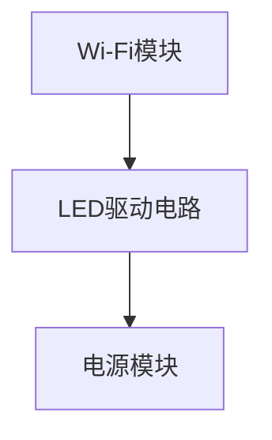
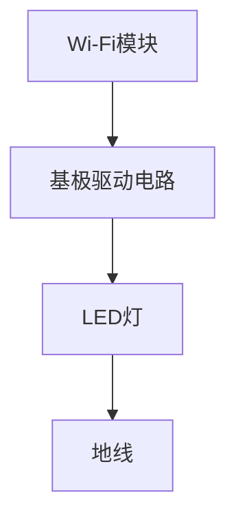
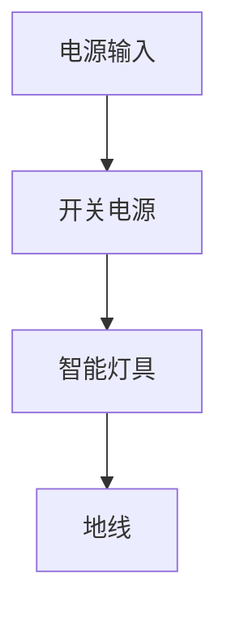

                 

### 智能家居控制系统：打造智能生活新体验

关键词：智能家居、物联网、传感器、控制技术、智能照明、智能安防、智能环境控制、系统开发、安全与隐私保护

摘要：随着科技的快速发展，智能家居已经成为现代家庭生活的标配。本文将系统地探讨智能家居控制系统的各个方面，从基础概念、核心技术到具体应用，再到系统开发与安全隐私保护，帮助读者全面了解智能家居系统的构建与实现。本文旨在为智能家居领域的研究者、开发者以及爱好者提供一份详尽的技术指南，助力打造更加智能、便捷、安全的家庭生活新体验。

### 目录大纲

#### 第一部分：智能家居系统基础

##### 第1章：智能家居概述
- 1.1 智能家居的发展背景与趋势
- 1.2 智能家居系统的组成与结构
- 1.3 智能家居与物联网的关系

##### 第2章：智能家居核心技术
- 2.1 传感器技术
- 2.2 通信技术
- 2.3 控制技术

##### 第3章：智能照明系统
- 3.1 照明控制系统概述
- 3.2 照明控制技术

##### 第4章：智能安防系统
- 4.1 智能安防系统概述
- 4.2 视频监控系统
- 4.3 家庭报警系统

##### 第5章：智能环境控制系统
- 5.1 智能环境控制系统概述
- 5.2 温度控制系统
- 5.3 湿度控制系统

#### 第二部分：智能家居控制系统应用

##### 第6章：智能家居系统开发基础
- 6.1 智能家居系统开发流程
- 6.2 开发工具与环境

##### 第7章：智能家居系统项目实战
- 7.1 实战项目概述
- 7.2 代码实现与解析

##### 第8章：智能家居系统安全与隐私保护
- 8.1 智能家居系统安全概述
- 8.2 数据安全与加密技术
- 8.3 用户隐私保护措施

#### 附录：智能家居系统参考资料
- A.1 相关技术标准与规范
- A.2 开发工具与资源

### 第一部分：智能家居系统基础

#### 第1章：智能家居概述

##### 1.1 智能家居的发展背景与趋势

智能家居，即智能家庭，是指通过物联网技术，将家庭中各种设备连接起来，实现智能化管理、自动化操作和远程控制的一种新型家庭生活方式。智能家居的概念并非突然出现，而是随着信息技术、传感器技术和通信技术的发展，逐渐演变而来的。

**智能家居的定义**

智能家居是指利用先进的计算机技术、网络通信技术、智能控制技术将家居设备联网，实现远程控制、自动化管理、节能环保等功能的一种居住环境。

**智能家居的演进过程**

1. **初级阶段（20世纪90年代）**：智能家居的雏形，主要是一些简单的家庭自动化设备，如灯光控制系统、空调控制系统等。
2. **发展阶段（21世纪初）**：随着互联网技术的发展，智能家居开始融入互联网元素，如网络摄像头、智能门锁等。
3. **成熟阶段（现在）**：物联网技术的普及，使得各种智能家居设备互联互通，形成一个完整的智能系统，实现了真正的智能家居生活。

**智能家居的应用场景**

1. **家庭安防**：智能监控、报警系统等，提高了家庭的安全性能。
2. **智能照明**：根据时间和场景自动调整灯光亮度，节省能源。
3. **智能家电**：智能冰箱、洗衣机、空调等，实现远程控制，提升生活便利性。
4. **智能环境控制**：智能调节温度、湿度等环境参数，提供舒适的生活环境。

##### 1.2 智能家居系统的组成与结构

智能家居系统由多个核心组件组成，这些组件相互协作，共同实现智能化的家庭生活。

**智能家居系统的核心组件**

1. **智能设备**：如智能灯泡、智能插座、智能窗帘等，是智能家居系统的末端执行单元。
2. **传感器**：如温度传感器、湿度传感器、光敏传感器等，用于感知环境变化。
3. **控制器**：如智能音箱、智能手机等，用于接收用户指令并控制智能设备。
4. **通信网络**：如Wi-Fi、蓝牙、ZigBee等，用于连接智能设备与控制器。

**智能家居的层级结构**

1. **设备层**：由各种智能设备组成，直接与用户交互。
2. **感知层**：由传感器组成，负责采集环境数据。
3. **网络层**：由通信网络组成，实现设备与控制器之间的数据传输。
4. **平台层**：由智能平台组成，负责数据处理和智能控制。
5. **应用层**：由各种应用组成，如智能家居APP，提供用户操作界面。

**智能家居系统的通信协议**

智能家居系统通常采用以下通信协议：

1. **Wi-Fi**：广泛用于连接智能设备，传输速度快，但功耗较高。
2. **蓝牙**：适用于短距离通信，功耗低，适用于智能家电等。
3. **ZigBee**：适用于低功耗、低速率的短距离通信，广泛应用于智能照明等。
4. **Z-Wave**：适用于家庭自动化领域，具有较好的网络覆盖性和稳定性。

##### 1.3 智能家居与物联网的关系

物联网（Internet of Things，IoT）是指将各种物体通过互联网连接起来，实现信息交换和通信的一种网络技术。智能家居是物联网应用的一个重要领域。

**物联网的基础知识**

1. **物联网的定义**：物联网是通过互联网将各种设备、物品连接起来，实现智能化管理和信息交互的一种网络。
2. **物联网的关键技术**：包括传感器技术、网络通信技术、数据处理技术等。
3. **物联网的应用领域**：包括智能家居、智能城市、智能医疗、智能农业等。

**物联网在智能家居中的应用**

1. **设备连接**：通过物联网技术，将各种智能设备连接起来，实现设备间的互联互通。
2. **远程控制**：通过物联网，用户可以在任何地点远程控制家中的智能设备。
3. **数据分析**：通过物联网，可以收集家庭环境数据，进行大数据分析，提供个性化服务。

**智能家居对物联网的促进作用**

1. **推动物联网技术的发展**：智能家居的普及，促进了物联网技术的应用和创新，推动了物联网技术的发展。
2. **丰富物联网应用场景**：智能家居为物联网提供了丰富的应用场景，如家庭安防、智能照明、智能家电等。
3. **提高物联网应用价值**：智能家居的普及，提高了物联网的应用价值，为物联网的商业模式创新提供了机会。

### 第二部分：智能家居核心技术

#### 第2章：智能家居核心技术

##### 2.1 传感器技术

传感器技术是智能家居系统的核心组成部分，用于感知环境变化，并将这些变化转换为电信号，供控制系统进行处理。

**传感器的工作原理**

传感器的基本工作原理是通过检测物理量的变化，将其转换为可处理的电信号。常见的物理量包括温度、湿度、光强、声音、压力等。

**传感器的类型与选型**

1. **温度传感器**：如热电偶、热敏电阻等，用于检测环境温度。
2. **湿度传感器**：如电容式湿度传感器、电阻式湿度传感器等，用于检测环境湿度。
3. **光敏传感器**：如光敏电阻、光电二极管等，用于检测光强。
4. **声音传感器**：如驻极体传声器、电容式传声器等，用于检测声音。
5. **压力传感器**：如压电式传感器、弹性体式传感器等，用于检测压力。

传感器的选型应考虑以下因素：

1. **测量范围**：传感器应能覆盖家庭环境的测量范围。
2. **精度**：传感器的精度直接影响系统的控制精度。
3. **稳定性**：传感器应具有良好的长期稳定性。
4. **功耗**：智能家居系统通常要求低功耗，因此传感器的功耗也是一个重要考虑因素。

**传感器的数据处理**

传感器的数据处理主要包括信号滤波、信号放大、信号转换等。

1. **信号滤波**：用于去除传感器信号中的噪声，提高信号的准确性。
2. **信号放大**：用于增强传感器信号的强度，以便于后续处理。
3. **信号转换**：将传感器信号转换为数字信号，便于计算机处理。

##### 2.2 通信技术

通信技术是智能家居系统的关键，它决定了各个智能设备之间的数据传输能力和稳定性。

**常见的通信协议**

1. **Wi-Fi**：是一种无线局域网通信协议，具有传输速度快、覆盖范围广的特点，但功耗较高。
2. **蓝牙**：是一种短距离无线通信协议，适用于智能家居中的一些短距离通信应用，如智能音箱、智能手环等。
3. **ZigBee**：是一种低功耗、低速率的无线通信协议，适用于智能家居中的短距离通信，如智能照明、智能家电等。
4. **Z-Wave**：是一种用于家庭自动化的无线通信协议，具有较好的网络覆盖性和稳定性。
5. **NFC**：是一种近距离无线通信协议，适用于智能家居中的身份验证和支付等应用。

**网络连接方式**

1. **有线连接**：如以太网、光纤等，具有传输速度快、稳定性高的特点，但部署复杂。
2. **无线连接**：如Wi-Fi、蓝牙、ZigBee等，具有部署简单、灵活的特点，但传输速度和稳定性相对有线连接较低。

**通信技术在智能家居中的应用**

1. **设备间的数据传输**：实现各个智能设备之间的数据交换和协同工作。
2. **远程控制**：通过互联网，实现用户对智能家居系统的远程监控和控制。
3. **数据采集**：收集智能家居系统中的各种数据，用于分析和优化系统性能。

##### 2.3 控制技术

控制技术是智能家居系统的核心，它决定了智能家居系统对环境变化的响应能力。

**控制算法的原理**

控制算法是智能家居系统的核心，用于根据传感器采集到的数据，对智能设备进行控制。

1. **开环控制**：不依赖于反馈，直接根据输入信号进行控制。优点是简单，缺点是控制精度较低。
2. **闭环控制**：依赖于反馈，通过不断调整控制信号，使系统达到预期目标。优点是控制精度高，缺点是复杂度较高。

**控制系统的设计**

控制系统设计主要包括以下几个步骤：

1. **需求分析**：明确系统控制的目标和要求。
2. **系统建模**：建立系统的数学模型，描述系统行为。
3. **控制器设计**：根据系统模型，设计控制器，选择合适的控制算法。
4. **系统仿真**：在虚拟环境中对控制系统进行仿真测试，验证控制效果。
5. **硬件实现**：根据控制器设计，实现控制系统硬件。

**控制技术在智能家居中的应用**

1. **环境控制**：如智能照明、智能温度控制、智能湿度控制等。
2. **设备控制**：如智能家电的开关控制、智能窗帘的升降控制等。
3. **安防控制**：如智能报警系统、智能监控等。

### 第三部分：智能家居控制系统应用

#### 第3章：智能照明系统

##### 3.1 照明控制系统概述

智能照明系统是智能家居系统中的一项重要应用，它通过智能化手段对家庭照明的亮度、颜色、开关等进行控制，实现照明环境的自动化调节。

**照明控制系统的组成**

1. **智能灯具**：包括智能灯泡、智能吸顶灯、智能吊灯等，是照明控制系统的末端设备。
2. **控制终端**：包括智能音箱、智能手机、智能控制器等，用于发送控制指令和接收反馈信息。
3. **通信网络**：连接智能灯具和控制终端，实现数据的传输和控制。
4. **电源管理**：对智能灯具的供电进行管理，确保系统稳定运行。

**照明控制系统的功能**

1. **自动开关灯**：根据环境光线强度和设定的时间自动开关灯具。
2. **调光控制**：根据需要调节灯具的亮度，提供舒适的光环境。
3. **场景切换**：根据不同的场景，预设不同的照明模式，如阅读模式、睡眠模式等。
4. **远程控制**：用户可以通过智能手机或其他控制终端，远程控制照明系统。

**照明控制系统的应用场景**

1. **家庭客厅**：根据不同的活动，如聚会、看电影等，切换不同的照明模式。
2. **卧室**：提供舒适的睡眠环境，自动调节光线亮度。
3. **厨房**：提供明亮的照明，便于烹饪。
4. **卫生间**：提供柔和的照明，营造舒适的环境。

##### 3.2 照明控制技术

**LED照明控制技术**

LED照明控制技术是智能照明系统的核心技术之一，它通过控制LED灯的亮度、颜色等参数，实现智能照明效果。

1. **PWM调光技术**：通过改变LED灯的占空比，实现亮度调节。优点是控制简单，缺点是亮度调节不连续。
2. **电流调光技术**：通过改变LED灯的驱动电流，实现亮度调节。优点是亮度调节连续，缺点是控制电路复杂。
3. **DC调光技术**：通过改变LED灯的直流电压，实现亮度调节。优点是亮度调节连续，控制电路简单。

**感应控制技术**

感应控制技术是通过检测环境光线或人体存在，自动控制照明系统的开关或亮度。

1. **光敏传感器控制**：根据环境光线强度，自动调整照明亮度。
2. **红外传感器控制**：检测人体红外辐射，实现照明系统的自动开关。

**调光控制技术**

调光控制技术是通过调节LED灯的亮度，实现不同的照明效果。

1. **线性调光**：通过线性调节LED灯的亮度，实现柔和的亮度变化。
2. **阶梯调光**：通过预设多个亮度值，实现阶梯式的亮度变化。

##### 3.3 照明控制系统案例

以下是一个简单的智能照明控制系统案例：

**系统需求**：实现家庭客厅的智能照明控制，包括自动开关灯、调光控制和场景切换功能。

**系统架构**：

1. **智能灯具**：使用LED智能灯泡，支持PWM调光和Wi-Fi通信。
2. **控制终端**：使用智能手机，通过智能家居APP进行控制。
3. **通信网络**：使用Wi-Fi连接智能灯具和控制终端。
4. **电源管理**：使用电源模块，为智能灯具提供稳定供电。

**实现步骤**：

1. **硬件连接**：将智能灯具接入电源，并通过Wi-Fi连接到家庭路由器。
2. **软件配置**：在智能手机上安装智能家居APP，添加智能灯具，配置智能场景。
3. **自动开关灯**：通过光敏传感器检测环境光线，自动控制灯具的开关。
4. **调光控制**：通过PWM调光技术，实现灯具的亮度调节。
5. **场景切换**：预设不同的照明模式，如阅读模式、会客模式等，根据需要切换。

通过以上步骤，可以实现家庭客厅的智能照明控制，提升生活品质。

### 第4章：智能安防系统

#### 4.1 智能安防系统概述

智能安防系统是智能家居系统中的一个重要组成部分，它通过现代信息技术、物联网技术和人工智能技术，实现对家庭环境的实时监控和智能报警，保障家庭安全。

**智能安防系统的组成**

智能安防系统主要由以下几个部分组成：

1. **视频监控系统**：用于实时监控家庭内部和周边环境。
2. **入侵报警系统**：包括门磁报警、窗磁报警、红外报警等，用于检测非法入侵。
3. **烟雾报警系统**：用于检测烟雾，及时发现火灾隐患。
4. **紧急按钮**：用于在紧急情况下报警求助。
5. **智能门锁**：用于控制家庭门的开关，保障家庭安全。

**智能安防系统的功能**

1. **实时监控**：通过视频监控系统，用户可以实时查看家庭内部和周边环境的情况。
2. **智能报警**：当检测到非法入侵或火灾等异常情况时，系统会自动报警，并通知用户。
3. **远程控制**：用户可以通过智能手机或其他控制终端，远程控制安防设备，如远程开关门锁、远程查看监控视频等。
4. **数据分析**：通过对监控数据的分析，系统可以识别异常行为，提供预警。

**智能安防系统的应用场景**

1. **家庭安防**：保护家庭成员的安全，防止非法入侵。
2. **商铺安防**：监控商铺内部和周边环境，防止盗窃。
3. **园区安防**：监控园区内部和周边环境，保障园区安全。
4. **办公室安防**：保护办公室内部和周边环境，防止盗窃和非法入侵。

#### 4.2 视频监控系统

视频监控系统是智能安防系统中的一个重要组成部分，通过视频监控设备实时捕捉家庭内部和周边环境的情况，提供实时监控和录像功能。

**视频监控系统的原理**

视频监控系统主要由以下几个部分组成：

1. **视频监控设备**：包括摄像头、录像机等，用于实时捕捉视频画面。
2. **存储设备**：用于存储视频监控数据。
3. **传输设备**：用于将视频监控数据传输到监控中心或用户终端。
4. **监控中心**：用于接收、处理和存储视频监控数据。

视频监控系统的工作原理如下：

1. **视频监控设备**：摄像头实时捕捉视频画面，将视频数据传输到录像机。
2. **录像机**：对视频数据进行分析和处理，存储到存储设备中。
3. **传输设备**：将视频监控数据传输到监控中心或用户终端，供用户查看。
4. **监控中心**：接收和处理视频监控数据，提供实时监控和录像查询功能。

**视频监控系统的组成**

1. **摄像头**：用于捕捉视频画面，常见的有红外摄像头、日夜转换摄像头等。
2. **录像机**：用于存储和处理视频数据，常见的有硬盘录像机（DVR）、网络录像机（NVR）等。
3. **存储设备**：用于存储视频监控数据，常见的有硬盘、存储卡等。
4. **传输设备**：用于将视频监控数据传输到监控中心或用户终端，常见的有网络传输、无线传输等。
5. **监控中心**：用于接收、处理和存储视频监控数据，常见的有监控室、安防中心等。

**视频监控系统的技术要点**

1. **视频清晰度**：视频监控系统的清晰度直接影响到监控效果，通常采用高清（HD）或超高清（UHD）技术。
2. **夜视功能**：红外摄像头可以实现夜间监控，但效果受光线影响。
3. **智能分析**：通过智能算法，视频监控系统可以识别异常行为，如入侵、火灾等，提供预警。
4. **存储容量**：视频监控数据需要大量的存储空间，系统应具备足够的存储容量。
5. **传输稳定性**：视频监控数据需要稳定传输，保证监控效果。

#### 4.3 家庭报警系统

家庭报警系统是智能安防系统的重要组成部分，通过传感器和报警设备，实现对家庭安全的实时监测和报警。

**报警系统的原理**

家庭报警系统主要由以下几个部分组成：

1. **传感器**：包括门窗传感器、红外传感器、烟雾传感器等，用于检测家庭环境。
2. **报警主机**：用于接收传感器信号，并发出报警信号。
3. **报警设备**：包括声光报警器、短信报警器、电话报警器等，用于发出报警信号。
4. **通信网络**：用于将报警信号传输到报警主机或用户终端。

家庭报警系统的工作原理如下：

1. **传感器**：当检测到非法入侵或火灾等异常情况时，传感器会将信号发送到报警主机。
2. **报警主机**：接收传感器信号，并触发报警设备发出报警信号。
3. **报警设备**：发出报警信号，通知用户。
4. **通信网络**：将报警信号传输到报警主机或用户终端，供用户查看和处理。

**报警系统的类型**

1. **门窗传感器**：用于检测门窗是否被非法打开，是家庭报警系统中最常见的传感器。
2. **红外传感器**：用于检测人体红外辐射，可以检测非法入侵。
3. **烟雾传感器**：用于检测烟雾浓度，可以及时发现火灾隐患。
4. **紧急按钮**：用于在紧急情况下报警求助。

**报警系统的应用场景**

1. **家庭安防**：防止非法入侵，保障家庭安全。
2. **商铺安防**：防止盗窃，保障商铺安全。
3. **办公室安防**：防止非法入侵，保障办公室安全。
4. **公共场所安防**：防止非法入侵，保障公共场所安全。

#### 第5章：智能环境控制系统

##### 5.1 智能环境控制系统概述

智能环境控制系统是智能家居系统中的一个重要组成部分，通过对家庭环境中的温度、湿度、空气质量等参数进行实时监测和控制，提供舒适、健康、节能的生活环境。

**智能环境控制系统的组成**

智能环境控制系统主要由以下几个部分组成：

1. **传感器**：包括温度传感器、湿度传感器、空气质量传感器等，用于实时监测环境参数。
2. **控制器**：包括智能空调、智能加湿器、智能空气净化器等，用于控制环境参数。
3. **通信网络**：用于连接传感器和控制器，实现数据的传输和控制。
4. **用户终端**：包括智能手机、智能音箱等，用于用户对环境系统的监控和操作。

**智能环境控制系统的功能**

1. **实时监测**：通过传感器实时监测家庭环境中的温度、湿度、空气质量等参数。
2. **自动调节**：根据环境参数的变化，自动调节空调、加湿器、空气净化器等设备，提供舒适的环境。
3. **远程控制**：用户可以通过智能手机、智能音箱等设备，远程控制环境系统，实现环境参数的调节。
4. **数据分析**：通过对环境参数的数据分析，提供环境健康报告，帮助用户了解家庭环境状况。

**智能环境控制系统的应用场景**

1. **家庭生活**：提供舒适、健康的生活环境，提升生活质量。
2. **办公室环境**：改善办公室环境，提高工作效率。
3. **酒店环境**：提供个性化的环境控制，提升入住体验。
4. **公共场所环境**：改善公共场所环境，提高舒适度和健康水平。

##### 5.2 温度控制系统

温度控制系统是智能环境控制系统的一个重要组成部分，通过智能调节家庭环境中的温度，提供舒适的室内环境。

**温度控制系统的原理**

温度控制系统主要由以下几个部分组成：

1. **温度传感器**：用于检测室内温度，将温度信号发送到控制器。
2. **控制器**：根据温度传感器反馈的温度信号，调节空调、暖气等设备的运行状态，实现温度的自动调节。
3. **空调、暖气设备**：用于调节室内温度，常见的有空调、暖气片等。

温度控制系统的工作原理如下：

1. **温度传感器**：检测室内温度，并将温度信号发送到控制器。
2. **控制器**：接收温度信号，并根据预设的温度值，调节空调、暖气等设备的运行状态，实现室内温度的自动调节。
3. **空调、暖气设备**：根据控制器的指令，调节室内温度。

**温度控制系统的类型**

1. **中央空调系统**：通过中央空调主机，将冷热水送入室内，实现温度控制。优点是温度控制效果好，缺点是安装复杂，成本较高。
2. **分体空调系统**：将室内机和室外机分开安装，通过制冷剂循环，实现室内温度控制。优点是安装简单，缺点是温度控制效果相对较差。
3. **暖气片系统**：通过热水或蒸汽，将热量传递给室内，实现室内温度控制。优点是温度控制效果好，缺点是安装复杂，成本较高。

**温度控制系统的实现方法**

1. **PID控制算法**：通过PID（比例-积分-微分）控制算法，实现温度的精确控制。PID控制算法的核心是控制器的参数调整，需要根据实际情况进行调试。
2. **模糊控制算法**：通过模糊控制算法，实现温度的近似控制。模糊控制算法不依赖于精确的数学模型，具有较强的鲁棒性。

**温度控制系统的应用案例**

以下是一个简单的温度控制系统应用案例：

**系统需求**：实现家庭客厅的智能温度控制，根据室外温度和室内温度的变化，自动调节空调温度。

**系统架构**：

1. **温度传感器**：用于检测室内温度，连接到控制器。
2. **控制器**：接收温度传感器信号，通过PID控制算法调节空调温度。
3. **空调设备**：根据控制器的指令，调节室内温度。

**实现步骤**：

1. **硬件连接**：将温度传感器连接到控制器，控制器连接到空调设备。
2. **软件配置**：在控制器上设置PID控制参数，设置温度调节阈值。
3. **系统调试**：根据实际环境，调整PID控制参数，使温度控制系统达到预期效果。

通过以上步骤，可以实现家庭客厅的智能温度控制，提供舒适的室内环境。

##### 5.3 湿度控制系统

湿度控制系统是智能环境控制系统的一个重要组成部分，通过智能调节家庭环境中的湿度，提供舒适、健康的生活环境。

**湿度控制系统的原理**

湿度控制系统主要由以下几个部分组成：

1. **湿度传感器**：用于检测室内湿度，将湿度信号发送到控制器。
2. **控制器**：根据湿度传感器反馈的湿度信号，调节加湿器、除湿器等设备的运行状态，实现湿度的自动调节。
3. **加湿器、除湿器设备**：用于调节室内湿度，常见的有超声波加湿器、冷凝式加湿器、除湿机等。

湿度控制系统的工作原理如下：

1. **湿度传感器**：检测室内湿度，并将湿度信号发送到控制器。
2. **控制器**：接收湿度传感器信号，并根据预设的湿度值，调节加湿器、除湿器等设备的运行状态，实现室内湿度的自动调节。
3. **加湿器、除湿器设备**：根据控制器的指令，调节室内湿度。

**湿度控制系统的类型**

1. **加湿器系统**：通过超声波加湿、蒸汽加湿等方式，增加室内湿度。优点是加湿效果好，缺点是能耗较高。
2. **除湿器系统**：通过制冷除湿、吸附除湿等方式，降低室内湿度。优点是除湿效果好，缺点是能耗较高。

**湿度控制系统的实现方法**

1. **PID控制算法**：通过PID（比例-积分-微分）控制算法，实现湿度的精确控制。PID控制算法的核心是控制器的参数调整，需要根据实际情况进行调试。
2. **模糊控制算法**：通过模糊控制算法，实现湿度的近似控制。模糊控制算法不依赖于精确的数学模型，具有较强的鲁棒性。

**湿度控制系统的应用案例**

以下是一个简单的湿度控制系统应用案例：

**系统需求**：实现家庭卧室的智能湿度控制，根据室外湿度变化和室内湿度要求，自动调节加湿器或除湿器。

**系统架构**：

1. **湿度传感器**：用于检测室内湿度，连接到控制器。
2. **控制器**：接收湿度传感器信号，通过PID控制算法调节加湿器或除湿器。
3. **加湿器、除湿器设备**：根据控制器的指令，调节室内湿度。

**实现步骤**：

1. **硬件连接**：将湿度传感器连接到控制器，控制器连接到加湿器或除湿器。
2. **软件配置**：在控制器上设置PID控制参数，设置湿度调节阈值。
3. **系统调试**：根据实际环境，调整PID控制参数，使湿度控制系统达到预期效果。

通过以上步骤，可以实现家庭卧室的智能湿度控制，提供舒适、健康的生活环境。

### 第三部分：智能家居系统开发与实践

#### 第6章：智能家居系统开发基础

##### 6.1 智能家居系统开发流程

智能家居系统的开发涉及多个环节，包括需求分析、系统设计、系统开发、系统测试等。以下将详细介绍智能家居系统开发的各个阶段。

**1. 需求分析**

需求分析是智能家居系统开发的第一步，主要任务是明确用户的需求和系统功能。具体步骤如下：

1. **访谈用户**：通过与用户面对面交流，了解用户对智能家居系统的期望和要求。
2. **问卷调查**：通过发放问卷，收集用户对智能家居系统的看法和建议。
3. **市场调研**：分析同类产品的功能、性能、价格等方面，为系统设计提供参考。

**2. 系统设计**

系统设计是智能家居系统开发的核心阶段，包括总体设计、详细设计等。具体步骤如下：

1. **总体设计**：确定系统的架构、模块划分、技术选型等。
2. **详细设计**：设计各个模块的具体实现方案，包括算法、接口、数据结构等。

**3. 系统开发**

系统开发是将设计阶段的设计方案转化为实际的软件和硬件系统。具体步骤如下：

1. **编码**：根据设计文档，编写系统代码。
2. **集成**：将各个模块的代码集成到一起，形成完整的系统。
3. **调试**：测试系统功能，修复存在的问题。

**4. 系统测试**

系统测试是确保智能家居系统质量的重要环节，包括单元测试、集成测试、系统测试等。具体步骤如下：

1. **单元测试**：对系统中的各个模块进行测试，确保模块功能正确。
2. **集成测试**：将各个模块集成到一起，测试系统的整体功能。
3. **系统测试**：在实际环境中运行系统，测试系统的稳定性、性能等。

##### 6.2 开发工具与环境

智能家居系统的开发需要使用多种工具和环境，以下介绍常用的开发工具和环境。

**1. 开发工具**

1. **集成开发环境（IDE）**：如Eclipse、Visual Studio等，提供代码编写、调试等功能。
2. **编程语言**：如Python、Java、C++等，根据项目需求选择合适的编程语言。
3. **版本控制工具**：如Git、SVN等，用于管理代码版本，确保开发进度。

**2. 开发环境**

1. **操作系统**：如Windows、Linux、macOS等，根据开发需求选择合适的操作系统。
2. **硬件设备**：如智能设备、传感器等，用于实际开发和测试。
3. **开发板**：如Arduino、Raspberry Pi等，用于快速搭建智能家居系统。

**3. 配置与管理**

1. **环境配置**：安装所需的开发工具和依赖库，配置开发环境。
2. **代码管理**：使用版本控制工具，管理代码版本和分支。
3. **项目管理**：使用项目管理工具，如Jira、Trello等，跟踪项目进度和任务。

### 第四部分：智能家居系统项目实战

#### 第7章：智能家居系统项目实战

##### 7.1 实战项目概述

在本章中，我们将介绍一个智能家居系统项目实战，该项目将实现一个简单的智能照明系统，包括智能灯具、智能手机控制终端和Wi-Fi通信网络。项目目标是通过智能手机远程控制智能灯具的开关和亮度，实现智能照明。

**项目背景**

随着智能家居概念的普及，智能照明系统成为智能家居中的一项重要应用。智能照明系统不仅可以提高生活质量，还能节约能源，减少环境污染。本项目的目标是通过构建一个简单的智能照明系统，展示智能家居系统的基本原理和实现方法。

**项目目标**

1. 实现智能灯具的Wi-Fi连接，使其能够接收智能手机的控制指令。
2. 实现智能灯具的亮度调节功能，根据用户需求自动调整灯光亮度。
3. 实现远程控制功能，用户可以通过智能手机远程操作智能灯具。

**项目实现步骤**

1. **硬件选型**：选择合适的智能灯具、Wi-Fi模块和电源模块。
2. **电路设计**：设计智能灯具的电路图，包括Wi-Fi模块和LED驱动电路。
3. **软件开发**：编写智能灯具的控制程序，实现亮度调节和远程控制功能。
4. **系统集成**：将智能灯具的硬件和软件集成到一起，实现智能照明系统。
5. **测试与优化**：对智能照明系统进行功能测试和性能优化。

##### 7.2 代码实现与解析

在本节中，我们将详细解析智能照明系统的代码实现，包括硬件电路设计、软件程序编写和通信协议等。

**1. 硬件电路设计**

智能灯具的硬件电路主要包括Wi-Fi模块、LED驱动电路和电源模块。以下是一个简单的电路设计示例：



**Wi-Fi模块**：选择具有Wi-Fi通信功能的模块，如ESP8266或ESP32。模块的GPIO接口用于连接LED驱动电路和电源模块。

**LED驱动电路**：使用NPN型晶体管作为LED驱动电路，通过控制晶体管的基极电压，实现LED的开关和亮度调节。以下是一个简单的LED驱动电路：



**电源模块**：为智能灯具提供稳定电源，可以使用线性电源或开关电源。以下是一个简单的电源电路：



**2. 软件程序编写**

智能灯具的软件程序主要负责接收Wi-Fi模块发送的控制指令，并根据指令控制LED灯的亮度和开关。以下是一个简单的C语言程序示例：

```c
#include <ESP8266WiFi.h>
#include <WiFiClient.h>

const char* ssid = "yourSSID";
const char* password = "yourPASSWORD";

void setup() {
  Serial.begin(115200);
  pinMode(LED_BUILTIN, OUTPUT);

  // 连接到Wi-Fi网络
  WiFi.begin(ssid, password);

  // 等待连接Wi-Fi网络
  while (WiFi.status() != WL_CONNECTED) {
    delay(500);
    Serial.print(".");
  }

  // 连接成功，打印连接信息
  Serial.println("");
  Serial.print("Connected to ");
  Serial.println(ssid);
  Serial.print("IP address: ");
  Serial.println(WiFi.localIP());

  // 启动Web服务器
  server.begin();
}

void loop() {
  // 检查Web服务器是否收到请求
  WiFiClient client = server.available();
  if (!client) {
    return;
  }

  // 读取客户端请求的URL
  String url = client.readStringUntil('\r');
  Serial.print("Request: ");
  Serial.println(url);

  // 处理URL请求
  if (url.indexOf("/on") >= 0) {
    digitalWrite(LED_BUILTIN, HIGH);
  } else if (url.indexOf("/off") >= 0) {
    digitalWrite(LED_BUILTIN, LOW);
  }

  // 发送HTTP响应
  client.println("HTTP/1.1 200 OK");
  client.println("Content-Type: text/html");
  client.println("Connection: close");
  client.println();
  client.println("<!DOCTYPE HTML><html>");
  client.println("<head><title>Smart Light</title></head>");
  client.println("<body>");
  client.println("<h1>Smart Light</h1>");
  client.println("<p><a href=\"/on\"><button>On</button></a></p>");
  client.println("<p><a href=\"/off\"><button>Off</button></a></p>");
  client.println("</body></html>");

  // 关闭客户端连接
  client.stop();
}
```

**3. 通信协议**

智能灯具与智能手机之间的通信协议采用HTTP协议。当智能手机发送请求到智能灯具时，智能灯具会根据请求的URL进行相应的操作。例如，当用户通过智能手机访问"http://192.168.1.100/on"时，智能灯具会开启LED灯；当访问"http://192.168.1.100/off"时，智能灯具会关闭LED灯。

**4. 代码解读与分析**

上述代码是一个简单的Web服务器程序，用于实现智能灯具的开关控制。程序首先连接到Wi-Fi网络，并启动Web服务器。在loop函数中，程序不断检查是否有客户端请求，并根据请求的URL进行相应的操作。

- **WiFi.begin(ssid, password);**：连接到Wi-Fi网络。
- **while (WiFi.status() != WL_CONNECTED);**：等待连接成功。
- **WiFi.localIP();**：获取智能灯具的IP地址。
- **server.begin();**：启动Web服务器。
- **client = server.available();**：检查是否有客户端请求。
- **String url = client.readStringUntil('\r');**：读取客户端请求的URL。
- **if (url.indexOf("/on") >= 0)**：判断URL是否为"/on"。
- **digitalWrite(LED_BUILTIN, HIGH);**：开启LED灯。
- **if (url.indexOf("/off") >= 0)**：判断URL是否为"/off"。
- **digitalWrite(LED_BUILTIN, LOW);**：关闭LED灯。

通过以上步骤，我们可以实现一个简单的智能照明系统，用户可以通过智能手机远程控制智能灯具的开关。

### 第8章：智能家居系统安全与隐私保护

##### 8.1 智能家居系统安全概述

随着智能家居的普及，人们对其安全性问题越来越关注。智能家居系统安全是指确保系统免受未授权访问、数据泄露、恶意攻击等威胁的能力。智能家居系统安全包括硬件安全、软件安全、数据安全等多个方面。

**系统安全的挑战**

1. **设备暴露**：智能家居设备通常连接到互联网，容易受到网络攻击。
2. **数据泄露**：智能家居系统涉及用户隐私数据，如家庭地址、生活习惯等，一旦泄露，可能对用户造成严重后果。
3. **软件漏洞**：智能家居系统软件可能存在漏洞，攻击者可以利用这些漏洞获取系统控制权。
4. **物理安全**：智能家居设备可能存在物理安全风险，如设备被盗、被篡改等。

**安全防护措施**

1. **设备加密**：使用加密算法，对智能家居设备进行加密，防止数据泄露。
2. **身份验证**：采用双因素身份验证，确保只有授权用户才能访问系统。
3. **防火墙**：部署防火墙，防止网络攻击。
4. **软件更新**：定期更新智能家居系统软件，修复漏洞，提高系统安全性。
5. **物理安全防护**：对智能家居设备进行物理安全防护，如设置密码锁、摄像头防护罩等。

##### 8.2 数据安全与加密技术

数据安全是智能家居系统安全的核心，加密技术是保障数据安全的重要手段。

**数据安全策略**

1. **数据加密传输**：在数据传输过程中使用加密算法，如AES、RSA等，确保数据在传输过程中不被窃取。
2. **数据加密存储**：对存储在设备或服务器中的数据进行加密，确保数据在存储过程中不被窃取。
3. **访问控制**：对数据访问进行权限管理，确保只有授权用户才能访问数据。

**加密技术原理**

1. **对称加密**：使用相同的密钥进行加密和解密，如AES。
2. **非对称加密**：使用不同的密钥进行加密和解密，如RSA。
3. **哈希算法**：用于生成数据摘要，如SHA-256。

**加密技术在智能家居中的应用**

1. **Wi-Fi安全**：使用WPA2或WPA3加密协议，确保Wi-Fi连接安全。
2. **数据传输加密**：在智能家居设备与服务器之间使用HTTPS协议，确保数据传输安全。
3. **存储加密**：对存储在智能家居设备中的数据进行加密，确保数据安全。

##### 8.3 用户隐私保护措施

用户隐私保护是智能家居系统安全的重要方面，关系到用户的个人隐私和安全。

**隐私政策制定**

1. **明确隐私政策**：在用户使用智能家居系统前，明确告知用户系统收集、使用和存储的数据类型和目的。
2. **用户同意**：在收集用户数据前，获取用户的明确同意。
3. **透明度**：对用户数据的收集、使用和存储进行透明化，让用户了解自己的数据是如何被使用的。

**用户数据管理**

1. **数据匿名化**：对用户数据进行匿名化处理，确保用户无法被识别。
2. **数据访问控制**：对用户数据的访问进行权限管理，确保只有授权用户才能访问。
3. **数据删除**：用户可以随时请求删除自己的数据，系统应提供便捷的数据删除功能。

**隐私保护实践案例**

1. **苹果智能家居**：苹果在智能家居系统中，采用严格的隐私保护措施，如数据加密传输、访问控制等。
2. **谷歌智能家居**：谷歌在智能家居系统中，明确告知用户数据收集和使用政策，并提供数据删除功能。

### 附录：智能家居系统参考资料

**A.1 相关技术标准与规范**

1. **IEEE 802.15.4**：无线通信标准，用于定义ZigBee等低功耗无线通信协议。
2. **Wi-Fi Alliance**：Wi-Fi联盟，负责制定Wi-Fi通信标准。
3. **HomeKit**：苹果公司的智能家居标准，用于确保设备兼容性。
4. **Z-Wave Alliance**：Z-Wave联盟，负责制定Z-Wave通信标准。

**A.2 开发工具与资源**

1. **Arduino**：开源硬件平台，用于智能家居系统开发。
2. **ESP8266**：Wi-Fi模块，适用于智能家居系统开发。
3. **ESP32**：Wi-Fi模块，适用于智能家居系统开发。
4. **Node.js**：开源JavaScript运行时环境，适用于智能家居系统开发。
5. **Python**：开源编程语言，适用于智能家居系统开发。
6. **Raspberry Pi**：开源硬件平台，适用于智能家居系统开发。
7. **HomeAssistant**：开源智能家居平台，用于集成和管理智能家居设备。
8. **IoT Platform**：各种物联网平台，如AWS IoT、Azure IoT等，提供设备管理、数据存储等功能。

### 结束语

智能家居系统是现代家庭生活的重要组成部分，通过物联网技术，实现了家庭设备的互联互通和智能化控制。本文系统地介绍了智能家居系统的概述、核心技术、应用案例、安全与隐私保护等内容，旨在为智能家居领域的研究者、开发者以及爱好者提供一份详尽的技术指南。随着技术的不断进步，智能家居系统将不断发展和完善，为人类带来更加智能、便捷、安全的生活体验。

### 作者信息

**作者：AI天才研究院/AI Genius Institute & 禅与计算机程序设计艺术 /Zen And The Art of Computer Programming**

### 附录

**A.1 相关技术标准与规范**

1. **IEEE 802.15.4**：无线通信标准，用于定义ZigBee等低功耗无线通信协议。
2. **Wi-Fi Alliance**：Wi-Fi联盟，负责制定Wi-Fi通信标准。
3. **HomeKit**：苹果公司的智能家居标准，用于确保设备兼容性。
4. **Z-Wave Alliance**：Z-Wave联盟，负责制定Z-Wave通信标准。

**A.2 开发工具与资源**

1. **Arduino**：开源硬件平台，用于智能家居系统开发。
2. **ESP8266**：Wi-Fi模块，适用于智能家居系统开发。
3. **ESP32**：Wi-Fi模块，适用于智能家居系统开发。
4. **Node.js**：开源JavaScript运行时环境，适用于智能家居系统开发。
5. **Python**：开源编程语言，适用于智能家居系统开发。
6. **Raspberry Pi**：开源硬件平台，适用于智能家居系统开发。
7. **HomeAssistant**：开源智能家居平台，用于集成和管理智能家居设备。
8. **IoT Platform**：各种物联网平台，如AWS IoT、Azure IoT等，提供设备管理、数据存储等功能。

