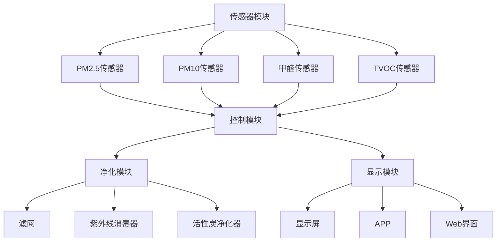

                 

### 第1章：智能空气净化技术概述

#### 1.1 智能空气净化技术的定义

智能空气净化技术是指利用先进的人工智能算法和传感器技术，对室内空气质量进行实时检测和净化，从而改善室内环境的技术。这一技术不仅仅局限于传统的空气净化，它通过智能化手段，根据室内空气质量的变化，动态调整净化策略，实现对空气中有害物质的精准控制。

#### 1.2 智能空气净化技术的重要性

随着城市化进程的加快和室内装修材料的普及，室内空气质量问题愈发突出。根据世界卫生组织（WHO）的数据，室内空气污染已经成为全球范围内的主要健康威胁之一。智能空气净化技术能够实时监测室内空气中的有害物质，如PM2.5、甲醛、苯、TVOC等，并迅速进行净化处理，降低室内空气污染水平，改善人们的生活和工作环境。这对于减少呼吸系统疾病、提升生活品质具有重要作用。

#### 1.3 智能空气净化技术的发展历程

智能空气净化技术起源于20世纪末，最初以传统空气净化器为基础，通过增加传感器和简单的人工智能算法进行空气质量的实时监测。进入21世纪，随着人工智能技术的快速发展，智能空气净化技术逐渐走向智能化和个性化。以下是其发展历程的几个关键阶段：

- **第一阶段（20世纪末）：** 传统空气净化器通过物理过滤和化学吸附进行空气净化，但缺乏智能化控制。

- **第二阶段（21世纪初）：** 增加了传感器，能够实时监测空气质量，并通过简单的算法对数据进行处理，实现基本自动化控制。

- **第三阶段（21世纪10年代至今）：** 结合深度学习和大数据分析技术，实现智能化的空气质量预测和净化策略调整，使空气净化系统更加高效和精准。

#### 1.4 智能空气净化技术的主要类型

智能空气净化技术主要可以分为以下几类：

- **传感器技术：** 利用各种传感器实时监测室内空气质量，如PM2.5传感器、甲醛传感器、TVOC传感器等。

- **过滤技术：** 通过物理过滤网捕捉空气中的颗粒物，如PM2.5、PM10等。

- **消毒技术：** 利用紫外线、臭氧等手段杀灭空气中的细菌、病毒和其他微生物。

- **净化技术：** 通过化学反应或电离等方式分解或吸附空气中的有害物质，如甲醛、苯等。

智能空气净化技术的核心在于将上述几种技术集成在一起，并通过人工智能算法进行智能化控制，从而实现更高效、更精准的空气净化效果。

### 第2章：室内空气质量检测

#### 2.1 室内空气质量检测的重要性

室内空气质量检测是智能空气净化系统的关键组成部分，它直接关系到空气净化效果的好坏。随着人们对健康生活质量的追求，室内空气质量检测的重要性日益凸显。以下是室内空气质量检测的几个关键点：

1. **健康影响：** 室内空气质量对人体的健康有着直接的影响。长期暴露于有害物质中，如甲醛、苯、PM2.5等，可能会导致呼吸系统疾病、心血管疾病等多种健康问题。

2. **舒适度：** 良好的室内空气质量能够提升居住和工作的舒适度。当室内空气质量不佳时，人会感到不适，影响工作效率和生活质量。

3. **法规要求：** 许多国家和地区已经制定了相关的室内空气质量标准，要求建筑物必须定期进行空气质量检测。

4. **环境监测：** 室内空气质量检测也是环境保护的重要环节。通过检测，可以了解室内空气污染的来源和程度，为制定有效的空气净化策略提供依据。

#### 2.2 室内空气质量检测的方法

室内空气质量检测的方法多种多样，每种方法都有其特定的应用场景和优势。以下是几种常用的检测方法：

- **化学传感器检测：** 化学传感器可以直接检测空气中的有害气体，如甲醛、苯、TVOC等。这类传感器通过化学作用将有害气体转化为可测量的信号，具有高灵敏度和快速响应的特点。

- **光学传感器检测：** 光学传感器利用光吸收、散射等原理检测空气中的颗粒物。常见的如PM2.5、PM10传感器，通过测量光信号的衰减或变化来计算颗粒物的浓度。

- **生物传感器检测：** 生物传感器利用生物分子间的特异性相互作用检测空气中的微生物和病毒。这类传感器具有高选择性和高灵敏度，但通常对环境条件要求较高。

以下是各种检测方法的具体说明：

##### 2.2.1 化学传感器检测

化学传感器检测通过将空气中的有害气体与传感器材料发生化学反应，从而产生可测量的信号。常见的化学传感器有半导体传感器、电化学传感器等。

- **半导体传感器：** 半导体传感器的核心是半导体材料，如金属氧化物。当有害气体与半导体材料接触时，其电导率发生变化，通过测量电导率的变化可以确定气体浓度。
  ```mermaid
  flowchart LR
  A[半导体材料] --> B[有害气体接触];
  B --> C[电导率变化];
  C --> D[信号输出];
  ```
- **电化学传感器：** 电化学传感器通过电极反应来检测气体。当有害气体与电极反应时，会导致电极电位的改变，通过测量电极电位的变化来确定气体浓度。

##### 2.2.2 光学传感器检测

光学传感器检测通过测量光信号的衰减或散射来确定颗粒物的浓度。常见的光学传感器有散射式颗粒物传感器和吸收式颗粒物传感器。

- **散射式颗粒物传感器：** 当光束通过含有颗粒物的空气时，颗粒物会导致光束发生散射，通过测量散射光的强度可以确定颗粒物的浓度。
  ```mermaid
  flowchart LR
  A[光束] --> B[通过空气];
  B --> C[散射光];
  C --> D[光强度变化];
  D --> E[颗粒物浓度];
  ```

- **吸收式颗粒物传感器：** 当颗粒物通过光束时，会吸收部分光能，通过测量光吸收的强度来确定颗粒物的浓度。

##### 2.2.3 生物传感器检测

生物传感器检测利用生物分子间的特异性相互作用来检测空气中的微生物和病毒。常见的生物传感器有酶电极传感器、微生物传感器等。

- **酶电极传感器：** 酶电极传感器利用特定的酶与微生物或病毒发生反应，产生可测量的电信号。
  ```mermaid
  flowchart LR
  A[酶] --> B[微生物/病毒];
  B --> C[反应];
  C --> D[电信号输出];
  ```

- **微生物传感器：** 微生物传感器利用微生物与目标生物分子之间的特异性相互作用来检测微生物。通过测量微生物的代谢活动或生物信号变化来确定微生物的存在。

#### 2.3 室内空气质量检测案例分析

以下是一个室内空气质量检测的案例分析，以某商业办公楼为例：

**案例背景：** 某商业办公楼位于市中心，由于周边交通繁忙和办公楼内部人员密集，室内空气质量问题严重。办公室员工经常感到头晕、乏力，呼吸道不适。管理层决定对办公楼的室内空气质量进行检测，以找出污染源并采取相应的净化措施。

**检测步骤：**

1. **选择检测设备：** 根据办公楼的环境特点，选择了多种传感器设备，包括PM2.5传感器、甲醛传感器、TVOC传感器等。

2. **布设检测点：** 在办公楼的各个角落布置传感器设备，包括办公区、会议室、走廊等，确保检测覆盖全面。

3. **数据采集：** 传感器设备开始运行，实时采集室内空气质量数据，并将数据传输到中央控制系统进行分析。

4. **数据分析：** 通过数据分析，发现PM2.5和甲醛浓度普遍较高，特别是在办公区和会议室。

5. **污染源定位：** 进一步分析发现，污染源主要来自外部空气和办公设备。

**检测结果：**

- **PM2.5浓度：** 平均值为80μg/m³，高于世界卫生组织建议的年均值10μg/m³。
- **甲醛浓度：** 平均值为0.15mg/m³，高于国家室内空气质量标准限值0.08mg/m³。
- **TVOC浓度：** 平均值为0.5mg/m³，超出正常范围。

**解决方案：**

1. **增加空气净化设备：** 在办公区、会议室等关键区域增加智能空气净化设备，以降低室内空气污染。

2. **加强通风：** 定期进行室内通风，特别是人员密集的时段，以降低室内空气污染。

3. **定期检测：** 定期对室内空气质量进行检测，确保空气质量达到标准。

**效果评估：** 通过上述措施，室内空气质量得到了显著改善，PM2.5浓度降至50μg/m³以下，甲醛浓度降至0.08mg/m³以下，TVOC浓度降至0.2mg/m³以下。员工的健康状况得到了明显改善，工作效率也有所提高。

### 第3章：智能空气净化系统架构设计

#### 3.1 智能空气净化系统的基本组成

智能空气净化系统是一个复杂的多层次架构，其基本组成包括传感器模块、控制模块、净化模块和显示模块。以下是对各个模块的详细说明：

- **传感器模块：** 负责实时监测室内空气质量，包括PM2.5、PM10、甲醛、苯、TVOC等有害物质的浓度。传感器模块通常由多个传感器组成，每个传感器监测不同的污染物。

  ```mermaid
  graph TB
  A[传感器模块] --> B[PM2.5传感器];
  A --> C[PM10传感器];
  A --> D[甲醛传感器];
  A --> E[苯传感器];
  A --> F[TVOC传感器];
  ```

- **控制模块：** 负责根据传感器模块采集的数据进行实时分析和处理，并根据空气质量的变化自动调节净化设备的运行状态。控制模块通常包括微控制器、处理器、算法库等。

  ```mermaid
  graph TB
  G[控制模块] --> H[微控制器];
  G --> I[处理器];
  G --> J[算法库];
  ```

- **净化模块：** 负责对室内空气进行净化处理，包括过滤、消毒和净化等功能。净化模块通常由多个净化设备组成，如滤网、紫外线消毒器、活性炭净化器等。

  ```mermaid
  graph TB
  K[净化模块] --> L[滤网];
  K --> M[紫外线消毒器];
  K --> N[活性炭净化器];
  ```

- **显示模块：** 负责将室内空气质量数据和控制状态以直观的方式展示给用户，通常包括显示屏、APP、Web界面等。

  ```mermaid
  graph TB
  O[显示模块] --> P[显示屏];
  O --> Q[APP];
  O --> R[Web界面];
  ```

#### 3.2 智能空气净化系统架构设计原则

智能空气净化系统的架构设计需要遵循以下原则，以确保系统的稳定性和高效性：

- **模块化设计：** 系统应采用模块化设计，各个模块功能明确，易于维护和升级。模块化设计有助于提高系统的可扩展性和灵活性。

- **实时性：** 系统应具有高实时性，能够快速响应室内空气质量变化，及时调整净化设备的状态。

- **智能化：** 系统应具备智能化控制能力，通过机器学习算法和大数据分析，实现对空气质量的自适应调节。

- **高效性：** 系统应具有较高的净化效率，能够在短时间内净化室内空气，达到良好的空气质量。

- **易用性：** 系统应具备良好的用户体验，通过直观的界面和简单的操作，让用户轻松掌握系统的使用方法。

#### 3.3 智能空气净化系统架构设计案例

以下是一个典型的智能空气净化系统架构设计案例：

**案例背景：** 某高档写字楼为了提高室内空气质量，决定安装一套智能空气净化系统。该系统需要实现对办公区、会议室、走廊等不同区域的空气质量监测和净化控制。

**系统设计：**

1. **传感器模块：** 在办公区、会议室和走廊等关键区域安装PM2.5传感器、甲醛传感器、TVOC传感器等，实时监测室内空气质量。

2. **控制模块：** 采用高性能微控制器和处理器，通过机器学习算法和大数据分析技术，对传感器数据进行分析和处理，实现智能化控制。

3. **净化模块：** 根据不同区域的空气质量特点，配置滤网、紫外线消毒器、活性炭净化器等净化设备，确保高效净化室内空气。

4. **显示模块：** 通过显示屏、APP和Web界面，向用户展示室内空气质量数据和控制状态，方便用户随时了解和控制系统。

**系统架构图：**



**系统功能：**

- **实时监测：** 系统可以实时监测室内空气质量，并通过APP和Web界面实时更新数据。

- **自动调节：** 系统根据实时监测的数据，自动调整净化设备的运行状态，确保空气质量达到最优。

- **手动控制：** 用户可以通过APP和Web界面手动控制净化设备的开关和运行模式。

- **报警提示：** 当室内空气质量低于预设标准时，系统会自动报警，提醒用户采取相应措施。

通过这个案例，我们可以看到智能空气净化系统如何通过合理的架构设计，实现对室内空气质量的精准控制，为用户提供一个健康、舒适的生活和工作环境。

### 第4章：空气净化技术原理与算法

#### 4.1 空气净化技术原理

空气净化技术主要依赖于以下几种原理：过滤技术、消毒技术和净化技术。每种技术都有其特定的应用场景和优势。

##### 4.1.1 过滤技术

过滤技术是空气净化系统中最常用的方法之一，主要通过物理过滤网捕捉空气中的颗粒物，如PM2.5、PM10等。以下是几种常见的过滤技术：

1. **机械过滤：** 机械过滤主要依靠过滤网的孔径大小来捕捉颗粒物。常见的机械过滤器包括布袋过滤器、纸质过滤器等。

   ```mermaid
   graph TB
   A[空气] --> B[过滤网];
   B --> C[颗粒物捕捉];
   C --> D[净化空气];
   ```

2. **静电过滤：** 静电过滤利用电场将空气中的颗粒物电离，使其带上电荷，然后通过电场力将颗粒物吸附在带电的集尘板上。

   ```mermaid
   graph TB
   A[空气] --> B[电离];
   B --> C[电荷];
   C --> D[电场力吸附];
   D --> E[净化空气];
   ```

3. **深度过滤：** 深度过滤是一种多层复合过滤技术，通过不同材质和孔径的过滤材料，实现高效的颗粒物捕捉。常见的深度过滤材料包括活性炭、HEPA滤网等。

   ```mermaid
   graph TB
   A[空气] --> B[多层过滤材料];
   B --> C[颗粒物捕捉];
   C --> D[净化空气];
   ```

##### 4.1.2 消毒技术

消毒技术主要用于杀灭空气中的细菌、病毒和其他微生物。常见的消毒技术包括紫外线消毒、臭氧消毒和光触媒消毒。

1. **紫外线消毒：** 紫外线消毒利用紫外线光照射空气中的微生物，破坏其DNA和RNA结构，从而达到杀菌效果。

   ```mermaid
   graph TB
   A[空气] --> B[紫外线照射];
   B --> C[微生物];
   C --> D[破坏DNA/RNA];
   D --> E[杀菌];
   ```

2. **臭氧消毒：** 臭氧消毒利用臭氧的强氧化性，将空气中的细菌、病毒和其他有机物质氧化分解，从而达到消毒效果。

   ```mermaid
   graph TB
   A[空气] --> B[臭氧生成];
   B --> C[氧化反应];
   C --> D[分解有机物];
   D --> E[消毒];
   ```

3. **光触媒消毒：** 光触媒消毒利用光催化剂在紫外线或可见光的照射下产生活性氧族，杀灭空气中的细菌和病毒。

   ```mermaid
   graph TB
   A[空气] --> B[光催化剂];
   B --> C[紫外线/可见光照射];
   C --> D[活性氧族生成];
   D --> E[杀灭细菌/病毒];
   ```

##### 4.1.3 净化技术

净化技术主要通过化学反应或电离等方式分解或吸附空气中的有害物质，如甲醛、苯等。

1. **化学反应净化：** 化学反应净化利用催化剂将空气中的有害物质分解成无害物质。常见的催化剂包括二氧化钛（TiO₂）、光触媒等。

   ```mermaid
   graph TB
   A[空气] --> B[催化剂];
   B --> C[化学反应];
   C --> D[分解有害物质];
   D --> E[净化空气];
   ```

2. **电离净化：** 电离净化利用电场将空气中的分子电离，使其带上电荷，然后通过电场力将带电的分子捕捉和分解。

   ```mermaid
   graph TB
   A[空气] --> B[电离];
   B --> C[电荷];
   C --> D[电场力];
   D --> E[分解有害物质];
   ```

#### 4.2 智能空气净化算法原理

智能空气净化系统不仅仅依赖于上述的物理和化学技术，还需要借助人工智能算法来提高净化效果和系统的智能化水平。以下是智能空气净化算法的主要原理：

##### 4.2.1 数据采集与处理

智能空气净化系统首先需要通过传感器采集室内空气质量数据，包括PM2.5、PM10、甲醛、苯、TVOC等污染物的浓度。采集到的数据通常包含噪声和误差，因此需要进行预处理，以提高数据的质量和可靠性。预处理步骤包括数据滤波、去噪、归一化等。

伪代码：

```python
# 数据采集与预处理
def preprocess_data(sensor_data):
    # 数据滤波
    filtered_data = low_pass_filter(sensor_data)
    # 去噪
    denoised_data = noise_removal(filtered_data)
    # 归一化
    normalized_data = normalize(denoised_data)
    return normalized_data
```

##### 4.2.2 机器学习算法应用

机器学习算法在智能空气净化系统中有着广泛的应用，可以用于空气质量预测、异常检测、模式识别等。以下是机器学习算法在空气净化系统中的几个关键应用：

1. **空气质量预测：** 通过历史空气质量数据和气象数据，利用回归算法或时间序列分析算法，预测未来的空气质量变化。

   ```python
   # 空气质量预测
   def predict_air_quality(features, model):
       prediction = model.predict(features)
       return prediction
   ```

2. **异常检测：** 利用监督学习或无监督学习算法，检测空气质量数据中的异常值，及时发现污染事件。

   ```python
   # 异常检测
   def detect_anomalies(data, model):
       anomalies = model.predict(data)
       return anomalies
   ```

3. **模式识别：** 通过深度学习算法，如卷积神经网络（CNN）或循环神经网络（RNN），识别空气质量变化的规律和趋势。

   ```python
   # 模式识别
   def recognize_patterns(data, model):
       patterns = model.predict(data)
       return patterns
   ```

##### 4.2.3 智能控制算法应用

智能控制算法是智能空气净化系统的核心，它根据传感器采集的空气质量数据和机器学习算法预测的结果，自动调整净化设备的运行状态，以实现最优的空气净化效果。以下是智能控制算法的主要原理：

1. **自适应调节：** 根据空气质量的变化，自动调整净化设备的运行模式，如开启或关闭滤网、紫外线消毒器等。

   ```python
   # 自适应调节
   def adaptive_control(air_quality, settings):
       if air_quality > threshold:
           settings['filter_on'] = True
           settings['uv_on'] = True
       else:
           settings['filter_on'] = False
           settings['uv_on'] = False
       return settings
   ```

2. **节能优化：** 通过优化算法，实现空气净化系统的节能运行。例如，在空气质量良好时，降低净化设备的功率，节省能源。

   ```python
   # 节能优化
   def optimize_energy_usage(air_quality, settings):
       if air_quality < optimal_threshold:
           settings['power_level'] = low
       else:
           settings['power_level'] = high
       return settings
   ```

3. **预测性维护：** 通过对设备运行数据的分析，预测设备的故障风险，提前进行维护，避免突发故障。

   ```python
   # 预测性维护
   def predict_failure(running_data, model):
       failure_probability = model.predict(running_data)
       if failure_probability > threshold:
           schedule_maintenance()
   ```

通过上述的算法应用，智能空气净化系统能够根据室内空气质量的变化，动态调整净化策略，实现高效的空气净化效果。

### 第5章：智能空气净化系统实现与优化

#### 5.1 智能空气净化系统的实现流程

智能空气净化系统的实现涉及多个环节，包括系统设计、硬件选型、软件编写、测试和部署等。以下是智能空气净化系统实现的主要流程：

##### 5.1.1 系统设计

系统设计是智能空气净化系统的第一步，它决定了系统的整体架构和功能。系统设计包括以下步骤：

1. **需求分析：** 明确系统的功能需求和技术指标，如空气质量监测范围、监测精度、净化效果等。
2. **架构设计：** 根据需求分析结果，设计系统的总体架构，包括传感器模块、控制模块、净化模块和显示模块等。
3. **硬件选型：** 根据架构设计要求，选择合适的硬件设备，包括传感器、处理器、电源等。
4. **软件架构：** 设计软件系统的架构，包括前端显示界面、后端数据处理和分析模块等。

##### 5.1.2 硬件选型

硬件选型是智能空气净化系统实现的重要环节，选择合适的硬件设备可以确保系统的稳定性和性能。以下是硬件选型的关键点：

1. **传感器选型：** 根据监测需求，选择适用于室内空气质量检测的传感器，如PM2.5传感器、甲醛传感器等。确保传感器的灵敏度和精度满足要求。
2. **处理器选型：** 选择具备高性能计算能力的处理器，以支持复杂的算法运算和实时数据处理。
3. **电源选型：** 选择稳定可靠的电源，确保系统长时间运行，特别是在无人看管的环境下。
4. **通信模块选型：** 根据系统需求，选择合适的通信模块，如Wi-Fi、蓝牙、ZigBee等，以实现远程监控和控制。

##### 5.1.3 软件编写

软件编写是智能空气净化系统实现的核心部分，包括前端显示界面和后端数据处理模块的开发。以下是软件编写的关键步骤：

1. **前端开发：** 设计用户友好的前端界面，使用户可以直观地查看空气质量数据和系统状态。常用的前端框架包括React、Vue等。
2. **后端开发：** 编写后端数据处理和分析模块，包括数据采集、预处理、存储、分析和智能控制等。常用的后端框架包括Spring Boot、Django等。
3. **算法实现：** 实现智能算法，如空气质量预测、异常检测和自适应调节等，使用Python、C++等编程语言，结合机器学习库如Scikit-learn、TensorFlow等。

##### 5.1.4 测试

系统测试是确保智能空气净化系统稳定可靠的重要环节。以下是系统测试的关键步骤：

1. **单元测试：** 对系统的各个模块进行独立测试，确保每个模块的功能正确无误。
2. **集成测试：** 对系统的整体功能进行测试，确保各个模块之间能够协同工作。
3. **性能测试：** 对系统的性能进行测试，包括响应速度、数据处理能力和稳定性等。
4. **可靠性测试：** 对系统进行长时间运行测试，模拟实际使用环境，确保系统能够在各种情况下稳定运行。

##### 5.1.5 部署

系统部署是将开发完成的智能空气净化系统部署到实际环境中，使其能够正常运行。以下是系统部署的关键步骤：

1. **硬件安装：** 将传感器、处理器和通信模块等硬件设备安装到指定位置，确保传感器能够覆盖需要监测的区域。
2. **软件安装：** 安装前端显示界面和后端数据处理软件，确保系统软件能够正常运行。
3. **配置设置：** 根据实际需求，配置系统的各项参数，包括传感器校准、通信设置、控制策略等。
4. **上线运行：** 将系统上线，进行实际运行，监控系统的运行状态，并根据实际情况进行优化调整。

#### 5.2 智能空气净化系统的优化策略

智能空气净化系统的优化目标是提高空气净化效果和系统的稳定性，同时降低能耗和维护成本。以下是智能空气净化系统的优化策略：

##### 5.2.1 硬件优化

1. **传感器优化：** 选择更高精度、更稳定的传感器，提高空气质量监测的准确性。
2. **处理器优化：** 更换更高性能的处理器，提高系统的计算能力和响应速度。
3. **通信模块优化：** 选择更稳定、更快速的通信模块，确保数据传输的实时性和可靠性。
4. **电源优化：** 使用更高效的电源，减少能源消耗，延长设备使用寿命。

##### 5.2.2 软件优化

1. **算法优化：** 优化机器学习算法和智能控制算法，提高空气质量预测的准确性和控制策略的适应性。
2. **数据处理优化：** 优化数据处理流程，提高数据处理效率和准确性。
3. **界面优化：** 优化前端界面设计，提高用户体验，确保用户能够方便地操作和管理系统。
4. **系统稳定性优化：** 通过冗余设计和故障检测机制，提高系统的稳定性和可靠性。

##### 5.2.3 系统调试

系统调试是确保智能空气净化系统正常运行的重要环节。以下是系统调试的关键步骤：

1. **功能调试：** 验证系统的各项功能是否正确实现，确保系统能够按预期工作。
2. **性能调试：** 调整系统参数，优化性能，确保系统能够高效稳定地运行。
3. **兼容性调试：** 检查系统在不同硬件、软件环境下的兼容性，确保系统能够在不同环境下正常运行。
4. **稳定性调试：** 进行长时间运行测试，验证系统的稳定性，确保系统能够在各种情况下持续稳定运行。

#### 5.3 智能空气净化系统优化案例分析

以下是一个智能空气净化系统优化的案例，以某办公楼为例：

**案例背景：** 某办公楼由于室内空气质量问题，导致员工工作效率低下，健康问题频发。为改善室内空气质量，该办公楼决定对其智能空气净化系统进行优化。

**优化前状况：**

- **传感器精度：** 传感器精度较低，空气质量监测数据不稳定。
- **处理器性能：** 处理器性能不足，导致数据处理速度慢，响应不及时。
- **通信模块：** 通信模块不稳定，导致数据传输中断。
- **控制算法：** 控制算法简单，无法根据空气质量变化进行自适应调节。

**优化措施：**

1. **传感器升级：** 更换高精度、高稳定性的传感器，提高空气质量监测的准确性。
2. **处理器升级：** 更换高性能处理器，提高系统的计算能力和数据处理速度。
3. **通信模块升级：** 更换更稳定、更快速的通信模块，确保数据传输的实时性和可靠性。
4. **算法优化：** 引入先进的机器学习算法和智能控制算法，提高空气质量预测的准确性和控制策略的适应性。

**优化后效果：**

- **传感器精度：** 传感器精度提高，空气质量监测数据更加稳定准确。
- **处理器性能：** 处理器性能提升，系统响应速度明显加快。
- **通信模块：** 通信模块稳定性增强，数据传输中断现象消失。
- **控制算法：** 控制算法优化后，系统能够根据空气质量变化进行自适应调节，实现高效稳定的空气净化。

通过上述优化措施，该办公楼的室内空气质量得到了显著改善，员工的工作效率和健康状况也得到了明显提升。

### 第6章：智能空气净化项目案例研究

#### 6.1 案例背景与目标

**案例背景：** 某大型商业综合体位于市中心，由于地理位置和周边环境的影响，室内空气质量经常受到污染。为了改善室内空气质量，提升顾客和员工的生活品质，该商业综合体决定实施一套智能空气净化项目。

**目标：** 
1. 实时监测室内空气质量，包括PM2.5、甲醛、TVOC等污染物。
2. 通过智能控制技术，自动调节空气净化设备的工作状态，实现高效空气净化。
3. 提高室内空气质量，降低室内空气污染对顾客和员工的健康影响。
4. 降低空气净化系统的能耗和维护成本。

#### 6.2 项目实施过程

**6.2.1 系统设计**

在项目实施前，项目团队首先进行了详细的系统设计。系统设计包括以下几个方面：

1. **需求分析：** 明确项目需求，包括监测范围、数据精度、系统响应速度等。
2. **架构设计：** 确定系统架构，包括传感器模块、控制模块、净化模块和显示模块等。
3. **硬件选型：** 选择适合的硬件设备，包括高精度传感器、高性能处理器、稳定通信模块等。
4. **软件架构：** 设计软件系统架构，包括前端显示界面、后端数据处理和分析模块等。

**6.2.2 系统开发**

系统开发是项目实施的核心环节。项目团队按照系统设计文档进行软件开发，主要包括以下步骤：

1. **前端开发：** 开发用户友好的前端界面，用户可以通过界面实时查看室内空气质量数据和系统状态。
2. **后端开发：** 编写后端数据处理和分析模块，实现空气质量数据的采集、处理、存储和智能控制等功能。
3. **算法实现：** 实现机器学习算法和智能控制算法，包括空气质量预测、异常检测和自适应调节等。

**6.2.3 系统测试**

系统测试是确保系统稳定性和功能完整性的重要环节。项目团队进行了以下测试：

1. **单元测试：** 对系统的各个模块进行独立测试，确保每个模块的功能正确无误。
2. **集成测试：** 对系统的整体功能进行测试，确保各个模块之间能够协同工作。
3. **性能测试：** 对系统的性能进行测试，包括响应速度、数据处理能力和稳定性等。
4. **可靠性测试：** 对系统进行长时间运行测试，模拟实际使用环境，确保系统能够在各种情况下稳定运行。

**6.2.4 系统部署**

系统部署是将开发完成的智能空气净化系统部署到实际环境中，确保其能够正常运行。以下是系统部署的关键步骤：

1. **硬件安装：** 在商业综合体的各个关键区域安装传感器、处理器和通信模块等硬件设备，确保传感器能够覆盖需要监测的区域。
2. **软件安装：** 安装前端显示界面和后端数据处理软件，确保系统软件能够正常运行。
3. **配置设置：** 根据实际需求，配置系统的各项参数，包括传感器校准、通信设置、控制策略等。
4. **上线运行：** 将系统上线，进行实际运行，监控系统的运行状态，并根据实际情况进行优化调整。

#### 6.3 项目成果与总结

**项目成果：**

通过实施智能空气净化项目，商业综合体的室内空气质量得到了显著改善，具体成果如下：

1. **空气质量改善：** 室内PM2.5、甲醛、TVOC等污染物浓度显著降低，达到了国家空气质量标准。
2. **用户体验提升：** 客户和员工对室内空气质量的满意度大幅提高，舒适度显著提升。
3. **设备能耗降低：** 智能控制系统通过自适应调节，实现了空气净化设备的节能运行，降低了能耗。
4. **维护成本降低：** 通过智能维护策略，减少了设备的故障率，降低了维护成本。

**总结：**

智能空气净化项目在商业综合体的成功实施，不仅改善了室内空气质量，提升了用户体验，还降低了能耗和维护成本。项目经验表明，智能空气净化系统通过集成先进的人工智能算法和传感器技术，可以实现对室内空气质量的实时监测和智能控制，为用户提供健康、舒适的生活和工作环境。未来，随着技术的不断进步，智能空气净化系统将在更多场景中发挥作用，为改善室内空气质量贡献力量。

### 第7章：智能空气净化创业策略

#### 7.1 智能空气净化创业市场分析

智能空气净化市场正处于快速发展的阶段，随着人们对室内空气质量问题日益关注，市场潜力巨大。以下是智能空气净化创业市场的几个关键分析点：

1. **市场规模：** 全球室内空气净化市场规模持续增长，预计未来几年将保持高速增长。特别是在亚洲和北美市场，由于城市化进程和室内装修需求增加，市场前景看好。

2. **消费者需求：** 消费者对于室内空气质量的关注逐渐提升，尤其是在空气质量较差的地区，如大城市和工业区。消费者对于智能空气净化设备的需求主要集中在高效性、便捷性和智能化方面。

3. **技术进步：** 人工智能、物联网和传感器技术的发展为智能空气净化设备的创新提供了强大的技术支撑。新型材料和智能算法的应用，使得空气净化设备在性能和功能上不断突破，提高了市场的吸引力。

4. **政策法规：** 各国政府纷纷出台相关法规，加强对室内空气质量的监管，推动空气净化设备的市场需求。例如，中国发布的《室内空气质量标准》和《空气净化器技术要求》等法规，为市场发展提供了有力保障。

#### 7.2 创业策略与商业模式

在智能空气净化创业过程中，创业者需要制定清晰的策略和商业模式，以下是一些关键点：

1. **产品定位：** 根据市场需求和竞争态势，明确产品的定位。例如，针对高端市场，可以推出高性能、高附加值的智能空气净化设备；针对大众市场，可以提供性价比高、功能实用的产品。

2. **技术研发：** 专注于核心技术的研发，如传感器技术、智能算法和智能控制系统等。通过技术创新，提高产品的竞争力，实现市场差异化。

3. **市场推广：** 通过多种渠道进行市场推广，包括线上营销、社交媒体推广、展会活动等。重点打造品牌形象，提高品牌知名度和消费者认可度。

4. **合作策略：** 与供应链合作伙伴建立紧密合作关系，确保产品质量和供应链稳定。同时，寻求与房地产开发商、物业公司等合作伙伴的合作，拓展市场份额。

5. **商业模式创新：** 探索多元化的商业模式，如硬件销售、软件服务、订阅服务等。例如，可以推出会员服务，提供定期维护和升级服务，增加用户粘性。

#### 7.3 智能空气净化创业案例分析

以下是一个智能空气净化创业案例，通过分析其成功经验，为其他创业者提供借鉴和启示。

**案例背景：** 某智能空气净化创业公司成立于2015年，专注于研发和生产高端智能空气净化设备。公司创始人具有丰富的技术背景和市场经验，通过技术创新和精准市场定位，迅速在市场上取得了一席之地。

**成功经验：**

1. **技术创新：** 公司投入大量资源进行技术研发，推出了一系列具有高性能和高附加值的智能空气净化设备。这些设备采用了先进的传感器技术、智能算法和智能控制系统，具有出色的净化效果和用户体验。

2. **市场定位：** 公司明确将产品定位在高端市场，专注于为高端消费者提供优质的产品和服务。通过精准的市场定位，公司在短时间内积累了大量高端用户，品牌形象得到了显著提升。

3. **市场推广：** 公司采用多种市场推广策略，包括线上营销、社交媒体推广、展会活动等。通过这些策略，公司成功提高了品牌知名度和市场影响力。

4. **合作策略：** 公司与知名房地产开发商和物业公司建立了长期合作关系，将其产品广泛应用于高端住宅和商业楼宇中。这些合作不仅为公司带来了稳定的销售收入，还扩大了市场影响力。

5. **商业模式创新：** 公司推出了会员服务，提供定期维护和升级服务，增加用户粘性。通过会员服务，公司不仅增加了收入，还提升了用户体验。

**启示：**

1. 技术创新是智能空气净化创业的核心竞争力，创业者需要持续投入资源进行技术研发，提高产品的技术含量和性能。

2. 精准的市场定位有助于公司快速获得市场份额，提高品牌知名度。创业者需要深入了解市场需求，打造符合消费者需求的产品。

3. 多元化的市场推广策略有助于提高品牌知名度，扩大市场份额。创业者需要结合自身资源和优势，制定合适的市场推广策略。

4. 合作策略是拓展市场的重要手段，创业者需要与供应链合作伙伴、房地产开发商和物业公司等建立紧密合作关系，实现共赢。

5. 商业模式创新可以提高公司的盈利能力，增加用户粘性。创业者需要不断探索和创新商业模式，满足消费者的多元化需求。

通过这个案例，我们可以看到智能空气净化创业的成功离不开技术创新、市场定位、市场推广、合作策略和商业模式创新等多方面的综合努力。对于其他创业者来说，这些经验具有很高的借鉴价值。

### 第8章：智能空气净化技术发展趋势

#### 8.1 新型空气净化技术展望

智能空气净化技术的快速发展为室内空气质量的改善带来了新的机遇。展望未来，新型空气净化技术将在多个方面取得突破：

1. **纳米材料净化技术：** 纳米材料具有独特的物理和化学性质，能够在更小的尺度上实现高效的污染物去除。例如，纳米滤网和纳米催化剂可以大幅提升空气净化效果。

2. **生物空气净化技术：** 利用微生物和植物等生物体的自净能力，开发新型生物空气净化器。这种技术不仅可以去除污染物，还能够释放有益气体，改善室内空气质量。

3. **混合净化技术：** 结合多种净化技术，如物理过滤、化学分解、生物降解等，实现更高效、更全面的空气净化。这种混合净化技术有望在未来的智能空气净化设备中广泛应用。

4. **量子点空气净化技术：** 量子点具有高光效和低能耗的特点，可用于开发新型高效空气净化灯。这种技术不仅能够提供光源，还能够同时净化空气，具有广阔的应用前景。

#### 8.2 智能空气净化技术的未来应用场景

随着技术的进步，智能空气净化技术将在更多应用场景中得到应用，以下是几个典型的未来应用场景：

1. **智能家居：** 智能空气净化技术将成为智能家居系统的重要组成部分。通过智能传感器和联网设备，实现室内空气质量的实时监测和自动调节，为用户提供健康舒适的生活环境。

2. **大型公共场所：** 在商场、医院、学校等大型公共场所，智能空气净化技术可以显著改善室内空气质量，减少疾病传播，提升公共健康水平。

3. **办公室和写字楼：** 随着办公环境对空气质量要求的提高，智能空气净化技术将在办公室和写字楼中得到广泛应用。通过智能控制，实现高效、节能的空气净化，提高员工的工作效率。

4. **医院和医疗设施：** 在医院和医疗设施中，智能空气净化技术可以防止交叉感染，提高医疗环境的安全性和舒适度。

5. **农业和畜牧业：** 在农业和畜牧业中，智能空气净化技术可以改善养殖环境和作物生长环境，提高农作物的产量和质量。

#### 8.3 智能空气净化技术面临的挑战与解决方案

尽管智能空气净化技术具有巨大的发展潜力，但在实际应用中仍然面临一些挑战：

1. **技术成熟度：** 目前一些新型空气净化技术尚未完全成熟，需要进一步的研究和开发。例如，纳米材料和生物空气净化技术等。

2. **成本问题：** 新型空气净化设备的研发和生产成本较高，对于普及推广构成了一定障碍。降低成本是未来技术发展的重要方向。

3. **用户体验：** 用户对于空气净化设备的功能和性能要求越来越高，如何提供更加人性化、智能化的用户体验是一个重要挑战。

4. **数据隐私：** 智能空气净化设备通过传感器和联网技术收集大量用户数据，数据隐私和安全问题日益突出。

5. **环境适应性：** 不同地区的气候和环境条件差异较大，空气净化设备需要具备较强的环境适应性，以适应各种复杂的环境条件。

针对上述挑战，可以采取以下解决方案：

1. **技术研发：** 加大对新型空气净化技术的研发投入，提高技术成熟度和性能。

2. **成本控制：** 通过规模化生产和供应链优化，降低空气净化设备的成本，提高市场普及率。

3. **用户体验优化：** 设计更加智能、易用的人机交互界面，提供个性化的空气净化服务。

4. **数据安全：** 加强数据安全保护措施，确保用户数据的安全和隐私。

5. **环境适应性：** 通过多样化的产品设计和定制化服务，提高空气净化设备的环境适应性，满足不同用户的需求。

通过不断的技术创新和优化，智能空气净化技术将在未来面临的新挑战中不断发展，为改善室内空气质量做出更大贡献。

### 第9章：智能空气净化行业的未来前景

#### 9.1 智能空气净化行业的市场前景

智能空气净化行业正迎来快速增长期，市场需求持续增加。随着全球范围内室内空气质量问题的日益严重，消费者对智能空气净化设备的需求显著提升。以下是智能空气净化行业市场前景的几个关键点：

1. **市场规模扩大：** 根据市场研究报告，全球智能空气净化市场规模预计在未来几年将保持高速增长，年复合增长率达到10%以上。

2. **技术进步驱动：** 新型空气净化技术和智能控制技术的不断突破，将推动市场需求的进一步增长。

3. **政策支持：** 各国政府纷纷出台政策，支持室内空气净化技术的发展和应用，如中国发布的《室内空气质量标准》和《空气净化器技术要求》等。

4. **健康意识提升：** 消费者对健康问题的关注度不断提高，特别是呼吸系统疾病和过敏症状的预防，推动了智能空气净化设备的市场需求。

5. **智能家居集成：** 智能空气净化设备逐渐与智能家居系统整合，实现智能控制和远程监控，为用户带来更加便捷和高效的生活体验。

#### 9.2 智能空气净化行业的政策与法规环境

智能空气净化行业的健康发展离不开良好的政策与法规环境。以下是几个关键政策与法规环境：

1. **国家法规：** 多个国家已制定了室内空气质量标准和空气净化器技术要求，如中国的《室内空气质量标准》和《空气净化器技术要求》，欧盟的《室内空气质量法规》等。

2. **行业规范：** 各国行业协会和标准化组织制定了一系列智能空气净化行业的规范和标准，如空气净化效率、能效等级等。

3. **环保政策：** 各国政府出台了一系列环保政策，鼓励空气净化技术的发展和应用，如减少室内污染物排放、推广绿色建筑等。

4. **资金支持：** 政府和相关机构提供了资金支持，用于智能空气净化技术的研发和应用，促进了行业的发展。

5. **国际合作：** 国际间在空气净化技术领域的合作不断加强，通过技术交流和合作项目，推动行业的技术进步和市场拓展。

#### 9.3 智能空气净化行业的创新与发展方向

智能空气净化行业的未来创新与发展方向主要体现在以下几个方面：

1. **技术创新：** 持续推动新型空气净化技术的研发，如纳米材料、生物空气净化技术等，提高空气净化效果和能效。

2. **智能化升级：** 加强智能控制技术的研发和应用，实现空气净化设备的智能调节和远程监控，提供更加个性化、高效的服务。

3. **物联网应用：** 推动智能空气净化设备与物联网的融合，通过大数据分析和人工智能技术，实现设备的智能调度和优化运行。

4. **系统集成：** 智能空气净化设备将与智能家居、智能建筑等系统集成，实现整体智能化和联动控制，提升用户生活品质。

5. **环境适应性：** 开发具有更强环境适应性的空气净化设备，满足不同地区、不同环境条件下的使用需求。

6. **绿色可持续发展：** 推广绿色、节能的空气净化解决方案，减少能源消耗和环境污染，推动行业的可持续发展。

智能空气净化行业的未来前景广阔，随着技术的不断进步和市场需求的持续增长，智能空气净化设备将在更多领域得到应用，为改善室内空气质量、提升人类健康和生活品质作出重要贡献。

### 附录

#### 附录A：智能空气净化技术常用工具与资源

为了更好地进行智能空气净化技术的研究和开发，以下是一些常用的工具和资源，包括空气质量检测仪器、智能空气净化系统开发框架以及相关的网站和数据库。

##### A.1 空气质量检测仪器介绍

1. **PM2.5传感器：** 
   - **品牌与型号：** AirVisual PM2.5传感器
   - **主要功能：** 实时监测空气中的PM2.5浓度
   - **特点：** 高精度、低功耗、易于集成

2. **甲醛传感器：**
   - **品牌与型号：** Shengshi FS-10A甲醛传感器
   - **主要功能：** 实时监测空气中的甲醛浓度
   - **特点：** 高灵敏度、抗干扰能力强

3. **TVOC传感器：**
   - **品牌与型号：** Sensirion SGP30 TVOC传感器
   - **主要功能：** 实时监测空气中的总挥发性有机化合物（TVOC）
   - **特点：** 高精度、多功能、易于集成

##### A.2 智能空气净化系统开发框架

1. **硬件框架：**
   - **传感器模块：** 使用各种空气质量传感器进行数据采集
   - **控制模块：** 利用微控制器或处理器进行数据分析和控制
   - **净化模块：** 包括滤网、紫外线消毒器、活性炭等空气净化设备
   - **通信模块：** 通过Wi-Fi、蓝牙等无线通信技术实现数据传输和远程控制

2. **软件框架：**
   - **数据采集与处理：** 使用Python、C++等编程语言进行数据采集和预处理
   - **算法库：** 利用Scikit-learn、TensorFlow等机器学习库进行空气质量预测和智能控制
   - **用户界面：** 使用React、Vue等前端框架开发用户友好的界面

##### A.3 智能空气净化技术相关网站与数据库

1. **空气质量数据网站：**
   - **AirVisual：** 提供全球空气质量数据，包括实时监测和历史数据
     - 网址：[AirVisual](https://www.airvisual.com/)

   - **IQAir：** 提供室内和室外空气质量数据，以及空气净化器产品信息
     - 网址：[IQAir](https://www.iqair.com/)

2. **技术资源网站：**
   - **Arduino：** 提供开源硬件和软件资源，用于智能空气净化设备开发
     - 网址：[Arduino](https://www.arduino.cc/)

   - **ESP8266：** 提供ESP8266模块的开发资源，适用于智能空气净化设备的通信模块
     - 网址：[ESP8266 Developer Zone](https://www.esp8266.com/)

3. **数据库与工具：**
   - **Scikit-learn：** 提供机器学习算法库，用于空气质量数据分析
     - 网址：[Scikit-learn](https://scikit-learn.org/)

   - **TensorFlow：** 提供开源机器学习平台，适用于智能空气净化系统的算法开发
     - 网址：[TensorFlow](https://www.tensorflow.org/)

通过使用这些工具和资源，研究人员和开发者可以更加高效地进行智能空气净化技术的研究和应用。

### 附录B：智能空气净化技术相关网站与数据库

为了支持智能空气净化技术的学习和研究，以下是几个重要的网站和数据库，它们提供了丰富的信息、工具和资源。

1. **空气质量数据网站：**
   - **AirVisual（https://www.airvisual.com/）**：提供全球空气质量数据，包括实时监测和历史记录，用户可以查看特定地点的空气质量指数（AQI）。
   - **IQAir（https://www.iqair.com/）**：提供高质量的室内和室外空气质量数据，以及空气净化器产品信息，有助于用户了解最新的空气质量趋势。

2. **智能空气净化技术研究和开发网站：**
   - **Arduino（https://www.arduino.cc/）**：Arduino社区提供了丰富的硬件资源，包括传感器模块、开发板等，是智能空气净化系统开发的重要平台。
   - **ESP8266 Developer Zone（https://www.esp8266.com/）**：ESP8266是一个常用的Wi-Fi模块，该网站提供了丰富的开发资源和教程，适用于智能空气净化系统的无线通信模块开发。

3. **机器学习和数据分析资源：**
   - **Scikit-learn（https://scikit-learn.org/）**：这是一个开源的机器学习库，提供了多种机器学习算法，适用于空气质量数据的分析和预测。
   - **TensorFlow（https://www.tensorflow.org/）**：TensorFlow是一个开源的机器学习平台，支持复杂的神经网络模型，适用于智能空气净化系统中的深度学习应用。

4. **数据库和资源库：**
   - **OpenAQ（https://openaq.org/）**：提供全球范围内的空气质量和气象数据，是一个开放的数据平台，用户可以免费获取和使用这些数据。
   - **Google Dataset Search（https://datasetsearch.research.google.com/）**：Google Dataset Search是一个搜索引擎，可以搜索到各种领域的开放数据集，包括空气质量数据。

通过利用这些网站和数据库，研究人员和开发者可以获得所需的空气质量数据、开发工具和技术资源，从而加速智能空气净化技术的研究和应用。

