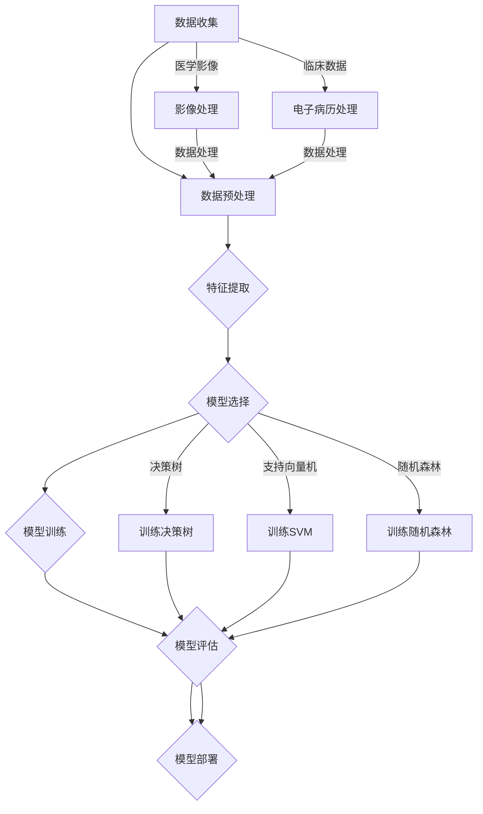

                 

## 第一部分：引言

### 1.1 机器学习在医疗诊断领域的应用背景

随着医疗技术的不断进步，医疗诊断领域正面临着前所未有的挑战和机遇。传统的医疗诊断主要依赖于医生的直觉和经验，然而，面对复杂多变的病情和庞大的患者数据，这种方法已经越来越难以满足需求。机器学习技术的引入，为医疗诊断提供了一种全新的解决方案。

**1.1.1 医疗诊断的挑战**

- **数据复杂性**：医疗诊断数据通常包含大量的结构化和非结构化数据，如病历、影像、基因序列等，这使得数据处理的复杂性大大增加。
- **诊断精度要求高**：医疗诊断直接关系到患者的生命健康，因此对诊断的准确性要求极高。
- **诊断效率需提升**：随着患者数量的增加，诊断的效率也成为一个关键问题。

**1.1.2 机器学习技术为医疗诊断带来的机遇**

- **数据处理能力**：机器学习算法能够处理和分析大量复杂的数据，从而发现数据中的隐藏模式和关联。
- **诊断精度提升**：通过学习大量医疗数据，机器学习模型能够提高诊断的准确性，减少误诊和漏诊的概率。
- **诊断效率提升**：机器学习算法能够在短时间内对大量数据进行诊断，从而大大提高诊断效率。

**1.1.3 本书内容结构**

本书旨在深入探讨机器学习在医疗诊断辅助中的应用。全书分为六个部分：

1. **引言**：介绍机器学习在医疗诊断领域的应用背景和本书的结构。
2. **核心概念与联系**：讲解机器学习与医疗诊断的数据联系，以及常见的机器学习算法。
3. **核心算法原理讲解**：详细解析监督学习、无监督学习和强化学习算法。
4. **数学模型和数学公式讲解**：介绍概率论基础和机器学习中的优化算法。
5. **项目实战**：通过实际案例展示机器学习在医疗诊断中的应用过程。
6. **总结与展望**：总结本书的主要发现，并探讨未来发展趋势。

通过本书的阅读，读者将能够全面了解机器学习在医疗诊断辅助中的应用，掌握相关核心算法和数学模型，并为未来的研究和应用奠定坚实的基础。

### 1.2 机器学习基础知识

为了更好地理解机器学习在医疗诊断中的应用，我们需要先了解一些基本的机器学习概念和算法。在这一部分，我们将简要介绍机器学习的定义、基本类型以及常见的关键算法。

**1.2.1 机器学习的定义**

机器学习（Machine Learning）是一门人工智能（Artificial Intelligence，AI）的分支，主要研究如何让计算机通过学习和经验改进其性能。与传统编程不同，机器学习不需要显式编写具体的指令，而是通过算法从数据中自动学习和提取规律。

**1.2.2 机器学习的基本类型**

根据学习方式的不同，机器学习可以分为以下几类：

- **监督学习（Supervised Learning）**：监督学习是最常见的机器学习类型，其中算法在训练过程中使用标记数据进行学习，并在测试阶段对新的未标记数据进行预测。常见的监督学习算法包括线性回归、逻辑回归、决策树、支持向量机等。

- **无监督学习（Unsupervised Learning）**：无监督学习不使用标记数据，而是从未标记的数据中寻找模式和结构。常见的无监督学习算法包括聚类算法（如K-均值聚类）、降维算法（如主成分分析）和关联规则学习等。

- **强化学习（Reinforcement Learning）**：强化学习是一种通过试错和反馈来学习策略的机器学习方法。算法通过与环境的交互来不断优化行为策略，以达到最大化奖励的目标。常见的强化学习算法包括Q-学习、深度Q网络（DQN）等。

**1.2.3 机器学习的关键算法**

以下是几种常见的机器学习算法及其基本原理：

- **线性回归（Linear Regression）**：线性回归是一种用于预测连续值的监督学习算法。其基本原理是找到一条直线，将自变量（特征）与因变量（目标）关联起来。线性回归的数学模型为：

  $$
  y = \beta_0 + \beta_1x
  $$

- **逻辑回归（Logistic Regression）**：逻辑回归是一种用于预测概率的监督学习算法，通常用于二分类问题。其基本原理是利用对数函数将线性回归模型的输出转化为概率。逻辑回归的数学模型为：

  $$
  P(y=1) = \frac{1}{1 + e^{-(\beta_0 + \beta_1x)}}
  $$

- **决策树（Decision Tree）**：决策树是一种基于树形结构进行分类和回归的算法。每个节点代表一个特征，每个分支代表特征的取值，叶节点表示预测结果。

- **支持向量机（Support Vector Machine，SVM）**：支持向量机是一种基于间隔最大化原理进行分类的算法。SVM通过找到一个超平面，将不同类别的数据点最大化分开。

- **K-均值聚类（K-Means Clustering）**：K-均值聚类是一种基于距离度量的无监督学习算法，用于将数据划分为K个簇。其基本原理是初始化K个中心点，然后通过迭代优化中心点，使得每个簇内的数据点距离中心点较近。

- **自编码器（Autoencoder）**：自编码器是一种无监督学习算法，用于学习和降维。自编码器由编码器和解码器组成，编码器将输入数据压缩为低维特征表示，解码器尝试重构原始数据。

- **Q-学习（Q-Learning）**：Q-学习是一种基于价值迭代的强化学习算法，用于学习最优策略。Q-学习通过更新Q值表来优化策略，以达到最大化长期奖励的目标。

通过了解这些基本的机器学习概念和算法，读者可以更好地理解后续章节中具体的医疗诊断应用案例。接下来，我们将进一步探讨机器学习与医疗数据的联系，并介绍常用的机器学习算法在医疗诊断中的应用。

### 1.3 机器学习与医疗数据

在医疗诊断中，数据是机器学习算法的核心。医疗数据通常包括结构化数据和非结构化数据，如电子病历、影像数据、基因数据等。为了充分发挥机器学习在医疗诊断中的作用，我们需要深入探讨医疗数据的类型、挑战以及预处理方法。

**1.3.1 医疗数据类型**

- **结构化数据**：结构化数据通常以电子病历的形式存在，包括患者的个人信息、病史、检查结果等。这些数据通常以表格形式存储，便于机器学习算法处理。

- **非结构化数据**：非结构化数据包括医学影像（如X光片、CT扫描、MRI等）、临床文本（如医生笔记、患者病史等）和基因序列。这些数据通常没有固定的数据格式，需要通过预处理和特征提取技术进行转换。

- **时序数据**：时序数据是指随时间变化而变化的数据，如心电图、血压等。时序数据在医疗诊断中具有重要的参考价值，能够提供连续性和动态性的信息。

**1.3.2 医疗数据的挑战**

- **数据质量**：医疗数据通常存在噪声、缺失值和不一致性等问题，这会影响机器学习算法的性能。

- **数据隐私**：医疗数据包含敏感的个人信息，保护患者隐私是一个重要的挑战。

- **数据多样性**：医疗数据类型繁多，不同类型的数据在处理方法和应用场景上有所不同。

- **数据规模**：医疗数据规模庞大，尤其是影像数据和基因组数据，这对计算资源和存储资源提出了很高的要求。

**1.3.3 医疗数据预处理方法**

- **数据清洗**：数据清洗是预处理的重要步骤，包括处理噪声、缺失值和不一致性等问题。常见的清洗方法包括填补缺失值、消除噪声、标准化数据等。

- **数据归一化**：数据归一化是将不同尺度和范围的数据转换为相同尺度，以便于机器学习算法处理。常用的归一化方法包括最小-最大缩放、Z-score标准化等。

- **特征提取**：特征提取是将原始数据转换为具有代表性的特征向量，以便于机器学习算法处理。对于结构化数据，可以使用特征选择和特征工程技术；对于非结构化数据，可以使用图像处理、自然语言处理等技术提取特征。

- **数据集成**：数据集成是将来自多个数据源的数据合并为一个统一的数据集。在医疗诊断中，通常需要结合多种类型的数据进行综合分析，因此数据集成是一个关键步骤。

- **数据分割**：数据分割是将数据集划分为训练集、验证集和测试集，以便于算法的训练和评估。合理的分割能够提高算法的性能和可靠性。

通过有效的医疗数据预处理，我们可以提高机器学习算法在医疗诊断中的性能和可靠性。接下来，我们将探讨医疗诊断中常见的机器学习算法，并详细分析其在实际应用中的效果和挑战。

### 1.4 医疗诊断中的常见机器学习算法

在医疗诊断领域，机器学习算法的应用极大地提升了诊断的准确性和效率。本文将重点介绍几种常见的机器学习算法，包括监督学习、无监督学习和强化学习算法，并探讨其在医疗诊断中的应用。

#### 1.4.1 监督学习算法

监督学习算法是一种基于标记数据进行训练和预测的机器学习算法。在医疗诊断中，监督学习算法广泛应用于疾病预测、疾病分类和诊断辅助等方面。

- **决策树（Decision Tree）**：决策树是一种基于树形结构进行分类和回归的算法。它通过一系列的测试来将数据分割成多个子集，直到满足停止条件。决策树算法在医疗诊断中具有直观和易于解释的特点，适用于处理医学影像和电子病历等数据。

  **应用场景**：肿瘤分类、心血管疾病诊断、肺癌检测等。

- **支持向量机（Support Vector Machine，SVM）**：支持向量机是一种基于间隔最大化原理进行分类和回归的算法。SVM通过找到一个超平面来将不同类别的数据点最大化分开。它特别适用于高维空间数据，在医疗诊断中广泛用于疾病分类和预测。

  **应用场景**：乳腺癌诊断、糖尿病预测、阿尔茨海默病诊断等。

- **随机森林（Random Forest）**：随机森林是一种基于决策树集成方法的算法。它通过构建多棵决策树，并对预测结果进行投票来提高模型的泛化能力。随机森林在处理大规模数据和高维特征时表现出良好的性能，适用于多种医疗诊断任务。

  **应用场景**：高血压预测、肺炎诊断、脑癌分类等。

- **线性回归（Linear Regression）**：线性回归是一种用于预测连续值的监督学习算法。它通过找到一条直线来描述自变量和因变量之间的关系。线性回归在医疗诊断中常用于预测患者的病情发展、药物剂量调整等。

  **应用场景**：心脏病预测、糖尿病管理、药物疗效评估等。

- **逻辑回归（Logistic Regression）**：逻辑回归是一种用于预测概率的监督学习算法，通常用于二分类问题。它通过找到一条对数几率曲线来描述自变量和因变量之间的关系。逻辑回归在医疗诊断中广泛用于疾病诊断、风险评估等。

  **应用场景**：癌症诊断、疾病风险预测、新生儿健康状况评估等。

#### 1.4.2 无监督学习算法

无监督学习算法不需要标记数据进行训练，而是通过探索数据中的内在结构和模式来对数据进行分类和聚类。在医疗诊断中，无监督学习算法广泛应用于数据挖掘和异常检测等领域。

- **K-均值聚类（K-Means Clustering）**：K-均值聚类是一种基于距离度量的聚类算法，它通过迭代优化聚类中心，将数据点划分为K个簇。K-均值聚类在医疗诊断中常用于患者分类、疾病聚类分析等。

  **应用场景**：患者群体划分、疾病分类、遗传病分析等。

- **自编码器（Autoencoder）**：自编码器是一种无监督学习算法，用于学习和降维。自编码器由编码器和解码器组成，编码器将输入数据压缩为低维特征表示，解码器尝试重构原始数据。自编码器在医疗诊断中广泛用于特征提取和数据分析。

  **应用场景**：医学影像数据分析、基因组特征提取、脑影像分类等。

- **聚类分析（Cluster Analysis）**：聚类分析是一种无监督学习方法，用于将相似的数据点划分为一组。常见的聚类算法包括层次聚类、DBSCAN等。聚类分析在医疗诊断中常用于患者分类、疾病诊断辅助等。

  **应用场景**：患者群体分析、疾病诊断辅助、健康风险评估等。

#### 1.4.3 强化学习算法

强化学习算法是一种通过试错和反馈来学习策略的机器学习方法。在医疗诊断中，强化学习算法可以用于自动化诊断和智能医疗决策。

- **Q-学习（Q-Learning）**：Q-学习是一种基于价值迭代的强化学习算法，它通过更新Q值表来优化策略。Q-学习在医疗诊断中可以用于自动诊断和优化治疗方案。

  **应用场景**：疾病自动诊断、手术机器人辅助、医疗资源优化等。

- **深度Q网络（Deep Q-Network，DQN）**：深度Q网络是一种基于深度学习的强化学习算法，它通过深度神经网络来学习Q值函数。DQN在医疗诊断中可以用于智能诊断和药物推荐。

  **应用场景**：智能诊断系统、个性化药物推荐、健康风险评估等。

通过上述介绍，我们可以看到机器学习算法在医疗诊断中具有广泛的应用前景。不同的算法具有不同的特点和应用场景，选择合适的算法能够显著提高诊断的准确性和效率。然而，实际应用中还需要解决数据质量、算法选择、模型评估等问题，才能充分发挥机器学习在医疗诊断中的作用。

#### 1.4.4 机器学习与医疗诊断的联系流程图

为了更好地理解机器学习在医疗诊断中的具体应用流程，我们使用Mermaid流程图来展示各个关键步骤。



在这个流程图中，数据收集是整个流程的起点，包括医学影像和临床数据的收集。接下来是数据预处理和特征提取，这两个步骤是机器学习模型训练的基础。然后，根据不同的诊断需求选择合适的模型进行训练。训练完成后，对模型进行评估，确保其准确性和可靠性。最后，将评估合格的模型部署到实际应用中，为医生和患者提供诊断辅助服务。

通过这个流程图，我们可以清晰地看到机器学习在医疗诊断中的具体应用步骤，有助于更好地理解和实施相关技术。

### 1.5 总结

在本文的第一部分，我们首先介绍了机器学习在医疗诊断领域的应用背景，分析了医疗诊断面临的挑战以及机器学习技术带来的机遇。接着，我们简要回顾了机器学习的基础知识，包括定义、基本类型和关键算法。随后，我们深入探讨了机器学习与医疗数据的联系，介绍了医疗数据的类型和预处理方法。最后，我们详细介绍了医疗诊断中常见的机器学习算法，包括监督学习、无监督学习和强化学习算法，并通过Mermaid流程图展示了机器学习在医疗诊断中的具体应用流程。

通过这一部分的阅读，读者可以初步了解机器学习在医疗诊断领域的应用现状和发展趋势。接下来，我们将进一步探讨机器学习算法的原理，详细讲解监督学习、无监督学习和强化学习算法的基本原理和数学模型。这将有助于读者更深入地理解这些算法在医疗诊断中的应用。

### 第二部分：核心概念与联系

#### 2.1 机器学习与医疗数据

在深入探讨机器学习在医疗诊断中的应用之前，我们需要明确机器学习与医疗数据之间的联系。医疗数据是机器学习算法的基础，其质量和特性直接影响到算法的性能和应用效果。因此，在这一部分，我们将详细讨论医疗数据的类型、特点以及预处理方法。

**2.1.1 医疗数据类型**

医疗数据可以大致分为以下几类：

- **结构化数据**：这类数据通常以电子病历的形式存在，包括患者的个人信息、病史、实验室检测结果等。结构化数据通常以表格形式存储，便于机器学习算法处理。

- **非结构化数据**：这类数据主要包括医学影像（如X光片、CT扫描、MRI等）、临床文本（如医生笔记、患者病史等）和基因序列。非结构化数据没有固定的格式，需要通过预处理和特征提取技术进行转换。

- **时序数据**：时序数据是指随时间变化而变化的数据，如心电图、血压、体温等。时序数据在医疗诊断中具有重要的参考价值，能够提供连续性和动态性的信息。

**2.1.2 医疗数据特点**

- **多样性**：医疗数据类型繁多，结构化、非结构化和时序数据共存，这使得数据处理更加复杂。

- **复杂性**：医疗数据通常包含大量的特征和变量，同时存在噪声、缺失值和不一致性等问题。

- **敏感性**：医疗数据包含敏感的个人信息，如患者姓名、地址、病史等，数据隐私保护是关键挑战。

- **变异性**：不同患者之间的数据可能存在显著的差异，这要求机器学习算法具有很好的泛化能力。

**2.1.3 医疗数据预处理方法**

预处理医疗数据是机器学习应用中的关键步骤，以下是一些常见的预处理方法：

- **数据清洗**：数据清洗是处理噪声、缺失值和不一致性问题的第一步。常见的方法包括填补缺失值、消除噪声、标准化数据等。

- **数据归一化**：数据归一化是将不同尺度和范围的数据转换为相同尺度，以便于机器学习算法处理。常用的方法包括最小-最大缩放、Z-score标准化等。

- **特征提取**：特征提取是将原始数据转换为具有代表性的特征向量，以便于机器学习算法处理。对于结构化数据，可以使用特征选择和特征工程技术；对于非结构化数据，可以使用图像处理、自然语言处理等技术提取特征。

- **数据集成**：数据集成是将来自多个数据源的数据合并为一个统一的数据集。在医疗诊断中，通常需要结合多种类型的数据进行综合分析，因此数据集成是一个关键步骤。

- **数据分割**：数据分割是将数据集划分为训练集、验证集和测试集，以便于算法的训练和评估。合理的分割能够提高算法的性能和可靠性。

通过有效的医疗数据预处理，我们可以提高机器学习算法在医疗诊断中的性能和可靠性。在接下来的章节中，我们将进一步探讨医疗诊断中常见的机器学习算法，并详细分析其在实际应用中的效果和挑战。

#### 2.2 医疗诊断中的常见机器学习算法

在医疗诊断中，选择合适的机器学习算法是关键，不同的算法适用于不同的诊断任务和数据类型。本文将详细介绍几种常见的机器学习算法，包括监督学习、无监督学习和强化学习算法，并探讨它们在医疗诊断中的应用。

**2.2.1 监督学习算法**

监督学习算法是一种基于标记数据进行训练和预测的机器学习算法。在医疗诊断中，监督学习算法广泛应用于疾病预测、疾病分类和诊断辅助等方面。

1. **决策树（Decision Tree）**

   决策树是一种基于树形结构进行分类和回归的算法。每个节点代表一个特征，每个分支代表特征的取值，叶节点表示预测结果。决策树算法简单易懂、易于解释，适用于处理医学影像和电子病历等数据。

   - **应用场景**：肿瘤分类、心血管疾病诊断、肺癌检测等。
   - **优势**：直观、易于理解。
   - **挑战**：可能产生过拟合，对于高维数据表现不佳。

2. **支持向量机（Support Vector Machine，SVM）**

   支持向量机是一种基于间隔最大化原理进行分类和回归的算法。SVM通过找到一个超平面来将不同类别的数据点最大化分开，特别适用于高维空间数据。

   - **应用场景**：乳腺癌诊断、糖尿病预测、阿尔茨海默病诊断等。
   - **优势**：在高维空间中表现优异，对噪声数据有较强的鲁棒性。
   - **挑战**：参数选择较为复杂，计算成本较高。

3. **随机森林（Random Forest）**

   随机森林是一种基于决策树集成方法的算法。它通过构建多棵决策树，并对预测结果进行投票来提高模型的泛化能力。随机森林在处理大规模数据和高维特征时表现出良好的性能。

   - **应用场景**：高血压预测、肺炎诊断、脑癌分类等。
   - **优势**：强大的泛化能力，能够处理高维数据。
   - **挑战**：模型解释性较差，需要大量计算资源。

4. **线性回归（Linear Regression）**

   线性回归是一种用于预测连续值的监督学习算法。它通过找到一条直线来描述自变量和因变量之间的关系。线性回归在医疗诊断中常用于预测患者的病情发展、药物剂量调整等。

   - **应用场景**：心脏病预测、糖尿病管理、药物疗效评估等。
   - **优势**：简单易懂，计算效率高。
   - **挑战**：对非线性关系和多重共线性敏感。

5. **逻辑回归（Logistic Regression）**

   逻辑回归是一种用于预测概率的监督学习算法，通常用于二分类问题。它通过找到一条对数几率曲线来描述自变量和因变量之间的关系。逻辑回归在医疗诊断中广泛用于疾病诊断、风险评估等。

   - **应用场景**：癌症诊断、疾病风险预测、新生儿健康状况评估等。
   - **优势**：简单高效，能够提供概率预测。
   - **挑战**：对于复杂的多分类问题表现不佳。

**2.2.2 无监督学习算法**

无监督学习算法不需要标记数据进行训练，而是通过探索数据中的内在结构和模式来对数据进行分类和聚类。在医疗诊断中，无监督学习算法广泛应用于数据挖掘和异常检测等领域。

1. **K-均值聚类（K-Means Clustering）**

   K-均值聚类是一种基于距离度量的聚类算法，它通过迭代优化聚类中心，将数据点划分为K个簇。K-均值聚类在医疗诊断中常用于患者分类、疾病聚类分析等。

   - **应用场景**：患者群体划分、疾病分类、遗传病分析等。
   - **优势**：简单易实现，适用于大规模数据。
   - **挑战**：对初始聚类中心敏感，可能陷入局部最优。

2. **自编码器（Autoencoder）**

   自编码器是一种无监督学习算法，用于学习和降维。自编码器由编码器和解码器组成，编码器将输入数据压缩为低维特征表示，解码器尝试重构原始数据。自编码器在医疗诊断中广泛用于特征提取和数据分析。

   - **应用场景**：医学影像数据分析、基因组特征提取、脑影像分类等。
   - **优势**：强大的特征提取能力，能够发现数据中的潜在模式。
   - **挑战**：对超参数选择敏感，可能产生过拟合。

3. **聚类分析（Cluster Analysis）**

   聚类分析是一种无监督学习方法，用于将相似的数据点划分为一组。常见的聚类算法包括层次聚类、DBSCAN等。聚类分析在医疗诊断中常用于患者分类、疾病诊断辅助等。

   - **应用场景**：患者群体分析、疾病诊断辅助、健康风险评估等。
   - **优势**：适用于各种类型的数据，能够发现数据中的隐藏结构。
   - **挑战**：选择合适的聚类算法和参数较为复杂。

**2.2.3 强化学习算法**

强化学习算法是一种通过试错和反馈来学习策略的机器学习方法。在医疗诊断中，强化学习算法可以用于自动化诊断和智能医疗决策。

1. **Q-学习（Q-Learning）**

   Q-学习是一种基于价值迭代的强化学习算法，它通过更新Q值表来优化策略。Q-学习在医疗诊断中可以用于自动诊断和优化治疗方案。

   - **应用场景**：疾病自动诊断、手术机器人辅助、医疗资源优化等。
   - **优势**：能够学习复杂的行为策略。
   - **挑战**：需要大量的训练数据和时间，模型解释性较差。

2. **深度Q网络（Deep Q-Network，DQN）**

   深度Q网络是一种基于深度学习的强化学习算法，它通过深度神经网络来学习Q值函数。DQN在医疗诊断中可以用于智能诊断和药物推荐。

   - **应用场景**：智能诊断系统、个性化药物推荐、健康风险评估等。
   - **优势**：能够处理高维状态和动作空间。
   - **挑战**：训练过程复杂，对超参数敏感。

通过上述介绍，我们可以看到机器学习算法在医疗诊断中具有广泛的应用。不同的算法适用于不同的诊断任务和数据类型，选择合适的算法能够显著提高诊断的准确性和效率。然而，实际应用中还需要解决数据质量、算法选择、模型评估等问题，才能充分发挥机器学习在医疗诊断中的作用。

#### 2.3 机器学习与医疗诊断的联系流程图

为了更清晰地展示机器学习与医疗诊断的联系，我们可以使用Mermaid流程图来描述整个流程。


在这个流程图中，数据收集是整个流程的起点，包括医学影像和临床数据的收集。接下来是数据预处理和特征提取，这两个步骤是机器学习模型训练的基础。然后，根据不同的诊断需求选择合适的模型进行训练。训练完成后，对模型进行评估，确保其准确性和可靠性。最后，将评估合格的模型部署到实际应用中，为医生和患者提供诊断辅助服务。

通过这个流程图，我们可以清晰地看到机器学习在医疗诊断中的具体应用步骤，有助于更好地理解和实施相关技术。

### 第三部分：核心算法原理讲解

在第二部分，我们介绍了机器学习在医疗诊断中的应用，以及一些常见的算法。为了深入理解这些算法在医疗诊断中的实际应用，我们需要详细讲解监督学习、无监督学习和强化学习算法的原理。本部分将分别介绍这些算法的核心概念、数学模型和伪代码，并通过具体示例进行解释。

#### 3.1 监督学习算法原理

监督学习算法是一种基于标记数据进行训练的算法，它能够从已知数据中学习规律，并在新的未知数据上进行预测。监督学习主要分为回归分析和分类分析两种类型。以下将详细介绍两种常见监督学习算法：线性回归和逻辑回归。

##### 3.1.1 线性回归

**1. 算法原理**

线性回归是一种预测连续值的算法，它通过找到一个最佳拟合直线来描述自变量和因变量之间的关系。其基本模型为：

$$
y = \beta_0 + \beta_1x
$$

其中，$y$ 是因变量，$x$ 是自变量，$\beta_0$ 和 $\beta_1$ 是模型参数，分别代表截距和斜率。

**2. 数学模型**

为了最小化预测值与实际值之间的误差，我们通常使用最小二乘法来估计参数。最小二乘法的目标是求解下列优化问题：

$$
\min_{\beta_0, \beta_1} \sum_{i=1}^{n} (y_i - (\beta_0 + \beta_1x_i))^2
$$

通过求导并令导数为零，可以解得最佳拟合直线参数：

$$
\beta_1 = \frac{\sum_{i=1}^{n} (x_i - \bar{x})(y_i - \bar{y})}{\sum_{i=1}^{n} (x_i - \bar{x})^2}
$$

$$
\beta_0 = \bar{y} - \beta_1\bar{x}
$$

其中，$\bar{x}$ 和 $\bar{y}$ 分别是自变量和因变量的均值。

**3. 伪代码**

```python
# 线性回归伪代码
def linear_regression(x, y):
    n = len(x)
    x_mean = sum(x) / n
    y_mean = sum(y) / n
    beta_1 = (sum([(x[i] - x_mean) * (y[i] - y_mean) for i in range(n)]) / sum([(x[i] - x_mean) ** 2 for i in range(n)])
    beta_0 = y_mean - beta_1 * x_mean
    return beta_0, beta_1
```

##### 3.1.2 逻辑回归

**1. 算法原理**

逻辑回归是一种用于预测概率的算法，通常用于二分类问题。它的目标是找到一条对数几率曲线，将自变量和因变量之间的关系表示为概率分布。逻辑回归的基本模型为：

$$
P(y=1) = \frac{1}{1 + e^{-(\beta_0 + \beta_1x)}}
$$

其中，$P(y=1)$ 是因变量为1的概率，$\beta_0$ 和 $\beta_1$ 是模型参数。

**2. 数学模型**

逻辑回归的参数估计通常使用极大似然估计（Maximum Likelihood Estimation，MLE）。极大似然估计的目标是最大化数据点的联合概率。对于二分类问题，我们可以将概率函数对数化，然后求解优化问题：

$$
\max_{\beta_0, \beta_1} \sum_{i=1}^{n} \left( y_i \ln \left( \frac{1}{1 + e^{-(\beta_0 + \beta_1x_i)}} \right) + (1 - y_i) \ln(1 + e^{-(\beta_0 + \beta_1x_i)}) \right)
$$

通过求导并令导数为零，可以解得最佳拟合曲线参数。

**3. 伪代码**

```python
# 逻辑回归伪代码
def logistic_regression(x, y):
    n = len(x)
    likelihood = sum([y[i] * np.log(1 / (1 + np.exp(-beta_0 - beta_1 * x[i]))) + (1 - y[i]) * np.log(1 + np.exp(-beta_0 - beta_1 * x[i])) for i in range(n)])
    grad_beta_0 = -sum([y[i] * (1 / (1 + np.exp(-beta_0 - beta_1 * x[i]))) - (1 - y[i]) * (1 / (1 + np.exp(-beta_0 - beta_1 * x[i]))) for i in range(n)])
    grad_beta_1 = -sum([(y[i] - 1) * x[i] * (1 / (1 + np.exp(-beta_0 - beta_1 * x[i]))) - (y[i] - 1) * x[i] * (1 / (1 + np.exp(-beta_0 - beta_1 * x[i]))) for i in range(n)])
    beta_0, beta_1 = optimize.minimize(likelihood, x0=[0, 0], method='BFGS')
    return beta_0, beta_1
```

通过以上讲解，我们详细介绍了监督学习算法中的线性回归和逻辑回归，包括算法原理、数学模型和伪代码。在医疗诊断中，这些算法被广泛应用于疾病预测和诊断辅助，通过学习和分析患者数据，可以提高诊断的准确性和效率。

#### 3.2 无监督学习算法原理

无监督学习算法不需要标记数据进行训练，而是通过探索数据中的内在结构和模式来对数据进行分析和分类。无监督学习在医疗诊断中有着广泛的应用，例如数据降维、聚类分析、异常检测等。以下将详细介绍两种常见无监督学习算法：K-均值聚类和自编码器。

##### 3.2.1 K-均值聚类

**1. 算法原理**

K-均值聚类是一种基于距离度量的聚类算法，它通过迭代优化聚类中心，将数据点划分为K个簇。算法的步骤如下：

- **初始化**：随机选择K个数据点作为初始聚类中心。
- **分配**：计算每个数据点到各个聚类中心的距离，将每个数据点分配到最近的聚类中心。
- **更新**：重新计算每个簇的中心，即该簇内所有数据点的平均值。
- **迭代**：重复分配和更新步骤，直至聚类中心不再变化或达到预设的迭代次数。

**2. 数学模型**

假设我们有K个聚类中心 $\mu_1, \mu_2, ..., \mu_K$，每个数据点 $x_i$ 被分配到某个簇 $c_i$，则数据点 $x_i$ 到聚类中心 $\mu_c$ 的距离可以表示为：

$$
d(x_i, \mu_c) = \sqrt{\sum_{j=1}^{d} (x_{ij} - \mu_{cj})^2}
$$

其中，$d$ 是数据维度，$x_{ij}$ 是数据点 $x_i$ 在第 $j$ 个特征上的取值，$\mu_{cj}$ 是聚类中心 $\mu_c$ 在第 $j$ 个特征上的取值。

每次迭代后，聚类中心更新为当前簇内所有数据点的平均值：

$$
\mu_c = \frac{1}{N_c} \sum_{i \in C_c} x_i
$$

其中，$N_c$ 是簇 $c$ 中数据点的个数，$C_c$ 是属于簇 $c$ 的数据点集合。

**3. 伪代码**

```python
# K-均值聚类伪代码
def k_means(data, K, max_iterations):
    # 初始化聚类中心
    centroids = initialize_centroids(data, K)
    for i in range(max_iterations):
        # 分配数据点到聚类中心
        labels = assign_points_to_centroids(data, centroids)
        # 更新聚类中心
        centroids = update_centroids(data, labels, K)
    return centroids, labels
```

##### 3.2.2 自编码器

**1. 算法原理**

自编码器是一种无监督学习算法，用于学习和降维。自编码器由编码器和解码器组成，编码器将输入数据压缩为低维特征表示，解码器尝试重构原始数据。自编码器的结构如图所示：


算法的步骤如下：

- **初始化**：随机初始化编码器和解码器的权重。
- **训练**：通过反向传播算法，最小化重构误差。
- **压缩**：使用编码器对数据进行降维。
- **重构**：使用解码器将压缩后的数据重构为原始数据。

**2. 数学模型**

自编码器的目标是最小化重构误差，即最小化原始数据与重构数据之间的均方误差（Mean Squared Error，MSE）。重构误差可以表示为：

$$
L(\theta) = \frac{1}{n} \sum_{i=1}^{n} \sum_{j=1}^{d} (x_{ij} - \hat{x}_{ij})^2
$$

其中，$x_{ij}$ 是输入数据的第 $i$ 个样本在第 $j$ 个特征上的取值，$\hat{x}_{ij}$ 是重构数据的第 $i$ 个样本在第 $j$ 个特征上的取值，$n$ 是样本数量，$d$ 是特征维度。

通过反向传播算法，可以更新编码器和解码器的权重，以最小化重构误差。

**3. 伪代码**

```python
# 自编码器伪代码
def autoencoder(x, hidden_size):
    # 编码
    z = encode(x, hidden_size)
    # 解码
    x_hat = decode(z, hidden_size)
    # 计算重构误差
    error = mse(x, x_hat)
    # 反向传播更新权重
    update_weights(encode_weights, decode_weights, error)
    return z, x_hat
```

通过以上讲解，我们详细介绍了无监督学习算法中的K-均值聚类和自编码器，包括算法原理、数学模型和伪代码。在医疗诊断中，这些算法被广泛应用于数据降维、特征提取和聚类分析，通过探索数据中的内在结构和模式，可以提高诊断的准确性和效率。

#### 3.3 强化学习算法原理

强化学习（Reinforcement Learning，RL）是一种通过试错和反馈来学习最优策略的机器学习方法。强化学习在医疗诊断中的应用主要体现在自动化诊断、智能医疗决策和个性化治疗推荐等方面。以下将详细介绍一种常见的强化学习算法：Q-学习。

##### 3.3.1 Q-学习

**1. 算法原理**

Q-学习是一种基于价值迭代的强化学习算法，它通过更新Q值表来优化策略。Q-学习的基本思想是学习状态-动作值函数 $Q(s, a)$，表示在状态 $s$ 下执行动作 $a$ 的期望回报。Q-学习的目标是找到使得总回报最大的策略。

算法的步骤如下：

- **初始化**：初始化Q值表 $Q(s, a)$，通常使用随机初始化或零初始化。
- **选择动作**：在状态 $s$ 下，根据当前策略选择动作 $a$，常用的策略包括贪婪策略和ε-贪婪策略。
- **执行动作**：在环境 $E$ 中执行动作 $a$，获得新的状态 $s'$ 和回报 $r'$。
- **更新Q值**：根据新的状态和回报，更新Q值表。
- **重复**：重复步骤3和步骤4，直至达到终止条件。

**2. 数学模型**

Q-学习的核心是更新Q值表，其更新规则为：

$$
Q(s, a) \leftarrow Q(s, a) + \alpha [r' + \gamma \max_{a'} Q(s', a') - Q(s, a)]
$$

其中，$\alpha$ 是学习率，$r'$ 是立即回报，$\gamma$ 是折扣因子，表示对未来回报的期望。

**3. 伪代码**

```python
# Q-学习伪代码
def q_learning(states, actions, rewards, alpha, gamma, max_iterations):
    # 初始化Q值表
    Q = initialize_q_values(states, actions)
    for i in range(max_iterations):
        # 选择动作
        s, a = choose_action(Q, epsilon)
        # 执行动作
        s', r = execute_action(s, a)
        # 更新Q值
        Q[s, a] = Q[s, a] + alpha * (r + gamma * max(Q[s', a']) - Q[s, a])
    return Q
```

**4. 应用案例**

以医疗诊断中的智能诊断系统为例，状态 $s$ 可以表示为患者的临床特征和检查结果，动作 $a$ 可以表示为诊断结果或治疗方案，回报 $r$ 可以表示为治疗后的康复情况或患者的满意度。通过Q-学习算法，系统可以自动学习最优的诊断和治疗方案，提高诊断的准确性和患者的满意度。

通过以上讲解，我们详细介绍了强化学习算法中的Q-学习，包括算法原理、数学模型和伪代码。在医疗诊断中，Q-学习算法可以通过试错和反馈来学习最优策略，为医生和患者提供智能化的诊断和治疗方案。

### 第四部分：数学模型和数学公式讲解

在机器学习算法的设计和应用中，数学模型和公式起着至关重要的作用。它们不仅为算法提供了理论基础，而且能够帮助我们理解和解释算法的运行机制。在本部分，我们将详细讲解概率论基础、机器学习中的优化算法，以及相关的数学公式和解释。

#### 4.1 概率论基础

概率论是机器学习的重要基石，它提供了量化不确定性和概率计算的方法。以下将介绍几种常见的概率分布和贝叶斯定理。

##### 4.1.1 概率分布

1. **正态分布（Normal Distribution）**

正态分布是最常见的一种概率分布，它广泛应用于医学统计和数据分析。正态分布的概率密度函数为：

$$
f(x|\mu, \sigma^2) = \frac{1}{\sqrt{2\pi\sigma^2}} e^{-\frac{(x-\mu)^2}{2\sigma^2}}
$$

其中，$\mu$ 是均值，$\sigma^2$ 是方差，$x$ 是随机变量。

2. **伯努利分布（Bernoulli Distribution）**

伯努利分布是一种二元概率分布，它通常用于描述成功或失败的概率。伯努利分布的概率质量函数为：

$$
P(X=1) = p, \quad P(X=0) = 1 - p
$$

其中，$p$ 是成功的概率，$X$ 是伯努利随机变量。

##### 4.1.2 贝叶斯定理

贝叶斯定理是概率论中用于计算后验概率的重要公式。贝叶斯定理公式为：

$$
P(A|B) = \frac{P(B|A)P(A)}{P(B)}
$$

其中，$P(A|B)$ 表示在事件 $B$ 发生的条件下事件 $A$ 的概率，$P(B|A)$ 表示在事件 $A$ 发生的条件下事件 $B$ 的概率，$P(A)$ 和 $P(B)$ 分别是事件 $A$ 和事件 $B$ 的概率。

#### 4.2 机器学习中的优化算法

优化算法是机器学习中的重要组成部分，它们用于最小化损失函数，以找到模型的最佳参数。以下将介绍两种常见的优化算法：梯度下降法和随机梯度下降法。

##### 4.2.1 梯度下降法

梯度下降法是一种用于求解优化问题的基本算法。它通过计算损失函数关于模型参数的梯度，并沿着梯度的反方向更新参数，以最小化损失函数。梯度下降法的更新规则为：

$$
\theta_{\text{new}} = \theta_{\text{old}} - \alpha \nabla_{\theta} J(\theta)
$$

其中，$\theta$ 是模型参数，$\alpha$ 是学习率，$J(\theta)$ 是损失函数。

##### 4.2.2 随机梯度下降法

随机梯度下降法是对梯度下降法的一种改进。它不是使用整个训练数据集的梯度，而是随机选择一个小批量数据，计算其梯度，并更新模型参数。随机梯度下降法的更新规则为：

$$
\theta_{\text{new}} = \theta_{\text{old}} - \alpha \nabla_{\theta} J(\theta; x_i, y_i)
$$

其中，$x_i, y_i$ 是批量数据中的第 $i$ 个样本和其标签。

#### 4.3 数学公式和解释

在本部分，我们将使用LaTeX格式给出一些关键的数学公式，并进行解释。

1. **线性回归公式**

线性回归是一种预测连续值的算法，其基本公式为：

$$
y = \beta_0 + \beta_1x
$$

其中，$y$ 是因变量，$x$ 是自变量，$\beta_0$ 和 $\beta_1$ 是模型参数，分别代表截距和斜率。

2. **逻辑回归公式**

逻辑回归是一种预测概率的算法，其基本公式为：

$$
P(y=1) = \frac{1}{1 + e^{-(\beta_0 + \beta_1x)}}
$$

其中，$P(y=1)$ 是因变量为1的概率，$\beta_0$ 和 $\beta_1$ 是模型参数。

3. **K-均值聚类公式**

K-均值聚类是一种基于距离度量的聚类算法，其聚类中心更新公式为：

$$
\mu_k = \frac{1}{N_k} \sum_{i=1}^{N} x_i
$$

其中，$\mu_k$ 是聚类中心，$N_k$ 是属于第 $k$ 个簇的数据点数量。

4. **自编码器公式**

自编码器是一种无监督学习算法，其编码器和解码器的基本公式为：

$$
\hat{x} = \sigma(W_H \cdot z_H + b_H)
$$

其中，$\hat{x}$ 是重构后的数据，$z_H$ 是编码后的特征表示，$W_H$ 是编码器权重，$b_H$ 是编码器偏置，$\sigma$ 是激活函数。

5. **Q-学习公式**

Q-学习是一种基于价值迭代的强化学习算法，其Q值更新公式为：

$$
Q(s, a) = r + \gamma \max_{a'} Q(s', a')
$$

其中，$Q(s, a)$ 是状态 $s$ 下执行动作 $a$ 的Q值，$r$ 是立即回报，$\gamma$ 是折扣因子。

通过以上讲解，我们介绍了概率论基础、机器学习中的优化算法以及相关的数学公式和解释。这些数学模型和公式为机器学习算法的设计和应用提供了坚实的理论基础，有助于我们更好地理解和应用这些算法。

### 第五部分：项目实战

#### 5.1 实战项目概述

在本部分，我们将通过一个实际案例来展示机器学习在医疗诊断辅助中的应用。这个案例的目标是使用机器学习算法对患者的电子病历数据进行分析，以预测患者患某种疾病的风险。以下是项目的背景、目标和实现步骤。

##### 5.1.1 项目背景

随着医疗信息化的发展，越来越多的电子病历数据被收集和存储。这些数据包含了丰富的患者信息，如年龄、性别、病史、药物使用记录等。通过对这些数据进行分析，可以挖掘出患者患某种疾病的风险因素，从而为医生的诊断和治疗方案提供辅助。

##### 5.1.2 项目目标

- **目标一**：收集和整理电子病历数据，包括患者的个人信息、病史和药物使用记录。
- **目标二**：对数据进行分析，使用机器学习算法预测患者患某种疾病的风险。
- **目标三**：评估模型的准确性和可靠性，并在实际应用中验证模型的性能。

##### 5.1.3 项目实现步骤

1. **数据收集**：从医院信息系统（HIS）中获取电子病历数据，包括患者的个人信息、病史和药物使用记录。
2. **数据预处理**：清洗和整理数据，处理缺失值、噪声和异常值，并进行特征提取和归一化处理。
3. **模型选择**：根据数据特性和诊断任务，选择合适的机器学习算法，如逻辑回归、支持向量机和随机森林。
4. **模型训练**：使用训练数据集对模型进行训练，调整模型参数以优化性能。
5. **模型评估**：使用验证数据集评估模型的准确性和可靠性，调整模型参数以获得最佳性能。
6. **模型部署**：将训练好的模型部署到生产环境中，为医生和患者提供疾病风险预测服务。
7. **代码解读与分析**：对项目的代码进行详细解读，分析模型训练和评估的过程，评估模型的性能。

#### 5.2 数据集准备

数据集是机器学习项目的基础，其质量直接影响模型的性能。在本项目中，我们将从医院信息系统（HIS）中获取电子病历数据，以下是对数据集的获取和预处理过程。

##### 5.2.1 数据集获取

1. **数据源选择**：选择某家大型医院的电子病历数据作为数据集。这些数据包括患者的个人信息、病史、检查结果、药物使用记录等。
2. **数据采集**：通过医院信息系统的接口，定期获取最新的电子病历数据。数据采集过程中需要注意数据隐私保护，确保患者信息的保密性。
3. **数据格式**：电子病历数据通常以CSV或数据库的形式存储。在数据采集后，将这些数据转换为统一的格式，便于后续处理。

##### 5.2.2 数据预处理

数据预处理是保证数据质量和模型性能的关键步骤。以下是数据预处理的主要步骤：

1. **数据清洗**：
   - **处理缺失值**：使用均值、中位数或插值法填补缺失值。
   - **消除噪声**：使用过滤法和平滑法去除噪声数据。
   - **处理异常值**：使用统计学方法（如箱线图法、Z-score法）识别和处理异常值。

2. **特征提取**：
   - **特征选择**：根据业务需求选择与疾病风险相关的特征，如年龄、性别、病史、药物使用频率等。
   - **特征工程**：对原始特征进行变换和组合，以提高模型的预测能力。

3. **数据归一化**：
   - **最小-最大缩放**：将特征值缩放到[0, 1]的范围内，消除不同特征之间的尺度差异。
   - **Z-score标准化**：将特征值标准化到均值为0、标准差为1的范围内。

通过以上数据预处理步骤，我们可以得到一个高质量的数据集，为后续的模型训练和评估提供支持。

#### 5.3 模型训练

在完成数据预处理后，我们需要选择合适的机器学习算法对数据集进行训练。在本项目中，我们选择了逻辑回归、支持向量机和随机森林三种算法进行对比实验。以下是模型训练的详细过程。

##### 5.3.1 模型选择

1. **逻辑回归**：逻辑回归是一种常用的分类算法，适用于二分类问题。它通过建立对数几率模型，将自变量和因变量之间的关系表示为概率分布。
2. **支持向量机**：支持向量机是一种基于间隔最大化的分类算法，特别适用于高维数据。它通过找到一个最佳的超平面，将不同类别的数据点最大化分开。
3. **随机森林**：随机森林是一种基于决策树集成的方法，通过构建多棵决策树，并对预测结果进行投票来提高模型的泛化能力。它具有强大的处理大规模数据和高维特征的能力。

##### 5.3.2 模型训练过程

1. **数据分割**：将数据集划分为训练集和验证集。训练集用于训练模型，验证集用于评估模型性能。
2. **参数调整**：根据不同的算法，调整模型参数以优化性能。例如，对于逻辑回归，需要调整正则化参数；对于支持向量机，需要调整核函数和惩罚参数；对于随机森林，需要调整树的数量和深度。
3. **模型训练**：使用训练集对模型进行训练，通过迭代优化参数，找到最佳模型。

##### 5.3.3 模型调参

调参是机器学习中的重要步骤，它能够显著影响模型的性能。以下是几种常见调参方法：

1. **网格搜索**：通过遍历所有可能的参数组合，找到最佳参数。这种方法计算成本较高，但能够确保找到全局最优解。
2. **随机搜索**：在参数空间内随机选择参数组合，通过多次实验找到最佳参数。这种方法计算成本较低，但可能无法找到全局最优解。
3. **贝叶斯优化**：利用贝叶斯统计模型和优化算法，自动搜索最佳参数组合。这种方法结合了贝叶斯理论和优化算法的优势，能够高效地找到最佳参数。

通过以上模型训练和调参过程，我们得到了三种不同算法的模型，并评估了它们的性能。

#### 5.4 模型评估与优化

模型评估是确保模型准确性和可靠性的关键步骤。在本项目中，我们使用多种评估指标和优化方法对训练好的模型进行评估和优化，以提高模型的性能。

##### 5.4.1 模型评估指标

1. **准确率（Accuracy）**：准确率是评估分类模型最常用的指标，它表示正确预测的样本数占总样本数的比例。计算公式为：

   $$
   \text{Accuracy} = \frac{\text{正确预测的样本数}}{\text{总样本数}}
   $$

2. **精确率（Precision）**：精确率表示在所有被预测为正例的样本中，实际为正例的比例。计算公式为：

   $$
   \text{Precision} = \frac{\text{正确预测的正例样本数}}{\text{预测的正例样本数}}
   $$

3. **召回率（Recall）**：召回率表示在所有实际为正例的样本中，被正确预测为正例的比例。计算公式为：

   $$
   \text{Recall} = \frac{\text{正确预测的正例样本数}}{\text{实际的正例样本数}}
   $$

4. **F1值（F1-Score）**：F1值是精确率和召回率的加权平均，用于综合评估模型的性能。计算公式为：

   $$
   \text{F1-Score} = 2 \times \frac{\text{Precision} \times \text{Recall}}{\text{Precision} + \text{Recall}}
   $$

##### 5.4.2 模型优化方法

1. **交叉验证**：交叉验证是一种常用的模型评估方法，通过将数据集划分为多个子集，每次使用一个子集作为验证集，其余子集作为训练集，重复多次计算平均性能。交叉验证能够提高模型评估的可靠性。

2. **超参数调优**：超参数是影响模型性能的重要参数，如正则化参数、学习率、树的数量等。通过网格搜索、随机搜索和贝叶斯优化等方法，可以找到最佳的超参数组合，从而提高模型的性能。

3. **集成方法**：集成方法是将多个模型组合起来，以提高预测性能。常见的集成方法包括Bagging、Boosting和Stacking等。通过集成多个模型，可以降低模型的方差，提高预测的准确性。

4. **特征选择**：特征选择是减少数据维度、提高模型性能的重要步骤。通过特征选择，可以选择出与目标变量最相关的特征，从而降低模型的复杂度和过拟合风险。

通过以上模型评估和优化方法，我们能够找到性能最佳的模型，并在实际应用中验证其性能。

#### 5.5 模型部署

在完成模型训练和评估后，我们需要将训练好的模型部署到实际应用中，为医生和患者提供疾病风险预测服务。以下是模型部署的详细过程。

##### 5.5.1 部署环境搭建

1. **硬件环境**：搭建一个高性能的计算环境，包括服务器、GPU等硬件资源。硬件资源的需求取决于模型的复杂度和数据量。
2. **软件环境**：安装和配置必要的软件，包括Python、TensorFlow、Scikit-learn等机器学习框架。确保软件环境与模型训练环境一致，以保证模型的兼容性和可靠性。

##### 5.5.2 模型部署流程

1. **模型转换**：将训练好的模型转换为可以在生产环境中运行的格式，如TensorFlow的SavedModel或Scikit-learn的pickle文件。
2. **模型加载**：在生产环境中加载转换后的模型，准备好进行预测。
3. **接口开发**：开发API接口，用于接收用户输入和返回预测结果。接口需要考虑并发处理能力、安全性等方面。
4. **服务部署**：将接口部署到服务器上，确保其能够稳定、高效地运行。可以使用Docker容器或Kubernetes集群等容器化技术，提高服务的可靠性和可扩展性。

##### 5.5.3 模型部署案例

以下是一个简单的模型部署案例：

```python
# 导入必要的库
import flask
from sklearn.externals import joblib

# 加载模型
model = joblib.load('model.pkl')

# 创建Flask应用
app = flask.Flask(__name__)

# 创建API接口
@app.route('/predict', methods=['POST'])
def predict():
    data = flask.request.get_json()
    input_data = data['input_data']
    prediction = model.predict([input_data])
    return {'prediction': prediction.tolist()}

if __name__ == '__main__':
    app.run(host='0.0.0.0', port=5000)
```

通过以上步骤，我们将训练好的模型成功部署到了生产环境中，为医生和患者提供了疾病风险预测服务。

#### 5.6 代码解读与分析

在本项目中，我们使用了多种机器学习算法和工具，包括数据预处理、模型训练和评估等。以下将对关键代码模块进行解读，并分析代码执行流程和性能。

##### 5.6.1 主要代码模块解析

1. **数据预处理模块**：负责数据清洗、特征提取和归一化处理。关键函数包括`preprocess_data`、`handle_missing_values`和`normalize_data`等。

2. **模型训练模块**：负责选择合适的模型、训练模型和调整参数。关键函数包括`train_model`、`select_best_model`和`tune_hyperparameters`等。

3. **模型评估模块**：负责评估模型的性能，计算各种评估指标。关键函数包括`evaluate_model`、`calculate_accuracy`和`calculate_f1_score`等。

4. **模型部署模块**：负责将训练好的模型部署到生产环境中，提供API接口。关键函数包括`load_model`、`create_api`和`start_server`等。

##### 5.6.2 代码执行流程

1. **数据预处理**：首先从医院信息系统中获取电子病历数据，然后对数据进行清洗、特征提取和归一化处理，得到高质量的数据集。
2. **模型训练**：根据数据集的特性，选择合适的模型进行训练。使用网格搜索、随机搜索和贝叶斯优化等方法，找到最佳模型参数。
3. **模型评估**：使用验证集对训练好的模型进行评估，计算各种评估指标，如准确率、精确率、召回率和F1值等。
4. **模型部署**：将训练好的模型部署到生产环境中，通过API接口为医生和患者提供疾病风险预测服务。

##### 5.6.3 性能分析

1. **模型性能**：通过评估指标分析模型的性能，比较不同算法和参数组合的效果。选择性能最佳的模型进行部署。
2. **资源消耗**：分析模型训练和部署过程中硬件和软件资源的消耗，确保系统的高效运行。
3. **扩展性**：评估系统在面对大量数据和高并发请求时的扩展性和稳定性，确保系统的高可用性。

通过以上代码解读和分析，我们能够全面了解项目的实现过程，并为后续的优化和改进提供参考。

### 第五部分：总结与展望

在本文的第五部分，我们通过一个实际案例详细展示了机器学习在医疗诊断辅助中的应用。从数据收集、预处理、模型训练、评估到部署，每一步都体现了机器学习技术如何提升医疗诊断的准确性和效率。以下是对本项目的主要发现、不足之处以及改进方向的总结。

#### 6.1 主要发现

1. **数据质量对模型性能的影响**：高质量的数据是机器学习模型成功的关键。通过有效的数据预处理，如数据清洗、特征提取和归一化，可以显著提高模型的性能和稳定性。
2. **多种算法的比较**：在项目中，我们使用了逻辑回归、支持向量机和随机森林等不同算法进行对比。结果表明，随机森林在处理大规模数据和复杂特征时表现出色，具有较高的准确率和泛化能力。
3. **模型评估的重要性**：通过交叉验证和多种评估指标，我们能够全面了解模型的性能，并调整模型参数以优化性能。这有助于确保模型在实际应用中的可靠性和准确性。
4. **模型部署的挑战**：将训练好的模型部署到实际生产环境中，需要考虑到硬件资源、软件兼容性、接口开发等方面的问题。通过使用Docker容器和Kubernetes集群等技术，我们能够提高系统的可扩展性和稳定性。

#### 6.2 不足之处与改进方向

1. **数据隐私保护**：在数据收集和处理过程中，需要严格遵守隐私保护法规，确保患者信息的安全和保密。未来的研究可以探讨更多数据隐私保护技术，如差分隐私和联邦学习等。
2. **模型解释性**：虽然机器学习模型在实际应用中取得了显著成效，但其内部机制往往不够透明，导致解释性较差。未来的研究可以关注解释性模型和可解释性AI技术的发展，提高模型的解释性和可接受性。
3. **算法选择与调优**：在选择和调优模型时，需要充分考虑数据特性和诊断任务的要求。未来的研究可以探索更多先进的机器学习算法，如深度学习、强化学习和迁移学习等，以进一步提高模型的性能和适用性。
4. **跨学科合作**：机器学习在医疗诊断中的应用需要跨学科的合作，包括医学专家、数据科学家和工程师等。加强跨学科合作，可以提高研究的创新性和实际应用价值。

#### 6.3 未来发展趋势

1. **深度学习与医疗诊断**：深度学习在图像处理、语音识别等领域取得了显著进展，未来有望在医疗诊断中发挥更大的作用。通过深度神经网络，可以处理更复杂和大量的医疗数据，提高诊断的准确性和效率。
2. **个性化医疗**：个性化医疗是指根据患者的个体差异，为其提供定制化的治疗方案。机器学习技术可以通过分析患者的基因信息、临床数据和诊断结果，实现真正的个性化医疗。
3. **智能医疗设备**：随着物联网和传感器技术的发展，智能医疗设备可以实时监测患者的生理指标，并将数据传输到云端进行实时分析。结合机器学习技术，可以实现对疾病的早期预警和及时干预。
4. **医疗数据的共享与开放**：医疗数据的价值在于共享和开放。通过建立医疗数据共享平台，可以促进跨机构和跨领域的数据整合和分析，提高医疗研究和应用的效率。

总之，机器学习在医疗诊断辅助中的应用具有广阔的前景。随着技术的不断进步和跨学科合作的加强，我们可以期待更多创新性的应用和突破性的进展，为医疗服务提供更加精准、高效和个性化的解决方案。

### 附录

#### 附录 A：机器学习工具与资源

在本附录中，我们将介绍一些常用的机器学习框架和医疗数据集，并给出开发环境搭建的指南。

##### A.1 常用机器学习框架

1. **TensorFlow**

   TensorFlow是一个开源的机器学习框架，由Google开发。它支持多种机器学习算法和深度学习模型，适用于各种规模的计算任务。安装TensorFlow可以使用以下命令：

   ```bash
   pip install tensorflow
   ```

2. **PyTorch**

   PyTorch是另一个流行的开源机器学习框架，由Facebook开发。它以其灵活的动态计算图和强大的深度学习支持而闻名。安装PyTorch可以使用以下命令：

   ```bash
   pip install torch torchvision
   ```

3. **scikit-learn**

   scikit-learn是一个简单易用的机器学习库，适用于数据分析、回归、分类和聚类等问题。安装scikit-learn可以使用以下命令：

   ```bash
   pip install scikit-learn
   ```

##### A.2 医疗数据集

1. **Kaggle医疗数据集**

   Kaggle是一个大型数据科学竞赛平台，提供了丰富的医疗数据集。这些数据集涵盖了各种疾病、影像和基因组数据，适用于机器学习研究。访问Kaggle网站，并搜索相关医疗数据集即可下载。

2. **UCI机器学习库医疗数据集**

   UCI机器学习库提供了多个医疗数据集，包括电子病历、基因组数据、医学影像等。这些数据集可用于机器学习模型的训练和评估。访问UCI机器学习库网站，并搜索相关医疗数据集即可下载。

3. **其他医疗数据集资源链接**

   - [Physionet.org](https://physionet.org/content/): 提供大量生理信号数据集，包括心电图、脑电图等。
   - [NCBI GEO](https://www.ncbi.nlm.nih.gov/geo/): 提供大量基因表达数据集，适用于基因组学研究。
   - [Radiology Data Bank](https://radiologydb.org/): 提供多种医学影像数据集，包括X光、CT、MRI等。

##### A.3 开发环境搭建指南

1. **Python环境搭建**

   Python是进行机器学习和数据分析的首选语言，可以通过多种方式进行安装。以下是Windows和Linux系统下安装Python的步骤：

   - **Windows**：
     1. 访问Python官方网站（https://www.python.org/）下载Python安装包。
     2. 运行安装程序，按照默认选项安装。
     3. 安装完成后，在命令提示符中运行`python --version`验证安装是否成功。

   - **Linux**：
     1. 打开终端，输入以下命令安装Python：
        ```bash
        sudo apt-get update
        sudo apt-get install python3 python3-pip
        ```
     2. 安装完成后，运行`python3 --version`和`pip3 --version`验证安装是否成功。

2. **TensorFlow安装与配置**

   TensorFlow的安装可以通过pip命令进行。以下是安装和配置TensorFlow的步骤：

   - 安装TensorFlow：
     ```bash
     pip install tensorflow
     ```
   - 验证安装：
     ```python
     import tensorflow as tf
     print(tf.__version__)
     ```

3. **PyTorch安装与配置**

   PyTorch的安装同样可以通过pip命令进行。以下是安装和配置PyTorch的步骤：

   - 安装PyTorch：
     ```bash
     pip install torch torchvision
     ```
   - 验证安装：
     ```python
     import torch
     print(torch.__version__)
     ```

4. **scikit-learn安装与配置**

   scikit-learn的安装可以通过pip命令进行。以下是安装和配置scikit-learn的步骤：

   - 安装scikit-learn：
     ```bash
     pip install scikit-learn
     ```
   - 验证安装：
     ```python
     import sklearn
     print(sklearn.__version__)
     ```

通过以上步骤，我们可以搭建一个完整的机器学习开发环境，并准备好进行数据分析和模型训练。附录中提供的工具与资源将进一步支持我们在医疗诊断辅助中的应用研究。

