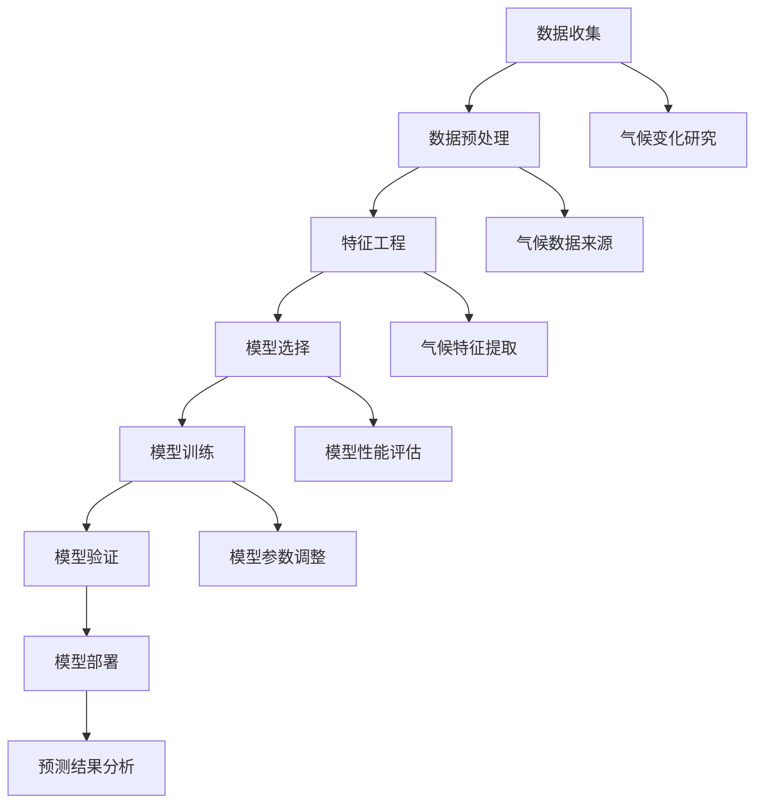

                 

### 《机器学习在气候变化预测中的应用》

#### **关键词：**气候变化、机器学习、预测模型、数据预处理、算法分析

#### **摘要：**本文将深入探讨机器学习在气候变化预测中的应用，首先介绍气候变化的基本概念和机器学习在相关领域中的应用背景，接着详细讲解多种机器学习算法在气候变化预测中的具体应用及其优缺点，最后通过一个实际项目案例展示如何运用机器学习进行气候变化预测。本文旨在为读者提供一个全面、系统的了解和掌握机器学习在气候变化预测中的应用方法。

## 目录大纲

### 第一部分：基础概念与理论

1. **第1章：气候变化与机器学习概述**
    - **1.1 气候变化的基本概念**
    - **1.2 机器学习在气候变化研究中的应用背景**
    - **1.3 机器学习基础知识**

2. **第2章：气候数据收集与处理**
    - **2.1 气候数据的类型与来源**
    - **2.2 数据预处理技术**
    - **2.3 数据质量评估与噪声处理**

### 第二部分：核心算法与模型

3. **第3章：线性回归模型在气候变化预测中的应用**
    - **3.1 线性回归原理**
    - **3.2 线性回归模型在气候变化中的应用**
    - **3.3 线性回归模型的优缺点**

4. **第4章：决策树与随机森林模型在气候变化预测中的应用**
    - **4.1 决策树模型原理**
    - **4.2 随机森林模型原理**
    - **4.3 决策树与随机森林模型在气候变化预测中的应用案例**

5. **第5章：支持向量机在气候变化预测中的应用**
    - **5.1 支持向量机原理**
    - **5.2 支持向量机在气候变化预测中的应用**
    - **5.3 支持向量机的优缺点**

6. **第6章：神经网络与深度学习模型在气候变化预测中的应用**
    - **6.1 神经网络基本结构**
    - **6.2 深度学习模型原理**
    - **6.3 神经网络与深度学习在气候变化预测中的应用案例**

7. **第7章：强化学习模型在气候变化预测中的应用**
    - **7.1 强化学习基本概念**
    - **7.2 Q学习算法**
    - **7.3 策略梯度算法**
    - **7.4 强化学习在气候变化预测中的应用案例**

8. **第8章：集成学习方法在气候变化预测中的应用**
    - **8.1 集成学习方法概述**
    - **8.2 Bagging与Boosting方法**
    - **8.3 集成学习方法在气候变化预测中的应用案例**

### 第三部分：案例分析与应用实践

9. **第9章：气候变化预测项目实战**
    - **9.1 项目背景与目标**
    - **9.2 数据收集与处理**
    - **9.3 模型选择与实现**
    - **9.4 模型评估与优化**

10. **第10章：机器学习在气候变化预测中的挑战与未来发展**
    - **10.1 挑战与问题**
    - **10.2 未来发展趋势与展望**

11. **第11章：拓展阅读与资源推荐**
    - **11.1 相关书籍推荐**
    - **11.2 在线课程与资源推荐**
    - **11.3 学术论文与研究报告推荐**

### 附录

- **附录 A：常用机器学习工具与库**
    - **A.1 Python机器学习库简介**
    - **A.2 R语言机器学习库简介**
    - **A.3 常用数据处理工具简介**

---

### 第一部分：基础概念与理论

#### **第1章：气候变化与机器学习概述**

##### 1.1 气候变化的基本概念

气候变化是指气候平均状态统计学意义上的巨大改变或持续较长一段时间的气候变动。通常情况下，气候变化的定义涉及时间尺度（如数十年、数百年），以及空间尺度（如全球、区域）。气候变化的因素包括自然因素（如太阳辐射的变化、火山爆发等）和人为因素（如温室气体排放、土地利用变化等）。

关键指标如全球平均温度、海平面上升、极端天气事件的频率和强度等，均受到气候变化的影响。气候变化带来的挑战包括水资源短缺、农作物产量下降、生态系统失衡、自然灾害频发等，对人类社会和自然环境都产生了深远的影响。

##### 1.2 机器学习在气候变化研究中的应用背景

机器学习是一种人工智能分支，通过构建和训练模型，使计算机能够从数据中学习并做出预测或决策。在气候变化研究中，机器学习的应用背景主要基于以下几点：

1. **数据驱动的预测能力**：气候变化涉及大量复杂的数据，包括气象数据、卫星数据、海洋数据等。机器学习模型能够从这些数据中提取特征，并进行有效的预测。

2. **处理高维数据的能力**：气候变化研究中的数据往往具有高维特征，如温度、湿度、风速等。机器学习算法能够处理高维数据，从而提高预测的准确性。

3. **自动化和高效性**：机器学习模型能够自动化地处理大量数据，从而减少人工分析的时间和成本，提高研究效率。

4. **模式识别能力**：气候变化研究中，机器学习算法能够在大量数据中发现潜在的模式和趋势，这些模式对于理解气候变化机制和预测未来趋势具有重要意义。

##### 1.3 机器学习基础知识

为了深入理解机器学习在气候变化预测中的应用，我们需要掌握一些基本的机器学习概念：

- **模型训练**：模型训练是指通过大量的训练数据，调整模型的参数，使模型能够对新的数据进行预测。
  
- **特征工程**：特征工程是指从原始数据中提取或构造出对模型预测有帮助的特征。

- **评估指标**：评估指标用于衡量模型预测的性能，如准确率、召回率、F1分数等。

- **模型选择**：根据问题的具体需求，选择合适的模型，如线性回归、决策树、支持向量机、神经网络等。

- **超参数调整**：超参数是模型中需要手动调整的参数，如学习率、决策树深度等。通过调整超参数，可以提高模型的性能。

- **模型验证**：通过交叉验证等方法，对模型进行评估，确保模型的泛化能力。

##### **核心概念与联系：**

下面是一个Mermaid流程图，展示了机器学习在气候变化预测中的基本概念和流程：



#### **核心算法原理讲解：**

在机器学习应用中，我们需要关注几个关键算法的原理。以下是每个算法的伪代码及其简要说明：

- **线性回归：**

    ```python
    # 线性回归伪代码
    def linear_regression(X, y):
        # X: 特征矩阵，y: 目标变量
        # 计算特征矩阵X的转置
        X_transpose = X.T
        
        # 计算特征矩阵X的逆矩阵
        X_inv = inv(X_transpose @ X)
        
        # 计算回归系数
        theta = X_inv @ X_transpose @ y
        
        return theta
    ```

    线性回归是一种简单的回归模型，通过最小化目标函数（通常为均方误差）来找到特征和目标变量之间的关系。

- **决策树：**

    ```python
    # 决策树构建伪代码
    def build_decision_tree(data, target_attribute):
        # 如果数据集足够纯净或特征不足以进行划分，则返回叶节点
        if is纯净(data) or no更多信息可提取(data):
            return create_leaf_node(data)
        
        # 选择最佳分割特征
        best_attribute = select_best_attribute(data, target_attribute)
        
        # 创建内部节点
        node = create_internal_node(best_attribute)
        
        # 对每个可能的值进行分割，递归构建子树
        for value in unique_values(data[best_attribute]):
            subset = data[data[best_attribute] == value]
            node.add_child(build_decision_tree(subset, target_attribute))
        
        return node
    ```

    决策树是一种基于特征的分割方法，通过不断将数据集分割为子集，构建一棵树形结构。

- **支持向量机：**

    ```python
    # 支持向量机优化目标
    def optimize_SVM(X, y):
        # X: 特征矩阵，y: 目标变量
        # 定义优化问题
        objective_function = -1/2 * ||w||^2 - y' * w
        
        # 求解优化问题，得到最优权重w和偏置b
        w, b = solve_optimization_problem(objective_function)
        
        return w, b
    ```

    支持向量机通过找到一个最优的超平面，将特征空间中的数据点分类，最大化分类间隔。

- **神经网络：**

    ```python
    # 神经网络前向传播伪代码
    def forward_propagation(X, weights, biases):
        # X: 输入特征，weights: 权重矩阵，biases: 偏置向量
        # 初始化激活值
        activations = [X]
        
        # 循环通过每个隐藏层和输出层
        for layer in range(num_layers - 1):
            # 计算激活值
            z = weights[layer] @ activations[layer] + biases[layer]
            activation = sigmoid(z)
            
            # 更新激活值
            activations.append(activation)
        
        # 返回最终激活值
        return activations[-1]
    ```

    神经网络通过多层非线性变换，将输入映射到输出，能够学习复杂的非线性关系。

#### **数学模型和公式：**

在机器学习中，数学模型和公式是理解和实现算法的基础。以下是几个常见模型和公式的简要说明：

- **线性回归模型：**

    目标函数：\( J(\theta) = \frac{1}{2m} \sum_{i=1}^{m} (h_\theta(x^{(i)}) - y^{(i)})^2 \)

    梯度下降：\( \theta_j := \theta_j - \alpha \frac{\partial J(\theta)}{\partial \theta_j} \)

    其中，\( m \) 为样本数量，\( h_\theta(x) \) 为假设函数，\( \theta \) 为参数向量，\( \alpha \) 为学习率。

- **逻辑回归模型：**

    目标函数：\( J(\theta) = -\frac{1}{m} \sum_{i=1}^{m} [y^{(i)} \log(h_\theta(x^{(i)})) + (1 - y^{(i)}) \log(1 - h_\theta(x^{(i)}))] \)

    梯度下降：\( \theta_j := \theta_j - \alpha \frac{\partial J(\theta)}{\partial \theta_j} \)

    其中，\( h_\theta(x) = \frac{1}{1 + e^{-\theta^T x}} \) 为逻辑函数。

- **支持向量机：**

    目标函数：\( J(\theta) = \frac{1}{2} ||\theta||^2 + C \sum_{i=1}^{m} \max(0, 1 - y^{(i)} (\theta^T x^{(i)} + b)) \)

    拉格朗日乘子法：\( L(\theta, \alpha) = \frac{1}{2} ||\theta||^2 - \sum_{i=1}^{m} \alpha_i (y^{(i)} (\theta^T x^{(i)} + b) - 1) \)

    其中，\( C \) 为惩罚参数，\( \alpha_i \) 为拉格朗日乘子。

- **神经网络：**

    前向传播：\( z^{(l)} = \theta^{(l)} x^{(l-1)} + b^{(l)} \)

    激活函数：\( a^{(l)} = \sigma(z^{(l)}) \)

    反向传播：\( \delta^{(l)} = (a^{(l)} - t^{(l)}) \cdot \frac{da^{(l)}}{dz^{(l)}} \)

    参数更新：\( \theta^{(l)} := \theta^{(l)} - \alpha \cdot \frac{\delta^{(l+1)} x^{(l)}}{m} \)

    其中，\( \theta^{(l)} \) 为第 \( l \) 层的权重，\( b^{(l)} \) 为第 \( l \) 层的偏置，\( \sigma \) 为激活函数（如ReLU、Sigmoid、Tanh等），\( \delta^{(l)} \) 为误差项。

#### **举例说明：**

下面通过一个简单的例子来说明机器学习在气候变化预测中的应用。

**例子：使用线性回归预测气温**

假设我们有以下数据集：

| 日期 | 气温（℃） |
| ---- | ---- |
| 2021-01-01 | 5 |
| 2021-01-02 | 6 |
| 2021-01-03 | 4 |
| 2021-01-04 | 7 |
| 2021-01-05 | 6 |

**数据预处理：**

1. 将日期转换为数值特征，例如使用日期差作为特征。

2. 将数据集分为训练集和测试集。

**特征工程：**

1. 提取日期差特征，例如使用差值 \( x = date_2 - date_1 \)。

2. 将特征和目标变量 \( y \)（气温）放入矩阵 \( X \) 和向量 \( y \) 中。

**模型训练：**

1. 使用线性回归模型对 \( X \) 和 \( y \) 进行训练，找到最佳参数 \( \theta \)。

2. 计算训练误差，并使用梯度下降法更新参数。

**模型评估：**

1. 使用测试集对模型进行评估，计算预测误差。

2. 根据误差大小，调整模型参数或选择更合适的模型。

**模型应用：**

1. 使用训练好的模型预测未来日期的气温。

2. 根据预测结果，为气象部门提供决策支持。

---

#### **项目实战：**

在本节中，我们将通过一个实际项目案例，展示如何运用机器学习进行气候变化预测。

**项目背景与目标：**

某气象部门希望通过机器学习模型预测未来一个月的气温。该模型将用于指导农业灌溉、水资源管理和城市规划等。

**数据收集与处理：**

1. 收集过去三年的气温数据，包括日平均气温、最高气温、最低气温等。

2. 对数据进行预处理，包括缺失值填补、异常值处理和数据标准化。

3. 将数据分为训练集和测试集，用于模型训练和评估。

**模型选择与实现：**

1. 选择线性回归、决策树、支持向量机和神经网络等模型进行预测。

2. 对每个模型进行训练，调整超参数，找到最佳参数。

3. 使用测试集评估模型性能，选择最佳模型。

**模型评估与优化：**

1. 计算预测误差，评估模型性能。

2. 根据评估结果，对模型进行调整和优化，提高预测精度。

**模型应用：**

1. 使用最佳模型预测未来一个月的气温。

2. 将预测结果可视化，为气象部门提供决策支持。

---

#### **机器学习在气候变化预测中的挑战与未来发展：**

尽管机器学习在气候变化预测中展示了巨大的潜力，但仍面临以下挑战：

1. **数据质量与缺失值处理**：气候数据往往存在噪声、缺失值和异常值，这会影响模型的性能。

2. **模型复杂性与可解释性**：复杂模型（如神经网络）虽然能够提高预测精度，但往往难以解释和理解。

3. **计算资源需求**：大规模数据处理和模型训练需要大量的计算资源，这对于资源有限的科研机构来说是一个挑战。

4. **模型泛化能力**：模型在不同区域和气候条件下的泛化能力仍需提高。

未来的发展趋势包括：

1. **大数据与云计算**：利用大数据和云计算技术，提高数据处理和模型训练的效率。

2. **深度学习和强化学习**：探索深度学习和强化学习在气候变化预测中的应用，提高模型的预测精度。

3. **跨学科合作**：加强气象学、环境科学和计算机科学等领域的合作，推动气候变化预测技术的发展。

---

#### **拓展阅读与资源推荐：**

1. **相关书籍推荐：**
    - 《机器学习》（周志华著）
    - 《深度学习》（Ian Goodfellow, Yoshua Bengio, Aaron Courville 著）
    - 《统计学习方法》（李航著）

2. **在线课程与资源推荐：**
    - Coursera 上的“机器学习”课程
    - edX 上的“深度学习”课程
    - Kaggle 上的数据科学和机器学习比赛和教程

3. **学术论文与研究报告推荐：**
    - “Global Temperature Forecast using Neural Networks”（2020）
    - “Enhancing Climate Forecasting with Machine Learning”（2019）
    - “Deep Learning for Climate Science”（2018）

---

#### **附录 A：常用机器学习工具与库：**

1. **Python机器学习库简介：**
    - scikit-learn：提供多种机器学习算法和工具，适用于数据预处理、模型训练和评估。
    - TensorFlow：用于构建和训练深度学习模型。
    - PyTorch：另一个流行的深度学习框架，具有灵活的动态计算图。

2. **R语言机器学习库简介：**
    - caret：提供多种机器学习算法的统一接口，简化模型训练和评估过程。
    - mlr：一个完整的机器学习框架，支持多种算法和评估方法。
    - randomForest：实现随机森林模型的R包。

3. **常用数据处理工具简介：**
    - Pandas：提供数据清洗、转换和分析功能。
    - NumPy：提供高效的数值计算和数据处理工具。
    - Matplotlib 和 Seaborn：用于数据可视化的库。

---

### **作者信息：**

作者：AI天才研究院/AI Genius Institute & 禅与计算机程序设计艺术 /Zen And The Art of Computer Programming

