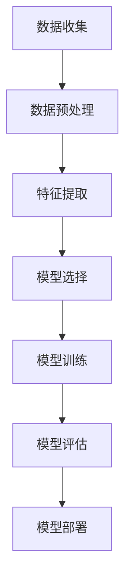

                 

# 引言

在当今数字化时代，网络安全已成为各个组织和企业关注的焦点。随着网络攻击手段的日益复杂和多样化，传统的安全防护措施已经难以应对不断出现的新威胁。为此，机器学习技术在网络安全态势感知中的应用变得越来越重要。机器学习通过自动学习和模式识别，能够有效地检测、预测和应对各种网络攻击，提高网络安全的整体水平。

本文旨在深入探讨机器学习在网络安全态势感知中的应用，帮助读者了解这一领域的核心概念、技术原理和实际案例。文章将分为三个主要部分：

- **第一部分：机器学习基础**：介绍机器学习的基本概念、类型和算法，为后续讨论打下基础。
- **第二部分：网络安全态势感知基础**：探讨网络安全态势感知的基本概念、威胁分析和事件响应。
- **第三部分：机器学习在网络安全态势感知中的应用**：详细阐述机器学习在入侵检测、恶意代码检测、网络安全事件预测和网络安全态势可视化中的应用实例。

本文通过逐步分析推理的方式，旨在为读者提供清晰、深入的技术见解，帮助其在实际工作中更好地应用机器学习技术，提升网络安全能力。

## 关键词

机器学习，网络安全，态势感知，入侵检测，恶意代码检测，事件预测，可视化，监督学习，无监督学习，强化学习。

## 摘要

本文详细探讨了机器学习在网络安全态势感知中的应用。首先，介绍了机器学习的基础概念和算法，包括监督学习、无监督学习和强化学习。接着，探讨了网络安全态势感知的基本概念、威胁分析和事件响应流程。随后，本文重点介绍了机器学习在入侵检测、恶意代码检测、网络安全事件预测和网络安全态势可视化中的应用实例，并通过具体案例进行了详细解析。最后，本文分析了机器学习在网络安全中的应用挑战和未来发展，展望了机器学习在网络安全领域的广阔前景。通过本文的探讨，读者可以全面了解机器学习在网络安全态势感知中的关键作用，并掌握其实际应用方法。

----------------------------------------------------------------

### 第一部分：机器学习基础

## 第1章：机器学习概述

### 1.1 机器学习基本概念

#### 1.1.1 什么是机器学习

机器学习（Machine Learning，ML）是人工智能（Artificial Intelligence，AI）的一个重要分支，它通过构建算法模型，使计算机系统能够从数据中学习和获取知识，进而对未知数据进行预测和决策。机器学习的基本原理是利用统计学、概率论、优化算法等数学工具，通过训练模型，使其具备自主学习和适应能力。

机器学习的核心概念包括：

- **特征**：数据的基本属性，用于描述数据的不同方面。
- **模型**：用于预测或分类的数学函数或算法。
- **训练**：通过输入训练数据，调整模型参数，使模型能够学习和适应数据。
- **测试**：使用未参与训练的数据，评估模型的泛化能力和准确性。

#### 1.1.2 机器学习的基本类型

机器学习可以根据训练数据的标签情况分为三种基本类型：监督学习（Supervised Learning）、无监督学习（Unsupervised Learning）和强化学习（Reinforcement Learning）。

- **监督学习（Supervised Learning）**：在监督学习过程中，模型需要从带有标签的训练数据中学习，以便对新的数据进行预测。监督学习的任务包括回归（预测连续值）和分类（预测离散值）。

  **示例：** 假设我们有一个房屋销售数据集，包含房屋面积、卧室数量等特征，以及对应的售价。我们可以使用这些数据来训练一个回归模型，预测未知房屋的售价。

- **无监督学习（Unsupervised Learning）**：无监督学习不需要标签数据，其目标是发现数据中的结构和模式。常见的无监督学习任务包括聚类、降维和关联规则挖掘。

  **示例：** 在一个顾客购买行为数据集中，我们可以使用K-均值聚类算法将顾客分为不同的群体，以便进行市场细分和个性化推荐。

- **强化学习（Reinforcement Learning）**：强化学习通过奖励机制，使模型在与环境的交互过程中学习和优化策略。强化学习广泛应用于机器人控制、游戏对战和自动驾驶等领域。

  **示例：** 在自动驾驶场景中，自动驾驶系统通过感知周围环境，采取行动，并根据是否成功达到目标获得奖励，不断优化其行为。

#### 1.1.3 机器学习应用领域

机器学习在多个领域都有广泛应用，包括但不限于：

- **图像识别**：通过训练模型识别图像中的物体、场景等。
- **自然语言处理**：用于文本分类、情感分析、机器翻译等。
- **医疗健康**：用于疾病预测、医学图像分析等。
- **金融科技**：用于风险管理、欺诈检测等。
- **推荐系统**：用于推荐商品、电影等。

### 1.2 机器学习模型

#### 1.2.1 监督学习模型

监督学习模型是根据已知标签数据训练的模型，其目的是对新的数据进行预测或分类。以下是一些常见的监督学习模型：

- **线性回归（Linear Regression）**：用于预测连续值，通过建立输入特征与输出值之间的线性关系进行预测。
  ```mermaid
  graph TD
  A[特征向量] --> B[权重向量]
  B --> C[加权和]
  C --> D[偏置]
  D --> E[预测值]
  ```
  $$预测值 = 加权值 + 偏置$$

- **逻辑回归（Logistic Regression）**：用于预测二分类问题，通过建立输入特征与概率之间的线性关系进行预测。
  ```mermaid
  graph TD
  A[特征向量] --> B[权重向量]
  B --> C[加权和]
  C --> D[激活函数]
  D --> E[概率值]
  E --> F[预测类别]
  ```
  $$概率值 = \frac{1}{1 + e^{-加权值}}$$

- **决策树（Decision Tree）**：通过一系列的判断条件对数据进行分类，每个节点代表一个特征，每个分支代表一个判断结果。
  ```mermaid
  graph TD
  A[特征1]
  B[条件1]
  C[条件2]
  D[类别1]
  E[类别2]
  F[类别3]
  A --> B
  B --> C
  C --> D
  C --> E
  E --> F
  ```

- **支持向量机（SVM）**：通过找到一个最优的超平面来分隔数据，适用于分类和回归问题。
  ```mermaid
  graph TD
  A[数据点] --> B[支持向量]
  B --> C[超平面]
  C --> D[分类边界]
  ```
  $$最大化间隔：\\frac{1}{2} ||w||^2$$
  $$约束条件：y_i ( \langle w, x_i \rangle + b ) \geq 1$$

- **随机森林（Random Forest）**：通过集成多个决策树来提高分类和回归的准确性。
  ```mermaid
  graph TD
  A[训练数据] --> B[随机特征]
  B --> C[构建决策树]
  C --> D[集成决策树]
  D --> E[随机森林模型]
  ```

#### 1.2.2 无监督学习模型

无监督学习模型在无标签数据上进行训练，旨在发现数据中的结构和模式。以下是一些常见的无监督学习模型：

- **K-均值聚类（K-Means Clustering）**：将数据划分为K个簇，每个簇的中心代表该簇的特征。
  ```mermaid
  graph TD
  A[数据点] --> B[初始中心]
  B --> C[计算距离]
  C --> D[重新计算中心]
  D --> E[迭代]
  E --> F[聚类结果]
  ```

- **主成分分析（PCA）**：通过降维和特征提取，将高维数据映射到低维空间，保留主要特征。
  ```mermaid
  graph TD
  A[高维数据] --> B[协方差矩阵]
  B --> C[特征值和特征向量]
  C --> D[投影矩阵]
  D --> E[低维数据]
  ```

- **自编码器（Autoencoder）**：通过编码和解码过程，学习数据的特征表示。
  ```mermaid
  graph TD
  A[输入数据] --> B[编码器]
  B --> C[编码]
  C --> D[解码器]
  D --> E[输出数据]
  ```

#### 1.2.3 强化学习模型

强化学习模型通过与环境的交互来学习最优策略，以下是一些常见的强化学习模型：

- **Q-学习（Q-Learning）**：通过学习状态-动作价值函数，选择最佳动作。
  ```mermaid
  graph TD
  A[状态s] --> B[动作a]
  B --> C[环境反馈r]
  C --> D[下一个状态s']
  D --> E[学习更新Q值]
  ```
  $$Q(s,a) = Q(s,a) + \alpha [r + \gamma \max_{a'} Q(s',a') - Q(s,a)]$$

- **深度Q网络（DQN）**：结合深度学习和Q-学习，用于处理高维状态空间。
  ```mermaid
  graph TD
  A[状态s] --> B[深度神经网络]
  B --> C[动作a]
  C --> D[环境反馈r]
  D --> E[下一个状态s']
  E --> F[目标Q值]
  F --> G[Q网络更新]
  ```

- **策略梯度方法（Policy Gradient）**：直接优化策略，提高回报。
  ```mermaid
  graph TD
  A[策略π] --> B[状态s]
  B --> C[动作a]
  C --> D[回报r]
  D --> E[更新策略π]
  ```

### 1.3 机器学习算法

#### 1.3.1 决策树算法

决策树算法是一种简单而有效的分类和回归方法，其基本流程如下：

```python
# 决策树算法伪代码
function DecisionTree(data, target_attribute, depth):
    if all_examples_have_same_target_attribute(data):
        return majority_vote(data)
    if depth == maximum_depth:
        return majority_vote(data)
    best_attribute = ChooseBestAttribute(data, target_attribute)
    left_child = CreateChild(data, "is less than", best_attribute)
    right_child = CreateChild(data, "is greater than or equal to", best_attribute)
    return Node(best_attribute, left_child, right_child)
```

其中，`data` 是输入数据集，`target_attribute` 是目标属性，`depth` 是树的深度，`majority_vote` 是多数投票函数，`ChooseBestAttribute` 是选择最佳属性函数，`CreateChild` 是创建子节点的函数。

#### 1.3.2 支持向量机算法

支持向量机（SVM）是一种强大的分类和回归方法，其基本数学公式如下：

$$
\begin{aligned}
\text{最小化} \quad & \frac{1}{2} ||w||^2 \\
\text{约束条件} \quad & y_i ( \langle w, x_i \rangle + b ) \geq 1
\end{aligned}
$$

其中，$w$ 是权重向量，$b$ 是偏置项，$x_i$ 是输入特征向量，$y_i$ 是标签。

SVM的目标是找到一个最优的超平面，使得两类数据点之间的间隔最大化。

#### 1.3.3 集成学习方法

集成学习方法是将多个弱学习器集成起来，形成一个强学习器的方法。常见的集成学习方法包括Bagging和Boosting。

- **Bagging**：通过随机抽样生成多个子训练集，分别训练多个弱学习器，然后取平均值或投票决定最终结果。随机森林是一种常见的Bagging方法。

  ```mermaid
  graph TD
  A[训练数据] --> B[随机抽样]
  B --> C[训练模型1]
  C --> D[训练模型2]
  D --> E[...]
  E --> F[集成模型]
  ```

- **Boosting**：通过迭代地训练多个弱学习器，每次迭代都关注上一轮未正确分类的样本，并调整这些样本的权重，使得后续模型更加关注这些困难样本。AdaBoost和XGBoost是常见的Boosting方法。

  ```mermaid
  graph TD
  A[训练数据] --> B[训练模型1]
  B --> C[错误率]
  C --> D[重新加权]
  D --> E[训练模型2]
  E --> F[...]
  F --> G[集成模型]
  ```

### 1.4 小结

机器学习在网络安全态势感知中的应用至关重要，通过监督学习、无监督学习和强化学习等方法，可以有效地检测、预测和应对各种网络攻击。本章节介绍了机器学习的基础概念、模型和算法，为后续的深入探讨打下了基础。

----------------------------------------------------------------

### 第二部分：网络安全态势感知基础

## 第2章：网络安全态势感知概述

### 2.1 网络安全态势感知基本概念

#### 2.1.1 什么是网络安全态势感知

网络安全态势感知（Cybersecurity Situational Awareness，简称CSA）是一种通过技术手段和流程，实时收集、分析和整合网络安全相关数据，以便快速识别、响应和应对潜在的网络威胁和安全事件的能力。CSA的核心目标是提高组织对网络安全威胁的感知能力，从而更好地保护关键信息资产和业务系统。

网络安全态势感知的基本组成部分包括：

1. **数据收集**：从各种数据源（如网络流量、日志文件、安全设备等）收集与网络安全相关的数据。
2. **数据处理**：对收集到的数据进行分析和处理，提取有价值的信息。
3. **态势评估**：根据分析结果，对网络安全态势进行评估，确定威胁级别和影响范围。
4. **预警与响应**：根据态势评估结果，采取相应的预警措施和安全响应策略。

#### 2.1.2 网络安全态势感知的重要性

网络安全态势感知在当今数字化时代具有重要意义，主要体现在以下几个方面：

1. **提高威胁识别速度**：通过实时监测和分析网络数据，能够迅速发现潜在的网络威胁，提高威胁识别速度。
2. **减少安全事件影响**：及时响应和处置网络安全事件，可以减少安全事件对组织业务的影响和损失。
3. **优化安全资源分配**：通过全面了解网络安全态势，能够更好地分配安全资源和预算，提高安全投资效益。
4. **提升合规性**：符合相关法律法规和行业标准，提高组织在网络安全领域的合规性和公信力。

#### 2.1.3 网络安全态势感知的基本框架

网络安全态势感知的基本框架通常包括以下几个关键部分：

1. **数据源**：包括网络流量、日志文件、安全设备数据、外部威胁情报等。
2. **数据收集**：通过各种技术手段（如代理、网关、传感器等）收集网络安全数据。
3. **数据处理**：对收集到的数据进行分析和处理，提取有价值的信息，如事件类型、攻击特征等。
4. **分析引擎**：采用机器学习、统计分析等方法，对处理后的数据进行分析和关联，识别潜在的威胁和攻击行为。
5. **可视化界面**：将分析结果以图形化界面展示，帮助用户直观地了解网络安全态势。
6. **预警与响应**：根据分析结果，触发相应的预警和响应措施，如阻断攻击、隔离设备、升级安全策略等。

### 2.2 网络安全威胁分析

#### 2.2.1 常见的网络安全威胁

网络安全威胁种类繁多，常见的包括以下几类：

1. **恶意软件**：如病毒、蠕虫、木马等，可以通过网络传播，感染计算机系统，窃取信息或破坏系统功能。
2. **网络钓鱼**：通过伪装成合法网站，诱骗用户输入敏感信息，如用户名、密码、信用卡号等。
3. **分布式拒绝服务攻击（DDoS）**：通过大量请求使目标服务器无法响应，造成服务中断。
4. **数据泄露**：未经授权访问、泄露或窃取敏感数据，可能导致隐私泄露、经济损失和声誉损害。
5. **内部威胁**：内部员工或合作伙伴的恶意行为，如滥用权限、泄露敏感信息等。
6. **供应链攻击**：通过供应链环节中的漏洞进行攻击，可能影响多个组织。

#### 2.2.2 网络安全威胁分类

网络安全威胁可以根据不同的标准进行分类，常见的分类方法包括：

1. **按攻击目的分类**：如窃取信息、破坏系统、占用资源等。
2. **按攻击方式分类**：如窃听、篡改、拒绝服务等。
3. **按攻击对象分类**：如网络设备、操作系统、应用程序等。
4. **按攻击途径分类**：如物理攻击、网络攻击、无线攻击等。

#### 2.2.3 网络安全威胁分析技术

网络安全威胁分析技术主要包括以下几个方面：

1. **签名分析**：通过比对已知恶意软件签名来检测入侵行为。
2. **行为分析**：通过监测恶意软件在系统中的行为，识别潜在威胁。
3. **异常检测**：通过检测与正常行为不一致的模式来识别威胁。
4. **威胁情报**：利用来自多个来源的情报信息，识别和应对威胁。

### 2.3 网络安全事件响应

#### 2.3.1 网络安全事件响应流程

网络安全事件响应是指在面对网络安全事件时，采取的一系列检测、分析、响应和恢复措施。一个典型的网络安全事件响应流程包括以下几个步骤：

1. **初步检测**：发现和确认网络安全事件。
2. **事件分类**：根据事件类型和影响进行分类，如恶意软件感染、数据泄露等。
3. **初步调查**：收集与事件相关的信息，包括日志、网络流量、系统状态等。
4. **确认和评估**：确认事件的性质和影响范围，评估事件的影响。
5. **响应措施**：根据事件的类型和影响，采取相应的响应措施，如隔离受感染设备、清除恶意软件、修复漏洞等。
6. **事后总结**：总结事件处理过程，分析原因，制定改进措施。

#### 2.3.2 网络安全事件响应技术

网络安全事件响应技术包括以下几个方面：

1. **入侵检测系统（IDS）**：用于检测和响应网络入侵行为。
2. **入侵防御系统（IPS）**：在入侵检测系统的基础上，能够自动响应并阻止入侵行为。
3. **安全信息和事件管理（SIEM）**：用于收集、分析和响应网络安全事件。
4. **安全自动化和响应平台（SARP）**：通过自动化技术提高事件响应效率。

#### 2.3.3 网络安全事件响应工具

网络安全事件响应工具包括以下几个方面：

1. **日志分析工具**：用于收集和分析系统日志。
2. **网络流量分析工具**：用于捕获和分析网络流量。
3. **恶意软件分析工具**：用于分析和识别恶意软件。
4. **安全信息共享和分析合作组织（ISAC）**：提供威胁情报和安全信息共享。

### 2.4 小结

网络安全态势感知是确保网络安全的关键技术之一。通过了解网络安全态势感知的基本概念、重要性、基本框架、威胁分析技术和事件响应流程，可以更好地理解和应用相关技术，提高组织的网络安全防护能力。

----------------------------------------------------------------

### 第三部分：机器学习在网络安全态势感知中的应用

## 第3章：机器学习在入侵检测中的应用

### 3.1 入侵检测系统概述

#### 3.1.1 入侵检测系统的基本概念

入侵检测系统（Intrusion Detection System，IDS）是一种网络安全技术，用于监控网络或系统活动，识别潜在的入侵行为。IDS可以分为两大类：网络入侵检测系统（NIDS）和主机入侵检测系统（HIDS）。

- **网络入侵检测系统（NIDS）**：部署在网络中，监控网络流量，识别网络攻击。
- **主机入侵检测系统（HIDS）**：部署在主机上，监控主机活动，识别恶意软件和用户行为。

#### 3.1.2 入侵检测系统的架构

入侵检测系统的典型架构包括以下几个部分：

1. **传感器**：负责收集网络流量或系统日志数据。
2. **分析引擎**：对传感器收集的数据进行分析，识别入侵行为。
3. **响应模块**：根据分析结果，采取相应的响应措施，如阻断攻击、记录日志等。
4. **管理界面**：用于管理和配置入侵检测系统。

#### 3.1.3 入侵检测系统的分类

入侵检测系统可以根据检测方法分为以下几类：

- **基于签名的入侵检测**：通过匹配已知攻击签名来检测入侵。
- **基于异常的入侵检测**：通过检测与正常行为不一致的模式来检测入侵。
- **混合入侵检测**：结合基于签名和基于异常的方法。

### 3.2 基于机器学习的入侵检测算法

#### 3.2.1 监督学习入侵检测算法

监督学习入侵检测算法利用已标记的训练数据来训练模型，从而能够识别新的入侵行为。常见的监督学习算法包括：

- **决策树**：通过一系列的判断条件来分类数据。
- **随机森林**：集成多个决策树，提高检测准确性。
- **支持向量机（SVM）**：通过最大化间隔进行分类。
- **神经网络**：通过多层神经元的非线性变换来学习攻击特征。

#### 3.2.2 无监督学习入侵检测算法

无监督学习入侵检测算法不依赖于已标记的数据，通过发现数据中的异常模式来检测入侵。常见的无监督学习算法包括：

- **K-均值聚类**：将数据分为若干个簇，检测簇间的异常。
- **主成分分析（PCA）**：通过降维和特征提取来识别异常。
- **孤立森林**：通过计算数据的隔离度来识别异常。

#### 3.2.3 强化学习入侵检测算法

强化学习入侵检测算法通过与环境交互来学习最优检测策略。常见的算法包括：

- **Q-学习**：通过学习状态-动作价值函数来做出决策。
- **深度Q网络（DQN）**：结合深度学习和Q-学习，提高检测效果。
- **策略梯度方法**：直接优化策略，以提高检测准确性。

### 3.3 机器学习在入侵检测中的应用实例

#### 3.3.1 实例一：基于KDD CUP 99数据集的入侵检测

KDD CUP 99数据集是一个广泛使用的入侵检测数据集，包含正常流量和多种类型的攻击流量。可以使用监督学习算法，如SVM或随机森林，对该数据集进行训练和测试，评估不同算法的入侵检测性能。

#### 3.3.2 实例二：基于实时网络流量数据的入侵检测

在实际应用中，入侵检测系统通常需要处理实时网络流量数据。可以使用无监督学习算法，如K-均值聚类或孤立森林，来识别异常流量，从而检测入侵行为。

#### 3.3.3 实例三：基于威胁情报的入侵检测

威胁情报是网络安全态势感知的重要信息源。可以利用威胁情报来指导入侵检测算法的更新和调整，提高入侵检测的准确性。例如，可以使用深度学习算法，如卷积神经网络（CNN），来处理和利用威胁情报数据。

### 3.4 小结

机器学习在入侵检测中的应用，通过监督学习、无监督学习和强化学习算法，提高了入侵检测的准确性和效率。本章节通过具体实例展示了机器学习在入侵检测中的实际应用，为网络安全态势感知提供了有力支持。

----------------------------------------------------------------

## 第4章：机器学习在恶意代码检测中的应用

### 4.1 恶意代码检测概述

#### 4.1.1 恶意代码的基本概念

恶意代码（Malware）是指设计用于破坏、篡改、窃取数据或控制计算机系统的一种软件。常见的恶意代码类型包括：

- **病毒**：通过感染其他程序或文件来传播，能够自我复制。
- **蠕虫**：利用网络漏洞自动传播，无需用户交互。
- **木马**：伪装成合法软件，用于窃取信息或控制计算机。
- **勒索软件**：加密用户文件，要求支付赎金以解密。

#### 4.1.2 恶意代码的威胁分析

恶意代码对个人和组织构成了严重威胁，其危害包括：

- **数据泄露**：窃取敏感信息，如个人身份信息、金融信息等。
- **系统破坏**：破坏操作系统或关键文件，导致系统无法正常工作。
- **资源占用**：占用大量计算机资源，导致系统性能下降。
- **非法控制**：控制计算机，进行非法活动，如分布式拒绝服务攻击（DDoS）。

#### 4.1.3 恶意代码检测技术

恶意代码检测技术主要包括：

- **静态分析**：通过分析恶意代码的源代码或二进制文件，检测恶意行为。
- **动态分析**：通过运行恶意代码，观察其在系统中的行为，检测恶意行为。
- **行为分析**：通过监测恶意代码在系统中的行为模式，识别恶意行为。
- **基于特征的检测**：通过比较恶意代码的特定特征，与已知的恶意代码库进行匹配，检测恶意行为。
- **基于行为的检测**：通过监测恶意代码的行为模式，识别恶意行为。

### 4.2 基于机器学习的恶意代码检测算法

#### 4.2.1 基于特征提取的恶意代码检测算法

基于特征提取的恶意代码检测算法通过提取恶意代码的特征，构建特征向量，然后使用机器学习算法进行分类。常见的特征提取方法包括：

- **代码特征**：如函数调用、变量定义等。
- **控制流图特征**：如基本块、控制流图等。
- **指令序列特征**：如指令序列的长度、复杂度等。

#### 4.2.2 基于行为分析的恶意代码检测算法

基于行为分析的恶意代码检测算法通过监测恶意代码在系统中的行为，识别恶意行为。常见的算法包括：

- **监控进程行为**：如进程创建、文件操作等。
- **网络流量分析**：如网络连接、数据传输等。
- **系统调用分析**：如系统调用类型、调用频率等。

#### 4.2.3 基于深度学习的恶意代码检测算法

基于深度学习的恶意代码检测算法通过训练深度神经网络，从恶意代码的原始数据中自动提取特征，并用于分类。常见的深度学习模型包括：

- **卷积神经网络（CNN）**：用于处理图像数据，可以应用于恶意代码的图像化表示。
- **循环神经网络（RNN）**：用于处理序列数据，可以应用于恶意代码的指令序列分析。
- **长短时记忆网络（LSTM）**：是RNN的一种变体，可以用于更复杂的序列数据分析。

### 4.3 机器学习在恶意代码检测中的应用实例

#### 4.3.1 实例一：基于静态分析的恶意代码检测

静态分析是一种常用的恶意代码检测方法，可以通过分析恶意代码的源代码或二进制文件，提取特征并进行分类。例如，可以使用随机森林算法，对提取的代码特征进行训练和测试，评估其检测效果。

#### 4.3.2 实例二：基于动态分析的恶意代码检测

动态分析通过运行恶意代码，观察其在系统中的行为，从而检测恶意行为。例如，可以使用虚拟化技术，在隔离环境中运行恶意代码，监控其网络流量、文件操作等行为，使用机器学习算法进行异常检测。

#### 4.3.3 实例三：基于混合分析的恶意代码检测

混合分析结合静态和动态分析的方法，以提高恶意代码检测的准确性。例如，可以使用静态分析提取代码特征，使用动态分析监控行为，然后使用机器学习算法进行综合分类，从而实现更有效的恶意代码检测。

### 4.4 小结

机器学习在恶意代码检测中的应用，通过特征提取、行为分析和深度学习等方法，提高了检测的准确性和效率。本章节通过具体实例展示了机器学习在恶意代码检测中的实际应用，为网络安全提供了有力支持。

----------------------------------------------------------------

## 第5章：机器学习在网络安全事件预测中的应用

### 5.1 网络安全事件预测概述

#### 5.1.1 网络安全事件预测的基本概念

网络安全事件预测（Cybersecurity Event Prediction）是指利用历史数据和机器学习算法，预测未来可能发生的网络安全事件。其核心思想是通过分析过去的安全事件数据，识别事件发生的模式和规律，从而提前预警和防范。

#### 5.1.2 网络安全事件预测的重要性

网络安全事件预测对于提高网络安全防护能力至关重要，主要体现在以下几个方面：

- **提前预警**：通过预测潜在的安全事件，提前采取防护措施，减少事件发生时的损失。
- **资源优化**：合理分配安全资源，避免不必要的投入，提高安全预算的利用率。
- **主动防御**：通过预测和预防，实现主动防御，降低被动应对的风险。
- **合规要求**：满足相关法律法规和行业标准，提高企业在网络安全领域的合规性。

#### 5.1.3 网络安全事件预测的挑战

网络安全事件预测面临以下挑战：

- **数据多样性**：网络安全数据来源广泛，包括网络流量、日志文件、威胁情报等，如何有效整合这些数据是一个挑战。
- **数据质量**：数据质量直接影响预测准确性，数据缺失、噪声和数据冗余等问题需要解决。
- **模型泛化能力**：如何确保模型在新的、未见过的情况下仍能准确预测，是另一个重要挑战。
- **模型解释性**：预测模型通常较为复杂，如何解释模型预测结果，使其可解释和可信任，是一个关键问题。

### 5.2 基于机器学习的网络安全事件预测算法

#### 5.2.1 基于监督学习的网络安全事件预测算法

基于监督学习的网络安全事件预测算法使用已标记的培训数据来训练模型，从而能够预测未知的安全事件。常见的算法包括：

- **逻辑回归**：通过建立输入特征与事件发生概率之间的关系进行预测。
  $$\text{概率} = \frac{1}{1 + e^{-(\beta_0 + \beta_1x_1 + \beta_2x_2 + \ldots + \beta_nx_n)}}$$
- **决策树**：通过一系列的判断条件对数据进行分类和回归。
- **随机森林**：通过集成多个决策树，提高预测准确性。
- **支持向量机（SVM）**：通过找到最优的分割超平面进行分类。
- **神经网络**：通过多层神经元的非线性变换进行预测。

#### 5.2.2 基于无监督学习的网络安全事件预测算法

基于无监督学习的网络安全事件预测算法不依赖于已标记的数据，通过发现数据中的模式和规律进行预测。常见的算法包括：

- **K-均值聚类**：将数据分为若干个聚类，每个聚类代表一种事件模式。
- **主成分分析（PCA）**：通过降维和特征提取来识别事件模式。
- **自编码器**：通过编码和解码过程提取事件特征。

#### 5.2.3 基于强化学习的网络安全事件预测算法

基于强化学习的网络安全事件预测算法通过与环境交互，学习最优的预测策略。常见的算法包括：

- **Q-学习**：通过学习状态-动作价值函数进行预测。
  $$Q(s,a) = Q(s,a) + \alpha [r + \gamma \max_{a'} Q(s',a') - Q(s,a)]$$
- **深度Q网络（DQN）**：结合深度学习和Q-学习，提高预测准确性。
- **策略梯度方法**：直接优化策略，提高预测效果。

### 5.3 机器学习在网络安全事件预测中的应用实例

#### 5.3.1 实例一：基于历史数据的网络安全事件预测

可以使用历史数据集来训练机器学习模型，预测未来可能发生的网络安全事件。例如，使用逻辑回归模型，根据过去的安全事件数据，预测某一时间段内特定类型事件的发生概率。

#### 5.3.2 实例二：基于实时数据的网络安全事件预测

通过实时监控网络流量、系统日志等数据，使用机器学习算法进行实时分析和预测。例如，使用随机森林模型，基于实时流量数据，预测潜在的网络攻击事件。

#### 5.3.3 实例三：基于威胁情报的网络安全事件预测

利用威胁情报数据来指导机器学习模型的训练和预测。例如，使用深度学习模型，结合历史数据和实时威胁情报，预测未来的网络安全事件。

### 5.4 小结

机器学习在网络安全事件预测中的应用，通过监督学习、无监督学习和强化学习算法，提高了事件预测的准确性。本章节通过具体实例展示了机器学习在网络安全事件预测中的实际应用，为网络安全态势感知提供了有力支持。

----------------------------------------------------------------

## 第6章：机器学习在网络安全态势可视化中的应用

### 6.1 网络安全态势可视化概述

#### 6.1.1 网络安全态势可视化的基本概念

网络安全态势可视化（Cybersecurity Situational Awareness Visualization）是指通过图形化界面，将网络安全态势信息直观地呈现给用户，帮助用户更好地理解和应对网络威胁。网络安全态势可视化涉及数据的收集、处理、分析和可视化展示，包括以下几个关键步骤：

1. **数据收集**：从网络流量、日志文件、安全设备等多种数据源收集相关数据。
2. **数据处理**：对收集到的数据进行清洗、转换和整合，提取有价值的信息。
3. **态势分析**：通过统计分析、机器学习等方法，对处理后的数据进行分析，识别潜在的网络威胁。
4. **可视化展示**：将分析结果通过图形化界面展示，使用户能够直观地了解网络安全态势。

#### 6.1.2 网络安全态势可视化的重要性

网络安全态势可视化对于提高网络安全意识和响应速度具有重要意义，主要体现在以下几个方面：

1. **快速识别威胁**：通过可视化界面，用户可以快速发现和识别潜在的网络威胁，提高威胁识别速度。
2. **理解攻击路径**：通过可视化展示攻击路径，用户可以直观地理解攻击过程，有助于制定有效的防御策略。
3. **提高协作效率**：可视化界面可以方便不同部门和人员之间的沟通和协作，提高事件响应效率。
4. **加强决策支持**：通过可视化展示网络安全态势，为决策者提供更直观和全面的信息支持，有助于做出更明智的决策。

#### 6.1.3 网络安全态势可视化的挑战

网络安全态势可视化面临以下挑战：

1. **数据多样性**：网络安全数据来源广泛，包括网络流量、日志文件、威胁情报等，如何有效整合和展示这些数据是一个挑战。
2. **实时性**：网络安全态势是动态变化的，如何实时更新和展示态势信息是一个技术挑战。
3. **可解释性**：可视化界面需要具备良好的可解释性，帮助用户理解和操作。
4. **安全性和隐私**：在展示网络安全态势时，需要保护敏感数据，避免信息泄露。

### 6.2 基于机器学习的网络安全态势可视化算法

#### 6.2.1 基于聚类分析的网络安全态势可视化算法

基于聚类分析的网络安全态势可视化算法通过将网络安全数据划分为不同的簇，每个簇代表一种网络安全态势。常见的聚类算法包括：

1. **K-均值聚类**：将数据分为K个簇，每个簇的中心代表该簇的特征，通过迭代计算聚类中心，将数据点分配到相应的簇中。
   $$\text{簇中心} = \frac{1}{N}\sum_{i=1}^{N} x_i$$
   其中，$x_i$ 是第$i$个数据点的特征向量。

2. **层次聚类**：通过逐步合并或分裂聚类，形成层次结构，便于用户理解数据分布和关系。

3. **基于密度的聚类**：基于数据点的密度分布进行聚类，适用于非球形分布的数据，如DBSCAN算法。

#### 6.2.2 基于关联规则挖掘的网络安全态势可视化算法

基于关联规则挖掘的网络安全态势可视化算法通过挖掘网络安全数据之间的关联关系，形成关联规则网络，帮助用户理解数据之间的联系。常见的算法包括：

1. **Apriori算法**：通过生成和剪枝候选集，挖掘频繁项集，从而形成关联规则。
   $$\text{支持度} = \frac{|\{\text{同时包含项A和项B的交易\}|}{|\text{所有交易总数}|}$$

2. **Eclat算法**：通过基于支持度和置信度的剪枝策略，挖掘关联规则。

#### 6.2.3 基于深度学习的网络安全态势可视化算法

基于深度学习的网络安全态势可视化算法通过自动学习网络安全数据中的特征和模式，生成可视化表示。常见的深度学习模型包括：

1. **卷积神经网络（CNN）**：通过多层卷积和池化操作，提取图像特征，适用于处理网络流量图像数据。
2. **生成对抗网络（GAN）**：通过生成和判别网络，生成与真实态势相似的可视化表示。
3. **长短时记忆网络（LSTM）**：通过处理序列数据，生成动态的态势可视化。

### 6.3 机器学习在网络安全态势可视化中的应用实例

#### 6.3.1 实例一：基于网络流量数据的网络安全态势可视化

网络流量数据是网络安全态势可视化的重要数据源。可以使用K-均值聚类算法，将网络流量数据划分为不同的簇，每个簇代表一种网络流量模式。然后，使用层次聚类算法，将这些簇组织成树状结构，形成网络流量态势图。

#### 6.3.2 实例二：基于日志数据的网络安全态势可视化

日志数据是网络安全态势可视化的重要来源。可以使用关联规则挖掘算法，如Apriori算法，挖掘日志数据中的关联规则，形成关联规则网络。然后，使用网络图可视化工具，将这些规则展示为网络图，帮助用户理解日志数据中的关联关系。

#### 6.3.3 实例三：基于威胁情报的网络安全态势可视化

威胁情报是网络安全态势感知的重要信息源。可以使用生成对抗网络（GAN），生成与真实威胁相似的可视化表示。例如，可以将威胁情报中的攻击路径数据输入到GAN中，生成攻击路径的可视化图像，帮助用户直观地理解威胁情报。

### 6.4 小结

机器学习在网络安全态势可视化中的应用，通过聚类分析、关联规则挖掘和深度学习等方法，提高了网络安全态势的可视化效果。本章节通过具体实例展示了机器学习在网络安全态势可视化中的实际应用，为网络安全态势感知提供了有力支持。

----------------------------------------------------------------

## 第7章：机器学习在网络安全中的应用挑战与展望

### 7.1 机器学习在网络安全中的应用挑战

#### 7.1.1 数据隐私保护

在机器学习应用于网络安全时，数据隐私保护是一个重要挑战。网络安全数据通常包含敏感信息，如用户身份、网络行为等。在处理这些数据时，需要确保数据隐私不被泄露。

- **数据匿名化**：通过删除、遮挡或扰动敏感信息，保护数据隐私。例如，使用K-匿名算法，确保每个数据集中的记录不会单独被识别。
- **差分隐私**：通过添加噪声或限制查询次数，确保数据隐私。例如，使用拉普拉斯机制或指数机制，对数据进行噪声添加。
- **同态加密**：在加密状态下处理数据，保护数据隐私。例如，使用同态加密算法，使数据在加密状态下即可进行计算和传输。

#### 7.1.2 模型可解释性

机器学习模型在网络安全中的应用往往涉及复杂的非线性变换和多层神经网络。这使得模型的可解释性成为一个挑战。可解释性不足可能导致用户对模型决策的不信任，影响模型的实际应用效果。

- **模型简化**：通过减少模型参数或使用可解释的算法，提高模型的可解释性。例如，使用决策树或线性回归等简单模型。
- **解释性模型**：开发可解释性较强的机器学习模型，如LIME（局部可解释模型解释）或SHAP（特征影响值）。
- **模型可视化**：通过可视化模型的结构和决策过程，提高模型的可解释性。例如，使用模型解释可视化工具，如TensorBoard。

#### 7.1.3 模型安全性

机器学习模型在网络安全中可能成为攻击目标。攻击者可以通过对抗性攻击手段，如对抗样本、对抗性注入等，破坏模型的稳定性和准确性。

- **防御对抗性攻击**：通过对抗训练、模型加固等方法，提高模型对对抗性攻击的抵抗力。例如，使用对抗训练算法，使模型对对抗样本有更强的鲁棒性。
- **模型验证和测试**：通过多样化的测试集和数据增强，确保模型在真实环境中的鲁棒性。例如，使用干净数据和对抗样本混合的数据进行测试。
- **安全沙箱**：将模型部署在隔离的环境中，防止外部攻击。例如，使用沙箱技术，限制模型对系统的访问权限。

### 7.2 机器学习在网络安全中的发展趋势

#### 7.2.1 深度学习在网络安全中的应用

深度学习在网络安全中的应用越来越广泛。它通过自动学习复杂特征，提高入侵检测、恶意代码检测等任务的准确性。未来，深度学习在网络安全中的应用将更加深入，包括：

- **端到端学习**：通过直接从原始数据中学习特征，减少中间步骤，提高模型性能。例如，使用卷积神经网络（CNN）直接处理网络流量数据。
- **自适应学习**：通过实时学习网络行为，提高模型对新型攻击的检测能力。例如，使用循环神经网络（RNN）或长短时记忆网络（LSTM）处理动态数据。
- **多模态学习**：结合多种数据源，如网络流量、日志文件、威胁情报等，提高态势感知能力。例如，使用多模态深度学习模型处理混合数据。

#### 7.2.2 强化学习在网络安全中的应用

强化学习在网络安全中的应用也日益增加。它通过学习与环境交互的最优策略，在网络安全中的应用也日益增加。未来，强化学习在网络安全中的应用将涉及：

- **动态威胁响应**：通过强化学习，实现自动化、自适应的威胁响应。例如，使用深度Q网络（DQN）或策略梯度方法，优化安全策略。
- **安全策略优化**：通过强化学习，优化网络安全策略，提高防御效果。例如，使用强化学习算法，优化防火墙规则或入侵防御策略。
- **安全自动化**：通过强化学习，实现网络安全任务的自动化，提高响应效率。例如，使用强化学习算法，自动化入侵检测和响应流程。

#### 7.2.3 联邦学习在网络安全中的应用

联邦学习（Federated Learning）是一种分布式学习方法，通过在本地设备上训练模型，然后汇总更新，避免了数据传输和共享。未来，联邦学习在网络安全中的应用将包括：

- **隐私保护**：通过联邦学习，保护用户隐私，实现安全的数据共享。例如，使用联邦学习算法，保护用户数据不被泄露。
- **资源节约**：通过分布式训练，减少中心化数据存储和计算的需求，降低成本。例如，使用联邦学习算法，减少云服务器的计算资源需求。
- **协同防御**：通过联邦学习，实现跨组织、跨平台的协同防御，提高整体安全水平。例如，使用联邦学习算法，共享威胁情报和防护策略。

### 7.3 机器学习在网络安全中的应用展望

#### 7.3.1 网络安全态势感知的未来发展

随着机器学习技术的不断发展，网络安全态势感知将更加智能化和自动化。未来，网络安全态势感知将实现以下发展：

- **实时态势感知**：通过实时收集和分析数据，实现动态、实时的网络安全态势感知。例如，使用实时数据流处理技术，实时分析网络流量和日志数据。
- **自适应态势感知**：通过机器学习算法，自适应调整分析模型，提高态势感知的准确性。例如，使用在线学习算法，根据新的威胁模式动态调整模型参数。
- **智能化决策支持**：通过机器学习，为安全决策提供智能化支持，提高决策质量和效率。例如，使用机器学习算法，自动生成安全策略和响应建议。

#### 7.3.2 机器学习在网络安全事件应对中的作用

机器学习在网络安全事件应对中将发挥更加重要的作用。未来，机器学习将实现以下应用：

- **自动化响应**：通过机器学习算法，实现自动化、自适应的网络安全事件响应。例如，使用强化学习算法，自动调整入侵检测和响应策略。
- **高效处理**：通过机器学习，提高事件响应的效率，减少事件处理时间和成本。例如，使用深度学习算法，自动化处理大量的网络安全事件。
- **智能防御**：通过机器学习，实时监测网络行为，预防潜在的安全威胁。例如，使用神经网络模型，实时分析网络流量，识别异常行为。

#### 7.3.3 机器学习在网络安全培训和教育中的应用

机器学习在网络安全培训和教育中具有广泛的应用前景。未来，机器学习将实现以下发展：

- **个性化培训**：通过机器学习，根据学员的学习习惯和能力，提供个性化的培训内容和路径。例如，使用个性化推荐算法，为学员推荐适合的学习资源。
- **智能评估**：通过机器学习，对学员的网络安全技能进行智能评估和反馈，提高培训效果。例如，使用自动化测试工具，实时评估学员的技能水平。
- **安全实验平台**：通过机器学习，构建安全实验平台，提供模拟攻击和防御场景，提高实践能力。例如，使用模拟环境，模拟网络攻击和防御，帮助学员掌握网络安全技能。

### 7.4 小结

机器学习在网络安全中的应用面临着数据隐私保护、模型可解释性和模型安全性等挑战，但同时也展现出巨大的潜力。随着技术的不断进步，机器学习将在网络安全态势感知、事件预测、自动化响应和安全培训等方面发挥越来越重要的作用，为构建更安全的网络环境提供有力支持。

### 参考文献

- **参考文献1**：[Ghahramani, Z. (2015). “Introduction to Bayesian Methods: Gaussian Processes for Regression and Classification.”]([https://www.gaussianprocess.org/gpdoc/](https://www.gaussianprocess.org/gpdoc/))
- **参考文献2**：[Goodfellow, I., Bengio, Y., & Courville, A. (2016). “Deep Learning.”]([https://www.deeplearningbook.org/](https://www.deeplearningbook.org/))
- **参考文献3**：[Rajpurkar, P., Oord, D. P., Bengio, Y., & Zemel, R. S. (2017). “The Unreasonable Effectiveness of Recurrent Neural Networks.”]([https://arxiv.org/abs/1707.04029](https://arxiv.org/abs/1707.04029))
- **参考文献4**：[Hogg, R. V., & Craig, A. T. (2019). “Introduction to Mathematical Statistics.”]([https://www.pearson.com/us/higher-education/product/Hogg-Introduction-to-Mathematical-Statistics-9th-Edition/9780135135291.html](https://www.pearson.com/us/higher-education/product/Hogg-Introduction-to-Mathematical-Statistics-9th-Edition/9780135135291.html))
- **参考文献5**：[Lipp, M., & Nürnberger, A. (2021). “Malware Detection Using Machine Learning: From Data Science to Applications.”]([https://www.springer.com/us/book/9783030542634](https://www.springer.com/us/book/9783030542634))

### 附录

#### A. 机器学习算法流程图



#### B. 恶意代码检测算法伪代码

```python
# 基于特征的恶意代码检测算法伪代码
function MalwareDetection(feature_vector, model):
    predicted_class = model.predict(feature_vector)
    if predicted_class == 'malicious':
        return "检测到恶意代码"
    else:
        return "未检测到恶意代码"
```

#### C. 网络安全态势可视化工具简介

网络安全态势可视化工具如Kibana、Splunk等，提供了强大的数据分析和可视化功能，帮助用户直观地理解网络安全态势。这些工具通常支持以下功能：

- **数据导入**：支持多种数据源，如日志文件、数据库、实时数据流等。
- **数据预处理**：支持数据清洗、转换、归一化等预处理操作。
- **实时监控**：支持实时数据流分析和监控。
- **可视化展示**：提供多种可视化图表，如折线图、柱状图、网络图等。
- **交互式查询**：支持基于条件的数据查询和过滤。

#### D. 实验数据集和代码示例

实验数据集如KDD CUP 99数据集、CICIDS2017数据集等，常用于恶意代码检测和入侵检测的研究。以下是一个简单的基于KDD CUP 99数据集的Python代码示例：

```python
import pandas as pd
from sklearn.model_selection import train_test_split
from sklearn.ensemble import RandomForestClassifier
from sklearn.metrics import accuracy_score

# 读取数据集
data = pd.read_csv('kdd Cup 99 Data.csv')

# 数据预处理
X = data.drop('label', axis=1)
y = data['label']

# 划分训练集和测试集
X_train, X_test, y_train, y_test = train_test_split(X, y, test_size=0.2, random_state=42)

# 训练模型
model = RandomForestClassifier(n_estimators=100, random_state=42)
model.fit(X_train, y_train)

# 预测测试集
predictions = model.predict(X_test)

# 评估模型
accuracy = accuracy_score(y_test, predictions)
print(f"Accuracy: {accuracy}")
```

以上代码使用随机森林分类器对KDD CUP 99数据集进行训练和测试，评估模型的准确率。

### 结语

作者：AI天才研究院/AI Genius Institute & 禅与计算机程序设计艺术/Zen And The Art of Computer Programming

本文详细探讨了机器学习在网络安全态势感知中的应用，从基础概念、技术原理到实际应用案例进行了全面分析。通过机器学习，我们可以实现高效的入侵检测、恶意代码检测、网络安全事件预测和态势可视化，从而提升网络安全的整体水平。未来，随着机器学习技术的不断进步，我们有望在网络安全领域实现更多突破，为构建安全、可靠的数字世界贡献力量。

----------------------------------------------------------------

### 引言

在当今数字化时代，网络安全已成为各个组织和企业关注的焦点。随着网络攻击手段的日益复杂和多样化，传统的安全防护措施已经难以应对不断出现的新威胁。为此，机器学习技术在网络安全态势感知中的应用变得越来越重要。机器学习通过自动学习和模式识别，能够有效地检测、预测和应对各种网络攻击，提高网络安全的整体水平。

本文旨在深入探讨机器学习在网络安全态势感知中的应用，帮助读者了解这一领域的核心概念、技术原理和实际案例。文章将分为三个主要部分：

- **第一部分：机器学习基础**：介绍机器学习的基本概念、类型和算法，为后续讨论打下基础。
- **第二部分：网络安全态势感知基础**：探讨网络安全态势感知的基本概念、威胁分析和事件响应。
- **第三部分：机器学习在网络安全态势感知中的应用**：详细阐述机器学习在入侵检测、恶意代码检测、网络安全事件预测和网络安全态势可视化中的应用实例。

本文通过逐步分析推理的方式，旨在为读者提供清晰、深入的技术见解，帮助其在实际工作中更好地应用机器学习技术，提升网络安全能力。

## 关键词

机器学习，网络安全，态势感知，入侵检测，恶意代码检测，事件预测，可视化，监督学习，无监督学习，强化学习。

## 摘要

本文详细探讨了机器学习在网络安全态势感知中的应用。首先，介绍了机器学习的基础概念和算法，包括监督学习、无监督学习和强化学习。接着，探讨了网络安全态势感知的基本概念、威胁分析和事件响应流程。随后，本文重点介绍了机器学习在入侵检测、恶意代码检测、网络安全事件预测和网络安全态势可视化中的应用实例，并通过具体案例进行了详细解析。最后，本文分析了机器学习在网络安全中的应用挑战和未来发展，展望了机器学习在网络安全领域的广阔前景。通过本文的探讨，读者可以全面了解机器学习在网络安全态势感知中的关键作用，并掌握其实际应用方法。

----------------------------------------------------------------

### 第一部分：机器学习基础

## 第1章：机器学习概述

### 1.1 机器学习基本概念

#### 1.1.1 什么是机器学习

机器学习（Machine Learning，简称ML）是人工智能（Artificial Intelligence，AI）的一个重要分支，它通过构建算法模型，使计算机系统能够从数据中学习和获取知识，进而对未知数据进行预测和决策。机器学习的基本原理是利用统计学、概率论、优化算法等数学工具，通过训练模型，使其具备自主学习和适应能力。

机器学习的核心概念包括：

- **特征**：数据的基本属性，用于描述数据的不同方面。
- **模型**：用于预测或分类的数学函数或算法。
- **训练**：通过输入训练数据，调整模型参数，使模型能够学习和适应数据。
- **测试**：使用未参与训练的数据，评估模型的泛化能力和准确性。

#### 1.1.2 机器学习的基本类型

机器学习可以根据训练数据的标签情况分为三种基本类型：监督学习（Supervised Learning）、无监督学习（Unsupervised Learning）和强化学习（Reinforcement Learning）。

- **监督学习（Supervised Learning）**：在监督学习过程中，模型需要从带有标签的训练数据中学习，以便对新的数据进行预测或分类。监督学习的任务包括回归（预测连续值）和分类（预测离散值）。

  **示例**：假设我们有一个房屋销售数据集，包含房屋面积、卧室数量等特征，以及对应的售价。我们可以使用这些数据来训练一个回归模型，预测未知房屋的售价。

- **无监督学习（Unsupervised Learning）**：无监督学习不需要标签数据，其目标是发现数据中的结构和模式。常见的无监督学习任务包括聚类、降维和关联规则挖掘。

  **示例**：在一个顾客购买行为数据集中，我们可以使用K-均值聚类算法将顾客分为不同的群体，以便进行市场细分和个性化推荐。

- **强化学习（Reinforcement Learning）**：强化学习通过奖励机制，使模型在与环境的交互过程中学习和优化策略。强化学习广泛应用于机器人控制、游戏对战和自动驾驶等领域。

  **示例**：在自动驾驶场景中，自动驾驶系统通过感知周围环境，采取行动，并根据是否成功达到目标获得奖励，不断优化其行为。

#### 1.1.3 机器学习应用领域

机器学习在多个领域都有广泛应用，包括但不限于：

- **图像识别**：通过训练模型识别图像中的物体、场景等。
- **自然语言处理**：用于文本分类、情感分析、机器翻译等。
- **医疗健康**：用于疾病预测、医学图像分析等。
- **金融科技**：用于风险管理、欺诈检测等。
- **推荐系统**：用于推荐商品、电影等。

### 1.2 机器学习模型

#### 1.2.1 监督学习模型

监督学习模型是根据已知标签数据训练的模型，其目的是对新的数据进行预测或分类。以下是一些常见的监督学习模型：

- **线性回归（Linear Regression）**：用于预测连续值，通过建立输入特征与输出值之间的线性关系进行预测。
  ```mermaid
  graph TD
  A[特征向量] --> B[权重向量]
  B --> C[加权和]
  C --> D[偏置]
  D --> E[预测值]
  ```
  $$预测值 = 加权值 + 偏置$$

- **逻辑回归（Logistic Regression）**：用于预测二分类问题，通过建立输入特征与概率之间的线性关系进行预测。
  ```mermaid
  graph TD
  A[特征向量] --> B[权重向量]
  B --> C[加权和]
  C --> D[激活函数]
  D --> E[概率值]
  E --> F[预测类别]
  ```
  $$概率值 = \frac{1}{1 + e^{-加权值}}$$

- **决策树（Decision Tree）**：通过一系列的判断条件对数据进行分类，每个节点代表一个特征，每个分支代表一个判断结果。
  ```mermaid
  graph TD
  A[特征1]
  B[条件1]
  C[条件2]
  D[类别1]
  E[类别2]
  F[类别3]
  A --> B
  B --> C
  C --> D
  C --> E
  E --> F
  ```

- **支持向量机（SVM）**：通过找到一个最优的超平面来分隔数据，适用于分类和回归问题。
  ```mermaid
  graph TD
  A[数据点] --> B[支持向量]
  B --> C[超平面]
  C --> D[分类边界]
  ```
  $$最大化间隔：\\frac{1}{2} ||w||^2$$
  $$约束条件：y_i ( \langle w, x_i \rangle + b ) \geq 1$$

- **随机森林（Random Forest）**：通过集成多个决策树来提高分类和回归的准确性。
  ```mermaid
  graph TD
  A[训练数据] --> B[随机特征]
  B --> C[构建决策树]
  C --> D[集成决策树]
  D --> E[随机森林模型]
  ```

#### 1.2.2 无监督学习模型

无监督学习模型在无标签数据上进行训练，旨在发现数据中的结构和模式。以下是一些常见的无监督学习模型：

- **K-均值聚类（K-Means Clustering）**：将数据划分为K个簇，每个簇的中心代表该簇的特征。
  ```mermaid
  graph TD
  A[数据点] --> B[初始中心]
  B --> C[计算距离]
  C --> D[重新计算中心]
  D --> E[迭代]
  E --> F[聚类结果]
  ```

- **主成分分析（PCA）**：通过降维和特征提取，将高维数据映射到低维空间，保留主要特征。
  ```mermaid
  graph TD
  A[高维数据] --> B[协方差矩阵]
  B --> C[特征值和特征向量]
  C --> D[投影矩阵]
  D --> E[低维数据]
  ```

- **自编码器（Autoencoder）**：通过编码和解码过程，学习数据的特征表示。
  ```mermaid
  graph TD
  A[输入数据] --> B[编码器]
  B --> C[编码]
  C --> D[解码器]
  D --> E[输出数据]
  ```

#### 1.2.3 强化学习模型

强化学习模型通过与环境的交互来学习最优策略，以下是一些常见的强化学习模型：

- **Q-学习（Q-Learning）**：通过学习状态-动作价值函数，选择最佳动作。
  ```mermaid
  graph TD
  A[状态s] --> B[动作a]
  B --> C[环境反馈r]
  C --> D[下一个状态s']
  D --> E[学习更新Q值]
  ```
  $$Q(s,a) = Q(s,a) + \alpha [r + \gamma \max_{a'} Q(s',a') - Q(s,a)]$$

- **深度Q网络（DQN）**：结合深度学习和Q-学习，用于处理高维状态空间。
  ```mermaid
  graph TD
  A[状态s] --> B[深度神经网络]
  B --> C[动作a]
  C --> D[环境反馈r]
  D --> E[下一个状态s']
  E --> F[目标Q值]
  F --> G[Q网络更新]
  ```

- **策略梯度方法（Policy Gradient）**：直接优化策略，提高回报。
  ```mermaid
  graph TD
  A[策略π] --> B[状态s]
  B --> C[动作a]
  C --> D[回报r]
  D --> E[更新策略π]
  ```

### 1.3 机器学习算法

#### 1.3.1 决策树算法

决策树算法是一种简单而有效的分类和回归方法，其基本流程如下：

```python
# 决策树算法伪代码
function DecisionTree(data, target_attribute, depth):
    if all_examples_have_same_target_attribute(data):
        return majority_vote(data)
    if depth == maximum_depth:
        return majority_vote(data)
    best_attribute = ChooseBestAttribute(data, target_attribute)
    left_child = CreateChild(data, "is less than", best_attribute)
    right_child = CreateChild(data, "is greater than or equal to", best_attribute)
    return Node(best_attribute, left_child, right_child)
```

其中，`data` 是输入数据集，`target_attribute` 是目标属性，`depth` 是树的深度，`majority_vote` 是多数投票函数，`ChooseBestAttribute` 是选择最佳属性函数，`CreateChild` 是创建子节点的函数。

#### 1.3.2 支持向量机算法

支持向量机（SVM）是一种强大的分类和回归方法，其基本数学公式如下：

$$
\begin{aligned}
\text{最小化} \quad & \frac{1}{2} ||w||^2 \\
\text{约束条件} \quad & y_i ( \langle w, x_i \rangle + b ) \geq 1
\end{aligned}
$$

其中，$w$ 是权重向量，$b$ 是偏置项，$x_i$ 是输入特征向量，$y_i$ 是标签。

SVM的目标是找到一个最优的超平面，使得两类数据点之间的间隔最大化。

#### 1.3.3 集成学习方法

集成学习方法是将多个弱学习器集成起来，形成一个强学习器的方法。常见的集成学习方法包括Bagging和Boosting。

- **Bagging**：通过随机抽样生成多个子训练集，分别训练多个弱学习器，然后取平均值或投票决定最终结果。随机森林是一种常见的Bagging方法。

  ```mermaid
  graph TD
  A[训练数据] --> B[随机抽样]
  B --> C[训练模型1]
  C --> D[训练模型2]
  D --> E[...]
  E --> F[集成模型]
  ```

- **Boosting**：通过迭代地训练多个弱学习器，每次迭代都关注上一轮未正确分类的样本，并调整这些样本的权重，使得后续模型更加关注这些困难样本。AdaBoost和XGBoost是常见的Boosting方法。

  ```mermaid
  graph TD
  A[训练数据] --> B[训练模型1]
  B --> C[错误率]
  C --> D[重新加权]
  D --> E[训练模型2]
  E --> F[...]
  F --> G[集成模型]
  ```

### 1.4 小结

机器学习在网络安全态势感知中的应用至关重要，通过监督学习、无监督学习和强化学习等方法，可以有效地检测、预测和应对各种网络攻击。本章节介绍了机器学习的基础概念、模型和算法，为后续的深入探讨打下了基础。

----------------------------------------------------------------

### 第二部分：网络安全态势感知基础

## 第2章：网络安全态势感知概述

### 2.1 网络安全态势感知基本概念

#### 2.1.1 什么是网络安全态势感知

网络安全态势感知（Cybersecurity Situational Awareness，简称CSA）是一种通过技术手段和流程，实时收集、分析和整合网络安全相关数据，以便快速识别、响应和应对潜在的网络威胁和安全事件的能力。CSA的核心目标是提高组织对网络安全威胁的感知能力，从而更好地保护关键信息资产和业务系统。

网络安全态势感知的基本组成部分包括：

1. **数据收集**：从各种数据源（如网络流量、日志文件、安全设备等）收集与网络安全相关的数据。
2. **数据处理**：对收集到的数据进行分析和处理，提取有价值的信息。
3. **态势评估**：根据分析结果，对网络安全态势进行评估，确定威胁级别和影响范围。
4. **预警与响应**：根据态势评估结果，采取相应的预警措施和安全响应策略。

#### 2.1.2 网络安全态势感知的重要性

网络安全态势感知在当今数字化时代具有重要意义，主要体现在以下几个方面：

1. **提高威胁识别速度**：通过实时监测和分析网络数据，能够迅速发现潜在的网络威胁，提高威胁识别速度。
2. **减少安全事件影响**：及时响应和处置网络安全事件，可以减少安全事件对组织业务的影响和损失。
3. **优化安全资源分配**：通过全面了解网络安全态势，能够更好地分配安全资源和预算，提高安全投资效益。
4. **提升合规性**：符合相关法律法规和行业标准，提高组织在网络安全领域的合规性和公信力。

#### 2.1.3 网络安全态势感知的基本框架

网络安全态势感知的基本框架通常包括以下几个关键部分：

1. **数据源**：包括网络流量、日志文件、安全设备数据、外部威胁情报等。
2. **数据收集**：通过各种技术手段（如代理、网关、传感器等）收集网络安全数据。
3. **数据处理**：对收集到的数据进行分析和处理，提取有价值的信息，如事件类型、攻击特征等。
4. **分析引擎**：采用机器学习、统计分析等方法，对处理后的数据进行分析和关联，识别潜在的威胁和攻击行为。
5. **可视化界面**：将分析结果以图形化界面展示，帮助用户直观地了解网络安全态势。
6. **预警与响应**：根据分析结果，触发相应的预警和响应措施，如阻断攻击、隔离设备、升级安全策略等。

### 2.2 网络安全威胁分析

#### 2.2.1 常见的网络安全威胁

网络安全威胁种类繁多，常见的包括以下几类：

1. **恶意软件**：如病毒、蠕虫、木马等，可以通过网络传播，感染计算机系统，窃取信息或破坏系统功能。
2. **网络钓鱼**：通过伪装成合法网站，诱骗用户输入敏感信息，如用户名、密码、信用卡号等。
3. **分布式拒绝服务攻击（DDoS）**：通过大量请求使目标服务器无法响应，造成服务中断。
4. **数据泄露**：未经授权访问、泄露或窃取敏感数据，可能导致隐私泄露、经济损失和声誉损害。
5. **内部威胁**：内部员工或合作伙伴的恶意行为，如滥用权限、泄露敏感信息等。
6. **供应链攻击**：通过供应链环节中的漏洞进行攻击，可能影响多个组织。

#### 2.2.2 网络安全威胁分类

网络安全威胁可以根据不同的标准进行分类，常见的分类方法包括：

1. **按攻击目的分类**：如窃取信息、破坏系统、占用资源等。
2. **按攻击方式分类**：如窃听、篡改、拒绝服务等。
3. **按攻击对象分类**：如网络设备、操作系统、应用程序等。
4. **按攻击途径分类**：如物理攻击、网络攻击、无线攻击等。

#### 2.2.3 网络安全威胁分析技术

网络安全威胁分析技术主要包括以下几个方面：

1. **签名分析**：通过比对已知恶意软件签名来检测入侵行为。
2. **行为分析**：通过监测恶意软件在系统中的行为，识别潜在威胁。
3. **异常检测**：通过检测与正常行为不一致的模式来识别威胁。
4. **威胁情报**：利用来自多个来源的情报信息，识别和应对威胁。

### 2.3 网络安全事件响应

#### 2.3.1 网络安全事件响应流程

网络安全事件响应是指在面对网络安全事件时，采取的一系列检测、分析、响应和恢复措施。一个典型的网络安全事件响应流程包括以下几个步骤：

1. **初步检测**：发现和确认网络安全事件。
2. **事件分类**：根据事件类型和影响进行分类，如恶意软件感染、数据泄露等。
3. **初步调查**：收集与事件相关的信息，包括日志、网络流量、系统状态等。
4. **确认和评估**：确认事件的性质和影响范围，评估事件的影响。
5. **响应措施**：根据事件的类型和影响，采取相应的响应措施，如隔离受感染设备、清除恶意软件、修复漏洞等。
6. **事后总结**：总结事件处理过程，分析原因，制定改进措施。

#### 2.3.2 网络安全事件响应技术

网络安全事件响应技术包括以下几个方面：

1. **入侵检测系统（IDS）**：用于检测和响应网络入侵行为。
2. **入侵防御系统（IPS）**：在入侵检测系统的基础上，能够自动响应并阻止入侵行为。
3. **安全信息和事件管理（SIEM）**：用于收集、分析和响应网络安全事件。
4. **安全自动化和响应平台（SARP）**：通过自动化技术提高事件响应效率。

#### 2.3.3 网络安全事件响应工具

网络安全事件响应工具包括以下几个方面：

1. **日志分析工具**：用于收集和分析系统日志。
2. **网络流量分析工具**：用于捕获和分析网络流量。
3. **恶意软件分析工具**：用于分析和识别恶意软件。
4. **安全信息共享和分析合作组织（ISAC）**：提供威胁情报和安全信息共享。

### 2.4 小结

网络安全态势感知是确保网络安全的关键技术之一。通过了解网络安全态势感知的基本概念、重要性、基本框架、威胁分析技术和事件响应流程，可以更好地理解和应用相关技术，提高组织的网络安全防护能力。

----------------------------------------------------------------

### 第三部分：机器学习在网络安全态势感知中的应用

## 第3章：机器学习在入侵检测中的应用

### 3.1 入侵检测系统概述

#### 3.1.1 入侵检测系统的基本概念

入侵检测系统（Intrusion Detection System，IDS）是一种网络安全技术，用于监控网络或系统活动，识别潜在的入侵行为。IDS可以分为两大类：网络入侵检测系统（NIDS）和主机入侵检测系统（HIDS）。

- **网络入侵检测系统（NIDS）**：部署在网络中，监控网络流量，识别网络攻击。
- **主机入侵检测系统（HIDS）**：部署在主机上，监控主机活动，识别恶意软件和用户行为。

#### 3.1.2 入侵检测系统的架构

入侵检测系统的典型架构包括以下几个部分：

1. **传感器**：负责收集网络流量或系统日志数据。
2. **分析引擎**：对传感器收集的数据进行分析，识别入侵行为。
3. **响应模块**：根据分析结果，采取相应的响应措施，如阻断攻击、记录日志等。
4. **管理界面**：用于管理和配置入侵检测系统。

#### 3.1.3 入侵检测系统的分类

入侵检测系统可以根据检测方法分为以下几类：

- **基于签名的入侵检测**：通过匹配已知攻击签名来检测入侵。
- **基于异常的入侵检测**：通过检测与正常行为不一致的模式来检测入侵。
- **混合入侵检测**：结合基于签名和基于异常的方法。

### 3.2 基于机器学习的入侵检测算法

#### 3.2.1 监督学习入侵检测算法

监督学习入侵检测算法利用已标记的训练数据来训练模型，从而能够识别新的入侵行为。常见的监督学习算法包括：

- **决策树**：通过一系列的判断条件来分类数据。
- **随机森林**：集成多个决策树，提高检测准确性。
- **支持向量机（SVM）**：通过最大化间隔进行分类。
- **神经网络**：通过多层神经元的非线性变换来学习攻击特征。

#### 3.2.2 无监督学习入侵检测算法

无监督学习入侵检测算法不依赖于已标记的数据，通过发现数据中的异常模式来检测入侵。常见的无监督学习算法包括：

- **K-均值聚类**：将数据分为若干个簇，检测簇间的异常。
- **主成分分析（PCA）**：通过降维和特征提取来识别异常。
- **孤立森林**：通过计算数据的隔离度来识别异常。

#### 3.2.3 强化学习入侵检测算法

强化学习入侵检测算法通过与环境交互来学习最优检测策略。常见的算法包括：

- **Q-学习**：通过学习状态-动作价值函数来做出决策。
- **深度Q网络（DQN）**：结合深度学习和Q-学习，提高检测效果。
- **策略梯度方法**：直接优化策略，以提高检测准确性。

### 3.3 机器学习在入侵检测中的应用实例

#### 3.3.1 实例一：基于KDD CUP 99数据集的入侵检测

KDD CUP 99数据集是一个广泛使用的入侵检测数据集，包含正常流量和多种类型的攻击流量。可以使用监督学习算法，如SVM或随机森林，对该数据集进行训练和测试，评估不同算法的入侵检测性能。

#### 3.3.2 实例二：基于实时网络流量数据的入侵检测

在实际应用中，入侵检测系统通常需要处理实时网络流量数据。可以使用无监督学习算法，如K-均值聚类或孤立森林，来识别异常流量，从而检测入侵行为。

#### 3.3.3 实例三：基于威胁情报的入侵检测

威胁情报是网络安全态势感知的重要信息源。可以利用威胁情报来指导入侵检测算法的更新和调整，提高入侵检测的准确性。例如，可以使用深度学习算法，如卷积神经网络（CNN），来处理和利用威胁情报数据。

### 3.4 小结

机器学习在入侵检测中的应用，通过监督学习、无监督学习和强化学习算法，提高了入侵检测的准确性和效率。本章节通过具体实例展示了机器学习在入侵检测中的实际应用，为网络安全态势感知提供了有力支持。

----------------------------------------------------------------

## 第4章：机器学习在恶意代码检测中的应用

### 4.1 恶意代码检测概述

#### 4.1.1 恶意代码的基本概念

恶意代码（Malware）是指设计用于破坏、篡改、窃取数据或控制计算机系统的一种软件。常见的恶意代码类型包括：

- **病毒**：通过感染其他程序或文件来传播，能够自我复制。
- **蠕虫**：利用网络漏洞自动传播，无需用户交互。
- **木马**：伪装成合法软件，用于窃取信息或控制计算机。
- **勒索软件**：加密用户文件，要求支付赎金以解密。

#### 4.1.2 恶意代码的威胁分析

恶意代码对个人和组织构成了严重威胁，其危害包括：

- **数据泄露**：窃取敏感信息，如个人身份信息、金融信息等。
- **系统破坏**：破坏操作系统或关键文件，导致系统无法正常工作。
- **资源占用**：占用大量计算机资源，导致系统性能下降。
- **非法控制**：控制计算机，进行非法活动，如分布式拒绝服务攻击（DDoS）。

#### 4.1.3 恶意代码检测技术

恶意代码检测技术主要包括：

- **静态分析**：通过分析恶意代码的源代码或二进制文件，检测恶意行为。
- **动态分析**：通过运行恶意代码，观察其在系统中的行为，检测恶意行为。
- **行为分析**：通过监测恶意代码在系统中的行为模式，识别恶意行为。
- **基于特征的检测**：通过比较恶意代码的特定特征，与已知的恶意代码库进行匹配，

