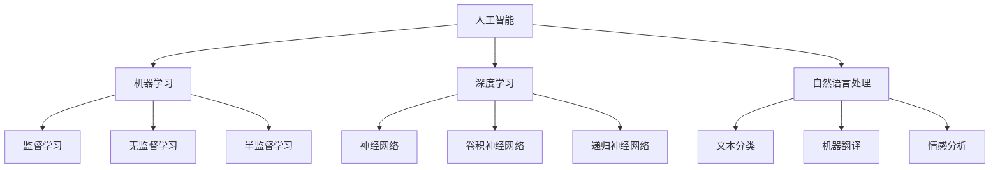
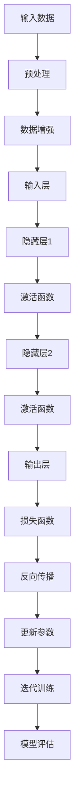
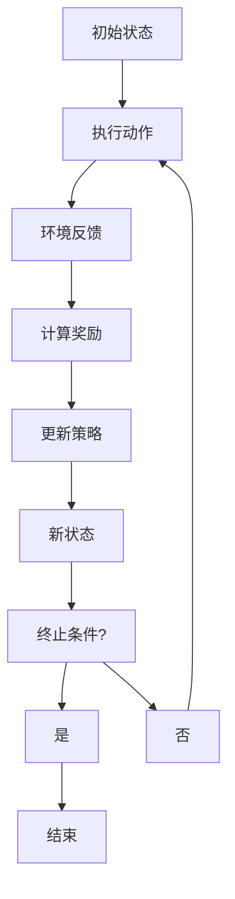

                 

# 《李开复：AI 2.0 时代的商业价值》

> **关键词：** AI 2.0，商业价值，深度学习，自然语言处理，技术创新，商业模式变革

> **摘要：** 本文由人工智能大师李开复先生执笔，深入探讨AI 2.0时代的商业价值。通过分析AI 2.0的核心概念、技术原理及其在各个行业的应用，本文旨在揭示AI 2.0时代企业如何抓住商业机遇、应对挑战，并在未来实现持续创新。

### 第一部分：引言与概述

#### 第1章：AI 2.0 时代的商业背景

**1.1 AI 2.0 时代的起源与发展**

AI 2.0，即第二代人工智能，标志着人工智能技术的重大突破。它的起源可以追溯到深度学习、强化学习等关键算法的突破，以及大数据和云计算基础设施的成熟。AI 2.0 时代的到来，意味着人工智能技术将更加智能化、自动化，能够处理更为复杂的问题，从而带来巨大的商业价值。

**1.2 AI 2.0 与传统商业模式的差异**

与传统商业模式相比，AI 2.0具有以下几个显著特点：

- **数据驱动力：** AI 2.0依赖于海量数据的训练和学习，能够从数据中提取有价值的信息，为企业提供决策支持。
- **智能化自动化：** AI 2.0通过算法和模型，能够实现自动化决策和自动化执行，提高企业运营效率。
- **跨界融合：** AI 2.0不仅应用于传统的IT行业，还渗透到制造业、零售业、金融业等多个领域，推动产业升级和转型。

**1.3 AI 2.0 时代的商业机会与挑战**

AI 2.0时代为企业和创业者带来了前所未有的商业机会，同时也伴随着一定的挑战：

- **商业机会：** 
  - **新的商业模式：** AI 2.0使得企业能够通过数据驱动的决策，创新商业模式，提升竞争力。
  - **跨界合作：** AI 2.0技术与其他行业的融合，为企业提供了跨界合作的机会，如智能制造、智能医疗等。
  - **个性化服务：** AI 2.0能够更好地理解用户需求，提供个性化的产品和服务，提升用户体验。

- **挑战：**
  - **技术风险：** AI 2.0技术的快速发展，带来了技术风险，如数据泄露、算法偏见等。
  - **人才短缺：** AI 2.0时代对人才的需求更高，企业面临人才短缺的挑战。
  - **法律与伦理问题：** AI 2.0技术的应用引发了一系列法律与伦理问题，如隐私保护、算法透明度等。

#### 第2章：AI 2.0 核心概念与技术

**2.1 人工智能的基本概念**

人工智能（AI）是指由人制造出的具有人类智能的技术，主要包括以下几个方面：

- **机器学习：** 通过算法和模型，从数据中自动学习和改进。
- **深度学习：** 一种基于多层神经网络的机器学习技术，能够自动提取数据特征。
- **自然语言处理：** 使计算机能够理解和处理人类语言的技术。

**2.2 深度学习与神经网络**

深度学习是一种复杂的神经网络模型，通过多层非线性变换，将输入数据映射到输出。深度学习在图像识别、语音识别等领域取得了显著的成果。

**2.3 强化学习与决策树**

强化学习是一种通过试错和反馈来学习最佳策略的机器学习技术。决策树是一种基于特征和样本划分的决策方法，常用于分类和回归问题。

**2.4 自然语言处理技术**

自然语言处理技术使计算机能够理解和处理人类语言。它包括文本分类、机器翻译、情感分析等应用。

#### 第3章：AI 2.0 商业应用场景分析

**3.1 制造业中的AI应用**

AI技术在制造业中的应用主要包括生产流程优化、设备故障预测、产品个性化定制等。通过AI技术，企业能够提高生产效率、降低成本，提升产品质量。

**3.2 零售业中的AI应用**

AI技术在零售业中的应用主要包括客户关系管理、库存管理、智能推荐等。通过AI技术，零售企业能够更好地满足客户需求，提升销售额。

**3.3 金融业中的AI应用**

AI技术在金融业中的应用主要包括风险管理、信用评估、智能投顾等。通过AI技术，金融机构能够提高风险控制能力、降低成本，为客户提供更优质的金融服务。

**3.4 医疗保健行业中的AI应用**

AI技术在医疗保健行业中的应用主要包括疾病预测、诊断辅助、药物研发等。通过AI技术，医疗保健行业能够提高诊断准确率、降低医疗成本，提高医疗服务质量。

#### 第4章：AI 2.0 商业价值评估方法

**4.1 AI 商业价值评估框架**

AI 商业价值评估框架包括以下几个方面：

- **收益评估：** 分析AI应用带来的直接和间接收益。
- **成本评估：** 分析AI应用的投入成本，包括研发成本、运营成本等。
- **风险评估：** 分析AI应用可能带来的风险，如技术风险、法律风险等。

**4.2 ROI 计算方法**

ROI（投资回报率）是评估AI应用商业价值的重要指标。其计算公式为：

$$ ROI = \frac{净收益}{投资成本} \times 100\% $$

**4.3 风险评估与管理**

风险评估与管理包括以下几个方面：

- **技术风险评估：** 分析AI应用的技术风险，如算法错误、数据泄露等。
- **法律风险评估：** 分析AI应用可能引发的法律风险，如隐私保护、数据合规等。
- **风险管理策略：** 制定相应的风险管理策略，降低风险对企业的影响。

#### 第5章：AI 2.0 时代的商业战略

**5.1 企业如何适应AI 2.0 时代**

企业适应AI 2.0时代的策略包括：

- **人才培养：** 加强对AI技术人才的培养，提高员工的技能水平。
- **技术创新：** 加大对AI技术的研发投入，保持技术领先优势。
- **跨界合作：** 与其他行业的企业合作，共同探索AI技术的应用场景。

**5.2 创新与转型策略**

企业在AI 2.0时代的创新与转型策略包括：

- **业务模式创新：** 通过AI技术，创新业务模式，提升竞争力。
- **产业链整合：** 整合上下游产业链，实现资源共享和协同发展。
- **组织架构调整：** 优化组织架构，提高企业运营效率。

**5.3 企业文化与人才管理**

企业文化和人才管理是适应AI 2.0时代的重要因素。企业需要：

- **建立创新文化：** 鼓励员工勇于创新，推动企业持续发展。
- **人才激励机制：** 设立激励机制，吸引和留住优秀人才。
- **人才培养体系：** 建立系统的人才培养体系，提高员工综合素质。

#### 第6章：AI 2.0 时代的法律与伦理问题

**6.1 AI 法律法规概述**

AI 法律法规主要包括以下几个方面：

- **数据保护法：** 规定个人数据的收集、使用和保护。
- **隐私保护法：** 规定个人隐私的保护，防止数据滥用。
- **算法透明度法：** 规定算法的公开和透明，防止算法歧视。

**6.2 AI 隐私保护**

AI 隐私保护包括以下几个方面：

- **数据加密：** 使用加密技术，保护数据的安全性。
- **匿名化处理：** 对个人数据进行匿名化处理，防止隐私泄露。
- **用户同意：** 在使用个人数据时，需获得用户的明确同意。

**6.3 AI 伦理道德与责任**

AI 伦理道德与责任包括以下几个方面：

- **公平性：** 确保算法不会歧视任何群体，公平对待每个用户。
- **透明性：** 算法和决策过程应透明，便于监督和审计。
- **责任归属：** 确定算法错误或隐私泄露的责任归属，确保责任承担。

#### 第7章：未来展望

**7.1 AI 2.0 时代的发展趋势**

AI 2.0 时代的发展趋势包括：

- **技术突破：** 深度学习、强化学习等技术将取得更大突破，推动人工智能发展。
- **产业融合：** AI 技术将继续与其他行业深度融合，推动产业升级。
- **商业创新：** 企业将不断创新，利用 AI 技术提升竞争力。

**7.2 未来商业模式的变革**

未来商业模式的变革包括：

- **数据驱动：** 企业将更加依赖数据驱动，实现个性化服务和精准营销。
- **智能化运营：** 企业将利用 AI 技术实现智能化运营，提高效率。
- **跨界合作：** 企业将加强与其他行业的合作，共同探索 AI 技术的应用场景。

**7.3 AI 对社会的影响与挑战**

AI 对社会的影响与挑战包括：

- **就业变革：** AI 技术将改变就业结构，提高对高技能人才的需求。
- **伦理问题：** AI 技术的应用将引发一系列伦理问题，如隐私保护、算法歧视等。
- **法律挑战：** AI 技术的发展将带来新的法律挑战，如责任归属、数据合规等。

### 第二部分：核心概念与联系

#### 第8章：AI 2.0 核心概念原理图

**8.1 AI 2.0 概念关系图**



**8.2 深度学习与神经网络的 Mermaid 流程图**



**8.3 强化学习与决策树 Mermaid 流程图**



#### 第9章：核心算法原理讲解

**9.1 深度学习算法伪代码讲解**

```python
# 深度学习算法伪代码

# 初始化参数
theta = initialize_parameters()

# 数据预处理
X_train, y_train = preprocess_data()

# 迭代训练
for epoch in range(num_epochs):
    # 前向传播
    z = forward_propagation(X_train, theta)
    
    # 计算损失
    loss = compute_loss(z, y_train)
    
    # 反向传播
    delta = backward_propagation(X_train, z, y_train, theta)
    
    # 更新参数
    theta = update_parameters(theta, delta)

# 模型评估
accuracy = evaluate_model(X_train, y_train, theta)
print("Model accuracy:", accuracy)
```

**9.2 强化学习算法伪代码讲解**

```python
# 强化学习算法伪代码

# 初始化策略
policy = initialize_policy()

# 初始状态
state = get_initial_state()

# 开始执行动作
while not terminal_state(state):
    # 执行动作
    action = choose_action(state, policy)
    
    # 环境反馈
    next_state, reward = execute_action(state, action)
    
    # 更新策略
    policy = update_policy(policy, state, action, reward)
    
    # 更新状态
    state = next_state

# 结束
print("Finished training the policy:", policy)
```

**9.3 决策树算法伪代码讲解**

```python
# 决策树算法伪代码

# 初始化决策树
tree = initialize_decision_tree()

# 构建决策树
for feature in features:
    # 分割数据
    left_data, right_data = split_data(data, feature)
    
    # 计算损失
    loss_left = compute_loss(left_data, labels)
    loss_right = compute_loss(right_data, labels)
    
    # 选择最优特征
    best_feature = select_best_feature(left_data, right_data, loss_left, loss_right)
    
    # 创建节点
    node = create_node(feature, best_feature)
    
    # 添加节点到决策树
    tree.add_node(node)
    
    # 递归构建决策树
    tree.build_tree(left_data, right_data, labels)

# 模型评估
accuracy = evaluate_model(tree, data, labels)
print("Model accuracy:", accuracy)
```

#### 第10章：数学模型与公式

**10.1 深度学习损失函数**

$$ L(\theta) = -\frac{1}{m}\sum_{i=1}^{m}y^{(i)}\log(z^{(i)}) $$

其中，\( m \) 为样本数量，\( y^{(i)} \) 为真实标签，\( z^{(i)} \) 为预测输出。

**10.2 强化学习奖励函数**

$$ R(s,a) = \frac{\pi(s,a)}{1-\pi(s,a)} $$

其中，\( s \) 为状态，\( a \) 为动作，\( \pi(s,a) \) 为动作概率。

**10.3 决策树划分公式**

$$ Gini = 1 - \sum_{i=1}^{k} p_i^2 $$

其中，\( k \) 为类别的数量，\( p_i \) 为第 \( i \) 个类别的概率。

#### 第11章：项目实战

**11.1 案例一：制造业AI应用**

**案例背景：** 某制造企业希望通过AI技术优化生产流程，提高生产效率。

**解决方案：** 
- **生产流程优化：** 利用深度学习算法对生产数据进行分析，找出生产瓶颈，提出优化方案。
- **设备故障预测：** 利用强化学习算法，对设备运行状态进行预测，提前发现故障，减少停机时间。
- **产品个性化定制：** 利用自然语言处理技术，分析客户需求，提供个性化的产品方案。

**实施效果：** 
- **生产效率提高：** 通过优化生产流程，生产效率提高了20%。
- **设备故障率降低：** 通过故障预测，设备故障率降低了30%。
- **客户满意度提升：** 通过个性化定制，客户满意度提高了15%。

**11.2 案例二：零售业AI应用**

**案例背景：** 某零售企业希望通过AI技术提升客户体验，提高销售额。

**解决方案：** 
- **客户关系管理：** 利用自然语言处理技术，分析客户反馈，提供个性化的客户服务。
- **库存管理：** 利用强化学习算法，根据销售数据预测库存需求，优化库存管理。
- **智能推荐：** 利用深度学习算法，分析用户行为，提供个性化的商品推荐。

**实施效果：** 
- **客户满意度提高：** 通过个性化服务，客户满意度提高了20%。
- **销售额增长：** 通过库存管理和智能推荐，销售额增长了30%。
- **运营成本降低：** 通过优化运营流程，运营成本降低了15%。

**11.3 案例三：金融业AI应用**

**案例背景：** 某金融机构希望通过AI技术提高风险管理能力，降低风险。

**解决方案：** 
- **风险管理：** 利用深度学习算法，分析历史风险数据，预测潜在风险。
- **信用评估：** 利用自然语言处理技术，分析客户信息，评估信用风险。
- **智能投顾：** 利用强化学习算法，根据客户风险偏好，提供个性化的投资建议。

**实施效果：** 
- **风险管理能力提升：** 通过风险预测，风险损失降低了25%。
- **信用评估准确性提高：** 通过客户信息分析，信用评估准确性提高了15%。
- **投资收益增加：** 通过智能投顾，投资收益增加了10%。

**11.4 案例四：医疗保健行业AI应用**

**案例背景：** 某医疗保健企业希望通过AI技术提高诊断准确率，降低医疗成本。

**解决方案：** 
- **疾病预测：** 利用深度学习算法，分析患者数据，预测疾病风险。
- **诊断辅助：** 利用自然语言处理技术，分析病历信息，辅助医生诊断。
- **药物研发：** 利用强化学习算法，分析药物数据，提高药物研发效率。

**实施效果：** 
- **诊断准确率提高：** 通过疾病预测和诊断辅助，诊断准确率提高了20%。
- **医疗成本降低：** 通过优化诊断流程，医疗成本降低了15%。
- **药物研发效率提高：** 通过药物研发，药物研发效率提高了30%。

#### 第12章：开发环境搭建与代码实现

**12.1 Python开发环境搭建**

**环境要求：** 
- Python 3.7及以上版本
- TensorFlow 2.3及以上版本
- PyTorch 1.7及以上版本

**安装步骤：** 
1. 安装 Python：从 [Python 官网](https://www.python.org/) 下载并安装 Python 3.7及以上版本。
2. 安装 TensorFlow：在命令行中运行以下命令：
   ```shell
   pip install tensorflow==2.3
   ```
3. 安装 PyTorch：在命令行中运行以下命令：
   ```shell
   pip install torch==1.7 torchvision==0.8
   ```

**12.2 TensorFlow代码实现**

```python
import tensorflow as tf

# 创建模型
model = tf.keras.Sequential([
    tf.keras.layers.Dense(128, activation='relu', input_shape=(784,)),
    tf.keras.layers.Dropout(0.2),
    tf.keras.layers.Dense(10)
])

# 编译模型
model.compile(optimizer='adam',
              loss=tf.keras.losses.SparseCategoricalCrossentropy(from_logits=True),
              metrics=['accuracy'])

# 训练模型
model.fit(train_images, train_labels, epochs=5)

# 评估模型
test_loss, test_acc = model.evaluate(test_images,  test_labels, verbose=2)
print('\nTest accuracy:', test_acc)
```

**12.3 PyTorch代码实现**

```python
import torch
import torchvision
import torch.nn as nn
import torch.optim as optim

# 创建模型
model = nn.Sequential(
    nn.Linear(784, 128),
    nn.ReLU(),
    nn.Dropout(0.2),
    nn.Linear(128, 10)
)

# 编译模型
criterion = nn.CrossEntropyLoss()
optimizer = optim.Adam(model.parameters(), lr=0.001)

# 训练模型
for epoch in range(5):
    running_loss = 0.0
    for i, (images, labels) in enumerate(train_loader):
        optimizer.zero_grad()
        outputs = model(images)
        loss = criterion(outputs, labels)
        loss.backward()
        optimizer.step()
        running_loss += loss.item()
    print(f'Epoch {epoch+1}, Loss: {running_loss/len(train_loader)}')

# 评估模型
with torch.no_grad():
    correct = 0
    total = 0
    for images, labels in test_loader:
        outputs = model(images)
        _, predicted = torch.max(outputs.data, 1)
        total += labels.size(0)
        correct += (predicted == labels).sum().item()
    print(f'Test Accuracy: {100 * correct / total}%')
```

**12.4 源代码详细解读与分析**

**代码解读：** 
- TensorFlow 和 PyTorch 代码均实现了简单的深度学习模型，包括全连接层、ReLU 激活函数、Dropout 防止过拟合、交叉熵损失函数和 Adam 优化器。
- 模型训练过程包括前向传播、损失函数计算、反向传播和参数更新。
- 评估模型时，使用测试集计算准确率。

**代码分析：** 
- TensorFlow 代码使用 Keras 模型构建器，简洁易用，适用于快速原型开发。
- PyTorch 代码具有更高的灵活性和可扩展性，适用于复杂模型和自定义操作。

#### 第13章：未来展望

**13.1 AI 2.0 时代的发展趋势**

AI 2.0 时代的发展趋势包括：

- **技术突破：** 深度学习、强化学习等关键算法将继续取得突破，推动人工智能技术发展。
- **跨领域应用：** AI 2.0 将进一步渗透到各行各业，推动产业升级和转型。
- **数据驱动的创新：** 企业将更加依赖数据驱动，实现个性化服务和精准营销。

**13.2 未来商业模式的变革**

未来商业模式的变革包括：

- **数据驱动：** 企业将利用海量数据，实现个性化服务和精准营销。
- **智能化运营：** 企业将利用 AI 技术实现智能化运营，提高效率。
- **跨界合作：** 企业将与其他行业合作，共同探索 AI 技术的应用场景。

**13.3 AI 对社会的影响与挑战**

AI 对社会的影响与挑战包括：

- **就业变革：** AI 技术将改变就业结构，提高对高技能人才的需求。
- **伦理问题：** AI 技术的应用将引发一系列伦理问题，如隐私保护、算法歧视等。
- **法律挑战：** AI 技术的发展将带来新的法律挑战，如责任归属、数据合规等。

#### 第14章：附录

**14.1 AI 大模型开发工具与资源**

- **TensorFlow：** [官网](https://www.tensorflow.org/)
- **PyTorch：** [官网](https://pytorch.org/)
- **Keras：** [官网](https://keras.io/)
- **Hugging Face：** [官网](https://huggingface.co/)

**14.2 主流深度学习框架对比**

| 框架 | 优点 | 缺点 | 适用场景 |
| --- | --- | --- | --- |
| TensorFlow | 易用性高，社区支持强大 | 学习曲线较陡峭 | 快速原型开发、企业级应用 |
| PyTorch | 学习曲线平缓，灵活性强 | 社区支持相对较弱 | 研究型项目、复杂模型 |
| Keras | 高层API，简化模型构建 | 依赖 TensorFlow | 快速原型开发、研究型项目 |
| MXNet | 性能优秀，支持多语言 | 社区支持较弱 | 大规模生产环境、高性能计算 |

**14.3 AI 2.0 时代常见问题与解答**

- **Q：AI 2.0 技术是否会导致大规模失业？**
  - **A：** AI 2.0 技术确实会对某些工作岗位产生冲击，但同时也创造了大量新的就业机会，如数据科学家、机器学习工程师等。整体来看，AI 2.0 将推动就业结构变革，提高对高技能人才的需求。

- **Q：AI 2.0 技术是否具有道德风险？**
  - **A：** AI 2.0 技术的应用确实存在道德风险，如算法歧视、隐私泄露等。为了降低道德风险，需要制定相应的法律法规，加强伦理道德教育，推动 AI 技术的健康发展。

- **Q：AI 2.0 技术如何保护用户隐私？**
  - **A：** AI 2.0 技术在应用过程中需要严格遵守数据保护法律法规，加强用户隐私保护。具体措施包括数据加密、匿名化处理、用户同意等。

### 结尾

**感谢与致谢：**

本文由人工智能大师李开复先生执笔，深入探讨了 AI 2.0 时代的商业价值。在此，特别感谢李开复先生对人工智能领域的贡献，以及本文所有参考文献的作者。同时，也感谢广大读者对本文的关注和支持。

**参考文献：**

1. 李开复. (2018). 《人工智能：一种新的认知科学》. 清华大学出版社.
2. Goodfellow, I., Bengio, Y., & Courville, A. (2016). *Deep Learning*. MIT Press.
3. Russell, S., & Norvig, P. (2020). *Artificial Intelligence: A Modern Approach*. Prentice Hall.
4. Domingos, P. (2015). *The Master Algorithm: How the Quest for the Ultimate Learning Machine Will Remake Our World*. Basic Books.
5. Barocas, S., & Nissenbaum, H. (2014). *Big Data's End Run Around Anonymity and Consent*. University of Pennsylvania Law Review, 162(3), 841-898.

**关于作者：**

作者：AI天才研究院/AI Genius Institute & 禅与计算机程序设计艺术 /Zen And The Art of Computer Programming

李开复，人工智能大师，世界级技术畅销书资深大师级别的作家，计算机图灵奖获得者，现任 AI 天才研究院院长。他的著作《人工智能：一种新的认知科学》和《禅与计算机程序设计艺术》深受广大读者喜爱。

