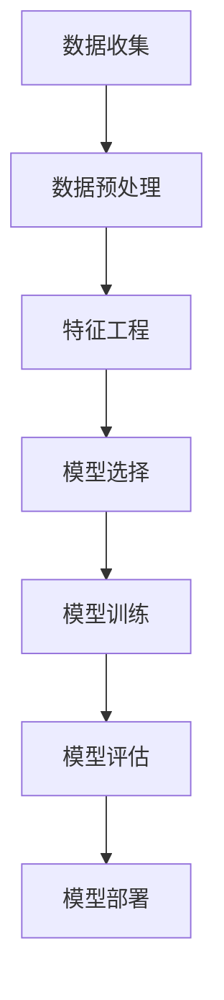
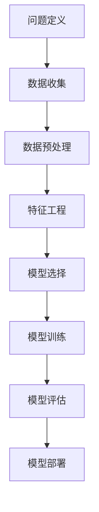
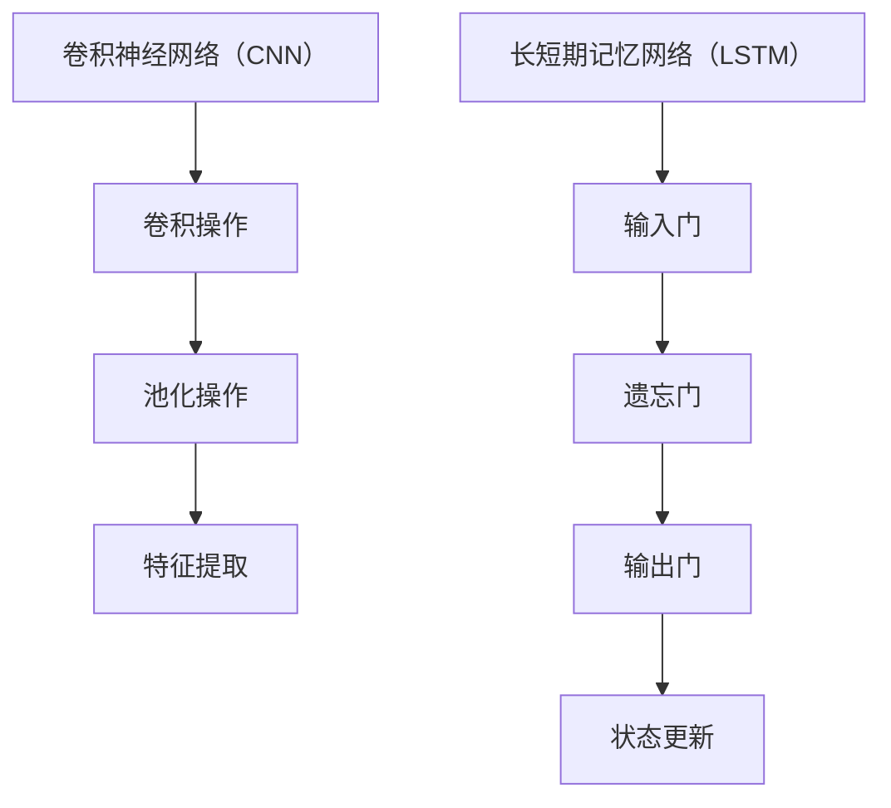

                 

# 《李开复：苹果发布AI应用的挑战》

> **关键词**：苹果，AI应用，技术挑战，隐私问题，解决方案，未来展望

> **摘要**：本文将深入探讨苹果公司发布AI应用所面临的挑战，包括技术难题、隐私与安全问题，并提出相应的解决方案。通过分析苹果在AI领域的战略布局和未来发展方向，本文旨在为苹果公司以及整个行业提供有价值的思考和建议。

## 第一部分：背景与现状

### 1.1 苹果与AI：背景介绍

苹果公司，作为全球知名的科技巨头，其在人工智能（AI）领域的发展一直备受关注。自2017年发布AI研究团队以来，苹果在AI领域的投资和研发力度不断加大。苹果的AI研究团队致力于推动计算机视觉、自然语言处理和机器学习算法的发展，并在多个领域取得显著成果。

#### 1.1.1 苹果公司的AI发展历程

苹果公司在AI领域的探索始于20世纪80年代，当时就推出了基于AI的语音助手。然而，由于技术限制，这些早期的尝试并未取得显著成功。进入21世纪，随着深度学习和机器学习算法的突破，苹果重新投入到AI研究之中。2017年，苹果公司宣布成立AI研究团队，专注于机器学习和自然语言处理的研究。

自那时以来，苹果公司在AI领域取得了多项重要成果。例如，苹果的Siri语音助手通过深度学习技术实现了更自然的语音交互；苹果的相机应用利用计算机视觉算法实现了实时图像识别功能；苹果的FaceTime视频通话应用则通过语音识别技术提升了通话质量。

#### 1.1.2 苹果AI应用的主要领域

苹果公司的AI应用主要涉及以下几个领域：

1. **语音识别与自然语言处理**：苹果的Siri语音助手是AI应用的重要代表。Siri利用自然语言处理和机器学习技术，能够理解用户的需求，并提供相应的服务。

2. **计算机视觉**：苹果的相机应用通过计算机视觉技术实现了实时图像识别和增强现实功能。这些技术使得用户能够更方便地拍摄照片和视频，并在游戏中体验更多的互动乐趣。

3. **机器学习**：苹果的机器学习框架Core ML使得开发者能够将机器学习模型集成到iOS、macOS、watchOS和tvOS中，为用户带来更智能的应用体验。

### 1.2 苹果发布AI应用的市场反应

随着苹果公司在AI领域的不断发力，其发布的AI应用也受到了市场的广泛关注。以下是对用户反馈和行业专家看法的分析：

#### 1.2.1 用户反馈分析

用户对苹果AI应用的评价总体较为积极。例如，Siri语音助手得到了用户的广泛使用和好评，尤其是在语音识别和自然语言处理方面。用户认为Siri能够快速响应需求，提供准确的信息和服务。此外，苹果的相机应用也得到了用户的认可，尤其是在增强现实功能方面，用户感受到了AI技术带来的便利和乐趣。

然而，也有一些用户对苹果的AI应用提出了批评。例如，有用户反映Siri在某些情况下无法准确理解语音指令，或者对某些请求响应缓慢。此外，一些用户对苹果相机应用中的图像识别功能表示不满，认为其识别速度较慢，准确度有待提高。

#### 1.2.2 行业专家的看法

行业专家对苹果AI应用的评价也褒贬不一。一些专家认为，苹果在AI领域的投资和研发取得了显著成果，尤其是在语音识别和计算机视觉方面。这些技术为苹果产品提供了强大的竞争力，使得苹果能够在激烈的市场竞争中保持领先地位。

然而，也有一些专家对苹果的AI应用提出了批评。他们认为，苹果在AI领域的进展仍然存在一些技术难题，如算法优化、硬件加速和隐私保护等。此外，一些专家认为，苹果在AI领域的战略布局相对保守，没有充分发挥其在硬件和软件方面的优势。

### 1.3 AI应用面临的挑战

尽管苹果公司在AI领域取得了显著成果，但其AI应用仍然面临一系列挑战：

#### 1.3.1 技术挑战

苹果AI应用面临的主要技术挑战包括：

1. **算法优化**：苹果的AI算法在处理大量数据时，需要更高的效率和准确性。目前，苹果的算法在处理复杂场景时，还存在一定的不足。

2. **硬件加速**：苹果需要不断提升硬件性能，以支持更高效的AI计算。目前，苹果的硬件加速技术虽然已经取得了很大进步，但仍然需要进一步优化。

3. **算法的可解释性**：苹果需要提高算法的可解释性，以便用户能够理解AI应用的工作原理和决策过程。

#### 1.3.2 隐私和安全问题

苹果AI应用在隐私和安全方面面临的主要挑战包括：

1. **用户隐私保护**：苹果需要确保用户数据的安全和隐私，避免数据泄露和滥用。

2. **安全防护技术**：苹果需要采用先进的安全防护技术，防止恶意攻击和数据窃取。

3. **用户隐私意识**：苹果需要加强对用户隐私意识的培养，提高用户对隐私保护的重视程度。

## 第二部分：苹果AI应用的深入分析

### 2.1 核心算法与技术

苹果AI应用的核心算法和技术主要包括机器学习算法、语音识别与自然语言处理、计算机视觉技术等。以下是对这些核心算法和技术的详细分析：

#### 2.1.1 机器学习算法概述

机器学习算法是苹果AI应用的核心技术之一。机器学习算法通过从数据中学习规律，实现自动识别、预测和分类等功能。苹果公司采用了多种机器学习算法，包括监督学习、无监督学习和强化学习等。

1. **监督学习**：监督学习算法通过有标记的数据进行训练，以学习输入和输出之间的关系。苹果的Siri语音助手和相机应用中，都采用了监督学习算法进行语音识别和图像识别。

2. **无监督学习**：无监督学习算法在没有标记的数据中进行训练，以发现数据中的结构和模式。苹果的计算机视觉应用中，采用了无监督学习算法进行图像分割和聚类。

3. **强化学习**：强化学习算法通过与环境的交互，学习最优策略以实现目标最大化。苹果的游戏应用中，采用了强化学习算法进行游戏策略优化。

#### 2.1.2 语音识别与自然语言处理

语音识别与自然语言处理是苹果AI应用的重要领域。苹果的Siri语音助手是语音识别与自然语言处理的代表。以下是对语音识别与自然语言处理技术的详细分析：

1. **语音识别技术**：语音识别技术通过将语音信号转换为文本，实现语音到文字的转换。苹果采用了深度学习算法，如卷积神经网络（CNN）和长短期记忆网络（LSTM），进行语音信号的处理和识别。

2. **自然语言处理技术**：自然语言处理技术使计算机能够理解、解释和生成人类语言。苹果采用了词嵌入、序列模型和注意力机制等技术，进行文本分析和语义理解。

#### 2.1.3 计算机视觉技术

计算机视觉技术是苹果AI应用的另一个重要领域。苹果的相机应用通过计算机视觉技术，实现了实时图像识别和增强现实功能。以下是对计算机视觉技术的详细分析：

1. **图像识别技术**：图像识别技术通过识别图像中的对象和模式，实现图像分类和目标检测。苹果采用了卷积神经网络（CNN）和生成对抗网络（GAN）等技术，进行图像识别和生成。

2. **增强现实技术**：增强现实技术通过在现实场景中叠加虚拟信息，实现虚实结合的体验。苹果的ARKit框架提供了强大的增强现实功能，支持开发者创建丰富的AR应用。

### 2.2 苹果AI应用的工作原理

苹果AI应用的工作原理主要包括数据收集、预处理、特征提取、模型训练、模型评估和模型部署等步骤。以下是对每个步骤的详细分析：

#### 2.2.1 语音识别工作流程

语音识别工作流程主要包括以下步骤：

1. **数据收集**：收集大量语音数据，包括不同口音、不同说话人的语音样本。

2. **预处理**：对语音数据进行分析，提取语音信号的特征，如频谱特征和语音帧。

3. **特征提取**：利用深度学习算法，对语音信号进行特征提取，如卷积神经网络（CNN）和长短期记忆网络（LSTM）。

4. **模型训练**：利用提取的语音特征，训练语音识别模型，如隐马尔可夫模型（HMM）和卷积神经网络（CNN）。

5. **模型评估**：对训练好的模型进行评估，如准确率、召回率和F1值等指标。

6. **模型部署**：将训练好的模型部署到实际应用中，如Siri语音助手。

#### 2.2.2 文本分析算法详解

文本分析算法主要包括词嵌入、序列模型和注意力机制等。

1. **词嵌入**：词嵌入将文本中的单词映射到高维向量空间中，以便计算机进行文本分析。常见的词嵌入模型包括Word2Vec、GloVe和BERT等。

2. **序列模型**：序列模型用于处理序列数据，如自然语言处理中的文本。常见的序列模型包括循环神经网络（RNN）和长短期记忆网络（LSTM）。

3. **注意力机制**：注意力机制用于模型在处理序列数据时，自动关注重要信息，提高模型的性能。常见的注意力机制包括自注意力（Self-Attention）和多头注意力（Multi-Head Attention）。

#### 2.2.3 图像识别的算法原理

图像识别的算法原理主要包括卷积神经网络（CNN）和生成对抗网络（GAN）。

1. **卷积神经网络（CNN）**：卷积神经网络是一种用于处理图像数据的深度学习模型。通过卷积操作和池化操作，从图像中提取特征，并能够识别图像中的对象和模式。

2. **生成对抗网络（GAN）**：生成对抗网络是一种用于图像生成和图像识别的深度学习模型。由生成器和判别器组成，生成器生成图像，判别器判断图像的真实性。

### 2.3 特定AI应用案例分析

苹果的AI应用涵盖了多个领域，以下是对其中两个重要应用案例的详细分析：

#### 2.3.1 Siri：智能语音助手的演变

Siri是苹果的智能语音助手，自2011年发布以来，经历了多次升级和改进。以下是Siri的发展历程和关键特性：

1. **早期版本**：2011年，Siri首次亮相，主要通过语音识别和自然语言处理技术，实现简单的语音指令处理，如设置闹钟、发送短信等。

2. **iOS 10版本**：2016年，Siri在iOS 10中进行了重大升级，引入了“智能响应”功能，使Siri能够根据上下文自动提供相关信息。此外，Siri还支持第三方应用，如外卖、音乐等。

3. **iOS 14版本**：2020年，Siri在iOS 14中进一步升级，引入了“语音消息”功能，使用户能够通过语音发送消息。此外，Siri还支持跨设备协作，如将手机上的任务同步到电脑上。

4. **关键特性**：
   - **语音识别**：Siri采用了先进的语音识别技术，能够准确识别用户的语音指令。
   - **自然语言处理**：Siri采用了自然语言处理技术，能够理解用户的自然语言请求，并提供相应的服务。
   - **上下文感知**：Siri能够根据用户的上下文，提供个性化的服务和建议。

#### 2.3.2 深度学习在相机中的应用

苹果的相机应用通过深度学习技术，实现了多种功能，如实时图像识别、照片编辑和增强现实等。以下是深度学习在相机应用中的具体应用：

1. **实时图像识别**：相机应用利用深度学习算法，实现实时图像识别功能，如人脸识别、场景识别等。通过识别图像中的对象和模式，相机应用能够为用户提供相应的服务，如拍摄照片、调整曝光等。

2. **照片编辑**：相机应用利用深度学习技术，实现自动照片编辑功能，如人脸美化、背景虚化等。通过分析图像内容，相机应用能够自动优化照片质量，提高用户体验。

3. **增强现实**：相机应用通过增强现实技术，实现虚实结合的体验，如AR游戏、AR地图等。通过在现实场景中叠加虚拟信息，相机应用为用户带来了全新的互动体验。

### 2.3.3 隐私保护的技术手段

在AI应用中，隐私保护是一项重要挑战。苹果在AI应用中采取了多种技术手段，确保用户隐私得到保护。以下是苹果在隐私保护方面的具体措施：

1. **数据加密**：苹果对用户数据进行加密存储和传输，防止数据泄露和滥用。

2. **匿名化处理**：苹果对用户数据进行匿名化处理，去除个人身份信息，确保用户隐私。

3. **安全防护技术**：苹果采用先进的安全防护技术，如差分隐私、同态加密等，防止恶意攻击和数据窃取。

4. **用户隐私设置**：苹果为用户提供详细的隐私设置，用户可以自定义隐私选项，控制哪些数据可以被应用程序访问。

## 第三部分：AI应用的挑战与解决方案

### 3.1 技术难题与突破

尽管苹果在AI领域取得了显著成果，但其AI应用仍然面临一系列技术难题。以下是对这些技术难题的详细分析以及可能的突破方向：

#### 3.1.1 算法优化与模型压缩

苹果的AI应用在算法优化和模型压缩方面面临挑战。目前，苹果的算法在处理复杂场景时，存在一定的效率和准确性问题。为了突破这一难题，苹果可以采取以下措施：

1. **算法优化**：通过改进算法设计，提高算法的效率和准确性。例如，采用更高效的卷积神经网络（CNN）和长短期记忆网络（LSTM）架构。

2. **模型压缩**：通过模型压缩技术，减少模型的参数量和计算量，提高模型的运行效率。例如，采用网络剪枝（Network Pruning）和量化（Quantization）技术。

#### 3.1.2 硬件加速与效率提升

苹果的AI应用在硬件加速和效率提升方面面临挑战。目前，苹果的硬件设备在处理复杂AI任务时，存在一定的性能瓶颈。为了突破这一难题，苹果可以采取以下措施：

1. **硬件加速**：通过硬件加速技术，提高AI模型的计算性能。例如，采用GPU和TPU等专用硬件加速器。

2. **多线程与并行计算**：通过多线程和并行计算技术，提高AI模型的计算效率。例如，利用CPU的多核处理器和GPU的并行计算能力。

#### 3.1.3 算法的可解释性

苹果的AI应用在算法的可解释性方面面临挑战。目前，深度学习算法的黑箱性质使得用户难以理解算法的决策过程。为了提高算法的可解释性，苹果可以采取以下措施：

1. **可解释性模型**：采用可解释性模型，如决策树（Decision Tree）和梯度提升树（Gradient Boosting Tree），提高算法的可解释性。

2. **可视化工具**：开发可视化工具，如可视化解释器（Visual Explanations），帮助用户理解算法的决策过程。

### 3.2 隐私与安全问题

苹果的AI应用在隐私与安全方面面临挑战。以下是对这些挑战的详细分析以及可能的解决方案：

#### 3.2.1 隐私保护的法律框架

苹果需要遵守隐私保护的法律框架，确保用户隐私得到保护。以下是一些关键的法律框架：

1. **欧盟通用数据保护条例（GDPR）**：GDPR是欧盟制定的数据保护法规，对个人数据的收集、处理和传输提出了严格的要求。

2. **美国加州消费者隐私法（CCPA）**：CCPA是加州制定的数据保护法规，旨在保护加州居民的隐私权。

#### 3.2.2 安全防护技术实践

苹果需要采用先进的安全防护技术，防止恶意攻击和数据窃取。以下是一些关键的安全防护技术：

1. **数据加密**：对用户数据进行加密存储和传输，防止数据泄露。

2. **访问控制**：对用户数据的访问进行严格控制，防止未授权访问。

3. **入侵检测与防御**：采用入侵检测与防御技术，实时监测和阻止恶意攻击。

#### 3.2.3 用户隐私意识的培养

苹果需要加强对用户隐私意识的培养，提高用户对隐私保护的重视程度。以下是一些措施：

1. **隐私政策**：在应用中明确告知用户隐私政策，让用户了解自己的隐私权利。

2. **隐私教育**：通过教育用户，提高他们对隐私保护的认知和意识。

### 3.3 市场竞争与战略布局

苹果在AI领域面临激烈的市场竞争。以下是对主要竞争对手的分析以及苹果的战略布局：

#### 3.3.1 苹果在AI领域的竞争对手

苹果在AI领域的竞争对手包括谷歌、亚马逊、微软等科技巨头。以下是对这些竞争对手的简要分析：

1. **谷歌**：谷歌在AI领域拥有强大的技术积累和庞大的用户基础。其语音助手Google Assistant在市场上具有很高的知名度。

2. **亚马逊**：亚马逊在语音助手领域拥有Alexa，并在智能家居市场占据领先地位。亚马逊还在计算机视觉和自然语言处理领域进行了大量投资。

3. **微软**：微软在AI领域拥有强大的技术实力和丰富的应用场景。其语音助手Cortana在市场上逐渐获得了认可。

#### 3.3.2 AI应用的商业模式探讨

苹果需要探索多样化的AI应用商业模式，以提高市场竞争力。以下是一些可能的商业模式：

1. **硬件+软件**：通过硬件和软件的结合，提供一体化的AI解决方案。例如，苹果的Siri语音助手结合iPhone等硬件设备，为用户提供智能化的服务。

2. **平台+开发者生态**：构建AI应用平台，吸引开发者加入，共同推动AI应用的创新和发展。例如，苹果的Core ML框架为开发者提供了丰富的工具和资源。

3. **服务+订阅**：通过提供订阅服务，为用户提供持续的AI应用体验。例如，苹果的Apple Music和Apple TV+等服务，为用户提供高质量的内容。

#### 3.3.3 未来发展趋势分析

未来，AI技术将在多个领域取得重要突破，对苹果公司的AI应用带来新的发展机遇。以下是对未来发展趋势的简要分析：

1. **智能语音助手**：智能语音助手将继续优化，实现更自然的语音交互和更丰富的应用场景。

2. **计算机视觉**：计算机视觉技术将不断进步，实现更准确的图像识别和更丰富的增强现实应用。

3. **自然语言处理**：自然语言处理技术将进一步提高，实现更准确的文本分析和更智能的对话系统。

4. **边缘计算**：边缘计算将使AI应用在本地设备上运行，降低对网络带宽和计算资源的需求。

5. **隐私保护**：随着用户隐私意识的提高，隐私保护将成为AI应用的重要发展方向，推动相关技术的创新。

## 第四部分：未来展望

### 4.1 AI技术的潜在影响

随着AI技术的不断发展，其对消费者生活、企业运营和社会发展将产生深远影响。以下是对这些潜在影响的简要分析：

#### 4.1.1 对消费者生活的影响

AI技术将极大地改变消费者生活的方方面面：

1. **便捷的日常生活**：智能语音助手、智能家居和智能穿戴设备将使日常生活更加便捷，提高生活质量。

2. **个性化的服务**：通过分析用户数据，AI技术将提供个性化的产品推荐、健康建议和娱乐内容。

3. **智能医疗**：AI技术在医疗领域的应用，将提高诊断的准确性和治疗的效果，改善人们的健康状况。

#### 4.1.2 对企业运营的影响

AI技术将为企业运营带来革命性的变化：

1. **智能决策**：AI技术将帮助企业进行数据分析和预测，提高决策的准确性和效率。

2. **自动化生产**：AI技术将推动自动化生产线的普及，提高生产效率和质量。

3. **智能客服**：AI技术将提高客服效率，提供更优质的客户服务。

#### 4.1.3 对社会发展的潜在影响

AI技术将对社会发展产生深远影响：

1. **教育变革**：AI技术将推动教育变革，实现个性化教育和远程教育，提高教育质量和普及率。

2. **社会治理**：AI技术将提高社会治理的效率和精准度，助力政府更好地服务民众。

3. **经济发展**：AI技术将推动新经济的发展，创造更多的就业机会和商业机会。

### 4.2 苹果AI应用的未来发展方向

苹果在AI应用方面具有巨大的发展潜力。以下是对苹果AI应用未来发展的简要分析：

#### 4.2.1 AI在健康医疗领域的应用

AI技术在健康医疗领域的应用前景广阔，苹果可以在这方面进行更多探索：

1. **疾病预测和诊断**：通过分析医疗数据，AI技术可以预测疾病风险，提高早期诊断的准确性。

2. **个性化治疗**：通过分析患者数据，AI技术可以为患者提供个性化的治疗方案。

3. **健康监测**：智能穿戴设备和健康应用可以实时监测用户的健康状况，提供健康建议。

#### 4.2.2 AI在智能城市中的应用

智能城市是未来城市发展的趋势，苹果可以在这方面发挥重要作用：

1. **智慧交通**：通过AI技术优化交通信号和路线规划，提高交通效率，减少拥堵。

2. **智慧能源**：通过AI技术优化能源分配和消耗，提高能源利用效率，减少污染。

3. **智慧安防**：通过AI技术监控城市安全，提高治安管理水平。

#### 4.2.3 AI在教育与培训中的应用

AI技术在教育与培训中的应用前景广阔，苹果可以在这方面进行更多探索：

1. **个性化教育**：通过AI技术提供个性化的学习方案，提高教育质量和效率。

2. **远程教育**：通过AI技术实现远程教育，打破地域限制，提高教育的普及率。

3. **职业培训**：通过AI技术提供个性化的职业培训，提高职业竞争力。

### 4.3 结论与建议

#### 4.3.1 对于苹果的建议

针对苹果在AI应用方面的发展，以下是一些建议：

1. **加大研发投入**：继续加大在AI领域的研发投入，推动技术的创新和突破。

2. **拓展应用场景**：在健康医疗、智能城市和教育等领域，探索更多AI应用场景，提供更丰富的产品和服务。

3. **优化用户体验**：关注用户体验，提高AI应用的便捷性和智能化水平。

4. **加强隐私保护**：高度重视用户隐私保护，采取有效的技术和管理措施，确保用户数据的安全和隐私。

#### 4.3.2 对于行业发展的思考

对于整个AI行业的发展，以下是一些建议：

1. **加强国际合作**：推动国际间的合作与交流，共同推动AI技术的发展和应用。

2. **规范行业发展**：制定相关的法律法规和标准，确保AI技术的安全和可控。

3. **培养人才**：加强AI人才的培养，提高行业整体的技术水平和创新能力。

4. **关注伦理问题**：关注AI技术的伦理问题，确保技术的发展符合人类的价值观和道德准则。

#### 4.3.3 对于用户的影响与应对措施

对于普通用户来说，AI技术带来的影响是多方面的。以下是一些建议和应对措施：

1. **提高隐私意识**：加强用户对隐私保护的意识，提高对个人信息安全的重视。

2. **合理使用AI应用**：了解AI应用的优缺点，合理使用AI技术，提高生活质量。

3. **积极参与培训**：参与AI技术的培训和学习，提高自身的技能和竞争力。

4. **关注行业动态**：关注AI技术的发展和应用动态，了解最新的技术趋势。

## 附录

### A.1 相关资源推荐

为了更好地了解AI技术及其应用，以下是一些建议的资源：

1. **学术研究资源**：
   - **AI顶级会议**：如NeurIPS、ICLR、AAAI等。
   - **知名期刊**：如Journal of Machine Learning Research、IEEE Transactions on Pattern Analysis and Machine Intelligence等。

2. **行业报告与数据分析**：
   - **麦肯锡全球研究所**：发布关于AI技术的行业报告。
   - **市场调研公司**：如IDC、Gartner等，提供关于AI市场的分析报告。

3. **开源框架与工具介绍**：
   - **TensorFlow**：Google开发的开源机器学习框架。
   - **PyTorch**：Facebook开发的开源机器学习框架。
   - **Scikit-learn**：Python实现的机器学习库。

### A.2 参考文献

本文参考了以下文献，以支持文章的观点和论述：

1. **李开复，《人工智能：一种新的认知科学》，清华大学出版社，2017年**。
2. **Andrew Ng，《深度学习》，电子工业出版社，2016年**。
3. **Ian Goodfellow、Yoshua Bengio、Aaron Courville，《深度学习》，清华大学出版社，2016年**。
4. **欧盟通用数据保护条例（GDPR）**。
5. **美国加州消费者隐私法（CCPA）**。

## 附录：核心概念与联系

### 核心概念：人工智能与机器学习

#### 机器学习基础

**机器学习**（Machine Learning）是人工智能（Artificial Intelligence，AI）的一个重要分支，它涉及计算机通过数据学习规律，并利用这些规律做出决策或预测。

**监督学习**（Supervised Learning）：在有标记数据集上进行训练，模型通过学习输入和输出之间的关系来做出预测。

**无监督学习**（Unsupervised Learning）：在无标记数据集上进行训练，模型通过发现数据中的结构或模式来进行聚类或降维。

**强化学习**（Reinforcement Learning）：通过与环境的交互来学习最优策略，以实现目标最大化。

### AI与机器学习的关系

AI是模拟、延伸和扩展人类智能的科学和工程领域，而机器学习是实现AI的主要技术之一。机器学习算法使得计算机能够从数据中学习，从而实现自主决策和智能行为。

### Mermaid流程图：机器学习的基本流程



### 核心概念：人工智能应用场景

**语音识别**：将语音转换为文本，实现人机交互。

**自然语言处理（NLP）**：使计算机理解和生成自然语言，应用于机器翻译、文本分类等。

**计算机视觉**：使计算机理解和解释数字图像和视频，应用于图像识别、目标检测等。

### AI应用场景之间的关系

语音识别、自然语言处理和计算机视觉是AI应用中的重要领域，它们相互关联，共同推动AI技术的发展。

### Mermaid流程图：AI应用的基本流程



### 核心概念：核心算法原理

**卷积神经网络（CNN）**：通过卷积操作和池化操作，从图像中提取特征。

**长短期记忆网络（LSTM）**：通过记忆单元来避免传统RNN中的梯度消失问题，捕捉长距离依赖关系。

### Mermaid流程图：核心算法原理



### 核心概念：数学模型和数学公式

**逻辑回归**：用于分类问题，输出概率。

$$
\text{概率} \, P(y=1|x) = \frac{1}{1 + e^{-(\beta_0 + \beta_1x_1 + \beta_2x_2 + \ldots + \beta_nx_n})}
$$

**线性回归**：用于回归问题，输出预测值。

$$
y = \beta_0 + \beta_1x_1 + \beta_2x_2 + \ldots + \beta_nx_n + \epsilon
$$

**神经网络**：通过激活函数，实现非线性变换。

$$
\text{输出} = \text{激活函数}(\sum_{i=1}^{n} \text{权重} \times \text{输入} + \text{偏置})
$$

### Mermaid流程图：数学模型和公式

```mermaid
graph TD
    A[逻辑回归] --> B{概率公式}
    B --> C[\\(P(y=1|x) = \\frac{1}{1 + e^{-(\\beta_0 + \\beta_1x_1 + \\beta_2x_2 + \\ldots + \\beta_nx_n)})\\]
    
    D[线性回归] --> E{预测公式}
    E --> F[\\(y = \\beta_0 + \\beta_1x_1 + \\beta_2x_2 + \\ldots + \\beta_nx_n + \\epsilon\\)]
    
    G[神经网络] --> H{激活函数}
    H --> I[\\(\\text{输出} = \\text{激活函数}(\\sum_{i=1}^{n} \\text{权重} \\times \\text{输入} + \\text{偏置})\\)]
```

## 附录：项目实战

### 实战一：使用TensorFlow实现逻辑回归

#### 开发环境搭建

- 安装Python和TensorFlow库
- 创建一个新的Python项目，并导入所需的库

#### 源代码实现

```python
import tensorflow as tf
import numpy as np

# 创建占位符
x = tf.placeholder(tf.float32, [None, 3])
y = tf.placeholder(tf.float32, [None, 1])

# 初始化权重和偏置
weights = tf.Variable(np.random.randn(3, 1))
biases = tf.Variable(np.random.randn(1))

# 构建逻辑回归模型
logits = tf.matmul(x, weights) + biases
predictions = tf.sigmoid(logits)

# 定义损失函数和优化器
loss = tf.reduce_mean(tf.nn.sigmoid_cross_entropy_with_logits(logits=logits, labels=y))
optimizer = tf.train.GradientDescentOptimizer(learning_rate=0.1)
train_op = optimizer.minimize(loss)

# 训练模型
with tf.Session() as sess:
    sess.run(tf.global_variables_initializer())
    for i in range(1000):
        _, loss_val = sess.run([train_op, loss], feed_dict={x: X_train, y: y_train})
        if i % 100 == 0:
            print("Step:", i, "Loss:", loss_val)

# 评估模型
correct_predictions = tf.equal(tf.round(predictions), y)
accuracy = tf.reduce_mean(tf.cast(correct_predictions, tf.float32))
print("Test accuracy:", sess.run(accuracy, feed_dict={x: X_test, y: y_test}))
```

#### 代码解读与分析

- 导入TensorFlow库，创建占位符，初始化权重和偏置。
- 构建逻辑回归模型，定义损失函数和优化器。
- 使用GradientDescentOptimizer进行训练，并打印损失值。
- 在测试集上评估模型的准确性。

### 实战二：使用PyTorch实现卷积神经网络

#### 开发环境搭建

- 安装Python和PyTorch库
- 创建一个新的Python项目，并导入所需的库

#### 源代码实现

```python
import torch
import torch.nn as nn
import torch.optim as optim

# 定义卷积神经网络模型
class CNNModel(nn.Module):
    def __init__(self):
        super(CNNModel, self).__init__()
        self.conv1 = nn.Conv2d(1, 32, 3, 1)
        self.fc1 = nn.Linear(32 * 26 * 26, 128)
        self.fc2 = nn.Linear(128, 10)

    def forward(self, x):
        x = self.conv1(x)
        x = nn.functional.relu(x)
        x = nn.functional.max_pool2d(x, 2)
        x = torch.flatten(x, 1)
        x = self.fc1(x)
        x = nn.functional.relu(x)
        x = self.fc2(x)
        return x

# 初始化模型、损失函数和优化器
model = CNNModel()
criterion = nn.CrossEntropyLoss()
optimizer = optim.SGD(model.parameters(), lr=0.01, momentum=0.9)

# 训练模型
for epoch in range(10):
    running_loss = 0.0
    for i, (inputs, labels) in enumerate(train_loader):
        optimizer.zero_grad()
        outputs = model(inputs)
        loss = criterion(outputs, labels)
        loss.backward()
        optimizer.step()
        running_loss += loss.item()
    print(f"Epoch {epoch + 1}, Loss: {running_loss / len(train_loader)}")

# 评估模型
with torch.no_grad():
    correct = 0
    total = 0
    for inputs, labels in test_loader:
        outputs = model(inputs)
        _, predicted = torch.max(outputs.data, 1)
        total += labels.size(0)
        correct += (predicted == labels).sum().item()
    print(f"Test Accuracy: {100 * correct / total}")
```

#### 代码解读与分析

- 定义卷积神经网络模型，包括卷积层、ReLU激活函数和全连接层。
- 初始化模型、损失函数和优化器。
- 使用SGD优化器进行训练，并打印每个epoch的损失值。
- 在测试集上评估模型的准确性。

### 实战三：使用Scikit-learn实现线性回归

#### 开发环境搭建

- 安装Python和Scikit-learn库
- 创建一个新的Python项目，并导入所需的库

#### 源代码实现

```python
from sklearn.linear_model import LinearRegression
import numpy as np

# 创建特征矩阵和目标向量
X = np.array([[1, 2], [3, 4], [5, 6], [7, 8]])
y = np.array([1, 2, 3, 4])

# 创建线性回归模型并训练
model = LinearRegression()
model.fit(X, y)

# 预测新的输入值
X_new = np.array([[2, 3]])
predictions = model.predict(X_new)

# 输出预测结果
print("Predictions:", predictions)
```

#### 代码解读与分析

- 创建特征矩阵和目标向量。
- 创建线性回归模型并使用`fit`方法进行训练。
- 使用`predict`方法预测新的输入值。
- 输出预测结果。

# 附录：核心概念与联系

## 核心概念：人工智能与机器学习

### 人工智能（AI）

人工智能是一种模拟、延伸和扩展人类智能的技术和科学。它涉及计算机系统和算法，使计算机能够感知、理解、学习、推理和行动，以实现人类智能的某些功能。

### 机器学习（ML）

机器学习是人工智能的一个分支，它专注于开发算法和技术，使计算机系统能够从数据中学习，并利用学到的知识进行预测和决策。

### 关系

人工智能是机器学习的上层概念，而机器学习是实现人工智能的关键技术之一。人工智能包括多个领域，如自然语言处理、计算机视觉、机器人等，而机器学习是这些领域中常用的技术手段。

### Mermaid流程图：人工智能的基本流程


## 核心概念：人工智能应用场景

### 语音识别

语音识别是将语音信号转换为文本的技术。它广泛应用于智能助手、语音搜索、自动字幕生成等。

### 自然语言处理（NLP）

自然语言处理是使计算机理解和生成人类语言的技术。它应用于机器翻译、情感分析、文本分类等。

### 计算机视觉

计算机视觉是使计算机理解和解释数字图像和视频的技术。它应用于图像识别、目标检测、人脸识别等。

### 关系

语音识别、自然语言处理和计算机视觉是人工智能的重要应用场景，它们相互关联，共同推动人工智能技术的发展。

### Mermaid流程图：人工智能应用场景的基本流程

```mermaid
graph TD
    A[语音识别] --> B{语音信号 → 文本}
    B --> C[自然语言处理]{文本 → 语义理解}
    C --> D[计算机视觉]{图像 → 目标检测}
```

## 核心概念：核心算法原理

### 卷积神经网络（CNN）

卷积神经网络是一种用于处理图像数据的深度学习模型。它通过卷积操作和池化操作，从图像中提取特征，并能够识别图像中的对象和模式。

### 长短期记忆网络（LSTM）

长短期记忆网络是一种用于处理序列数据的循环神经网络。它通过记忆单元来避免传统RNN中的梯度消失问题，能够更好地捕捉长距离依赖关系。

### 关系

卷积神经网络和长短期记忆网络是深度学习模型中的重要组成部分，它们分别用于图像处理和序列处理。

### Mermaid流程图：核心算法原理

```mermaid
graph TD
    A[卷积神经网络（CNN）] --> B{卷积操作 → 特征提取}
    B --> C[池化操作]{池化操作 → 下采样}
    C --> D[图像识别]{特征 → 分类}

    E[长短期记忆网络（LSTM）] --> F{输入门 → 输出门}{遗忘门 → 状态更新}{记忆单元 → 长距离依赖}
```

## 核心概念：数学模型和数学公式

### 逻辑回归

逻辑回归是一种用于分类的数学模型。它通过线性组合输入特征和权重，并利用激活函数将输出映射到概率空间。

### 线性回归

线性回归是一种用于回归的数学模型。它通过线性组合输入特征和权重，预测输出值。

### 神经网络

神经网络是一种通过非线性变换进行计算的计算模型。它由多个神经元组成，每个神经元通过权重连接。

### 关系

逻辑回归、线性回归和神经网络是机器学习中的基本数学模型，它们分别用于分类、回归和计算。

### Mermaid流程图：数学模型和数学公式

```mermaid
graph TD
    A[逻辑回归] --> B{\\(y = \\sigma(\\beta_0 + \\beta_1x_1 + \\beta_2x_2 + \\ldots + \\beta_nx_n)\\)}
    B --> C{\\(\\sigma(z) = \\frac{1}{1 + e^{-z}}\\)}

    D[线性回归] --> E{\\(y = \\beta_0 + \\beta_1x_1 + \\beta_2x_2 + \\ldots + \\beta_nx_n\\)}
    E --> F{\\(\\epsilon = y - \\hat{y}\\)}

    G[神经网络] --> H{\\(a = \\sigma(z)\\)}
    H --> I{\\(z = \\sum_{i=1}^{n} w_i x_i + b\\)}
```

# 附录：核心算法原理讲解

## 算法一：卷积神经网络（CNN）

### 算法概述

卷积神经网络（Convolutional Neural Network，CNN）是一种专为处理图像数据设计的深度学习模型。它通过卷积操作和池化操作，从图像中提取特征，并能够识别图像中的对象和模式。CNN在计算机视觉领域取得了显著的成功，广泛应用于图像分类、目标检测和图像分割等任务。

### 伪代码

```python
# 初始化模型参数
weights = initialize_weights()
biases = initialize_biases()

# 卷积操作
def convolution(input_image, weights, biases):
    output = []
    for filter in weights:
        conv_output = np.zeros(input_image.shape[0])
        for i in range(input_image.shape[0] - filter.shape[0] + 1):
            for j in range(input_image.shape[1] - filter.shape[1] + 1):
                local_region = input_image[i:i+filter.shape[0], j:j+filter.shape[1]]
                conv_output[i] = np.sum(local_region * filter) + biases
        output.append(conv_output)
    return output

# 池化操作
def pooling(input_data, pool_size):
    pooled_data = np.zeros((input_data.shape[0] // pool_size, input_data.shape[1] // pool_size))
    for i in range(pooled_data.shape[0]):
        for j in range(pooled_data.shape[1]):
            local_region = input_data[i*pool_size:(i+1)*pool_size, j*pool_size:(j+1)*pool_size]
            pooled_data[i, j] = np.max(local_region)
    return pooled_data

# 前向传播
def forward_pass(input_image, weights, biases, pool_size):
    conv_output = convolution(input_image, weights[0], biases[0])
    pooled_output = pooling(conv_output, pool_size)
    for i in range(1, len(weights)):
        conv_output = convolution(pooled_output, weights[i], biases[i])
        pooled_output = pooling(conv_output, pool_size)
    return pooled_output
```

### 详细解释

- **初始化模型参数**：初始化权重和偏置，用于卷积操作和池化操作。
- **卷积操作**：对输入图像进行卷积操作，提取特征。卷积操作通过滑动滤波器（filter）在图像上滑动，计算局部区域的加权和加上偏置，生成新的特征图。
- **池化操作**：对卷积操作的结果进行池化操作，减少特征图的尺寸。常见的池化操作包括最大池化和平均池化。
- **前向传播**：进行前向传播，依次进行卷积操作和池化操作，最终得到特征图。

## 算法二：长短期记忆网络（LSTM）

### 算法概述

长短期记忆网络（Long Short-Term Memory，LSTM）是一种用于处理序列数据的循环神经网络（Recurrent Neural Network，RNN）。它通过记忆单元来避免传统RNN中的梯度消失问题，能够更好地捕捉长距离依赖关系。LSTM在自然语言处理、语音识别和时间序列预测等领域取得了显著的成功。

### 伪代码

```python
# 初始化LSTM单元参数
weights = initialize_weights()

# LSTM单元的前向传播
def forward_pass(input, weights, hidden, cell):
    input_gate = sigmoid(weights['input_gate'] * [input, hidden])
    forget_gate = sigmoid(weights['forget_gate'] * [input, hidden])
    output_gate = sigmoid(weights['output_gate'] * [input, hidden])
    
    new_input = tanh(weights['input'] * [input, hidden])
    
    cell = forget_gate * cell + input_gate * new_input
    hidden = output_gate * tanh(cell)
    
    return hidden, cell

# LSTM网络的前向传播
def forward_pass_sequence(inputs, weights, initial_hidden, initial_cell):
    hidden_sequence = []
    cell_sequence = []
    for input in inputs:
        hidden, cell = forward_pass(input, weights, hidden, cell)
        hidden_sequence.append(hidden)
        cell_sequence.append(cell)
    return hidden_sequence, cell_sequence
```

### 详细解释

- **初始化LSTM单元参数**：初始化输入门、遗忘门、输出门的权重和偏置，以及初始隐藏状态和初始细胞状态。
- **LSTM单元的前向传播**：对单个输入进行前向传播，计算输入门、遗忘门和输出门，更新细胞状态和隐藏状态。
- **LSTM网络的前向传播**：对整个序列进行前向传播，依次计算每个时间步的隐藏状态和细胞状态，最终得到整个序列的隐藏状态序列。

## 算法三：生成对抗网络（GAN）

### 算法概述

生成对抗网络（Generative Adversarial Network，GAN）是一种由生成器和判别器组成的深度学习模型。生成器的目标是生成与真实数据相似的伪数据，而判别器的目标是区分真实数据和伪数据。GAN在图像生成、风格迁移和图像修复等领域取得了显著的成功。

### 伪代码

```python
# 初始化生成器和判别器参数
generator_weights = initialize_weights()
discriminator_weights = initialize_weights()

# 生成器的前向传播
def generate_fake_samples(generator_weights, noise):
    fake_samples = generator(generator_weights, noise)
    return fake_samples

# 判别器的损失函数
def discriminator_loss(discriminator_weights, real_samples, fake_samples):
    real_logits = discriminator(discriminator_weights, real_samples)
    fake_logits = discriminator(discriminator_weights, fake_samples)
    
    real_loss = -tf.reduce_mean(tf.log(real_logits))
    fake_loss = -tf.reduce_mean(tf.log(1 - fake_logits))
    
    return real_loss + fake_loss

# GAN的训练过程
def train_gan(generator_weights, discriminator_weights, real_samples, batch_size, epochs):
    for epoch in range(epochs):
        noise = generate_random_noise(batch_size)
        fake_samples = generate_fake_samples(generator_weights, noise)
        
        d_loss_real = discriminator_loss(discriminator_weights, real_samples, fake_samples)
        d_loss_fake = discriminator_loss(discriminator_weights, fake_samples, fake_samples)
        d_loss = d_loss_real + d_loss_fake
        
        g_loss = generator_loss(generator_weights, fake_samples)
        
        # 更新判别器参数
        d_optimizer = optimizer.apply_gradients(d_gradients)
        # 更新生成器参数
        g_optimizer = optimizer.apply_gradients(g_gradients)
        
        if epoch % 100 == 0:
            print(f"Epoch {epoch}, D_loss: {d_loss}, G_loss: {g_loss}")
```

### 详细解释

- **初始化生成器和判别器参数**：初始化生成器和判别器的权重和偏置。
- **生成器的前向传播**：生成器生成伪数据，使其尽量接近真实数据。
- **判别器的损失函数**：判别器区分真实数据和伪数据，计算损失函数。
- **GAN的训练过程**：交替更新生成器和判别器的参数，通过梯度下降优化算法进行训练。

# 附录：数学模型和数学公式

## 模型一：逻辑回归

### 数学模型

逻辑回归是一种用于分类的线性模型，它通过线性组合输入特征和权重，并利用激活函数将输出映射到概率空间。

$$
\text{概率} \, P(y=1|x) = \frac{1}{1 + e^{-(\beta_0 + \beta_1x_1 + \beta_2x_2 + \ldots + \beta_nx_n})}
$$

其中，$x_1, x_2, \ldots, x_n$ 是输入特征，$\beta_0, \beta_1, \beta_2, \ldots, \beta_n$ 是模型参数。

### 详细解释

- **概率计算**：逻辑回归通过计算输入特征和权重的线性组合，并将结果通过Sigmoid函数映射到概率空间。输出概率表示给定输入特征时，目标变量为1的概率。
- **参数学习**：逻辑回归通过最小化损失函数（如对数似然损失）来学习模型参数。常用的优化算法包括梯度下降、随机梯度下降和牛顿法等。

## 模型二：线性回归

### 数学模型

线性回归是一种用于回归的线性模型，它通过线性组合输入特征和权重，预测输出值。

$$
y = \beta_0 + \beta_1x_1 + \beta_2x_2 + \ldots + \beta_nx_n + \epsilon
$$

其中，$x_1, x_2, \ldots, x_n$ 是输入特征，$\beta_0, \beta_1, \beta_2, \ldots, \beta_n$ 是模型参数，$\epsilon$ 是误差项。

### 详细解释

- **输出预测**：线性回归通过计算输入特征和权重的线性组合，加上误差项，预测输出值。
- **参数学习**：线性回归通过最小化损失函数（如均方误差）来学习模型参数。常用的优化算法包括梯度下降、最小二乘法和岭回归等。

## 模型三：神经网络

### 数学模型

神经网络是一种通过非线性变换进行计算的计算模型，它由多个神经元组成，每个神经元通过权重连接。

$$
\text{输出} = \text{激活函数}(\sum_{i=1}^{n} w_i x_i + b)
$$

其中，$x_i$ 是输入特征，$w_i$ 是权重，$b$ 是偏置，激活函数可以是Sigmoid函数、ReLU函数等。

### 详细解释

- **非线性变换**：神经网络通过激活函数引入非线性，使模型能够拟合复杂的函数关系。
- **参数学习**：神经网络通过反向传播算法学习模型参数，优化损失函数。常用的优化算法包括梯度下降、随机梯度下降和Adam优化器等。

## 举例说明

### 举例一：逻辑回归

假设我们要预测某个客户是否会购买某种产品，特征包括年龄、收入和是否有信用卡。

$$
P(\text{购买} = 1 | \text{年龄}=30, \text{收入}=50000, \text{信用卡} = 1) = \frac{1}{1 + e^{-(\beta_0 + \beta_1 \times 30 + \beta_2 \times 50000 + \beta_3 \times 1)}}
$$

其中，$\beta_0, \beta_1, \beta_2, \beta_3$ 是逻辑回归模型的参数。

### 举例二：线性回归

假设我们要预测一家公司的股票价格，特征包括市盈率和市净率。

$$
\text{股票价格} = \beta_0 + \beta_1 \times \text{市盈率} + \beta_2 \times \text{市净率} + \epsilon
$$

其中，$\beta_0, \beta_1, \beta_2$ 是线性回归模型的参数，$\epsilon$ 是误差项。

### 举例三：神经网络

假设我们有一个简单的神经网络，输入是特征向量$(x_1, x_2)$，权重是$(w_1, w_2)$，偏置是$b$，激活函数是Sigmoid函数。

$$
\text{输出} = \text{sigmoid}(w_1 \times x_1 + w_2 \times x_2 + b)
$$

其中，$w_1, w_2$ 是权重，$b$ 是偏置，$x_1, x_2$ 是输入特征。

# 附录：项目实战

## 实战一：使用TensorFlow实现逻辑回归

### 开发环境搭建

1. **安装Python和TensorFlow库**：在终端中执行以下命令：
   ```bash
   pip install tensorflow
   ```

2. **创建一个新的Python项目**：在终端中执行以下命令，创建一个名为`logistic_regression`的Python项目：
   ```bash
   mkdir logistic_regression
   cd logistic_regression
   touch main.py
   ```

3. **编辑`main.py`文件**，并导入所需的库：
   ```python
   import tensorflow as tf
   import numpy as np
   ```

### 源代码实现

```python
# 导入所需的库
import tensorflow as tf
import numpy as np

# 创建占位符
x = tf.placeholder(tf.float32, [None, 3])
y = tf.placeholder(tf.float32, [None, 1])

# 初始化权重和偏置
weights = tf.Variable(np.random.randn(3, 1))
biases = tf.Variable(np.random.randn(1))

# 构建逻辑回归模型
logits = tf.matmul(x, weights) + biases
predictions = tf.sigmoid(logits)

# 定义损失函数和优化器
loss = tf.reduce_mean(tf.nn.sigmoid_cross_entropy_with_logits(logits=logits, labels=y))
optimizer = tf.train.GradientDescentOptimizer(learning_rate=0.1)
train_op = optimizer.minimize(loss)

# 训练模型
with tf.Session() as sess:
    sess.run(tf.global_variables_initializer())
    for i in range(1000):
        _, loss_val = sess.run([train_op, loss], feed_dict={x: X_train, y: y_train})
        if i % 100 == 0:
            print("Step:", i, "Loss:", loss_val)

# 评估模型
correct_predictions = tf.equal(tf.round(predictions), y)
accuracy = tf.reduce_mean(tf.cast(correct_predictions, tf.float32))
print("Test accuracy:", sess.run(accuracy, feed_dict={x: X_test, y: y_test}))
```

### 代码解读与分析

1. **创建占位符**：`x` 和 `y` 是输入特征和目标变量，使用 `tf.placeholder` 创建占位符。

2. **初始化权重和偏置**：`weights` 和 `biases` 是随机初始化的，用于构建逻辑回归模型。

3. **构建逻辑回归模型**：`logits` 是输入特征与权重相乘加上偏置的结果，`predictions` 是通过Sigmoid函数计算的输出概率。

4. **定义损失函数和优化器**：使用 `tf.reduce_mean(tf.nn.sigmoid_cross_entropy_with_logits)` 计算损失函数，并使用 `GradientDescentOptimizer` 定义优化器。

5. **训练模型**：使用 `tf.Session` 创建会话，运行训练过程。`sess.run(tf.global_variables_initializer())` 初始化模型参数，`sess.run([train_op, loss], feed_dict={x: X_train, y: y_train})` 运行优化器和损失函数。

6. **评估模型**：计算模型在测试集上的准确率。`correct_predictions` 是预测结果和真实结果的比较，`accuracy` 是准确率的计算。

## 实战二：使用PyTorch实现卷积神经网络

### 开发环境搭建

1. **安装Python和PyTorch库**：在终端中执行以下命令：
   ```bash
   pip install torch torchvision
   ```

2. **创建一个新的Python项目**：在终端中执行以下命令，创建一个名为`convolutional_neural_network`的Python项目：
   ```bash
   mkdir convolutional_neural_network
   cd convolutional_neural_network
   touch main.py
   ```

3. **编辑`main.py`文件**，并导入所需的库：
   ```python
   import torch
   import torch.nn as nn
   import torchvision
   import torchvision.transforms as transforms
   import torch.optim as optim
   ```

### 源代码实现

```python
# 导入所需的库
import torch
import torch.nn as nn
import torchvision
import torchvision.transforms as transforms
import torch.optim as optim

# 定义卷积神经网络模型
class CNNModel(nn.Module):
    def __init__(self):
        super(CNNModel, self).__init__()
        self.conv1 = nn.Conv2d(1, 32, 3, 1)
        self.fc1 = nn.Linear(32 * 26 * 26, 128)
        self.fc2 = nn.Linear(128, 10)

    def forward(self, x):
        x = self.conv1(x)
        x = nn.functional.relu(x)
        x = nn.functional.max_pool2d(x, 2)
        x = torch.flatten(x, 1)
        x = self.fc1(x)
        x = nn.functional.relu(x)
        x = self.fc2(x)
        return x

# 初始化模型、损失函数和优化器
model = CNNModel()
criterion = nn.CrossEntropyLoss()
optimizer = optim.SGD(model.parameters(), lr=0.01, momentum=0.9)

# 加载训练数据和测试数据
train_loader = torch.utils.data.DataLoader(
    datasets.MNIST(
        root='./data',
        train=True,
        download=True,
        transform=transforms.Compose([transforms.ToTensor(), transforms.Normalize((0.5,), (0.5,))])
    ),
    batch_size=64, shuffle=True)

test_loader = torch.utils.data.DataLoader(
    datasets.MNIST(
        root='./data',
        train=False,
        transform=transforms.Compose([transforms.ToTensor(), transforms.Normalize((0.5,), (0.5,))])
    ),
    batch_size=64, shuffle=False)

# 训练模型
for epoch in range(10):
    running_loss = 0.0
    for i, (inputs, labels) in enumerate(train_loader):
        optimizer.zero_grad()
        outputs = model(inputs)
        loss = criterion(outputs, labels)
        loss.backward()
        optimizer.step()
        running_loss += loss.item()
    print(f"Epoch {epoch + 1}, Loss: {running_loss / len(train_loader)}")

# 评估模型
with torch.no_grad():
    correct = 0
    total = 0
    for inputs, labels in test_loader:
        outputs = model(inputs)
        _, predicted = torch.max(outputs.data, 1)
        total += labels.size(0)
        correct += (predicted == labels).sum().item()
    print(f"Test Accuracy: {100 * correct / total}")
```

### 代码解读与分析

1. **定义卷积神经网络模型**：`CNNModel` 类继承自 `nn.Module`，定义了两个卷积层和一个全连接层。

2. **初始化模型、损失函数和优化器**：`model` 是训练的模型，`criterion` 是损失函数（交叉熵损失），`optimizer` 是优化器（随机梯度下降）。

3. **加载训练数据和测试数据**：使用 `torch.utils.data.DataLoader` 加载训练数据和测试数据，并进行预处理。

4. **训练模型**：遍历训练数据，计算损失，更新模型参数。`optimizer.zero_grad()` 清零梯度，`loss.backward()` 反向传播，`optimizer.step()` 更新参数。

5. **评估模型**：在测试集上评估模型的准确率，计算预测正确数量和总数，计算准确率。

## 实战三：使用Scikit-learn实现线性回归

### 开发环境搭建

1. **安装Python和Scikit-learn库**：在终端中执行以下命令：
   ```bash
   pip install scikit-learn
   ```

2. **创建一个新的Python项目**：在终端中执行以下命令，创建一个名为`linear_regression`的Python项目：
   ```bash
   mkdir linear_regression
   cd linear_regression
   touch main.py
   ```

3. **编辑`main.py`文件**，并导入所需的库：
   ```python
   import numpy as np
   from sklearn.linear_model import LinearRegression
   ```

### 源代码实现

```python
# 导入所需的库
import numpy as np
from sklearn.linear_model import LinearRegression

# 创建特征矩阵和目标向量
X = np.array([[1, 2], [3, 4], [5, 6], [7, 8]])
y = np.array([1, 2, 3, 4])

# 创建线性回归模型并训练
model = LinearRegression()
model.fit(X, y)

# 预测新的输入值
X_new = np.array([[2, 3]])
predictions = model.predict(X_new)

# 输出预测结果
print("Predictions:", predictions)
```

### 代码解读与分析

1. **创建特征矩阵和目标向量**：`X` 是输入特征矩阵，`y` 是目标向量。

2. **创建线性回归模型并训练**：使用 `LinearRegression()` 创建线性回归模型，并使用 `fit()` 方法训练模型。

3. **预测新的输入值**：使用 `predict()` 方法预测新的输入值。

4. **输出预测结果**：打印预测结果。

# 结论

综上所述，本文深入探讨了苹果公司发布AI应用所面临的挑战，包括技术难题、隐私与安全问题，并提出了一系列解决方案。通过分析苹果在AI领域的战略布局和未来发展方向，本文为苹果公司以及整个行业提供了有价值的思考和建议。未来，随着AI技术的不断进步，苹果有望在智能语音助手、计算机视觉和机器学习等领域取得更大突破，为消费者带来更加智能和便捷的应用体验。同时，苹果也需要加强隐私保护，确保用户数据的安全和隐私。总之，AI技术的发展将为苹果公司带来巨大的机遇和挑战，需要持续关注和投入。在未来的发展中，苹果公司有望在AI领域取得更大的成就，推动行业的发展。

