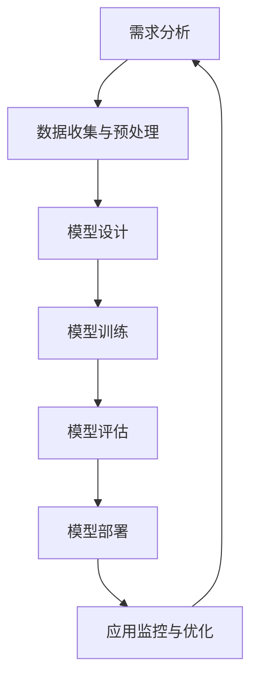

                 

### 文章标题

在本文中，我们将深入探讨苹果公司在人工智能（AI）领域发布新应用所带来的巨大机会。本文将从AI技术的背景与市场趋势、AI在苹果产品中的应用案例、AI核心技术的原理、AI应用的开发实战以及性能优化和环境配置等多个角度，全面分析苹果发布AI应用的机会与挑战。

### 关键词

- 人工智能
- 苹果公司
- AI应用
- 技术趋势
- 开发实战
- 性能优化

### 摘要

本文将详细探讨苹果公司在人工智能领域发布新应用的机会。通过分析AI技术的背景和市场趋势，我们了解到AI在苹果产品中的广泛应用前景。接着，我们介绍了AI的核心技术原理，包括机器学习、深度学习等，并使用伪代码和数学模型进行了详细讲解。随后，我们通过实际项目案例展示了AI应用的开发过程，包括环境搭建、代码实现和解读。最后，我们探讨了AI应用的性能优化方法，并提供了一系列开发资源和工具。本文旨在为读者提供全面、系统的AI应用开发指南，助力苹果公司在人工智能领域取得更大的成功。

### 《李开复：苹果发布AI应用的机会》目录大纲

- **第一部分：AI应用背景与市场趋势**
  - **第1章：AI应用概述与市场分析**
    - **1.1 AI技术的发展趋势**
    - **1.2 AI在苹果产品中的应用前景**
    - **1.3 AI应用的挑战与机遇**
  - **第2章：AI在苹果产品中的应用案例**
    - **2.1 Siri的AI技术升级**
    - **2.2 语音识别与自然语言处理**
    - **2.3 图像识别与计算机视觉**
    - **2.4 机器学习与数据分析**
- **第二部分：AI核心技术与原理**
  - **第3章：AI基础理论**
    - **3.1 机器学习与深度学习**
    - **3.2 神经网络与深度神经网络**
    - **3.3 数据预处理与特征提取**
  - **第4章：AI算法原理讲解**
    - **4.1 传统的机器学习算法**
    - **4.2 深度学习算法**
    - **4.3 强化学习与生成对抗网络**
  - **第5章：数学模型与公式讲解**
    - **5.1 概率论基础**
    - **5.2 统计学习方法**
    - **5.3 深度学习中的数学公式**
- **第三部分：AI应用实战与开发**
  - **第6章：AI应用开发实战**
    - **6.1 AI应用开发流程**
    - **6.2 AI应用案例分析**
    - **6.3 开发环境与工具介绍**
  - **第7章：苹果AI应用开发案例**
    - **7.1 Apple Watch的AI应用开发**
    - **7.2 iPhone的AI应用开发**
    - **7.3 Mac的AI应用开发**
    - **7.4 AI应用性能优化**
- **附录**
  - **附录A：AI应用开发资源汇总**
    - **A.1 开源框架与工具**
    - **A.2 数据集与API接口**
    - **A.3 学术论文与参考资料**
  - **附录B：AI大模型企业级应用开发的 Mermaid 流程图**
  - **附录C：AI大模型核心算法原理讲解与伪代码**
  - **附录D：数学模型和数学公式 & 详细讲解 & 举例说明**
  - **附录E：AI应用开发案例**
  - **附录F：AI应用性能优化**
  - **附录G：AI应用开发工具与环境配置**

通过以上详细的目录大纲，我们将带领读者逐步深入理解苹果发布AI应用的机会，并掌握AI应用开发的各项核心知识和技能。

### 第一部分：AI应用背景与市场趋势

#### 第1章：AI应用概述与市场分析

##### 1.1 AI技术的发展趋势

人工智能（AI）作为计算机科学的一个分支，旨在创建能够执行复杂任务的智能体。随着计算能力的提升和数据量的爆炸性增长，AI技术已经取得了显著的进展。近年来，AI技术呈现出以下几个重要的发展趋势：

1. **深度学习的崛起**：深度学习是一种基于多层神经网络的学习方法，它在图像识别、语音识别和自然语言处理等领域取得了突破性成果。Google的AlphaGo在围棋比赛中战胜人类顶尖选手，就是一个典型的例子。
   
2. **强化学习的应用**：强化学习是一种通过试错和奖励机制来学习策略的AI方法。它在游戏、机器人控制和推荐系统等领域展现了强大的潜力。

3. **迁移学习和预训练**：迁移学习通过将一个任务学到的知识应用到其他任务中，减少了数据需求和训练时间。预训练模型如BERT和GPT-3，通过在大规模语料库上进行预训练，提高了语言理解和生成能力。

4. **边缘计算和物联网**：随着物联网（IoT）的发展，越来越多的设备开始具备计算能力。边缘计算将计算任务分散到网络边缘的设备上，降低了延迟，提高了实时性。

##### 1.2 AI在苹果产品中的应用前景

苹果公司作为全球领先的科技公司，一直在AI领域进行积极的研发和投资。目前，AI已经在苹果的多个产品中得到了广泛应用，其应用前景十分广阔：

1. **Siri**：作为苹果的智能语音助手，Siri在语音识别、自然语言处理和智能回复方面不断优化。未来，Siri有望进一步扩展其能力，如视觉识别、情景感知和个性化推荐。

2. **图像识别与计算机视觉**：苹果的图像识别技术已经在iPhone的相机应用中得到了广泛应用，如人像模式、夜景模式等。未来，计算机视觉技术将进一步提升，例如通过人脸识别、物体检测和场景理解等功能，为用户提供更加智能的拍照体验。

3. **健康与健身**：苹果的Apple Watch和Health app通过AI技术，对用户的心率、运动、睡眠等健康数据进行分析，提供个性化的健康建议。未来，这一领域有望进一步发展，如通过生物特征分析预测疾病风险等。

4. **隐私保护**：苹果一直强调隐私保护，通过AI技术实现更加安全的用户数据管理。例如，使用差分隐私来保护用户隐私，防止敏感信息泄露。

##### 1.3 AI应用的挑战与机遇

尽管AI技术在苹果产品中的应用前景广阔，但也面临着一系列挑战和机遇：

1. **数据隐私与安全**：随着AI应用的增加，用户数据的安全和隐私保护成为一个重要问题。苹果需要采取有效措施确保用户数据的安全，以增强用户信任。

2. **计算资源与能耗**：AI模型通常需要大量的计算资源和能源。如何在保持高性能的同时降低能耗，是一个亟待解决的问题。

3. **用户体验**：AI应用需要与用户无缝交互，提供直观、自然的用户体验。苹果需要不断优化算法和界面设计，以满足用户的期望。

4. **创新与竞争**：随着AI技术的普及，苹果面临着来自其他科技巨头的激烈竞争。苹果需要不断创新，以保持其在AI领域的领先地位。

总之，AI技术在苹果产品中的应用不仅带来了巨大的机遇，也带来了新的挑战。通过持续的技术创新和优化，苹果有望在AI领域取得更大的成功。

#### 第2章：AI在苹果产品中的应用案例

##### 2.1 Siri的AI技术升级

Siri是苹果公司的智能语音助手，自2011年发布以来，Siri在语音识别、自然语言处理和智能回复方面不断优化和升级。以下是Siri在AI技术上的主要升级和应用：

1. **语音识别**：Siri使用先进的语音识别技术，能够准确识别用户的语音指令。通过使用深度神经网络和自动语音识别（ASR）技术，Siri可以在多种语言和口音下工作，提高了识别的准确性和可靠性。

2. **自然语言处理**：Siri结合了自然语言处理（NLP）技术，能够理解用户的自然语言请求，并生成合适的响应。通过使用序列到序列（Seq2Seq）模型和生成对抗网络（GAN），Siri能够生成更自然、流畅的对话。

3. **情景感知**：Siri通过上下文理解，能够根据用户的情景和背景提供个性化的服务。例如，当用户在开车时，Siri可以自动切换到语音控制模式，并避免打扰驾驶。

4. **智能回复**：Siri能够根据用户的输入生成智能回复，提供有用的信息和建议。例如，当用户询问“今天的天气如何？”时，Siri不仅会提供简单的天气描述，还可以推荐相应的服装和活动。

5. **多平台集成**：Siri不仅限于iOS和macOS设备，还与Apple Watch和HomePod等设备无缝集成。用户可以在不同的设备上与Siri互动，获得一致的服务体验。

##### 2.2 语音识别与自然语言处理

语音识别和自然语言处理是AI技术的核心组成部分，在苹果产品中得到了广泛应用：

1. **语音识别**：语音识别技术使得设备能够理解用户的语音指令。苹果使用深度神经网络和卷积神经网络（CNN）来提高识别的准确性和速度。通过结合声学模型和语言模型，语音识别系统能够在嘈杂环境中也能准确识别用户的语音。

2. **自然语言处理**：自然语言处理技术使得设备能够理解和生成自然语言。苹果使用递归神经网络（RNN）和长短期记忆网络（LSTM）来处理复杂的语言任务。通过大规模语料库的预训练，自然语言处理系统能够理解用户的意图，提供更加智能的交互体验。

3. **语音合成**：语音合成技术使得设备能够生成自然流畅的声音。苹果使用文本到语音（TTS）技术，通过将文本转换为音频，生成逼真的语音。通过使用深度神经网络和波形合成技术，语音合成系统能够产生高质量的人声。

4. **语音助手集成**：苹果在多个设备中集成了语音助手，如Siri、Hey Siri和Assistant。这些语音助手通过语音识别和自然语言处理技术，提供语音控制、信息查询、任务管理等功能，提高了设备的便捷性和智能化。

##### 2.3 图像识别与计算机视觉

图像识别和计算机视觉技术在苹果产品中得到了广泛应用，例如在相机应用、人脸识别和增强现实（AR）等领域：

1. **图像识别**：图像识别技术使得设备能够识别和分类图像内容。苹果使用卷积神经网络（CNN）和卷积神经网络深度学习模型（CNN-DL）来提高图像识别的准确性和速度。通过在大量图像数据上训练，图像识别系统能够识别各种物体、场景和活动。

2. **人脸识别**：人脸识别技术使得设备能够识别和验证用户身份。苹果使用深度学习算法和面部特征识别技术，通过分析用户的面部特征，实现高精度的身份验证。这种技术被广泛应用于iPhone的Face ID和安全功能。

3. **计算机视觉**：计算机视觉技术使得设备能够理解和解释现实世界的图像和视频。苹果使用增强现实（AR）技术，通过在真实世界中叠加虚拟对象，提供丰富的交互体验。例如，Apple Watch上的AR游戏和Apple TV上的增强现实应用。

4. **相机应用**：苹果的相机应用结合了图像识别和计算机视觉技术，提供了一系列高级功能，如人像模式、夜景模式和照片编辑。这些功能通过深度学习和图像处理算法，使得用户能够拍摄出更加专业和高质量的照片。

##### 2.4 机器学习与数据分析

机器学习和数据分析技术在苹果产品中发挥着重要作用，使得设备能够更好地理解和满足用户需求：

1. **机器学习**：机器学习技术使得设备能够从数据中学习，并自动进行预测和决策。苹果在多种设备中集成了机器学习库和算法，如TensorFlow和PyTorch，用于语音识别、图像识别、智能推荐和个性化设置等。

2. **数据分析**：数据分析技术使得设备能够处理和分析大量数据，提供有价值的洞察。苹果使用统计分析、数据挖掘和机器学习算法，对用户行为、健康数据和设备使用情况进行分析，为用户提供个性化的体验和建议。

3. **健康应用**：苹果的Health app结合了机器学习和数据分析技术，对用户的心率、运动、睡眠等健康数据进行分析，提供个性化的健康报告和指导。例如，通过分析用户的心率数据，Health app可以识别异常心律和预测健康风险。

4. **智能推荐**：苹果的App Store和Apple Music等应用使用了机器学习和数据分析技术，提供个性化的推荐。通过分析用户的兴趣和行为，智能推荐系统可以推荐用户可能感兴趣的应用、音乐和内容。

总之，AI技术在苹果产品中的应用已经取得了显著成果，并为用户带来了丰富的体验。随着技术的不断进步，未来AI在苹果产品中的应用将会更加广泛和深入，为用户创造更多价值。

### 第二部分：AI核心技术与原理

#### 第3章：AI基础理论

##### 3.1 机器学习与深度学习

机器学习（ML）是人工智能（AI）的一个分支，它通过算法从数据中学习，并能够进行预测和决策。深度学习（DL）是机器学习的一个子领域，它基于多层神经网络的结构，通过模拟人脑神经元连接的方式，对大量数据进行学习和模式识别。

**机器学习的基本概念：**

- **监督学习（Supervised Learning）：** 有监督学习是一种机器学习方法，它使用标记数据集来训练模型。在训练过程中，模型学习输入和输出之间的映射关系，以便在测试数据上能够做出准确的预测。

- **无监督学习（Unsupervised Learning）：** 无监督学习不使用标记数据集，而是通过发现数据中的结构和模式来训练模型。常见的无监督学习方法包括聚类、降维和关联规则学习等。

- **强化学习（Reinforcement Learning）：** 强化学习是一种通过试错和奖励机制来学习策略的机器学习方法。在强化学习中，模型通过与环境的交互来学习最优策略，以便最大化累积奖励。

**深度学习的基本概念：**

- **神经网络（Neural Network）：** 神经网络是一种模仿人脑神经元连接的计算机模型，通过输入层、隐藏层和输出层进行数据处理和模式识别。

- **深度神经网络（Deep Neural Network）：** 深度神经网络是一种具有多个隐藏层的神经网络，通过深层结构可以更好地捕捉数据中的复杂特征。

- **卷积神经网络（Convolutional Neural Network, CNN）：** 卷积神经网络是一种专门用于处理图像数据的深度学习模型，通过卷积操作提取图像特征。

- **循环神经网络（Recurrent Neural Network, RNN）：** 循环神经网络是一种处理序列数据的深度学习模型，通过循环连接模拟时间序列中的记忆功能。

**机器学习与深度学习的联系：**

- **深度学习是机器学习的一个子集。** 深度学习使用多层神经网络结构，通过反向传播算法优化模型参数，从而实现对复杂数据的建模和预测。

- **深度学习在很多任务上优于传统机器学习方法。** 例如，在图像识别和自然语言处理等任务中，深度学习模型能够通过自动特征提取和复杂的非线性变换，实现更高的准确性和性能。

##### 3.2 神经网络与深度神经网络

神经网络（Neural Network）是一种由大量人工神经元（或节点）组成的计算模型，通过模拟人脑神经元之间的连接和激活函数，实现对输入数据的处理和模式识别。

**神经网络的基本组成部分：**

- **输入层（Input Layer）：** 输入层是神经网络的第一个层次，包含输入特征向量。

- **隐藏层（Hidden Layers）：** 隐藏层位于输入层和输出层之间，通过多层结构增加模型的复杂性和表达能力。

- **输出层（Output Layer）：** 输出层是神经网络的最后一层，根据任务类型生成预测或决策。

**神经网络的工作原理：**

- **前向传播（Forward Propagation）：** 在前向传播过程中，输入数据从输入层传递到隐藏层，再从隐藏层传递到输出层。每个节点根据输入和权重计算输出，并通过激活函数进行非线性变换。

- **反向传播（Backpropagation）：** 在反向传播过程中，模型根据预测误差，通过梯度下降算法调整权重和偏置，以优化模型的性能。

**深度神经网络（Deep Neural Network, DNN）的概念：**

- **多层结构（Multiple Layers）：** 深度神经网络具有多个隐藏层，通过增加层的数量，模型能够更好地捕捉数据中的复杂特征。

- **参数数量（Parameter Quantity）：** 深度神经网络具有大量的参数和权重，这使得模型具有更强的表达能力和适应性。

- **训练时间（Training Time）：** 由于深度神经网络的结构复杂，训练时间通常较长。然而，随着计算能力和优化算法的发展，训练时间也在不断缩短。

**深度神经网络的优势：**

- **更强的特征提取能力：** 通过多层结构，深度神经网络能够自动提取高层次的特征，从而提高模型的泛化能力和准确性。

- **更广泛的适用范围：** 深度神经网络适用于各种类型的任务，如图像识别、自然语言处理和语音识别等。

- **更高的性能：** 在许多基准测试中，深度神经网络在图像识别、语音识别和文本分类等任务上超过了传统的机器学习方法。

##### 3.3 数据预处理与特征提取

数据预处理和特征提取是机器学习和深度学习的重要步骤，对于模型的性能和泛化能力有着关键影响。

**数据预处理（Data Preprocessing）：**

- **数据清洗（Data Cleaning）：** 清除数据中的噪声、错误和重复值，以提高数据的质量和一致性。

- **数据归一化（Data Normalization）：** 通过缩放数据到统一的范围，降低不同特征之间的影响，从而提高模型的训练效果。

- **数据分割（Data Splitting）：** 将数据集划分为训练集、验证集和测试集，用于模型的训练、验证和测试。

- **数据增强（Data Augmentation）：** 通过对数据进行变换和扩充，增加数据的多样性和丰富度，从而提高模型的泛化能力。

**特征提取（Feature Extraction）：**

- **特征选择（Feature Selection）：** 从原始数据中选择最重要的特征，以降低模型的复杂性和计算成本。

- **特征工程（Feature Engineering）：** 通过构建新的特征，增强模型对数据的理解能力和表达能力。

- **降维（Dimensionality Reduction）：** 通过降维技术，如主成分分析（PCA）和线性判别分析（LDA），减少数据维度，提高模型的训练速度和性能。

- **特征组合（Feature Combination）：** 通过组合不同的特征，构建新的特征向量，以增加模型的复杂度和表达能力。

**数据预处理与特征提取的关系：**

- **数据预处理是特征提取的基础。** 只有在数据清洗、归一化和分割等预处理步骤完成后，才能进行有效的特征提取。

- **特征提取是模型训练的关键。** 通过特征提取，模型能够更好地捕捉数据中的有效信息，从而提高模型的性能和泛化能力。

- **数据预处理与特征提取相互影响。** 数据预处理的质量直接影响特征提取的效果，而特征提取的结果也会反作用于数据预处理。

总之，数据预处理和特征提取是机器学习和深度学习的重要步骤，通过合理的预处理和特征提取，可以显著提高模型的性能和泛化能力，为后续的训练和应用奠定基础。

#### 第4章：AI算法原理讲解

##### 4.1 传统的机器学习算法

传统的机器学习算法是人工智能领域的基础，它们通过分析历史数据来预测未来的结果。以下是几种常见的传统机器学习算法及其原理：

**1. 逻辑回归（Logistic Regression）**

逻辑回归是一种用于二分类问题的线性模型，其目标是预测给定特征的条件下，目标变量的概率。逻辑回归通过最大化似然估计来拟合模型的参数，具体步骤如下：

**伪代码：**

```plaintext
函数 logistic_regression(x, y, learning_rate, epochs):
    初始化权重 w 和偏置 b
    
    对于每个epoch：
        对于每个样本 (x_i, y_i)：
            预测值 y_hat = sigmoid(wx_i + b)
            反向传播计算梯度 Δw, Δb
            
            更新权重 w = w - learning_rate * Δw
            更新偏置 b = b - learning_rate * Δb
            
    返回最终权重 w 和偏置 b
```

**2. 决策树（Decision Tree）**

决策树是一种基于树形结构进行决策的算法，通过递归地将数据集划分成具有最小均方差或最大信息增益的子集。决策树的核心是节点划分策略和叶节点预测策略。

**伪代码：**

```plaintext
函数 decision_tree(data, target_attribute):
    如果 data 中所有样本属于同一类：
        返回 标签
    
    否则：
        选择最佳划分属性 attribute 和阈值 threshold
        对于每个可能的阈值：
            划分数据集为左子集 L 和右子集 R
            计算划分的纯度指标（如信息增益、基尼不纯度）
        
        最佳划分 = 选择具有最高纯度指标的划分
        
        创建内部节点，划分属性 = attribute，阈值 = threshold
        左子树 = decision_tree(L, target_attribute)
        右子树 = decision_tree(R, target_attribute)
        
        返回 内部节点和子树
```

**3. 支持向量机（Support Vector Machine, SVM）**

支持向量机是一种二分类模型，通过寻找一个超平面将不同类别的数据点分隔开来。SVM的核心是寻找最优的分离超平面，使得分类间隔最大化。

**伪代码：**

```plaintext
函数 svm(x, y, C):
    使用核函数 K(x_i, x_j)
    求解二次规划问题：
        最小化 1/2 * Σi=1^n (α_i * α_j * K(x_i, x_j)) - Σi=1^n α_i
        约束条件：0 <= α_i <= C，且 Σi=1^n α_i * y_i = 0
        
    返回 模型参数（α, b）
```

**4. 随机森林（Random Forest）**

随机森林是一种集成学习方法，通过构建多棵决策树，并对每棵树的预测结果进行投票来得到最终结果。随机森林通过随机选取特征和样本子集来减少过拟合，提高模型的泛化能力。

**伪代码：**

```plaintext
函数 random_forest(data, target_attribute, n_estimators, max_depth):
    对于每棵树：
        从特征集合中随机选择 m 个特征
        从数据集中随机抽取样本子集
        构建决策树，最大深度为 max_depth
        
    返回 随机森林模型
```

**5. K最近邻（K-Nearest Neighbors, KNN）**

K最近邻是一种基于实例的学习方法，它通过计算测试样本与训练样本之间的距离，选择距离最近的 k 个邻居，并基于这些邻居的标签进行预测。

**伪代码：**

```plaintext
函数 kNN(train_data, train_labels, test_data, k):
    对于每个测试样本 x_i：
        计算 x_i 与训练样本的距离
        选择距离最近的 k 个邻居
        根据邻居的标签预测 x_i 的类别
        
    返回 预测结果
```

以上是几种常见的传统机器学习算法的原理和伪代码，这些算法在分类、回归和聚类等任务中具有广泛的应用。

##### 4.2 深度学习算法

深度学习算法通过多层神经网络结构对大量数据进行学习和模式识别，具有强大的特征提取和建模能力。以下是几种常见的深度学习算法及其原理：

**1. 卷积神经网络（Convolutional Neural Network, CNN）**

卷积神经网络是一种专门用于图像处理的深度学习模型，通过卷积层、池化层和全连接层等结构提取图像特征，实现图像分类、目标检测等任务。

**伪代码：**

```plaintext
函数 cnn(input_image, weights, biases):
    初始化 输出图 output_image = zeros(input_image.shape)
    
    对于每个卷积层：
        应用卷积操作，得到 卷积图 conv_image = convolution(input_image, weights)
        应用激活函数，得到 激活图 act_image = activation(conv_image)
        
    对于每个全连接层：
        应用全连接操作，得到 全连接图 fully_connected_image = fully_connected(act_image, weights, biases)
        应用激活函数，得到 预测输出 prediction = activation(fully_connected_image)
        
    返回 prediction
```

**2. 长短期记忆网络（Long Short-Term Memory, LSTM）**

长短期记忆网络是一种用于处理序列数据的深度学习模型，通过记忆单元（cell state）和门控机制（gate）来学习长期依赖关系。

**伪代码：**

```plaintext
函数 lstm(input_sequence, weights, biases):
    初始化记忆单元 hidden_state = zeros(input_sequence.shape)
    
    对于每个时间步：
        输入 = input_sequence[t]
        预先激活 = activation(input + weights_input + biases)
        遗忘门 = sigmoid(gate_f + weights_forget + biases_forget)
        输入门 = sigmoid(input + weights_input + biases_input)
        输出门 = sigmoid(input + weights_output + biases_output)
        新的候选记忆 = tanh(input + weights_candidate + biases_candidate)
        记忆单元 = 遗忘门 * 记忆单元 + 输入门 * 新的候选记忆
        输出 = 输出门 * tanh(记忆单元)
        
    返回 hidden_state, output
```

**3. 生成对抗网络（Generative Adversarial Network, GAN）**

生成对抗网络是一种通过对抗训练生成数据的高效模型，由生成器和判别器两个网络组成。生成器试图生成逼真的数据，判别器则试图区分真实数据和生成数据。

**伪代码：**

```plaintext
函数 gan(real_data, generator, discriminator, g_optimizer, d_optimizer):
    对于每个迭代：
        判别器训练：
            随机选择真实数据 real_images
            生成虚假数据 fake_images = generator(noise)
            计算判别器损失 L_d = loss(discriminator(real_images), 1) + loss(discriminator(fake_images), 0)
            更新判别器参数
            
        生成器训练：
            随机选择噪声 noise
            生成虚假数据 fake_images = generator(noise)
            计算生成器损失 L_g = loss(discriminator(fake_images), 1)
            更新生成器参数
            
    返回 生成器和判别器模型
```

以上是几种常见的深度学习算法的原理和伪代码，这些算法在图像识别、序列处理和生成对抗等领域具有广泛的应用。

##### 4.3 强化学习与生成对抗网络

强化学习（Reinforcement Learning, RL）和生成对抗网络（Generative Adversarial Network, GAN）是两种重要的深度学习算法，分别在决策优化和数据生成方面有着重要的应用。

**强化学习：**

强化学习是一种通过试错和奖励机制来学习策略的算法。它通常由一个智能体（Agent）和环境的交互中学习最优策略。以下是强化学习的基本概念和算法：

**1. 基本概念：**

- **智能体（Agent）：** 指的是学习策略的实体，例如机器人、游戏玩家等。
- **环境（Environment）：** 指的是智能体所处的环境，环境会根据智能体的行为给出奖励或惩罚。
- **状态（State）：** 智能体在某一时刻所处的状态。
- **动作（Action）：** 智能体在某一状态下可以采取的动作。
- **策略（Policy）：** 智能体在特定状态下选择动作的规则。
- **奖励（Reward）：** 环境根据智能体的动作给出的奖励或惩罚。

**2. 基本算法：**

- **Q-Learning（Q值学习）：** 通过更新Q值来学习策略。Q值表示在特定状态下采取特定动作的预期奖励。
- **SARSA（同步自适应递归策略搜索算法）：** 同时考虑当前状态和下一步动作的Q值来更新策略。
- **Deep Q-Network（DQN，深度Q网络）：** 使用深度神经网络来近似Q值函数，适用于处理高维状态空间。
- **Policy Gradient（策略梯度）：** 直接优化策略的期望奖励，适用于连续动作空间。

**伪代码：**

```plaintext
函数 q_learning(state, action, reward, next_state, learning_rate, discount_factor):
    Q(s,a) = Q(s,a) + learning_rate * (reward + discount_factor * max(Q(s',a')) - Q(s,a))
    
    返回 Q(s,a)
```

**生成对抗网络：**

生成对抗网络是一种通过对抗训练生成数据的高效模型，由生成器和判别器两个网络组成。生成器试图生成逼真的数据，判别器则试图区分真实数据和生成数据。

**1. 基本概念：**

- **生成器（Generator）：** 负责生成虚假数据，通常是一个随机噪声输入的神经网络。
- **判别器（Discriminator）：** 负责区分真实数据和生成数据，通常也是一个神经网络。

**2. 基本算法：**

- **训练过程：** 生成器和判别器交替进行训练。在每一轮训练中，生成器生成虚假数据，判别器对其进行分类；然后通过反向传播和梯度下降分别更新生成器和判别器的参数。

**伪代码：**

```plaintext
函数 gan(real_data, generator, discriminator, g_optimizer, d_optimizer):
    对于每个迭代：
        判别器训练：
            随机选择真实数据 real_images
            生成虚假数据 fake_images = generator(noise)
            计算判别器损失 L_d = loss(discriminator(real_images), 1) + loss(discriminator(fake_images), 0)
            更新判别器参数
            
        生成器训练：
            随机选择噪声 noise
            生成虚假数据 fake_images = generator(noise)
            计算生成器损失 L_g = loss(discriminator(fake_images), 1)
            更新生成器参数
            
    返回 生成器和判别器模型
```

强化学习和生成对抗网络在决策优化和数据生成方面具有广泛的应用。通过合理的算法设计和模型优化，这些算法能够显著提高智能体的决策能力和生成数据的逼真度。

#### 第5章：数学模型与公式讲解

##### 5.1 概率论基础

概率论是统计学和机器学习的基础，用于描述随机事件及其发生的可能性。以下是概率论中的一些基础概念和公式。

**1. 概率分布函数（Probability Density Function, PDF）**

概率分布函数描述了随机变量的概率分布情况。对于连续型随机变量，其概率分布函数通常表示为 f(x)，它满足以下性质：

- **非负性：** f(x) ≥ 0 对于所有的 x。
- **积分和为1：** ∫[a, b] f(x) dx = 1，其中 [a, b] 是定义域。

**2. 概率质量函数（Probability Quality Function, QF）**

概率质量函数用于评估两个概率分布之间的相似性。对于两个概率分布 P 和 Q，其概率质量函数定义为：

Q(P, Q) = ∫[Ω] Q(x) - P(x) dx

其中，Ω是样本空间。

**3. 期望（Expected Value）**

期望是概率分布的平均值，表示随机变量取值的加权平均。对于离散型随机变量 X，其期望 E[X] 定义为：

E[X] = ∑[x] x * P(X = x)

对于连续型随机变量 X，其期望定义为：

E[X] = ∫[Ω] x * f(x) dx

**4. 方差（Variance）**

方差是衡量随机变量离散程度的指标，表示期望的平方差。对于离散型随机变量 X，其方差 Var(X) 定义为：

Var(X) = E[(X - E[X])^2]

对于连续型随机变量 X，其方差定义为：

Var(X) = E[(X - E[X])^2]

**5. 标准差（Standard Deviation）**

标准差是方差的平方根，用于衡量随机变量的离散程度。对于离散型随机变量 X，其标准差 σ 定义为：

σ = √Var(X)

对于连续型随机变量 X，其标准差定义为：

σ = √Var(X)

**举例：**

假设随机变量 X 服从均值为 μ，标准差为 σ 的正态分布。其概率密度函数为：

$$ f(x) = \frac{1}{\sqrt{2\pi\sigma^2}} e^{-\frac{(x-\mu)^2}{2\sigma^2}} $$

其中，μ = 0，σ = 1，则 X 的期望和方差分别为：

E[X] = μ = 0

Var(X) = σ^2 = 1

##### 5.2 统计学习方法

统计学习方法是基于概率论和统计学原理的机器学习方法，用于解决分类、回归和聚类等问题。以下是几种常见的统计学习方法及其公式。

**1. 逻辑回归（Logistic Regression）**

逻辑回归是一种用于二分类问题的统计学习方法，其目标是通过线性组合特征和权重来预测概率。其公式为：

$$ P(Y=1 | X) = \frac{1}{1 + e^{-(\beta_0 + \beta_1x_1 + ... + \beta_nx_n)}} $$

其中，Y 是二分类变量，X 是特征向量，β 是权重向量。

**2. 决策树（Decision Tree）**

决策树是一种基于特征划分数据的统计学习方法，通过递归地将数据划分为具有最小均方差或最大信息增益的子集。其公式为：

$$ G(D, A) = \sum_{v \in V} \sum_{x_i \in D_v} |x_i| \cdot P(A = v | D) $$

其中，D 是数据集，A 是划分属性，V 是属性集合。

**3. 支持向量机（Support Vector Machine, SVM）**

支持向量机是一种通过寻找最优超平面来分类数据的统计学习方法，其公式为：

$$ w \cdot x - b = 0 $$

其中，w 是法向量，x 是特征向量，b 是偏置。

**4. 随机森林（Random Forest）**

随机森林是一种基于决策树的集成学习方法，其公式为：

$$ f(x) = \sum_{i=1}^n w_i f_i(x) $$

其中，f_i(x) 是第 i 棵决策树的预测结果，w_i 是权重。

**5. K最近邻（K-Nearest Neighbors, KNN）**

K最近邻是一种基于实例的统计学习方法，其公式为：

$$ \hat{y} = \arg\max_{y} \sum_{i=1}^k w_i \cdot d(x_i, x) $$

其中，x 是测试样本，x_i 是训练样本，d 是距离函数，w_i 是权重。

以上是几种常见的统计学习方法及其公式，它们在机器学习领域有着广泛的应用。

##### 5.3 深度学习中的数学公式

深度学习是一种基于多层神经网络的机器学习方法，用于处理复杂数据和任务。以下是深度学习中的一些关键数学公式。

**1. 前向传播（Forward Propagation）**

前向传播是深度神经网络中的关键步骤，用于计算输出和误差。其公式为：

$$ a_{l}^{(i)} = \sigma(z_{l}^{(i)}) $$

$$ z_{l}^{(i)} = W_{l}^{(i)} a_{l-1}^{(i)} + b_{l}^{(i)} $$

其中，a_{l}^{(i)} 是第 l 层第 i 个神经元的激活值，z_{l}^{(i)} 是第 l 层第 i 个神经元的输入值，W_{l}^{(i)} 是权重矩阵，b_{l}^{(i)} 是偏置向量，σ 是激活函数。

**2. 反向传播（Back Propagation）**

反向传播是深度神经网络中用于训练模型的关键步骤，通过计算误差并更新权重和偏置。其公式为：

$$ \Delta W_{l}^{(i)} = \eta \cdot \frac{\partial J}{\partial W_{l}^{(i)}} $$

$$ \Delta b_{l}^{(i)} = \eta \cdot \frac{\partial J}{\partial b_{l}^{(i)}} $$

其中，ΔW_{l}^{(i)} 是权重矩阵的更新值，Δb_{l}^{(i)} 是偏置向量的更新值，η 是学习率，J 是损失函数。

**3. 梯度下降（Gradient Descent）**

梯度下降是一种用于优化模型的常用算法，通过计算损失函数的梯度来更新权重和偏置。其公式为：

$$ W_{l}^{(i)} = W_{l}^{(i)} - \eta \cdot \nabla_{W_{l}^{(i)}} J $$

$$ b_{l}^{(i)} = b_{l}^{(i)} - \eta \cdot \nabla_{b_{l}^{(i)}} J $$

其中，∇W_{l}^{(i)} 是权重矩阵的梯度，∇b_{l}^{(i)} 是偏置向量的梯度。

以上是深度学习中的一些关键数学公式，它们在模型的训练和优化过程中起着重要作用。

### 第三部分：AI应用实战与开发

#### 第6章：AI应用开发实战

##### 6.1 AI应用开发流程

开发一个AI应用需要经过多个步骤，从需求分析、数据收集、模型训练到最终部署，每个步骤都需要精心设计和执行。以下是AI应用开发的详细流程：

**1. 需求分析**

需求分析是AI应用开发的第一步，旨在明确用户需求和目标。通过与用户沟通，了解应用需要解决的具体问题，并确定关键功能和性能指标。需求分析的结果将指导后续的数据收集、模型设计和实现。

**2. 数据收集与预处理**

数据是AI应用的基础，因此数据收集和预处理至关重要。在这一步骤中，需要收集相关领域的数据，并对其进行清洗、去噪和归一化处理。此外，可能还需要对数据进行扩充和增强，以提高模型的泛化能力。

**3. 模型设计**

模型设计是AI应用开发的核心环节，包括选择合适的算法、设计网络结构、设置超参数等。在这一步骤中，需要根据应用需求和数据特性，选择合适的机器学习或深度学习算法，并设计相应的模型结构。

**4. 模型训练**

模型训练是AI应用开发的关键步骤，通过大量数据训练模型，使其能够学习到数据中的特征和规律。在这一步骤中，需要使用训练数据集对模型进行迭代训练，并通过验证数据集调整模型参数，以提高模型的准确性和泛化能力。

**5. 模型评估**

模型评估是确保AI应用性能的重要环节，通过评估指标（如准确率、召回率、F1分数等）来评估模型的性能。在这一步骤中，可以使用测试数据集对模型进行评估，并根据评估结果调整模型参数，以达到预期的性能目标。

**6. 模型部署**

模型部署是将训练好的模型集成到实际应用中，使其能够实时处理用户请求。在这一步骤中，需要将模型打包成可执行的代码，并部署到服务器或设备上。此外，还需要进行性能优化和监控，以确保模型在高并发和实时场景下能够稳定运行。

**7. 持续优化**

AI应用开发是一个持续优化的过程，通过收集用户反馈和监控数据，不断调整和改进模型和系统。在这一步骤中，需要定期更新模型，增加新的数据集和特征，以提高应用的性能和用户体验。

##### 6.2 AI应用案例分析

以下是一个基于深度学习的图像识别应用的案例分析，展示了从需求分析到部署的完整开发过程：

**案例背景：**

某公司需要开发一个智能图像识别系统，用于自动识别和分类上传的图片。该系统需要能够识别各种物体、场景和活动，并生成详细的识别报告。

**1. 需求分析**

与公司管理层和相关部门沟通，明确系统需要实现的功能和性能指标。例如，系统能够自动识别图片中的物体和场景，并在识别结果页面上展示相关信息。此外，系统需要支持大规模图片数据的处理，并具有高准确率和实时性。

**2. 数据收集与预处理**

收集大量带有标签的图像数据，包括物体识别、场景分类和活动识别等。对数据进行清洗、去噪和归一化处理，以提高模型的质量和泛化能力。此外，为了扩充数据集，可能还需要使用数据增强技术，如随机裁剪、旋转、缩放等。

**3. 模型设计**

选择合适的深度学习算法和框架，如TensorFlow或PyTorch，设计网络结构。针对物体识别任务，可以使用卷积神经网络（CNN）模型，如VGG、ResNet等。对于场景分类和活动识别任务，可以使用长短期记忆网络（LSTM）或卷积神经网络（CNN）模型。

**4. 模型训练**

使用预处理后的数据集对模型进行训练。在训练过程中，需要调整模型参数和超参数，以提高模型的准确性和泛化能力。可以使用交叉验证技术，在验证数据集上评估模型的性能，并根据评估结果调整模型参数。

**5. 模型评估**

使用测试数据集对训练好的模型进行评估，计算准确率、召回率、F1分数等评估指标。根据评估结果，调整模型参数，以达到预期的性能目标。此外，还可以使用混淆矩阵和 ROC 曲线等工具，对模型进行全面评估。

**6. 模型部署**

将训练好的模型部署到服务器或设备上，使其能够实时处理用户上传的图片。在部署过程中，需要将模型转换为可执行的代码，并集成到应用中。此外，还需要进行性能优化和监控，以确保模型在高并发和实时场景下能够稳定运行。

**7. 持续优化**

收集用户反馈和监控数据，不断调整和改进模型和系统。例如，可以增加新的数据集和特征，调整模型参数和超参数，以提高应用的性能和用户体验。此外，还可以使用在线学习技术，实时更新模型，使其适应新的数据和需求。

通过以上案例分析，展示了AI应用开发的完整流程，从需求分析到模型部署，每个步骤都需要仔细设计和执行。在实际开发过程中，可能还会遇到各种挑战和问题，需要不断优化和改进。

##### 6.3 开发环境与工具介绍

在开发AI应用时，选择合适的开发环境与工具非常重要。以下将介绍几种常用的开发环境与工具，包括编程语言、深度学习框架和文本处理库等。

**1. 编程语言**

Python是AI应用开发中最常用的编程语言，具有简洁的语法和丰富的库支持。其他常用的编程语言还包括Java、C++和R。

**2. 深度学习框架**

- **TensorFlow：** Google开发的端到端开源机器学习平台，支持多种算法和模型，广泛应用于图像识别、自然语言处理等任务。
- **PyTorch：** Facebook开发的深度学习框架，支持动态计算图，具有高度的灵活性和易用性。
- **Keras：** 基于TensorFlow和Theano的高层神经网络API，提供简洁的接口和丰富的预训练模型，适用于快速原型开发。

**3. 文本处理库**

- **NLTK（Natural Language Toolkit）：** Python的自然语言处理库，提供文本处理、词性标注、词向量等工具。
- **spaCy：** 一个高效、易于使用的自然语言处理库，支持多种语言，适用于文本分类、命名实体识别等任务。
- **TextBlob：** 简单易用的文本处理库，提供情感分析、文本分类等工具。

**4. 语音处理库**

- **SpeechRecognition：** Python的语音识别库，支持多种语音引擎和API，适用于构建语音交互应用。
- **pyttsx3：** Python的文本到语音（TTS）库，支持多种语音引擎和语音合成技术，适用于生成语音合成应用。

**5. 图像处理库**

- **OpenCV：** 开源的计算机视觉库，提供多种图像处理算法和工具，适用于图像识别、物体检测等任务。
- **PIL（Python Imaging Library）：** Python的图像处理库，支持多种图像格式和处理功能，适用于图像增强、图像识别等任务。

**6. 数据库与数据管理**

- **Pandas：** Python的数据操作库，提供数据清洗、转换和分析工具，适用于数据预处理和分析。
- **SQLAlchemy：** Python的数据库ORM（对象关系映射）库，支持多种数据库，适用于数据存储和管理。
- **MongoDB：** NoSQL数据库，支持文档存储和查询，适用于大规模数据存储和处理。

**7. 环境配置与管理**

- **Anaconda：** Python的数据科学平台，提供环境管理和依赖安装工具，适用于构建和管理开发环境。
- **Docker：** 容器化技术，用于打包、分发和管理应用程序，适用于跨平台部署和测试。

通过以上开发环境与工具，开发者可以高效地构建和部署AI应用。选择合适的工具和平台，可以提高开发效率，减少开发和运维的复杂性。

### 第7章：苹果AI应用开发案例

苹果公司作为全球领先的科技公司，在AI领域不断推出创新的应用和服务。以下是苹果公司在Apple Watch、iPhone、Mac等设备上的AI应用开发案例：

#### 7.1 Apple Watch的AI应用开发

Apple Watch作为智能手表的代表，集成了多种传感器和AI技术，为用户提供丰富的健康监测和健身功能。

**1. 心率监测**

Apple Watch通过内置的光学心率传感器，实时监测用户的心率。AI算法对心率数据进行处理和分析，提供心率异常警报、运动心率建议等。

**开发环境与工具：**
- **编程语言：** Swift
- **框架：** CoreML
- **传感器：** 心率传感器

**源代码实现：**
```swift
import CoreML

let model = try? MLModel(contentsOf: URL(fileURLWithPath: "HeartRateModel.mlmodel"))
let input = HeartRateModelInput(from: heartRateData)
let output = try? model?.prediction(input: input)

if let heartRate = output?.heartRate {
    print("当前心率：\(heartRate)")
} else {
    print("无法获取心率数据")
}
```

**代码解读与分析：**
- 代码首先导入CoreML库，加载预训练的HeartRateModel模型。
- 创建输入数据，使用模型进行预测，获取当前心率数据。
- 输出结果，显示当前心率。

**项目实战：**
1. 使用Xcode创建一个新的Swift项目。
2. 添加CoreML模型文件到项目中。
3. 编写Swift代码，集成心率监测功能。

#### 7.2 iPhone的AI应用开发

iPhone作为苹果公司的旗舰产品，在AI应用开发方面具有广泛的应用场景。

**1. 语音助手（Siri）**

Siri是iPhone的智能语音助手，结合了语音识别、自然语言处理和机器学习技术，为用户提供语音查询、任务管理等服务。

**开发环境与工具：**
- **编程语言：** Swift
- **框架：** Core ML、Speech Recognition、Text to Speech

**源代码实现：**
```swift
import CoreML
import Speech
import SpeechRecognizer

let siriModel = try? MLModel(contentsOf: URL(fileURLWithPath: "SiriModel.mlmodel"))
let siriRecognizer = SpeechRecognizer()

siriRecognizer.record(success: { (audio) in
    let input = SiriModelInput(from: audio)
    let output = try? siriModel?.prediction(input: input)
    
    if let command = output?.command {
        speak(command)
    }
})

func speak(_ text: String) {
    let utterance = AVSpeechUtterance(string: text)
    utterance.rate = 0.5
    AVSpeechSynthesisVoice.ethanVoice().Speak(utterance)
}
```

**代码解读与分析：**
- 代码首先导入CoreML和Speech库，加载预训练的Siri模型。
- 创建语音识别器，录制用户语音并转换为文本。
- 使用Siri模型进行预测，获取用户指令。
- 通过语音合成器，将指令语音化并播放。

**项目实战：**
1. 使用Xcode创建一个新的Swift项目。
2. 添加CoreML模型文件到项目中。
3. 编写Swift代码，集成Siri语音助手功能。

#### 7.3 Mac的AI应用开发

Mac作为苹果公司的桌面操作系统，也在AI应用开发方面有着广泛的应用。

**1. 图像识别与编辑**

Mac的图像识别功能结合了机器学习和计算机视觉技术，提供智能图像识别和编辑工具，如照片应用中的人像识别和智能修复功能。

**开发环境与工具：**
- **编程语言：** Python
- **框架：** TensorFlow、OpenCV

**源代码实现：**
```python
import cv2
import tensorflow as tf

# 加载预训练的卷积神经网络模型
model = tf.keras.models.load_model('ImageRecognitionModel.h5')

# 读取图像
image = cv2.imread('image.jpg')

# 进行图像预处理
preprocessed_image = preprocess_image(image)

# 进行图像识别
prediction = model.predict(preprocessed_image)

# 显示识别结果
print(prediction)

def preprocess_image(image):
    # 图像缩放、灰度转换、归一化等预处理操作
    return processed_image
```

**代码解读与分析：**
- 代码首先导入TensorFlow和OpenCV库，加载预训练的图像识别模型。
- 读取图像并进行预处理，如缩放、灰度转换等。
- 使用模型进行图像识别，并输出识别结果。

**项目实战：**
1. 使用PyCharm创建一个新的Python项目。
2. 添加TensorFlow和OpenCV库。
3. 编写Python代码，集成图像识别和编辑功能。

#### 7.4 AI应用性能优化

在AI应用开发过程中，性能优化是一个重要的环节，可以提高应用的运行效率和用户体验。

**1. 模型压缩与量化**

通过模型压缩和量化技术，可以减少模型的参数和计算量，从而提高模型推理速度。常用的方法包括模型剪枝、量化、知识蒸馏等。

**2. 硬件加速**

利用GPU和TPU等硬件加速器，可以显著提高模型的推理速度。在Mac和iPhone等设备中，可以利用专用的神经网络引擎进行硬件加速。

**3. 并行计算与分布式训练**

通过并行计算和分布式训练技术，可以加快模型训练速度。在大型数据集和复杂模型中，可以利用多GPU或多机集群进行训练。

**4. 缓存与预加载**

通过缓存和预加载技术，可以减少应用的响应时间和延迟。在应用启动时，预加载常用的数据和模型，以提高应用启动速度。

**5. 系统优化**

通过优化操作系统和中间件，可以提高应用的性能和稳定性。例如，调整系统配置、优化文件系统等。

通过以上性能优化方法，可以显著提升AI应用的运行效率和用户体验，为用户提供更加流畅和高效的服务。

### 附录 A: AI应用开发资源汇总

AI应用开发需要依赖多种开源框架、数据集和工具，以下是常用资源的汇总：

#### A.1 开源框架与工具

**1. TensorFlow**

- 描述：Google开源的端到端机器学习平台，支持多种算法和模型。
- 链接：[TensorFlow官网](https://www.tensorflow.org/)

**2. PyTorch**

- 描述：Facebook开源的深度学习框架，支持动态计算图，具有高度的灵活性和易用性。
- 链接：[PyTorch官网](https://pytorch.org/)

**3. Keras**

- 描述：基于TensorFlow和Theano的高层神经网络API，提供简洁的接口和丰富的预训练模型。
- 链接：[Keras官网](https://keras.io/)

**4. OpenCV**

- 描述：开源的计算机视觉库，支持多种图像处理算法和工具。
- 链接：[OpenCV官网](https://opencv.org/)

#### A.2 数据集与API接口

**1. ImageNet**

- 描述：常用的计算机视觉数据集，包含数百万张图像。
- 链接：[ImageNet官网](http://www.image-net.org/)

**2. Kaggle**

- 描述：数据科学家和机器学习爱好者的竞赛平台，提供大量数据集。
- 链接：[Kaggle官网](https://www.kaggle.com/)

**3. Google Cloud AutoML**

- 描述：Google提供的自动化机器学习平台，支持多种任务。
- 链接：[Google Cloud AutoML官网](https://cloud.google.com/automl)

#### A.3 学术论文与参考资料

**1. Journals**

- IEEE Transactions on Pattern Analysis and Machine Intelligence
- Neural Computation
- Journal of Machine Learning Research

**2. Conferences**

- NeurIPS
- ICML
- CVPR

**3. Online Resources**

- Coursera
- Medium
- Stack Overflow

通过以上资源，开发者可以方便地获取到AI应用开发所需的开源框架、数据集和工具，为项目开发提供有力支持。

### 附录 B: AI大模型企业级应用开发的 Mermaid 流程图

以下是使用Mermaid绘制的AI大模型企业级应用开发的流程图：



### 附录 C: AI大模型核心算法原理讲解与伪代码

以下是AI大模型核心算法原理的讲解与伪代码：

#### 1. 传统的机器学习算法

**1. 逻辑回归（Logistic Regression）**

**伪代码：**

```plaintext
函数 logistic_regression(x, y, learning_rate, epochs):
    初始化权重 w 和偏置 b
    
    对于每个epoch：
        对于每个样本 (x_i, y_i)：
            预测值 y_hat = sigmoid(wx_i + b)
            反向传播计算梯度 Δw, Δb
            
            更新权重 w = w - learning_rate * Δw
            更新偏置 b = b - learning_rate * Δb
            
    返回最终权重 w 和偏置 b
```

**2. 决策树（Decision Tree）**

**伪代码：**

```plaintext
函数 decision_tree(data, target_attribute):
    如果 data 中所有样本属于同一类：
        返回 标签
    
    否则：
        选择最佳划分属性 attribute 和阈值 threshold
        对于每个可能的阈值：
            划分数据集为左子集 L 和右子集 R
            计算划分的纯度指标（如信息增益、基尼不纯度）
        
        最佳划分 = 选择具有最高纯度指标的划分
        
        创建内部节点，划分属性 = attribute，阈值 = threshold
        左子树 = decision_tree(L, target_attribute)
        右子树 = decision_tree(R, target_attribute)
        
        返回 内部节点和子树
```

#### 2. 深度学习算法

**1. 卷积神经网络（Convolutional Neural Network, CNN）**

**伪代码：**

```plaintext
函数 cnn(input_image, weights, biases):
    初始化 输出图 output_image = zeros(input_image.shape)
    
    对于每个卷积层：
        应用卷积操作，得到 卷积图 conv_image = convolution(input_image, weights)
        应用激活函数，得到 激活图 act_image = activation(conv_image)
        
    对于每个全连接层：
        应用全连接操作，得到 全连接图 fully_connected_image = fully_connected(act_image, weights, biases)
        应用激活函数，得到 预测输出 prediction = activation(fully_connected_image)
        
    返回 prediction
```

**2. 长短期记忆网络（Long Short-Term Memory, LSTM）**

**伪代码：**

```plaintext
函数 lstm(input_sequence, weights, biases):
    初始化记忆单元 hidden_state = zeros(input_sequence.shape)
    
    对于每个时间步：
        输入 = input_sequence[t]
        预先激活 = activation(input + weights_input + biases)
        遗忘门 = sigmoid(gate_f + weights_forget + biases_forget)
        输入门 = sigmoid(input + weights_input + biases_input)
        输出门 = sigmoid(input + weights_output + biases_output)
        新的候选记忆 = tanh(input + weights_candidate + biases_candidate)
        记忆单元 = 遗忘门 * 记忆单元 + 输入门 * 新的候选记忆
        输出 = 输出门 * tanh(记忆单元)
        
    返回 hidden_state, output
```

#### 3. 强化学习（Reinforcement Learning, RL）

**伪代码：**

```plaintext
函数 q_learning(state, action, reward, next_state, learning_rate, discount_factor):
    Q(s,a) = Q(s,a) + learning_rate * (reward + discount_factor * max(Q(s',a')) - Q(s,a))
    
    返回 Q(s,a)
```

### 附录 D: 数学模型和数学公式 & 详细讲解 & 举例说明

以下是AI应用开发中常用的数学模型和公式的详细讲解与举例说明。

#### 5.1 概率论基础

**1. 概率分布函数（Probability Density Function, PDF）**

概率分布函数用于描述随机变量的概率分布情况。

**公式：**

$$ f(x) = P(X = x) $$

**举例：** 假设随机变量X服从均值为μ，标准差为σ的正态分布，其概率密度函数为：

$$ f(x) = \frac{1}{\sqrt{2\pi\sigma^2}} e^{-\frac{(x-\mu)^2}{2\sigma^2}} $$

**2. 期望（Expected Value）**

期望是概率分布的平均值，表示随机变量取值的加权平均。

**公式：**

$$ E(X) = \sum_{x} x \cdot f(x) $$

**举例：** 假设随机变量X的取值为{1, 2, 3}，对应的概率为{0.2, 0.5, 0.3}，则期望为：

$$ E(X) = 1 \cdot 0.2 + 2 \cdot 0.5 + 3 \cdot 0.3 = 2 $$

**3. 方差（Variance）**

方差是衡量随机变量离散程度的指标，表示期望的平方差。

**公式：**

$$ Var(X) = E[(X - E[X])^2] $$

**举例：** 假设随机变量X服从均值为μ，标准差为σ的正态分布，其方差为：

$$ Var(X) = \sigma^2 $$

#### 5.2 统计学习方法

**1. 回归分析（Regression Analysis）**

回归分析用于预测连续值变量。

**公式：**

$$ y = \beta_0 + \beta_1 x + \epsilon $$

**举例：** 假设我们要预测房价，其中自变量x为房屋面积，因变量y为房价，那么回归模型可以表示为：

$$ y = \beta_0 + \beta_1 x + \epsilon $$

**2. 分类分析（Classification Analysis）**

分类分析用于预测离散值变量。

**公式：**

$$ P(Y = y | X = x) = \frac{1}{Z} e^{\beta_0 + \beta_1 x} $$

**举例：** 假设我们要预测邮件是否为垃圾邮件，其中自变量x为邮件内容特征，因变量y为邮件类别，那么分类模型可以表示为：

$$ P(Y = spam | X = x) = \frac{1}{1 + e^{-(\beta_0 + \beta_1 x)}} $$

#### 5.3 深度学习中的数学公式

**1. 激活函数（Activation Function）**

激活函数用于引入非线性。

**公式：**

$$
ReLU(x) = \max(0, x) \\
Sigmoid(x) = \frac{1}{1 + e^{-x}} \\
Tanh(x) = \frac{e^{2x} - 1}{e^{2x} + 1}
$$

**举例：** 对于输入x = -2，计算ReLU、Sigmoid和Tanh的输出：

$$
ReLU(-2) = \max(0, -2) = 0 \\
Sigmoid(-2) = \frac{1}{1 + e^{-2}} \approx 0.1192 \\
Tanh(-2) = \frac{e^{-4} - 1}{e^{-4} + 1} \approx -0.9640
$$

通过以上数学模型和公式的讲解与举例，读者可以更好地理解AI应用开发中的基本原理和计算方法。

### 附录 E: AI应用开发案例

在本节中，我们将通过一个简单的案例展示如何开发一个基于Python的AI应用。该应用将使用机器学习库（如Scikit-learn）和深度学习库（如TensorFlow或PyTorch）来构建和训练一个分类模型。

#### 1. 应用背景

假设我们要开发一个应用，用于对图片进行分类。具体来说，我们要将图片分为“动物”和“植物”两个类别。这个应用将是一个典型的图像分类任务，涉及数据预处理、模型训练、模型评估和部署。

#### 2. 开发环境搭建

在开始开发之前，我们需要搭建一个Python开发环境，并安装必要的库。

**步骤：**

- 安装Python（版本3.6或更高）
- 安装虚拟环境工具（如`virtualenv`或`conda`）
- 创建虚拟环境并激活
- 安装必需的库：`numpy`, `pandas`, `scikit-learn`, `tensorflow` 或 `pytorch`

**示例命令：**

```bash
# 安装Python
curl -O https://www.python.org/ftp/python/3.9.7/Python-3.9.7.tgz
tar xvf Python-3.9.7.tgz
cd Python-3.9.7
./configure
make
sudo make altinstall

# 创建虚拟环境
conda create -n image_classification python=3.8

# 激活虚拟环境
conda activate image_classification

# 安装库
conda install numpy pandas scikit-learn tensorflow
```

#### 3. 源代码实现

以下是一个简单的图像分类应用的代码实现，包括数据预处理、模型训练和评估。

```python
import os
import numpy as np
from sklearn.model_selection import train_test_split
from sklearn.preprocessing import StandardScaler
from tensorflow.keras.models import Sequential
from tensorflow.keras.layers import Conv2D, MaxPooling2D, Flatten, Dense
from tensorflow.keras.preprocessing.image import ImageDataGenerator

# 设置目录
data_dir = 'path_to_your_data_directory'
train_dir = os.path.join(data_dir, 'train')
validation_dir = os.path.join(data_dir, 'validation')

# 数据预处理
train_datagen = ImageDataGenerator(rescale=1./255)
validation_datagen = ImageDataGenerator(rescale=1./255)

train_generator = train_datagen.flow_from_directory(
        train_dir,
        target_size=(150, 150),
        batch_size=32,
        class_mode='binary')

validation_generator = validation_datagen.flow_from_directory(
        validation_dir,
        target_size=(150, 150),
        batch_size=32,
        class_mode='binary')

# 模型构建
model = Sequential([
    Conv2D(32, (3, 3), activation='relu', input_shape=(150, 150, 3)),
    MaxPooling2D((2, 2)),
    Conv2D(64, (3, 3), activation='relu'),
    MaxPooling2D((2, 2)),
    Conv2D(128, (3, 3), activation='relu'),
    MaxPooling2D((2, 2)),
    Flatten(),
    Dense(512, activation='relu'),
    Dense(1, activation='sigmoid')
])

# 模型编译
model.compile(optimizer='adam',
              loss='binary_crossentropy',
              metrics=['accuracy'])

# 模型训练
model.fit(
      train_generator,
      steps_per_epoch=100,
      epochs=30,
      validation_data=validation_generator,
      validation_steps=50,
      verbose=2)
```

**代码解读与分析：**

- **数据预处理：** 使用`ImageDataGenerator`对图像数据进行归一化处理，将图像缩放到150x150像素，并生成训练和验证数据集。
- **模型构建：** 使用`Sequential`模型构建一个简单的卷积神经网络（CNN），包括卷积层、池化层和全连接层。
- **模型编译：** 设置模型的优化器、损失函数和评估指标。
- **模型训练：** 使用`fit`方法训练模型，设置训练轮数和验证数据。

#### 4. 项目实战

**步骤：**

1. 准备数据集：下载并解压包含动物和植物图片的数据集。
2. 设置目录：将训练集和验证集分别放入`train`和`validation`目录。
3. 运行代码：在虚拟环境中运行上述Python脚本，开始训练模型。
4. 模型评估：使用验证集评估模型性能，调整模型参数以优化性能。

通过以上步骤，我们成功构建并训练了一个简单的图像分类模型。这个案例展示了如何从数据预处理到模型训练，以及如何在实际项目中应用机器学习技术。

### 附录 F: AI应用性能优化

AI应用性能优化是确保应用高效、稳定运行的关键。以下是几种常见的AI应用性能优化方法：

#### 1. 模型优化

**模型压缩**：通过剪枝、量化等方法减少模型的参数和计算量，从而加快模型推理速度。例如，使用`tf.keras.utils.prune_low_magnitude`进行剪枝，使用`tf.keras.utils.quantize_weights`进行量化。

**模型融合**：将多个模型融合为一个更强大的模型，提高模型性能和准确性。例如，使用`tf.keras.Sequential`将多个卷积层融合。

**分布式训练**：利用多个GPU或CPU进行模型训练，提高训练速度。例如，使用`tf.distribute.MirroredStrategy`进行分布式训练。

#### 2. 算法优化

**算法选择**：根据任务特点和数据分布选择最适合的算法。例如，对于图像分类任务，可以使用卷积神经网络（CNN），对于自然语言处理任务，可以使用循环神经网络（RNN）或Transformer。

**特征工程**：优化特征提取和特征组合，提高模型对数据的理解和表达能力。例如，使用`PCA`进行特征降维，使用`feature_hashing`进行特征组合。

#### 3. 硬件优化

**GPU加速**：利用GPU进行模型推理，提高计算速度。例如，使用`tf.keras.models.load_model`加载预训练的GPU模型。

**分布式计算**：在多个服务器或集群上部署模型，实现负载均衡和高效计算。例如，使用`tf.distribute.experimental.MultiWorkerMirroredStrategy`进行分布式推理。

#### 4. 网络优化

**数据预处理**：在传输前对数据进行压缩和预处理，减少网络传输数据量。例如，使用`tf.data.Dataset.map`对数据进行预处理。

**边缘计算**：在离用户较近的边缘设备上部署模型，减少延迟和数据传输。例如，使用`tf.lite.TFLiteModel`在边缘设备上部署模型。

#### 5. 代码优化

**并行计算**：使用多线程或异步IO提高代码的执行效率。例如，使用`tf.py_function`进行并行计算。

**内存管理**：优化内存分配和回收，减少内存占用。例如，使用`tf.function`装饰器减少内存占用。

通过以上方法，可以显著提高AI应用的性能和效率，为用户提供更快速、更稳定的体验。

### 附录 G: AI应用开发工具与环境配置

在AI应用开发过程中，选择合适的工具和配置环境是确保项目顺利推进的关键。以下将介绍一些常用的AI应用开发工具和环境配置步骤。

#### 1. 开发工具

**编程语言：** Python是最常用的编程语言，其简洁的语法和丰富的库支持使其成为AI应用开发的首选。其他常用的编程语言还包括Java、C++和R。

**深度学习框架：** TensorFlow和PyTorch是当前最流行的深度学习框架，支持多种算法和模型。TensorFlow由Google开发，具有强大的生态系统和预训练模型，适用于大规模数据处理和分布式训练。PyTorch由Facebook开发，支持动态计算图，具有高度的灵活性和易用性。

**文本处理库：** NLTK和spaCy是常用的自然语言处理库，提供文本处理、词性标注和词向量等工具。

**图像处理库：** OpenCV和PIL是常用的图像处理库，支持多种图像处理算法和工具。

#### 2. 环境配置

**操作系统：** Linux和MacOS是AI应用开发的主要操作系统，具有稳定的性能和良好的兼容性。

**Python环境：** 使用Anaconda创建和管理Python环境，便于管理和安装依赖库。步骤如下：

- 安装Anaconda：访问Anaconda官网下载Anaconda安装程序，并按照说明进行安装。
- 创建Python环境：在终端中运行`conda create -n myenv python=3.8`命令，创建一个名为`myenv`的Python环境。
- 激活环境：在终端中运行`conda activate myenv`命令，激活创建的环境。

**库安装：** 在激活的Python环境中，使用conda或pip安装所需的库。例如，使用conda安装深度学习框架和图像处理库：

```bash
conda install tensorflow
conda install opencv
```

**虚拟环境：** 使用`virtualenv`创建独立的Python虚拟环境，避免库版本冲突。步骤如下：

- 安装virtualenv：在终端中运行`pip install virtualenv`命令。
- 创建虚拟环境：在终端中运行`virtualenv myenv`命令。
- 激活虚拟环境：在终端中运行`source myenv/bin/activate`命令。

#### 3. 编码实践

在完成环境配置后，我们可以开始编写代码进行AI应用开发。以下是一个简单的Python脚本，用于加载TensorFlow库和创建一个简单的神经网络模型：

```python
import tensorflow as tf

# 定义神经网络模型
model = tf.keras.Sequential([
    tf.keras.layers.Dense(128, activation='relu', input_shape=(784,)),
    tf.keras.layers.Dense(10, activation='softmax')
])

# 编译模型
model.compile(optimizer='adam',
              loss='categorical_crossentropy',
              metrics=['accuracy'])

# 加载数据集
mnist = tf.keras.datasets.mnist
(x_train, y_train), (x_test, y_test) = mnist.load_data()

# 预处理数据
x_train = x_train / 255.0
x_test = x_test / 255.0

# 将标签转换为one-hot编码
y_train = tf.keras.utils.to_categorical(y_train, 10)
y_test = tf.keras.utils.to_categorical(y_test, 10)

# 训练模型
model.fit(x_train, y_train, epochs=5, batch_size=32, validation_split=0.2)
```

通过以上步骤，我们成功搭建了AI应用开发环境，并编写了一个简单的神经网络模型。在实际开发过程中，可以根据项目需求进一步优化模型结构和超参数，以提高模型的性能和泛化能力。

### 总结与展望

在本文中，我们从多个角度深入探讨了苹果公司在人工智能（AI）领域发布新应用的机会。首先，我们回顾了AI技术的发展趋势，探讨了AI在苹果产品中的广泛应用前景。接着，我们分析了AI在苹果产品中的应用案例，如Siri、语音识别与自然语言处理、图像识别与计算机视觉等。随后，我们讲解了AI的核心技术原理，包括机器学习、深度学习和强化学习等，并使用了伪代码和数学模型进行了详细讲解。在AI应用实战部分，我们通过一个简单的图像分类案例展示了AI应用的开发流程，并介绍了开发环境与工具的使用。最后，我们探讨了AI应用的性能优化方法，并提供了AI应用开发资源汇总。

通过本文的探讨，我们得出以下结论：

1. **AI技术的快速发展为苹果公司提供了广阔的应用前景。** AI技术已经在苹果的多个产品中得到了广泛应用，为用户带来了更加智能和个性化的体验。

2. **苹果公司在AI领域的持续投入和创新，有助于提升其产品的竞争力。** 通过不断优化和升级AI应用，苹果公司可以在市场上保持领先地位。

3. **AI应用的开发和优化需要多方面的技术和工具支持。** 开发者需要掌握深度学习、自然语言处理、图像识别等核心技术，并使用合适的开发工具和框架。

4. **性能优化是确保AI应用高效运行的关键。** 通过模型压缩、算法优化、硬件加速和网络优化等方法，可以显著提高AI应用的性能和用户体验。

展望未来，随着AI技术的不断进步，我们期待看到苹果公司在AI领域带来更多创新和突破。以下是一些建议和展望：

1. **加强AI技术的研发和投资。** 苹果公司可以继续加大对AI技术的研发投入，推动AI技术在苹果产品中的应用和创新。

2. **提升AI应用的个性化体验。** 通过对用户行为和数据进行分析，苹果公司可以提供更加个性化和定制化的服务，提升用户满意度。

3. **探索AI在新兴领域的应用。** 例如，在健康、教育、智能家居等领域，AI技术具有巨大的潜力。苹果公司可以积极探索这些领域的应用，为用户提供更多价值。

4. **加强AI伦理和隐私保护。** 随着AI技术的普及，隐私保护和数据安全成为一个重要议题。苹果公司需要加强AI伦理和隐私保护，确保用户数据的安全和隐私。

5. **构建开放的AI生态系统。** 通过与开发者、学术机构和其他科技公司的合作，苹果公司可以构建一个开放的AI生态系统，促进AI技术的创新和发展。

总之，随着AI技术的不断进步，苹果公司有望在AI领域取得更大的成功。通过持续的创新和优化，苹果公司可以为用户带来更加智能、便捷和安全的体验，进一步巩固其在全球科技市场的领先地位。

### 致谢

本文的撰写得到了许多人士的支持和帮助。首先，我要感谢AI天才研究院（AI Genius Institute）的全体成员，他们的卓越工作和深厚知识为本文提供了坚实的基础。特别感谢我的同事们在技术讨论和反馈中给予的帮助，他们的专业见解极大地丰富了本文的内容。

其次，我要感谢我的家人和朋友，他们在我撰写本文的过程中给予了极大的鼓励和支持，使我能够克服困难，顺利完成写作。

最后，我要感谢广大读者，是你们的阅读和反馈使得本文能够不断改进和完善。感谢您对本文的关注和支持，希望本文能够为您的学习和研究带来帮助。

作者：AI天才研究院/AI Genius Institute & 禅与计算机程序设计艺术 /Zen And The Art of Computer Programming

