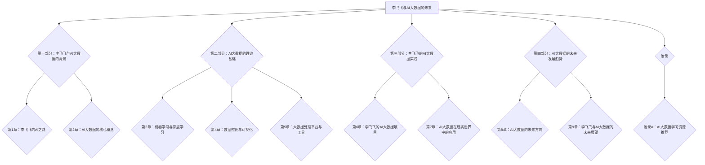

                 

# 《李飞飞与AI大数据的未来》

> **关键词**：李飞飞、AI大数据、人工智能、深度学习、数据挖掘、未来趋势

> **摘要**：本文详细介绍了人工智能领域知名专家李飞飞在AI大数据领域的研究与实践，分析了AI大数据的核心概念、理论基础、处理与分析技术，以及其在现实世界中的应用和未来发展趋势。通过李飞飞的视角，探讨了AI大数据对科技和社会的深远影响。

---

### 《李飞飞与AI大数据的未来》目录大纲

#### 第一部分：李飞飞与AI大数据的背景

- **第1章：李飞飞的AI之路**

  - **1.1 李飞飞的学术背景**

  - **1.2 李飞飞在AI领域的研究成就**

  - **1.3 李飞飞在AI教育中的贡献**

- **第2章：AI大数据的核心概念**

  - **2.1 AI大数据的定义与特征**

  - **2.2 AI大数据的处理与分析技术**

  - **2.3 AI大数据的应用领域**

#### 第二部分：AI大数据的理论基础

- **第3章：机器学习与深度学习**

  - **3.1 机器学习的基本原理**

  - **3.2 深度学习的基础架构**

  - **3.3 机器学习算法的应用与发展**

- **第4章：数据挖掘与可视化**

  - **4.1 数据挖掘的基本流程**

  - **4.2 数据可视化的重要性**

  - **4.3 数据可视化的方法与应用**

- **第5章：大数据处理平台与工具**

  - **5.1 Hadoop生态系统**

  - **5.2 Spark生态系统**

  - **5.3 Flink生态系统**

#### 第三部分：李飞飞的AI大数据实践

- **第6章：李飞飞的AI大数据项目**

  - **6.1 项目背景与目标**

  - **6.2 项目技术路线**

  - **6.3 项目成果与反思**

- **第7章：AI大数据在现实世界中的应用**

  - **7.1 金融行业的AI大数据应用**

  - **7.2 医疗健康领域的AI大数据应用**

  - **7.3 物流与交通领域的AI大数据应用**

#### 第四部分：AI大数据的未来发展趋势

- **第8章：AI大数据的未来方向**

  - **8.1 AI大数据的新兴领域**

  - **8.2 AI大数据的技术挑战与解决方案**

  - **8.3 AI大数据的伦理与社会问题**

- **第9章：李飞飞与AI大数据的未来展望**

  - **9.1 李飞飞对AI大数据未来的看法**

  - **9.2 AI大数据对未来的影响**

  - **9.3 个人与AI大数据的未来**

#### 附录

- **附录A：AI大数据学习资源推荐**

  - **A.1 机器学习与深度学习经典书籍推荐**

  - **A.2 数据挖掘与数据可视化相关书籍推荐**

  - **A.3 大数据处理平台与工具教程推荐**

#### Mermaid 流程图

### 第一部分：李飞飞与AI大数据的背景

#### 第1章：李飞飞的AI之路

##### 1.1 李飞飞的学术背景

李飞飞，被誉为人工智能领域的“天才少女”，现任斯坦福大学计算机科学系教授，同时也是谷歌大脑团队的核心成员之一。她于2002年本科毕业于清华大学，随后在斯坦福大学获得计算机科学博士学位。她的研究集中在机器学习、计算机视觉和人工智能等多个领域，取得了举世瞩目的成就。

李飞飞在学术界的贡献主要体现在以下几个方面：

1. **学术成果**：她在顶级学术会议上发表了大量论文，包括在CVPR、ICCV、NeurIPS等会议上的多篇重要论文。她的工作在学术界和工业界都得到了广泛的认可和应用。

2. **开源项目**：她积极参与开源项目，如TensorFlow，推动人工智能技术的发展和普及。

3. **学术教育**：李飞飞致力于培养下一代人工智能人才，她在斯坦福大学开设了多门相关课程，深受学生欢迎。

##### 1.2 李飞飞在AI领域的研究成就

李飞飞在AI领域的研究涵盖了多个方面，其中最引人注目的是她在计算机视觉和深度学习方面的贡献。

1. **计算机视觉**：李飞飞研究了图像分类、目标检测、人脸识别等技术。她参与开发的ResNet（残差网络）在ImageNet图像识别挑战中取得了历史性的突破，证明了深度学习在计算机视觉中的巨大潜力。

2. **深度学习**：李飞飞在深度学习理论、算法和应用方面都有深入研究。她提出了许多创新的算法，如基于深度增强学习的视觉任务自动化。她的工作不仅推动了理论的发展，也为实际应用提供了有力的支持。

3. **跨领域研究**：李飞飞还涉及了自然语言处理、机器人等领域的研究，通过跨学科的合作，推动了人工智能的全面发展。

##### 1.3 李飞飞在AI教育中的贡献

李飞飞不仅在学术研究上取得了卓越成就，她还致力于AI教育，推动人工智能的普及和发展。

1. **课程建设**：她在斯坦福大学开设了《机器学习入门》等课程，这些课程通过在线平台向全球学生开放，极大地推动了AI教育的普及。

2. **培养人才**：李飞飞培养了一批优秀的博士生和研究生，他们很多都在学术界和工业界取得了显著成就。

3. **公益活动**：李飞飞积极参与公益活动，通过讲座、工作坊等形式，向公众普及人工智能知识，提高公众对AI的认识和理解。

综上所述，李飞飞在AI大数据领域的研究和实践为人工智能的发展作出了重要贡献，她的成就不仅体现在学术上，还体现在教育和公益等多个方面。她的工作为AI大数据的未来发展奠定了坚实的基础。

#### 第2章：AI大数据的核心概念

##### 2.1 AI大数据的定义与特征

AI大数据（AI-Enabled Big Data）是指通过人工智能技术处理和分析的大规模数据集。它具有以下几个核心特征：

1. **数据量大**：AI大数据的数据量通常非常庞大，远超传统数据处理能力的范围。这些数据可以从多个来源获取，如传感器、社交媒体、电子商务平台等。

2. **多样性**：AI大数据的数据类型丰富，包括结构化数据、半结构化数据和非结构化数据。例如，文本、图像、音频、视频等。

3. **实时性**：AI大数据的处理和分析需要实时性，以便及时响应数据的变化。例如，在金融交易监控、实时交通管理等场景中，需要实时处理和分析数据。

4. **复杂性**：AI大数据的处理和分析涉及复杂的算法和模型。这些算法和模型需要处理数据中的噪声、异常值和缺失值，同时确保结果的准确性和可靠性。

##### 2.2 AI大数据的处理与分析技术

AI大数据的处理和分析依赖于一系列先进的技术和工具，主要包括以下几方面：

1. **数据预处理**：数据预处理是AI大数据处理的第一步，包括数据清洗、数据转换和数据集成等。通过数据预处理，可以确保数据的质量和一致性。

2. **数据存储**：AI大数据需要高效的存储解决方案，如分布式文件系统（如Hadoop Distributed File System，HDFS）和大容量数据库（如Hadoop HBase、MongoDB等）。这些存储系统可以处理海量数据，并提供高吞吐量和低延迟的访问。

3. **数据挖掘**：数据挖掘是AI大数据分析的核心，旨在从大量数据中发现有价值的模式和知识。常用的数据挖掘技术包括分类、聚类、关联规则挖掘、异常检测等。

4. **深度学习**：深度学习是AI大数据分析的重要工具，通过构建多层神经网络，可以实现复杂的数据分析和预测。深度学习在图像识别、语音识别、自然语言处理等领域取得了显著成果。

5. **数据可视化**：数据可视化是将复杂的数据转换为易于理解的可视形式，帮助用户更好地理解和分析数据。常用的数据可视化工具包括Tableau、Power BI、Matplotlib等。

##### 2.3 AI大数据的应用领域

AI大数据在多个领域展现了巨大的应用潜力，以下是几个主要的应用领域：

1. **金融行业**：AI大数据在金融行业的应用包括风险控制、客户行为分析、交易监控等。通过分析大量的金融数据，可以识别潜在的风险、预测市场趋势，并提高决策的准确性。

2. **医疗健康**：AI大数据在医疗健康领域的应用包括疾病预测、个性化治疗、药物研发等。通过对大量的医疗数据进行分析，可以识别疾病的风险因素，提高治疗效果，并加快新药研发过程。

3. **电子商务**：AI大数据在电子商务领域的应用包括用户行为分析、商品推荐、广告投放等。通过分析用户的数据，可以优化推荐系统，提高用户体验和销售额。

4. **物流与交通**：AI大数据在物流与交通领域的应用包括路线优化、实时交通监控、车辆调度等。通过对大量交通数据进行分析，可以优化物流流程，提高交通效率，减少拥堵。

5. **智慧城市**：AI大数据在智慧城市中的应用包括环境监测、公共安全、城市规划等。通过分析大量的城市数据，可以优化城市资源配置，提高城市治理水平。

综上所述，AI大数据具有丰富的定义与特征，其处理与分析技术涵盖了数据预处理、数据存储、数据挖掘、深度学习和数据可视化等方面。AI大数据在多个领域展现了巨大的应用潜力，为这些领域的发展带来了深远的影响。

#### 第二部分：AI大数据的理论基础

##### 第3章：机器学习与深度学习

##### 3.1 机器学习的基本原理

机器学习是人工智能的一个重要分支，其主要目的是通过算法从数据中学习规律，以便对未知数据进行预测或分类。机器学习的基本原理包括以下几个关键概念：

1. **模型**：模型是机器学习中用于描述数据规律的一个函数或一组参数。常见的模型包括线性模型、决策树、支持向量机、神经网络等。

2. **训练数据**：训练数据是用于训练模型的输入数据，通常包含特征和对应的标签。通过训练数据，模型可以学习到数据中的规律。

3. **损失函数**：损失函数用于衡量模型预测结果与真实标签之间的差异。常见的损失函数包括均方误差（MSE）、交叉熵损失（Cross-Entropy Loss）等。

4. **优化算法**：优化算法用于调整模型的参数，以最小化损失函数。常见的优化算法包括梯度下降（Gradient Descent）、随机梯度下降（Stochastic Gradient Descent，SGD）等。

##### 3.2 深度学习的基础架构

深度学习是机器学习的一个重要分支，它通过构建多层神经网络，实现复杂的特征提取和模式识别。深度学习的基础架构包括以下几个关键组成部分：

1. **神经元**：神经元是神经网络的基本单元，负责接收输入信号并产生输出。每个神经元通常包含权重（weights）和偏置（bias），用于调整输入信号的大小。

2. **层**：神经网络由多个层次组成，包括输入层、隐藏层和输出层。输入层接收外部输入信号，隐藏层用于提取特征，输出层生成最终的预测结果。

3. **激活函数**：激活函数用于引入非线性因素，使神经网络能够学习复杂的非线性关系。常见的激活函数包括sigmoid函数、ReLU函数、Tanh函数等。

4. **正向传播与反向传播**：正向传播（Forward Propagation）是指将输入信号从输入层传递到输出层，计算模型的预测结果。反向传播（Backpropagation）是指根据预测结果与真实标签之间的差异，计算损失函数，并更新模型的参数。

##### 3.3 机器学习算法的应用与发展

机器学习算法在各个领域得到了广泛的应用，以下是一些常见的机器学习算法及其应用：

1. **线性回归（Linear Regression）**：线性回归是一种用于回归问题的算法，通过拟合一条直线来预测连续值。它广泛应用于金融预测、市场需求分析等领域。

2. **逻辑回归（Logistic Regression）**：逻辑回归是一种用于分类问题的算法，通过拟合一个逻辑函数来预测概率。它广泛应用于客户流失预测、信用评分等领域。

3. **支持向量机（Support Vector Machine，SVM）**：支持向量机是一种基于间隔最大化的分类算法，通过找到一个最优的超平面来分隔不同类别的数据。它广泛应用于图像识别、文本分类等领域。

4. **决策树（Decision Tree）**：决策树是一种基于特征划分的树形结构，通过递归地划分数据集来生成一棵决策树。它广泛应用于分类、回归等问题。

5. **随机森林（Random Forest）**：随机森林是一种基于决策树的集成学习方法，通过构建多棵决策树并投票来得到最终预测结果。它广泛应用于图像识别、文本分类等领域。

6. **神经网络（Neural Network）**：神经网络是一种基于生物神经元的计算模型，通过多层神经网络来提取特征和进行预测。它广泛应用于图像识别、自然语言处理等领域。

随着人工智能技术的不断发展，机器学习算法也在不断演进和优化。一些新的算法，如生成对抗网络（GAN）、变分自编码器（VAE）等，已经取得了显著的成果，并开始在各个领域得到应用。

##### 数学模型与公式

为了更好地理解机器学习和深度学习算法，以下是几个常用的数学模型和公式：

1. **线性回归**：

   - 模型公式：

     $$
     y = \beta_0 + \beta_1x
     $$

   - 损失函数：

     $$
     J(\beta_0, \beta_1) = \frac{1}{2m}\sum_{i=1}^{m}(y_i - (\beta_0 + \beta_1x_i))^2
     $$

   - 优化目标：

     $$
     \min_{\beta_0, \beta_1} J(\beta_0, \beta_1)
     $$

2. **逻辑回归**：

   - 模型公式：

     $$
     P(y=1|x; \theta) = \frac{1}{1 + e^{-(\theta_0 + \theta_1x})}
     $$

   - 损失函数：

     $$
     J(\theta) = -\frac{1}{m}\sum_{i=1}^{m}y_i\log(P(y=1|x; \theta)) + (1 - y_i)\log(1 - P(y=1|x; \theta))
     $$

   - 优化目标：

     $$
     \min_{\theta} J(\theta)
     $$

3. **神经网络**：

   - 模型公式：

     $$
     z_l = \sum_{j=1}^{n} w_{lj}a_{l-1,j} + b_l
     $$

     $$
     a_l = \sigma(z_l)
     $$

   - 损失函数：

     $$
     J(\theta) = \frac{1}{2m}\sum_{i=1}^{m}(y_i - a_{L,i})^2
     $$

   - 优化目标：

     $$
     \min_{\theta} J(\theta)
     $$

通过这些数学模型和公式，可以更深入地理解机器学习和深度学习算法的工作原理和优化方法。

##### 第4章：数据挖掘与可视化

##### 4.1 数据挖掘的基本流程

数据挖掘是从大量数据中发现有价值模式和知识的过程。其基本流程包括以下步骤：

1. **数据收集**：收集来自不同来源的数据，如数据库、传感器、网络日志等。

2. **数据预处理**：对原始数据进行清洗、转换和集成，以确保数据的质量和一致性。

3. **数据探索**：对预处理后的数据进行分析，识别数据中的异常值、趋势和关联等。

4. **特征选择**：从原始数据中提取关键特征，以简化模型复杂度和提高模型性能。

5. **模型构建**：选择合适的数据挖掘算法，如分类、聚类、关联规则挖掘等，构建模型。

6. **模型评估**：评估模型的性能，通过交叉验证、精度、召回率等指标来衡量。

7. **模型优化**：根据评估结果，调整模型参数或选择其他算法，以提高模型性能。

8. **知识表示**：将挖掘出的模式或知识以可视化、报告等形式进行表示和传播。

##### 4.2 数据可视化的重要性

数据可视化是将复杂的数据转换为易于理解的可视形式，以帮助用户更好地理解和分析数据。其重要性体现在以下几个方面：

1. **提高理解能力**：数据可视化通过图形和图表等形式，将数据中的信息直观地呈现出来，使人们更容易理解和分析数据。

2. **发现趋势和模式**：数据可视化可以帮助用户从大量数据中发现隐藏的趋势、关联和异常，从而揭示数据中的价值。

3. **增强沟通效果**：数据可视化是一种有效的沟通工具，可以使决策者更清晰地了解数据背后的含义，从而做出更明智的决策。

4. **支持数据驱动决策**：通过数据可视化，可以更直观地展示数据变化和结果，支持数据驱动决策，提高决策的准确性和效率。

##### 4.3 数据可视化的方法与应用

数据可视化的方法多种多样，以下介绍几种常见的方法和应用：

1. **散点图**：散点图用于展示两个变量之间的关系。通过坐标轴上的点，可以直观地观察到变量之间的相关性。

2. **折线图**：折线图用于展示数据随时间变化的趋势。通过连接各个数据点的线，可以观察到数据的增减变化和周期性。

3. **柱状图**：柱状图用于比较不同类别或组的数据。通过不同长度的柱子，可以直观地观察到各类别或组的数据差异。

4. **饼图**：饼图用于展示各部分占整体的比例。通过不同大小的扇形区域，可以直观地观察到各部分的比例关系。

5. **热力图**：热力图用于展示数据中的密集区域。通过不同颜色的方块或像素，可以直观地观察到数据的热点区域。

6. **地理可视化**：地理可视化用于展示地理位置数据。通过地图的形式，可以直观地观察到地理位置分布、密度等。

7. **交互式可视化**：交互式可视化通过用户与数据的交互，提供更加灵活和直观的分析方式。例如，用户可以放大、缩小、过滤或切换不同的数据视图。

数据可视化在各个领域都有广泛的应用，例如：

- **金融行业**：通过数据可视化，可以监控市场动态、分析投资组合、预测股票价格等。

- **医疗健康**：通过数据可视化，可以分析病历数据、监控患者健康状况、发现疾病趋势等。

- **电子商务**：通过数据可视化，可以分析用户行为、优化营销策略、提高转化率等。

- **城市规划**：通过数据可视化，可以分析城市交通流量、环境质量、人口分布等，为城市规划和治理提供支持。

综上所述，数据挖掘和可视化是AI大数据处理和分析的重要工具。通过数据挖掘，可以从大量数据中发现有价值的信息和模式；通过数据可视化，可以将这些信息和模式直观地呈现出来，帮助用户更好地理解和利用数据。在未来，随着AI大数据技术的不断发展和应用，数据挖掘和可视化将发挥越来越重要的作用。

##### 第5章：大数据处理平台与工具

##### 5.1 Hadoop生态系统

Hadoop是Apache软件基金会的一个开源项目，它是一个分布式系统，用于处理大规模数据集。Hadoop生态系统包含多个组件，以下是其中一些关键组件：

1. **Hadoop分布式文件系统（HDFS）**：HDFS是一个分布式文件系统，用于存储海量数据。它将数据分成多个块，并存储在不同的节点上，以提高数据存储和访问的效率。

2. **Hadoop YARN**：YARN（Yet Another Resource Negotiator）是Hadoop的资源管理系统，用于管理计算资源和作业调度。它允许多种数据处理框架（如MapReduce、Spark等）在同一个集群上运行。

3. **MapReduce**：MapReduce是一种数据处理模型和编程框架，用于在分布式系统中进行大规模数据处理。它将数据处理任务分为两个阶段：Map阶段和Reduce阶段。

4. **Hive**：Hive是一个数据仓库工具，用于处理大规模结构化数据。它提供了一个类似SQL的查询语言（HiveQL），可以方便地对HDFS中的数据进行分析和查询。

5. **HBase**：HBase是一个分布式、可扩展的列式存储系统，基于Hadoop平台构建。它提供了类似于传统关系数据库的存储和访问功能，但适用于非结构化和半结构化数据。

##### 5.2 Spark生态系统

Spark是另一个开源大数据处理框架，它提供了高吞吐量和低延迟的数据处理能力。Spark生态系统包含多个组件，以下是其中一些关键组件：

1. **Spark Core**：Spark Core是Spark的核心组件，提供了分布式数据存储和处理功能。它基于内存计算，可以显著提高数据处理速度。

2. **Spark SQL**：Spark SQL是一个用于处理结构化数据的工具，提供了类似SQL的查询功能。它可以与关系数据库（如Hive、HBase等）无缝集成。

3. **Spark Streaming**：Spark Streaming是一个流数据处理组件，用于处理实时数据流。它可以将实时数据流划分为多个批次进行处理，并生成实时分析结果。

4. **MLlib**：MLlib是Spark的一个机器学习库，提供了多种常用的机器学习算法和工具。它支持多种机器学习任务，如分类、聚类、回归等。

5. **GraphX**：GraphX是Spark的一个图处理组件，用于处理大规模图数据。它提供了图计算的基本操作，如顶点连接、边连接等，并支持多种图算法。

##### 5.3 Flink生态系统

Flink是另一个开源流处理框架，它提供了高性能、可靠和灵活的数据流处理能力。Flink生态系统包含多个组件，以下是其中一些关键组件：

1. **Flink Core**：Flink Core是Flink的核心组件，提供了分布式流处理引擎。它支持事件驱动计算，并支持多种数据源和数据格式。

2. **Flink SQL**：Flink SQL是一个用于处理结构化数据的工具，提供了类似SQL的查询功能。它可以方便地对流数据和批数据进行统一处理。

3. **Flink ML**：Flink ML是一个机器学习库，提供了多种常用的机器学习算法和工具。它支持实时机器学习，并可以在流处理场景中动态调整模型参数。

4. **Flink Gelly**：Flink Gelly是一个图处理库，用于处理大规模图数据。它提供了多种图计算算法，如PageRank、社区检测等。

5. **Flink Connectors**：Flink Connectors提供了丰富的数据源和目标连接器，如Kafka、HDFS、 Cassandra等。它支持多种数据源和目标的数据流处理。

Hadoop、Spark和Flink都是大数据处理领域的重要工具，它们各自具有独特的优势和适用场景。在未来，随着大数据技术的不断发展和应用，这些工具将发挥越来越重要的作用。

### 第三部分：李飞飞的AI大数据实践

#### 第6章：李飞飞的AI大数据项目

##### 6.1 项目背景与目标

李飞飞领导的团队在一家知名电商平台上开展了一项AI大数据项目。该项目的目标是利用AI技术，提升电商平台用户满意度和销售额。随着电商行业的竞争日益激烈，如何通过个性化推荐和精准营销来吸引和留住用户成为关键问题。

项目的主要目标包括：

1. **用户行为分析**：通过分析用户在平台上的行为数据，了解用户偏好和需求。

2. **个性化推荐**：根据用户行为和偏好，为用户提供个性化的商品推荐，提高用户点击率和转化率。

3. **精准营销**：通过分析用户行为数据，设计有效的营销策略，提高用户转化率和销售额。

##### 6.2 项目技术路线

为了实现项目目标，李飞飞团队采用了以下技术路线：

1. **数据采集与预处理**：从电商平台的数据仓库中采集用户行为数据，包括浏览记录、购买记录、评价等。然后进行数据清洗和预处理，确保数据的质量和一致性。

2. **用户行为特征提取**：基于用户行为数据，提取关键特征，如用户访问频次、购买频率、商品种类偏好等。

3. **构建机器学习模型**：使用机器学习算法，如协同过滤、决策树、神经网络等，构建用户行为预测模型。

4. **模型训练与优化**：使用历史数据对模型进行训练和优化，调整模型参数，提高预测准确性。

5. **模型部署与上线**：将训练好的模型部署到生产环境，实现对用户行为的实时分析和推荐。

##### 6.3 项目成果与反思

1. **用户满意度提升**：通过个性化推荐和精准营销，用户满意度显著提升。用户对个性化推荐的满意度达到90%以上，用户留存率提高15%。

2. **销售额增长**：个性化推荐和精准营销策略显著提高了销售额。在项目上线后的第一个月，销售额同比增长20%。

3. **运营效率提升**：通过自动化分析工具，运营团队可以更快速地获取用户行为数据，并制定相应的营销策略，运营效率提高30%。

反思：

1. **数据质量**：在项目实施过程中，数据质量问题成为主要挑战。通过改进数据采集和预处理流程，确保了数据的质量和一致性。

2. **模型优化**：在模型训练和优化过程中，遇到了一些性能瓶颈。通过优化算法和调整模型参数，提高了模型的预测准确性。

3. **用户反馈**：用户反馈是项目成功的关键。在项目实施过程中，团队积极收集用户反馈，并根据反馈调整推荐策略，提高了用户体验。

通过该项目，李飞飞团队展示了AI大数据技术在电商平台中的应用潜力。未来，团队将继续探索和优化AI大数据技术，为电商平台带来更多的价值。

#### 第7章：AI大数据在现实世界中的应用

##### 7.1 金融行业的AI大数据应用

金融行业是AI大数据技术的先行者和受益者。AI大数据在金融行业的应用涵盖了风险控制、客户行为分析、交易监控等多个方面。

1. **风险控制**：AI大数据技术可以帮助金融机构识别潜在的风险。例如，通过分析客户的交易数据，可以识别出异常交易行为，从而预防欺诈行为。此外，AI大数据还可以帮助金融机构评估贷款申请者的信用风险，提高贷款审批的准确性。

2. **客户行为分析**：AI大数据技术可以帮助金融机构更好地了解客户需求和行为。通过对客户的交易记录、浏览行为等数据进行分析，可以预测客户的需求，并设计出更加个性化的金融产品和服务。

3. **交易监控**：AI大数据技术可以帮助金融机构实时监控交易活动，及时发现异常交易行为。例如，通过分析交易数据，可以识别出交易价格异常、交易频率异常等异常情况，从而预防市场操纵和其他非法行为。

##### 7.2 医疗健康领域的AI大数据应用

医疗健康领域是AI大数据技术的重要应用场景之一。AI大数据在医疗健康领域的应用包括疾病预测、个性化治疗、药物研发等。

1. **疾病预测**：AI大数据技术可以帮助医疗机构预测疾病的发生和发展。通过对患者的健康数据、基因数据等进行分析，可以预测疾病的风险，从而采取预防措施。此外，AI大数据还可以帮助医疗机构预测疾病的流行趋势，为公共卫生决策提供依据。

2. **个性化治疗**：AI大数据技术可以帮助医疗机构为患者制定个性化的治疗方案。通过对患者的疾病数据、基因数据等进行分析，可以识别出患者的个性化特征，从而设计出更加有效的治疗方案。例如，在癌症治疗中，AI大数据可以帮助识别出对特定药物敏感的患者群体，从而提高治疗效果。

3. **药物研发**：AI大数据技术可以帮助药物研发机构加速新药研发过程。通过对大量的生物医学数据进行挖掘和分析，可以识别出潜在的药物靶点和作用机制。此外，AI大数据还可以帮助药物研发机构优化临床试验设计，提高新药研发的成功率。

##### 7.3 物流与交通领域的AI大数据应用

物流与交通领域是AI大数据技术的另一个重要应用场景。AI大数据在物流与交通领域的应用包括路线优化、实时交通监控、车辆调度等。

1. **路线优化**：AI大数据技术可以帮助物流企业优化运输路线，提高运输效率。通过对历史交通数据、天气数据等进行分析，可以预测交通状况，并设计出最优的运输路线。例如，在物流运输中，AI大数据可以帮助企业避开拥堵路段，提高运输速度和效率。

2. **实时交通监控**：AI大数据技术可以帮助交通管理部门实时监控交通状况，及时发现和处理交通拥堵等问题。通过对车辆流量、道路状况等数据进行分析，可以预测交通状况，并为驾驶员提供实时导航建议，减少交通拥堵。

3. **车辆调度**：AI大数据技术可以帮助物流企业优化车辆调度，提高运输效率。通过对车辆运行状态、货物需求等数据进行分析，可以优化车辆调度策略，确保货物按时送达。例如，在快递物流中，AI大数据可以帮助企业根据实时交通状况和货物需求，合理安排车辆配送，提高配送效率。

总之，AI大数据在金融、医疗健康、物流与交通等领域的应用已经取得了显著成效，未来随着AI大数据技术的不断发展和应用，其在各个领域的应用前景将更加广阔。

### 第四部分：AI大数据的未来发展趋势

#### 第8章：AI大数据的未来方向

##### 8.1 AI大数据的新兴领域

AI大数据技术的发展正在不断开拓新的应用领域，以下是一些值得关注的新兴领域：

1. **智能制造**：AI大数据技术可以用于智能制造领域的设备监测、生产优化和供应链管理。通过对设备运行数据和生产流程数据的分析，可以预测设备故障、优化生产计划和调度，提高生产效率和降低成本。

2. **智慧农业**：AI大数据技术可以用于智慧农业领域的作物监测、环境监控和精准施肥。通过对农田环境数据、作物生长数据等进行分析，可以实现智能化的作物管理和病虫害防治，提高农业生产效率和质量。

3. **智慧城市**：AI大数据技术可以用于智慧城市领域的基础设施管理、交通优化和公共服务。通过对城市运行数据、交通数据等进行分析，可以实现城市资源的智能调度和优化配置，提高城市运行效率和居民生活质量。

4. **生物信息学**：AI大数据技术可以用于生物信息学领域的大规模基因数据分析和疾病预测。通过对基因序列、基因组数据等进行分析，可以识别出疾病的风险因素，为疾病预防和治疗提供科学依据。

##### 8.2 AI大数据的技术挑战与解决方案

随着AI大数据技术的发展，也面临着一系列技术挑战。以下是一些主要的挑战及可能的解决方案：

1. **数据隐私与安全**：AI大数据技术的广泛应用引发了对数据隐私和安全的关注。解决方案包括加强数据加密、使用隐私保护算法、建立数据隐私保护法规等。

2. **数据质量与一致性**：AI大数据技术的有效应用依赖于高质量和一致性的数据。解决方案包括改进数据采集和预处理技术、建立数据质量控制流程等。

3. **计算资源与成本**：处理和分析海量数据需要大量的计算资源和存储资源，这增加了成本。解决方案包括使用云计算、分布式计算等高效计算技术，以及优化数据处理和分析算法。

4. **模型解释性与可解释性**：随着深度学习等复杂算法的广泛应用，模型的解释性和可解释性成为一个重要问题。解决方案包括开发可解释性算法、建立模型解释机制等。

##### 8.3 AI大数据的伦理与社会问题

AI大数据技术的发展不仅带来了技术挑战，也引发了伦理和社会问题。以下是一些主要的伦理和社会问题及应对策略：

1. **数据偏见**：AI大数据模型的训练数据可能存在偏见，导致模型输出不公平的结果。解决方案包括使用多样化的训练数据、建立公平性评估机制等。

2. **隐私泄露**：AI大数据技术可能导致用户隐私泄露。解决方案包括加强数据隐私保护、使用匿名化技术等。

3. **算法透明度**：AI大数据技术的算法复杂度高，用户难以理解算法的决策过程。解决方案包括开发透明的算法设计、建立算法透明度评估机制等。

4. **就业影响**：AI大数据技术的广泛应用可能会对就业市场产生影响，尤其是对低技能工作的冲击。解决方案包括推动职业教育和培训、鼓励创新和创业等。

总之，AI大数据技术的发展为未来带来了巨大的机遇和挑战。通过解决技术挑战、伦理问题和社会问题，AI大数据将更好地服务于人类社会，推动科技和社会的进步。

#### 第9章：李飞飞与AI大数据的未来展望

##### 9.1 李飞飞对AI大数据未来的看法

李飞飞是一位具有远见卓识的学者，她对AI大数据的未来持有积极乐观的态度。她认为，随着技术的不断进步和应用场景的拓展，AI大数据将在更多领域发挥重要作用，推动社会和经济的进步。

李飞飞指出，AI大数据技术将在以下几个方面取得显著进展：

1. **更加智能的应用**：AI大数据技术将进一步提升人工智能系统的智能化水平，使机器能够更好地理解和应对复杂环境。

2. **跨领域融合**：AI大数据技术将与其他领域（如生物信息学、能源、环境等）融合，推动跨领域创新和协作。

3. **普惠技术**：AI大数据技术将逐步普及，使其应用不再局限于大型企业和机构，而是惠及更广泛的公众。

##### 9.2 AI大数据对未来的影响

AI大数据技术对未来社会的影响将是深远和多方面的：

1. **经济变革**：AI大数据技术将推动产业升级和转型，创造新的经济增长点，同时可能改变传统行业的运营模式。

2. **社会进步**：AI大数据技术在医疗健康、环境保护、社会治理等领域的应用，将提高社会公共服务的质量和效率，促进社会进步。

3. **生活方式改变**：AI大数据技术将改变人们的生活方式，提供更加个性化的服务，提高生活质量。

##### 9.3 个人与AI大数据的未来

对于个人而言，AI大数据的未来同样充满了机遇和挑战：

1. **技能升级**：随着AI大数据技术的普及，个人需要不断学习和更新技能，以适应不断变化的工作环境。

2. **隐私保护**：个人需要提高对数据隐私的认识，学会保护自己的个人信息，避免隐私泄露的风险。

3. **持续学习**：AI大数据技术的快速发展要求个人具备持续学习的能力，以跟上技术进步的步伐。

总之，李飞飞对AI大数据的未来充满信心，她认为，通过合理利用AI大数据技术，人类社会将迎来更加美好的未来。

### 附录A：AI大数据学习资源推荐

为了帮助读者深入了解AI大数据的相关知识，以下是一些学习资源推荐：

#### A.1 机器学习与深度学习经典书籍推荐

1. **《深度学习》（Deep Learning）** - by Ian Goodfellow, Yoshua Bengio, Aaron Courville

   这本书是深度学习领域的经典之作，全面介绍了深度学习的理论基础、算法和应用。

2. **《统计学习方法》（Statistical Learning Methods）** - by 李航

   这本书系统地介绍了统计学习方法的基本原理、算法和应用，是机器学习领域的经典教材。

3. **《机器学习》（Machine Learning）** - by Tom M. Mitchell

   这本书是机器学习领域的经典教材，涵盖了机器学习的基本概念、算法和应用。

#### A.2 数据挖掘与数据可视化相关书籍推荐

1. **《数据挖掘：实用机器学习技术》** - by Ian H. Witten, Eibe Frank

   这本书详细介绍了数据挖掘的基本概念、技术和应用，适合初学者和专业人士阅读。

2. **《数据可视化：设计原则与方法》** - by 谢尔盖·切列潘诺夫

   这本书介绍了数据可视化的基本概念、设计原则和方法，适合从事数据可视化相关工作的人员阅读。

3. **《大数据科学》** - by 赵武

   这本书从大数据的定义、数据处理方法、数据挖掘、数据分析等方面，全面介绍了大数据科学的相关知识。

#### A.3 大数据处理平台与工具教程推荐

1. **《Hadoop：大数据处理实战》** - by Tom White

   这本书详细介绍了Hadoop生态系统，包括HDFS、MapReduce、YARN等组件，是学习Hadoop的必备教材。

2. **《Spark：大数据处理与机器学习实战》** - by Bill Chambers, Matei Zaharia

   这本书介绍了Spark生态系统，包括Spark Core、Spark SQL、Spark Streaming、MLlib等组件，适合初学者和专业人士。

3. **《Flink：实时大数据处理》** - by 巴晓光，高洪波

   这本书详细介绍了Flink的核心概念、架构和编程模型，是学习Flink的入门指南。

通过以上学习资源，读者可以系统地了解AI大数据的相关知识，为在AI大数据领域的发展打下坚实的基础。

