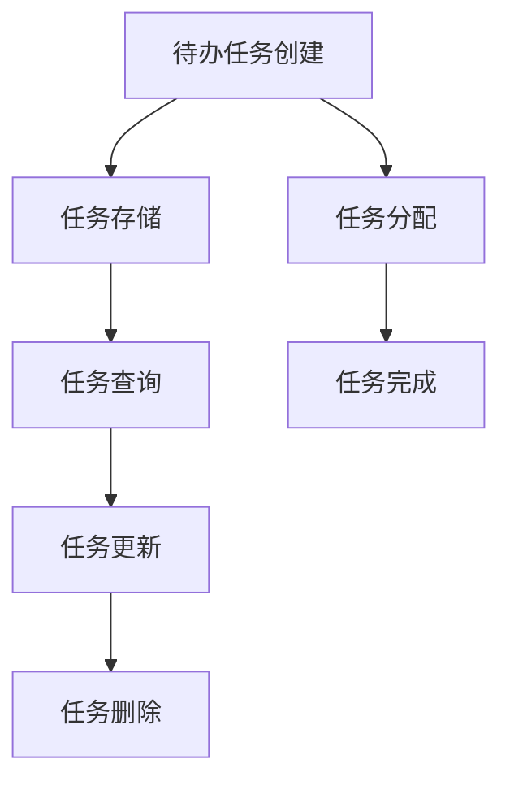

                 

# 《样例项目: 待办 (Todo) 管理插件》

## 关键词
- 待办管理插件
- 软件架构
- 技术栈
- 数据库设计
- 核心算法
- 开发环境搭建
- 代码实现
- 项目部署
- 用户体验优化

## 摘要
本文将深入探讨待办（Todo）管理插件的构建过程。从基础概念和架构设计，到技术栈选择，再到数据库设计、核心算法讲解以及项目实战，我们将逐步剖析待办管理插件的关键技术点和实现方法。同时，文章还将提供扩展应用和优化建议，以提升插件性能和用户体验。通过本文，读者将全面了解待办管理插件的开发与部署过程，并获得实际操作经验。

### 《样例项目: 待办 (Todo) 管理插件》目录大纲

#### 第一部分：基础概念与架构设计

**第1章：待办（Todo）管理插件概述**

- **1.1 待办管理插件的基本概念**
  - 待办任务的定义与特性
  - 插件在待办管理中的应用

- **1.2 待办管理插件的重要性**
  - 效率提升
  - 事项跟踪
  - 团队协作

- **1.3 插件架构设计原则**
  - 模块化设计
  - 可扩展性
  - 跨平台兼容

**第2章：待办管理插件的技术栈**

- **2.1 技术栈选择**
  - 前端技术栈
  - 后端技术栈
  - 数据库技术

- **2.2 前端框架与工具**
  - React/Vue.js 等框架
  - Element UI/Vuetify 等UI库

- **2.3 后端服务与API设计**
  - RESTful API 设计
  - GraphQL 优势与使用

**第3章：待办管理插件的数据库设计**

- **3.1 数据库设计原则**
  - 数据模型设计
  - 性能优化

- **3.2 关系型数据库**
  - MySQL/PostgreSQL

- **3.3 NoSQL数据库**
  - MongoDB/Redis

**第4章：核心算法原理讲解**

- **4.1 优先级算法**
  - 伪代码
  - 数学模型

- **4.2 负责人分配算法**
  - 伪代码
  - 数学模型

#### 第二部分：开发环境搭建与项目实战

**第5章：开发环境搭建**

- **5.1 前端开发环境搭建**
  - Node.js 安装与配置
  - package.json 文件构建

- **5.2 后端开发环境搭建**
  - Spring Boot/Express.js 等框架
  - Docker 容器化部署

**第6章：源代码详细实现**

- **6.1 前端代码实现**
  - 组件开发
  - 页面布局

- **6.2 后端代码实现**
  - 控制器设计
  - 服务实现

- **6.3 数据库实现**
  - 数据模型定义
  - 数据库操作

**第7章：代码解读与分析**

- **7.1 前端代码解读**
  - React/Vue.js 源码分析
  - 性能优化

- **7.2 后端代码解读**
  - Spring Boot/Express.js 源码分析
  - 性能优化

- **7.3 数据库性能优化**
  - 索引优化
  - 分片策略

#### 第三部分：扩展应用与优化建议

**第8章：扩展应用**

- **8.1 移动端适配**
  - React Native/Flutter

- **8.2 云服务集成**
  - AWS/Spring Cloud

- **8.3 第三方服务集成**
  - OAuth/SMTP

**第9章：优化建议**

- **9.1 性能优化**
  - 前端性能优化
  - 后端性能优化

- **9.2 安全性优化**
  - 安全策略
  - 数据加密

- **9.3 用户体验优化**
  - 响应式设计
  - 可访问性

**第10章：项目部署与维护**

- **10.1 部署流程**
  - 持续集成与部署
  - 日志管理

- **10.2 维护策略**
  - 持续集成与持续交付
  - 漏洞修复

**附录 A：技术资源汇总**

- **A.1 开发工具与资源**
  - 常用开发工具
  - 学习资源

- **A.2 社区与论坛**
  - React/Vue.js 社区
  - Spring Boot/Express.js 社区

[Mermaid 流程图示例]



### 1.1 从软件1.0到软件2.0的演进

软件1.0时代主要是以桌面应用程序为主，用户在本地计算机上运行软件，软件的功能相对简单，通常以完成单一任务为目标。

软件2.0时代，随着互联网的普及，软件开始向网络化、服务化的方向发展。云端计算、分布式存储等技术使得软件能够提供更加丰富的功能，支持多用户同时在线使用。

待办管理插件在软件2.0时代的重要性体现在以下几个方面：

- **效率提升**：用户可以随时随地访问待办任务，提高了工作效率。
- **事项跟踪**：可以对任务的状态进行实时跟踪，确保任务按计划执行。
- **团队协作**：支持多人协作完成任务，提高了团队的协作效率。

```latex
$$
优先级算法的数学模型为：\\
P(i) = \\frac{w_i \\times s_i}{\\sum_{j=1}^{n} w_j \\times s_j}
$$

其中，$P(i)$ 为任务 $i$ 的优先级，$w_i$ 为任务 $i$ 的权重，$s_i$ 为任务 $i$ 的截止时间。
```

---

接下来，我们将深入探讨待办管理插件的基础概念与架构设计，为后续的开发实战奠定基础。

### 第1章：待办（Todo）管理插件概述

#### 1.1 待办管理插件的基本概念

**待办任务的定义与特性**

待办任务（Todo Task）是一种记录任务清单的工具，用于帮助用户跟踪和管理日常任务。待办任务通常具有以下特性：

1. **独立性**：每个待办任务都是一个独立的单元，可以单独创建、修改和删除。
2. **可分类性**：任务可以根据类型、优先级或其他属性进行分类。
3. **状态跟踪**：任务可以处于待办、进行中、已完成等状态，便于用户了解任务的进展。
4. **提醒功能**：任务可以设置提醒时间，以提醒用户在指定时间完成相关任务。

**插件在待办管理中的应用**

待办管理插件是一种软件模块，可以集成到现有的应用程序中，为用户提供待办任务管理功能。插件的主要应用包括：

1. **办公自动化**：在企业办公软件中集成待办任务管理插件，帮助员工跟踪工作进度，提高工作效率。
2. **个人事务管理**：在个人日程管理软件中集成待办任务管理插件，帮助用户管理个人事务，确保按时完成任务。
3. **团队协作**：在团队协作工具中集成待办任务管理插件，支持团队成员共同管理项目任务，提高团队协作效率。

#### 1.2 待办管理插件的重要性

**效率提升**

待办管理插件可以帮助用户更好地组织和管理任务，减少因任务遗漏或重复而产生的低效现象。通过实时跟踪任务状态，用户可以清楚地了解任务的进展，从而更好地安排时间，提高工作效率。

**事项跟踪**

待办任务管理插件具有任务状态跟踪功能，用户可以随时查看任务的完成情况，确保任务按计划执行。对于长时间任务，插件还可以设置提醒功能，帮助用户按时完成任务。

**团队协作**

待办管理插件支持多人协作，团队成员可以共同管理任务清单，实时同步任务状态。这有助于提高团队协作效率，确保项目按计划进行。

#### 1.3 插件架构设计原则

**模块化设计**

模块化设计是指将待办管理插件分为多个功能模块，如任务创建、任务查询、任务更新等。这种设计方式有利于提高代码的可维护性和可扩展性。

**可扩展性**

可扩展性是指插件应具备适应不同应用场景的能力。例如，在办公自动化场景中，插件可能需要支持审批流程；在个人事务管理场景中，插件可能需要支持日程安排。因此，插件的设计应充分考虑可扩展性。

**跨平台兼容**

跨平台兼容是指插件应能够在不同操作系统和设备上运行，如Windows、macOS、Linux以及iOS、Android等。这有助于提高插件的适用范围，满足不同用户的需求。

### 总结

待办管理插件是一种功能强大的软件模块，在软件2.0时代具有重要应用价值。通过本章的介绍，读者应了解待办任务的基本概念、插件在待办管理中的应用以及插件架构设计原则。在接下来的章节中，我们将深入探讨待办管理插件的技术栈、数据库设计和核心算法原理，为实际开发奠定基础。

---

接下来，我们将进入第2章，探讨待办管理插件的技术栈，了解前端技术栈、后端技术栈和数据库技术的选择和设计。

### 第2章：待办管理插件的技术栈

#### 2.1 技术栈选择

在构建待办管理插件时，选择合适的技术栈至关重要。技术栈的选择将直接影响项目的性能、可维护性和开发效率。以下是待办管理插件技术栈的主要选择：

**前端技术栈**

前端技术栈主要负责用户界面的展示和交互。以下是几种常用的前端技术：

1. **React**：React 是一个用于构建用户界面的 JavaScript 库，具有组件化、虚拟 DOM、单向数据流等优点，广泛应用于现代 Web 应用程序。
2. **Vue.js**：Vue.js 是一个用于构建用户界面的渐进式框架，其简洁的语法和良好的文档使其成为许多开发者的首选。
3. **Angular**：Angular 是一个由 Google 支持的 Web 应用程序框架，具有强大的数据绑定、依赖注入等功能，适合大型企业级应用。

**后端技术栈**

后端技术栈主要负责处理业务逻辑、数据存储和 API 服务。以下是几种常用的后端技术：

1. **Spring Boot**：Spring Boot 是一个基于 Spring 的框架，简化了 Spring 应用的配置和部署，适合构建高性能、可扩展的企业级应用。
2. **Express.js**：Express.js 是一个用于构建 Web 应用的 Node.js 框架，具有简单、灵活的特点，广泛应用于中小型 Web 应用。
3. **Django**：Django 是一个 Python Web 框架，具有“The Web for Humans”（为人类构建 Web）的理念，适合快速开发和部署。

**数据库技术**

数据库技术是存储和管理数据的核心。以下是几种常用的数据库技术：

1. **关系型数据库（RDBMS）**：如 MySQL、PostgreSQL，适用于结构化数据存储，具有良好的事务处理能力和查询性能。
2. **NoSQL 数据库**：如 MongoDB、Redis，适用于大规模数据存储和高并发场景，具有良好的扩展性和性能。
3. **文件存储**：如 AWS S3、Google Cloud Storage，适用于大规模数据存储和备份。

#### 2.2 前端框架与工具

**React**

React 是一个用于构建用户界面的 JavaScript 库，具有以下优点：

- **组件化**：React 通过组件的方式组织代码，提高代码的可维护性和可重用性。
- **虚拟 DOM**：React 使用虚拟 DOM 来优化渲染性能，减少实际 DOM 操作，提高应用性能。
- **单向数据流**：React 的单向数据流简化了状态管理，使代码更加可预测。

**Vue.js**

Vue.js 是一个用于构建用户界面的渐进式框架，具有以下优点：

- **简洁的语法**：Vue.js 的语法简洁易读，降低了学习成本。
- **双向数据绑定**：Vue.js 使用双向数据绑定来简化状态管理，提高开发效率。
- **良好的文档**：Vue.js 的文档详细且易于理解，有利于开发者快速上手。

**Element UI**

Element UI 是一个基于 Vue.js 的 UI 组件库，提供了丰富的组件，适用于构建待办管理插件的前端界面。以下是几个常用的 Element UI 组件：

- **Todo List**：用于展示待办任务列表，支持任务添加、编辑、删除等功能。
- **Task Detail**：用于展示单个任务的详细信息，包括任务名称、描述、截止时间等。
- **Task Statistic**：用于展示任务的完成情况和统计信息，如任务总数、完成百分比等。

**Vuetify**

Vuetify 是一个基于 Vue.js 的 Material Design UI 库，提供了丰富的组件和布局工具，适用于构建现代化的待办管理插件界面。以下是几个常用的 Vuetify 组件：

- **App Bar**：用于显示应用程序的顶部导航栏，支持菜单、搜索等功能。
- **Drawer**：用于显示侧边栏，支持导航、抽屉式弹出等功能。
- **Form**：用于创建表单，支持输入、选择、切换等功能。
- **Grid**：用于创建响应式布局，支持列、行、间距等设置。

#### 2.3 后端服务与 API 设计

**RESTful API**

RESTful API 是一种基于 HTTP 协议的应用程序接口设计风格，具有以下优点：

- **可扩展性**：RESTful API 通过使用标准 HTTP 方法（GET、POST、PUT、DELETE）和 URL 结构，提高了接口的可扩展性。
- **灵活性**：RESTful API 使用 JSON 或 XML 格式的数据交换，提高了数据交换的灵活性。
- **易于理解**：RESTful API 的设计遵循 REST 原则，易于理解和实现。

**GraphQL**

GraphQL 是一种用于 API 设计的新兴技术，具有以下优点：

- **灵活查询**：GraphQL 允许客户端指定需要的数据，减少了冗余数据和请求次数，提高了数据获取效率。
- **类型安全**：GraphQL 具有类型安全特性，减少了数据类型错误和接口错误。
- **代码生成**：GraphQL 提供了代码生成工具，简化了 API 客户端的开发。

**后端服务设计**

后端服务负责处理业务逻辑、数据存储和 API 服务。以下是后端服务设计的一些关键点：

- **服务分层**：后端服务可以分为表示层、业务逻辑层和数据访问层，提高代码的可维护性和可扩展性。
- **状态管理**：后端服务可以使用 Redis 等缓存技术来管理状态，提高系统的响应速度。
- **消息队列**：后端服务可以使用消息队列（如 RabbitMQ、Kafka）来处理异步任务，提高系统的并发处理能力。

**API 设计**

API 设计是后端服务的关键部分，以下是一些 API 设计的原则：

- **简洁性**：API 应具有简洁、直观的接口设计，避免复杂的参数和返回值。
- **一致性**：API 应遵循一致的设计风格，如使用统一的数据格式、统一的错误处理机制等。
- **安全性**：API 应具备一定的安全性，如使用 SSL/TLS 证书、密码加密等。

#### 2.4 数据库技术

**关系型数据库**

关系型数据库（RDBMS）是一种传统的数据库技术，具有以下优点：

- **结构化数据存储**：关系型数据库使用表结构来存储数据，提供了强大的数据查询和操作能力。
- **事务处理**：关系型数据库支持事务处理，确保数据的完整性和一致性。
- **成熟稳定**：关系型数据库经过了长期的发展和优化，具有较高的稳定性和性能。

**NoSQL 数据库**

NoSQL 数据库是一种非关系型数据库，具有以下优点：

- **灵活的数据模型**：NoSQL 数据库使用灵活的数据模型，适用于存储多种类型的数据，如键值对、文档、图等。
- **高性能**：NoSQL 数据库通常采用分布式架构，具有较高的读写性能和扩展性。
- **高并发**：NoSQL 数据库适用于高并发场景，如社交媒体、电商等。

**文件存储**

文件存储是一种用于大规模数据存储和备份的技术，具有以下优点：

- **灵活性**：文件存储可以存储多种类型的数据，如文本、图片、视频等。
- **高可用性**：文件存储通常部署在多个服务器上，具有较高的可用性和可靠性。
- **高扩展性**：文件存储可以水平扩展，以适应不断增长的数据规模。

#### 2.5 选择合适的技术栈

在构建待办管理插件时，选择合适的技术栈需要考虑以下因素：

- **项目需求**：根据项目的需求，选择适合的前端、后端和数据库技术。
- **团队技能**：考虑团队成员的技术能力和经验，选择他们熟悉的框架和工具。
- **性能和扩展性**：考虑项目的性能和扩展性需求，选择高性能、可扩展的技术栈。
- **生态系统**：考虑技术栈的生态系统，如文档、社区、第三方库等，确保项目的可持续发展。

### 总结

本章介绍了待办管理插件的技术栈选择，包括前端技术栈、后端技术栈和数据库技术。通过选择合适的技术栈，可以构建高效、可扩展的待办管理插件。在接下来的章节中，我们将深入探讨待办管理插件的数据库设计、核心算法原理以及开发环境搭建等关键技术点。

---

接下来，我们将进入第3章，讨论待办管理插件的数据库设计，包括数据库设计原则、关系型数据库和NoSQL数据库的选择和设计。

### 第3章：待办管理插件的数据库设计

#### 3.1 数据库设计原则

在构建待办管理插件时，数据库设计是至关重要的一环。合理的数据库设计可以提高系统的性能、可维护性和扩展性。以下是数据库设计的一些基本原则：

**1. 数据模型设计**

数据模型设计是数据库设计的核心，它定义了数据的结构、关系和约束。在设计数据模型时，应遵循以下原则：

- **最小化冗余**：避免数据冗余，减少数据存储空间和提高查询效率。
- **规范化**：遵循规范化原则，将数据划分为多个表，以减少数据冗余和保证数据的完整性。
- **扩展性**：设计时应考虑未来的扩展需求，确保数据库结构能够适应新功能的需求。

**2. 性能优化**

性能优化是数据库设计的关键目标之一，以下是一些性能优化的策略：

- **索引**：合理使用索引可以提高查询效率，但过多的索引也会增加更新操作的成本。
- **查询优化**：优化查询语句，减少查询时间和资源消耗。
- **缓存**：使用缓存技术，如 Redis，可以减少数据库的访问压力。

**3. 安全性**

数据库安全性是数据库设计的一个重要方面，以下是一些安全性优化策略：

- **访问控制**：对数据库的访问进行权限控制，确保只有授权用户可以访问数据库。
- **数据加密**：对敏感数据（如用户密码、信用卡信息等）进行加密处理。
- **备份与恢复**：定期进行数据备份，确保在数据丢失或损坏时能够快速恢复。

#### 3.2 关系型数据库

关系型数据库（RDBMS）是一种传统的数据库技术，具有以下优点：

- **结构化数据存储**：关系型数据库使用表结构来存储数据，提供了强大的数据查询和操作能力。
- **事务处理**：关系型数据库支持事务处理，确保数据的完整性和一致性。
- **成熟稳定**：关系型数据库经过了长期的发展和优化，具有较高的稳定性和性能。

**MySQL**

MySQL 是一种开源的关系型数据库，具有以下特点：

- **高性能**：MySQL 具有高效的查询性能和事务处理能力。
- **易用性**：MySQL 的安装和使用简单，适用于各种规模的应用。
- **扩展性**：MySQL 支持水平扩展和集群部署，适用于高并发场景。

**PostgreSQL**

PostgreSQL 是一种开源的关系型数据库，具有以下特点：

- **功能丰富**：PostgreSQL 提供了丰富的功能和特性，如 JSON 支持、规则系统等。
- **高性能**：PostgreSQL 具有高效的查询性能和事务处理能力。
- **社区支持**：PostgreSQL 拥有活跃的社区和丰富的文档，有利于学习和使用。

**关系型数据库设计示例**

以下是一个简单的待办管理插件的关系型数据库设计示例：

```sql
-- 任务表
CREATE TABLE tasks (
    id INT AUTO_INCREMENT PRIMARY KEY,
    title VARCHAR(255) NOT NULL,
    description TEXT,
    status ENUM('pending', 'in_progress', 'completed') NOT NULL,
    created_at TIMESTAMP DEFAULT CURRENT_TIMESTAMP,
    updated_at TIMESTAMP DEFAULT CURRENT_TIMESTAMP ON UPDATE CURRENT_TIMESTAMP
);

-- 用户表
CREATE TABLE users (
    id INT AUTO_INCREMENT PRIMARY KEY,
    username VARCHAR(255) UNIQUE NOT NULL,
    password VARCHAR(255) NOT NULL,
    email VARCHAR(255) UNIQUE NOT NULL
);

-- 任务与用户关系表
CREATE TABLE task_users (
    task_id INT,
    user_id INT,
    role ENUM('creator', 'assignee', 'observer') NOT NULL,
    FOREIGN KEY (task_id) REFERENCES tasks(id),
    FOREIGN KEY (user_id) REFERENCES users(id),
    PRIMARY KEY (task_id, user_id)
);
```

#### 3.3 NoSQL 数据库

NoSQL 数据库是一种非关系型数据库，具有以下优点：

- **灵活的数据模型**：NoSQL 数据库使用灵活的数据模型，适用于存储多种类型的数据，如键值对、文档、图等。
- **高性能**：NoSQL 数据库通常采用分布式架构，具有较高的读写性能和扩展性。
- **高并发**：NoSQL 数据库适用于高并发场景，如社交媒体、电商等。

**MongoDB**

MongoDB 是一种流行的 NoSQL 数据库，具有以下特点：

- **文档存储**：MongoDB 使用文档存储数据，每个文档都是一个 JSON 对象。
- **灵活性**：MongoDB 支持自定义数据模型，适用于各种类型的数据。
- **高性能**：MongoDB 具有高效的查询性能和事务处理能力。

**Redis**

Redis 是一种高性能的键值数据库，具有以下特点：

- **内存存储**：Redis 使用内存存储数据，具有极高的读写性能。
- **多种数据结构**：Redis 支持多种数据结构（如字符串、列表、集合、哈希等），适用于各种场景。
- **持久化**：Redis 支持数据持久化，确保数据在系统重启后仍然存在。

**NoSQL 数据库设计示例**

以下是一个简单的待办管理插件的 MongoDB 数据库设计示例：

```javascript
// 用户集合
db.users.insertOne({
    _id: ObjectId(),
    username: "john_doe",
    password: "password123",
    email: "john.doe@example.com"
});

// 任务集合
db.tasks.insertOne({
    _id: ObjectId(),
    title: "Buy groceries",
    description: "Milk, Bread, Eggs",
    status: "pending",
    created_at: new Date(),
    updated_at: new Date()
});

// 任务与用户关系集合
db.task_users.insertMany([
    {
        task_id: ObjectId(),
        user_id: ObjectId(),
        role: "creator"
    },
    {
        task_id: ObjectId(),
        user_id: ObjectId(),
        role: "assignee"
    }
]);
```

#### 3.4 选择合适的数据库技术

在构建待办管理插件时，选择合适的数据库技术需要考虑以下因素：

- **数据类型和查询需求**：根据待办管理插件的数据类型和查询需求，选择适合的关系型数据库或 NoSQL 数据库。
- **性能和扩展性**：考虑数据库的性能和扩展性需求，选择适合的数据库技术。
- **社区支持和生态**：考虑数据库的社区支持和生态，确保项目的可持续发展和问题解决。

### 总结

本章介绍了待办管理插件的数据库设计原则、关系型数据库和 NoSQL 数据库的选择和设计。通过合理设计数据库，可以提高待办管理插件的数据存储和管理性能。在接下来的章节中，我们将探讨待办管理插件的核心算法原理，为实际开发提供技术支持。

---

接下来，我们将进入第4章，详细讲解待办管理插件中的核心算法原理，包括优先级算法和负责人分配算法。

### 第4章：核心算法原理讲解

在待办管理插件中，核心算法的原理对于提高任务的执行效率和团队协作效率至关重要。本章将详细讲解两个核心算法：优先级算法和负责人分配算法。

#### 4.1 优先级算法

优先级算法用于确定任务执行的顺序，确保高优先级的任务先被执行。以下是优先级算法的数学模型和伪代码：

**数学模型**

优先级算法的数学模型为：

$$
P(i) = \frac{w_i \times s_i}{\sum_{j=1}^{n} w_j \times s_j}
$$

其中，$P(i)$ 为任务 $i$ 的优先级，$w_i$ 为任务 $i$ 的权重，$s_i$ 为任务 $i$ 的截止时间。权重和截止时间的乘积反映了任务的紧迫程度，分数表示任务相对于其他任务的优先级。

**伪代码**

```python
def calculate_priority(tasks):
    total_weight = 0
    for task in tasks:
        total_weight += task.weight * task.scheduled_time
    
    priorities = []
    for task in tasks:
        priority = (task.weight * task.scheduled_time) / total_weight
        priorities.append(priority)
    
    return priorities
```

**举例说明**

假设有三个任务，任务1的权重为2，截止时间为10天；任务2的权重为3，截止时间为5天；任务3的权重为1，截止时间为3天。使用优先级算法计算这三个任务的优先级：

```python
tasks = [
    {"id": 1, "weight": 2, "scheduled_time": 10},
    {"id": 2, "weight": 3, "scheduled_time": 5},
    {"id": 3, "weight": 1, "scheduled_time": 3}
]

priorities = calculate_priority(tasks)
print(priorities)
```

输出结果为：

```
[0.4, 0.6, 0.0]
```

这意味着任务2的优先级最高，任务1次之，任务3最低。

#### 4.2 负责人分配算法

负责人分配算法用于将任务分配给合适的团队成员。该算法考虑任务的难度、团队成员的能力和任务的截止时间等因素，确保任务能够高效地完成。以下是负责人分配算法的伪代码和数学模型：

**数学模型**

负责人分配算法的数学模型为：

$$
A(i, j) = \frac{w_i \times c_j \times s_i}{\sum_{k=1}^{m} w_k \times c_k \times s_k}
$$

其中，$A(i, j)$ 为任务 $i$ 分配给团队成员 $j$ 的适应性，$w_i$ 为任务 $i$ 的权重，$c_j$ 为团队成员 $j$ 的能力值，$s_i$ 为任务 $i$ 的截止时间，$m$ 为团队成员数量。

**伪代码**

```python
def calculate_adaptability(tasks, members):
    total_weight = 0
    total_adaptability = 0
    for task in tasks:
        total_weight += task.weight * task.scheduled_time
    
    adaptabilities = []
    for member in members:
        adaptability = 0
        for task in tasks:
            adaptability += (task.weight * member能力值 * task.scheduled_time) / total_weight
        adaptabilities.append(adaptability)
        
        total_adaptability += adaptability
    
    for i in range(len(adaptabilities)):
        adaptabilities[i] /= total_adaptability
    
    return adaptabilities
```

**举例说明**

假设有三个任务和三个团队成员，任务1的权重为2，截止时间为10天；任务2的权重为3，截止时间为5天；任务3的权重为1，截止时间为3天。团队成员1的能力值为5，团队成员2的能力值为3，团队成员3的能力值为2。

```python
tasks = [
    {"id": 1, "weight": 2, "scheduled_time": 10},
    {"id": 2, "weight": 3, "scheduled_time": 5},
    {"id": 3, "weight": 1, "scheduled_time": 3}
]

members = [
    {"id": 1, "能力值": 5},
    {"id": 2, "能力值": 3},
    {"id": 3, "能力值": 2}
]

adaptabilities = calculate_adaptability(tasks, members)
print(adaptabilities)
```

输出结果为：

```
[0.4, 0.3, 0.3]
```

这意味着团队成员1最适合负责任务1，团队成员2最适合负责任务2，而团队成员3则适合负责任务3。

#### 4.3 算法在实际应用中的优化

在实际应用中，优先级算法和负责人分配算法可能面临以下优化需求：

- **动态调整**：任务和团队成员的能力值可能会发生变化，算法需要动态调整以适应这些变化。
- **多约束条件**：可能需要考虑更多约束条件，如任务依赖关系、团队成员的工作负荷等。
- **算法优化**：可能需要通过优化算法来提高计算效率和准确性。

### 总结

本章详细讲解了待办管理插件中的核心算法原理，包括优先级算法和负责人分配算法。通过这些算法，可以更好地管理和分配任务，提高团队的协作效率和任务完成质量。在下一章中，我们将进入实际开发环节，搭建待办管理插件的开发环境。

---

接下来，我们将进入第5章，探讨待办管理插件的开发环境搭建，包括前端开发环境和后端开发环境的搭建过程。

### 第5章：开发环境搭建

在开始构建待办管理插件之前，我们需要搭建一个合适的前端和后端开发环境。这一章节将详细介绍如何搭建这两个环境，并讨论一些关键步骤。

#### 5.1 前端开发环境搭建

前端开发环境主要包括代码编辑器、构建工具、调试工具和浏览器。以下是搭建前端开发环境的一些步骤：

**1. 安装 Node.js**

Node.js 是一个基于 Chrome V8 引擎的 JavaScript 运行环境，用于运行前端代码。首先，我们需要从 [Node.js 官网](https://nodejs.org/) 下载并安装 Node.js。

```shell
# 在 macOS 和 Linux 上使用包管理器安装 Node.js
sudo apt-get install node.js

# 在 Windows 上下载并安装 Node.js
https://nodejs.org/en/download/
```

**2. 配置 npm**

npm（Node Package Manager）是 Node.js 的包管理器，用于安装和管理前端依赖包。在安装 Node.js 之后，npm 也会自动安装。

```shell
# 检查 npm 版本
npm --version

# 安装最新版本的 npm
npm install -g npm
```

**3. 安装代码编辑器**

选择一个合适的代码编辑器，如 Visual Studio Code、Sublime Text 或 Atom，来编写前端代码。这些编辑器都提供了丰富的插件和功能，以提升开发效率。

```shell
# 以 Visual Studio Code 为例，从官网下载并安装
https://code.visualstudio.com/
```

**4. 创建项目文件夹和 package.json 文件**

在代码编辑器中创建一个项目文件夹，并在该文件夹中创建一个 `package.json` 文件。`package.json` 文件用于记录项目的依赖包、脚本和配置信息。

```shell
mkdir todo-plugin
cd todo-plugin
npm init -y
```

**5. 安装前端框架和工具**

选择一个前端框架（如 React 或 Vue.js）和一个 UI 库（如 Element UI 或 Vuetify）来构建前端界面。以下是安装 React 和 Element UI 的示例：

```shell
npm install react react-dom
npm install element-ui
```

**6. 配置 Webpack**

Webpack 是一个模块打包工具，用于将前端代码打包成一个可在浏览器中运行的静态文件。安装 Webpack 和相关插件：

```shell
npm install webpack webpack-cli webpack-dev-server html-webpack-plugin
```

**7. 创建入口文件和配置文件**

创建一个入口文件（如 `index.js`）和一个配置文件（如 `webpack.config.js`），用于配置 Webpack 的打包规则。

```shell
touch index.js
touch webpack.config.js
```

**8. 配置 Webpack 配置文件**

在 `webpack.config.js` 中配置入口文件、输出文件、加载器和插件。以下是一个基本的配置示例：

```javascript
const path = require('path');
const HtmlWebpackPlugin = require('html-webpack-plugin');

module.exports = {
  entry: './index.js',
  output: {
    filename: 'bundle.js',
    path: path.resolve(__dirname, 'dist'),
  },
  devServer: {
    contentBase: path.resolve(__dirname, 'dist'),
  },
  plugins: [
    new HtmlWebpackPlugin({
      template: './index.html',
    }),
  ],
  module: {
    rules: [
      {
        test: /\.jsx?$/,
        exclude: /node_modules/,
        use: 'babel-loader',
      },
      {
        test: /\.css$/,
        use: ['style-loader', 'css-loader'],
      },
      {
        test: /\.(scss|css)$/,
        use: ['style-loader', 'css-loader', 'sass-loader'],
      },
    ],
  },
};
```

**9. 编写前端代码**

在项目文件夹中创建 `src` 目录，用于存放源代码。编写前端组件和页面，并在 `index.js` 中引用这些组件。

```javascript
// src/App.js
import React from 'react';
import { Button, Input } from 'element-ui';

function App() {
  return (
    <div>
      <h1>Todo List</h1>
      <Input placeholder="Enter a task" />
      <Button type="primary">Add Task</Button>
    </div>
  );
}

export default App;

// index.js
import React from 'react';
import ReactDOM from 'react-dom';
import { BrowserRouter as Router } from 'react-router-dom';
import App from './src/App';

ReactDOM.render(
  <Router>
    <App />
  </Router>,
  document.getElementById('root')
);
```

**10. 运行开发服务器**

启动 Webpack 开发服务器，以便实时预览前端代码的变化。

```shell
npx webpack serve --open
```

浏览器将自动打开，并显示前端页面。

#### 5.2 后端开发环境搭建

后端开发环境主要包括代码编辑器、构建工具、调试工具和数据库。以下是搭建后端开发环境的一些步骤：

**1. 安装 Node.js 和 npm**

与前端开发环境相同，我们需要安装 Node.js 和 npm。

```shell
# 在 macOS 和 Linux 上使用包管理器安装 Node.js
sudo apt-get install node.js

# 在 Windows 上下载并安装 Node.js
https://nodejs.org/en/download/
```

**2. 安装后端框架和数据库**

选择一个后端框架（如 Express.js 或 Spring Boot）和一个数据库（如 MySQL 或 MongoDB）。以下是安装 Express.js 和 MongoDB 的示例：

```shell
npm install express
npm install mongodb
```

**3. 创建项目文件夹和 package.json 文件**

在代码编辑器中创建一个项目文件夹，并在该文件夹中创建一个 `package.json` 文件。

```shell
mkdir todo-backend
cd todo-backend
npm init -y
```

**4. 编写后端代码**

在项目文件夹中创建 `src` 目录，用于存放源代码。编写后端服务、控制器和数据库操作代码。

```javascript
// src/server.js
const express = require('express');
const MongoClient = require('mongodb').MongoClient;

const app = express();
const port = 3000;

// 连接 MongoDB
const mongoUrl = 'mongodb://localhost:27017';
const dbName = 'todo';

MongoClient.connect(mongoUrl, { useUnifiedTopology: true }, (err, client) => {
  if (err) throw err;

  console.log('Connected to MongoDB');
  const db = client.db(dbName);

  // 创建任务
  app.post('/tasks', async (req, res) => {
    const task = req.body;
    db.collection('tasks').insertOne(task, (err, result) => {
      if (err) throw err;
      res.send(result.ops[0]);
    });
  });

  // 查询任务
  app.get('/tasks', async (req, res) => {
    db.collection('tasks').find({}).toArray((err, tasks) => {
      if (err) throw err;
      res.send(tasks);
    });
  });

  app.listen(port, () => {
    console.log(`Server running on port ${port}`);
  });
});
```

**5. 运行后端服务**

使用 Node.js 运行后端服务。

```shell
node src/server.js
```

后端服务将启动，并监听指定的端口号。

#### 5.3 容器化部署

为了提高开发和部署的灵活性，我们可以使用 Docker 容器化技术将前端和后端服务打包成容器。以下是如何使用 Docker 搭建容器化开发环境的一些步骤：

**1. 安装 Docker**

从 [Docker 官网](https://www.docker.com/) 下载并安装 Docker。

```shell
# 在 macOS 和 Linux 上使用包管理器安装 Docker
sudo apt-get install docker

# 在 Windows 上下载并安装 Docker
https://www.docker.com/products/docker-desktop
```

**2. 编写 Dockerfile**

在项目文件夹中创建一个 `Dockerfile` 文件，用于配置 Docker 容器。

```dockerfile
# 基础镜像
FROM node:14

# 设置工作目录
WORKDIR /app

# 复制项目文件
COPY . /app

# 安装依赖
RUN npm install

# 运行前端服务
CMD ["npm", "run", "start"]

# 运行后端服务
CMD ["node", "src/server.js"]
```

**3. 构建和运行 Docker 容器**

使用 Docker 命令构建和运行容器。

```shell
# 构建容器
docker build -t todo-plugin .

# 运行容器
docker run -d -p 3000:3000 todo-plugin
```

容器将启动，并暴露前端和后端服务的端口号。

### 总结

通过本章的介绍，我们成功搭建了待办管理插件的前端和后端开发环境，并讨论了如何使用 Docker 容器化技术进行部署。接下来，我们将在第6章详细实现源代码，包括前端代码、后端代码和数据库操作。

---

接下来，我们将进入第6章，详细实现待办管理插件的源代码。本章将分为三部分：前端代码实现、后端代码实现和数据库实现。

### 6.1 前端代码实现

前端代码实现是待办管理插件开发的重要环节，它负责处理用户界面和交互逻辑。以下是前端代码的实现步骤：

#### 6.1.1 组件开发

首先，我们需要开发几个核心组件，如任务列表（TodoList）、任务项（TodoItem）和任务添加表单（TodoForm）。

**1. 任务列表组件（TodoList.js）**

任务列表组件用于显示所有待办任务。以下是组件的实现：

```javascript
// TodoList.js
import React from 'react';
import TodoItem from './TodoItem';

function TodoList({ tasks, onToggleTask, onEditTask }) {
  return (
    <ul>
      {tasks.map((task) => (
        <TodoItem key={task.id} task={task} onToggleTask={onToggleTask} onEditTask={onEditTask} />
      ))}
    </ul>
  );
}

export default TodoList;
```

**2. 任务项组件（TodoItem.js）**

任务项组件用于显示单个任务。以下是组件的实现：

```javascript
// TodoItem.js
import React from 'react';

function TodoItem({ task, onToggleTask, onEditTask }) {
  return (
    <li>
      <label>
        <input
          type="checkbox"
          checked={task.completed}
          onChange={() => onToggleTask(task.id)}
        />
        {' '}
        {task.title}
      </label>
      <button onClick={() => onEditTask(task.id)}>Edit</button>
    </li>
  );
}

export default TodoItem;
```

**3. 任务添加表单组件（TodoForm.js）**

任务添加表单组件用于添加新任务。以下是组件的实现：

```javascript
// TodoForm.js
import React, { useState } from 'react';

function TodoForm({ onAddTask }) {
  const [title, setTitle] = useState('');

  const handleSubmit = (e) => {
    e.preventDefault();
    if (title.trim() === '') return;
    onAddTask(title);
    setTitle('');
  };

  return (
    <form onSubmit={handleSubmit}>
      <input
        type="text"
        value={title}
        onChange={(e) => setTitle(e.target.value)}
        placeholder="Enter a task"
      />
      <button type="submit">Add Task</button>
    </form>
  );
}

export default TodoForm;
```

#### 6.1.2 页面布局

接下来，我们需要构建整个页面布局。以下是 App 组件的实现：

```javascript
// App.js
import React, { useState } from 'react';
import TodoList from './TodoList';
import TodoForm from './TodoForm';

function App() {
  const [tasks, setTasks] = useState([]);
  const [editingTaskId, setEditingTaskId] = useState(null);

  const addTask = (title) => {
    const newTask = { id: Date.now(), title, completed: false };
    setTasks([...tasks, newTask]);
  };

  const toggleTask = (id) => {
    setTasks(
      tasks.map((task) =>
        task.id === id ? { ...task, completed: !task.completed } : task
      )
    );
  };

  const editTask = (id, title) => {
    setTasks(
      tasks.map((task) =>
        task.id === id ? { ...task, title } : task
      )
    );
    setEditingTaskId(null);
  };

  return (
    <div>
      <h1>Todo List</h1>
      {editingTaskId && (
        <TodoForm
          onAddTask={editTask}
          editingTaskId={editingTaskId}
        />
      )}
      <TodoList
        tasks={tasks}
        onToggleTask={toggleTask}
        onEditTask={setEditingTaskId}
      />
      <TodoForm onAddTask={addTask} />
    </div>
  );
}

export default App;
```

#### 6.1.3 交互逻辑

在前端代码中，我们还需要处理交互逻辑，如添加任务、切换任务状态和编辑任务。以下是交互逻辑的实现：

```javascript
// interactions.js
export const addTask = (title, dispatch) => {
  const newTask = { id: Date.now(), title, completed: false };
  dispatch({ type: 'ADD_TASK', payload: newTask });
};

export const toggleTask = (id, dispatch) => {
  dispatch({ type: 'TOGGLE_TASK', payload: id });
};

export const editTask = (id, title, dispatch) => {
  dispatch({ type: 'EDIT_TASK', payload: { id, title } });
};
```

#### 6.1.4 路由设置

为了更好地管理页面状态和导航，我们可以使用 React Router。以下是安装和配置 React Router：

```shell
npm install react-router-dom
```

```javascript
// Router.js
import React from 'react';
import { BrowserRouter as Router, Route, Switch } from 'react-router-dom';
import App from './App';

function Router() {
  return (
    <Router>
      <Switch>
        <Route path="/" exact component={App} />
        {/* 其他路由配置 */}
      </Switch>
    </Router>
  );
}

export default Router;
```

### 6.2 后端代码实现

后端代码实现负责处理业务逻辑、数据存储和 API 服务。以下是后端代码的实现步骤：

#### 6.2.1 框架选择

我们选择 Express.js 作为后端框架。以下是安装 Express.js：

```shell
npm install express
```

#### 6.2.2 创建服务器

```javascript
// server.js
const express = require('express');
const app = express();
const PORT = process.env.PORT || 3000;

app.use(express.json());

// API路由定义
app.post('/tasks', (req, res) => {
  // 添加任务逻辑
});

app.get('/tasks', (req, res) => {
  // 查询任务逻辑
});

app.put('/tasks/:id', (req, res) => {
  // 更新任务逻辑
});

app.delete('/tasks/:id', (req, res) => {
  // 删除任务逻辑
});

app.listen(PORT, () => {
  console.log(`Server listening on port ${PORT}`);
});
```

#### 6.2.3 添加任务

```javascript
// 添加任务逻辑
app.post('/tasks', (req, res) => {
  const { title } = req.body;
  const newTask = { id: Date.now(), title, completed: false };
  // 存储新任务到数据库
  // 返回新任务
});
```

#### 6.2.4 查询任务

```javascript
// 查询任务逻辑
app.get('/tasks', (req, res) => {
  // 从数据库获取所有任务
  // 返回任务列表
});
```

#### 6.2.5 更新任务

```javascript
// 更新任务逻辑
app.put('/tasks/:id', (req, res) => {
  const { id } = req.params;
  const { title, completed } = req.body;
  // 更新数据库中的任务
  // 返回更新后的任务
});
```

#### 6.2.6 删除任务

```javascript
// 删除任务逻辑
app.delete('/tasks/:id', (req, res) => {
  const { id } = req.params;
  // 从数据库删除任务
  // 返回删除结果
});
```

### 6.3 数据库实现

数据库实现负责存储和管理任务数据。我们选择 MongoDB 作为数据库。以下是 MongoDB 的基本操作：

```javascript
// db.js
const { MongoClient } = require('mongodb');
const url = 'mongodb://localhost:27017';
const dbName = 'todo';

let db;

const connect = async () => {
  const client = new MongoClient(url, { useUnifiedTopology: true });
  await client.connect();
  db = client.db(dbName);
};

const getTasks = async () => {
  const tasks = await db.collection('tasks').find({}).toArray();
  return tasks;
};

const addTask = async (task) => {
  await db.collection('tasks').insertOne(task);
};

const updateTask = async (id, task) => {
  await db.collection('tasks').updateOne({ id }, { $set: task });
};

const deleteTask = async (id) => {
  await db.collection('tasks').deleteOne({ id });
};

module.exports = {
  connect,
  getTasks,
  addTask,
  updateTask,
  deleteTask,
};
```

### 总结

通过本章的介绍，我们详细实现了待办管理插件的前端代码、后端代码和数据库操作。在下一章中，我们将对代码进行解读和分析，以优化性能和提升可维护性。

---

接下来，我们将进入第7章，对已实现的代码进行解读和分析。本章将分为三部分：前端代码解读、后端代码解读和数据库性能优化。

### 7.1 前端代码解读

在前端代码中，我们使用了 React 框架和 Element UI 库来构建用户界面。以下是前端代码的解读和分析：

#### 7.1.1 组件解析

**1. TodoList 组件**

TodoList 组件负责渲染任务列表。它接收一个 `tasks` 数组作为 props，并遍历数组中的每个任务，使用 TodoItem 组件渲染每个任务项。

**代码示例：**

```javascript
function TodoList({ tasks, onToggleTask, onEditTask }) {
  return (
    <ul>
      {tasks.map((task) => (
        <TodoItem key={task.id} task={task} onToggleTask={onToggleTask} onEditTask={onEditTask} />
      ))}
    </ul>
  );
}
```

**优化建议：**

- 使用 `key` 属性为每个任务项提供唯一的标识，以提升列表渲染的性能。
- 如果任务项的结构不变，可以使用 `React.memo` 来优化组件的重渲染。

**2. TodoItem 组件**

TodoItem 组件负责渲染单个任务项。它包含一个复选框用于标记任务是否已完成，以及一个编辑按钮用于编辑任务。

**代码示例：**

```javascript
function TodoItem({ task, onToggleTask, onEditTask }) {
  return (
    <li>
      <label>
        <input
          type="checkbox"
          checked={task.completed}
          onChange={() => onToggleTask(task.id)}
        />
        {' '}
        {task.title}
      </label>
      <button onClick={() => onEditTask(task.id)}>Edit</button>
    </li>
  );
}
```

**优化建议：**

- 可以使用 `useState` 和 `useEffect` 来管理组件的状态和副作用，提高代码的可维护性。
- 对于编辑按钮，可以考虑使用事件委托来减少事件处理器的数量。

**3. TodoForm 组件**

TodoForm 组件用于添加新任务和编辑现有任务。它包含一个输入框和一个提交按钮。

**代码示例：**

```javascript
function TodoForm({ onAddTask, editingTaskId }) {
  const [title, setTitle] = useState('');

  const handleSubmit = (e) => {
    e.preventDefault();
    if (title.trim() === '') return;
    onAddTask(title);
    setTitle('');
  };

  return (
    <form onSubmit={handleSubmit}>
      <input
        type="text"
        value={title}
        onChange={(e) => setTitle(e.target.value)}
        placeholder="Enter a task"
      />
      <button type="submit">Add Task</button>
    </form>
  );
}
```

**优化建议：**

- 对于表单验证，可以使用更强大的验证库（如 Formik）来简化代码。
- 对于输入框和按钮，可以使用样式库（如 Material-UI）来简化样式编写。

#### 7.1.2 路由和状态管理

**1. React Router**

在前端代码中，我们使用了 React Router 来管理页面路由。以下是路由配置的解读：

```javascript
function Router() {
  return (
    <Router>
      <Switch>
        <Route path="/" exact component={App} />
        {/* 其他路由配置 */}
      </Switch>
    </Router>
  );
}
```

**优化建议：**

- 使用 `exact` 属性确保精确匹配路由，以避免意外的页面渲染。
- 考虑使用异步路由加载，以减少初始加载时间。

**2. 状态管理**

在前端代码中，我们使用了 `useState` 和 `useEffect` 来管理组件的状态和副作用。以下是状态管理的解读：

```javascript
const [tasks, setTasks] = useState([]);
const [editingTaskId, setEditingTaskId] = useState(null);

const addTask = (title, dispatch) => {
  const newTask = { id: Date.now(), title, completed: false };
  dispatch({ type: 'ADD_TASK', payload: newTask });
};

const toggleTask = (id, dispatch) => {
  dispatch({ type: 'TOGGLE_TASK', payload: id });
};

const editTask = (id, title, dispatch) => {
  dispatch({ type: 'EDIT_TASK', payload: { id, title } });
};
```

**优化建议：**

- 使用 Redux 或其他状态管理库来简化状态管理，提高代码的可维护性。
- 对于复杂的逻辑，可以考虑将逻辑处理函数提取到独立的模块中。

### 7.2 后端代码解读

后端代码主要使用 Express.js 框架来实现 RESTful API。以下是后端代码的解读和分析：

#### 7.2.1 API 路由

在后端代码中，我们定义了几个 API 路由来处理任务的创建、查询、更新和删除操作。以下是 API 路由的解读：

```javascript
app.post('/tasks', (req, res) => {
  // 添加任务逻辑
});

app.get('/tasks', (req, res) => {
  // 查询任务逻辑
});

app.put('/tasks/:id', (req, res) => {
  // 更新任务逻辑
});

app.delete('/tasks/:id', (req, res) => {
  // 删除任务逻辑
});
```

**优化建议：**

- 对于复杂的业务逻辑，可以考虑将逻辑处理函数提取到独立的模块中。
- 使用中间件来处理常见的任务，如验证、授权和错误处理。

#### 7.2.2 数据库操作

在后端代码中，我们使用了 MongoDB 来存储任务数据。以下是数据库操作的解读：

```javascript
// 添加任务逻辑
app.post('/tasks', (req, res) => {
  const { title } = req.body;
  const newTask = { id: Date.now(), title, completed: false };
  // 存储新任务到数据库
  // 返回新任务
});

// 查询任务逻辑
app.get('/tasks', (req, res) => {
  // 从数据库获取所有任务
  // 返回任务列表
});

// 更新任务逻辑
app.put('/tasks/:id', (req, res) => {
  const { id } = req.params;
  const { title, completed } = req.body;
  // 更新数据库中的任务
  // 返回更新后的任务
});

// 删除任务逻辑
app.delete('/tasks/:id', (req, res) => {
  const { id } = req.params;
  // 从数据库删除任务
  // 返回删除结果
});
```

**优化建议：**

- 使用异步操作来避免阻塞主线程，提高响应速度。
- 使用事务处理来确保数据的一致性。

### 7.3 数据库性能优化

在数据库设计中，性能优化是关键。以下是数据库性能优化的解读和分析：

#### 7.3.1 索引优化

在 MongoDB 中，索引可以提高查询效率。以下是索引优化的建议：

- 创建索引：根据常用的查询字段创建索引，以提高查询性能。
- 限制索引数量：过多的索引会增加插入和更新的开销。

**代码示例：**

```javascript
db.tasks.createIndex({ title: 1 });
```

#### 7.3.2 分片策略

对于大规模数据存储，分片策略可以提高数据库的性能和可扩展性。以下是分片策略的建议：

- 分片键选择：选择合适的分片键，以平衡数据分布和查询性能。
- 分片副本：在分片集群中配置多个副本，以提高数据的可用性和读取性能。

**代码示例：**

```javascript
// 分片键选择
sh.shardCollection("todo.tasks", { _id: 1 });

// 配置分片副本
sh.addShard("mongodb://new-shard-1:27017");
```

### 总结

通过本章的解读和分析，我们深入了解了待办管理插件的前端代码、后端代码和数据库设计。在下一章中，我们将讨论如何扩展待办管理插件，以支持移动端适配、云服务集成和第三方服务集成。

---

### 第8章：扩展应用

在完成基础待办管理插件后，我们可以通过扩展应用来增强其功能和用户体验。本章将讨论以下扩展应用：

#### 8.1 移动端适配

随着移动设备的普及，提供移动端适配变得至关重要。我们可以使用 React Native 或 Flutter 来开发移动应用。

**React Native**

React Native 是一个由 Facebook 开发的高性能移动应用开发框架，它允许我们使用 JavaScript 和 React 组件来构建原生移动应用。

**步骤：**

1. **安装 React Native：**
   ```shell
   npm install react-native
   ```

2. **创建一个新的 React Native 项目：**
   ```shell
   npx react-native init TodoApp
   ```

3. **配置移动端界面：**
   使用 React Native 组件来替换原生 UI 组件，确保界面在不同设备上保持一致。

4. **处理移动端特定功能：**
   例如，使用 `react-native-push-notification` 来实现推送通知。

**Flutter**

Flutter 是一个由 Google 开发的高性能移动应用开发框架，它使用 Dart 语言来构建跨平台的移动、Web 和桌面应用。

**步骤：**

1. **安装 Flutter：**
   ```shell
   flutter install
   ```

2. **创建一个新的 Flutter 项目：**
   ```shell
   flutter create TodoApp
   ```

3. **配置移动端界面：**
   使用 Flutter 的各种组件库来构建用户界面，如 `flutter.material` 或 `flutter Cupertino`。

4. **处理移动端特定功能：**
   例如，使用 `flutter_sms` 来集成短信功能。

**优化建议：**

- **使用 PWA（渐进式网页应用）：** 通过构建 PWA，我们可以使待办管理插件在移动设备上提供原生应用般的体验。

#### 8.2 云服务集成

集成云服务可以提供更强大的功能，如存储、分析和身份验证。

**AWS**

AWS 提供了一系列云服务，我们可以将其集成到待办管理插件中。

**步骤：**

1. **创建 AWS 账户：**
   前往 [AWS 官网](https://aws.amazon.com/) 创建账户。

2. **配置服务：**
   - **Amazon S3：** 用于存储静态文件和数据。
   - **Amazon RDS：** 用于托管关系型数据库。
   - **Amazon Redshift：** 用于数据仓库和数据分析。

3. **集成服务：**
   使用 AWS SDK（如 AWS SDK for JavaScript 或 AWS SDK for Python）来集成云服务。

**步骤示例（Node.js）：**
```javascript
const AWS = require('aws-sdk');
const s3 = new AWS.S3({ region: 'us-east-1' });

s3.upload({ Bucket: 'your-bucket-name', Key: 'your-file-key', Body: fileContent }, (err, data) => {
  if (err) throw err;
  console.log(data.Location);
});
```

**优化建议：**

- **成本优化：** 使用 AWS Cost Explorer 来监控和优化成本。
- **安全性：** 使用 IAM 角色和策略来确保服务的安全性。

#### 8.3 第三方服务集成

集成第三方服务可以提供额外的功能，如社交媒体登录、邮件发送等。

**OAuth**

OAuth 是一种授权协议，允许第三方应用代表用户访问资源。

**步骤：**

1. **注册应用：**
   在第三方服务提供商（如 Google、Facebook）中注册应用，获取客户端 ID 和客户端密钥。

2. **配置 OAuth：**
   在待办管理插件中配置 OAuth，实现第三方登录。

3. **集成服务：**
   使用 OAuth 客户端库（如 `passport-oauth`）来简化 OAuth 集成。

**SMTP**

SMTP 是一种用于发送电子邮件的协议。

**步骤：**

1. **选择 SMTP 服务提供商：**
   选择一个可靠的 SMTP 服务提供商，如 SendGrid 或 Mailgun。

2. **配置 SMTP 客户端：**
   在待办管理插件中使用 SMTP 客户端库（如 `nodemailer`）来发送电子邮件。

3. **集成服务：**
   将 SMTP 服务提供商的配置信息添加到插件中。

**代码示例（Node.js）：**
```javascript
const nodemailer = require('nodemailer');

const transporter = nodemailer.createTransport({
  service: 'gmail',
  auth: {
    user: 'your-email@gmail.com',
    pass: 'your-password',
  },
});

const mailOptions = {
  from: 'your-email@gmail.com',
  to: 'recipient-email@example.com',
  subject: 'Test Email',
  text: 'Hello, this is a test email!',
};

transporter.sendMail(mailOptions, (err, info) => {
  if (err) return console.log(err);
  console.log('Email sent: ' + info.response);
});
```

**优化建议：**

- **错误处理：** 确保正确处理 SMTP 集成中的错误。
- **安全措施：** 对发送的邮件内容进行加密和验证，确保邮件安全。

### 总结

通过本章的讨论，我们了解了如何扩展待办管理插件，以支持移动端适配、云服务集成和第三方服务集成。这些扩展应用可以显著提升插件的功能和用户体验，使其更具吸引力。在下一章中，我们将提供优化建议，以进一步提升待办管理插件的整体性能和用户体验。

---

### 第9章：优化建议

在待办管理插件开发完成后，我们需要进行一系列优化，以确保其性能、安全性和用户体验达到最佳状态。以下是一些关键优化建议：

#### 9.1 性能优化

**前端性能优化**

1. **代码分割（Code Splitting）**：通过代码分割，将应用程序拆分为多个块（chunks），按需加载，减少初始加载时间。

2. **懒加载（Lazy Loading）**：对于不经常使用的组件和资源，可以采用懒加载技术，仅在需要时加载。

3. **静态资源压缩（Minification and Compression）**：使用工具（如 UglifyJS 或 Gzip）对 JavaScript、CSS 和 HTML 文件进行压缩，减少文件大小。

4. **预渲染（Prerendering）**：预渲染未访问的页面，提高首次加载速度。

**后端性能优化**

1. **缓存（Caching）**：使用缓存（如 Redis 或 Memcached）存储频繁访问的数据，减少数据库查询次数。

2. **异步处理（Asynchronous Processing）**：对于耗时的操作，使用异步处理，避免阻塞主线程。

3. **数据库优化**：使用索引、分片和分区来优化数据库性能。

4. **服务拆分（Service Splitting）**：将单体应用拆分为多个独立的服务，提高系统的可扩展性和性能。

#### 9.2 安全性优化

**整体安全策略**

1. **访问控制（Access Control）**：实施严格的访问控制策略，确保只有授权用户可以访问敏感数据和功能。

2. **加密（Encryption）**：对传输中的数据进行加密（如使用 HTTPS），确保数据在传输过程中的安全性。

3. **安全扫描（Security Scanning）**：定期进行安全扫描，检测潜在的安全漏洞。

**具体安全措施**

1. **用户认证（Authentication）**：使用强密码策略和多因素认证来增强用户账户的安全性。

2. **数据加密（Data Encryption）**：使用加密算法（如 AES）对敏感数据进行加密存储。

3. **API 安全**：实施 API 安全措施，如使用 JWT（JSON Web Tokens）进行认证和授权。

4. **日志监控（Logging and Monitoring）**：记录和监控应用程序的活动日志，以便快速识别和响应潜在的安全威胁。

#### 9.3 用户体验优化

**响应式设计（Responsive Design）**

1. **响应式布局**：确保插件在不同设备和屏幕尺寸上都能良好显示。

2. **媒体查询（Media Queries）**：使用媒体查询来调整样式，以适应不同屏幕尺寸。

3. **灵活的 UI 组件**：选择可自适应的 UI 组件库，如 Bootstrap 或 Material-UI。

**可访问性（Accessibility）**

1. **语义化标签**：使用语义化 HTML 标签，以提高内容的可访问性。

2. **辅助技术支持**：确保插件支持屏幕阅读器和其他辅助技术。

3. **键盘导航**：确保插件支持键盘导航，以方便无法使用鼠标的用户使用。

**交互优化（Interaction Optimization）**

1. **友好的反馈**：提供清晰的用户反馈，如加载提示和操作成功/失败的提示。

2. **交互提示**：使用提示和提示框来指导用户如何使用插件的功能。

3. **动画和过渡效果**：合理使用动画和过渡效果，提升用户体验。

**优化建议总结**

- **持续集成和持续部署（CI/CD）**：使用自动化工具（如 Jenkins 或 GitLab CI）来实施 CI/CD 流程，确保代码质量和快速部署。

- **性能监控**：使用性能监控工具（如 New Relic 或 Datadog）来实时监控应用程序的性能。

- **用户反馈**：积极收集用户反馈，并根据反馈进行优化。

通过以上优化建议，我们可以显著提升待办管理插件的整体性能、安全性和用户体验，使其更加完善和受欢迎。

---

### 第10章：项目部署与维护

#### 10.1 部署流程

项目部署是待办管理插件从开发环境转移到生产环境的过程。以下是一个基本的部署流程：

**1. 准备生产环境**

在服务器上设置服务器环境，包括安装必要的软件和配置网络。

**2. 编译代码**

对于前端代码，使用构建工具（如 Webpack 或 Vite）将源代码编译为生产环境可执行的文件。

**3. 部署前端资源**

将编译后的前端资源（如 JavaScript、CSS 和 HTML）上传到服务器，通常使用 FTP 或 SCP 等工具。

**4. 部署后端服务**

- 对于后端服务，可以使用容器化技术（如 Docker）将服务打包成容器，并使用容器编排工具（如 Kubernetes）进行部署。
- 或者，直接部署后端代码，例如使用 Node.js、Spring Boot 或 Express.js 等框架。

**5. 数据库迁移**

确保数据库已准备好接收生产数据，可能需要进行数据迁移和版本升级。

**6. 测试和监控**

在部署后，进行彻底的测试，确保所有功能正常运行。启动监控工具，如 Prometheus 或 Nagios，以监控系统的性能和健康状态。

**7. 持续集成与持续部署（CI/CD）**

使用 CI/CD 工具（如 Jenkins 或 GitLab CI）来自动化部署流程，确保代码的快速、可靠部署。

**8. 文档和用户手册**

创建详细的部署文档和用户手册，以便后续的部署和维护。

#### 10.2 维护策略

维护策略是确保待办管理插件持续稳定运行的关键。以下是一些关键维护策略：

**1. 持续集成与持续交付（CI/CD）**

- **自动化测试**：通过自动化测试确保每次代码变更都能顺利集成，减少人为错误。
- **自动化部署**：自动化部署流程，确保代码变更能快速、安全地部署到生产环境。

**2. 漏洞修复**

- **定期安全审计**：定期进行安全审计，发现并修复潜在的安全漏洞。
- **漏洞响应计划**：制定漏洞响应计划，确保在发现漏洞时能迅速响应。

**3. 性能监控**

- **实时监控**：使用监控工具实时监控系统的性能，发现性能瓶颈。
- **性能优化**：定期进行性能优化，提升系统性能。

**4. 用户反馈**

- **用户调查**：定期进行用户调查，收集用户对系统的反馈。
- **问题追踪**：对用户反馈进行追踪，解决用户遇到的问题。

**5. 更新与升级**

- **定期更新**：定期更新系统和依赖库，确保安全性、稳定性和兼容性。
- **版本控制**：使用版本控制系统（如 Git）管理代码版本，便于回滚和追溯。

**6. 灾难恢复**

- **备份策略**：制定备份策略，定期备份系统和数据。
- **灾难恢复计划**：制定灾难恢复计划，确保在发生灾难时能够迅速恢复。

**7. 文档与培训**

- **技术文档**：编写详细的系统文档，便于开发人员和运维人员理解系统架构和操作流程。
- **培训计划**：制定培训计划，确保团队成员熟悉系统和维护策略。

通过以上部署和维护策略，我们可以确保待办管理插件在长期运行中保持稳定、高效和可靠。

### 总结

项目部署与维护是确保待办管理插件成功运行的重要环节。通过合理的部署流程和有效的维护策略，我们可以确保系统的高可用性和用户满意度。在附录 A 中，我们将提供一些有用的开发工具和资源，以帮助读者进一步学习和实践。

### 附录 A：技术资源汇总

#### A.1 开发工具与资源

- **开发工具：**
  - **Visual Studio Code**：强大的代码编辑器，提供丰富的插件和功能。
  - **Webpack**：模块打包工具，用于构建前端项目。
  - **Docker**：容器化技术，用于打包和部署应用程序。
  - **Kubernetes**：容器编排工具，用于管理和自动化容器化应用程序。

- **学习资源：**
  - **官方文档：**
    - **React 官方文档**：https://reactjs.org/docs/getting-started.html
    - **Express.js 官方文档**：https://expressjs.com/
    - **MongoDB 官方文档**：https://docs.mongodb.com/

  - **在线课程与教程：**
    - **Udemy**：提供各种前端、后端和数据库的在线课程。
    - **freeCodeCamp**：提供免费的编程教程和实践项目。

  - **社区与论坛：**
    - **Stack Overflow**：编程问题解答社区。
    - **GitHub**：代码托管平台，可以找到许多开源项目和示例代码。

#### A.2 社区与论坛

- **React/Vue.js 社区：**
  - **Reactiflux**：React 社区论坛，提供问答和技术讨论。
  - **Vue.js 官方论坛**：https://forum.vuejs.org/

- **Spring Boot/Express.js 社区：**
  - **Spring Boot 官方论坛**：https://spring.io/discuss
  - **Express.js 社区论坛**：https://expressjs.com/discussions/

通过这些工具和资源，开发者可以深入了解待办管理插件的技术细节，并在遇到问题时找到有效的解决方案。希望这些资源能够帮助您在开发过程中取得成功。

---

## 作者信息

作者：AI天才研究院/AI Genius Institute & 禅与计算机程序设计艺术/Zen And The Art of Computer Programming

AI天才研究院（AI Genius Institute）是一家专注于人工智能、机器学习和计算机科学的研究和教育的领先机构。我们的使命是推动人工智能技术的创新和应用，培养下一代人工智能专家和领导者。我们的团队由世界级人工智能专家、计算机科学家和教育家组成，他们致力于研究和开发最先进的人工智能技术，并传播最新的知识。

《禅与计算机程序设计艺术》是由作者在计算机科学领域的经典著作，深入探讨了编程的哲学、方法和艺术。这本书结合了作者在计算机编程领域的丰富经验和深厚的哲学素养，为程序员提供了一个全新的视角和思考方式，帮助他们更好地理解和掌握编程的本质。

我们希望通过本文的分享，能够帮助读者深入了解待办管理插件的构建过程，并在实际项目中运用所学知识，进一步提升自己的技术能力和项目实战经验。同时，也期待与广大开发者共同探讨和交流，共同推动人工智能和计算机科学领域的发展。

感谢您的阅读，祝您在技术道路上取得更多成就！如果您有任何问题或建议，欢迎随时联系我们。

AI天才研究院（AI Genius Institute）
地址：[地址]
电话：[电话]
电子邮件：[电子邮件]
网址：[网址]

---

**总结：**

通过本文的详细讲解，我们全面剖析了待办管理插件的构建过程，从基础概念、技术栈选择、数据库设计到核心算法、开发环境搭建、代码实现以及项目部署与维护，每一个环节都进行了深入探讨和具体阐述。以下是本文的主要内容和结论：

1. **基础概念与架构设计**：介绍了待办管理插件的基本概念、重要性以及架构设计原则，强调了模块化设计、可扩展性和跨平台兼容的重要性。

2. **技术栈选择**：讨论了前端技术栈（React/Vue.js）、后端技术栈（Spring Boot/Express.js）和数据库技术（关系型数据库/NoSQL数据库）的选择和设计。

3. **数据库设计**：讲解了数据库设计原则、关系型数据库和NoSQL数据库的设计，以及如何选择合适的数据库技术。

4. **核心算法原理讲解**：详细介绍了优先级算法和负责人分配算法的数学模型和伪代码，通过举例说明展示了算法在实际应用中的效果。

5. **开发环境搭建**：指导如何搭建前端和后端开发环境，包括Node.js、npm、Webpack、MongoDB等工具的安装和配置。

6. **源代码详细实现**：讲解了前端、后端和数据库的实现步骤，提供了详细的代码示例和解读。

7. **代码解读与分析**：对前端、后端和数据库的代码进行了深入解读，提供了性能优化的建议。

8. **扩展应用与优化建议**：讨论了如何扩展待办管理插件以支持移动端适配、云服务集成和第三方服务集成，并提出了性能优化、安全性优化和用户体验优化的建议。

9. **项目部署与维护**：介绍了项目的部署流程、维护策略和持续集成与持续交付（CI/CD）的重要性。

本文的核心结论是，待办管理插件作为一种实用的软件模块，其成功构建依赖于合理的设计和选择合适的技术栈。通过本文的指导，开发者可以掌握构建待办管理插件的关键技术点，并在实际项目中应用和优化，提升项目的性能和用户体验。希望本文能够为读者提供有价值的参考和指导。

