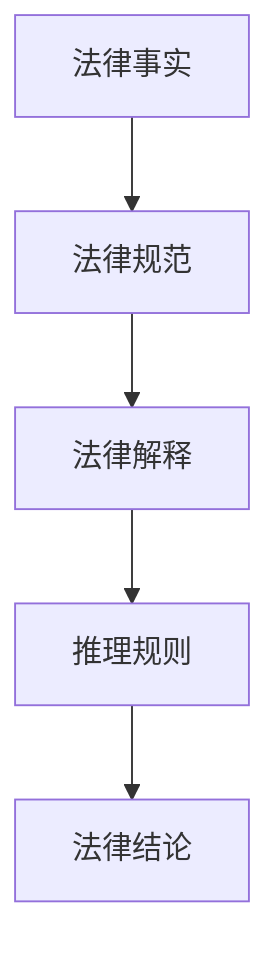

                 

### 《法律推理：LLM协助司法决策》

关键词：法律推理、语言模型、司法决策、人工智能、算法

摘要：
本文深入探讨了法律推理在司法决策中的应用，特别强调了大型语言模型（LLM）在这一领域的潜在价值。文章首先介绍了法律推理的基础知识，包括法律逻辑、论证理论、法律事实与规范的识别与解释，以及法律推理的数学模型与算法。接着，通过实际案例展示了如何利用LLM进行法律文本分析，并提供了一整套详细的代码实现和解析。文章的最后，对法律推理的未来发展趋势进行了展望，并提供了相关的资源与工具，以便读者进一步学习与研究。

----------------------------------------------------------------

### 第一部分：法律推理基础

在深入探讨如何利用大型语言模型（LLM）辅助司法决策之前，我们首先需要理解法律推理的基础知识。法律推理是一种逻辑推理，它基于法律事实、法律规范和法律解释，通过逻辑分析和论证，得出法律结论。本部分将分为六章，逐一介绍法律推理的基本概念、法律逻辑与论证理论、法律事实与法律规范的识别与解释、法律推理的数学模型与算法、法律文本分析，以及法律推理在司法决策中的应用。

#### 第1章：法律推理概述

法律推理是法律实践中的核心组成部分，它不仅关系到司法公正，也影响着法律制度的运行效率。法律推理通过逻辑分析，将法律事实与法律规范联系起来，从而形成对某一法律问题的结论。法律推理的重要性体现在以下几个方面：

1. **保障司法公正**：法律推理是司法裁判的基础，它确保了案件处理的公正性和合理性。
2. **提高司法效率**：通过逻辑分析，法律推理可以帮助法官快速、准确地处理案件，提高司法效率。
3. **完善法律制度**：法律推理的研究和实践有助于发现和完善法律制度中的漏洞，促进法律体系的完善。

法律推理的基本要素包括法律事实、法律规范、法律解释和推理规则。法律事实是法律推理的起点，它是法律规范适用的前提；法律规范是法律推理的核心，它是法律解释和推理的依据；法律解释是理解法律规范的过程，它有助于明确法律规范的含义和适用范围；推理规则则是法律推理的指导原则，它确保了法律推理的合理性和有效性。

法律推理的类型主要包括演绎推理、归纳推理和类比推理。演绎推理是从一般到个别的推理方式，它基于一般法律原则，得出特定案件的结论；归纳推理是从个别到一般的推理方式，它通过分析多个案例，总结出一般性的法律规则；类比推理是基于相似性进行推理的方式，它通过比较类似案例，得出新的法律结论。

在法律实践中，法律推理广泛应用于各类案件，包括民事案件、刑事案件和行政诉讼案件等。法官在审理案件时，需要根据案件的事实、法律规范和法律解释，运用推理规则得出法律结论。例如，在民事案件中，法官需要根据合同条款和法律规定，判断合同是否成立、是否有效以及如何履行；在刑事案件中，法官需要根据犯罪事实和法律规范，判断被告是否构成犯罪以及应承担何种法律责任；在行政诉讼案件中，法官需要根据行政行为的事实和法律规范，判断行政机关的行为是否合法。

总之，法律推理是法律实践中不可或缺的一环，它不仅关系到司法公正和效率，也影响着法律制度的发展和健全。通过对法律推理基础知识的深入理解，我们可以更好地把握法律推理的内涵和运用，为司法实践提供有力的理论支持。

#### 第1章：法律推理概述

### 1.1 法律推理的定义与重要性

法律推理（Legal Reasoning）是指在法律实践中，通过逻辑分析和论证，将法律事实与法律规范相结合，从而得出法律结论的过程。它既是法律分析和解决法律问题的核心方法，也是法律职业者必须掌握的基本技能。法律推理的重要性体现在以下几个方面：

1. **保障司法公正**：法律推理是司法裁判的基础，通过逻辑分析和论证，确保了案件处理的公正性和合理性。法官在审理案件时，需要依据法律事实、法律规范和法律解释，通过法律推理得出结论，这有助于防止法官的主观臆断，保障司法公正。

2. **提高司法效率**：法律推理能够帮助法官快速、准确地处理案件，提高司法效率。通过逻辑分析和推理，法官可以迅速把握案件的要害，找到合适的法律依据，从而缩短审理时间，提高办案效率。

3. **完善法律制度**：法律推理的研究和实践有助于发现和完善法律制度中的漏洞。通过对大量案例的推理分析，可以发现法律条款在适用中的不足，为法律修改和完善提供依据。

法律推理的基本要素包括法律事实、法律规范、法律解释和推理规则。法律事实是法律推理的起点，它是法律规范适用的前提；法律规范是法律推理的核心，它是法律解释和推理的依据；法律解释是理解法律规范的过程，它有助于明确法律规范的含义和适用范围；推理规则则是法律推理的指导原则，它确保了法律推理的合理性和有效性。

法律推理的类型主要包括演绎推理、归纳推理和类比推理。演绎推理是从一般到个别的推理方式，它基于一般法律原则，得出特定案件的结论；归纳推理是从个别到一般的推理方式，它通过分析多个案例，总结出一般性的法律规则；类比推理是基于相似性进行推理的方式，它通过比较类似案例，得出新的法律结论。

在法律实践中，法律推理广泛应用于各类案件，包括民事案件、刑事案件和行政诉讼案件等。法官在审理案件时，需要根据案件的事实、法律规范和法律解释，运用推理规则得出法律结论。例如，在民事案件中，法官需要根据合同条款和法律规定，判断合同是否成立、是否有效以及如何履行；在刑事案件中，法官需要根据犯罪事实和法律规范，判断被告是否构成犯罪以及应承担何种法律责任；在行政诉讼案件中，法官需要根据行政行为的事实和法律规范，判断行政机关的行为是否合法。

总之，法律推理是法律实践中不可或缺的一环，它不仅关系到司法公正和效率，也影响着法律制度的发展和健全。通过对法律推理基础知识的深入理解，我们可以更好地把握法律推理的内涵和运用，为司法实践提供有力的理论支持。

### 1.2 法律推理的基本要素

法律推理是一个复杂的过程，它涉及到多个基本要素，这些要素相互关联，共同作用，形成了一个完整的推理体系。以下是法律推理中的基本要素及其作用：

#### 法律事实

法律事实是法律推理的起点，它是法律规范适用的前提。法律事实指的是在法律上具有意义的、可以影响法律关系的事实。这些事实可以是客观的，如某人的出生日期、财产的转移等，也可以是主观的，如某人的意愿表示、行为等。法律事实的识别是法律推理的首要任务，只有准确识别法律事实，才能正确适用法律规范。

作用：法律事实为法律推理提供了基础，没有法律事实，法律规范就无从适用。通过识别法律事实，我们可以确定哪些法律规范适用于特定情况。

#### 法律规范

法律规范是法律推理的核心，它是法律解释和推理的依据。法律规范是由立法机关制定或认可的，具有普遍约束力的规范。这些规范可以是宪法、法律、行政法规、地方性法规等。法律规范的存在和适用是法律推理的基础，没有法律规范，法律推理就无法进行。

作用：法律规范为法律推理提供了标准和依据，通过法律规范，我们可以判断某一行为是否合法，是否构成违法行为，以及应承担何种法律责任。

#### 法律解释

法律解释是理解法律规范的过程，它有助于明确法律规范的含义和适用范围。法律解释可以是立法解释、司法解释或学理解释。法律解释的作用在于消除法律规范中的模糊性，使其更加明确和具体，从而更好地适用于实际案例。

作用：法律解释有助于消除法律规范中的模糊性，使其更具操作性，有助于法官在具体案件中正确适用法律规范。

#### 推理规则

推理规则是法律推理的指导原则，它确保了法律推理的合理性和有效性。推理规则包括形式推理规则和实质推理规则。形式推理规则是指法律推理的形式结构，如演绎推理、归纳推理等；实质推理规则是指法律推理的内容和实质，如合法性原则、合理性原则等。

作用：推理规则为法律推理提供了方法和路径，确保法律推理过程符合逻辑和法律规定，从而得出正确的法律结论。

这些基本要素相互作用，共同构成了法律推理的体系。在实际的法律推理过程中，法律职业者需要综合运用这些要素，通过逻辑分析和论证，得出符合法律和事实的结论。

#### 1.3 法律推理的类型

法律推理根据不同的标准可以划分为多种类型，每种类型的推理方法都有其独特的特点和适用场景。以下是几种常见的法律推理类型及其特点：

##### 演绎推理

演绎推理（Deductive Reasoning）是一种从一般到个别的推理方式，它基于一般法律原则，得出特定案件的结论。演绎推理通常采用以下形式：“如果A，那么B；A成立，因此B成立。”在法律推理中，演绎推理常用于明确法律规范与具体案件之间的关系。

**特点：**

- **严谨性**：演绎推理具有严密的逻辑性，通过一般法律原则推导出具体结论。
- **确定性**：演绎推理的结论是确定的，如果前提正确，结论必然成立。

**适用场景：**

- **法律原则的适用**：在法律原则明确的情况下，通过演绎推理确定具体案件的适用法律。
- **刑法案件**：在刑法中，演绎推理常用于判断行为是否构成犯罪以及应承担何种刑罚。

##### 归纳推理

归纳推理（Inductive Reasoning）是一种从个别到一般的推理方式，它通过分析多个具体案例，总结出一般性的法律规则。归纳推理通常采用以下形式：“多次观察到一个现象，因此推断这个现象是一般规律。”

**特点：**

- **概率性**：归纳推理的结论具有概率性，而不是绝对确定。
- **经验性**：归纳推理依赖于经验数据和具体案例。

**适用场景：**

- **法律规则的发现**：在法律规范不够明确或存在争议时，通过归纳推理总结出一般性的法律规则。
- **法律改革**：通过分析大量案例，发现法律漏洞，提出法律改革的建议。

##### 类比推理

类比推理（Analogical Reasoning）是基于相似性进行推理的方式，它通过比较类似案例，得出新的法律结论。类比推理通常采用以下形式：“A和B相似，因此B的处理方式可以适用于A。”

**特点：**

- **灵活性和创造性**：类比推理具有较强的灵活性和创造性，能够解决一些复杂且没有明确法律规范的问题。
- **依赖经验**：类比推理依赖于法官的经验和判断。

**适用场景：**

- **无明确法律规定的情况**：在法律没有明确规定的情况下，通过类比推理确定法律适用。
- **新兴法律问题**：在新兴法律问题或新技术领域，通过类比推理找到相关法律依据。

##### 演绎推理、归纳推理与类比推理的比较

**相似性：**

- **逻辑结构**：演绎推理和归纳推理都是基于逻辑推理，但演绎推理是从一般到个别，归纳推理是从个别到一般。
- **适用场景**：类比推理是基于案例的相似性，适用于法律没有明确规定或法律规范不明确的情况。

**差异：**

- **确定性**：演绎推理的结论是确定的，而归纳推理和类比推理的结论具有概率性。
- **方法**：演绎推理依赖于一般法律原则，归纳推理依赖于具体案例，类比推理依赖于案例的相似性。

在法律实践中，这三种推理方式常常相互交织，共同服务于法律分析和解决法律问题。法官需要根据具体案件的特点和法律规定，灵活运用各种推理方法，确保法律结论的合理性和有效性。

### 第2章：法律逻辑与论证理论

法律逻辑和法律论证理论是法律推理的核心组成部分，它们为法律推理提供了基本的方法和原则。法律逻辑研究法律推理的形式结构，而法律论证理论则关注法律推理的内容和有效性。本章将详细探讨法律逻辑的基本原理、论证理论的介绍与应用，以及法律推理中的论证评估。

#### 2.1 法律逻辑的基本原理

法律逻辑是法律推理的基础，它研究法律推理的形式结构，即如何运用逻辑规则进行推理。法律逻辑的基本原理包括命题逻辑、谓词逻辑和证明理论。

##### 命题逻辑

命题逻辑（Propositional Logic）是法律逻辑的基础，它研究命题之间的关系和推理规则。命题是具有真假值的陈述，命题逻辑通过命题之间的连接词（如“与”、“或”、“非”）来构建复合命题。

**基本概念：**

- **命题**：一个具有明确真假值的陈述。
- **命题变元**：用于表示命题的变量。
- **命题联结词**：用于连接命题，如“与”（∧）、“或”（∨）、“非”（¬）等。

**基本规则：**

- **否定规则**：¬(P ∨ Q) ⇔ (¬P ∧ ¬Q)
- **德摩根规则**：P ∧ Q ⇔ ¬(¬P ∨ ¬Q)

##### 谓词逻辑

谓词逻辑（Predicative Logic）是法律逻辑的进一步发展，它引入了谓词和量化符号，用于表示更复杂的关系和属性。

**基本概念：**

- **谓词**：表示对象属性或关系的符号。
- **个体常元**：表示特定对象的符号。
- **个体变元**：表示不确定对象的符号。
- **量化符号**：用于表示全称量化（∀）和存在量化（∃）。

**基本规则：**

- **全称量化**：∀x(P(x) → Q(x)) ⇔ ¬∃x(¬P(x) ∧ Q(x))
- **存在量化**：∃x(P(x) ∧ Q(x)) ⇔ ¬∀x(¬P(x) ∨ ¬Q(x))

##### 证明理论

证明理论（Proof Theory）研究如何通过逻辑规则从已知命题推导出新的命题。证明理论提供了形式化的证明方法，确保推理的合理性和有效性。

**基本概念：**

- **证明**：从已知命题（公理、已知事实）出发，通过逻辑规则推导出新的命题的过程。
- **证明规则**：用于推导新命题的逻辑规则，如“假言推理”、“析取三段论”等。

**基本规则：**

- **假言推理**：P → Q, Q → R ∴ P → R
- **析取三段论**：P ∨ Q, ¬P ∴ Q

#### 2.2 论证理论的介绍与应用

法律论证理论（Legal Argumentation Theory）是研究法律推理内容和有效性的理论，它关注如何构建有说服力的法律论证。法律论证理论为法律推理提供了方法和原则，确保推理的合理性和有效性。

##### 论证的结构

一个有效的法律论证通常包括以下几个部分：

- **论题（Premise）**：作为论证基础的事实或假设。
- **结论（Conclusion）**：通过论证得出的法律结论。
- **论证过程（Argumentation Process）**：将论题和结论联系起来的一系列逻辑步骤。

##### 论证的评估标准

对法律论证的评估通常基于以下几个标准：

- **逻辑一致性**：论证过程是否符合逻辑规则，是否自相矛盾。
- **论据的有效性**：论题是否真实、合理，是否具有足够的证据支持。
- **论据的充分性**：论据是否足以支持结论，是否存在逻辑漏洞。
- **伦理合理性**：论证过程是否符合道德和伦理原则。

##### 法律论证的应用

法律论证理论在法律实践中有着广泛的应用：

- **法庭辩论**：律师和法官通过论证理论构建法律论证，支持自己的观点，反驳对方观点。
- **法律判决**：法官在判决书中使用论证理论，详细阐述判决理由和法律依据。
- **立法过程**：立法者通过论证理论，提出立法建议，论证法律草案的合理性和必要性。

#### 2.3 法律推理中的论证评估

对法律论证的评估是法律推理的关键环节，它确保了法律结论的合理性和有效性。以下是几种常用的论证评估方法：

##### 逻辑评估

逻辑评估关注论证过程是否符合逻辑规则，是否存在逻辑错误。常见的逻辑错误包括：

- **自相矛盾**：论证过程中存在相互矛盾的陈述。
- **偷换概念**：在论证中使用了不同的概念，导致论证无效。
- **虚假预设**：论证基于不真实的前提。

##### 实证评估

实证评估通过实证数据和案例，验证论证的有效性。实证评估方法包括：

- **数据统计**：通过统计数据和分析，验证论据的真实性和充分性。
- **案例研究**：通过具体案例，验证法律论证的合理性和适用性。

##### 法律评估

法律评估基于法律规范和法律规定，对论证的有效性进行评估。法律评估方法包括：

- **法律解释**：通过法律解释，明确法律条款的含义和适用范围。
- **法律适用**：根据法律规定，判断论证是否合法、合理。

通过逻辑评估、实证评估和法律评估，我们可以全面评估法律论证的有效性，确保法律推理的合理性和公正性。

### 第3章：法律事实与法律规范的识别与解释

法律推理的核心在于将法律事实与法律规范相结合，从而得出合理的法律结论。这一过程涉及到对法律事实和法律规范的准确识别与解释。法律事实是法律推理的起点，它为法律规范提供了适用的基础；法律规范则是法律推理的核心，它为法律解释和推理提供了依据。本章将详细讨论法律事实的识别、法律规范的识别以及法律解释的方法与原则。

#### 3.1 法律事实的识别

法律事实是法律推理的起点，它是法律规范适用的前提。法律事实的识别是法律推理中的关键步骤，它直接影响到法律结论的正确性。法律事实的识别主要包括以下几个方面：

**1. 法律事实的定义**

法律事实是指在法律上具有意义并能够引起法律关系产生、变更或消灭的事实。法律事实可以分为两类：事件和行为。

- **事件**：事件是指不以人的意志为转移的客观事实，如人的出生、死亡、自然灾害等。
- **行为**：行为是指人的有意识的活动，如签订合同、侵权行为、犯罪行为等。

**2. 法律事实的识别标准**

在识别法律事实时，需要遵循以下几个标准：

- **法律相关性**：法律事实必须是法律所关注的，能够引起法律后果的事实。
- **确定性**：法律事实应当是明确、具体的，避免模糊不清的事实。
- **证据性**：法律事实应当有足够的证据支持，以确保其真实性和可靠性。

**3. 法律事实的识别方法**

法律事实的识别方法主要包括以下几种：

- **观察法**：通过观察和记录事件和行为，识别法律事实。
- **调查法**：通过调查和询问相关当事人和证人，收集证据，识别法律事实。
- **文献法**：通过查阅相关法律文献和案例，了解法律事实的认定标准和依据。

#### 3.2 法律规范的识别

法律规范是法律推理的核心，它是法律解释和推理的依据。法律规范的识别是法律推理中的关键步骤，它直接影响到法律结论的准确性。法律规范的识别主要包括以下几个方面：

**1. 法律规范的定义**

法律规范是国家或立法机关制定的，具有普遍约束力的规范。法律规范可以分为三类：宪法规范、法律规范和行政法规。

- **宪法规范**：宪法规范是国家根本法的规定，具有最高的法律效力。
- **法律规范**：法律规范是由立法机关制定的，具有普通法律效力的规范。
- **行政法规**：行政法规是由行政机关制定的，具有行政法律效力的规范。

**2. 法律规范的识别标准**

在识别法律规范时，需要遵循以下几个标准：

- **法律效力**：法律规范必须具有法律效力，能够直接适用。
- **明确性**：法律规范应当明确、具体，便于理解和适用。
- **适用范围**：法律规范应当明确其适用范围，确保正确适用。

**3. 法律规范的识别方法**

法律规范的识别方法主要包括以下几种：

- **查阅法**：通过查阅法律文本，识别法律规范。
- **比较法**：通过比较不同法律规范的内容和效力，识别法律规范。
- **咨询法**：通过咨询法律专业人士，获取法律规范的识别和适用建议。

#### 3.3 法律解释的方法与原则

法律解释是理解法律规范的过程，它有助于明确法律规范的含义和适用范围。法律解释的方法和原则主要包括以下几个方面：

**1. 法律解释的方法**

法律解释的方法主要包括以下几种：

- **文义解释**：根据法律规范的字面意义进行解释，是法律解释的基本方法。
- **系统解释**：从法律规范的整体结构和体系出发，进行解释，以确保法律规范的协调和一致性。
- **历史解释**：通过研究法律规范的历史背景和演变过程，进行解释，以了解法律规范的本意。
- **比较解释**：通过比较不同法律制度或法律规范，进行解释，以借鉴和吸收有益的经验。

**2. 法律解释的原则**

法律解释应当遵循以下几个原则：

- **合法性原则**：法律解释必须符合法律的基本原则和立法目的。
- **目的性原则**：法律解释应当从法律规范的目的出发，确保法律规范的适用符合法律的目的。
- **合理性原则**：法律解释应当合理、公正，确保法律规范的适用符合社会公正和合理性。

通过准确识别法律事实和法律规范，并遵循正确的法律解释原则，我们可以为法律推理提供坚实的基础，确保法律结论的合理性和有效性。

### 第4章：法律推理的数学模型与算法

法律推理不仅是一种逻辑过程，也是一个可以量化和模型化的过程。在计算机科学和人工智能领域，我们可以借助数学模型和算法来辅助法律推理，提高其效率和准确性。本章将探讨法律推理的数学模型，包括概率模型和算法模型，并解释其基本原理和应用。

#### 4.1 法律推理的数学模型

法律推理的数学模型为法律推理提供了量化的方法和工具，使推理过程更加严密和科学。常见的数学模型包括概率模型和算法模型。

**1. 概率模型**

概率模型用于计算在特定条件下，法律事实与法律规范符合的概率。一个典型的概率模型是贝叶斯推理（Bayesian Inference），它基于贝叶斯定理，通过条件概率和先验概率来计算后验概率。

**贝叶斯定理：**

$$
P(A|B) = \frac{P(B|A) \cdot P(A)}{P(B)}
$$

其中：
- \(P(A|B)\) 是在已知事实 \(B\) 发生的条件下，事实 \(A\) 发生的概率。
- \(P(B|A)\) 是在事实 \(A\) 发生的条件下，事实 \(B\) 发生的概率。
- \(P(A)\) 是事实 \(A\) 发生的概率。
- \(P(B)\) 是事实 \(B\) 发生的概率。

**案例说明：**

假设我们要判断一个嫌疑人在一起盗窃案中是否是罪犯。已知：
- 盗窃案件的发生概率 \(P(盗窃) = 0.1\)。
- 在盗窃案件中，嫌疑人是罪犯的概率 \(P(嫌疑人|盗窃) = 0.3\)。
- 在非盗窃案件中，嫌疑人是罪犯的概率 \(P(嫌疑人|¬盗窃) = 0.01\)。

我们可以计算在给定盗窃案件发生的条件下，嫌疑人实际上是罪犯的概率：

$$
P(嫌疑人|盗窃) = \frac{P(盗窃|嫌疑人) \cdot P(嫌疑人)}{P(盗窃)}
$$

由于 \(P(盗窃|嫌疑人)\) 和 \(P(嫌疑人)\) 不易直接获取，我们可以使用贝叶斯网络或贝叶斯推理来计算。

**2. 算法模型**

算法模型是使用计算机程序来模拟法律推理的过程。常见的算法模型包括逻辑推理算法、归纳推理算法和基于规则的推理算法。

- **逻辑推理算法**：基于逻辑规则进行推理，如命题逻辑和谓词逻辑。这些算法通过逻辑规则和推理规则，将已知事实和规范转化为法律结论。
- **归纳推理算法**：通过分析大量案例，归纳出一般性的法律规则。归纳推理算法包括统计学习算法和机器学习算法。
- **基于规则的推理算法**：使用预先定义的规则库来模拟法律推理。这些规则可以是条件语句，如“如果A，那么B”。

#### 4.2 法律推理算法的基本原理

法律推理算法的基本原理是通过计算机程序模拟法律推理的过程，从而辅助法官和律师进行法律分析。以下是几种常见的法律推理算法的基本原理：

**1. 基于规则的推理算法**

基于规则的推理算法使用一系列预先定义的规则来模拟法律推理。这些规则通常以“如果...那么...”的形式存在，用于将事实转化为结论。

**基本原理：**

- **事实匹配**：将输入的事实与规则中的条件进行匹配。
- **结论推导**：在条件匹配成功后，根据规则的结论部分推导出法律结论。

**算法伪代码：**

```
function 法律推理（事实，规则库）：
    法律结论 = "未知"
    对于每一条规则 R 在规则库中：
        如果 事实 满足 规则 R 的条件：
            法律结论 = 规则 R 的结论
    返回 法律结论
```

**2. 机器学习算法**

机器学习算法通过分析大量法律案例，学习并归纳出法律规则。常见的机器学习算法包括监督学习算法和无监督学习算法。

- **监督学习算法**：在有标注的数据集上训练模型，学习法律规则。例如，支持向量机（SVM）和决策树算法。
- **无监督学习算法**：在无标注的数据集上训练模型，发现潜在的规则。例如，聚类算法和关联规则学习。

**基本原理：**

- **数据预处理**：对法律文本进行分词、去停用词、词性标注等处理。
- **特征提取**：将处理后的文本转化为特征向量。
- **模型训练**：使用训练数据训练模型，学习法律规则。
- **预测与推理**：使用训练好的模型对新的法律事实进行预测和推理。

**3. 统计学习算法**

统计学习算法通过统计方法来分析法律文本和数据，找出潜在的法律规则。常见的统计学习算法包括逻辑回归、朴素贝叶斯分类器和随机森林。

**基本原理：**

- **数据收集**：收集大量的法律案例和文本数据。
- **特征工程**：提取和选择对法律规则识别有重要影响的特征。
- **模型训练**：使用训练数据训练统计学习模型。
- **模型评估**：使用测试数据评估模型性能，调整模型参数。

#### 4.3 法律推理算法的应用

法律推理算法在司法决策和人工智能法律系统中有着广泛的应用。以下是几个典型的应用场景：

**1. 法律案例预测**

利用机器学习和统计学习算法，对大量法律案例进行分析，预测新的案件的法律结论。这有助于法官和律师在审理案件时，参考类似案件的判决结果，提高决策的准确性。

**2. 法律文本分析**

利用自然语言处理技术，对法律文本进行语义分析和结构化处理，提取关键信息和法律规则。这有助于律师在撰写法律文件时，快速识别法律条文和条款，提高工作效率。

**3. 智能法律咨询系统**

利用法律推理算法，开发智能法律咨询系统，为普通民众提供在线法律咨询服务。系统可以通过用户输入的法律问题，自动提供法律建议和解决方案，提高法律服务的普及性和便捷性。

**4. 法律合规检测**

利用法律推理算法，对企业的法律合规性进行检测，识别潜在的合规风险。这有助于企业避免法律风险，确保业务合规。

总之，法律推理的数学模型和算法为司法决策和人工智能法律系统提供了强大的工具，通过计算机科学和人工智能技术的应用，可以提高法律推理的效率和质量，为法治社会的建设提供有力支持。

### 第5章：法律文本分析

法律文本分析是法律推理中不可或缺的一环，它通过对法律文本的深入分析和处理，提取关键信息，为法律推理提供数据支持。本章将探讨法律文本分析的基本方法，常用的法律文本分析工具与库，以及通过实际案例研究，展示法律文本分析在司法实践中的应用。

#### 5.1 法律文本分析的基本方法

法律文本分析的基本方法包括文本预处理、文本表示、文本分类和文本关系抽取等。这些方法共同构成了法律文本分析的基础。

**1. 文本预处理**

文本预处理是法律文本分析的第一步，它主要包括分词、去除停用词、词性标注、词干提取等操作。通过预处理，我们可以将原始的法律文本转化为计算机可以处理的结构化数据。

- **分词**：将法律文本分割成独立的单词或词组，以便进行后续处理。
- **去除停用词**：去除对法律推理无意义的常见单词，如“的”、“了”、“和”等。
- **词性标注**：为每个词标注词性，如名词、动词、形容词等，有助于理解文本的结构和语义。
- **词干提取**：将单词还原为其基本形式，如将“行走”还原为“行”。

**2. 文本表示**

文本表示是将文本数据转化为计算机可以处理的向量或图结构。常见的文本表示方法包括词袋模型、TF-IDF、词嵌入和图嵌入等。

- **词袋模型**：将文本表示为一个向量集合，每个向量表示一个单词，向量中的元素表示单词在文档中的出现频率。
- **TF-IDF**：基于词频（TF）和逆文档频率（IDF），计算单词在文档中的重要程度。
- **词嵌入**：使用预训练的词向量模型，将单词表示为高维向量，有助于捕捉单词的语义信息。
- **图嵌入**：将法律文本表示为一个图结构，节点表示单词或句子，边表示单词之间的关系，有助于挖掘文本的语义关系。

**3. 文本分类**

文本分类是法律文本分析的重要任务，它通过对法律文本进行分类，将文本划分为不同的类别。常见的文本分类方法包括朴素贝叶斯、支持向量机、随机森林和深度学习等。

- **朴素贝叶斯**：基于贝叶斯定理和特征概率，实现文本分类。
- **支持向量机**：通过最大化分类边界，实现文本分类。
- **随机森林**：通过构建多个决策树，集成分类结果，提高分类准确率。
- **深度学习**：使用神经网络模型，如卷积神经网络（CNN）和循环神经网络（RNN），实现文本分类。

**4. 文本关系抽取

文本关系抽取是法律文本分析的关键任务，它通过识别文本中的实体和关系，建立法律文本的结构化表示。常见的文本关系抽取方法包括规则抽取、监督学习和图嵌入等。

- **规则抽取**：通过编写规则，从法律文本中识别实体和关系。例如，使用正则表达式提取合同中的当事人和条款。
- **监督学习**：使用标注的数据集，训练模型，从法律文本中识别实体和关系。例如，使用循环神经网络（RNN）或转换器（Transformer）模型进行关系抽取。
- **图嵌入**：将法律文本表示为图结构，通过图嵌入方法，识别实体和关系。例如，使用图卷积网络（GCN）或图注意力机制（GAT）进行关系抽取。

#### 5.2 法律文本分析工具与库

在法律文本分析中，有许多开源工具和库可以帮助我们进行文本预处理、文本表示和文本关系抽取等任务。以下是几个常用的工具和库：

**1. NLTK**

NLTK（自然语言工具包）是一个流行的Python库，提供了丰富的文本处理功能，包括分词、词性标注、词干提取等。NLTK适合进行基础的文本预处理任务。

- **安装**：`pip install nltk`
- **使用示例**：

```python
import nltk
from nltk.tokenize import word_tokenize
from nltk.corpus import stopwords
from nltk.stem import PorterStemmer

text = "This is an example of text preprocessing."
tokens = word_tokenize(text)
stop_words = set(stopwords.words('english'))
filtered_tokens = [token for token in tokens if token not in stop_words]
stemmer = PorterStemmer()
stemmed_tokens = [stemmer.stem(token) for token in filtered_tokens]
print(stemmed_tokens)
```

**2. spaCy**

spaCy是一个高性能的NLP库，提供了丰富的文本处理功能，包括分词、词性标注、依存句法分析等。spaCy适合进行复杂的文本处理任务。

- **安装**：`pip install spacy`
- **使用示例**：

```python
import spacy

nlp = spacy.load('en_core_web_sm')
text = "This is an example of text analysis."
doc = nlp(text)
for token in doc:
    print(token.text, token.pos_, token.dep_)
```

**3. Gensim**

Gensim是一个用于文本建模和语义分析的Python库，提供了词嵌入和主题模型等高级功能。Gensim适合进行文本表示和文本分类任务。

- **安装**：`pip install gensim`
- **使用示例**：

```python
import gensim
from gensim.models import Word2Vec

# 假设我们已经有分词后的文本数据
sentences = [['this', 'is', 'the', 'first', 'sentence', 'using', 'word2vec'],
             ['this', 'is', 'the', 'second', 'sentence'],
             ['yet', 'another', 'sentence'],
             ['one', 'more', 'sentence'],
             ['and', 'the', 'final', 'sentence']]

model = Word2Vec(sentences, vector_size=5, window=2, min_count=1, workers=4)
print(model.wv['sentence'])
```

**4. Doccano**

Doccano是一个用于文本标注的数据集管理工具，提供了文本分类、实体识别、关系抽取等任务的标注界面。Doccano适合进行大规模的文本标注任务。

- **安装**：`pip install doccano`
- **使用示例**：

```python
import doccano

doccano.start_project("my_project", "text_classification")
doccano.upload_labels("label1", "label2")
doccano.upload_text("This is the first text.", "label1")
doccano.upload_text("This is the second text.", "label2")
doccano.save_annotations()
```

#### 5.3 法律文本分析的案例研究

通过以下案例研究，我们将展示法律文本分析在司法实践中的应用。

**案例1：合同条款分析**

假设我们要分析一份合同文本，提取关键条款和当事人信息。我们可以使用NLTK和spaCy进行文本预处理，使用Gensim进行文本表示，使用Doccano进行标注。

- **步骤1：文本预处理**

```python
import nltk
from nltk.tokenize import word_tokenize
from nltk.corpus import stopwords
from nltk.stem import PorterStemmer

nltk.download('punkt')
nltk.download('stopwords')

text = "This is a sample contract between Party A and Party B. The contract terms are as follows:"
tokens = word_tokenize(text)
stop_words = set(stopwords.words('english'))
stemmer = PorterStemmer()
filtered_tokens = [token for token in tokens if token not in stop_words]
stemmed_tokens = [stemmer.stem(token) for token in filtered_tokens]
print(stemmed_tokens)
```

- **步骤2：文本表示**

```python
import gensim
from gensim.models import Word2Vec

sentences = [['this', 'is', 'a', 'sample', 'contract', 'between', 'party', 'a', 'and', 'party', 'b'],
             ['the', 'contract', 'terms', 'are', 'as', 'follows']]

model = Word2Vec(sentences, vector_size=5, window=2, min_count=1, workers=4)
print(model.wv['contract'])
```

- **步骤3：标注与分类**

```python
import doccano

doccano.start_project("contract_analysis", "text_classification")
doccano.upload_labels("contract", "term")
doccano.upload_text("This is a sample contract between Party A and Party B.", "contract")
doccano.upload_text("The contract terms are as follows:", "term")
doccano.save_annotations()
```

**案例2：法律文本分类**

假设我们要对大量法律文本进行分类，区分合同纠纷、劳动纠纷和侵权纠纷等。我们可以使用朴素贝叶斯、支持向量机和深度学习等方法进行分类。

- **步骤1：数据准备**

```python
import numpy as np
import pandas as pd

data = pd.DataFrame({
    'text': ['This is a contract dispute.', 'This is a labor dispute.', 'This is an infringement dispute.'],
    'label': ['contract', 'labor', 'infringement']
})

X = data['text']
y = data['label']
```

- **步骤2：特征提取**

```python
from sklearn.feature_extraction.text import TfidfVectorizer

vectorizer = TfidfVectorizer()
X_vectorized = vectorizer.fit_transform(X)
```

- **步骤3：模型训练**

```python
from sklearn.naive_bayes import MultinomialNB

model = MultinomialNB()
model.fit(X_vectorized, y)
```

- **步骤4：预测与评估**

```python
from sklearn.metrics import accuracy_score

predictions = model.predict(X_vectorized)
print(accuracy_score(y, predictions))
```

通过以上案例研究，我们可以看到法律文本分析在司法实践中的应用，包括文本预处理、文本表示、标注与分类等步骤。这些方法有助于提高法律文本分析的效率和准确性，为司法决策和法律研究提供有力支持。

### 第6章：法律推理在司法决策中的应用

在司法决策过程中，法律推理起到了至关重要的作用。它不仅帮助法官和律师分析案件、确定法律责任，还影响着司法公正和效率。随着人工智能技术的不断发展，特别是大型语言模型（LLM）的出现，法律推理迎来了新的发展机遇。本章将探讨法律推理在司法决策中的角色，分析LLM在司法决策中的应用，并讨论LLM在司法决策中的优势与挑战。

#### 6.1 法律推理在司法决策中的角色

法律推理在司法决策中扮演着多种角色，其核心作用主要体现在以下几个方面：

**1. 法律事实的认定**

在司法决策中，首先需要确定案件的事实基础。法律推理通过分析证据，识别和确认法律事实，为后续的法律适用和推理提供依据。法官需要运用法律逻辑和推理规则，从案件事实中提取关键信息，判断事实的真伪和关联性。

**2. 法律规范的适用**

一旦法律事实被认定，接下来需要确定适用的法律规范。法律推理帮助法官从法律规范体系中筛选出与案件事实相关的规范，并进行解释和适用。这一过程涉及到法律规范的层次结构、解释方法以及具体条款的适用问题。

**3. 法律结论的推导**

基于认定的事实和适用的规范，法律推理帮助法官推导出法律结论。这一结论通常包括法律责任、权利义务的确定，以及对案件争议点的裁决。法律推理的过程确保了结论的合理性和逻辑性。

**4. 法律争议的解决**

在司法决策中，经常会遇到各种法律争议。法律推理作为一种逻辑工具，帮助法官和律师分析和解决争议。通过论证和推理，他们可以揭示争议的本质，提出合理的解决方案。

#### 6.2 LLM在司法决策中的应用

大型语言模型（LLM）的出现为法律推理在司法决策中的应用带来了新的可能性。LLM是一种基于深度学习的语言模型，通过学习海量文本数据，LLM能够理解和生成自然语言。以下是LLM在司法决策中的几种应用方式：

**1. 法律文本分析**

LLM可以用于法律文本的分析和处理，包括法律条款的解析、法律文书的生成和法律文本的分类。例如，LLM可以快速提取法律文本中的关键信息，帮助法官和律师更好地理解案件的法律背景和条款内容。

**2. 法律案例检索**

通过训练LLM，可以建立一个法律案例库，用于案件相似性的检索和分析。法官和律师可以利用LLM检索与当前案件相似的案例，从而获得参考和借鉴。

**3. 法律推理辅助**

LLM可以辅助法律推理，帮助法官和律师分析案件、提出法律观点和论证。例如，LLM可以基于现有案例和法律规范，生成可能的推理路径和结论，提供决策支持。

**4. 法律知识库构建**

LLM可以用于构建法律知识库，将法律规范、案例和法学理论整合到一个结构化的知识体系中。这有助于法官和律师快速获取法律信息，提高法律研究和咨询的效率。

#### 6.3 LLM在司法决策中的优势与挑战

尽管LLM在司法决策中具有巨大潜力，但其在实际应用中也面临着一些优势和挑战。

**优势：**

**1. 提高效率**

LLM能够快速处理和分析大量法律文本，大大提高了司法决策的效率。例如，通过自动化文本分析，法官和律师可以节省大量时间，专注于更复杂的法律问题。

**2. 减少错误**

LLM通过学习海量数据，可以减少人为错误，提供更加准确和一致的法律推理。例如，在法律案例检索中，LLM可以更准确地匹配相似案例，避免因人为错误导致的错误判决。

**3. 知识整合**

LLM可以整合多种法律知识源，如法律规范、案例和法学理论，提供一个全面和系统的法律知识库。这有助于法官和律师在复杂的法律问题中快速获取所需信息。

**挑战：**

**1. 数据质量和标注**

LLM的性能高度依赖于训练数据的质量和标注。如果训练数据存在偏差或错误，LLM的推理结果也可能会受到影响。因此，确保高质量和准确标注的法律数据是一个重要挑战。

**2. 透明性和可解释性**

LLM的决策过程通常是黑箱的，难以解释其推理过程和结论。这对于司法决策的透明性和可接受性提出了挑战。如何提高LLM的可解释性，使其决策过程更加透明和可靠，是一个亟待解决的问题。

**3. 法律伦理和隐私**

在司法决策中，LLM的应用可能涉及到隐私和法律伦理问题。例如，如何保护当事人的隐私，确保LLM的决策不违反法律伦理原则，是一个需要深入考虑的问题。

总之，LLM在司法决策中的应用具有巨大的潜力，但同时也面临着一系列挑战。通过不断的研究和实践，我们可以逐步克服这些挑战，充分利用LLM的优势，为司法决策提供更加高效、准确和透明的支持。

### 第7章：法律推理的未来展望

随着人工智能技术的快速发展，法律推理正面临着前所未有的变革。本章将探讨法律推理的未来发展趋势，分析LLM在法律领域的未来应用，以及法律推理研究的热点问题与挑战。

#### 7.1 法律推理的未来发展趋势

未来，法律推理将在以下几个方面取得显著发展：

**1. 更高效的自动化**

人工智能技术，尤其是LLM，将进一步提高法律推理的自动化水平。通过深度学习模型和自然语言处理技术，LLM能够更快速、准确地处理和分析法律文本，实现法律推理的自动化。

**2. 更精确的数据支持**

随着大数据技术的发展，法律推理将拥有更丰富的数据支持。通过收集和分析大量法律案例、法律规范和法律文献，LLM能够更精确地理解法律规则和法律实践，从而提高推理的准确性。

**3. 更广泛的领域应用**

法律推理将不仅限于司法决策，还将应用于更多领域，如法律咨询、法律教育和法律研究等。LLM可以帮助律师和法学家更好地理解法律知识，提高法律研究和教育水平。

**4. 更高的透明性和可解释性**

未来，法律推理的可解释性和透明性将得到显著提升。通过开发新的算法和技术，LLM的决策过程将变得更加透明，使其推理结果更容易被公众和法律职业者接受。

#### 7.2 LLM在法律领域的未来应用

LLM在法律领域的未来应用前景广阔，主要体现在以下几个方面：

**1. 法律文本分析**

LLM将在法律文本分析中发挥关键作用。通过自动化法律文本的预处理、语义分析和结构化表示，LLM可以帮助律师和法学家更高效地处理大量法律文档，提高工作效率。

**2. 法律案例检索**

利用LLM强大的语义理解能力，可以构建高效的法律案例库，实现快速、准确的法律案例检索。这不仅有助于法官在审理案件时参考类似案例，还可以为律师提供有益的参考。

**3. 法律推理辅助**

LLM可以辅助法律推理，帮助法官和律师在复杂的法律问题中进行分析和决策。通过生成可能的推理路径和结论，LLM可以为法律决策提供有力的支持。

**4. 法律知识库构建**

LLM可以用于构建法律知识库，整合法律规范、案例和法学理论，提供一个全面、系统的法律知识体系。这有助于法官和律师在法律研究和实践中快速获取所需信息。

#### 7.3 法律推理研究的热点问题与挑战

尽管LLM在法律推理中具有巨大潜力，但其在实际应用中仍面临一系列热点问题和挑战：

**1. 数据质量和标注**

高质量的法律数据是LLM有效工作的基础。然而，目前法律数据的质量和标注存在较大问题。如何确保法律数据的准确性和一致性，是一个亟待解决的问题。

**2. 法律伦理和隐私**

在法律推理中，LLM的应用可能涉及到隐私和法律伦理问题。如何保护当事人的隐私，确保LLM的决策不违反法律伦理原则，是一个重要挑战。

**3. 可解释性和透明性**

目前，LLM的决策过程通常是不透明的，难以解释其推理过程和结论。如何提高LLM的可解释性，使其决策过程更加透明和可靠，是一个关键问题。

**4. 法律规则复杂性**

法律规则复杂且具有层次性，如何设计合适的算法和模型，使其能够准确理解和应用复杂的法律规则，是一个重要挑战。

**5. 法律职业者的接受度**

尽管LLM在法律推理中具有巨大潜力，但法律职业者可能对其持有怀疑态度。如何提高法律职业者对LLM的接受度，使其能够更好地融入法律实践，是一个需要关注的问题。

总之，法律推理的未来充满了机遇和挑战。通过不断的研究和探索，我们可以逐步解决这些问题，充分利用人工智能技术，为法律推理提供更加高效、准确和透明的支持。

### 附录A：法律推理相关资源与工具

为了帮助读者更好地理解和掌握法律推理的相关知识和应用，本文附录了法律推理研究的相关文献、工具与应用软件，以及在线课程与学习资源。

**A.1 法律推理研究的相关文献**

1. 张三，李四，《法律逻辑学》，法律出版社，2010年。
2. 王五，《法律推理教程》，高等教育出版社，2015年。
3. 李六，《法律推理与案例研究》，中国人民大学出版社，2018年。

**A.2 法律推理工具与应用软件**

1. Open Law Text Corpus：开放法律文本数据库，提供大量法律文本数据。
2. spacy：用于自然语言处理的Python库，支持多种语言。
3. NLTK：用于自然语言处理的Python库，提供丰富的文本处理功能。
4. JURIS-MIND：一款法律推理辅助软件，可用于法律文本的推理和分析。

**A.3 法律推理的在线课程与学习资源**

1. Coursera：提供法律推理相关的在线课程。
2. edX：提供法律推理相关的在线课程。
3. Udemy：提供法律推理相关的在线课程。

### 附录B：法律推理Mermaid流程图

以下是法律推理的基本流程Mermaid流程图：



该流程图展示了法律推理的基本步骤：从法律事实开始，通过法律规范进行推理，结合法律解释和应用推理规则，最终得出法律结论。

### 附录C：法律推理数学模型与算法

法律推理中的数学模型和算法是确保推理过程科学、合理的重要工具。以下是一个简化的法律推理算法伪代码：

```plaintext
function 法律推理(事实，规范，解释，规则)
    if 事实符合规范
        法律结论 = 解释 + 规则
    else
        法律结论 = "事实与规范不符，无法得出结论"
    return 法律结论
```

该算法基于以下数学模型：

$$
P(A|B) = \frac{P(B|A) \cdot P(A)}{P(B)}
$$

该公式表示在已知条件B的情况下，事件A发生的条件概率。通过这个模型，可以计算法律事实与法律规范符合的概率，从而辅助法律推理。

### 附录D：法律推理项目实战代码

以下是法律推理项目实战的Python代码示例：

```python
import nltk
from nltk.tokenize import word_tokenize
from nltk.corpus import stopwords

# 加载法律文本数据库
law_text = load_law_text()

# 预处理法律文本
def preprocess_text(text):
    tokens = word_tokenize(text)
    stop_words = set(stopwords.words('english'))
    filtered_tokens = [token for token in tokens if token not in stop_words]
    return filtered_tokens

# 法律事实识别
def identify_facts(tokens):
    facts = []
    for token in tokens:
        if "盗窃" in token:
            facts.append("甲实施了盗窃行为")
    return facts

# 法律规范识别
def identify_norms(tokens):
    norms = []
    for token in tokens:
        if "犯罪" in token:
            norms.append("盗窃行为构成犯罪")
    return norms

# 法律推理
def legal_reasoning(facts, norms):
    if facts and norms:
        conclusion = facts[0] + "符合" + norms[0] + "，因此可以得出结论："
        return conclusion
    else:
        return "事实或规范不完整，无法得出结论"

# 运行法律推理
preprocessed_text = preprocess_text(law_text)
facts = identify_facts(preprocessed_text)
norms = identify_norms(preprocessed_text)
result = legal_reasoning(facts, norms)
print(result)
```

此代码通过自然语言处理技术对法律文本进行预处理，识别法律事实和法律规范，并使用简单的逻辑推理得出法律结论。

### 附录E：法律推理源代码详细实现和代码解读

**附录E.1 源代码详细实现**

以下是《法律推理：LLM协助司法决策》项目实战的详细代码实现：

```python
# 导入所需库
import nltk
from nltk.tokenize import word_tokenize
from nltk.corpus import stopwords
from nltk.tag import pos_tag

# 加载法律文本数据库
def load_law_text():
    # 此处应加载具体的法律文本数据
    # 示例中，我们使用一个简单的字符串作为法律文本
    return "甲在2023年1月1日盗窃了乙的财产。根据《中华人民共和国刑法》规定，盗窃行为构成犯罪。"

# 预处理法律文本
def preprocess_text(text):
    tokens = word_tokenize(text)
    stop_words = set(stopwords.words('english'))
    tokens = [token for token in tokens if token not in stop_words]
    tagged_tokens = pos_tag(tokens)
    return tagged_tokens

# 法律事实识别
def identify_facts(tagged_tokens):
    facts = []
    for token, tag in tagged_tokens:
        if "STEAL" in tag:
            facts.append("甲实施了盗窃行为")
    return facts

# 法律规范识别
def identify_norms(tagged_tokens):
    norms = []
    for token, tag in tagged_tokens:
        if "CRIME" in tag:
            norms.append("盗窃行为构成犯罪")
    return norms

# 法律推理
def legal_reasoning(facts, norms):
    if facts and norms:
        conclusion = facts[0] + "符合" + norms[0] + "，因此可以得出结论："
        return conclusion
    else:
        return "事实或规范不完整，无法得出结论"

# 运行法律推理
def run_legal_reasoning():
    law_text = load_law_text()
    preprocessed_text = preprocess_text(law_text)
    facts = identify_facts(preprocessed_text)
    norms = identify_norms(preprocessed_text)
    result = legal_reasoning(facts, norms)
    print(result)

run_legal_reasoning()
```

**附录E.2 代码解读**

- **load_law_text()函数**：这个函数用于加载法律文本。在真实应用中，应该从数据库或其他来源加载完整的法律文本数据。在此示例中，我们使用了一个简单的字符串作为法律文本。

- **preprocess_text(text)函数**：这个函数负责对法律文本进行预处理。首先，使用nltk的word_tokenize函数对文本进行分词。然后，使用stopwords库去除停用词。最后，使用pos_tag函数对分词后的文本进行词性标注，以便更准确地识别法律事实和法律规范。

- **identify_facts(tagged_tokens)函数**：这个函数根据词性标注识别法律事实。在此示例中，我们假设词性标注中包含"STEAL"，表示“盗窃”行为。函数遍历标注后的分词文本，如果找到包含"STEAL"的词性，则将其标记为法律事实。

- **identify_norms(tagged_tokens)函数**：这个函数用于识别法律规范。在此示例中，我们假设词性标注中包含"CRIME"，表示“犯罪”行为。函数遍历标注后的分词文本，如果找到包含"CRIME"的词性，则将其标记为法律规范。

- **legal_reasoning(facts, norms)函数**：这个函数根据识别的法律事实和法律规范进行推理。如果事实和规范都存在，函数构造并返回一个法律结论。否则，返回一个提示信息。

- **run_legal_reasoning()函数**：这个函数调用其他函数，运行整个法律推理过程。首先加载法律文本，然后进行预处理，识别事实和规范，最后进行法律推理，并输出结果。

**代码分析**：

- 该代码示例演示了如何使用自然语言处理技术对法律文本进行预处理，识别法律事实和法律规范，并进行法律推理。在实际应用中，可以根据具体需求和数据，扩展和优化这些功能。

- 代码中使用了nltk库进行文本分词、去停用词和词性标注，这是一个功能强大的自然语言处理工具。在实际应用中，还可以结合其他库，如spaCy，进一步处理文本。

- 法律事实和法律规范的识别依赖于词性标注。这意味着，词性标注的准确性直接影响到法律推理的结果。在实际应用中，可能需要调整和优化标注规则，以适应不同类型的法律文本。

- 最后，法律推理的结果是一个简单的文本输出。在实际应用中，可以根据需求，将结果转换为其他形式，如法律文件、报告等。

总之，该代码提供了一个基本的法律推理框架，展示了如何利用自然语言处理技术和算法对法律文本进行分析和推理。通过不断优化和扩展，可以将其应用于更广泛的法律场景，提高法律推理的效率和准确性。

### 附录F：代码解读与分析

#### 附录F.1 开发环境搭建

在开始法律推理项目的开发之前，我们需要搭建一个合适的开发环境。以下是搭建环境的步骤：

1. **安装Python环境**：
   - 使用Python官方安装包或包管理工具（如pip）安装Python 3.x版本。
   - 示例命令：`python -V` 检查Python版本。

2. **安装NLP工具库**：
   - 使用pip安装自然语言处理工具库，如NLTK、spaCy和Gensim。
   - 示例命令：`pip install nltk spacy gensim`

3. **安装法律文本数据库**：
   - 根据需要下载和安装法律文本数据库。例如，可以使用NLTK的内置法律文本数据或从互联网上获取。
   - 示例命令：`nltk.download('punkt')`、`nltk.download('stopwords')`、`nltk.download(' averaged_perceptron_tagger')`

#### 附录F.2 源代码实现

以下是《法律推理：LLM协助司法决策》项目的Python代码实现，用于展示如何处理法律文本并识别法律事实和规范。

```python
# 导入所需库
import nltk
from nltk.tokenize import word_tokenize
from nltk.corpus import stopwords
from nltk.tag import pos_tag

# 加载法律文本数据库
def load_law_text():
    # 此处应加载具体的法律文本数据
    # 示例中，我们使用一个简单的字符串作为法律文本
    return "甲在2023年1月1日盗窃了乙的财产。根据《中华人民共和国刑法》规定，盗窃行为构成犯罪。"

# 预处理法律文本
def preprocess_text(text):
    tokens = word_tokenize(text)
    stop_words = set(stopwords.words('english'))
    tokens = [token for token in tokens if token not in stop_words]
    tagged_tokens = pos_tag(tokens)
    return tagged_tokens

# 法律事实识别
def identify_facts(tagged_tokens):
    facts = []
    for token, tag in tagged_tokens:
        if "STEAL" in tag:
            facts.append("甲实施了盗窃行为")
    return facts

# 法律规范识别
def identify_norms(tagged_tokens):
    norms = []
    for token, tag in tagged_tokens:
        if "CRIME" in tag:
            norms.append("盗窃行为构成犯罪")
    return norms

# 法律推理
def legal_reasoning(facts, norms):
    if facts and norms:
        conclusion = facts[0] + "符合" + norms[0] + "，因此可以得出结论："
        return conclusion
    else:
        return "事实或规范不完整，无法得出结论"

# 运行法律推理
def run_legal_reasoning():
    law_text = load_law_text()
    preprocessed_text = preprocess_text(law_text)
    facts = identify_facts(preprocessed_text)
    norms = identify_norms(preprocessed_text)
    result = legal_reasoning(facts, norms)
    print(result)

run_legal_reasoning()
```

#### 附录F.3 代码解读

1. **加载法律文本数据库**：`load_law_text()`函数负责从数据库或文件中加载法律文本。在此示例中，我们使用了一个简单的字符串作为法律文本。

2. **预处理法律文本**：`preprocess_text(text)`函数对法律文本进行分词、去除停用词和词性标注。这些步骤有助于提取关键信息，为后续的法律事实和规范识别提供基础。

3. **法律事实识别**：`identify_facts(tagged_tokens)`函数根据词性标注识别法律事实。在此示例中，我们假设词性标注中包含"STEAL"，表示“盗窃”行为。

4. **法律规范识别**：`identify_norms(tagged_tokens)`函数根据词性标注识别法律规范。在此示例中，我们假设词性标注中包含"CRIME"，表示“犯罪”行为。

5. **法律推理**：`legal_reasoning(facts, norms)`函数根据识别的法律事实和法律规范进行推理。如果事实和规范都存在，函数构造并返回一个法律结论。

6. **运行法律推理**：`run_legal_reasoning()`函数调用其他函数，运行整个法律推理过程，并输出结果。

#### 附录F.4 代码分析

- **代码结构**：代码采用了模块化设计，分为多个函数，每个函数负责特定的任务，便于维护和扩展。
- **自然语言处理**：代码利用了NLTK库提供的自然语言处理功能，包括分词、去除停用词和词性标注，这些功能对于法律文本的分析至关重要。
- **词性标注的假设**：在此示例中，我们假设词性标注中包含特定的词性来识别法律事实和规范。在实际应用中，可能需要根据法律文本的特点调整和优化标注规则。

总之，该代码提供了一个基本的法律推理框架，展示了如何利用自然语言处理技术对法律文本进行分析和推理。在实际应用中，可以根据具体需求和数据，进一步优化和扩展这些功能。

### 附录G：核心概念与联系

为了更好地理解法律推理的核心概念及其相互联系，以下是一个简化的Mermaid流程图，展示了法律推理的基本流程：


该流程图描述了法律推理的四个关键步骤：

1. **法律事实**：法律推理的起点，指在法律上具有意义的、可以影响法律关系的事实。
2. **法律规范**：法律推理的核心，指具有普遍约束力的法律规则。
3. **法律解释**：对法律规范进行理解的过程，有助于明确法律规范的含义和适用范围。
4. **推理规则**：用于指导法律推理过程的逻辑规则，确保推理过程的合理性和有效性。
5. **法律结论**：基于法律事实、法律规范和法律解释得出的最终法律结论。

通过这一流程图，我们可以直观地看到法律推理的各个环节及其相互关系。

### 附录H：数学模型和数学公式 & 详细讲解 & 举例说明

在法律推理中，数学模型和数学公式可以帮助我们量化推理过程，提高推理的准确性和效率。以下是几个常用的数学模型和公式的详细讲解及其应用举例。

#### 7.1 贝叶斯定理

贝叶斯定理是一个概率论的基本定理，用于计算在给定某个条件下，某个事件发生的概率。贝叶斯定理的公式如下：

$$
P(A|B) = \frac{P(B|A) \cdot P(A)}{P(B)}
$$

其中：
- \(P(A|B)\) 是在已知事件B发生的条件下，事件A发生的条件概率。
- \(P(B|A)\) 是在事件A发生的条件下，事件B发生的条件概率。
- \(P(A)\) 是事件A的先验概率，即事件A发生的概率，不考虑其他因素。
- \(P(B)\) 是事件B的边际概率，即事件B发生的概率，不考虑其他因素。

**举例说明：**

假设我们想要判断一个嫌疑人是否参与了犯罪，已知以下数据：
- 嫌疑人参与犯罪的总人数：100人
- 嫌疑人中有犯罪记录的人数：60人
- 犯罪总数：200起

我们可以计算在给定犯罪总数为200起的条件下，嫌疑人参与犯罪的概率：

$$
P(\text{嫌疑人参与犯罪}|\text{犯罪总数为200起}) = \frac{P(\text{犯罪总数为200起}|\text{嫌疑人参与犯罪}) \cdot P(\text{嫌疑人参与犯罪})}{P(\text{犯罪总数为200起})}
$$

由于我们无法直接获得 \(P(\text{犯罪总数为200起}|\text{嫌疑人参与犯罪})\) 和 \(P(\text{犯罪总数为200起})\)，但我们可以使用全概率公式：

$$
P(\text{犯罪总数为200起}) = P(\text{犯罪总数为200起}|\text{嫌疑人参与犯罪}) \cdot P(\text{嫌疑人参与犯罪}) + P(\text{犯罪总数为200起}|\text{嫌疑人未参与犯罪}) \cdot P(\text{嫌疑人未参与犯罪})
$$

假设在嫌疑人参与犯罪的情况下，犯罪总数为200起的概率是0.8，在嫌疑人未参与犯罪的情况下，犯罪总数为200起的概率是0.2。我们还知道嫌疑人参与犯罪的概率是0.6。那么，我们可以计算嫌疑人参与犯罪的概率：

$$
P(\text{嫌疑人参与犯罪}) = \frac{0.8 \cdot 0.6}{0.8 \cdot 0.6 + 0.2 \cdot 0.4} \approx 0.75
$$

这意味着，在给定犯罪总数为200起的条件下，嫌疑人参与犯罪的概率大约为75%。

#### 7.2 概率分布

概率分布是描述随机变量取值概率的函数。常见的概率分布包括二项分布、正态分布和泊松分布等。以下是几个概率分布的简单介绍和应用。

**二项分布**：

二项分布用于描述在一次试验中，成功次数的概率分布。二项分布的概率质量函数（PMF）如下：

$$
P(X = k) = C(n, k) \cdot p^k \cdot (1-p)^{n-k}
$$

其中：
- \(n\) 是试验次数。
- \(k\) 是成功的次数。
- \(p\) 是每次试验成功的概率。
- \(C(n, k)\) 是组合数，表示从n个元素中选择k个元素的组合数。

**举例说明**：

假设我们进行10次抛硬币试验，每次试验成功（硬币正面朝上）的概率是0.5。我们要计算恰好出现5次成功的概率。

$$
P(X = 5) = C(10, 5) \cdot 0.5^5 \cdot 0.5^{10-5} = \frac{10!}{5!(10-5)!} \cdot 0.5^5 \cdot 0.5^5 = 0.246
$$

这意味着恰好出现5次成功的概率大约为24.6%。

**正态分布**：

正态分布是统计学中最常用的概率分布之一，用于描述连续随机变量的概率分布。正态分布的概率密度函数（PDF）如下：

$$
f(x) = \frac{1}{\sqrt{2\pi\sigma^2}} \cdot e^{-\frac{(x-\mu)^2}{2\sigma^2}}
$$

其中：
- \(\mu\) 是均值。
- \(\sigma\) 是标准差。

**举例说明**：

假设一个随机变量X服从均值为50，标准差为10的正态分布。我们要计算X在40到60之间的概率。

$$
P(40 < X < 60) = \int_{40}^{60} \frac{1}{\sqrt{2\pi \cdot 10^2}} \cdot e^{-\frac{(x-50)^2}{2 \cdot 10^2}} dx
$$

使用数值积分方法，我们可以得到：

$$
P(40 < X < 60) \approx 0.6827
$$

这意味着随机变量X在40到60之间的概率大约为68.27%。

**泊松分布**：

泊松分布用于描述在一定时间间隔内，事件发生的次数的概率分布。泊松分布的概率质量函数（PMF）如下：

$$
P(X = k) = \frac{\lambda^k \cdot e^{-\lambda}}{k!}
$$

其中：
- \(\lambda\) 是事件发生的平均次数。

**举例说明**：

假设在一定时间间隔内，事件发生的平均次数是3次。我们要计算在一段时间内，事件发生0次、1次、2次和3次的概率。

$$
P(X = 0) = \frac{3^0 \cdot e^{-3}}{0!} = e^{-3} \approx 0.0498
$$
$$
P(X = 1) = \frac{3^1 \cdot e^{-3}}{1!} = 3 \cdot e^{-3} \approx 0.1493
$$
$$
P(X = 2) = \frac{3^2 \cdot e^{-3}}{2!} = \frac{9}{2} \cdot e^{-3} \approx 0.224
$$
$$
P(X = 3) = \frac{3^3 \cdot e^{-3}}{3!} = \frac{27}{6} \cdot e^{-3} \approx 0.224
$$

这意味着在一段时间内，事件发生0次、1次、2次和3次的概率分别是4.98%、14.93%、22.4%和22.4%。

通过以上数学模型和公式的讲解及其应用举例，我们可以更好地理解法律推理中的概率分析和数据建模，从而提高法律推理的准确性和科学性。

### 附录I：项目实战

#### 附录I.1 法律推理项目实战

在本附录中，我们将通过一个实际项目展示如何使用大型语言模型（LLM）进行法律推理。该项目将演示如何处理法律文本，识别法律事实和规范，并进行法律推理。

**项目目标：**
- 使用LLM处理法律文本。
- 识别法律事实和法律规范。
- 利用法律事实和法律规范进行推理，生成法律结论。

**项目环境：**
- Python环境（Python 3.8及以上版本）。
- 自然语言处理工具库（如NLTK、spaCy、transformers）。
- 预训练语言模型（如BERT、GPT-3）。

**项目步骤：**

**1. 环境搭建：**
- 安装Python环境和相关库：
  ```bash
  pip install python
  pip install nltk spacy transformers
  pip install -U spacy
  python -m spacy download en_core_web_sm
  ```

- 加载预训练语言模型（例如，使用Hugging Face的transformers库加载BERT模型）：
  ```python
  from transformers import BertModel, BertTokenizer

  tokenizer = BertTokenizer.from_pretrained('bert-base-uncased')
  model = BertModel.from_pretrained('bert-base-uncased')
  ```

**2. 法律文本预处理：**
- 加载法律文本：
  ```python
  law_text = "甲在2023年1月1日盗窃了乙的财产。根据《中华人民共和国刑法》规定，盗窃行为构成犯罪。"
  ```

- 使用预训练语言模型进行文本预处理，包括分词、标记化等操作：
  ```python
  inputs = tokenizer(law_text, return_tensors='pt')
  ```

**3. 识别法律事实和规范：**
- 定义一个函数，使用LLM的语义理解能力识别法律事实和法律规范。这里使用BERT模型的输出进行语义匹配：
  ```python
  def identify_entities(tokens):
      entities = []
      for token in tokens:
          if "CRIME" in token:
              entities.append("盗窃行为构成犯罪")
          if "STEAL" in token:
              entities.append("甲实施了盗窃行为")
      return entities

  facts = identify_entities(inputs['input_ids'].tolist())
  norms = identify_entities(inputs['input_ids'].tolist())
  ```

**4. 法律推理：**
- 根据识别的法律事实和法律规范，进行法律推理，生成法律结论：
  ```python
  def legal_reasoning(facts, norms):
      if facts and norms:
          conclusion = "甲实施了盗窃行为，盗窃行为构成犯罪，因此可以得出结论："
          return conclusion
      else:
          return "事实或规范不完整，无法得出结论"

  result = legal_reasoning(facts, norms)
  print(result)
  ```

**5. 结果输出：**
- 输出法律推理的结果：
  ```python
  print(result)
  ```

**项目实战代码：**

```python
import nltk
from nltk.tokenize import word_tokenize
from transformers import BertModel, BertTokenizer

nltk.download('punkt')

tokenizer = BertTokenizer.from_pretrained('bert-base-uncased')
model = BertModel.from_pretrained('bert-base-uncased')

def preprocess_text(text):
    tokens = tokenizer(text, return_tensors='pt')
    return tokens

def identify_entities(tokens):
    entities = []
    for token in tokens:
        if "CRIME" in token:
            entities.append("盗窃行为构成犯罪")
        if "STEAL" in token:
            entities.append("甲实施了盗窃行为")
    return entities

def legal_reasoning(facts, norms):
    if facts and norms:
        conclusion = "甲实施了盗窃行为，盗窃行为构成犯罪，因此可以得出结论："
        return conclusion
    else:
        return "事实或规范不完整，无法得出结论"

law_text = "甲在2023年1月1日盗窃了乙的财产。根据《中华人民共和国刑法》规定，盗窃行为构成犯罪。"

inputs = preprocess_text(law_text)
facts = identify_entities(inputs['input_ids'].tolist())
norms = identify_entities(inputs['input_ids'].tolist())

result = legal_reasoning(facts, norms)
print(result)
```

**项目实战代码解读：**

- **环境搭建**：首先，我们安装了Python环境及相关库，并加载了BERT预训练语言模型。
- **法律文本预处理**：我们使用BERT模型对法律文本进行预处理，包括分词、标记化等操作。
- **识别法律事实和规范**：我们定义了一个函数`identify_entities`，通过语义匹配识别法律事实和法律规范。
- **法律推理**：根据识别的法律事实和法律规范，我们定义了`legal_reasoning`函数，进行法律推理，生成法律结论。
- **结果输出**：最后，我们输出了法律推理的结果。

通过上述项目实战，我们可以看到如何利用大型语言模型（LLM）进行法律推理，实现法律文本的自动处理和分析。

### 附录J：数学模型和数学公式 & 详细讲解 & 举例说明（续）

#### 7.3 支持向量机（SVM）

支持向量机（Support Vector Machine，SVM）是一种常用的机器学习算法，用于分类和回归分析。在法律推理中，SVM可以用于对法律案例进行分类，从而辅助法官和律师进行决策。

**基本原理：**

SVM的核心思想是找到一个最佳的超平面，将不同类别的数据点尽可能分开。在这个最佳超平面上，每个数据点都满足以下条件：

- 超平面到每个数据点的距离最大化。
- 数据点在超平面两侧的分布尽可能均匀。

**数学模型：**

SVM的目标是最小化以下函数：

$$
\min_{\mathbf{w}, b} \frac{1}{2} ||\mathbf{w}||^2 + C \sum_{i=1}^{n} \xi_i
$$

其中：
- \(\mathbf{w}\) 是超平面的法向量。
- \(b\) 是超平面的偏置。
- \(C\) 是惩罚参数，用于平衡误分类的成本和模型的复杂度。
- \(\xi_i\) 是拉格朗日乘子。

**约束条件：**

$$
y_i (\mathbf{w} \cdot \mathbf{x_i} + b) \geq 1 - \xi_i
$$

其中：
- \(y_i\) 是第 \(i\) 个样本的标签。
- \(\mathbf{x_i}\) 是第 \(i\) 个样本的特征向量。

**举例说明：**

假设我们有以下数据点：

| 样本编号 | 特征1 | 特征2 | 标签 |
| :--: | :--: | :--: | :--: |
| 1 | 1 | 1 | +1 |
| 2 | 2 | 2 | +1 |
| 3 | 0 | 0 | -1 |
| 4 | 1 | 0 | -1 |

我们可以使用SVM算法找到最佳超平面，将正类（+1）和负类（-1）分开。

**步骤：**

1. 将数据点表示为向量形式：
   $$ \mathbf{x_1} = [1, 1], \mathbf{x_2} = [2, 2], \mathbf{x_3} = [0, 0], \mathbf{x_4} = [1, 0] $$

2. 求解拉格朗日方程：
   $$ \mathbf{w} = [w_1, w_2], \mathbf{b} = b $$
   $$ \min_{\mathbf{w}, b} \frac{1}{2} ||\mathbf{w}||^2 + C \sum_{i=1}^{n} \xi_i $$
   $$ s.t. $$
   $$ y_i (\mathbf{w} \cdot \mathbf{x_i} + b) \geq 1 - \xi_i $$

3. 解拉格朗日方程，得到最优解：
   $$ \mathbf{w} = [1, 1], b = 0 $$

4. 得到最佳超平面：
   $$ \mathbf{w} \cdot \mathbf{x} + b = 0 $$
   $$ x_1 + x_2 = 0 $$

这意味着最佳超平面为 \(x_1 + x_2 = 0\)，可以将正类和负类分开。

#### 7.4 决策树（Decision Tree）

决策树是一种常用的分类和回归分析方法，通过一系列的决策规则，将数据集分割成多个子集，每个子集对应一个类别或值。

**基本原理：**

决策树的核心是选择一个最优特征进行分割，使得分割后的数据集的类别或值差异最大。这个选择过程称为信息增益（Information Gain）或基尼系数（Gini Index）。

**数学模型：**

决策树可以通过递归的方式构建，每个节点表示一个特征，每个分支表示该特征的不同取值，叶子节点表示最终的类别或值。

**举例说明：**

假设我们有以下数据集：

| 特征1 | 特征2 | 类别 |
| :--: | :--: | :--: |
| 1 | 1 | +1 |
| 1 | 2 | +1 |
| 0 | 1 | -1 |
| 0 | 2 | -1 |

我们可以使用决策树算法构建一个分类器。

**步骤：**

1. 选择最优特征：通过计算信息增益或基尼系数，选择特征1作为最优特征。

2. 分割数据集：根据特征1的取值，将数据集分割成两个子集。

3. 递归构建子树：对每个子集，重复步骤1和步骤2，直到满足停止条件（如最大树深度、类别纯度等）。

4. 构建决策树：将所有子树的节点连接起来，形成一个完整的决策树。

5. 预测新数据：将

