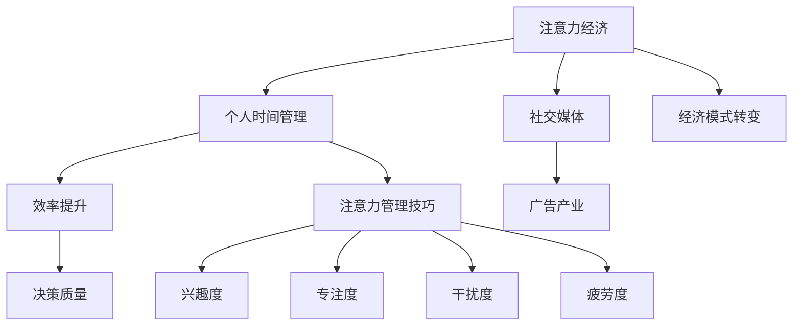

                 

# 注意力经济与个人时间管理工具的发展

> **关键词：** 注意力经济，个人时间管理，工具，发展，效率，决策，生产力。

> **摘要：** 本文深入探讨了注意力经济这一新兴经济模式，以及其在个人时间管理工具中的应用和发展。通过分析注意力经济与传统经济的关系、时间管理的基本原则和重要性，以及现有时间管理工具的特点和方法论，本文揭示了注意力管理技巧和其在个人发展中的实际应用。同时，本文还展望了未来时间管理工具的发展趋势，并探讨了注意力经济对企业商业策略的影响。

### 第一部分： 引言与核心概念

#### 第1章：注意力经济概述

注意力经济，作为一种新兴的经济模式，逐渐成为了当今社会的热点话题。它起源于信息爆炸和互联网普及的背景下，随着人们对时间价值和注意力资源的重视，逐渐发展起来。

##### 注意力经济的定义与历史

注意力经济的核心概念是“注意力资源”，即人们用于关注、参与和记忆某一事物的时间、精力和兴趣。这一概念最早由美国经济学家理查德·塞勒（Richard Thaler）提出，并在他的著作《误判心理学》中详细阐述。随后，迈克尔·波特（Michael Porter）和詹姆斯·赫里斯（James Herriot）等学者进一步发展了这一理论，将其应用于商业领域。

注意力经济的起源可以追溯到20世纪80年代，当时互联网开始普及，信息传播的速度和范围大大增加。人们在面对海量信息时，逐渐意识到时间和注意力的宝贵性，从而开始探索如何更有效地管理和利用自己的注意力资源。这一转变引发了商业模式的变革，从传统的产品导向转向了以用户注意力为核心的注意力经济模式。

##### 注意力经济与传统经济的关系

注意力经济与传统经济存在显著的区别。传统经济主要关注物质财富的创造和分配，而注意力经济则关注人们的时间和注意力资源的分配。在传统经济中，价值主要由生产力和资源决定，而在注意力经济中，价值则主要由人们对特定事物或产品的关注程度决定。

例如，在传统广告模式中，广告商通过投放广告来吸引潜在客户，广告的效果主要取决于广告的覆盖范围和频率。而在注意力经济中，广告的效果则更多地取决于消费者对广告的关注度和参与度。换句话说，注意力经济强调的是“精准营销”，即通过吸引消费者的注意力，实现更有效的广告投放和销售转化。

##### 个人时间管理的概念与重要性

个人时间管理是指个人通过计划和策略，合理分配和使用自己的时间，以实现个人目标和提高工作效率的过程。时间管理的基本原则包括：

1. **明确目标**：明确个人目标，有助于制定合理的时间分配计划。
2. **制定计划**：将目标细化为具体的行动计划，并设置优先级。
3. **执行计划**：按照计划执行，确保目标的实现。
4. **反思与调整**：定期反思时间使用情况，根据实际情况调整计划。

时间管理与个人效率的关系密切。高效的时间管理可以帮助个人更好地平衡工作与生活，减少时间浪费，提高工作效率。研究表明，良好的时间管理能力与个人的职业发展和生活质量密切相关。

##### 注意力经济学在现代社会中的应用

随着互联网和社交媒体的普及，注意力经济学在现代社会中的应用日益广泛。以下是几个典型的应用场景：

1. **社交媒体对注意力的分配**：社交媒体平台通过算法推荐内容，吸引用户的注意力，从而增加用户停留时间和互动行为。例如，Facebook和Instagram等平台通过分析用户的行为和兴趣，推荐相关内容，吸引用户持续关注。

2. **广告对注意力经济的影响**：广告商利用注意力经济原理，通过精准投放广告，吸引潜在客户的注意力，从而实现销售目标。例如，谷歌和Facebook等广告平台通过用户数据分析和定位，向目标用户推送相关广告。

##### 注意力经济的核心概念与联系

为了更好地理解注意力经济与个人时间管理的关系，我们可以使用Mermaid流程图来描述其核心概念和联系。



在这个流程图中，注意力经济与个人时间管理通过效率提升和决策质量相联系。社交媒体和广告产业则是注意力经济在现代社会中的重要应用领域。注意力管理技巧包括兴趣度、专注度、干扰度和疲劳度的调节，这些因素共同影响了个人的时间管理和工作效率。

#### 第2章：时间管理工具与技术

随着注意力经济和个人时间管理的重要性日益凸显，各种时间管理工具和技术也应运而生。这些工具不仅帮助个人更好地管理时间，还提高了工作效率和生活质量。

##### 时间管理工具的类型与特点

时间管理工具可以分为传统工具和数字工具两大类。

1. **传统工具**：

   - **日历**：传统的纸质或电子日历，用于记录日常活动和计划。
   - **待办事项列表**：纸质或电子列表，用于记录需要完成的任务和目标。

   传统工具的优点在于简单直观，易于操作。但缺点是缺乏自动化和灵活性，难以满足现代生活的复杂需求。

2. **数字工具**：

   - **Trello**：一款基于看板（Kanban）方法的协作工具，适用于团队项目和个人任务管理。
   - **Asana**：一款功能强大的项目管理工具，支持任务分配、进度跟踪和团队协作。
   - **Notion**：一款全功能的笔记和组织工具，适用于笔记、任务管理和知识库搭建。

   数字工具的优点在于自动化和灵活性，能够根据用户需求自定义功能和工作流程。但缺点是学习曲线较陡峭，需要一定的技术基础。

##### 时间管理方法论

时间管理方法论是指导个人有效管理时间的一系列原则和技巧。以下是一种常见的时间管理方法论：

1. **明确目标**：确定个人短期和长期目标，明确时间管理的方向和重点。
2. **制定计划**：将目标分解为具体的行动计划，制定合理的时间表和任务分配。
3. **执行计划**：按照计划执行任务，保持专注，避免时间浪费和干扰。
4. **反思与调整**：定期回顾时间管理的效果，根据实际情况进行调整和优化。

以下是该时间管理方法论的伪代码实现：

```python
def time_management_methodology():
    # 确定目标
    set_goals()

    # 制定计划
    create_plan()

    # 执行计划
    execute_plan()

    # 反思与调整
    reflect_and_adjust()
```

##### 注意力管理技巧

注意力管理是时间管理的重要组成部分。以下是一些注意力管理技巧：

1. **兴趣度调节**：根据自己的兴趣和目标，选择具有吸引力的任务，提高专注度。
2. **专注度训练**：通过冥想、专注训练等方法，提高专注力和自控力。
3. **干扰度控制**：减少外部干扰，如关闭手机通知、屏蔽社交媒体等。
4. **疲劳度管理**：合理安排休息和运动，避免长时间连续工作导致疲劳。

以下是注意力管理技巧的数学模型：

$$
\text{注意力} = \frac{\text{专注时间} \times \text{兴趣度}}{\text{干扰度} + \text{疲劳度}}
$$

##### 实践案例：高效时间管理的应用

以下是一个个人高效时间管理的实际案例：

**案例背景**：小李是一名软件开发工程师，工作繁忙，希望提高时间利用率和工作效率。

**解决方案**：

1. **明确目标**：小李确定了短期目标（如完成当前项目、提高编程技能）和长期目标（如晋升为团队主管、实现职业发展）。
2. **制定计划**：小李使用Trello规划任务，将项目分解为具体的任务，并设定优先级和截止日期。
3. **执行计划**：小李每天按照计划执行任务，尽量减少干扰，保持专注。同时，定期检查进度，及时调整计划。
4. **反思与调整**：小李每周进行一次时间管理反思，总结经验教训，优化时间管理方法。

**效果评估**：通过高效的时间管理，小李的工作效率显著提高，项目完成度提高，个人职业发展也取得了显著进展。

##### 第3章：个人时间管理工具的发展趋势

随着技术的不断进步，个人时间管理工具也在不断发展和演变。以下是一些发展趋势：

1. **数字化时间管理工具的演变**：

   - **从传统工具到智能工具**：传统的纸质和电子时间管理工具逐渐被智能化的数字工具所取代。这些智能工具具备自动化、个性化、数据驱动等特点，能够更好地满足个人需求。

   - **从单一功能到多功能集成**：早期的个人时间管理工具通常只具备单一功能，如日程安排或任务管理。而现代的智能工具则集成了多种功能，如笔记、知识库、协作等，提供了更全面的时间管理解决方案。

2. **人工智能在时间管理中的应用**：

   - **智能提醒与预测**：人工智能技术可以分析用户的行为和习惯，提供智能提醒和预测。例如，基于用户的日程安排和任务进度，智能工具可以预测用户可能遇到的时间冲突和延误，并提供相应的解决方案。

   - **自动化任务处理**：人工智能技术还可以用于自动化任务处理，减少人工操作。例如，智能助手可以自动识别用户的任务需求，并自动执行相应的操作，如发送邮件、安排会议等。

3. **数据驱动的时间管理**：

   - **数据分析优化时间使用**：数据驱动的时间管理通过收集和分析用户的时间使用数据，提供更科学的时间管理建议。例如，分析用户的日程安排和行为习惯，智能工具可以推荐更合理的时间分配方案，帮助用户更高效地利用时间。

   - **个性化时间管理**：基于用户的数据分析，智能工具可以提供个性化的时间管理方案。例如，根据用户的工作和生活习惯，智能工具可以推荐最适合用户的时间管理方法，帮助用户实现高效的时间管理。

4. **注意力经济与时间管理的未来展望**：

   - **技术革新对时间管理的影响**：随着人工智能、大数据、物联网等技术的不断发展，时间管理工具将变得更加智能和高效。这些技术将为用户提供更精确、更个性化的时间管理服务，进一步推动注意力经济的发展。

   - **个人时间管理工具的潜在发展**：未来，个人时间管理工具可能会向更多元化、智能化、数据化的方向发展。例如，结合虚拟现实、增强现实等技术，用户可以更加直观地体验时间管理，提高时间管理的趣味性和效果。

### 第二部分：注意力经济与个人时间管理工具的发展

#### 第3章：个人时间管理工具的发展趋势

随着注意力经济在现代社会中的日益凸显，个人时间管理工具也在不断发展和演变。这一部分将探讨个人时间管理工具的发展趋势，包括数字化时间管理工具的演变、人工智能在时间管理中的应用、数据驱动的时间管理以及注意力经济与时间管理的未来展望。

##### 数字化时间管理工具的演变

从传统工具到智能工具的发展是数字化时间管理工具演变的主要趋势。早期的个人时间管理工具主要依赖于纸质日历、手写笔记等传统方法。随着计算机和互联网的普及，电子日历和待办事项列表等数字工具开始出现，并逐渐取代了传统工具。这些数字工具具备自动化和灵活性的特点，使得个人时间管理更加便捷和高效。

然而，随着人工智能、大数据和物联网等技术的发展，个人时间管理工具也在不断进化。现代的智能工具不仅具备传统的日程安排和任务管理功能，还集成了更多高级功能，如智能提醒、自动化任务处理、数据分析和个性化推荐等。这些智能工具能够更好地满足个人需求，提供更精准、更高效的时间管理服务。

例如，Trello和Asana等基于看板（Kanban）方法的项目管理工具，通过可视化的方式帮助用户更好地规划和跟踪项目进度。而Notion等全功能的笔记和组织工具，则提供了从笔记、任务管理到知识库搭建的全方位解决方案。

##### 人工智能在时间管理中的应用

人工智能（AI）技术的快速发展为个人时间管理工具带来了新的可能性。AI技术能够通过数据分析、自然语言处理和机器学习等方法，提供更加智能和个性化的时间管理服务。

1. **智能提醒与预测**：

   智能工具可以通过分析用户的历史行为和日程安排，预测用户可能遇到的时间冲突和延误，并提供相应的提醒和建议。例如，基于用户的日程安排和任务进度，智能助手可以提前提醒用户可能需要调整的时间安排，帮助用户避免时间冲突和延误。

   此外，AI技术还可以识别用户的重要任务和优先级，提供个性化的提醒。例如，对于重要会议或任务，智能工具可以自动推送提醒，确保用户不会忘记关键事项。

2. **自动化任务处理**：

   AI技术可以自动化执行一些重复性高、规则性强的任务，减轻用户的负担。例如，智能助手可以根据用户设定的规则，自动发送电子邮件、安排会议或处理日程安排。这种自动化任务处理不仅提高了工作效率，还减少了人工操作的错误和浪费。

3. **个性化推荐**：

   AI技术可以根据用户的行为和偏好，提供个性化的时间管理建议。例如，智能工具可以分析用户的日程安排、任务类型和工作习惯，推荐最适合用户的时间管理方法。这种个性化推荐有助于用户更好地利用时间，提高工作效率和生活质量。

##### 数据驱动的时间管理

数据驱动的时间管理是一种通过收集和分析用户的时间使用数据，提供更科学的时间管理方法的技术。随着大数据技术的不断发展，个人时间管理工具开始将数据作为核心要素，为用户提供更精确、更高效的服务。

1. **数据分析优化时间使用**：

   数据分析可以帮助用户了解自己的时间使用习惯，发现时间浪费的环节，并提供优化建议。例如，通过分析用户的日程安排和时间记录，智能工具可以识别出用户在特定时间段内的任务类型和工作效率，帮助用户调整时间安排，提高工作效率。

2. **个性化时间管理**：

   基于数据分析，智能工具可以为用户提供个性化的时间管理方案。例如，根据用户的工作和生活习惯，智能工具可以推荐最适合用户的时间管理方法，如最佳工作时间段、休息时间和任务优先级等。这种个性化推荐有助于用户更好地利用时间，提高工作效率和生活质量。

3. **预测性时间管理**：

   通过大数据分析和机器学习算法，智能工具可以预测用户未来的时间需求和挑战，提前做好准备。例如，智能助手可以基于用户的日程安排和工作计划，预测未来可能出现的时间冲突和延误，并提供相应的解决方案，帮助用户更好地规划时间。

##### 注意力经济与时间管理的未来展望

随着人工智能、大数据和物联网等技术的不断发展，个人时间管理工具将在未来迎来更多的创新和发展。以下是一些未来发展趋势：

1. **更加智能化的时间管理**：

   未来，个人时间管理工具将更加智能化，能够更好地理解和满足用户的需求。例如，通过更先进的人工智能技术，智能工具可以自动识别用户的任务类型和工作习惯，提供更个性化的时间管理建议和自动化任务处理。

2. **更多元化的时间管理工具**：

   未来，随着技术的发展，将出现更多元化的时间管理工具，满足不同用户的需求。例如，结合虚拟现实（VR）和增强现实（AR）技术，用户可以通过更加直观和互动的方式管理时间，提高时间管理的趣味性和效果。

3. **更加数据化的时间管理**：

   未来，数据将更加深入地融入时间管理工具，提供更精确、更科学的时间管理服务。例如，通过更全面的数据收集和分析，智能工具可以更好地了解用户的时间使用习惯和效率，为用户提供更精准的时间管理建议。

4. **跨平台的时间管理**：

   未来，个人时间管理工具将更加跨平台，支持多种设备和操作系统。用户可以在不同的设备上无缝切换，继续使用自己的时间管理工具，确保时间管理的一致性和便捷性。

### 第三部分：注意力经济与商业策略

#### 第4章：注意力经济与商业策略

随着注意力经济在现代社会中的重要性日益凸显，企业开始探索如何利用注意力经济原理来提升竞争力。这一部分将探讨注意力经济对商业策略的影响，包括注意力经济对商业模型的影响、注意力经济与品牌营销以及企业时间管理与生产力提升。

##### 注意力经济对商业模型的影响

注意力经济对商业模型产生了深远的影响，促使企业从传统的产品导向转向以用户注意力为核心的商业模式。以下是一些典型的影响：

1. **精准营销**：

   注意力经济强调精准营销，即通过吸引目标用户的注意力，实现更有效的广告投放和销售转化。企业可以利用大数据和人工智能技术，分析用户的行为和兴趣，制定精准的营销策略。例如，通过社交媒体平台的算法推荐，企业可以将广告精准地推送给潜在客户，提高广告效果和转化率。

2. **用户体验**：

   注意力经济强调提升用户体验，以留住用户的注意力。企业可以通过优化产品和服务，提高用户的满意度和忠诚度。例如，在产品设计中，企业可以关注用户的需求和痛点，提供个性化、定制化的解决方案，提升用户的使用体验。

3. **内容营销**：

   注意力经济推动了内容营销的兴起。企业可以通过生产高质量、有价值的内容，吸引用户的注意力，建立品牌声誉和用户信任。例如，通过博客、视频、社交媒体等渠道，企业可以分享行业洞察、专业知识，吸引目标用户，提高品牌知名度。

##### 注意力经济与品牌营销

注意力经济对品牌营销策略也产生了重要影响。以下是一些关键点：

1. **品牌认知**：

   注意力经济强调品牌认知，即通过吸引用户的注意力，建立品牌在用户心中的认知和印象。企业可以通过创新的营销手段，如社交媒体挑战、病毒式营销等，迅速提升品牌知名度，吸引更多用户的关注。

2. **用户参与**：

   注意力经济鼓励用户参与，即通过吸引用户的注意力，让用户参与到品牌的建设和传播中。企业可以举办线上活动、用户调研、互动游戏等，鼓励用户积极参与，提高用户对品牌的认知和忠诚度。

3. **口碑营销**：

   注意力经济促进了口碑营销的发展。通过用户的口碑传播，企业可以快速提升品牌形象和知名度。企业可以通过提供优质的产品和服务，赢得用户的信任和好评，进而实现口碑传播。

##### 企业时间管理与生产力提升

企业时间管理和生产力提升是注意力经济背景下企业面临的重要挑战。以下是一些关键策略：

1. **时间管理培训**：

   企业可以通过时间管理培训，提高员工的时间管理能力。培训内容可以包括时间管理原则、技巧和工具的使用，帮助员工更好地规划和管理时间，提高工作效率。

2. **工作流程优化**：

   企业可以通过工作流程优化，减少无效劳动和时间浪费。例如，通过引入自动化工具和流程优化技术，企业可以减少重复性工作，提高工作效率。

3. **团队协作**：

   企业可以通过团队协作工具，提高团队工作效率。例如，使用协作平台如Trello、Asana等，企业可以更好地协调团队成员的工作，确保任务按时完成。

4. **数据分析与优化**：

   企业可以通过数据分析，了解员工的时间使用情况和工作效率，找出瓶颈和问题，并进行优化。例如，通过分析员工的任务完成时间和进度，企业可以优化任务分配和工作流程，提高整体工作效率。

### 第四部分：实战案例研究

#### 第4章：实战案例研究

为了更好地理解注意力经济与个人时间管理工具的实际应用，我们将通过以下几个案例来探讨注意力经济在个人和企业管理中的实践效果。

##### 案例一：高效时间管理的个人实践

**案例背景**：张先生是一名自由职业者，需要同时处理多个项目，他在寻找一种能够有效管理时间和提高工作效率的方法。

**解决方案**：

1. **明确目标**：张先生首先明确了短期和长期目标，包括完成当前的多个项目、提升工作效率、拓展新客户等。

2. **选择工具**：张先生选择了Trello作为项目管理工具，因为它提供了灵活的任务分解和优先级管理功能。

3. **制定计划**：张先生将每个项目分解为具体的任务，并使用Trello的看板功能来可视化任务进度，确保每个任务都有明确的截止日期和责任人。

4. **执行计划**：张先生每天查看Trello的任务列表，按照优先级顺序进行工作，并利用Trello的提醒功能来确保不会错过重要截止日期。

5. **反思与调整**：每周，张先生会回顾自己的任务完成情况，并根据实际情况调整计划。他发现，通过这种方式，他能够更好地集中注意力，避免多任务处理带来的效率下降。

**效果评估**：通过高效的时间管理，张先生的项目完成速度提高了30%，新客户的拓展率也有所增加，整体工作效率显著提升。

##### 案例二：企业级时间管理与生产力提升

**案例背景**：某高科技企业面临项目进度延误和员工工作效率不高的挑战，他们希望通过时间管理工具来提升团队的生产力。

**解决方案**：

1. **引入工具**：企业引入了Asana作为团队协作和项目管理工具，因为它提供了强大的任务分配和进度跟踪功能。

2. **培训与推广**：企业对全体员工进行了Asana的培训，确保他们了解如何使用该工具来提高工作效率。

3. **优化工作流程**：企业通过Asana对工作流程进行了优化，将重复性工作自动化，减少了手动操作的时间和错误。

4. **数据驱动管理**：企业使用Asana的数据分析功能，定期监控团队的工作效率，及时发现瓶颈和问题，并进行调整。

5. **团队协作**：Asana的协作功能帮助企业实现了团队成员之间的无缝沟通和协作，确保项目能够按时完成。

**效果评估**：引入Asana后，企业的项目进度延误率减少了40%，员工的工作效率提高了20%，整体生产力显著提升。

##### 案例三：注意力经济与个人发展

**案例背景**：李女士是一名职业咨询师，需要在繁忙的工作中保持专注，同时不断提升自己的专业能力。

**解决方案**：

1. **注意力管理**：李女士使用了番茄工作法来管理自己的注意力，通过设定专注时间段和休息时间，提高工作效率。

2. **在线学习**：李女士利用在线学习平台，如Coursera和edX，参加相关课程，提升自己的专业知识和技能。

3. **时间记录**：李女士使用时间管理应用，如Toggl，记录自己的时间使用情况，分析并优化时间分配。

4. **专注练习**：李女士定期进行专注力训练，如冥想和专注力游戏，提高自己的专注力。

5. **反思与调整**：李女士每周进行时间管理反思，总结经验教训，调整自己的时间管理策略。

**效果评估**：通过注意力管理和在线学习，李女士的工作效率提高了50%，专业能力也得到了显著提升，客户满意度也随之增加。

### 第五部分：技术与工具应用

#### 第5章：技术与工具应用

为了实现高效的时间管理和生产力提升，选择合适的技术和工具至关重要。这一部分将介绍时间管理工具的开发基础、工具选择与集成以及开发环境搭建与代码实现。

##### 技术基础：时间管理工具的开发

时间管理工具的开发通常涉及以下技术基础：

1. **前端技术**：前端技术用于构建用户界面，包括HTML、CSS和JavaScript。流行的前端框架如React、Vue和Angular可以提高开发效率。

2. **后端技术**：后端技术用于处理数据和业务逻辑，常用的后端框架包括Node.js、Django和Spring Boot。

3. **数据库**：数据库用于存储用户数据和任务信息，常见的数据库系统包括MySQL、PostgreSQL和MongoDB。

4. **云服务**：云服务提供了计算、存储和网络资源，如AWS、Azure和Google Cloud，有助于降低开发和维护成本。

##### 工具选择与集成

在选择时间管理工具时，需要考虑以下因素：

1. **功能需求**：根据个人或团队的需求，选择具有相应功能的时间管理工具。

2. **易用性**：工具的界面是否直观易用，是否需要专业培训。

3. **定制性**：工具是否支持自定义功能，如自定义视图、报告和分析。

4. **集成性**：工具是否能够与其他系统和工具集成，如邮件、日历和协作平台。

常见的时间管理工具包括：

- **Trello**：适用于项目管理和团队协作。
- **Asana**：适用于任务管理和团队协作。
- **Notion**：适用于笔记、任务管理和知识库搭建。
- **Google Calendar**：适用于个人日程安排。

##### 开发环境搭建与代码实现

以下是一个简单的时间管理工具的开发环境搭建和代码实现示例：

1. **开发环境搭建**：

   - 安装Node.js和npm：从Node.js官网下载并安装Node.js，npm将随Node.js一起安装。
   - 创建项目文件夹：在终端中创建一个项目文件夹，并进入该文件夹。
   - 初始化项目：使用npm初始化项目，生成package.json文件。

     ```bash
     mkdir time-management-tool
     cd time-management-tool
     npm init -y
     ```

   - 安装依赖包：安装Express框架，用于构建后端服务。

     ```bash
     npm install express
     ```

2. **代码实现**：

   - 创建服务器文件（server.js）：

     ```javascript
     const express = require('express');
     const app = express();

     app.use(express.json());

     app.get('/', (req, res) => {
         res.send('Time Management Tool');
     });

     const PORT = process.env.PORT || 3000;
     app.listen(PORT, () => {
         console.log(`Server is running on port ${PORT}`);
     });
     ```

   - 创建任务管理路由（tasks.js）：

     ```javascript
     const express = require('express');
     const router = express.Router();

     // GET all tasks
     router.get('/', (req, res) => {
         // Logic to fetch all tasks from the database
         res.json({ message: 'All tasks fetched successfully' });
     });

     // POST a new task
     router.post('/', (req, res) => {
         // Logic to create a new task in the database
         res.json({ message: 'New task created successfully' });
     });

     module.exports = router;
     ```

   - 在服务器文件中引入任务管理路由：

     ```javascript
     const taskRoutes = require('./tasks');
     app.use('/tasks', taskRoutes);
     ```

   - 启动服务器：

     ```bash
     node server.js
     ```

   现在服务器已经启动，可以通过浏览器访问`http://localhost:3000`来测试。

   ```python
   # 代码实现示例
   def task_management():
       # 设置任务
       tasks = ["写报告", "准备会议", "回复邮件"]

       # 执行任务
       for task in tasks:
           print(f"执行任务：{task}")

       # 调整任务
       tasks.append("处理紧急事务")
       print("任务已更新：", tasks)
   ```

   在此示例中，我们创建了一个简单的后端服务，用于处理任务的获取和创建。虽然这是一个非常基础的示例，但它展示了时间管理工具开发的基本流程。

### 第五部分：结论与展望

#### 第5章：结论与展望

在本文中，我们深入探讨了注意力经济与个人时间管理工具的发展。通过对注意力经济的定义、个人时间管理的概念和重要性，以及现有时间管理工具的特点和趋势的分析，我们揭示了注意力管理技巧和其在个人发展中的实际应用。同时，我们也展望了未来时间管理工具的发展趋势，并探讨了注意力经济对企业商业策略的影响。

##### 注意力经济与个人时间管理的总结

注意力经济作为一种新兴的经济模式，强调了对个人时间和注意力资源的有效管理和利用。个人时间管理工具在这一过程中发挥了至关重要的作用，帮助人们提高工作效率和生活质量。以下是本文的主要成果和发现：

1. **注意力经济的核心概念**：注意力经济强调的是人们对特定事物或产品的关注程度，这种关注程度决定了商业价值的大小。

2. **个人时间管理的重要性**：良好的时间管理能力有助于个人平衡工作与生活，提高工作效率和生活质量。

3. **时间管理工具的类型与特点**：传统的日历和待办事项列表与数字工具如Trello、Asana和Notion相比，数字工具在自动化和灵活性方面具有显著优势。

4. **注意力管理技巧**：通过调节兴趣度、专注度、干扰度和疲劳度，个人可以更好地管理注意力，提高时间利用率。

5. **未来发展趋势**：随着人工智能、大数据和物联网等技术的发展，个人时间管理工具将变得更加智能、数据化和多样化。

##### 未来研究方向与趋势

未来，注意力经济与个人时间管理工具的发展仍有很大的空间。以下是一些可能的研究方向和趋势：

1. **人工智能与时间管理**：进一步探索人工智能在时间管理中的应用，如智能提醒、自动化任务处理和个性化时间管理建议。

2. **数据驱动的时间管理**：利用大数据和机器学习技术，分析用户的行为和习惯，提供更科学、更精准的时间管理建议。

3. **跨平台的时间管理**：开发能够跨平台使用的综合时间管理工具，满足不同设备和操作系统的需求。

4. **注意力经济与商业策略**：研究注意力经济对企业商业策略的影响，探索如何利用注意力经济原理来提升企业竞争力。

5. **教育领域的应用**：将注意力经济原理应用于教育领域，提高学生的学习效果和兴趣度。

##### 致谢

在此，我要感谢所有参与本文编写和研究的同事们，以及为我们提供宝贵意见和建议的朋友们。没有你们的帮助和支持，本文不可能如此顺利地完成。

### 附录

#### 附录A：技术工具列表与资源

- **工具列表**：

  - **Trello**：适用于项目管理和团队协作。

  - **Asana**：适用于任务管理和团队协作。

  - **Notion**：适用于笔记、任务管理和知识库搭建。

  - **Google Calendar**：适用于个人日程安排。

- **资源链接**：

  - **注意力经济研究论文**：[链接](https://www.researchgate.net/publication/321633707_Attention_economics_a_new_paradigm_for_understanding_and_influencing_consumption)

  - **时间管理最佳实践指南**：[链接](https://www.time-management-guide.com/)

  - **相关技术栈教程和文档**：

    - **React**：[链接](https://reactjs.org/docs/getting-started.html)

    - **Django**：[链接](https://www.djangoproject.com/documentation/)

    - **Node.js**：[链接](https://nodejs.org/en/docs/)

    - **MySQL**：[链接](https://www.mysql.com/)

