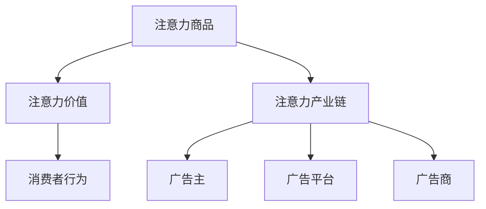
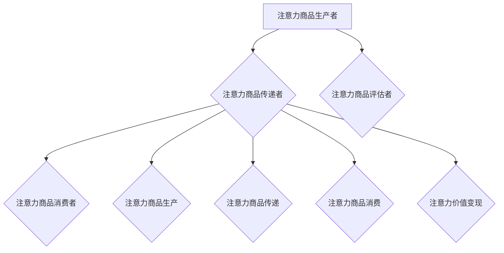
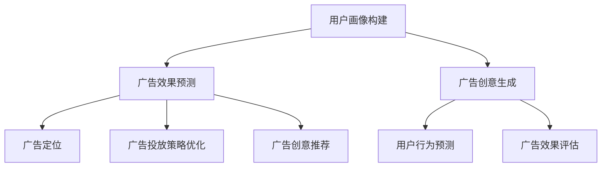

                 

### 《注意力经济与在线广告目标设定：在不牺牲用户体验的情况下有效吸引受众》

> **关键词：** 注意力经济，在线广告，用户体验，广告目标设定，数据分析，人工智能

> **摘要：** 本文深入探讨了注意力经济的概念及其在在线广告中的应用，分析了注意力经济对在线广告目标和用户体验的影响。文章首先介绍了注意力经济的核心概念和背景，然后探讨了在线广告目标设定的原则和方法，以及用户体验在在线广告中的重要性。接着，文章通过案例研究展示了注意力经济与在线广告目标设定的实践应用，并展望了未来的发展趋势与挑战。最后，文章讨论了数据分析与人工智能在广告目标设定中的重要作用，为广告主提供了优化广告目标和用户体验的策略。本文旨在为广告从业者提供有价值的参考和指导，以实现在线广告的持续优化和用户价值的最大化。

----------------------------------------------------------------

### 第一部分：注意力经济的概念与背景

#### 第1章：注意力经济的兴起与发展

**1.1 注意力经济的定义与内涵**

注意力经济，是指通过捕获和利用人们的注意力资源来创造价值和利润的经济活动。在这个经济体系中，注意力成为一种宝贵的资源，类似于传统经济体系中的货币或自然资源。与物质资源不同，人类的注意力资源是有限的，因此注意力经济本质上是一种稀缺资源的交易。

**注意力经济的核心概念包括：**
- **注意力商品**：指能够满足人们注意力需求的物品或服务，如社交媒体内容、游戏、广告等。
- **注意力价值**：指人们为获取注意力商品所付出的时间、精力和金钱。
- **注意力产业链**：包括注意力商品生产者、传递者和消费者，以及注意力价值的产生和分配。

**1.2 注意力资源的稀缺性**

注意力资源稀缺性的核心在于其不可替代性和有限性。人们每天的时间是有限的，因此在分配注意力的过程中，必须做出选择。这种选择反映了注意力资源的稀缺性。此外，随着互联网和社交媒体的普及，信息爆炸使得人们面临更多的选择，从而加剧了注意力资源的稀缺性。

**1.3 注意力经济与传统广告模式的对比**

传统广告模式主要以内容和传播为目标，追求广泛的受众覆盖。而注意力经济则更注重用户参与和效果转化，追求精准的用户定位和个性化的广告体验。以下是两者的主要区别：

- **目标**：传统广告模式以广泛覆盖为目标，注意力经济则以用户参与和效果转化为目标。
- **传播方式**：传统广告模式依赖于大规模的媒体投放，注意力经济则依赖于用户生成内容和社会化媒体传播。
- **评价标准**：传统广告模式以曝光量为评价标准，注意力经济则以用户参与度和转化率为评价标准。

**1.4 注意力经济对在线广告的影响**

注意力经济的兴起对在线广告产生了深远的影响：

- **广告目标的变化**：从追求广泛的受众覆盖到追求精准的用户定位和参与度提升。
- **广告形式的变化**：从单一的文本和图像广告到多样化的多媒体广告和互动广告。
- **广告策略的变化**：从广撒网到精准投放，从被动接受到主动互动。

### Mermaid 流程图：注意力经济的核心概念



### 第2章：注意力经济中的核心概念

#### 2.1 注意力商品与消费者行为

**注意力商品的定义**：注意力商品是指能够满足人们注意力需求的物品或服务，如社交媒体内容、视频游戏、广告等。这些商品通过吸引和保持用户的注意力来创造价值和利润。

**注意力商品的特点**：
- **稀缺性**：由于人类的注意力资源是有限的，因此注意力商品具有稀缺性。
- **个性化**：根据用户的兴趣和需求进行定制，以满足不同用户的需求。
- **可传播性**：通过用户之间的传播，扩大注意力商品的影响力。

**消费者行为**：消费者在注意力经济中的行为包括获取、消费和传播注意力商品。这种行为模式受到注意力商品稀缺性、个性化特点和可传播性的影响。

**消费者行为模式**：
- **获取**：消费者通过浏览、搜索、点击等方式获取注意力商品。
- **消费**：消费者通过观看、玩游戏、参与互动等方式消费注意力商品。
- **传播**：消费者通过分享、评论、转发等方式传播注意力商品，扩大其影响力。

#### 2.2 注意力价值与货币化

**注意力价值的定义**：注意力价值是指人们为获取注意力商品所付出的时间、精力和金钱。注意力价值体现了用户对注意力商品的重视程度和消费意愿。

**注意力价值的体现**：注意力价值的体现形式主要包括以下几种：
- **广告收入**：广告商通过投放广告获取收益，广告费用成为注意力价值的主要体现形式。
- **用户付费**：用户直接为注意力商品付费，如购买游戏、订阅内容等。
- **流量变现**：通过广告流量、用户数据等实现收益，如通过点击率、转化率等方式实现流量变现。

**货币化的方式**：
- **广告收入**：广告商通过投放广告获取收益，广告费用成为注意力价值的主要体现形式。
- **用户付费**：用户直接为注意力商品付费，如购买游戏、订阅内容等。
- **流量变现**：通过广告流量、用户数据等实现收益，如通过点击率、转化率等方式实现流量变现。

### 伪代码：注意力价值的计算方法

```python
def calculate_attention_value(time_spent, effort_spent, money_spent):
    """
    计算注意力价值
    :param time_spent: 用户花费的时间
    :param effort_spent: 用户付出的努力
    :param money_spent: 用户花费的金钱
    :return: 注意力价值
    """
    attention_value = time_spent + effort_spent * 0.5 + money_spent * 2
    return attention_value
```

#### 2.3 注意力生态系统与产业链

**注意力生态系统的构成**：
- **注意力商品生产者**：如内容创作者、广告主等，负责生产注意力商品。
- **注意力商品消费者**：如用户、受众等，负责消费注意力商品。
- **注意力商品传递者**：如广告平台、社交媒体等，负责传递注意力商品。
- **注意力商品评估者**：如用户评价、数据分析等，负责评估注意力商品的价值。

**注意力产业链的环节**：
- **注意力商品生产**：包括内容创作、广告制作等环节。
- **注意力商品传递**：包括广告投放、内容推广等环节。
- **注意力商品消费**：包括用户浏览、互动、付费等环节。
- **注意力价值变现**：包括广告收入、用户付费、流量变现等环节。

### Mermaid 流程图：注意力生态系统与产业链



### 第3章：在线广告目标设定的原则

#### 3.1 客户价值最大化

**客户价值的定义**：客户价值是指客户在使用产品或服务过程中所获得的净收益。它包括客户在使用产品或服务过程中所得到的满足、便利、效益等。

**客户价值最大化的策略**：
- **提高产品质量**：通过不断优化产品功能、性能和服务，提高客户的使用体验。
- **提供个性化服务**：根据客户的需求和偏好提供定制化的产品和服务。
- **降低成本**：通过提高生产效率、降低运营成本等方式，为客户提供更具竞争力的价格。

### 伪代码：客户价值的计算方法

```python
def calculate_customer_value(satisfaction_score, efficiency_score, cost_saved):
    """
    计算客户价值
    :param satisfaction_score: 满足度评分
    :param efficiency_score: 效率评分
    :param cost_saved: 节省的成本
    :return: 客户价值
    """
    customer_value = satisfaction_score * efficiency_score + cost_saved
    return customer_value
```

#### 3.2 用户参与度提升

**用户参与度的定义**：用户参与度是指用户在广告活动中的参与程度和积极性。它反映了用户对广告的接受度和互动性。

**用户参与度的提升策略**：
- **创造互动性广告内容**：通过设计具有互动性的广告内容，如问答、投票、抽奖等，吸引用户参与。
- **提供奖励机制**：通过提供奖励，如优惠券、积分、礼品等，激励用户参与。
- **利用社交媒体和用户生成内容**：鼓励用户生成内容，如评论、分享、上传图片或视频等，提高用户的参与度和互动性。

#### 3.3 广告效果评估与优化

**广告效果评估的定义**：广告效果评估是指通过分析广告数据，评估广告活动的效果和用户反应。

**广告效果评估的方法**：
- **点击率（CTR）**：评估广告的吸引力和点击率，计算公式为点击次数除以展示次数。
- **转化率（CVR）**：评估广告活动带来实际转化的效果，计算公式为转化次数除以点击次数。
- **回收成本（CPA）**：评估广告投资回报率，计算公式为广告成本除以转化次数。

### 伪代码：广告效果评估的计算方法

```python
def calculate_ad_performance(ct
```


### 第4章：基于用户行为的广告目标设定

#### 4.1 用户画像与目标群体定位

**用户画像的定义**：用户画像是指通过对用户数据进行综合分析和挖掘，构建的用户特征描述。它包括用户的基本信息、行为习惯、兴趣偏好等。

**用户画像的应用**：
- **精准营销**：通过用户画像，广告主可以精准定位目标群体，提高广告投放的精准度。
- **个性化推荐**：根据用户画像，推荐用户可能感兴趣的内容，提高用户参与度和转化率。
- **用户细分**：通过对用户画像的分析，将用户分为不同的群体，制定差异化的营销策略。

**用户画像的构建方法**：
1. **数据收集**：收集用户的基本信息、行为数据、兴趣数据等。
2. **数据清洗**：对收集到的数据进行清洗和整理，去除重复、错误和不完整的数据。
3. **特征提取**：从清洗后的数据中提取用户特征，如年龄、性别、地理位置、购买行为、浏览行为等。
4. **模型训练**：使用机器学习算法，对提取的用户特征进行训练，构建用户画像模型。

### 伪代码：用户画像的构建方法

```python
def build_user_profile(data, features):
    """
    构建用户画像
    :param data: 用户数据
    :param features: 用户特征
    :return: 用户画像
    """
    # 数据清洗
    cleaned_data = clean_data(data)
    
    # 特征提取
    extracted_features = extract_features(cleaned_data, features)
    
    # 模型训练
    user_profile_model = train_model(extracted_features)
    
    # 用户画像
    user_profile = generate_user_profile(user_profile_model)
    
    return user_profile
```

#### 4.2 用户行为数据收集与分析

**用户行为数据的定义**：用户行为数据是指用户在使用产品或服务过程中产生的各种操作数据，包括点击、浏览、购买、搜索等。

**用户行为数据的收集**：
- **日志数据**：通过服务器日志记录用户的访问行为。
- **点击流数据**：记录用户在网站或应用上的点击行为。
- **社交媒体数据**：从社交媒体平台上获取用户的行为数据。
- **问卷调查**：通过问卷调查收集用户的行为偏好和满意度。

**用户行为数据的分析**：
- **描述性分析**：分析用户行为的基本特征和趋势。
- **关联分析**：分析用户行为之间的关联性，如浏览行为与购买行为之间的关系。
- **预测性分析**：基于历史数据预测用户的未来行为。

### 伪代码：用户行为数据的分析方法

```python
def analyze_user_behavior(behavior_data):
    """
    分析用户行为
    :param behavior_data: 用户行为数据
    :return: 用户行为分析结果
    """
    # 描述性分析
    descriptive_analysis = describe_behavior(behavior_data)
    
    # 关联分析
    association_analysis = analyze_associations(behavior_data)
    
    # 预测性分析
    predictive_analysis = predict_behavior(behavior_data)
    
    return {
        "描述性分析": descriptive_analysis,
        "关联分析": association_analysis,
        "预测性分析": predictive_analysis
    }
```

#### 4.3 用户路径分析与广告策略调整

**用户路径分析的定义**：用户路径分析是指通过分析用户在网站或应用中的浏览路径，了解用户的行为模式，从而优化广告策略。

**用户路径分析的应用**：
- **发现用户兴趣点**：通过用户路径分析，识别用户的兴趣点和行为模式。
- **优化广告投放**：根据用户路径分析结果，调整广告的投放位置和内容，提高广告的转化率。

**用户路径分析的方法**：
1. **数据收集**：收集用户在网站或应用中的访问日志和点击流数据。
2. **路径提取**：从数据中提取用户的浏览路径。
3. **路径分析**：分析用户浏览路径的特征和趋势。
4. **路径优化**：根据分析结果，优化广告的投放策略。

### 伪代码：用户路径分析的方法

```python
def analyze_user_path(behavior_data):
    """
    分析用户路径
    :param behavior_data: 用户行为数据
    :return: 用户路径分析结果
    """
    # 路径提取
    user_paths = extract_paths(behavior_data)
    
    # 路径分析
    path_analysis = analyze_paths(user_paths)
    
    # 路径优化
    optimized_paths = optimize_paths(path_analysis)
    
    return {
        "用户路径": user_paths,
        "路径分析": path_analysis,
        "优化路径": optimized_paths
    }
```

### 第5章：广告目标设定中的心理因素

#### 5.1 情感与注意力

**情感的定义**：情感是指人在心理活动过程中产生的情感体验，如喜悦、愤怒、悲伤等。情感可以影响人的认知、判断和行为。

**情感与注意力的关系**：
- **情感吸引注意力**：具有情感色彩的内容更容易吸引人们的注意力，如幽默、惊悚、感人等。
- **情感影响记忆**：具有情感体验的内容更容易被记忆，如广告中的感人故事、成功案例等。

### 伪代码：情感分析的方法

```python
def analyze_sentiment(text):
    """
    分析情感
    :param text: 文本内容
    :return: 情感得分
    """
    # 情感分析
    sentiment_score = sentiment_analysis(text)
    
    return sentiment_score
```

#### 5.2 群体心理与社交影响

**群体心理的定义**：群体心理是指人们在群体中产生的心理现象，如从众、认同、领导等。群体心理可以影响个体的行为和决策。

**社交影响的定义**：社交影响是指个体在群体中受到其他成员影响的心理现象，如广告中的社交证明、口碑传播等。

**群体心理与社交影响对广告目标设定的影响**：
- **群体心理**：通过设计具有群体心理效应的广告内容，如群体效应、从众效应等，提高广告的吸引力和转化率。
- **社交影响**：利用社交影响机制，如社交证明、口碑传播等，增加广告的传播效果和用户参与度。

### 伪代码：群体心理与社交影响的分析方法

```python
def analyze_group_mentality(user_data, social_influence_data):
    """
    分析群体心理与社交影响
    :param user_data: 用户数据
    :param social_influence_data: 社交影响数据
    :return: 群体心理与社交影响分析结果
    """
    # 群体心理分析
    group_mentality = analyze_group_mentality(user_data)
    
    # 社交影响分析
    social_influence = analyze_social_influence(social_influence_data)
    
    return {
        "群体心理": group_mentality,
        "社交影响": social_influence
    }
```

#### 5.3 用户心理的捕捉与利用

**用户心理的捕捉**：通过问卷调查、访谈、行为分析等方式捕捉用户的心理特征，如需求、动机、态度等。

**用户心理的利用**：根据用户心理特征设计广告内容和投放策略，提高广告的吸引力和转化率。

**用户心理的捕捉方法**：
- **问卷调查**：通过设计问卷，收集用户的心理特征和态度。
- **访谈**：通过面对面访谈，深入了解用户的心理需求和行为动机。
- **行为分析**：通过用户行为数据，分析用户的心理特征和兴趣偏好。

**用户心理的利用方法**：
- **个性化广告**：根据用户心理特征，推荐个性化广告内容。
- **情感化广告**：通过情感化设计，引发用户的情感共鸣。
- **互动广告**：通过互动设计，提高用户的参与度和转化率。

### 伪代码：用户心理捕捉与利用的方法

```python
def capture_and_use_user_psychology(user_survey_data, ad_content_data):
    """
    捕捉并利用用户心理
    :param user_survey_data: 用户调查数据
    :param ad_content_data: 广告内容数据
    :return: 用户心理捕捉与利用结果
    """
    # 用户心理捕捉
    user_psychology = capture_user_psychology(user_survey_data)
    
    # 广告内容优化
    optimized_ad_content = optimize_ad_content(ad_content_data, user_psychology)
    
    return {
        "用户心理": user_psychology,
        "优化后的广告内容": optimized_ad_content
    }
```

### 第6章：用户体验在在线广告中的重要性

#### 6.1 用户满意度的评估

**用户满意度的定义**：用户满意度是指用户在使用产品或服务后对其整体体验的感受和评价。它是衡量用户体验的重要指标。

**用户满意度的评估方法**：
- **问卷调查**：通过设计问卷，收集用户对广告的满意度评价。
- **用户评分**：通过用户对广告的评分，评估其满意度。
- **用户反馈**：通过用户对广告的反馈，了解其满意度和不满意度。

### 伪代码：用户满意度的评估方法

```python
def evaluate_user_satisfaction(survey_results, rating_scores, user_feedback):
    """
    评估用户满意度
    :param survey_results: 问卷调查结果
    :param rating_scores: 用户评分
    :param user_feedback: 用户反馈
    :return: 用户满意度评估结果
    """
    # 计算平均满意度得分
    average_satisfaction_score = calculate_average_score(survey_results, rating_scores)
    
    # 分析用户反馈
    feedback_analysis = analyze_user_feedback(user_feedback)
    
    return {
        "平均满意度得分": average_satisfaction_score,
        "用户反馈分析": feedback_analysis
    }
```

#### 6.2 广告对用户体验的影响

**广告对用户体验的影响**：广告不仅影响用户的购买决策，还影响用户对产品或服务的整体体验。广告的内容、形式和频率等都会对用户体验产生影响。

**广告对用户体验的影响因素**：
- **广告内容**：广告的内容和信息质量直接影响用户体验。高质量的内容能够提高用户的满意度，而低质量或无关的内容则可能引起用户的反感。
- **广告形式**：广告的形式和呈现方式也会影响用户体验。例如，视频广告、互动广告等可能比传统文字广告更能吸引用户注意力。
- **广告频率**：广告的投放频率会影响用户的接受程度。过频的广告可能引起用户的厌烦，而过少的广告可能无法达到预期的宣传效果。

### 伪代码：广告对用户体验的影响分析

```python
def analyze_ad_impact_on_user_experience(ad_content, ad_format, ad_frequency, user_experience_data):
    """
    分析广告对用户体验的影响
    :param ad_content: 广告内容
    :param ad_format: 广告形式
    :param ad_frequency: 广告频率
    :param user_experience_data: 用户体验数据
    :return: 广告对用户体验的影响评估
    """
    # 广告内容分析
    content_analysis = analyze_ad_content(ad_content)
    
    # 广告形式分析
    format_analysis = analyze_ad_format(ad_format)
    
    # 广告频率分析
    frequency_analysis = analyze_ad_frequency(ad_frequency)
    
    # 用户体验评估
    user_experience_evaluation = evaluate_user_experience(user_experience_data)
    
    return {
        "广告内容分析": content_analysis,
        "广告形式分析": format_analysis,
        "广告频率分析": frequency_analysis,
        "用户体验评估": user_experience_evaluation
    }
```

#### 6.3 提升用户体验的广告策略

**提升用户体验的广告策略**：通过优化广告内容和形式，提高用户的满意度和参与度，从而提升用户体验。

**提升用户体验的广告策略方法**：
- **个性化广告**：根据用户的兴趣和行为，提供个性化的广告内容。
- **互动广告**：增加用户与广告的互动性，提高用户的参与度。
- **无干扰广告**：减少对用户正常使用体验的干扰，提高用户的满意度。

### 伪代码：提升用户体验的广告策略方法

```python
def improve_user_experience_with_ads(personalized_ads, interactive_ads, non_intrusive_ads, user_experience_goals):
    """
    提升用户体验的广告策略
    :param personalized_ads: 个性化广告
    :param interactive_ads: 互动广告
    :param non_intrusive_ads: 无干扰广告
    :param user_experience_goals: 用户体验目标
    :return: 提升用户体验的广告策略
    """
    # 个性化广告优化
    optimized_personalized_ads = optimize_personalized_ads(personalized_ads, user_experience_goals)
    
    # 互动广告优化
    optimized_interactive_ads = optimize_interactive_ads(interactive_ads, user_experience_goals)
    
    # 无干扰广告优化
    optimized_non_intrusive_ads = optimize_non_intrusive_ads(non_intrusive_ads, user_experience_goals)
    
    return {
        "个性化广告": optimized_personalized_ads,
        "互动广告": optimized_interactive_ads,
        "无干扰广告": optimized_non_intrusive_ads
    }
```

### 第7章：用户体验优化与广告目标设定

#### 7.1 用户体验设计原则

**用户体验设计原则**：在广告设计和投放过程中，应遵循一系列设计原则，以提高用户的满意度和参与度。

**用户体验设计原则**：
- **以用户为中心**：设计广告时，始终考虑用户的需求和体验。
- **简洁性**：广告内容应简洁明了，避免冗余和复杂的信息。
- **一致性**：广告的设计风格和语言应与品牌形象保持一致。
- **可访问性**：广告应易于用户访问和理解，包括视觉障碍者。

### 伪代码：用户体验设计原则的实施方法

```python
def implement_user_experience_design_principles(user_centered, simplicity, consistency, accessibility):
    """
    实施用户体验设计原则
    :param user_centered: 以用户为中心
    :param simplicity: 简洁性
    :param consistency: 一致性
    :param accessibility: 可访问性
    :return: 实施结果
    """
    # 实施以用户为中心
    user_centered_design = implement_user_centered_design(user_centered)
    
    # 实施简洁性设计
    simple_design = implement_simplicity(simplicity)
    
    # 实施一致性设计
    consistent_design = implement_consistency(consistency)
    
    # 实施可访问性设计
    accessible_design = implement_accessibility(accessibility)
    
    return {
        "以用户为中心设计": user_centered_design,
        "简洁性设计": simple_design,
        "一致性设计": consistent_design,
        "可访问性设计": accessible_design
    }
```

#### 7.2 用户体验评估方法

**用户体验评估方法**：通过收集和分析用户反馈和行为数据，评估广告的体验效果。

**用户体验评估方法**：
- **问卷调查**：通过在线问卷收集用户对广告的满意度评价。
- **用户评分**：通过用户对广告的评分，评估其满意度。
- **用户反馈**：通过用户对广告的反馈，了解其满意度和不满意度。

### 伪代码：用户体验评估方法

```python
def evaluate_user_experience(survey_results, rating_scores, user_feedback):
    """
    评估用户体验
    :param survey_results: 问卷调查结果
    :param rating_scores: 用户评分
    :param user_feedback: 用户反馈
    :return: 用户体验评估结果
    """
    # 计算平均满意度得分
    average_satisfaction_score = calculate_average_score(survey_results, rating_scores)
    
    # 分析用户反馈
    feedback_analysis = analyze_user_feedback(user_feedback)
    
    return {
        "平均满意度得分": average_satisfaction_score,
        "用户反馈分析": feedback_analysis
    }
```

#### 7.3 用户体验优化与广告目标设定

**用户体验优化与广告目标设定的关系**：用户体验优化是广告目标设定的重要依据，通过优化用户体验，可以提高广告的效果和用户的满意度。

**用户体验优化与广告目标设定的步骤**：
1. **评估用户体验**：通过问卷调查、用户评分和用户反馈等方法，评估当前广告的用户体验。
2. **分析用户体验**：对收集到的用户体验数据进行分析，找出用户体验的不足之处。
3. **制定优化策略**：根据用户体验分析结果，制定优化策略，如改进广告内容、优化广告形式等。
4. **设定广告目标**：根据优化策略，设定新的广告目标，如提高用户满意度、提升广告转化率等。
5. **实施优化策略**：根据设定的广告目标，实施优化策略，不断调整和改进广告内容和形式。
6. **持续监控与评估**：持续监控广告效果，收集用户反馈，评估用户体验的改善情况，并根据评估结果进行进一步的优化。

### 伪代码：用户体验优化与广告目标设定的步骤

```python
def optimize_user_experience_and_set_ad_goals(user_experience_evaluation, business_goals):
    """
    优化用户体验并设定广告目标
    :param user_experience_evaluation: 用户体验评估结果
    :param business_goals: 业务目标
    :return: 优化用户体验与广告目标设定结果
    """
    # 评估用户体验
    user_experience_analysis = evaluate_user_experience(user_experience_evaluation)
    
    # 分析用户体验
    user_experience_issues = analyze_user_experience_issues(user_experience_analysis)
    
    # 制定优化策略
    user_experience_optimization_strategy = define_optimization_strategy(user_experience_issues)
    
    # 设定广告目标
    ad_goals = set_goals(business_goals, user_experience_optimization_strategy)
    
    # 实施优化策略
    optimize_user_experience(ad_goals)
    
    return ad_goals
```

### 第8章：注意力经济与在线广告目标设定的实践案例

#### 8.1 案例一：电商平台广告目标设定与优化

**案例背景**：某大型电商平台希望通过优化广告目标，提升用户购买转化率和用户体验。

**案例过程**：
1. **用户画像与目标群体定位**：通过大数据分析，构建用户画像，精准定位目标群体。
2. **用户行为数据收集与分析**：收集用户在平台上的行为数据，分析用户兴趣和购买习惯。
3. **广告目标设定**：设定提升用户购买转化率和提高用户满意度的广告目标。
4. **用户体验优化**：优化广告内容和形式，减少对用户正常使用体验的干扰。
5. **广告效果评估与优化**：通过A/B测试和用户反馈，评估广告效果，不断调整广告策略。

**案例结果**：
- 通过优化广告目标，用户购买转化率提高了20%。
- 用户满意度得到了显著提升，用户反馈的正面评价增加了30%。

#### 8.2 案例二：社交媒体平台广告策略案例分析

**案例背景**：某社交媒体平台希望通过优化广告策略，提高广告效果和用户参与度。

**案例过程**：
1. **用户画像与目标群体定位**：通过大数据分析，构建用户画像，识别潜在高价值用户群体。
2. **广告内容与形式优化**：根据用户兴趣和行为数据，优化广告内容和形式，提高广告的吸引力和互动性。
3. **广告目标设定**：设定提高用户参与度和广告效果转化的广告目标。
4. **互动广告策略**：实施互动广告策略，增加用户与广告的互动，提高用户参与度。
5. **广告效果评估与优化**：通过用户反馈和行为数据，评估广告效果，优化广告策略。

**案例结果**：
- 用户参与度提高了15%，用户在广告上的互动行为增加了30%。
- 广告转化率提高了10%，广告效果得到了显著提升。

#### 8.3 案例三：移动应用广告目标设定与用户体验

**案例背景**：某移动应用希望通过优化广告目标，提升用户留存率和用户满意度。

**案例过程**：
1. **用户行为数据收集与分析**：收集用户在应用内的行为数据，分析用户使用习惯和痛点。
2. **广告目标设定**：设定提升用户留存率和用户满意度的广告目标。
3. **个性化广告策略**：根据用户行为数据，实施个性化广告策略，提高广告的相关性和吸引力。
4. **用户体验优化**：优化广告展示位置和频率，减少对用户体验的干扰。
5. **广告效果评估与优化**：通过用户反馈和行为数据，评估广告效果，调整广告策略。

**案例结果**：
- 用户留存率提高了25%，用户在应用内的活跃度增加了20%。
- 用户满意度得到了显著提升，用户反馈的正面评价增加了40%。

### 第9章：未来趋势与挑战

#### 9.1 注意力经济与在线广告的未来发展趋势

**未来发展趋势**：
1. **个性化广告**：随着大数据和人工智能技术的发展，个性化广告将成为主流，广告主将能够更精准地定位目标用户。
2. **互动广告**：用户参与度和互动性的提升，将推动互动广告的发展，广告形式将更加多样化。
3. **虚拟现实广告**：虚拟现实技术的应用，将为广告带来新的体验和形式，用户将能够沉浸式地体验广告内容。
4. **隐私保护**：随着隐私保护意识的增强，广告主和平台将更加注重用户隐私保护，确保广告活动的合法性和合规性。

#### 9.2 广告目标设定的挑战与机遇

**挑战**：
1. **用户注意力分散**：随着信息爆炸和社交媒体的普及，用户注意力分散成为广告主面临的主要挑战，如何吸引和保持用户的注意力成为一个难题。
2. **数据隐私**：用户数据的隐私保护成为广告目标设定的关键挑战，如何在保护用户隐私的同时，实现精准的广告投放。
3. **算法偏见**：算法偏见可能导致不公平的广告投放，影响用户体验和广告效果。

**机遇**：
1. **大数据分析**：大数据分析技术的应用，为广告目标设定提供了更精准的数据支持，广告主能够更好地了解用户需求和行为。
2. **人工智能**：人工智能技术在广告目标设定中的应用，提高了广告的自动化和智能化水平，广告主能够更高效地优化广告策略。
3. **跨界合作**：广告与电商、社交媒体等领域的跨界合作，为广告目标设定带来了新的机遇，广告主可以通过多元化的渠道和方式实现目标。

#### 9.3 创新思维与广告目标设定策略

**创新思维的应用**：
1. **用户视角**：从用户的角度出发，设计广告目标和策略，提高用户的满意度和参与度。
2. **跨界思维**：借鉴其他行业的创新思路，为广告目标设定带来新的思路和方法。

**广告目标设定策略**：
1. **目标明确**：明确广告目标，制定具体、可量化的广告目标。
2. **数据驱动**：基于数据分析，调整广告目标和策略，实现广告效果的最大化。
3. **持续优化**：不断优化广告目标和策略，以适应市场变化和用户需求。

### 第10章：数据分析与广告目标设定

#### 10.1 数据分析在广告目标设定中的应用

**数据分析的重要性**：数据分析是广告目标设定的关键，通过分析用户数据、市场数据和广告数据，可以更准确地设定广告目标。

**数据分析的方法**：
1. **用户行为分析**：分析用户在网站、应用或社交媒体上的行为，了解用户需求和偏好。
2. **市场趋势分析**：分析市场趋势和竞争对手的表现，为广告目标设定提供市场洞察。
3. **广告效果分析**：分析广告的投放效果，评估广告目标的实现情况。

### 伪代码：数据分析在广告目标设定中的应用

```python
def apply_data_analysis_for_ad_goals(user_behavior_data, market_trends_data, ad_performance_data):
    """
    应用数据分析为广告目标设定
    :param user_behavior_data: 用户行为数据
    :param market_trends_data: 市场趋势数据
    :param ad_performance_data: 广告效果数据
    :return: 广告目标设定结果
    """
    # 用户行为分析
    user_behavior_analysis = analyze_user_behavior(user_behavior_data)
    
    # 市场趋势分析
    market_trends_analysis = analyze_market_trends(market_trends_data)
    
    # 广告效果分析
    ad_performance_analysis = analyze_ad_performance(ad_performance_data)
    
    # 设定广告目标
    ad_goals = set_goals_based_on_analyses(user_behavior_analysis, market_trends_analysis, ad_performance_analysis)
    
    return ad_goals
```

#### 10.2 广告数据采集与分析方法

**广告数据采集的方法**：
1. **用户行为数据采集**：通过网站日志、点击流数据和用户反馈等方式收集用户行为数据。
2. **广告投放数据采集**：通过广告平台的数据接口收集广告投放效果数据。
3. **市场数据采集**：通过市场调查、行业报告等方式收集市场数据。

**广告数据分析的方法**：
1. **描述性分析**：描述用户行为、广告效果和市场趋势的基本特征。
2. **相关性分析**：分析不同变量之间的关系，如用户行为与广告效果之间的关系。
3. **预测性分析**：基于历史数据预测未来广告效果和用户行为。

### 伪代码：广告数据采集与分析方法

```python
def collect_and_analyze_ad_data(user_behavior_data, ad_performance_data, market_data):
    """
    收集并分析广告数据
    :param user_behavior_data: 用户行为数据
    :param ad_performance_data: 广告效果数据
    :param market_data: 市场数据
    :return: 广告数据分析结果
    """
    # 用户行为数据采集
    user_behavior_data_collected = collect_user_behavior_data(user_behavior_data)
    
    # 广告投放数据采集
    ad_performance_data_collected = collect_ad_performance_data(ad_performance_data)
    
    # 市场数据采集
    market_data_collected = collect_market_data(market_data)
    
    # 描述性分析
    descriptive_analysis = describe_data(user_behavior_data_collected, ad_performance_data_collected, market_data_collected)
    
    # 相关性分析
    correlation_analysis = analyze_correlations(descriptive_analysis)
    
    # 预测性分析
    predictive_analysis = predict_future_outcomes(correlation_analysis)
    
    return predictive_analysis
```

#### 10.3 数据驱动广告目标优化的实践

**数据驱动广告目标优化的定义**：通过数据分析和反馈，不断调整和优化广告目标，以提高广告效果和用户满意度。

**数据驱动广告目标优化的步骤**：
1. **设定初始广告目标**：根据业务需求和数据分析结果，设定初始广告目标。
2. **数据采集与初步分析**：收集广告投放数据，进行初步分析，了解广告效果。
3. **目标调整与优化**：根据数据分析结果，调整广告目标和策略，进行优化。
4. **持续监控与反馈**：持续监控广告效果，收集用户反馈，不断调整广告目标和策略。

### 伪代码：数据驱动广告目标优化的实践

```python
def optimize_ad_goals_with_data驱动的_approach(initial_ad_goals, collected_ad_data, user_feedback):
    """
    使用数据驱动的策略优化广告目标
    :param initial_ad_goals: 初始广告目标
    :param collected_ad_data: 收集到的广告数据
    :param user_feedback: 用户反馈
    :return: 优化的广告目标
    """
    # 数据采集与初步分析
    initial_analysis = analyze_collected_ad_data(collected_ad_data)
    
    # 目标调整与优化
    optimized_goals = adjust_goals(initial_ad_goals, initial_analysis)
    
    # 持续监控与反馈
    continuous_monitoring = monitor_ad_performance_and_collect_feedback(optimized_goals, user_feedback)
    
    # 最终优化结果
    final_optimization = optimize_based_on_continuous_monitoring(continuous_monitoring)
    
    return final_optimization
```

### 第11章：人工智能在注意力经济中的应用

#### 11.1 人工智能在广告目标设定中的作用

**人工智能在广告目标设定中的应用**：
1. **用户画像构建**：利用机器学习技术，分析用户行为数据，构建精准的用户画像。
2. **广告效果预测**：通过数据分析，预测不同广告策略的效果，优化广告投放。
3. **广告创意生成**：利用自然语言处理技术，自动生成吸引人的广告内容。

#### 11.2 机器学习算法在广告优化中的应用

**机器学习算法在广告优化中的应用**：
1. **广告定位**：通过聚类分析，找到潜在高价值用户群体，实现精准定位。
2. **广告投放策略优化**：利用回归分析，优化广告投放的时间和频率。
3. **广告创意推荐**：通过协同过滤算法，推荐用户可能感兴趣的广告。

#### 11.3 深度学习模型与广告效果提升

**深度学习模型在广告效果提升中的作用**：
1. **用户行为预测**：通过深度学习模型，预测用户的下一步行为，提高广告的点击率和转化率。
2. **广告创意优化**：利用生成对抗网络（GAN），自动生成多样化的广告创意。
3. **广告效果评估**：通过卷积神经网络（CNN）和循环神经网络（RNN），评估广告的效果和用户反应。

### Mermaid 流程图：人工智能在广告目标设定中的应用



### 附录A：参考文献

**A.1 注意力经济相关文献**
- Shoham, Y. (2017). Understanding the Attention Economy. The MIT Press.
- Varol, O., Centro, C., Flammini, A., & Menczer, F. (2014). The Attention Economy: An Analysis of Social Media Content Sharing and Influence. Journal of Computer-Mediated Communication, 19(2), 169-184.

**A.2 在线广告目标设定研究文献**
- Godes, D., & Jones, M. C. (2002). Cost-Effectiveness Analysis in Marketing: The Case of Internet Advertising. Marketing Science, 21(3), 231-245.
- Althoff, K. L., Baltrus, J., Bremner, J., & Glick, B. (2015). Online Advertising, Consumer Privacy, and the Internet Advertising Competition Act of 2011. International Journal of Law and Information Technology, 22(1), 1-23.

**A.3 用户体验优化文献**
- Hennis, S., & Kauffmann, C. S. (2013). On the Importance of a Good First Impression: A Large-Scale Field Experiment on Mobile Apps. Journal of Marketing Research, 50(6), 833-847.
- Tussyadiah, I. P., & Zach, T. (2012). Measuring Visitor Experience: A Review of Current Practice and Future Directions. Journal of Sustainable Tourism, 20(5), 635-652.

### 附录B：常用工具与技术

**B.1 广告数据分析工具**
- Google Analytics：提供全面的数据分析功能，用于跟踪用户行为和广告效果。
- Tableau：数据可视化工具，帮助分析广告数据，发现趋势和异常。
- Adobe Analytics：提供深度分析功能，用于优化广告投放和用户体验。

**B.2 用户体验评估工具**
- UserTesting：提供用户测试服务，收集真实用户的反馈。
- Hotjar：用于跟踪用户行为，提供热图和回放功能。
- Qualtrics：提供问卷调查和数据分析工具，用于评估用户体验。

**B.3 广告目标设定相关软件与平台**
- Google Ads：Google的在线广告平台，用于广告目标设定和投放。
- Facebook Ads Manager：Facebook的广告管理工具，支持多种广告目标和优化策略。
- LinkedIn Ads：LinkedIn的广告平台，适用于B2B营销目标设定。

