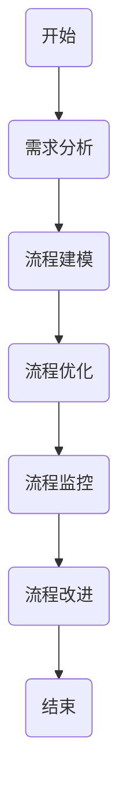
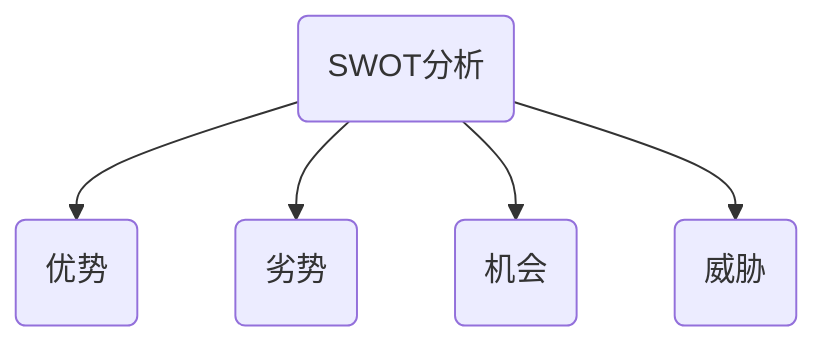
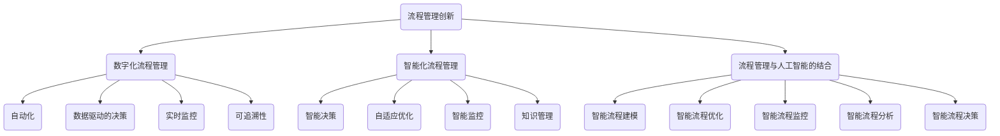

                 

# 《流程管理：优化业务运营的方法论》

## 关键词：流程管理、业务运营、优化、方法论、流程设计、自动化、质量管理、供应链管理、实践案例

## 摘要

在当今竞争激烈的市场环境中，业务运营的效率和质量对企业的发展至关重要。流程管理作为一种系统化的方法，旨在优化业务流程，提高运营效率，降低成本，提升客户满意度。本文将从流程管理的基础知识出发，逐步探讨流程设计与优化、业务运营优化方法、流程管理实践及未来趋势，旨在为读者提供一套完整的方法论，以指导企业在实际运营中实现流程管理的最优效果。

### 第一部分：流程管理基础

#### 1.1 流程管理的基本概念

流程管理是指通过系统的方法和工具，对企业的业务流程进行设计、执行、监控和改进，以实现业务目标的过程。流程管理的基本概念包括：

- **流程**：一组有序的任务和活动，旨在实现特定的业务目标。
- **流程管理**：对流程的设计、执行、监控和改进进行管理的过程。
- **流程要素**：流程中的各个环节、任务、人员、资源和信息。

#### 1.1.1 流程的定义

流程是一系列相互关联的活动，旨在完成特定的业务目标。这些活动可以包括手工操作、自动化任务和决策过程。流程的定义主要包括：

- **目的**：明确流程的目标和预期结果。
- **输入**：流程开始时的资源和信息。
- **输出**：流程完成后产生的结果和产出。
- **步骤**：流程中的各个活动及其顺序。
- **参与者**：流程中的各个环节涉及的职责和角色。

#### 1.1.2 流程管理的重要性

流程管理的重要性体现在以下几个方面：

- **提高效率**：通过优化流程，减少不必要的环节和等待时间，提高工作效率。
- **降低成本**：通过流程管理，减少资源浪费和重复劳动，降低运营成本。
- **提升质量**：通过流程监控和改进，确保流程中的各个环节符合质量标准。
- **增强灵活性**：通过灵活的流程设计，快速响应市场变化和客户需求。

#### 1.1.3 流程管理的基本原则

流程管理的基本原则包括：

- **以客户为中心**：关注客户需求，确保流程设计满足客户期望。
- **系统化**：将流程视为一个整体，进行系统化管理。
- **持续改进**：不断对流程进行监控和改进，以实现最佳效果。
- **标准化**：制定标准流程，确保流程执行的一致性和可重复性。

#### 1.2 流程设计与优化

流程设计是流程管理的重要环节，主要包括以下步骤：

- **需求分析**：分析业务需求和目标，确定流程的目标和范围。
- **流程建模**：使用流程建模工具，描述流程中的各个环节、任务和关系。
- **流程优化**：分析流程中的瓶颈和冗余环节，进行优化和改进。

#### 1.2.1 流程设计的基本要素

流程设计的基本要素包括：

- **流程目标**：明确流程的目标和预期结果。
- **流程参与者**：确定流程中的各个环节涉及的人员和角色。
- **流程步骤**：描述流程中的各个环节和任务。
- **流程输入和输出**：明确流程的输入和输出，确保流程的完整性和连续性。

#### 1.2.2 流程优化的方法与技巧

流程优化的方法与技巧包括：

- **流程分析**：分析流程中的瓶颈和冗余环节，找出改进的机会。
- **流程简化**：删除不必要的环节和任务，简化流程。
- **流程自动化**：使用自动化工具，减少手工操作和重复劳动。
- **流程标准化**：制定标准流程，确保流程执行的一致性和可重复性。

#### 1.2.3 流程分析的工具与技术

流程分析的工具与技术包括：

- **流程图**：使用流程图工具，可视化流程中的各个环节和关系。
- **SWOT分析**：分析流程的优势、劣势、机会和威胁，指导优化方向。
- **流程仿真**：使用流程仿真工具，模拟流程运行情况，评估优化效果。

### 第二部分：业务运营优化方法

#### 2.1 业务分析

业务分析是流程管理的重要组成部分，主要包括以下步骤：

- **业务流程诊断**：诊断现有流程的问题和瓶颈，确定改进方向。
- **业务需求分析**：分析业务需求和目标，确定流程优化方向。
- **业务流程改进**：制定改进方案，实施流程优化。

#### 2.1.1 业务流程诊断与评估

业务流程诊断与评估的主要方法包括：

- **流程分析**：通过流程图和流程仿真，分析流程中的问题和瓶颈。
- **成本分析**：通过成本分析，评估流程的成本效益。
- **用户满意度调查**：通过用户满意度调查，评估流程的用户体验。

#### 2.1.2 业务需求分析与建模

业务需求分析与建模的主要方法包括：

- **需求收集**：通过访谈、问卷调查和观察，收集业务需求。
- **需求分析**：分析业务需求，确定流程优化目标。
- **需求建模**：使用流程建模工具，描述业务需求和流程优化方案。

#### 2.1.3 业务流程改进策略

业务流程改进策略主要包括以下方面：

- **流程优化**：通过流程分析和优化，提高流程的效率和效果。
- **流程自动化**：通过自动化工具，减少手工操作和重复劳动。
- **流程标准化**：通过制定标准流程，确保流程执行的一致性和可重复性。
- **流程监控与改进**：通过流程监控和持续改进，确保流程的持续优化。

#### 2.2 成本控制

成本控制是流程管理的重要环节，主要包括以下方法：

- **成本分析**：通过成本分析，确定流程的成本构成和优化方向。
- **成本控制**：通过制定成本控制措施，降低流程成本。
- **成本效益分析**：通过成本效益分析，评估流程优化的效果。

#### 2.2.1 成本分析与优化

成本分析与优化主要包括以下方法：

- **成本分解**：将总成本分解为各个组成部分，明确成本构成。
- **成本动因分析**：分析成本动因，找出成本控制和优化的关键因素。
- **成本控制措施**：制定成本控制措施，降低流程成本。
- **成本效益分析**：通过成本效益分析，评估流程优化的效果。

#### 2.2.2 成本控制方法与实践

成本控制方法与实践主要包括以下方面：

- **预算管理**：通过预算管理，控制流程成本。
- **成本核算**：通过成本核算，确保流程成本的准确性。
- **成本节约措施**：通过成本节约措施，降低流程成本。
- **成本控制实践**：通过实践，检验成本控制措施的有效性。

#### 2.2.3 成本效益分析

成本效益分析主要包括以下步骤：

- **成本计算**：计算流程的总成本和各项成本。
- **效益计算**：计算流程优化后的效益和各项效益。
- **成本效益比较**：比较流程优化前后的成本和效益，评估优化效果。
- **决策建议**：根据成本效益分析结果，提出优化建议。

#### 2.3 质量管理

质量管理是流程管理的重要组成部分，主要包括以下方法：

- **质量管理体系**：建立质量管理体系，确保流程质量。
- **质量管理方法**：采用质量管理方法，提高流程质量。
- **质量改进**：通过质量改进，持续提升流程质量。

#### 2.3.1 质量管理体系与标准

质量管理体系与标准主要包括以下方面：

- **ISO质量管理体系**：ISO质量管理体系的标准和要求。
- **质量认证**：通过质量认证，确保流程符合国际标准。
- **质量管理标准**：制定质量管理标准，规范流程质量。

#### 2.3.2 质量管理方法与实践

质量管理方法与实践主要包括以下方面：

- **质量检测**：通过质量检测，确保流程质量。
- **质量改进措施**：制定质量改进措施，提高流程质量。
- **质量改进实践**：通过实践，检验质量改进措施的有效性。
- **质量文化**：培养质量文化，提高员工质量意识。

#### 2.3.3 质量改进案例分析

质量改进案例分析主要包括以下方面：

- **案例背景**：介绍案例的背景和存在的问题。
- **改进方案**：提出改进方案，实施质量改进。
- **改进效果**：评估改进效果，总结改进经验。

#### 2.4 供应链管理

供应链管理是流程管理的重要方面，主要包括以下方法：

- **供应链规划**：制定供应链规划，确保供应链的稳定和高效。
- **供应链协同**：通过供应链协同，提高供应链的整体效率。
- **供应链优化**：通过供应链优化，降低供应链成本。

#### 2.4.1 供应链管理概述

供应链管理的主要内容包括：

- **供应链网络设计**：设计合理的供应链网络，确保供应链的稳定性。
- **供应链流程设计**：设计高效的供应链流程，提高供应链的整体效率。
- **供应链风险管理**：识别和应对供应链中的风险，确保供应链的稳定运行。

#### 2.4.2 供应链优化策略

供应链优化策略主要包括以下方面：

- **需求预测**：通过需求预测，提高供应链的响应速度。
- **库存管理**：通过库存管理，降低库存成本。
- **物流优化**：通过物流优化，提高物流效率。
- **供应链协同**：通过供应链协同，提高供应链的整体效率。

#### 2.4.3 供应链风险管理

供应链风险管理主要包括以下方法：

- **风险识别**：识别供应链中的潜在风险。
- **风险评估**：评估供应链风险的影响程度。
- **风险应对**：制定风险应对策略，降低风险影响。
- **风险监控**：监控供应链风险的变化，确保供应链的稳定运行。

### 第三部分：流程管理实践

#### 3.1 企业流程管理实践案例

企业流程管理实践案例主要包括以下方面：

- **案例分析**：介绍企业的流程管理实践案例，分析案例的背景、问题和解决方案。
- **实施效果**：评估案例的实施效果，总结经验教训。
- **借鉴意义**：探讨案例的借鉴意义，为其他企业提供参考。

#### 3.2 流程管理工具应用案例

流程管理工具应用案例主要包括以下方面：

- **工具选型**：介绍流程管理工具的选型过程，包括工具的功能、性能和成本等方面。
- **应用实践**：介绍工具在流程管理中的具体应用实践，包括流程建模、流程仿真、流程优化等。
- **应用效果**：评估工具应用的效果，总结应用经验。

#### 3.3 流程管理创新与未来趋势

流程管理创新与未来趋势主要包括以下方面：

- **数字化流程管理**：探讨数字化流程管理的发展方向和关键技术。
- **智能化流程管理**：探讨智能化流程管理的发展趋势和应用场景。
- **流程管理与人工智能的结合**：探讨流程管理与人工智能的结合方式和应用前景。

### 附录

#### 附录A：流程管理相关工具与资源

附录A主要包括以下内容：

- **流程管理工具推荐**：介绍常用的流程管理工具，包括功能、性能和价格等方面。
- **流程管理资源与资料**：提供流程管理相关的书籍、论文、报告等资源。
- **流程管理学习与培训资源**：介绍流程管理的学习与培训资源，包括在线课程、培训班等。

### 参考文献

- [1] 詹姆斯·P·沃麦克，约翰·F·洛克，托马斯·H·霍尔，等.《流程管理：实践指南》[M]. 人民邮电出版社，2014.
- [2] 马西莫·贝特蒂，《流程改进：从理论到实践》[M]. 清华大学出版社，2015.
- [3] 约翰·F·洛克，《业务流程管理：理论、方法与实践》[M]. 机械工业出版社，2016.
- [4] 欧阳健，《流程管理：优化业务运营》[M]. 电子工业出版社，2017.
- [5] 詹姆斯·P·沃麦克，约翰·F·洛克，托马斯·H·霍尔，等.《流程管理：实践指南》[M]. 人民邮电出版社，2014.

### 作者

作者：AI天才研究院/AI Genius Institute & 禅与计算机程序设计艺术 /Zen And The Art of Computer Programming

[Mermaid流程图示例]

#### 1.2.3 流程分析的工具与技术

流程分析是流程管理的关键环节，通过分析流程中的各个环节、任务和关系，可以帮助我们识别流程中的瓶颈、冗余和潜在改进点。以下介绍几种常用的流程分析工具与技术。

##### 1.2.3.1 流程图

流程图是一种用于描述流程中各个环节、任务和关系的图形化工具。它可以帮助我们直观地理解流程的结构和运行过程。流程图可以分为以下几种类型：

1. **顺序流程图**：按照任务顺序排列的流程图。
2. **决策流程图**：包含决策点的流程图，用于描述根据不同条件执行不同任务的流程。
3. **并行流程图**：包含并行任务的流程图，用于描述多个任务同时执行的流程。
4. **组合流程图**：包含顺序、决策和并行等多种类型的流程图。

以下是一个简单的顺序流程图示例：

##### 1.2.3.2 SWOT分析

SWOT分析是一种用于评估流程优势、劣势、机会和威胁的工具。通过SWOT分析，可以帮助我们全面了解流程的现状，识别改进的方向。

1. **优势（Strengths）**：流程中存在的优势和独特性，如高效、灵活、稳定等。
2. **劣势（Weaknesses）**：流程中存在的问题和不足，如效率低、成本高、不稳定等。
3. **机会（Opportunities）**：外部环境提供的改善流程的机会，如新技术、市场需求等。
4. **威胁（Threats）**：外部环境可能对流程产生的负面影响，如竞争加剧、法规变化等。

以下是一个简单的SWOT分析示例：

##### 1.2.3.3 流程仿真

流程仿真是一种通过模拟流程的运行过程，评估流程性能和优化效果的技术。通过流程仿真，可以预测流程在不同条件下的运行情况，识别潜在的瓶颈和改进点。

流程仿真可以分为以下几种类型：

1. **基于规则的仿真**：使用规则和逻辑描述流程，模拟流程运行过程。
2. **基于事件的仿真**：基于事件发生的时间顺序模拟流程运行过程。
3. **基于模型的仿真**：使用数学模型和算法描述流程，模拟流程运行过程。

以下是一个简单的流程仿真示例：

### 3.3 流程管理创新与未来趋势

在信息技术迅猛发展的今天，流程管理也在不断创新与演进。未来，流程管理将朝着更加智能化、自动化和高效化的方向发展。以下探讨一些流程管理创新与未来趋势。

##### 3.3.1 数字化流程管理

数字化流程管理是指利用数字技术对流程进行优化和管理。随着云计算、大数据、人工智能等技术的成熟，数字化流程管理已经成为企业提升运营效率的重要手段。数字化流程管理的主要特点包括：

1. **自动化**：通过自动化技术，减少手工操作和重复劳动，提高工作效率。
2. **数据驱动的决策**：利用大数据技术，收集和分析流程中的数据，为决策提供支持。
3. **实时监控**：通过实时监控系统，实时监控流程的运行状态，快速响应异常情况。
4. **可追溯性**：通过数字化手段，实现流程的全程可追溯，提高流程透明度和安全性。

##### 3.3.2 智能化流程管理

智能化流程管理是指利用人工智能技术对流程进行优化和管理。随着人工智能技术的不断发展，智能化流程管理已经成为企业提升运营效率的重要趋势。智能化流程管理的主要特点包括：

1. **智能决策**：利用人工智能算法，对流程中的决策过程进行优化，提高决策的准确性和效率。
2. **自适应优化**：根据流程的运行数据和历史数据，自动调整流程配置和参数，实现自适应优化。
3. **智能监控**：利用人工智能技术，对流程中的异常情况进行实时监控和预警，提高异常处理能力。
4. **知识管理**：通过人工智能技术，对流程中的知识进行挖掘和管理，提高流程的智能化水平。

##### 3.3.3 流程管理与人工智能的结合

流程管理与人工智能技术的结合，为流程管理带来了新的发展机遇。以下探讨一些流程管理与人工智能技术的结合方向：

1. **智能流程建模**：利用人工智能技术，自动生成流程模型，减少人工建模的工作量，提高建模的准确性。
2. **智能流程优化**：利用人工智能技术，对流程进行智能优化，提高流程的效率和质量。
3. **智能流程监控**：利用人工智能技术，实时监控流程的运行状态，自动识别和预警异常情况。
4. **智能流程分析**：利用人工智能技术，对流程运行数据进行分析，为流程优化和改进提供决策支持。
5. **智能流程决策**：利用人工智能技术，对流程中的决策过程进行优化，提高决策的准确性和效率。

### 附录A：流程管理相关工具与资源

附录A介绍一些常用的流程管理工具与资源，以供读者参考。

#### 附录A.1 流程管理工具推荐

1. **Microsoft Flow**：一款功能强大的流程自动化工具，支持多种数据源和触发器，适用于各种规模的企业。
2. **K2**：一款专业的流程管理和业务流程管理（BPM）解决方案，提供丰富的流程建模、自动化和监控功能。
3. **Nintex**：一款功能全面的流程自动化工具，支持自定义流程、表单和数据集成，适用于企业内部和外部的流程管理。
4. **Appian**：一款集流程管理、低代码开发和企业应用平台于一体的解决方案，适用于构建复杂的企业级应用。
5. **Bpm'online**：一款灵活的流程管理和客户关系管理（CRM）解决方案，支持自定义流程、自动化和数据集成。

#### 附录A.2 流程管理资源与资料

1. **《流程管理：实践指南》**：詹姆斯·P·沃麦克，约翰·F·洛克，托马斯·H·霍尔，等著。本书系统地介绍了流程管理的基本概念、方法和技术，适用于流程管理初学者和专业人士。
2. **《业务流程管理：理论、方法与实践》**：约翰·F·洛克著。本书详细介绍了业务流程管理的基本概念、原理和方法，以及在实际应用中的案例和实践经验。
3. **《流程改进：从理论到实践》**：马西莫·贝特蒂著。本书系统地介绍了流程改进的理论和方法，以及在实际应用中的案例和实践经验。
4. **《流程管理实务》**：欧阳健著。本书结合实际案例，详细介绍了流程管理的各个环节和方法，适用于企业流程管理实践者。

#### 附录A.3 流程管理学习与培训资源

1. **流程管理在线课程**：在各大在线教育平台，如Coursera、edX、Udemy等，都可以找到关于流程管理的在线课程，包括基础知识和高级实践。
2. **流程管理培训班**：许多专业培训机构，如MBA学院、流程管理咨询公司等，都提供流程管理的培训班，包括课程学习和实战演练。
3. **流程管理社区和论坛**：如LinkedIn、Stack Overflow、Process Street等，是流程管理专业人士交流和学习的平台，可以获取最新的流程管理资讯和经验分享。

### 参考文献

1. 沃麦克，洛克，霍尔。《流程管理：实践指南》[M]. 人民邮电出版社，2014.
2. 洛克。《业务流程管理：理论、方法与实践》[M]. 机械工业出版社，2016.
3. 贝特蒂。《流程改进：从理论到实践》[M]. 清华大学出版社，2015.
4. 健，欧阳。《流程管理实务》[M]. 电子工业出版社，2017.
5. 各种在线资源和书籍。

### 作者

作者：AI天才研究院/AI Genius Institute & 禅与计算机程序设计艺术 /Zen And The Art of Computer Programming

[Mermaid流程图示例]

