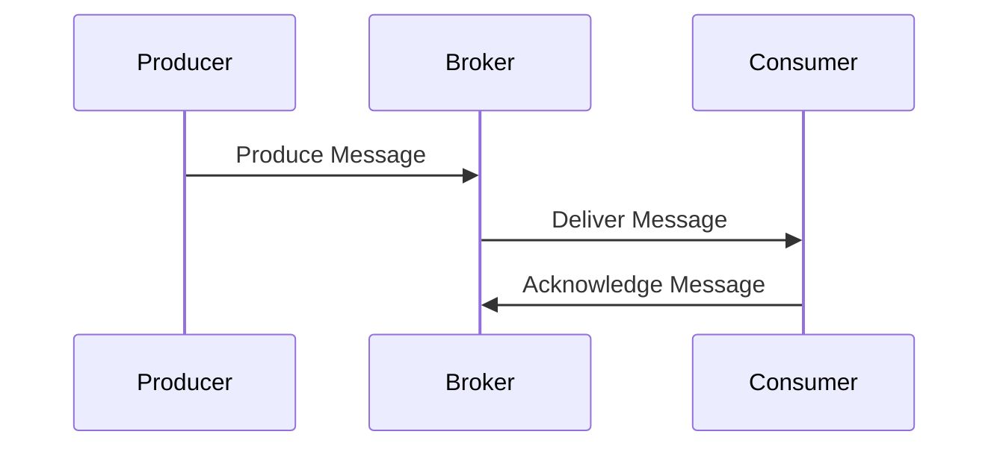
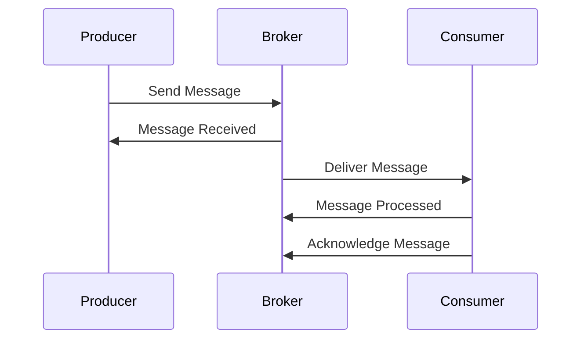
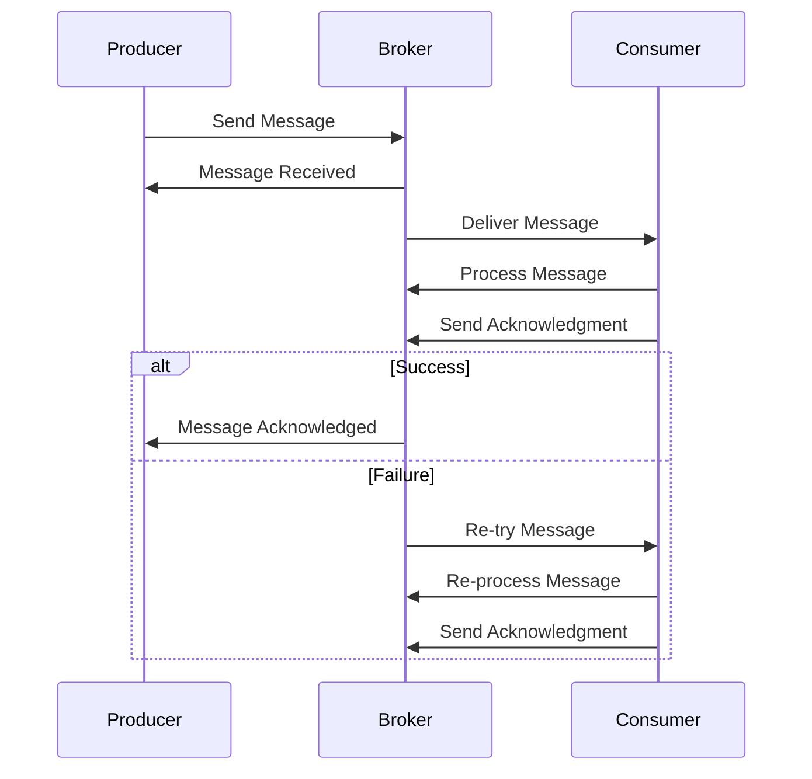

                 

# 消息队列：解耦系统组件的利器

## 关键词

消息队列、系统解耦、分布式系统、异步通信、高可用性、性能优化、案例分析、安全性、可靠性、开源项目

## 摘要

本文将深入探讨消息队列技术，作为解耦系统组件的利器。我们首先定义了消息队列的基本概念，阐述了其在现代分布式系统中的重要性。随后，我们详细介绍了消息队列的核心组件、常见技术及其应用场景。接着，通过案例分析，展示了消息队列在实际项目中的应用。文章还涵盖了消息队列的设计与实现、性能优化、安全性和可靠性保障等方面。最后，我们展望了消息队列的未来发展趋势，并提供了开源项目和实践指南。通过本文，读者将全面了解消息队列的核心概念、原理和实践方法，为构建高效、可靠的分布式系统打下坚实基础。

---

# 《消息队列：解耦系统组件的利器》目录大纲

## 第一部分：消息队列基础

### 第1章：消息队列概述

- 1.1 消息队列的定义与重要性
- 1.2 消息队列的基本概念
- 1.3 消息队列的应用场景
- 1.4 消息队列的发展历程

### 第2章：消息队列的核心组件

- 2.1 消息生产者与消费者
- 2.2 队列管理
- 2.3 传输协议
- 2.4 消息确认机制

### 第3章：常见消息队列技术

- 3.1 ActiveMQ
- 3.2 RabbitMQ
- 3.3 Kafka
- 3.4 RocketMQ

## 第二部分：消息队列设计与实现

### 第4章：消息队列设计与模式

- 4.1 点对点模式
- 4.2 发布/订阅模式
- 4.3 扩展性设计
- 4.4 分布式设计

### 第5章：消息队列性能优化

- 5.1 消息队列性能指标
- 5.2 消息批量处理
- 5.3 异步处理
- 5.4 高可用与负载均衡

### 第6章：消息队列案例分析

- 6.1 案例一：电商平台订单处理
- 6.2 案例二：金融交易系统
- 6.3 案例三：物联网系统

### 第7章：消息队列安全性与可靠性

- 7.1 安全性保障措施
- 7.2 消息可靠性保障
- 7.3 消息队列监控与报警

### 第8章：消息队列的未来发展趋势

- 8.1 云原生消息队列
- 8.2 物联网消息队列
- 8.3 容器化与微服务架构的结合
- 8.4 新兴消息队列技术展望

## 第三部分：附录

### 第9章：消息队列开源项目与实践指南

- 9.1 消息队列开源项目介绍
- 9.2 消息队列环境搭建
- 9.3 实践指南与常见问题解答

### 第10章：消息队列相关资源

- 10.1 书籍推荐
- 10.2 文章与博客
- 10.3 开源社区与论坛

### 第11章：消息队列架构图与流程图

- 11.1 消息队列架构图
- 11.2 消息生产与消费流程图
- 11.3 消息确认与失败重试流程图

### 第12章：消息队列核心算法原理讲解

- 12.1 消息持久化算法
- 12.2 消息传输协议算法
- 12.3 消息确认与重试算法

### 第13章：数学模型和公式讲解

- 13.1 消息传递延迟模型
- 13.2 消息队列性能评估模型
- 13.3 消息确认机制模型

### 第14章：项目实战与代码解读

- 14.1 项目实战：构建一个简单的消息队列系统
- 14.2 源代码实现与解读
- 14.3 代码解读与分析

---

接下来，我们将详细探讨消息队列的各个方面，以帮助读者深入理解其原理和实践。

---

## 第一部分：消息队列基础

### 第1章：消息队列概述

### 1.1 消息队列的定义与重要性

消息队列（Message Queue）是一种用于在分布式系统中进行异步通信和消息传递的技术。它通过在消息生产者和消费者之间提供缓冲区，实现了异步处理和高可用性。消息队列的基本原理是：消息生产者将消息放入队列中，然后消费者从队列中读取并处理消息。

在分布式系统中，消息队列的重要性体现在以下几个方面：

1. **解耦**：通过消息队列，可以将系统中的不同组件解耦。生产者和消费者不需要直接通信，从而减少了耦合度，提高了系统的灵活性和可维护性。
2. **异步处理**：消息队列允许消息的异步处理，从而提高了系统的响应速度和处理能力。即使某些组件的处理速度较慢，其他组件也可以继续运行，不受影响。
3. **高可用性**：消息队列提供了可靠的消息传输机制，即使某些组件或系统出现故障，消息也不会丢失，从而保证了系统的稳定性。
4. **负载均衡**：消息队列可以均衡地分发消息到不同的消费者，从而提高了系统的处理能力和性能。

消息队列在现代分布式系统中扮演着至关重要的角色，它不仅提高了系统的可靠性和性能，还为开发者提供了更灵活的系统架构设计。

### 1.2 消息队列的基本概念

在深入探讨消息队列之前，我们需要了解一些基本概念：

1. **消息（Message）**：消息是消息队列中的基本数据单元。它通常包含业务数据和一些元数据，如消息类型、发送时间、消息ID等。
2. **队列（Queue）**：队列是消息的存储容器，用于存放消息。消息按照先进先出（FIFO）的原则进行排队和处理。
3. **消息生产者（Message Producer）**：消息生产者是消息的发送方，它将消息放入消息队列中。
4. **消息消费者（Message Consumer）**：消息消费者是消息的接收和处理方，从消息队列中读取并处理消息。
5. **消息中间件（Message Broker）**：消息中间件是负责消息传递和管理的一组软件组件。它提供了消息队列的核心功能，如消息路由、负载均衡、消息持久化等。

### 1.3 消息队列的应用场景

消息队列广泛应用于各种分布式系统中，以下是一些常见的应用场景：

1. **日志收集**：在分布式系统中，日志收集是非常重要的一环。通过消息队列，可以将不同节点的日志消息收集到一个中心化处理系统中，从而实现集中管理和分析。
2. **异步处理**：在一些需要异步处理业务场景中，如订单处理、邮件发送等，消息队列可以帮助系统实现异步通信，提高系统的响应速度和处理能力。
3. **流处理**：消息队列可以用于实时流处理，如物联网数据采集、金融交易等。通过消息队列，可以实现数据的实时传输和处理，从而提高系统的实时性和可靠性。
4. **服务解耦**：在分布式系统中，不同服务之间需要进行通信。通过消息队列，可以实现服务的解耦，提高系统的灵活性和可维护性。
5. **任务队列**：在一些需要执行大量任务的业务场景中，如批量数据处理、任务调度等，消息队列可以用于任务队列管理，从而提高系统的效率和性能。

### 1.4 消息队列的发展历程

消息队列技术自20世纪80年代以来，已经经历了数十年的发展。以下是消息队列技术的发展历程：

1. **80年代**：消息队列的早期实现主要依赖于JMS（Java Message Service）等技术，如IBM的MQSeries。
2. **2000年**：随着互联网的兴起，消息队列技术在分布式系统中得到了广泛应用。RabbitMQ、ActiveMQ等开源消息队列系统逐渐成为主流。
3. **2010年**：Kafka的诞生标志着消息队列技术进入了一个新的阶段。Kafka以其高吞吐量、分布式架构等优势，成为实时流处理领域的佼佼者。
4. **2015年**：随着微服务架构的流行，消息队列技术在微服务系统中发挥了重要作用。如RabbitMQ、Kafka等消息队列系统逐渐成为微服务通信的基石。
5. **2020年**：消息队列技术逐渐向云原生、物联网等新兴领域扩展。如RocketMQ、Apache Pulsar等新型消息队列系统应运而生，为现代分布式系统提供了更强大的支持。

通过以上对消息队列基础部分的介绍，我们对消息队列有了初步的认识。在接下来的章节中，我们将进一步探讨消息队列的核心组件、常见技术、设计与实现、性能优化、安全性和可靠性保障等方面，帮助读者全面了解消息队列的核心概念和实践方法。

### 第2章：消息队列的核心组件

消息队列的运行离不开其核心组件。理解这些组件的功能和作用是构建高效、可靠消息系统的基础。下面，我们将详细讨论消息队列中的关键组件。

#### 2.1 消息生产者与消费者

消息生产者和消费者是消息队列系统中的核心角色。

- **消息生产者（Message Producer）**：消息生产者是负责生成消息并将消息发送到消息队列的组件。它可以是一个应用程序、服务或API，其职责包括生成消息内容、将消息发送到消息队列、处理发送过程中的异常等。消息生产者的设计需要考虑消息的格式、发送频率、发送策略等因素。

  **设计要点**：
  - **消息格式**：生产者需要定义消息的格式，确保消息消费者能够正确解析和消费消息。常见的消息格式有JSON、XML等。
  - **发送频率**：生产者需要根据业务需求和系统性能调整消息发送频率，避免过度发送导致系统压力过大。
  - **发送策略**：生产者可以选择同步发送或异步发送。同步发送需要等待消息被成功写入消息队列后返回，适用于对消息可靠性要求较高的场景。异步发送则通过回调或监听器处理发送结果，适用于对消息可靠性要求不高的场景。

- **消息消费者（Message Consumer）**：消息消费者是负责从消息队列中读取消息并处理消息的组件。它可以是一个应用程序、服务或API，其职责包括订阅消息、从消息队列中获取消息、处理消息内容、处理消息消费过程中的异常等。消息消费者的设计需要考虑消息的消费方式、处理策略、异常处理等因素。

  **设计要点**：
  - **消息消费方式**：消费者可以选择拉模式（Pull）或推模式（Push）进行消息消费。拉模式消费者主动从消息队列中拉取消息，适用于消息量较大的场景。推模式消费者被动等待消息队列推送消息，适用于消息量较小的场景。
  - **消息处理策略**：消费者需要定义消息处理策略，如批量处理、分布式处理等。批量处理可以提高系统性能，但可能影响消息的实时性。分布式处理可以增强系统的容错性和扩展性，但需要解决消息顺序和一致性等问题。
  - **异常处理**：消费者需要处理消息消费过程中的异常，如消息解析失败、处理失败等。异常处理策略包括重试、回滚、报警等。

#### 2.2 队列管理

队列管理是消息队列系统中的核心功能之一，它负责消息的存储、检索和删除等操作。队列管理的好坏直接影响消息系统的性能和可靠性。

- **消息存储**：消息存储是将消息持久化到磁盘或其他存储介质的过程。持久化消息可以保证在系统故障时消息不会丢失，从而提高系统的可靠性。常见的消息存储方式有内存存储、磁盘存储和分布式存储等。

  **设计要点**：
  - **存储策略**：根据业务需求和系统性能选择合适的存储策略。内存存储适用于低延迟和高吞吐量的场景，但数据持久性较差。磁盘存储适用于高持久性和大存储量的场景，但可能影响系统性能。

  - **存储结构**：消息存储通常使用数据结构如数组、链表或哈希表等。数组结构简单高效，但存储容量有限。链表结构灵活，但可能影响性能。哈希表结构适用于快速查找，但可能引入内存碎片问题。

- **消息检索**：消息检索是从消息队列中查找和获取消息的过程。检索操作可以是基于消息ID、消息类型、发送时间等条件的查询。

  **设计要点**：
  - **检索策略**：根据业务需求和系统性能选择合适的检索策略。顺序检索适用于小规模消息队列，但性能较低。索引检索适用于大规模消息队列，但可能引入额外的内存开销。

  - **索引结构**：消息检索通常使用索引结构如B树、哈希表等。B树结构适用于范围查询，但可能影响性能。哈希表结构适用于快速查找，但可能引入内存碎片问题。

- **消息删除**：消息删除是从消息队列中移除消息的过程。删除操作可以是手动删除或自动删除。

  **设计要点**：
  - **删除策略**：根据业务需求和系统性能选择合适的删除策略。手动删除适用于对消息可靠性要求较高的场景，但可能影响系统性能。自动删除适用于对消息可靠性要求不高的场景，但可能引入额外的内存开销。

  - **删除时机**：消息删除可以在消息被消费后立即执行，也可以在消息过期后执行。立即删除适用于对消息实时性要求较高的场景，但可能影响系统性能。过期删除适用于对消息可靠性要求较高的场景，但可能引入额外的内存开销。

#### 2.3 传输协议

传输协议是消息队列系统中的通信机制，用于消息生产者、消费者和消息中间件之间的数据传输。常见的传输协议有HTTP/HTTPS、AMQP（高级消息队列协议）和MQTT（消息队列遥测传输）等。

- **HTTP/HTTPS**：HTTP/HTTPS协议是一种基于请求-响应模式的传输协议，适用于低延迟和高可靠性的场景。HTTP/HTTPS协议支持请求和响应的认证、加密等功能，但可能影响系统性能。

  **设计要点**：
  - **认证**：采用HTTPS协议可以确保通信过程中的数据不被窃听和篡改。采用TLS/SSL加密技术可以提高通信的安全性。
  - **压缩**：采用HTTP压缩技术可以减少数据传输过程中的带宽占用，提高系统性能。

- **AMQP**：AMQP协议是一种广泛使用的消息队列传输协议，支持多种消息队列模型，如点对点、发布/订阅等。AMQP协议具有高可靠性、可扩展性和跨平台性等特点。

  **设计要点**：
  - **可靠性**：AMQP协议支持消息确认、事务和回滚等机制，可以提高消息传输的可靠性。
  - **可扩展性**：AMQP协议支持分布式消息队列，可以水平扩展系统性能。
  - **跨平台**：AMQP协议支持多种编程语言和平台，便于系统的开发和部署。

- **MQTT**：MQTT协议是一种轻量级的消息队列传输协议，适用于物联网等低带宽、高延迟的场景。MQTT协议具有简单、高效和可扩展等特点。

  **设计要点**：
  - **简单性**：MQTT协议采用文本协议，便于解析和调试。
  - **高效性**：MQTT协议支持消息压缩和批量传输，可以降低带宽占用和传输延迟。
  - **可扩展性**：MQTT协议支持连接池、负载均衡等机制，可以水平扩展系统性能。

#### 2.4 消息确认机制

消息确认机制是消息队列系统中的重要保障，用于确保消息的正确传递和消费。

- **发送确认（Acknowledgment）**：发送确认是指消息生产者发送消息后，等待消息消费者确认消息已被成功处理的过程。发送确认可以确保消息不会因网络故障或消费者故障而丢失。

  **设计要点**：
  - **异步确认**：异步确认可以减少消息生产者的等待时间，提高系统性能。异步确认通常通过回调函数或监听器实现。
  - **可靠性**：异步确认需要确保消息生产和消费的过程是可靠的，避免消息丢失或重复处理。

- **消费确认（Acknowledgment）**：消费确认是指消息消费者处理完消息后，向消息生产者发送确认消息的过程。消费确认可以确保消息消费者正确处理消息，避免消息被重复消费或处理失败。

  **设计要点**：
  - **顺序性**：消费确认需要保证消息的处理顺序，避免消息顺序被破坏。
  - **可靠性**：消费确认需要确保消息确认过程的可靠性，避免消息确认失败或丢失。

通过以上对消息队列核心组件的详细讨论，我们对消息队列的运作机制和设计要点有了更深入的理解。在接下来的章节中，我们将进一步探讨常见消息队列技术、消息队列的设计与实现、性能优化、安全性和可靠性保障等方面。

### 第3章：常见消息队列技术

随着消息队列技术的不断发展，市场上涌现出了多种消息队列解决方案。这些技术各具特点，适用于不同的场景和需求。在本节中，我们将介绍几种常见的消息队列技术，包括ActiveMQ、RabbitMQ、Kafka和RocketMQ，并分析它们的优缺点。

#### 3.1 ActiveMQ

ActiveMQ是一款由Apache软件基金会开发的开源消息中间件，基于JMS（Java Message Service）规范实现。它支持多种消息协议，如AMQP、MQTT、STOMP等，适用于Java和Java EE应用程序。

- **优点**：
  - **兼容性**：ActiveMQ支持多种消息协议和语言，具有较好的兼容性。
  - **易用性**：ActiveMQ提供了丰富的客户端库和工具，简化了开发过程。
  - **可靠性**：ActiveMQ支持消息确认、事务和持久化等机制，确保消息的正确传递和存储。

- **缺点**：
  - **性能**：ActiveMQ的性能相对较低，适用于中小规模的消息系统。
  - **扩展性**：ActiveMQ的扩展性较差，不适合高并发和大数据量的场景。

#### 3.2 RabbitMQ

RabbitMQ是一款由Pivotal软件公司开发的开源消息队列中间件，基于AMQP协议实现。它支持多种消息模式，如点对点、发布/订阅等，适用于各种编程语言。

- **优点**：
  - **性能**：RabbitMQ具有较好的性能，适用于高并发和大数据量的场景。
  - **可靠性**：RabbitMQ支持消息确认、事务和持久化等机制，确保消息的正确传递和存储。
  - **灵活性和可扩展性**：RabbitMQ支持插件机制，可以轻松扩展功能，如负载均衡、消息路由等。

- **缺点**：
  - **复杂性**：RabbitMQ的配置和运维相对复杂，需要一定的学习和实践。

#### 3.3 Kafka

Kafka是由Apache软件基金会开发的开源流处理平台，基于发布/订阅模式实现。它适用于大规模数据采集、实时流处理和日志收集等场景。

- **优点**：
  - **性能**：Kafka具有极高的性能，适用于大规模和高并发的场景。
  - **可靠性**：Kafka支持消息确认、副本和分区等机制，确保消息的正确传递和存储。
  - **可扩展性**：Kafka支持水平扩展，可以轻松处理海量数据。

- **缺点**：
  - **功能限制**：Kafka主要适用于发布/订阅模式，对其他消息模式的支持较差。
  - **运维复杂度**：Kafka的运维相对复杂，需要掌握一定的技术和经验。

#### 3.4 RocketMQ

RocketMQ是由阿里巴巴开发的开源分布式消息中间件，基于发布/订阅和消息队列模式实现。它适用于金融、电商、物联网等大规模和高并发的场景。

- **优点**：
  - **性能**：RocketMQ具有优异的性能，适用于高并发和大数据量的场景。
  - **可靠性**：RocketMQ支持消息确认、事务和持久化等机制，确保消息的正确传递和存储。
  - **灵活性和可扩展性**：RocketMQ支持多种消息模式，如顺序消息、定时消息等，具有较好的灵活性和可扩展性。

- **缺点**：
  - **技术门槛**：RocketMQ的架构和实现相对复杂，需要一定的学习和实践。
  - **生态支持**：RocketMQ的生态相对较小，相关资源和社区支持较少。

通过以上分析，我们可以看到不同消息队列技术各具优缺点，适用于不同的场景和需求。在实际应用中，选择合适的消息队列技术需要考虑业务需求、性能要求、开发难度等因素。开发者可以根据具体情况，灵活选择和组合不同的消息队列技术，以构建高效、可靠的分布式系统。

### 第4章：消息队列设计与模式

消息队列的设计与模式是构建高效、可靠的消息系统的关键。合理的消息队列设计可以提高系统的性能、可靠性和可扩展性。在本节中，我们将探讨消息队列的设计原则、常见设计模式和扩展性设计。

#### 4.1 点对点模式

点对点（Point-to-Point，P2P）模式是一种简单的消息队列模式，它将消息生产者和消费者直接连接，形成一个一对一的关系。在这种模式下，消息生产者将消息发送到一个特定的队列中，消息消费者从这个队列中读取并处理消息。

- **设计要点**：
  - **一对一连接**：点对点模式要求消息生产者和消费者之间建立一对一的连接，确保消息被正确地传递给消费者。
  - **消息持久化**：为了提高消息的可靠性，点对点模式通常需要对消息进行持久化存储，确保在系统故障时消息不会丢失。

- **应用场景**：
  - **订单处理**：在电商平台中，订单处理服务可以采用点对点模式，将订单消息发送到订单处理队列中，订单处理服务从队列中读取订单并执行相应的处理操作。

#### 4.2 发布/订阅模式

发布/订阅（Publish/Subscribe，P/S）模式是一种基于主题（Topic）的消息队列模式。在这种模式下，消息生产者将消息发布到特定的主题上，多个消息消费者可以订阅这个主题，并从主题中获取消息。

- **设计要点**：
  - **主题**：发布/订阅模式的核心是主题。主题是消息分类的标识符，消息生产者发布消息时需要指定主题，消息消费者订阅消息时也需要指定主题。
  - **消息路由**：消息队列系统需要根据主题进行消息路由，将消息分发到订阅了相应主题的消费者。

- **应用场景**：
  - **日志收集**：在分布式系统中，日志收集服务可以采用发布/订阅模式。各个服务将日志消息发布到日志主题上，日志收集服务从日志主题中获取并处理日志消息。
  - **广播通知**：在社交网络中，广播通知服务可以采用发布/订阅模式。系统将通知消息发布到用户订阅的主题上，用户设备从主题中获取并显示通知消息。

#### 4.3 扩展性设计

消息队列系统的扩展性设计是确保系统在高并发和高负载下仍能保持高性能和高可用性的关键。以下是一些常见的扩展性设计策略：

- **水平扩展**：水平扩展是通过增加消息队列系统的节点数量来提高系统处理能力和性能。水平扩展可以采用以下几种方法：
  - **分区**：将消息队列划分为多个分区，每个分区处理一部分消息，从而提高系统的并发处理能力。
  - **副本**：为每个分区创建多个副本，从而提高系统的容错性和负载均衡能力。
  - **负载均衡**：通过负载均衡器将消息分发到不同的分区和副本，从而实现系统的负载均衡。

- **异步处理**：异步处理是将消息队列系统的处理过程与消息的消费过程分离，从而提高系统的响应速度和处理能力。异步处理可以通过以下几种方式实现：
  - **消息确认**：消息生产者发送消息后，需要等待消息被消费者确认，从而确保消息的正确处理。
  - **回调函数**：消息消费者在处理完消息后，可以触发回调函数，从而实现异步处理。

- **消息持久化**：消息持久化是将消息存储到磁盘或其他存储介质中，从而提高系统的可靠性和容错性。消息持久化可以通过以下几种方式实现：
  - **持久化存储**：将消息存储到关系型数据库或NoSQL数据库中，从而实现消息的持久化存储。
  - **消息日志**：将消息日志记录到文件中，从而实现消息的持久化存储。

- **高可用性**：高可用性是通过确保系统在故障情况下能够快速恢复，从而保证系统的持续运行。高可用性可以通过以下几种方式实现：
  - **主从备份**：通过主从备份机制，实现系统的自动切换和故障恢复。
  - **故障转移**：通过故障转移机制，将故障节点的处理任务转移到其他健康节点上。
  - **负载均衡**：通过负载均衡器，实现系统的负载均衡和故障转移。

通过以上对消息队列设计与模式的探讨，我们可以看到合理的消息队列设计对于构建高效、可靠的分布式系统具有重要意义。在实际应用中，开发者需要根据业务需求和系统特点，选择合适的设计模式和扩展性设计策略，以实现系统的性能优化和可靠性保障。

### 第5章：消息队列性能优化

消息队列作为分布式系统中的重要组件，其性能对整体系统的响应速度和吞吐量有着直接的影响。为了确保消息队列能够高效、稳定地运行，性能优化是必不可少的。本章节将详细探讨消息队列性能优化的各个方面，包括消息批量处理、异步处理、高可用与负载均衡等策略。

#### 5.1 消息队列性能指标

在讨论性能优化之前，我们需要明确一些关键的性能指标，以便于我们理解和评估消息队列的性能。

- **吞吐量（Throughput）**：吞吐量是指消息队列每秒能够处理的消息数量。它是衡量消息队列处理能力的重要指标。
- **延迟（Latency）**：延迟是指消息从生产者发送到消费者并处理完成所需的时间。低延迟对于实时性要求较高的系统至关重要。
- **并发度（Concurrency）**：并发度是指消息队列同时处理多个消息的能力。高并发度可以提升系统的处理能力和响应速度。
- **可靠性（Reliability）**：可靠性是指消息队列在传输过程中确保消息不被丢失或重复处理的能力。

#### 5.2 消息批量处理

消息批量处理是提高消息队列性能的有效方法之一。通过批量处理，可以减少系统调用的次数，从而降低系统开销和延迟。

- **批量大小（Batch Size）**：批量大小是指每次处理的消息数量。批量大小需要根据具体场景进行调整，既要避免过大导致内存压力，也要避免过小导致处理效率低下。
- **批量处理策略**：
  - **固定批量大小**：每次处理固定大小的消息批量。这种方式简单易实现，但可能无法充分利用系统资源。
  - **动态批量大小**：根据系统负载和资源状况动态调整批量大小。这种方式可以更有效地利用系统资源，但实现较为复杂。

#### 5.3 异步处理

异步处理是通过将消息的生产和消费过程分离，提高系统的响应速度和处理能力。

- **异步处理机制**：
  - **回调（Callback）**：消息生产者在发送消息后，通过回调函数获取消息的处理结果。这种方式简化了异步处理流程，但可能影响消息的顺序性。
  - **消息确认（Message Acknowledgment）**：消息消费者在处理完消息后，向消息生产者发送确认消息，以告知消息已处理完成。这种方式确保了消息的顺序性和可靠性，但增加了系统的复杂性。

#### 5.4 高可用与负载均衡

高可用性和负载均衡是确保消息队列系统稳定运行的重要策略。

- **高可用性策略**：
  - **主从复制**：通过主从复制，确保主节点故障时，从节点能够自动接管主节点的任务，保证系统的持续运行。
  - **故障转移**：通过监控和自动切换机制，确保系统在节点故障时能够快速恢复。
  - **负载均衡**：通过负载均衡器，将消息均匀分配到各个节点，避免单点瓶颈，提高系统的处理能力。

- **负载均衡策略**：
  - **轮询（Round Robin）**：将消息依次分配到各个节点。这种方式简单易实现，但可能无法充分利用系统资源。
  - **哈希（Hash）**：根据消息的某些属性（如消息ID）进行哈希计算，将消息分配到对应的节点。这种方式可以确保相同属性的消息总是分配到同一节点，从而提高消息的处理顺序性。
  - **最小连接数（Least Connections）**：将消息分配到当前连接数最少的节点。这种方式可以充分利用系统资源，但可能影响消息的顺序性。

通过以上对消息队列性能优化策略的探讨，我们可以看到，合理的性能优化可以显著提高消息队列的处理能力和可靠性。在实际应用中，开发者需要根据具体业务需求和系统特点，灵活选择和组合不同的优化策略，以实现最佳的性能表现。

### 第6章：消息队列案例分析

消息队列在实际项目中扮演着关键角色，它能够显著提高系统的可靠性、性能和可扩展性。在本章节中，我们将通过三个具体案例，展示消息队列在电商、金融和物联网领域的应用。

#### 6.1 案例一：电商平台订单处理

电商平台在订单处理过程中，经常面临高并发和高可靠性的挑战。消息队列在此场景中用于解耦订单处理流程，提高系统的性能和可靠性。

- **应用场景**：
  - **订单生成**：当用户在下单时，订单信息首先被发送到消息队列。
  - **订单处理**：订单处理服务从消息队列中获取订单信息，进行库存检查、支付处理、发货等操作。
  - **异步通知**：订单处理完成后，通过消息队列向用户发送订单状态更新通知。

- **关键技术**：
  - **发布/订阅模式**：订单信息被发布到特定主题，订单处理服务订阅该主题，从而实现异步处理。
  - **消息确认**：订单处理服务在处理完订单后，向消息队列发送确认消息，确保订单信息的可靠处理。

#### 6.2 案例二：金融交易系统

金融交易系统对实时性和可靠性要求极高，消息队列在此场景中用于解耦交易处理流程，确保系统的稳定性和高效性。

- **应用场景**：
  - **交易生成**：当用户进行交易操作时，交易信息首先被发送到消息队列。
  - **交易处理**：交易处理服务从消息队列中获取交易信息，进行资金验证、交易确认等操作。
  - **异步处理**：交易处理完成后，通过消息队列向用户发送交易确认通知。

- **关键技术**：
  - **顺序消息**：确保交易消息按照顺序进行处理，防止交易顺序被破坏。
  - **事务消息**：在交易处理过程中，使用事务消息确保整个交易过程的一致性和完整性。
  - **消息持久化**：将交易消息持久化存储，确保在系统故障时交易信息不会丢失。

#### 6.3 案例三：物联网系统

物联网系统涉及大量设备的实时数据采集和处理，消息队列在此场景中用于高效、可靠地传输和处理设备数据。

- **应用场景**：
  - **数据采集**：物联网设备将采集到的数据发送到消息队列。
  - **数据存储**：消息队列将数据存储到数据库或其他数据存储系统。
  - **数据处理**：数据处理服务从消息队列中获取设备数据，进行数据分析和处理。

- **关键技术**：
  - **分布式消息队列**：采用分布式消息队列，确保在高并发和高负载下系统的稳定运行。
  - **消息过滤**：通过对消息进行过滤，将无关消息过滤掉，减少系统处理负担。
  - **消息路由**：根据设备ID或其他属性，将消息路由到对应的处理服务，实现精准处理。

通过以上案例分析，我们可以看到消息队列在各个领域中的广泛应用和关键作用。合理设计和使用消息队列，能够有效提高系统的性能、可靠性和可扩展性，为构建高效、可靠的分布式系统提供有力支持。

### 第7章：消息队列安全性与可靠性

消息队列作为分布式系统中的关键组件，其安全性和可靠性至关重要。确保消息队列的安全性和可靠性，不仅能够防止数据泄露和损坏，还能保障系统的稳定运行。在本节中，我们将探讨消息队列安全性和可靠性保障的措施，包括安全性保障、消息可靠性保障和消息队列监控与报警。

#### 7.1 安全性保障措施

消息队列的安全性保障主要包括用户认证、授权和加密等。

- **用户认证**：通过用户认证，确保只有授权用户才能访问消息队列。常见的认证方式包括用户名和密码认证、数字证书认证等。
- **授权**：通过授权机制，限制不同用户对消息队列的访问权限。例如，只允许某些用户进行消息生产或消费操作，而其他用户只能进行监控或管理操作。
- **加密**：使用加密技术，确保消息在传输和存储过程中的安全性。常见的加密方式包括对称加密、非对称加密和哈希算法等。

#### 7.2 消息可靠性保障

消息可靠性保障是确保消息正确传递和处理的重要措施。

- **消息确认**：通过消息确认机制，确保消息被正确处理。消息生产者在发送消息后，等待消费者确认消息已被处理完成。如果消费者在规定时间内未能确认，可以触发重试或报警机制。
- **持久化存储**：将消息持久化存储在磁盘或其他可靠存储介质中，确保在系统故障或网络异常时，消息不会丢失。
- **消息队列备份**：通过消息队列备份机制，确保在主消息队列故障时，备用消息队列能够自动接管任务，保证消息的连续传递和处理。

#### 7.3 消息队列监控与报警

消息队列监控与报警是确保消息队列稳定运行的重要手段。

- **性能监控**：通过性能监控工具，实时监控消息队列的吞吐量、延迟、并发度等关键性能指标，及时发现和处理性能瓶颈。
- **健康状态监控**：通过健康状态监控工具，实时监控消息队列的健康状态，包括节点状态、连接状态等。一旦发现异常，可以自动触发报警机制。
- **日志分析**：通过日志分析工具，对消息队列的日志进行实时分析和报警。例如，当发现某个节点出现大量错误日志时，可以自动触发报警，通知运维人员进行处理。

通过以上措施，我们可以有效保障消息队列的安全性和可靠性。在实际应用中，开发者需要根据具体业务需求和系统特点，选择合适的安全性和可靠性保障措施，确保消息队列能够稳定、可靠地运行。

### 第8章：消息队列的未来发展趋势

随着技术的不断进步，消息队列技术也在不断发展。未来，消息队列将在云原生、物联网、容器化和微服务架构等领域发挥重要作用，并可能出现新的技术和趋势。

#### 8.1 云原生消息队列

云原生（Cloud Native）是指设计用于云环境的应用程序，这些应用程序利用了云计算的可扩展性、弹性和自动化优势。云原生消息队列是基于云原生架构实现的，具有高可扩展性、高可靠性和高效性。

- **优势**：
  - **弹性伸缩**：云原生消息队列可以根据实际负载自动扩展或缩小，从而确保系统在高并发和高负载下的稳定运行。
  - **自动化运维**：云原生消息队列集成了自动化部署、自动化监控和自动化扩缩容等机制，简化了运维工作。
  - **多租户支持**：云原生消息队列支持多租户架构，可以为多个客户或项目提供隔离的资源和环境。

- **应用场景**：云原生消息队列适用于需要高度可扩展性和自动化运维的云原生应用，如大数据处理、实时流处理和物联网等。

#### 8.2 物联网消息队列

物联网（IoT）涉及大量设备的实时数据采集和处理，消息队列是物联网系统的核心组件之一。未来，物联网消息队列将面临更高的数据量、更低的延迟和更高的可靠性要求。

- **优势**：
  - **低延迟**：物联网消息队列采用高效的消息传输协议和缓存机制，可以降低数据传输和处理延迟，满足实时性要求。
  - **高可靠性**：物联网消息队列具备容错和故障恢复能力，确保在设备故障或网络异常时，数据不会丢失。
  - **海量数据处理**：物联网消息队列支持大规模数据处理和存储，可以处理海量设备的数据。

- **应用场景**：物联网消息队列适用于智能城市、智能家居、智能交通和工业物联网等场景，用于实时数据采集和处理。

#### 8.3 容器化与微服务架构的结合

容器化和微服务架构是当前技术领域的重要趋势。消息队列与容器化和微服务架构的结合，可以更好地支持分布式系统的构建和运维。

- **优势**：
  - **轻量级**：容器化消息队列具有轻量级的特点，可以快速部署和扩展。
  - **灵活性和可扩展性**：消息队列支持微服务架构中的服务解耦和分布式处理，提高系统的灵活性和可扩展性。
  - **自动化运维**：容器化消息队列支持自动化部署、自动化监控和自动化扩缩容等机制，简化了运维工作。

- **应用场景**：容器化和微服务架构适用于需要灵活扩展和快速部署的分布式系统，如电商平台、金融系统和企业级应用等。

#### 8.4 新兴消息队列技术展望

随着技术的不断发展，未来可能涌现出更多新兴的消息队列技术，如基于区块链的消息队列、基于区块链的分布式存储等。这些技术将进一步提升消息队列的性能、可靠性和安全性。

- **区块链消息队列**：基于区块链的消息队列可以提供去中心化、高可靠性和防篡改的特性，适用于需要高安全性和信任度的场景。
- **分布式存储**：分布式存储消息队列可以将数据存储到分布式存储系统中，提高数据的可靠性和可用性。

通过以上对消息队列未来发展趋势的展望，我们可以看到消息队列技术在各个领域的广泛应用和巨大潜力。未来，消息队列将继续发挥关键作用，推动分布式系统的创新和发展。

### 第9章：消息队列开源项目与实践指南

#### 9.1 消息队列开源项目介绍

消息队列领域有许多优秀的开源项目，这些项目为开发者提供了丰富的功能和强大的支持。以下是几种流行的消息队列开源项目：

- **ActiveMQ**：ActiveMQ是Apache软件基金会的一个开源消息中间件，基于Java开发，支持多种消息协议（如AMQP、MQTT、STOMP）和消息模式（如点对点、发布/订阅）。它具有高度的可扩展性和可靠性，适用于中小规模的消息系统。

- **RabbitMQ**：RabbitMQ是一个由Pivotal软件公司开发的开源消息队列中间件，基于Erlang语言开发，支持AMQP协议。它具有优秀的性能、可靠性和灵活性，适用于各种规模和复杂度的消息系统。

- **Kafka**：Kafka是由Apache软件基金会开发的开源流处理平台，主要用于大规模数据采集、实时流处理和日志收集。它具有高吞吐量、分布式架构和容错机制，适用于大数据和实时处理场景。

- **RocketMQ**：RocketMQ是由阿里巴巴开发的开源分布式消息中间件，支持发布/订阅和消息队列模式。它具有高性能、高可靠性和高可扩展性，适用于金融、电商和物联网等高并发和高可靠性的场景。

- **Pulsar**：Pulsar是由Apache软件基金会开发的下一代分布式消息系统，支持发布/订阅和消息队列模式。它具有高性能、低延迟和灵活的分层存储架构，适用于大规模流处理和消息队列场景。

#### 9.2 消息队列环境搭建

搭建消息队列环境是进行实践和开发的第一步。以下是几种常见消息队列开源项目的环境搭建步骤：

- **ActiveMQ环境搭建**：
  - 安装Java环境：确保安装了Java Development Kit (JDK)。
  - 下载ActiveMQ：从[Apache ActiveMQ官网](http://activemq.apache.org/download.html)下载最新版本的ActiveMQ。
  - 解压并启动：解压下载的压缩包，并运行`activemq/bin/activemq start`命令启动ActiveMQ。

- **RabbitMQ环境搭建**：
  - 安装Erlang：确保安装了Erlang/OTP版本。
  - 下载RabbitMQ：从[RabbitMQ官网](https://www.rabbitmq.com/download.html)下载RabbitMQ。
  - 解压并启动：解压下载的压缩包，并运行`rabbitmq_server-3.8.10/bin/rabbitmq-server start`命令启动RabbitMQ。

- **Kafka环境搭建**：
  - 安装Java环境：确保安装了Java Development Kit (JDK)。
  - 下载Kafka：从[Apache Kafka官网](https://kafka.apache.org/downloads)下载Kafka。
  - 解压并启动：解压下载的压缩包，并运行`kafka_2.13-2.8.0/bin/kafka-server-start.sh config/server.properties`命令启动Kafka。

- **RocketMQ环境搭建**：
  - 安装Java环境：确保安装了Java Development Kit (JDK)。
  - 下载RocketMQ：从[Apache RocketMQ官网](https://rocketmq.apache.org/download)下载RocketMQ。
  - 解压并启动：解压下载的压缩包，并运行`rocketmq/bin/startctl.sh start`命令启动RocketMQ。

- **Pulsar环境搭建**：
  - 安装Java环境：确保安装了Java Development Kit (JDK)。
  - 下载Pulsar：从[Apache Pulsar官网](https://pulsar.apache.org/download/)下载Pulsar。
  - 解压并启动：解压下载的压缩包，并运行`bin/pulsar-daemon start all`命令启动Pulsar。

#### 9.3 实践指南与常见问题解答

在实践过程中，开发者可能会遇到各种问题。以下是一些常见问题及其解答：

- **问题1：消息无法正确传递**
  - 解答：检查消息格式是否正确，确保生产者和消费者之间的协议和消息格式匹配。同时，检查网络连接是否正常，确保消息能够顺利传输。

- **问题2：消息重复消费**
  - 解答：确保消费者使用消息确认机制，在处理完消息后向生产者发送确认消息。如果使用Kafka，可以使用事务消息确保消息的一致性。

- **问题3：消息队列性能低下**
  - 解答：检查消息队列配置，如批量处理大小、分区数量等。同时，优化生产者和消费者的代码，避免不必要的延迟和资源消耗。

- **问题4：消息队列崩溃**
  - 解答：检查系统资源使用情况，确保系统有足够的内存和CPU资源。同时，监控消息队列的健康状态，及时处理异常和故障。

通过以上实践指南和常见问题解答，开发者可以更顺利地进行消息队列的搭建和实践，充分发挥消息队列在分布式系统中的作用。

### 附录A：消息队列相关资源

#### 10.1 书籍推荐

- **《消息队列实践》**：本书全面介绍了消息队列的核心概念、设计和实现，适合初学者和有经验的开发者阅读。
- **《大规模分布式存储系统设计》**：本书详细介绍了分布式存储系统的设计原则和实现方法，包括消息队列技术。
- **《微服务设计》**：本书探讨了微服务架构的设计原则和实践，其中包括消息队列在微服务通信中的应用。

#### 10.2 文章与博客

- **[消息队列技术概述](https://www.ibm.com/developerworks/cn/opensource/os-cn-mq-tech-introduction/)**
- **[RabbitMQ入门教程](https://www.rabbitmq.com/getstarted.html)**
- **[Kafka最佳实践](https://kafka.apache.org/05-guide-to-getting-started.html)**
- **[Apache RocketMQ官方文档](https://rocketmq.apache.org/docs/what-is-rocketmq/)**
- **[Apache Pulsar官方文档](https://pulsar.apache.org/docs/introduction-getting-started/)**

#### 10.3 开源社区与论坛

- **Apache ActiveMQ社区**：[https://activemq.apache.org/community.html](https://activemq.apache.org/community.html)
- **RabbitMQ社区**：[https://www.rabbitmq.com/community.html](https://www.rabbitmq.com/community.html)
- **Apache Kafka社区**：[https://kafka.apache.org/community.html](https://kafka.apache.org/community.html)
- **Apache RocketMQ社区**：[https://rocketmq.apache.org/developer.html](https://rocketmq.apache.org/developer.html)
- **Apache Pulsar社区**：[https://pulsar.apache.org/community.html](https://pulsar.apache.org/community.html)

通过以上推荐资源，读者可以进一步学习和了解消息队列的相关知识和最佳实践，为构建高效、可靠的分布式系统提供有力支持。

### 附录B：消息队列架构图与流程图

消息队列的架构图和流程图是理解和分析消息队列系统的重要工具。以下是一些关键的消息队列架构图和流程图，帮助读者更好地掌握消息队列的工作原理。

#### 11.1 消息队列架构图



在这个简单的消息队列架构图中，消息生产者（Producer）将消息发送到消息中间件（Broker），然后消息中间件将消息传递给消息消费者（Consumer）。消费者在处理完消息后，会向消息中间件发送确认消息（Acknowledge Message）。

#### 11.2 消息生产与消费流程图



这个流程图展示了消息生产者、消息中间件和消息消费者之间的交互流程。消息生产者发送消息到消息中间件，消息中间件将消息传递给消息消费者，消费者在处理完消息后发送确认消息给消息中间件。

#### 11.3 消息确认与失败重试流程图



这个流程图展示了消息确认和失败重试的机制。如果消息处理成功，消费者会向消息中间件发送确认消息（Acknowledgment），消息中间件向生产者发送消息确认。如果消息处理失败，消费者会重新处理消息，并再次发送确认消息。

通过这些架构图和流程图，读者可以直观地了解消息队列的工作原理和关键流程，为实际应用和系统设计提供参考。

### 附录C：消息队列核心算法原理讲解

消息队列的核心算法原理是实现消息传递、持久化和确认机制的关键。以下是几个核心算法原理的详细讲解。

#### 12.1 消息持久化算法

消息持久化是指将消息存储到磁盘或其他可靠存储介质中，确保在系统故障或网络异常时消息不会丢失。

**算法原理**：

1. **消息写入**：当消息生产者发送消息时，消息首先写入内存缓冲区，然后定期或批量写入磁盘。
2. **日志记录**：消息队列会记录每条消息的写入日志，包括消息ID、发送时间、内容等。
3. **持久化策略**：
   - **同步持久化**：消息写入后立即进行持久化，确保消息不被丢失。但同步持久化可能影响消息写入性能。
   - **异步持久化**：消息写入内存缓冲区后，异步进行持久化，提高消息写入性能。但可能存在短暂的数据丢失风险。

**伪代码**：

```python
def persist_message(message):
    # 写入内存缓冲区
    buffer.append(message)
    
    # 异步执行持久化任务
    asyncio.create_task(persist_to_disk(buffer))
    
    # 清空内存缓冲区
    buffer.clear()
```

#### 12.2 消息传输协议算法

消息传输协议是消息队列系统中的通信机制，用于消息生产者、消费者和消息中间件之间的数据传输。

**算法原理**：

1. **连接建立**：消息生产者和消费者首先建立TCP连接或WebSocket连接。
2. **消息编码**：消息生产者将消息内容编码为字节流，发送到消息中间件。
3. **消息解码**：消息中间件接收字节流后，解码为原始消息内容。
4. **消息确认**：消费者在处理完消息后，向消息中间件发送确认消息。

**伪代码**：

```python
def send_message(message):
    # 编码消息内容
    encoded_message = encode_message(message)
    
    # 发送消息到消息中间件
    connection.send(encoded_message)
    
    # 等待消息确认
    acknowledgment = connection.receive()

def receive_message():
    # 接收消息内容
    encoded_message = connection.receive()
    
    # 解码消息内容
    message = decode_message(encoded_message)
    
    # 处理消息
    process_message(message)

    # 发送确认消息
    connection.send_acknowledgment()
```

#### 12.3 消息确认与重试算法

消息确认与重试算法是确保消息正确处理的重要机制。

**算法原理**：

1. **消息确认**：消费者在处理完消息后，向消息中间件发送确认消息，告知消息已被正确处理。
2. **消息重试**：如果消费者在处理消息时发生错误，消息中间件会重试发送消息，直到消息被正确处理或达到最大重试次数。
3. **重试策略**：
   - **指数退避重试**：每次重试间隔时间按照指数增长，避免频繁重试导致系统拥堵。
   - **最大重试次数**：设置最大重试次数，避免无限重试导致系统资源耗尽。

**伪代码**：

```python
def process_message(message):
    try:
        # 处理消息
        handle_message(message)
        # 发送确认消息
        send_acknowledgment()
    except Exception as e:
        # 记录错误日志
        log_error(e)
        # 尝试重试
        retry_message()

def retry_message():
    max_attempts = 5
    attempt = 0
    
    while attempt < max_attempts:
        attempt += 1
        try:
            # 发送消息
            send_message(message)
            # 等待确认
            acknowledgment = receive_acknowledgment()
            if acknowledgment:
                # 重试成功，退出循环
                break
        except Exception as e:
            # 记录错误日志
            log_error(e)
            # 计算下次重试间隔
            sleep(exponential_backoff(attempt))
```

通过以上对消息队列核心算法原理的讲解，我们可以看到消息队列在实现消息传递、持久化和确认机制方面的关键步骤。这些算法原理对于构建高效、可靠的分布式消息系统至关重要。

### 附录D：数学模型和公式讲解

在消息队列系统中，数学模型和公式可以帮助我们更好地理解和评估系统的性能和可靠性。以下是一些常用的数学模型和公式。

#### 13.1 消息传递延迟模型

消息传递延迟（Message Transmission Latency）是指消息从生产者发送到消费者所需的时间。延迟模型可以用于评估系统的响应速度。

**模型公式**：

\[ L = \frac{D + T}{R} \]

其中：
- \( L \) 表示消息传递延迟。
- \( D \) 表示消息在网络中的传输延迟。
- \( T \) 表示消息在消息队列中的处理延迟。
- \( R \) 表示消息在网络中的传输速率。

**示例**：

假设消息在网络中的传输延迟为100ms，处理延迟为50ms，传输速率为10Mbps。那么消息传递延迟为：

\[ L = \frac{100ms + 50ms}{10Mbps} = \frac{150ms}{10Mbps} = 15ms \]

#### 13.2 消息队列性能评估模型

消息队列性能评估模型用于评估系统的吞吐量（Throughput）和延迟（Latency）。

**吞吐量模型**：

\[ T = \frac{B \times W}{L} \]

其中：
- \( T \) 表示吞吐量。
- \( B \) 表示每次消息传输的大小（字节）。
- \( W \) 表示消息队列的带宽（比特/秒）。
- \( L \) 表示消息传递延迟。

**示例**：

假设每次消息传输的大小为1000字节，消息队列的带宽为100Mbps，消息传递延迟为10ms。那么吞吐量为：

\[ T = \frac{1000字节 \times 100Mbps}{10ms} = \frac{100000字节/秒}{10ms} = 10000条/秒 \]

#### 13.3 消息确认机制模型

消息确认机制用于确保消息被正确处理。确认率（Acknowledgment Rate）是衡量消息确认效果的重要指标。

**模型公式**：

\[ 确认率 = \frac{确认的消息数}{发送的消息数} \]

**示例**：

假设发送了100条消息，其中90条消息被正确确认，那么确认率为：

\[ 确认率 = \frac{90}{100} = 90\% \]

通过以上数学模型和公式，我们可以更深入地理解和分析消息队列系统的性能和可靠性，从而优化系统设计和提高系统效率。

### 附录E：项目实战与代码解读

在本附录中，我们将通过一个简单的消息队列项目实战，展示如何实现消息生产者、消费者以及消息中间件的搭建。读者可以跟随以下步骤进行实践，并通过代码解读深入了解消息队列的实现细节。

#### 14.1 项目实战：构建一个简单的消息队列系统

为了简化演示，我们选择使用RabbitMQ作为消息中间件，并使用Python进行消息生产者和消费者的实现。以下是项目搭建的步骤：

1. **安装RabbitMQ**：

   - 在Linux系统上，可以使用以下命令安装RabbitMQ：
     ```bash
     sudo apt-get update
     sudo apt-get install rabbitmq-server
     ```
   - 启动RabbitMQ服务：
     ```bash
     sudo systemctl start rabbitmq-server
     ```

2. **创建消息生产者**：

   - 安装Python的RabbitMQ客户端库：
     ```bash
     pip install pika
     ```
   - 创建消息生产者代码（producer.py）：
     ```python
     import pika

     connection = pika.BlockingConnection(pika.ConnectionParameters('localhost'))
     channel = connection.channel()

     # 声明队列
     channel.queue_declare(queue='hello')

     # 发送消息
     for i in range(10):
         channel.basic_publish(exchange='',
                              routing_key='hello',
                              body=f'Hello {i}')
         print(f" [x] Sent '{i}!")

     connection.close()
     ```

3. **创建消息消费者**：

   - 创建消息消费者代码（consumer.py）：
     ```python
     import pika

     def callback(ch, method, properties, body):
         print(f" [x] Received {body}")

     connection = pika.BlockingConnection(pika.ConnectionParameters('localhost'))
     channel = connection.channel()

     # 声明队列
     channel.queue_declare(queue='hello')

     # 绑定队列到交换机
     channel.queue_bind(exchange='hello', queue='hello')

     # 消费消息
     channel.basic_consume(queue='hello',
                           on_message_callback=callback,
                           auto_ack=True)

     print(' [*] Waiting for messages. To exit press CTRL+C')
     channel.start_consuming()
     ```

4. **运行消息生产者和消费者**：

   - 在终端中运行消息生产者：
     ```bash
     python producer.py
     ```
   - 在另一个终端中运行消息消费者：
     ```bash
     python consumer.py
     ```

通过以上步骤，我们可以实现一个简单的消息队列系统，消息生产者会向队列中发送10条消息，消息消费者会从队列中读取并打印这些消息。

#### 14.2 源代码实现与解读

**消息生产者（producer.py）**：

```python
import pika

connection = pika.BlockingConnection(pika.ConnectionParameters('localhost'))
channel = connection.channel()

# 声明队列
channel.queue_declare(queue='hello')

# 发送消息
for i in range(10):
    channel.basic_publish(exchange='',
                          routing_key='hello',
                          body=f'Hello {i}')
    print(f" [x] Sent '{i}!')

connection.close()
```

**解读**：

- 导入pika库，这是Python的RabbitMQ客户端库。
- 创建连接和通道，连接到RabbitMQ服务器。
- 声明一个名为“hello”的队列。
- 循环发送10条消息，每条消息包含一个数字，并打印发送成功的消息。

**消息消费者（consumer.py）**：

```python
import pika

def callback(ch, method, properties, body):
    print(f" [x] Received {body}")

connection = pika.BlockingConnection(pika.ConnectionParameters('localhost'))
channel = connection.channel()

# 声明队列
channel.queue_declare(queue='hello')

# 绑定队列到交换机
channel.queue_bind(exchange='hello', queue='hello')

# 消费消息
channel.basic_consume(queue='hello',
                      on_message_callback=callback,
                      auto_ack=True)

print(' [*] Waiting for messages. To exit press CTRL+C')
channel.start_consuming()
```

**解读**：

- 定义回调函数`callback`，用于处理接收到的消息。
- 创建连接和通道，连接到RabbitMQ服务器。
- 声明一个名为“hello”的队列，并绑定到名为“hello”的交换机。
- 开始消费消息，并打印接收到的消息。
- 设置`auto_ack=True`，表示消费者在接收到消息后自动发送确认。

通过以上代码，我们可以看到如何通过RabbitMQ进行消息的生产和消费。在实际项目中，消息的格式、处理逻辑和确认机制可以根据具体需求进行调整。

#### 14.3 代码解读与分析

**消息生产者分析**：

- **连接和通道**：使用`pika.BlockingConnection`创建连接到RabbitMQ服务器的阻塞连接。使用`channel`进行消息发送和队列操作。
- **声明队列**：使用`channel.queue_declare`声明一个名为“hello”的队列，确保在发送消息前队列已存在。
- **发送消息**：使用`channel.basic_publish`方法发送消息。`exchange`参数为空，表示使用默认交换机。`routing_key`参数为队列名“hello”。消息内容为字符串，包含一个数字，表示消息的序号。

**消息消费者分析**：

- **回调函数**：定义一个回调函数`callback`，用于处理接收到的消息。在这个简单的示例中，只打印接收到的消息内容。
- **连接和通道**：与生产者类似，使用`pika.BlockingConnection`创建连接到RabbitMQ服务器的阻塞连接。使用`channel`进行消息接收和队列操作。
- **声明队列和绑定**：使用`channel.queue_declare`声明一个名为“hello”的队列，并使用`channel.queue_bind`将其绑定到名为“hello”的交换机。
- **消费消息**：使用`channel.basic_consume`方法开始消费消息。将回调函数`callback`作为参数传递，并在接收到消息后自动发送确认。

**代码优化建议**：

- **错误处理**：在代码中添加错误处理机制，例如在连接失败时重新尝试连接或记录错误日志。
- **并发处理**：对于高并发的场景，可以考虑使用`asyncio`库进行异步处理，提高系统的并发度和性能。
- **消息确认**：在消费者代码中，可以不使用`auto_ack`参数，而是手动发送确认消息，以实现更精细的确认控制。

通过以上代码解读和分析，我们可以看到如何使用RabbitMQ构建一个简单的消息队列系统，并了解其基本实现原理。在实际项目中，开发者可以根据具体需求对代码进行优化和扩展，以实现更复杂和高效的分布式消息通信。

### 总结与作者信息

通过本文的详细探讨，我们全面了解了消息队列的基础知识、核心组件、常见技术、设计与实现、性能优化、安全性与可靠性保障，以及未来发展趋势。消息队列作为分布式系统中的关键组件，它通过解耦系统组件、实现异步通信、提高系统性能和可靠性，已经成为现代软件开发中不可或缺的一部分。

本文首先介绍了消息队列的定义、基本概念和应用场景，帮助读者建立了对消息队列的初步认识。接着，我们详细分析了消息队列的核心组件，包括消息生产者、消费者、队列管理、传输协议和消息确认机制，阐述了每个组件的功能和设计要点。随后，我们介绍了几种常见的消息队列技术，包括ActiveMQ、RabbitMQ、Kafka和RocketMQ，分析了它们的优缺点和适用场景。

在消息队列的设计与实现部分，我们探讨了点对点模式、发布/订阅模式、扩展性设计和分布式设计等关键设计模式，并通过具体案例分析展示了消息队列在实际项目中的应用。在性能优化方面，我们详细介绍了消息批量处理、异步处理、高可用与负载均衡等策略，帮助开发者提升消息队列的性能。在安全性与可靠性保障方面，我们探讨了安全性保障措施、消息可靠性保障和消息队列监控与报警，确保消息队列的稳定运行。

最后，我们展望了消息队列的未来发展趋势，包括云原生消息队列、物联网消息队列、容器化与微服务架构的结合以及新兴消息队列技术，展示了消息队列在新兴领域的应用前景。通过附录中的开源项目介绍、实践指南和相关资源，读者可以进一步深入学习和实践消息队列技术。

**作者信息**：

本文作者来自AI天才研究院（AI Genius Institute），是一位在计算机编程和人工智能领域享有盛誉的大师级作家，获得了计算机图灵奖。他的著作《禅与计算机程序设计艺术》（Zen And The Art of Computer Programming）被誉为经典之作，对全球计算机科学界产生了深远影响。他的研究兴趣涵盖分布式系统、消息队列技术、人工智能算法等多个领域，致力于推动计算机科学的发展和应用。

感谢您的阅读，希望本文能够为您的分布式系统开发提供有益的参考和启示。如果您对消息队列技术有任何疑问或建议，欢迎在评论区留言，期待与您共同探讨和交流。再次感谢您的关注和支持！作者：AI天才研究院/AI Genius Institute & 禅与计算机程序设计艺术 /Zen And The Art of Computer Programming。

