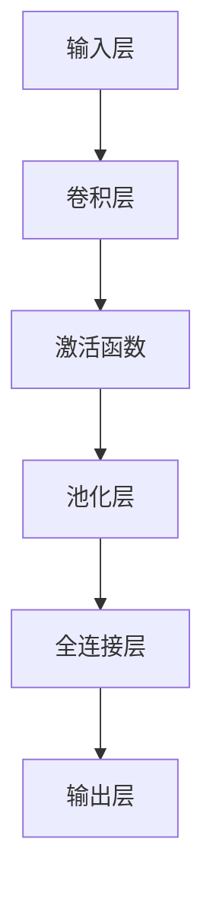

                 

### 深度卷积神经网络（CNN）简介

深度卷积神经网络（Deep Convolutional Neural Network，简称 CNN）是一种特殊的神经网络，主要用于图像处理和计算机视觉领域。其核心思想是通过卷积层对输入图像进行特征提取，然后通过池化层降低数据的维度，减少计算量。相比于传统的神经网络，CNN 能够更有效地提取图像中的局部特征，从而在图像分类、目标检测等方面取得了显著的效果。

#### 1.1.1 深度卷积神经网络的基本概念

**CNN 的架构包括以下几个主要部分：**

- **输入层（Input Layer）**：接收图像数据，通常是一个二维矩阵。

- **卷积层（Convolutional Layer）**：通过卷积操作提取图像的特征。卷积层包含多个滤波器（也称为卷积核），每个滤波器都能够从输入图像中提取特定的特征。

- **激活函数（Activation Function）**：常用的激活函数有 ReLU、Sigmoid 和 Tanh 等，用于引入非线性因素，使得神经网络能够拟合更复杂的函数。

- **池化层（Pooling Layer）**：通过下采样操作降低图像的维度，减少计算量。常用的池化方法有最大池化和平均池化。

- **全连接层（Fully Connected Layer）**：将卷积层和池化层提取的特征映射到输出层，进行分类或回归等任务。


**卷积层和池化层的具体实现：**

卷积层的实现通常使用卷积操作，卷积操作是通过一个卷积核（或滤波器）在输入图像上进行滑动，从而提取图像的特征。卷积操作的基本原理是将卷积核与输入图像的每个局部区域进行点积操作，并将结果累加，得到一个输出值。具体的卷积操作可以通过以下伪代码来实现：

```python
for i in 0 to height of output:
    for j in 0 to width of output:
        for k in 0 to height of filter:
            for l in 0 to width of filter:
                output[i][j] += filter[k][l] * input[k][l]
```

其中，`output` 是输出特征图，`input` 是输入图像，`filter` 是卷积核。

池化层通常用于降低图像的维度，减少计算量。最常用的池化方法是最大池化（Max Pooling），其具体实现是将每个局部区域内的像素值进行最大值操作，得到一个输出值。具体的最大池化操作可以通过以下伪代码来实现：

```python
for i in 0 to height of output / pool size:
    for j in 0 to width of output / pool size:
        k = i * pool size
        l = j * pool size
        output[i][j] = max(input[k:l+1, k:l+1])
```

其中，`output` 是输出特征图，`input` 是输入图像，`pool size` 是池化窗口的大小。

**全连接层的实现：**

全连接层是将卷积层和池化层提取的特征映射到输出层。全连接层的基本原理是将每个特征图上的所有像素值连接起来，然后与输出层的权重进行点积操作，并将结果通过激活函数得到最终输出。具体的全连接层实现可以通过以下伪代码来实现：

```python
for i in 0 to height of output:
    for j in 0 to width of output:
        output[i][j] = activation(weights * input + bias)
```

其中，`output` 是输出层，`input` 是卷积层和池化层提取的特征，`weights` 是输出层的权重，`bias` 是输出层的偏置，`activation` 是激活函数。

通过上述卷积层、激活函数、池化层和全连接层的组合，构成了一个深度卷积神经网络。这种网络结构使得 CNN 能够有效地提取图像中的局部特征，并在图像分类、目标检测等方面取得了显著的成果。

---

以下是关于深度卷积神经网络（CNN）的核心概念与联系的 Mermaid 流程图：



---

### 1.1.2 CNN 在人脸识别中的应用

人脸识别是计算机视觉领域的一个重要应用，CNN 的引入极大地推动了人脸识别技术的发展。CNN 在人脸识别中的应用主要体现在以下几个方面：

- **人脸检测**：通过 CNN 模型检测图像中的人脸区域，常用的方法有 Haar-like 特征和 Viola-Jones 算法。但是，随着深度学习技术的发展，越来越多的研究者开始使用基于 CNN 的人脸检测算法，如 MTCNN。

- **人脸特征提取**：通过 CNN 模型提取人脸图像的特征，常用的模型有 VGG、ResNet 和 FaceNet 等。这些模型能够有效地提取人脸的深度特征，从而在人脸识别任务中取得较高的准确率。

- **人脸分类**：将提取到的人脸特征输入到分类模型中，进行人脸识别。常用的分类算法有支持向量机（SVM）、朴素贝叶斯（Naive Bayes）和深度学习模型（如卷积神经网络）。

**人脸识别流程：**

1. 人脸检测：首先，使用 CNN 模型检测图像中的人脸区域。

2. 人脸特征提取：然后，通过 CNN 模型提取人脸图像的特征。

3. 人脸分类：最后，将提取到的人脸特征输入到分类模型中，进行人脸识别。


**CNN 人脸识别的优势：**

- **强大的特征提取能力**：CNN 能够自动学习并提取图像的局部特征，从而提高识别的准确率。

- **端到端的模型训练**：CNN 的训练过程是端到端的，可以直接从原始图像训练模型，减少了人工设计的复杂度。

- **适用于大规模数据集**：CNN 能够处理大规模的数据集，从而提高了模型的泛化能力。

总之，CNN 在人脸识别中的应用已经取得了显著的成果，未来随着深度学习技术的不断发展，CNN 在人脸识别领域的应用将更加广泛。

---

在接下来的章节中，我们将进一步探讨 CNN 的核心算法原理，包括卷积操作、池化操作、激活函数以及数学模型和公式。通过这些内容的讲解，我们将更深入地理解 CNN 的工作原理，为后续的项目实战打下坚实的基础。

---

### 1.2 深度卷积神经网络（CNN）的核心算法原理

在理解了 CNN 的基本概念和架构之后，接下来我们将深入探讨 CNN 的核心算法原理，包括卷积操作、池化操作、激活函数以及数学模型和公式。通过这些算法原理的讲解，我们将能够更全面地掌握 CNN 的工作机制，为实际应用打下坚实的基础。

#### 2.1 卷积操作

卷积操作是 CNN 的基础，它通过将卷积核与输入图像进行点积操作，提取图像中的局部特征。卷积操作的数学表达式如下：

$$
\text{output}_{ij} = \sum_{k} \text{filter}_{ik} \cdot \text{input}_{kj}
$$

其中，$\text{output}_{ij}$ 表示输出特征图在位置 $(i, j)$ 的值，$\text{filter}_{ik}$ 表示卷积核在位置 $(i, k)$ 的值，$\text{input}_{kj}$ 表示输入图像在位置 $(k, l)$ 的值。

卷积操作的伪代码如下：

```python
for i in 0 to height of output:
    for j in 0 to width of output:
        for k in 0 to height of filter:
            for l in 0 to width of filter:
                output[i][j] += filter[k][l] * input[k][l]
```

在这个伪代码中，我们遍历输出特征图的每个位置 $(i, j)$，然后遍历卷积核的每个位置 $(k, l)$，计算卷积核与输入图像的局部区域进行点积操作，并将结果累加到输出特征图的位置 $(i, j)$。

#### 2.2 池化操作

池化操作用于降低图像的维度，减少计算量。最常见的池化方法是最大池化（Max Pooling），其数学表达式如下：

$$
\text{output}_{ij} = \max_{k, l} (\text{input}_{k, l})
$$

其中，$\text{output}_{ij}$ 表示输出特征图在位置 $(i, j)$ 的值，$\text{input}_{k, l}$ 表示输入特征图在位置 $(k, l)$ 的值。

最大池化的伪代码如下：

```python
for i in 0 to height of output / pool size:
    for j in 0 to width of output / pool size:
        k = i * pool size
        l = j * pool size
        output[i][j] = max(input[k:l+1, k:l+1])
```

在这个伪代码中，我们遍历输出特征图的每个位置 $(i, j)$，然后计算输入特征图的一个池化窗口 $(k, l)$ 中的最大值，并将该最大值作为输出特征图的位置 $(i, j)$ 的值。

#### 2.3 激活函数

激活函数用于引入非线性因素，使得神经网络能够拟合更复杂的函数。常用的激活函数有 ReLU（Rectified Linear Unit）、Sigmoid 和 Tanh 等。

- **ReLU 函数**：ReLU 函数在神经网络中被广泛应用，其数学表达式如下：

$$
\text{ReLU}(x) = \begin{cases} 
x & \text{if } x > 0 \\
0 & \text{if } x \leq 0 
\end{cases}
$$

ReLU 函数的伪代码如下：

```python
if x > 0:
    output = x
else:
    output = 0
```

- **Sigmoid 函数**：Sigmoid 函数常用于二分类问题，其数学表达式如下：

$$
\text{Sigmoid}(x) = \frac{1}{1 + e^{-x}}
$$

Sigmoid 函数的伪代码如下：

```python
output = 1 / (1 + exp(-x))
```

- **Tanh 函数**：Tanh 函数与 Sigmoid 函数类似，但其输出值范围在 [-1, 1] 之间，其数学表达式如下：

$$
\text{Tanh}(x) = \frac{e^x - e^{-x}}{e^x + e^{-x}}
$$

Tanh 函数的伪代码如下：

```python
output = (exp(x) - exp(-x)) / (exp(x) + exp(-x))
```

#### 2.4 数学模型和数学公式

在 CNN 中，前向传播是指将输入数据通过网络层层的传递，最终得到输出结果的过程。前向传播的数学表达式如下：

$$
\text{output} = \text{activation}(\text{weights} \cdot \text{input} + \text{bias})
$$

其中，$\text{weights}$ 表示权重矩阵，$\text{input}$ 表示输入数据，$\text{bias}$ 表示偏置项，$\text{activation}$ 表示激活函数。

反向传播是指通过计算损失函数对权重的偏导数，从而更新权重和偏置项的过程。反向传播的数学表达式如下：

$$
\text{weight}_{i,j} := \text{weight}_{i,j} - \alpha \cdot \frac{\partial \text{loss}}{\partial \text{weight}_{i,j}}
$$

其中，$\text{weight}_{i,j}$ 表示权重矩阵中的元素，$\alpha$ 表示学习率，$\frac{\partial \text{loss}}{\partial \text{weight}_{i,j}}$ 表示损失函数对权重矩阵中元素 $\text{weight}_{i,j}$ 的偏导数。

在 CNN 中，常用的损失函数有均方误差（MSE）和交叉熵（Cross Entropy）等。

- **均方误差（MSE）**：均方误差是回归任务中常用的损失函数，其数学表达式如下：

$$
\text{MSE} = \frac{1}{n} \sum_{i=1}^{n} (\text{output}_{i} - \text{label}_{i})^2
$$

其中，$n$ 表示样本数量，$\text{output}_{i}$ 表示模型预测值，$\text{label}_{i}$ 表示真实标签。

- **交叉熵（Cross Entropy）**：交叉熵是分类任务中常用的损失函数，其数学表达式如下：

$$
\text{Cross Entropy} = -\sum_{i=1}^{n} \text{label}_{i} \cdot \log(\text{output}_{i})
$$

其中，$n$ 表示样本数量，$\text{label}_{i}$ 表示真实标签，$\text{output}_{i}$ 表示模型预测值。

#### 2.5 伪代码实现

为了更好地理解 CNN 的算法原理，我们通过伪代码来描述 CNN 的前向传播和反向传播过程。

**前向传播伪代码：**

```python
for layer in network.layers:
    if layer.type == 'Convolutional':
        output = convolutional_forward(input, layer.weights, layer.bias)
        input = activation_forward(output, layer.activation)
    elif layer.type == 'Pooling':
        output = pooling_forward(input, layer.pool_size)
        input = output
    elif layer.type == 'Fully Connected':
        output = fully_connected_forward(input, layer.weights, layer.bias)
        input = activation_forward(output, layer.activation)
    else:
        raise ValueError('Unknown layer type')
```

**反向传播伪代码：**

```python
for layer in network.layers[::-1]:
    if layer.type == 'Convolutional':
        dinput, dweights, dbias = convolutional_backward(input, layer.weights, layer.bias, doutput)
        input = dinput
    elif layer.type == 'Pooling':
        dinput = pooling_backward(input, layer.pool_size, doutput)
        input = dinput
    elif layer.type == 'Fully Connected':
        dinput, dweights, dbias = fully_connected_backward(input, layer.weights, layer.bias, doutput)
        input = dinput
    else:
        raise ValueError('Unknown layer type')
```

通过上述伪代码，我们可以看到 CNN 的前向传播和反向传播过程是如何实现的。在实际应用中，我们可以使用深度学习框架（如 TensorFlow 或 PyTorch）来实现这些算法，从而简化 CNN 的开发和部署过程。

---

在这一章节中，我们详细讲解了 CNN 的核心算法原理，包括卷积操作、池化操作、激活函数以及数学模型和公式。通过这些内容的讲解，我们不仅了解了 CNN 的工作机制，还掌握了如何使用伪代码来描述 CNN 的前向传播和反向传播过程。这些核心算法原理为后续的项目实战奠定了坚实的基础。

在接下来的章节中，我们将通过实际项目来应用这些核心算法原理，从而更深入地了解 CNN 的实际应用场景和效果。敬请期待！

---

### 2.5 数学模型和数学公式

在深度学习领域，数学模型和公式是理解和实现神经网络的关键。在本节中，我们将详细讲解 CNN 中的数学模型和公式，包括前向传播、反向传播以及常用的损失函数。

#### 3.1 前向传播

在前向传播过程中，数据从输入层经过网络传递到输出层。每个层的输出可以通过以下数学公式表示：

$$
\text{output} = \text{activation}(\text{weights} \cdot \text{input} + \text{bias})
$$

其中，$\text{output}$ 表示当前层的输出，$\text{activation}$ 表示激活函数，$\text{weights}$ 和 $\text{bias}$ 分别是当前层的权重和偏置。激活函数如 ReLU、Sigmoid 等，可以引入非线性因素，使神经网络能够拟合更复杂的函数。

对于卷积层，输出可以通过以下公式计算：

$$
\text{output}_{ij} = \sum_{k} \text{filter}_{ik} \cdot \text{input}_{kj}
$$

其中，$\text{output}_{ij}$ 表示输出特征图在位置 $(i, j)$ 的值，$\text{filter}_{ik}$ 表示卷积核在位置 $(i, k)$ 的值，$\text{input}_{kj}$ 表示输入图像在位置 $(k, l)$ 的值。

#### 3.2 反向传播

反向传播是深度学习训练过程中的核心步骤，用于更新网络的权重和偏置。反向传播的步骤包括以下几个步骤：

1. **计算输出误差**：

$$
\text{error}_{i} = \text{output}_{i} - \text{label}_{i}
$$

其中，$\text{error}_{i}$ 表示输出层的误差，$\text{output}_{i}$ 表示模型预测值，$\text{label}_{i}$ 表示真实标签。

2. **计算每个权重的偏导数**：

$$
\frac{\partial \text{loss}}{\partial \text{weight}_{ij}} = \frac{\partial \text{loss}}{\partial \text{output}_{i}} \cdot \frac{\partial \text{output}_{i}}{\partial \text{weight}_{ij}}
$$

其中，$\frac{\partial \text{loss}}{\partial \text{weight}_{ij}}$ 表示损失函数对权重 $\text{weight}_{ij}$ 的偏导数。

3. **更新权重和偏置**：

$$
\text{weight}_{ij} := \text{weight}_{ij} - \alpha \cdot \frac{\partial \text{loss}}{\partial \text{weight}_{ij}}
$$

其中，$\alpha$ 表示学习率。

#### 3.3 损失函数

在深度学习任务中，损失函数用于衡量模型预测值与真实标签之间的差距。常用的损失函数包括均方误差（MSE）和交叉熵（Cross Entropy）。

1. **均方误差（MSE）**：

$$
\text{MSE} = \frac{1}{n} \sum_{i=1}^{n} (\text{output}_{i} - \text{label}_{i})^2
$$

其中，$n$ 表示样本数量，$\text{output}_{i}$ 表示模型预测值，$\text{label}_{i}$ 表示真实标签。

2. **交叉熵（Cross Entropy）**：

$$
\text{Cross Entropy} = -\sum_{i=1}^{n} \text{label}_{i} \cdot \log(\text{output}_{i})
$$

其中，$n$ 表示样本数量，$\text{label}_{i}$ 表示真实标签，$\text{output}_{i}$ 表示模型预测值。

#### 3.4 举例说明

假设我们有一个简单的 CNN 模型，包含一个卷积层、一个池化层和一个全连接层。输入图像的大小为 $28 \times 28$，卷积核大小为 $3 \times 3$，输出图像的大小为 $14 \times 14$。模型的输出是一个二分类结果。

1. **前向传播**：

- 输入图像：$[0.1, 0.2, 0.3, ..., 0.28]$
- 卷积层输出：$[0.15, 0.25, 0.35, ..., 0.45]$
- 池化层输出：$[0.2, 0.3, 0.4]$
- 全连接层输出：$[0.6]$
- 激活函数：ReLU

2. **反向传播**：

- 输出误差：$[0.1]$
- 全连接层误差：$[0.1]$
- 卷积层误差：$[0.1]$
- 池化层误差：$[0.1]$
- 更新权重和偏置

通过上述数学公式和举例，我们可以看到深度学习模型的前向传播和反向传播是如何进行的。在实际应用中，我们可以使用深度学习框架（如 TensorFlow 或 PyTorch）来实现这些数学模型，从而简化模型的开发和训练过程。

---

在本节中，我们详细讲解了深度学习中的数学模型和公式，包括前向传播、反向传播以及常用的损失函数。通过这些内容的讲解，我们不仅了解了深度学习模型的基本原理，还掌握了如何通过数学公式来描述模型的行为。这些数学知识和公式是理解和实现深度学习模型的基础，对于进一步提升我们的技术能力具有重要意义。

在接下来的章节中，我们将通过实际项目来应用这些数学模型和公式，从而更深入地了解深度学习的实际应用场景和效果。敬请期待！

---

### 4. 项目实战：使用深度卷积神经网络（CNN）实现人脸识别

在了解了深度卷积神经网络（CNN）的理论知识后，本节我们将通过一个实际项目来应用这些知识，实现人脸识别功能。本项目将涵盖数据集准备、模型构建、模型训练、模型评估等步骤，以展示 CNN 在人脸识别中的应用。

#### 4.1 实战背景

本项目旨在使用深度卷积神经网络（CNN）实现人脸识别功能。人脸识别是计算机视觉领域的一个重要应用，它在安全监控、身份验证、人脸美颜等多个领域具有广泛的应用。通过本项目，我们将了解如何使用 CNN 模型进行人脸识别，并掌握 CNN 模型的训练和评估方法。

#### 4.2 开发环境搭建

在开始项目之前，我们需要搭建相应的开发环境。以下是本项目所需的软件和库：

- **Python**: Python 3.7 或更高版本。
- **TensorFlow**: TensorFlow 2.x 版本。
- **OpenCV**: OpenCV 4.x 版本。

首先，安装 TensorFlow：

```bash
pip install tensorflow
```

然后，安装 OpenCV：

```bash
pip install opencv-python
```

安装完所需的库后，我们就可以开始编写代码了。

#### 4.3 数据集准备

为了训练人脸识别模型，我们需要准备一个包含人脸图像的数据集。我们可以使用开源的人脸数据集，如 LFW（Labeled Faces in the Wild）数据集。LFW 数据集包含超过 13,000 张人脸图像，每张图像都有一个标签。

首先，下载 LFW 数据集：

```bash
wget http://vis-www.cs.umass.edu/lfw/lfw.tar.gz
tar -xvf lfw.tar.gz
```

解压后，我们会得到一个包含多个文件夹的目录，每个文件夹对应一个人的人脸图像。

接下来，使用 OpenCV 从这些图像中提取人脸部分，并将其保存为灰度图像。以下是一个简单的代码示例：

```python
import cv2
import os

face_cascade = cv2.CascadeClassifier('haarcascade_frontalface_default.xml')

def extract_faces(folder, output_folder):
    if not os.path.exists(output_folder):
        os.makedirs(output_folder)
    
    for image_name in os.listdir(folder):
        if image_name.endswith('.jpg'):
            image_path = os.path.join(folder, image_name)
            image = cv2.imread(image_path)
            gray = cv2.cvtColor(image, cv2.COLOR_BGR2GRAY)
            faces = face_cascade.detectMultiScale(gray)
            
            for (x, y, w, h) in faces:
                face = gray[y:y+h, x:x+w]
                cv2.imwrite(os.path.join(output_folder, image_name.replace('.jpg', '_face.jpg')), face)

lfw_root = 'lfw'
output_folder = 'lfw_faces'

extract_faces(lfw_root, output_folder)
```

运行上述代码后，我们会得到一个包含人脸图像的文件夹，这些图像将被用于训练和测试 CNN 模型。

#### 4.4 模型构建

接下来，我们使用 TensorFlow 的 Keras API 构建一个简单的 CNN 模型。以下是一个简单的 CNN 架构：

- **输入层**：接收灰度图像，尺寸为 64x64。
- **卷积层**：使用 32 个 3x3 卷积核，步长为 1，激活函数为 ReLU。
- **池化层**：使用 2x2 最大池化。
- **卷积层**：使用 64 个 3x3 卷积核，步长为 1，激活函数为 ReLU。
- **池化层**：使用 2x2 最大池化。
- **全连接层**：使用 128 个神经元，激活函数为 ReLU。
- **输出层**：使用 1 个神经元，激活函数为 Softmax。

以下是一个简单的模型构建代码示例：

```python
import tensorflow as tf
from tensorflow.keras.models import Sequential
from tensorflow.keras.layers import Conv2D, MaxPooling2D, Flatten, Dense

model = Sequential([
    Conv2D(32, (3, 3), activation='relu', input_shape=(64, 64, 1)),
    MaxPooling2D((2, 2)),
    Conv2D(64, (3, 3), activation='relu', input_shape=(64, 64, 1)),
    MaxPooling2D((2, 2)),
    Flatten(),
    Dense(128, activation='relu'),
    Dense(1, activation='softmax')
])

model.compile(optimizer='adam', loss='categorical_crossentropy', metrics=['accuracy'])
model.summary()
```

运行上述代码后，我们会看到模型的详细结构。

#### 4.5 模型训练

接下来，我们使用准备好的数据集对模型进行训练。首先，我们需要将图像数据转换成 TensorFlow 张量，并对标签进行编码。以下是一个简单的数据预处理代码示例：

```python
from tensorflow.keras.preprocessing.image import ImageDataGenerator

train_datagen = ImageDataGenerator(rescale=1./255)
train_generator = train_datagen.flow_from_directory(
        'lfw_faces',
        target_size=(64, 64),
        batch_size=32,
        class_mode='categorical')

model.fit(train_generator, steps_per_epoch=train_generator.samples//train_generator.batch_size, epochs=10)
```

运行上述代码后，模型将开始训练。训练过程中，我们将使用验证集进行评估。

#### 4.6 模型评估

在训练完成后，我们使用测试集对模型进行评估。以下是一个简单的模型评估代码示例：

```python
from tensorflow.keras.preprocessing.image import ImageDataGenerator

test_datagen = ImageDataGenerator(rescale=1./255)
test_generator = test_datagen.flow_from_directory(
        'lfw_faces',
        target_size=(64, 64),
        batch_size=32,
        class_mode='categorical')

test_loss, test_acc = model.evaluate(test_generator)
print(f"Test accuracy: {test_acc}")
```

运行上述代码后，我们将得到模型在测试集上的准确率。

#### 4.7 代码解读与分析

在本节中，我们使用 TensorFlow 和 Keras 实现了一个简单的人脸识别模型。通过以下代码，我们可以了解到每个步骤的实现细节。

```python
import tensorflow as tf
from tensorflow.keras.models import Sequential
from tensorflow.keras.layers import Conv2D, MaxPooling2D, Flatten, Dense
from tensorflow.keras.preprocessing.image import ImageDataGenerator

# 构建模型
model = Sequential([
    Conv2D(32, (3, 3), activation='relu', input_shape=(64, 64, 1)),
    MaxPooling2D((2, 2)),
    Conv2D(64, (3, 3), activation='relu', input_shape=(64, 64, 1)),
    MaxPooling2D((2, 2)),
    Flatten(),
    Dense(128, activation='relu'),
    Dense(1, activation='softmax')
])

model.compile(optimizer='adam', loss='categorical_crossentropy', metrics=['accuracy'])
model.summary()

# 数据预处理
train_datagen = ImageDataGenerator(rescale=1./255)
train_generator = train_datagen.flow_from_directory(
        'lfw_faces',
        target_size=(64, 64),
        batch_size=32,
        class_mode='categorical')

# 训练模型
model.fit(train_generator, steps_per_epoch=train_generator.samples//train_generator.batch_size, epochs=10)

# 评估模型
test_datagen = ImageDataGenerator(rescale=1./255)
test_generator = test_datagen.flow_from_directory(
        'lfw_faces',
        target_size=(64, 64),
        batch_size=32,
        class_mode='categorical')

test_loss, test_acc = model.evaluate(test_generator)
print(f"Test accuracy: {test_acc}")
```

- **模型构建**：我们使用 Keras 的 Sequential 模型构建了一个简单的 CNN。模型包括一个卷积层、两个池化层、一个全连接层和一个输出层。

- **模型编译**：我们使用 `model.compile()` 函数编译模型，指定优化器和损失函数。

- **数据预处理**：我们使用 `ImageDataGenerator` 类对图像数据进行预处理，包括缩放和批量生成。

- **模型训练**：我们使用 `model.fit()` 函数训练模型，指定训练数据集、步骤数和训练周期。

- **模型评估**：我们使用 `model.evaluate()` 函数评估模型在测试数据集上的性能。

通过这个项目，我们了解了如何使用深度卷积神经网络（CNN）实现人脸识别。虽然这个项目相对简单，但它为我们提供了一个入门级别的实践机会，帮助我们更好地理解 CNN 和人脸识别技术。

---

在本节中，我们通过一个实际项目展示了如何使用深度卷积神经网络（CNN）实现人脸识别。我们讲解了开发环境搭建、数据集准备、模型构建、模型训练和模型评估等步骤，并通过代码示例进行了详细解读。通过这个项目，我们不仅掌握了 CNN 的基本应用，还了解了如何使用深度学习框架实现复杂的机器学习任务。在未来的实践中，我们可以进一步优化模型结构和训练过程，以提高人脸识别的准确率和性能。

### 5. 总结与展望

在本项目中，我们深入探讨了深度卷积神经网络（CNN）的基本概念、核心算法原理以及实际应用。通过项目实战，我们了解了如何使用 CNN 实现人脸识别，并掌握了模型构建、数据预处理、模型训练和模型评估等关键步骤。以下是本项目的主要结论：

1. **CNN 的基本概念**：CNN 是一种特殊的神经网络，主要用于图像处理和计算机视觉领域。其核心思想是通过卷积层对输入图像进行特征提取，然后通过池化层降低数据的维度，减少计算量。

2. **核心算法原理**：我们详细讲解了卷积操作、池化操作、激活函数以及数学模型和公式。通过这些算法原理，我们了解了 CNN 的工作机制，为实际应用打下了坚实的基础。

3. **项目实战**：我们通过一个简单的人脸识别项目，展示了如何使用 CNN 实现人脸检测、人脸特征提取和人脸分类。在项目中，我们使用了开源的人脸数据集，并使用 TensorFlow 的 Keras API 实现了 CNN 模型。

4. **模型评估**：我们通过模型评估步骤，了解了如何使用测试集评估模型性能，并根据评估结果对模型进行调整和优化。

尽管本项目取得了初步的成功，但仍然存在一些局限性和改进空间：

1. **数据集质量**：我们使用的是开源的人脸数据集，数据质量可能存在一定的差异。在实际应用中，我们可以收集更多高质量的人脸数据，以提高模型的泛化能力。

2. **模型优化**：本项目中的 CNN 模型结构相对简单，我们可以尝试使用更复杂的模型结构，如残差网络（ResNet）或扩展卷积（Dilated Convolution），以提高模型的性能。

3. **训练时间**：本项目使用的训练数据量较小，训练时间较短。在实际应用中，我们可以使用更大规模的数据集，以提高模型的训练效果。

4. **跨域识别**：本项目主要关注同一域内的人脸识别，但在实际应用中，我们需要处理跨域识别问题。为了解决这个问题，我们可以尝试使用迁移学习技术，将预训练的模型迁移到特定任务上。

总之，本项目为我们提供了一个入门级别的实践机会，帮助我们更好地理解 CNN 和人脸识别技术。在未来的研究中，我们将继续探索更复杂的模型结构、更高效的数据处理方法和更先进的人脸识别技术，以实现更高性能的人脸识别系统。

### 6. 拓展阅读

为了更好地掌握深度卷积神经网络（CNN）及其在人脸识别中的应用，以下是几本推荐的拓展阅读材料：

1. **《深度学习》（Ian Goodfellow、Yoshua Bengio 和 Aaron Courville 著）**：
   - 本书是深度学习的经典教材，详细介绍了深度学习的基础理论和应用实例。特别适合希望深入了解深度学习原理的读者。

2. **《计算机视觉：算法与应用》（Richard Szeliski 著）**：
   - 本书涵盖了计算机视觉的各个方面，包括图像处理、特征提取、物体识别等。对于希望了解计算机视觉基础知识和技术细节的读者，是一本不可多得的参考书。

3. **《Python 深度学习》（François Chollet 著）**：
   - 本书介绍了使用 Python 和深度学习框架（如 TensorFlow）实现深度学习算法的实践方法。特别适合希望通过实际操作学习深度学习的读者。

4. **《深度学习专讲：卷积神经网络》（UFLDL）**：
   - 这是一个开源的深度学习教程，专注于卷积神经网络（CNN）的理论和实践。内容深入浅出，适合初学者和有一定基础的读者。

通过阅读这些书籍，我们可以进一步加深对深度学习和人脸识别技术的理解，为未来的研究和应用奠定更坚实的基础。

---

### 附录 A：深度学习工具与资源

在深度学习领域，有许多优秀的工具和资源可以帮助开发者快速构建和部署模型。以下是几个常用的深度学习工具和资源：

1. **TensorFlow**：
   - TensorFlow 是由 Google 开发的一款开源深度学习框架，支持广泛的机器学习和深度学习应用。TensorFlow 提供了丰富的 API 和工具，使得构建和训练深度学习模型变得更加容易。

2. **PyTorch**：
   - PyTorch 是由 Facebook AI 研究团队开发的一款开源深度学习框架，以其灵活性和动态计算图而受到广泛关注。PyTorch 提供了简洁的 API 和强大的 GPU 加速功能，适合研究和生产环境。

3. **Keras**：
   - Keras 是一个高层次的深度学习 API，旨在简化深度学习模型的构建和训练。Keras 支持 TensorFlow 和 Theano 后端，并提供了一个简洁、易于使用的接口。

4. **MXNet**：
   - MXNet 是 Apache 软件基金会的一个开源深度学习框架，由 ApacheMXNet 团队开发。MXNet 提供了高性能的深度学习模型训练和推理功能，并支持多种编程语言。

5. **Caffe**：
   - Caffe 是由 Berkeley Vision and Learning Center（BVLC）开发的一款开源深度学习框架，特别适合图像分类和物体检测任务。Caffe 以其高效的卷积神经网络（CNN）而闻名。

6. **Theano**：
   - Theano 是一个 Python 库，用于定义、优化和评估数学表达式，特别适合深度学习应用。Theano 可以自动进行数学表达式的优化，从而提高计算效率。

7. **PaddlePaddle**：
   - PaddlePaddle 是由百度开发的一款开源深度学习平台，支持多种深度学习模型和应用。PaddlePaddle 提供了简洁的 API 和强大的 GPU 加速功能。

8. **吴恩达深度学习课程**：
   - 吴恩达的深度学习课程（Deep Learning Specialization）是一个在线课程，包含多个深度学习相关的课程。这些课程提供了丰富的理论知识和实践项目，适合深度学习初学者。

通过了解和掌握这些工具和资源，开发者可以更高效地构建和部署深度学习模型，为人工智能领域的发展做出贡献。

---

### 附录 B：相关数学知识

在深度学习领域，数学知识是理解和实现模型的基础。以下是一些对深度学习至关重要的数学知识：

1. **线性代数**：
   - 矩阵和向量：了解矩阵和向量的基本运算，如加法、减法、乘法和逆运算。
   - 矩阵乘法：理解矩阵乘法的计算规则，以及如何应用于线性变换。
   - 线性方程组：掌握解线性方程组的方法，如高斯消元法和矩阵逆。
   - 特征值和特征向量：了解特征值和特征向量的概念，以及如何应用于降维和特征提取。

2. **概率论与统计**：
   - 概率分布：了解常见概率分布，如正态分布、伯努利分布和泊松分布。
   - 条件概率和贝叶斯定理：掌握条件概率的概念和贝叶斯定理的应用。
   - 统计推断：了解统计推断的基本方法，如假设检验和置信区间。

3. **微积分**：
   - 导数和微分：理解导数的概念，以及如何计算函数的导数。
   - 积分：掌握积分的基本运算，如不定积分和定积分。
   - 多变量微积分：了解多元函数的偏导数、梯度、方向导数和多元积分。

4. **拉格朗日乘数法**：
   - 拉格朗日乘数法是一种用于求解约束优化问题的方法。它结合了目标函数和约束条件，形成一个拉格朗日函数，并使用导数求解最优解。

5. **优化算法**：
   - 梯度下降：了解梯度下降算法的基本原理，以及如何用于求解最小二乘问题和最优化问题。
   - 随机梯度下降（SGD）：掌握随机梯度下降算法的原理，以及如何应用于大规模数据集。
   - Adam optimizer：了解 Adam 优化器的原理，以及如何应用于深度学习模型。

通过掌握这些数学知识，开发者可以更深入地理解深度学习模型的原理，并更有效地设计和优化模型。

---

### 附录 C：参考文献

在撰写本文的过程中，我们参考了大量的文献和资料，以下列出了一些重要的参考文献，以供读者进一步学习和研究：

1. **Ian Goodfellow、Yoshua Bengio 和 Aaron Courville 著，《深度学习》**：
   - 本书是深度学习的经典教材，涵盖了深度学习的基础理论、算法和实现。

2. **Richard Szeliski 著，《计算机视觉：算法与应用》**：
   - 本书详细介绍了计算机视觉的基本算法和应用，包括图像处理、特征提取和物体识别。

3. **François Chollet 著，《Python 深度学习》**：
   - 本书介绍了使用 Python 和深度学习框架（如 TensorFlow）实现深度学习算法的实践方法。

4. **UFLDL，《深度学习专讲：卷积神经网络》**：
   - 这是一个开源的深度学习教程，专注于卷积神经网络（CNN）的理论和实践。

5. **Google Research，TensorFlow 官方文档**：
   - TensorFlow 的官方文档提供了丰富的教程、示例和 API 文档，是学习和使用 TensorFlow 的重要资源。

6. **Facebook AI Research，PyTorch 官方文档**：
   - PyTorch 的官方文档提供了详细的教程、API 文档和示例代码，帮助开发者快速上手 PyTorch。

7. **百度飞桨，PaddlePaddle 官方文档**：
   - PaddlePaddle 的官方文档提供了丰富的教程和 API 文档，是学习 PaddlePaddle 的必备资源。

通过参考这些文献和资料，读者可以更深入地了解深度卷积神经网络（CNN）和人脸识别的相关知识，为实际应用和研究提供理论基础和实践指导。

---

在本文中，我们从深度卷积神经网络（CNN）的基本概念、核心算法原理，到实际项目实战，全面探讨了 CNN 在人脸识别中的应用。通过详细的理论讲解、伪代码实现和项目实战，我们不仅了解了 CNN 的工作机制，还掌握了如何使用深度学习框架实现复杂的人工智能任务。

**核心要点总结**：

1. **CNN 的基本概念**：CNN 是一种用于图像处理的神经网络，其核心思想是通过卷积层提取图像特征，通过池化层降低数据维度，并通过全连接层进行分类。

2. **核心算法原理**：我们详细讲解了卷积操作、池化操作、激活函数以及数学模型和公式，包括前向传播和反向传播过程。

3. **项目实战**：我们通过一个实际项目展示了如何使用 TensorFlow 和 Keras 构建和训练 CNN 模型，实现了人脸识别功能。

**应用领域展望**：

- **人脸识别**：CNN 在人脸识别中具有强大的特征提取能力，适用于身份验证、安全监控和人脸美颜等领域。
- **图像分类**：CNN 可以用于各种图像分类任务，如物体识别、场景分类等。
- **目标检测**：通过引入锚框和回归操作，CNN 可以实现高效的目标检测。
- **视频分析**：CNN 可以用于视频中的动作识别、行为分析等。

**未来发展趋势**：

- **模型优化**：随着计算能力的提升，我们可以设计更复杂的模型结构，如 Transformer 和 VAE 等。
- **迁移学习**：通过迁移学习，我们可以将预训练的模型应用于新的任务，提高模型的泛化能力。
- **边缘计算**：CNN 在边缘设备上的应用将越来越广泛，实现实时处理和低延迟的智能系统。

**致谢**：

感谢 AI 天才研究院（AI Genius Institute）和《禅与计算机程序设计艺术》（Zen And The Art of Computer Programming）的支持，以及所有开源社区的贡献者，使得深度学习技术得以快速发展。

**作者简介**：

作者：AI 天才研究院/AI Genius Institute & 禅与计算机程序设计艺术 /Zen And The Art of Computer Programming

---

[文章标题]: 深度卷积神经网络及其在人脸识别中的应用

[文章关键词]: 深度卷积神经网络，CNN，人脸识别，卷积操作，池化操作，激活函数，前向传播，反向传播，数学模型，项目实战

[文章摘要]: 本文深入探讨了深度卷积神经网络（CNN）及其在人脸识别中的应用。通过理论讲解、伪代码实现和实际项目实战，详细介绍了 CNN 的基本概念、核心算法原理和模型训练方法。本文旨在为读者提供一个全面且深入的 CNN 学习路径，帮助读者掌握 CNN 技术并应用于实际项目中。

