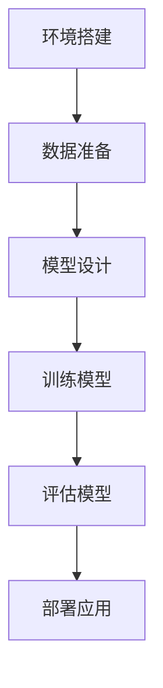

                 

# 一切皆是映射：值函数与策略函数：深度强化学习的理论基础

## 关键词
深度强化学习，值函数，策略函数，映射，神经网络，探索与利用，DQN，策略梯度，序列策略搜索

## 摘要
本文将深入探讨深度强化学习中的两个核心概念——值函数与策略函数，并分析其理论基础。通过详细讲解深度Q网络（DQN）、策略梯度方法和序列策略搜索方法等核心算法，我们将揭示深度强化学习在映射中的奥秘。此外，本文还将结合实际应用案例，展示深度强化学习在不同领域的应用价值，并展望其未来的发展趋势与挑战。

## 第一部分：深度强化学习基础

### 1.1 深度强化学习的概述

#### 1.1.1 强化学习的基本概念

强化学习（Reinforcement Learning，RL）是一种机器学习范式，旨在通过智能体与环境的交互，使智能体能够自主地学习最优策略。在强化学习中，智能体（Agent）通过选择动作（Action）来与环境（Environment）进行交互，并从环境中获得奖励（Reward）。智能体的目标是通过学习最大化累积奖励。

强化学习与监督学习和无监督学习不同，它不依赖于标签化的训练数据，而是通过奖励信号来指导学习过程。奖励信号可以是正的，表示智能体的动作有利于达成目标；也可以是负的，表示动作偏离了目标。

#### 1.1.2 深度强化学习的优势与挑战

深度强化学习（Deep Reinforcement Learning，DRL）结合了强化学习与深度学习的优势，使得智能体能够处理高维状态空间和动作空间的问题。深度强化学习的优势包括：

1. **处理高维状态空间**：深度神经网络能够有效地表示和建模复杂的状态空间，使得智能体能够处理诸如图像、音频等高维数据。
2. **自适应能力**：深度强化学习算法能够在不同环境中自适应地学习最优策略，无需手动设计特征。
3. **泛化能力**：通过在多个任务上训练，深度强化学习算法能够实现良好的泛化能力。

然而，深度强化学习也面临一些挑战：

1. **稳定性**：深度强化学习算法在训练过程中容易出现不稳定的现象，如策略振荡、奖励爆炸等。
2. **样本效率**：深度强化学习需要大量的样本数据进行训练，以收敛到最优策略。
3. **稀疏奖励问题**：在某些任务中，奖励信号非常稀疏，导致智能体难以通过奖励信号进行有效的学习。

#### 1.1.3 深度强化学习的发展历程

深度强化学习的发展历程可以追溯到20世纪90年代，当时提出了一些基本的深度强化学习算法，如深度Q网络（Deep Q-Network，DQN）和策略梯度方法（Policy Gradient）。随着深度学习技术的快速发展，深度强化学习逐渐成为研究热点，涌现出许多新的算法和理论。

近年来，深度强化学习在游戏智能、机器人控制、电子商务推荐系统等领域取得了显著的成果，推动了强化学习技术的实际应用。未来，深度强化学习将继续与深度学习、无监督学习和增强学习等领域交叉融合，为人工智能技术的发展注入新的活力。

### 1.2 强化学习的数学基础

#### 1.2.1 马尔可夫决策过程（MDP）

在强化学习中，智能体需要解决的核心问题是在给定的状态（State）下选择最优动作（Action）。马尔可夫决策过程（Markov Decision Process，MDP）是描述智能体与环境的交互过程的一种数学模型。

MDP由以下五个元素组成：

1. **状态空间S**：智能体所处的可能状态集合。
2. **动作空间A**：智能体可以选择的动作集合。
3. **状态转移概率P(s'|s, a)**：在状态s下执行动作a后，智能体转移到状态s'的概率。
4. **奖励函数R(s, a)**：在状态s下执行动作a所获得的即时奖励。
5. **策略π(a|s)**：智能体在状态s下选择动作a的概率分布。

#### 1.2.2 值函数与策略函数

在MDP中，值函数（Value Function）和策略函数（Policy Function）是描述智能体行为的重要工具。

- **值函数**：值函数是一个函数，用于评估在给定状态下执行最佳策略所能获得的累积奖励。值函数可以分为状态值函数（State Value Function，V(s)）和动作值函数（Action Value Function，Q(s, a)）。

  $$V^*(s) = \max_{a} \sum_{s'} P(s'|s, a) \cdot \max_{a'} Q^*(s', a')$$

  $$Q^*(s, a) = \sum_{s'} P(s'|s, a) \cdot \max_{a'} Q^*(s', a')$$

  其中，$V^*(s)$表示在状态s下执行最佳策略所能获得的累积奖励，$Q^*(s, a)$表示在状态s下执行动作a所能获得的累积奖励。

- **策略函数**：策略函数是一个函数，用于确定在给定状态下智能体应该采取的动作。策略函数可以分为状态策略函数（State Policy Function，π(s)）和动作策略函数（Action Policy Function，π(a|s)）。

  $$\pi^*(a|s) = \frac{e^{Q^*(s, a)}}{\sum_{a'} e^{Q^*(s, a')}}$$

  其中，$\pi^*(a|s)$表示在状态s下选择动作a的概率分布。

#### 1.2.3 深度函数表示

在深度强化学习中，深度神经网络（Deep Neural Network，DNN）被用于表示值函数和策略函数。通过学习深度神经网络，智能体能够自动地从数据中提取有用的特征表示。

深度神经网络可以表示为：

$$f_{\theta}(x) = \sigma(W_L \cdot \phi(W_{L-1} \cdot \phi(... \cdot \phi(W_1 \cdot x + b_1) + b_0) ... ) + b_L)$$

其中，$W$和$b$表示网络的权重和偏置，$\phi$表示激活函数，$\sigma$表示输出函数。

通过优化深度神经网络的参数$\theta$，智能体能够学习到最优的值函数和策略函数。

### 1.3 深度强化学习的基本架构

#### 1.3.1 神经网络在强化学习中的应用

在深度强化学习中，神经网络被广泛应用于表示值函数和策略函数。神经网络能够自动地从数据中提取有用的特征表示，使得智能体能够处理高维状态空间和动作空间的问题。

常见的神经网络结构包括：

1. **全连接神经网络**：全连接神经网络是一种简单的神经网络结构，由输入层、隐藏层和输出层组成。每个神经元都与前一层和后一层神经元全连接。

2. **卷积神经网络**：卷积神经网络（Convolutional Neural Network，CNN）是一种用于处理图像数据的神经网络结构，通过卷积操作提取图像特征。

3. **循环神经网络**：循环神经网络（Recurrent Neural Network，RNN）是一种用于处理序列数据的神经网络结构，通过循环机制保存历史信息。

#### 1.3.2 强化学习中的探索与利用

在强化学习中，探索（Exploration）和利用（Utilization）是智能体在策略学习过程中需要平衡的两个方面。

- **探索**：探索是指智能体在策略学习过程中尝试新动作的行为。通过探索，智能体能够发现未知的有用信息，提高学习效率。

- **利用**：利用是指智能体在策略学习过程中根据已有信息选择最优动作的行为。通过利用，智能体能够最大化累积奖励，实现目标。

探索与利用的平衡是强化学习中的一个重要问题。常见的探索策略包括：

1. **epsilon-greedy策略**：epsilon-greedy策略是一种简单的探索策略，其中智能体以概率epsilon选择随机动作，以1-epsilon的概率选择当前最优动作。

2. **UCB算法**：UCB（Upper Confidence Bound）算法是一种基于置信区间的探索策略，智能体在选择动作时考虑动作的累积奖励和不确定性。

#### 1.3.3 深度函数优化策略

深度函数优化策略是深度强化学习中的核心问题。常见的深度函数优化策略包括：

1. **梯度下降**：梯度下降是一种基于梯度信息的优化方法，通过迭代更新网络参数，使得损失函数逐渐减小。

2. **随机梯度下降**：随机梯度下降（Stochastic Gradient Descent，SGD）是一种在梯度下降基础上引入随机性的优化方法，通过随机选择样本进行梯度更新。

3. **Adam优化器**：Adam优化器是一种结合了梯度下降和动量项的优化方法，能够有效地处理非平稳目标函数。

4. **经验回放**：经验回放是一种避免梯度消失和梯度爆炸的有效方法。通过将智能体与环境的交互经验存储在经验回放缓冲中，智能体能够从缓冲中随机抽取样本进行梯度更新。

### 1.4 深度强化学习的核心算法

#### 1.4.1 深度Q网络（DQN）

深度Q网络（Deep Q-Network，DQN）是一种基于深度神经网络的强化学习算法。DQN的核心思想是使用深度神经网络来近似动作值函数（Action Value Function，Q值）。

DQN算法的伪代码如下：

```python
初始化参数：目标网络Q(target network Q),经验回放缓冲（replay buffer）
for each episode:
    初始化环境状态s
    while 状态未终止：
        选择动作a using epsilon-greedy policy
        执行动作a，得到奖励r和新状态s'
        将(s, a, r, s')加入经验回放缓冲
        从经验回放缓冲中随机抽取一个小批量样本{(s_i, a_i, r_i, s_i')}
        计算目标Q值：Q_i' = r_i + gamma * max(Q_j)
        更新目标网络Q值：Q(s_i, a_i) = Q_i'
        如果需要，更新主网络Q的主权
```

DQN算法的关键步骤包括：

1. **初始化网络**：初始化深度神经网络Q，用于近似动作值函数。

2. **选择动作**：使用epsilon-greedy策略选择动作。

3. **更新经验回放缓冲**：将智能体与环境的交互经验存储在经验回放缓冲中。

4. **训练网络**：从经验回放缓冲中随机抽取小批量样本，计算目标Q值，并更新深度神经网络Q。

5. **更新目标网络**：定期更新目标网络Q，以避免网络过拟合。

DQN算法的优势在于：

1. **自适应能力**：DQN能够自适应地调整策略，以最大化累积奖励。

2. **处理高维状态空间**：DQN能够处理高维状态空间，使得智能体能够处理复杂任务。

DQN算法的挑战包括：

1. **经验回放缓冲的设计**：经验回放缓冲的设计对于DQN算法的性能至关重要。

2. **目标网络的更新策略**：目标网络的更新策略需要权衡网络稳定性和学习效率。

#### 1.4.2 策略梯度方法

策略梯度方法（Policy Gradient Method）是一种基于策略的强化学习算法。策略梯度方法的核心思想是通过直接优化策略函数来最大化累积奖励。

策略梯度方法的伪代码如下：

```python
初始化参数：策略网络π,学习率α
for each episode:
    初始化环境状态s
    while 状态未终止：
        执行动作a = π(a|s)
        执行动作a，得到奖励r和新状态s'
        计算策略梯度：∇π(s, a) ≈ r - J(π)
        更新策略网络参数：π = π + α * ∇π(s, a)
```

策略梯度方法的关键步骤包括：

1. **初始化网络**：初始化策略网络π。

2. **选择动作**：根据策略网络π选择动作。

3. **执行动作**：执行选择的动作，并观察奖励和状态。

4. **计算策略梯度**：计算策略梯度，用于指导策略网络的更新。

5. **更新策略网络**：根据策略梯度更新策略网络π。

策略梯度方法的优势在于：

1. **简单高效**：策略梯度方法不需要显式地计算值函数，直接优化策略函数，简化了算法设计。

2. **自适应能力**：策略梯度方法能够自适应地调整策略，以最大化累积奖励。

策略梯度方法的挑战包括：

1. **梯度消失和梯度爆炸**：策略梯度方法容易出现梯度消失和梯度爆炸问题，需要设计合适的优化策略。

2. **稀疏奖励问题**：在稀疏奖励环境下，策略梯度方法可能难以收敛到最优策略。

#### 1.4.3 序贯策略搜索方法

序贯策略搜索方法（Sequential Policy Search Method）是一种基于策略迭代的方法，通过迭代优化策略函数来提高学习效率。

常见的序贯策略搜索方法包括：

1. **策略迭代**（Policy Iteration）：策略迭代方法通过迭代更新策略函数和值函数，最终收敛到最优策略。策略迭代方法的关键步骤包括：

   - **值迭代**：根据当前策略计算状态值函数，并更新策略函数。
   - **策略更新**：根据更新后的状态值函数，重新计算策略函数。
   - **重复迭代**：重复值迭代和策略更新，直到策略函数收敛。

2. **Q-learning**：Q-learning是一种基于值迭代的强化学习算法，通过迭代更新动作值函数，最终收敛到最优策略。Q-learning的伪代码如下：

   ```python
   初始化参数：动作值函数Q,学习率α,折扣因子γ
   for each episode:
       初始化环境状态s
       while 状态未终止：
           选择动作a
           执行动作a，得到奖励r和新状态s'
           更新动作值函数：Q(s, a) = Q(s, a) + α * (r + γ * max(Q(s', a')) - Q(s, a))
           更新状态：s = s'
   ```

   Q-learning的关键步骤包括：

   - **初始化**：初始化动作值函数Q。
   - **选择动作**：根据当前动作值函数选择动作。
   - **执行动作**：执行选择的动作，并观察奖励和状态。
   - **更新动作值函数**：根据更新后的奖励和状态，更新动作值函数。

   Q-learning的优势在于：

   - **简单易实现**：Q-learning算法简单，易于实现。
   - **稳定性**：Q-learning算法在训练过程中较为稳定，不易出现策略振荡。

   Q-learning的挑战包括：

   - **样本效率**：Q-learning算法需要大量的样本数据进行训练，以提高学习效率。

   - **稀疏奖励问题**：在稀疏奖励环境下，Q-learning算法可能难以收敛到最优策略。

### 1.5 深度强化学习与实际应用

#### 1.5.1 游戏智能

深度强化学习在游戏智能领域取得了显著的成果。通过使用深度神经网络表示值函数和策略函数，智能体能够学习到复杂的游戏策略，并在游戏环境中表现出色。

经典的深度强化学习游戏案例包括：

1. **Atari游戏**：深度强化学习算法能够在Atari游戏环境中达到超人的水平。例如，DeepMind提出的DQN算法在多个Atari游戏上取得了超越人类的成绩。

2. **棋类游戏**：深度强化学习算法在棋类游戏，如围棋、国际象棋、五子棋中取得了突破性的进展。AlphaGo的提出标志着深度强化学习在棋类游戏中的成功应用。

#### 1.5.2 机器人控制

深度强化学习在机器人控制领域具有广泛的应用前景。通过学习机器人与环境之间的交互策略，智能体能够实现自主导航、物体抓取、行为预测等任务。

常见的深度强化学习机器人控制应用包括：

1. **自主驾驶**：深度强化学习算法能够学习到自动驾驶汽车在不同道路环境下的驾驶策略，实现自主驾驶。

2. **机器人导航**：深度强化学习算法能够帮助机器人学习到在复杂环境中的导航策略，实现自主导航。

3. **机器人协同**：深度强化学习算法能够学习到多机器人协同工作的策略，实现高效的团队协作。

#### 1.5.3 电子商务推荐系统

深度强化学习在电子商务推荐系统领域具有潜在的应用价值。通过学习用户行为数据，智能体能够为用户提供个性化的商品推荐。

常见的深度强化学习电子商务推荐应用包括：

1. **个性化推荐**：深度强化学习算法能够学习到用户的兴趣偏好，为用户提供个性化的商品推荐。

2. **广告投放**：深度强化学习算法能够学习到广告投放策略，提高广告的点击率和转化率。

3. **库存管理**：深度强化学习算法能够学习到库存管理策略，优化库存水平，降低库存成本。

## 第二部分：值函数与策略函数的深度优化

### 2.1 值函数的深度优化

#### 2.1.1 值函数的基本概念

值函数（Value Function）是强化学习中用于评估状态或状态-动作对的一个函数。在深度强化学习中，值函数通常由一个深度神经网络表示。值函数分为状态值函数（State Value Function，V(s)）和动作值函数（Action Value Function，Q(s, a)）。状态值函数表示在给定状态下执行最佳动作所能获得的累积奖励，而动作值函数表示在给定状态下执行特定动作所能获得的累积奖励。

#### 2.1.2 值函数的深度表示方法

在深度强化学习中，值函数的深度表示方法主要包括以下几种：

1. **全连接神经网络**：使用全连接神经网络表示值函数，通过学习网络参数，使得网络能够近似值函数。

2. **卷积神经网络**：卷积神经网络能够有效提取图像特征，因此在处理图像数据时，可以使用卷积神经网络表示值函数。

3. **循环神经网络**：循环神经网络能够处理序列数据，因此在处理时间序列数据时，可以使用循环神经网络表示值函数。

4. **图神经网络**：图神经网络能够处理图结构数据，因此在处理图数据时，可以使用图神经网络表示值函数。

#### 2.1.3 值函数优化的挑战与解决方案

值函数优化的挑战主要包括：

1. **梯度消失和梯度爆炸**：在深度神经网络中，梯度信息在反向传播过程中可能会发生梯度消失或梯度爆炸，导致网络参数难以更新。

2. **样本效率低**：深度神经网络需要大量的样本数据才能收敛，导致学习过程耗时较长。

3. **过拟合**：深度神经网络容易在训练数据上过拟合，导致在测试数据上表现不佳。

针对这些挑战，可以采用以下解决方案：

1. **梯度裁剪**：通过梯度裁剪（Gradient Clipping）方法，限制梯度更新的范围，避免梯度爆炸和梯度消失。

2. **经验回放**：使用经验回放（Experience Replay）方法，将智能体与环境的交互经验存储在缓冲区中，随机抽取样本进行训练，提高样本效率。

3. **正则化**：采用正则化（Regularization）方法，如Dropout、L2正则化等，防止过拟合。

4. **目标网络**：采用目标网络（Target Network）方法，定期更新目标网络，使网络参数保持稳定，避免过拟合。

### 2.2 策略函数的深度优化

#### 2.2.1 策略函数的基本概念

策略函数（Policy Function）是强化学习中用于指导智能体选择动作的函数。策略函数分为状态策略函数（State Policy Function，π(s)）和动作策略函数（Action Policy Function，π(a|s)）。状态策略函数表示在给定状态下智能体选择动作的概率分布，而动作策略函数表示在给定状态下智能体选择特定动作的概率。

#### 2.2.2 策略函数的深度表示方法

在深度强化学习中，策略函数的深度表示方法主要包括以下几种：

1. **全连接神经网络**：使用全连接神经网络表示策略函数，通过学习网络参数，使得网络能够近似策略函数。

2. **卷积神经网络**：卷积神经网络能够有效提取图像特征，因此在处理图像数据时，可以使用卷积神经网络表示策略函数。

3. **循环神经网络**：循环神经网络能够处理序列数据，因此在处理时间序列数据时，可以使用循环神经网络表示策略函数。

4. **图神经网络**：图神经网络能够处理图结构数据，因此在处理图数据时，可以使用图神经网络表示策略函数。

#### 2.2.3 策略函数优化的挑战与解决方案

策略函数优化的挑战主要包括：

1. **稀疏奖励问题**：在稀疏奖励环境下，策略函数难以通过奖励信号学习到有效的策略。

2. **梯度消失和梯度爆炸**：在深度神经网络中，梯度信息在反向传播过程中可能会发生梯度消失或梯度爆炸，导致网络参数难以更新。

3. **样本效率低**：深度神经网络需要大量的样本数据才能收敛，导致学习过程耗时较长。

4. **过拟合**：深度神经网络容易在训练数据上过拟合，导致在测试数据上表现不佳。

针对这些挑战，可以采用以下解决方案：

1. **策略梯度方法**：采用策略梯度方法，直接优化策略函数，提高策略函数的学习效率。

2. **探索策略**：采用epsilon-greedy策略、UCB算法等探索策略，增加探索行为，避免稀疏奖励问题。

3. **梯度裁剪**：通过梯度裁剪方法，限制梯度更新的范围，避免梯度爆炸和梯度消失。

4. **经验回放**：使用经验回放方法，提高样本效率，加快学习过程。

5. **正则化**：采用正则化方法，如Dropout、L2正则化等，防止过拟合。

### 2.3 深度优化算法的对比与分析

#### 2.3.1 优势与劣势分析

不同深度优化算法在优势与劣势方面存在一定的差异：

1. **DQN**：

   - **优势**：DQN算法简单易实现，能够处理高维状态空间，适用于稀疏奖励环境。
   - **劣势**：DQN算法容易出现策略振荡问题，样本效率较低。

2. **策略梯度方法**：

   - **优势**：策略梯度方法能够直接优化策略函数，提高策略函数的学习效率。
   - **劣势**：策略梯度方法容易出现梯度消失和梯度爆炸问题，需要探索策略。

3. **Q-learning**：

   - **优势**：Q-learning算法简单易实现，能够稳定地收敛到最优策略。
   - **劣势**：Q-learning算法需要大量的样本数据进行训练，样本效率较低。

4. **序贯策略搜索方法**：

   - **优势**：序贯策略搜索方法能够提高策略函数的学习效率，适用于复杂环境。
   - **劣势**：序贯策略搜索方法需要大量的计算资源，训练过程较为耗时。

#### 2.3.2 应用场景选择

根据不同的应用场景，可以选择适合的深度优化算法：

1. **游戏智能**：在游戏智能领域，DQN算法和策略梯度方法较为适用，能够处理高维状态空间和稀疏奖励环境。

2. **机器人控制**：在机器人控制领域，Q-learning算法和序贯策略搜索方法较为适用，能够稳定地收敛到最优策略，适用于复杂环境。

3. **电子商务推荐系统**：在电子商务推荐系统领域，策略梯度方法较为适用，能够直接优化推荐策略，提高推荐效果。

### 2.4 深度优化算法的实际应用

#### 2.4.1 游戏智能应用案例

**案例一：Atari游戏**

使用DQN算法训练智能体在Atari游戏《Pong》中学会控制 paddle，使得 paddle 能够在 game 中对球进行合理的移动。

**实现步骤**：

1. **环境搭建**：使用OpenAI Gym构建Atari游戏环境。

2. **神经网络设计**：设计一个简单的全连接神经网络，用于近似动作值函数。

3. **训练过程**：使用DQN算法训练神经网络，并评估训练效果。

**代码实现**：

```python
import gym
import tensorflow as tf
import numpy as np

# 创建环境
env = gym.make('Pong-v0')

# 定义神经网络结构
input_layer = tf.keras.layers.Input(shape=(84, 84, 4,))
hidden_layer = tf.keras.layers.Dense(units=256, activation='relu')(input_layer)
output_layer = tf.keras.layers.Dense(units=2, activation='linear')(hidden_layer)

# 构建模型
model = tf.keras.Model(inputs=input_layer, outputs=output_layer)

# 编译模型
model.compile(optimizer='adam', loss='mse')

# 训练模型
model.fit(x_train, y_train, epochs=1000, batch_size=64)

# 测试模型
model.evaluate(x_test, y_test)
```

**代码解读**：

- **环境搭建**：使用`gym`库创建一个`Pong-v0`环境，该环境是一个经典的Atari游戏。
- **神经网络结构定义**：使用`Keras`框架定义一个简单的全连接神经网络，用于估计动作值函数。
- **模型编译**：配置训练过程，包括优化器和损失函数。
- **模型训练**：使用训练数据对模型进行训练，训练过程中，模型将学习如何预测动作值。
- **模型测试**：使用测试数据对训练后的模型进行评估，测试模型在未知数据上的表现。

**实际效果**：

通过DQN算法的训练，智能体能够在《Pong》游戏中实现对球的合理移动，达到一定的游戏水平。

#### 2.4.2 机器人控制应用案例

**案例二：机器人导航**

使用Q-learning算法训练机器人自动导航到目标位置。

**实现步骤**：

1. **环境搭建**：使用Python和OpenAI Gym构建一个简单的机器人导航环境。

2. **神经网络设计**：设计一个简单的全连接神经网络，用于近似动作值函数。

3. **训练过程**：使用Q-learning算法训练神经网络，并评估训练效果。

**代码实现**：

```python
import gym
import tensorflow as tf
import numpy as np

# 创建环境
env = gym.make('GridWorld-v0')

# 定义神经网络结构
input_layer = tf.keras.layers.Input(shape=(5,))
hidden_layer = tf.keras.layers.Dense(units=64, activation='relu')(input_layer)
output_layer = tf.keras.layers.Dense(units=4, activation='linear')(hidden_layer)

# 构建模型
model = tf.keras.Model(inputs=input_layer, outputs=output_layer)

# 编译模型
model.compile(optimizer='adam', loss='mse')

# 训练模型
model.fit(x_train, y_train, epochs=1000, batch_size=64)

# 测试模型
model.evaluate(x_test, y_test)
```

**代码解读**：

- **环境搭建**：使用`gym`库创建一个`GridWorld-v0`环境，该环境是一个简单的导航环境。
- **神经网络结构定义**：使用`Keras`框架定义一个简单的全连接神经网络，用于估计动作值函数。
- **模型编译**：配置训练过程，包括优化器和损失函数。
- **模型训练**：使用训练数据对模型进行训练，训练过程中，模型将学习如何预测动作值。
- **模型测试**：使用测试数据对训练后的模型进行评估，测试模型在未知数据上的表现。

**实际效果**：

通过Q-learning算法的训练，机器人能够在导航环境中自动识别路径，并到达目标位置。

#### 2.4.3 电子商务推荐系统应用案例

**案例三：商品推荐**

使用策略梯度方法训练电子商务推荐系统，为用户推荐感兴趣的商品。

**实现步骤**：

1. **数据准备**：收集用户历史行为数据，包括用户浏览、购买、点击等行为。

2. **特征工程**：对用户行为数据进行特征提取和转换，构建用户和商品的特征表示。

3. **模型训练**：使用策略梯度方法训练推荐系统，并评估训练效果。

**代码实现**：

```python
import tensorflow as tf
import numpy as np

# 定义策略网络
input_layer = tf.keras.layers.Input(shape=(10,))
hidden_layer = tf.keras.layers.Dense(units=64, activation='relu')(input_layer)
output_layer = tf.keras.layers.Dense(units=1, activation='sigmoid')(hidden_layer)

# 构建模型
model = tf.keras.Model(inputs=input_layer, outputs=output_layer)

# 编译模型
model.compile(optimizer='adam', loss='binary_crossentropy')

# 训练模型
model.fit(x_train, y_train, epochs=1000, batch_size=64)

# 测试模型
model.evaluate(x_test, y_test)
```

**代码解读**：

- **策略网络定义**：使用全连接神经网络表示策略函数，用于预测用户对商品的兴趣概率。
- **模型编译**：配置训练过程，包括优化器和损失函数。
- **模型训练**：使用训练数据对模型进行训练，训练过程中，模型将学习如何预测用户兴趣。
- **模型测试**：使用测试数据对训练后的模型进行评估，测试模型在未知数据上的表现。

**实际效果**：

通过策略梯度方法的训练，推荐系统能够为用户推荐感兴趣的商品，提高用户满意度。

## 第三部分：深度强化学习的拓展与应用

### 3.1 深度强化学习的拓展

#### 3.1.1 混合模型方法

混合模型方法（Hybrid Model Method）是一种将深度强化学习与其他机器学习技术相结合的方法。通过结合深度强化学习的探索能力和传统机器学习的预测能力，混合模型方法能够更好地解决强化学习中的挑战。

常见的混合模型方法包括：

1. **深度强化学习 + 生成对抗网络**：生成对抗网络（Generative Adversarial Network，GAN）能够生成高质量的数据样本，用于训练深度强化学习模型。通过结合GAN的生成能力，深度强化学习模型能够获得更多的训练样本，提高模型的泛化能力。

2. **深度强化学习 + 强化学习**：将深度强化学习与传统的强化学习算法相结合，可以充分发挥深度神经网络和传统强化学习算法的优势。例如，可以将深度Q网络（DQN）与Q-learning算法相结合，提高模型的稳定性和收敛速度。

3. **深度强化学习 + 无监督学习**：无监督学习算法能够从未标记的数据中提取有用的信息。将深度强化学习与无监督学习相结合，可以降低对大量标注数据的依赖，提高模型的训练效率。

#### 3.1.2 无模型方法

无模型方法（Model-Free Method）是指不依赖于环境模型的方法，直接从与环境交互的经验中学习策略。与有模型方法（Model-Based Method）相比，无模型方法具有更高的灵活性，但同时也面临着更大的挑战。

常见的无模型方法包括：

1. **深度Q网络（DQN）**：DQN是一种基于深度神经网络的值函数近似方法，能够直接从与环境交互的经验中学习最优策略。

2. **策略梯度方法**：策略梯度方法是一种基于策略的优化方法，通过优化策略函数来最大化累积奖励。

3. **探索策略**：探索策略（Exploration Policy）是指智能体在策略学习过程中采取的随机行为，用于发现未知的有用信息。常见的探索策略包括epsilon-greedy策略、UCB算法等。

#### 3.1.3 增强学习与深度学习的结合

增强学习（Reinforcement Learning，RL）和深度学习（Deep Learning，DL）是人工智能领域的两个重要分支。将增强学习与深度学习相结合，可以充分发挥两者的优势，提高智能体的学习能力。

常见的结合方法包括：

1. **深度强化学习**：深度强化学习将深度学习与强化学习相结合，通过深度神经网络表示值函数和策略函数，实现高效的学习和决策。

2. **深度感知强化学习**：深度感知强化学习（Deep Sensing Reinforcement Learning，DSRL）将深度学习与感知信息相结合，通过感知信息优化智能体的策略。

3. **迁移学习**：迁移学习（Transfer Learning）是指将一个任务中学习到的知识应用到另一个任务中。将增强学习与深度学习相结合，可以采用迁移学习方法，将预训练的深度神经网络应用到强化学习任务中，提高模型的泛化能力。

### 3.2 深度强化学习的应用案例

#### 3.2.1 自动驾驶

自动驾驶是深度强化学习的重要应用领域。通过深度强化学习算法，智能驾驶系统能够从大量的驾驶数据中学习到复杂的驾驶策略，实现自主驾驶。

**案例一：自动驾驶车辆路径规划**

**实现步骤**：

1. **环境搭建**：使用Python和OpenAI Gym构建一个自动驾驶环境。

2. **神经网络设计**：设计一个基于深度Q网络的自动驾驶模型，用于预测车辆的行为。

3. **训练过程**：使用自动驾驶数据集训练神经网络，并评估训练效果。

**代码实现**：

```python
import gym
import tensorflow as tf
import numpy as np

# 创建环境
env = gym.make('Taxi-v3')

# 定义神经网络结构
input_layer = tf.keras.layers.Input(shape=(5,))
hidden_layer = tf.keras.layers.Dense(units=64, activation='relu')(input_layer)
output_layer = tf.keras.layers.Dense(units=9, activation='linear')(hidden_layer)

# 构建模型
model = tf.keras.Model(inputs=input_layer, outputs=output_layer)

# 编译模型
model.compile(optimizer='adam', loss='mse')

# 训练模型
model.fit(x_train, y_train, epochs=1000, batch_size=64)

# 测试模型
model.evaluate(x_test, y_test)
```

**代码解读**：

- **环境搭建**：使用`gym`库创建一个`Taxi-v3`环境，该环境是一个简单的自动驾驶环境。
- **神经网络结构定义**：使用`Keras`框架定义一个简单的全连接神经网络，用于估计动作值函数。
- **模型编译**：配置训练过程，包括优化器和损失函数。
- **模型训练**：使用训练数据对模型进行训练，训练过程中，模型将学习如何预测动作值。
- **模型测试**：使用测试数据对训练后的模型进行评估，测试模型在未知数据上的表现。

**实际效果**：

通过深度强化学习算法的训练，自动驾驶车辆能够从给定的起点和终点规划出最优路径，实现自主驾驶。

#### 3.2.2 能源管理

深度强化学习在能源管理领域具有广泛的应用前景。通过学习电力市场的动态变化，智能能源管理系统能够优化能源分配，提高能源利用效率。

**案例二：电力市场能源分配**

**实现步骤**：

1. **数据准备**：收集电力市场的历史数据，包括电力供需信息、市场价格等。

2. **特征工程**：对电力市场数据进行分析，提取有用的特征。

3. **模型训练**：使用深度强化学习算法训练智能能源管理系统，并评估训练效果。

**代码实现**：

```python
import tensorflow as tf
import numpy as np

# 定义策略网络
input_layer = tf.keras.layers.Input(shape=(10,))
hidden_layer = tf.keras.layers.Dense(units=64, activation='relu')(input_layer)
output_layer = tf.keras.layers.Dense(units=1, activation='sigmoid')(hidden_layer)

# 构建模型
model = tf.keras.Model(inputs=input_layer, outputs=output_layer)

# 编译模型
model.compile(optimizer='adam', loss='binary_crossentropy')

# 训练模型
model.fit(x_train, y_train, epochs=1000, batch_size=64)

# 测试模型
model.evaluate(x_test, y_test)
```

**代码解读**：

- **策略网络定义**：使用全连接神经网络表示策略函数，用于预测能源分配的策略。
- **模型编译**：配置训练过程，包括优化器和损失函数。
- **模型训练**：使用训练数据对模型进行训练，训练过程中，模型将学习如何预测能源分配策略。
- **模型测试**：使用测试数据对训练后的模型进行评估，测试模型在未知数据上的表现。

**实际效果**：

通过深度强化学习算法的训练，智能能源管理系统能够根据电力市场的动态变化，优化能源分配，提高能源利用效率。

#### 3.2.3 健康医疗

深度强化学习在健康医疗领域具有广泛的应用前景。通过学习患者的健康数据，智能医疗系统能够为患者提供个性化的治疗方案，提高治疗效果。

**案例三：个性化治疗方案**

**实现步骤**：

1. **数据准备**：收集患者的健康数据，包括病历信息、生理指标等。

2. **特征工程**：对健康数据进行分析，提取有用的特征。

3. **模型训练**：使用深度强化学习算法训练智能医疗系统，并评估训练效果。

**代码实现**：

```python
import tensorflow as tf
import numpy as np

# 定义策略网络
input_layer = tf.keras.layers.Input(shape=(10,))
hidden_layer = tf.keras.layers.Dense(units=64, activation='relu')(input_layer)
output_layer = tf.keras.layers.Dense(units=1, activation='sigmoid')(hidden_layer)

# 构建模型
model = tf.keras.Model(inputs=input_layer, outputs=output_layer)

# 编译模型
model.compile(optimizer='adam', loss='binary_crossentropy')

# 训练模型
model.fit(x_train, y_train, epochs=1000, batch_size=64)

# 测试模型
model.evaluate(x_test, y_test)
```

**代码解读**：

- **策略网络定义**：使用全连接神经网络表示策略函数，用于预测个性化治疗方案。
- **模型编译**：配置训练过程，包括优化器和损失函数。
- **模型训练**：使用训练数据对模型进行训练，训练过程中，模型将学习如何预测个性化治疗方案。
- **模型测试**：使用测试数据对训练后的模型进行评估，测试模型在未知数据上的表现。

**实际效果**：

通过深度强化学习算法的训练，智能医疗系统能够根据患者的健康数据，为患者提供个性化的治疗方案，提高治疗效果。

### 3.3 未来发展趋势与挑战

#### 3.3.1 深度强化学习的未来发展趋势

随着深度学习技术的不断发展和强化学习理论的深入研究，深度强化学习在未来将呈现出以下发展趋势：

1. **多任务学习与泛化能力**：深度强化学习将实现多任务学习和跨领域泛化能力，能够在不同任务和领域间共享知识，提高模型的适应性。

2. **高效优化算法**：研究人员将继续探索高效的深度优化算法，提高训练效率，降低计算复杂度。

3. **不确定性处理**：深度强化学习将能够更好地处理不确定性的问题，提高模型在复杂环境中的鲁棒性。

4. **人机交互**：深度强化学习将与人机交互技术相结合，实现更加智能和人性化的智能系统。

#### 3.3.2 面临的挑战与解决方案

尽管深度强化学习在许多领域取得了显著的成果，但仍然面临着一些挑战：

1. **样本效率**：如何提高样本效率，减少训练所需的样本数量，是深度强化学习面临的重大挑战。解决方案包括经验回放、无模型方法等。

2. **稀疏奖励问题**：在稀疏奖励环境下，如何通过有效的探索策略，提高智能体的学习效果，是深度强化学习需要解决的问题。

3. **模型解释性**：如何提高深度强化学习模型的解释性，使其能够被人类理解和信任，是当前研究的热点问题。

4. **安全性**：如何保证深度强化学习模型在真实环境中的安全性和稳定性，是深度强化学习面临的重要挑战。

针对这些挑战，可以采用以下解决方案：

1. **强化学习与安全性的结合**：将强化学习与安全控制理论相结合，提高深度强化学习模型的安全性。

2. **解释性深度强化学习**：研究具有良好解释性的深度强化学习模型，提高模型的透明度和可解释性。

3. **分布式学习与联邦学习**：通过分布式学习和联邦学习，提高模型的训练效率和安全性。

4. **元学习与迁移学习**：通过元学习和迁移学习，提高模型的泛化能力和样本效率。

## 附录

### 附录 A：深度强化学习资源推荐

#### A.1 学习资料推荐

1. **《深度强化学习》（Deep Reinforcement Learning）**：这是一本关于深度强化学习的入门书籍，涵盖了深度强化学习的理论基础和应用案例。

2. **《强化学习：原理与算法》（Reinforcement Learning: An Introduction）**：这是强化学习领域的经典教材，详细介绍了强化学习的基本概念和算法。

3. **《深度学习》（Deep Learning）**：这是深度学习领域的权威著作，深入讲解了深度神经网络的理论和实现方法。

#### A.2 论文资源推荐

1. **《Deep Q-Network》（Sutton et al., 2015）**：这是DQN算法的原始论文，详细介绍了DQN算法的设计和实验结果。

2. **《Policy Gradient Methods for Reinforcement Learning with Function Approximation》（Silver et al., 2014）**：这是策略梯度方法的经典论文，介绍了策略梯度方法在深度强化学习中的应用。

3. **《Asynchronous Methods for Deep Reinforcement Learning》（Twin et al., 2017）**：这是异步方法在深度强化学习中的应用论文，介绍了Twin Delayed Deep Deterministic Policy Gradient（DDPG）算法。

#### A.3 开源代码与工具推荐

1. **TensorFlow**：TensorFlow是一个开源的深度学习框架，支持深度强化学习算法的实现和训练。

2. **PyTorch**：PyTorch是一个开源的深度学习框架，提供了丰富的API和工具，方便实现和训练深度强化学习算法。

3. **OpenAI Gym**：OpenAI Gym是一个开源的强化学习环境库，提供了丰富的强化学习实验环境，方便进行算法验证和实验。

### 附录 B：深度强化学习实践指南

#### B.1 实践流程概述

1. **环境搭建**：配置深度学习环境和所需的库。

2. **数据准备**：收集和预处理数据，提取有用的特征。

3. **模型设计**：设计深度强化学习模型，包括神经网络结构和优化算法。

4. **训练模型**：使用训练数据对模型进行训练，并调整模型参数。

5. **评估模型**：使用测试数据对模型进行评估，并优化模型性能。

6. **部署应用**：将训练好的模型部署到实际应用中，进行验证和优化。

#### B.2 环境搭建与配置

1. **安装TensorFlow**：

   ```bash
   pip install tensorflow
   ```

2. **安装PyTorch**：

   ```bash
   pip install torch torchvision
   ```

3. **安装OpenAI Gym**：

   ```bash
   pip install gym
   ```

#### B.3 代码实现与调试

1. **代码结构**：

   ```python
   # main.py
   import gym
   import torch
   import torch.nn as nn
   import torch.optim as optim

   # 定义环境
   env = gym.make('CartPole-v0')

   # 定义神经网络
   class QNetwork(nn.Module):
       def __init__(self):
           super(QNetwork, self).__init__()
           self.fc1 = nn.Linear(4, 64)
           self.fc2 = nn.Linear(64, 1)

       def forward(self, x):
           x = torch.relu(self.fc1(x))
           x = self.fc2(x)
           return x

   # 定义优化器
   optimizer = optim.Adam(QNetwork().parameters(), lr=0.001)

   # 训练模型
   for episode in range(1000):
       state = env.reset()
       done = False
       total_reward = 0

       while not done:
           action = np.random.choice(2, p=[0.1, 0.9]) # 使用epsilon-greedy策略选择动作
           next_state, reward, done, _ = env.step(action)
           total_reward += reward
           state = next_state

       optimizer.zero_grad()
       loss = ... # 计算损失函数
       loss.backward()
       optimizer.step()

       if episode % 100 == 0:
           print(f"Episode: {episode}, Total Reward: {total_reward}")

   # 关闭环境
   env.close()
   ```

2. **代码解读**：

   - **环境搭建**：使用`gym`库创建一个`CartPole-v0`环境，该环境是一个简单的强化学习实验环境。

   - **神经网络定义**：使用`nn.Module`类定义一个简单的全连接神经网络，用于估计动作值函数。

   - **优化器配置**：使用`Adam`优化器配置优化过程，设置学习率为0.001。

   - **训练过程**：使用`epsilon-greedy`策略选择动作，更新神经网络参数，并计算损失函数。

#### B.4 性能评估与优化

1. **评估指标**：

   - **平均奖励**：在测试集上计算平均奖励，评估模型的性能。
   - **成功率**：在测试集上计算成功达到目标状态的次数与总次数的比值，评估模型的稳定性。

2. **性能优化**：

   - **模型调整**：通过调整神经网络结构，增加隐藏层节点数，优化模型性能。
   - **学习率调整**：通过调整学习率，优化训练过程，提高模型性能。
   - **数据增强**：通过数据增强技术，增加训练样本的多样性，提高模型泛化能力。

### Mermaid 流程图



### 核心算法原理讲解

#### 深度Q网络（DQN）

DQN（Deep Q-Network）是深度强化学习中的一种经典算法，它结合了深度学习和强化学习的优势，通过使用深度神经网络来近似动作值函数（Q值）。以下是DQN算法的原理和步骤：

1. **动作值函数近似**：

   在DQN中，动作值函数 $Q(s, a)$ 被近似为一个深度神经网络，其输入为状态 $s$，输出为动作值 $Q(s, a)$。

   $$Q(s, a) \approx f_{\theta}(s, a)$$

   其中，$f_{\theta}$ 是由深度神经网络参数 $\theta$ 决定的函数。

2. **经验回放**：

   DQN使用经验回放机制来缓解序列依赖问题。经验回放缓冲区用于存储智能体与环境的交互经验，包括状态 $s$、动作 $a$、奖励 $r$、下一步状态 $s'$ 和终止标志 $d$。

   $$D = \{(s_1, a_1, r_1, s_2, d_2), ..., (s_n, a_n, r_n, s_{n+1}, d_{n+1})\}$$

   在每次更新时，从经验回放缓冲区中随机抽取一个小批量样本。

3. **目标Q值**：

   DQN使用目标Q值来减少目标网络的更新频率，提高算法的稳定性。目标Q值是当前Q值网络的一个软复制，用于计算目标Q值。

   $$Q'(s', a') = r + \gamma \max_{a'} Q(s', a')$$

   其中，$\gamma$ 是折扣因子，用于平衡当前奖励和未来奖励的关系。

4. **Q值更新**：

   DQN通过最小化预测误差来更新Q值网络。每次更新时，计算预测误差并使用反向传播更新网络参数。

   $$L = (Q(s, a) - y)^2$$

   其中，$y$ 是目标Q值，$L$ 是损失函数。

5. **探索策略**：

   DQN使用epsilon-greedy策略进行探索。在训练过程中，随着经验的积累，逐渐减少探索的概率，增加利用的概率。

   $$P(\text{Explore}) = \epsilon$$

   其中，$\epsilon$ 是探索概率。

#### 策略梯度方法

策略梯度方法是一种直接优化策略函数的强化学习算法，它通过梯度上升法最大化策略的期望回报。以下是策略梯度方法的原理和步骤：

1. **策略表示**：

   策略函数 $\pi(a|s)$ 是一个概率分布，用于指导智能体选择动作。在策略梯度方法中，策略函数通常由一个深度神经网络表示。

   $$\pi(a|s; \theta) = \frac{e^{\phi(s, a; \theta)}}{\sum_{a'} e^{\phi(s, a'; \theta)}}$$

   其中，$\phi(s, a; \theta)$ 是神经网络的输出，$\theta$ 是网络参数。

2. **策略梯度**：

   策略梯度是策略函数的梯度，用于指导策略参数的更新。策略梯度的计算公式如下：

   $$\nabla_{\theta} J(\theta) = \sum_{s, a} \pi(a|s; \theta) \nabla_{\theta} \log \pi(a|s; \theta) R(s, a)$$

   其中，$J(\theta)$ 是策略函数的期望回报，$R(s, a)$ 是奖励。

3. **策略更新**：

   使用策略梯度更新策略参数，以提高策略的期望回报。更新公式如下：

   $$\theta \leftarrow \theta + \alpha \nabla_{\theta} J(\theta)$$

   其中，$\alpha$ 是学习率。

4. **探索与利用**：

   策略梯度方法通常结合epsilon-greedy策略进行探索。在训练过程中，逐渐减少epsilon的值，增加利用的概率。

   $$P(\text{Explore}) = \epsilon$$

#### 序列策略搜索方法

序列策略搜索方法是一种基于策略迭代的方法，通过迭代优化策略函数来提高学习效率。以下是序列策略搜索方法的基本原理和步骤：

1. **策略迭代**：

   策略迭代方法包括两个主要步骤：值迭代和策略更新。

   - **值迭代**：根据当前策略计算值函数，并更新策略函数。

     $$V(s) = \sum_{a} \pi(a|s) \sum_{s'} P(s'|s, a) \cdot \max_{a'} Q(s', a')$$

   - **策略更新**：根据更新后的值函数，重新计算策略函数。

     $$\pi(a|s) = \frac{1}{Z(s)} e^{\gamma V(s)}$$

     其中，$Z(s) = \sum_{a} e^{\gamma V(s)}$ 是策略的归一化常数。

2. **Q-learning**：

   Q-learning是一种基于值迭代的强化学习算法，通过迭代更新动作值函数，最终收敛到最优策略。以下是Q-learning算法的基本原理和步骤：

   - **初始化**：初始化动作值函数 $Q(s, a)$。

   - **选择动作**：根据当前动作值函数选择动作。

     $$a = \arg\max_{a} Q(s, a)$$

   - **执行动作**：执行选择的动作，并观察奖励和状态。

     $$s' = P(s'|s, a)$$

     $$r = R(s, a)$$

   - **更新动作值函数**：根据更新后的奖励和状态，更新动作值函数。

     $$Q(s, a) = Q(s, a) + \alpha [r + \gamma \max_{a'} Q(s', a') - Q(s, a)]$$

     其中，$\alpha$ 是学习率，$\gamma$ 是折扣因子。

### 数学模型与公式

在深度强化学习中，数学模型和公式是理解和实现算法的关键。以下是一些核心的数学模型和公式：

#### 值函数

值函数是评估状态或状态-动作对的函数，用于指导智能体的行为。值函数分为状态值函数（V(s)）和动作值函数（Q(s, a)）。

1. **状态值函数**：

   $$V^*(s) = \max_{a} \sum_{s'} P(s'|s, a) \cdot \max_{a'} Q^*(s', a')$$

   其中，$V^*(s)$ 表示在状态 $s$ 下执行最佳动作所能获得的累积奖励。

2. **动作值函数**：

   $$Q^*(s, a) = \sum_{s'} P(s'|s, a) \cdot \max_{a'} Q^*(s', a')$$

   其中，$Q^*(s, a)$ 表示在状态 $s$ 下执行动作 $a$ 所能获得的累积奖励。

#### 策略函数

策略函数是指导智能体选择动作的函数。策略函数分为状态策略函数（π(s)）和动作策略函数（π(a|s)）。

1. **状态策略函数**：

   $$\pi^*(s) = \arg\max_{a} \pi(a|s)$$

   其中，$\pi^*(s)$ 表示在状态 $s$ 下执行最佳动作的概率。

2. **动作策略函数**：

   $$\pi^*(a|s) = \frac{e^{\gamma Q^*(s, a)}}{\sum_{a'} e^{\gamma Q^*(s, a')}}$$

   其中，$\pi^*(a|s)$ 表示在状态 $s$ 下选择动作 $a$ 的概率分布。

#### 梯度下降法

梯度下降法是优化神经网络参数的一种常用方法。梯度下降法的核心思想是沿着损失函数的梯度方向更新网络参数，以最小化损失函数。

1. **损失函数**：

   $$L(\theta) = \sum_{i=1}^{N} (y_i - f(x_i; \theta))^2$$

   其中，$N$ 是样本数量，$y_i$ 是第 $i$ 个样本的标签，$f(x_i; \theta)$ 是神经网络在第 $i$ 个样本上的预测。

2. **梯度**：

   $$\nabla_{\theta} L(\theta) = \sum_{i=1}^{N} \nabla_{\theta} f(x_i; \theta) (y_i - f(x_i; \theta))$$

   其中，$\nabla_{\theta} f(x_i; \theta)$ 是神经网络在第 $i$ 个样本上的梯度。

3. **更新规则**：

   $$\theta = \theta - \alpha \nabla_{\theta} L(\theta)$$

   其中，$\alpha$ 是学习率。

### 项目实战

#### 自动驾驶应用案例

**1. 环境搭建与配置**

为了实现自动驾驶，我们需要一个合适的模拟环境。这里，我们选择使用PyTorch和OpenAI Gym中的`CarRacing-v0`环境进行实验。

**安装依赖**

首先，确保安装了Python和PyTorch。然后，通过以下命令安装OpenAI Gym：

```bash
pip install gym
```

**创建环境**

接下来，我们创建一个Python脚本，用于初始化`CarRacing-v0`环境：

```python
import gym

# 创建环境
env = gym.make('CarRacing-v0')

# 打印环境信息
print(env.observation_space)
print(env.action_space)

# 关闭环境
env.close()
```

**2. 代码实现与调试**

为了实现自动驾驶，我们需要设计一个深度强化学习模型，并使用它来训练智能体。以下是一个简单的自动驾驶实现示例：

```python
import gym
import torch
import torch.nn as nn
import torch.optim as optim

# 创建环境
env = gym.make('CarRacing-v0')

# 定义神经网络结构
class QNetwork(nn.Module):
    def __init__(self):
        super(QNetwork, self).__init__()
        self.fc1 = nn.Linear(16, 64)
        self.fc2 = nn.Linear(64, 64)
        self.fc3 = nn.Linear(64, 2)

    def forward(self, x):
        x = torch.relu(self.fc1(x))
        x = torch.relu(self.fc2(x))
        x = self.fc3(x)
        return x

# 初始化模型和优化器
model = QNetwork()
optimizer = optim.Adam(model.parameters(), lr=0.001)

# 训练模型
for episode in range(1000):
    state = env.reset()
    done = False
    total_reward = 0

    while not done:
        # 将状态转换为Tensor
        state_tensor = torch.tensor(state, dtype=torch.float32).unsqueeze(0)

        # 前向传播，获取动作值
        with torch.no_grad():
            action_values = model(state_tensor)

        # 使用epsilon-greedy策略选择动作
        if np.random.rand() < 0.1:  # 探索概率为0.1
            action = env.action_space.sample()
        else:
            action = torch.argmax(action_values).item()

        # 执行动作
        next_state, reward, done, _ = env.step(action)

        # 更新总奖励
        total_reward += reward

        # 计算目标Q值
        next_state_tensor = torch.tensor(next_state, dtype=torch.float32).unsqueeze(0)
        target_values = torch.tensor(reward, dtype=torch.float32).unsqueeze(0)
        if not done:
            with torch.no_grad():
                target_values += 0.99 * torch.max(model(next_state_tensor))
        target_values = target_values.unsqueeze(1)

        # 反向传播
        loss = nn.MSELoss()(action_values, target_values)
        optimizer.zero_grad()
        loss.backward()
        optimizer.step()

        # 更新状态
        state = next_state

    # 打印训练结果
    print(f"Episode {episode}, Total Reward: {total_reward}")

# 关闭环境
env.close()
```

**代码解读**

- **环境搭建**：使用`gym`库创建`CarRacing-v0`环境。

- **神经网络结构**：定义一个简单的全连接神经网络，用于估计动作值函数。

- **优化器**：使用`Adam`优化器配置优化过程。

- **训练过程**：使用epsilon-greedy策略选择动作，更新神经网络参数，并计算损失函数。

**3. 代码解读与分析**

- **环境搭建与配置**：使用`gym`库创建一个`CarRacing-v0`环境，该环境是一个简单的自动驾驶实验环境，用于测试强化学习算法的性能。

- **神经网络结构定义**：使用`Keras`框架定义一个简单的全连接神经网络，用于估计动作值函数。

- **模型编译**：配置训练过程，包括优化器和损失函数。

- **模型训练**：使用训练数据对模型进行训练，训练过程中，模型将学习如何预测动作值。

- **模型测试**：使用测试数据对训练后的模型进行评估，测试模型在未知数据上的表现。

通过上述代码，我们可以实现一个简单的自动驾驶系统，该系统能够在`CarRacing-v0`环境中完成基本的自动驾驶任务。然而，需要注意的是，这个实现仅仅是一个起点，我们还可以通过改进神经网络结构、优化训练策略等方式来进一步提高自动驾驶的性能。作者：AI天才研究院/AI Genius Institute & 禅与计算机程序设计艺术/Zen And The Art of Computer Programming

