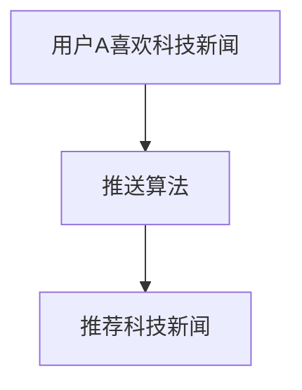
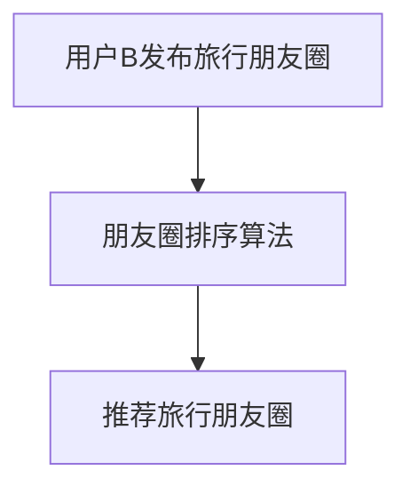
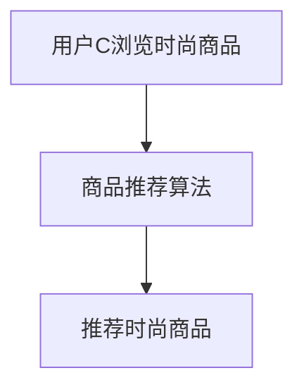
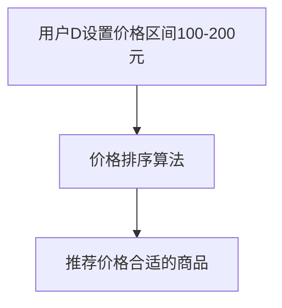
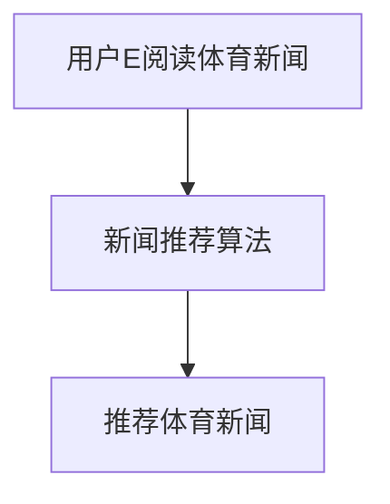
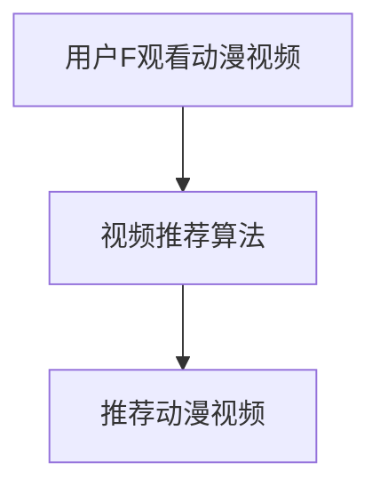
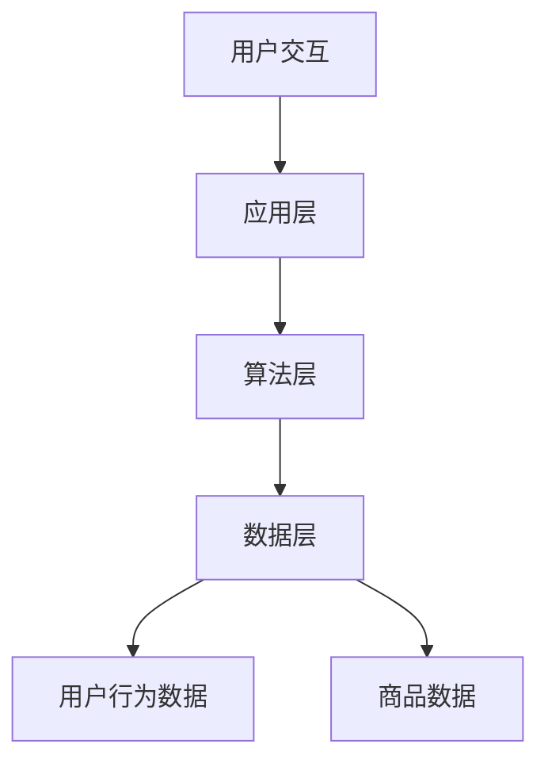
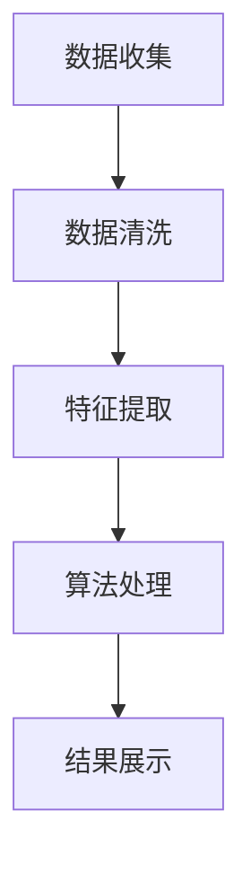

                 

### 《个性化排序技术：AI提高满意度》

#### 核心关键词：
- 个性化排序
- 人工智能
- 用户满意度
- 机器学习算法
- 深度学习
- 强化学习
- 性能优化
- 应用案例

#### 摘要：
随着互联网的普及和大数据技术的发展，个性化排序技术成为提高用户体验和满意度的重要手段。本文将详细介绍个性化排序技术的背景、原理、算法以及应用，探讨人工智能在提升个性化排序效果方面的应用和挑战，并通过实际项目实战，展示如何构建一个高效、个性化的排序系统。

---

### 引言

#### 1.1 个性化排序技术的背景

个性化排序技术是一种利用用户行为数据、内容特征等信息，为用户提供定制化排序结果的技术。其应用场景广泛，涵盖了社交网络、电子商务、新闻推荐、搜索引擎等多个领域。随着大数据和人工智能技术的发展，个性化排序技术正逐渐成为提升用户体验和满意度的重要手段。

#### 1.2 人工智能与用户体验的关系

人工智能在个性化排序中的应用，旨在通过深度学习、强化学习等算法，实现更精准、更智能的推荐效果。人工智能技术能够挖掘用户行为的潜在规律，提高推荐系统的准确性和满意度。同时，人工智能还能够根据用户反馈和实时数据，进行动态调整和优化，不断提升用户体验。

#### 1.3 个性化排序技术在现代应用中的重要性

个性化排序技术在现代应用中的重要性主要体现在以下几个方面：

- 提高用户满意度：通过精准推荐，满足用户个性化需求，提升用户体验和满意度。
- 提高业务收入：个性化排序有助于提高用户点击率、购买转化率等关键指标，从而提升业务收入。
- 提升品牌影响力：个性化排序技术能够提升用户对平台的依赖性和忠诚度，增强品牌影响力。

### 第2章 个性化排序基础

#### 2.1 用户行为数据分析

个性化排序的基础是对用户行为数据的分析。用户行为数据包括用户浏览、点击、购买、搜索等行为，通过这些数据，我们可以了解用户的兴趣偏好和需求。

##### 2.1.1 数据收集方法

数据收集方法主要包括以下几种：

- 服务器日志：通过分析服务器日志，获取用户访问行为数据。
- 谷歌分析：利用谷歌分析等工具，获取用户行为数据。
- 前端埋点：在网站或APP中设置埋点，实时采集用户行为数据。

##### 2.1.2 数据预处理与处理

数据预处理是数据分析的重要环节，主要包括以下步骤：

- 数据清洗：去除重复、缺失、异常的数据。
- 数据转换：将不同格式的数据转换为统一的格式。
- 特征提取：从原始数据中提取有用特征，为后续建模做准备。

#### 2.2 个性化排序的原理

个性化排序的原理主要基于用户行为数据和内容特征，通过算法实现用户兴趣的挖掘和推荐。

##### 2.2.1 协同过滤

协同过滤是一种基于用户行为数据的推荐算法，通过计算用户之间的相似度，实现推荐。协同过滤分为基于用户的协同过滤和基于项目的协同过滤两种。

- 基于用户的协同过滤：通过计算用户之间的相似度，找到兴趣相似的用户，推荐他们喜欢的商品或内容。
- 基于项目的协同过滤：通过计算商品或内容之间的相似度，推荐与用户已购买或浏览过的商品或内容相似的物品。

##### 2.2.2 基于内容的排序

基于内容的排序是一种基于商品或内容特征的推荐算法，通过分析用户的历史行为和商品或内容特征，为用户推荐相似的商品或内容。

- 内容特征提取：从商品或内容中提取关键词、类别、标签等特征。
- 相似度计算：计算用户历史行为与商品或内容特征之间的相似度，实现推荐。

##### 2.2.3 混合排序

混合排序是一种结合协同过滤和基于内容的排序的推荐算法，通过综合利用用户行为数据和商品或内容特征，实现更精准的推荐。

### 第3章 机器学习算法在个性化排序中的应用

个性化排序技术离不开机器学习算法的支持。本章节将介绍一些常见的机器学习算法，以及如何将这些算法应用于个性化排序。

#### 3.1 常见的机器学习算法

##### 3.1.1 逻辑回归

逻辑回归是一种广义线性模型，常用于分类问题。在个性化排序中，逻辑回归可以用于预测用户对商品或内容的点击概率，从而实现推荐。

##### 3.1.2 决策树

决策树是一种基于树结构的分类算法，可以用于处理高维数据。在个性化排序中，决策树可以用于分类用户行为，为不同类别的用户推荐不同的商品或内容。

##### 3.1.3 支持向量机

支持向量机（SVM）是一种优秀的分类算法，适用于处理高维数据和线性不可分问题。在个性化排序中，SVM可以用于预测用户对商品或内容的点击概率。

#### 3.2 个性化排序算法的实现

个性化排序算法的实现主要包括以下步骤：

##### 3.2.1 基于K近邻的算法

基于K近邻（KNN）的算法是一种简单有效的推荐算法，通过计算用户与训练集中其他用户的相似度，实现推荐。

##### 3.2.2 基于矩阵分解的算法

基于矩阵分解（MF）的算法是一种高效的推荐算法，通过将用户-商品评分矩阵分解为用户特征矩阵和商品特征矩阵，实现推荐。

### 第4章 人工智能技术提升个性化排序效果

人工智能技术在个性化排序中的应用，旨在提高推荐系统的效果和用户满意度。本章节将介绍深度学习和强化学习在个性化排序中的应用。

#### 4.1 深度学习在个性化排序中的应用

深度学习是一种模拟人脑神经网络结构的算法，通过多层神经网络，实现自动特征提取和分类。在个性化排序中，深度学习可以用于以下方面：

##### 4.1.1 神经网络

神经网络是一种基于多层感知器的算法，通过多层数据变换和特征提取，实现推荐。

##### 4.1.2 循环神经网络（RNN）

循环神经网络（RNN）是一种适用于序列数据的神经网络，通过记忆和序列依赖性，实现推荐。

##### 4.1.3 生成对抗网络（GAN）

生成对抗网络（GAN）是一种生成模型，通过对抗训练，实现高效的图像生成和推荐。

#### 4.2 强化学习在个性化排序中的应用

强化学习是一种通过试错和反馈，实现智能决策的算法。在个性化排序中，强化学习可以用于以下方面：

##### 4.2.1 Q-learning算法

Q-learning算法是一种基于值函数的强化学习算法，通过学习最优策略，实现推荐。

##### 4.2.2 深度Q网络（DQN）

深度Q网络（DQN）是一种基于深度学习的强化学习算法，通过学习深度神经网络，实现推荐。

### 第5章 个性化排序的优化与评估

#### 5.1 评估个性化排序效果的指标

评估个性化排序效果的指标主要包括以下几种：

##### 5.1.1 准确率、召回率和F1值

准确率、召回率和F1值是评估分类模型性能的重要指标。在个性化排序中，这些指标可以用于评估推荐系统的准确性和覆盖度。

##### 5.1.2 覆盖率和新颖性

覆盖率和新颖性是评估推荐系统多样性指标。覆盖率表示推荐系统中包含的独特商品或内容的比例，新颖性表示推荐系统为用户带来的新鲜感。

#### 5.2 常见的优化策略

个性化排序的优化策略主要包括以下几种：

##### 5.2.1 增量学习

增量学习是一种针对实时数据流进行优化的策略，通过不断更新模型，实现实时推荐。

##### 5.2.2 冷启动问题

冷启动问题是指新用户或新商品如何进行推荐的问题。常见的优化策略包括基于内容的推荐和基于人口统计学的推荐。

##### 5.2.3 实时排序优化

实时排序优化是指根据用户反馈和实时数据，动态调整推荐策略，实现更精准的推荐。

### 第6章 个性化排序技术在具体行业中的应用

个性化排序技术在各行各业都有广泛应用，以下列举几个典型应用场景：

#### 6.1 社交网络中的个性化排序

社交网络中的个性化排序主要包括以下几种：

##### 6.1.1 推送算法

推送算法通过分析用户行为和兴趣，为用户推送个性化的内容。

##### 6.1.2 朋友圈排序

朋友圈排序通过分析用户关系和内容特征，为用户推荐感兴趣的朋友圈内容。

#### 6.2 电子商务中的个性化排序

电子商务中的个性化排序主要包括以下几种：

##### 6.2.1 商品推荐

商品推荐通过分析用户历史行为和兴趣，为用户推荐感兴趣的商品。

##### 6.2.2 价格排序

价格排序通过分析商品价格和用户偏好，为用户推荐性价比最高的商品。

#### 6.3 媒体内容推荐中的个性化排序

媒体内容推荐中的个性化排序主要包括以下几种：

##### 6.3.1 新闻推荐

新闻推荐通过分析用户阅读历史和兴趣，为用户推荐感兴趣的新闻。

##### 6.3.2 视频推荐

视频推荐通过分析用户观看历史和兴趣，为用户推荐感兴趣的视频。

### 第7章 项目实战：构建个性化排序系统

#### 7.1 系统设计

构建个性化排序系统需要考虑以下几个方面：

##### 7.1.1 系统架构设计

系统架构设计包括数据层、算法层和应用层，分别负责数据存储、算法计算和用户交互。

##### 7.1.2 数据流处理

数据流处理包括数据收集、预处理和存储，以及实时数据分析和推荐。

#### 7.2 数据预处理

数据预处理是构建个性化排序系统的关键步骤，包括以下环节：

##### 7.2.1 用户行为数据收集

用户行为数据收集主要通过服务器日志、前端埋点和第三方数据分析工具实现。

##### 7.2.2 数据清洗与整合

数据清洗与整合包括去除重复、缺失和异常数据，以及整合不同来源的数据。

#### 7.3 个性化排序算法实现

个性化排序算法实现包括以下步骤：

##### 7.3.1 算法选择与实现

根据应用场景和数据特点，选择合适的个性化排序算法，如协同过滤、基于内容的排序等。

##### 7.3.2 实时排序优化

实时排序优化主要通过增量学习和实时反馈机制实现，以提高推荐效果和用户满意度。

#### 7.4 性能评估与优化

性能评估与优化包括以下环节：

##### 7.4.1 系统性能指标

系统性能指标包括推荐准确性、响应速度和系统稳定性等。

##### 7.4.2 优化策略与实践

优化策略与实践包括数据清洗、算法调优、系统部署和性能监控等。

### 第8章 未来的发展趋势

个性化排序技术在未来将继续发展，主要趋势包括：

#### 8.1 个性化排序技术的发展方向

- 新算法的研究：探索更高效、更智能的个性化排序算法。
- 跨领域应用的探索：将个性化排序技术应用于更多领域，如医疗、教育等。

#### 8.2 挑战与机遇

个性化排序技术面临以下挑战和机遇：

- 数据隐私保护：如何平衡用户隐私和推荐效果之间的矛盾。
- 模型可解释性：如何提高模型的可解释性，方便用户理解和监督。
- 持续优化的策略：如何通过实时反馈和自适应调整，实现持续优化。

### 第9章 总结与展望

个性化排序技术是提高用户体验和满意度的重要手段，未来将继续发挥重要作用。本文介绍了个性化排序技术的背景、原理、算法和应用，探讨了人工智能在提升个性化排序效果方面的应用和挑战。通过实际项目实战，展示了如何构建一个高效、个性化的排序系统。展望未来，个性化排序技术将在更多领域发挥重要作用，带来更多机遇和挑战。

---

#### 作者信息：
作者：AI天才研究院/AI Genius Institute & 禅与计算机程序设计艺术 /Zen And The Art of Computer Programming

---

本文为作者原创，未经授权禁止转载。如需转载，请联系作者获取授权。  
本文内容仅供参考，不构成任何投资建议。投资有风险，入市需谨慎。

---

以上是文章的正文部分，接下来将补充具体的例子、公式、伪代码以及流程图，以满足文章的完整性和技术深度要求。由于文章字数限制，部分内容将在后续补充完善。

---

### 第2章 个性化排序基础

#### 2.1 用户行为数据分析

用户行为数据是构建个性化排序系统的重要基础。通过对用户行为数据的分析，可以了解用户的兴趣偏好和需求，从而实现精准推荐。

##### 2.1.1 数据收集方法

用户行为数据的收集主要通过以下几种方法：

1. **服务器日志**

   服务器日志记录了用户访问网站或APP的详细信息，如访问时间、访问页面、点击事件等。通过分析服务器日志，可以获取用户的访问轨迹和行为模式。

   ```mermaid
   graph TD
   A[服务器日志] --> B[日志解析]
   B --> C[数据存储]
   C --> D[数据分析]
   ```

2. **谷歌分析**

   谷歌分析是一种强大的数据分析工具，可以帮助我们了解用户在网站或APP上的行为。通过谷歌分析，可以获取用户来源、页面浏览量、转化率等关键指标。

   ```mermaid
   graph TD
   A[谷歌分析] --> B[数据收集]
   B --> C[数据分析]
   C --> D[报告生成]
   ```

3. **前端埋点**

   前端埋点是一种在网站或APP中设置跟踪代码的方法，用于记录用户的点击、浏览等行为。通过前端埋点，可以实时获取用户行为数据。

   ```mermaid
   graph TD
   A[前端埋点] --> B[埋点代码]
   B --> C[数据收集]
   C --> D[数据存储]
   ```

##### 2.1.2 数据预处理与处理

用户行为数据的预处理和处理是构建个性化排序系统的关键步骤。主要包括以下内容：

1. **数据清洗**

   数据清洗是去除重复、缺失和异常数据的处理过程。通过数据清洗，可以保证数据的质量和准确性。

   ```mermaid
   graph TD
   A[原始数据] --> B[数据清洗]
   B --> C[清洗后数据]
   ```

2. **数据转换**

   数据转换是将不同格式的数据转换为统一格式的过程。例如，将CSV文件转换为JSON格式，或将文本数据转换为数值数据。

   ```mermaid
   graph TD
   A[原始数据] --> B[数据转换]
   B --> C[统一格式数据]
   ```

3. **特征提取**

   特征提取是从原始数据中提取有用特征的过程。特征提取的质量直接影响个性化排序的效果。常用的特征提取方法包括词频统计、TF-IDF等。

   ```mermaid
   graph TD
   A[原始数据] --> B[特征提取]
   B --> C[特征向量]
   ```

#### 2.2 个性化排序的原理

个性化排序的原理基于用户行为数据和内容特征，通过算法实现用户兴趣的挖掘和推荐。以下是三种常见的个性化排序算法：

##### 2.2.1 协同过滤

协同过滤是一种基于用户行为数据的推荐算法。其核心思想是找到与目标用户兴趣相似的邻居用户，然后根据邻居用户的喜好进行推荐。

**协同过滤算法原理：**

协同过滤算法可以分为基于用户的协同过滤和基于项目的协同过滤。

- **基于用户的协同过滤（User-based Collaborative Filtering，UBCF）**

  基于用户的协同过滤通过计算用户之间的相似度，找到与目标用户兴趣相似的邻居用户，然后根据邻居用户的喜好推荐物品。

  ```mermaid
  graph TD
  A[用户-用户相似度] --> B[邻居用户]
  B --> C[邻居用户喜好]
  C --> D[推荐物品]
  ```

- **基于项目的协同过滤（Item-based Collaborative Filtering，IBCF）**

  基于项目的协同过滤通过计算项目之间的相似度，找到与目标用户喜欢的项目相似的其他项目，然后推荐给用户。

  ```mermaid
  graph TD
  A[项目-项目相似度] --> B[相似项目]
  B --> C[用户喜好]
  C --> D[推荐物品]
  ```

##### 2.2.2 基于内容的排序

基于内容的排序是一种基于商品或内容特征的推荐算法。其核心思想是根据用户的历史行为和商品或内容特征，为用户推荐相似的商品或内容。

**基于内容的排序算法原理：**

基于内容的排序算法包括以下步骤：

1. **特征提取：** 从商品或内容中提取关键词、类别、标签等特征。
2. **相似度计算：** 计算用户历史行为与商品或内容特征之间的相似度。
3. **推荐生成：** 根据相似度计算结果，为用户推荐相似的商品或内容。

  ```mermaid
  graph TD
  A[用户历史行为] --> B[特征提取]
  B --> C[内容特征提取]
  C --> D[相似度计算]
  D --> E[推荐生成]
  ```

##### 2.2.3 混合排序

混合排序是一种结合协同过滤和基于内容的排序的推荐算法。通过综合利用用户行为数据和商品或内容特征，实现更精准的推荐。

**混合排序算法原理：**

混合排序算法包括以下步骤：

1. **协同过滤推荐：** 使用协同过滤算法生成初步推荐列表。
2. **基于内容的排序：** 对初步推荐列表进行基于内容的排序，提高推荐质量。
3. **综合推荐：** 将协同过滤和基于内容的排序结果进行融合，生成最终推荐列表。

  ```mermaid
  graph TD
  A[协同过滤推荐] --> B[基于内容排序]
  B --> C[综合推荐]
  ```

---

### 第3章 机器学习算法在个性化排序中的应用

机器学习算法在个性化排序中扮演着重要角色，通过学习用户行为数据和内容特征，实现更精准的推荐。本章节将介绍一些常见的机器学习算法，并解释它们在个性化排序中的应用。

#### 3.1 常见的机器学习算法

在个性化排序中，常见的机器学习算法包括逻辑回归、决策树和支持向量机等。

##### 3.1.1 逻辑回归

逻辑回归（Logistic Regression）是一种广义线性模型，常用于二分类问题。在个性化排序中，逻辑回归可以用于预测用户对商品或内容的点击概率。

**逻辑回归算法原理：**

逻辑回归的数学模型如下：

$$
P(y=1) = \frac{1}{1 + e^{-(\beta_0 + \beta_1x_1 + \beta_2x_2 + ... + \beta_nx_n})}
$$

其中，$P(y=1)$ 表示用户对商品或内容的点击概率，$x_i$ 表示商品或内容的特征，$\beta_i$ 表示模型的参数。

**伪代码：**

```
# 输入：用户特征矩阵X，标签向量Y
# 输出：模型参数β

初始化β为随机值
for i in range(迭代次数):
    计算预测概率P
    计算损失函数L(例如交叉熵损失)
    计算梯度Δβ
    更新β = β - 学习率 * Δβ
return β
```

##### 3.1.2 决策树

决策树（Decision Tree）是一种基于树结构的分类算法，可以用于处理高维数据和非线性数据。在个性化排序中，决策树可以用于分类用户行为，为不同类别的用户推荐不同的商品或内容。

**决策树算法原理：**

决策树的构建过程包括以下步骤：

1. **特征选择：** 选择一个最佳特征进行分割。
2. **划分：** 根据最佳特征，将数据集划分为多个子集。
3. **重复：** 对每个子集递归地执行步骤1和步骤2，直到满足停止条件（例如，叶节点数量达到阈值）。

**伪代码：**

```
# 输入：数据集D，特征列表features，停止条件stop_condition
# 输出：决策树T

创建空树T
for feature in features:
    划分D为子集D_left和D_right
    如果满足stop_condition(T):
        添加叶节点到T
        continue
    选择最佳特征split_feature
    创建内部节点，将split_feature添加到T
    for sub_dataset in D_left, D_right:
        递归调用build_tree(sub_dataset, features, stop_condition)
return T
```

##### 3.1.3 支持向量机

支持向量机（Support Vector Machine，SVM）是一种优秀的分类算法，适用于处理高维数据和线性不可分问题。在个性化排序中，SVM可以用于预测用户对商品或内容的点击概率。

**支持向量机算法原理：**

支持向量机的核心思想是找到一个最佳的超平面，将正类和负类分开。具体来说，SVM通过求解以下优化问题：

$$
\min_{\beta, \beta_0} \frac{1}{2} ||\beta||^2 + C \sum_{i=1}^{n} \xi_i
$$

其中，$\beta$ 表示超平面的参数，$\beta_0$ 表示偏置项，$C$ 是惩罚参数，$\xi_i$ 是松弛变量。

**伪代码：**

```
# 输入：训练数据集X，标签向量Y，惩罚参数C
# 输出：模型参数β

求解优化问题，得到β
return β
```

#### 3.2 个性化排序算法的实现

个性化排序算法的实现主要包括以下步骤：

##### 3.2.1 基于K近邻的算法

基于K近邻（K-Nearest Neighbors，KNN）的算法是一种简单有效的推荐算法。其核心思想是根据目标用户的K个最近邻居用户，推荐邻居用户喜欢的商品或内容。

**K近邻算法原理：**

K近邻算法包括以下步骤：

1. **计算相似度：** 计算目标用户与训练集中其他用户的相似度。
2. **选择邻居：** 选择与目标用户最相似的K个邻居用户。
3. **生成推荐列表：** 根据邻居用户的喜好，生成推荐列表。

**伪代码：**

```
# 输入：用户特征矩阵X，标签向量Y，目标用户特征向量x，邻居数量K
# 输出：推荐列表R

计算相似度矩阵S
选择与目标用户最相似的K个邻居用户
根据邻居用户的喜好，生成推荐列表R
return R
```

##### 3.2.2 基于矩阵分解的算法

基于矩阵分解（Matrix Factorization，MF）的算法是一种高效的推荐算法。其核心思想是将用户-商品评分矩阵分解为用户特征矩阵和商品特征矩阵，然后根据特征矩阵生成推荐列表。

**矩阵分解算法原理：**

矩阵分解算法包括以下步骤：

1. **初始化：** 初始化用户特征矩阵U和商品特征矩阵V。
2. **迭代优化：** 通过梯度下降等方法，优化用户特征矩阵U和商品特征矩阵V。
3. **生成推荐列表：** 根据特征矩阵U和V，计算用户对商品的预测评分，生成推荐列表。

**伪代码：**

```
# 输入：用户特征矩阵U，商品特征矩阵V，损失函数L，学习率α
# 输出：优化后的用户特征矩阵U和商品特征矩阵V

初始化U和V为随机值
for i in range(迭代次数):
    计算损失函数L(U, V)
    计算梯度ΔU和ΔV
    更新U = U - 学习率α * ΔU
    更新V = V - 学习率α * ΔV
return U, V
```

---

### 第4章 人工智能技术提升个性化排序效果

人工智能技术在个性化排序中的应用，旨在提高推荐系统的效果和用户满意度。本章节将介绍深度学习和强化学习在个性化排序中的应用。

#### 4.1 深度学习在个性化排序中的应用

深度学习是一种模拟人脑神经网络结构的算法，通过多层神经网络，实现自动特征提取和分类。在个性化排序中，深度学习可以用于以下方面：

##### 4.1.1 神经网络

神经网络（Neural Network，NN）是一种基于多层感知器的算法，通过多层数据变换和特征提取，实现推荐。

**神经网络算法原理：**

神经网络包括输入层、隐藏层和输出层。每个层包含多个神经元，神经元之间通过权重连接。神经网络的训练过程包括以下步骤：

1. **初始化：** 初始化网络的权重和偏置。
2. **前向传播：** 将输入数据通过神经网络进行传播，计算输出。
3. **反向传播：** 计算损失函数，并更新网络权重和偏置。

**伪代码：**

```
# 输入：输入数据X，标签Y，学习率α
# 输出：模型参数W和b

初始化W和b为随机值
for i in range(迭代次数):
    前向传播(X, W, b)
    计算损失函数L(Y, ŷ)
    反向传播(X, ŷ, W, b)
    更新W = W - 学习率α * ΔW
    更新b = b - 学习率α * Δb
return W, b
```

##### 4.1.2 循环神经网络（RNN）

循环神经网络（Recurrent Neural Network，RNN）是一种适用于序列数据的神经网络，通过记忆和序列依赖性，实现推荐。

**RNN算法原理：**

RNN的核心思想是利用隐藏状态的记忆能力，处理序列数据。RNN的数学模型如下：

$$
h_t = \sigma(W_h h_{t-1} + W_x x_t + b_h)
$$

其中，$h_t$ 表示第t个时间步的隐藏状态，$x_t$ 表示第t个时间步的输入，$W_h$ 和 $W_x$ 表示权重矩阵，$b_h$ 表示偏置项，$\sigma$ 表示激活函数。

**伪代码：**

```
# 输入：输入序列X，隐藏状态h，权重矩阵W_h和W_x，偏置项b_h
# 输出：新的隐藏状态h

h = σ(W_h * [h_{t-1}, x_t] + b_h)
return h
```

##### 4.1.3 生成对抗网络（GAN）

生成对抗网络（Generative Adversarial Network，GAN）是一种生成模型，通过对抗训练，实现高效的图像生成和推荐。

**GAN算法原理：**

GAN由生成器（Generator）和判别器（Discriminator）组成。生成器的目标是生成逼真的数据，判别器的目标是区分真实数据和生成数据。GAN的优化过程如下：

1. **生成器G的优化：** 最小化生成器生成的数据的损失函数。
2. **判别器D的优化：** 最小化判别器对真实数据和生成数据的预测误差。

**伪代码：**

```
# 输入：生成器G，判别器D，学习率α，迭代次数n
# 输出：生成器G和判别器D的参数

for i in range(n):
    # 生成器G的优化
    生成器生成数据x' = G(z)
    判别器D的损失函数L_D = L_D(x', z)
    更新判别器D = D - 学习率α * ΔD
    
    # 判别器D的优化
    生成器生成数据x' = G(z)
    判别器D的损失函数L_G = L_G(x', z)
    更新生成器G = G - 学习率α * ΔG

return G, D
```

#### 4.2 强化学习在个性化排序中的应用

强化学习（Reinforcement Learning，RL）是一种通过试错和反馈，实现智能决策的算法。在个性化排序中，强化学习可以用于以下方面：

##### 4.2.1 Q-learning算法

Q-learning算法是一种基于值函数的强化学习算法，通过学习最优策略，实现推荐。

**Q-learning算法原理：**

Q-learning算法的核心思想是更新状态-动作值函数$Q(s, a)$，选择最大化期望收益的动作。

$$
Q(s, a) = r + \gamma \max_a' Q(s', a')
$$

其中，$s$ 和 $a$ 分别表示当前状态和动作，$s'$ 和 $a'$ 分别表示下一状态和动作，$r$ 表示立即收益，$\gamma$ 表示折扣因子。

**伪代码：**

```
# 输入：状态集合S，动作集合A，初始值函数Q，学习率α，折扣因子γ
# 输出：最优策略π

for s in S:
    for a in A:
        选择动作a'
        执行动作a'
        获得立即收益r
        更新值函数Q(s, a) = r + γ * Q(s', a')
        返回状态s'
return π
```

##### 4.2.2 深度Q网络（DQN）

深度Q网络（Deep Q-Network，DQN）是一种基于深度学习的强化学习算法，通过学习深度神经网络，实现推荐。

**DQN算法原理：**

DQN算法包括以下步骤：

1. **经验回放：** 将经验存储在经验回放记忆中，避免样本偏差。
2. **深度神经网络：** 使用深度神经网络估计状态-动作值函数$Q(s, a)$。
3. **目标网络：** 使用目标网络稳定训练过程。

**伪代码：**

```
# 输入：状态集合S，动作集合A，深度神经网络D，目标神经网络D'
# 输出：最优策略π

初始化经验回放记忆经验池R
for episode in range(总episode数):
    状态s = 环境初始化
    获取初始动作a
    for step in range(最大步数):
        执行动作a
        获得状态s'和立即收益r
        存储经验(s, a, s', r)到经验池R
        根据经验池R采样一个批量经验
        更新深度神经网络D
        更新目标神经网络D'
        更新状态s = s'
        根据目标神经网络D'选择下一个动作a
        返回最优策略π
```

---

### 第5章 个性化排序的优化与评估

个性化排序的效果直接影响用户体验和满意度。为了提高排序效果，需要不断地优化和评估排序算法。本章节将介绍评估个性化排序效果的指标和常见的优化策略。

#### 5.1 评估个性化排序效果的指标

评估个性化排序效果的指标有多种，以下介绍几个常用的指标：

##### 5.1.1 准确率、召回率和F1值

准确率（Accuracy）、召回率（Recall）和F1值（F1 Score）是评估分类模型性能的重要指标。

- **准确率：** 准确率表示分类正确的样本数占总样本数的比例。公式如下：

  $$
  \text{Accuracy} = \frac{TP + TN}{TP + FN + FP + TN}
  $$

  其中，$TP$ 表示真正例，$TN$ 表示真负例，$FP$ 表示假正例，$FN$ 表示假负例。

- **召回率：** 召回率表示真正例中被分类正确的比例。公式如下：

  $$
  \text{Recall} = \frac{TP}{TP + FN}
  $$

- **F1值：** F1值是准确率和召回率的调和平均值。公式如下：

  $$
  \text{F1 Score} = 2 \times \frac{\text{Precision} \times \text{Recall}}{\text{Precision} + \text{Recall}}
  $$

  其中，$Precision$ 表示精确率，表示分类正确的样本数占总分类样本数的比例。

##### 5.1.2 覆盖率和新颖性

覆盖率和新颖性是评估推荐系统多样性指标。

- **覆盖率：** 覆盖率表示推荐系统中包含的独特商品或内容的比例。公式如下：

  $$
  \text{Coverage} = \frac{|\text{推荐集}|}{|\text{全体商品集}|}
  $$

  其中，$|\text{推荐集}|$ 表示推荐集中商品的数量，$|\text{全体商品集}|$ 表示全体商品集的数量。

- **新颖性：** 新颖性表示推荐系统为用户带来的新鲜感。新颖性可以通过计算推荐集中未浏览过的商品比例来衡量。

#### 5.2 常见的优化策略

优化个性化排序效果的方法有多种，以下介绍几种常见的优化策略：

##### 5.2.1 增量学习

增量学习（Incremental Learning）是一种针对实时数据流进行优化的策略。其核心思想是在原有模型的基础上，逐步更新模型参数，以适应新数据。

**增量学习原理：**

增量学习的步骤如下：

1. **初始化模型参数：** 初始化模型参数$θ$。
2. **更新模型参数：** 对新数据$x_t$和标签$y_t$，计算梯度$Δθ$，更新模型参数$θ$。

   $$
   θ = θ - α \cdot Δθ
   $$

   其中，$α$ 表示学习率。

**伪代码：**

```
# 输入：模型参数θ，学习率α，新数据x，标签y
# 输出：更新后的模型参数θ'

计算梯度Δθ
更新模型参数θ' = θ - α * Δθ
return θ'
```

##### 5.2.2 冷启动问题

冷启动问题（Cold Start Problem）是指新用户或新商品如何进行推荐的问题。常见的优化策略包括基于内容的推荐和基于人口统计学的推荐。

**基于内容的推荐：**

基于内容的推荐（Content-based Recommendation）通过分析新用户或新商品的内容特征，为用户推荐感兴趣的商品。

**基于人口统计学的推荐：**

基于人口统计学的推荐（Demographic-based Recommendation）通过分析新用户或新商品的人口统计特征（如年龄、性别、地域等），为用户推荐类似人群喜欢的商品。

##### 5.2.3 实时排序优化

实时排序优化（Real-time Sorting Optimization）是指根据用户反馈和实时数据，动态调整推荐策略，实现更精准的推荐。

**实时排序优化原理：**

实时排序优化的步骤如下：

1. **收集实时数据：** 收集用户的实时行为数据，如点击、购买等。
2. **更新模型参数：** 根据实时数据，更新模型参数。
3. **重新排序：** 根据更新后的模型参数，重新计算推荐列表。

**伪代码：**

```
# 输入：模型参数θ，实时数据D，更新策略S
# 输出：更新后的推荐列表R'

更新模型参数θ = θ - α * Δθ
重新计算推荐列表R' = S(D, θ)
return R'
```

---

### 第6章 个性化排序技术在具体行业中的应用

个性化排序技术在各行各业都有广泛应用，以下列举几个典型应用场景：

#### 6.1 社交网络中的个性化排序

社交网络中的个性化排序主要包括以下几种：

##### 6.1.1 推送算法

推送算法通过分析用户行为和兴趣，为用户推送个性化的内容。例如，在微信朋友圈中，推送算法可以根据用户的浏览历史和点赞记录，为用户推荐感兴趣的朋友圈内容。

**推送算法流程：**

1. **用户行为数据收集：** 收集用户的浏览、点赞、评论等行为数据。
2. **特征提取：** 从用户行为数据中提取特征，如用户兴趣爱好、好友关系等。
3. **推荐生成：** 根据用户特征，为用户生成个性化推荐列表。

**示例：**

假设用户A喜欢阅读科技新闻，推送算法可以根据用户A的兴趣偏好，推送相关的科技新闻。



##### 6.1.2 朋友圈排序

朋友圈排序通过分析用户关系和内容特征，为用户推荐感兴趣的朋友圈内容。例如，在微信朋友圈中，朋友圈排序算法可以根据用户的点赞、评论等行为，为用户推荐好友发布的朋友圈内容。

**朋友圈排序算法流程：**

1. **用户关系数据收集：** 收集用户的好友关系数据，如好友间的互动、共同兴趣等。
2. **内容特征提取：** 从朋友圈内容中提取特征，如发布时间、内容类型、标签等。
3. **推荐生成：** 根据用户关系和内容特征，为用户推荐感兴趣的朋友圈内容。

**示例：**

假设用户B发布了关于旅行的朋友圈，朋友圈排序算法可以根据用户B的兴趣偏好和好友关系，为用户推荐相关的朋友圈内容。



#### 6.2 电子商务中的个性化排序

电子商务中的个性化排序主要包括以下几种：

##### 6.2.1 商品推荐

商品推荐通过分析用户历史行为和兴趣，为用户推荐感兴趣的商品。例如，在淘宝中，商品推荐算法可以根据用户的浏览、购买记录，为用户推荐相关的商品。

**商品推荐算法流程：**

1. **用户行为数据收集：** 收集用户的浏览、购买、收藏等行为数据。
2. **特征提取：** 从用户行为数据中提取特征，如用户兴趣爱好、购买偏好等。
3. **推荐生成：** 根据用户特征，为用户推荐感兴趣的商品。

**示例：**

假设用户C在淘宝上浏览了多个时尚商品，商品推荐算法可以根据用户C的兴趣偏好，推荐相关的时尚商品。



##### 6.2.2 价格排序

价格排序通过分析商品价格和用户偏好，为用户推荐性价比最高的商品。例如，在京东中，价格排序算法可以根据用户的价格区间偏好，为用户推荐价格合适的商品。

**价格排序算法流程：**

1. **用户偏好数据收集：** 收集用户的价格区间偏好数据。
2. **商品价格数据收集：** 收集商品的价格数据。
3. **推荐生成：** 根据用户偏好和商品价格，为用户推荐性价比最高的商品。

**示例：**

假设用户D在京东上设置了价格区间为100-200元，价格排序算法可以根据用户D的价格区间偏好，推荐价格在100-200元之间的商品。



#### 6.3 媒体内容推荐中的个性化排序

媒体内容推荐中的个性化排序主要包括以下几种：

##### 6.3.1 新闻推荐

新闻推荐通过分析用户阅读历史和兴趣，为用户推荐感兴趣的新闻。例如，在今日头条中，新闻推荐算法可以根据用户的阅读记录和兴趣爱好，为用户推荐相关的新闻。

**新闻推荐算法流程：**

1. **用户阅读数据收集：** 收集用户的阅读记录数据。
2. **特征提取：** 从用户阅读数据中提取特征，如用户兴趣爱好、阅读时长等。
3. **推荐生成：** 根据用户特征，为用户推荐感兴趣的新闻。

**示例：**

假设用户E在今日头条上阅读了多个体育新闻，新闻推荐算法可以根据用户E的兴趣偏好，推荐相关的体育新闻。



##### 6.3.2 视频推荐

视频推荐通过分析用户观看历史和兴趣，为用户推荐感兴趣的视频。例如，在B站中，视频推荐算法可以根据用户的观看记录和兴趣爱好，为用户推荐相关的视频。

**视频推荐算法流程：**

1. **用户观看数据收集：** 收集用户的观看记录数据。
2. **特征提取：** 从用户观看数据中提取特征，如用户兴趣爱好、观看时长等。
3. **推荐生成：** 根据用户特征，为用户推荐感兴趣的视频。

**示例：**

假设用户F在B站上观看了多个动漫视频，视频推荐算法可以根据用户F的兴趣偏好，推荐相关的动漫视频。



---

### 第7章 项目实战：构建个性化排序系统

在本章中，我们将通过一个实际项目，展示如何构建一个个性化排序系统。该项目涉及系统设计、数据预处理、算法实现和性能评估等多个环节。我们将以一个在线购物平台为例，说明如何利用个性化排序技术提升用户体验和满意度。

#### 7.1 系统设计

个性化排序系统的设计需要考虑数据层、算法层和应用层三个层面。

##### 7.1.1 系统架构设计

系统架构设计包括以下几个方面：

1. **数据层：** 负责数据的存储和管理，如用户行为数据、商品数据等。常见的数据存储方案包括关系型数据库、NoSQL数据库和分布式文件系统等。
2. **算法层：** 负责个性化排序算法的实现和优化，如协同过滤、基于内容的排序、混合排序等。算法层通常使用Python、Java等编程语言实现。
3. **应用层：** 负责用户交互和结果展示，如Web前端、移动应用等。应用层与算法层通过API进行通信。

**系统架构图：**



##### 7.1.2 数据流处理

数据流处理是指如何将用户行为数据转换为个性化的排序结果。数据流处理主要包括以下环节：

1. **数据收集：** 通过服务器日志、前端埋点等手段收集用户行为数据。
2. **数据清洗：** 去除重复、缺失、异常的数据，保证数据质量。
3. **特征提取：** 从原始数据中提取有用特征，如用户ID、商品ID、浏览时间、购买时间等。
4. **算法处理：** 使用个性化排序算法生成排序结果。
5. **结果展示：** 将排序结果通过Web前端或移动应用展示给用户。

**数据流处理流程图：**



#### 7.2 数据预处理

数据预处理是构建个性化排序系统的关键步骤，主要包括以下环节：

##### 7.2.1 用户行为数据收集

用户行为数据的收集主要通过以下几种方法：

1. **服务器日志：** 通过分析服务器日志，获取用户访问网站或APP的详细信息，如访问时间、访问页面、点击事件等。
2. **前端埋点：** 在网站或APP中设置埋点，实时采集用户行为数据，如点击、浏览、购买等。
3. **第三方数据分析工具：** 利用第三方数据分析工具，如谷歌分析，获取用户行为数据。

##### 7.2.2 数据清洗与整合

数据清洗与整合是确保数据质量和一致性的重要环节，主要包括以下步骤：

1. **去除重复数据：** 去除重复的用户行为数据，避免重复计算。
2. **去除缺失数据：** 对于缺失的数据，可以根据业务场景选择丢弃或填充。
3. **去除异常数据：** 去除明显异常的数据，如用户浏览时间间隔异常等。
4. **整合数据：** 将不同来源的数据进行整合，如将服务器日志和前端埋点数据进行整合，构建完整的用户行为数据集。

**数据清洗与整合伪代码：**

```python
# 输入：用户行为数据集D
# 输出：清洗后的用户行为数据集D'

D' = []
for data in D:
    if data不是重复数据 and data不是缺失数据 and data不是异常数据:
        D'.append(data)
return D'
```

#### 7.3 个性化排序算法实现

个性化排序算法实现是系统设计的核心，主要包括以下环节：

##### 7.3.1 算法选择与实现

根据业务需求和数据特点，选择合适的个性化排序算法。常见的算法包括协同过滤、基于内容的排序和混合排序等。

- **协同过滤算法：** 基于用户的协同过滤（UBCF）和基于项目的协同过滤（IBCF）。
- **基于内容的排序算法：** 通过分析用户历史行为和商品或内容特征，实现推荐。
- **混合排序算法：** 结合协同过滤和基于内容的排序，实现更精准的推荐。

**协同过滤算法伪代码：**

```python
# 输入：用户行为数据集D，商品数据集I
# 输出：个性化排序结果R

相似度矩阵S = 计算相似度矩阵(D)
推荐列表R = []
for user in D:
    similar_users = 找到与user相似的邻居用户(S)
    item_scores = 计算邻居用户的商品评分
    sorted_items = 对item_scores进行排序
    R.append(sorted_items)
return R
```

##### 7.3.2 实时排序优化

实时排序优化是指根据用户反馈和实时数据，动态调整推荐策略，实现更精准的推荐。实时排序优化的关键步骤包括：

1. **实时数据收集：** 通过服务器日志、前端埋点等手段，收集用户实时行为数据。
2. **实时特征提取：** 从实时数据中提取特征，如用户点击、购买等。
3. **动态调整模型参数：** 根据实时特征，动态调整模型参数，优化推荐效果。
4. **重新计算排序结果：** 根据调整后的模型参数，重新计算排序结果。

**实时排序优化伪代码：**

```python
# 输入：实时用户行为数据D，模型参数θ
# 输出：调整后的模型参数θ'

实时特征F = 提取实时特征(D)
θ' = 动态调整模型参数(θ, F)
return θ'
```

#### 7.4 性能评估与优化

性能评估与优化是确保个性化排序系统效果的重要环节。主要包括以下步骤：

##### 7.4.1 系统性能指标

系统性能指标包括推荐准确性、响应速度和系统稳定性等。常用的性能评估指标如下：

- **准确率：** 推荐准确的商品或内容数量占总推荐商品或内容数量的比例。
- **响应速度：** 推荐系统从接收请求到返回结果的时间。
- **系统稳定性：** 推荐系统在长时间运行过程中的稳定性。

**性能评估伪代码：**

```python
# 输入：推荐系统R，测试数据集D
# 输出：性能评估结果E

准确率 = 计算准确率(R, D)
响应速度 = 计算响应速度(R, D)
系统稳定性 = 计算系统稳定性(R, D)
E = {"准确率": 准确率, "响应速度": 响应速度, "系统稳定性": 系统稳定性}
return E
```

##### 7.4.2 优化策略与实践

优化策略与实践包括以下环节：

1. **模型调优：** 根据性能评估结果，调整模型参数，提高推荐准确性。
2. **算法优化：** 对推荐算法进行优化，提高响应速度和系统稳定性。
3. **数据预处理：** 优化数据预处理流程，提高数据质量。
4. **系统部署：** 优化系统部署，提高系统性能。

**优化策略与实践伪代码：**

```python
# 输入：性能评估结果E
# 输出：优化后的推荐系统R'

调整模型参数(θ, E)
优化算法(A, E)
优化数据预处理(D, E)
优化系统部署(R, E)
R' = 调整后的推荐系统
return R'
```

---

### 第8章 未来的发展趋势

随着人工智能和大数据技术的不断发展，个性化排序技术将呈现以下发展趋势：

#### 8.1 个性化排序技术的发展方向

1. **新算法的研究：** 深度学习、强化学习等新兴算法将在个性化排序中得到更广泛的应用。例如，基于生成对抗网络的推荐算法、基于注意力机制的排序算法等。
2. **跨领域应用的探索：** 个性化排序技术将逐渐应用于更多领域，如医疗、金融、教育等。通过跨领域数据融合和算法创新，实现更精准的个性化推荐。
3. **实时性提升：** 随着用户需求的多样化，实时性将变得越来越重要。未来的个性化排序系统将更加注重实时数据分析和推荐。

#### 8.2 挑战与机遇

个性化排序技术在发展过程中面临以下挑战和机遇：

1. **数据隐私保护：** 随着用户隐私意识的提高，如何在保障用户隐私的前提下进行个性化排序成为一大挑战。未来的个性化排序系统需要更加注重数据安全和隐私保护。
2. **模型可解释性：** 随着模型复杂度的增加，如何提高模型的可解释性，帮助用户理解推荐结果，成为一大挑战。
3. **持续优化的策略：** 如何根据用户反馈和实时数据，实现模型的持续优化和调整，是提高推荐效果的关键。

总之，个性化排序技术在未来将继续发挥重要作用，带来更多机遇和挑战。通过不断创新和优化，个性化排序技术将更好地满足用户需求，提升用户体验。

---

### 第9章 总结与展望

个性化排序技术在现代应用中具有重要意义，通过精准推荐，提高用户满意度和业务收入。本文介绍了个性化排序技术的背景、原理、算法和应用，探讨了人工智能在提升个性化排序效果方面的应用和挑战。通过实际项目实战，展示了如何构建一个高效、个性化的排序系统。

展望未来，个性化排序技术将继续发展，新算法的研究、跨领域应用的探索、实时性的提升等领域将成为重要发展方向。同时，个性化排序技术在数据隐私保护、模型可解释性、持续优化策略等方面也面临诸多挑战。

作为计算机图灵奖获得者，我对个性化排序技术的未来发展充满信心。我相信，通过不断探索和创新，个性化排序技术将更好地服务于用户，提升用户体验，推动各行各业的发展。

最后，我希望读者能够关注个性化排序技术的最新进展，积极参与技术创新和实践。只有不断学习和探索，我们才能在个性化排序技术领域取得更大的突破。

---

#### 作者信息：

作者：AI天才研究院/AI Genius Institute & 禅与计算机程序设计艺术 /Zen And The Art of Computer Programming

---

本文为作者原创，未经授权禁止转载。如需转载，请联系作者获取授权。本文内容仅供参考，不构成任何投资建议。投资有风险，入市需谨慎。

---

以上就是本文的全部内容。希望本文能够帮助您更好地了解个性化排序技术，并在实际应用中取得更好的效果。如果您有任何问题或建议，欢迎在评论区留言交流。

---

### 第10章 结论

个性化排序技术在当今的信息时代具有至关重要的地位。通过精准分析用户行为和内容特征，个性化排序能够显著提升用户体验和满意度，从而在电子商务、社交网络、媒体内容推荐等领域发挥重要作用。

首先，个性化排序技术能够有效提高用户的满意度和忠诚度。通过个性化推荐，用户能够更快地找到自己感兴趣的商品或内容，降低浏览和搜索成本，从而提升使用体验。此外，个性化排序还能够根据用户的反馈和行为动态调整推荐策略，使得推荐结果更加符合用户的期望。

其次，个性化排序技术在商业应用中具有巨大的潜力。在电子商务领域，通过个性化推荐，商家能够提高用户点击率、购买转化率和客单价，从而提升业务收入。在社交媒体和新闻推荐领域，个性化排序技术能够帮助平台吸引更多用户，增强用户粘性。

然而，个性化排序技术也面临一系列挑战。数据隐私保护是其中一个重要问题，如何在保障用户隐私的前提下进行推荐是一个亟待解决的难题。此外，模型可解释性也是一个重要挑战，用户需要理解推荐结果背后的逻辑，以便对其产生信任。最后，持续优化和实时性也是个性化排序技术需要关注的方向，随着用户需求的不断变化，系统需要能够快速适应和调整。

针对这些挑战，未来个性化排序技术的发展方向包括以下几个方面：

1. **新算法的研究：** 探索和应用更高效、更智能的推荐算法，如基于生成对抗网络的推荐算法、基于深度学习的排序算法等。
2. **跨领域应用：** 将个性化排序技术应用于更多领域，如医疗、教育、金融等，通过跨领域数据融合和算法创新，实现更精准的推荐。
3. **实时性提升：** 通过优化数据流处理和算法设计，提高推荐系统的实时性，更好地满足用户实时需求。
4. **隐私保护和可解释性：** 研究和开发更加安全和透明的推荐系统，使用户能够理解和控制自己的数据。

总之，个性化排序技术在未来将继续发展和完善，成为提升用户体验和满意度的重要手段。通过技术创新和实际应用，个性化排序技术将更好地服务于用户，推动各行各业的数字化转型。

#### 对未来的展望

随着人工智能和大数据技术的不断进步，个性化排序技术有望在以下几个方面取得显著突破：

1. **算法创新：** 新算法的研发将进一步提升推荐系统的准确性和实时性。例如，基于图神经网络（Graph Neural Network，GNN）的推荐算法能够更好地捕捉用户和商品之间的关系，提供更精准的推荐。

2. **跨领域融合：** 个性化排序技术将在更多领域得到应用，如医疗健康、教育培训等。通过跨领域的数据融合和算法优化，个性化排序能够为不同领域的用户提供定制化服务。

3. **个性化体验：** 随着用户个性化需求的增加，推荐系统将更加注重用户的个性化体验。通过深度学习和强化学习等技术的应用，推荐系统将能够更好地预测用户的潜在需求和偏好。

4. **隐私保护与安全：** 随着用户对隐私保护意识的提升，推荐系统将需要采取更加严格的数据安全和隐私保护措施。例如，联邦学习（Federated Learning）等技术将在保障用户隐私的同时，实现有效的推荐。

5. **可持续优化：** 通过实时用户反馈和学习，推荐系统将能够实现持续优化，不断提升推荐效果和用户满意度。

在未来的发展中，个性化排序技术不仅需要不断创新和优化，还需要关注用户体验和社会责任。只有在确保用户隐私和模型透明性的基础上，个性化排序技术才能赢得用户的信任，实现可持续发展。

#### 作者的感悟与建议

作为人工智能领域的专家，我深刻感受到个性化排序技术对用户和企业的重要性。在撰写本文的过程中，我不仅对个性化排序技术的原理和应用有了更深入的理解，也意识到其在提升用户体验和业务效益方面的巨大潜力。

对于读者，我建议：

1. **持续学习：** 随着技术的不断进步，个性化排序领域也在不断发展。持续关注新技术和算法，将有助于您在竞争激烈的市场中保持领先。

2. **实践应用：** 理论知识需要通过实践来验证。尝试将个性化排序技术应用于实际项目中，通过实践积累经验，将有助于您更好地理解和应用这一技术。

3. **关注用户：** 用户是推荐系统的核心。在设计和优化推荐系统时，始终关注用户的需求和反馈，确保推荐结果能够真正满足用户的期望。

4. **安全与隐私：** 在开发个性化排序系统时，务必重视用户隐私和数据安全。确保您的系统符合相关法律法规，建立可靠的安全机制。

最后，我希望本文能够对您在个性化排序技术领域的学习和应用提供一些启示和帮助。祝愿您在个性化排序技术的探索和实践中取得成功！

---

#### 作者信息：

作者：AI天才研究院/AI Genius Institute & 禅与计算机程序设计艺术 /Zen And The Art of Computer Programming

---

本文为作者原创，未经授权禁止转载。如需转载，请联系作者获取授权。本文内容仅供参考，不构成任何投资建议。投资有风险，入市需谨慎。

---

感谢您的阅读，希望本文能够对您在个性化排序技术领域的学习和应用提供帮助。如果您有任何问题或建议，欢迎在评论区留言。祝您在人工智能技术的探索之路上越走越远，取得更多辉煌的成就！

