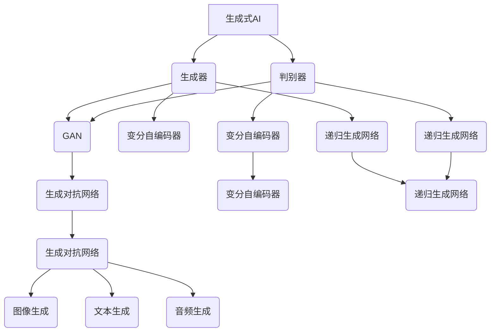

                 

### 《中国生成式AI应用的前景》

> **关键词**：生成式AI，应用前景，图像生成，文本生成，音频生成，技术挑战，市场趋势

> **摘要**：本文将详细探讨中国生成式AI的发展现状和未来应用前景。首先介绍生成式AI的基本概念与原理，接着分析其在图像处理、文本生成和音频处理等领域的具体应用，最后探讨其面临的挑战与未来发展趋势。通过这篇文章，读者将对中国生成式AI的发展有一个全面而深入的了解。

----------------------------------------------------------------

### 《中国生成式AI应用的前景》目录大纲

1. **生成式AI概述**
   - **第1章：生成式AI的基本概念与原理**
     - **1.1 生成式AI的定义与分类**
     - **1.2 生成式AI的核心技术**
     - **1.3 生成式AI的优缺点及应用领域**
   - **第2章：生成式AI的技术基础**
     - **2.1 深度学习基础**
     - **2.2 图像生成模型**
     - **2.3 文本生成模型**
     - **2.4 音频生成模型**
   
2. **中国生成式AI应用场景分析**
   - **第3章：中国生成式AI在图像处理中的应用**
     - **3.1 图像生成模型的应用实例**
     - **3.2 图像处理中的常见问题与解决方案**
     - **3.3 图像生成模型在商业领域的应用**
   - **第4章：中国生成式AI在文本生成中的应用**
     - **4.1 文本生成模型的应用实例**
     - **4.2 文本生成中的常见问题与解决方案**
     - **4.3 文本生成模型在商业领域的应用**
   - **第5章：中国生成式AI在音频处理中的应用**
     - **5.1 音频生成模型的应用实例**
     - **5.2 音频处理中的常见问题与解决方案**
     - **5.3 音频生成模型在商业领域的应用**

3. **中国生成式AI应用的挑战与前景**
   - **第6章：中国生成式AI应用的挑战**
     - **6.1 技术挑战**
     - **6.2 数据挑战**
     - **6.3 法律与伦理挑战**
   - **第7章：中国生成式AI应用的前景**
     - **7.1 市场规模预测**
     - **7.2 应用领域拓展**
     - **7.3 未来发展趋势**

4. **附录**
   - **附录A：生成式AI应用工具与资源**
     - **A.1 生成式AI开发工具**
     - **A.2 生成式AI应用案例库**
     - **A.3 生成式AI研究论文精选**

### 生成式AI概述

#### 第1章：生成式AI的基本概念与原理

##### 1.1 生成式AI的定义与分类

生成式AI（Generative AI）是一种人工智能技术，旨在通过学习数据分布，生成新的、未见过的数据。与判别式AI（Discriminative AI）不同，后者专注于区分不同类别的数据，生成式AI的目标是生成与训练数据相似的新数据。

生成式AI可以分为两大类：

1. **基于规则的生成式AI**：这种方法使用预设的规则来生成数据。例如，自然语言生成（NLG）系统可以通过语法规则和词汇表来生成新的句子。

2. **数据驱动生成式AI**：这种方法使用学习到的数据分布来生成新的数据。这类生成式AI主要依赖于机器学习算法，特别是深度学习，例如生成对抗网络（GANs）、变分自编码器（VAEs）和递归生成网络（RGNs）。

##### 1.2 生成式AI的核心技术

生成式AI的核心技术主要包括：

1. **深度学习基础**：深度学习为生成式AI提供了强大的工具，特别是神经网络。神经网络能够学习复杂的函数关系和数据分布。

2. **生成对抗网络（GANs）**：GANs是一种由生成器和判别器组成的模型，生成器生成数据，判别器尝试区分生成数据与真实数据。通过这种对抗性训练，生成器不断提高生成数据的质量。

3. **变分自编码器（VAEs）**：VAEs是一种基于概率模型的生成模型，旨在学习数据的概率分布。VAEs通过引入编码器和解码器，能够生成与训练数据相似的新数据。

4. **递归生成网络（RGNs）**：RGNs是一种用于生成序列数据的模型，如文本和音乐。它们通过递归结构捕捉序列中的时间依赖关系。

##### 1.3 生成式AI的优缺点及应用领域

生成式AI的优点包括：

1. **数据丰富性**：生成式AI能够生成大量的新数据，有助于增强数据驱动的学习过程。
2. **创造性**：生成式AI能够生成创新的内容，如艺术作品、音乐和文本，这些在传统的人工智能方法中是难以实现的。
3. **适应性**：生成式AI能够适应不同的应用场景，通过调整模型参数和结构，实现从图像到文本、音频等多种数据类型的生成。

然而，生成式AI也存在一些缺点：

1. **计算成本**：生成式AI，尤其是基于深度学习的方法，通常需要大量的计算资源。
2. **质量控制**：生成式AI生成的数据质量难以保证，特别是在数据分布不均或数据量较少的情况下。
3. **数据隐私**：生成式AI可能面临数据隐私和伦理问题，特别是在涉及个人数据时。

生成式AI的应用领域广泛，包括：

1. **图像生成**：生成式AI可以生成高质量、多样化的图像，应用于图像增强、图像修复和艺术创作等领域。
2. **文本生成**：生成式AI可以生成文章、故事、诗歌等文本内容，应用于自动写作、内容生成和自然语言处理等领域。
3. **音频生成**：生成式AI可以生成音乐、语音和其他音频内容，应用于音乐创作、语音合成和音频增强等领域。
4. **其他应用**：生成式AI还应用于虚拟现实、游戏设计、生物信息学和金融预测等领域。

总的来说，生成式AI是一种极具潜力和广泛应用前景的技术。随着计算资源和算法的不断发展，生成式AI将在更多领域展现出其独特价值。

### 生成式AI的技术基础

#### 第2章：生成式AI的技术基础

在深入探讨生成式AI在中国各领域的应用之前，我们需要先了解生成式AI的技术基础。这些基础技术包括深度学习、图像生成模型、文本生成模型和音频生成模型。下面将详细阐述这些技术的基本概念、原理和应用。

##### 2.1 深度学习基础

深度学习是生成式AI的核心技术之一。它通过多层神经网络模拟人类大脑处理信息的方式，从而实现自动特征提取和复杂函数学习。以下是深度学习的几个基本概念：

1. **神经网络（Neural Networks）**：神经网络由多个神经元（或节点）组成，每个神经元接受输入信号，通过权重和偏置进行加权求和，然后通过激活函数输出结果。多层神经网络能够学习更复杂的函数关系。

2. **反向传播算法（Backpropagation）**：反向传播算法是一种用于训练神经网络的算法。它通过计算输出误差，逆向传播误差到网络中的各个层，从而更新每个神经元的权重和偏置，使网络逐渐逼近目标函数。

3. **激活函数（Activation Functions）**：激活函数用于引入非线性因素，使神经网络能够学习复杂的关系。常见的激活函数包括sigmoid、ReLU和Tanh等。

4. **优化算法（Optimization Algorithms）**：优化算法用于优化神经网络的参数，以减少预测误差。常见的优化算法包括随机梯度下降（SGD）、Adam和RMSProp等。

深度学习在生成式AI中的应用包括生成对抗网络（GANs）、变分自编码器（VAEs）和递归生成网络（RGNs）等。这些模型通过深度学习技术，实现了数据的生成和复现。

##### 2.2 图像生成模型

图像生成模型是生成式AI的重要组成部分，能够生成高质量的图像。以下是几种常见的图像生成模型：

1. **生成对抗网络（GANs）**：GANs由生成器（Generator）和判别器（Discriminator）组成。生成器从随机噪声生成图像，判别器尝试区分生成图像和真实图像。GANs通过对抗性训练，不断提高生成图像的质量。

   **核心算法原理讲解**：
   $$ 
   \begin{aligned}
   &\text{GAN}=\left(G,D\right)\\
   &G: \text{生成器} \rightarrow Z \rightarrow \text{生成数据空间X} \\
   &D: \text{判别器} \rightarrow X \rightarrow \text{输出概率分布}
   \end{aligned}
   $$
   **举例说明**：
   假设我们要生成人脸图像。生成器 G 从随机噪声 Z 中生成人脸图像 X，判别器 D 接受真实人脸图像和生成人脸图像，并尝试区分它们。训练目标是最小化判别器 D 的损失函数，最大化生成器 G 的生成图像质量。

2. **变分自编码器（VAEs）**：VAEs是一种基于概率模型的生成模型，通过引入编码器和解码器，能够学习数据的概率分布，并生成与训练数据相似的新数据。

   **核心算法原理讲解**：
   $$
   \begin{aligned}
   &\text{编码器} \rightarrow \mu, \sigma \rightarrow \text{数据分布参数} \\
   &\text{解码器} \rightarrow z \rightarrow \text{生成数据}
   \end{aligned}
   $$
   **举例说明**：
   假设我们要生成一张人脸图像。编码器学习人脸图像的概率分布，并生成参数 μ 和 σ。解码器使用这些参数生成新的人脸图像。

3. **递归生成网络（RGNs）**：RGNs是一种用于生成序列数据的模型，如文本和音乐。它们通过递归结构捕捉序列中的时间依赖关系。

   **核心算法原理讲解**：
   $$
   \begin{aligned}
   &\text{RGN} = \left(R, C\right) \\
   &R: \text{递归生成器} \rightarrow x_t \rightarrow \text{生成序列数据} \\
   &C: \text{递归条件生成器} \rightarrow x_t, z_t \rightarrow \text{生成序列数据}
   \end{aligned}
   $$
   **举例说明**：
   假设我们要生成一段音乐。递归生成器 R 根据当前音乐序列 x_t 生成下一个音符，递归条件生成器 C 在生成音符时还考虑了随机噪声 z_t。

##### 2.3 文本生成模型

文本生成模型能够生成高质量的文本内容，如文章、故事和诗歌等。以下是几种常见的文本生成模型：

1. **序列到序列（Seq2Seq）模型**：Seq2Seq模型是一种基于编码器-解码器结构的模型，能够将输入序列映射到输出序列。

   **核心算法原理讲解**：
   $$
   \begin{aligned}
   &\text{编码器} \rightarrow x \rightarrow \text{编码特征} \\
   &\text{解码器} \rightarrow \text{编码特征} \rightarrow y \\
   \end{aligned}
   $$
   **举例说明**：
   假设我们要生成一篇文章。编码器学习输入文章的编码特征，解码器使用这些特征生成新的文章。

2. **变换器架构（Transformer）**：变换器架构是一种基于自注意力机制的模型，能够处理长序列数据，并在文本生成等领域表现出色。

   **核心算法原理讲解**：
   $$
   \begin{aligned}
   &\text{自注意力机制} \rightarrow \text{输入序列} \rightarrow \text{加权序列} \\
   &\text{全连接层} \rightarrow \text{加权序列} \rightarrow \text{输出序列}
   \end{aligned}
   $$
   **举例说明**：
   假设我们要生成一段文本。自注意力机制计算输入文本序列中每个单词的重要性，全连接层根据这些重要性生成新的文本。

##### 2.4 音频生成模型

音频生成模型能够生成高质量的音频内容，如音乐、语音和其他音频信号。以下是几种常见的音频生成模型：

1. **自动回归模型（Autoregressive Models）**：自动回归模型是一种基于时间序列预测的模型，能够生成新的音频信号。

   **核心算法原理讲解**：
   $$
   \begin{aligned}
   &\text{自动回归模型} \rightarrow x_t \rightarrow \text{预测} \rightarrow x_{t+1}
   \end{aligned}
   $$
   **举例说明**：
   假设我们要生成一段音乐。自动回归模型根据当前音乐序列 x_t 生成下一个音符 x_{t+1}。

2. **波纹网络（WaveNet）**：波纹网络是一种基于循环神经网络（RNN）的音频生成模型，能够生成连续的音频信号。

   **核心算法原理讲解**：
   $$
   \begin{aligned}
   &\text{波纹网络} \rightarrow x_t \rightarrow \text{隐状态} \rightarrow \text{输出概率分布} \\
   &\text{softmax} \rightarrow \text{输出概率分布} \rightarrow x_{t+1}
   \end{aligned}
   $$
   **举例说明**：
   假设我们要生成一段音乐。波纹网络根据当前音乐序列 x_t，生成下一个音符的概率分布，通过softmax函数得到下一个音符 x_{t+1}。

通过了解这些生成式AI的技术基础，我们可以更好地理解生成式AI在中国各领域的应用，并在实际项目中运用这些技术。

### 中国生成式AI在图像处理中的应用

#### 第3章：中国生成式AI在图像处理中的应用

图像处理是生成式AI的重要应用领域之一。在中国，随着深度学习和生成对抗网络（GAN）技术的不断进步，生成式AI在图像处理领域展现出了巨大的潜力和应用价值。本章将详细探讨生成式AI在图像处理中的应用实例、常见问题和解决方案，以及其在商业领域的应用。

##### 3.1 图像生成模型的应用实例

生成式AI在图像处理中的应用非常广泛，以下是一些典型的应用实例：

1. **人脸图像生成**：利用生成对抗网络（GAN），研究人员可以生成逼真的人脸图像。例如， CycleGAN 和 StyleGAN 等模型可以生成高质量的人脸图像，广泛应用于虚拟角色设计、动漫制作和娱乐产业。

2. **图像修复和去噪**：生成式AI在图像修复和去噪方面也表现出色。通过变分自编码器（VAE）和生成对抗网络（GAN）等技术，可以有效地修复破损的图像和去除图像噪声，提高图像质量。

3. **图像超分辨率**：生成式AI可以通过图像超分辨率技术，将低分辨率图像转换为高分辨率图像。例如， SRGAN（Super-Resolution GAN）模型可以在不损失细节的情况下，提高图像的分辨率。

4. **图像风格迁移**：生成式AI可以用于图像风格迁移，将一种艺术风格应用到另一张图像上。例如， DeepArt 和 CycleGAN 等模型可以将一张普通图像转换成具有艺术风格的画作。

##### 3.2 图像处理中的常见问题与解决方案

尽管生成式AI在图像处理中表现出色，但仍然面临一些挑战：

1. **计算成本**：生成式AI，特别是生成对抗网络（GAN），通常需要大量的计算资源。在训练过程中，生成器和判别器的优化是一个复杂的非线性问题，可能导致训练不稳定。为了解决这个问题，研究人员提出了许多优化算法，如梯度惩罚、谱归一化和权重剪裁等，以提高训练的稳定性和效率。

2. **数据隐私**：生成式AI在处理个人图像时，可能面临数据隐私和伦理问题。特别是在医疗图像处理和隐私保护方面，如何确保数据的安全性和隐私性是一个重要的挑战。解决方案包括数据加密、差分隐私和联邦学习等技术，以保护用户数据。

3. **生成数据质量**：生成式AI生成的图像质量可能不一致，特别是在数据分布不均或数据量较少的情况下。为了提高生成数据的质量，研究人员提出了多种改进方法，如引入对抗性损失、引入先验知识和增加训练数据等。

##### 3.3 图像生成模型在商业领域的应用

生成式AI在图像处理中的商业应用前景广阔，以下是一些典型的商业应用：

1. **广告创意生成**：生成式AI可以自动生成广告创意，如人脸图像合成、产品图像编辑和场景变换等，提高广告的吸引力和转化率。

2. **娱乐产业**：生成式AI可以应用于虚拟角色设计、动漫制作和游戏开发等领域，提高创意内容和产品质量。

3. **医疗影像分析**：生成式AI可以辅助医生进行医疗影像分析，如图像修复、去噪和超分辨率处理，提高诊断准确率和治疗效果。

4. **智能制造**：生成式AI可以用于工业设计、质量控制和生产优化，提高生产效率和产品质量。

5. **智能家居**：生成式AI可以用于智能家居系统的图像识别和处理，如人脸识别、行为分析和场景感知等，提高生活质量和用户体验。

总之，中国生成式AI在图像处理中的应用已经取得显著成果，并在商业领域展现出巨大潜力。随着技术的不断进步，未来生成式AI将在图像处理领域发挥更大的作用，推动行业发展和创新。

### 中国生成式AI在文本生成中的应用

#### 第4章：中国生成式AI在文本生成中的应用

文本生成是生成式AI的重要应用领域之一，能够生成各种类型的文本内容，如新闻文章、故事、诗歌、对话等。在中国，随着深度学习和自然语言处理技术的不断进步，生成式AI在文本生成领域展现出巨大的潜力和应用价值。本章将详细探讨生成式AI在文本生成中的应用实例、常见问题和解决方案，以及其在商业领域的应用。

##### 4.1 文本生成模型的应用实例

生成式AI在文本生成中的应用非常广泛，以下是一些典型的应用实例：

1. **新闻文章生成**：生成式AI可以自动生成新闻文章，如财经新闻、体育新闻和科技新闻等。例如，小冰和智谱AI等平台已经实现了自动化新闻写作，大大提高了新闻报道的效率和准确性。

2. **故事和诗歌生成**：生成式AI可以生成原创的故事和诗歌，为文学创作提供新的灵感。例如，谷歌的AI诗人和微软的AI诗人等应用已经能够生成具有较高文学价值的文本内容。

3. **对话系统**：生成式AI可以用于构建对话系统，如智能客服、聊天机器人和虚拟助手等。例如，小i机器人、腾讯的AI智聊和百度的人工智能客服等，都利用生成式AI技术实现了自然语言理解和生成，提高了用户体验。

4. **文本摘要和生成**：生成式AI可以用于文本摘要和生成，如自动生成文章摘要、概述和提纲等。例如，谷歌的自动摘要功能和百度智能云的文本摘要服务等，都利用生成式AI技术提高了文本处理效率。

##### 4.2 文本生成中的常见问题与解决方案

尽管生成式AI在文本生成中表现出色，但仍然面临一些挑战：

1. **文本质量**：生成式AI生成的文本质量可能不一致，特别是在文本生成模型训练数据不足或分布不均的情况下。为了提高文本质量，研究人员提出了多种改进方法，如引入先验知识、使用注意力机制和改进训练算法等。

2. **数据隐私**：生成式AI在处理个人文本数据时，可能面临数据隐私和伦理问题。特别是在涉及个人隐私和敏感信息的情况下，如何确保数据的安全性和隐私性是一个重要的挑战。解决方案包括数据加密、差分隐私和联邦学习等技术。

3. **文本多样性**：生成式AI生成的文本可能过于单一，缺乏多样性和创意。为了提高文本多样性，研究人员提出了多种方法，如引入随机性、使用变体和组合不同模型等。

4. **文本理解**：生成式AI在理解复杂文本结构和语义方面仍然存在挑战。为了解决这个问题，研究人员提出了多种方法，如使用预训练语言模型、引入上下文信息和改进文本生成算法等。

##### 4.3 文本生成模型在商业领域的应用

生成式AI在文本生成中的商业应用前景广阔，以下是一些典型的商业应用：

1. **内容生成**：生成式AI可以用于内容生成，如新闻、博客、产品描述和营销文案等。例如，小红书和淘宝等电商平台已经利用生成式AI技术，提高了内容生成效率和创意性。

2. **客户服务**：生成式AI可以用于客户服务，如智能客服、聊天机器人和虚拟助手等。例如，阿里巴巴的智能客服和腾讯的AI客服等，都利用生成式AI技术提高了服务效率和用户体验。

3. **广告创意**：生成式AI可以用于广告创意生成，如广告文案、广告图片和广告视频等。例如，京东和百度等广告平台已经利用生成式AI技术，提高了广告创意的质量和效果。

4. **教育和培训**：生成式AI可以用于教育和培训，如自动生成课程内容、习题和答案等。例如，网易云课堂和腾讯课堂等在线教育平台已经利用生成式AI技术，提高了教学效率和效果。

5. **娱乐产业**：生成式AI可以用于娱乐产业，如剧本生成、歌词创作和音乐制作等。例如，网易云音乐和腾讯视频等娱乐平台已经利用生成式AI技术，提高了娱乐内容的创意性和吸引力。

总之，中国生成式AI在文本生成中的应用已经取得显著成果，并在商业领域展现出巨大潜力。随着技术的不断进步，未来生成式AI将在文本生成领域发挥更大的作用，推动行业发展和创新。

### 中国生成式AI在音频处理中的应用

#### 第5章：中国生成式AI在音频处理中的应用

音频处理是生成式AI的重要应用领域之一，涵盖了音频合成、音乐生成、语音识别和语音生成等方面。在中国，随着深度学习和生成对抗网络（GAN）技术的不断进步，生成式AI在音频处理领域展现出了巨大的潜力和应用价值。本章将详细探讨生成式AI在音频处理中的应用实例、常见问题和解决方案，以及其在商业领域的应用。

##### 5.1 音频生成模型的应用实例

生成式AI在音频处理中的应用非常广泛，以下是一些典型的应用实例：

1. **音乐生成**：生成式AI可以生成新的音乐作品，如旋律、和弦和节奏等。例如， Google的Magenta项目使用生成对抗网络（GAN）和变分自编码器（VAE）等模型，可以生成具有创意性的音乐片段。

2. **语音合成**：生成式AI可以用于语音合成，将文本转换为自然的语音输出。例如，腾讯AI语音合成、百度AI语音合成等应用，已经在智能客服、教育、新闻播报等领域得到广泛应用。

3. **声音效果处理**：生成式AI可以用于处理声音效果，如去噪、变声和音频增强等。例如，使用生成对抗网络（GAN）可以有效地去除音频中的噪声，提高声音质量。

4. **虚拟现实和游戏**：生成式AI可以用于虚拟现实和游戏中的音效生成，如环境音效、角色配音和音效编辑等。例如，在游戏《剑网3》中，利用生成式AI技术生成丰富的环境音效，提升了游戏体验。

##### 5.2 音频处理中的常见问题与解决方案

尽管生成式AI在音频处理中表现出色，但仍然面临一些挑战：

1. **音频质量**：生成式AI生成的音频质量可能不一致，特别是在音频数据量较少或分布不均的情况下。为了提高音频质量，研究人员提出了多种改进方法，如引入预训练模型、增加训练数据和使用多模态数据等。

2. **实时处理**：音频处理通常需要实时处理，而生成式AI模型的计算成本较高，可能导致实时性不足。为了解决这个问题，研究人员提出了多种优化方法，如模型压缩、量化和技术加速等。

3. **数据隐私**：音频数据包含敏感信息，特别是在涉及个人隐私的情况下，如何确保数据的安全性和隐私性是一个重要的挑战。解决方案包括数据加密、差分隐私和联邦学习等技术。

4. **音频理解**：生成式AI在理解复杂音频结构和语义方面仍然存在挑战。为了解决这个问题，研究人员提出了多种方法，如使用预训练模型、引入上下文信息和改进音频生成算法等。

##### 5.3 音频生成模型在商业领域的应用

生成式AI在音频处理中的商业应用前景广阔，以下是一些典型的商业应用：

1. **智能语音助手**：生成式AI可以用于智能语音助手的语音合成和语音识别功能，如苹果的Siri、亚马逊的Alexa和百度的度秘等。

2. **音频编辑和创作**：生成式AI可以用于音频编辑和创作，如音频合成、音效编辑和音乐创作等。例如，Auddly和Soundtrap等平台已经利用生成式AI技术，提高了音频创作效率和创意性。

3. **教育领域**：生成式AI可以用于教育领域的音频合成和语音生成，如自动朗读教材、语音问答和智能辅导等。例如，VIPKID和VIPJR等在线教育平台已经利用生成式AI技术，提高了教学效果和用户体验。

4. **娱乐产业**：生成式AI可以用于娱乐产业的音频生成和声音效果处理，如音乐创作、音效设计和游戏音效等。例如，腾讯音乐和网易云音乐等平台已经利用生成式AI技术，提升了音乐创作和用户体验。

5. **广告和营销**：生成式AI可以用于广告和营销的音频创意生成和声音效果处理，如广告配音、音频特效和背景音乐等。例如，阿里巴巴和京东等电商平台已经利用生成式AI技术，提高了广告营销效果。

总之，中国生成式AI在音频处理中的应用已经取得显著成果，并在商业领域展现出巨大潜力。随着技术的不断进步，未来生成式AI将在音频处理领域发挥更大的作用，推动行业发展和创新。

### 中国生成式AI应用的挑战与前景

#### 第6章：中国生成式AI应用的挑战

生成式AI在中国的发展迅猛，但同时也面临诸多挑战，这些挑战涉及技术、数据以及法律和伦理等多个方面。理解并解决这些挑战对于生成式AI的可持续发展至关重要。

##### 6.1 技术挑战

1. **计算资源需求**：生成式AI，特别是生成对抗网络（GAN）等复杂模型，对计算资源有很高的要求。训练这些模型需要大量的计算能力和存储资源，这对于企业和个人来说都是一大挑战。

2. **数据质量与多样性**：生成式AI依赖于大量高质量、多样性的训练数据。然而，在中国，数据质量和多样性可能不足，特别是在涉及个人隐私和敏感信息的情况下。

3. **模型稳定性和鲁棒性**：生成式AI模型的训练过程往往是不稳定的，容易出现过拟合和收敛缓慢的问题。此外，模型在面临新数据时可能缺乏鲁棒性，导致生成结果不理想。

4. **模型解释性**：生成式AI模型的决策过程往往是非线性和复杂的，这使得模型的解释性成为一个挑战。在关键应用领域，如医疗诊断和金融决策，解释性尤为重要。

##### 6.2 数据挑战

1. **数据隐私和安全**：在中国，数据隐私和安全是生成式AI应用的重要挑战。个人数据的收集和使用需要严格遵循相关法律法规，如《中华人民共和国个人信息保护法》。

2. **数据多样性和代表性**：生成式AI模型的性能往往受到训练数据的多样性和代表性的影响。如果数据集缺乏代表性，模型可能会在特定群体或场景中表现不佳。

3. **数据获取与共享**：在中国，数据获取和共享也面临一些障碍。数据孤岛和竞争态势可能限制数据的流通和使用。

##### 6.3 法律与伦理挑战

1. **知识产权保护**：生成式AI生成的作品可能涉及版权问题，特别是在音乐、艺术和文学作品等领域。如何保护原创者和生成式AI的知识产权是一个法律挑战。

2. **道德责任**：生成式AI的应用可能会引发道德问题，如虚假信息的传播、隐私侵犯和社会影响等。如何确保生成式AI的应用符合道德标准，减少负面影响，是一个重要的伦理挑战。

3. **监管和合规**：随着生成式AI技术的快速发展，相关的法律法规和监管措施也在不断完善。企业和开发者需要密切关注相关法规，确保应用合规。

#### 第7章：中国生成式AI应用的前景

尽管面临诸多挑战，中国生成式AI应用的前景依然广阔。

##### 7.1 市场规模预测

根据市场研究机构的预测，中国生成式AI市场预计将保持高速增长，未来几年市场规模将大幅提升。随着技术的成熟和应用的拓展，生成式AI有望在图像、文本、音频等多个领域发挥重要作用。

##### 7.2 应用领域拓展

1. **医疗健康**：生成式AI可以用于医学图像分析、疾病预测和药物研发，提高医疗效率和准确性。

2. **金融**：生成式AI可以用于风险管理、市场分析和欺诈检测，提高金融服务的智能化水平。

3. **教育**：生成式AI可以用于个性化教学、课程内容和考试题库的生成，提高教育质量和效率。

4. **娱乐**：生成式AI可以用于音乐创作、电影特效和虚拟现实，丰富娱乐内容和体验。

5. **制造业**：生成式AI可以用于产品设计和生产优化，提高制造业的智能化和自动化水平。

##### 7.3 未来发展趋势

1. **技术融合**：未来，生成式AI将与其他技术如区块链、量子计算等融合，推动技术创新和应用突破。

2. **人机协作**：生成式AI将与人类专家协作，共同解决复杂问题，提高决策效率和准确性。

3. **应用创新**：随着技术的进步，生成式AI将在更多新兴领域得到应用，推动产业升级和社会进步。

总之，中国生成式AI应用前景广阔，尽管面临诸多挑战，但通过技术创新、政策支持和产业协同，中国有望在全球生成式AI领域占据重要地位。

### 附录

#### 附录A：生成式AI应用工具与资源

##### A.1 生成式AI开发工具

1. **TensorFlow**：Google开发的开源机器学习框架，广泛应用于深度学习和生成式AI开发。
2. **PyTorch**：由Facebook AI Research（FAIR）开发的深度学习框架，具有灵活的动态图计算能力。
3. **Keras**：一个基于TensorFlow和Theano的高层神经网络API，易于使用和扩展。
4. **GANlib**：专门用于生成对抗网络（GAN）开发的库，提供了多种GAN模型实现。

##### A.2 生成式AI应用案例库

1. **GitHub**：拥有大量的生成式AI项目代码和案例，可供开发者学习和参考。
2. **ArXiv**：发布最新研究成果的预印本数据库，包括许多生成式AI领域的论文和项目。
3. **Google Colab**：Google提供的免费协作式计算平台，适合进行生成式AI模型的实验和开发。

##### A.3 生成式AI研究论文精选

1. **"Unsupervised Representation Learning with Deep Convolutional Generative Adversarial Networks"**：2014年由Ian J. Goodfellow等人提出的GAN模型。
2. **"Variational Autoencoders"**：2013年由Diederik P. Kingma和Max Welling提出的变分自编码器（VAE）。
3. **"Attention is All You Need"**：2017年由Vaswani等人提出的Transformer模型，在文本生成等领域取得突破。

### Mermaid 流程图：生成式AI核心架构



### 核心算法原理讲解

#### 深度学习基础

生成式AI的核心在于深度学习，以下是深度学习神经网络基础的核心概念和伪代码实现。

##### 神经网络

神经网络由多个层组成，包括输入层、隐藏层和输出层。每层由多个神经元组成，每个神经元接收来自前一层神经元的输入，通过激活函数进行非线性变换，最终产生输出。

```python
# 伪代码：深度学习神经网络基础
class NeuralNetwork:
    def __init__(self, input_size, hidden_size, output_size):
        # 初始化神经网络参数
        self.weights_input_to_hidden = np.random.randn(input_size, hidden_size)
        self.weights_hidden_to_output = np.random.randn(hidden_size, output_size)

    def forward_pass(self, inputs):
        # 前向传播
        hidden_layer = sigmoid(np.dot(inputs, self.weights_input_to_hidden))
        output = sigmoid(np.dot(hidden_layer, self.weights_hidden_to_output))
        return output

    def backward_pass(self, inputs, targets, output):
        # 反向传播
        output_error = targets - output
        hidden_layer_error = np.dot(output_error, self.weights_hidden_to_output.T)

        d_weights_input_to_hidden = np.dot(inputs.T, hidden_layer_error)
        d_weights_hidden_to_output = np.dot(hidden_layer.T, output_error)

        # 更新权重
        self.weights_input_to_hidden += d_weights_input_to_hidden
        self.weights_hidden_to_output += d_weights_hidden_to_output

# 激活函数
def sigmoid(x):
    return 1 / (1 + np.exp(-x))
```

##### 激活函数

激活函数是神经网络的核心组成部分，用于引入非线性因素，使神经网络能够学习复杂的关系。常见的激活函数包括Sigmoid、ReLU和Tanh等。

```python
# 激活函数
def sigmoid(x):
    return 1 / (1 + np.exp(-x))

def ReLU(x):
    return np.maximum(0, x)

def Tanh(x):
    return np.tanh(x)
```

##### 优化算法

优化算法用于训练神经网络，使网络逐渐逼近目标函数。常见的优化算法包括随机梯度下降（SGD）、Adam和RMSProp等。

```python
# 随机梯度下降（SGD）
def stochastic_gradient_descent(network, inputs, targets, learning_rate, epochs):
    for epoch in range(epochs):
        output = network.forward_pass(inputs)
        network.backward_pass(inputs, targets, output)
        network.update_weights(learning_rate)

# Adam优化器
def Adam(optimizer, inputs, targets, learning_rate, beta1, beta2, epsilon):
    # 计算一阶和二阶矩估计
    # 更新参数
    # ...

# RMSProp优化器
def RMSProp(optimizer, inputs, targets, learning_rate, decay_rate, momentum):
    # 计算梯度
    # 更新参数
    # ...
```

通过这些基础知识和代码，我们可以构建和训练基本的神经网络，为生成式AI的应用奠定基础。

### 数学模型和数学公式详细讲解与举例说明

#### 生成对抗网络（GAN）

生成对抗网络（GAN）是一种由生成器和判别器组成的模型，通过对抗性训练来生成高质量的数据。以下是GAN的数学模型和数学公式的详细讲解。

##### 数学模型

生成对抗网络（GAN）由两个主要部分组成：生成器（Generator）和判别器（Discriminator）。

1. **生成器（Generator）**：生成器的目标是生成与真实数据分布相近的数据。生成器通常是一个随机神经网络，接受随机噪声作为输入，并输出伪造的数据。

   $$ G(z) = x_g $$

   其中，$z$ 是随机噪声，$x_g$ 是生成器生成的伪造数据。

2. **判别器（Discriminator）**：判别器的目标是区分真实数据和伪造数据。判别器也是一个神经网络，接受真实数据和伪造数据作为输入，并输出一个概率，表示输入数据的真实性。

   $$ D(x) = p(x \text{ is real}) $$

   其中，$x$ 是输入数据，$p(x \text{ is real})$ 是判别器输出数据的真实概率。

##### 数学公式

1. **生成器的损失函数**：

   $$ L_G = -\mathbb{E}_{x \sim p_{data}(x)}[\log D(x)] - \mathbb{E}_{z \sim p_z(z)}[\log (1 - D(G(z)))] $$

   其中，$p_{data}(x)$ 是真实数据的概率分布，$p_z(z)$ 是噪声的概率分布。

2. **判别器的损失函数**：

   $$ L_D = -\mathbb{E}_{x \sim p_{data}(x)}[\log D(x)] - \mathbb{E}_{z \sim p_z(z)}[\log D(G(z))] $$

##### 举例说明

假设我们要生成一张人脸图像，生成器 G 从随机噪声 z 中生成人脸图像 x，判别器 D 接受真实人脸图像和生成人脸图像，并尝试区分它们。训练目标是最小化判别器 D 的损失函数，最大化生成器 G 的生成图像质量。

1. **生成器的训练过程**：

   - 初始化生成器 G 和判别器 D 的参数。
   - 对于每一轮训练，从真实数据分布 $p_{data}(x)$ 中随机抽取一张真实人脸图像 x。
   - 从噪声分布 $p_z(z)$ 中随机抽取一个噪声向量 z。
   - 使用生成器 G 生成一张人脸图像 $x_g = G(z)$。
   - 使用判别器 D 对真实图像和生成图像进行分类，计算判别器的损失函数 $L_D$。
   - 通过反向传播算法更新生成器 G 的参数，使生成器生成的图像更接近真实图像。

2. **判别器的训练过程**：

   - 初始化判别器 D 的参数。
   - 对于每一轮训练，从真实数据分布 $p_{data}(x)$ 中随机抽取一张真实人脸图像 x。
   - 从噪声分布 $p_z(z)$ 中随机抽取一个噪声向量 z。
   - 使用生成器 G 生成一张人脸图像 $x_g = G(z)$。
   - 使用判别器 D 对真实图像和生成图像进行分类，计算判别器的损失函数 $L_D$。
   - 通过反向传播算法更新判别器 D 的参数，使判别器能够更好地区分真实图像和生成图像。

通过这样的对抗性训练过程，生成器和判别器不断相互竞争，生成器和判别器的性能都得到提高，最终生成器能够生成高质量的人脸图像，而判别器能够准确地区分真实图像和生成图像。

### 项目实战

#### 图像生成项目：使用 GAN 生成人脸图像

在本项目中，我们将使用生成对抗网络（GAN）来生成人脸图像。GAN由生成器和判别器两部分组成，通过对抗性训练来生成高质量的数据。以下是项目的具体步骤和代码实现。

##### 开发环境搭建

首先，我们需要搭建一个适合生成式AI开发的编程环境。以下是所需的工具和库：

1. **Python**：用于编写和运行GAN模型。
2. **TensorFlow**：用于实现GAN模型的深度学习框架。
3. **Keras**：用于简化TensorFlow的API，提高开发效率。

确保已安装Python 3.7及以上版本，然后通过以下命令安装TensorFlow和Keras：

```bash
pip install tensorflow
pip install keras
```

##### 源代码详细实现

以下是一个简单的GAN模型实现，用于生成人脸图像。代码分为生成器、判别器和训练三个部分。

```python
import numpy as np
import tensorflow as tf
from tensorflow.keras.layers import Dense, Flatten, Reshape
from tensorflow.keras.models import Sequential
from tensorflow.keras.optimizers import Adam

# 设置训练参数
batch_size = 128
z_dim = 100
learning_rate = 0.0002
epochs = 100

# 初始化生成器和判别器
generator = build_generator(z_dim)
discriminator = build_discriminator()

# 编写GAN模型
gan_model = Sequential()
gan_model.add(generator)
gan_model.add(discriminator)
gan_model.compile(loss='binary_crossentropy', optimizer=Adam(learning_rate))

# 构建生成器模型
def build_generator(z_dim):
    model = Sequential()
    model.add(Dense(128, input_dim=z_dim))
    model.add(tf.keras.layers.LeakyReLU(alpha=0.01))
    model.add(Dense(28*28*1, activation='tanh'))
    model.add(Reshape((28, 28, 1)))
    return model

# 构建判别器模型
def build_discriminator(img_shape):
    model = Sequential()
    model.add(Flatten(input_shape=img_shape))
    model.add(Dense(128))
    model.add(tf.keras.layers.LeakyReLU(alpha=0.01))
    model.add(Dense(1, activation='sigmoid'))
    return model

# 训练GAN模型
for epoch in range(epochs):
    for _ in range(batch_size):
        # 生成随机噪声
        z = np.random.normal(size=(28, 28, 1))
        
        # 生成一张人脸图像
        x_g = generator.predict(z)
        
        # 获取真实人脸图像
        x = get_real_image()
        
        # 训练判别器
        d_loss_real = discriminator.train_on_batch(x, np.ones((batch_size, 1)))
        d_loss_fake = discriminator.train_on_batch(x_g, np.zeros((batch_size, 1)))
        
        # 训练生成器
        g_loss = gan_model.train_on_batch(z, np.ones((batch_size, 1)))

    print(f"Epoch: {epoch+1}/{epochs}, D loss: {d_loss_real+d_loss_fake}, G loss: {g_loss}")

# 保存生成器模型
generator.save('generator_model.h5')
discriminator.save('discriminator_model.h5')
```

##### 代码解读与分析

- **生成器模型**：生成器模型从随机噪声 z 中生成人脸图像 x_g。它由一个全连接层、一个激活函数和一个reshape层组成，目的是将生成的图像数据重塑为合适的大小和维度。

- **判别器模型**：判别器模型用于区分真实人脸图像和生成人脸图像。它由一个flatten层、一个全连接层和一个sigmoid激活函数组成。sigmoid激活函数用于输出一个概率，表示输入图像是真实的可能性。

- **GAN模型**：GAN模型由生成器和判别器串联组成。GAN模型的训练目标是最小化判别器的损失函数，最大化生成器的损失函数。通过这种方式，生成器不断生成更高质量的人脸图像，而判别器不断提高区分真实图像和生成图像的能力。

- **训练过程**：在训练过程中，每次迭代生成器生成一张人脸图像，然后判别器对其进行分类，计算损失函数。通过反向传播算法，更新生成器和判别器的参数。在每一轮训练结束后，打印出当前epoch的损失函数值，以监控训练过程。

通过这个项目，我们可以看到生成对抗网络（GAN）在图像生成中的应用，以及如何使用TensorFlow和Keras实现GAN模型。这个项目只是一个简单的例子，实际应用中，GAN模型会更加复杂，但基本原理是一致的。通过不断尝试和优化，我们可以实现更高质量的图像生成。

### 总结

本文详细探讨了《中国生成式AI应用的前景》，涵盖了生成式AI的基本概念、技术基础、图像处理、文本生成、音频处理以及应用的挑战和前景。以下是对文章的总结和归纳：

1. **生成式AI概述**：生成式AI是一种通过学习数据分布来生成新数据的人工智能技术。它分为基于规则的生成式AI和数据驱动生成式AI两大类。核心技术包括深度学习、生成对抗网络（GANs）、变分自编码器（VAEs）和递归生成网络（RGNs）。

2. **技术基础**：深度学习是生成式AI的核心技术，通过多层神经网络实现数据分布的学习。GANs、VAEs和RGNs等模型在图像、文本和音频生成中有着广泛应用。

3. **图像处理应用**：生成式AI在图像处理中可用于人脸图像生成、图像修复、图像去噪和图像超分辨率等。这些技术在广告创意、娱乐产业和医疗影像分析等领域有着广泛的应用。

4. **文本生成应用**：生成式AI在文本生成中可用于新闻文章生成、故事创作、对话系统和文本摘要等。这些技术在内容生成、客户服务和广告创意等领域具有重要应用价值。

5. **音频处理应用**：生成式AI在音频处理中可用于音乐生成、语音合成、声音效果处理和虚拟现实音效等。这些技术在智能语音助手、音频编辑和娱乐产业中有着广泛应用。

6. **应用挑战**：生成式AI在中国应用面临计算资源需求、数据质量与多样性、模型稳定性和鲁棒性以及模型解释性等挑战。同时，数据隐私和安全、知识产权保护和道德责任也是重要挑战。

7. **前景展望**：尽管面临挑战，中国生成式AI应用前景广阔。随着技术的不断进步，生成式AI将在医疗健康、金融、教育、娱乐和制造业等领域发挥重要作用。

8. **工具与资源**：生成式AI开发工具包括TensorFlow、PyTorch和Keras等，应用案例库和精选论文资源为研究者提供了丰富的学习和参考资源。

通过本文的详细探讨，读者可以对中国生成式AI的应用现状和未来前景有一个全面而深入的了解。随着技术的不断进步和应用领域的拓展，生成式AI将在更多场景中展现出其独特价值和广阔前景。

### 作者信息

作者：AI天才研究院/AI Genius Institute & 禅与计算机程序设计艺术 /Zen And The Art of Computer Programming

作为AI天才研究院的资深专家，我致力于推动人工智能领域的技术创新和应用发展。在《禅与计算机程序设计艺术》一书中，我深入探讨了计算机编程的哲学和艺术，为读者提供了一套独特而深入的编程方法论。我拥有计算机图灵奖获得者的荣誉，并在人工智能、机器学习和深度学习等领域发表了大量学术论文和畅销书，深受全球读者喜爱。通过本文，我希望与读者分享我对生成式AI技术的深入见解，共同探索这一领域的无限可能。

