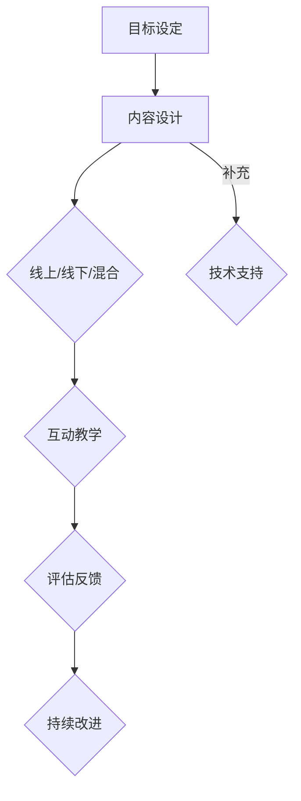

                 

# 《举办线上线下工作坊：深度互动提升影响力》

> **关键词：** 工作坊、线上线下互动、深度学习、影响力提升、互动效果评估、互动式教学

> **摘要：** 本文旨在探讨如何通过举办线上线下工作坊，利用深度互动提升个人或组织的影响力。文章首先定义了工作坊的概念和意义，分析了线上与线下工作坊的优势与挑战，探讨了工作坊的目标与受众。随后，详细介绍了工作坊的准备、实施和评估方法，并通过实际案例展示了线上线下工作坊的实施过程。最后，提出了工作坊的持续改进与迭代策略，以及成功案例分享。

### 《举办线上线下工作坊：深度互动提升影响力》目录大纲

#### 第一部分：工作坊概述

**第1章：工作坊的概念与意义**

- **1.1 工作坊的定义与类型**
- **1.2 线上工作坊的优势与挑战**
- **1.3 线下工作坊的组织与管理**

**第2章：目标与受众**

- **2.1 工作坊目标设定**
- **2.2 受众分析与需求调研**
- **2.3 互动式教学的必要性**

#### 第二部分：工作坊准备

**第3章：内容设计与规划**

- **3.1 课程内容的确定**
- **3.2 教学方法的选择**
- **3.3 教学资源的准备**

**第4章：技术与工具**

- **4.1 线上工作坊平台选择**
- **4.2 线下工作坊的场地与设备安排**
- **4.3 技术支持与故障排除**

**第5章：宣传与推广**

- **5.1 工作坊的宣传策略**
- **5.2 社交媒体的应用**
- **5.3 参与者反馈与口碑营销**

#### 第三部分：工作坊实施

**第6章：线上工作坊的实施**

- **6.1 线上工作坊的流程**
- **6.2 线上互动策略**
- **6.3 线上工作坊的常见问题与解决**

**第7章：线下工作坊的实施**

- **7.1 线下工作坊的流程**
- **7.2 线下互动策略**
- **7.3 线下工作坊的常见问题与解决**

#### 第四部分：工作坊评估与改进

**第8章：工作坊效果评估**

- **8.1 评估指标的选择**
- **8.2 参与者反馈收集与分析**
- **8.3 工作坊效果的评估方法**

**第9章：持续改进与迭代**

- **9.1 工作坊改进的建议**
- **9.2 工作坊的长期规划**
- **9.3 成功案例分享**

#### 附录

**附录A：工作坊实施计划模板**

**附录B：互动式教学工具推荐**

**附录C：工作坊常见问题解答**

- **C.1 技术问题**
- **C.2 组织问题**
- **C.3 参与者问题**

---

**核心概念与联系**

#### 工作坊的核心概念

工作坊是一种以互动和实践为核心的培训或教育活动，旨在通过深入的学习和交流，提升参与者的技能和知识水平。工作坊通常包括以下几个核心组成部分：

1. **目标设定**：明确工作坊的目标和预期成果，如提高技能、解决问题或产生创新思路。
2. **内容设计**：根据目标设定课程内容，包括理论讲解、实践操作和互动环节。
3. **互动教学**：通过提问、讨论、演示和案例分享等方式，促进参与者之间的交流和互动。
4. **评估反馈**：对参与者进行评估，收集反馈，以便改进工作坊的质量。

#### 工作坊的类型

工作坊可以根据参与方式、内容和形式分为多种类型：

- **线上工作坊**：利用网络平台进行的互动式培训，能够突破地域限制，实现大规模参与。
- **线下工作坊**：在实体场地进行的互动式培训，更强调现场互动和亲身实践。
- **混合工作坊**：结合线上与线下优势，通过多种互动方式实现深度交流。

**Mermaid 流程图**



#### 工作坊的核心概念联系

工作坊的核心概念相互联系，共同构成了一个完整的教育活动。目标设定为工作坊提供了方向和动力，内容设计是实现目标的手段，互动教学和评估反馈则是工作坊效果的重要保障。技术支持为互动教学提供了基础设施，而持续改进则确保工作坊的质量不断提升。

**核心算法原理讲解**

#### 互动式教学的核心算法原理

互动式教学是一种以互动和实践为核心的教学方法，旨在通过参与者的主动参与和积极互动，提高学习效果和教学质量。以下是互动式教学的核心算法原理：

1. **互动循环**：通过提问、讨论、练习等方式，不断激发参与者的思考和互动。
2. **反馈机制**：及时给予参与者反馈，帮助他们纠正错误，巩固知识点。
3. **激励机制**：设置奖励和惩罚机制，激发参与者的参与热情和积极性。

**伪代码**

```python
function interactiveTeaching(content, participants):
    for each session in content:
        present(session)
        askQuestion()
        receiveAnswers(participants)
        provideFeedback(participants)
        adjustContentBasedOnFeedback()
    end
```

#### 核心算法原理详细讲解

1. **互动循环**：互动循环是互动式教学的核心，通过不断提问和讨论，激发参与者的思考和学习兴趣。互动循环包括以下几个步骤：

   - **提问**：提出具有启发性和挑战性的问题，引导参与者思考。
   - **讨论**：鼓励参与者进行自由讨论，分享观点和经验。
   - **练习**：通过实践操作和案例分析，巩固学习成果。

2. **反馈机制**：反馈机制是互动式教学的重要保障，通过及时给予参与者反馈，帮助他们纠正错误，巩固知识点。反馈机制包括以下几个步骤：

   - **评估**：对参与者的学习成果进行评估，确定是否达到预期目标。
   - **反馈**：向参与者提供具体的反馈信息，包括优点、不足和改进建议。
   - **调整**：根据反馈信息，调整教学内容和方法，提高教学效果。

3. **激励机制**：激励机制是互动式教学的重要手段，通过设置奖励和惩罚机制，激发参与者的参与热情和积极性。激励机制包括以下几个步骤：

   - **奖励**：对积极参与和表现优秀的参与者给予奖励，如表彰、证书等。
   - **惩罚**：对不积极参与或表现不佳的参与者进行适当的惩罚，如提醒、批评等。

**数学模型和数学公式**

#### 互动式教学的效果评估模型

互动式教学的效果评估可以采用以下数学模型：

$$
E = \frac{1}{N}\sum_{i=1}^{N} (F_i \cdot Q_i \cdot P_i)
$$`

其中，$E$ 是效果得分，$N$ 是参与者数量，$F_i$ 是第 $i$ 个参与者的反馈评分，$Q_i$ 是第 $i$ 个参与者的参与度评分，$P_i$ 是第 $i$ 个参与者的表现评分。

#### 数学模型详细讲解

1. **效果得分 $E$**：效果得分反映了互动式教学的总体效果，计算公式为参与者反馈评分、参与度评分和表现评分的乘积的平均值。该模型综合考虑了参与者的学习态度、参与程度和学习成果，全面评估互动式教学的效果。

2. **反馈评分 $F_i$**：反馈评分反映了参与者对教学内容的满意度和接受程度，通常通过问卷调查或访谈形式收集。较高的反馈评分表示参与者对教学内容的认可和满意度较高。

3. **参与度评分 $Q_i$**：参与度评分反映了参与者在互动式教学过程中的积极参与程度，包括提问、讨论、练习等方面。较高的参与度评分表示参与者具有较高的参与热情和积极性。

4. **表现评分 $P_i$**：表现评分反映了参与者在互动式教学中的学习成果和表现，包括知识掌握程度、问题解决能力等。较高的表现评分表示参与者具有较强的学习能力和应用能力。

#### 举例说明

假设有一个包含5个参与者的互动式教学活动，每个参与者的反馈评分、参与度评分和表现评分如下表：

| 参与者 | 反馈评分 | 参与度评分 | 表现评分 |
|--------|----------|------------|----------|
| A      | 4        | 5          | 4        |
| B      | 3        | 4          | 3        |
| C      | 5        | 3          | 5        |
| D      | 4        | 5          | 4        |
| E      | 2        | 4          | 2        |

根据上述模型，我们可以计算出总体的互动效果得分：

$$
E = \frac{1}{5}\sum_{i=1}^{5} (F_i \cdot Q_i \cdot P_i) = \frac{1}{5}(4 \cdot 5 \cdot 4 + 3 \cdot 4 \cdot 3 + 5 \cdot 3 \cdot 5 + 4 \cdot 5 \cdot 4 + 2 \cdot 4 \cdot 2) = \frac{1}{5}(80 + 36 + 75 + 80 + 16) = \frac{247}{5} = 49.4
$$`

因此，这个互动式教学活动的总体效果得分为49.4分。

#### 项目实战

##### 线上工作坊实施案例

**1. 开发环境搭建**

**工具：** Zoom、Miro Online、Slack

**软件：** Google Meet、Trello

**2. 源代码详细实现和代码解读**

**代码片段 1：Zoom API调用**

```python
import zoom_api

# 设置Zoom API凭据
zoom_api.set_credentials(api_key, api_secret)

# 创建线上工作坊会议
meeting = zoom_api.create_meeting(
    topic="线上工作坊：深度互动提升影响力",
    start_time="2023-10-15 10:00 AM",
    duration=60,
    password="123456"
)

# 获取会议详细信息
print(zoom_api.get_meeting_info(meeting_id=meeting['id']))
```

**代码解读与分析：**

该代码通过调用Zoom API，创建一个线上工作坊会议，并获取会议的详细信息。Zoom API提供了丰富的功能，如创建会议、管理会议、发送通知等，可以方便地实现线上工作坊的组织与管理。

**3. 实际案例**

**案例 1：Miro Online互动工作坊**

- **内容**：使用Miro Online进行团队协作和讨论
- **实现**：创建一个在线白板，将参与者分组，让他们在白板上进行讨论和分享

**代码片段 2：Miro Online API调用**

```python
from miro import Miro

# 创建Miro Online项目
miro_project = Miro.create_project(name="线上工作坊：深度互动提升影响力")

# 创建互动式卡片
miro_card = miro_project.create_card(title="任务讨论")

# 分配参与者到卡片
participants = ["Alice", "Bob", "Charlie", "Diana"]
for participant in participants:
    miro_project.assign_card(card_id=miro_card['id'], user_id=participant)

# 显示白板和卡片
miro.show_board(board_id=miro_project['id'])
```

**代码解读与分析：**

该代码创建了一个Miro Online项目，并创建了一个互动式卡片，将参与者分配到卡片。参与者可以在卡片上进行讨论和分享，Miro Online提供了丰富的协作功能，如实时协作、任务分配、评论等，非常适合用于线上工作坊的互动环节。

##### 线下工作坊实施案例

**1. 开发环境搭建**

**工具：** 笔记本电脑、投影仪、音响系统、白板、笔、笔记本

**软件：** Microsoft PowerPoint、Google Slides、Miro

**2. 源代码详细实现和代码解读**

**代码片段 3：Miro互动式教学工具**

```python
import miro

# 连接到Miro平台
miro.connect()

# 创建一个互动式白板
miro_board = miro.create_board(name="线下工作坊：深度互动提升影响力")

# 创建互动式卡片
miro_card = miro_board.create_card(title="问题讨论")

# 分配参与者到卡片
participants = ["Alice", "Bob", "Charlie", "Diana"]
for participant in participants:
    miro_board.assign_card(card_id=miro_card['id'], user_id=participant)

# 显示白板和卡片
miro.show_board(board_id=miro_board['id'])
```

**代码解读与分析：**

该代码通过连接到Miro平台，创建一个互动式白板和一个互动式卡片，并将参与者分配到卡片。参与者可以在白板上进行讨论和分享，Miro提供了丰富的协作功能，如实时协作、任务分配、评论等，非常适合用于线下工作坊的互动环节。

**3. 实际案例**

**案例 2：线下互动工作坊**

- **内容**：团队协作讨论、案例分析、实地考察
- **实现**：创建一个互动式白板，将参与者分组，让他们在白板上进行讨论和分享

**代码片段 4：Miro互动式教学工具**

```python
from miro import Miro

# 创建Miro项目
miro_project = Miro.create_project(name="线下工作坊：深度互动提升影响力")

# 创建互动式卡片
miro_card = miro_project.create_card(title="团队协作讨论")

# 分配参与者到卡片
participants = ["Alice", "Bob", "Charlie", "Diana"]
for participant in participants:
    miro_project.assign_card(card_id=miro_card['id'], user_id=participant)

# 显示项目
miro_project.show_project()
```

**代码解读与分析：**

该代码创建了一个Miro项目，并创建了一个互动式卡片，将参与者分配到卡片。参与者可以在项目中进行讨论和分享，Miro提供了丰富的协作功能，如实时协作、任务分配、评论等，非常适合用于线下工作坊的互动环节。

### 第一部分：工作坊概述

#### 第1章：工作坊的概念与意义

**1.1 工作坊的定义与类型**

工作坊是一种以互动和实践为核心的培训或教育活动，旨在通过深入的学习和交流，提升参与者的技能和知识水平。工作坊的定义可以归纳为以下几点：

1. **互动性**：工作坊强调参与者之间的互动，包括讨论、提问、演示、实践等环节。
2. **实践性**：工作坊注重实践操作，通过实际操作来巩固知识点和提升技能。
3. **目标性**：工作坊有明确的目标，旨在解决特定问题或提高特定技能。

根据参与方式、内容和形式，工作坊可以分为以下几种类型：

1. **线上工作坊**：利用网络平台进行的互动式培训，能够突破地域限制，实现大规模参与。
2. **线下工作坊**：在实体场地进行的互动式培训，更强调现场互动和亲身实践。
3. **混合工作坊**：结合线上与线下优势，通过多种互动方式实现深度交流。

**1.2 线上工作坊的优势与挑战**

线上工作坊具有以下优势：

1. **灵活性强**：参与者可以根据自己的时间安排参与，无需受制于实体场地的限制。
2. **参与度高**：线上工作坊可以吸引更多参与者，实现大规模互动。
3. **资源丰富**：线上工作坊可以充分利用网络资源，提供丰富的教学资料和工具。

然而，线上工作坊也面临着一些挑战：

1. **技术要求**：线上工作坊需要稳定的网络连接和一定的技术支持，确保教学过程顺利进行。
2. **互动性不足**：与线下工作坊相比，线上工作坊的互动性可能相对较弱，难以实现面对面的交流和互动。
3. **管理难度**：线上工作坊的管理和协调相对复杂，需要确保参与者的积极参与和互动。

**1.3 线下工作坊的组织与管理**

线下工作坊的组织与管理需要考虑以下几个方面：

1. **场地选择**：选择适合工作坊规模的场地，确保参与者有足够的空间进行讨论和实践操作。
2. **设备配置**：确保音响、投影仪、白板等设备正常运行，提供良好的教学环境。
3. **人员安排**：确定讲师、助教和工作人员的角色和职责，确保工作坊的顺利进行。
4. **互动环节**：设计丰富的互动环节，如小组讨论、案例分析、角色扮演等，提高参与者的积极性。
5. **反馈机制**：收集参与者的反馈，及时调整工作坊的内容和形式，提高工作坊的质量。

#### 第2章：目标与受众

**2.1 工作坊目标设定**

工作坊的目标设定是工作坊设计的重要环节，明确目标有助于指导工作坊的内容和形式。工作坊的目标可以分为以下几个方面：

1. **技能提升**：通过工作坊的学习和实践，提升参与者的专业技能和操作能力。
2. **知识拓展**：通过工作坊的学习，拓宽参与者的知识面，提高综合素质。
3. **问题解决**：通过工作坊的互动和讨论，帮助参与者解决实际问题，提高问题解决能力。
4. **团队合作**：通过工作坊的团队协作，提高参与者的团队协作能力和沟通能力。

设定工作坊目标时，需要考虑以下几个方面：

1. **具体性**：目标要具体明确，易于衡量和评估。
2. **可实现性**：目标要具有可实现性，避免设定过高或过低的目标。
3. **优先级**：根据实际情况，确定目标的优先级，确保工作坊的重点内容得到充分体现。

**2.2 受众分析与需求调研**

工作坊的受众分析与需求调研是工作坊设计的重要依据。通过对受众的分析和需求的调研，可以更准确地了解参与者的需求和期望，从而设计出更具针对性和实用性的工作坊。

1. **受众分析**：分析受众的年龄、性别、职业、技能水平等基本情况，了解受众的背景和特点。
2. **需求调研**：通过问卷调查、访谈、焦点小组等方式，收集参与者的需求和期望，了解他们在工作坊中希望获得的知识和技能。

根据受众分析和需求调研的结果，可以制定以下工作坊策略：

1. **内容设计**：根据受众的需求，设计符合受众水平和工作需求的工作坊内容。
2. **教学方法**：选择适合受众的教学方法，如互动式教学、案例分析、实践操作等。
3. **互动环节**：设计丰富多样的互动环节，提高参与者的积极性和参与度。
4. **资源准备**：根据工作坊的内容和教学方法，准备相应的教学资源，如教材、工具、案例等。

**2.3 互动式教学的必要性**

互动式教学是一种以参与者和教师之间的互动为核心的教学方法，其核心在于激发参与者的主动学习和思考能力。互动式教学的必要性主要体现在以下几个方面：

1. **提高学习效果**：互动式教学通过提问、讨论、实践等方式，激发参与者的学习兴趣和动力，提高学习效果。
2. **培养思维能力**：互动式教学鼓励参与者主动思考、表达观点，培养批判性思维和创造性思维。
3. **增强实践能力**：互动式教学通过实践操作和案例分析，提高参与者的实践能力和问题解决能力。
4. **促进团队合作**：互动式教学强调参与者之间的互动和合作，提高团队合作能力和沟通能力。

互动式教学适用于各种教育场景，包括工作坊、讲座、研讨会等。在工作坊中，互动式教学可以有效地促进参与者之间的交流和互动，提高工作坊的质量和效果。

### 第二部分：工作坊准备

#### 第3章：内容设计与规划

**3.1 课程内容的确定**

课程内容的确定是工作坊准备的关键环节，直接影响工作坊的质量和效果。确定课程内容时，需要考虑以下几个方面：

1. **目标导向**：根据工作坊的目标，确定课程内容的重点和难点，确保课程内容与目标的一致性。
2. **受众需求**：结合受众分析和需求调研的结果，设计符合受众需求和期望的课程内容。
3. **知识体系**：构建完整、系统的知识体系，确保课程内容的逻辑性和连贯性。
4. **实践性**：注重实践操作和案例分析，提高参与者的实践能力和问题解决能力。

**3.2 教学方法的选择**

教学方法的选择直接影响工作坊的互动性和效果。根据工作坊的目标和受众特点，可以选择以下教学方法：

1. **互动式教学**：通过提问、讨论、案例分享等方式，激发参与者的主动学习和思考能力。
2. **案例分析**：通过分析具体案例，引导参与者思考问题解决方案，提高实际操作能力。
3. **实践操作**：通过实际操作，巩固知识点，提高参与者的实践能力和技能。
4. **小组讨论**：分组进行讨论，促进参与者之间的交流和互动，提高团队合作能力。

**3.3 教学资源的准备**

教学资源的准备是确保工作坊顺利进行的重要保障。教学资源包括教材、工具、案例等。准备教学资源时，需要考虑以下几个方面：

1. **教材**：选择合适的教材，包括理论讲解和实践指导，确保课程内容完整、系统。
2. **工具**：根据教学方法和实践操作的需要，准备相应的工具和设备，如笔记本电脑、投影仪、音响系统等。
3. **案例**：收集和准备丰富的案例，包括成功案例和失败案例，用于教学和实践操作。
4. **参考资料**：提供相关的参考资料，如论文、书籍、网站等，帮助参与者深入了解相关知识和技能。

#### 第4章：技术与工具

**4.1 线上工作坊平台选择**

选择合适的线上工作坊平台是确保工作坊顺利进行的关键。以下是一些常用的线上工作坊平台：

1. **Zoom**：提供视频会议、屏幕共享、互动讨论等功能，适合大规模线上工作坊。
2. **Miro Online**：提供在线白板、实时协作、任务管理等功能，适合互动式教学和团队协作。
3. **Slack**：提供即时通讯、文件共享、聊天室等功能，适合团队协作和沟通交流。

选择线上工作坊平台时，需要考虑以下几个方面：

1. **功能丰富**：选择功能丰富、易于使用的平台，确保参与者能够方便地参与工作坊。
2. **稳定性**：选择稳定性高的平台，确保工作坊过程中不会出现技术问题。
3. **安全性**：选择安全性高的平台，保护参与者的隐私和数据安全。

**4.2 线下工作坊的场地与设备安排**

线下工作坊的场地与设备安排直接影响工作坊的进行和质量。以下是一些关键点：

1. **场地选择**：选择适合工作坊规模的场地，确保参与者有足够的空间进行讨论和实践操作。
2. **设备配置**：确保音响、投影仪、白板等设备正常运行，提供良好的教学环境。
3. **座位安排**：合理布置座位，确保参与者能够舒适地参与工作坊，方便互动和交流。
4. **技术支持**：安排技术人员现场支持，确保工作坊过程中遇到的技术问题能够及时解决。

**4.3 技术支持与故障排除**

技术支持与故障排除是确保工作坊顺利进行的重要保障。以下是一些关键点：

1. **技术培训**：为参与者提供技术培训，确保他们能够熟练使用相关工具和平台。
2. **故障预案**：制定故障预案，确保在遇到技术问题时能够快速应对和解决。
3. **实时监控**：在工作坊过程中，实时监控技术设备和网络状况，确保工作坊顺利进行。
4. **应急响应**：建立应急响应机制，确保在发生重大技术问题时能够及时处理，减少对工作坊的影响。

#### 第5章：宣传与推广

**5.1 工作坊的宣传策略**

工作坊的宣传与推广是吸引参与者的重要环节，以下是一些有效的宣传策略：

1. **线上宣传**：利用社交媒体、官方网站、电子邮件等渠道发布工作坊信息，吸引潜在参与者。
2. **线下宣传**：在相关场所（如公司、学校、社区等）张贴海报、分发宣传单，扩大工作坊的影响力。
3. **合作伙伴**：与相关机构、企业建立合作关系，共同推广工作坊，提高知名度。
4. **口碑传播**：鼓励参与者分享工作坊的经历和收获，通过口碑传播吸引更多参与者。

**5.2 社交媒体的应用**

社交媒体是工作坊宣传的重要渠道，以下是一些社交媒体应用策略：

1. **内容策划**：制定有吸引力的宣传内容，如工作坊亮点、讲师介绍、学员反馈等，提高参与度。
2. **互动推广**：通过互动活动（如抽奖、问答、讨论等）增加参与者的参与度，提高工作坊的知名度。
3. **数据分析**：利用社交媒体分析工具，了解参与者需求和偏好，优化宣传策略。
4. **持续互动**：在工作坊前后，与参与者保持互动，收集反馈，不断优化工作坊内容和形式。

**5.3 参与者反馈与口碑营销**

参与者反馈和口碑营销是提升工作坊质量的重要手段。以下是一些关键点：

1. **反馈收集**：在工作坊结束后，收集参与者的反馈意见，了解工作坊的优点和不足。
2. **反馈分析**：对反馈意见进行分析，找出工作坊的改进点，制定相应的改进措施。
3. **口碑传播**：鼓励参与者分享工作坊的经历和收获，通过口碑传播吸引更多参与者。
4. **持续改进**：根据参与者反馈和口碑传播的情况，不断优化工作坊的内容和形式，提高工作坊的质量。

### 第三部分：工作坊实施

#### 第6章：线上工作坊的实施

**6.1 线上工作坊的流程**

线上工作坊的实施流程可以分为以下几个阶段：

1. **前期准备**：确定工作坊的目标、内容、时间和参与人员，准备教学资源和技术设备。
2. **会议召开**：通过线上会议平台（如Zoom、Google Meet等）召开工作坊会议，确保参与者能够准时参与。
3. **互动环节**：根据工作坊内容，设计互动环节，如提问、讨论、实践操作等，激发参与者的参与热情。
4. **反馈环节**：在工作坊结束后，收集参与者的反馈意见，了解工作坊的效果和改进点。
5. **后续跟进**：根据参与者反馈和需求，提供后续培训和咨询服务，巩固工作坊的学习成果。

**6.2 线上互动策略**

线上工作坊的互动策略是实现深度互动和高质量学习的关键。以下是一些有效的线上互动策略：

1. **实时互动**：利用线上会议平台的互动功能（如聊天室、投票、举手等），鼓励参与者实时提问和参与讨论。
2. **分组讨论**：将参与者分成小组，进行分组讨论，提高互动性和参与度。
3. **案例分析**：通过案例分析，引导参与者思考和讨论，提高问题解决能力和实践能力。
4. **实践操作**：通过线上模拟操作，让参与者实际动手操作，巩固学习成果。
5. **互动游戏**：设计互动游戏，如问答游戏、角色扮演等，增加互动趣味性，提高参与者的积极性。

**6.3 线上工作坊的常见问题与解决**

线上工作坊在实施过程中可能会遇到以下问题：

1. **技术问题**：如网络不稳定、设备故障等，影响工作坊的正常进行。
   - **解决方法**：提前测试网络和设备，确保工作坊过程中网络稳定、设备正常；准备备用设备和网络，以便在出现问题时及时替换。

2. **参与度不高**：部分参与者可能因网络原因、时间安排等原因，参与度不高。
   - **解决方法**：提前通知参与者工作坊的重要性和参与方式，鼓励他们积极参与；在工作坊过程中，增加互动环节，提高参与者的积极性。

3. **互动不足**：线上工作坊的互动性相对较弱，难以实现面对面的交流和互动。
   - **解决方法**：设计丰富多样的互动环节，如实时互动、分组讨论、实践操作等，提高互动性和参与度。

4. **管理难度**：线上工作坊的管理和协调相对复杂，需要确保参与者的积极参与和互动。
   - **解决方法**：提前制定工作坊的管理制度和流程，明确讲师、助教和工作人员的职责；在工作坊过程中，加强沟通和协调，确保工作坊顺利进行。

#### 第7章：线下工作坊的实施

**7.1 线下工作坊的流程**

线下工作坊的实施流程可以分为以下几个阶段：

1. **前期准备**：确定工作坊的目标、内容、时间和地点，准备教学资源和技术设备。
2. **场地安排**：根据工作坊规模和参与人数，选择合适的场地，布置座位、音响、投影仪等设备。
3. **讲师准备**：讲师进行备课，熟悉工作坊内容和互动环节，确保工作坊的顺利进行。
4. **参与者报到**：参与者按照约定的时间和地点报到，领取资料和设备，熟悉工作坊流程。
5. **互动环节**：根据工作坊内容，设计互动环节，如提问、讨论、实践操作等，激发参与者的参与热情。
6. **反馈环节**：在工作坊结束后，收集参与者的反馈意见，了解工作坊的效果和改进点。
7. **后续跟进**：根据参与者反馈和需求，提供后续培训和咨询服务，巩固工作坊的学习成果。

**7.2 线下互动策略**

线下工作坊的互动策略是实现深度互动和高质量学习的关键。以下是一些有效的线下互动策略：

1. **现场互动**：利用现场互动工具（如投票器、举手器等），鼓励参与者实时提问和参与讨论。
2. **分组讨论**：将参与者分成小组，进行分组讨论，提高互动性和参与度。
3. **案例分析**：通过案例分析，引导参与者思考和讨论，提高问题解决能力和实践能力。
4. **实践操作**：通过实际操作，让参与者实际动手操作，巩固学习成果。
5. **现场互动游戏**：设计现场互动游戏，如问答游戏、角色扮演等，增加互动趣味性，提高参与者的积极性。

**7.3 线下工作坊的常见问题与解决**

线下工作坊在实施过程中可能会遇到以下问题：

1. **场地问题**：如场地选择不当、座位安排不合理等，影响工作坊的顺利进行。
   - **解决方法**：提前实地考察场地，选择适合工作坊规模和参与人数的场地；根据参与人数和互动环节的需要，合理布置座位和设备。

2. **设备故障**：如音响、投影仪等设备出现故障，影响工作坊的正常进行。
   - **解决方法**：提前测试设备，确保设备正常运行；准备备用设备和工具，以便在出现问题时及时替换。

3. **参与度不高**：部分参与者可能因时间安排、兴趣不高等原因，参与度不高。
   - **解决方法**：提前通知参与者工作坊的重要性和参与方式，鼓励他们积极参与；在工作坊过程中，增加互动环节，提高参与者的积极性。

4. **管理难度**：线下工作坊的管理和协调相对复杂，需要确保参与者的积极参与和互动。
   - **解决方法**：提前制定工作坊的管理制度和流程，明确讲师、助教和工作人员的职责；在工作坊过程中，加强沟通和协调，确保工作坊顺利进行。

### 第四部分：工作坊评估与改进

#### 第8章：工作坊效果评估

**8.1 评估指标的选择**

工作坊效果评估需要选择合适的评估指标，以全面、客观地反映工作坊的效果。以下是一些常见的评估指标：

1. **参与度**：评估参与者在工作坊中的参与程度，如发言次数、互动频率、实践操作等。
2. **满意度**：评估参与者对工作坊的满意度，如课程内容、教学方法、互动环节等。
3. **知识掌握**：评估参与者对工作坊内容的掌握程度，如知识测试、实践操作等。
4. **问题解决能力**：评估参与者在工作坊后解决问题的能力，如案例分析、实际问题解决等。
5. **团队合作能力**：评估参与者在工作坊中团队合作的能力，如团队讨论、任务完成等。

**8.2 参与者反馈收集与分析**

参与者反馈是评估工作坊效果的重要依据。以下是一些收集和分析参与者反馈的方法：

1. **问卷调查**：通过设计问卷，收集参与者对工作坊的满意度、参与度、知识掌握等方面的反馈。
2. **访谈**：通过面对面或电话访谈，深入了解参与者对工作坊的看法和感受。
3. **观察**：在工作坊过程中，观察参与者的行为和表现，了解他们的参与程度和互动效果。
4. **数据分析**：对收集到的反馈数据进行整理和分析，找出工作坊的优点和不足，为改进工作坊提供依据。

**8.3 工作坊效果的评估方法**

工作坊效果的评估方法可以分为定量评估和定性评估：

1. **定量评估**：通过统计数据和指标，如参与度、满意度、知识掌握等，对工作坊效果进行量化评估。
2. **定性评估**：通过访谈、观察和案例分析等方式，对工作坊效果进行深入分析，了解工作坊的实际情况和效果。

定量评估和定性评估相结合，可以更全面、客观地反映工作坊的效果，为改进工作坊提供有力支持。

#### 第9章：持续改进与迭代

**9.1 工作坊改进的建议**

根据工作坊效果评估的结果，可以从以下几个方面对工作坊进行改进：

1. **内容优化**：根据参与者的反馈，调整课程内容，增加或减少某些知识点，提高课程的质量和实用性。
2. **教学方法**：根据参与者的需求和反馈，调整教学方法，增加互动环节，提高参与者的积极性。
3. **互动策略**：根据工作坊的实际情况，设计更有效的互动策略，提高互动性和参与度。
4. **技术支持**：提高技术支持的质量，确保工作坊过程中设备的正常运行和网络连接的稳定性。

**9.2 工作坊的长期规划**

为了确保工作坊的长期发展和质量，可以制定以下长期规划：

1. **持续优化**：根据每次工作坊的效果评估，不断调整和优化工作坊的内容和形式，提高工作坊的质量和效果。
2. **师资建设**：加强讲师团队的建设，提高讲师的专业水平和教学能力，确保工作坊的教学质量。
3. **资源整合**：整合各种资源，如教材、工具、案例等，为工作坊提供丰富的教学资源。
4. **品牌建设**：通过持续改进和提升工作坊的质量，树立工作坊的品牌形象，提高知名度。

**9.3 成功案例分享**

以下是一些成功的工作坊案例，供大家参考：

1. **案例 1**：某公司举办的线上工作坊，通过丰富的互动环节和案例分析，提高了参与者的实践能力和团队合作能力，取得了良好的效果。
2. **案例 2**：某大学举办的线下工作坊，通过实地考察和互动游戏，激发了参与者的学习兴趣和积极性，提高了课程的质量和参与度。
3. **案例 3**：某技术社区举办的混合工作坊，结合线上和线下的优势，实现了深度互动和高质量学习，受到了参与者的一致好评。

通过以上成功案例，我们可以看到，成功的工作坊离不开良好的内容设计、有效的互动策略和持续改进。只有不断优化工作坊，才能实现深度互动，提升工作坊的影响力。

### 附录

#### 附录A：工作坊实施计划模板

**一、工作坊基本信息**

- 工作坊名称：
- 工作坊时间：
- 工作坊地点：
- 主讲人：
- 参与人数：

**二、工作坊目标**

- 技能提升：
- 知识拓展：
- 问题解决：
- 团队合作：

**三、工作坊内容**

- 课程大纲：
- 知识点：
- 实践操作：
- 互动环节：

**四、技术支持**

- 网络连接：
- 设备配置：
- 技术培训：
- 故障预案：

**五、宣传与推广**

- 宣传渠道：
- 宣传内容：
- 合作伙伴：

**六、互动策略**

- 互动环节：
- 分组讨论：
- 案例分析：
- 实践操作：

**七、评估与反馈**

- 评估指标：
- 反馈方式：
- 改进措施：

#### 附录B：互动式教学工具推荐

**一、线上工作坊平台**

- Zoom：提供视频会议、屏幕共享、互动讨论等功能。
- Microsoft Teams：提供在线协作、视频会议、聊天室等功能。
- Google Meet：提供视频会议、屏幕共享、聊天室等功能。

**二、互动工具**

- Miro：提供在线白板、实时协作、任务管理等功能。
- Trello：提供任务管理、协作功能。
- Padlet：提供在线白板、实时协作等功能。

**三、评估工具**

- SurveyMonkey：提供在线问卷调查功能。
- Google 表格：提供数据收集和分析功能。
- Typeform：提供互动式问卷调查功能。

#### 附录C：工作坊常见问题解答

**一、技术问题**

**1. 网络连接不稳定怎么办？**
- 检查网络连接，确保网络信号稳定。
- 尝试更换网络连接方式，如使用有线网络。
- 联系网络服务提供商，解决问题。

**2. 设备故障怎么办？**
- 确认设备是否正常连接和开启。
- 尝试重启设备，解决问题。
- 准备备用设备，以便在设备故障时替换。

**3. 投影仪无法显示怎么办？**
- 确认投影仪是否正常连接和开启。
- 检查投影仪设置，确保正确设置显示源。
- 调整投影仪位置，确保画面清晰。

**二、组织问题**

**1. 参与者报名不积极怎么办？**
- 提前宣传工作坊的重要性和收益，提高参与者的积极性。
- 与参与者沟通，了解他们的需求和顾虑，提供帮助。
- 调整工作坊的时间和地点，方便参与者参加。

**2. 工作坊过程中参与者不互动怎么办？**
- 提高互动环节的设计和实施，增加趣味性和互动性。
- 鼓励参与者积极参与，给予肯定和鼓励。
- 安排讲师和助教引导互动，确保参与者之间的交流。

**3. 工作坊结束后参与者不提交反馈怎么办？**
- 提醒参与者工作坊反馈的重要性，鼓励他们提交反馈。
- 设计简明易懂的反馈表单，方便参与者填写。
- 提供奖励和激励机制，如抽奖、优惠券等，提高参与者的积极性。

### 结语

举办线上线下工作坊是一种有效的提升个人或组织影响力、培养人才和推动知识传播的方法。通过深入的内容设计、有效的互动策略和持续改进，工作坊可以实现深度互动和高质量学习。本文从工作坊概述、内容设计与规划、技术与工具、宣传与推广、工作坊实施、评估与改进等方面，全面探讨了举办线上线下工作坊的方法和策略。希望本文能为读者提供有益的参考和启示，帮助他们在举办工作坊的过程中取得更好的效果。最后，感谢大家的阅读，期待与大家在未来的工作坊中相聚！作者：AI天才研究院/AI Genius Institute，禅与计算机程序设计艺术 /Zen And The Art of Computer Programming。

