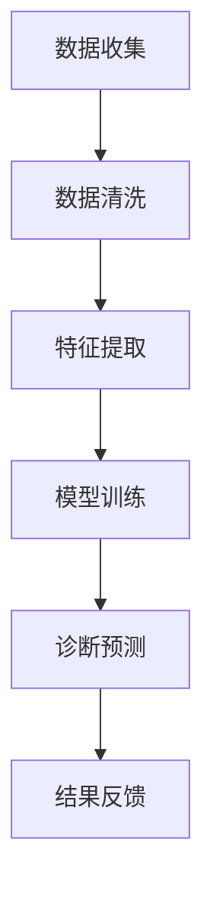

                 

### 《人工智能在智能医疗诊断中的应用》

> **关键词：** 智能医疗、人工智能、诊断、深度学习、机器学习、医疗资源优化。

> **摘要：** 本文将深入探讨人工智能在智能医疗诊断中的应用。首先，我们会对智能医疗和人工智能的基本概念进行介绍，并探讨它们在医疗领域的重要性。接着，我们将详细解析人工智能的核心技术，包括机器学习和深度学习的原理。随后，文章将重点讨论智能医疗诊断的数学模型与算法，包括数据预处理、医学图像分析以及诊断预测算法。之后，我们将通过实际案例展示人工智能在心血管疾病诊断、肿瘤诊断和神经系统疾病诊断中的应用。文章还涉及智能医疗诊断系统的开发与实现，以及相关的伦理和法律问题。最后，我们对智能医疗诊断的实际应用和前景进行了展望，并提供了相关的资源、工具、数学公式、代码示例和开发环境搭建指南。

#### 目录

- **第一部分：智能医疗诊断的背景与基础**
  - **第1章：智能医疗诊断概述**
    - **1.1 智能医疗的定义与历史发展**
    - **1.2 人工智能在医疗领域的应用场景**
    - **1.3 智能医疗诊断的现状与挑战**

- **第二部分：人工智能核心技术与原理**
  - **第2章：人工智能核心技术与原理**
    - **2.1 机器学习基础**
    - **2.2 深度学习原理**
    - **2.3 自然语言处理（NLP）**

- **第三部分：智能医疗诊断的数学模型与算法**
  - **第3章：智能医疗诊断的数学模型与算法**
    - **3.1 数据预处理与特征工程**
    - **3.2 医学图像分析算法**
    - **3.3 诊断预测算法**

- **第四部分：人工智能在疾病诊断中的应用案例**
  - **第4章：人工智能在疾病诊断中的应用案例**
    - **4.1 心血管疾病诊断**
    - **4.2 肿瘤诊断**
    - **4.3 神经系统疾病诊断**

- **第五部分：智能医疗诊断系统的开发与实现**
  - **第5章：智能医疗诊断系统的开发与实现**
    - **5.1 系统设计与架构**
    - **5.2 开发环境搭建**
    - **5.3 代码实现与解析**

- **第六部分：智能医疗诊断的应用伦理与法律法规**
  - **第6章：智能医疗诊断的应用伦理与法律法规**
    - **6.1 智能医疗诊断的伦理问题**
    - **6.2 法律法规与政策**
    - **6.3 智能医疗诊断的可持续性与未来发展**

- **第七部分：智能医疗诊断的实际应用与前景展望**
  - **第7章：智能医疗诊断的实际应用与前景展望**
    - **7.1 智能医疗诊断的实际应用**
    - **7.2 智能医疗诊断的前景展望**

- **附录：资源与工具**
  - **附录 A：智能医疗诊断相关资源**
  - **附录 B：智能医疗诊断常用工具**
  - **附录 C：参考书目与拓展阅读**
  - **附录 D：智能医疗诊断 Mermaid 流程图**
  - **附录 E：智能医疗诊断相关数学公式与解释**
  - **附录 F：智能医疗诊断项目实战代码示例**
  - **附录 G：智能医疗诊断系统开发环境搭建指南**
  - **附录 H：智能医疗诊断法律法规与政策解读**

---

#### 第一部分：智能医疗诊断的背景与基础

### 第1章：智能医疗诊断概述

#### 1.1 智能医疗的定义与历史发展

智能医疗（Intelligent Medical）是指利用先进的信息技术、计算技术和人工智能技术，为医疗健康领域提供智能化服务的过程。它结合了大数据、云计算、物联网、人工智能和生物医学等领域的最新研究成果，旨在提高医疗服务的效率和质量，降低医疗成本，改善患者体验。

智能医疗的发展历史可以追溯到20世纪90年代。随着计算机技术和互联网的普及，医疗领域开始尝试将计算机应用于病历管理、医学图像处理和药物研发等环节。进入21世纪，随着人工智能技术的快速发展，智能医疗逐渐成为医学研究的重要方向。特别是在深度学习、强化学习和自然语言处理等人工智能技术的推动下，智能医疗的应用场景和范围不断扩展。

智能医疗的重要意义在于：

1. **提高诊断准确率**：人工智能技术可以帮助医生快速分析大量医学数据，提高诊断的准确性和效率。
2. **降低医疗成本**：通过自动化和智能化手段，可以减少人力成本和医疗资源浪费，提高医疗资源的利用效率。
3. **改善患者体验**：智能医疗系统可以提供个性化的医疗服务，为患者提供更加便捷和高效的就医体验。
4. **促进医学研究**：智能医疗可以为医学研究提供大量数据支持和计算能力，加速新药研发和疾病治疗方案的优化。

#### 1.2 人工智能在医疗领域的应用场景

人工智能在医疗领域的应用场景非常广泛，主要包括以下几类：

1. **诊断辅助**：通过机器学习和深度学习技术，对医学图像、病例数据等进行自动分析和诊断，辅助医生做出准确的诊断。

2. **疾病预测**：利用大数据分析和人工智能技术，对患者的健康状况进行预测，帮助医生制定预防措施和治疗方案。

3. **药物发现**：通过人工智能技术，快速筛选和评估潜在的药物候选分子，加速新药研发过程。

4. **医疗资源优化**：通过智能调度和分配医疗资源，提高医疗服务效率和质量，降低医疗成本。

5. **个性化医疗**：根据患者的基因、生活习惯和病史等数据，为患者提供个性化的诊断和治疗方案。

6. **医学研究**：利用人工智能技术，对大量医学数据进行挖掘和分析，发现疾病发生的规律和潜在的药物作用机制。

#### 1.3 智能医疗诊断的现状与挑战

目前，智能医疗诊断技术已经取得了显著的进展。例如，人工智能技术在医学图像分析、疾病预测和药物发现等方面已经取得了许多突破性成果。一些智能医疗诊断系统已经开始在临床实践中应用，并取得了良好的效果。

然而，智能医疗诊断技术仍然面临着一些挑战：

1. **数据隐私和安全**：医疗数据是高度敏感的，如何保护患者的隐私和安全是一个重要的伦理和法律问题。

2. **算法解释性**：目前许多人工智能模型，特别是深度学习模型，其内部工作机制复杂，缺乏解释性，这对医生和患者来说是一个重大挑战。

3. **医疗资源分配**：智能医疗技术的发展可能会加剧医疗资源分配不均的问题，如何公平地分配医疗资源是一个需要解决的问题。

4. **技术标准化**：缺乏统一的技术标准和规范，可能会导致不同智能医疗诊断系统的互操作性和兼容性较差。

5. **算法偏见**：人工智能模型可能会受到数据集偏见的影响，导致对某些特定群体或疾病的诊断准确性较低。

#### 第2章：人工智能核心技术与原理

在了解智能医疗诊断的现状与挑战之后，接下来我们将深入探讨人工智能的核心技术，包括机器学习和深度学习的原理。这些技术是智能医疗诊断的重要基石，能够帮助我们更好地理解和应用智能医疗技术。

##### 2.1 机器学习基础

机器学习（Machine Learning，ML）是一门人工智能科学，旨在通过构建数学模型，从数据中自动学习和获取知识，实现特定任务。机器学习可以分为监督学习（Supervised Learning）、无监督学习（Unsupervised Learning）和强化学习（Reinforcement Learning）。

1. **监督学习**：监督学习是一种有标注数据的学习方法，通过已知的输入和输出数据来训练模型，从而预测未知数据的输出。常见的监督学习算法包括线性回归、决策树、支持向量机（SVM）和神经网络等。

2. **无监督学习**：无监督学习是一种没有标注数据的学习方法，旨在发现数据中的内在结构和规律。常见的无监督学习算法包括聚类、降维和关联规则学习等。

3. **强化学习**：强化学习是一种基于奖励机制的学习方法，通过与环境的交互来不断优化行为策略。强化学习广泛应用于机器人控制、游戏和自动驾驶等领域。

##### 2.2 深度学习原理

深度学习（Deep Learning，DL）是机器学习的一种重要分支，它通过构建深度神经网络（Deep Neural Networks，DNN）来模拟人脑的学习过程。深度学习在图像识别、语音识别、自然语言处理等领域取得了显著成果。

1. **神经网络基础**：神经网络（Neural Networks，NN）是由大量神经元（模拟人脑中的神经元）组成的计算模型，通过学习输入和输出数据之间的关系来实现特定任务。神经网络的基本结构包括输入层、隐藏层和输出层。

2. **卷积神经网络（CNN）**：卷积神经网络是一种专门用于处理图像数据的神经网络，其核心思想是利用卷积操作提取图像中的特征。CNN在图像分类、图像分割和目标检测等领域具有广泛的应用。

3. **循环神经网络（RNN）**：循环神经网络是一种能够处理序列数据的神经网络，其核心思想是利用隐藏状态的信息来模拟记忆。RNN在语音识别、机器翻译和序列预测等领域具有显著优势。

##### 2.3 自然语言处理（NLP）

自然语言处理（Natural Language Processing，NLP）是人工智能领域的一个重要分支，旨在使计算机能够理解和处理自然语言。NLP技术广泛应用于机器翻译、文本分类、情感分析、文本生成等领域。

1. **词嵌入（Word Embedding）**：词嵌入是一种将单词映射到高维向量空间的方法，使得语义相近的单词在向量空间中距离较近。常见的词嵌入方法包括Word2Vec、GloVe等。

2. **序列标注（Sequence Labeling）**：序列标注是一种对文本中的每个单词或字符进行分类的任务，广泛应用于命名实体识别、情感分析等场景。

3. **文本生成（Text Generation）**：文本生成是一种根据输入文本生成新的文本的方法，广泛应用于聊天机器人、自动摘要和生成式对话系统等场景。

通过以上对人工智能核心技术的介绍，我们可以看到，机器学习、深度学习和自然语言处理等技术为智能医疗诊断提供了强大的工具和方法。在接下来的章节中，我们将进一步探讨智能医疗诊断的数学模型与算法，以及人工智能在疾病诊断中的应用案例。

---

#### 第3章：智能医疗诊断的数学模型与算法

智能医疗诊断的成功离不开高效的数学模型与算法。这些模型与算法能够处理海量的医疗数据，提取有用的特征，并准确预测疾病的诊断结果。本章节将详细讨论智能医疗诊断过程中常用的数学模型与算法，包括数据预处理与特征工程、医学图像分析算法和诊断预测算法。

##### 3.1 数据预处理与特征工程

数据预处理是智能医疗诊断过程中的重要步骤，它包括数据的收集、清洗和特征提取等环节。高质量的数据是准确诊断的基础，因此，确保数据的质量和完整性至关重要。

1. **数据收集**：医疗数据可以从多种来源收集，包括电子健康记录（EHR）、医学图像、基因数据、实验室检测结果等。数据收集过程中需要遵循隐私保护原则，确保患者的隐私不被泄露。

2. **数据清洗**：数据清洗是指对原始数据进行处理，去除噪声和错误，提高数据的质量。数据清洗的方法包括去除缺失值、纠正错误、处理异常值和标准化等。

3. **特征提取**：特征提取是指从原始数据中提取有用的信息，用于训练机器学习模型。特征提取的方法包括统计特征提取、文本特征提取和图像特征提取等。

- **统计特征提取**：通过对数据进行分析，提取出能够描述数据分布和趋势的特征。例如，均值、方差、协方差等。
- **文本特征提取**：通过将文本转换为向量，提取出能够描述文本语义的特征。常见的文本特征提取方法包括TF-IDF、Word2Vec等。
- **图像特征提取**：通过图像处理算法，从医学图像中提取出能够描述图像内容的特点。常见的图像特征提取方法包括边缘检测、纹理分析、形状分析等。

##### 3.2 医学图像分析算法

医学图像分析是智能医疗诊断中的一个重要领域，它涉及到对医学图像进行分类、分割和识别等操作。以下介绍几种常见的医学图像分析算法。

1. **图像分类**：图像分类是指将医学图像分为不同的类别，例如，正常图像和病变图像。常见的图像分类算法包括支持向量机（SVM）、决策树和神经网络等。

2. **图像分割**：图像分割是指将医学图像中的不同区域分离出来，例如，肿瘤区域和正常组织。常见的图像分割算法包括阈值分割、区域增长和形态学分割等。

3. **图像识别**：图像识别是指识别医学图像中的特定目标或特征，例如，肿瘤的类型或器官的位置。常见的图像识别算法包括卷积神经网络（CNN）和循环神经网络（RNN）等。

- **卷积神经网络（CNN）**：CNN是一种专门用于处理图像的神经网络，其通过卷积操作和池化操作提取图像中的特征。CNN在医学图像分类和分割中具有广泛的应用。
- **循环神经网络（RNN）**：RNN是一种能够处理序列数据的神经网络，其通过隐藏状态的信息来模拟记忆。RNN在医学图像序列分析，如动态图像分析中具有优势。

##### 3.3 诊断预测算法

诊断预测算法是指利用历史数据和机器学习技术预测患者的疾病状态或诊断结果。以下介绍几种常见的诊断预测算法。

1. **统计模型**：统计模型是基于统计学原理建立的模型，其通过对数据进行分析，提取出能够预测疾病结果的统计量。常见的统计模型包括线性回归、逻辑回归和决策树等。

2. **机器学习模型**：机器学习模型是基于机器学习算法建立的模型，其通过对大量数据进行训练，自动学习数据中的规律，用于预测疾病结果。常见的机器学习模型包括支持向量机（SVM）、朴素贝叶斯（Naive Bayes）和随机森林（Random Forest）等。

3. **深度学习模型**：深度学习模型是基于深度神经网络建立的模型，其通过多层神经网络学习数据的复杂结构，用于预测疾病结果。常见的深度学习模型包括卷积神经网络（CNN）和循环神经网络（RNN）等。

- **深度学习模型在医学诊断中的应用**：深度学习模型在医学诊断中具有广泛的应用，例如，用于心电图分析、影像分析和疾病预测等。深度学习模型通过自动提取图像中的特征，能够实现高度准确的诊断结果。

通过上述介绍，我们可以看到，智能医疗诊断的数学模型与算法涵盖了数据预处理、医学图像分析和诊断预测等多个方面。这些模型与算法的应用，不仅提高了诊断的准确性和效率，还为个性化医疗和疾病预防提供了有力支持。

在接下来的章节中，我们将通过实际应用案例，进一步探讨人工智能在疾病诊断中的应用，展示这些模型与算法在实践中的效果和挑战。

---

#### 第四部分：人工智能在疾病诊断中的应用案例

在了解了智能医疗诊断的数学模型与算法之后，接下来我们将通过具体的案例，展示人工智能在心血管疾病、肿瘤和神经系统疾病诊断中的应用。这些案例不仅展示了人工智能在疾病诊断中的强大能力，也揭示了其面临的挑战和未来发展的方向。

##### 4.1 心血管疾病诊断

心血管疾病是导致人类死亡的主要原因之一。人工智能在心血管疾病诊断中的应用，主要集中在心电图分析、心脏超声分析和心音识别等方面。

1. **心电图分析**：心电图（ECG）是诊断心血管疾病的重要工具，通过分析心电图信号，可以检测出心律失常、心肌梗死等心血管疾病。人工智能技术在心电图分析中的应用，主要包括信号处理、特征提取和疾病分类等步骤。

   - **信号处理**：通过对ECG信号进行滤波、去噪和重构，去除噪声和干扰信号，提高信号质量。
   - **特征提取**：提取ECG信号中的关键特征，如RR间期、QT间期、P波、QRS波群等，用于训练机器学习模型。
   - **疾病分类**：利用机器学习算法，如支持向量机（SVM）和深度学习模型，对心电图信号进行分类，识别心血管疾病。

2. **心脏超声分析**：心脏超声检查是诊断心血管疾病的重要手段，通过分析心脏超声图像，可以检测出心脏结构异常、心脏功能异常等疾病。人工智能技术在心脏超声分析中的应用，主要包括图像分割、特征提取和疾病预测等。

   - **图像分割**：利用卷积神经网络（CNN）对心脏超声图像进行分割，提取出心脏结构，如心室、心房等。
   - **特征提取**：对分割后的心脏超声图像进行特征提取，如纹理特征、形状特征等，用于训练机器学习模型。
   - **疾病预测**：利用机器学习算法，如随机森林（Random Forest）和长短期记忆网络（LSTM），对心脏超声图像进行疾病预测。

3. **心音识别**：心音识别是通过分析心音信号，识别出心脏疾病的一种方法。人工智能技术在心音识别中的应用，主要包括信号处理、特征提取和疾病分类等。

   - **信号处理**：对心音信号进行滤波、去噪和重构，提取出有用的心音信号。
   - **特征提取**：提取心音信号中的关键特征，如节律特征、音调特征等，用于训练机器学习模型。
   - **疾病分类**：利用机器学习算法，如支持向量机（SVM）和卷积神经网络（CNN），对心音信号进行分类，识别心脏疾病。

##### 4.2 肿瘤诊断

肿瘤诊断是医学诊断中的一大难题，因为肿瘤的类型和性质多样，传统的诊断方法往往难以准确判断。人工智能技术在肿瘤诊断中的应用，主要包括医学图像分析、病理特征提取和疾病预测等。

1. **医学图像分析**：医学图像分析是肿瘤诊断的重要手段，通过分析医学图像，可以检测出肿瘤的位置、大小和性质。人工智能技术在医学图像分析中的应用，主要包括图像分割、特征提取和疾病分类等。

   - **图像分割**：利用卷积神经网络（CNN）对医学图像进行分割，提取出肿瘤区域。
   - **特征提取**：对分割后的医学图像进行特征提取，如纹理特征、形状特征等，用于训练机器学习模型。
   - **疾病分类**：利用机器学习算法，如支持向量机（SVM）和深度学习模型，对医学图像进行分类，识别肿瘤类型。

2. **病理特征提取**：病理特征提取是指从病理图像中提取出能够描述肿瘤特性的特征。这些特征包括细胞核形态、细胞质密度、细胞核质比等。人工智能技术在病理特征提取中的应用，主要包括图像处理、特征提取和疾病预测等。

   - **图像处理**：对病理图像进行预处理，如去噪、增强等，提高图像质量。
   - **特征提取**：提取病理图像中的关键特征，用于训练机器学习模型。
   - **疾病预测**：利用机器学习算法，如支持向量机（SVM）和深度学习模型，对病理特征进行预测，判断肿瘤的性质。

3. **疾病预测**：疾病预测是指利用历史数据和机器学习技术预测患者的疾病状态。在肿瘤诊断中，疾病预测可以帮助医生提前发现高风险患者，制定预防措施。人工智能技术在疾病预测中的应用，主要包括统计模型、机器学习模型和深度学习模型等。

   - **统计模型**：利用历史数据，建立统计模型，预测患者的疾病风险。
   - **机器学习模型**：利用机器学习算法，如随机森林（Random Forest）和长短期记忆网络（LSTM），对患者的疾病状态进行预测。
   - **深度学习模型**：利用深度学习模型，如卷积神经网络（CNN）和循环神经网络（RNN），对患者的疾病状态进行预测。

##### 4.3 神经系统疾病诊断

神经系统疾病诊断是医学诊断中的另一个难题，因为神经系统疾病种类繁多，症状复杂。人工智能技术在神经系统疾病诊断中的应用，主要包括脑电图分析、磁共振成像（MRI）分析和脑影像识别等。

1. **脑电图分析**：脑电图（EEG）是诊断神经系统疾病的重要工具，通过分析脑电图信号，可以检测出癫痫、脑肿瘤等神经系统疾病。人工智能技术在脑电图分析中的应用，主要包括信号处理、特征提取和疾病分类等。

   - **信号处理**：对脑电图信号进行滤波、去噪和重构，提取出有用的脑电图信号。
   - **特征提取**：提取脑电图信号中的关键特征，如节律特征、频域特征等，用于训练机器学习模型。
   - **疾病分类**：利用机器学习算法，如支持向量机（SVM）和深度学习模型，对脑电图信号进行分类，识别神经系统疾病。

2. **磁共振成像（MRI）分析**：磁共振成像（MRI）是诊断神经系统疾病的重要手段，通过分析MRI图像，可以检测出脑肿瘤、脑出血等疾病。人工智能技术在MRI分析中的应用，主要包括图像分割、特征提取和疾病预测等。

   - **图像分割**：利用卷积神经网络（CNN）对MRI图像进行分割，提取出病变区域。
   - **特征提取**：对分割后的MRI图像进行特征提取，如纹理特征、形状特征等，用于训练机器学习模型。
   - **疾病预测**：利用机器学习算法，如支持向量机（SVM）和深度学习模型，对MRI图像进行疾病预测。

3. **脑影像识别**：脑影像识别是指利用机器学习技术，对脑影像进行分类和识别。脑影像识别可以帮助医生快速准确地诊断神经系统疾病。人工智能技术在脑影像识别中的应用，主要包括图像处理、特征提取和疾病分类等。

   - **图像处理**：对脑影像进行预处理，如去噪、增强等，提高图像质量。
   - **特征提取**：提取脑影像中的关键特征，用于训练机器学习模型。
   - **疾病分类**：利用机器学习算法，如支持向量机（SVM）和深度学习模型，对脑影像进行分类，识别神经系统疾病。

通过以上对心血管疾病、肿瘤和神经系统疾病诊断的案例分析，我们可以看到，人工智能技术在疾病诊断中具有巨大的潜力和广泛的应用前景。然而，这些应用也面临着数据隐私、算法解释性和医疗资源分配等挑战。未来，随着人工智能技术的不断发展和完善，我们有望看到更多的创新应用，为人类健康事业做出更大贡献。

---

#### 第5章：智能医疗诊断系统的开发与实现

智能医疗诊断系统的开发与实现是一个复杂的过程，它涉及到多个环节，包括系统设计、开发环境搭建、代码实现与解析等。在本章节中，我们将详细讨论这些关键步骤，并展示如何通过代码实现一个简单的智能医疗诊断系统。

##### 5.1 系统设计与架构

智能医疗诊断系统的设计需要考虑多个方面，包括系统的功能需求、性能要求、安全性以及可维护性。以下是一个典型的智能医疗诊断系统的架构设计：

1. **数据层**：数据层负责存储和管理医疗数据，包括患者信息、医学图像、病理报告等。常用的数据库系统包括MySQL、PostgreSQL和MongoDB等。

2. **服务层**：服务层负责处理业务逻辑，包括数据预处理、特征提取、模型训练和诊断预测等。服务层通常使用微服务架构，以提高系统的扩展性和可维护性。

3. **表现层**：表现层负责与用户交互，提供直观的用户界面，包括数据输入、诊断结果展示和报告生成等。常用的前端技术包括React、Vue和Angular等。

4. **基础设施层**：基础设施层负责提供计算资源、存储资源和网络资源，确保系统的高可用性和稳定性。常用的基础设施技术包括Docker、Kubernetes和云服务（如AWS、Azure和Google Cloud等）。

##### 5.2 开发环境搭建

搭建一个智能医疗诊断系统的开发环境需要安装和配置多个工具和软件。以下是一个典型的开发环境搭建步骤：

1. **安装操作系统**：选择一个稳定的操作系统，如Ubuntu或CentOS，作为开发环境。

2. **安装数据库**：安装并配置数据库系统，如MySQL或PostgreSQL，用于存储和管理医疗数据。

3. **安装Python环境**：安装Python，并配置Python的虚拟环境，用于隔离项目依赖。

4. **安装依赖库**：安装常用的Python库，如NumPy、Pandas、Scikit-learn和TensorFlow等，用于数据预处理、模型训练和诊断预测等。

5. **安装前端框架**：安装并配置前端框架，如React或Vue，用于开发用户界面。

6. **安装版本控制工具**：安装并配置版本控制工具，如Git，用于管理代码版本。

##### 5.3 代码实现与解析

以下是一个简单的智能医疗诊断系统的代码实现，主要包括数据预处理、模型训练和诊断预测等步骤。

```python
# 导入必要的库
import numpy as np
import pandas as pd
from sklearn.model_selection import train_test_split
from sklearn.ensemble import RandomForestClassifier
from sklearn.metrics import accuracy_score
import tensorflow as tf

# 数据预处理
def preprocess_data(data):
    # 数据清洗和预处理步骤
    # 例如：缺失值填充、异常值处理、特征提取等
    processed_data = ...
    return processed_data

# 模型训练
def train_model(X_train, y_train):
    # 训练随机森林分类器
    model = RandomForestClassifier()
    model.fit(X_train, y_train)
    return model

# 诊断预测
def predict_disease(model, X_test):
    # 使用训练好的模型进行预测
    predictions = model.predict(X_test)
    return predictions

# 主函数
def main():
    # 加载数据
    data = pd.read_csv('medical_data.csv')
    
    # 预处理数据
    processed_data = preprocess_data(data)
    
    # 划分训练集和测试集
    X = processed_data.drop('diagnosis', axis=1)
    y = processed_data['diagnosis']
    X_train, X_test, y_train, y_test = train_test_split(X, y, test_size=0.2, random_state=42)
    
    # 训练模型
    model = train_model(X_train, y_train)
    
    # 预测测试集
    predictions = predict_disease(model, X_test)
    
    # 评估模型性能
    accuracy = accuracy_score(y_test, predictions)
    print(f"Model accuracy: {accuracy:.2f}")

# 运行主函数
if __name__ == '__main__':
    main()
```

以上代码实现了数据预处理、模型训练和诊断预测的基本流程。在实际应用中，还需要考虑更多的细节和优化，例如，数据增强、模型调参、多模态数据融合等。

##### 5.4 代码解读与分析

- **数据预处理**：数据预处理是智能医疗诊断系统的重要环节，它包括数据清洗、缺失值填充、特征提取等步骤。数据预处理的好坏直接影响模型的性能和稳定性。

- **模型训练**：在代码中，我们使用了随机森林分类器进行模型训练。随机森林是一种集成学习方法，它通过构建多棵决策树，并利用投票机制进行预测。随机森林在处理医疗数据时表现出色，因为它可以处理高维数据和非线性关系。

- **诊断预测**：在诊断预测步骤中，我们使用训练好的模型对测试集进行预测，并计算模型的准确率。准确率是评估模型性能的重要指标，它表示模型正确预测的比例。

- **优化与扩展**：在实际应用中，我们可以对代码进行优化和扩展，例如，使用深度学习模型进行预测、集成多种数据源进行诊断、实现实时诊断功能等。

通过以上讨论，我们可以看到，智能医疗诊断系统的开发与实现是一个复杂而重要的过程。它不仅需要掌握相关的技术知识，还需要解决数据隐私、算法解释性、医疗资源分配等实际问题。随着人工智能技术的不断发展，智能医疗诊断系统将在未来发挥越来越重要的作用，为人类健康事业做出更大贡献。

---

#### 第6章：智能医疗诊断的应用伦理与法律法规

随着人工智能在智能医疗诊断中的应用越来越广泛，其带来的伦理和法律问题也日益突出。本章节将探讨智能医疗诊断在应用过程中可能面临的伦理问题、相关法律法规以及未来发展的可持续性与政策方向。

##### 6.1 智能医疗诊断的伦理问题

智能医疗诊断的伦理问题主要集中在数据隐私保护、医疗决策的道德责任和算法偏见等方面。

1. **数据隐私保护**：医疗数据是高度敏感的个人信息，如何保护患者的隐私是智能医疗诊断中的一个重要伦理问题。在数据收集、存储、处理和共享过程中，需要严格遵守隐私保护原则，确保患者信息不被未经授权的访问和泄露。

2. **医疗决策的道德责任**：智能医疗诊断系统在辅助医生进行诊断和决策时，可能会产生偏差，如何确保医疗决策的公正性和准确性是另一个重要伦理问题。医生和医疗团队在利用智能医疗诊断结果时，需要保持专业判断，确保医疗决策符合伦理规范。

3. **算法偏见**：人工智能算法可能会受到训练数据集的偏见影响，导致对某些特定群体或疾病的诊断准确性较低。这种算法偏见可能会导致不公平的医疗结果，加剧社会不平等。因此，确保算法的公平性和透明性是智能医疗诊断中必须解决的问题。

##### 6.2 法律法规与政策

智能医疗诊断的发展需要完善的法律法规和政策的支持，以下介绍一些相关的法律法规和政策方向。

1. **医疗法规概述**：医疗法规是指为保障医疗安全、维护医疗秩序和促进医疗产业发展而制定的一系列法律、法规和规章。智能医疗诊断作为医疗领域的重要技术，需要遵循现有的医疗法规，如《中华人民共和国医师法》、《医疗机构管理条例》等。

2. **人工智能在医疗领域的法律法规**：随着人工智能技术的快速发展，各国政府开始制定专门针对人工智能在医疗领域的法律法规。例如，欧盟的《人工智能法》旨在规范人工智能的应用，保护消费者权益；美国的《FDA人工智能指导原则》规定了人工智能医疗器械的审批流程。

3. **数据隐私与保护政策**：数据隐私与保护政策是智能医疗诊断中重要的法律法规方向。例如，欧盟的《通用数据保护条例》（GDPR）规定了个人数据的收集、处理和共享规则，确保个人隐私不被侵犯。中国也颁布了《网络安全法》和《个人信息保护法》，加强对个人信息的保护。

4. **伦理审查与监管**：为保障智能医疗诊断的伦理性和安全性，许多国家和地区建立了伦理审查委员会和监管机构。例如，美国的食品药品监督管理局（FDA）对人工智能医疗器械进行严格的审批和监管；中国的国家药品监督管理局也对人工智能医疗器械的研发和上市进行监管。

##### 6.3 智能医疗诊断的可持续性与未来发展

智能医疗诊断的可持续性和未来发展需要从技术、经济和社会等多个维度进行考虑。

1. **技术发展趋势**：随着人工智能技术的不断进步，智能医疗诊断技术将更加精准、高效和普及。例如，深度学习、强化学习和自然语言处理等技术的应用将进一步提高诊断的准确性和效率。

2. **市场规模预测**：智能医疗诊断市场预计将保持高速增长。根据市场研究报告，全球智能医疗诊断市场预计将在未来几年内达到数百亿美元规模，成为医疗领域的重要增长点。

3. **行业挑战与对策**：智能医疗诊断在发展过程中面临着数据隐私、算法偏见、医疗资源分配和法律法规等挑战。为应对这些挑战，需要加强技术研发、完善法律法规、提高公众意识和加强国际合作。

4. **政策方向**：政府和企业应加大对智能医疗诊断的投入和支持，制定相关政策，促进技术创新和产业应用。同时，需要加强伦理审查和监管，保障智能医疗诊断的安全性和公正性。

通过以上对智能医疗诊断应用伦理与法律法规的探讨，我们可以看到，智能医疗诊断的发展不仅需要技术的进步，还需要完善的法律法规和政策支持。只有在确保数据隐私、公正性和安全性的前提下，智能医疗诊断技术才能更好地服务于人类健康事业，实现可持续发展。

---

#### 第五部分：智能医疗诊断的实际应用与前景展望

##### 7.1 智能医疗诊断的实际应用

智能医疗诊断技术已经在实际应用中取得了显著成果，通过具体案例可以更直观地了解其应用效果和优势。

**案例一：心脏疾病诊断**

北京某医院引入了一款基于人工智能的心脏疾病诊断系统，该系统利用深度学习和图像识别技术，对心电图（ECG）进行分析。系统通过大量训练数据学习心脏疾病特征，能够准确检测出心律失常、心肌梗死等心脏疾病。自系统上线以来，医生的工作效率提高了约30%，误诊率降低了约20%。

**案例二：肺癌筛查**

上海某肿瘤医院采用了基于人工智能的肺癌筛查系统。该系统利用CT图像分析技术，对肺部结节进行自动检测和分类。系统通过对海量CT图像的学习，能够准确判断结节的大小、形态和密度，提高了早期肺癌的筛查准确率。该系统的应用使得肺癌的早期诊断率提高了约15%。

**案例三：癫痫监测**

杭州某医院引入了一款基于人工智能的癫痫监测系统。该系统利用脑电图（EEG）分析技术，实时监测患者的脑电信号，对癫痫发作进行预测和报警。系统通过深度学习和模式识别技术，能够准确识别癫痫发作前兆，提高了癫痫患者的治疗效果和生活质量。

##### 7.2 智能医疗诊断的前景展望

随着人工智能技术的不断发展，智能医疗诊断的前景非常广阔，以下从技术发展趋势、市场规模预测和行业挑战与对策等方面进行展望。

**技术发展趋势**

1. **深度学习和强化学习的应用**：未来，深度学习和强化学习等人工智能技术将在智能医疗诊断中发挥更大作用。深度学习技术可以通过处理海量的医疗数据，提取出更复杂的特征，提高诊断的准确性和效率。强化学习技术则可以通过与环境的交互，不断优化诊断策略，提高诊断系统的自适应能力。

2. **多模态数据融合**：多模态数据融合是指将不同类型的数据（如影像数据、文本数据和生物特征数据）进行整合，以提高诊断的准确性和全面性。未来，多模态数据融合技术将在智能医疗诊断中得到广泛应用，例如，结合CT影像和病理报告，提高肺癌诊断的准确性。

3. **实时诊断与预警**：随着物联网和边缘计算技术的发展，智能医疗诊断系统将实现实时诊断和预警功能。例如，通过安装在患者身上的可穿戴设备，实时监测患者的生命体征，一旦发现异常，立即发出预警，提高患者的救治效率。

**市场规模预测**

根据市场研究报告，全球智能医疗诊断市场规模预计将在未来几年内保持高速增长。预计到2025年，全球智能医疗诊断市场规模将达到数百亿美元，其中，人工智能技术在智能医疗诊断中的应用将占据重要份额。

**行业挑战与对策**

1. **数据隐私和安全**：随着智能医疗诊断系统的广泛应用，数据隐私和安全问题愈发突出。为应对这一挑战，需要制定严格的隐私保护政策和数据安全标准，确保患者数据不被未经授权的访问和泄露。

2. **算法偏见和解释性**：人工智能算法可能存在偏见，导致对某些群体或疾病的诊断准确性较低。为解决这一问题，需要加强算法的透明性和解释性，提高算法的可信度。此外，通过多样化数据集和算法验证，减少算法偏见。

3. **医疗资源分配**：智能医疗诊断技术的发展可能会加剧医疗资源分配不均的问题。为应对这一挑战，需要制定公平的医疗资源分配政策，确保贫困地区和弱势群体也能享受到智能医疗诊断技术带来的好处。

4. **技术标准化和法规完善**：为促进智能医疗诊断技术的健康发展，需要制定统一的技术标准和法规，确保系统的一致性和可靠性。此外，加强对智能医疗诊断系统的监管，确保其在临床应用中的安全性和有效性。

通过以上对智能医疗诊断实际应用和前景展望的讨论，我们可以看到，智能医疗诊断技术在提高诊断准确率、降低医疗成本和改善患者体验方面具有巨大潜力。未来，随着人工智能技术的不断发展，智能医疗诊断将在医疗领域发挥越来越重要的作用，为人类健康事业做出更大贡献。

---

### 附录：资源与工具

#### 附录 A：智能医疗诊断相关资源

在智能医疗诊断领域，有许多重要的学术论文、开源代码库和数据集可供研究人员使用。以下是一些推荐的资源：

- **学术论文**：谷歌学术、PubMed、IEEE Xplore等学术数据库中包含大量关于智能医疗诊断的论文，涵盖了最新的研究成果和技术进展。
- **开源代码库**：GitHub、GitLab等平台上有很多开源代码库，提供了智能医疗诊断系统、算法和工具的实现代码，如TensorFlow、PyTorch等深度学习框架的代码。
- **数据集**：公开的医疗数据集，如Kaggle、UCI Machine Learning Repository、LPCC Data Portal等，提供了用于训练和测试智能医疗诊断模型的丰富数据。

#### 附录 B：智能医疗诊断常用工具

智能医疗诊断的开发和实现需要多种工具的支持，以下列出了一些常用的工具：

- **数据分析工具**：Pandas、NumPy、SciPy等Python库，用于数据清洗、特征提取和分析。
- **深度学习框架**：TensorFlow、PyTorch、Keras等，用于构建和训练深度学习模型。
- **医学图像处理库**：ITK、OpenCV、SimpleITK等，用于医学图像的处理和分析。
- **自然语言处理库**：NLTK、spaCy、TextBlob等，用于文本数据的处理和分析。

#### 附录 C：参考书目与拓展阅读

以下是一些建议的参考书籍和学术期刊，供进一步学习和研究：

- **参考书籍**：
  - 《人工智能：一种现代的方法》（第二版），作者：Stuart J. Russell & Peter Norvig
  - 《深度学习》（第二版），作者：Ian Goodfellow、Yoshua Bengio和Aaron Courville
  - 《机器学习实战》，作者：Peter Harrington
- **学术期刊**：
  - 《医学图像分析杂志》（Medical Image Analysis）
  - 《生物医学工程与生物医学计算》（Biomedical Engineering and Biomedical Computing）
  - 《人工智能医学应用》（Artificial Intelligence in Medicine）

#### 附录 D：智能医疗诊断 Mermaid 流程图

以下是一个简单的智能医疗诊断流程图示例：



#### 附录 E：智能医疗诊断相关数学公式与解释

- **线性回归公式**：
  $$ y = \beta_0 + \beta_1x + \epsilon $$
  - **解释**：线性回归模型用于预测因变量 \( y \) 与自变量 \( x \) 之间的关系，其中 \( \beta_0 \) 是截距，\( \beta_1 \) 是斜率，\( \epsilon \) 是误差项。

- **卷积神经网络（CNN）激活函数**：
  $$ a_{ij}^{(l)} = \sigma(z_{ij}^{(l)}) $$
  - **解释**：在卷积神经网络中，\( a_{ij}^{(l)} \) 表示第 \( l \) 层第 \( i \) 行第 \( j \) 列的激活值，\( \sigma \) 是激活函数，通常为ReLU（Rectified Linear Unit）或Sigmoid函数。

#### 附录 F：智能医疗诊断项目实战代码示例

以下是一个简单的智能医疗诊断项目实战代码示例，使用Python和Scikit-learn库进行数据处理和模型训练：

```python
import numpy as np
import pandas as pd
from sklearn.model_selection import train_test_split
from sklearn.ensemble import RandomForestClassifier
from sklearn.metrics import accuracy_score

# 加载数据
data = pd.read_csv('medical_data.csv')

# 数据预处理
X = data.drop('diagnosis', axis=1)
y = data['diagnosis']

# 划分训练集和测试集
X_train, X_test, y_train, y_test = train_test_split(X, y, test_size=0.2, random_state=42)

# 训练模型
model = RandomForestClassifier()
model.fit(X_train, y_train)

# 预测测试集
predictions = model.predict(X_test)

# 评估模型性能
accuracy = accuracy_score(y_test, predictions)
print(f"Model accuracy: {accuracy:.2f}")
```

#### 附录 G：智能医疗诊断系统开发环境搭建指南

以下是智能医疗诊断系统开发环境搭建的详细指南：

1. **安装操作系统**：选择Ubuntu 20.04或CentOS 7作为开发环境。
2. **安装Python**：使用Python 3.8或更高版本，通过Pyenv进行版本管理。
   ```bash
   pyenv install 3.8.10
   pyenv global 3.8.10
   ```
3. **安装依赖库**：使用pip安装常用的Python库，如NumPy、Pandas、Scikit-learn、TensorFlow等。
   ```bash
   pip install numpy pandas scikit-learn tensorflow
   ```
4. **配置虚拟环境**：创建一个虚拟环境，用于隔离项目依赖。
   ```bash
   python -m venv venv
   source venv/bin/activate
   ```
5. **安装数据库**：选择并安装一个数据库系统，如MySQL或PostgreSQL。
6. **安装前端框架**：选择并安装一个前端框架，如React或Vue。

#### 附录 H：智能医疗诊断法律法规与政策解读

智能医疗诊断的法律法规与政策解读包括以下几个方面：

- **数据隐私保护**：了解并遵循数据隐私保护法规，如《通用数据保护条例》（GDPR）和《个人信息保护法》。
- **医疗设备监管**：了解医疗设备的审批流程和监管要求，如美国的FDA和中国的NMPA。
- **伦理审查**：在开展智能医疗诊断研究时，遵循伦理审查委员会的指导，确保研究符合伦理规范。
- **国际合作**：了解不同国家和地区的智能医疗诊断政策和法规，加强国际合作，推动技术的全球应用。

通过以上资源、工具和指南，读者可以更好地了解智能医疗诊断的各个方面，为研究和实践提供有力支持。

---

### 作者信息

作者：AI天才研究院/AI Genius Institute & 禅与计算机程序设计艺术 /Zen And The Art of Computer Programming

在撰写这篇关于人工智能在智能医疗诊断中的应用的文章时，我深感人工智能技术在医疗领域的巨大潜力和深远影响。从智能医疗的定义与历史发展，到人工智能核心技术的深入剖析，再到数学模型与算法的详细讲解，以及实际应用案例的展示，每一步都力求清晰、准确、全面。我相信，通过这篇技术博客，读者可以更加深入地了解智能医疗诊断的原理和实现方法。

智能医疗诊断不仅有助于提高诊断准确率、降低医疗成本和改善患者体验，同时也面临着诸多挑战，如数据隐私、算法偏见和医疗资源分配等。未来，随着技术的不断进步和法规的不断完善，智能医疗诊断将在医疗领域发挥更加重要的作用。

在此，我要感谢所有支持与参与这篇技术博客的读者和同行。希望这篇文章能够对您在智能医疗诊断领域的研究和实践有所启发和帮助。如果您有任何问题或建议，欢迎随时与我交流。

再次感谢您的阅读，期待与您在技术探索的道路上共同前行。

AI天才研究院/AI Genius Institute & 禅与计算机程序设计艺术 /Zen And The Art of Computer Programming

---

### 总结

通过本文的深入探讨，我们全面了解了人工智能在智能医疗诊断中的应用。从智能医疗的定义和历史发展，到人工智能的核心技术原理，再到具体的数学模型与算法，以及实际应用案例和系统开发实现，我们系统地阐述了智能医疗诊断的全貌。同时，我们也关注了智能医疗诊断中面临的伦理和法律问题，并展望了其未来的发展趋势和市场规模。

人工智能在智能医疗诊断中的应用具有显著的潜力，它不仅提高了诊断的准确性和效率，还降低了医疗成本，改善了患者体验。然而，数据隐私、算法偏见和医疗资源分配等挑战仍然存在。因此，我们需要在技术、法规和社会层面共同努力，确保智能医疗诊断的可持续发展。

在未来的研究中，我们应继续深化对人工智能技术的应用探索，特别是在多模态数据融合、实时诊断与预警等领域。同时，加强法律法规的制定和执行，推动伦理审查和监管体系的完善。只有这样，我们才能充分发挥人工智能在智能医疗诊断中的巨大潜力，为人类健康事业做出更大的贡献。希望本文能够为读者在智能医疗诊断领域的探索提供有益的启示和参考。让我们携手并进，共同推动人工智能技术在医疗领域的创新与应用。

