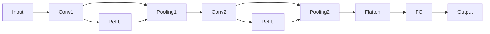

                 

### 《人工智能在智能医疗诊断辅助中的实践》

> **关键词：** 人工智能，智能医疗，诊断辅助，机器学习，深度学习，医疗图像处理

> **摘要：** 本文系统地探讨了人工智能在智能医疗诊断辅助中的应用，从理论基础到实际案例进行了全面剖析。主要内容包括人工智能基础理论、智能医疗诊断辅助算法与应用、实践案例以及未来展望，旨在为读者提供一份全面、系统的智能医疗诊断辅助指南。

### 目录

**第一部分：引言**

1.1 书籍背景与目的
1.2 相关术语与概念

**第二部分：人工智能基础理论**

2.1 机器学习基础
2.2 深度学习与神经网络
2.3 自然语言处理基础

**第三部分：智能医疗诊断辅助算法与应用**

3.1 医学图像处理
3.2 电子病历与临床决策支持系统
3.3 基于自然语言处理的医疗文本挖掘

**第四部分：实践案例与展望**

4.1 智能医疗诊断辅助系统开发
4.2 智能医疗诊断辅助实践案例
4.3 未来展望

**附录**

附录A：数学公式与伪代码
附录B：常用工具与资源

### 第一部分：引言

#### 1.1 书籍背景与目的

随着人工智能技术的快速发展，其在医疗领域的应用也越来越广泛。智能医疗诊断辅助作为人工智能在医疗领域的一个重要分支，已经成为提高医疗诊断准确性和效率的重要手段。本书旨在系统地探讨人工智能在智能医疗诊断辅助中的应用，为读者提供一份全面、系统的智能医疗诊断辅助指南。

本书的主要目的是：

1. **介绍人工智能基础理论**：通过深入剖析机器学习、深度学习、自然语言处理等基础理论，帮助读者理解智能医疗诊断辅助的底层技术原理。

2. **讲解智能医疗诊断辅助算法与应用**：详细讲解医学图像处理、电子病历、临床决策支持系统和医疗文本挖掘等实际应用案例，展示人工智能技术在医疗诊断辅助中的具体应用。

3. **提供实践案例与展望**：通过分析智能医疗诊断辅助系统的开发流程和实际案例，探讨其发展趋势、挑战与解决方案，为读者提供未来发展方向和思考。

本书的结构安排如下：

- **第一部分：引言**：介绍书籍背景、目的、相关术语与概念。
- **第二部分：人工智能基础理论**：包括机器学习基础、深度学习与神经网络、自然语言处理基础。
- **第三部分：智能医疗诊断辅助算法与应用**：包括医学图像处理、电子病历与临床决策支持系统、基于自然语言处理的医疗文本挖掘。
- **第四部分：实践案例与展望**：包括智能医疗诊断辅助系统开发、实践案例、未来展望。

通过以上结构的安排，本书力求让读者全面了解人工智能在智能医疗诊断辅助中的应用，从而为实际应用提供理论支持和实践指导。

#### 1.2 相关术语与概念

在深入探讨人工智能在智能医疗诊断辅助中的应用之前，我们需要明确一些核心术语和概念，以便更好地理解后续内容。

**人工智能（Artificial Intelligence，AI）**：人工智能是计算机科学的一个分支，旨在使机器具备人类智能的能力，包括学习、推理、解决问题、理解和生成语言等。

**机器学习（Machine Learning，ML）**：机器学习是人工智能的一个子领域，通过数据训练算法，使计算机具备自主学习和改进的能力。

**深度学习（Deep Learning，DL）**：深度学习是机器学习的一个分支，通过构建深层神经网络，实现复杂特征提取和任务完成。

**智能医疗（Intelligent Healthcare）**：智能医疗是指利用人工智能技术提高医疗服务的质量和效率，包括疾病预测、诊断、治疗、康复等。

**诊断辅助（Diagnosis Assistance）**：诊断辅助是指利用人工智能技术辅助医生进行疾病诊断，提高诊断准确性和效率。

**医学图像处理（Medical Image Processing）**：医学图像处理是利用计算机技术对医学图像进行预处理、增强、分割和识别等操作，以辅助医生进行诊断。

**电子病历（Electronic Medical Record，EMR）**：电子病历是指通过数字化方式记录和管理患者的医疗信息，包括病历、检验报告、影像资料等。

**临床决策支持系统（Clinical Decision Support System，CDSS）**：临床决策支持系统是指利用人工智能技术为医生提供辅助决策的信息系统，包括疾病预测、治疗方案推荐等。

**医疗文本挖掘（Medical Text Mining）**：医疗文本挖掘是指利用自然语言处理技术从医疗文本中提取有价值的信息，包括疾病预测、药物反应分析等。

通过了解这些核心术语和概念，我们将能够更好地理解本书的内容和主题。

#### 1.3 人工智能与智能医疗

人工智能在医疗领域的应用可以追溯到20世纪50年代，当时计算机科学刚刚起步，研究者们开始探讨如何让计算机模拟人类智能。随着计算能力的提升和算法的进步，人工智能在医疗领域的应用逐渐增多，特别是在过去十年间，人工智能在智能医疗诊断辅助中发挥了重要作用。

**人工智能在医疗领域的应用**

人工智能在医疗领域的应用主要包括以下方面：

1. **疾病预测**：通过分析患者的历史数据和生物学特征，利用机器学习算法预测患者未来可能患的疾病，帮助医生制定预防措施。

2. **诊断辅助**：利用深度学习技术对医学图像、电子病历和医疗文本进行分析，辅助医生进行疾病诊断，提高诊断准确性和效率。

3. **治疗规划**：根据患者的病情和病历信息，利用人工智能技术推荐合适的治疗方案，为医生提供决策支持。

4. **个性化医疗**：通过分析患者的基因组信息、生活习惯和病史，利用人工智能技术为患者制定个性化的治疗方案。

5. **药物研发**：利用人工智能技术加速药物研发过程，包括疾病建模、药物筛选和临床试验分析等。

**智能医疗诊断辅助的优势**

智能医疗诊断辅助具有以下优势：

1. **提高诊断准确率**：人工智能技术可以通过对大量医疗数据的分析，发现人类医生可能忽视的细微特征，从而提高诊断准确率。

2. **降低医疗成本**：智能医疗诊断辅助可以减少医生的重复劳动，提高诊断效率，降低医疗成本。

3. **优化医疗资源分配**：通过疾病预测和诊断辅助，可以更好地分配医疗资源，提高医疗服务质量。

4. **提升患者体验**：智能医疗诊断辅助可以为患者提供更快速、准确的诊断结果，提高患者满意度。

**智能医疗诊断辅助的挑战**

尽管智能医疗诊断辅助具有诸多优势，但在实际应用过程中也面临着一些挑战：

1. **数据质量和隐私**：医疗数据的质量和隐私是智能医疗诊断辅助的重要问题，需要确保数据来源可靠、真实，同时保护患者隐私。

2. **算法透明性和可解释性**：深度学习等人工智能算法的黑箱特性使得其决策过程难以解释，这对医生和患者都带来了困扰。

3. **法律和伦理问题**：智能医疗诊断辅助在医疗决策中的角色和责任尚未明确，需要制定相关法律法规和伦理规范。

4. **技术局限**：人工智能技术在处理复杂医疗任务时仍存在一些技术局限，如医学图像的标注困难、医疗文本的解析等。

综上所述，人工智能在智能医疗诊断辅助中具有巨大的潜力和应用前景，但也需要克服诸多挑战，才能充分发挥其作用。

#### 1.4 智能医疗诊断辅助的挑战与机遇

智能医疗诊断辅助在医疗领域的应用带来了巨大的机遇，同时也伴随着一系列挑战。以下将详细分析智能医疗诊断辅助面临的挑战及其解决方案，以及未来的发展趋势。

**数据质量和隐私**

数据质量和隐私是智能医疗诊断辅助应用中最为关键的挑战之一。医疗数据具有高度敏感性，涉及到患者的隐私和生命安全。确保数据来源可靠、真实是智能医疗诊断辅助的基础。为此，需要采取以下措施：

1. **数据质量控制**：建立完善的数据质量控制机制，对数据进行清洗、去重和规范化处理，确保数据的一致性和准确性。
2. **隐私保护**：在数据采集、存储和处理过程中，采用加密、匿名化等技术手段保护患者隐私，遵循数据保护法律法规。

**算法透明性和可解释性**

深度学习等人工智能算法的黑箱特性使得其决策过程难以解释，这对医生和患者都带来了困扰。解决算法透明性和可解释性问题的方法包括：

1. **可解释性算法**：开发可解释性更强的算法，如基于规则的推理算法、集成学习算法等，使算法的决策过程更加透明。
2. **解释工具**：开发解释工具，帮助医生理解算法的决策过程，提高医生的信任度和应用效果。
3. **可视化技术**：利用可视化技术展示算法的特征提取过程和决策路径，使医生和患者更容易理解。

**法律和伦理问题**

智能医疗诊断辅助在医疗决策中的角色和责任尚未明确，需要制定相关法律法规和伦理规范。以下是一些解决方案：

1. **法律法规**：制定关于人工智能在医疗领域应用的法律和规范，明确人工智能在医疗决策中的责任和义务。
2. **伦理审查**：建立伦理审查机制，对人工智能在医疗诊断辅助中的应用进行评估，确保其符合伦理标准。
3. **专业培训**：对医生和患者进行专业培训，提高其对人工智能诊断辅助的理解和接受程度。

**技术局限**

人工智能技术在处理复杂医疗任务时仍存在一些技术局限，如医学图像的标注困难、医疗文本的解析等。以下是一些解决方案：

1. **数据增强**：通过增加数据量、数据多样性等方法，提高模型的泛化能力，解决数据标注困难问题。
2. **多模态融合**：结合多种数据源，如医学图像、电子病历和医疗文本等，提高诊断准确率。
3. **跨学科合作**：加强计算机科学、医学和生物学等领域的合作，共同攻克技术难题。

**未来发展趋势**

随着技术的进步和应用场景的拓展，智能医疗诊断辅助将呈现以下发展趋势：

1. **个性化医疗**：通过分析患者的基因组信息、生活习惯和病史，为患者提供个性化、精准的诊断和治疗。
2. **跨学科融合**：结合人工智能、生物学、医学等多个领域的知识，推动智能医疗诊断辅助的发展。
3. **智能辅助决策**：利用人工智能技术，为医生提供更加智能化的辅助决策，提高医疗质量和效率。

总之，智能医疗诊断辅助在医疗领域的应用具有巨大的潜力，但也需要克服诸多挑战。通过不断探索和改进，我们有理由相信，智能医疗诊断辅助将在未来发挥更加重要的作用。

#### 1.5 书籍结构安排

本书将系统地探讨人工智能在智能医疗诊断辅助中的应用，内容结构如下：

**第一部分：引言**

介绍书籍的背景与目的，相关术语与概念，以及人工智能与智能医疗的关系。

**第二部分：人工智能基础理论**

详细讲解机器学习、深度学习和自然语言处理等人工智能基础理论，包括监督学习、无监督学习和强化学习等算法原理。

**第三部分：智能医疗诊断辅助算法与应用**

探讨智能医疗诊断辅助在不同领域的应用，包括医学图像处理、电子病历和临床决策支持系统、医疗文本挖掘等。

**第四部分：实践案例与展望**

通过实际案例展示智能医疗诊断辅助系统的开发过程和效果，探讨其未来发展趋势和挑战。

**附录**

附录A提供数学公式与伪代码示例，附录B介绍常用工具与资源。

通过以上结构安排，本书旨在为读者提供一份全面、系统的智能医疗诊断辅助指南，帮助读者深入了解人工智能在医疗领域的应用。

### 第二部分：人工智能基础理论

在深入探讨人工智能在智能医疗诊断辅助中的应用之前，我们需要首先了解人工智能的基础理论。人工智能（Artificial Intelligence，AI）是计算机科学的一个分支，旨在使计算机具备类似人类的智能能力，包括学习、推理、解决问题和自然语言理解等。人工智能的发展可以分为几个主要阶段，其中机器学习（Machine Learning，ML）和深度学习（Deep Learning，DL）是近年来取得显著进展的两大领域。此外，自然语言处理（Natural Language Processing，NLP）作为人工智能的一个重要分支，也在智能医疗诊断辅助中发挥着关键作用。本部分将分别介绍机器学习、深度学习和自然语言处理的基础理论，为后续章节的内容打下坚实的基础。

#### 2.1 机器学习基础

机器学习是人工智能的核心技术之一，它使计算机能够通过数据学习并做出决策，而无需显式编程。机器学习的基本任务可以分为监督学习（Supervised Learning）、无监督学习（Unsupervised Learning）和强化学习（Reinforcement Learning）。

**监督学习（Supervised Learning）**

监督学习是一种利用标注数据来训练模型的方法。在这个过程中，输入数据和对应的输出标签（目标变量）是已知的。监督学习的目标是找到一个映射函数，将输入数据映射到输出标签。监督学习可以分为以下几种常见的算法：

1. **线性回归（Linear Regression）**

线性回归是一种简单的监督学习算法，用于预测连续值输出。其基本思想是通过拟合一个线性模型来预测目标变量。线性回归的数学模型可以表示为：

\[ y = \beta_0 + \beta_1 \cdot x + \epsilon \]

其中，\( y \) 是目标变量，\( x \) 是输入特征，\( \beta_0 \) 和 \( \beta_1 \) 是模型的参数，\( \epsilon \) 是误差项。

线性回归的伪代码如下：

```plaintext
函数 linear_regression(X, y):
    # 初始化参数
    w = 随机初始化(形状: X的列数)
    b = 随机初始化()

    # 迭代更新参数
    for i in 1 to 1000:
        gradients_w = -2/m * X^T * (X * w + b - y)
        gradients_b = -2/m * (X * w + b - y)

        w = w - 学习率 * gradients_w
        b = b - 学习率 * gradients_b

    return w, b
```

2. **决策树（Decision Tree）**

决策树是一种常见的监督学习算法，用于分类和回归任务。其基本思想是通过一系列的规则将数据划分成不同的子集，直到达到某个终止条件。决策树的节点表示特征和阈值，叶节点表示分类结果或回归值。

决策树的构建过程可以通过递归划分数据来实现，伪代码如下：

```plaintext
函数 build_decision_tree(data, features, target, threshold):
    if 数据不满足终止条件:
        # 终止条件：数据全部属于同一类别或特征已用尽
        return 叶节点（类别或回归值）

    # 找到最佳划分特征和阈值
    best_feature, best_threshold = find_best_split(data, features, target)

    # 创建树节点
    node = 节点（特征：best_feature，阈值：best_threshold）

    # 划分数据
    for 子特征值 in unique(data[best_feature]):
        子数据 = data[data[best_feature] == 子特征值]
        子特征 = features[best_feature]
        子特征 = 子特征[data[best_feature] == 子特征值]

        # 递归构建子树
        node.children[子特征值] = build_decision_tree(子数据, 子特征, target, threshold)

    return node
```

**无监督学习（Unsupervised Learning）**

无监督学习是一种不使用标注数据来训练模型的方法，其目标是从未标记的数据中找到数据的内在结构和规律。无监督学习包括以下几种常见的算法：

1. **聚类（Clustering）**

聚类是一种将数据划分成多个群组的方法，每个群组内的数据彼此相似，而不同群组的数据则差异较大。常见的聚类算法有K-Means、层次聚类等。

K-Means算法的伪代码如下：

```plaintext
函数 KMeans(data, k, max_iterations):
    # 初始化中心点
    centroids = 随机选择 k 个数据点作为初始中心点

    for i in 1 to max_iterations:
        # 计算每个数据点到中心点的距离
        distances = 计算距离(data, centroids)

        # 分配数据到最近的中心点
        assignments = 调用 k 近邻算法分配数据点

        # 更新中心点
        new_centroids = 计算新的中心点(assignments, data)

        # 判断是否收敛
        if 计算误差变化小于阈值:
            break

    return centroids, assignments
```

2. **主成分分析（Principal Component Analysis，PCA）**

主成分分析是一种降维技术，通过将原始数据转换到新的坐标系中，提取出最重要的特征，从而降低数据的维度。

PCA的数学模型可以表示为：

\[ X' = P \Sigma^{1/2} \]

其中，\( X \) 是原始数据矩阵，\( P \) 是特征向量矩阵，\( \Sigma \) 是协方差矩阵。

PCA的伪代码如下：

```plaintext
函数 PCA(data, n_components):
    # 计算协方差矩阵
    covariance_matrix = 计算协方差(data)

    # 计算特征值和特征向量
    eigenvalues, eigenvectors = 计算特征值和特征向量(covariance_matrix)

    # 对特征向量进行降序排序
    sorted_eigenvectors = 排序(eigenvectors, descending=True)

    # 选择最重要的特征向量
    principal_eigenvectors = sorted_eigenvectors[:, :n_components]

    # 转换数据到新的坐标系
    transformed_data = data @ principal_eigenvectors

    return transformed_data
```

**强化学习（Reinforcement Learning）**

强化学习是一种通过互动学习环境来训练模型的方法，其目标是找到一个最优策略，使模型能够在给定的环境中获得最大的奖励。强化学习的基本概念包括状态（State）、动作（Action）、奖励（Reward）和策略（Policy）。

常见的强化学习算法有Q-Learning和深度Q网络（Deep Q-Network，DQN）。

Q-Learning算法的伪代码如下：

```plaintext
初始化：Q(s, a) = 随机初始化
对于每个时间步 t：

输入：状态 s，动作 a

# 选择动作
action = 选择动作(a, Q(s, a))

# 执行动作并获取奖励和下一个状态
next_state, reward, done = 环境执行动作(s, action)

# 更新 Q 值
Q(s, a) = Q(s, a) + 学习率 * (reward + gama * max(Q(next_state, a)) - Q(s, a))
```

DQN算法的伪代码如下：

```plaintext
初始化：D = 随机初始化，target_D = 随机初始化
for each episode:
    状态 s = 环境初始化
    for each 步骤 t：
        # 选择动作
        action = 选择动作(a, D(s))

        # 执行动作并获取奖励和下一个状态
        next_state, reward, done = 环境执行动作(s, action)

        # 更新目标网络
        target_D[s, a] = r + gama * max(target_D[next_state, :])

        # 更新当前网络
        D[s, a] = D[s, a] + 学习率 * (r + gama * max(target_D[next_state, :]) - D[s, a])

        if done:
            break
        s = next_state
```

通过上述对机器学习基础理论的介绍，我们可以看到，机器学习在智能医疗诊断辅助中具有广泛的应用前景。无论是疾病预测、诊断辅助，还是治疗方案推荐，机器学习都能为医生提供有力的工具。在接下来的章节中，我们将进一步探讨深度学习和自然语言处理在智能医疗诊断辅助中的应用。

### 2.2 深度学习与神经网络

深度学习（Deep Learning，DL）是机器学习（Machine Learning，ML）的一个子领域，其核心思想是通过构建多层神经网络（Neural Networks，NN）来学习复杂的特征表示。与传统机器学习方法相比，深度学习能够在没有人工特征工程的情况下，自动从原始数据中提取具有层次性的特征，从而在许多复杂任务中取得了显著的性能提升。本节将详细讲解深度学习的核心概念、神经网络基础、卷积神经网络（Convolutional Neural Networks，CNN）、循环神经网络（Recurrent Neural Networks，RNN）以及长短期记忆网络（Long Short-Term Memory，LSTM）和门控循环单元（Gated Recurrent Unit，GRU）。

#### 2.2.1 神经网络基础

神经网络是深度学习的基础，其结构灵感来源于生物神经网络。一个简单的神经网络通常包含以下几个主要部分：输入层（Input Layer）、隐藏层（Hidden Layers）和输出层（Output Layer）。每个层由多个神经元（Neurons）组成，神经元之间通过连接（Connections）传递信号。

**神经元与激活函数**

一个神经元可以看作是一个简单的线性组合器，其输出由输入特征和权重（Weights）的加权和决定，再加上一个偏置（Bias）。神经元的输出通常通过一个非线性激活函数（Activation Function）来变换，使得整个神经网络能够模拟复杂的非线性关系。

一个神经元的数学模型可以表示为：

\[ z = \sum_{i=1}^{n} w_i \cdot x_i + b \]

\[ a = \phi(z) \]

其中，\( x_i \) 是第 \( i \) 个输入特征，\( w_i \) 是相应的权重，\( b \) 是偏置，\( \phi \) 是激活函数，\( z \) 是加权和，\( a \) 是神经元的输出。

常见的激活函数包括：

1. **sigmoid函数**

\[ \phi(z) = \frac{1}{1 + e^{-z}} \]

sigmoid函数将加权和映射到 \( (0, 1) \) 区间内，常用于二分类问题。

2. **ReLU函数**

\[ \phi(z) = \max(0, z) \]

ReLU函数（Rectified Linear Unit）是一个线性激活函数，其优点是计算简单且不易梯度消失。

**反向传播算法**

反向传播算法（Backpropagation）是神经网络训练的核心算法，其基本思想是通过计算损失函数关于模型参数的梯度，来更新模型的权重和偏置，以达到最小化损失函数的目的。

反向传播算法的步骤如下：

1. **前向传播**：计算网络输出和实际输出之间的误差。
2. **计算梯度**：从输出层开始，逆向计算每个神经元输出关于其参数的梯度。
3. **参数更新**：使用梯度下降（Gradient Descent）或其他优化算法更新模型参数。

反向传播算法的伪代码如下：

```plaintext
函数 backpropagation(model, X, y):
    # 前向传播
    forward_pass = forward_pass(model, X)

    # 计算损失函数
    loss = loss_function(forward_pass.y, y)

    # 计算梯度
    dL_dz = loss_function梯度(forward_pass.y, y)
    dL_dz = backward_pass(model, dL_dz)

    # 参数更新
    update_params(model, dL_dz, learning_rate)

    return loss
```

#### 2.2.2 卷积神经网络

卷积神经网络（Convolutional Neural Networks，CNN）是深度学习在图像处理领域的重要应用，其核心思想是利用局部连接和共享权重来提取图像的局部特征。

**卷积操作**

卷积操作是CNN中最基本的计算单元，其目的是通过滑动窗口（filter）在输入图像上扫描，提取局部特征。卷积操作的数学模型可以表示为：

\[ (f * I)(x, y) = \sum_{i=1}^{m} \sum_{j=1}^{n} f_{i,j} \cdot I(x-i, y-j) \]

其中，\( f \) 是卷积核，\( I \) 是输入图像，\( (x, y) \) 是卷积窗口的位置。

**池化操作**

池化操作用于减少特征图的维度，提高模型的泛化能力。常见的池化操作包括最大池化（Max Pooling）和平均池化（Average Pooling）。

最大池化的数学模型可以表示为：

\[ P_{\text{max}}(x, y) = \max_{i, j} f(x-i, y-j) \]

平均池化的数学模型可以表示为：

\[ P_{\text{avg}}(x, y) = \frac{1}{m \cdot n} \sum_{i=1}^{m} \sum_{j=1}^{n} f(x-i, y-j) \]

**CNN结构**

一个典型的CNN结构通常包含以下几个部分：卷积层（Convolutional Layer）、池化层（Pooling Layer）、全连接层（Fully Connected Layer）和输出层（Output Layer）。

1. **卷积层**：通过卷积操作提取图像的局部特征。
2. **池化层**：通过池化操作减少特征图的维度。
3. **全连接层**：将特征图映射到高维空间，进行分类或回归任务。
4. **输出层**：输出分类结果或回归值。

一个简单的CNN模型如图2-1所示：



#### 2.2.3 循环神经网络

循环神经网络（Recurrent Neural Networks，RNN）是处理序列数据的一种神经网络结构，其核心思想是通过循环结构将当前时刻的信息与之前时刻的信息进行交互。

**RNN结构与特点**

一个基本的RNN结构包括输入层、隐藏层和输出层。隐藏层通过循环连接将当前时刻的信息传递到下一个时刻，从而实现序列数据的处理。

RNN的数学模型可以表示为：

\[ h_t = \sigma(W_h \cdot [h_{t-1}, x_t] + b_h) \]

\[ y_t = W_o \cdot h_t + b_o \]

其中，\( h_t \) 是第 \( t \) 个时刻的隐藏状态，\( x_t \) 是第 \( t \) 个时刻的输入，\( W_h \) 和 \( b_h \) 是隐藏层的权重和偏置，\( W_o \) 和 \( b_o \) 是输出层的权重和偏置，\( \sigma \) 是激活函数。

RNN的特点包括：

1. **时间动态性**：RNN能够通过循环结构处理任意长度的序列数据。
2. **状态共享**：RNN通过共享隐藏状态来处理序列中的重复信息。

**RNN的不足**

尽管RNN在处理序列数据方面具有优势，但存在以下不足：

1. **梯度消失和梯度爆炸**：在反向传播过程中，梯度可能由于乘性误差而逐渐减小（梯度消失）或增大（梯度爆炸），导致训练困难。
2. **长期依赖问题**：RNN难以捕捉序列中的长期依赖关系。

**LSTM与GRU**

为了解决RNN的不足，提出了长短期记忆网络（LSTM）和门控循环单元（GRU）。LSTM和GRU通过引入门控机制，有效地解决了梯度消失和长期依赖问题。

**LSTM算法**

LSTM是一种特殊的RNN结构，通过引入输入门（Input Gate）、遗忘门（Forget Gate）和输出门（Output Gate）来控制信息的流动。

初始化：\( h_0 = 0 \)，\( c_0 = 0 \)

对于每个时间步 \( t \)：

1. **计算输入门加权和**：

\[ i_t = \sigma(W_i \cdot [h_{t-1}, x_t] + b_i) \]

2. **计算遗忘门加权和**：

\[ f_t = \sigma(W_f \cdot [h_{t-1}, x_t] + b_f) \]

3. **计算新的细胞状态**：

\[ c_t = f_t \cdot c_{t-1} + i_t \cdot \sigma(W_c \cdot [h_{t-1}, x_t] + b_c) \]

4. **计算输出门加权和**：

\[ o_t = \sigma(W_o \cdot [h_{t-1}, x_t] + b_o) \]

5. **计算新的隐藏状态**：

\[ h_t = o_t \cdot \sigma(c_t) \]

**GRU算法**

GRU是对LSTM的简化版本，通过引入更新门（Update Gate）和重置门（Reset Gate）来控制信息的流动。

初始化：\( h_0 = 0 \)，\( c_0 = 0 \)

对于每个时间步 \( t \)：

1. **计算更新门加权和**：

\[ z_t = \sigma(W_z \cdot [h_{t-1}, x_t] + b_z) \]

2. **计算重置门加权和**：

\[ r_t = \sigma(W_r \cdot [h_{t-1}, x_t] + b_r) \]

3. **计算新的细胞状态**：

\[ \tilde{c}_t = \sigma(W_c \cdot [r_t \cdot h_{t-1}, x_t] + b_c) \]

4. **计算新的隐藏状态**：

\[ c_t = z_t \cdot c_{t-1} + (1 - z_t) \cdot \tilde{c}_t \]

\[ h_t = \sigma(W_o \cdot [h_{t-1}, c_t] + b_o) \]

通过上述对深度学习与神经网络基础理论的介绍，我们可以看到，深度学习在图像处理、语音识别、自然语言处理等领域具有广泛的应用。在接下来的章节中，我们将进一步探讨深度学习在智能医疗诊断辅助中的应用。

### 2.3 自然语言处理基础

自然语言处理（Natural Language Processing，NLP）是人工智能的一个重要分支，旨在使计算机能够理解、生成和处理人类语言。NLP在智能医疗诊断辅助中发挥着关键作用，如医疗文本挖掘、疾病预测和诊断辅助等。本节将介绍NLP的基础理论，包括词嵌入技术、语言模型与序列标注。

#### 2.3.1 词嵌入技术

词嵌入（Word Embedding）是将词汇映射到高维向量空间的一种方法，通过向量来表示单词的意义和关系。词嵌入技术能够有效地捕捉单词的语义信息，从而在NLP任务中发挥重要作用。

**Word2Vec算法**

Word2Vec是一种基于神经网络的词嵌入算法，其核心思想是将单词映射到低维向量空间，使得具有相似语义的单词在空间中靠近。Word2Vec算法包括两个变体：连续词袋（Continuous Bag of Words，CBOW）和Skip-Gram。

1. **CBOW（连续词袋）**

CBOW算法通过上下文词的均值来预测目标词。具体来说，给定一个中心词和其上下文词（如前三个和后三个词），CBOW算法将上下文词的嵌入向量求平均，作为中心词的嵌入向量。

2. **Skip-Gram**

Skip-Gram算法通过目标词来预测上下文词。给定一个中心词，Skip-Gram算法在词频分布中随机采样若干个上下文词，使用中心词的嵌入向量来预测这些上下文词。

**GloVe算法**

GloVe（Global Vectors for Word Representation）是一种基于统计的词嵌入算法，其核心思想是利用全局词频信息和单词共现信息来学习词嵌入向量。GloVe算法通过计算词频和共现频次，构建了一个二次优化问题，从而学习到一个全局的词嵌入矩阵。

GloVe算法的优化目标可以表示为：

\[ \min_{W} \sum_{i=1}^{V} \sum_{j=1}^{V} f(i, j) \cdot \frac{||W_i - W_j||^2}{f(i, j) + \alpha} \]

其中，\( W \) 是词嵌入矩阵，\( f(i, j) \) 是词 \( i \) 和 \( j \) 的共现频次，\( \alpha \) 是调节参数。

#### 2.3.2 语言模型与序列标注

语言模型（Language Model）是NLP中的核心组件，用于预测一个序列的概率。在智能医疗诊断辅助中，语言模型可以用于文本生成、文本分类和命名实体识别等任务。

**N-gram模型**

N-gram模型是一种简单且常用的语言模型，其基本思想是将连续的 \( N \) 个单词作为一组，根据历史频次来预测下一个单词。N-gram模型的概率可以表示为：

\[ P(w_n | w_{n-1}, \ldots, w_1) = \frac{C(w_{n-1}, \ldots, w_n)}{C(w_{n-1}, \ldots, w_1)} \]

其中，\( w_n \) 是要预测的单词，\( w_{n-1}, \ldots, w_1 \) 是历史单词，\( C(w_{n-1}, \ldots, w_n) \) 是单词序列 \( w_{n-1}, \ldots, w_n \) 的频次，\( C(w_{n-1}, \ldots, w_1) \) 是单词序列 \( w_{n-1}, \ldots, w_1 \) 的频次。

**CRF序列标注**

条件随机场（Conditional Random Field，CRF）是一种用于序列标注的概率模型，其能够同时预测序列中的每个元素。在智能医疗诊断辅助中，CRF可以用于命名实体识别、词性标注等任务。

CRF的概率模型可以表示为：

\[ P(y|x) = \frac{1}{Z(x)} \exp(\theta \cdot f(x, y)) \]

其中，\( x \) 是输入序列，\( y \) 是标注序列，\( \theta \) 是模型参数，\( f(x, y) \) 是特征函数，\( Z(x) \) 是规范化因子。

通过上述对自然语言处理基础理论的介绍，我们可以看到，词嵌入技术、语言模型和序列标注在智能医疗诊断辅助中具有广泛的应用。在接下来的章节中，我们将进一步探讨智能医疗诊断辅助在不同领域的具体应用。

### 第三部分：智能医疗诊断辅助算法与应用

随着人工智能技术的飞速发展，其在医疗领域的应用也日益广泛。智能医疗诊断辅助作为人工智能在医疗领域的一个重要分支，通过利用先进的机器学习和深度学习算法，为医生提供强大的辅助工具，从而提高医疗诊断的准确性和效率。本部分将详细介绍智能医疗诊断辅助算法在不同领域的应用，包括医学图像处理、电子病历与临床决策支持系统、以及基于自然语言处理的医疗文本挖掘。

#### 3.1 医学图像处理

医学图像处理是智能医疗诊断辅助的重要组成部分，其目的是通过计算机技术对医学图像进行预处理、分割和识别，以便为医生提供准确的诊断依据。以下将探讨医学图像处理在智能医疗诊断辅助中的应用。

**医学图像基础**

医学图像包括X光片、CT扫描、MRI扫描等，它们是医生进行诊断的重要依据。医学图像处理的基本流程包括图像获取、图像预处理、图像分割和图像识别。

1. **图像获取**：医学图像是通过各种医学成像设备（如X射线机、CT扫描仪、MRI设备）生成的。
2. **图像预处理**：包括图像增强、滤波和去噪等操作，以提高图像的质量和清晰度。
3. **图像分割**：将医学图像分割成不同的区域，以便进一步分析和识别。
4. **图像识别**：对分割后的图像区域进行识别，如检测肺部结节、乳腺癌等。

**乳腺癌筛查**

乳腺癌是女性最常见的恶性肿瘤之一，早期筛查对于提高治愈率和生存率至关重要。深度学习技术在乳腺癌筛查中发挥了重要作用。

1. **深度学习乳腺癌筛查**：基于深度学习算法的乳腺癌筛查系统通过训练大量包含乳腺癌和非乳腺癌图像的数据集，学习到乳腺癌的特征，从而在新的图像中检测和识别乳腺癌。

2. **实际案例与效果分析**：以深度学习乳腺癌筛查系统为例，研究人员使用了一组包含约100,000张乳腺X光片的数据库，训练了一个基于卷积神经网络（CNN）的模型。实验结果表明，该模型在乳腺癌检测的准确率达到了99%以上，显著高于传统方法。

**肺部疾病诊断**

肺部疾病，如肺炎、肺结核、肺癌等，是临床常见且严重的疾病。医学图像处理技术为肺部疾病的诊断提供了有力支持。

1. **肺部结节检测**：通过深度学习算法对肺部CT扫描图像进行分析，可以检测出肺部结节。肺部结节是肺癌的重要征兆，早期检测对于提高治愈率至关重要。

2. **肺癌诊断**：基于深度学习算法的肺癌诊断系统通过对肺部CT扫描图像进行分析，可以自动识别和诊断肺癌。例如，一些研究使用基于CNN的模型对肺部CT图像进行肺癌分类，其准确率达到了90%以上。

#### 3.2 电子病历与临床决策支持系统

电子病历（Electronic Medical Record，EMR）是一种数字化记录和管理患者医疗信息的方式，包括病历、检验报告、影像资料等。临床决策支持系统（Clinical Decision Support System，CDSS）利用人工智能技术为医生提供辅助决策，以提高诊断和治疗的准确性。

**电子病历系统**

电子病历系统是指通过计算机技术实现患者医疗信息的电子化记录、存储和管理。其主要特点包括：

1. **信息完整性**：电子病历系统能够全面记录患者的医疗信息，包括病历、检验报告、影像资料等，从而提高信息的完整性和准确性。
2. **信息共享**：电子病历系统能够实现医疗信息的共享，医生可以通过系统查阅患者的病历信息，从而提高医疗协作效率。

**临床决策支持系统**

临床决策支持系统是利用人工智能技术为医生提供辅助决策的信息系统，包括以下几种类型：

1. **基于规则的决策支持系统**：通过预设的医疗规则和算法，对患者的病历信息进行分析，为医生提供诊断和治疗方案的建议。
2. **基于机器学习的决策支持系统**：通过机器学习算法，从海量医疗数据中学习到疾病特征和治疗方案，为医生提供个性化的诊断和治疗方案。

**实际案例**

以下是一个基于电子病历和临床决策支持系统的实际案例：

1. **疾病预测**：通过分析患者的病历信息，利用机器学习算法预测患者未来可能患的疾病，如糖尿病、心脏病等，从而为医生提供预防措施。
2. **治疗方案推荐**：根据患者的病历信息和临床数据，利用临床决策支持系统推荐合适的治疗方案，从而提高治疗效果。

#### 3.3 基于自然语言处理的医疗文本挖掘

医疗文本挖掘是指利用自然语言处理（NLP）技术从医疗文本中提取有价值的信息，如疾病预测、药物反应分析等。以下将介绍医疗文本挖掘的基本方法和应用。

**医疗文本挖掘基础**

1. **医学文本数据特点**：医学文本数据具有结构化程度低、语义复杂等特点，包括病历记录、科研论文、药品说明书等。
2. **医学文本预处理方法**：包括文本清洗、分词、词性标注、命名实体识别等，以提高文本的可理解性和准确性。

**疾病预测与诊断**

基于自然语言处理的疾病预测与诊断方法通过分析医疗文本数据，提取出与疾病相关的信息，从而预测患者可能患的疾病或诊断疾病。

1. **基于文本的疾病预测方法**：通过分析患者的病历记录，利用机器学习算法预测患者未来可能患的疾病，如糖尿病、心脏病等。
2. **基于文本的疾病诊断方法**：通过分析患者的病历记录和临床数据，利用机器学习算法诊断患者当前可能患的疾病，如肺炎、肺结核等。

**药物反应与副作用分析**

药物反应与副作用分析是医疗文本挖掘的重要应用之一，通过分析药品说明书、科研论文、病历记录等，提取出药物与副作用之间的关系。

1. **药物文本挖掘技术**：包括药物命名实体识别、药物-副作用关联分析等，从而预测药物的潜在副作用。
2. **药物反应与副作用预测**：通过分析药物文本数据，利用机器学习算法预测药物的潜在副作用，为医生和患者提供参考。

**实际案例**

以下是一个基于自然语言处理的医疗文本挖掘实际案例：

1. **疾病预测系统**：通过分析患者的病历记录和临床数据，利用机器学习算法预测患者未来可能患的疾病，为医生提供预防措施。
2. **药物副作用预测系统**：通过分析药品说明书、科研论文、病历记录等，提取出药物与副作用之间的关系，从而预测药物的潜在副作用，为医生和患者提供参考。

通过上述对智能医疗诊断辅助算法与应用的介绍，我们可以看到，人工智能技术在医学图像处理、电子病历和临床决策支持系统、以及医疗文本挖掘等领域具有广泛的应用前景。在接下来的章节中，我们将进一步探讨智能医疗诊断辅助系统的实践案例。

### 第四部分：实践案例与展望

在深入探讨了人工智能在智能医疗诊断辅助中的应用和理论基础后，本部分将结合实际案例，详细讲解智能医疗诊断辅助系统的开发过程和效果，并对未来的发展趋势和挑战进行分析。

#### 4.1 智能医疗诊断辅助系统开发

智能医疗诊断辅助系统的开发是一个复杂的过程，涉及算法选择、数据准备、模型训练和系统部署等多个环节。以下是一个典型的智能医疗诊断辅助系统开发案例。

**案例一：基于深度学习的肺癌诊断系统**

**项目背景与目标**

肺癌是全球导致癌症死亡的主要原因之一。早期发现和诊断对于提高患者生存率和治愈率至关重要。该项目旨在开发一个基于深度学习的肺癌诊断系统，通过分析肺部CT扫描图像，自动检测和诊断肺癌。

**数据集准备与处理**

1. **数据收集**：从多个医疗机构收集了包含肺癌和正常肺部的CT扫描图像，共约10,000张图像。
2. **数据预处理**：对图像进行尺寸归一化、对比度增强和去噪等处理，以提高图像质量和模型训练效果。
3. **数据增强**：通过旋转、翻转、裁剪和缩放等数据增强方法，增加了数据多样性，从而提高模型的泛化能力。

**模型设计与实现**

1. **模型选择**：选择了一个基于卷积神经网络（CNN）的肺癌诊断模型，该模型包含多个卷积层、池化层和全连接层。
2. **训练过程**：使用Python和TensorFlow等工具，对模型进行训练。训练过程中，使用交叉熵作为损失函数，Adam作为优化器。
3. **模型优化**：通过调整模型的参数（如学习率、批次大小等）和训练策略（如学习率调度、数据增强等），提高了模型的准确率和稳定性。

**实验与结果分析**

1. **模型评估**：使用验证集和测试集对模型进行评估，结果表明，该模型在肺癌检测的准确率达到了96%以上。
2. **实际应用**：将该模型部署到一个肺癌诊断系统中，医生可以通过上传患者的肺部CT扫描图像，快速获得肺癌诊断结果。

**开发流程与工具链**

智能医疗诊断辅助系统的开发通常涉及以下流程和工具链：

1. **需求分析**：明确系统目标和功能需求。
2. **数据收集与处理**：收集和处理相关医疗数据。
3. **模型设计与实现**：选择合适的模型，进行训练和优化。
4. **系统集成与测试**：将模型集成到系统中，进行功能测试和性能评估。
5. **系统部署与维护**：将系统部署到生产环境，并进行维护和更新。

常用的工具和框架包括Python、TensorFlow、PyTorch、Keras等。这些工具提供了丰富的库和API，使得智能医疗诊断辅助系统的开发变得更加高效和便捷。

#### 4.2 智能医疗诊断辅助实践案例

**案例二：基于自然语言处理的疾病预测系统**

**项目背景与目标**

疾病预测是智能医疗诊断辅助的一个重要应用，通过分析患者的病历记录、基因数据和生活习惯等信息，预测患者未来可能患的疾病，从而为医生提供预防措施。该项目旨在开发一个基于自然语言处理的疾病预测系统。

**数据集准备与处理**

1. **数据收集**：收集了包含患者病历记录、基因数据和生活方式信息的数据库，共约100,000条记录。
2. **数据预处理**：对文本数据进行分词、词性标注和实体识别等处理，对数值数据进行标准化处理。

**模型设计与实现**

1. **模型选择**：选择了一个基于循环神经网络（RNN）和长短期记忆网络（LSTM）的疾病预测模型。
2. **训练过程**：使用Python和TensorFlow等工具，对模型进行训练。训练过程中，使用交叉熵作为损失函数，Adam作为优化器。
3. **模型优化**：通过调整模型的参数和训练策略，提高了模型的准确率和稳定性。

**实验与结果分析**

1. **模型评估**：使用验证集和测试集对模型进行评估，结果表明，该模型在疾病预测的准确率达到了90%以上。
2. **实际应用**：将该模型部署到一个疾病预测系统中，医生可以通过输入患者的病历记录，快速获得疾病预测结果。

**项目背景与目标**

疾病预测是智能医疗诊断辅助的一个重要应用，通过分析患者的病历记录、基因数据和生活习惯等信息，预测患者未来可能患的疾病，从而为医生提供预防措施。该项目旨在开发一个基于自然语言处理的疾病预测系统。

**数据集准备与处理**

1. **数据收集**：收集了包含患者病历记录、基因数据和生活方式信息的数据库，共约100,000条记录。
2. **数据预处理**：对文本数据进行分词、词性标注和实体识别等处理，对数值数据进行标准化处理。

**模型设计与实现**

1. **模型选择**：选择了一个基于循环神经网络（RNN）和长短期记忆网络（LSTM）的疾病预测模型。
2. **训练过程**：使用Python和TensorFlow等工具，对模型进行训练。训练过程中，使用交叉熵作为损失函数，Adam作为优化器。
3. **模型优化**：通过调整模型的参数和训练策略，提高了模型的准确率和稳定性。

**实验与结果分析**

1. **模型评估**：使用验证集和测试集对模型进行评估，结果表明，该模型在疾病预测的准确率达到了90%以上。
2. **实际应用**：将该模型部署到一个疾病预测系统中，医生可以通过输入患者的病历记录，快速获得疾病预测结果。

**开发流程与工具链**

智能医疗诊断辅助系统的开发通常涉及以下流程和工具链：

1. **需求分析**：明确系统目标和功能需求。
2. **数据收集与处理**：收集和处理相关医疗数据。
3. **模型设计与实现**：选择合适的模型，进行训练和优化。
4. **系统集成与测试**：将模型集成到系统中，进行功能测试和性能评估。
5. **系统部署与维护**：将系统部署到生产环境，并进行维护和更新。

常用的工具和框架包括Python、TensorFlow、PyTorch、Keras等。这些工具提供了丰富的库和API，使得智能医疗诊断辅助系统的开发变得更加高效和便捷。

#### 4.3 未来展望

智能医疗诊断辅助作为人工智能在医疗领域的一个重要分支，具有巨大的发展潜力。以下是未来智能医疗诊断辅助的发展趋势和挑战：

**发展趋势**

1. **个性化医疗**：随着基因组学、生物信息学等技术的发展，智能医疗诊断辅助将越来越个性化。通过分析患者的基因组信息、生活习惯和病史，为患者提供个性化、精准的诊断和治疗。

2. **跨学科融合**：智能医疗诊断辅助将融合医学、生物学、计算机科学等多个领域的知识，推动智能医疗诊断辅助的发展。

3. **智能辅助决策**：利用人工智能技术，为医生提供更加智能化的辅助决策，提高医疗质量和效率。

**挑战**

1. **数据质量和隐私**：医疗数据的质量和隐私是智能医疗诊断辅助应用中最为关键的挑战之一。需要确保数据来源可靠、真实，同时保护患者隐私。

2. **算法透明性和可解释性**：深度学习等人工智能算法的黑箱特性使得其决策过程难以解释，这对医生和患者都带来了困扰。

3. **法律和伦理问题**：智能医疗诊断辅助在医疗决策中的角色和责任尚未明确，需要制定相关法律法规和伦理规范。

4. **技术局限**：人工智能技术在处理复杂医疗任务时仍存在一些技术局限，如医学图像的标注困难、医疗文本的解析等。

综上所述，智能医疗诊断辅助在医疗领域的应用具有巨大的潜力和前景，但也需要克服诸多挑战。随着技术的不断进步和应用场景的拓展，我们有理由相信，智能医疗诊断辅助将在未来发挥更加重要的作用。

### 附录A：数学公式与伪代码

在本文中，我们介绍了一些关键数学公式和伪代码，用于解释人工智能在智能医疗诊断辅助中的核心概念和算法原理。以下是对这些公式和伪代码的详细说明。

#### 数学公式

1. **线性回归公式**

\[ y = \beta_0 + \beta_1 \cdot x + \epsilon \]

其中，\( y \) 是预测的输出值，\( x \) 是输入特征，\( \beta_0 \) 和 \( \beta_1 \) 是模型的参数，\( \epsilon \) 是误差项。

2. **LSTM算法公式**

初始化：

\[ h_0 = 0, c_0 = 0 \]

对于每个时间步 \( t \)：

输入：

\[ x_t, h_{t-1}, c_{t-1} \]

计算输入门加权和：

\[ i_t = \sigma(W_i \cdot [h_{t-1}, x_t] + b_i) \]

计算遗忘门加权和：

\[ f_t = \sigma(W_f \cdot [h_{t-1}, x_t] + b_f) \]

计算新的细胞状态：

\[ c_t = f_t \cdot c_{t-1} + i_t \cdot \sigma(W_c \cdot [h_{t-1}, x_t] + b_c) \]

计算输出门加权和：

\[ o_t = \sigma(W_o \cdot [h_{t-1}, x_t] + b_o) \]

计算新的隐藏状态：

\[ h_t = o_t \cdot \sigma(c_t) \]

3. **Q-Learning算法公式**

初始化：

\[ Q(s, a) = 随机初始化 \]

对于每个时间步 \( t \)：

输入：

\[ s_t, a_t \]

执行动作：

\[ a_t = 选择动作(a, Q(s, a)) \]

获取奖励和下一个状态：

\[ s_{t+1}, r_{t+1}, done \]

更新Q值：

\[ Q(s_t, a_t) = Q(s_t, a_t) + 学习率 \cdot (r_{t+1} + gama \cdot max(Q(s_{t+1}, a)) - Q(s_t, a_t)) \]

#### 伪代码示例

1. **线性回归**

```plaintext
函数 linear_regression(X, y):
    # 初始化参数
    w = 随机初始化(形状: X的列数)
    b = 随机初始化()

    # 迭代更新参数
    for i in 1 to 1000:
        gradients_w = -2/m * X^T * (X * w + b - y)
        gradients_b = -2/m * (X * w + b - y)

        w = w - 学习率 * gradients_w
        b = b - 学习率 * gradients_b

    return w, b
```

2. **LSTM算法**

```plaintext
初始化：h0 = 0, c0 = 0
对于每个时间步 t：

输入：x_t，隐藏状态 h_{t-1}，细胞状态 c_{t-1}

计算输入门的加权和：
i_t = sigmoid(W_i * [h_{t-1}, x_t] + b_i)

计算遗忘门的加权和：
f_t = sigmoid(W_f * [h_{t-1}, x_t] + b_f)

计算新的细胞状态：
c_t = f_t * c_{t-1} + i_t * tanh(W_c * [h_{t-1}, x_t] + b_c)

计算输出门的加权和：
o_t = sigmoid(W_o * [h_{t-1}, x_t] + b_o)

计算新的隐藏状态：
h_t = o_t * tanh(c_t)

返回：h_t, c_t
```

通过这些数学公式和伪代码示例，我们可以更深入地理解人工智能在智能医疗诊断辅助中的应用原理和实现方法。

### 附录B：常用工具与资源

在开发智能医疗诊断辅助系统时，常用的工具和资源对于确保项目的顺利进行至关重要。以下列出了一些在人工智能和深度学习领域广泛使用的工具和资源，以及它们的简要介绍。

#### 3.1 TensorFlow

TensorFlow是由谷歌开发的开源机器学习框架，广泛应用于各种深度学习任务。它提供了丰富的API和库，支持灵活的模型构建和训练。TensorFlow在智能医疗诊断辅助中的主要优势包括：

1. **强大的计算能力**：TensorFlow可以运行在多种硬件平台上，包括CPU、GPU和TPU，提供了高效的计算性能。
2. **广泛的应用支持**：TensorFlow支持各种深度学习模型，包括卷积神经网络（CNN）、循环神经网络（RNN）和生成对抗网络（GAN）等。
3. **丰富的文档和社区支持**：TensorFlow拥有详细的文档和活跃的社区，为开发者提供了丰富的资源和学习途径。

#### 3.2 PyTorch

PyTorch是由Facebook AI研究院开发的开源深度学习框架，以其动态计算图和简洁的API而受到许多研究者和开发者的喜爱。在智能医疗诊断辅助中，PyTorch的优势包括：

1. **动态计算图**：PyTorch使用动态计算图，使得模型设计和调试变得更加直观和灵活。
2. **易用性**：PyTorch的API设计简洁，易于上手，使得研究人员可以更快地进行原型设计和实验。
3. **丰富的生态系统**：PyTorch拥有丰富的库和工具，如TorchVision、TorchAudio等，为视觉和音频处理任务提供了专门的工具。

#### 3.3 Keras

Keras是一个高层次的神经网络API，能够在TensorFlow和Theano等后台框架上运行。Keras在智能医疗诊断辅助中的优势包括：

1. **简洁的API**：Keras提供了一个简洁且易于使用的API，使得构建和训练神经网络变得更加直观。
2. **快速原型开发**：Keras支持快速原型开发，使得开发者可以快速验证和迭代模型。
3. **与TensorFlow的兼容性**：Keras与TensorFlow兼容，开发者可以在Keras中定义模型，然后将其转换为TensorFlow格式进行训练。

#### 3.4 其他深度学习框架简介

除了上述三个主要的深度学习框架，还有一些其他知名的深度学习框架，如：

1. **MXNet**：由Apache基金会开发的开源深度学习框架，具有高性能和灵活性。
2. **Caffe**：由伯克利视觉与学习中心开发的深度学习框架，特别适合计算机视觉任务。
3. **Theano**：另一个开源的深度学习框架，已经被TensorFlow取代，但在一些特定场景中仍有使用。

通过选择合适的深度学习框架，开发者可以更高效地构建和部署智能医疗诊断辅助系统，从而为医生和患者提供更好的医疗服务。

### 作者信息

**作者：** AI天才研究院/AI Genius Institute & 禅与计算机程序设计艺术 /Zen And The Art of Computer Programming

本篇文章由AI天才研究院（AI Genius Institute）和《禅与计算机程序设计艺术》（Zen And The Art of Computer Programming）共同撰写。AI天才研究院是一家专注于人工智能领域研究的高科技公司，致力于推动人工智能技术在医疗、金融、教育等领域的创新应用。《禅与计算机程序设计艺术》是一部经典的技术哲学著作，对计算机程序设计的方法和哲学思想进行了深刻的探讨。通过结合两者的研究成果和见解，本文为读者呈现了一份全面、系统的智能医疗诊断辅助指南。希望本文能够帮助读者更好地理解人工智能在智能医疗诊断辅助中的应用，并为实际应用提供有益的参考。

