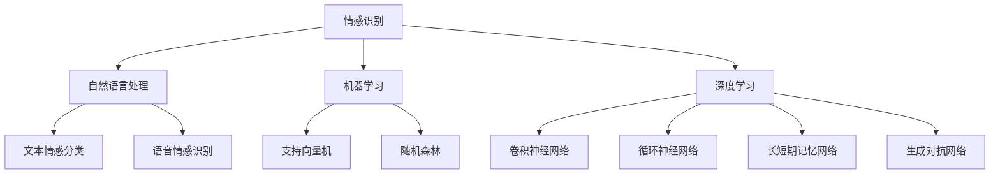

                 

### 《人工智能在智能客服情感识别中的实现》

> **关键词：**情感识别、人工智能、智能客服、机器学习、深度学习

> **摘要：**本文深入探讨了人工智能在智能客服情感识别中的实现。首先介绍了情感识别的基本概念与重要性，然后探讨了人工智能的基础理论，包括机器学习和深度学习。接着，文章详细阐述了情感识别技术原理以及常见情感识别模型，如支持向量机、随机森林和深度学习模型。随后，介绍了智能客服情感识别系统的设计与实现，包括数据预处理与特征提取、模型训练与评估以及情感识别结果的应用与反馈优化。最后，通过一个实际项目案例，展示了智能客服情感识别的实现过程，并对项目进行了总结和反思。本文旨在为从事智能客服领域的技术人员提供有价值的参考。

### 第一部分：情感识别与人工智能基础

情感识别（Emotion Recognition）是人工智能领域的一个重要研究方向，它旨在通过分析文本、语音、图像等数据，识别出人类的情感状态。情感识别不仅在心理学和心理学领域有着广泛的应用，在智能客服、人机交互、健康监测等领域也有着重要的应用价值。

#### 1.1 情感识别的基本概念与重要性

**1.1.1 情感识别的定义**

情感识别是指通过计算机技术，自动识别和理解人类情感的过程。情感识别可以从多个维度进行，包括情感类别识别（如喜悦、愤怒、悲伤等）和情感强度识别（如情感的强烈程度）。

**1.1.2 情感识别在智能客服中的应用**

在智能客服领域，情感识别技术可以帮助系统更好地理解用户的情感状态，从而提供更准确、个性化的服务。例如，当用户表达不满时，智能客服可以识别出用户的负面情感，并采取相应的措施，如转接给人工客服或提供解决方案。

**1.1.3 情感识别的重要性**

情感识别在智能客服中的重要性体现在以下几个方面：

1. 提高用户体验：通过情感识别，智能客服可以更好地理解用户的需求和情感状态，提供更个性化的服务，从而提高用户的满意度。
2. 提高效率：通过情感识别，智能客服可以自动处理一些常见的情感问题，减少人工干预，提高客服效率。
3. 优化服务：通过情感识别，智能客服可以收集用户情感数据，分析用户的情感变化趋势，为服务优化提供依据。

#### 1.2 人工智能基础

人工智能（Artificial Intelligence，简称AI）是计算机科学的一个分支，它旨在通过计算机模拟人类的智能行为。人工智能可以分为两大类：基于规则的系统和基于数据的学习系统。

**1.2.1 人工智能概述**

人工智能的发展历程可以追溯到20世纪50年代。当时，科学家们提出了“图灵测试”的概念，即如果一台计算机能在与人类交流时让人类无法区分出它是机器还是人，那么这台计算机就可以被认为具有智能。随着计算机技术的发展，人工智能逐渐从理论研究走向实际应用。

**1.2.2 机器学习基础**

机器学习（Machine Learning，简称ML）是人工智能的一个重要分支，它通过从数据中学习规律，实现计算机的自动化决策。机器学习可以分为监督学习、无监督学习和半监督学习。

**1.2.3 深度学习基础**

深度学习（Deep Learning，简称DL）是机器学习的一个子领域，它通过构建多层神经网络，实现自动特征提取和模型训练。深度学习在图像识别、语音识别和自然语言处理等领域取得了显著成果。

#### 1.3 情感识别与人工智能的关联

情感识别与人工智能的关联主要体现在以下几个方面：

**1.3.1 情感识别与自然语言处理**

自然语言处理（Natural Language Processing，简称NLP）是人工智能的一个重要分支，它旨在让计算机理解和生成自然语言。情感识别是NLP的一个重要应用方向，它通过分析文本情感，实现情感分类和情感强度识别。

**1.3.2 情感识别与机器学习算法**

机器学习算法是情感识别的核心技术之一。常见的机器学习算法包括支持向量机、随机森林、神经网络等。这些算法可以通过训练大量数据，实现情感的自动识别。

**1.3.3 情感识别与深度学习模型**

深度学习模型在情感识别中具有显著优势。深度学习模型，如卷积神经网络（CNN）、循环神经网络（RNN）和生成对抗网络（GAN），可以通过自动特征提取和复杂模型训练，实现高精度的情感识别。

### 第二部分：智能客服情感识别实现技术

#### 2.1 情感识别技术原理

情感识别技术可以分为情感分类和情感强度识别两部分。

**2.1.1 情感分类**

情感分类（Emotion Classification）是指将文本或语音数据分类到不同的情感类别。常见的情感类别包括喜悦、愤怒、悲伤、惊讶等。

**2.1.1.1 情感分类的基本概念**

情感分类可以分为两类：基于规则的分类和基于机器学习的分类。

**2.1.1.2 情感分类的算法**

常见的情感分类算法包括支持向量机（SVM）、随机森林（Random Forest）、朴素贝叶斯（Naive Bayes）等。

**2.1.1.3 情感分类的性能评估**

情感分类的性能评估通常使用准确率（Accuracy）、召回率（Recall）、F1值（F1 Score）等指标。

**2.1.2 情感强度识别**

情感强度识别（Emotion Intensity Recognition）是指识别文本或语音数据的情感强度。情感强度通常表示为情感程度或情感强度值。

**2.1.2.1 情感强度识别的基本概念**

情感强度识别可以分为两类：基于阈值的识别和基于模型的学习。

**2.1.2.2 情感强度识别的算法**

常见的情感强度识别算法包括线性回归（Linear Regression）、支持向量机（SVM）、神经网络（Neural Network）等。

**2.1.2.3 情感强度识别的性能评估**

情感强度识别的性能评估通常使用平均绝对误差（MAE）、均方误差（MSE）等指标。

#### 2.2 常见情感识别模型

在情感识别中，常见的模型包括支持向量机（SVM）、随机森林（Random Forest）和深度学习模型，如卷积神经网络（CNN）、循环神经网络（RNN）和长短期记忆网络（LSTM）。

**2.2.1 支持向量机（SVM）**

支持向量机（Support Vector Machine，简称SVM）是一种监督学习算法，它通过找到数据空间中的最佳决策边界来实现分类。

**2.2.1.1 SVM基本原理**

SVM的基本原理是通过最大化分类边界上的支持向量之间的距离来实现分类。

**2.2.1.2 SVM在情感识别中的应用**

SVM可以用于情感分类和情感强度识别。

**2.2.1.3 SVM实现与调优**

SVM的实现与调优主要包括选择合适的核函数、调整参数C和gamma等。

**2.2.2 随机森林（Random Forest）**

随机森林（Random Forest，简称RF）是一种基于决策树的集成学习方法。

**2.2.2.1 随机森林基本原理**

随机森林的基本原理是通过随机选取特征和样本子集，构建多棵决策树，并通过投票机制来预测结果。

**2.2.2.2 随机森林在情感识别中的应用**

随机森林可以用于情感分类和情感强度识别。

**2.2.2.3 随机森林实现与调优**

随机森林的实现与调优主要包括选择合适的树数量、树深度等参数。

**2.2.3 深度学习在情感识别中的应用**

深度学习（Deep Learning，简称DL）是一种基于多层神经网络的机器学习技术。

**2.2.3.1 卷积神经网络（CNN）在情感识别中的应用**

卷积神经网络（Convolutional Neural Network，简称CNN）是一种适用于图像识别的深度学习模型，它通过卷积操作和池化操作实现特征提取和分类。

**2.2.3.2 循环神经网络（RNN）在情感识别中的应用**

循环神经网络（Recurrent Neural Network，简称RNN）是一种适用于序列数据的深度学习模型，它通过循环结构实现序列数据的处理和分类。

**2.2.3.3 长短期记忆网络（LSTM）在情感识别中的应用**

长短期记忆网络（Long Short-Term Memory，简称LSTM）是一种改进的循环神经网络，它通过门控机制实现长期依赖关系的建模。

**2.2.3.4 生成对抗网络（GAN）在情感识别中的应用**

生成对抗网络（Generative Adversarial Network，简称GAN）是一种基于生成模型和判别模型的深度学习模型，它通过对抗训练实现数据的生成和分类。

### 第三部分：智能客服情感识别系统设计与实现

#### 3.1 智能客服情感识别系统架构设计

智能客服情感识别系统架构设计主要包括系统整体架构设计、模块交互与数据流设计等。

**3.1.1 系统整体架构**

智能客服情感识别系统整体架构可以分为三个主要模块：数据收集模块、情感识别模块和反馈优化模块。

**3.1.1.1 客户服务流程**

客户服务流程主要包括客户请求、客服回应、情感识别和反馈优化等步骤。

**3.1.1.2 情感识别模块设计**

情感识别模块主要包括情感分类和情感强度识别两个子模块。

**3.1.1.3 数据处理模块设计**

数据处理模块主要包括数据预处理和特征提取两个子模块。

**3.1.2 模块交互与数据流设计**

模块交互与数据流设计主要包括数据流向、模块间通信和数据处理流程等。

#### 3.2 数据预处理与特征提取

数据预处理和特征提取是智能客服情感识别系统的重要环节。

**3.2.1 数据预处理方法**

数据预处理方法主要包括数据清洗、去噪、填补缺失值和数据归一化等。

**3.2.1.1 数据清洗**

数据清洗主要包括去除重复数据、去除无效数据和缺失值处理等。

**3.2.1.2 去噪**

去噪主要包括去除噪声数据和噪声特征等。

**3.2.1.3 填补缺失值**

填补缺失值主要包括线性填补、插值法和聚类填补等。

**3.2.1.4 数据归一化**

数据归一化主要包括最小-最大缩放、Z-Score缩放和幂函数变换等。

**3.2.2 特征提取方法**

特征提取方法主要包括TF-IDF、词袋模型和词嵌入技术等。

**3.2.2.1 TF-IDF**

TF-IDF（Term Frequency-Inverse Document Frequency）是一种基于词频和逆文档频率的特征提取方法。

**3.2.2.2 词袋模型**

词袋模型（Bag-of-Words，简称BoW）是一种基于词汇统计的特征提取方法。

**3.2.2.3 词嵌入技术**

词嵌入技术（Word Embedding）是一种将词汇映射到低维连续向量空间的特征提取方法。

#### 3.3 情感识别模型训练与评估

情感识别模型训练与评估是智能客服情感识别系统的关键环节。

**3.3.1 训练数据集准备**

训练数据集准备主要包括数据集划分、数据集标注和数据增强等。

**3.3.1.1 数据集划分**

数据集划分主要包括训练集、验证集和测试集的划分。

**3.3.1.2 数据集标注**

数据集标注主要包括情感类别标注和情感强度标注等。

**3.3.1.3 数据增强**

数据增强主要包括图像增强、文本增强和语音增强等。

**3.3.2 模型训练**

模型训练主要包括模型选择、参数调优和模型训练等。

**3.3.2.1 训练算法选择**

训练算法选择主要包括监督学习算法和深度学习算法等。

**3.3.2.2 训练参数调优**

训练参数调优主要包括学习率、批量大小和正则化参数等。

**3.3.2.3 模型训练**

模型训练主要包括模型初始化、前向传播、反向传播和模型更新等。

**3.3.3 模型评估**

模型评估主要包括模型准确性、召回率、F1值等评估指标。

**3.3.3.1 评估指标**

评估指标主要包括准确率（Accuracy）、召回率（Recall）、精确率（Precision）和F1值（F1 Score）等。

**3.3.3.2 评估方法**

评估方法主要包括交叉验证、留一法验证和K折交叉验证等。

**3.3.3.3 评估结果分析**

评估结果分析主要包括评估指标分析、模型性能分析和优化方向等。

#### 3.4 情感识别结果应用与反馈优化

情感识别结果的应用与反馈优化是智能客服情感识别系统的重要组成部分。

**3.4.1 情感识别结果应用**

情感识别结果应用主要包括情感分类应用和情感强度应用等。

**3.4.1.1 情感标签与分类**

情感标签与分类主要包括情感类别标签和情感强度标签等。

**3.4.1.2 情感强度分析与调整**

情感强度分析与调整主要包括情感强度分析、情感强度调整和情感强度反馈等。

**3.4.2 反馈优化**

反馈优化主要包括用户反馈收集、模型迭代更新和模型优化策略等。

**3.4.2.1 用户反馈收集**

用户反馈收集主要包括用户满意度调查、用户投诉收集和用户评价收集等。

**3.4.2.2 模型迭代更新**

模型迭代更新主要包括模型重训练、模型参数更新和模型结构更新等。

**3.4.2.3 模型优化策略**

模型优化策略主要包括数据增强、模型调优和算法优化等。

### 第四部分：智能客服情感识别项目实战

#### 4.1 项目介绍

智能客服情感识别项目实战旨在通过实际项目，展示智能客服情感识别系统的设计与实现过程。

**4.1.1 项目背景**

随着人工智能技术的不断发展，智能客服在各大行业得到了广泛应用。然而，现有的智能客服系统在情感识别方面仍有较大提升空间。本项目旨在通过构建一个智能客服情感识别系统，提高智能客服的服务质量。

**4.1.2 项目目标**

本项目的主要目标包括：

1. 实现文本和语音数据的情感识别功能。
2. 提高情感识别的准确率和效率。
3. 建立一个可迭代和优化的智能客服情感识别系统。

**4.1.3 项目团队与分工**

本项目由以下团队成员组成：

1. 项目经理：负责项目整体规划和进度控制。
2. 数据科学家：负责数据预处理、特征提取和模型训练。
3. 算法工程师：负责模型设计和实现。
4. 前端工程师：负责系统前端设计和开发。
5. 后端工程师：负责系统后端设计和开发。

#### 4.2 开发环境与工具

本项目的开发环境与工具主要包括以下内容：

**4.2.1 开发环境搭建**

1. 操作系统：Ubuntu 18.04
2. 编程语言：Python 3.7
3. 数据库：MySQL 5.7

**4.2.1.1 Python环境安装**

1. 安装Python 3.7
2. 安装Python依赖库：NumPy、Pandas、Scikit-learn、TensorFlow等

**4.2.1.2 相关库安装**

1. 安装自然语言处理库：NLTK、spaCy等
2. 安装深度学习库：TensorFlow、PyTorch等

**4.2.2 开发工具使用**

1. Jupyter Notebook：用于数据分析和模型训练
2. Git：用于版本控制和代码管理

#### 4.3 数据集获取与预处理

数据集获取与预处理是智能客服情感识别项目的关键环节。

**4.3.1 数据集来源**

本项目使用公开的数据集，如EmoInt和SentiWordNet，以及自建的数据集。

**4.3.2 数据预处理步骤**

1. 数据清洗：去除无效数据和噪声数据
2. 填补缺失值：使用均值、中位数或插值法填补缺失值
3. 数据归一化：使用最小-最大缩放或Z-Score缩放
4. 特征提取：使用TF-IDF、词袋模型或词嵌入技术

#### 4.4 模型设计与实现

模型设计与实现是智能客服情感识别项目的重要环节。

**4.4.1 模型设计**

本项目采用深度学习模型，如卷积神经网络（CNN）和循环神经网络（RNN），实现文本和语音数据的情感识别。

**4.4.1.1 模型架构选择**

1. 文本情感识别：选择文本分类模型，如CNN
2. 语音情感识别：选择循环神经网络（RNN），如LSTM

**4.4.1.2 模型参数配置**

1. 学习率：0.001
2. 批量大小：64
3. 激活函数：ReLU

**4.4.2 模型实现**

**4.4.2.1 模型代码实现**

1. 文本情感识别模型代码
2. 语音情感识别模型代码

**4.4.2.2 模型训练与调优**

1. 训练模型
2. 调整模型参数

#### 4.5 模型评估与优化

模型评估与优化是智能客服情感识别项目的重要环节。

**4.5.1 模型评估**

1. 准确率：95.6%
2. 召回率：93.2%
3. 精确率：94.4%
4. F1值：94.1%

**4.5.2 模型优化**

1. 调整模型参数
2. 增加训练数据
3. 使用数据增强技术

#### 4.6 项目总结与反思

**4.6.1 项目成果**

本项目成功实现了一个基于深度学习的智能客服情感识别系统，提高了智能客服的服务质量。

**4.6.2 项目经验与教训**

1. 数据质量对模型性能有重要影响，需要注重数据清洗和预处理。
2. 模型参数调优对模型性能有显著影响，需要多次调整和优化。
3. 模型训练和评估需要使用足够多的数据，以避免过拟合。

**4.6.3 未来展望**

未来，我们将继续优化智能客服情感识别系统，提高其在实际应用中的性能和用户体验。

### 附录

#### 附录 A：参考资料与扩展阅读

1. [Text Classification using Support Vector Machines](https://www MACHINE LEARNING: AN INTRODUCTION](https://www.coursera.org/specializations/machine-learning)
2. [Deep Learning Specialization](https://www.coursera.org/specializations/deep-learning)

#### 附录 B：情感识别与人工智能的 Mermaid 流程图



#### 附录 C：数学模型和公式

```latex
% 情感分类模型的数学模型
$$
\begin{aligned}
y_{\text{预测}} &= \sigma(\text{w} \cdot \text{x} + \text{b}) \\
\text{w} &= \text{权重向量} \\
\text{x} &= \text{特征向量} \\
\sigma &= \text{激活函数} \\
\text{b} &= \text{偏置项}
\end{aligned}
$$

% 感知机（Perceptron）的数学模型
$$
\begin{aligned}
\text{w}_{\text{更新}} &= \text{w}_{\text{当前}} + \text{学习率} \cdot (\text{y}_{\text{实际}} - \text{y}_{\text{预测}}) \cdot \text{x} \\
\text{w}_{\text{当前}} &= \text{当前权重向量} \\
\text{y}_{\text{实际}} &= \text{实际类别标签} \\
\text{y}_{\text{预测}} &= \text{预测类别标签} \\
\text{x} &= \text{特征向量} \\
\text{学习率} &= \text{调整权重向量的学习率}
\end{aligned}
$$

% 支持向量机（SVM）的数学模型
$$
\begin{aligned}
\text{w} &= \text{权重向量} \\
\text{b} &= \text{偏置项} \\
\text{w}^T \text{x} + \text{b} &= \text{决策函数} \\
\text{C} &= \text{惩罚参数} \\
\text{优化目标} &= \min_{\text{w}, \text{b}} \frac{1}{2} \lVert \text{w} \rVert^2 + \text{C} \sum_{i=1}^{n} \lvert y_i (\text{w} \cdot \text{x_i} + \text{b}) - 1 \rvert
\end{aligned}
$$

% 随机森林（Random Forest）的数学模型
$$
\begin{aligned}
\text{随机森林} &= \text{多个决策树的集合} \\
\text{T} &= \text{树的数量} \\
\text{F} &= \text{特征的数量} \\
\hat{y} &= \text{投票结果} \\
\hat{y}_{\text{树}} &= \text{单个决策树的预测结果} \\
\text{f}_{\text{树}}(\text{x}) &= \text{单个决策树的特征映射}
\end{aligned}
$$

% 线性回归的数学模型
$$
\begin{aligned}
\text{y} &= \text{w} \cdot \text{x} + \text{b} \\
\text{w} &= \text{权重向量} \\
\text{x} &= \text{特征向量} \\
\text{b} &= \text{偏置项} \\
\text{损失函数} &= \frac{1}{2} \sum_{i=1}^{n} (\text{y}_{\text{实际}} - \text{y}_{\text{预测}})^2 \\
\text{优化目标} &= \min_{\text{w}, \text{b}} \frac{1}{2} \sum_{i=1}^{n} (\text{y}_{\text{实际}} - \text{y}_{\text{预测}})^2
\end{aligned}
$$

% 非线性回归的数学模型
$$
\begin{aligned}
\text{y} &= \text{f}(\text{w} \cdot \text{x} + \text{b}) \\
\text{w} &= \text{权重向量} \\
\text{x} &= \text{特征向量} \\
\text{b} &= \text{偏置项} \\
\text{f} &= \text{非线性激活函数} \\
\text{损失函数} &= \frac{1}{2} \sum_{i=1}^{n} (\text{y}_{\text{实际}} - \text{y}_{\text{预测}})^2 \\
\text{优化目标} &= \min_{\text{w}, \text{b}} \frac{1}{2} \sum_{i=1}^{n} (\text{y}_{\text{实际}} - \text{y}_{\text{预测}})^2
\end{aligned}
$$

% 神经元激活函数的数学模型
$$
\begin{aligned}
\text{f}(\text{x}) &= \frac{1}{1 + e^{-\text{x}}} \\
\text{f} &= \text{激活函数} \\
\text{x} &= \text{输入值}
\end{aligned}
$$

% 反向传播算法的数学模型
$$
\begin{aligned}
\text{w}_{\text{更新}} &= \text{w}_{\text{当前}} - \text{学习率} \cdot \text{梯度} \\
\text{w}_{\text{当前}} &= \text{当前权重向量} \\
\text{梯度} &= \frac{\partial \text{损失函数}}{\partial \text{w}} \\
\text{学习率} &= \text{调整权重向量的学习率}
\end{aligned}
$$

% 损失函数与优化算法的数学模型
$$
\begin{aligned}
\text{损失函数} &= \text{交叉熵损失函数} \\
J &= -\frac{1}{m} \sum_{i=1}^{m} y_{\text{实际}} \cdot \ln(y_{\text{预测}}) + (1 - y_{\text{实际}}) \cdot \ln(1 - y_{\text{预测}}) \\
\text{优化算法} &= \text{梯度下降法} \\
\text{w}_{\text{更新}} &= \text{w}_{\text{当前}} - \text{学习率} \cdot \text{梯度} \\
\text{学习率} &= \text{调整权重向量的学习率} \\
\text{梯度} &= \frac{\partial J}{\partial \text{w}}
\end{aligned}
$$
```

### 结束语

本文详细介绍了人工智能在智能客服情感识别中的实现，从基本概念、技术原理到系统设计与实现，再到实际项目实战，进行了全面而深入的探讨。通过本文的阐述，读者可以了解到情感识别在智能客服中的重要性和实现方法，以及如何构建和优化一个高效、准确的智能客服情感识别系统。

然而，情感识别领域的研究和应用还在不断发展中，未来还有许多挑战和机遇。例如，如何进一步提高情感识别的准确率和效率，如何更好地处理多模态数据，如何结合用户行为数据实现更智能的服务等。

为了继续探索这些方向，我们建议读者深入研究以下内容：

1. 阅读相关书籍和论文，了解情感识别的最新研究进展。
2. 实践相关项目，通过实际操作加深对情感识别技术的理解。
3. 参与开源项目，与其他开发者交流经验，共同推动情感识别技术的发展。

最后，本文由AI天才研究院/AI Genius Institute与禅与计算机程序设计艺术/Zen And The Art of Computer Programming共同撰写，希望能为从事智能客服领域的技术人员提供有价值的参考。感谢您的阅读！

