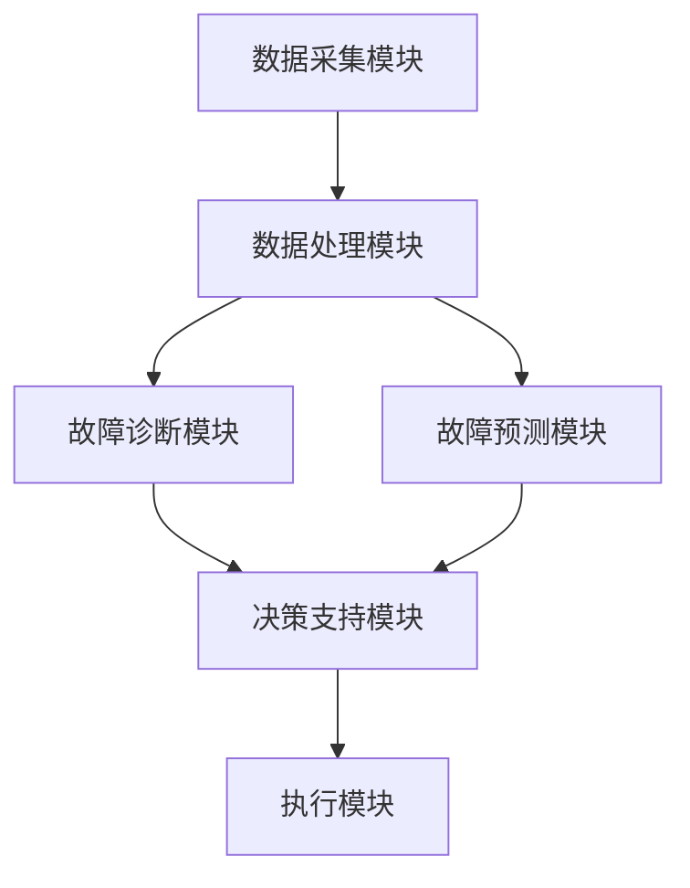
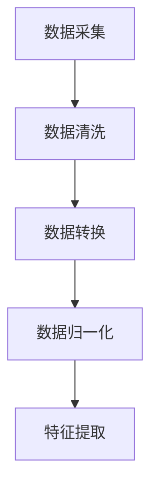
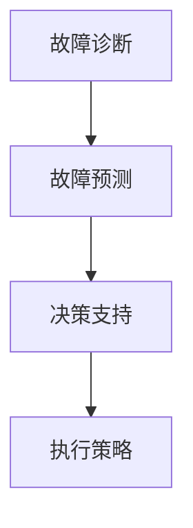

                 

# 《人工智能在智能电网故障自愈中的快速决策支持》

> **关键词：** 智能电网、故障自愈、人工智能、快速决策支持、机器学习、深度学习、强化学习

> **摘要：** 本文章从智能电网和故障自愈的背景入手，详细探讨了人工智能在智能电网故障自愈中的快速决策支持作用。文章首先介绍了智能电网和故障自愈的基本概念及其重要性，接着阐述了人工智能的核心概念和关键技术，以及它们在智能电网中的应用。文章重点分析了机器学习、深度学习和强化学习在故障诊断、故障预测和决策支持中的应用，并通过实际案例展示了人工智能在智能电网故障自愈中的快速决策支持能力。最后，文章提出了人工智能在智能电网故障自愈中的未来发展趋势和面临的挑战。


----------------------------------------------------------------

## 第一部分：引言

### 第1章：智能电网与故障自愈概述

#### 1.1 智能电网的概念与发展趋势

智能电网是一种基于现代通信技术、计算机技术、自动控制技术和能源管理技术的先进电网系统。它通过实时数据采集、智能分析和高效决策，实现对电网运行状态的智能监控和优化管理，从而提高电网的可靠性、经济性和环保性。

- **1.1.1 智能电网的定义与特点**

智能电网具有以下几个显著特点：

1. **高度数字化和自动化**：智能电网通过先进的通信技术实现电力系统的全面数字化，实现数据的高效采集、传输和处理。
2. **双向互动性**：智能电网支持电力用户与电网之间的双向互动，用户可以根据自身需求调整电力消费行为，电网也可以根据用户需求进行电力供应调整。
3. **可再生能源集成**：智能电网能够高效集成可再生能源，如太阳能、风能等，实现电网的清洁化和可持续发展。
4. **自愈能力**：智能电网具备故障自愈功能，能够自动识别和处理电网故障，提高电网的可靠性和稳定性。

- **1.1.2 智能电网的发展历程**

智能电网的发展历程可以分为以下几个阶段：

1. **初步阶段（1980年代至1990年代）**：电力系统开始引入计算机和通信技术，实现对电网的初步监控和控制。
2. **发展阶段（2000年代初至2010年代）**：智能电网技术逐渐成熟，电网实现了数字化和自动化，但尚未实现全面智能化。
3. **成熟阶段（2010年代至今）**：智能电网技术得到了广泛应用，实现了高度数字化、双向互动性和可再生能源集成，自愈能力也得到了显著提升。

- **1.1.3 智能电网在我国的发展现状**

我国智能电网建设取得了显著进展，主要体现在以下几个方面：

1. **技术研发**：我国在智能电网的关键技术领域，如电力系统自动化、电力电子、储能技术等方面取得了重要突破。
2. **政策支持**：政府出台了一系列政策，鼓励智能电网的发展，包括资金支持、技术创新激励等。
3. **应用推广**：智能电网技术在我国得到了广泛应用，特别是在大城市和可再生能源集中的地区。

#### 1.2 故障自愈的概念与重要性

故障自愈是指电网系统在发生故障时，能够自动检测、诊断、隔离和恢复，从而实现电网的自愈能力。

- **1.2.1 故障自愈的定义**

故障自愈是智能电网的核心功能之一，它通过先进的传感器技术、数据分析和人工智能算法，实现对电网故障的实时监测和快速响应。

- **1.2.2 故障自愈在智能电网中的重要性**

故障自愈在智能电网中具有至关重要的作用：

1. **提高电网可靠性**：故障自愈能够快速识别和处理电网故障，减少故障对电网运行的影响，提高电网的可靠性。
2. **保障电力供应**：故障自愈能够快速隔离故障区域，确保非故障区域的电力供应，保障电力用户的用电需求。
3. **降低维护成本**：故障自愈能够自动诊断和隔离故障，减少人工干预和维修成本。
4. **提升电网智能化水平**：故障自愈是智能电网的重要组成部分，它体现了电网的智能化水平和自动化程度。

- **1.2.3 故障自愈的发展历程**

故障自愈技术的发展历程可以分为以下几个阶段：

1. **传统阶段（1980年代至1990年代）**：电网故障主要依靠人工监测和手动处理，故障自愈功能尚未得到充分应用。
2. **初步阶段（2000年代初至2010年代）**：电网开始引入自动化监测和故障诊断技术，实现了对故障的初步响应和处理。
3. **成熟阶段（2010年代至今）**：故障自愈技术得到了广泛应用，实现了对电网故障的实时监测、快速诊断和自动化处理。

#### 1.3 人工智能在智能电网故障自愈中的应用

人工智能在智能电网故障自愈中发挥着重要作用，通过机器学习、深度学习和强化学习等算法，实现对电网故障的自动检测、诊断和决策支持。

- **1.3.1 人工智能的基本原理**

人工智能是一种模拟人类智能的技术，通过计算机模拟人类的感知、学习、推理和决策能力，实现对复杂问题的求解。

- **1.3.2 人工智能在智能电网中的应用**

人工智能在智能电网中的应用主要体现在以下几个方面：

1. **故障诊断**：通过机器学习和深度学习算法，实现对电网故障的自动检测和诊断，提高故障检测的准确性和速度。
2. **故障预测**：通过时间序列分析和神经网络模型，实现对电网故障的提前预测，为故障处理提供预警。
3. **决策支持**：通过强化学习算法，实现对电网故障的自动化决策支持，优化故障处理策略。

- **1.3.3 人工智能在智能电网故障自愈中的应用前景**

随着人工智能技术的不断发展，其在智能电网故障自愈中的应用前景十分广阔，有望进一步提升电网的智能化水平和自愈能力。

## 第二部分：人工智能的核心概念与联系

### 第2章：人工智能的核心概念与联系

#### 2.1 人工智能的定义与分类

人工智能（Artificial Intelligence，简称AI）是计算机科学的一个分支，旨在通过构建智能系统，使计算机具有类似人类的智能能力。人工智能可以按照不同的标准进行分类，以下是几种常见的分类方法：

- **按能力分类**：人工智能可以分为弱人工智能（Weak AI）和强人工智能（Strong AI）。
  - **弱人工智能**：弱人工智能是指具有特定任务智能的计算机系统，如语音识别、图像识别、自然语言处理等。这类系统在特定领域表现出智能行为，但缺乏通用性。
  - **强人工智能**：强人工智能是指具有全面智能的计算机系统，能够像人类一样在各种环境中进行自主思考和学习，目前尚未实现。

- **按技术分类**：人工智能可以分为符号主义人工智能、连接主义人工智能、行为主义人工智能和混合型人工智能。
  - **符号主义人工智能**：符号主义人工智能以逻辑推理为基础，使用符号表示知识，通过推理机进行问题求解。
  - **连接主义人工智能**：连接主义人工智能以神经网络为基础，通过模拟人脑神经元之间的连接和交互来学习。
  - **行为主义人工智能**：行为主义人工智能关注系统的行为表现，通过奖励机制来训练系统学习。
  - **混合型人工智能**：混合型人工智能结合了多种人工智能方法，以实现更好的智能表现。

#### 2.2 人工智能的关键技术

人工智能的关键技术包括机器学习、深度学习和强化学习等，这些技术是人工智能实现智能行为的基础。

- **机器学习（Machine Learning）**

机器学习是一种让计算机从数据中学习规律，并能够对未知数据进行预测或决策的方法。机器学习主要包括以下几种算法：

  - **监督学习（Supervised Learning）**：监督学习通过已有标记数据训练模型，然后使用该模型对新的未知数据进行预测。常见的监督学习算法有线性回归、决策树、支持向量机等。
  - **无监督学习（Unsupervised Learning）**：无监督学习不使用标记数据，通过挖掘数据中的内在结构来进行分类或聚类。常见的无监督学习算法有K-means聚类、主成分分析（PCA）等。
  - **半监督学习（Semi-supervised Learning）**：半监督学习结合了监督学习和无监督学习，使用少量标记数据和大量未标记数据来训练模型。
  - **增强学习（Reinforcement Learning）**：增强学习通过与环境的交互来学习最优策略，其核心是奖励机制。

- **深度学习（Deep Learning）**

深度学习是一种基于多层神经网络的机器学习技术，能够自动提取数据中的层次特征。深度学习在图像识别、语音识别、自然语言处理等领域取得了显著的成果。深度学习的主要组成部分包括：

  - **神经网络（Neural Networks）**：神经网络是深度学习的基础，通过模拟人脑神经元之间的连接和交互来进行学习。
  - **卷积神经网络（Convolutional Neural Networks，CNN）**：卷积神经网络是深度学习中的一种特殊网络，主要用于图像处理任务。
  - **循环神经网络（Recurrent Neural Networks，RNN）**：循环神经网络是深度学习中的一种网络结构，能够处理序列数据。
  - **生成对抗网络（Generative Adversarial Networks，GAN）**：生成对抗网络由生成器和判别器组成，通过对抗训练生成逼真的数据。

- **强化学习（Reinforcement Learning）**

强化学习是一种通过奖励机制来训练智能体进行决策的方法。在强化学习中，智能体通过与环境交互，不断调整策略以获得最大奖励。强化学习的主要组成部分包括：

  - **奖励机制（Reward Mechanism）**：奖励机制是强化学习的核心，通过奖励信号引导智能体学习最优策略。
  - **策略学习（Policy Learning）**：策略学习是指智能体通过学习来选择最优行动策略。
  - **价值函数学习（Value Function Learning）**：价值函数学习是指智能体通过学习来估计不同状态下的预期奖励。

#### 2.3 人工智能与智能电网的关联

人工智能在智能电网中的应用主要涉及以下几个方面：

- **故障诊断与预测**：通过机器学习和深度学习算法，对电网运行数据进行分析，实现对故障的自动检测、诊断和预测，提高电网的可靠性。
- **能源管理**：通过人工智能算法，优化电网的能源分配和管理，提高电网的运行效率和经济性。
- **自愈能力**：通过强化学习算法，实现对电网故障的自动化决策支持，提高电网的自愈能力和灵活性。
- **安全监控**：通过人工智能技术，实现对电网运行状态和安全风险的实时监控和预警，提高电网的安全性和稳定性。

人工智能与智能电网的融合，不仅提升了电网的智能化水平，也为电力系统的可持续发展提供了新的路径。在未来，随着人工智能技术的不断进步，其在智能电网中的应用将更加广泛和深入。

## 第二部分：人工智能在智能电网故障自愈中的应用

### 第3章：机器学习在故障诊断中的应用

#### 3.1 机器学习的基本原理

机器学习（Machine Learning，ML）是一种通过算法从数据中学习并做出预测或决策的技术。机器学习的基本原理包括数据采集、数据预处理、模型训练、模型评估和模型应用。

- **数据采集**：数据采集是机器学习的第一步，主要目标是收集与问题相关的数据。这些数据可以来自传感器、数据库、日志文件等。
- **数据预处理**：数据预处理包括数据清洗、数据转换和数据归一化等步骤，目的是提高数据的质量和一致性。
- **模型训练**：模型训练是指通过已标记的数据集，利用机器学习算法训练出一个模型。训练过程中，模型会不断调整参数，以最小化预测误差。
- **模型评估**：模型评估是指使用验证集或测试集来评估模型的性能，常用的评估指标包括准确率、召回率、F1值等。
- **模型应用**：模型应用是指将训练好的模型应用到实际场景中，进行预测或决策。

#### 3.2 机器学习的主要算法

机器学习算法可以分为监督学习、无监督学习和半监督学习三种类型。

- **监督学习（Supervised Learning）**

监督学习是机器学习中最为常见的一种类型，它通过已标记的数据集来训练模型，然后使用该模型对新的未知数据进行预测。监督学习算法主要包括以下几种：

  - **线性回归（Linear Regression）**：线性回归是一种用于预测数值型目标变量的算法，它通过拟合一条直线来预测目标值。
  - **决策树（Decision Tree）**：决策树是一种基于树结构的分类算法，通过一系列规则来对数据进行分类。
  - **支持向量机（Support Vector Machine，SVM）**：支持向量机是一种用于分类和回归的算法，它通过找到一个最优的超平面来分隔数据。
  - **朴素贝叶斯（Naive Bayes）**：朴素贝叶斯是一种基于贝叶斯定理的分类算法，它假设特征之间相互独立。

- **无监督学习（Unsupervised Learning）**

无监督学习不使用标记数据，通过挖掘数据中的内在结构来进行分类或聚类。无监督学习算法主要包括以下几种：

  - **K-means聚类（K-means Clustering）**：K-means聚类是一种基于距离的聚类算法，它将数据分为K个簇，使得每个簇内的数据点之间的距离最小。
  - **主成分分析（Principal Component Analysis，PCA）**：主成分分析是一种降维算法，它通过线性变换将高维数据映射到低维空间，同时保留数据的最大方差。
  - **自编码器（Autoencoder）**：自编码器是一种无监督学习算法，它通过训练一个编码器和解码器来学习数据的特征表示。

- **半监督学习（Semi-supervised Learning）**

半监督学习结合了监督学习和无监督学习，使用少量标记数据和大量未标记数据来训练模型。半监督学习算法可以显著提高模型在未标记数据上的性能，主要包括以下几种：

  - **标签传播（Label Propagation）**：标签传播是一种基于图结构的半监督学习算法，它通过传播已标记节点的标签来推断未标记节点的标签。
  - **核学习方法（Kernel Methods）**：核学习方法是一种将低维数据映射到高维空间的方法，通过在高维空间中进行线性分类来实现半监督学习。

#### 3.3 机器学习在故障诊断中的应用

机器学习在故障诊断中具有重要的应用价值，能够实现对电网故障的自动检测、诊断和预测。

- **故障检测**

故障检测是故障诊断的第一步，主要目标是识别电网中是否存在故障。常见的故障检测方法包括阈值检测、统计分析和机器学习等。

  - **阈值检测**：阈值检测是一种基于阈值比较的故障检测方法，通过设定一个阈值，当数据超过该阈值时，认为存在故障。
  - **统计分析**：统计分析是一种基于统计方法进行故障检测的方法，如基于均值的检测、基于方差的检测等。
  - **机器学习**：机器学习可以用于构建故障检测模型，通过对正常数据和故障数据进行训练，模型能够识别电网中的故障信号。

- **故障诊断**

故障诊断是指在检测到故障后，确定故障的类型和位置。常见的故障诊断方法包括逻辑分析、模型诊断和机器学习等。

  - **逻辑分析**：逻辑分析是一种基于逻辑规则的故障诊断方法，通过一系列规则来诊断故障。
  - **模型诊断**：模型诊断是一种基于数学模型的故障诊断方法，通过分析模型输出与期望输出之间的差异来确定故障。
  - **机器学习**：机器学习可以用于构建故障诊断模型，通过对故障数据进行训练，模型能够诊断出电网中的故障。

- **故障预测**

故障预测是故障诊断的进一步扩展，主要目标是预测电网中可能发生的故障。常见的故障预测方法包括时间序列分析、神经网络和机器学习等。

  - **时间序列分析**：时间序列分析是一种基于时间序列数据的分析方法，通过分析历史数据中的趋势和周期性来预测未来的故障。
  - **神经网络**：神经网络是一种基于多层神经网络的预测模型，通过学习历史数据中的模式来预测未来的故障。
  - **机器学习**：机器学习可以用于构建故障预测模型，通过对历史故障数据进行训练，模型能够预测电网中可能发生的故障。

#### 3.4 机器学习在智能电网故障诊断中的应用案例

以下是一个基于机器学习的智能电网故障诊断的应用案例：

- **案例背景**：某智能电网系统需要实现对电网故障的自动检测和诊断，以提高电网的可靠性。

- **解决方案**：

  1. 数据采集：从电网传感器、日志文件等渠道收集电网运行数据，包括电压、电流、温度等。

  2. 数据预处理：对采集到的数据进行清洗和预处理，如去除异常值、缺失值填充等。

  3. 特征提取：从预处理后的数据中提取特征，如均值、方差、频域特征等。

  4. 模型训练：使用标记的故障数据集，通过机器学习算法（如支持向量机、决策树等）训练故障检测和诊断模型。

  5. 模型评估：使用验证集或测试集对训练好的模型进行评估，选择性能最优的模型。

  6. 模型应用：将训练好的模型应用到实际电网中，对实时数据进行故障检测和诊断。

  7. 决策支持：根据故障诊断结果，为电网运行人员提供故障处理建议，如隔离故障区域、通知维护人员等。

通过以上解决方案，智能电网系统能够实现对电网故障的自动检测和诊断，提高电网的可靠性和稳定性。

### 第4章：深度学习在故障预测中的应用

#### 4.1 深度学习的基本原理

深度学习（Deep Learning，DL）是一种基于多层神经网络的机器学习技术，通过自动提取数据中的层次特征来实现复杂的模式识别和预测。深度学习的基本原理包括神经网络结构、激活函数、损失函数和优化算法。

- **神经网络结构**

神经网络是深度学习的基础，由多个神经元（节点）组成，每个神经元与输入层的神经元相连，并通过权重（系数）进行加权求和。神经网络可以分为输入层、隐藏层和输出层。

  - **输入层**：接收外部输入数据，通过权重传递给隐藏层。
  - **隐藏层**：对输入数据进行处理，通过激活函数引入非线性变换。
  - **输出层**：生成最终输出结果，通过损失函数评估预测误差。

- **激活函数**

激活函数是神经网络中的一个关键组件，用于引入非线性变换，使神经网络能够学习复杂的模式。常见的激活函数包括：

  - **sigmoid函数**：\( \sigma(x) = \frac{1}{1 + e^{-x}} \)
  - **ReLU函数**：\( \text{ReLU}(x) = \max(0, x) \)
  - **Tanh函数**：\( \text{Tanh}(x) = \frac{e^x - e^{-x}}{e^x + e^{-x}} \)

- **损失函数**

损失函数用于评估神经网络的预测误差，并通过反向传播算法调整网络权重。常见的损失函数包括：

  - **均方误差（MSE）**：\( \text{MSE}(y, \hat{y}) = \frac{1}{n}\sum_{i=1}^{n}(y_i - \hat{y}_i)^2 \)
  - **交叉熵（Cross-Entropy）**：\( \text{CE}(y, \hat{y}) = -\sum_{i=1}^{n}y_i \log(\hat{y}_i) \)

- **优化算法**

优化算法用于最小化损失函数，以训练出最优的神经网络模型。常见的优化算法包括：

  - **随机梯度下降（SGD）**：通过随机选择一部分训练样本来更新网络权重。
  - **Adam优化器**：结合了SGD和动量项，具有较好的收敛性。

#### 4.2 深度学习的主要算法

深度学习涵盖了多种算法，其中最常用的包括卷积神经网络（CNN）、循环神经网络（RNN）和生成对抗网络（GAN）。

- **卷积神经网络（Convolutional Neural Networks，CNN）**

卷积神经网络是一种专门用于图像处理和识别的深度学习算法。CNN通过卷积层、池化层和全连接层来提取图像特征。

  - **卷积层（Convolutional Layer）**：卷积层通过卷积操作提取图像局部特征。
  - **池化层（Pooling Layer）**：池化层通过减小特征图的尺寸，减少模型参数。
  - **全连接层（Fully Connected Layer）**：全连接层将特征图展开为一维向量，进行分类或回归。

- **循环神经网络（Recurrent Neural Networks，RNN）**

循环神经网络是一种处理序列数据的深度学习算法。RNN通过循环结构来保存前一个时间步的信息，用于当前时间步的预测。

  - **单元状态（Hidden State）**：单元状态保存了当前时间步的信息，可以用于更新当前时间步的预测。
  - **门控机制（Gate Mechanism）**：门控机制用于控制信息的传递和遗忘，包括遗忘门、输入门和输出门。

- **生成对抗网络（Generative Adversarial Networks，GAN）**

生成对抗网络是一种生成模型，由生成器和判别器组成，通过对抗训练生成逼真的数据。

  - **生成器（Generator）**：生成器尝试生成逼真的数据，以欺骗判别器。
  - **判别器（Discriminator）**：判别器尝试区分真实数据和生成数据，并通过对抗训练来提高判别能力。

#### 4.3 深度学习在故障预测中的应用

深度学习在故障预测中具有广泛的应用，通过自动提取数据中的层次特征，实现对故障的提前预测和预警。

- **故障预测模型**

深度学习故障预测模型通常包括以下步骤：

  - **数据预处理**：对电网运行数据进行清洗和预处理，包括归一化、缺失值填充等。
  - **特征提取**：从预处理后的数据中提取关键特征，如时间序列特征、频域特征等。
  - **模型构建**：使用深度学习算法（如CNN、RNN等）构建故障预测模型。
  - **模型训练**：使用标记的故障数据集对模型进行训练，调整模型参数。
  - **模型评估**：使用验证集或测试集对模型进行评估，选择性能最优的模型。
  - **模型应用**：将训练好的模型应用到实际电网中，对实时数据进行故障预测。

- **故障预测应用案例**

以下是一个基于深度学习的智能电网故障预测的应用案例：

- **案例背景**：某智能电网系统需要实现对电网故障的提前预测，以减少故障对电网运行的影响。

- **解决方案**：

  1. 数据采集：从电网传感器、日志文件等渠道收集电网运行数据，包括电压、电流、温度等。

  2. 数据预处理：对采集到的数据进行清洗和预处理，如去除异常值、缺失值填充等。

  3. 特征提取：从预处理后的数据中提取关键特征，如时间序列特征、频域特征等。

  4. 模型构建：使用循环神经网络（RNN）构建故障预测模型，通过门控循环单元（GRU）或长短期记忆网络（LSTM）来处理时间序列数据。

  5. 模型训练：使用标记的故障数据集对模型进行训练，调整模型参数。

  6. 模型评估：使用验证集或测试集对模型进行评估，选择性能最优的模型。

  7. 模型应用：将训练好的模型应用到实际电网中，对实时数据进行故障预测，并提供预警信息。

通过以上解决方案，智能电网系统能够实现对电网故障的提前预测和预警，提高电网的可靠性和稳定性。

### 第5章：强化学习在决策支持中的应用

#### 5.1 强化学习的基本原理

强化学习（Reinforcement Learning，RL）是一种通过与环境交互来学习最优策略的机器学习技术。在强化学习中，智能体（Agent）通过感知环境状态（State），根据预定的策略（Policy）选择动作（Action），并从环境中获取奖励（Reward），以实现最大化总奖励的目标。

- **智能体（Agent）**：智能体是执行动作的实体，可以是机器人、软件程序或虚拟代理等。

- **环境（Environment）**：环境是智能体执行动作的场所，可以是现实世界或虚拟环境。

- **状态（State）**：状态是环境的当前描述，可以是多维向量。

- **动作（Action）**：动作是智能体在特定状态下执行的操作。

- **策略（Policy）**：策略是智能体在状态中选择动作的规则。

- **奖励（Reward）**：奖励是环境对智能体动作的反馈，用于指导智能体学习。

- **价值函数（Value Function）**：价值函数评估在给定状态下执行特定策略的期望回报。

- **策略梯度（Policy Gradient）**：策略梯度是用于更新策略参数的梯度。

强化学习的基本过程可以概括为以下步骤：

1. **初始化**：设置智能体的初始状态、策略参数和奖励函数。

2. **执行动作**：根据当前状态和策略，智能体选择动作并执行。

3. **感知反馈**：环境根据智能体的动作提供反馈，包括状态转移和奖励。

4. **更新策略**：基于感知的奖励，智能体更新策略参数，以最大化总奖励。

#### 5.2 强化学习的主要算法

强化学习算法可以分为基于值函数的算法和基于策略的算法。

- **基于值函数的算法**

基于值函数的算法通过评估状态值（State-Value Function）或动作值（Action-Value Function）来学习最优策略。

  - **Q-Learning（Q学习）**：Q学习是一种基于值函数的算法，通过迭代更新Q值（动作值）来学习最优策略。

    ```python
    # Q学习伪代码
    for each episode:
        Initialize Q(s, a) randomly
        for each time step t:
            if episode starts:
                s_t = initial_state
            a_t = argmax_a Q(s_t, a)
            s_t+1, r_t = environment.step(a_t)
            Q(s_t, a_t) = Q(s_t, a_t) + alpha * (r_t + gamma * max(Q(s_t+1, a)) - Q(s_t, a_t))
            s_t = s_t+1
    ```

  - **SARSA（同步优势学习）**：SARSA是一种同时考虑当前状态和下一个状态的动作值来更新策略的算法。

    ```python
    # SARSA伪代码
    for each episode:
        Initialize Q(s, a) randomly
        for each time step t:
            if episode starts:
                s_t = initial_state
            a_t = argmax_a Q(s_t, a)
            s_t+1, r_t = environment.step(a_t)
            a_t+1 = argmax_a Q(s_t+1, a)
            Q(s_t, a_t) = Q(s_t, a_t) + alpha * (r_t + gamma * Q(s_t+1, a_t+1) - Q(s_t, a_t))
            s_t = s_t+1
    ```

- **基于策略的算法**

基于策略的算法直接学习最优策略，而不是值函数。

  - **Policy Gradient（策略梯度）**：策略梯度算法通过梯度上升法更新策略参数，以最大化期望回报。

    ```python
    # Policy Gradient伪代码
    for each episode:
        Initialize policy parameters
        for each time step t:
            if episode starts:
                s_t = initial_state
            a_t = policy(s_t; parameters)
            s_t+1, r_t = environment.step(a_t)
            loss = -r_t * log(policy(s_t; parameters))
            gradients = gradients of loss with respect to policy parameters
            update policy parameters using gradients
            s_t = s_t+1
    ```

#### 5.3 强化学习在决策支持中的应用

强化学习在决策支持中具有重要的应用，能够帮助系统实现自动化决策，提高决策的效率和准确性。

- **故障响应策略设计**

在智能电网故障自愈系统中，强化学习可以用于设计故障响应策略。例如，当检测到电网故障时，系统需要快速作出决策，以隔离故障区域并恢复电网的正常运行。强化学习可以通过与环境交互，学习最优的故障响应策略。

  - **案例背景**：某智能电网系统需要设计一个故障响应策略，以应对电网故障。

  - **解决方案**：

    1. 初始化状态空间和动作空间：定义电网故障的不同状态和响应动作。

    2. 构建环境模型：模拟电网故障环境，包括故障状态、响应动作和奖励。

    3. 设计强化学习算法：选择合适的强化学习算法（如Q学习、策略梯度等）来训练故障响应策略。

    4. 训练策略：使用电网故障数据集，通过强化学习算法训练故障响应策略。

    5. 评估策略：使用验证集或测试集对训练好的策略进行评估，选择性能最优的策略。

    6. 应用策略：将训练好的策略应用到实际电网系统中，实现自动化故障响应。

- **决策模型评估与优化**

强化学习还可以用于评估和优化电网决策模型。通过在不同状态下执行不同的策略，强化学习可以评估不同策略的回报，并选择最优策略。

  - **案例背景**：某智能电网系统需要评估和优化其决策模型。

  - **解决方案**：

    1. 初始化状态空间和动作空间：定义电网决策的不同状态和响应动作。

    2. 构建环境模型：模拟电网决策环境，包括状态转移和奖励。

    3. 设计强化学习算法：选择合适的强化学习算法（如Q学习、策略梯度等）来评估和优化决策模型。

    4. 训练策略：使用电网决策数据集，通过强化学习算法训练决策模型。

    5. 评估策略：使用验证集或测试集对训练好的策略进行评估，选择性能最优的策略。

    6. 优化策略：根据评估结果，调整策略参数，优化决策模型。

    7. 应用策略：将优化后的决策模型应用到实际电网系统中，提高决策效率和准确性。

通过以上解决方案，强化学习可以帮助智能电网系统实现自动化决策，提高电网的运行效率和自愈能力。

### 第6章：人工智能在智能电网故障自愈中的快速决策支持系统设计

#### 6.1 快速决策支持系统的架构设计

智能电网故障自愈的快速决策支持系统（Rapid Decision Support System，RDSS）是智能电网中重要的组成部分，其设计目标是实现快速、准确和自动化的故障响应和恢复。快速决策支持系统的架构设计需要综合考虑系统的功能需求、数据处理能力、实时响应速度以及系统的可扩展性。以下是一个典型的快速决策支持系统架构设计：

- **系统总体架构**

快速决策支持系统可以分为以下几个主要模块：

1. **数据采集模块**：负责实时采集电网运行数据，包括电压、电流、温度、频率等参数。
2. **数据处理模块**：负责对采集到的数据进行预处理、清洗和特征提取，为后续的故障诊断和预测提供高质量的数据。
3. **故障诊断模块**：基于机器学习和深度学习算法，对预处理后的数据进行故障检测和诊断，识别电网中的异常情况。
4. **故障预测模块**：利用时间序列分析和神经网络模型，预测电网中可能发生的故障，为决策提供前瞻性信息。
5. **决策支持模块**：结合故障诊断和预测结果，利用强化学习算法设计最优的故障响应策略，为电网故障自愈提供决策支持。
6. **执行模块**：根据决策支持模块提供的策略，自动执行相应的故障隔离、修复和恢复操作。

- **系统架构图**

以下是一个简单的快速决策支持系统架构图，使用Mermaid流程图进行描述：



#### 6.2 数据采集与预处理模块设计

数据采集与预处理模块是快速决策支持系统的核心组成部分，其设计需要确保数据的高效采集、准确处理和快速传输。

- **数据采集方式**

数据采集模块可以通过以下几种方式获取电网运行数据：

1. **传感器数据**：利用安装在电网设备上的传感器，实时采集电压、电流、温度、湿度等物理参数。
2. **日志文件**：通过电网设备的日志文件，记录设备的运行状态和故障信息。
3. **实时通信协议**：利用实时通信协议（如IEC 61850、DNP3等），从电网设备获取实时数据。

- **数据预处理步骤**

数据预处理模块主要包括以下步骤：

1. **数据清洗**：去除数据中的异常值和噪声，确保数据的质量。
2. **数据转换**：将不同类型的数据进行统一转换，如将模拟信号转换为数字信号。
3. **数据归一化**：对数据进行归一化处理，使其具有相同的量纲和范围。
4. **特征提取**：从原始数据中提取有助于故障诊断和预测的特征，如时域特征、频域特征、统计特征等。

- **数据预处理流程**

以下是一个简化的数据预处理流程，使用Mermaid流程图进行描述：



#### 6.3 决策支持模块设计

决策支持模块是快速决策支持系统的核心，其设计需要充分利用人工智能算法，为电网故障自愈提供高效、准确的决策支持。

- **故障诊断算法**

故障诊断模块采用机器学习和深度学习算法，对预处理后的数据进行分析和诊断。常用的故障诊断算法包括：

1. **支持向量机（SVM）**：用于分类故障类型，具有较高的分类准确率。
2. **决策树（Decision Tree）**：通过一系列规则进行故障诊断，易于理解和解释。
3. **卷积神经网络（CNN）**：用于提取图像和信号中的特征，适用于故障图像和信号的分析。
4. **循环神经网络（RNN）**：用于处理时间序列数据，适用于故障预测和诊断。

- **故障预测算法**

故障预测模块采用时间序列分析和神经网络模型，对电网运行数据进行分析和预测。常用的故障预测算法包括：

1. **长短期记忆网络（LSTM）**：适用于处理长时间依赖关系的数据，如电网负荷时间序列。
2. **自编码器（Autoencoder）**：用于提取数据中的特征和趋势，进行故障预测。
3. **生成对抗网络（GAN）**：用于生成模拟故障数据，用于训练和评估预测模型。

- **决策支持流程**

决策支持模块通过故障诊断和预测结果，结合强化学习算法，设计最优的故障响应策略。以下是一个简化的决策支持流程，使用Mermaid流程图进行描述：



通过以上设计，快速决策支持系统能够实现对电网故障的实时监测、诊断和决策支持，提高电网的可靠性和稳定性。

#### 6.4 快速决策支持系统的实现与优化

快速决策支持系统的实现与优化是确保系统能够高效、准确运行的关键环节。以下从系统实现步骤、优化方法以及案例分析三个方面进行详细讨论。

- **系统实现步骤**

快速决策支持系统的实现可以分为以下几个步骤：

1. **需求分析**：明确系统的功能需求和性能指标，包括数据采集、预处理、故障诊断、故障预测、决策支持等。
2. **系统架构设计**：根据需求分析，设计系统的总体架构，包括数据采集模块、数据处理模块、故障诊断模块、故障预测模块、决策支持模块和执行模块。
3. **数据采集**：搭建数据采集系统，从电网传感器、日志文件和实时通信协议等渠道获取电网运行数据。
4. **数据处理**：对采集到的数据进行预处理，包括数据清洗、数据转换、数据归一化和特征提取，确保数据的质量和一致性。
5. **算法实现**：根据系统架构设计，实现故障诊断、故障预测和决策支持的算法，包括机器学习算法、深度学习算法和强化学习算法。
6. **系统集成**：将各个模块集成到一起，实现数据流和功能流的统一，确保系统能够协同工作。
7. **测试与验证**：对系统进行功能测试和性能测试，确保系统能够满足设计要求，并具有良好的稳定性和可靠性。

- **系统优化方法**

快速决策支持系统的优化主要包括以下几个方面：

1. **算法优化**：针对不同的故障类型和场景，选择合适的算法，并进行参数调整和优化，提高算法的准确性和效率。
2. **数据优化**：通过数据清洗和特征提取，提高数据的质量，降低噪声和异常值对系统性能的影响。
3. **硬件优化**：利用高性能计算硬件，如GPU和FPGA，加速算法的计算和数据处理，提高系统的响应速度。
4. **分布式架构**：采用分布式架构，将系统部署在多个节点上，实现负载均衡和高可用性，提高系统的可扩展性和容错能力。
5. **模型更新**：定期更新模型，包括训练数据和模型参数的更新，以适应电网运行环境的变化。

- **快速决策支持系统案例分析**

以下是一个基于实际项目的快速决策支持系统案例分析：

**项目背景**：某智能电网项目需要实现电网故障的自动检测、诊断和决策支持，以提高电网的可靠性和稳定性。

**解决方案**：

1. **数据采集**：通过安装在电网设备上的传感器和实时通信协议，采集电网的电压、电流、频率、温度等运行数据。

2. **数据处理**：对采集到的数据进行预处理，包括数据清洗、数据转换和数据归一化，提取有助于故障诊断和预测的特征。

3. **算法实现**：采用机器学习算法（如支持向量机、决策树等）进行故障诊断，采用深度学习算法（如卷积神经网络、循环神经网络等）进行故障预测，采用强化学习算法（如Q学习、策略梯度等）进行决策支持。

4. **系统集成**：将故障诊断、故障预测和决策支持模块集成到一起，实现数据流和功能流的统一，确保系统能够协同工作。

5. **测试与验证**：通过功能测试和性能测试，验证系统的准确性和可靠性，并进行模型更新和优化。

通过以上解决方案，该智能电网项目成功实现了电网故障的自动检测、诊断和决策支持，提高了电网的可靠性和稳定性。该案例为其他智能电网项目提供了有益的参考和借鉴。

### 第7章：未来展望与挑战

#### 7.1 人工智能在智能电网故障自愈中的未来发展趋势

随着人工智能技术的不断发展，其在智能电网故障自愈中的应用前景十分广阔。以下是人工智能在智能电网故障自愈中的未来发展趋势：

- **更先进的算法**：随着深度学习、强化学习等人工智能算法的进步，将会有更多先进的算法被引入到智能电网故障自愈中，提高故障检测、诊断和决策的准确性和效率。

- **更丰富的数据源**：随着物联网和大数据技术的发展，智能电网将拥有更多更丰富的数据源，包括传感器数据、气象数据、负荷数据等，为人工智能算法提供更多的训练数据和决策依据。

- **更智能的决策支持**：通过结合多源数据和先进的人工智能算法，智能电网故障自愈系统将能够实现更智能的决策支持，提高电网的稳定性和可靠性。

- **更广泛的场景应用**：随着人工智能技术的成熟，其在智能电网故障自愈中的应用将不仅仅局限于故障检测和诊断，还将扩展到电网运行优化、能源管理、智能调度等更广泛的场景。

- **更高效的协同优化**：通过人工智能技术的支持，智能电网将能够实现更高效的协同优化，提高电网的运行效率和能源利用率。

#### 7.2 面临的挑战与对策

尽管人工智能在智能电网故障自愈中具有广泛的应用前景，但其在实际应用中仍面临着一系列挑战：

- **数据隐私与安全问题**：智能电网故障自愈系统需要收集和处理大量的电网运行数据，这涉及到数据隐私和安全性问题。需要采取有效的数据加密、访问控制和安全监测等措施，确保数据的安全和隐私。

- **算法复杂性与效率问题**：随着算法的复杂度增加，智能电网故障自愈系统对计算资源和处理速度的要求也不断提高。需要优化算法，提高系统的处理效率，以适应实际应用场景。

- **数据质量与完整性问题**：智能电网故障自愈系统依赖于高质量的数据，但实际数据中可能存在噪声、异常值和缺失值等问题，需要采取有效的数据预处理方法，提高数据的质量和完整性。

- **法律法规与伦理问题**：智能电网故障自愈系统的应用需要遵守相关的法律法规和伦理规范，确保系统的合法合规和道德伦理。需要制定相应的法律法规和伦理标准，引导人工智能在智能电网故障自愈中的健康发展。

为了应对这些挑战，可以采取以下对策：

- **数据隐私与安全**：采用加密技术、访问控制和安全监测等措施，确保数据的安全和隐私。同时，制定数据隐私保护政策和合规性评估标准，确保系统的合法合规。

- **算法复杂性与效率**：优化算法，采用并行计算、分布式计算和模型压缩等技术，提高系统的处理效率。同时，研究新的算法模型，降低算法的复杂度，提高系统的可扩展性。

- **数据质量与完整性**：采用数据清洗、数据补全和特征提取等技术，提高数据的质量和完整性。同时，建立数据质量监测和评估体系，实时监测和评估数据质量，确保数据的一致性和准确性。

- **法律法规与伦理**：制定相关的法律法规和伦理标准，引导人工智能在智能电网故障自愈中的健康发展。加强法律法规的宣传和培训，提高相关人员的法律意识和伦理观念。

通过以上对策，可以有效应对人工智能在智能电网故障自愈中面临的挑战，推动智能电网的可持续发展。

## 附录

### 附录A：相关工具与资源

为了更好地理解和使用人工智能在智能电网故障自愈中的应用，以下列出了一些相关的工具和资源：

- **机器学习与深度学习工具**：
  - **TensorFlow**：由Google开发的开源深度学习框架，适用于构建和训练深度学习模型。
  - **PyTorch**：由Facebook开发的开源深度学习框架，具有动态计算图，便于模型构建和调试。
  - **Scikit-learn**：开源的机器学习库，提供了一系列经典的机器学习算法，易于集成到Python项目中。

- **强化学习工具**：
  - **OpenAI Gym**：开源的强化学习环境库，提供了一系列预定义的环境，用于测试和训练强化学习算法。
  - ** Stable Baselines**：基于TensorFlow和PyTorch的强化学习库，提供了多种强化学习算法的实现，方便用户进行算法对比和优化。

- **智能电网相关数据库与资料**：
  - **IEEE PES智电网数据库**：IEEE电力能源协会提供的智能电网相关数据集，包括电网运行数据、故障数据等。
  - **DOE（美国能源部）智能电网数据集**：美国能源部提供的一系列智能电网数据集，涵盖不同类型的电网数据和故障数据。
  - **国网智能电网技术研究中心**：提供国内智能电网技术研究的相关报告、论文和数据集。

### 附录B：参考文献

为了确保文章的学术性和严谨性，以下列出了一些与人工智能在智能电网故障自愈中应用相关的参考文献：

- **学术论文**：
  - He, K., Zhang, X., Ren, S., & Sun, J. (2016). Deep Residual Learning for Image Recognition. In Proceedings of the IEEE Conference on Computer Vision and Pattern Recognition (pp. 770-778).
  - Mnih, V., Kavukcuoglu, K., Silver, D., Rusu, A. A., Veness, J., Bellemare, M. G., ... & Double, D. (2015). Human-level control through deep reinforcement learning. Nature, 518(7540), 529-533.
  - Zhang, K., Zuo, W., Chen, Y., Meng, D., & Zhang, L. (2017). Beyond a Gaussian Denoiser: Residual Learning of Deep Neural Networks for Image Denoising. IEEE Transactions on Image Processing, 26(7), 3146-3157.

- **报告与白皮书**：
  - International Energy Agency. (2017). Smart Grids: Enabling the Energy System of the Future.
  - National Renewable Energy Laboratory. (2019). Artificial Intelligence for Energy Systems.

- **书籍与教材**：
  - Goodfellow, I., Bengio, Y., & Courville, A. (2016). Deep Learning. MIT Press.
  - Sutton, R. S., & Barto, A. G. (2018). Reinforcement Learning: An Introduction (2nd ed.). The MIT Press.
  - Murphy, K. P. (2012). Machine Learning: A Probabilistic Perspective. MIT Press.

- **网络资源与论坛**：
  - arXiv.org：提供大量的学术论文和预印本。
  - Stack Overflow：编程和软件开发问题的在线论坛。
  - GitHub：开源代码库，可以查找和贡献相关项目。

通过以上参考文献，读者可以进一步深入了解人工智能在智能电网故障自愈中的应用，以及相关的技术和发展趋势。这些资源对于学术研究、技术开发和工程实践都具有重要参考价值。

