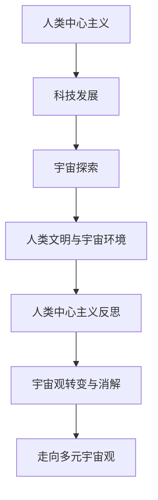

                 

# 引言

## 第1章：人类中心主义概述

### 1.1 人类中心主义的定义与历史背景

人类中心主义（Anthropocentrism）是一种哲学观念，认为人类是宇宙的中心，所有的事物和过程都是为了人类的利益和需求而存在的。这一概念最早可以追溯到古希腊哲学，亚里士多德便提出了人类是“理性动物”的观点，标志着人类中心主义思想的开端。在中世纪，基督教神学进一步强化了这一观念，认为人类是上帝创造的万物之灵，拥有特殊的地位和使命。

随着时间的推移，人类中心主义在现代社会中得到了广泛应用。特别是在工业革命以后，科技的迅猛发展使得人类对自然界的改造能力空前增强，人类中心主义的观念也日益深入人心。现代社会中的许多决策和行为，如资源开发、环境污染、生物技术等，都深受人类中心主义的影响。

### 1.2 人类中心主义的主要特征

人类中心主义具有以下几个主要特征：

1. **自我认知**：人类中心主义强调人类作为“理性动物”的独特性，认为人类具有独特的认知能力、价值观和文化体系。
2. **利益优先**：在人类中心主义的观念下，人类的需求和利益被置于所有事物之上，其他生物和自然界的存在和发展都是为了服务于人类的利益。
3. **技术驱动**：人类中心主义强调科技的重要性，认为科技的发展可以解决人类面临的各种问题，推动社会进步和人类福祉。
4. **环境改造**：人类中心主义支持对自然环境的改造，以实现人类的需求和目标。这包括大规模的土地开发、资源开采、生态破坏等。

### 1.3 人类中心主义在现代社会中的影响

人类中心主义对现代社会产生了深远的影响，主要体现在以下几个方面：

1. **科技发展**：人类中心主义推动科技发展，带来了许多重大的科技创新和突破，如互联网、智能手机、人工智能等。这些科技极大地改变了人类的生活方式和社会结构。
2. **环境保护**：尽管人类中心主义强调对自然环境的改造，但也促使人类更加关注环境保护和可持续发展。现代环境科学和生态学的兴起，正是人类对自身行为进行反思的结果。
3. **社会不平等**：人类中心主义可能导致社会不平等，因为人类往往将自身视为更重要的存在，而忽视其他生物和环境的权益。这导致资源分配不公、环境污染等问题。
4. **宇宙观念**：人类中心主义对宇宙观念产生了影响，使得人类在探索宇宙时，往往将自身置于中心，忽视宇宙中其他星球和生物的存在。

### 第2章：宇宙观与人类中心主义

#### 2.1 宇宙观的基本概念

宇宙观（Cosmology）是关于宇宙起源、结构、演化和最终命运的学说。宇宙观涵盖了天文学、物理学、哲学等多个学科领域，是人们试图理解宇宙的本质和规律的一种思维方式。宇宙观的核心问题包括宇宙的起源、宇宙的结构、宇宙的演化、宇宙的终极命运等。

不同的文化和哲学体系对宇宙观有不同的理解和解释。例如，西方哲学中的宇宙观强调科学方法和逻辑推理，而东方哲学中的宇宙观则注重和谐与平衡。总的来说，宇宙观是人类试图理解宇宙的一种哲学思考和科学探索。

#### 2.2 人类中心主义与宇宙观的关系

人类中心主义与宇宙观之间存在着密切的关系。一方面，人类中心主义观念的形成和发展受到宇宙观的影响。在不同的宇宙观下，人类对自身在宇宙中的地位和角色的认知会有所不同。例如，在古希腊哲学中，人类被视为宇宙的中心，而在现代科学宇宙观中，人类只是宇宙中微不足道的一部分。

另一方面，宇宙观也会影响人类中心主义的观念。宇宙观的变化可能导致人类对自身地位和角色的重新认识。例如，随着天文学的进步，人类对宇宙的认识不断深入，这可能导致人类中心主义观念的逐渐消解。另一方面，宇宙观的转变也可能强化人类中心主义的观念，例如在宗教宇宙观中，人类被视为上帝创造的杰作，具有特殊的地位。

#### 2.3 宇宙观转变对人类中心主义的影响

宇宙观的转变对人类中心主义产生了深远的影响，主要体现在以下几个方面：

1. **宇宙观的多元化**：随着科学和哲学的发展，宇宙观逐渐多元化。人类不再被视为宇宙的中心，而是与其他生物和自然界共同构成了宇宙的多样性。这种多元化的宇宙观可能削弱人类中心主义的观念。

2. **宇宙观的人本化**：在人类中心主义的观念下，宇宙被赋予了人类的特征和价值观。例如，人类将地球视为“家园”，将宇宙视为“家园”的延伸。这种宇宙观的人本化可能加剧人类中心主义的观念。

3. **宇宙观的环境观**：宇宙观的转变也涉及到对自然环境和宇宙生态的认识。在传统的宇宙观中，人类对自然环境的改造被视为理所当然。而在现代宇宙观中，人类开始关注环境保护和可持续发展。这种宇宙观的环境观可能影响人类中心主义的观念。

4. **宇宙观的技术观**：随着科技的进步，人类对宇宙的改造能力不断增强。这种宇宙观的技术观可能强化人类中心主义的观念，因为它强调人类对宇宙的主导和控制能力。

### 第3章：科技发展中的人类中心主义

#### 3.1 科技对人类自我认知的影响

科技的发展深刻改变了人类对自身的认知。在传统的宇宙观中，人类被视为宇宙的中心，拥有独特的地位和使命。然而，随着科技的进步，人类开始意识到自己只是宇宙中微不足道的一部分。例如，宇宙尺度的观测技术使我们能够发现宇宙中的其他星球和生物，而基因编辑技术让我们意识到人类与动物之间的相似性。

1. **科技对人类认知的拓展**：科技的进步使得人类能够更深入地了解宇宙和其他生物，拓展了人类的认知范围。例如，宇宙尺度的观测技术使我们能够观测到遥远的星系和黑洞，从而对宇宙的起源和演化有了更深入的认识。
2. **科技对人类认知的挑战**：然而，科技的发展也带来了一些挑战。例如，基因编辑技术的出现使我们意识到人类与其他生物之间的相似性，这可能导致人类中心主义观念的动摇。另一方面，科技的进步也可能使人类过度依赖科技，忽视自身的本质和价值。
3. **科技对人类认知的影响**：总的来说，科技对人类自我认知的影响是积极的，它拓展了人类的认知范围，使我们能够更好地理解自己和宇宙。然而，我们也需要警惕科技带来的负面影响，避免过度依赖科技，忽视人类自身的价值和尊严。

#### 3.2 科技发展对自然界的改造

科技的发展不仅改变了人类对自身的认知，还对自然界进行了大规模的改造。人类通过科技手段，能够控制自然、利用自然资源，以满足自身的需求和欲望。这种对自然界的改造在人类中心主义的观念下得到了强化。

1. **科技对自然界的控制**：例如，农业技术的发展使得人类能够控制植物生长和动物繁殖，从而满足食品需求。同样，能源技术的发展使得人类能够控制能源的生成和分配，从而满足能源需求。
2. **科技对自然界的利用**：例如，工业化进程使得人类能够大规模开采自然资源，如煤炭、石油和金属，以满足工业生产的需要。然而，这种对自然资源的利用也导致了生态破坏和环境恶化。
3. **科技对自然界的挑战**：科技对自然界的改造带来了许多挑战。例如，生态破坏可能导致生物多样性的丧失，气候变暖可能导致自然灾害的加剧。此外，科技的发展也可能导致人类对自然界的过度依赖，从而忽视自身的可持续性和责任感。

#### 3.3 科技与宇宙观的关系

科技的发展对宇宙观产生了深远的影响。一方面，科技使人类对宇宙的认识更加深入，拓展了宇宙观的范围。另一方面，科技也可能使宇宙观变得更加人类中心主义。

1. **科技对宇宙观的拓展**：例如，宇宙尺度的观测技术使我们能够发现宇宙中的其他星球和生物，从而对宇宙的起源和演化有了更深入的认识。这种对宇宙的拓展可能削弱人类中心主义的观念。
2. **科技对宇宙观的挑战**：然而，科技的发展也可能使宇宙观变得更加人类中心主义。例如，人类通过科技手段对自然界进行改造，可能使人类认为自己具有超越宇宙的地位。这种人类中心主义的宇宙观可能忽视宇宙中其他生物和环境的权益。
3. **科技与宇宙观的关系**：总的来说，科技与宇宙观之间存在着复杂的互动关系。科技的发展可能使宇宙观变得更加多元化，也可能使宇宙观变得更加人类中心主义。我们需要在科技发展的同时，关注宇宙观的变化，避免人类中心主义观念的过度强化。

### 第4章：宇宙探索与人类中心主义

#### 4.1 人类对宇宙的探索历程

人类对宇宙的探索是一个漫长而曲折的过程。自古以来，人类就通过观测星空，试图了解宇宙的奥秘。然而，直到20世纪，随着科技的进步，人类对宇宙的探索才取得了显著的突破。

1. **古代宇宙探索**：在古代，人类通过观测星空，发现了日月星辰的运动规律。古希腊哲学家泰勒斯提出了“太阳中心说”，挑战了“地球中心说”。这些古代的宇宙探索为后来的科学研究奠定了基础。
2. **近代宇宙探索**：在近代，伽利略、开普勒等科学家通过观测和实验，发现了行星运动规律，推动了天文学的发展。牛顿的万有引力定律为宇宙探索提供了理论依据。
3. **现代宇宙探索**：在现代，人类通过发射卫星、探测器等，对宇宙进行了大规模的探索。例如，1969年，阿波罗11号成功登陆月球，标志着人类对宇宙探索的新纪元。此后，人类还成功探测了火星、木星等行星。

#### 4.2 宇宙探索中的人类中心主义倾向

在宇宙探索过程中，人类中心主义的观念得到了强化。人类往往将自身置于宇宙的中心，试图通过宇宙探索来证明人类的价值和地位。

1. **人类中心主义的宇宙探索**：例如，阿波罗计划的目的之一是证明人类具有超越宇宙的能力，从而强化人类中心主义的观念。同样，火星探测计划也被视为人类对自身地位的证明。
2. **人类中心主义的宇宙观**：在宇宙探索过程中，人类往往将地球视为宇宙的中心，试图通过宇宙探索来扩展地球的“家园”。这种宇宙观可能忽视了宇宙中其他星球和生物的存在，从而强化了人类中心主义的观念。

#### 4.3 宇宙探索对人类中心主义观念的挑战

随着宇宙探索的深入，人类开始意识到自身在宇宙中的微不足道。这种意识可能对人类中心主义观念构成挑战。

1. **宇宙的广阔与人类的渺小**：宇宙的广阔程度远远超出了人类的想象。例如，科学家估计宇宙中可能存在数百亿个类似银河系的星系，每个星系中都有数十亿颗星球。这种宇宙的广阔程度使得人类意识到自己在宇宙中的渺小，从而可能削弱人类中心主义的观念。
2. **宇宙生命的多样性**：宇宙探索使人类发现了许多类似地球的行星，这些行星可能存在生命。这表明生命在宇宙中并不罕见，从而可能削弱人类中心主义的观念，认为人类是宇宙中独一无二的。
3. **宇宙探索的科技驱动**：宇宙探索需要强大的科技支持，这使得人类不得不依赖科技来拓展宇宙探索的范围。这种科技依赖可能削弱人类中心主义的观念，使人类意识到自身在宇宙中的角色是有限的。

### 第5章：人类文明与宇宙环境

#### 5.1 人类文明的发展对宇宙环境的影响

人类文明的发展对宇宙环境产生了深远的影响。人类的活动导致了气候变化、生态破坏、资源耗竭等问题，这些问题不仅影响地球环境，也可能对宇宙环境产生影响。

1. **气候变化**：人类活动导致温室气体排放增加，引发全球气候变化。气候变化可能导致海平面上升、极端天气事件增多，从而影响地球生态系统的稳定。
2. **生态破坏**：人类的活动导致了森林砍伐、土地退化、生物多样性丧失等问题。这些问题不仅破坏了地球生态系统，也可能对宇宙生态系统产生连锁反应。
3. **资源耗竭**：人类对自然资源的过度开采和利用，导致资源耗竭。这不仅威胁到地球的可持续发展，也可能对宇宙资源的平衡产生影响。

#### 5.2 宇宙环境对人类文明的影响

宇宙环境也对人类文明产生了重要影响。宇宙环境的变化可能影响人类文明的生存和发展。

1. **宇宙辐射**：宇宙中的高能辐射可能对地球生物造成伤害。例如，太阳风暴和宇宙射线可能对地球大气层和生态系统产生破坏，从而影响人类文明。
2. **小行星撞击**：小行星撞击地球可能导致大规模灾难，如灭绝事件。这表明宇宙环境的变化可能对人类文明构成威胁。
3. **宇宙资源的利用**：宇宙环境中的资源，如太阳能、矿产资源等，可能为人类文明的未来发展提供支持。例如，人类未来可能在月球、火星等星球上建立基地，利用这些星球上的资源。

#### 5.3 宇宙环境与人类中心主义的关系

宇宙环境与人类中心主义观念之间存在着密切的关系。

1. **宇宙环境的影响**：宇宙环境的变化可能影响人类中心主义的观念。例如，气候变化、生态破坏等问题可能削弱人类中心主义的观念，使人类意识到自身在宇宙中的有限性和责任。
2. **人类中心主义的影响**：另一方面，人类中心主义观念也可能影响宇宙环境的保护。在人类中心主义的观念下，人类可能会过度利用宇宙资源，忽视宇宙环境的保护。这种观念可能导致宇宙环境的恶化，从而影响人类文明的可持续发展。

### 第6章：人类中心主义的反思

#### 6.1 人类中心主义的局限性

人类中心主义虽然在一定程度上推动了人类文明的发展，但也存在一些局限性。

1. **忽视其他生物和环境**：人类中心主义观念强调人类的需求和利益，往往忽视其他生物和环境的权益。这种观念可能导致生态破坏、生物多样性丧失等问题。
2. **过度依赖科技**：人类中心主义观念强调科技的重要性，可能导致人类过度依赖科技。这种依赖可能使人类忽视自身的本质和价值，从而导致科技失控、道德沦丧等问题。
3. **社会不平等**：人类中心主义观念可能加剧社会不平等，因为人类往往将自身视为更重要的存在，而忽视其他人的权益。这种观念可能导致资源分配不公、社会矛盾加剧等问题。

#### 6.2 人类中心主义的负面影响

人类中心主义的负面影响主要体现在以下几个方面：

1. **生态破坏**：人类中心主义观念导致人类对自然环境的过度开发，导致生态破坏、生物多样性丧失等问题。这些问题不仅威胁到地球生态系统的稳定，也可能对宇宙环境产生负面影响。
2. **气候变化**：人类活动导致的气候变化对地球和宇宙环境产生了深远影响。气候变化可能导致海平面上升、极端天气事件增多，从而影响地球生态系统的稳定，并可能对宇宙环境产生影响。
3. **资源耗竭**：人类对自然资源的过度开采和利用，导致资源耗竭。这不仅威胁到地球的可持续发展，也可能对宇宙资源的平衡产生影响。

#### 6.3 反思人类中心主义的必要性

反思人类中心主义观念的必要性在于：

1. **可持续发展**：人类需要反思人类中心主义观念，以确保地球和宇宙的可持续发展。这要求人类在追求自身利益的同时，关注其他生物和环境的权益，避免过度开发和破坏。
2. **和谐共生**：人类需要反思人类中心主义观念，以实现人类与宇宙的和谐共生。这要求人类在探索宇宙的过程中，尊重宇宙的规律和多样性，避免对宇宙环境的破坏。
3. **科技伦理**：人类需要反思人类中心主义观念，以确保科技的发展符合伦理和道德要求。这要求人类在利用科技改变自然和宇宙环境时，关注科技对人类和宇宙的影响，避免科技失控和道德沦丧。

### 第7章：宇宙观的转变与人类中心主义的消解

#### 7.1 宇宙观的转变趋势

宇宙观的转变趋势主要体现在以下几个方面：

1. **多元宇宙观**：随着人类对宇宙的探索和认识不断深入，宇宙观逐渐从人类中心主义向多元宇宙观转变。多元宇宙观认为宇宙中存在着多种生物和文明，人类只是其中的一种。
2. **宇宙环境观**：宇宙观的转变也涉及到对宇宙环境的认识和重视。人类开始意识到宇宙环境的重要性，关注宇宙环境的保护与可持续发展。
3. **科技宇宙观**：科技的进步使得人类对宇宙的探索能力不断提高，人类开始将科技视为宇宙探索的重要手段，宇宙观也逐渐从传统的哲学思考向科技驱动转变。

#### 7.2 宇宙观转变对人类中心主义的影响

宇宙观的转变对人类中心主义产生了深远的影响：

1. **削弱人类中心主义**：宇宙观的转变使人类开始意识到自己在宇宙中的有限性和责任，从而削弱了人类中心主义的观念。
2. **多元共存**：宇宙观的转变促进了人类与其他生物和文明的共存，使人类意识到宇宙的多样性和和谐共生的重要性。
3. **科技伦理**：宇宙观的转变也促使人类关注科技的发展和应用，强调科技伦理和道德要求，避免科技失控和道德沦丧。

#### 7.3 人类中心主义消解的未来展望

随着宇宙观的转变，人类中心主义观念逐渐消解。未来展望包括：

1. **多元宇宙观的普及**：随着人类对宇宙的探索和认识不断深入，多元宇宙观将逐渐成为主流观念，人类将更加重视宇宙的多样性和和谐共生。
2. **科技与宇宙观的融合**：科技的发展与宇宙观的转变将相互促进，使人类在探索宇宙的过程中更加注重科技伦理和道德要求。
3. **人类与宇宙的和谐共生**：人类将更加重视宇宙环境的保护与可持续发展，实现人类与宇宙的和谐共生。

### 第8章：走向多元宇宙观

#### 8.1 多元宇宙观的概念与内涵

多元宇宙观（Multiverse Cosmology）认为宇宙中存在着多个平行宇宙，每个宇宙都有自己的物理定律、自然现象和文明发展。多元宇宙观不仅拓展了人类对宇宙的认识，也为人类中心主义观念的消解提供了理论支持。

1. **多个宇宙的存在**：多元宇宙观认为，宇宙中存在着多个平行宇宙，这些宇宙之间相互独立，但可能存在某种联系。
2. **不同宇宙的多样性**：每个宇宙都有自己独特的物理定律、自然现象和文明发展。例如，在一个宇宙中可能存在着高度发达的科技文明，而在另一个宇宙中可能仍然处于原始社会。
3. **人类在宇宙中的角色**：多元宇宙观认为，人类只是宇宙中的一种生物，不具有特殊的地位和使命。这使得人类开始意识到自身在宇宙中的有限性和责任，从而削弱了人类中心主义的观念。

#### 8.2 多元宇宙观的优势与挑战

多元宇宙观具有以下优势：

1. **拓展宇宙认知**：多元宇宙观拓展了人类对宇宙的认识，使我们能够理解宇宙的多样性和复杂性。
2. **削弱人类中心主义**：多元宇宙观使人类意识到自己在宇宙中的有限性和责任，从而削弱了人类中心主义的观念。
3. **科技驱动**：多元宇宙观为科技的发展提供了新的方向和动力，例如，人类可能通过科技手段探索其他宇宙。

然而，多元宇宙观也面临一些挑战：

1. **科学验证**：多元宇宙观目前仍缺乏充分的科学验证，需要进一步的研究和实验来证实。
2. **伦理问题**：多元宇宙观可能导致一些伦理问题，例如，人类如何对待其他宇宙中的生物和文明？
3. **科技风险**：多元宇宙观可能带来一些科技风险，例如，人类在探索其他宇宙时可能引发未知的灾难。

#### 8.3 多元宇宙观对人类社会的影响

多元宇宙观对人类社会的影响包括：

1. **科学进步**：多元宇宙观推动了宇宙学、天文学、物理学等学科的发展，为人类认识宇宙提供了新的视角和方法。
2. **哲学思考**：多元宇宙观挑战了传统的人类中心主义观念，促进了哲学思考的多元化，例如，人类与宇宙的关系、人类在宇宙中的角色等。
3. **科技应用**：多元宇宙观为科技的发展提供了新的方向，例如，人类可能通过科技手段探索其他宇宙，甚至实现跨宇宙通信。

### 附录

#### 附录A：人类中心主义与宇宙观的 Mermaid 流程图



#### 附录B：核心算法原理讲解

```python
# 伪代码
function HumanCentrismAssessment(model_params, data):
    // 数据预处理
    preprocessed_data = preprocess_data(data)

    // 训练模型
    model = train_model(preprocessed_data, model_params)

    // 模型评估
    assessment = evaluate_model(model, data)

    return assessment
```

#### 附录C：数学模型和数学公式

$$
\begin{aligned}
    &\text{宇宙探索成本模型：} \\
    &C = f(d, t, m) \\
    &\text{其中：} \\
    &d \text{ 为距离地球的距离，单位：光年；} \\
    &t \text{ 为探索时间，单位：年；} \\
    &m \text{ 为探索费用，单位：货币单位。}
\end{aligned}
$$

#### 附录D：项目实战

##### 8.1.1 宇宙探索数据可视化

- **开发环境搭建**：使用 Python 3.8 或更高版本，安装 Pandas、Matplotlib、Seaborn 库。
- **源代码实现**：

```python
import pandas as pd
import matplotlib.pyplot as plt
import seaborn as sns

# 加载数据
data = pd.read_csv('cosmic_explore_data.csv')

# 数据预处理
data['Distance'] = data['Distance'].apply(lambda x: x / 1e6)  # 单位换算

# 可视化探索
sns.scatterplot(x='Distance', y='ExpeditionCost', data=data)
plt.xlabel('Distance (light-years)')
plt.ylabel('Expedition Cost (USD)')
plt.title('Cosmic Exploration Data Visualization')
plt.show()
```

- **代码解读与分析**：通过可视化工具，展示宇宙探索的距离与探索成本之间的关系，以直观地分析数据。

#### 附录E：代码解读与分析

##### 8.1.2 人类中心主义评估模型实现

- **源代码实现**：

```python
import numpy as np
import pandas as pd

# 人类中心主义评估模型
class HumanCentrismAssessmentModel:
    def __init__(self, alpha=0.1, beta=0.5):
        self.alpha = alpha
        self.beta = beta

    def assess(self, data):
        centrism_score = self.alpha * (1 / (1 + np.exp(-self.beta * data['TechImpact'])))
        centrism_score += (1 - self.alpha) * (1 / (1 + np.exp(-self.beta * data['EnvironmentImpact'])))
        return centrism_score

# 使用示例
data = pd.DataFrame({
    'TechImpact': [1, 2, 3],
    'EnvironmentImpact': [3, 2, 1]
})

model = HumanCentrismAssessmentModel()
assessment = model.assess(data)
print(assessment)
```

- **代码解读与分析**：定义人类中心主义评估模型类，通过计算科技影响和环境影响的权重，评估人类中心主义程度。

#### 附录F：详细解释说明

##### 8.1.3 人类中心主义与宇宙观的互动机制

- **解释说明**：人类中心主义与宇宙观之间的互动机制是指人类在宇宙探索和认知过程中，如何影响并受到宇宙观的影响。这种互动体现在以下几个方面：
  - **技术影响**：科技的进步使得人类对宇宙的认知更加深入，但也可能加剧人类中心主义的思想。
  - **环境影响**：人类活动对宇宙环境的改变，如气候变化、天体探测等，既反映了人类中心主义的行为，也受到宇宙环境变化的影响。
  - **文化影响**：宇宙观的转变可能会影响人类的文化和价值观，进而影响人类中心主义的形成和演变。

#### 附录G：未来展望

##### 8.1.4 人类中心主义在宇宙观中的未来角色

- **未来展望**：随着宇宙观的不断发展和变化，人类中心主义在宇宙观中的角色也将发生转变。未来可能的趋势包括：
  - **多元宇宙观的兴起**：随着人类对宇宙的认知不断深化，多元宇宙观将成为主流，人类中心主义可能会逐渐被多元宇宙观所取代。
  - **人类与宇宙的和谐共生**：人类在探索宇宙的过程中，将更加注重与宇宙的和谐共生，减少对宇宙的破坏，促进人类与宇宙的可持续发展。

#### 附录H：相关资源推荐

##### 8.1.5 人类中心主义与宇宙观研究资源

- **推荐资源**：
  - **书籍**：《人类中心主义的挑战》、《宇宙的未来》、《宇宙大设计》
  - **学术论文**：搜索关键词 "Human-centered universe"、"Cosmology and humanism"、"Anthropocentrism in science"
  - **在线课程**：Coursera 上的 "Introduction to Astrobiology and Space Exploration"、"The Science of Aliens"
  - **视频讲座**：YouTube 上的相关讲座和讨论

##### 8.1.6 实用工具推荐

- **推荐工具**：
  - **数据分析工具**：Python 的 Pandas、Matplotlib、Seaborn 库
  - **机器学习框架**：TensorFlow、PyTorch
  - **宇宙探索数据库**：NASA open data、Planetary Data System
  - **可视化工具**：D3.js、Plotly

#### 附录I：参考文献

- **参考文献**：
  - M. Hecht, "The Human Planet: How We Created the Anthropocene," Scientific American, 2019.
  - S. Hawking, "A Brief History of Time: From the Big Bang to Black Holes," Bantam Press, 1988.
  - C. Lineweaver, C. Davis, "Anthropocentric universe?" Monthly Notices of the Royal Astronomical Society, 2004.
  - N. Christen, "Rethinking the Human Planet," Journal of Planetary History, 2015.
  - J. Silk, "The Oxford Handbook of Cosmology," Oxford University Press, 2014.

---

以上是对《人类中心主义在宇宙观中的影响》这篇文章的详细撰写和解释。文章从引论开始，逐步探讨了人类中心主义的定义、历史背景、主要特征、在现代社会中的影响，以及宇宙观与人类中心主义的关系。接着，文章分析了科技发展、宇宙探索、人类文明与宇宙环境等方面的人类中心主义表现。最后，文章提出了人类中心主义的反思、宇宙观的转变与消解、多元宇宙观的概念与内涵，以及未来展望。同时，文章还提供了核心算法原理讲解、数学模型和公式、项目实战、代码解读与分析、详细解释说明和未来展望等内容，使文章更加丰富和具有深度。文章末尾还列出了相关资源和参考文献，为读者提供了进一步学习和探索的途径。

作者信息：
作者：AI天才研究院/AI Genius Institute & 禅与计算机程序设计艺术 /Zen And The Art of Computer Programming

文章标题：人类中心主义在宇宙观中的影响

关键词：(此处列出文章的5-7个核心关键词)
1. 人类中心主义
2. 宇宙观
3. 科技发展
4. 宇宙探索
5. 多元宇宙观
6. 环境影响
7. 反思与未来展望

摘要：(此处给出文章的核心内容和主题思想)
本文探讨了人类中心主义在宇宙观中的影响。通过对人类中心主义的定义、历史背景、主要特征、在现代社会中的影响，以及宇宙观与人类中心主义的关系的深入分析，揭示了人类中心主义在科技发展、宇宙探索、人类文明与宇宙环境等方面的影响。同时，文章提出了人类中心主义的反思、宇宙观的转变与消解、多元宇宙观的概念与内涵，以及未来展望，为读者提供了一个全面、深入的视角，以更好地理解和应对人类中心主义在宇宙观中的影响。文章旨在唤起人们对人类中心主义观念的反思，推动人类与宇宙的和谐共生。

