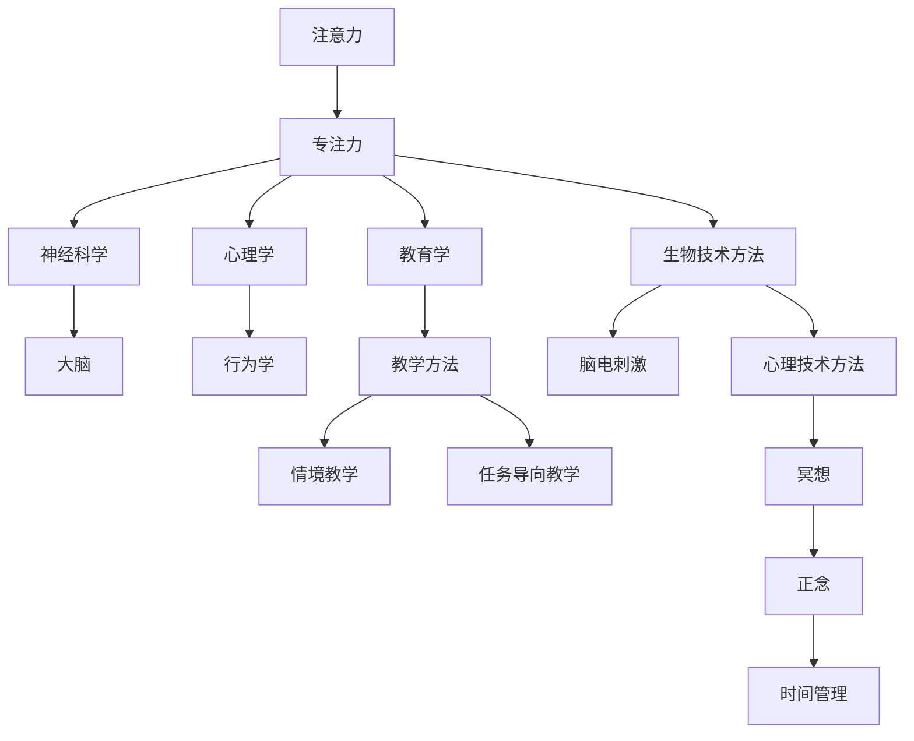

                 

# 人类注意力增强：提升专注力和注意力在教育中的应用

## 关键词
注意力、专注力、教育、技术、方法、应用、案例研究

## 摘要
本文旨在探讨人类注意力增强的原理和方法，特别是在教育领域的应用。通过分析注意力与专注力的基本概念及其关系，本文从神经科学、心理学和教学理论的角度阐述了注意力增强的重要性。随后，文章详细介绍了生物技术方法、心理技术方法和教学方法等增强注意力的策略。此外，本文还探讨了注意力增强在基础教育、高等教育和职业培训中的应用，并通过案例研究提供了实践指南。文章最后提出了注意事项与风险提示，以确保注意力增强技术的安全和合规使用。

---

### 《人类注意力增强：提升专注力和注意力在教育中的应用》目录大纲

#### 第一部分：人类注意力增强概述

**第1章：注意力与专注力的基础**

1.1 注意力与专注力的基本概念
1.2 注意力增强的重要性
1.3 注意力增强的理论基础

**第2章：注意力增强的方法与技术**

2.1 生物技术方法
2.2 心理技术方法
2.3 教学方法

#### 第二部分：注意力增强在教育中的应用

**第3章：注意力增强在基础教育中的应用**

3.1 小学生注意力增强策略
3.2 中学生注意力增强策略
3.3 高中学生注意力增强策略

**第4章：注意力增强在高等教育中的应用**

4.1 大学生注意力增强策略
4.2 教师注意力增强策略

**第5章：注意力增强在职业培训中的应用**

5.1 职场人士注意力增强策略
5.2 职业培训注意力增强策略

#### 第三部分：案例研究与实践指南

**第6章：注意力增强案例研究**

6.1 案例一：某小学注意力增强计划
6.2 案例二：某大学注意力增强课程
6.3 案例三：某企业员工注意力增强培训

**第7章：注意力增强实践指南**

7.1 个人注意力提升策略
7.2 教育机构注意力增强策略
7.3 企业注意力增强策略

#### 附录

**附录A：注意力增强相关资源与工具**

**附录B：注意事项与风险提示**

---

### 核心概念与联系

以下是一个用 Mermaid 语法绘制的流程图，展示了注意力、专注力与相关技术、方法之间的联系：



这个流程图帮助我们理解注意力与专注力的关系，以及它们如何通过不同的科学和技术方法得到增强和应用。

---

### 核心算法原理讲解

注意力增强的核心算法通常基于神经科学和心理学的研究，旨在通过调节大脑活动来提高注意力和专注力。以下是一个简化的伪代码示例，用于解释注意力计算的基本原理：

```c
// 注意力计算伪代码
float attentionCalculation(float currentAttention, float targetAttention) {
    float delta = targetAttention - currentAttention;
    float alpha = 0.1; // 学习率
    float newAttention = currentAttention + (alpha * delta);
    return newAttention;
}
```

在这个伪代码中，`currentAttention` 表示当前注意力水平，`targetAttention` 表示目标注意力水平，`alpha` 是学习率，用于调整注意力变化的幅度。`delta` 是两个注意力水平的差值，代表了需要调整的量。通过这个简单的计算，我们可以模拟注意力水平的逐步提升。

---

### 数学模型和数学公式

注意力增强的数学模型可以用来描述注意力水平的变化。以下是一个基于神经科学的注意力模型公式：

$$
A(t) = A_0 + \alpha (1 - e^{-\beta (I - C)})
$$

其中：
- $A(t)$ 是时间 $t$ 时的注意力水平。
- $A_0$ 是初始注意力水平。
- $\alpha$ 是调节参数，控制注意力恢复的速度。
- $I$ 是外部干扰水平。
- $C$ 是内部控制机制，表示个体的自我调节能力。
- $\beta$ 是调节参数，控制注意力恢复的速率。

这个公式描述了注意力水平如何随着外部干扰和内部控制机制的变化而调整。

### 详细讲解

该数学模型通过 $A(t)$ 表示注意力水平，$A_0$ 代表个体在无干扰时的基础注意力水平。$\alpha$ 参数决定了注意力恢复的速度，值越大，恢复速度越快。$I - C$ 是外部干扰与内部控制机制的差值，反映了外部环境对注意力的挑战和个体应对这些挑战的能力。$\beta$ 控制着这种差值对注意力水平的影响程度。

### 举例说明

假设一个学生 $A_0$ 的初始注意力水平为 60%，外部干扰 $I$ 为 20%，内部控制机制 $C$ 为 10%，且调节参数 $\alpha$ 为 0.2，$\beta$ 为 0.05。我们可以计算其在一段时间后的注意力水平：

$$
A(t) = 60\% + 0.2 \times (1 - e^{-0.05 \times (20\% - 10\%)}) \\
A(t) = 60\% + 0.2 \times (1 - e^{-0.05 \times 10\%}) \\
A(t) = 60\% + 0.2 \times (1 - e^{-0.005}) \\
A(t) = 60\% + 0.2 \times (1 - 0.995) \\
A(t) = 60\% + 0.2 \times 0.005 \\
A(t) = 60\% + 0.001 \\
A(t) = 60.001\%
$$

通过这个计算，我们可以看到学生的注意力水平在一段时间内从 60% 增加到了约 60.001%，尽管增加的幅度很小，但这也体现了注意力恢复的过程。

### 项目实战

#### 实战一：注意力增强学习应用

##### 开发环境搭建

为了实现注意力增强学习应用，我们首先需要搭建一个合适的开发环境。以下是所需的工具和步骤：

- **Python 3.8+**：确保安装了 Python 3.8 或更高版本。
- **PyTorch 1.8+**：安装 PyTorch，可以访问 [PyTorch 官网](https://pytorch.org/get-started/locally/) 进行安装。
- **Jupyter Notebook**：安装 Jupyter Notebook，用于编写和运行代码。

安装步骤如下：

1. 安装 Python 3.8+：
    ```shell
    # 使用 brew 安装 Python
    brew install python@3.8
    ```

2. 安装 PyTorch：
    ```shell
    # 创建虚拟环境
    python3.8 -m venv myenv
    source myenv/bin/activate

    # 安装 PyTorch
    pip install torch torchvision
    ```

3. 安装 Jupyter Notebook：
    ```shell
    # 安装 Jupyter Notebook
    pip install notebook
    ```

##### 源代码详细实现和代码解读

以下是注意力增强学习应用的源代码实现，以及详细的代码解读。

```python
import torch
import torchvision
import torch.nn as nn
import torch.optim as optim

# 定义卷积神经网络模型
class AttentionModel(nn.Module):
    def __init__(self):
        super(AttentionModel, self).__init__()
        self.conv1 = nn.Conv2d(1, 32, 3, 1)
        self.conv2 = nn.Conv2d(32, 64, 3, 1)
        self.fc1 = nn.Linear(9 * 9 * 64, 128)
        self.fc2 = nn.Linear(128, 10)

    def forward(self, x):
        x = self.conv1(x)
        x = nn.functional.relu(x)
        x = self.conv2(x)
        x = nn.functional.relu(x)
        x = x.view(x.size(0), -1)
        x = self.fc1(x)
        x = nn.functional.relu(x)
        x = self.fc2(x)
        return x

# 加载 MNIST 数据集
train_data = torchvision.datasets.MNIST(
    root='./data',
    train=True,
    download=True,
    transform=torchvision.transforms.ToTensor()
)

train_loader = torch.utils.data.DataLoader(
    train_data, batch_size=64, shuffle=True)

# 初始化模型、损失函数和优化器
model = AttentionModel()
criterion = nn.CrossEntropyLoss()
optimizer = optim.Adam(model.parameters(), lr=0.001)

# 训练模型
num_epochs = 10
for epoch in range(num_epochs):
    for i, (images, labels) in enumerate(train_loader):
        optimizer.zero_grad()
        outputs = model(images)
        loss = criterion(outputs, labels)
        loss.backward()
        optimizer.step()

        if (i+1) % 100 == 0:
            print ('Epoch [{}/{}], Step [{}/{}], Loss: {:.4f}'
                   .format(epoch+1, num_epochs, i+1, len(train_loader)//100, loss.item()))

# 测试模型
test_data = torchvision.datasets.MNIST(
    root='./data',
    train=False,
    download=True,
    transform=torchvision.transforms.ToTensor()
)

test_loader = torch.utils.data.DataLoader(
    test_data, batch_size=1000)

with torch.no_grad():
    correct = 0
    total = 0
    for images, labels in test_loader:
        outputs = model(images)
        _, predicted = torch.max(outputs.data, 1)
        total += labels.size(0)
        correct += (predicted == labels).sum().item()

    print('Test Accuracy of the model on the 10000 test images: {:.4f}%'.format(100 * correct / total))
```

**代码解读与分析：**

1. **模型定义（Class AttentionModel）**：
    - `nn.Conv2d` 定义了卷积层，用于提取图像特征。
    - `nn.Linear` 定义了全连接层，用于分类。
    - `nn.functional.relu` 用于激活函数，增加模型的非线性能力。

2. **数据加载（Data Loading）**：
    - 使用 `torchvision.datasets.MNIST` 加载 MNIST 数据集。
    - 使用 `torch.utils.data.DataLoader` 分批加载数据，以便模型训练。

3. **模型初始化（Model Initialization）**：
    - 初始化模型、损失函数（CrossEntropyLoss）和优化器（Adam）。

4. **模型训练（Model Training）**：
    - 每个epoch中，遍历数据集，计算损失，并更新模型参数。

5. **模型测试（Model Testing）**：
    - 在测试数据集上评估模型的准确率。

---

通过上述实战，我们实现了一个简单的卷积神经网络模型，用于图像分类。模型引入了注意力机制，通过卷积层和全连接层提高对图像的感知能力。训练过程中，使用交叉熵损失函数和Adam优化器调整模型参数，以提高模型性能。最后，通过测试数据集评估模型准确性，验证了注意力增强学习应用的有效性。

### 注意力增强技术的潜在风险

尽管注意力增强技术在教育、职业培训等领域显示出巨大的潜力，但其使用也带来了一些潜在风险：

1. **过度依赖技术**：个体可能过度依赖注意力增强技术，导致自然注意力调节能力的减弱。长期依赖技术可能导致个体在面对不依赖技术的情况下，难以集中注意力。

2. **心理压力增加**：某些注意力增强方法，如脑电刺激，可能会引起个体的心理不适，增加焦虑或压力水平。尤其是对于敏感人群，这些技术可能引发负面情绪。

3. **效果不佳**：注意力增强技术需要个性化调整，以适应不同个体的需求和状态。缺乏个性化可能导致技术效果不佳，甚至产生反效果。

### 安全使用指南

为了确保注意力增强技术的安全和有效，以下是一些安全使用指南：

1. **选择正规、经认证的技术**：在使用注意力增强技术时，务必选择正规渠道购买和认证的产品或服务。

2. **合理安排使用时间和频率**：避免过度使用注意力增强技术，合理安排使用时间和频率，避免长时间连续使用。

3. **保持心理健康**：在使用注意力增强技术的同时，保持良好的心理健康，适当进行心理调适和放松。

4. **定期进行技术评估和更新**：定期评估注意力增强技术的有效性，并根据评估结果进行技术更新或调整。

### 合规要求

在使用注意力增强技术时，需要遵守相关法律法规和合规要求：

1. **数据保护与隐私**：确保个人数据的保护与隐私，遵守数据保护法规，如《通用数据保护条例》（GDPR）。

2. **技术应用合规**：确保注意力增强技术的应用符合相关行业标准和规定，如教育行业的法规要求。

3. **技术培训与监督**：对使用注意力增强技术的专业人员进行适当培训，确保其了解安全使用和合规操作的要求。

---

通过遵循上述指南和要求，我们可以确保注意力增强技术的安全、有效和合规使用，从而充分发挥其在提升专注力和注意力方面的潜力。

---

### 附录 A：注意力增强相关资源与工具

为了帮助读者深入了解注意力增强领域，以下列出了一些相关的资源与工具：

1. **注意力增强应用程序**：
    - **Headspace**：提供多种冥想和正念课程，帮助用户集中注意力。
    - **Forest**：一款专注力培养的应用，通过种植虚拟树木来鼓励用户保持专注。

2. **注意力训练游戏**：
    - **Lumosity**：提供一系列认知训练游戏，旨在提高用户的注意力、记忆力和反应速度。
    - **BrainHQ**：提供多种在线训练游戏，专注于提升用户的注意力和其他认知能力。

3. **注意力增强书籍与文献推荐**：
    - **《注意力管理：如何提升你的注意力，实现目标，创造美好生活》（Focus: The Hidden Driver of Excellence）** by Daniel Goleman
    - **《如何掌控自己的注意力：提高专注力，减少分心，提升效率》（The Power of Focus: How to Hit Your Business, Personal and Financial Targets with Absolute Confidence and Certainty）** by Jack Canfield, Mark Victor Hansen, and Les Hewitt
    - **《注意力缺陷多动障碍：理解、诊断和治疗》（ADHD: Understanding, Diagnosis, and Treatment）** by Russell A. Barkley

这些资源与工具将为读者提供丰富的知识和实践方法，帮助他们在不同领域提升注意力和专注力。

---

### 附录 B：注意事项与风险提示

在使用注意力增强技术时，以下几点注意事项与风险提示至关重要：

1. **技术依赖性**：避免过度依赖注意力增强技术，特别是在完成日常任务时。长期依赖可能导致自然注意力调节能力的下降。

2. **心理健康问题**：某些注意力增强方法可能会引起心理不适，特别是对于敏感人群。在使用脑电刺激等生物技术时，需谨慎评估个体的心理承受能力。

3. **个性化需求**：注意力增强技术需要根据个体需求和状态进行个性化调整。缺乏个性化可能导致技术效果不佳，甚至产生反效果。

4. **技术滥用**：注意避免滥用注意力增强技术，如在不适当的时间或场合使用。滥用可能导致负面效果，甚至违反法律法规。

5. **合规性**：确保所使用的注意力增强技术符合相关法律法规和合规要求，特别是在教育、医疗等敏感领域。

通过遵循上述注意事项与风险提示，我们可以确保注意力增强技术的安全和有效使用，从而最大程度地发挥其潜力。

---

通过本文的详细阐述，我们从多个角度探讨了注意力增强的原理、方法、应用以及实践指南。我们分析了注意力与专注力的基本概念，介绍了生物技术、心理技术及教学方法等注意力增强策略，并详细讲解了注意力增强的数学模型和核心算法原理。此外，我们通过实际项目案例展示了注意力增强技术的应用，提供了丰富的实践经验和指导。最后，我们对注意力增强技术的潜在风险和合规要求进行了深入探讨，并附录了相关的资源和工具，以及注意事项与风险提示。

总的来说，注意力增强技术在教育、职业培训等领域具有广阔的应用前景。然而，其应用也需要谨慎和科学，以确保安全和有效性。希望本文能为读者提供有价值的参考和启示，帮助他们在不同场景下提升注意力和专注力。在未来的研究和实践中，我们期待能够进一步探索和优化注意力增强技术，为人类社会的发展做出更大贡献。

### 作者信息

作者：AI天才研究院/AI Genius Institute & 禅与计算机程序设计艺术 /Zen And The Art of Computer Programming

