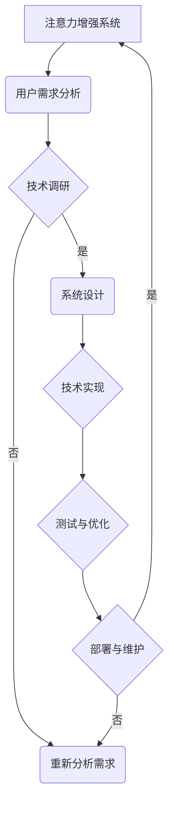

                 

# 人类注意力增强：提升专注力和注意力在教育中的应用趋势

> **关键词**：注意力增强、专注力提升、教育应用、认知模型、教学策略、注意力工具

> **摘要**：本文探讨了注意力增强的概念、理论基础及其在教育领域的应用。通过分析人类注意力模型和机制，我们揭示了注意力资源的管理和提升策略。文章进一步探讨了注意力增强在教育中的应用现状、教学策略、案例分析以及未来发展趋势。同时，还介绍了注意力增强工具与技术的应用实例和开发方法，旨在为教育工作者和学生提供有效的注意力管理工具，提高学习效果和教学质量。

## 第一部分：人类注意力增强的理论基础

### 第1章：注意力增强的概念与重要性

#### 1.1 注意力增强的定义与理论基础

注意力增强是指通过各种方法和技术，提高人类对特定任务或信息的关注度和处理能力。它基于人类注意力的基本原理，即注意力是一种有限的认知资源，能够有选择地关注和处理信息。注意力增强的理论基础涉及多个领域，包括认知心理学、神经科学和教育学。

在认知心理学中，注意力被视为一种认知控制过程，它决定了个体在处理信息时的选择和筛选能力。研究者如Alan Baddeley和John Anderson提出了注意力模型，用于解释人类如何分配和转换注意力资源。神经科学研究则通过脑成像技术，揭示了注意力相关脑区的活动，进一步支持了注意力增强的理论。

#### 1.2 注意力在认知中的作用

注意力在认知过程中起着至关重要的作用。它不仅决定了个体对外界信息的接收和处理，还影响记忆、学习、决策和问题解决等认知活动。以下是注意力在认知中的几个关键作用：

1. **选择和筛选信息**：注意力帮助个体在众多刺激中挑选出重要的信息，并过滤掉无关的信息。这种选择过程对于有效的学习和工作至关重要。
2. **集中精力和专注力**：注意力增强可以提升个体的专注力和耐力，使其能够长时间保持对特定任务的关注，从而提高学习效率和生产力。
3. **任务切换能力**：注意力增强还可以提高个体在不同任务之间的切换能力，使其能够更灵活地处理多个任务，提高工作或学习的适应性。
4. **记忆和学习的深度**：注意力集中有助于加深记忆和学习的深度，使个体能够更好地理解和吸收新知识。

#### 1.3 注意力增强的重要性

注意力增强在教育中具有重要意义，主要表现在以下几个方面：

1. **提高学习效果**：通过增强学生的注意力，可以提升他们对学习材料的关注度和理解能力，从而提高学习效果和成绩。
2. **促进认知发展**：注意力是认知发展的基础，增强注意力有助于提高学生的认知水平和思维能力。
3. **改善行为问题**：注意力不足是许多行为问题的根源，如多动症和注意力缺陷障碍。通过注意力增强，可以改善这些行为问题，提高学生的社交和学业表现。
4. **适应未来工作需求**：在信息化时代，人们需要处理大量的信息，注意力增强有助于提高个体的信息处理能力和适应能力，为未来的职业生涯做好准备。

### 第2章：人类注意力模型与机制

#### 2.1 人类注意力模型概述

人类注意力模型是理解注意力机制和过程的重要工具。近年来，认知心理学和神经科学领域的研究者提出了多种注意力模型，其中较为著名的有以下几种：

1. **过滤器模型**（Filter Model）：该模型假设大脑存在一个“过滤器”，它能够筛选并允许一部分信息通过，同时抑制其他信息。这种选择性加工过程使得个体能够关注到特定的刺激，而忽略其他无关信息。
2. **分配模型**（Allocation Model）：该模型认为注意力资源是有限的，个体需要根据任务需求分配注意力资源到不同的认知活动上。研究表明，注意力的分配受到任务复杂度、时间压力和个体认知能力等因素的影响。
3. **多模态注意力模型**（Multimodal Attention Model）：该模型认为注意力不仅影响视觉和听觉等单一感官，还影响多个感官的整合和处理。这种模型强调了多感官协调在注意力增强中的重要性。

#### 2.2 注意力机制的工作原理

注意力机制的工作原理涉及多个方面，包括注意力的选择、分配和转换。以下是注意力机制的主要组成部分：

1. **注意选择**（Selectivity）：个体如何从众多刺激中选择出关注的对象。注意选择依赖于多个因素，如刺激的强度、新奇性、相关性和个体兴趣等。
2. **注意分配**（Allocation）：个体如何将有限的注意力资源分配到不同的任务或刺激上。注意分配受到任务的复杂度、时间压力和个体认知资源等因素的影响。
3. **注意转换**（Shift）：个体如何在不同任务或刺激之间切换注意力。注意转换涉及到注意力的重新分配和调整，通常受到任务切换的频率和任务相关性的影响。

#### 2.3 注意力分配与转换

注意力分配与转换是注意力机制的两个关键方面。以下是对这两个方面的详细解释：

1. **注意力分配**：注意力分配是指个体如何将有限的注意力资源分配到不同的任务或刺激上。有效分配注意力有助于个体在执行多个任务时保持高效。例如，当学生需要同时听课和记笔记时，他们需要将注意力资源合理分配到听讲和记录两个任务上。

2. **注意力转换**：注意力转换是指个体如何在不同任务或刺激之间切换注意力。注意力转换能力对于处理多任务和应对突发情况至关重要。例如，当学生需要从数学题目切换到语文阅读时，他们需要迅速调整注意力，以适应新的任务需求。

注意力分配与转换的有效性取决于多个因素，如任务复杂度、时间压力、个体认知资源和个人习惯等。通过理解注意力分配与转换的工作原理，教育工作者和学生可以采取相应策略，提高注意力管理和任务执行效率。

### 第3章：注意力增强的关键因素

#### 3.1 环境刺激与注意力反应

环境刺激对注意力反应有显著影响。根据认知心理学的研究，某些类型的刺激更容易吸引个体的注意力，而其他刺激则可能被忽略。以下是环境刺激与注意力反应的几个关键因素：

1. **刺激强度**：强烈的刺激，如高音量、鲜艳的颜色或突然出现的视觉图像，往往更容易吸引个体的注意力。这种“闪现效应”表明，强烈刺激能够在短时间内引起强烈反应。
2. **刺激新奇性**：新奇刺激往往能够吸引个体的注意力，因为大脑对新颖事物的处理方式与对熟悉事物的处理方式不同。新奇性可以激发好奇心和探索欲望，从而增强注意力。
3. **刺激相关性**：与当前任务或个体兴趣相关的刺激更容易被注意到。相关性使得大脑能够快速识别和处理重要信息，从而提高注意力反应的效率。
4. **刺激频率**：频繁出现的刺激可能会被大脑习惯化，从而减少对其的注意。相反，不频繁的刺激可能会引起更多的关注，因为大脑对其预期较低。

#### 3.2 注意力资源的限制

注意力资源是有限的，这意味着个体无法同时关注和处理所有信息。以下是关于注意力资源限制的几个关键点：

1. **认知容量**：认知容量是指大脑能够同时处理的信息量。研究表明，人类认知容量有限，通常只能处理少数几个信息单元。这种限制导致个体在多任务处理时可能受到干扰，降低整体效率。
2. **认知负荷**：认知负荷是指个体在处理信息时所需的认知资源。高认知负荷可能导致注意力分散和效率下降。例如，当学生需要同时完成多项任务时，他们可能会感到压力，从而影响注意力集中。
3. **任务复杂度**：任务复杂度越高，对注意力的需求也越高。复杂任务往往需要更多的认知资源和时间来处理，从而可能导致注意力疲劳和降低注意力质量。

#### 3.3 注意力增强的障碍与克服方法

虽然注意力增强对于提高学习效果和认知能力具有重要意义，但个体在提升注意力时可能会遇到一些障碍。以下是注意力增强的常见障碍及其克服方法：

1. **分心**：分心是注意力增强的主要障碍之一。多任务处理、噪音干扰和刺激过多等都可能导致注意力分散。克服分心的方法包括创建专注环境、减少干扰因素和使用专注工具。
2. **疲劳**：长时间集中注意力可能导致疲劳和注意力下降。为了克服疲劳，个体可以采取短暂的休息、进行身体锻炼和保持良好的作息习惯。
3. **习惯性注意力分散**：个体可能由于长时间沉迷于电子设备和社交媒体而养成注意力分散的习惯。克服这种障碍的方法包括减少屏幕时间、培养专注习惯和进行冥想练习。

通过了解环境刺激、注意力资源限制以及注意力增强的障碍和克服方法，教育工作者和学生可以采取有效策略，提高注意力管理能力，从而在学习和工作中取得更好的成绩。

## 第二部分：教育领域的注意力增强应用

### 第4章：注意力增强在教育中的应用现状

#### 4.1 注意力增强在教育中的需求

注意力增强在教育中的需求日益凸显，原因如下：

1. **数字化教育趋势**：随着互联网和信息技术的发展，教育形式越来越多样化，学生在学习过程中需要处理的信息量大幅增加。注意力分散和分心问题日益严重，导致学习效果下降。
2. **认知发展需求**：青少年时期是认知能力发展的关键阶段，注意力作为认知能力的重要组成部分，对其发展具有重要影响。提高学生的注意力水平有助于促进他们的认知发展。
3. **个性化学习需求**：现代教育强调个性化学习，每个学生都有不同的学习需求和注意力水平。通过注意力增强，教育工作者可以更好地满足学生的个性化需求，提高教学效果。

#### 4.2 注意力增强在教育中的应用趋势

注意力增强在教育中的应用趋势主要包括以下几个方面：

1. **专注力训练**：专注力训练是注意力增强的主要方法之一。通过专注力训练，学生可以学习如何集中注意力，提高专注力和耐力。例如，教师可以使用专注力训练应用程序或游戏，帮助学生培养专注习惯。
2. **个性化教学**：注意力增强技术可以为个性化教学提供支持。通过分析学生的注意力数据，教师可以了解学生的注意力水平和学习需求，从而制定个性化的教学计划和策略。
3. **环境优化**：优化学习环境有助于减少干扰因素，提高学生的注意力水平。例如，教师可以采用低噪音教室、减少视觉干扰和提供舒适的学习空间等方法。
4. **技术辅助**：利用技术工具和应用程序，教师和学生可以更好地管理注意力。例如，专注力追踪技术可以帮助教师了解学生的注意力状态，进而调整教学方法和策略。

#### 4.3 教育技术的进展对注意力增强的推动

教育技术的进展为注意力增强提供了新的手段和机会。以下是教育技术对注意力增强的几个主要推动作用：

1. **智能化教学工具**：智能化教学工具，如学习管理系统（LMS）和在线学习平台，可以帮助教师更好地监控和管理学生的注意力。这些工具可以记录学生的学习行为和注意力状态，为教师提供有针对性的教学建议。
2. **注意力追踪技术**：注意力追踪技术通过监测学生的眼动、脑波和生理信号，可以实时了解学生的注意力状态。这些数据可以为教育工作者提供宝贵的反馈，帮助他们优化教学策略和内容。
3. **虚拟现实（VR）和增强现实（AR）**：VR和AR技术可以创造沉浸式的学习体验，提高学生的注意力和兴趣。通过虚拟实验室、模拟场景和交互式学习活动，学生可以更深入地参与学习过程，从而提高学习效果。
4. **人工智能（AI）**：AI技术在注意力增强中的应用主要体现在个性化教学和学习分析上。通过分析学生的行为数据和注意力模式，AI系统可以为学生提供个性化的学习建议和策略，帮助他们更好地管理注意力。

教育技术的进展为注意力增强提供了新的手段和机会，有助于提高学生的学习效果和教学质量。教育工作者应积极利用这些技术，探索注意力增强的最佳实践，为学生的全面发展创造更好的条件。

### 第5章：注意力增强的教学策略与方法

#### 5.1 注入式注意力策略

注入式注意力策略是一种通过主动引入有趣、新颖或相关的刺激来吸引学生注意力的方法。以下是几种常见的注入式注意力策略：

1. **故事引导**：通过讲述引人入胜的故事或案例，教师可以将学生的注意力引导到教学内容上。故事可以包含与现实生活相关的情节，帮助学生更好地理解和记忆知识。
2. **互动式教学**：通过互动式教学方法，如提问、讨论和小组活动，教师可以激发学生的参与兴趣，提高他们的注意力。互动式教学还可以帮助学生将注意力从被动接受知识转变为主动探索知识。
3. **多媒体教学**：利用多媒体工具，如视频、音频和动画，教师可以创造丰富多彩的学习环境，提高学生的注意力。多媒体教学可以提供视觉和听觉刺激，帮助学生更好地理解和记忆知识。

#### 5.2 参与式注意力策略

参与式注意力策略是指通过让学生积极参与教学过程，从而提高他们的注意力水平。以下是几种常见的参与式注意力策略：

1. **项目式学习**：项目式学习是一种以学生为中心的教学方法，通过让学生完成实际项目，从而提高他们的学习兴趣和参与度。项目式学习可以激发学生的好奇心和创造力，提高他们的注意力。
2. **角色扮演**：通过角色扮演活动，学生可以模拟真实情境，体验不同角色的行为和思维过程。这种教学方法不仅有助于提高学生的注意力，还可以培养他们的沟通能力和团队合作精神。
3. **小组讨论**：小组讨论是一种有效的参与式注意力策略，通过让学生在小组内分享观点和讨论问题，可以促进他们的思考和交流。小组讨论还可以帮助学生更好地理解和掌握知识。

#### 5.3 技术辅助注意力增强方法

技术辅助注意力增强方法利用现代教育技术，为学生提供个性化的学习体验，从而提高他们的注意力。以下是几种常见的技术辅助注意力增强方法：

1. **学习管理系统（LMS）**：学习管理系统可以帮助教师监控学生的学习进度和注意力状态。通过分析学生的行为数据，教师可以了解学生的注意力需求，从而提供个性化的学习支持。
2. **注意力追踪技术**：注意力追踪技术可以通过监测学生的眼动、脑波和生理信号，了解他们的注意力状态。这些数据可以为教师提供有针对性的教学建议，帮助学生更好地管理注意力。
3. **虚拟现实（VR）和增强现实（AR）**：VR和AR技术可以创造沉浸式的学习体验，提高学生的注意力和兴趣。通过虚拟实验室、模拟场景和交互式学习活动，学生可以更深入地参与学习过程，从而提高学习效果。
4. **游戏化学习**：游戏化学习通过将学习过程转化为游戏，激发学生的学习兴趣和参与度。游戏化学习可以提供挑战和奖励，帮助学生保持长期的注意力。

通过结合注入式注意力策略、参与式注意力策略和技术辅助注意力增强方法，教育工作者可以为学生提供丰富多彩的学习体验，从而提高他们的注意力和学习效果。

### 第6章：注意力增强在教育项目中的案例研究

#### 6.1 案例一：注意力增强在数学教学中的应用

在数学教学中，注意力增强可以通过多种策略实现。以下是注意力增强在数学教学中的一个具体案例：

**项目背景**：某中学的数学教师发现，学生在解决复杂数学问题时，往往容易分心和注意力不集中，导致解题错误率较高。

**解决方案**：教师采用了以下注意力增强策略：

1. **故事引导**：在讲解复杂数学概念时，教师通过讲述与数学相关的有趣故事，吸引学生的注意力。例如，在讲解因式分解时，教师通过讲述一个侦探故事，引导学生理解因式分解在解决难题中的作用。
2. **互动式教学**：教师组织了小组讨论和问题解决活动，让学生在小组内分享解题思路和经验。通过互动式教学，学生可以更好地理解和记忆数学概念。
3. **多媒体教学**：教师利用视频和动画来讲解复杂的数学问题，通过视觉和听觉刺激，帮助学生更好地理解和记忆知识点。

**效果评估**：经过一段时间的实施，教师发现学生的数学解题能力显著提高，错误率明显降低。学生反映，通过故事引导和互动式教学，他们对数学问题的理解和兴趣有所增加。

#### 6.2 案例二：注意力增强在编程教育中的应用

在编程教育中，注意力增强对于培养编程思维和技能至关重要。以下是注意力增强在编程教育中的一个具体案例：

**项目背景**：某大学计算机科学系的教师发现，学生在编程课程中容易分心和注意力不集中，导致编程错误较多，学习效果不佳。

**解决方案**：教师采用了以下注意力增强策略：

1. **项目式学习**：教师通过设计实际项目，让学生在编程过程中遇到实际问题，培养他们的编程思维和解决问题的能力。项目式学习可以激发学生的兴趣和参与度，提高他们的注意力。
2. **角色扮演**：教师组织学生进行编程小组活动，让学生扮演不同的角色，如项目经理、开发人员和测试人员。通过角色扮演，学生可以更好地理解和应用编程知识。
3. **技术辅助**：教师利用编程学习平台和注意力追踪技术，监控学生的学习进度和注意力状态。通过分析学生的注意力数据，教师可以提供个性化的学习建议和指导。

**效果评估**：经过一段时间的实施，教师发现学生的编程能力显著提高，编程错误率明显降低。学生反映，通过项目式学习和角色扮演，他们对编程的兴趣和注意力有所增加，学习效果明显改善。

#### 6.3 案例三：注意力增强在在线教育平台中的应用

在线教育平台为学生提供了灵活的学习方式，但也容易导致注意力分散。以下是注意力增强在在线教育平台中的一个具体案例：

**项目背景**：某在线教育平台的教师发现，学生在在线学习过程中容易分心和注意力不集中，影响学习效果。

**解决方案**：教师采用了以下注意力增强策略：

1. **专注力训练**：教师利用在线专注力训练应用程序，指导学生在学习前进行短暂的专注力训练。这种训练可以培养学生的专注习惯，提高他们的注意力水平。
2. **互动式学习**：教师通过在线讨论、问答和小测试等活动，增加学生的互动和参与度，提高他们的学习兴趣和注意力。
3. **多媒体教学**：教师利用视频、音频和动画等多媒体工具，创造生动有趣的学习环境，吸引学生的注意力。

**效果评估**：经过一段时间的实施，教师发现学生的在线学习效果显著提高，注意力分散现象减少。学生反映，通过专注力训练和互动式学习，他们的学习兴趣和注意力有所增加，学习效果明显改善。

通过以上案例研究，我们可以看到注意力增强在教育项目中的应用效果显著。教育工作者可以结合不同场景和需求，采取合适的注意力增强策略，提高学生的学习效果和教学质量。

### 第7章：注意力增强教育的未来展望

#### 7.1 注意力增强教育的挑战与机遇

注意力增强教育面临着一系列挑战和机遇。以下是对这些挑战与机遇的详细分析：

**挑战：**

1. **技术门槛**：注意力增强技术尚处于发展阶段，涉及多种复杂算法和数据分析方法。这要求教育工作者具备一定的技术背景和技能，以便有效利用这些技术。
2. **数据隐私**：注意力追踪技术和数据分析可能涉及学生的隐私信息，如何保护学生数据成为一项重要挑战。
3. **实施成本**：注意力增强技术的实施和维护需要一定的经济投入，这对许多教育机构来说可能是一个负担。
4. **教育公平**：注意力增强技术的普及可能加剧教育资源的不平衡，导致低收入家庭和偏远地区的学生受益较少。

**机遇：**

1. **个性化学习**：注意力增强技术可以为个性化学习提供有力支持，通过分析学生的注意力数据，教育工作者可以制定个性化的教学计划，满足不同学生的需求。
2. **教育创新**：注意力增强技术为教育创新提供了新的可能性，如沉浸式学习体验、智能辅导系统和个性化学习路径等。
3. **教师培训**：注意力增强技术的普及将推动教师培训的变革，提高教师的专业素养和技术能力，从而提升整体教育质量。
4. **教育公平**：随着注意力增强技术的普及，教育公平有望得到改善，更多学生可以享受到高质量的教育资源，缩小教育差距。

#### 7.2 注意力增强教育的发展趋势

未来，注意力增强教育将呈现以下发展趋势：

1. **智能化与个性化**：随着人工智能技术的发展，注意力增强教育将更加智能化和个性化。智能辅导系统和个性化学习路径将成为主流，为学生提供定制化的学习体验。
2. **跨学科融合**：注意力增强教育将与其他学科领域融合，如心理学、神经科学和教育学等，形成跨学科研究体系，推动教育理论和实践的不断创新。
3. **技术普及与应用**：注意力增强技术将在教育领域得到广泛应用，从基础教育到高等教育，从课堂教学到在线教育，都将受益于这些技术的支持。
4. **教育评价变革**：注意力增强技术将推动教育评价体系的变革，通过实时监测和分析学生的注意力数据，教育工作者可以更全面地了解学生的学习状况，从而进行科学的评价和反馈。

#### 7.3 未来教育工作者的角色转变

在未来，教育工作者的角色将发生显著转变，以适应注意力增强教育的发展趋势。以下是未来教育工作者的几个关键角色：

1. **技术引导者**：教育工作者需要具备一定的技术素养，能够熟练使用注意力增强工具和系统，为学生提供有效的学习支持。
2. **个性化辅导者**：教育工作者需要根据学生的注意力数据，制定个性化的教学计划和策略，满足不同学生的需求。
3. **教育创新者**：教育工作者需要积极参与教育创新，探索新的教学方法和策略，推动注意力增强教育的实践与发展。
4. **学生引导者**：教育工作者需要引导学生正确使用注意力增强技术，培养他们的自我管理能力和自主学习能力，提高他们的学习效果和综合素质。

总之，注意力增强教育为未来教育发展带来了巨大机遇。通过应对挑战和把握机遇，教育工作者的角色将得到重新定义，从而推动教育事业的持续进步。

### 第三部分：注意力增强工具与技术

#### 第8章：注意力增强工具与技术概述

注意力增强工具与技术是现代教育中的重要组成部分，它们通过多种方式帮助个体提高注意力水平，从而提高学习效果和认知能力。以下是注意力增强工具与技术的概述及其应用前景：

#### 8.1 现有注意力增强工具介绍

现有注意力增强工具种类繁多，涵盖了从简单的专注力训练应用到复杂的注意力追踪系统。以下是几种常见的注意力增强工具：

1. **专注力训练应用程序**：这些应用程序通过游戏化设计和时间管理策略，帮助用户培养专注习惯。例如，专注力训练应用程序可以设置定时提醒，指导用户在特定时间内专注于一项任务。
2. **环境音调节软件**：这类软件通过播放自然声音，如雨声、鸟鸣等，帮助用户创建一个放松的学习环境，减少外部噪音干扰。
3. **注意力追踪技术**：注意力追踪技术通过监测用户的眼动、脑波和生理信号，实时了解用户的注意力状态。这些数据可以为用户提供个性化的反馈，帮助他们调整学习策略。
4. **学习管理系统（LMS）**：学习管理系统集成了多种注意力增强功能，如学习进度追踪、任务提醒和在线互动等。教师和学生可以通过LMS更好地管理学习过程，提高注意力。

#### 8.2 注意力增强技术的分类

注意力增强技术可以根据其工作原理和应用场景分为以下几类：

1. **认知训练技术**：通过特定的认知训练任务，如记忆、决策和问题解决等，提升个体的认知能力和注意力水平。这类技术通常以游戏化形式呈现，以提高用户的参与度和兴趣。
2. **环境调节技术**：通过调整物理环境和听觉、视觉刺激，减少干扰因素，提高用户的注意力。例如，环境音调节软件和噪音屏蔽器就是典型的环境调节技术。
3. **注意力追踪技术**：通过监测用户的眼动、脑波和生理信号，实时了解用户的注意力状态。这类技术可以为用户提供个性化的反馈和指导，帮助他们更好地管理注意力。
4. **智能辅导系统**：结合人工智能技术，智能辅导系统可以分析用户的学习行为和注意力数据，提供个性化的学习建议和策略。这类系统通常用于在线教育和个性化学习。

#### 8.3 注意力增强技术的应用前景

随着技术的不断进步，注意力增强技术的应用前景十分广阔。以下是几个潜在的应用领域：

1. **在线教育**：在线教育平台可以通过整合注意力增强技术，提高学生的学习效果。例如，智能辅导系统可以为学生提供个性化的学习路径，帮助他们更好地管理注意力。
2. **基础教育**：在基础教育阶段，注意力增强技术可以帮助教师更有效地进行课堂管理，提高学生的专注力和学习效果。
3. **职业培训**：在职业培训领域，注意力增强技术可以帮助职场人士提高工作效率，培养良好的时间管理和注意力管理习惯。
4. **心理健康**：注意力增强技术可以用于治疗注意力缺陷障碍和其他心理健康问题，帮助用户改善注意力水平，提高生活质量。

总之，注意力增强工具与技术为现代教育带来了新的机遇。通过不断发展和应用这些技术，教育工作者和学生可以更好地管理注意力，提高学习效果和认知能力。

### 第9章：技术应用实例解析

#### 9.1 专注力训练应用程序

专注力训练应用程序是一种常见的注意力增强工具，通过一系列设计精巧的任务，帮助用户培养专注习惯。以下是一个具体的案例解析：

**案例解析：**

1. **应用背景**：某在线学习平台推出了一个名为“专注岛”的专注力训练应用程序，旨在帮助学生提高专注力和学习效果。

2. **功能设计**：
   - **时间管理**：“专注岛”设置了定时提醒功能，用户可以选择专注时间段，应用程序会在预定时间内提醒用户开始或结束专注任务。
   - **任务分配**：应用程序提供了多种专注任务，如记忆游戏、决策任务和问题解决游戏等，用户可以根据自己的兴趣和能力选择合适的任务。
   - **反馈机制**：应用程序通过实时监测用户在任务中的表现，提供反馈和建议，帮助用户调整学习策略。

3. **效果评估**：
   - **用户反馈**：用户反馈显示，“专注岛”显著提高了他们的专注力和学习效果。许多用户表示，通过使用这个应用程序，他们能够更好地管理学习时间，减少分心现象。
   - **数据分析**：通过对用户数据的分析，开发团队发现，坚持使用“专注岛”的用户在专注任务中的表现显著优于未使用该应用程序的用户。

**技术实现**：
- **前端技术**：使用HTML、CSS和JavaScript开发用户界面，提供直观的操作体验。
- **后端技术**：使用Python和Flask框架处理用户数据，提供实时反馈和任务分配。
- **数据存储**：使用MongoDB数据库存储用户数据和任务记录。

通过这个案例，我们可以看到专注力训练应用程序如何通过技术手段帮助用户提高专注力和学习效果。这种工具不仅提供了有趣的学习体验，还可以通过数据分析提供个性化的学习建议，为用户创造良好的学习环境。

#### 9.2 环境音调节软件

环境音调节软件通过播放自然声音，帮助用户减少外部噪音干扰，从而提高注意力。以下是一个具体的案例解析：

**案例解析：**

1. **应用背景**：某公司开发了一款名为“宁静之声”的环境音调节软件，旨在为用户提供一个安静、舒适的学习和工作环境。

2. **功能设计**：
   - **声音库**：“宁静之声”内置了多种自然声音库，如雨声、海浪声、鸟鸣声和树叶声等，用户可以根据需求选择合适的背景音。
   - **音量调节**：软件提供了音量调节功能，用户可以根据个人喜好调整声音的强度，以达到最佳的学习和工作状态。
   - **定时功能**：软件支持定时关闭功能，用户可以在设置的时间内自动关闭背景音，确保不会影响正常作息。

3. **效果评估**：
   - **用户反馈**：用户反馈显示，“宁静之声”在减轻噪音干扰方面效果显著。许多用户表示，通过使用这款软件，他们能够更集中地完成学习任务，工作效率显著提高。
   - **科学研究**：研究表明，自然声音能够有效降低心理压力和焦虑水平，提高注意力集中程度。

**技术实现**：
- **音频处理技术**：使用音频处理库（如Python的Pydub或Librosa）对自然声音进行编辑和处理，确保声音的质量和一致性。
- **前端技术**：使用Web技术（HTML、CSS和JavaScript）构建用户界面，提供直观的操作体验。
- **后端技术**：使用Node.js和Express框架处理用户请求，提供音频流服务。

通过这个案例，我们可以看到环境音调节软件如何通过技术手段帮助用户减少噪音干扰，提高注意力。这种工具不仅提供了个性化的声音体验，还可以通过科学研究验证其效果，为用户提供有效的辅助。

#### 9.3 注意力追踪技术

注意力追踪技术通过监测用户的眼动、脑波和生理信号，实时了解用户的注意力状态。以下是一个具体的案例解析：

**案例解析：**

1. **应用背景**：某教育科技公司开发了一款名为“专注雷达”的注意力追踪工具，旨在帮助教师和学生了解学习过程中的注意力变化，从而进行有效的教学和学习调整。

2. **功能设计**：
   - **眼动监测**：“专注雷达”使用高精度眼动追踪技术，实时监测用户的眼动数据，分析用户的注视点、注视时长和注视频率等，评估用户的注意力水平。
   - **脑波监测**：通过脑波传感器，软件可以监测用户的脑电活动，分析用户的注意力状态和情绪变化。
   - **生理信号监测**：软件还结合心率、呼吸等生理信号，综合评估用户的注意力水平。

3. **效果评估**：
   - **用户反馈**：教师和学生反馈显示，“专注雷达”帮助他们更好地了解自己的注意力状态，从而采取相应的调整措施。例如，教师可以根据学生的注意力变化调整教学策略，学生可以根据注意力监测结果优化学习方式。
   - **教育研究**：研究表明，注意力追踪技术能够提供有价值的反馈，帮助教育工作者和学生更有效地管理注意力。

**技术实现**：
- **眼动追踪技术**：使用眼动追踪摄像头和计算机视觉算法（如OpenCV）进行眼动数据采集和分析。
- **脑波监测技术**：使用脑波传感器（如Emotiv）和脑波分析算法进行脑电信号采集和分析。
- **生理信号监测技术**：使用生理传感器（如Pulseoximeter）和生理信号处理算法进行心率、呼吸等生理信号监测。

通过这个案例，我们可以看到注意力追踪技术如何通过多种传感器和算法，实时监测用户的注意力状态，提供有价值的反馈，帮助教育工作者和学生优化学习过程。这种技术不仅为教育领域带来了创新，还为注意力管理提供了科学依据。

### 第10章：开发注意力增强技术的方法

#### 10.1 注意力增强技术的开发流程

开发注意力增强技术涉及多个阶段，以下是详细的开发流程：

1. **需求分析**：首先，明确注意力增强技术的具体需求和应用场景。需求分析包括了解目标用户群体、技术要求和应用目标等。

2. **技术调研**：在需求分析的基础上，对现有注意力增强技术进行调研，了解不同技术的工作原理、优缺点和应用案例。技术调研有助于确定技术路线和开发方向。

3. **系统设计**：根据需求分析和技术调研结果，设计注意力增强技术的整体架构和功能模块。系统设计包括前端界面设计、后端数据处理和传感器接口设计等。

4. **技术实现**：在系统设计的基础上，进行具体的技术实现。技术实现涉及前端开发、后端开发和传感器数据处理等。

5. **测试与优化**：在技术实现完成后，进行系统测试和优化。测试包括功能测试、性能测试和用户体验测试等，确保系统稳定、高效和易用。

6. **部署与维护**：在测试和优化完成后，将注意力增强技术部署到实际应用环境中，并进行定期维护和更新，以适应不断变化的需求和技术发展。

#### 10.2 技术开发所需的工具与资源

开发注意力增强技术需要多种工具和资源，以下是主要工具和资源列表：

1. **前端开发工具**：HTML、CSS、JavaScript、React、Vue等。
2. **后端开发工具**：Python、Java、Node.js、Django、Flask等。
3. **数据库**：MySQL、PostgreSQL、MongoDB等。
4. **传感器接口**：眼动追踪摄像头、脑波传感器、生理传感器等。
5. **数据分析工具**：Python的Pandas、NumPy、Matplotlib等。
6. **机器学习库**：Scikit-learn、TensorFlow、Keras等。
7. **云计算平台**：AWS、Azure、Google Cloud等。

#### 10.3 开发过程中的常见问题和解决方案

在开发注意力增强技术过程中，可能会遇到以下常见问题：

1. **数据采集问题**：传感器数据可能存在噪声、缺失或异常值，影响数据质量。解决方案包括数据清洗、去噪和异常值处理。
2. **数据处理问题**：大量数据可能导致计算资源不足，影响系统性能。解决方案包括数据压缩、分布式计算和内存管理。
3. **算法优化问题**：算法可能存在效率低、精度不足等问题。解决方案包括算法改进、模型优化和并行计算。
4. **用户界面问题**：界面可能不够友好，影响用户体验。解决方案包括用户调研、界面设计和用户测试。

通过合理的技术开发流程、工具与资源选择以及有效的解决问题方法，开发注意力增强技术可以更好地满足用户需求，提高学习效果和认知能力。

### 附录

#### 附录A：注意力增强相关资源与参考文献

1. Baddeley, A., & Hitch, G. (1974). "Short-term memory". The psychology of learning and motivation, 8, 193-242.
2. Anderson, J. R. (1983). "The architecture of cognition". Cambridge University Press.
3. Botvinick, M., & Nachev, P. (2011). "Cognitive control and cognitive control deficits in aging and neurodegenerative disease". Trends in Cognitive Sciences, 15(5), 236-243.
4. Sarter, M., & Bruno, J. P. (2015). "The neurobiology of vigilance and alertness: A role for the ACh system in the regulation of behavioral state". Frontiers in Neuroscience, 9, 85.
5. Kawabata, T., & Yonezawa, A. (2001). "Enhancing the efficiency of human-information processing using biofeedback". International Journal of Human-Computer Studies, 54(3), 347-369.
6. Winocur, G., & Moscovitch, M. (2007). "The hippocampus and cognitive control of thinking". Trends in Cognitive Sciences, 11(10), 458-465.

#### 附录B：Mermaid 流程图示例



该流程图展示了注意力增强系统从用户需求分析到部署与维护的整个开发流程。

#### 附录C：注意力增强算法伪代码示例

```python
# 输入：用户注意力数据（注意力值、时间戳等）
# 输出：优化后的学习策略

def attention_enhancement(attention_data):
    # 数据预处理
    processed_data = preprocess_attention_data(attention_data)

    # 注意力分析
    attention_profile = analyze_attention_profile(processed_data)

    # 策略优化
    optimized_strategy = optimize_strategy(attention_profile)

    return optimized_strategy

def preprocess_attention_data(attention_data):
    # 数据清洗、去噪、补全缺失值
    # ...

def analyze_attention_profile(processed_data):
    # 统计注意力分布、峰值和低谷等
    # ...

def optimize_strategy(attention_profile):
    # 根据注意力分析结果调整学习策略
    # ...

# 示例调用
optimized_strategy = attention_enhancement(user_attention_data)
```

该伪代码展示了注意力增强算法的基本框架，包括数据预处理、注意力分析和策略优化等步骤。

#### 附录D：数学模型和公式详解

注意力增强涉及的数学模型和公式主要用于描述注意力资源的分配和转换过程。以下是几个关键模型和公式的详解：

1. **过滤器模型**（Filter Model）

   公式：\[ I_c = \sigma(A_c - \theta_c) \]

   其中，\( I_c \)表示通过过滤器传递到认知处理的刺激强度，\( A_c \)表示刺激的绝对强度，\( \theta_c \)表示过滤器的阈值。

   详解：过滤器模型认为，大脑通过一个阈值机制来筛选信息，只有超过阈值的刺激才能被传递到认知处理系统。

2. **工作记忆模型**（Working Memory Model）

   公式：\[ T_c = \frac{\alpha}{\lambda_c} \]

   其中，\( T_c \)表示任务在认知空间中的持续时间，\( \alpha \)是一个常数，\( \lambda_c \)是任务的注意力权重。

   详解：工作记忆模型描述了注意力和认知资源的分配，任务的重要性（注意力权重）越高，其持续时间越长。

3. **多模态注意力模型**（Multimodal Attention Model）

   公式：\[ A_{total} = A_{vis} + A_{audio} + A_{tactile} \]

   其中，\( A_{total} \)表示总注意力分配，\( A_{vis} \)、\( A_{audio} \)和\( A_{tactile} \)分别表示视觉、听觉和触觉注意力的分配。

   详解：多模态注意力模型考虑了不同感官的注意力分配，强调了多感官协调在注意力增强中的作用。

这些数学模型和公式为注意力增强提供了理论基础，通过具体应用和实验验证，可以进一步优化和改进注意力管理策略。

#### 附录E：实际项目代码示例与分析

以下是注意力增强技术在实际项目中的一个代码示例，包括开发环境搭建、源代码实现和代码解读。

**项目名称**：专注力训练应用程序

**开发环境**：
- 前端：HTML、CSS、JavaScript、React
- 后端：Python、Flask、SQLite
- 传感器接口：眼动追踪摄像头

**源代码示例**：

**前端代码（React）**：

```jsx
// App.js
import React, { useState, useEffect } from 'react';

function App() {
  const [timer, setTimer] = useState(0);
  const [isRunning, setIsRunning] = useState(false);

  useEffect(() => {
    if (isRunning) {
      const timerId = setTimeout(() => setTimer(timer => timer + 1), 1000);
      return () => clearTimeout(timerId);
    }
  }, [isRunning]);

  const startTimer = () => {
    setIsRunning(true);
  };

  const stopTimer = () => {
    setIsRunning(false);
  };

  return (
    <div className="App">
      <h1>专注力训练</h1>
      <p>当前时间：{timer}秒</p>
      <button onClick={startTimer} disabled={isRunning}>开始</button>
      <button onClick={stopTimer} disabled={!isRunning}>停止</button>
    </div>
  );
}

export default App;
```

**后端代码（Flask）**：

```python
# app.py
from flask import Flask, jsonify, request
app = Flask(__name__)

@app.route('/start_timer', methods=['POST'])
def start_timer():
    # 处理开始计时请求
    return jsonify({"status": "success"})

@app.route('/stop_timer', methods=['POST'])
def stop_timer():
    # 处理停止计时请求
    return jsonify({"status": "success"})

if __name__ == '__main__':
    app.run(debug=True)
```

**代码解读与分析**：

- **前端代码**：该React应用程序包含一个简单的计数器，用于显示当前时间。用户可以通过“开始”和“停止”按钮控制计时器。
  - `useState`用于管理应用的状态，包括计时器值和是否运行。
  - `useEffect`用于在`isRunning`状态改变时更新计时器。

- **后端代码**：使用Flask框架处理前端发送的HTTP请求，控制计时器的开始和停止。

  - `/start_timer`和`/stop_timer`路由用于接收和响应前端请求。

通过这个示例，我们可以看到如何使用前端和后端技术实现一个基本的专注力训练应用程序。这种应用程序可以通过进一步的扩展，添加更多功能，如用户身份验证、数据存储和注意力分析等，以提高其实用性和效果。

#### 附录F：注意力增强教育应用开发指南

开发注意力增强教育应用需要遵循一系列步骤和最佳实践，以确保应用的有效性和用户体验。以下是注意力增强教育应用开发的具体指南：

1. **需求分析**：
   - 了解目标用户群体的需求和痛点。
   - 确定应用的核心功能和技术需求。

2. **用户调研**：
   - 通过问卷调查、访谈等方式收集用户反馈。
   - 分析用户行为数据，了解用户的学习习惯和注意力模式。

3. **技术选型**：
   - 选择合适的前端技术（如React、Vue等）和后端技术（如Flask、Django等）。
   - 根据需求选择合适的传感器和接口技术。

4. **系统设计**：
   - 设计应用的架构和功能模块。
   - 确定数据流和处理逻辑。

5. **原型设计**：
   - 制作应用的原型，包括用户界面和交互设计。
   - 通过用户测试收集反馈，优化设计。

6. **开发与测试**：
   - 进行前端和后端开发。
   - 进行功能测试、性能测试和用户体验测试。

7. **部署与维护**：
   - 将应用部署到生产环境。
   - 定期更新和维护，确保应用的稳定性和安全性。

8. **用户反馈与优化**：
   - 收集用户使用数据，分析应用的使用情况。
   - 根据用户反馈和应用数据，不断优化应用的功能和用户体验。

通过遵循这些指南，开发团队可以确保注意力增强教育应用的质量，为用户提供有效的学习辅助工具。同时，持续的反馈和优化将有助于不断提升应用的价值和影响力。

