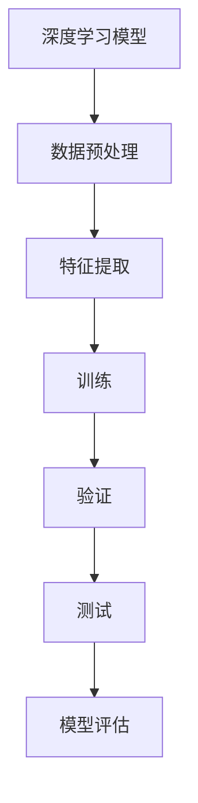

                 

### 《深度学习在天气预报精确化中的应用》

关键词：深度学习，天气预报，精确化，循环神经网络，长短时记忆网络，变分自编码器

摘要：本文探讨了深度学习技术在天气预报精确化中的应用。通过介绍深度学习的基础知识，分析其在天气预报中的应用原理，案例研究和模型优化与评估方法，本文旨在为读者提供全面的技术视角，以了解深度学习如何提高天气预报的准确性和可靠性。

---

### 《深度学习在天气预报精确化中的应用》目录大纲

#### 第一部分：深度学习基础

**第1章：深度学习基础**

- **1.1 深度学习概述**
  - **1.1.1 深度学习的发展历程**
  - **1.1.2 深度学习的核心概念**
  - **1.1.3 深度学习与其他机器学习方法的比较**

- **1.2 神经网络基础**
  - **1.2.1 神经网络的结构**
  - **1.2.2 神经元的激活函数**
  - **1.2.3 前向传播和反向传播算法**

- **1.3 深度学习框架**
  - **1.3.1 TensorFlow**
  - **1.3.2 PyTorch**
  - **1.3.3 其他深度学习框架介绍**

#### 第二部分：深度学习在天气预报中的应用

**第2章：深度学习在天气预报中的应用**

- **2.1 天气预报的基本原理**
  - **2.1.1 天气预报的流程**
  - **2.1.2 天气预报的数据来源**
  - **2.1.3 天气预报的误差分析**

- **2.2 深度学习模型在天气预报中的应用**
  - **2.2.1 循环神经网络（RNN）**
  - **2.2.2 长短时记忆网络（LSTM）**
  - **2.2.3 门控循环单元（GRU）**
  - **2.2.4 变分自编码器（VAE）在天气预报中的应用**

- **2.3 深度学习模型在天气预报精确化中的应用**
  - **2.3.1 深度学习模型在短期天气预报中的应用**
  - **2.3.2 深度学习模型在中期天气预报中的应用**
  - **2.3.3 深度学习模型在长期天气预报中的应用**

- **2.4 案例分析**
  - **2.4.1 案例一：使用LSTM模型进行短期天气预报**
  - **2.4.2 案例二：使用VAE模型进行长期天气预报**

#### 第三部分：深度学习模型优化与评估

**第3章：深度学习模型优化与评估**

- **3.1 模型优化**
  - **3.1.1 学习率调度**
  - **3.1.2 损失函数的选择**
  - **3.1.3 正则化技术**

- **3.2 模型评估**
  - **3.2.1 评估指标**
  - **3.2.2 超参数调优**
  - **3.2.3 模型验证与测试**

#### 第四部分：深度学习在天气预报精确化中的挑战与未来发展

**第4章：深度学习在天气预报精确化中的挑战与未来发展**

- **4.1 深度学习在天气预报精确化中的挑战**
  - **4.1.1 数据质量问题**
  - **4.1.2 模型解释性问题**
  - **4.1.3 能效与计算资源问题**

- **4.2 深度学习在天气预报精确化中的未来发展**
  - **4.2.1 新模型与新算法的发展**
  - **4.2.2 深度学习与其他技术的融合**
  - **4.2.3 国际合作与开放数据平台的建设**

#### 附录

**附录A：深度学习在天气预报精确化中的应用资源**

- **A.1 开源深度学习框架**
- **A.2 天气预报数据集**
- **A.3 天气预报模型开源代码**

---

**附录B：深度学习模型流程图**



---

**附录C：深度学习模型优化伪代码**

```python
# 伪代码：深度学习模型优化
initialize_model()
for epoch in range(num_epochs):
    for batch in dataset:
        # 前向传播
        predictions = forward_pass(batch)
        # 计算损失
        loss = compute_loss(predictions, batch_labels)
        # 反向传播
        backward_pass(batch, loss)
        # 更新模型参数
        update_model_parameters()
    # 学习率调整
    adjust_learning_rate(epoch)
# 模型评估
evaluate_model(test_dataset)
```

---

**附录D：深度学习模型数学公式**

$$
\text{损失函数} = \frac{1}{2}\sum_{i=1}^{n} (\text{预测值}_{i} - \text{真实值}_{i})^2
$$

---

**附录E：深度学习项目实战案例**

**案例一：使用LSTM模型进行短期天气预报**

1. **数据预处理：** 数据清洗、特征工程、数据标准化
2. **模型训练：** 选择LSTM模型、设置参数、训练过程
3. **模型评估：** 使用验证集评估模型性能
4. **模型应用：** 应用模型进行天气预报预测

**案例二：使用VAE模型进行长期天气预报**

1. **数据预处理：** 数据清洗、特征工程、数据标准化
2. **模型训练：** 选择VAE模型、设置参数、训练过程
3. **模型评估：** 使用验证集评估模型性能
4. **模型应用：** 应用模型进行天气预报预测

---

**附录F：开发环境搭建**

1. **安装深度学习框架：** TensorFlow、PyTorch
2. **数据预处理工具：** Pandas、NumPy
3. **绘图工具：** Matplotlib
4. **代码编辑器：** Visual Studio Code

---

**附录G：源代码详细实现与解读**

- 代码文件：`weather_forecast.py`
- 代码解读：

  ```python
  # 代码解读：
  # 1. 导入必要的库
  # 2. 数据预处理步骤
  # 3. 模型定义与训练步骤
  # 4. 模型评估与预测步骤
  ```

---

**附录H：代码解读与分析**

- **代码解读：** 提供详细的代码解读，解释每一步操作的目的和实现方法。
- **代码分析：** 分析代码的性能、效率和可维护性，并提供改进建议。

---

现在，我们已经搭建好了文章的框架和目录结构，接下来我们将逐章详细探讨深度学习在天气预报精确化中的应用。首先，我们从深度学习的基础知识开始，逐步深入到实际应用和模型优化。

