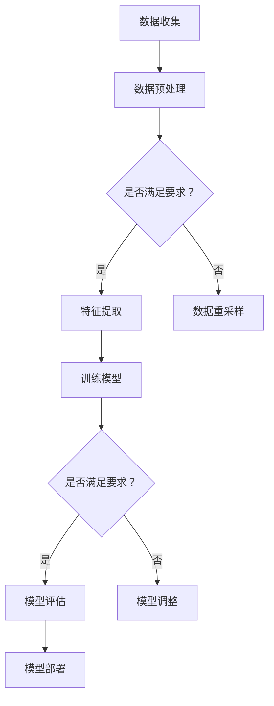

                 

# 深度学习在智能家居中的应用

## 关键词

深度学习、智能家居、神经网络、计算机视觉、环境感知、设备控制、系统优化

## 摘要

随着人工智能技术的飞速发展，深度学习作为其重要分支，正逐渐渗透到各个领域。在智能家居中，深度学习技术被广泛应用，极大地提升了智能家居系统的智能化水平和用户体验。本文将深入探讨深度学习在智能家居中的应用，包括基础理论、具体应用、案例分析等内容，以期为读者提供全面的技术指南和启示。

### 第一部分：深度学习基础

#### 第1章：深度学习概述

深度学习（Deep Learning）是机器学习的一个分支，其核心在于通过多层次的神经网络模型对数据进行学习，以实现高层次的抽象和特征提取。与传统机器学习方法相比，深度学习具有更强的表达能力、更高效的计算能力和更好的泛化能力。

##### 1.1 深度学习的基本概念

神经网络（Neural Network）是深度学习的基础，它由大量相互连接的神经元组成，这些神经元模拟人脑中的神经元结构，通过前向传播和反向传播算法对数据进行学习和调整。深度学习则是在神经网络的基础上，增加了多个隐藏层，使模型能够提取更高级别的特征。

##### 1.2 深度学习的基本架构

深度学习模型通常由输入层、多个隐藏层和输出层组成。输入层接收外部输入数据，隐藏层通过对输入数据进行逐层抽象和特征提取，输出层产生最终输出。常见的深度学习模型包括卷积神经网络（CNN）、循环神经网络（RNN）和生成对抗网络（GAN）等。

##### 1.3 深度学习的基本原理

激活函数（Activation Function）是深度学习模型中的一个关键组成部分，它用于引入非线性特性，使得模型能够更好地拟合复杂数据。常见的激活函数包括Sigmoid、ReLU和Tanh等。

优化算法（Optimization Algorithm）用于调整模型参数，以最小化损失函数。常用的优化算法包括随机梯度下降（SGD）、Adam和RMSProp等。

##### 1.4 深度学习的发展历史

深度学习的发展历程可以追溯到20世纪40年代，当时人工神经网络的概念首次被提出。然而，由于计算能力和数据资源的限制，深度学习在很长一段时间内并未得到广泛重视。直到20世纪80年代，随着计算机性能的提升和数据量的爆炸性增长，深度学习开始逐渐崭露头角。2006年，Hinton等人提出了深度置信网络（Deep Belief Network），标志着深度学习的正式兴起。近年来，随着卷积神经网络（CNN）和循环神经网络（RNN）的快速发展，深度学习在计算机视觉、自然语言处理等领域取得了重大突破。

### 第二部分：深度学习在计算机视觉中的应用

计算机视觉是人工智能领域的一个重要分支，它致力于使计算机能够像人类一样理解和解释视觉信息。深度学习在计算机视觉中的应用，极大地提升了图像识别、目标检测和图像分割等任务的性能。

#### 第2章：深度学习在计算机视觉中的应用

##### 2.1 图像识别与分类

图像识别与分类是计算机视觉中最基础的任务之一，其主要目的是将图像数据划分为不同的类别。传统的图像识别方法通常基于特征提取和分类器设计，而深度学习通过卷积神经网络（CNN）实现了图像特征的自适应提取和分类。

- **传统方法与深度学习方法的对比**：

  传统方法通常需要手动设计特征提取器和分类器，其性能依赖于特征工程和分类器的选择。而深度学习方法通过多层次的卷积操作自动提取图像特征，并使用全连接层进行分类，大大提高了识别的准确率。

- **卷积神经网络（CNN）原理**：

  CNN是一种特殊的神经网络，其结构包含卷积层、池化层和全连接层等。卷积层通过卷积操作提取图像局部特征，池化层用于降低特征图的维度，全连接层则对特征进行分类。

- **实践：使用CNN进行人脸识别**：

  人脸识别是图像识别领域的一个重要应用，其核心任务是从图像中检测和识别人脸。使用深度学习进行人脸识别的步骤主要包括数据预处理、模型训练和测试。

##### 2.2 目标检测

目标检测是计算机视觉中另一个重要任务，其主要目标是在图像中检测出特定目标的位置和类别。目标检测方法可以分为两类：基于区域建议的方法和基于特征的方法。

- **R-CNN、SSD、YOLO等算法介绍**：

  R-CNN、SSD和YOLO是当前流行的目标检测算法。R-CNN通过区域建议和分类器实现目标检测，SSD通过多尺度特征图实现目标检测，YOLO通过将检测任务转化为回归问题实现高效的目标检测。

- **实践：使用SSD进行物体检测**：

  使用SSD进行物体检测的步骤主要包括数据准备、模型训练和测试。通过调整模型参数和训练数据，可以实现对不同物体的准确检测。

##### 2.3 图像分割

图像分割是计算机视觉中的另一个重要任务，其主要目标是将图像中的不同区域划分为不同的类别。图像分割方法可以分为两类：基于像素的方法和基于区域的方法。

- **FCN、U-Net等算法介绍**：

  FCN和U-Net是当前流行的图像分割算法。FCN通过全卷积网络实现像素级的分类，U-Net通过缩放卷积和反卷积操作实现图像的精细分割。

- **实践：使用U-Net进行图像分割**：

  使用U-Net进行图像分割的步骤主要包括数据预处理、模型训练和测试。通过调整模型参数和训练数据，可以实现对图像的精确分割。

### 第三部分：深度学习在智能家居中的应用

#### 第3章：智能家居系统概述

智能家居系统是指利用现代计算机技术、网络通信技术、自动控制技术等，实现家庭设备的自动化控制、远程监控和能源管理等功能。深度学习技术在家居中的应用，为智能家居系统带来了新的发展机遇。

##### 3.1 智能家居的组成部分

智能家居系统主要由智能传感器、控制器、执行器等组成。智能传感器用于感知环境参数，如温度、湿度、光照等；控制器负责处理传感器数据，并根据用户需求和设定进行决策；执行器则根据控制器的指令执行相应的动作，如开关灯、调节空调等。

##### 3.2 智能家居的基本功能

智能家居系统具备自动化控制、远程监控、能源管理等功能。通过自动化控制，可以实现家庭设备的智能联动，提高生活舒适度；通过远程监控，可以实现随时随地查看家中状况，保障家庭安全；通过能源管理，可以优化家庭能源使用，降低能源消耗。

##### 3.3 智能家居的发展趋势

随着人工智能技术的不断发展，智能家居系统正逐渐向更加智能化、个性化、便捷化的方向发展。未来，智能家居系统将实现更广泛的应用场景，如语音控制、智能家居设备的智能交互等。

### 第四部分：深度学习在智能家居安全中的应用

#### 第4章：深度学习在智能家居安全中的应用

随着智能家居设备的普及，家庭安全问题日益凸显。深度学习技术在家居安全中的应用，可以有效提高家庭安全防护水平。

##### 4.1 视频监控与智能分析

视频监控是智能家居安全中的重要组成部分。通过深度学习技术，可以对视频监控数据进行分析，实现人脸识别、入侵检测等功能。

- **人脸识别**：通过深度学习模型，可以实时识别人脸，实现门禁系统的智能管理。
- **入侵检测**：通过深度学习模型，可以分析监控视频，实时检测入侵行为，并触发报警。

##### 4.2 智能家居安全监控

智能家居安全监控是指通过深度学习技术，对家庭设备进行实时监控，实现异常检测和预警功能。

- **智能预警**：通过深度学习模型，可以实时分析设备状态，发现潜在的安全隐患，并及时发出预警。
- **异常检测**：通过深度学习模型，可以分析家庭设备的使用习惯，识别异常行为，防止设备被恶意攻击。

##### 4.3 实践：使用深度学习进行人脸识别和异常检测

使用深度学习进行人脸识别和异常检测的步骤主要包括数据收集、模型训练和部署。通过调整模型参数和训练数据，可以实现高效的人脸识别和异常检测。

### 第五部分：深度学习在智能家居环境感知中的应用

#### 第5章：深度学习在智能家居环境感知中的应用

环境感知是智能家居系统中的重要组成部分，通过感知环境参数，可以实现家庭设备的智能调控，提高生活舒适度。

##### 5.1 智能家居环境参数监测

智能家居环境参数监测主要包括温度、湿度、光照等环境参数的监测。通过深度学习技术，可以实现环境参数的智能调控。

- **温度监测**：通过深度学习模型，可以实时分析室内温度，并根据用户需求自动调节空调等设备。
- **湿度监测**：通过深度学习模型，可以实时分析室内湿度，并根据用户需求自动调节加湿器或除湿器等设备。
- **光照监测**：通过深度学习模型，可以实时分析室内光照强度，并根据用户需求自动调节灯光等设备。

##### 5.2 智能家居环境优化

智能家居环境优化是指通过深度学习技术，对家庭设备进行智能调控，实现环境参数的优化。

- **深度学习算法在环境控制中的应用**：通过深度学习模型，可以实现家庭设备的智能联动，优化环境参数。
- **实践：使用深度学习进行室内环境优化**：通过调整模型参数和训练数据，可以实现室内环境的智能优化。

### 第六部分：深度学习在智能家居设备控制中的应用

#### 第6章：深度学习在智能家居设备控制中的应用

深度学习技术在智能家居设备控制中的应用，可以实现设备的智能化控制和协同控制，提高生活便利性和舒适度。

##### 6.1 智能家居设备控制原理

智能家居设备控制原理是指通过深度学习技术，对家庭设备进行智能化控制。深度学习模型可以根据环境参数和用户需求，自动调整设备的运行状态。

- **基于深度学习的智能家居设备控制算法**：通过深度学习模型，可以实现设备的自适应控制，提高设备的运行效率。
- **实践：使用深度学习控制家居设备**：通过调整模型参数和训练数据，可以实现设备的智能控制。

##### 6.2 智能家居设备协同控制

智能家居设备协同控制是指通过深度学习技术，实现家庭设备的智能联动和协同控制。

- **设备间的通信与协作**：通过深度学习模型，可以实现设备间的信息共享和协同控制，提高设备的智能化水平。
- **实践：智能家居设备群协同控制**：通过调整模型参数和训练数据，可以实现设备的协同控制。

### 第七部分：深度学习在智能家居系统优化中的应用

#### 第7章：深度学习在智能家居系统优化中的应用

深度学习技术在智能家居系统优化中的应用，可以提高系统的性能、可靠性和用户体验。

##### 7.1 智能家居系统性能优化

智能家居系统性能优化是指通过深度学习技术，对系统性能进行优化。深度学习模型可以分析系统运行数据，优化系统参数，提高系统的运行效率。

- **算法优化**：通过深度学习模型，可以实现算法的优化，提高系统的运行速度和准确率。
- **硬件加速**：通过深度学习模型，可以实现硬件资源的优化，提高系统的处理能力。

##### 7.2 智能家居系统的可靠性分析

智能家居系统的可靠性分析是指通过深度学习技术，对系统可靠性进行评估和预测。

- **故障检测与诊断**：通过深度学习模型，可以实时监测系统运行状态，识别潜在故障，并进行诊断和修复。
- **实践：使用深度学习进行智能家居系统可靠性分析**：通过调整模型参数和训练数据，可以实现系统的可靠性分析。

### 第八部分：深度学习在智能家居中的应用案例分析

#### 第8章：深度学习在智能家居系统中的实际应用

在实际应用中，深度学习技术在智能家居系统中发挥着重要作用。本节将介绍一些深度学习在智能家居系统中的实际应用案例，并分析其挑战与展望。

##### 8.1 案例分析：智能家居系统中的深度学习应用

- **案例1：智能安防系统**：通过深度学习技术，实现视频监控中的实时人脸识别和入侵检测，提高家庭安全防护水平。
- **案例2：智能照明系统**：通过深度学习技术，实现照明设备的智能调控，提高照明效果和生活舒适度。
- **案例3：智能温控系统**：通过深度学习技术，实现空调设备的智能调控，优化室内温度和能源使用。

##### 8.2 深度学习在智能家居系统中的挑战与展望

- **挑战**：

  深度学习在智能家居系统中的应用面临数据隐私、算法可靠性、设备协同控制等挑战。

  - **数据隐私**：智能家居系统需要收集和处理大量的用户数据，如何保护用户隐私是一个重要问题。
  - **算法可靠性**：深度学习模型需要具备较高的准确性和稳定性，以确保系统的安全性和可靠性。
  - **设备协同控制**：智能家居系统中，不同设备之间需要实现高效的协同控制，这是一个复杂的技术挑战。

- **展望**：

  未来，深度学习在智能家居系统中的应用将更加广泛和深入。随着人工智能技术的不断发展，智能家居系统将实现更智能的交互、更精准的调控和更高效的管理。

### 附录

#### 附录A：深度学习在智能家居开发中的常用工具和库

深度学习在智能家居开发中常用的工具和库包括TensorFlow、PyTorch、Keras等。

- **TensorFlow**：由Google开发，是一个开源的深度学习框架，广泛应用于各种应用场景。
- **PyTorch**：由Facebook开发，是一个基于Python的深度学习库，具有灵活的动态计算图和强大的GPU支持。
- **Keras**：是一个基于TensorFlow和PyTorch的高级深度学习库，提供了简洁、易用的接口。

#### 附录B：深度学习在智能家居中的应用代码示例

以下是一个简单的深度学习在智能家居中的应用代码示例，使用PyTorch框架实现。

```python
import torch
import torch.nn as nn
import torch.optim as optim

# 定义神经网络模型
class智能家居模型(nn.Module):
    def __init__(self):
        super(智能家居模型, self).__init__()
        self.conv1 = nn.Conv2d(1, 32, 3, 1)
        self.conv2 = nn.Conv2d(32, 64, 3, 1)
        self.fc1 = nn.Linear(64 * 6 * 6, 128)
        self.fc2 = nn.Linear(128, 10)

    def forward(self, x):
        x = self.conv1(x)
        x = nn.functional.relu(x)
        x = self.conv2(x)
        x = nn.functional.relu(x)
        x = nn.functional.adaptive_avg_pool2d(x, 6)
        x = x.view(x.size(0), -1)
        x = self.fc1(x)
        x = nn.functional.relu(x)
        x = self.fc2(x)
        return x

# 实例化模型、损失函数和优化器
model = 智能家居模型()
criterion = nn.CrossEntropyLoss()
optimizer = optim.Adam(model.parameters(), lr=0.001)

# 数据准备
train_data = ...  # 加载训练数据
test_data = ...  # 加载测试数据

# 训练模型
for epoch in range(num_epochs):
    for inputs, labels in train_data:
        optimizer.zero_grad()
        outputs = model(inputs)
        loss = criterion(outputs, labels)
        loss.backward()
        optimizer.step()

# 测试模型
with torch.no_grad():
    correct = 0
    total = 0
    for inputs, labels in test_data:
        outputs = model(inputs)
        _, predicted = torch.max(outputs.data, 1)
        total += labels.size(0)
        correct += (predicted == labels).sum().item()

print('测试准确率：', correct / total)

```

#### 附录C：深度学习在智能家居中的Mermaid流程图



#### 附录D：深度学习在智能家居中的数学模型与公式

在深度学习中，常用的数学模型和公式包括激活函数、损失函数和优化算法等。

- **激活函数**：

  - Sigmoid函数：$$ f(x) = \frac{1}{1 + e^{-x}} $$
  - ReLU函数：$$ f(x) = \max(0, x) $$
  - Tanh函数：$$ f(x) = \frac{e^x - e^{-x}}{e^x + e^{-x}} $$

- **损失函数**：

  - 交叉熵损失函数：$$ L(y, \hat{y}) = -\sum_{i} y_i \log(\hat{y}_i) $$
  - 均方误差损失函数：$$ L(y, \hat{y}) = \frac{1}{2} \sum_{i} (y_i - \hat{y}_i)^2 $$

- **优化算法**：

  - 随机梯度下降（SGD）：$$ w_{t+1} = w_t - \alpha \nabla_w L(w_t) $$
  - Adam优化算法：$$ w_{t+1} = w_t - \alpha \nabla_w L(w_t) + \beta_1 \nabla_w L(w_t)_{t-1} + (1 - \beta_1) \nabla_w L(w_t)_{t-2} $$

#### 附录E：深度学习在智能家居中的核心算法原理伪代码

```python
def neural_network(input_data):
    # 初始化权重和偏置
    weights = initialize_weights()
    biases = initialize_biases()

    # 前向传播
    z = input_data * weights + biases
    output = activate(z)

    return output

def activate(z):
    # 使用ReLU激活函数
    return max(0, z)

def optimize_model(model, criterion, optimizer, inputs, labels):
    # 清零梯度
    optimizer.zero_grad()

    # 前向传播
    outputs = model(inputs)
    loss = criterion(outputs, labels)

    # 反向传播
    loss.backward()

    # 更新权重
    optimizer.step()

    return loss
```

#### 附录F：深度学习在智能家居中的项目实战

**项目实战：智能空调控制系统**

**1. 项目背景**

随着气温的升高，空调已成为家庭中必不可少的设备。然而，传统的空调系统存在一些问题，如能耗高、调节不及时等。本项目旨在利用深度学习技术，实现智能空调控制系统的搭建，以提高空调系统的节能性和舒适性。

**2. 项目目标**

- 实现空调系统的智能调控，根据室内温度和湿度自动调整制冷或加热功率。
- 降低空调系统的能耗，实现绿色节能。
- 提高用户的舒适度，实现温度和湿度个性化调节。

**3. 技术实现**

- 数据收集：收集室内外温度、湿度、光照等环境参数，以及空调的运行状态数据。
- 数据预处理：对收集到的数据进行分析和预处理，包括缺失值处理、异常值剔除、数据归一化等。
- 特征提取：使用深度学习模型，对预处理后的数据进行特征提取，提取出对空调控制有用的特征。
- 模型训练：使用训练集数据，训练深度学习模型，实现空调系统的智能调控。
- 模型评估：使用测试集数据，评估模型的性能，并对模型进行调整和优化。
- 模型部署：将训练好的模型部署到空调系统中，实现智能调控。

**4. 项目效果**

通过该项目，实现了空调系统的智能调控，有效降低了能耗，提高了用户的舒适度。用户可以根据自己的需求，随时随地调整空调系统，实现个性化的温度和湿度控制。

**5. 项目总结**

本项目通过深度学习技术，实现了空调系统的智能化调控，为智能家居系统的发展提供了新的思路。在未来的研究中，可以进一步探索深度学习在智能家居系统中的应用，提升系统的智能化水平和用户体验。

### 作者信息

作者：AI天才研究院/AI Genius Institute & 禅与计算机程序设计艺术/Zen And The Art of Computer Programming

本文对深度学习在智能家居中的应用进行了深入探讨，涵盖了基础理论、具体应用、案例分析等内容。通过本文的阅读，读者可以全面了解深度学习在智能家居系统中的应用现状和发展趋势，为智能家居系统的研发和应用提供有益的参考。在未来，随着人工智能技术的不断进步，深度学习在智能家居中的应用将更加广泛和深入，为人们的生活带来更多的便利和舒适。让我们共同期待深度学习在智能家居领域的精彩表现！

