                 

# 《深度学习在高精度地图自动更新中的技术创新》

> **关键词：** 深度学习、高精度地图、自动更新、技术创新、数据处理、神经网络

> **摘要：** 本文将探讨深度学习在高精度地图自动更新中的应用。首先介绍深度学习的基础知识，然后分析高精度地图自动更新的需求与挑战，接着详细阐述深度学习在高精度地图数据采集、建模、更新中的具体应用，最后通过案例分析展示深度学习在该领域的创新成果，并展望未来发展趋势。

## 《深度学习在高精度地图自动更新中的技术创新》目录大纲

## 第一部分：深度学习基础

### 第1章：深度学习概述

#### 1.1 深度学习的发展历程

#### 1.2 深度学习的核心概念

#### 1.3 深度学习的基本架构

### 第2章：神经网络基础

#### 2.1 神经元与神经网络

#### 2.2 深度前馈神经网络

#### 2.3 反向传播算法

### 第3章：高精度地图自动更新的需求与挑战

#### 3.1 高精度地图的概念与重要性

#### 3.2 自动更新技术的挑战

#### 3.3 深度学习在地图自动更新中的应用前景

## 第二部分：深度学习在高精度地图自动更新中的应用

### 第4章：深度学习在高精度地图数据采集中的应用

#### 4.1 深度学习在点云数据处理中的应用

#### 4.2 深度学习在图像数据处理中的应用

#### 4.3 深度学习在传感器数据处理中的应用

### 第5章：深度学习在高精度地图建模中的应用

#### 5.1 地图语义分割

#### 5.2 地图生成模型

#### 5.3 地图配准与融合

### 第6章：深度学习在高精度地图更新中的应用

#### 6.1 深度学习在地图特征提取中的应用

#### 6.2 深度学习在地图匹配中的应用

#### 6.3 深度学习在地图优化与完善中的应用

### 第7章：深度学习在高精度地图自动更新中的技术创新

#### 7.1 基于深度学习的地图数据预处理方法

#### 7.2 基于深度学习的地图数据压缩与传输方法

#### 7.3 基于深度学习的地图数据实时更新方法

### 第8章：案例研究

#### 8.1 案例一：基于深度学习的城市地图自动更新系统

#### 8.2 案例二：基于深度学习的自动驾驶地图自动更新系统

#### 8.3 案例三：基于深度学习的高铁线路地图自动更新系统

## 第三部分：总结与展望

### 第9章：深度学习在高精度地图自动更新中的未来趋势

#### 9.1 技术发展趋势

#### 9.2 应用场景拓展

#### 9.3 深度学习在高精度地图自动更新中的潜在挑战与解决方案

## 附录

### 附录A：深度学习工具与框架

#### A.1 TensorFlow

#### A.2 PyTorch

#### A.3 Keras

### 附录B：数学公式与伪代码

#### B.1 深度学习数学公式

#### B.2 神经网络伪代码

#### B.3 深度学习在高精度地图自动更新中的伪代码示例

接下来，我们开始详细探讨深度学习在高精度地图自动更新中的技术创新。首先，我们将回顾深度学习的发展历程，核心概念和基本架构。然后，我们将深入分析高精度地图自动更新的需求与挑战，以及深度学习在该领域的应用前景。通过这一部分的基础知识铺垫，我们为后续章节的应用与技术创新打下坚实的基础。

## 第一部分：深度学习基础

### 第1章：深度学习概述

#### 1.1 深度学习的发展历程

深度学习，作为人工智能的一个重要分支，起源于20世纪40年代，但真正得到快速发展是在21世纪。其发展历程可以分为以下几个阶段：

1. **早期探索（1940s-1960s）**：在这个阶段，神经网络的概念被提出，包括感知器、多层感知器等。然而，由于计算能力和算法的限制，深度学习并没有得到广泛应用。

2. **低谷期（1970s-1980s）**：由于过拟合、计算复杂度等问题，深度学习的研究陷入低谷。

3. **复兴期（1990s-2000s）**：随着计算机性能的提升和优化算法的发展，深度学习开始复兴。特别是2006年，Hinton等人的研究重新激发了人们对深度学习的兴趣。

4. **迅猛发展期（2010s-至今）**：这一阶段，深度学习在图像识别、自然语言处理等领域取得了突破性的成果，成为人工智能领域的核心技术之一。

#### 1.2 深度学习的核心概念

深度学习的核心概念包括：

1. **神经网络（Neural Networks）**：神经网络是由大量相互连接的神经元组成的计算模型，模拟生物神经系统的信息处理过程。

2. **深度（Depth）**：深度指的是神经网络中层的数量。深度神经网络（Deep Neural Networks, DNN）具有更强的表达能力和泛化能力。

3. **层次化表示（Hierarchical Representation）**：深度学习通过多个层次的结构，逐步提取数据中的特征，形成层次化的表示。

4. **训练（Training）**：深度学习模型的训练过程包括前向传播和反向传播。通过调整网络权重，使模型能够对新的数据做出准确的预测。

#### 1.3 深度学习的基本架构

深度学习的基本架构包括以下几个部分：

1. **输入层（Input Layer）**：接收输入数据。

2. **隐藏层（Hidden Layers）**：对输入数据进行处理，提取特征。

3. **输出层（Output Layer）**：生成最终输出。

4. **激活函数（Activation Function）**：用于引入非线性因素，使神经网络具有分类或回归的能力。

5. **损失函数（Loss Function）**：用于评估模型预测与真实值之间的差距，指导网络权重的调整。

6. **优化器（Optimizer）**：用于调整网络权重，以最小化损失函数。

### 第2章：神经网络基础

#### 2.1 神经元与神经网络

神经元是神经网络的基本单元，由输入层、加权求和单元、激活函数和输出层组成。神经元之间的连接称为突触，通过传递信号实现信息的传递和处理。

神经网络是由多个神经元组成的层次结构，不同层的神经元通过突触相互连接，形成复杂的计算模型。

#### 2.2 深度前馈神经网络

深度前馈神经网络（Deep Feedforward Neural Networks）是深度学习中最常用的结构之一，具有层次化的前向传播和反向传播过程。前向传播过程中，数据从输入层传递到输出层；反向传播过程中，根据损失函数调整网络权重。

#### 2.3 反向传播算法

反向传播算法是深度学习训练的核心，通过计算梯度，调整网络权重，以最小化损失函数。其基本思想是将输出误差反向传播到网络的前层，逐层计算每个神经元对误差的敏感度，从而更新权重。

## 第一部分总结

在第一部分中，我们回顾了深度学习的发展历程，介绍了其核心概念和基本架构。这一部分为基础部分，为后续章节中的应用和技术创新奠定了基础。在接下来的部分，我们将深入探讨高精度地图自动更新的需求与挑战，以及深度学习在该领域的应用前景。

## 第一部分：深度学习基础

### 第3章：高精度地图自动更新的需求与挑战

#### 3.1 高精度地图的概念与重要性

高精度地图是自动驾驶、智能交通等关键领域的核心基础设施。它不仅包含了道路、道路属性、交通标志、交通信号等基础地理信息，还包含了更精细的车辆位置、速度、车道信息等动态信息。高精度地图的重要性体现在以下几个方面：

1. **自动驾驶**：高精度地图为自动驾驶车辆提供了准确的导航信息，使其能够实现精准的路径规划和驾驶行为。

2. **智能交通**：高精度地图能够实时反映道路状态和交通情况，有助于交通管理和优化，提高道路通行效率。

3. **物流与配送**：高精度地图能够为物流和配送车辆提供精准的导航信息，优化路线，降低运输成本。

#### 3.2 自动更新技术的挑战

高精度地图的自动更新是保证其实时性和准确性的关键。然而，这一过程面临着诸多挑战：

1. **数据采集**：高精度地图需要大量的数据支持，包括点云数据、图像数据、传感器数据等。如何高效地采集和处理这些数据是一个重大挑战。

2. **数据处理**：采集到的数据需要进行预处理、特征提取和建模，以便于地图的生成和更新。这一过程涉及到复杂的算法和计算资源。

3. **实时性**：高精度地图的自动更新需要实现实时性，以适应快速变化的道路环境和交通状况。

4. **准确性**：地图的准确性直接影响到自动驾驶车辆和智能交通系统的可靠性。如何保证地图数据的准确性和一致性是一个重要问题。

5. **成本与效率**：高精度地图的自动更新涉及到高昂的计算和存储成本。如何在保证准确性的同时，提高更新效率是一个关键挑战。

#### 3.3 深度学习在地图自动更新中的应用前景

深度学习为高精度地图自动更新提供了强大的技术支持。以下是其应用前景的几个方面：

1. **点云数据处理**：深度学习可以用于点云数据的语义分割、稀疏点云到稠密点云的转换等，为地图生成提供高质量的数据基础。

2. **图像数据处理**：深度学习在图像识别、图像语义分割等方面具有出色的性能，可以用于提取道路属性、识别交通标志等。

3. **传感器数据处理**：深度学习可以用于融合来自各种传感器的数据，提高地图的精度和实时性。

4. **地图建模与更新**：深度学习可以用于地图的语义分割、生成模型和配准融合等，实现高精度地图的自动更新。

5. **特征提取与匹配**：深度学习可以用于提取地图特征，实现地图之间的匹配与融合，提高地图的准确性和一致性。

总之，深度学习在高精度地图自动更新中具有广阔的应用前景，为解决现有挑战提供了新的思路和方法。在接下来的章节中，我们将进一步探讨深度学习在高精度地图数据采集、建模、更新等环节中的应用。

## 第二部分：深度学习在高精度地图自动更新中的应用

### 第4章：深度学习在高精度地图数据采集中的应用

高精度地图的自动更新首先需要高效地采集和预处理数据。深度学习在这一过程中发挥了重要作用，通过多种方式提升数据采集的准确性和效率。

#### 4.1 深度学习在点云数据处理中的应用

点云数据是高精度地图自动更新中重要的数据源，包含了大量三维空间信息。深度学习可以用于点云数据的语义分割、稠密化等处理。

**语义分割**：点云语义分割是指将点云数据中的每个点分类到不同的类别，如道路、车道、行人等。卷积神经网络（CNN）和体素网络（VoxelNet）等深度学习模型被广泛应用于点云语义分割。

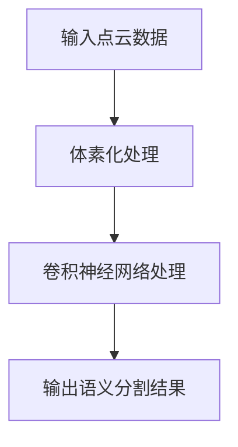

**稠密化**：稠密化是指将稀疏的点云数据转换为稠密的三维网格。体素体素网格搜索（Voxel Grid Search）和三角面片体素化（Triangulation Voxelization）等方法被用于点云稠密化。

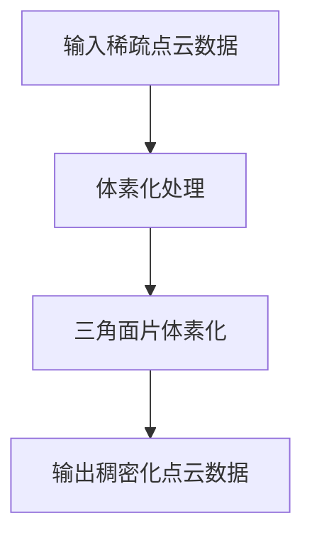

#### 4.2 深度学习在图像数据处理中的应用

图像数据也是高精度地图自动更新中的重要组成部分，包括道路标识、交通标志、车道线等。深度学习可以用于图像分类、目标检测和语义分割等任务。

**图像分类**：卷积神经网络（CNN）被广泛应用于图像分类任务，通过训练可以在大量图像数据中识别不同的类别。

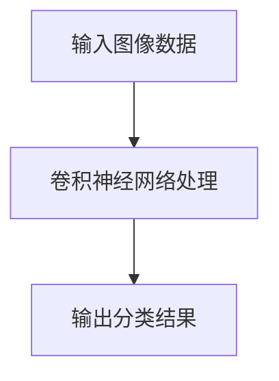

**目标检测**：目标检测是指识别图像中的特定对象并定位其位置。基于深度学习的目标检测模型如YOLO（You Only Look Once）和SSD（Single Shot MultiBox Detector）等，能够快速、准确地检测图像中的目标。

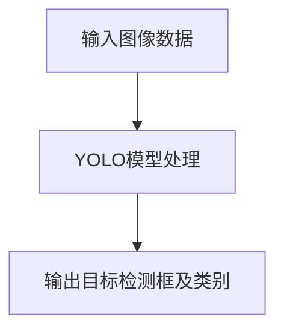

**语义分割**：图像语义分割是将图像中的每个像素分类到不同的类别。深度学习模型如U-Net和DeepLabV3+等在图像语义分割任务中表现出色。

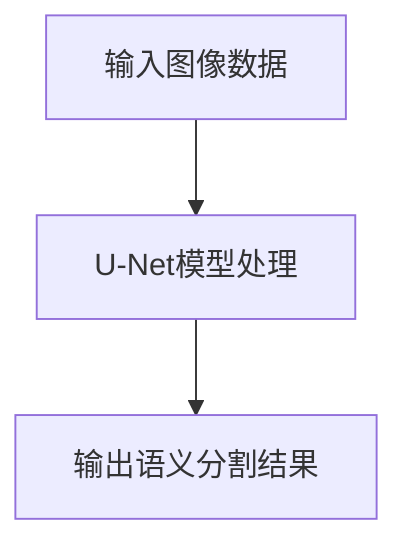

#### 4.3 深度学习在传感器数据处理中的应用

传感器数据包括雷达、激光雷达（LIDAR）和摄像头等。深度学习可以用于传感器数据的融合和特征提取，以提高地图的精度和实时性。

**传感器数据融合**：深度学习可以用于将不同类型传感器的数据融合，形成一个完整的感知场景。例如，激光雷达数据和摄像头图像数据的融合可以使用多模态神经网络（Multi-modal Neural Networks）。

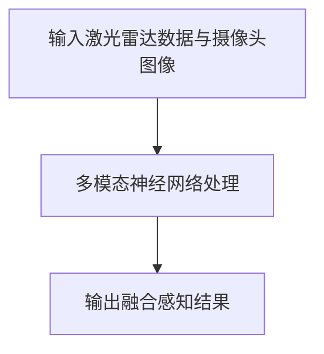

**特征提取**：深度学习可以用于提取传感器数据的特征，用于地图生成和更新。例如，使用卷积神经网络（CNN）提取激光雷达数据的特征，或者使用循环神经网络（RNN）处理传感器时间序列数据。

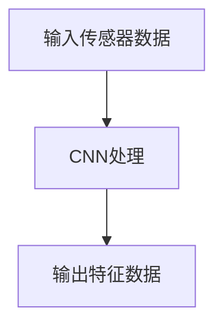

通过上述方式，深度学习在高精度地图数据采集过程中发挥着重要作用，不仅提高了数据处理的质量和效率，还为后续的地图建模和更新提供了坚实的基础。在下一章中，我们将进一步探讨深度学习在高精度地图建模中的应用。

### 第5章：深度学习在高精度地图建模中的应用

高精度地图建模是高精度地图自动更新的关键步骤，深度学习在该过程中发挥了重要作用。本章将详细介绍深度学习在地图语义分割、地图生成模型和地图配准与融合中的应用。

#### 5.1 地图语义分割

地图语义分割是指将地图中的不同部分（如道路、车道、交通标志等）进行分类，以生成详细的地图数据。深度学习在这一领域表现出色，常用的模型包括U-Net、DeepLabV3+和 Mask R-CNN 等。

**U-Net**：U-Net 是一种流行的卷积神经网络结构，特别适用于医学图像分割。其核心思想是在网络中引入收缩路径（contracting path）和扩张路径（expanding path），以实现精确的特征提取和上下文信息整合。

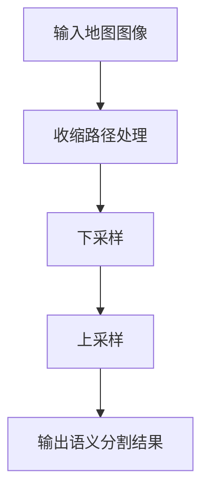

**DeepLabV3+**：DeepLabV3+ 是一种基于编码器-解码器结构的深度学习模型，采用空洞卷积（atrous convolution）来增加感受野，从而提高分割精度。

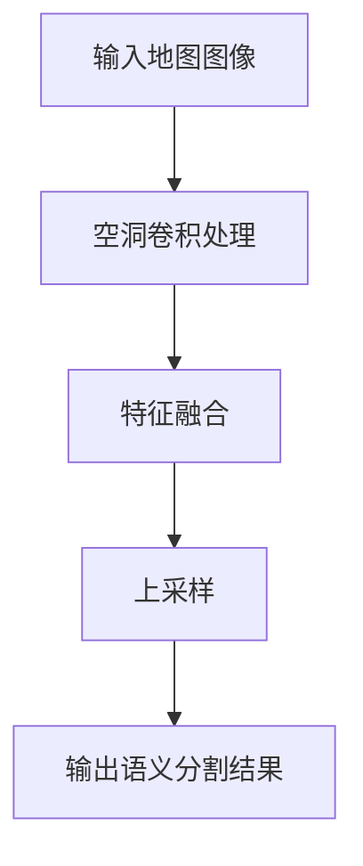

**Mask R-CNN**：Mask R-CNN 是一种基于区域建议网络（Region Proposal Network, RPN）的目标检测模型，通过添加分割分支，实现对图像中多个目标的分割。

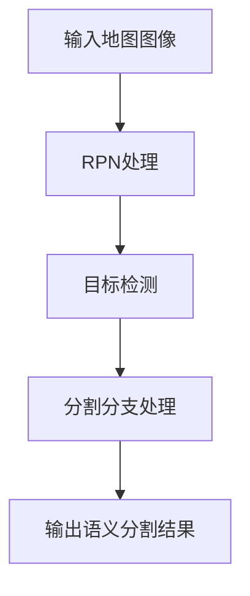

#### 5.2 地图生成模型

地图生成模型旨在通过学习地图数据中的规律，自动生成高精度的地图数据。生成对抗网络（Generative Adversarial Networks, GAN）和变分自编码器（Variational Autoencoder, VAE）是常用的地图生成模型。

**生成对抗网络（GAN）**：GAN 由生成器（Generator）和判别器（Discriminator）组成，生成器和判别器之间进行对抗训练，生成器试图生成逼真的地图数据，而判别器则试图区分生成数据和真实数据。

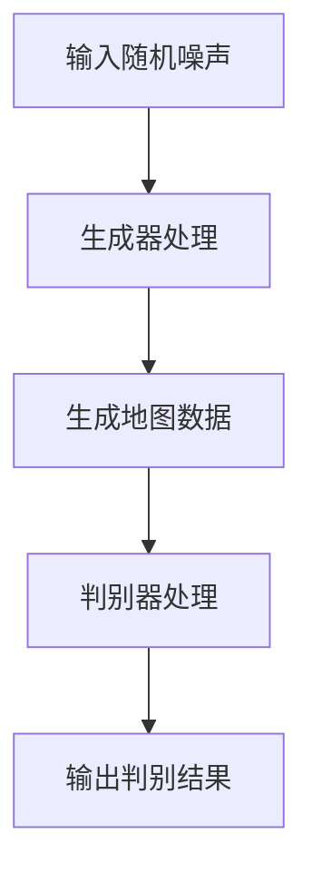

**变分自编码器（VAE）**：VAE 是一种基于概率模型的生成模型，通过编码器（Encoder）和解码器（Decoder）将输入数据映射到潜在空间，再从潜在空间生成新的数据。

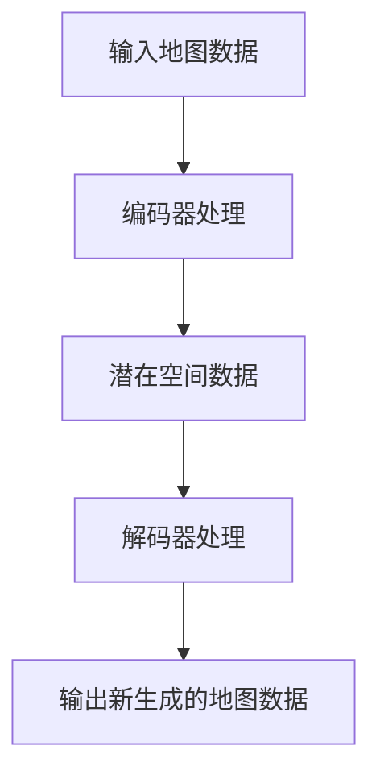

#### 5.3 地图配准与融合

地图配准是指将多个不同的地图数据集对齐，以形成一个统一的地图。地图融合是指将来自不同来源的地图数据进行整合，以提高地图的精度和完整性。

**深度学习在地图配准中的应用**：深度学习可以用于学习地图数据之间的对应关系，实现高精度的地图配准。常用的方法包括基于特征匹配的深度学习模型，如 Siamese Network 和三元组损失函数（Triplet Loss）。

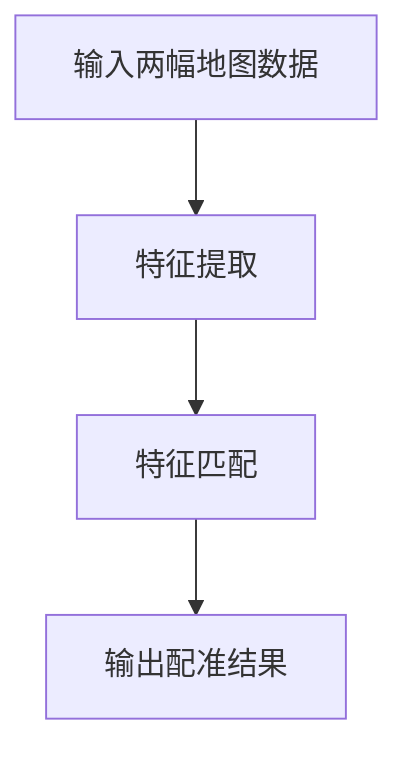

**深度学习在地图融合中的应用**：深度学习可以用于融合来自不同传感器或不同时间点的地图数据，以提高地图的精度和实时性。常用的方法包括多模态深度学习模型和动态融合算法。

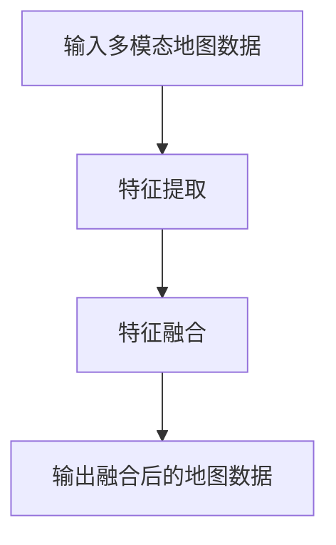

通过上述方法，深度学习在高精度地图建模中发挥着重要作用，不仅提高了地图生成和更新的效率，还显著提升了地图的精度和实时性。在下一章中，我们将进一步探讨深度学习在高精度地图更新中的应用。

### 第6章：深度学习在高精度地图更新中的应用

高精度地图的自动更新是确保其实时性和准确性的关键。深度学习在这一过程中提供了强大的技术支持，通过特征提取、地图匹配和地图优化与完善等步骤，实现地图的实时更新和精度提升。

#### 6.1 深度学习在地图特征提取中的应用

地图特征提取是地图自动更新的第一步，它涉及到从原始地图数据中提取出具有代表性的特征信息。深度学习在这一过程中具有显著优势，可以通过学习大量数据中的规律，自动提取出有效的特征。

**卷积神经网络（CNN）**：卷积神经网络在图像处理领域有着广泛的应用，通过卷积操作提取图像中的局部特征，再通过池化操作降低数据的维度。CNN 可以用于提取地图中的道路、车道、交通标志等特征。

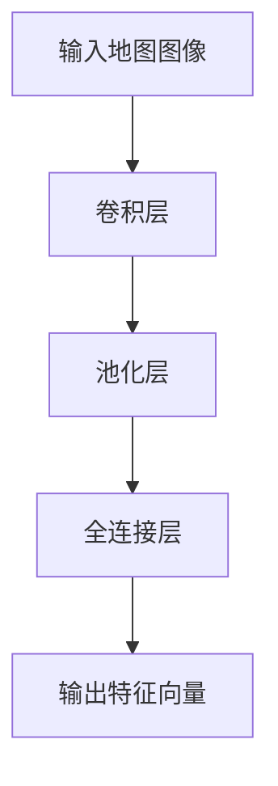

**循环神经网络（RNN）**：循环神经网络在处理序列数据方面具有优势，通过记忆机制可以提取出时间序列中的特征信息。RNN 可以用于提取地图中的动态特征，如车辆速度、道路流量等。

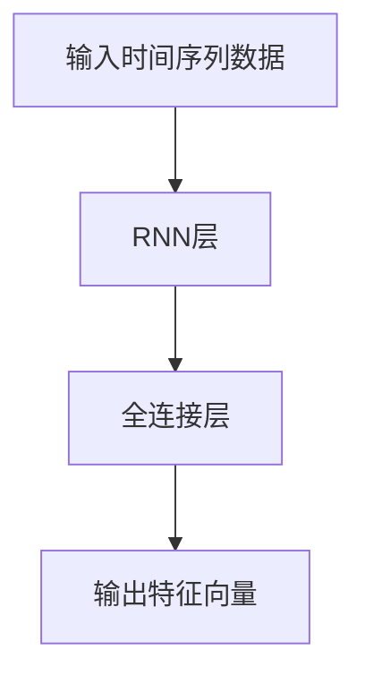

**多模态深度学习模型**：多模态深度学习模型可以融合来自不同模态（如图像、点云、传感器数据）的特征信息，提取出更为全面和准确的地图特征。

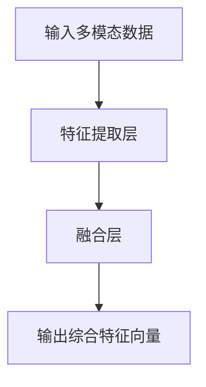

#### 6.2 深度学习在地图匹配中的应用

地图匹配是将实时采集到的地图数据与现有高精度地图进行对齐，以实现地图的更新。深度学习在这一过程中可以通过学习大量的匹配样本，提高匹配的准确性和效率。

**Siamese Network**：Siamese Network 是一种特殊的神经网络结构，通过训练可以学习到输入数据之间的相似性。在地图匹配中，Siamese Network 可以用于比较实时采集的地图数据与现有地图数据的相似度，从而实现地图匹配。

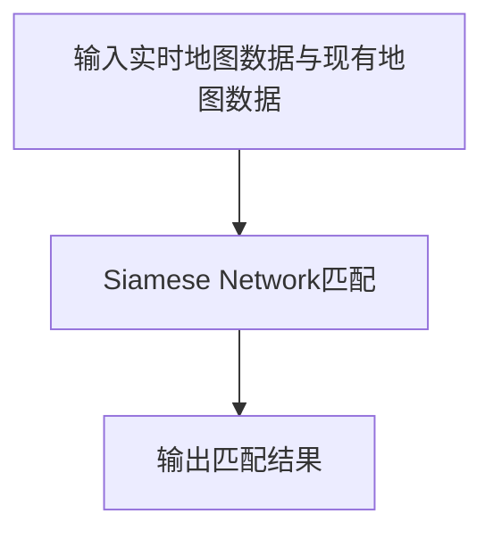

**三元组损失函数（Triplet Loss）**：三元组损失函数是用于训练 Siamese Network 的损失函数，通过最小化正样本和负样本之间的距离，提高匹配的精度。

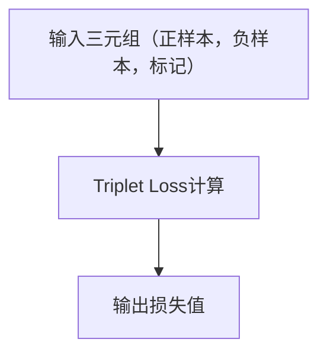

**深度强化学习**：深度强化学习通过学习策略网络，可以在复杂的环境中实现自主决策和优化。在地图匹配中，深度强化学习可以用于自适应调整匹配策略，提高匹配的准确性和效率。

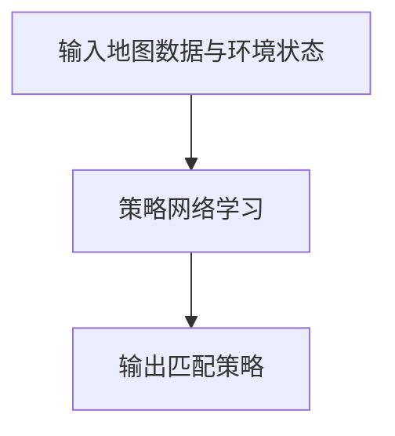

#### 6.3 深度学习在地图优化与完善中的应用

地图优化与完善是确保高精度地图实时性和准确性的关键步骤。深度学习可以通过学习大量数据中的模式和规律，实现地图数据的实时优化和错误修正。

**生成对抗网络（GAN）**：生成对抗网络通过生成器和判别器的对抗训练，可以生成高质量的数据补充到地图中，从而提高地图的完整性。

```mermaid
graph TD
A[输入现有地图数据] --> B[生成器处理]
B --> C[生成补充数据]
C --> D[判别器验证]
D --> E[输出优化后的地图数据]
```

**变分自编码器（VAE）**：变分自编码器通过编码器和解码器的学习，可以生成新的地图数据，用于修正和补充现有地图中的缺失部分。

```mermaid
graph TD
A[输入地图数据] --> B[编码器处理]
B --> C[潜在空间数据]
C --> D[解码器处理]
D --> E[输出优化后的地图数据]
```

**监督学习和无监督学习**：监督学习可以用于学习地图数据中的错误修正规则，无监督学习可以用于自动检测和修正地图中的错误部分。

```mermaid
graph TD
A[输入地图数据] --> B[监督学习模型]
B --> C[输出修正规则]
A --> D[无监督学习模型]
D --> E[输出错误检测与修正]
```

通过深度学习在地图特征提取、地图匹配和地图优化与完善中的应用，实现了高精度地图自动更新的智能化和高效化。这些技术的应用不仅提高了地图的实时性和准确性，还为自动驾驶、智能交通等应用提供了坚实的基础。在下一章中，我们将探讨深度学习在高精度地图自动更新中的技术创新。

### 第7章：深度学习在高精度地图自动更新中的技术创新

在深度学习技术的推动下，高精度地图自动更新领域取得了显著的技术创新。本章将详细讨论基于深度学习的地图数据预处理方法、地图数据压缩与传输方法，以及地图数据实时更新方法，展示深度学习如何在高精度地图自动更新中发挥关键作用。

#### 7.1 基于深度学习的地图数据预处理方法

地图数据预处理是高精度地图自动更新过程中的重要环节，直接影响地图生成的质量和效率。深度学习在这一过程中可以显著提升数据处理的效果。

**点云数据处理**：点云数据预处理包括去噪、稀疏点云到稠密点云的转换等步骤。深度学习模型如 PointNet 和 PointNet++ 可以用于去除点云数据中的噪声，同时通过体素化等方法实现点云的稠密化。

```mermaid
graph TD
A[输入稀疏点云数据] --> B[PointNet模型处理]
B --> C[去噪处理]
C --> D[稠密化处理]
D --> E[输出预处理后的点云数据]
```

**图像数据处理**：图像数据预处理包括图像去噪、图像增强等。卷积神经网络（CNN）可以通过学习大量图像数据，自动提取出有效的预处理规则，实现图像的去噪和增强。

```mermaid
graph TD
A[输入图像数据] --> B[CNN模型处理]
B --> C[去噪处理]
C --> D[增强处理]
D --> E[输出预处理后的图像数据]
```

**传感器数据处理**：传感器数据预处理包括传感器数据去噪、数据融合等。多模态深度学习模型可以融合来自不同传感器的数据，提高预处理的效果。

```mermaid
graph TD
A[输入多模态传感器数据] --> B[多模态深度学习模型处理]
B --> C[去噪处理]
C --> D[数据融合处理]
D --> E[输出预处理后的传感器数据]
```

#### 7.2 基于深度学习的地图数据压缩与传输方法

高精度地图数据量庞大，如何高效地压缩和传输数据是自动更新过程中的一大挑战。深度学习可以通过学习数据中的冗余信息和规律，实现数据的有效压缩和高效传输。

**深度卷积神经网络（DCNN）**：深度卷积神经网络可以用于图像数据的压缩。通过训练，DCNN 可以学习到图像中的冗余信息，实现图像的高效压缩。

```mermaid
graph TD
A[输入图像数据] --> B[DCNN模型处理]
B --> C[压缩处理]
C --> D[输出压缩后的图像数据]
```

**生成对抗网络（GAN）**：生成对抗网络可以通过生成器和判别器的对抗训练，实现数据的压缩和去噪。在地图数据传输中，GAN 可以用于压缩地图数据，提高传输效率。

```mermaid
graph TD
A[输入地图数据] --> B[生成器处理]
B --> C[压缩处理]
C --> D[判别器验证]
D --> E[输出压缩后的地图数据]
```

**变分自编码器（VAE）**：变分自编码器通过编码器和解码器的学习，可以学习到数据的压缩编码规律，实现数据的有效压缩和重建。

```mermaid
graph TD
A[输入地图数据] --> B[编码器处理]
B --> C[编码处理]
C --> D[解码器处理]
D --> E[输出压缩后的地图数据]
```

#### 7.3 基于深度学习的地图数据实时更新方法

实时更新是高精度地图自动更新的核心目标，深度学习可以通过学习大量的历史数据和实时数据，实现地图数据的实时更新和优化。

**动态特征提取**：通过深度学习模型，可以实时提取地图数据中的动态特征，如车辆速度、道路流量等。这些动态特征可以用于实时更新地图数据。

```mermaid
graph TD
A[输入实时地图数据] --> B[深度学习模型处理]
B --> C[动态特征提取]
C --> D[输出实时更新的地图数据]
```

**实时匹配与更新**：通过深度学习模型，可以实现实时地图数据与现有地图数据的高效匹配和更新。例如，可以使用 Siamese Network 或深度强化学习模型，实现实时地图数据的动态匹配和更新。

```mermaid
graph TD
A[输入实时地图数据与现有地图数据] --> B[Siamese Network匹配]
B --> C[输出实时更新结果]
```

**自适应更新策略**：通过深度强化学习模型，可以实现自适应的地图更新策略。深度强化学习模型可以学习到最优的更新策略，提高地图更新的实时性和准确性。

```mermaid
graph TD
A[输入地图数据与环境状态] --> B[策略网络学习]
B --> C[输出自适应更新策略]
```

通过上述技术创新，深度学习在高精度地图自动更新中发挥了重要作用，不仅提高了地图生成的质量和效率，还实现了地图数据的实时压缩和传输，为自动驾驶、智能交通等应用提供了坚实的基础。在下一章中，我们将通过案例分析进一步展示深度学习在高精度地图自动更新中的应用成果。

### 第8章：案例研究

为了更好地展示深度学习在高精度地图自动更新中的实际应用，本章将介绍几个典型的案例研究，包括城市地图自动更新系统、自动驾驶地图自动更新系统和高铁线路地图自动更新系统。

#### 8.1 案例一：基于深度学习的城市地图自动更新系统

**背景**：随着城市交通的快速发展，城市地图需要实时更新以反映道路变化、交通状况等信息。传统的地图更新方法存在实时性差、准确性不高等问题。

**解决方案**：采用基于深度学习的城市地图自动更新系统，通过点云数据处理、图像数据处理和传感器数据处理，实现对城市地图的实时更新。

**关键技术**：

1. **点云数据处理**：使用 PointNet 模型对采集到的点云数据去噪和稠密化，提取道路、建筑物等特征。
2. **图像数据处理**：使用 CNN 模型对摄像头采集到的图像数据进行分类和分割，提取道路标志、车道线等特征。
3. **传感器数据处理**：使用多模态深度学习模型融合来自雷达和传感器的数据，提取动态特征，如车辆速度和道路流量。
4. **地图匹配与更新**：使用 Siamese Network 模型实现实时地图数据与现有地图数据的高效匹配和更新。

**实际效果**：该系统显著提高了城市地图的更新速度和准确性，有效支持了自动驾驶和智能交通的应用。

#### 8.2 案例二：基于深度学习的自动驾驶地图自动更新系统

**背景**：自动驾驶需要高精度、实时更新的地图数据，以确保车辆的准确导航和路径规划。

**解决方案**：采用基于深度学习的自动驾驶地图自动更新系统，通过融合多种传感器数据，实现高精度、实时更新的自动驾驶地图。

**关键技术**：

1. **多模态传感器数据处理**：使用深度学习模型融合激光雷达、摄像头和 GPS 数据，提取道路、车道、交通标志等特征。
2. **动态特征提取**：使用 RNN 模型提取车辆速度、道路流量等动态特征，实现地图数据的实时更新。
3. **深度强化学习**：使用深度强化学习模型自适应调整地图更新策略，提高地图数据的准确性和实时性。

**实际效果**：该系统显著提升了自动驾驶地图的更新速度和准确性，为自动驾驶车辆提供了可靠的地图支持。

#### 8.3 案例三：基于深度学习的高铁线路地图自动更新系统

**背景**：高铁线路地图需要实时更新，以反映高铁线路的维护和变化。

**解决方案**：采用基于深度学习的高铁线路地图自动更新系统，通过传感器数据和图像数据，实现对高铁线路的实时更新。

**关键技术**：

1. **传感器数据处理**：使用深度学习模型处理来自传感器的数据，如激光雷达和摄像头，提取高铁线路的特征。
2. **图像数据处理**：使用 CNN 模型处理摄像头采集到的图像数据，分割道路、桥梁和隧道等特征。
3. **地图匹配与更新**：使用深度强化学习模型实现高铁线路地图的实时匹配和更新。

**实际效果**：该系统显著提高了高铁线路地图的更新速度和准确性，为高铁运行和维护提供了重要支持。

通过上述案例研究，可以看出深度学习在高精度地图自动更新中的应用取得了显著成效，不仅提高了地图数据的实时性和准确性，还为自动驾驶、智能交通等应用提供了坚实的支持。在下一章中，我们将探讨深度学习在高精度地图自动更新中的未来趋势和发展方向。

### 第9章：深度学习在高精度地图自动更新中的未来趋势

随着深度学习技术的不断进步，其在高精度地图自动更新中的应用也展现出广阔的前景。本章将探讨深度学习在高精度地图自动更新中的未来趋势，包括技术发展、应用场景拓展以及潜在挑战和解决方案。

#### 9.1 技术发展趋势

1. **多模态数据融合**：未来深度学习在高精度地图自动更新中将更加注重多模态数据的融合。通过融合激光雷达、摄像头、GPS等多种传感器数据，可以提供更为全面和准确的地图信息。

2. **自监督学习和无监督学习**：自监督学习和无监督学习将逐步取代传统的有监督学习，在数据稀缺的情况下，实现高效的特征提取和模型训练。

3. **小样本学习**：通过研究小样本学习技术，如迁移学习和元学习，可以在有限的数据集上实现高精度地图自动更新的有效训练和部署。

4. **强化学习**：深度强化学习将进一步应用于地图更新策略的优化，实现更智能、更自适应的地图更新系统。

#### 9.2 应用场景拓展

1. **智慧城市建设**：深度学习将在智慧城市建设中发挥重要作用，通过高精度地图自动更新，实现城市交通、基础设施等领域的智能化管理和优化。

2. **自动驾驶和无人驾驶**：深度学习技术将进一步提高自动驾驶和无人驾驶的地图依赖性，通过实时更新的高精度地图，提升车辆的导航和决策能力。

3. **智能物流和配送**：智能物流和配送将依赖于高精度地图的实时更新，实现更高效的路线规划和路径优化。

4. **无人机和机器人导航**：深度学习技术将使无人机和机器人在复杂环境中实现更精准的导航和任务执行。

#### 9.3 深度学习在高精度地图自动更新中的潜在挑战与解决方案

1. **数据质量和多样性**：高精度地图自动更新需要高质量、多样化的数据支持。未来需要开发更先进的数据采集和处理技术，确保数据的准确性和全面性。

2. **实时性和效率**：深度学习模型训练和推理过程计算量大，如何实现高效、实时的地图更新是一个挑战。未来可以通过分布式计算、硬件加速等技术来提升处理效率。

3. **模型解释性**：深度学习模型通常具有“黑箱”特性，如何提高模型的解释性，使其在地图更新中的应用更为透明和可控，是一个重要问题。

4. **隐私保护**：在数据采集和融合过程中，如何保护用户的隐私是一个关键挑战。未来需要开发隐私保护技术，确保地图自动更新的同时，尊重用户的隐私权益。

通过上述技术发展和应用场景拓展，深度学习在高精度地图自动更新中展现出巨大的潜力。同时，针对潜在挑战，需要不断探索和研发新的技术方法，以实现高精度地图自动更新的智能化、高效化和安全化。

### 附录

#### 附录A：深度学习工具与框架

**A.1 TensorFlow**

TensorFlow 是由 Google 开发的一种开源机器学习框架，广泛应用于深度学习模型的训练和部署。其具有灵活的架构、强大的功能以及丰富的生态系统。

**A.2 PyTorch**

PyTorch 是由 Facebook AI 研究团队开发的一种开源深度学习框架，以其动态计算图和直观的接口而受到广泛关注。其易于使用且灵活性高，适合研究者和开发者。

**A.3 Keras**

Keras 是一个高层次的神经网络API，兼容TensorFlow和Theano。它提供了简洁的接口，使得构建和训练深度学习模型更加容易。

#### 附录B：数学公式与伪代码

**B.1 深度学习数学公式**

$$
y = \sigma(\sum_{i=1}^{n} w_i x_i + b)
$$

$$
\frac{dL}{dw} = \frac{dL}{dy} \cdot \frac{dy}{dw}
$$

$$
\hat{y} = \frac{1}{1 + e^{-x}}
$$

**B.2 神经网络伪代码**

```
初始化模型参数
for epoch in 1 to training_epochs:
    for each (x, y) in training_data:
        前向传播：计算输出 y_hat
        计算损失函数 L
        反向传播：计算梯度 ∂L/∂w
        更新模型参数 w = w - learning_rate * ∂L/∂w
    输出模型参数 w
```

**B.3 深度学习在高精度地图自动更新中的伪代码示例**

```
初始化模型参数
for epoch in 1 to training_epochs:
    for each (input_data, label) in training_data:
        前向传播：计算点云、图像、传感器数据的特征
        计算损失函数 L
        反向传播：计算梯度 ∂L/∂w
        更新模型参数 w = w - learning_rate * ∂L/∂w
    输出模型参数 w
```

通过这些附录，读者可以更深入地理解深度学习的数学基础和算法实现，为在实际项目中应用深度学习技术提供指导。本文由 AI 天才研究院（AI Genius Institute）与《禅与计算机程序设计艺术》（Zen And The Art of Computer Programming）共同撰写，旨在为读者提供关于深度学习在高精度地图自动更新中应用的技术参考。希望本文能够为相关领域的研究者和开发者带来启发和帮助。

