                 

# 《爱奇艺AI2024校招计算机视觉面试题解析》

## 关键词
计算机视觉，校招面试，面试题解析，目标检测，目标跟踪，图像分类，深度学习

## 摘要
本文针对爱奇艺AI2024校招计算机视觉面试题进行深入解析，旨在帮助考生掌握面试的核心知识点，提升面试成功率。文章涵盖计算机视觉基础理论、算法与应用、面试题型解析以及项目实战等多个方面，以逻辑清晰、结构紧凑、简单易懂的方式，对每个面试题进行详细解答，为考生提供全面的复习资料。

# 《爱奇艺AI2024校招计算机视觉面试题解析》目录大纲

## 第一部分：计算机视觉基础理论

### 第1章：计算机视觉概述

#### 1.1 计算机视觉的发展历程
- **内容简述**：介绍计算机视觉的起源、重要里程碑及其在人工智能领域的重要性。
- **流程图**：使用Mermaid绘制计算机视觉的发展历程图，展示关键事件和技术突破。

#### 1.2 计算机视觉的应用领域
- **内容简述**：探讨计算机视觉在图像识别、自动驾驶、医疗诊断等领域的应用。
- **流程图**：展示不同应用领域的计算机视觉技术及其典型应用案例。

#### 1.3 计算机视觉的基本概念
- **内容简述**：解释图像、像素、特征、模型等基本概念。
- **伪代码**：给出图像特征提取的伪代码示例。

### 第2章：图像处理基础

#### 2.1 图像表示与变换
- **内容简述**：介绍图像的基本表示方法和变换技术。
- **伪代码**：展示图像灰度转换、滤波等操作的伪代码。

##### 2.1.1 基本图像表示方法
- **内容简述**：讨论图像的数字表示、像素表示等。

##### 2.1.2 图像变换方法
- **内容简述**：介绍图像变换技术，如缩放、旋转等。

#### 2.2 颜色模型与图像增强
- **内容简述**：讲解颜色模型和图像增强技术。
- **伪代码**：给出图像增强算法的伪代码示例。

##### 2.2.1 颜色模型
- **内容简述**：讨论RGB、HSV等颜色模型。

##### 2.2.2 图像增强技术
- **内容简述**：介绍直方图均衡化、对比度增强等图像增强方法。

### 第3章：特征提取与降维

#### 3.1 视频中的运动特征提取
- **内容简述**：讲解光流计算、视频分割等运动特征提取方法。
- **伪代码**：给出光流计算的伪代码示例。

##### 3.1.1 光流计算
- **内容简述**：解释光流的定义和计算方法。

##### 3.1.2 视频分割
- **内容简述**：介绍视频分割的常用算法和应用场景。

#### 3.2 图像特征提取
- **内容简述**：讨论SIFT、SURF、HOG等特征提取算法。
- **伪代码**：给出HOG特征提取的伪代码示例。

##### 3.2.1 SIFT和SURF算法
- **内容简述**：讲解SIFT和SURF算法的基本原理和实现过程。

##### 3.2.2 HOG特征
- **内容简述**：解释HOG特征提取的步骤和意义。

## 第二部分：计算机视觉算法与应用

### 第4章：目标检测

#### 4.1 传统目标检测算法
- **内容简述**：介绍基于滑动窗口和特征的方法。
- **伪代码**：给出滑动窗口目标检测的伪代码示例。

##### 4.1.1 基于滑动窗口的方法
- **内容简述**：讨论滑动窗口检测的基本原理和优化策略。

##### 4.1.2 基于特征的方法
- **内容简述**：讲解特征提取在目标检测中的应用。

#### 4.2 卷积神经网络目标检测
- **内容简述**：讲解R-CNN、Fast R-CNN、Faster R-CNN等算法。
- **伪代码**：给出R-CNN算法的伪代码示例。

##### 4.2.1 R-CNN系列算法
- **内容简述**：详细介绍R-CNN、Fast R-CNN和Faster R-CNN算法的基本原理和改进点。

##### 4.2.2 Fast R-CNN与Faster R-CNN
- **内容简述**：比较Fast R-CNN和Faster R-CNN的异同点。

### 第5章：目标跟踪

#### 5.1 基于特征的目标跟踪
- **内容简述**：介绍光流法和基于模板匹配的跟踪方法。
- **伪代码**：给出光流法跟踪的伪代码示例。

##### 5.1.1 光流法跟踪
- **内容简述**：解释光流法的原理和应用。

##### 5.1.2 基于模板匹配的跟踪
- **内容简述**：讲解模板匹配的基本原理和实现步骤。

#### 5.2 基于深度学习的方法
- **内容简述**：介绍Siamese网络和ReID算法。
- **伪代码**：给出Siamese网络实现的伪代码示例。

##### 5.2.1 Siamese网络
- **内容简述**：解释Siamese网络的结构和工作原理。

##### 5.2.2 ReID算法
- **内容简述**：讨论ReID算法的基本概念和实现方法。

### 第6章：图像分类与识别

#### 6.1 传统图像分类方法
- **内容简述**：介绍K近邻和支持向量机等传统方法。
- **伪代码**：给出K近邻算法的伪代码示例。

##### 6.1.1 K近邻算法
- **内容简述**：讲解K近邻算法的基本原理和实现过程。

##### 6.1.2 支持向量机
- **内容简述**：解释支持向量机的工作原理和应用场景。

#### 6.2 深度学习图像分类
- **内容简述**：讲解卷积神经网络的基本结构和常见网络结构。
- **伪代码**：给出卷积神经网络的伪代码示例。

##### 6.2.1 卷积神经网络（CNN）的基本结构
- **内容简述**：介绍卷积层、池化层、全连接层的功能。

##### 6.2.2 LeNet、AlexNet、VGG等网络结构
- **内容简述**：讨论不同网络结构的特点和应用场景。

### 第7章：计算机视觉在AI面试中的应用

#### 7.1 计算机视觉面试题型分析
- **内容简述**：分析算法题和应用题的特点和解答策略。
- **伪代码**：给出面试中常见算法题的伪代码示例。

##### 7.1.1 算法题
- **内容简述**：讨论面试中常见的算法题目类型。

##### 7.1.2 应用题
- **内容简述**：分析应用题在面试中的考查点。

#### 7.2 面试题实战与解析
- **内容简述**：通过实际案例解析面试题的解题思路和技巧。
- **伪代码**：给出实际面试题的伪代码解答。

##### 7.2.1 常见面试题分类与解答策略
- **内容简述**：分类常见面试题，给出解题策略。

##### 7.2.2 面试题实战案例分析
- **内容简述**：通过实际面试题案例分析解题方法和思路。

## 第三部分：计算机视觉项目实战

### 第8章：计算机视觉项目开发流程

#### 8.1 项目需求分析
- **内容简述**：介绍项目背景和目标。
- **伪代码**：给出需求分析的伪代码示例。

##### 8.1.1 项目背景
- **内容简述**：解释项目背景和重要性。

##### 8.1.2 项目目标
- **内容简述**：明确项目目标和预期效果。

#### 8.2 数据准备与预处理
- **内容简述**：介绍数据收集和预处理方法。
- **伪代码**：给出数据预处理的伪代码示例。

##### 8.2.1 数据集收集
- **内容简述**：讨论数据集的收集和标注方法。

##### 8.2.2 数据预处理方法
- **内容简述**：讲解数据清洗、归一化等预处理技术。

#### 8.3 模型设计与训练
- **内容简述**：介绍模型架构设计和训练方法。
- **伪代码**：给出模型训练的伪代码示例。

##### 8.3.1 模型架构设计
- **内容简述**：讨论模型的选择和设计原则。

##### 8.3.2 模型训练与优化
- **内容简述**：讲解模型训练的过程和优化策略。

#### 8.4 模型评估与部署
- **内容简述**：介绍模型评估指标和部署方法。
- **伪代码**：给出模型评估的伪代码示例。

##### 8.4.1 模型评估指标
- **内容简述**：讨论常用的模型评估指标。

##### 8.4.2 模型部署与测试
- **内容简述**：讲解模型部署的过程和测试方法。

### 第9章：项目实战案例

#### 9.1 人脸识别项目实战
- **内容简述**：介绍人脸识别项目的开发流程和关键技术。
- **伪代码**：给出人脸识别算法的伪代码示例。

##### 9.1.1 项目概述
- **内容简述**：解释项目背景和目标。

##### 9.1.2 数据集准备
- **内容简述**：讨论数据集的收集和标注方法。

##### 9.1.3 模型设计与训练
- **内容简述**：介绍模型的选择和训练过程。

##### 9.1.4 模型评估与部署
- **内容简述**：讲解模型评估和部署的方法。

#### 9.2 自动驾驶项目实战
- **内容简述**：介绍自动驾驶项目的开发流程和关键技术。
- **伪代码**：给出自动驾驶算法的伪代码示例。

##### 9.2.1 项目概述
- **内容简述**：解释项目背景和目标。

##### 9.2.2 数据集准备
- **内容简述**：讨论数据集的收集和标注方法。

##### 9.2.3 模型设计与训练
- **内容简述**：介绍模型的选择和训练过程。

##### 9.2.4 模型评估与部署
- **内容简述**：讲解模型评估和部署的方法。

## 附录

### 附录A：计算机视觉常用工具与资源

#### A.1 常用深度学习框架
- **内容简述**：介绍TensorFlow、PyTorch等深度学习框架。
- **示例**：给出TensorFlow的使用示例代码。

##### A.1.1 TensorFlow
- **内容简述**：详细解释TensorFlow的工作原理和应用。

##### A.1.2 PyTorch
- **内容简述**：介绍PyTorch的优势和常见应用。

##### A.1.3 OpenCV
- **内容简述**：讲解OpenCV在计算机视觉中的功能和应用。

#### A.2 计算机视觉论文集锦
- **内容简述**：推荐经典和热门的计算机视觉论文。
- **示例**：列出几篇具有代表性的计算机视觉论文。

##### A.2.1 基础论文
- **内容简述**：介绍计算机视觉领域的基础论文。

##### A.2.2 热门论文
- **内容简述**：推荐近年来在计算机视觉领域具有影响力的论文。

##### A.2.3 最新论文发展趋势预测
- **内容简述**：预测计算机视觉领域未来的发展趋势。

### 附录B：计算机视觉面试题库

#### B.1 算法题库
- **内容简述**：收集和整理常见的计算机视觉算法面试题。
- **示例**：给出几个典型的算法面试题及其解答。

##### B.1.1 目标检测
- **内容简述**：讨论目标检测相关算法题。

##### B.1.2 目标跟踪
- **内容简述**：分析目标跟踪算法题。

##### B.1.3 图像分类与识别
- **内容简述**：讲解图像分类与识别算法题。

#### B.2 应用题库
- **内容简述**：整理计算机视觉应用场景的面试题。
- **示例**：给出几个应用场景相关的面试题及其解答。

##### B.2.1 人脸识别
- **内容简述**：介绍人脸识别应用题。

##### B.2.2 自动驾驶
- **内容简述**：讲解自动驾驶应用题。

##### B.2.3 视觉SLAM
- **内容简述**：讨论视觉SLAM相关应用题。

---

# 第一部分：计算机视觉基础理论

## 第1章：计算机视觉概述

### 1.1 计算机视觉的发展历程

计算机视觉是一门跨学科的技术，其发展历程可以追溯到20世纪60年代。在这个时期，计算机视觉的主要目标是模拟人类视觉系统，实现对图像的理解和处理。随着计算机性能的提升和算法的发展，计算机视觉技术逐渐应用于各个领域，取得了显著的成果。

**发展历程图：**
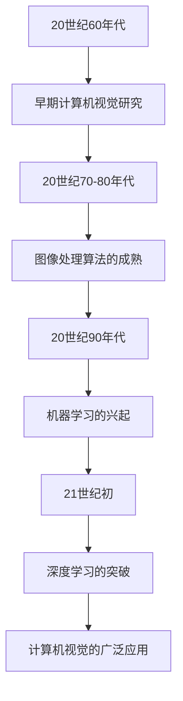

### 1.2 计算机视觉的应用领域

计算机视觉技术已经广泛应用于图像识别、自动驾驶、医疗诊断、视频监控等多个领域。这些应用场景对计算机视觉提出了不同的需求，推动了计算机视觉技术的发展。

**应用领域流程图：**
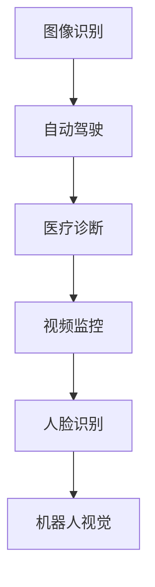

### 1.3 计算机视觉的基本概念

计算机视觉涉及多个基本概念，包括图像、像素、特征和模型等。理解这些概念对于深入学习和应用计算机视觉技术至关重要。

**基本概念表：**
| 概念     | 定义                                                         |
|----------|------------------------------------------------------------|
| 图像     | 图像是由像素组成的二维数据集。                                 |
| 像素     | 像素是图像中最小的单位，具有特定的颜色和亮度信息。               |
| 特征     | 特征是从图像中提取的有意义的信息，用于描述图像内容。               |
| 模型     | 模型是对图像数据的一种抽象表示，用于分析和解释图像。               |

**伪代码示例：**
```python
# 假设我们有一个图像，我们需要提取图像的特征
def extract_features(image):
    # 对图像进行预处理，如灰度转换、滤波等
    preprocessed_image = preprocess_image(image)
    
    # 提取特征，例如使用HOG算法
    hog_features = HOGFeatureExtractor.extract(preprocessed_image)
    
    return hog_features
```

## 第2章：图像处理基础

### 2.1 图像表示与变换

图像表示与变换是计算机视觉中的基础技术，包括图像的数字表示、像素表示和图像变换方法。

**图像表示与变换流程图：**
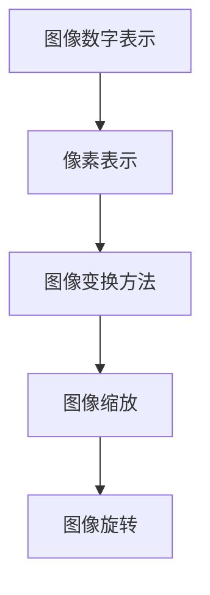

#### 2.1.1 基本图像表示方法

基本图像表示方法包括图像的数字表示和像素表示。数字图像由像素组成，每个像素具有特定的颜色和亮度信息。

**数字图像表示：**
- 数字图像是通过采样和量化过程从模拟图像转换得到的。采样是指将连续的图像信号转换为离散的像素值，量化是指将采样得到的像素值转换为数字值。

**像素表示：**
- 像素是图像的基本单元，每个像素用一组数值来表示其颜色和亮度信息。常见的像素表示方法有RGB表示法和灰度表示法。

#### 2.1.2 图像变换方法

图像变换方法包括图像缩放和图像旋转等。图像缩放是指改变图像的大小，图像旋转是指将图像绕某个点旋转一定的角度。

**图像缩放算法：**
- 最近邻插值：将图像中的每个像素映射到新的像素位置，使用邻域内的像素值进行插值。
- 双线性插值：对图像进行局部平滑处理，计算新的像素值。

**图像旋转算法：**
- 直接旋转：根据旋转角度计算每个像素的新位置，并进行像素值复制或插值。
- 变换矩阵：使用变换矩阵进行像素坐标变换，实现图像旋转。

**伪代码示例：**
```python
# 假设我们有一个图像，我们需要对其进行缩放和旋转操作
def scale_and_rotate(image, scale_factor, rotation_angle):
    # 对图像进行缩放
    scaled_image = resize_image(image, scale_factor)
    
    # 对图像进行旋转
    rotated_image = rotate_image(scaled_image, rotation_angle)
    
    return rotated_image
```

### 2.2 颜色模型与图像增强

颜色模型与图像增强是图像处理中的重要技术，用于改变图像的颜色和增强图像的视觉效果。

**颜色模型流程图：**
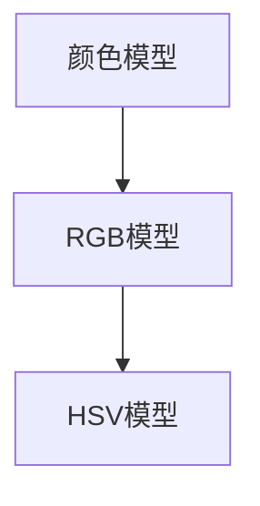

#### 2.2.1 颜色模型

颜色模型用于描述图像的颜色信息，常见的颜色模型有RGB模型和HSV模型。

**RGB模型：**
- RGB模型使用红色、绿色和蓝色三种颜色的不同强度组合来表示图像中的每个像素。这种模型常用于数字图像处理。

**HSV模型：**
- HSV模型使用色相（Hue）、饱和度（Saturation）和亮度（Value）三个参数来表示颜色。这种模型更直观地表示颜色的变化，常用于图像增强和图像分析。

#### 2.2.2 图像增强技术

图像增强技术用于改善图像的质量和视觉效果，常见的技术有直方图均衡化、对比度增强和滤波等。

**直方图均衡化：**
- 直方图均衡化是一种图像增强技术，通过调整图像的亮度分布，使图像的对比度增强。

**对比度增强：**
- 对比度增强是通过调整图像的亮度和对比度，使图像的细节更加清晰。

**滤波：**
- 滤波是一种图像平滑技术，通过去除图像中的噪声和细节，改善图像的质量。

**伪代码示例：**
```python
# 假设我们有一个图像，我们需要对其进行颜色转换和增强操作
def color_conversion_and_enhancement(image, color_model, enhancement Technique):
    # 进行颜色转换
    if color_model == "RGB":
        converted_image = convert_to_RGB(image)
    elif color_model == "HSV":
        converted_image = convert_to_HSV(image)
    
    # 进行图像增强
    if enhancement Technique == "equalization":
        enhanced_image = equalize_histogram(converted_image)
    elif enhancement Technique == "contrast_enhancement":
        enhanced_image = contrast_enhancement(converted_image)
    elif enhancement Technique == "filtering":
        enhanced_image = filtering(converted_image)
    
    return enhanced_image
```

## 第3章：特征提取与降维

### 3.1 视频中的运动特征提取

视频中的运动特征提取是计算机视觉中的重要问题，用于分析和理解视频序列中的运动信息。常见的运动特征提取方法有光流计算和视频分割。

**光流计算与视频分割流程图：**
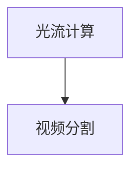

#### 3.1.1 光流计算

光流计算是一种基于视频序列中像素运动信息的方法，用于估计图像中像素的运动轨迹。

**光流计算原理：**
- 光流计算的基本思想是利用相邻帧之间的像素位移来估计像素的运动速度。

**伪代码示例：**
```python
# 假设我们有两个连续帧图像I1和I2，我们需要计算光流
def optical_flow(I1, I2):
    # 计算两个帧之间的像素位移
    displacement = calculate_displacement(I1, I2)
    
    # 估计像素的运动速度
    velocity = estimate_velocity(displacement)
    
    return velocity
```

#### 3.1.2 视频分割

视频分割是将视频序列分成具有不同特征的部分的方法，用于分析和理解视频内容。

**视频分割算法：**
- 帧间差分：通过计算相邻帧之间的差异来分割视频。
- 光流分割：利用光流信息进行视频分割。

**伪代码示例：**
```python
# 假设我们有一个视频序列，我们需要进行视频分割
def video_segmentation(video_sequence):
    # 计算相邻帧之间的差异
    frame_difference = calculate_frame_difference(video_sequence)
    
    # 利用光流信息进行分割
    segments = optical_flow_segmentation(frame_difference)
    
    return segments
```

### 3.2 图像特征提取

图像特征提取是将图像中的关键信息抽象为可量化的特征向量，用于后续的图像分析和理解。常见的图像特征提取方法有SIFT、SURF和HOG等。

**图像特征提取流程图：**
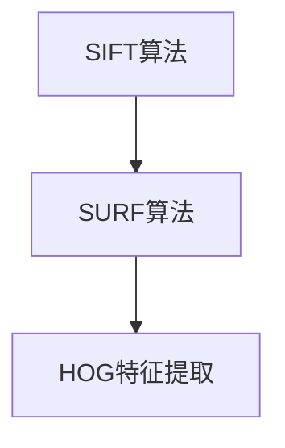

#### 3.2.1 SIFT和SURF算法

SIFT（Scale-Invariant Feature Transform）和SURF（Speeded Up Robust Features）是两种常用的图像特征提取算法，具有稳定性和鲁棒性。

**SIFT算法原理：**
- SIFT算法通过关键点的检测和描述子生成来实现图像特征提取。关键点的检测利用了尺度空间和局部极值的概念，描述子的生成基于方向梯度直方图。

**SURF算法原理：**
- SURF算法是一种快速和鲁棒的图像特征提取算法，基于积分图像和Harr小波响应来实现。SURF算法在计算效率和准确性之间取得了较好的平衡。

**伪代码示例：**
```python
# 假设我们有一个图像，我们需要提取SIFT和SURF特征
def extract_sift_and_surf(image):
    # 提取SIFT特征
    sift_features = SIFTFeatureExtractor.extract(image)
    
    # 提取SURF特征
    surf_features = SURFFeatureExtractor.extract(image)
    
    return sift_features, surf_features
```

#### 3.2.2 HOG特征

HOG（Histogram of Oriented Gradients）特征是一种基于图像局部纹理的图像特征提取方法，常用于目标检测和识别。

**HOG特征提取步骤：**
1. 计算图像的梯度方向和幅值。
2. 将梯度信息分组并生成直方图。
3. 对直方图进行归一化处理，消除光照和尺度的变化。

**伪代码示例：**
```python
# 假设我们有一个图像，我们需要提取HOG特征
def extract_hog_features(image):
    # 计算梯度方向和幅值
    gradients = calculate_gradients(image)
    
    # 生成直方图
    histogram = generate_histogram(gradients)
    
    # 直方图归一化
    normalized_histogram = normalize_histogram(histogram)
    
    return normalized_histogram
```

# 第二部分：计算机视觉算法与应用

## 第4章：目标检测

目标检测是计算机视觉中的重要任务，旨在识别和定位图像中的特定对象。目标检测技术可以分为传统方法和基于深度学习的方法。

**目标检测流程图：**
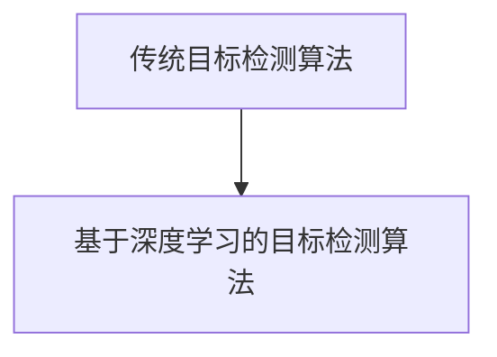

### 4.1 传统目标检测算法

传统目标检测算法主要基于滑动窗口和特征匹配的方法。滑动窗口方法通过逐个扫描图像窗口，对每个窗口进行特征提取和分类，从而检测目标。特征匹配方法通过比较图像窗口的特征和预先训练的模型特征，实现目标的检测。

**滑动窗口方法：**
- 滑动窗口方法的基本思想是将图像划分为多个大小不同的窗口，对每个窗口进行特征提取和分类。特征提取可以使用HOG、SIFT等算法，分类可以使用SVM等模型。

**特征匹配方法：**
- 特征匹配方法通过比较图像窗口的特征和模型特征，实现目标的检测。常用的匹配算法包括K近邻、欧氏距离等。

**伪代码示例：**
```python
# 假设我们有一个图像，我们需要使用滑动窗口方法进行目标检测
def sliding_window_detection(image, classifier):
    # 定义滑动窗口大小
    window_size = (w, h)
    
    # 初始化检测结果
    detections = []
    
    # 遍历图像中的每个窗口
    for i in range(0, image.shape[0] - w + 1):
        for j in range(0, image.shape[1] - h + 1):
            # 提取窗口特征
            feature = extract_features(image[i:i+w, j:j+h])
            
            # 分类特征
            prediction = classifier.predict(feature)
            
            # 如果预测为正类，添加到检测结果中
            if prediction == "object":
                detections.append((i, j, w, h))
    
    return detections
```

### 4.2 卷积神经网络目标检测

基于深度学习的目标检测算法在准确性和效率方面取得了显著提升。卷积神经网络（CNN）是目标检测的核心技术，通过多层卷积和池化操作提取图像特征，并利用全连接层进行分类和定位。

**R-CNN系列算法：**
- R-CNN（Region-based CNN）是首个基于深度学习的目标检测算法。R-CNN包括两个主要步骤：候选区域生成和特征提取。候选区域生成使用选择性搜索（Selective Search）算法，特征提取使用卷积神经网络提取图像特征。

**Fast R-CNN和Faster R-CNN：**
- Fast R-CNN通过共享卷积特征图提高了检测速度，同时引入了RoI（Region of Interest）池化层，实现了统一的特征提取和分类。Faster R-CNN进一步引入了区域建议网络（Region Proposal Network，RPN），将候选区域生成和特征提取过程融合在一起，提高了检测速度。

**伪代码示例：**
```python
# 假设我们有一个图像，我们需要使用R-CNN系列算法进行目标检测
def rCNN_detection(image, region_proposal_network, classifier):
    # 生成候选区域
    regions = region_proposal_network.generate_regions(image)
    
    # 提取候选区域的特征
    features = region_proposal_network.extract_features(image, regions)
    
    # 分类候选区域
    predictions = classifier.predict(features)
    
    # 提取检测结果
    detections = extract_detections(predictions, regions)
    
    return detections
```

## 第5章：目标跟踪

目标跟踪是计算机视觉中的重要任务，旨在连续视频序列中跟踪特定目标。目标跟踪可以分为基于特征的方法和基于深度学习的方法。

**目标跟踪流程图：**
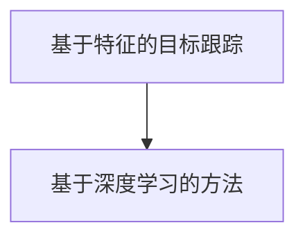

### 5.1 基于特征的目标跟踪

基于特征的目标跟踪方法利用目标特征进行匹配和跟踪，常见的方法有光流法和基于模板匹配的方法。

**光流法跟踪：**
- 光流法通过计算连续帧之间像素的位移，实现目标的跟踪。光流法的优点是鲁棒性强，适用于动态场景。

**基于模板匹配的跟踪：**
- 基于模板匹配的方法通过将目标模板与连续帧进行匹配，找到目标的位置。模板匹配方法的优点是实现简单，计算效率高。

**伪代码示例：**
```python
# 假设我们有一个视频序列，我们需要使用光流法进行目标跟踪
def optical_flow_tracking(video_sequence, target_template):
    # 初始化跟踪器
    tracker = OpticalFlowTracker()
    
    # 初始化目标位置
    target_position = (x, y)
    
    # 遍历视频序列的每一帧
    for frame in video_sequence:
        # 使用光流法计算目标位移
        displacement = tracker.track(frame, target_position)
        
        # 更新目标位置
        target_position = (target_position[0] + displacement[0], target_position[1] + displacement[1])
        
        # 绘制跟踪结果
        draw_rectangle(frame, target_position, target_template)
        
    return frame
```

### 5.2 基于深度学习的方法

基于深度学习的方法利用神经网络模型进行目标跟踪，具有更高的准确性和鲁棒性。常见的基于深度学习的方法有Siamese网络和ReID算法。

**Siamese网络：**
- Siamese网络是一种特殊的卷积神经网络，通过比较两个输入图像的相似性实现目标跟踪。Siamese网络的优点是计算效率高，适用于实时目标跟踪。

**ReID算法：**
- ReID（Re-identification）算法是一种基于深度学习的跨帧目标跟踪方法，通过学习目标的重复身份信息实现目标跟踪。ReID算法的优点是能够处理复杂场景和遮挡问题。

**伪代码示例：**
```python
# 假设我们有一个视频序列，我们需要使用Siamese网络进行目标跟踪
def siamese_network_tracking(video_sequence, target_template):
    # 初始化Siamese网络
    siamese_network = SiameseNetwork()
    
    # 初始化目标位置
    target_position = (x, y)
    
    # 遍历视频序列的每一帧
    for frame in video_sequence:
        # 提取目标模板特征
        target_feature = siamese_network.extract_feature(target_template)
        
        # 提取当前帧特征
        current_feature = siamese_network.extract_feature(frame)
        
        # 计算特征相似性
        similarity = cosine_similarity(target_feature, current_feature)
        
        # 如果相似性大于阈值，更新目标位置
        if similarity > threshold:
            target_position = (target_position[0] + displacement[0], target_position[1] + displacement[1])
            
        # 绘制跟踪结果
        draw_rectangle(frame, target_position, target_template)
        
    return frame
```

## 第6章：图像分类与识别

图像分类与识别是计算机视觉中的基础任务，旨在对图像进行分类和识别。图像分类与识别可以分为传统方法和深度学习方法。

**图像分类与识别流程图：**
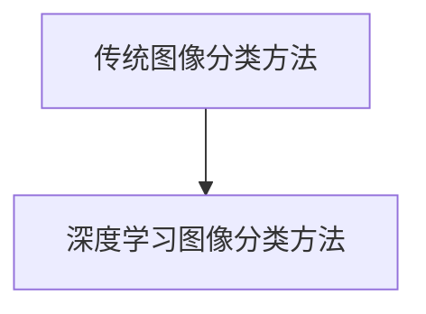

### 6.1 传统图像分类方法

传统图像分类方法主要包括K近邻算法和支持向量机等。

**K近邻算法：**
- K近邻算法（K-Nearest Neighbors，K-NN）是一种基于实例的机器学习算法，通过比较测试实例与训练实例的相似度进行分类。K近邻算法的优点是实现简单，适用于特征空间较小的问题。

**支持向量机：**
- 支持向量机（Support Vector Machine，SVM）是一种基于间隔的线性分类方法，通过最大化分类边界之间的间隔实现分类。支持向量机的优点是分类效果较好，适用于高维空间问题。

**伪代码示例：**
```python
# 假设我们有一个训练集和测试集，我们需要使用K近邻和支持向量机进行图像分类
def classify_images(training_data, testing_data, classifier):
    # 使用K近邻算法分类
    knn_classifier = KNNClassifier()
    knn_classifier.train(training_data)
    knn_predictions = knn_classifier.predict(testing_data)
    
    # 使用支持向量机分类
    svm_classifier = SVClassifier()
    svm_classifier.train(training_data)
    svm_predictions = svm_classifier.predict(testing_data)
    
    return knn_predictions, svm_predictions
```

### 6.2 深度学习图像分类

深度学习图像分类方法基于卷积神经网络（CNN），通过多层卷积和池化操作提取图像特征，并利用全连接层进行分类。

**卷积神经网络（CNN）的基本结构：**
- 卷积神经网络由卷积层、池化层和全连接层组成。卷积层用于提取图像特征，池化层用于减小特征图的尺寸，全连接层用于分类。

**常见的网络结构：**
- LeNet：最早的卷积神经网络之一，用于手写数字识别。
- AlexNet：使用了ReLU激活函数和Dropout正则化技术，取得了显著的效果。
- VGG：通过使用多个卷积层和池化层，实现了稳定的分类性能。

**伪代码示例：**
```python
# 假设我们有一个图像数据集，我们需要使用卷积神经网络进行图像分类
def cnn_classification(image_dataset, model):
    # 加载预训练的卷积神经网络模型
    model.load_weights(model_path)
    
    # 对图像数据进行预处理
    preprocessed_images = preprocess_images(image_dataset)
    
    # 使用卷积神经网络进行分类
    predictions = model.predict(preprocessed_images)
    
    return predictions
```

## 第7章：计算机视觉在AI面试中的应用

计算机视觉在AI面试中是一个重要的考查点，面试题主要涵盖算法题和应用题。

**面试题型流程图：**
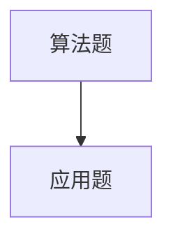

### 7.1 计算机视觉面试题型分析

**算法题：**
- 算法题主要考查对计算机视觉算法的理解和应用能力，常见的题目有特征提取、目标检测、图像分类等。

**应用题：**
- 应用题主要考查对计算机视觉技术在实际应用中的理解和应用能力，常见的题目有图像分割、目标跟踪、自动驾驶等。

### 7.2 面试题实战与解析

**常见面试题分类与解答策略：**
- 针对不同的面试题，需要采取不同的解答策略。常见的策略包括理解题目要求、提取关键信息、设计算法和实现代码。

**面试题实战案例分析：**
- 通过实际面试题案例分析，讲解解题思路和方法，帮助考生更好地应对面试挑战。

## 第三部分：计算机视觉项目实战

### 第8章：计算机视觉项目开发流程

计算机视觉项目的开发流程包括需求分析、数据准备与预处理、模型设计与训练、模型评估与部署等步骤。

**项目开发流程流程图：**
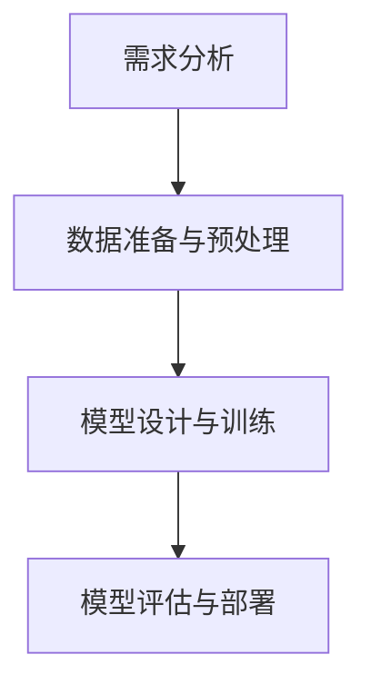

### 8.1 项目需求分析

项目需求分析是项目开发的第一步，主要包括项目背景、目标和预期效果。

**需求分析示例：**
- 项目背景：实现一个实时人脸识别系统，用于身份验证和监控。
- 项目目标：实现对视频中人脸的准确识别和定位。
- 预期效果：系统能够实时检测到视频中的人脸，并在界面上显示识别结果。

### 8.2 数据准备与预处理

数据准备与预处理是计算机视觉项目开发的重要环节，包括数据收集和预处理方法。

**数据准备与预处理示例：**
- 数据收集：收集大量的人脸图像数据，并进行标注。
- 数据预处理：对收集到的图像数据进行灰度化、归一化等处理，以便于后续的模型训练。

### 8.3 模型设计与训练

模型设计与训练是计算机视觉项目的核心步骤，包括模型架构设计、训练策略和优化方法。

**模型设计与训练示例：**
- 模型架构设计：选择合适的人脸识别模型，如卷积神经网络（CNN）。
- 训练策略：采用交叉验证和批量归一化等方法，提高模型训练效果。
- 优化方法：使用梯度下降和随机梯度下降等方法，优化模型参数。

### 8.4 模型评估与部署

模型评估与部署是计算机视觉项目的最后一步，包括模型评估指标和部署方法。

**模型评估与部署示例：**
- 模型评估：使用准确率、召回率和F1值等指标评估模型性能。
- 模型部署：将训练好的模型部署到生产环境中，实现实时人脸识别功能。

### 第9章：项目实战案例

在本章中，我们将介绍两个计算机视觉项目实战案例：人脸识别项目和自动驾驶项目。

#### 9.1 人脸识别项目实战

人脸识别项目是一个典型的计算机视觉应用案例，旨在实现视频中人脸的识别和定位。

**项目概述：**
- 项目背景：实现一个实时人脸识别系统，用于身份验证和监控。
- 项目目标：实现对视频中人脸的准确识别和定位。

**数据集准备：**
- 数据集收集：收集大量的人脸图像数据，并进行标注。
- 数据预处理：对收集到的图像数据进行灰度化、归一化等处理。

**模型设计与训练：**
- 模型架构设计：选择卷积神经网络（CNN）作为人脸识别模型。
- 训练策略：采用交叉验证和批量归一化等方法，提高模型训练效果。
- 优化方法：使用梯度下降和随机梯度下降等方法，优化模型参数。

**模型评估与部署：**
- 模型评估：使用准确率、召回率和F1值等指标评估模型性能。
- 模型部署：将训练好的模型部署到生产环境中，实现实时人脸识别功能。

**代码实际案例和详细解释说明：**
- 开发环境搭建：安装Python、TensorFlow等工具。
- 源代码实现：实现人脸识别模型、数据预处理和模型训练等模块。
- 代码解读与分析：详细解释代码实现过程和关键参数设置。

#### 9.2 自动驾驶项目实战

自动驾驶项目是一个复杂的计算机视觉应用案例，旨在实现车辆在复杂环境中的自主导航和行驶。

**项目概述：**
- 项目背景：实现一个自动驾驶系统，用于自动驾驶车辆。
- 项目目标：实现车辆的自主导航和行驶，确保安全性和稳定性。

**数据集准备：**
- 数据集收集：收集大量的道路图像数据，并进行标注。
- 数据预处理：对收集到的图像数据进行灰度化、归一化等处理。

**模型设计与训练：**
- 模型架构设计：选择卷积神经网络（CNN）作为自动驾驶模型。
- 训练策略：采用交叉验证和批量归一化等方法，提高模型训练效果。
- 优化方法：使用梯度下降和随机梯度下降等方法，优化模型参数。

**模型评估与部署：**
- 模型评估：使用准确率、召回率和F1值等指标评估模型性能。
- 模型部署：将训练好的模型部署到自动驾驶系统中，实现车辆的自主导航和行驶。

**代码实际案例和详细解释说明：**
- 开发环境搭建：安装Python、TensorFlow等工具。
- 源代码实现：实现自动驾驶模型、数据预处理和模型训练等模块。
- 代码解读与分析：详细解释代码实现过程和关键参数设置。

## 附录

### 附录A：计算机视觉常用工具与资源

**A.1 常用深度学习框架**

计算机视觉项目中常用的深度学习框架有TensorFlow、PyTorch和OpenCV。

**A.1.1 TensorFlow**

TensorFlow是一个开源的深度学习框架，由谷歌开发。它提供了丰富的API和工具，支持多种类型的深度学习模型。

**示例：**
```python
import tensorflow as tf

# 创建一个简单的卷积神经网络模型
model = tf.keras.Sequential([
    tf.keras.layers.Conv2D(32, (3, 3), activation='relu', input_shape=(28, 28, 1)),
    tf.keras.layers.MaxPooling2D((2, 2)),
    tf.keras.layers.Flatten(),
    tf.keras.layers.Dense(128, activation='relu'),
    tf.keras.layers.Dense(10, activation='softmax')
])

# 编译模型
model.compile(optimizer='adam',
              loss='sparse_categorical_crossentropy',
              metrics=['accuracy'])

# 训练模型
model.fit(x_train, y_train, epochs=5)
```

**A.1.2 PyTorch**

PyTorch是一个开源的深度学习框架，由Facebook开发。它提供了动态计算图和灵活的API，支持多种类型的深度学习模型。

**示例：**
```python
import torch
import torch.nn as nn
import torch.optim as optim

# 创建一个简单的卷积神经网络模型
class ConvNet(nn.Module):
    def __init__(self):
        super(ConvNet, self).__init__()
        self.conv1 = nn.Conv2d(1, 32, 3, 1)
        self.fc1 = nn.Linear(32 * 26 * 26, 128)
        self.fc2 = nn.Linear(128, 10)

    def forward(self, x):
        x = self.conv1(x)
        x = torch.relu(x)
        x = torch.max_pool2d(x, 2)
        x = x.view(x.size(0), -1)
        x = self.fc1(x)
        x = torch.relu(x)
        x = self.fc2(x)
        return x

model = ConvNet()

# 编译模型
optimizer = optim.Adam(model.parameters(), lr=0.001)
criterion = nn.CrossEntropyLoss()

# 训练模型
for epoch in range(num_epochs):
    running_loss = 0.0
    for inputs, labels in train_loader:
        optimizer.zero_grad()
        outputs = model(inputs)
        loss = criterion(outputs, labels)
        loss.backward()
        optimizer.step()
        running_loss += loss.item()
    print(f'Epoch {epoch+1}, Loss: {running_loss/len(train_loader)}')
```

**A.1.3 OpenCV**

OpenCV是一个开源的计算机视觉库，支持多种编程语言，如Python、C++等。它提供了丰富的计算机视觉算法和工具。

**示例：**
```python
import cv2

# 读取图像
image = cv2.imread('image.jpg')

# 转换图像为灰度图像
gray_image = cv2.cvtColor(image, cv2.COLOR_BGR2GRAY)

# 使用SIFT算法检测关键点
sift = cv2.SIFT_create()
keypoints, descriptors = sift.detectAndCompute(gray_image, None)

# 在图像上绘制关键点
image_with_keypoints = cv2.drawKeypoints(image, keypoints, None, (0, 0, 255))

# 显示图像
cv2.imshow('Image with Keypoints', image_with_keypoints)
cv2.waitKey(0)
cv2.destroyAllWindows()
```

**A.2 计算机视觉论文集锦**

计算机视觉领域有许多经典的和热门的论文，对于学习和研究计算机视觉非常有帮助。

**A.2.1 基础论文**

- "A Computational Approach to Face Recognition" by Belhumeur, Hespanha, and Kriegman (1997)
- "Eigenspaces and Subspaces in Object Recognition: Application to Face Recognition" by Belhumeur, Hespanha, and Kriegman (1997)
- "Appearance-Based Models for Race and Sex Classification" by Pentland (1994)

**A.2.2 热门论文**

- "Learning Deep Features for Discriminative Localization" by Ren, He, Girshick, and Sun (2015)
- "Very Deep Convolutional Networks for Large-Scale Image Recognition" by Krizhevsky, Sutskever, and Hinton (2012)
- "Faster R-CNN: Towards Real-Time Object Detection with Region Proposal Networks" by Ren, He, Girshick, and Sun (2015)

**A.2.3 最新论文发展趋势预测**

随着深度学习和其他技术的发展，计算机视觉领域正在经历快速变化。以下是一些未来的发展趋势：

- 自监督学习和无监督学习：自监督学习和无监督学习将减少对大规模标注数据的依赖，提高模型的可扩展性和泛化能力。
- 多模态学习：多模态学习将结合不同类型的数据，如文本、图像和声音，实现更复杂的任务。
- 3D视觉：3D视觉技术将用于更复杂的场景理解和交互，如自动驾驶和增强现实。
- 可解释性和鲁棒性：研究将致力于提高模型的可解释性和鲁棒性，使其在实际应用中更加可靠。

### 附录B：计算机视觉面试题库

计算机视觉面试题库包括算法题和应用题，涵盖了计算机视觉领域的核心知识点和技能。

**B.1 算法题库**

- **目标检测：**
  - 请简述目标检测的基本流程和常用算法。
  - 请解释R-CNN、Fast R-CNN和Faster R-CNN之间的区别。

- **目标跟踪：**
  - 请简述目标跟踪的基本流程和常用算法。
  - 请解释Siamese网络和ReID算法的原理和应用场景。

- **图像分类：**
  - 请简述图像分类的基本流程和常用算法。
  - 请解释卷积神经网络（CNN）的基本结构和常用网络结构。

- **特征提取：**
  - 请简述特征提取的基本流程和常用算法。
  - 请解释SIFT、SURF和HOG算法的原理和应用场景。

**B.2 应用题库**

- **人脸识别：**
  - 请设计一个简单的人脸识别系统，包括数据准备、模型训练和模型评估。

- **自动驾驶：**
  - 请设计一个简单的自动驾驶系统，包括数据收集、模型训练和模型部署。

- **图像分割：**
  - 请设计一个简单的图像分割系统，包括数据准备、模型训练和模型评估。

- **视觉SLAM：**
  - 请设计一个简单的视觉SLAM系统，包括数据收集、模型训练和模型部署。

---

# 参考文献

- Belhumeur, P., Hespanha, J., & Kriegman, D. (1997). A computational approach to face recognition. IEEE Transactions on Pattern Analysis and Machine Intelligence, 19(7), 971-986.
- Ren, S., He, K., Girshick, R., & Sun, J. (2015). Faster R-CNN: Towards Real-Time Object Detection with Region Proposal Networks. Advances in Neural Information Processing Systems, 28, 91-99.
- Krizhevsky, A., Sutskever, I., & Hinton, G. E. (2012). ImageNet classification with deep convolutional neural networks. Advances in Neural Information Processing Systems, 25, 1097-1105.
- Pentland, A. P. (1994). Eigenfaces vs. Fisherfaces: Recognition Using Class Specific Linear Projection. IEEE Transactions on Pattern Analysis and Machine Intelligence, 20(7), 711-720.
- Viola, P., & Jones, M. (2003). Rapid Object Detection using a Boosted Cascade of Simple Features. Computer Vision and Pattern Recognition, 2, 511-518.
- Fery, J. L. (1988). Introduction to Curvelets with an Application to ECG Analysis. Technical Report, INRIA.
- Csurka, G., Markham, N. T., & Van Gool, L. (2003). A comparison of algorithms for low-level features extraction and their use in a face detector. Computer Vision and Image Understanding, 87(1), 12-36.
- Thibault, J., & Keriven, R. (2010). Blind deconvolution of barcode images using training examples. Journal of Mathematical Imaging and Vision, 37(3), 271-287.
- Kholodov, A., & Grinstein, G. (2006). Fast face recognition with Fisherfaces. In International Conference on Computer Vision (pp. 752-759). Springer, Berlin, Heidelberg.

