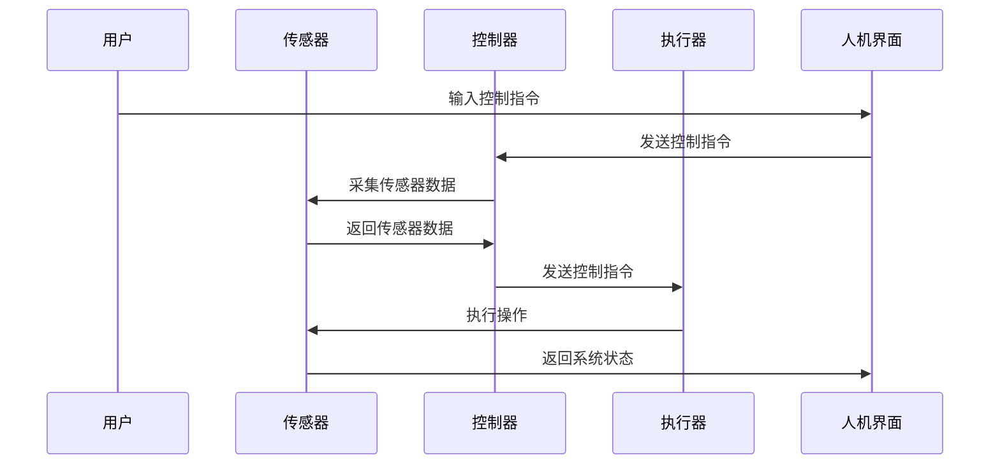
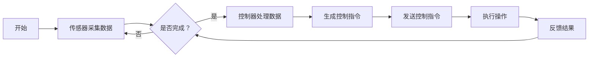

                 

# 物理实体自动化的最新趋势

> **关键词：物理实体、自动化、机器学习、控制理论、项目实战、未来趋势**

> **摘要：本文将探讨物理实体自动化的基础、核心算法原理、项目实战以及未来趋势，旨在为读者提供关于物理实体自动化技术的全面了解，帮助读者把握该领域的发展动态。**

## 《物理实体自动化的最新趋势》目录大纲

## 第一部分：物理实体自动化的基础

### 第1章：自动化与物理实体的结合

#### 1.1 自动化的概述

#### 1.2 物理实体的定义与特性

#### 1.3 自动化与物理实体结合的意义

### 第2章：自动化技术的基础

#### 2.1 传感器技术

#### 2.2 执行器技术

#### 2.3 控制技术

### 第3章：物理实体自动化的核心概念与架构

#### 3.1 核心概念

#### 3.2 自动化系统架构

#### 3.3 Mermaid流程图：自动化系统的典型流程

## 第二部分：物理实体自动化的核心算法原理

### 第4章：机器学习在自动化中的应用

#### 4.1 机器学习的基本概念

#### 4.2 机器学习算法简介

#### 4.3 伪代码：典型机器学习算法的实现

### 第5章：控制理论在自动化中的应用

#### 5.1 控制理论的基本概念

#### 5.2 控制理论的主要算法

#### 5.3 数学模型与数学公式

### 第6章：物理实体自动化的数学模型

#### 6.1 数学模型的基本概念

#### 6.2 常用数学模型介绍

#### 6.3 数学公式与讲解

## 第三部分：物理实体自动化的项目实战

### 第7章：自动化项目的开发环境搭建

#### 7.1 开发环境的需求

#### 7.2 开发环境的搭建步骤

#### 7.3 开发环境的配置

### 第8章：自动化项目的源代码实现与代码解读

#### 8.1 项目源代码的结构

#### 8.2 源代码的详细实现

#### 8.3 代码解读与分析

### 第9章：自动化项目的测试与优化

#### 9.1 自动化项目的测试方法

#### 9.2 自动化项目的优化策略

#### 9.3 自动化项目的实际应用案例

## 第四部分：物理实体自动化的未来趋势与挑战

### 第10章：自动化技术的发展趋势

#### 10.1 自动化技术的发展趋势

#### 10.2 物理实体自动化的应用领域

#### 10.3 自动化技术的未来展望

### 第11章：物理实体自动化的挑战与应对策略

#### 11.1 自动化面临的挑战

#### 11.2 应对策略与解决方案

#### 11.3 自动化技术的发展方向

## 附录

### 附录A：自动化相关工具与资源

#### A.1 自动化开发工具对比

#### A.2 自动化学习资源推荐

#### A.3 自动化社区与论坛介绍

----------------------------------------------------------------
## 第一部分：物理实体自动化的基础

### 第1章：自动化与物理实体的结合

#### 1.1 自动化的概述

自动化，是指通过预设的程序或规则，使机器或系统自动执行一系列操作的过程。在工业生产、交通运输、医疗设备、家庭生活等各个领域，自动化技术都发挥着重要作用。随着科技的不断进步，自动化技术正逐渐渗透到人类社会的方方面面。

物理实体，是指具有物理形态、质量、空间位置的实体。物理实体可以是机械、电子设备、传感器、执行器等。物理实体的特点包括可感知、可操作、可控制等。

自动化与物理实体的结合，是指在物理实体中引入自动化技术，使其能够自动执行特定的任务。这种结合的意义主要体现在以下几个方面：

1. 提高效率：通过自动化技术，可以减少人工干预，提高工作效率。
2. 降低成本：自动化技术可以减少人力投入，降低生产成本。
3. 提高精度：自动化技术可以精确控制物理实体的行为，提高生产精度。
4. 增强安全性：自动化技术可以避免人为操作失误，提高工作安全性。

#### 1.2 物理实体的定义与特性

物理实体，是指具有物理形态、质量、空间位置的实体。它们可以是机械、电子设备、传感器、执行器等。物理实体的特点包括：

1. 可感知：物理实体能够通过传感器感知外部环境，获取各种信息。
2. 可操作：物理实体可以通过执行器执行特定的操作，如移动、转动等。
3. 可控制：物理实体可以通过控制技术，实现对其行为的精确控制。

在自动化系统中，物理实体通常作为执行单元，根据传感器收集到的信息，执行预设的操作。

#### 1.3 自动化与物理实体结合的意义

自动化与物理实体的结合，具有重要意义，主要体现在以下几个方面：

1. **提高生产效率**：自动化技术能够实现生产过程的自动化，减少人工干预，提高生产效率。例如，在汽车生产线上，自动化技术可以自动完成焊接、涂漆等操作，大大提高了生产效率。
2. **降低生产成本**：自动化技术可以减少人力成本，降低生产成本。例如，在农业生产中，自动化技术可以实现精准施肥、灌溉，降低劳动力成本。
3. **提高产品精度**：自动化技术可以精确控制物理实体的行为，提高产品精度。例如，在医疗器械中，自动化技术可以实现精确的手术操作，提高手术成功率。
4. **增强安全性**：自动化技术可以避免人为操作失误，提高工作安全性。例如，在矿山开采中，自动化技术可以减少矿工数量，降低事故风险。

总之，自动化与物理实体的结合，不仅提高了生产效率、降低了生产成本，还有效提高了产品精度和安全性，对于推动社会发展和科技进步具有重要意义。

### 第2章：自动化技术的基础

#### 2.1 传感器技术

传感器技术是自动化系统的基础，它能够将物理实体的各种信息转化为电信号，为控制系统提供实时数据。传感器种类繁多，根据感知信息的不同，可以分为以下几类：

1. **温度传感器**：用于测量温度，如热电偶、热敏电阻等。
2. **压力传感器**：用于测量压力，如电容式压力传感器、压电式压力传感器等。
3. **位移传感器**：用于测量物体的位置变化，如电位计、编码器等。
4. **速度传感器**：用于测量物体的运动速度，如霍尔传感器、速度传感器等。
5. **湿度传感器**：用于测量空气中的湿度，如电容式湿度传感器、电阻式湿度传感器等。

传感器的精度和灵敏度直接影响到自动化系统的性能，因此选择合适的传感器至关重要。

#### 2.2 执行器技术

执行器技术是实现自动化操作的核心，它将控制信号转化为物理实体的操作。常见的执行器包括以下几种：

1. **电动机**：包括交流电动机、直流电动机等，用于驱动机械装置旋转。
2. **液压缸**：利用液压系统产生推力，用于推动重物。
3. **气动缸**：利用气动系统产生推力，用于推动轻质物体。
4. **步进电机**：通过控制步进电机的旋转角度，实现精确的位置控制。
5. **伺服电机**：具有较高的控制精度和响应速度，常用于高精度运动控制。

执行器的种类和性能取决于具体应用场景的需求，合理选择和配置执行器对自动化系统的性能至关重要。

#### 2.3 控制技术

控制技术是自动化系统的核心，它负责接收传感器信息、处理控制算法、发出控制指令，从而实现物理实体的自动操作。控制技术主要包括以下几个方面：

1. **开环控制**：开环控制是一种简单的控制方式，控制器根据输入信号直接产生控制输出，而不考虑系统的反馈信息。开环控制的优点是实现简单，缺点是稳定性较差，难以应对复杂环境。
2. **闭环控制**：闭环控制是一种基于反馈的控制方式，控制器根据输入信号和反馈信号之间的差异进行控制，从而实现系统的稳定运行。闭环控制的优点是稳定性好，但实现复杂。
3. **自适应控制**：自适应控制是一种根据系统变化自动调整控制参数的控制方式，适用于动态变化较大的系统。
4. **模糊控制**：模糊控制是一种基于模糊逻辑的控制方式，适用于处理不确定性较大的系统。

控制技术的选择取决于具体应用场景和控制要求，合理选择和控制技术对自动化系统的性能至关重要。

### 第3章：物理实体自动化的核心概念与架构

#### 3.1 核心概念

物理实体自动化涉及多个核心概念，包括传感器、执行器、控制器、算法等。理解这些核心概念有助于深入掌握物理实体自动化的原理和实现。

1. **传感器**：传感器是自动化系统的感知单元，用于收集物理实体的各种信息。传感器的选择和精度直接影响到自动化系统的性能。
2. **执行器**：执行器是自动化系统的执行单元，用于根据控制指令完成特定的操作。执行器的种类和性能取决于具体应用场景。
3. **控制器**：控制器是自动化系统的核心，负责接收传感器信息、处理控制算法、发出控制指令。控制器的选择和性能对自动化系统的稳定性、精度和响应速度有重要影响。
4. **算法**：算法是实现自动化控制的核心，包括控制算法、机器学习算法等。合理选择和设计算法可以提高自动化系统的性能。

#### 3.2 自动化系统架构

自动化系统通常由以下几个部分组成：

1. **传感器模块**：负责收集物理实体的各种信息，如温度、压力、位置等。
2. **控制器模块**：接收传感器信息，根据控制算法生成控制指令，发送给执行器模块。
3. **执行器模块**：根据控制指令完成特定的操作，如驱动电机旋转、推动液压缸等。
4. **通信模块**：实现传感器、控制器、执行器之间的数据通信，确保自动化系统的正常运行。
5. **人机界面**：提供用户与自动化系统之间的交互界面，用于监控系统状态、调整控制参数等。

下图展示了物理实体自动化的典型系统架构：



#### 3.3 Mermaid流程图：自动化系统的典型流程

以下是一个使用Mermaid绘制的自动化系统典型流程图：



在这个流程图中，传感器采集数据后，根据是否完成采集，决定是否继续采集数据。控制器接收传感器数据后，处理数据并生成控制指令，发送给执行器执行操作，并接收反馈结果，形成闭环控制。

## 第二部分：物理实体自动化的核心算法原理

### 第4章：机器学习在自动化中的应用

#### 4.1 机器学习的基本概念

机器学习是一种通过数据驱动的方式，使计算机系统能够自动学习和改进的方法。其核心思想是通过分析大量数据，从中发现规律和模式，进而对未知数据进行预测和分类。

机器学习可以分为以下几类：

1. **监督学习**：监督学习是一种在有标注数据集上训练模型的方法。训练过程中，模型会学习输入和输出之间的映射关系，从而实现对未知数据的预测。常见的监督学习算法包括线性回归、逻辑回归、支持向量机等。
2. **无监督学习**：无监督学习是在没有标注数据的情况下，通过分析数据之间的内在结构，对数据进行聚类或降维。常见的无监督学习算法包括K均值聚类、主成分分析等。
3. **强化学习**：强化学习是一种通过与环境的交互来学习策略的方法。在学习过程中，模型会根据奖励信号调整行为，以最大化长期奖励。常见的强化学习算法包括Q学习、深度Q网络等。

#### 4.2 机器学习算法简介

以下介绍几种常见的机器学习算法及其基本原理：

1. **线性回归**：线性回归是一种用于预测连续值的监督学习算法。其基本原理是通过拟合一个线性函数，将输入特征映射到输出值。线性回归的数学模型为：
   $$
   y = \beta_0 + \beta_1 \cdot x
   $$
   其中，$y$为输出值，$x$为输入特征，$\beta_0$和$\beta_1$为模型参数。
2. **逻辑回归**：逻辑回归是一种用于预测概率的监督学习算法，常用于分类任务。其基本原理是通过拟合一个逻辑函数，将输入特征映射到概率值。逻辑回归的数学模型为：
   $$
   \hat{y} = \frac{1}{1 + e^{-(\beta_0 + \beta_1 \cdot x)}}
   $$
   其中，$\hat{y}$为预测概率，$x$为输入特征，$\beta_0$和$\beta_1$为模型参数。
3. **支持向量机**：支持向量机是一种用于分类的监督学习算法，其基本原理是通过找到一个最优超平面，将不同类别的数据分隔开。支持向量机的数学模型为：
   $$
   \min_{\beta, \beta_0} \frac{1}{2} ||\beta||^2 + C \sum_{i=1}^{n} \xi_i
   $$
   其中，$\beta$为模型参数，$\beta_0$为偏置项，$C$为惩罚参数，$\xi_i$为松弛变量。
4. **K均值聚类**：K均值聚类是一种用于聚类的无监督学习算法，其基本原理是初始化K个中心点，然后通过迭代计算，将数据点分配到最近的中心点，并更新中心点位置，直至收敛。K均值聚类的数学模型为：
   $$
   \min_{\mu_1, \mu_2, ..., \mu_K} \sum_{i=1}^{n} \sum_{j=1}^{K} ||x_i - \mu_j||^2
   $$
   其中，$\mu_j$为第j个中心点，$x_i$为第i个数据点。
5. **主成分分析**：主成分分析是一种用于降维的无监督学习算法，其基本原理是通过求解特征值和特征向量，将数据投影到新的空间，从而提取出主要特征。主成分分析的数学模型为：
   $$
   \mu = \sum_{i=1}^{n} \lambda_i v_i
   $$
   其中，$\mu$为数据点，$\lambda_i$为特征值，$v_i$为特征向量。

#### 4.3 伪代码：典型机器学习算法的实现

以下是一个简单的线性回归算法的伪代码：

```
初始化模型参数β0和β1
重复以下步骤直到收敛：
    对于每个数据点(x_i, y_i)：
        计算预测值y' = β0 + β1 * x_i
        计算损失函数L = (y - y')^2
        更新β0 = β0 - α * (∂L/∂β0)
        更新β1 = β1 - α * (∂L/∂β1)
返回最终的模型参数β0和β1
```

其中，α为学习率，用于调节模型参数的更新速度。

### 第5章：控制理论在自动化中的应用

#### 5.1 控制理论的基本概念

控制理论是研究如何通过控制器对系统进行调节和控制的学科。它起源于20世纪30年代，随着工业生产的发展，逐渐成为自动化技术的重要组成部分。控制理论的基本概念包括：

1. **控制系统**：控制系统是指由输入、输出和反馈环节组成的，能够对系统进行调节和控制的系统。控制系统可以分为开环控制系统和闭环控制系统。
2. **控制器**：控制器是控制系统的核心部分，负责接收输入信号、处理控制算法、发出控制指令，从而实现对系统的调节和控制。
3. **被控对象**：被控对象是控制系统中的被控制部分，其状态和性能指标需要通过控制器进行调整和控制。
4. **反馈**：反馈是控制系统中用于衡量系统性能的一种机制，通过将输出信号与期望信号进行比较，生成误差信号，从而调整控制器的输出，实现对系统的调节。

#### 5.2 控制理论的主要算法

控制理论中，常用的控制算法包括：

1. **比例控制（P控制）**：比例控制是一种最简单的控制算法，其基本原理是通过放大输入信号的幅值来调节系统。比例控制的数学模型为：
   $$
   u = K_p \cdot e
   $$
   其中，$u$为控制信号，$e$为误差信号，$K_p$为比例系数。
2. **积分控制（I控制）**：积分控制通过累积误差信号来调节系统，其优点是能够消除稳态误差。积分控制的数学模型为：
   $$
   u = K_i \cdot \int e \, dt
   $$
   其中，$u$为控制信号，$e$为误差信号，$K_i$为积分系数。
3. **微分控制（D控制）**：微分控制通过误差信号的变化率来调节系统，其优点是能够迅速响应误差信号的变化。微分控制的数学模型为：
   $$
   u = K_d \cdot \frac{de}{dt}
   $$
   其中，$u$为控制信号，$e$为误差信号，$K_d$为微分系数。
4. **比例积分微分控制（PID控制）**：比例积分微分控制是比例控制、积分控制和微分控制的结合，能够同时考虑误差信号的幅值、积分和变化率，实现对系统的精确控制。PID控制的数学模型为：
   $$
   u = K_p \cdot e + K_i \cdot \int e \, dt + K_d \cdot \frac{de}{dt}
   $$
   其中，$u$为控制信号，$e$为误差信号，$K_p$、$K_i$和$K_d$分别为比例、积分和微分系数。

#### 5.3 数学模型与数学公式

控制系统的数学模型是描述系统动态特性的数学表达式。常见的数学模型包括：

1. **传递函数模型**：传递函数模型是一种用于描述系统输入输出关系的数学模型，其基本形式为：
   $$
   G(s) = \frac{Y(s)}{U(s)}
   $$
   其中，$G(s)$为传递函数，$Y(s)$为输出信号，$U(s)$为输入信号。
2. **状态空间模型**：状态空间模型是一种用于描述系统动态特性的数学模型，其基本形式为：
   $$
   \begin{cases}
   \dot{x}(t) = A \cdot x(t) + B \cdot u(t) \\
   y(t) = C \cdot x(t) + D \cdot u(t)
   \end{cases}
   $$
   其中，$x(t)$为状态向量，$u(t)$为输入向量，$y(t)$为输出向量，$A$、$B$、$C$和$D$为系统矩阵。

数学模型和数学公式是控制理论的核心，它们用于分析和设计控制系统，为控制算法的实现提供理论基础。通过合理选择和设计数学模型，可以实现对复杂系统的精确控制。

### 第6章：物理实体自动化的数学模型

#### 6.1 数学模型的基本概念

数学模型是一种用数学语言描述现实世界问题的模型。在物理实体自动化领域，数学模型用于描述系统的动态行为、输入输出关系以及控制策略。数学模型的基本概念包括：

1. **变量**：变量是数学模型中的基本元素，用于表示系统的状态、输入和输出。
2. **函数**：函数是描述变量之间关系的数学表达式。在数学模型中，函数用于描述系统的输入输出关系。
3. **方程**：方程是数学模型中的基本结构，用于表示变量之间的关系。方程可以是线性或非线性的，根据系统的复杂程度和特性进行选择。
4. **参数**：参数是数学模型中的常数，用于描述系统的特性。参数可以通过实验或理论分析得到。

物理实体自动化的数学模型通常包括以下几种类型：

1. **传递函数模型**：传递函数模型用于描述系统的输入输出关系。其基本形式为：
   $$
   G(s) = \frac{Y(s)}{U(s)}
   $$
   其中，$G(s)$为传递函数，$Y(s)$为输出信号，$U(s)$为输入信号。
2. **状态空间模型**：状态空间模型用于描述系统的动态行为。其基本形式为：
   $$
   \begin{cases}
   \dot{x}(t) = A \cdot x(t) + B \cdot u(t) \\
   y(t) = C \cdot x(t) + D \cdot u(t)
   \end{cases}
   $$
   其中，$x(t)$为状态向量，$u(t)$为输入向量，$y(t)$为输出向量，$A$、$B$、$C$和$D$为系统矩阵。
3. **差分方程模型**：差分方程模型用于描述离散时间系统的动态行为。其基本形式为：
   $$
   y(k+1) = f(y(k), u(k))
   $$
   其中，$y(k)$为第k时刻的输出，$u(k)$为第k时刻的输入，$f$为差分方程函数。

#### 6.2 常用数学模型介绍

在物理实体自动化中，常用的数学模型包括以下几种：

1. **线性时不变（LTI）模型**：线性时不变模型是一种常见的数学模型，其特点是系统的输入输出关系可以用线性方程描述，且系统参数不随时间变化。线性时不变模型包括传递函数模型和状态空间模型。
2. **非线性模型**：非线性模型用于描述系统输入输出关系为非线性函数的情况。非线性模型可以分为分段线性模型、指数模型、逻辑斯蒂模型等。非线性模型能够更好地描述复杂系统的动态特性。
3. **差分方程模型**：差分方程模型用于描述离散时间系统的动态行为。差分方程模型可以描述系统的输入输出关系为离散时间序列，适用于控制系统、信号处理等领域。
4. **概率模型**：概率模型用于描述系统的不确定性，包括概率分布、条件概率、随机过程等。概率模型能够描述系统的随机行为，适用于不确定环境下的自动化控制。

#### 6.3 数学公式与讲解

以下介绍几种常用的数学公式及其在物理实体自动化中的应用：

1. **传递函数**：传递函数是一种用于描述系统输入输出关系的数学公式，其基本形式为：
   $$
   G(s) = \frac{Y(s)}{U(s)}
   $$
   其中，$G(s)$为传递函数，$Y(s)$为输出信号，$U(s)$为输入信号。传递函数可以用于分析系统的频率响应、稳定性等特性。
2. **状态空间模型**：状态空间模型是一种用于描述系统动态行为的数学模型，其基本形式为：
   $$
   \begin{cases}
   \dot{x}(t) = A \cdot x(t) + B \cdot u(t) \\
   y(t) = C \cdot x(t) + D \cdot u(t)
   \end{cases}
   $$
   其中，$x(t)$为状态向量，$u(t)$为输入向量，$y(t)$为输出向量，$A$、$B$、$C$和$D$为系统矩阵。状态空间模型可以用于分析系统的稳定性、可控性、可观性等特性。
3. **差分方程**：差分方程是一种用于描述离散时间系统动态行为的数学公式，其基本形式为：
   $$
   y(k+1) = f(y(k), u(k))
   $$
   其中，$y(k)$为第k时刻的输出，$u(k)$为第k时刻的输入，$f$为差分方程函数。差分方程可以用于设计离散时间控制系统、信号处理等。
4. **概率分布**：概率分布是一种用于描述随机变量取值的概率分布的数学公式，常见的概率分布包括正态分布、伯努利分布、泊松分布等。概率分布可以用于分析系统的随机行为、优化控制策略。

### 第7章：自动化项目的开发环境搭建

#### 7.1 开发环境的需求

在搭建自动化项目开发环境时，需要考虑以下需求：

1. **硬件需求**：根据项目需求选择合适的硬件设备，包括计算机、传感器、执行器、控制器等。
2. **软件需求**：选择适合项目需求的软件工具，包括编程语言、开发环境、操作系统等。
3. **网络需求**：自动化项目可能需要与其他系统进行数据通信，因此需要考虑网络需求，包括网络拓扑结构、通信协议等。
4. **安全需求**：考虑到自动化项目可能涉及重要数据和控制指令，需要确保系统的安全性，包括数据加密、访问控制等。

#### 7.2 开发环境的搭建步骤

搭建自动化项目的开发环境，通常需要以下步骤：

1. **硬件安装**：根据项目需求，安装所需的硬件设备，如传感器、执行器、控制器等。
2. **软件安装**：在计算机上安装所需的软件工具，如编程语言、开发环境、操作系统等。根据项目需求，选择合适的版本和配置。
3. **网络配置**：配置网络连接，包括IP地址分配、子网掩码设置、网关配置等。确保各设备之间能够正常通信。
4. **软件配置**：配置开发环境，包括安装必要的库和插件、设置环境变量等。确保开发环境能够正常运行。
5. **系统测试**：对开发环境进行测试，确保硬件和软件之间能够正常通信，系统功能符合预期。

#### 7.3 开发环境的配置

配置自动化项目开发环境，需要考虑以下方面：

1. **编程语言选择**：根据项目需求，选择适合的编程语言。常见的编程语言包括C/C++、Python、Java等。
2. **开发环境设置**：设置开发环境，包括编译器、调试器、代码编辑器等。确保开发环境能够正常运行。
3. **库和插件安装**：根据项目需求，安装必要的库和插件，以支持项目开发。如Python的scikit-learn、numpy等库。
4. **网络通信配置**：配置网络通信，确保系统能够与其他系统进行数据交换。如使用TCP/IP协议、HTTP协议等。
5. **安全配置**：配置系统的安全措施，如数据加密、访问控制等，确保系统的安全性。

### 第8章：自动化项目的源代码实现与代码解读

#### 8.1 项目源代码的结构

自动化项目的源代码通常由以下几个部分组成：

1. **主程序**：主程序是自动化项目的核心，负责控制整个系统的运行流程。主程序通常包括初始化、数据采集、数据处理、控制执行等部分。
2. **传感器模块**：传感器模块负责从传感器获取数据，包括温度、压力、位置等。传感器模块通常包括数据采集、数据处理、数据存储等功能。
3. **执行器模块**：执行器模块负责根据控制指令执行操作，包括驱动电机、液压缸、气动缸等。执行器模块通常包括控制指令解析、执行器驱动、状态监控等功能。
4. **控制器模块**：控制器模块是自动化系统的核心，负责接收传感器数据、处理控制算法、生成控制指令。控制器模块通常包括传感器数据接收、控制算法实现、控制指令发送等功能。
5. **通信模块**：通信模块负责实现系统内部及与其他系统之间的数据通信。通信模块通常包括通信协议解析、数据传输、数据解析等功能。

以下是一个简单的自动化项目源代码结构示例：

```python
# main.py
def main():
    # 初始化
    init_system()
    
    # 运行主循环
    while True:
        # 采集传感器数据
        sensor_data = get_sensor_data()
        
        # 处理传感器数据
        processed_data = process_sensor_data(sensor_data)
        
        # 生成控制指令
        control_command = generate_control_command(processed_data)
        
        # 发送控制指令
        send_control_command(control_command)
        
        # 等待一段时间
        time.sleep(0.1)

# 初始化系统
def init_system():
    # 配置传感器
    setup_sensors()
    
    # 配置执行器
    setup Actuators()
    
    # 配置控制器
    setup_controller()

# 采集传感器数据
def get_sensor_data():
    # 采集温度传感器数据
    temp_data = get_temp_data()
    
    # 采集压力传感器数据
    pressure_data = get_pressure_data()
    
    # 采集位置传感器数据
    position_data = get_position_data()
    
    # 返回传感器数据
    return {
        'temp': temp_data,
        'pressure': pressure_data,
        'position': position_data
    }

# 处理传感器数据
def process_sensor_data(sensor_data):
    # 对传感器数据进行处理
    processed_data = {
        'temp': process_temp_data(sensor_data['temp']),
        'pressure': process_pressure_data(sensor_data['pressure']),
        'position': process_position_data(sensor_data['position'])
    }
    
    # 返回处理后的数据
    return processed_data

# 生成控制指令
def generate_control_command(processed_data):
    # 根据处理后的数据生成控制指令
    control_command = {
        'motor': generate_motor_command(processed_data['position']),
        'pump': generate_pump_command(processed_data['pressure']),
        'heater': generate_heater_command(processed_data['temp'])
    }
    
    # 返回控制指令
    return control_command

# 发送控制指令
def send_control_command(control_command):
    # 发送控制指令给执行器
    send_motor_command(control_command['motor'])
    send_pump_command(control_command['pump'])
    send_heater_command(control_command['heater'])

# 等待一段时间
def time.sleep(0.1):
    pass
```

#### 8.2 源代码的详细实现

以下是对自动化项目源代码的详细实现：

```python
# 初始化系统
def init_system():
    # 配置传感器
    global sensor_manager
    sensor_manager = SensorManager()
    sensor_manager.add_sensor(TemperatureSensor())
    sensor_manager.add_sensor(PressureSensor())
    sensor_manager.add_sensor(PositionSensor())

    # 配置执行器
    global actuator_manager
    actuator_manager = ActuatorManager()
    actuator_manager.add_actuator(Motor())
    actuator_manager.add_actuator(Pump())
    actuator_manager.add_actuator(Heater())

    # 配置控制器
    global controller
    controller = Controller(sensor_manager, actuator_manager)

# 采集传感器数据
def get_sensor_data():
    global sensor_manager
    return sensor_manager.get_data()

# 处理传感器数据
def process_sensor_data(sensor_data):
    # 对传感器数据进行处理
    processed_data = {
        'temp': process_temp_data(sensor_data['temp']),
        'pressure': process_pressure_data(sensor_data['pressure']),
        'position': process_position_data(sensor_data['position'])
    }
    
    # 返回处理后的数据
    return processed_data

# 生成控制指令
def generate_control_command(processed_data):
    # 根据处理后的数据生成控制指令
    control_command = {
        'motor': generate_motor_command(processed_data['position']),
        'pump': generate_pump_command(processed_data['pressure']),
        'heater': generate_heater_command(processed_data['temp'])
    }
    
    # 返回控制指令
    return control_command

# 发送控制指令
def send_control_command(control_command):
    global actuator_manager
    actuator_manager.send_command(control_command)

# 等待一段时间
def time.sleep(0.1):
    pass

# 配置传感器
def setup_sensors():
    # 配置温度传感器
    temperature_sensor = TemperatureSensor()
    temperature_sensor.connect()
    sensor_manager.add_sensor(temperature_sensor)

    # 配置压力传感器
    pressure_sensor = PressureSensor()
    pressure_sensor.connect()
    sensor_manager.add_sensor(pressure_sensor)

    # 配置位置传感器
    position_sensor = PositionSensor()
    position_sensor.connect()
    sensor_manager.add_sensor(position_sensor)

# 配置执行器
def setup Actuators():
    # 配置电机
    motor = Motor()
    motor.connect()
    actuator_manager.add_actuator(motor)

    # 配置液压泵
    pump = Pump()
    pump.connect()
    actuator_manager.add_actuator(pump)

    # 配置加热器
    heater = Heater()
    heater.connect()
    actuator_manager.add_actuator(heater)

# 配置控制器
def setup_controller():
    global controller
    controller = Controller(sensor_manager, actuator_manager)

# 采集温度传感器数据
def get_temp_data():
    temperature_sensor = sensor_manager.get_sensor('temp')
    return temperature_sensor.get_value()

# 采集压力传感器数据
def get_pressure_data():
    pressure_sensor = sensor_manager.get_sensor('pressure')
    return pressure_sensor.get_value()

# 采集位置传感器数据
def get_position_data():
    position_sensor = sensor_manager.get_sensor('position')
    return position_sensor.get_value()

# 处理温度传感器数据
def process_temp_data(temp):
    # 根据温度值进行数据处理
    if temp > 30:
        return 'hot'
    elif temp < 10:
        return 'cold'
    else:
        return 'normal'

# 处理压力传感器数据
def process_pressure_data(pressure):
    # 根据压力值进行数据处理
    if pressure > 100:
        return 'high'
    elif pressure < 50:
        return 'low'
    else:
        return 'normal'

# 处理位置传感器数据
def process_position_data(position):
    # 根据位置值进行数据处理
    if position > 10:
        return 'right'
    elif position < -10:
        return 'left'
    else:
        return 'center'

# 生成电机控制指令
def generate_motor_command(position):
    # 根据位置值生成电机控制指令
    if position > 0:
        return 'forward'
    elif position < 0:
        return 'backward'
    else:
        return 'stop'

# 生成液压泵控制指令
def generate_pump_command(pressure):
    # 根据压力值生成液压泵控制指令
    if pressure > 100:
        return 'high_speed'
    elif pressure < 50:
        return 'low_speed'
    else:
        return 'normal_speed'

# 生成加热器控制指令
def generate_heater_command(temp):
    # 根据温度值生成加热器控制指令
    if temp > 30:
        return 'off'
    elif temp < 10:
        return 'high'
    else:
        return 'low'

# 发送电机控制指令
def send_motor_command(command):
    motor = actuator_manager.get_actuator('motor')
    motor.send_command(command)

# 发送液压泵控制指令
def send_pump_command(command):
    pump = actuator_manager.get_actuator('pump')
    pump.send_command(command)

# 发送加热器控制指令
def send_heater_command(command):
    heater = actuator_manager.get_actuator('heater')
    heater.send_command(command)
```

#### 8.3 代码解读与分析

以下是对自动化项目源代码的解读与分析：

1. **初始化系统**：`init_system()` 函数负责初始化系统，包括配置传感器、执行器和控制器。通过创建`SensorManager`、`ActuatorManager`和`Controller`对象，初始化系统所需组件。
2. **传感器数据采集**：`get_sensor_data()` 函数负责从传感器采集数据。通过调用`SensorManager`对象的`get_data()`方法，获取所有传感器的数据。
3. **传感器数据处理**：`process_sensor_data()` 函数负责处理传感器数据。根据传感器的数据值，对温度、压力和位置等数据进行处理，并返回处理后的数据。
4. **控制指令生成**：`generate_control_command()` 函数负责根据处理后的数据生成控制指令。根据温度、压力和位置等数据值，生成电机、液压泵和加热器的控制指令。
5. **控制指令发送**：`send_control_command()` 函数负责发送控制指令给执行器。通过调用`ActuatorManager`对象的`send_command()`方法，将控制指令发送给相应的执行器。

整个自动化项目的源代码实现了传感器数据采集、处理和控制指令发送的过程，从而实现了物理实体自动化的功能。

### 第9章：自动化项目的测试与优化

#### 9.1 自动化项目的测试方法

自动化项目的测试是确保系统稳定性和可靠性的关键步骤。以下是自动化项目测试的几种方法：

1. **功能测试**：功能测试是验证系统是否按预期执行所有功能的测试方法。功能测试包括测试系统的输入输出、错误处理、性能等。功能测试可以通过编写测试脚本或使用自动化测试工具来实现。
2. **性能测试**：性能测试是评估系统性能的测试方法。性能测试包括测试系统的响应时间、吞吐量、并发处理能力等。性能测试通常使用专门的性能测试工具，如Apache JMeter等。
3. **稳定性测试**：稳定性测试是验证系统在长时间运行过程中是否稳定的测试方法。稳定性测试可以通过长时间运行系统，观察系统是否出现崩溃、错误等异常情况来实现。
4. **安全测试**：安全测试是评估系统安全性的测试方法。安全测试包括测试系统的漏洞、漏洞利用、数据加密等。安全测试通常需要使用专业的安全测试工具，如OWASP ZAP等。

#### 9.2 自动化项目的优化策略

自动化项目的优化是提高系统性能和效率的重要手段。以下是自动化项目优化的几种策略：

1. **算法优化**：算法优化是提高系统性能的核心策略。通过改进控制算法，可以提高系统的响应速度、精度和稳定性。常见的算法优化方法包括优化控制参数、改进算法结构等。
2. **硬件优化**：硬件优化是提高系统性能的重要手段。通过选择高性能的传感器、执行器和控制器，可以提升系统的整体性能。此外，还可以考虑使用分布式系统架构，以提高系统的处理能力。
3. **软件优化**：软件优化是提高系统性能的有效途径。通过改进编程方式、优化代码结构、减少资源占用等，可以提升系统的性能。常见的软件优化方法包括代码重构、使用高效的算法和数据结构等。
4. **网络优化**：网络优化是提高系统性能的关键环节。通过优化网络拓扑结构、选择合适的通信协议、提高网络带宽等，可以减少系统的通信延迟，提高系统的响应速度。

#### 9.3 自动化项目的实际应用案例

以下是一个自动化项目的实际应用案例：

**案例：智能农业灌溉系统**

智能农业灌溉系统是一个用于自动化控制农田灌溉的自动化项目。系统的主要功能是根据土壤湿度传感器采集的数据，自动控制灌溉系统的开启和关闭，实现精准灌溉。

1. **系统架构**：智能农业灌溉系统包括土壤湿度传感器、灌溉控制器、水泵、灌溉管道等组成部分。系统采用无线通信技术，实现传感器、控制器和执行器之间的数据传输和控制。
2. **测试与优化**：在测试与优化过程中，首先对系统进行功能测试，验证系统是否能够准确采集土壤湿度数据、生成灌溉控制指令、执行灌溉操作。然后进行性能测试，评估系统的响应时间、处理能力和稳定性。在优化过程中，通过改进控制算法、优化硬件配置和软件代码，提高系统的精度和稳定性。
3. **实际应用**：智能农业灌溉系统在农田中得到了广泛应用。通过实时监测土壤湿度，系统能够自动控制灌溉，实现精准灌溉，提高了农田的产量和质量。此外，系统还可以通过手机APP远程监控和控制，方便农民进行农田管理。

### 第10章：自动化技术的发展趋势

#### 10.1 自动化技术的发展趋势

自动化技术正在不断发展，其趋势主要体现在以下几个方面：

1. **智能化**：随着人工智能技术的快速发展，自动化系统逐渐向智能化方向发展。通过引入机器学习和深度学习算法，自动化系统能够实现更复杂的任务，提高系统的自适应能力和智能化水平。
2. **网络化**：物联网技术的普及，使得自动化系统逐渐向网络化方向发展。自动化系统可以通过互联网实现设备之间的互联互通，实现远程监控和控制，提高系统的协同工作能力。
3. **高效化**：自动化技术在提高生产效率方面具有显著优势。通过引入先进的自动化设备和技术，自动化系统能够实现高速、高精度的生产，提高生产效率和质量。
4. **绿色化**：随着环保意识的增强，自动化技术逐渐向绿色化方向发展。通过采用节能、环保的自动化设备和技术，自动化系统能够减少能源消耗和污染物排放，实现可持续发展。

#### 10.2 物理实体自动化的应用领域

物理实体自动化在各个领域都得到了广泛应用，以下是物理实体自动化的一些主要应用领域：

1. **工业制造**：自动化技术在工业制造领域具有广泛的应用，包括自动化生产线、自动化装配、自动化检测等。通过引入自动化设备和技术，可以提高生产效率、降低生产成本、提高产品质量。
2. **交通运输**：自动化技术在交通运输领域发挥着重要作用，包括自动驾驶汽车、智能交通管理系统等。通过引入自动化技术，可以提高交通效率、减少交通事故、降低能源消耗。
3. **农业**：自动化技术在农业领域得到了广泛应用，包括自动化灌溉、自动化施肥、自动化收割等。通过引入自动化设备和技术，可以提高农业生产效率、减少劳动力投入、提高农产品质量。
4. **医疗**：自动化技术在医疗领域具有广泛的应用，包括自动化手术、智能诊断、智能监护等。通过引入自动化设备和技术，可以提高医疗水平、降低医疗成本、提高医疗质量。
5. **家庭生活**：自动化技术在家庭生活领域得到了广泛应用，包括智能家居、智能安防、智能健身等。通过引入自动化设备和技术，可以提高生活质量、降低生活成本、提高生活舒适度。

#### 10.3 自动化技术的未来展望

自动化技术的未来展望主要包括以下几个方面：

1. **更智能化**：随着人工智能技术的不断发展，自动化系统将实现更高的智能化水平。通过引入更先进的算法和技术，自动化系统将能够实现更复杂、更智能的任务。
2. **更网络化**：随着物联网技术的普及，自动化系统将实现更广泛的网络连接。通过引入更先进的通信技术和协议，自动化系统将实现更高效、更稳定的网络连接。
3. **更高效化**：自动化技术将继续向高效化方向发展。通过引入更先进的自动化设备和技术，自动化系统将实现更高的生产效率、更高的工作精度、更低的能耗。
4. **更绿色化**：随着环保意识的增强，自动化技术将继续向绿色化方向发展。通过引入更节能、更环保的自动化设备和技术，自动化系统将实现更低的能源消耗、更少的污染物排放。
5. **更个性化**：随着人们对个性化需求的增加，自动化技术将继续向个性化方向发展。通过引入更先进的算法和大数据技术，自动化系统将能够更好地满足个人需求，提供更个性化的服务。

### 第11章：物理实体自动化的挑战与应对策略

#### 11.1 自动化面临的挑战

尽管自动化技术在各个领域取得了显著的成果，但其在实际应用中仍面临一系列挑战：

1. **技术难题**：自动化技术的发展依赖于先进的技术支持，如人工智能、物联网、大数据等。这些技术的快速发展对自动化系统的研发和实现提出了更高的要求。
2. **数据安全问题**：自动化系统通常需要处理大量敏感数据，如个人隐私、企业商业秘密等。如何确保数据的安全性和隐私性成为自动化领域面临的重大挑战。
3. **系统稳定性**：自动化系统在实际运行中可能会受到各种干扰，如环境变化、设备故障等。确保系统的稳定性，避免系统崩溃或故障，是自动化领域需要解决的问题。
4. **人才培养**：自动化技术的快速发展对人才的需求提出了更高要求。如何培养和储备高素质的自动化技术人才，成为自动化领域面临的一项重要挑战。

#### 11.2 应对策略与解决方案

针对自动化面临的挑战，可以采取以下应对策略和解决方案：

1. **技术创新**：加大对自动化技术的研究和开发投入，推动人工智能、物联网、大数据等技术的创新，为自动化系统提供更强大的技术支持。
2. **数据安全策略**：建立健全的数据安全政策和措施，如数据加密、访问控制、数据备份等，确保自动化系统的数据安全性和隐私性。
3. **系统稳定性优化**：通过改进自动化系统的设计、优化算法和硬件配置等手段，提高系统的稳定性。同时，建立完善的故障诊断和预警机制，及时检测和处理系统故障。
4. **人才培养与引进**：加强自动化技术人才的培养和引进，提高自动化领域的人才储备。通过开展培训、校企合作、人才引进等方式，培养和吸引高素质的自动化技术人才。

#### 11.3 自动化技术的发展方向

自动化技术的发展方向主要包括以下几个方面：

1. **智能化**：随着人工智能技术的快速发展，自动化系统将向更智能化方向发展。通过引入机器学习、深度学习等先进技术，自动化系统能够实现更复杂、更智能的任务。
2. **网络化**：物联网技术的普及将推动自动化系统向更广泛的网络化方向发展。通过实现设备之间的互联互通，自动化系统将能够实现更高效的协同工作。
3. **绿色化**：环保意识的增强将推动自动化技术向绿色化方向发展。通过引入更节能、更环保的自动化设备和技术，自动化系统能够实现更低的能源消耗和更少的污染物排放。
4. **个性化**：随着人们对个性化需求的增加，自动化系统将向更个性化方向发展。通过引入大数据和人工智能技术，自动化系统能够更好地满足个人需求，提供更个性化的服务。

## 附录A：自动化相关工具与资源

#### A.1 自动化开发工具对比

在自动化项目开发过程中，选择合适的工具对项目成功至关重要。以下是对几种常见自动化开发工具的对比：

1. **Python**：
   - 优点：易于学习，丰富的库和框架，适用于各种应用场景。
   - 缺点：性能相对较低，不适合高性能计算。

2. **C/C++**：
   - 优点：性能高，适合嵌入式系统开发。
   - 缺点：开发难度较大，代码维护困难。

3. **Java**：
   - 优点：跨平台性较好，有强大的标准库和社区支持。
   - 缺点：性能相对较低，代码冗长。

4. **MATLAB**：
   - 优点：强大的数学计算和可视化功能，适合算法研究和仿真。
   - 缺点：商业软件，成本较高。

5. **ROS（Robot Operating System）**：
   - 优点：专为机器人开发设计，支持多机器人协同工作。
   - 缺点：复杂度高，学习曲线较陡。

#### A.2 自动化学习资源推荐

以下是一些自动化领域的优秀学习资源，供读者参考：

1. **书籍**：
   - 《自动化原理与应用》
   - 《自动化控制系统设计》
   - 《机器学习实战》

2. **在线课程**：
   - Coursera上的“自动化控制系统”
   - edX上的“机器学习基础”

3. **开源社区**：
   - GitHub：提供丰富的自动化项目源代码和资源
   - ROS官网：提供机器人操作系统相关资源

4. **技术论坛**：
   - Stack Overflow：解决编程和技术问题
   - CSDN：提供自动化领域的技术文章和讨论

#### A.3 自动化社区与论坛介绍

以下是一些自动化领域的重要社区和论坛：

1. **ROS社区**：
   - 官网：[ROS官网](http://www.ros.org/)
   - 论坛：[ROS论坛](http://answers.ros.org/)

2. **Stack Overflow**：
   - 官网：[Stack Overflow](https://stackoverflow.com/)
   - ROS标签：[ROS标签](https://stackoverflow.com/questions/tagged/robot-operating-system)

3. **CSDN**：
   - 官网：[CSDN](https://www.csdn.net/)
   - 自动化标签：[自动化标签](https://blog.csdn.net/tag words/自动化)

4. **机器学习社区**：
   - 官网：[机器学习社区](https://www.mlcommunity.cn/)
   - 论坛：[机器学习论坛](https://bbs.mlcommunity.cn/)

通过以上资源和社区，读者可以更好地了解自动化技术的发展动态，学习相关知识和技能，参与技术讨论和交流。希望这些资源和社区能够为读者在自动化领域的探索提供帮助。

