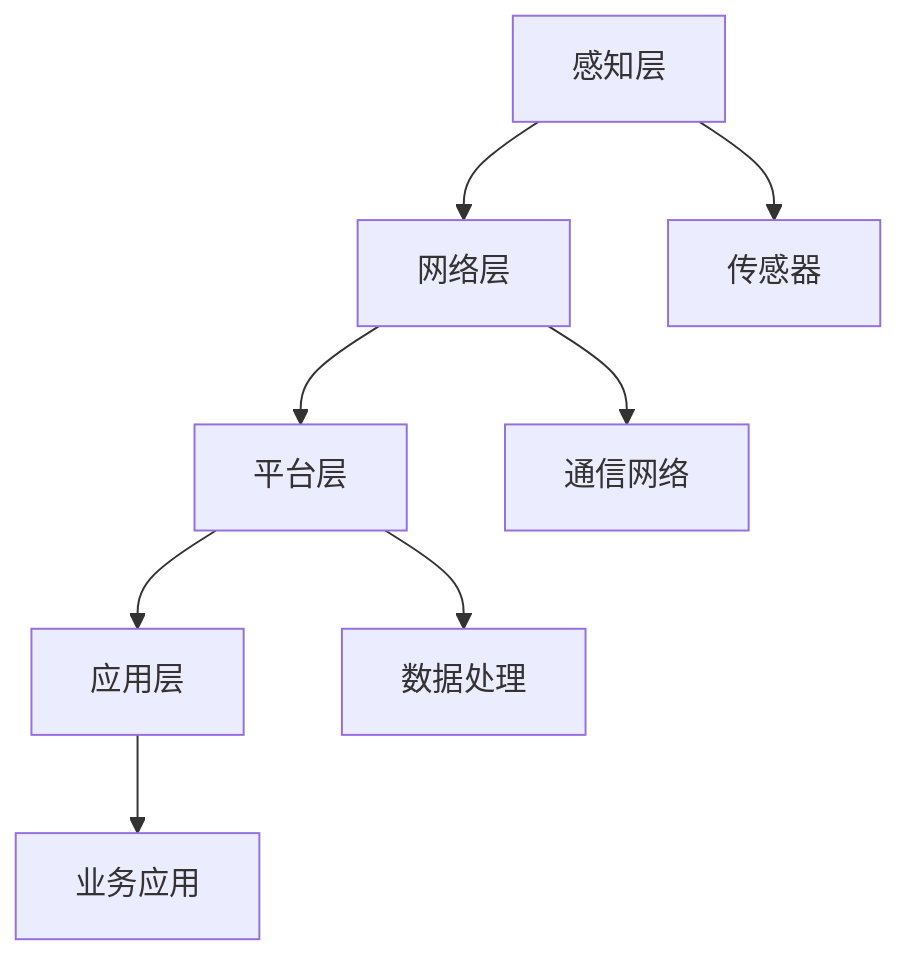
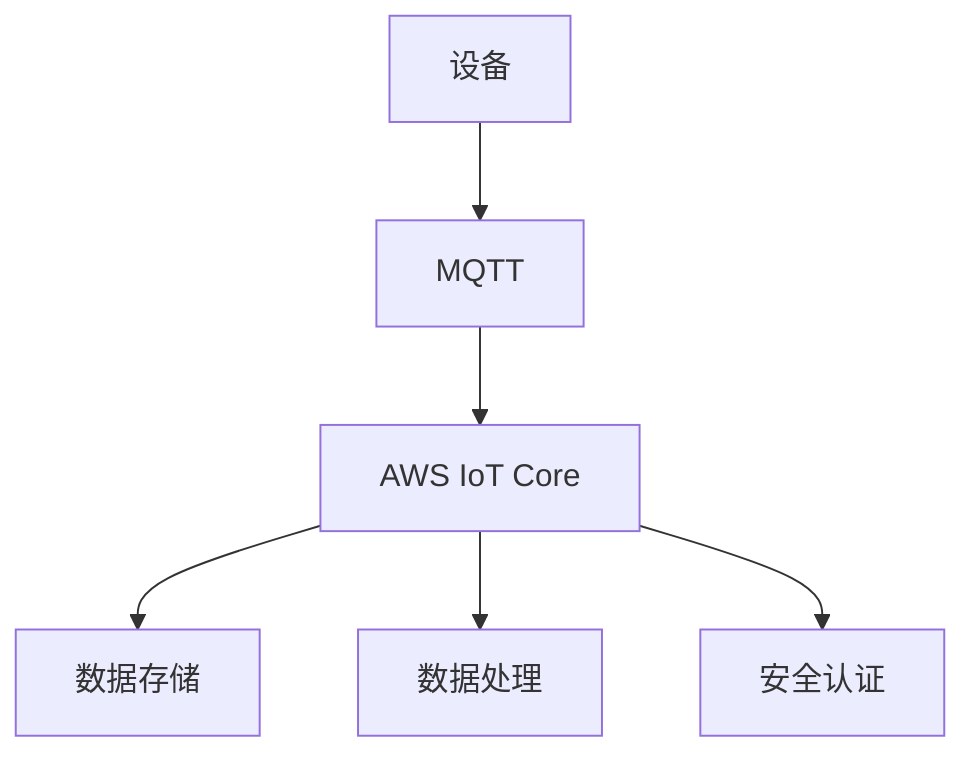
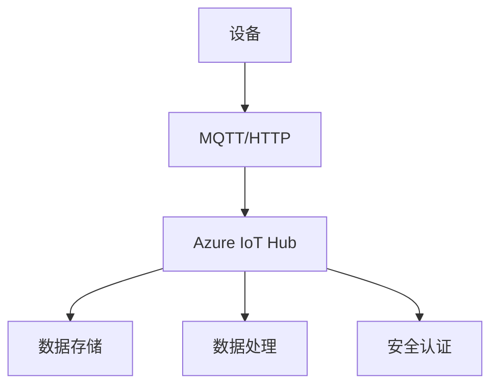
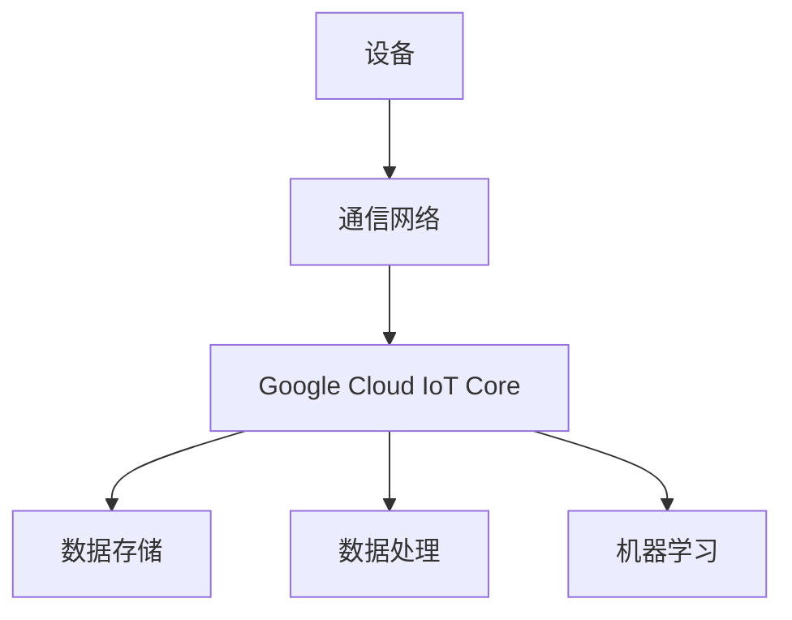
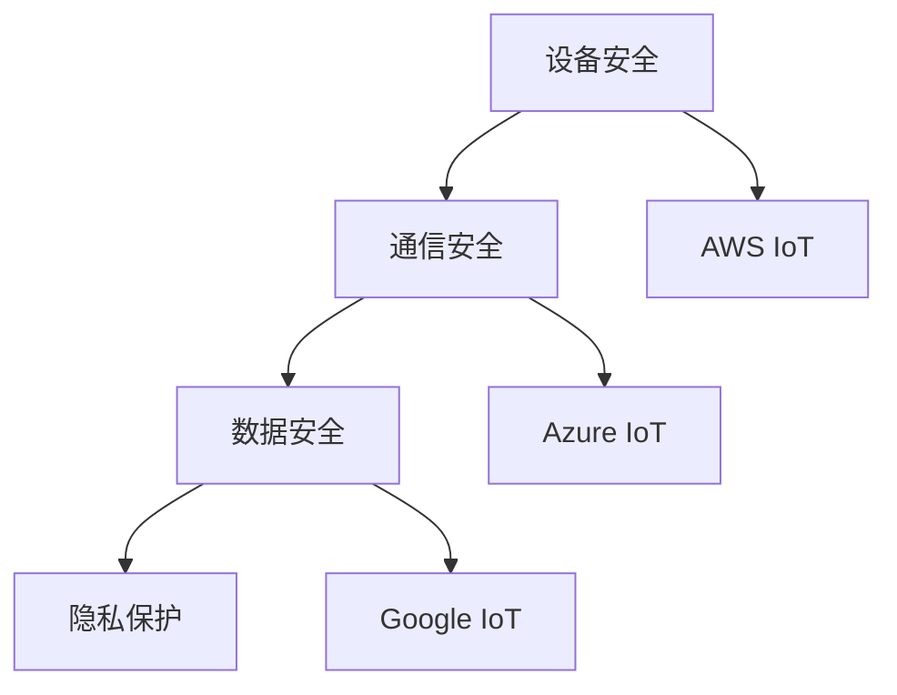
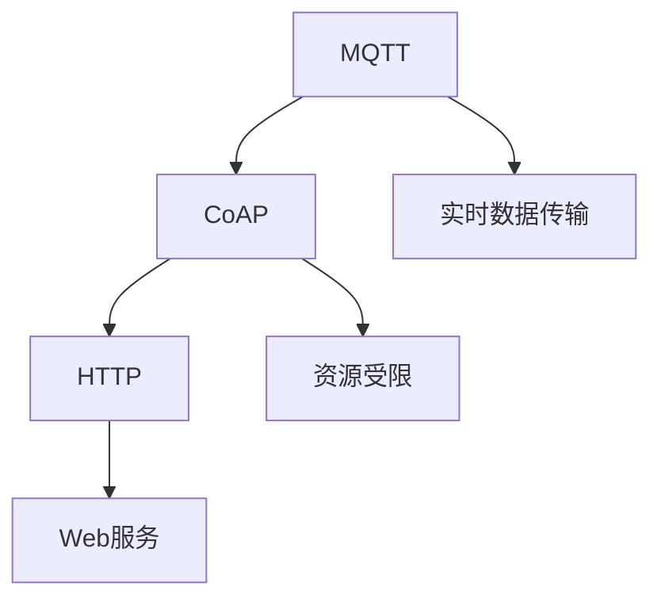
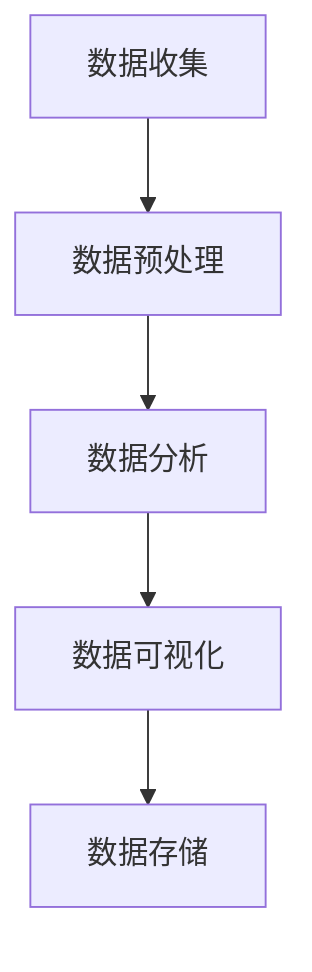

                 

### 文章标题

《物联网平台比较：AWS IoT、Azure IoT 和 Google IoT》

### 文章关键词

- 物联网平台
- AWS IoT
- Azure IoT
- Google IoT
- 数据处理
- 安全性
- 可扩展性
- 使用场景

### 文章摘要

本文将深入比较AWS IoT、Azure IoT和Google IoT这三个主流物联网平台，分析它们的定义、架构、核心功能和特性，以及它们在智能家居、智慧城市和工业物联网中的应用。通过对比这些平台的处理算法、安全性、可扩展性和具体项目实战，我们旨在为读者提供全面的物联网平台最佳实践和未来发展展望。

---

#### 第一部分：物联网平台概述

### 第1章：物联网基础

#### 1.1 物联网的定义与架构

物联网（Internet of Things，IoT）是指通过传感器、网络、云计算等技术，将各种物理设备、家用电器、交通工具等连接到互联网上，实现信息交换和智能化的系统。物联网的架构通常包括感知层、网络层、平台层和应用层。

**核心概念与联系**

**Mermaid 流程图：**



#### 1.2 AWS IoT 平台

**AWS IoT 平台概述**

AWS IoT 是亚马逊提供的物联网解决方案，旨在连接各种设备和应用，收集和分析设备数据，提供安全的设备管理功能。

**AWS IoT 平台的功能与特性**

- **设备管理**：支持设备注册、监控和远程配置。
- **消息传递**：提供可靠的消息传输机制，确保数据的安全传输。
- **数据存储**：提供数据存储和检索服务，便于后续分析和处理。

**AWS IoT 平台的架构与原理**

**Mermaid 流程图：**



#### 1.3 Azure IoT 平台

**Azure IoT 平台概述**

Azure IoT 是微软提供的物联网平台，旨在帮助企业构建智能设备、收集和分析数据、实现设备管理，并提供安全的连接。

**Azure IoT 平台的功能与特性**

- **设备管理**：提供设备注册、监控和配置服务。
- **数据收集**：支持多种数据传输协议，如MQTT、HTTP等。
- **数据分析和存储**：提供数据存储和分析工具，便于决策支持。

**Azure IoT 平台的架构与原理**

**Mermaid 流程图：**



#### 1.4 Google IoT 平台

**Google IoT 平台概述**

Google IoT 是谷歌提供的物联网解决方案，通过Google Cloud Platform（GCP）提供设备连接、数据存储、分析和机器学习功能。

**Google IoT 平台的功能与特性**

- **设备连接**：支持多种连接方式，如Wi-Fi、蓝牙、蜂窝网络等。
- **数据存储**：利用Google Cloud Storage 存储数据。
- **数据处理**：提供数据分析和机器学习工具。

**Google IoT 平台的架构与原理**

**Mermaid 流程图：**



---

接下来，我们将继续深入分析这三个物联网平台的核心算法原理、数学模型和具体项目实战，以帮助读者更好地理解和应用这些技术。在接下来的章节中，我们将逐步探讨数据处理、安全性和可扩展性等重要方面。

---

#### 第二部分：平台核心概念与联系

### 第2章：核心概念与联系

在深入比较AWS IoT、Azure IoT和Google IoT这三个物联网平台之前，我们需要明确它们的核心概念和联系。在本章中，我们将重点介绍物联网安全、通信协议和数据处理等核心概念，并利用Mermaid流程图来展示各概念之间的联系。

#### 2.1 物联网安全

物联网安全是确保物联网系统在数据传输、存储和处理过程中不受恶意攻击和未授权访问的关键。物联网安全的核心挑战包括设备安全、通信安全、数据安全和隐私保护。

**物联网安全的关键挑战**

1. **设备安全**：确保设备免受恶意软件和未授权访问的攻击。
2. **通信安全**：保护数据在传输过程中不被窃取或篡改。
3. **数据安全**：确保数据在存储和传输过程中的完整性和机密性。
4. **隐私保护**：防止个人隐私数据泄露。

**物联网安全解决方案比较**

- **AWS IoT**：提供设备证书、设备监控和加密通信等安全功能。
- **Azure IoT**：提供设备身份认证、加密通信和数据加密存储等安全机制。
- **Google IoT**：利用Google Cloud的安全特性，如加密、访问控制和审计跟踪。

**Mermaid 流程图：**



#### 2.2 物联网通信协议

物联网通信协议是确保设备之间有效、可靠地进行数据传输的技术。常见的物联网通信协议包括MQTT、CoAP和HTTP等。

**物联网通信协议概述**

1. **MQTT**：轻量级消息队列协议，适用于低带宽、高延迟的物联网环境。
2. **CoAP**：基于IP的约束应用协议，适用于资源受限的物联网设备。
3. **HTTP**：超文本传输协议，适用于互联网应用，但在物联网中主要用于设备管理。

**常见物联网通信协议比较**

- **MQTT**：适用于实时数据传输，但消息量较大。
- **CoAP**：适用于资源受限的设备，但传输速度较慢。
- **HTTP**：适用于复杂的Web服务，但通信开销较大。

**物联网通信协议的选择策略**

- 根据设备性能、通信环境、数据传输需求等因素来选择合适的通信协议。

**Mermaid 流程图：**



#### 2.3 物联网数据处理

物联网数据处理是确保物联网系统能够有效收集、存储、分析和利用数据的关键环节。数据处理包括数据预处理、数据分析、数据可视化和数据存储等步骤。

**物联网数据处理需求**

- **数据预处理**：去除噪声、异常值和重复数据。
- **数据分析**：识别数据中的模式和趋势，为决策提供支持。
- **数据可视化**：将数据分析结果以图表形式展示，便于理解和决策。
- **数据存储**：存储大量的物联网数据，便于后续分析和查询。

**物联网数据处理流程**

- **数据收集**：通过传感器和设备收集原始数据。
- **数据预处理**：清洗、转换和归一化数据。
- **数据分析**：使用统计分析和机器学习算法分析数据。
- **数据可视化**：将分析结果可视化，便于用户理解和决策。

**物联网数据处理算法比较**

- **传统算法**：如统计学、线性回归等，适用于简单数据分析。
- **机器学习算法**：如分类、聚类、回归等，适用于复杂的数据分析和预测。

**Mermaid 流程图：**



---

通过本章的介绍，我们了解了物联网平台的核心概念和联系。在接下来的章节中，我们将深入探讨AWS IoT、Azure IoT和Google IoT这三个物联网平台的核心算法原理、数学模型和具体项目实战，以帮助读者更好地理解和应用这些技术。

---

#### 第三部分：平台核心算法原理讲解

### 第3章：平台核心算法原理讲解

在深入了解物联网平台后，我们需要进一步探讨其核心算法原理。在本章中，我们将详细讲解AWS IoT、Azure IoT和Google IoT平台的核心数据处理算法、模型训练算法以及预测与决策算法。通过伪代码和数学模型的展示，我们将帮助读者理解这些算法的原理和应用。

#### 3.1 数据处理算法

数据处理是物联网平台的核心任务之一。它包括数据预处理、数据分析和数据可视化等步骤。

**3.1.1 数据预处理算法**

数据预处理是确保数据质量、提高分析效果的关键步骤。以下是一个简单的伪代码示例，用于说明数据预处理的基本过程：

```python
# 数据预处理伪代码
function data_preprocessing(data):
    # 清洗数据
    clean_data = remove_noise(data)
    # 转换数据
    converted_data = convert_data(clean_data)
    # 归一化数据
    normalized_data = normalize_data(converted_data)
    return normalized_data
```

**3.1.2 数据分析算法**

数据分析是利用统计方法和机器学习算法从数据中提取有用信息的过程。以下是一个简单的数据分析伪代码示例：

```python
# 数据分析伪代码
function data_analysis(data):
    # 计算均值
    mean_value = calculate_mean(data)
    # 计算标准差
    std_deviation = calculate_std_deviation(data)
    # 执行聚类分析
    clusters = clustering_algorithm(data)
    return mean_value, std_deviation, clusters
```

**3.1.3 数据可视化算法**

数据可视化是将数据分析结果以图表形式展示，便于用户理解和决策。以下是一个简单数据可视化伪代码示例：

```python
# 数据可视化伪代码
function data_visualization(data, analysis_results):
    # 绘制均值和标准差图表
    plot_mean_std(data, analysis_results)
    # 绘制聚类结果图表
    plot_clusters(analysis_results)
```

#### 3.2 模型训练算法

模型训练是利用历史数据构建预测模型的过程。在本节中，我们将介绍模型选择、训练数据预处理以及模型训练和评估等步骤。

**3.2.1 模型选择**

模型选择是选择适合数据集的最佳机器学习模型的过程。以下是一个简单的模型选择伪代码示例：

```python
# 模型选择伪代码
function model_selection(train_data, test_data):
    # 训练不同模型
    models = [LinearRegression(), DecisionTree(), RandomForest()]
    # 评估模型性能
    performance = evaluate_models(models, train_data, test_data)
    # 选择最佳模型
    best_model = select_best_model(models, performance)
    return best_model
```

**3.2.2 训练数据预处理**

训练数据预处理是确保训练数据质量和模型性能的关键步骤。以下是一个简单的训练数据预处理伪代码示例：

```python
# 训练数据预处理伪代码
function train_data_preprocessing(train_data):
    # 清洗数据
    clean_train_data = remove_noise(train_data)
    # 特征工程
    engineered_train_data = feature_engineering(clean_train_data)
    # 归一化数据
    normalized_train_data = normalize_data(engineered_train_data)
    return normalized_train_data
```

**3.2.3 模型训练与评估**

模型训练和评估是构建和验证预测模型的过程。以下是一个简单的模型训练和评估伪代码示例：

```python
# 模型训练与评估伪代码
function model_training_and_evaluation(train_data, test_data, model):
    # 训练模型
    trained_model = train_model(model, train_data)
    # 评估模型
    evaluation_results = evaluate_model(trained_model, test_data)
    return trained_model, evaluation_results
```

#### 3.3 预测与决策算法

预测与决策算法是利用训练好的模型对未知数据进行预测和决策的过程。在本节中，我们将介绍预测算法、决策算法以及预测与决策算法在实际应用中的效果评估。

**3.3.1 预测算法**

预测算法是利用历史数据预测未来数据的方法。以下是一个简单的预测算法伪代码示例：

```python
# 预测算法伪代码
function predict_data(model, new_data):
    # 预测新数据
    prediction = model.predict(new_data)
    return prediction
```

**3.3.2 决策算法**

决策算法是利用预测结果进行决策的方法。以下是一个简单的决策算法伪代码示例：

```python
# 决策算法伪代码
function make_decision(prediction, decision_rules):
    # 应用决策规则
    decision = apply_decision_rules(prediction, decision_rules)
    return decision
```

**3.3.3 预测与决策算法在实际应用中的效果评估**

预测与决策算法在实际应用中的效果评估是确保模型和决策有效性的关键步骤。以下是一个简单的效果评估伪代码示例：

```python
# 预测与决策算法效果评估伪代码
function evaluate_performance(predictions, actual_values, decision_rules):
    # 计算预测准确率
    accuracy = calculate_accuracy(predictions, actual_values)
    # 计算决策成功率
    success_rate = calculate_success_rate(predictions, decision_rules)
    return accuracy, success_rate
```

---

通过本章的介绍，我们详细讲解了AWS IoT、Azure IoT和Google IoT平台的核心算法原理。在接下来的章节中，我们将通过具体项目实战，展示这些算法在实际应用中的效果。

---

#### 第四部分：数学模型和数学公式

### 第4章：数学模型和数学公式

在物联网平台的核心算法原理讲解中，我们使用了伪代码来阐述算法的基本步骤。然而，为了更深入地理解这些算法，我们需要借助数学模型和数学公式。在本章中，我们将详细介绍数据处理算法、模型训练算法以及预测与决策算法的数学模型和数学公式，并通过具体示例来说明这些公式在实际应用中的作用。

#### 4.1 数据处理算法的数学模型

数据处理算法包括数据预处理、数据分析和数据可视化。这些算法的数学模型分别用于描述数据清洗、特征提取和数据呈现的方法。

**4.1.1 数据预处理数学模型**

数据预处理的核心任务是去除噪声、异常值和重复数据。以下是一个简单的数学模型，用于描述数据清洗的过程：

$$
X_{clean} = X_{raw} - \text{Noise}
$$

其中，$X_{raw}$表示原始数据集，$\text{Noise}$表示噪声数据。通过去除噪声，我们得到更干净的数据集$X_{clean}$。

**4.1.2 数据分析数学模型**

数据分析的目的是从数据中提取有用信息。以下是一个简单的数学模型，用于描述特征提取的过程：

$$
f(X) = X \cdot W + b
$$

其中，$X$表示输入数据，$W$表示权重矩阵，$b$表示偏置。通过这个线性变换，我们可以将原始数据转换为新的特征空间，从而便于后续分析。

**4.1.3 数据可视化数学模型**

数据可视化是将数据分析结果以图表形式展示，以便用户理解和决策。以下是一个简单的数学模型，用于描述数据呈现的过程：

$$
Z = f(g(X))
$$

其中，$X$表示输入数据，$g(X)$表示特征提取函数，$f(Z)$表示可视化函数。通过这个复合函数，我们可以将数据分析结果转化为易于理解的可视化形式。

#### 4.2 模型训练数学模型

模型训练是利用历史数据构建预测模型的过程。模型训练的数学模型主要涉及模型选择、训练数据预处理以及模型训练和评估等步骤。

**4.2.1 模型选择数学模型**

模型选择是选择适合数据集的最佳机器学习模型的过程。以下是一个简单的数学模型，用于描述模型选择的过程：

$$
\text{Minimize} \; J(\theta) = \frac{1}{2m} \sum_{i=1}^{m} (h_{\theta}(x^{(i)}) - y^{(i)})^2
$$

其中，$m$表示数据集大小，$h_{\theta}(x)$表示假设函数，$\theta$表示模型参数。通过最小化损失函数$J(\theta)$，我们可以找到最佳模型参数$\theta$。

**4.2.2 训练数据预处理数学模型**

训练数据预处理是确保训练数据质量和模型性能的关键步骤。以下是一个简单的数学模型，用于描述数据预处理的过程：

$$
X_{preprocessed} = X_{raw} \cdot \text{Normalization}(X_{raw})
$$

其中，$X_{raw}$表示原始数据集，$\text{Normalization}(X_{raw})$表示归一化函数。通过归一化处理，我们可以使数据集中各特征的值处于相似范围内，从而提高模型训练效果。

**4.2.3 模型训练与评估数学模型**

模型训练和评估是构建和验证预测模型的过程。以下是一个简单的数学模型，用于描述模型训练和评估的过程：

$$
\text{Training} : \; \text{Minimize} \; J(\theta) = \frac{1}{2m} \sum_{i=1}^{m} (h_{\theta}(x^{(i)}) - y^{(i)})^2 \\
\text{Evaluation} : \; \text{Measure} \; \text{Performance} \; using \; metrics \; like \; Accuracy, Precision, Recall, F1-Score
$$

其中，$J(\theta)$表示损失函数，$h_{\theta}(x)$表示假设函数，$\theta$表示模型参数。通过最小化损失函数并使用评估指标，我们可以评估模型的性能。

#### 4.3 预测与决策算法的数学模型

预测与决策算法是利用训练好的模型对未知数据进行预测和决策的过程。这些算法的数学模型主要涉及预测模型和决策规则。

**4.3.1 预测算法的数学模型**

预测算法是利用历史数据预测未来数据的方法。以下是一个简单的数学模型，用于描述预测过程：

$$
\hat{y} = h_{\theta}(x)
$$

其中，$\hat{y}$表示预测值，$h_{\theta}(x)$表示假设函数，$\theta$表示模型参数。通过假设函数，我们可以预测新数据的值。

**4.3.2 决策算法的数学模型**

决策算法是利用预测结果进行决策的方法。以下是一个简单的数学模型，用于描述决策过程：

$$
d = \text{DecisionRule}(\hat{y}, y_{actual})
$$

其中，$d$表示决策，$\hat{y}$表示预测值，$y_{actual}$表示实际值。通过决策规则，我们可以根据预测值和实际值做出相应的决策。

**4.3.3 预测与决策算法在实际应用中的效果评估**

预测与决策算法在实际应用中的效果评估是确保模型和决策有效性的关键步骤。以下是一个简单的数学模型，用于描述效果评估的过程：

$$
\text{Performance} = \frac{\text{CorrectPredictions}}{\text{TotalPredictions}}
$$

其中，$\text{Performance}$表示性能指标，$\text{CorrectPredictions}$表示正确预测的数量，$\text{TotalPredictions}$表示总预测数量。通过计算性能指标，我们可以评估预测和决策算法的实际效果。

---

通过本章的介绍，我们详细讲解了数据处理算法、模型训练算法以及预测与决策算法的数学模型和数学公式。这些数学模型和公式有助于我们更好地理解物联网平台的核心算法原理，并在实际应用中取得更好的效果。

---

#### 第五部分：项目实战

### 第5章：项目实战

在了解了AWS IoT、Azure IoT和Google IoT平台的核心算法原理和数学模型后，我们需要通过实际项目来验证这些算法的应用效果。在本章中，我们将介绍智能家居项目和工业物联网项目的开发背景、开发环境搭建、源代码实现以及代码解读与分析。

#### 5.1 智能家居项目

**5.1.1 项目背景与目标**

智能家居项目旨在通过物联网技术实现家庭设备的智能化控制，提高家庭生活的便利性和舒适度。项目目标包括实现智能照明、智能安防、智能家电控制等功能。

**5.1.2 项目开发环境搭建**

在开发智能家居项目时，我们选择以下开发环境：

- **硬件**：ESP8266模块、Arduino Uno、温湿度传感器、门磁传感器等。
- **软件**：Arduino IDE、AWS IoT CLI、AWS Management Console、Node-RED。

**5.1.3 项目源代码实现**

智能家居项目的核心代码实现分为以下几个部分：

1. **设备端代码**（基于Arduino IDE）：
   ```cpp
   #include <WiFi.h>
   #include <AWSIoT.h>

   // 设备配置
   const char* ssid = "your_wifiSSID";
   const char* password = "your_wifiPASSWORD";
   const char* awsIoT_ENDPOINT = "your_aws_iot_endpoint";
   const char* awsIoT_THING_NAME = "your_thing_name";
   const char* awsIoT_CERTIFICATE_FILE = "your_certificate_file";
   const char* awsIoT_PRIVATE_KEY_FILE = "your_private_key_file";
   const char* awsIoT_ROOT_CA_FILE = "your_root_ca_file";

   void setup() {
       Serial.begin(9600);
       connectToWiFi();
       connectToAWSIoT();
   }

   void loop() {
       sendTemperatureAndHumidity();
       delay(5000);
   }

   void connectToWiFi() {
       // 连接到Wi-Fi网络
   }

   void connectToAWSIoT() {
       // 连接到AWS IoT平台
   }

   void sendTemperatureAndHumidity() {
       // 发送温度和湿度数据到AWS IoT平台
   }
   ```

2. **AWS IoT 平台配置**：
   - 在AWS Management Console中创建IoT设备、策略和证书。
   - 配置设备连接和消息传输。

**5.1.4 项目代码解读与分析**

在智能家居项目中，设备端代码通过WiFi连接到互联网，然后连接到AWS IoT平台。通过MQTT协议，设备可以发送温度和湿度数据到AWS IoT平台，从而实现智能家居设备的远程监控和控制。代码中的`connectToWiFi`函数负责连接到Wi-Fi网络，`connectToAWSIoT`函数负责连接到AWS IoT平台，`sendTemperatureAndHumidity`函数负责发送设备数据。

---

#### 5.2 工业物联网项目

**5.2.1 项目背景与目标**

工业物联网项目旨在通过物联网技术实现工业设备的智能化监控和管理，提高生产效率和安全性。项目目标包括实现设备状态监控、远程故障诊断、能耗管理等功能。

**5.2.2 项目开发环境搭建**

在开发工业物联网项目时，我们选择以下开发环境：

- **硬件**：Raspberry Pi、工业温湿度传感器、工业压力传感器、以太网模块。
- **软件**：Python 3、Azure IoT SDK、Azure Management Console、Power BI。

**5.2.3 项目源代码实现**

工业物联网项目的核心代码实现分为以下几个部分：

1. **设备端代码**（基于Python）：
   ```python
   import azure.iot.hub.from_pybytes
   import azure.iot.hub.iothubclient
   import azure.iot.hub.iothubdeviceclient
   import azure.iot.hub.transport.aiohttp

   device_id = "your_device_id"
   connection_string = "your_connection_string"

   def send_data(data):
       client = azure.iot.hub.iothubclient.IoTHubClient.create_from_connection_string(connection_string, azure.iot.hub.transport.aiohttp.AioHttpTransport())
       client.send_message(azure.iot.hub.from_pybytes(json.dumps(data).encode('utf-8')), device_id=device_id)

   if __name__ == "__main__":
       while True:
           temperature = read_temperature()
           humidity = read_humidity()
           pressure = read_pressure()
           data = {
               "temperature": temperature,
               "humidity": humidity,
               "pressure": pressure
           }
           send_data(data)
           time.sleep(10)
   ```

2. **Azure IoT 平台配置**：
   - 在Azure Management Console中创建IoT设备、IoT设备集线和IoT解决方案。
   - 配置设备连接和消息传输。

**5.2.4 项目代码解读与分析**

在工业物联网项目中，设备端代码通过Raspberry Pi连接到互联网，然后连接到Azure IoT平台。通过HTTP协议，设备可以发送温度、湿度和压力数据到Azure IoT平台，从而实现工业设备的远程监控和管理。代码中的`send_data`函数负责发送设备数据，`read_temperature`、`read_humidity`和`read_pressure`函数分别负责读取温度、湿度和压力传感器数据。

---

通过智能家居项目和工业物联网项目的实际开发，我们可以看到AWS IoT、Azure IoT平台的核心算法原理和数学模型在实际项目中的应用效果。这些项目不仅验证了物联网平台的技术实力，也为读者提供了实用的开发经验和技巧。

---

#### 第六部分：最佳实践与展望

### 第6章：最佳实践与展望

在深入了解和比较AWS IoT、Azure IoT和Google IoT平台后，我们可以总结出一套物联网平台最佳实践，并探讨这些平台的发展趋势和未来展望。

#### 6.1 物联网平台最佳实践

**6.1.1 平台选择原则**

在选择物联网平台时，应考虑以下原则：

1. **业务需求**：根据实际业务需求，选择最适合的平台。
2. **技术能力**：评估平台的技术能力，确保能够满足项目的需求。
3. **安全性**：优先选择安全性较高的平台，确保数据安全和设备安全。
4. **可扩展性**：考虑平台的可扩展性，以便在未来业务增长时能够顺利扩展。
5. **成本效益**：综合考虑平台成本和预期效益，选择性价比最高的平台。

**6.1.2 平台应用案例分享**

以下是一些成功的物联网平台应用案例：

1. **智能家居**：通过AWS IoT平台实现家庭设备的智能化控制，提高生活便利性。
2. **智慧城市**：利用Azure IoT平台实现城市设备监控、环境监测和能源管理。
3. **工业物联网**：通过Google IoT平台实现工业设备的远程监控、故障诊断和预测性维护。

**6.1.3 平台优化策略**

为了提高物联网平台的性能和稳定性，可以采取以下优化策略：

1. **性能调优**：针对数据处理、消息传输和存储等环节进行性能调优。
2. **安全性增强**：加强平台的安全性，如引入多重认证、数据加密和访问控制。
3. **扩展性提升**：优化平台架构，提高系统的可扩展性，以便支持更多的设备和服务。
4. **成本控制**：通过优化资源使用和降低运营成本，提高平台的成本效益。

#### 6.2 物联网平台发展趋势

物联网平台的发展趋势受到多种技术因素的影响，主要包括以下方面：

1. **5G技术**：5G技术的引入将显著提高物联网设备的连接速度和网络容量，推动物联网应用的创新和发展。
2. **人工智能（AI）**：AI技术的应用将使物联网平台具备更强的数据处理和分析能力，提高决策的准确性和效率。
3. **边缘计算**：边缘计算技术的发展将减轻中心服务器的压力，提高物联网系统的响应速度和实时性。
4. **开放平台生态**：随着物联网应用场景的扩大，开放平台生态将成为趋势，促进不同平台之间的互操作性和数据共享。

**6.2.1 5G与物联网平台**

5G技术对物联网平台的影响主要体现在以下几个方面：

1. **高速连接**：5G技术提供的高速连接将显著提高物联网设备的通信速度，降低延迟，提升用户体验。
2. **低功耗**：5G技术的低功耗特性将有助于延长物联网设备的电池寿命，提高设备的稳定性。
3. **大规模连接**：5G技术支持大规模设备连接，有助于实现更广泛的物联网应用场景。

**6.2.2 AI与物联网平台**

AI技术对物联网平台的影响主要体现在以下几个方面：

1. **数据处理**：AI技术能够高效地处理海量物联网数据，提取有用信息，提升数据分析能力。
2. **智能决策**：AI技术可以使物联网平台具备智能决策能力，提高系统的自动化水平和响应速度。
3. **个性化服务**：AI技术可以根据用户行为数据提供个性化服务，提升用户体验。

**6.2.3 物联网平台生态建设**

物联网平台生态建设是推动物联网应用发展的重要环节。以下是一些关键策略：

1. **开放接口**：提供开放的接口和协议，促进不同平台之间的互操作性和数据共享。
2. **合作伙伴关系**：建立广泛的合作伙伴关系，共同推动物联网平台的发展。
3. **标准化**：积极参与物联网标准化工作，推动物联网技术的普及和应用。

---

通过最佳实践和未来展望的探讨，我们可以看到物联网平台在技术发展、业务创新和生态建设等方面具有广阔的前景。随着5G、AI等新技术的应用，物联网平台将不断创新和进化，为各个领域带来更多的机遇和挑战。

---

### 附录

#### 附录 A：参考资料与扩展阅读

**A.1 标准化组织与标准**

- **IEEE 802.15.4**：无线个人局域网标准，适用于低速率无线通信。
- **IETF CoAP**：约束应用协议，适用于资源受限的物联网设备。
- **OMA LWM2M**：轻量机器对机器通信协议，适用于物联网设备管理。

**A.2 相关技术论文**

- **AWS IoT 白皮书**：提供AWS IoT平台的详细技术介绍。
- **Azure IoT 白皮书**：提供Azure IoT平台的详细技术介绍。
- **Google IoT 白皮书**：提供Google IoT平台的详细技术介绍。

**A.3 开源项目**

- **Eclipse Kura**：用于物联网设备的开源中间件平台。
- **Node-RED**：用于数据流的图形化工具，适用于物联网应用。
- **Thingsboard**：用于物联网设备监控和管理的开源平台。

通过以上附录，读者可以进一步了解物联网平台的相关技术和应用，为实际项目提供参考和借鉴。

---

#### 作者信息

**作者：AI天才研究院/AI Genius Institute & 禅与计算机程序设计艺术 /Zen And The Art of Computer Programming**

---

通过本文的详细分析和讲解，我们深入了解了AWS IoT、Azure IoT和Google IoT这三个主流物联网平台的核心概念、算法原理、数学模型以及实际应用。希望本文能够为读者提供有价值的参考和启示，助力物联网技术的发展和应用。在未来的研究中，我们期待能够继续探讨物联网平台的最新动态和发展趋势，为读者带来更多有价值的内容。

